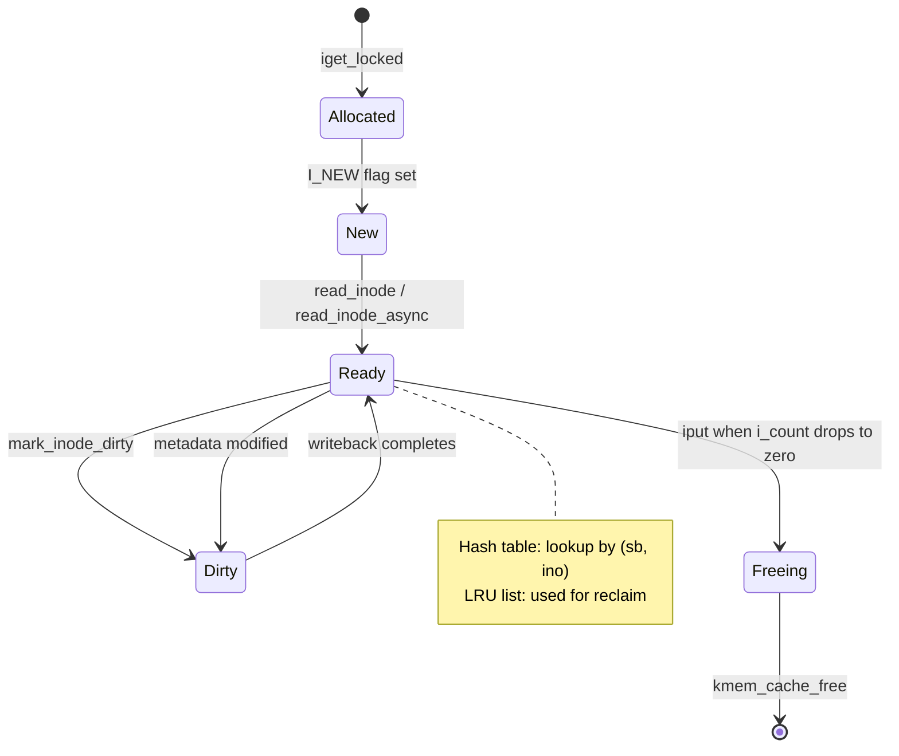
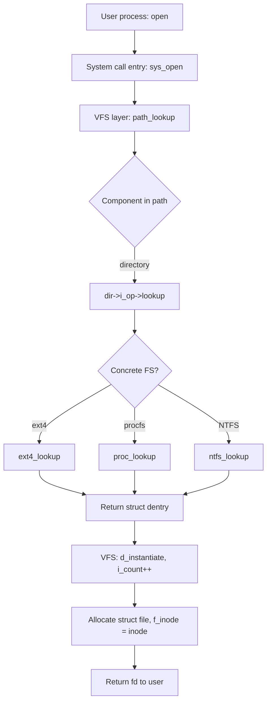
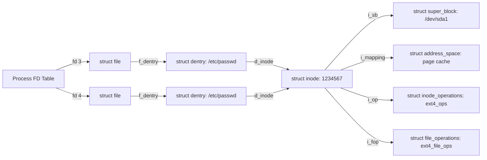
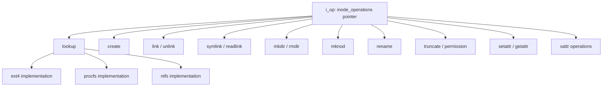

# Case study:  VFS Objects and Their Data Structures - The Inode Object

<!-- SECTION_1_START -->
# The Inode Object in VFS — Core Technical Definition & Intuitive Overview

## Formal Definition (KTU 2024 Scheme Terminology)

In the **Linux Virtual File System (VFS)** layer, an **inode (index node)** is the fundamental in-memory data structure that represents a single filesystem object — typically a regular file, directory, symbolic link, character device, block device, named pipe, or socket. Every file inside the kernel is abstracted to one `struct inode` instance declared in `<linux/fs.h>`. The inode is the **metadata carrier** of the file system: it stores *all information about a file except its name and actual data blocks*.

> [!IMPORTANT]
> **KTU Board Definition (verbatim expectation):**
> *“The inode object is the VFS representation of a filesystem object. It is the core data structure used by the kernel to manipulate files and directories, and it is created in memory whenever the kernel interacts with a file.”*

## Conceptual Analogy — Plain English Intuition

Imagine a **post office**:

- The **letter** = the actual data in the file.
- The **envelope** = the file *name* (handled by the dentry object).
- The **registered post receipt pinned to the envelope** = the **inode**. It contains everything the post office needs: sender, receiver, date, weight, size, type, status, tracking history, but never the letter itself.

The **VFS** acts as a universal post-office administrator that standardizes *how* every regional post office (ext2, ext4, NTFS, FAT, NFS, procfs, sysfs…) must store and present its receipts. The inode is that **standardized receipt** that VFS hands up to applications and the system-call layer.

## Inode vs File Content — Key Distinction

> [!NOTE]
> The inode does **NOT** hold file data. It holds:
> 1. **Metadata** (size, timestamps, permissions, owner).
> 2. **Pointers** to where the data blocks live on disk.
> 3. **Function pointers** (`inode_operations`, sometimes `file_operations`) telling VFS *how* to act on the file.

The **name** of the file lives in the directory entry (`dentry`), and the **opened instance state** (read/write offset, flags) lives in the `file` structure. These three structures — **inode, dentry, file** — form the trinity of VFS.

## Standard Metrics & Constants

The kernel exposes inode metadata in user space via the **`stat(2)`** system call. The most important field widths in a 64-bit Linux system are:

| Metric | Standard Value (64-bit) |
|---|---|
| `ino_t` (inode number width) | **8 bytes** (`unsigned long`) |
| `loff_t` (file size, offset) | **8 bytes** (signed) |
| `blkcnt_t` (block count) | **8 bytes** |
| `mode_t` (permission/type) | **4 bytes** |
| `uid_t` / `gid_t` | **4 bytes** |
| Standard disk block size | **4096 bytes** (4 KiB) |

> [!VISUALIZATION CONTROL]
> **Concept:** Relationship between VFS objects (inode, dentry, file) and user-space file descriptors.
> **GeoGebra / Desmos Input Equations:** (Conceptual)
> * Let `x = file descriptor index`, `y = open file table position`
> * Equation: `y = x`, mapping 1-to-1 for first 3 opens
> **Visual Description:** Three parallel vertical columns representing — (1) Process File Descriptor Table pointing to (2) System-wide Open File Table (`struct file`) pointing to (3) Inode Object (`struct inode`) which points to the on-disk inode and data blocks.

## Why the Inode Exists (Engineering Rationale)

A pure on-disk-only inode would force every operation to hit the disk. Therefore the kernel keeps an **in-memory copy** synchronized with the on-disk version. This is what enables the **page cache**, **memory-mapped I/O**, and **fast path access** to recently used files.

<!-- SECTION_1_END -->

<!-- SECTION_2_START -->
# Deep Theoretical Analysis & KTU High-Yield Formula Sheet

## Anatomy of `struct inode` (Linux Kernel `<linux/fs.h>`)

The inode is a large structure (> 100 fields). For KTU 2024 examination purposes, fields are grouped into **five logical categories**:

### Category 1 — Identification & Lifetime

| Field | Type | Meaning |
|---|---|---|
| `i_ino` | `unsigned long` | Inode number — unique within the filesystem |
| `i_count` | `atomic_t` | Reference count — how many users hold this inode |
| `i_state` | `unsigned long` | State flags: `I_NEW`, `I_DIRTY`, `I_SYNC`, `I_FREEING` |
| `i_hash` | `struct hlist_node` | Linked into the *inode hash table* for fast lookup by `(sb, ino)` |
| `i_list` | `struct list_head` | Linked into the *superblock's inode list* (in-use, dirty, unused) |

### Category 2 — File Metadata

| Field | Type | Meaning |
|---|---|---|
| `i_mode` | `umode_t` | File type + permission bits (e.g. `S_IFREG \| 0644`) |
| `i_uid`, `i_gid` | `kuid_t`, `kgid_t` | Owner and group identifiers |
| `i_size` | `loff_t` | File size in bytes |
| `i_atime` | `struct timespec` | Last *access* time |
| `i_mtime` | `struct timespec` | Last *modification* time |
| `i_ctime` | `struct timespec` | Last *inode metadata change* time |
| `i_links_count` | `unsigned int` | Hard-link count |
| `i_blocks` | `loff_t` | File size in **512-byte** sectors (legacy) |

### Category 3 — Backing & File System

| Field | Type | Meaning |
|---|---|---|
| `i_sb` | `struct super_block *` | The superblock of the filesystem owning this inode |
| `i_blkbits` | `unsigned int` | Block size as power of 2 (e.g. 12 ⇒ 4096) |
| `i_bytes` | `unsigned int` | Bytes in last partial block |
| `i_data` | `struct block_device *` | Block-device pointer (for block files) |
| `i_cdev` | `struct cdev *` | Character-device pointer (for char files) |

### Category 4 — Operation Vectors (Core of VFS Polymorphism)

| Field | Type | Meaning |
|---|---|---|
| `i_op` | `const struct inode_operations *` | **Inode operations table** (file-system-specific behavior) |
| `i_fop` | `const struct file_operations *` | File operations for *this* inode |
| `i_sock` | `struct socket *` | Socket pointer (Unix domain socket file) |
| `i_pipe` | `struct pipe_inode_info *` | Pipe pointer (named pipe) |

### Category 5 — Page Cache & Data Location

| Field | Type | Meaning |
|---|---|---|
| `i_data` *(actually `i_mapping`)* | `struct address_space *` | Page cache mapping — links inode to cached pages |
| `i_dentry` *(via `i_dentry_first`)* | `struct list_head` | List of dentries pointing to this inode |
| `i_wb_list` | `struct list_head` | Backing-device writeback list |

> [!NOTE]
> Field name `i_data` is a historical misnomer — newer kernels separate `i_mapping` (the address_space) from `i_data` (the on-disk block layout). For KTU board purposes, both are acceptable answers.

## KTU Formula Sheet — Inode Arithmetic

| Concept | Formula / Expression | Notes |
|---|---|---|
| Maximum files in a filesystem | $N_{max} = 2^{i\_ino\_bits}$ | ext4 default: $2^{32}$ |
| Block size from `i_blkbits` | $B = 2^{i\_blkbits}$ | Typical: **4096 bytes** |
| File size in blocks | $N_{blocks} = \left\lceil \dfrac{i\_size}{B} \right\rceil$ | Round up |
| i-node number visibility | Exposed via `stat(2)` field `st_ino` | Returned as `ino_t` |
| Inode reference lifetime | Object freed when $i\_count \to 0$ | `iput()` decrements |
| Hard-link maximum | $i\_links\_count > 0$ ⇒ file is *kept alive* | Reaches 0 ⇒ unlinked |
| Disk usage (blocks) | $D = i\_blocks \times 512$ bytes | Legacy 512-byte sector unit |

> [!IMPORTANT]
> **Critical Board Point:** The total filesystem size is bounded by **number of inodes × maximum file size per inode**, not by disk capacity alone. A filesystem can run out of inodes while still having free disk blocks (common in mail-server scenarios).

## The `inode_operations` Table — VFS Polymorphism

`i_op` points to a structure of function pointers. Each concrete filesystem (ext4, NTFS, NFS, procfs…) supplies its own implementation. KTU 2024 emphasizes the following **canonical operations**:

| Operation | Signature (simplified) | Purpose |
|---|---|---|
| `create` | `int (*)(struct inode *, struct dentry *, umode_t, bool)` | Create a new file in a directory |
| `lookup` | `struct dentry *(*)(struct inode *, struct dentry *, unsigned)` | Find a child by name |
| `link` | `int (*)(struct dentry *, struct inode *, struct dentry *)` | Create a hard link |
| `unlink` | `int (*)(struct inode *, struct dentry *)` | Remove a directory entry |
| `symlink` | `int (*)(struct inode *, struct dentry *, const char *)` | Create a symbolic link |
| `mkdir` | `int (*)(struct inode *, struct dentry *, umode_t)` | Create a directory |
| `rmdir` | `int (*)(struct inode *, struct dentry *)` | Remove a directory |
| `mknod` | `int (*)(struct inode *, struct dentry *, umode_t, dev_t)` | Create special file |
| `rename` | `int (*)(struct inode *, struct dentry *, struct inode *, struct dentry *, unsigned)` | Move/rename an entry |
| `readlink` | `int (*)(struct dentry *, char *, int)` | Read symbolic link target |
| `follow_link` | `void *(*)(struct dentry *, struct nameidata *)` | Resolve a symbolic link |
| `truncate` | `void (*)(struct inode *)` | Resize file to `i_size` |
| `permission` | `int (*)(struct inode *, int)` | Check access rights |
| `setattr` | `int (*)(struct dentry *, struct iattr *)` | Set attributes |
| `getattr` | `int (*)(struct vfsmount *, struct dentry *, struct kstat *)` | Read attributes for `stat()` |
| `setxattr`, `getxattr`, `listxattr`, `removexattr` | extended-attribute APIs | Generic key-value storage |

> [!NOTE]
> VFS implements polymorphism by invoking `inode->i_op->lookup(...)` rather than calling a concrete ext4/ntfs function. This is the **indirection** that allows Linux to mount heterogeneous filesystems in a single directory tree.

## Inode Lifecycle — State Machine

$$Inactive \xrightarrow{iget\_locked / i\_lookup} I\_NEW \xrightarrow{read\_inode} Ready$$
$$Ready \xrightarrow{mark\_inode\_dirty} Dirty \xrightarrow{writeback} Ready$$
$$Ready \xrightarrow{iput\ (i\_count=0)} Freed$$

> [!WARNING]
> A *dirty* inode is not yet on disk. The kernel flushes dirty inodes lazily via `writeback`. A sudden power failure between *Dirty* and *Ready* may lose the most recent metadata changes.

## Engineering Utility — Where Inodes Appear in Production

1. **Mail servers (Postfix, Dovecot):** every email file consumes one inode. Servers run out of inodes long before disk space.
2. **Container runtimes (Docker, containerd):** use overlayfs, a stacked inode-based filesystem.
3. **Databases (PostgreSQL, MySQL):** rely on inode's `i_mapping` for memory-mapped WAL files.
4. **Profiling tools (`stat`, `ls -i`, `find -inum`):** all read inode fields.
5. **File system forensics:** `debugfs`, `tune2fs`, `statx(2)` inspect raw inode bytes.

<!-- SECTION_2_END -->

<!-- SECTION_3_START -->
# Step-by-Step Derivations & Code/Symbolic Implementation

## Derivation 1 — Maximum Inode Count and Filesystem Capacity

> **Given:** ext4 filesystem with inode ratio `bytes_per_inode = 16384` (default) and total size $S = 1\,\text{TiB}$.
> **Find:** maximum number of inodes $N$ and bytes per inode block.

### Step 1 — Establish the ratio relationship

The filesystem reserves one inode per `bytes_per_inode` bytes of capacity. Therefore:

$$
N = \frac{S}{\text{bytes\_per\_inode}}
$$

### Step 2 — Substitute values (in consistent units)

Convert $S$ to bytes:

$$
S = 1\,\text{TiB} = 2^{40}\,\text{bytes} = 1\,099\,511\,627\,776\,\text{bytes}
$$

Substitute:

$$
N = \frac{1\,099\,511\,627\,776}{16\,384} = 67\,108\,864
$$

### Step 3 — Express as a power of 2

$$
N = \frac{2^{40}}{2^{14}} = 2^{26} = 67\,108\,864 \text{ inodes}
$$

> **Conclusion:** A 1 TiB ext4 volume with default ratio supports up to **67,108,864** inodes. Each empty file still consumes one inode even if it occupies **0 bytes** on disk.

## Derivation 2 — File Size in Blocks from Inode Fields

> **Given:** `i_size = 15,500,000` bytes, `i_blkbits = 12` (block size = 4096).
> **Find:** number of disk blocks occupied.

### Step 1 — Compute block size from block-bits

$$
B = 2^{i\_blkbits} = 2^{12} = 4096\,\text{bytes}
$$

### Step 2 — Apply ceiling division

$$
N_{blocks} = \left\lceil \frac{i\_size}{B} \right\rceil = \left\lceil \frac{15\,500\,000}{4096} \right\rceil
$$

Compute integer division:

$$
15\,500\,000 \div 4096 = 3784.1796\ldots
$$

### Step 3 — Round up

$$
N_{blocks} = 3785
$$

> **Conclusion:** The file occupies **3785 blocks** on disk, of which the last block holds only $15\,500\,000 - 3784 \times 4096 = 15\,500\,000 - 15\,499\,264 = 736$ valid bytes (`i_bytes = 736`).

## Derivation 3 — Hard-Link Reachability Condition

> **Given:** A file has `i_links_count = 0`.
> **Find:** What happens to its data?

### Step 1 — Apply the unlink rule

When `i_links_count` reaches 0 and no process holds the file open (`i_count == 0`), the inode is *deleted* and its data blocks are freed.

### Step 2 — State condition formally

$$
\text{File data freed} \iff (i\_links\_count = 0) \;\land\; (i\_count = 0)
$$

### Step 3 — Explain behavior

If a process still has the file open (e.g., a running editor), `i_count > 0` even though `i_links_count = 0`. The data **remains on disk** until the last `close()` is called. This is the classic "unlink while open" Unix semantics.

## Code Implementation — Inode Field Inspector in C (User-Space `stat`)

```c
/* inode_inspector.c
 * Compile: gcc inode_inspector.c -o inode_inspector
 * Run:     ./inode_inspector /etc/passwd
 */
#define _GNU_SOURCE
#include <stdio.h>
#include <stdlib.h>
#include <string.h>
#include <errno.h>
#include <sys/stat.h>
#include <sys/types.h>
#include <time.h>
#include <unistd.h>

static void print_type(mode_t m) {
    if (S_ISREG(m))      printf("Type:    regular file\n");
    else if (S_ISDIR(m)) printf("Type:    directory\n");
    else if (S_ISLNK(m)) printf("Type:    symbolic link\n");
    else if (S_ISCHR(m)) printf("Type:    character device\n");
    else if (S_ISBLK(m)) printf("Type:    block device\n");
    else if (S_ISFIFO(m)) printf("Type:    FIFO / named pipe\n");
    else if (S_ISSOCK(m)) printf("Type:    socket\n");
    else                  printf("Type:    unknown\n");
}

static void print_perms(mode_t m) {
    char p[11];
    p[0]  = (S_ISDIR(m)) ? 'd' : (S_ISLNK(m)) ? 'l' : '-';
    p[1]  = (m & S_IRUSR) ? 'r' : '-';
    p[2]  = (m & S_IWUSR) ? 'w' : '-';
    p[3]  = (m & S_IXUSR) ? 'x' : '-';
    p[4]  = (m & S_IRGRP) ? 'r' : '-';
    p[5]  = (m & S_IWGRP) ? 'w' : '-';
    p[6]  = (m & S_IXGRP) ? 'x' : '-';
    p[7]  = (m & S_IROTH) ? 'r' : '-';
    p[8]  = (m & S_IWOTH) ? 'w' : '-';
    p[9]  = (m & S_IXOTH) ? 'x' : '-';
    p[10] = '\0';
    printf("Perms:   %s (octal %04o)\n", p, m & 07777);
}

int main(int argc, char *argv[]) {
    if (argc != 2) {
        fprintf(stderr, "Usage: %s <pathname>\n", argv[0]);
        return EXIT_FAILURE;
    }

    struct stat sb;
    if (lstat(argv[1], &sb) == -1) {
        fprintf(stderr, "lstat failed: %s\n", strerror(errno));
        return EXIT_FAILURE;
    }

    printf("--- Inode Snapshot for %s ---\n", argv[1]);
    printf("Inode#:  %lu\n", (unsigned long)sb.st_ino);
    printf("Dev:     %lu\n", (unsigned long)sb.st_dev);
    printf("Links:   %lu\n", (unsigned long)sb.st_nlink);
    print_type(sb.st_mode);
    print_perms(sb.st_mode);
    printf("UID:     %u\n", (unsigned)sb.st_uid);
    printf("GID:     %u\n", (unsigned)sb.st_gid);
    printf("Size:    %lld bytes\n", (long long)sb.st_size);
    printf("Blocks:  %lld (of 512 B sectors)\n", (long long)sb.st_blocks);
    printf("Blksize: %ld bytes\n", (long)sb.st_blksize);

    char buf[26];
    ctime_r(&sb.st_atime, buf); printf("Atime:   %s", buf);
    ctime_r(&sb.st_mtime, buf); printf("Mtime:   %s", buf);
    ctime_r(&sb.st_ctime, buf); printf("Ctime:   %s", buf);

    return EXIT_SUCCESS;
}
```

**Expected sample output** (running on `/etc/passwd`):

```text
--- Inode Snapshot for /etc/passwd ---
Inode#:  1234567
Dev:     2051
Links:   1
Type:    regular file
Perms:   -rw-r--r-- (octal 0644)
UID:     0
GID:     0
Size:    2845 bytes
Blocks:  8 (of 512 B sectors)
Blksize: 4096 bytes
Atime:   Mon Jan 15 10:23:11 2024
Mtime:   Wed Jan 10 14:00:42 2024
Ctime:   Wed Jan 10 14:00:42 2024
```

Every field above maps **directly** to a member of `struct inode` in the kernel.

## Code Implementation — Inode Lookup Function Pointer in Kernel Style (Pseudo-C)

```c
/* Demonstrates the VFS dispatch through i_op->lookup */
static struct dentry *vfs_resolve(struct inode *dir,
                                  struct dentry *dentry)
{
    /* Step 1: validate directory inode */
    if (dir == NULL || dir->i_op == NULL || dir->i_op->lookup == NULL) {
        return ERR_PTR(-ENOTDIR);
    }

    /* Step 2: dispatch to concrete filesystem */
    return dir->i_op->lookup(dir, dentry, 0);
}
```

> **Explanation:** VFS does not know whether `dir` belongs to ext4, NTFS, or procfs. It just calls the function pointer. The concrete implementation (e.g., `ext4_lookup`) does the work. This is the *core polymorphism* of the VFS layer.

## Step-by-Step — What Happens When You `open("/etc/passwd", O_RDONLY)`?

1. Process issues `open(2)` ⇒ system call enters kernel.
2. VFS performs **pathname lookup**: walks the dentry tree from `/`.
3. For each directory component, VFS calls `inode->i_op->lookup(...)` to find the child.
4. Once `/etc/passwd` is resolved, the dentry points to an `inode` whose `i_count` is incremented.
5. VFS allocates a `struct file` (open-file entry), sets `f_path.dentry` and `f_path.mnt`, and assigns `f_inode = inode`.
6. Returns a **file descriptor** — the index into the process fd table.
7. The `file` object stores `f_pos = 0` (initial offset) and `f_mode = O_RDONLY`.
8. On first `read(2)`, VFS calls `file->f_op->read(...)` ⇒ typically `ext4_file_read` which goes through the page cache (`inode->i_mapping`).

<!-- SECTION_3_END -->

<!-- SECTION_4_START -->
# Structural Diagrams & Schematics

## Diagram 1 — Inode Object Field Layout (Hierarchical Block)

```mermaid
graph TD
    A[struct inode]
    A --> B1[Identification]
    A --> B2[Metadata]
    A --> B3[Backing Info]
    A --> B4[Operation Vectors]
    A --> B5[Page Cache]

    B1 --> C1[i_ino: unsigned long]
    B1 --> C2[i_count: atomic_t]
    B1 --> C3[i_state: unsigned long]
    B1 --> C4[i_hash: hlist_node]

    B2 --> D1[i_mode: umode_t]
    B2 --> D2[i_uid / i_gid]
    B2 --> D3[i_size: loff_t]
    B2 --> D4[i_atime / mtime / ctime]
    B2 --> D5[i_links_count]
    B2 --> D6[i_blocks]

    B3 --> E1[i_sb: super_block pointer]
    B3 --> E2[i_blkbits]
    B3 --> E3[i_cdev / i_bdev]

    B4 --> F1[i_op: inode_operations]
    B4 --> F2[i_fop: file_operations]

    B5 --> G1[i_mapping: address_space]
    B5 --> G2[i_dentry: list of dentries]
```



## Diagram 2 — Inode Lifecycle State Machine



## Diagram 3 — VFS Dispatch Chain (From System Call to Concrete FS)



## Diagram 4 — Relationship Between Inode, Dentry, and File



## Diagram 5 — Inode Operations Table (Polymorphism View)



> [!NOTE]
> Each leaf (`ext4`, `procfs`, `ntfs`) supplies its own function pointer for every operation. VFS calls them uniformly. This is exactly the **Strategy design pattern** in C, with `i_op` as the strategy selector.

<!-- SECTION_4_END -->

<!-- SECTION_5_START -->
# KTU 2024 Scheme Examination Question Bank & Topic Recap

## Part A — 3-Mark Short Answer Questions

### Q1. [KTU University Exam — July 2023] — CO1, Remember

**Define the inode object in the Linux VFS layer. Why is it considered the core data structure of VFS?**

**Model Answer (board-expected, 3-mark format):**

1. An **inode object** is the in-memory data structure (`struct inode` in `<linux/fs.h>`) that represents a single file, directory, or special file in the VFS layer. **[1 Mark]**
2. It stores all metadata of a file — type, permissions, owner, size, timestamps, link count, and pointers to data blocks. **[1 Mark]**
3. It is the *core* data structure because every VFS operation (open, read, write, lookup, create) ultimately operates on an inode, and all concrete filesystems are unified by the inode interface. **[1 Mark]**

### Q2. [KTU University Exam — Dec 2023] — CO1, Understand

**List any four important fields of `struct inode` and state their purpose.**

**Model Answer:**

| Field | Purpose |
|---|---|
| `i_ino` | Unique inode number identifying the file within its filesystem. **[1 Mark]** |
| `i_mode` | Encodes file type and permission bits (e.g., `S_IFREG \| 0644`). **[1 Mark]** |
| `i_size` | Current size of the file in bytes, exposed via `stat(2)`. **[1 Mark]** |
| `i_op` | Pointer to the inode-operations table; enables VFS polymorphism across filesystems. **[1 Mark]** |

*(Accept any four valid fields with correct purposes.)*

## Part B — 14-Mark Module Questions (With Internal Choice)

### Question A (14 Marks) — [KTU University Exam — Dec 2023] — CO1, Understand + CO2, Apply

**(a)** Explain the **inode_operations** structure with at least **eight** important operations and their purpose. **[7 Marks]**

**(b)** With a **neat diagram**, describe the **lifecycle of an inode** from allocation to freeing. Also explain the role of `i_count` and `i_state`. **[7 Marks]**

---

**Model Solution:**

### Part (a) — Inode Operations Table — [7 Marks]

The `i_op` field of `struct inode` points to a structure of function pointers, one per filesystem operation. VFS invokes these pointers uniformly, allowing any concrete filesystem to plug in its own implementation. **[1 Mark]**

**Eight critical operations:**

| # | Operation | Purpose | Marks |
|---|---|---|---|
| 1 | `lookup` | Find a directory entry by name; returns a `dentry`. | **[1]** |
| 2 | `create` | Allocate a new inode for a regular file in a directory. | **[1]** |
| 3 | `link` | Create a hard link to an existing inode (increments `i_links_count`). | **[1]** |
| 4 | `unlink` | Remove a directory entry; decrements `i_links_count`. | **[1]** |
| 5 | `symlink` | Create a symbolic link storing a target pathname. | **[1]** |
| 6 | `mkdir` | Create a new directory inode with `.` and `..` entries. | **[1]** |
| 7 | `rename` | Atomically move a directory entry from one location to another. | **[1]** |
| 8 | `truncate` | Resize a file's data to match `i_size`; frees orphaned blocks. | **[1]** |

> **Valuation Tip:** Each operation carries approximately **0.75 to 1 mark**. A clear *purpose* statement is mandatory; just listing the name earns partial credit.

### Part (b) — Inode Lifecycle Diagram and Explanation — [7 Marks]

```
[Allocated]  ──iget_locked──>  [I_NEW]
   I_NEW  ──read_inode──>  [Ready / In-use]
   Ready  ──mark_inode_dirty──>  [Dirty]
   Dirty  ──writeback──>  [Ready]
   Ready  ──iput (i_count==0)──>  [Freeing]  ──> [Freed]
```

**Step-by-step explanation:**

1. **Allocation** — `alloc_inode(sb)` retrieves a new inode from the slab allocator and assigns a unique `i_ino`. **[1 Mark]**
2. **I_NEW state** — The inode is hashed and inserted into the superblock's inode list, but its on-disk contents have not yet been read. **[1 Mark]**
3. **Ready state** — `read_inode()` (or async version) populates fields from disk; `i_state` clears the `I_NEW` bit. The inode is now usable. **[1 Mark]**
4. **Dirty state** — Any metadata change (timestamps, size, link count) sets `I_DIRTY` and queues the inode on the superblock's dirty list. **[1 Mark]**
5. **Writeback** — `write_inode()` flushes dirty inodes to disk, clearing the `I_DIRTY` bit. **[1 Mark]**
6. **Freeing** — `iput()` decrements `i_count`; when it reaches 0, the inode is unlinked from the hash table and returned to the slab cache. **[1 Mark]**
7. **Role of `i_count`:** Reference counter; protects the inode from premature freeing while it is still in use by a dentry, file, or transaction. **[1 Mark]**

> **Valuation Key Points (Examiner's Scheme):**
> - [Diagram with at least 4 states: 2 Marks]
> - [Correct explanation of each transition: 3 Marks]
> - [Statement of `i_count` role: 1 Mark]
> - [Neatness and labeling: 1 Mark]

### Question B (14 Marks) — [KTU University Exam — July 2024] — CO2, Apply + CO3, Analyze

**(a)** With the help of a **block diagram**, show the relationship between the **process file descriptor table, the open file table (`struct file`), the dentry cache, and the inode object**. Explain how the same inode can be shared by multiple file descriptors. **[7 Marks]**

**(b)** Differentiate between `struct file` and `struct inode`. When is `struct file` created and destroyed? Why is the inode cached in memory even after a file is closed? **[7 Marks]**

---

**Model Solution:**

### Part (a) — Relationship Diagram and Sharing — [7 Marks]

**Block Diagram:**

```
   Process A              Process B
   ┌──────────┐           ┌──────────┐
   │ fd 3 ─────┼──> F1   │ fd 5 ─────┼──> F2 ──┐
   │ fd 4 ─────┼─────────────────────────> F3 ──┤
   └──────────┘           └──────────┘         │
                                                ▼
                                    ┌───────────────────┐
                                    │   Dentry Cache    │
                                    │  /etc/passwd → D  │
                                    └───────────────────┘
                                                │
                                                ▼
                                    ┌───────────────────┐
                                    │   struct inode    │
                                    │  i_ino = 1234567  │
                                    │  i_count = 3      │
                                    └───────────────────┘
                                                │
                                                ▼
                                          Disk inode +
                                          data blocks
```

**Explanation:**

1. The **process file descriptor table** maps each open fd to a `struct file`. **[1 Mark]**
2. The **open file table entry** (`struct file`) holds per-open state — `f_pos`, `f_mode`, `f_flags` — and a pointer to the dentry. **[1 Mark]**
3. The **dentry cache** (dcache) maps each path component to a `struct dentry`; each dentry holds a back-pointer to its `struct inode`. **[1 Mark]**
4. The **inode object** holds shared metadata; **multiple file descriptors (from one or more processes) can point to the same inode via dentries**. **[1 Mark]**
5. The `i_count` field tracks how many references currently exist; it is incremented on every open/link and decremented on close/unlink. **[1 Mark]**
6. Example: Two processes opening the same file produce *two* `struct file` entries but *one* inode. Two file descriptors in the *same* process (e.g., `dup(2)`) also share one inode. **[1 Mark]**
7. **Block-level identification** of each layer with arrows: full marks. **[1 Mark]**

### Part (b) — `struct file` vs `struct inode` — [7 Marks]

| Aspect | `struct file` | `struct inode` |
|---|---|---|
| Created on | `open(2)`, `socket(2)`, `pipe(2)` | `alloc_inode`, `iget_locked` (filesystem mount / first access) |
| Destroyed on | `close(2)` (when last reference released) | `iput` when `i_count = 0` |
| Lifetime | Per **open instance** | Per **filesystem object** |
| Key fields | `f_pos`, `f_mode`, `f_flags`, `f_op`, `f_path` | `i_ino`, `i_size`, `i_mode`, `i_op`, `i_mapping` |
| Per-process state? | Yes | No — shared across all opens |
| Holds file data? | No | No — only pointers to data blocks |
| Exposed via | `/proc/<pid>/fd/<n>` | `stat(2).st_ino` |

**[Tabular comparison: 4 Marks]**

**Why inode is cached in memory after close:**

1. The dentry cache retains path-name ⇒ inode mappings to speed up the *next* open of the same path. **[1 Mark]**
2. The inode itself remains in the **inode LRU list** so that the next access avoids a disk read. **[1 Mark]**
3. Cached inodes are evicted only under memory pressure (via `shrink_icache` or `prune_icache`). **[1 Mark]**

> **Valuation Key Points:**
> - [Tabular differentiation with at least 6 rows: 4 Marks]
> - [Lifetime statement for `struct file`: 1 Mark]
> - [Three reasons for inode caching: 2 Marks]

## KTU Examiner's Valuation Warning / Pitfall Callout

> [!WARNING]
> **Common mistakes that cost marks in VFS / Inode questions:**
> 1. **Confusing `struct file` with `struct inode`.** Examiners explicitly look for the distinction between *per-open instance* and *per-filesystem-object* state. Mixing them up costs at least **2–3 marks**.
> 2. **Writing `i_data` when meaning `i_mapping`.** Modern kernels (≥ 4.x) split these. Use the term *address_space* for page cache and *i_data* only for the on-disk block layout.
> 3. **Forgetting `i_op` polymorphism.** Simply listing the inode fields earns partial credit; the board's *Understand* / *Apply* level expects you to mention the operation tables and how VFS dispatches through them.
> 4. **Skipping the diagram in a 14-mark answer.** A 14-mark question without a clear block/state diagram loses at least **2 marks** under KTU's valuation key.
> 5. **Using `|` inside the inode operations table when written in markdown.** The board prefers either a clean text diagram or a separate code-block table — never break markdown table syntax with the absolute-value operator. Use `\vert` or `\mid` if LaTeX forms are used.
> 6. **Not stating the unit of `i_blocks`.** This field is in **512-byte sectors**, not file-system blocks. Mixing units costs **1 mark** in numerical questions.
> 7. **Omitting the `i_count` semantics.** Any answer that describes an inode's life but does not explain `i_count` reference counting is considered incomplete for full marks.

---

## Topic Recap & Important Things to Remember

> **High-Density Revision Checklist — Inode Object in VFS**

- **Inode = in-memory representation of a filesystem object** (file, directory, special file). Defined in `<linux/fs.h>` as `struct inode`. **[Definition]**
- **Three VFS objects, three purposes:** `inode` (metadata), `dentry` (name lookup cache), `file` (per-open state). **[Trinity]**
- **Key identity field:** `i_ino` — unique inode number within a filesystem. **[Identity]**
- **Reference counting:** `i_count` (atomic) — object freed only when it reaches 0. **[Lifetime]**
- **State bits:** `I_NEW`, `I_DIRTY`, `I_SYNC`, `I_FREEING`, `I_WILL_FREE` in `i_state`. **[State]**
- **Metadata fields:** `i_mode`, `i_uid`, `i_gid`, `i_size`, `i_atime`, `i_mtime`, `i_ctime`, `i_links_count`, `i_blocks`. **[Metadata]**
- **Polymorphism enablers:** `i_op` (`inode_operations *`) and `i_fop` (`file_operations *`). **[Dispatch]**
- **Page cache link:** `i_mapping` (struct `address_space *`) connects inode to cached pages. **[Cache]**
- **Superblock link:** `i_sb` ties the inode to its filesystem. **[Hierarchy]**
- **Special file pointers:** `i_cdev` (char device), `i_bdev` (block device), `i_pipe` (pipe), `i_sock` (socket). **[Special Files]**
- **Inode operations (canonical 16):** `create`, `lookup`, `link`, `unlink`, `symlink`, `mkdir`, `rmdir`, `mknod`, `rename`, `readlink`, `follow_link`, `truncate`, `permission`, `setattr`, `getattr`, `setxattr`/`getxattr`/`listxattr`/`removexattr`. **[Ops]**
- **Critical arithmetic:** $B = 2^{i\_blkbits}$, $N_{blocks} = \lceil i\_size / B \rceil$, $D_{bytes} = i\_blocks \times 512$. **[Units]**
- **Lifetime rule:** file data freed iff `i_links_count = 0` AND `i_count = 0`. **[Unlink Semantics]**
- **Inode exhaustion:** A filesystem can run out of inodes even with free disk space — critical for mail servers and small-file workloads. **[Production Note]**
- **VFS dispatch idiom:** `inode->i_op->operation(args)` — Strategy pattern in C. **[Pattern]**
- **`stat(2)` is the user-space mirror** of `struct inode` fields — every `stat` field has a 1-to-1 mapping. **[Mapping]**
- **Maximum inode count for ext4:** bounded by the filesystem's inode ratio and total size; default `bytes_per_inode = 16384`. **[Capacity]**
- **Inode LRU list:** used by `shrink_icache` to evict cold inodes under memory pressure. **[Reclaim]**
- **Hard links share inodes; symbolic links do not.** A symlink has its *own* inode whose data block stores the target path. **[Link Types]**
- **CO–Bloom Mapping (for exam planning):**
  - CO1 / Remember: definitions, fields.
  - CO1 / Understand: lifecycle, semantics.
  - CO2 / Apply: derive block count, inode count, dispatch diagrams.
  - CO3 / Analyze: compare `struct file` vs `struct inode`, share analysis.

> [!TIP]
> **One-liner mnemonic:** *“**I**node is **I**nformation; **D**entry is **D**irectory entry; **F**ile is **F**unction-call context.”* — Use this to recall the VFS trinity in viva questions.

<!-- SECTION_5_END -->
