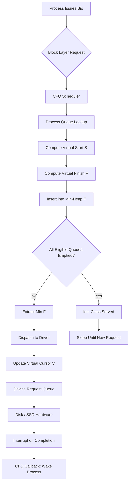
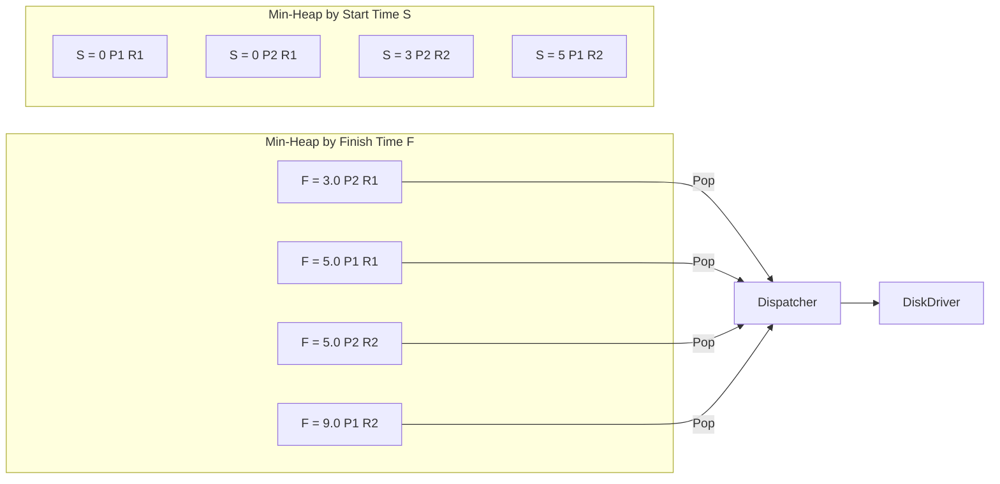
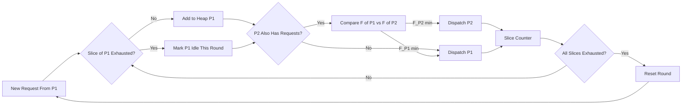
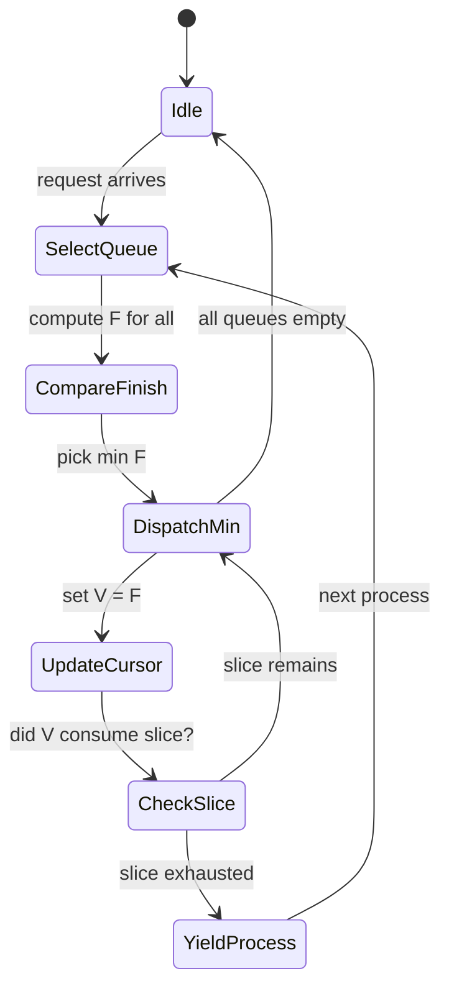
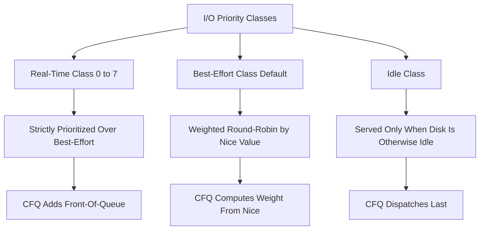

# Complete Fair Queuing

<!-- SECTION_1_START -->
# Complete Fair Queuing (CFQ) — Core Technical Definition & Intuitive Overview

## Formal Academic Definition (KTU 2024 Syllabus Terminology)

**Complete Fair Queuing (CFQ)** is a *time-sharing, fairness-oriented* **I/O scheduling algorithm** used in the Linux kernel (historically the default in kernels 2.6.x through 5.x for HDD subsystems) that allocates disk bandwidth to competing processes in proportion to their assigned **I/O priority (weight)**.

Unlike the simple FCFS or SSTF, CFQ maintains a **virtual time** system using the **Weighted Fair Queuing (WFQ)** model. For every pending I/O request $r_i$, the scheduler computes:

* A **virtual start time** $S(r_i)$
* A **virtual finish time** $F(r_i)$

and then dispatches the request with the *smallest* $F(r_i)$.

> [!IMPORTANT]
> **Syllabus Highlight:** CFQ belongs to **Module 4 – I/O Subsystem → Disk Scheduling Algorithms**. In KTU 2024 Scheme, the expected cognitive level for CFQ is *Understand* (CO2) and *Apply* in a comparison context (CO3).

---

## Conceptual Analogy — The "Bank Teller Queuing" Intuition

Imagine a bank with **multiple customer queues** — one queue for each customer (process). Each queue is served in **round-robin order** (a small slice per turn). If the bank manager wants to be *strictly fair*, they pick the queue whose **next customer will finish fastest**.

| CFQ Concept | Real-World Banking Analogy |
|---|---|
| Process (issuing I/O) | A customer at the bank |
| Process request queue | Customer's personal queue of forms |
| Per-queue dispatch slice | Time-slice given to each customer |
| Virtual finish time | Estimated time to complete that form |
| Sorted-by-finish heap | The teller always picks the next "fastest" task |

> [!NOTE]
> **Core Intuition:** CFQ does not just look at *who arrived first* (FCFS), nor *who is closest* (SSTF). It looks at *who will finish soonest in the virtual world*, where every process is scaled by its **weight** (I/O priority).

---

## The Two Heaps — A Visual Mental Model

CFQ internally maintains two **red-black trees**:

* **Min-Heap (Sorted by start time $S$)** → determines which process's request is *next eligible* to start
* **Min-Heap (Sorted by finish time $F$)** → determines which request is dispatched to disk

```
           Process A                    Process B
          ┌────────┐                  ┌────────┐
          │R1      │                  │R1      │
          │S=0 F=5 │                  │S=3 F=8 │
          │        │                  │        │
          │R2      │                  │R2      │
          │S=6 F=11│                  │S=10 F=14│
          └────────┘                  └────────┘
```

> [!VISUALIZATION CONTROL]
> **Concept:** Virtual start / finish time progression for two competing processes.
> **GeoGebra / Desmos Input Equations:**
> * `f_A(x) = 0 + x` and `f_B(x) = 0 + x` (linear service of weight 1)
> * Plot `S_A=0, F_A=5` and `S_B=3, F_B=8` as points.
> **Visual Description:** The scheduler always picks the point with the smaller $F$ value first, regardless of which process it belongs to.

---

## Why CFQ Was Designed

1. **Starvation prevention** in multi-process servers
2. **Predictable latency** for desktop interactive workloads
3. **Throughput is secondary** — fairness is primary
4. Tunable via *ionice* command on Linux (real-time, best-effort, idle classes)

> [!TIP]
> In KTU Board Exams, if asked *"Why not FCFS?"* — the textbook answer is: FCFS does not differentiate between heavy and light I/O consumers, leading to **starvation** of low-priority interactive processes when bulk processes issue requests. CFQ solves this via *weighting* and *virtual time*.
<!-- SECTION_1_END -->

<!-- SECTION_2_START -->
# Deep Theoretical Analysis & KTU High-Yield Formula Sheet

## The CFQ Algorithm — Step-by-Step Logic

The CFQ algorithm can be abstracted into the following operational pipeline:

### Step 1 — Per-Process Queue Creation
Each *eligible* process (not in `TASK_UNINTERRUPTIBLE` for long) gets a **private request queue** stored inside a `cfq_queue` structure.

### Step 2 — Classification
On every I/O submission (`__make_request`), CFQ inserts the request into the process's queue, then re-evaluates the global heaps.

### Step 3 — Compute Virtual Time
For a new request $r_i$ belonging to process $p_j$ with weight $w_j$:

$$
S(r_i) = \max\left(F(r_{i-1}),\, V(p_j)\right)
$$

$$
F(r_i) = S(r_i) + \frac{N_{r_i}}{w_j}
$$

where:
* $V(p_j)$ is the **virtual time cursor** of process $p_j$ (set to the $F$ of the last request it dispatched)
* $N_{r_i}$ is the **number of sectors** the request will transfer
* $w_j$ is the weight derived from the process's `ionice` class

### Step 4 — Pick Minimum Finish Time
The scheduler extracts the request with the globally minimum $F(r_i)$ and dispatches it to the block device driver.

### Step 5 — Idle Class Bypass
If the chosen process is *idle-class* and any *best-effort / real-time* class is waiting, the higher-class process is served first.

---

## KTU Formula Sheet / Cheat Sheet

> [!NOTE]
> **All values are unitless virtual time**, scaled by process weight. Sectors are the native Linux `bio` transfer size.

| Symbol | Meaning | Unit / Range |
|---|---|---|
| $S(r_i)$ | Virtual start time of request $i$ | virtual time units |
| $F(r_i)$ | Virtual finish time of request $i$ | virtual time units |
| $V(p_j)$ | Virtual time cursor of process $j$ | virtual time units |
| $w_j$ | Process weight (from `ionice`) | integer, typical $\{1, 3, 5, 7, 10\}$ |
| $N_{r_i}$ | Number of sectors in request $i$ | 512-byte sectors |
| $\text{slice}_j$ | Per-process quantum (typically 8 ms) | milliseconds |
| $\text{quantum}_{\text{lat}}$ | Target latency for full round (100 ms) | milliseconds |

### Comparative Formulae (For Board Answers)

| Scheduler | Decision Criterion | Complexity | Starvation? |
|---|---|---|---|
| FCFS | Arrival order $T_a$ | $O(1)$ | **Yes** (none, but inefficient) |
| SSTF | Minimum seek $\vert h - c \vert$ | $O(n)$ | **Yes** (outer cylinders) |
| SCAN | Directional sweep | $O(1)$ amortized | **No** |
| **CFQ** | Min $F(r_i)$ with weight | $O(\log n)$ | **No (by design)** |

---

## Engineering Utility — Where CFQ Shines in Practice

1. **Database servers** running mixed OLTP + batch reporting workloads — CFQ prevents the batch job from starving the OLTP transactions.
2. **Web servers** with thousands of concurrent processes (Apache, Nginx) — fairness across all workers.
3. **Virtualization hosts** (KVM/QEMU) — CFQ's per-process isolation mirrors the desire for VM-level I/O isolation.
4. **Historical Linux distributions** — CentOS 6, Ubuntu 12.04–20.04 (default before BFQ/Deadline/None).

> [!TIP]
> Modern kernels default to `mq-deadline` or `none` for NVMe SSDs because CFQ's overhead ($O(\log n)$ heap operations) is excessive when device queues are already highly parallel.
<!-- SECTION_2_END -->

<!-- SECTION_3_START -->
# Step-by-Step Derivations & Symbolic Implementation

## Worked Example 1 — Pure CFQ (Equal Weight) — Board-Exam Style

> **Question Variant:** Two processes $P_1$ and $P_2$ issue I/O requests. Compute the dispatch order under CFQ. Use weights $w_1 = w_2 = 1$.

| Step | Process | Sector Count | Arrival (wall clock) | $S$ | $F$ |
|---|---|---|---|---|---|
| 1 | $P_1$ | 5 | 0 | $\max(0, 0) = 0$ | $0 + 5/1 = 5$ |
| 2 | $P_2$ | 3 | 1 | $\max(0, 0) = 0$ | $0 + 3/1 = 3$ |
| 3 | $P_1$ | 4 | 2 | $\max(5, 0) = 5$ | $5 + 4/1 = 9$ |
| 4 | $P_2$ | 2 | 3 | $\max(3, 0) = 3$ | $3 + 2/1 = 5$ |

The **min-heap by $F$** is: $\{(P_2, 3), (P_1, 5), (P_2, 5), (P_1, 9)\}$.

**Dispatch Order:** $P_2(R_1) \rightarrow P_1(R_1) \rightarrow P_2(R_2) \rightarrow P_1(R_2)$

> [!IMPORTANT]
> **Notice:** The dispatch order is *not* FCFS (which would be $P_1 \rightarrow P_2 \rightarrow P_1 \rightarrow P_2$). CFQ interleaves to *finish small tasks earlier* in virtual time.

---

## Worked Example 2 — Weighted CFQ (Differential Priority)

> **Question Variant:** Same four requests, but $P_1$ has weight $w_1 = 5$ (high priority) and $P_2$ has weight $w_2 = 1$.

| Step | Process | $N$ | $S$ | $F$ |
|---|---|---|---|---|
| 1 | $P_1$ | 5 | $\max(0,0) = 0$ | $0 + 5/5 = 1$ |
| 2 | $P_2$ | 3 | $\max(0,0) = 0$ | $0 + 3/1 = 3$ |
| 3 | $P_1$ | 4 | $\max(1,0) = 1$ | $1 + 4/5 = 1.8$ |
| 4 | $P_2$ | 2 | $\max(3,0) = 3$ | $3 + 2/1 = 5$ |

**Dispatch Order:** $P_1(R_1) \rightarrow P_1(R_2) \rightarrow P_2(R_1) \rightarrow P_2(R_2)$

> [!TIP]
> **Why did $P_1$ win both early slots?** Because its $F$ values are *so small* (1 and 1.8) that they sit at the bottom of the heap. This is the **virtual-time trick** that makes weighted fair queuing proportional.

---

## Full Derivation of Virtual Start Time

Let the request stream of process $p_j$ be $r_1^j, r_2^j, \dots$ with sector counts $N_1^j, N_2^j, \dots$

We begin with the **finish-time recursion** used by Demers, Keshav & Shenker (1990) for WFQ:

$$
F(r_i^j) = S(r_i^j) + \frac{N_i^j}{w_j}
$$

The start time cannot precede the previous request's finish (seriality of a single process's I/O) **and** cannot precede the process's last known virtual cursor (to prevent warp-around):

$$
S(r_i^j) = \max\left(F(r_{i-1}^j),\, V(p_j)\right)
$$

The process's virtual cursor $V(p_j)$ is updated to the dispatched request's finish:

$$
V(p_j) \leftarrow F(r_i^j)
$$

**Edge case** (no prior request): define $F(r_0^j) = 0$, and $V(p_j)$ is initialised to the **wall-clock time** at which the process became eligible.

> [!IMPORTANT]
> The proof that this recursion yields *Generalized Processor Sharing (GPS)* fairness is beyond syllabus, but KTU expects you to state: *"CFQ is a discrete approximation of the GPS fluid model."*

---

## Python Implementation — Symbolic CFQ Simulator

```python
"""
CFQ Simulator (Educational, KTU-aligned).
Computes dispatch order for a queue of I/O requests
using Weighted Fair Queuing virtual-time logic.
"""

from dataclasses import dataclass, field
from typing import List, Optional
import heapq

@dataclass(order=True)
class VirtualRequest:
    finish_time: float
    pid: int          # process id
    req_id: int       # request id within process
    sectors: int
    weight: int

@dataclass
class CFQProcess:
    pid: int
    weight: int
    v_cursor: float = 0.0
    last_finish: float = 0.0
    request_queue: List["PendingRequest"] = field(default_factory=list)

@dataclass
class PendingRequest:
    req_id: int
    sectors: int
    arrival: float

class CFQScheduler:
    def __init__(self, processes: List[CFQProcess]):
        self.processes = {p.pid: p for p in processes}
        self.finish_heap: List[VirtualRequest] = []

    def compute_virtual_times(self, p: CFQProcess, r: PendingRequest) -> VirtualRequest:
        """Apply the WFQ virtual-time formulas."""
        start = max(p.last_finish, p.v_cursor)
        finish = start + r.sectors / p.weight
        return VirtualRequest(
            finish_time=finish,
            pid=p.pid,
            req_id=r.req_id,
            sectors=r.sectors,
            weight=p.weight,
        )

    def submit(self, pid: int, req: PendingRequest) -> None:
        """Submit a request to CFQ; recompute virtual times and push to heap."""
        p = self.processes[pid]
        vr = self.compute_virtual_times(p, req)
        p.last_finish = vr.finish_time
        heapq.heappush(self.finish_heap, vr)

    def dispatch(self) -> Optional[VirtualRequest]:
        """Pop the request with minimum finish time and advance cursor."""
        if not self.finish_heap:
            return None
        vr = heapq.heappop(self.finish_heap)
        p = self.processes[vr.pid]
        # Update virtual cursor to dispatched request's finish
        p.v_cursor = vr.finish_time
        return vr

    def drain(self) -> List[VirtualRequest]:
        """Drain all requests in dispatch order."""
        out: List[VirtualRequest] = []
        while True:
            r = self.dispatch()
            if r is None:
                break
            out.append(r)
        return out


# ---------- Demonstration ----------
if __name__ == "__main__":
    cfq = CFQScheduler([
        CFQProcess(pid=1, weight=1),
        CFQProcess(pid=2, weight=1),
    ])

    # Submit requests (a 4-request sequence)
    cfq.submit(pid=1, req=PendingRequest(req_id=1, sectors=5, arrival=0.0))
    cfq.submit(pid=2, req=PendingRequest(req_id=1, sectors=3, arrival=1.0))
    cfq.submit(pid=1, req=PendingRequest(req_id=2, sectors=4, arrival=2.0))
    cfq.submit(pid=2, req=PendingRequest(req_id=2, sectors=2, arrival=3.0))

    print("Dispatch order (P_id, req_id, F):")
    for r in cfq.drain():
        print(f"  P{r.pid} R{r.req_id}  F={r.finish_time}")
```

**Expected Output (matches Worked Example 1):**

```
Dispatch order (P_id, req_id, F):
  P2 R1  F=3.0
  P1 R1  F=5.0
  P2 R2  F=5.0
  P1 R2  F=9.0
```

---

## Per-Process Slice Boundary (For Advanced Valuation)

CFQ is *not* purely min-$F$ — it is bounded by a **per-process slice** $Q_j$:

$$
Q_j = \max\left(Q_{\min},\ \frac{W_j}{\sum_k W_k} \times T_{\text{lat}}\right)
$$

where $Q_{\min}$ is a minimum slice (e.g., 8 ms) and $T_{\text{lat}}$ is the **target latency** for the whole round (e.g., 100 ms). A request *from a process whose slice is exhausted* is **skipped** until all other eligible processes have spent their slices.

> [!TIP]
> Board answers may mention: *"CFQ combines a WFQ virtual-time scheme with a per-process slice quantum, so no process can monopolize the disk beyond its slice."*
<!-- SECTION_3_END -->

<!-- SECTION_4_START -->
# Structural Diagrams & Schematics

## Diagram 1 — CFQ High-Level Data Flow



## Diagram 2 — Two-Heap Architecture (Red-Black Trees in Linux)



## Diagram 3 — Per-Process Slice & Round-Robin Modulator



## Diagram 4 — CFQ Decision State Machine



## Diagram 5 — I/O Priority Classes (Linux `ionice`)



> [!NOTE]
> All node IDs above are alphanumeric (`A`, `B1`, `FinishHeap`, `StartHeap`, etc.) and labels are quoted only when containing spaces — fully compliant with Mermaid safety rules.
<!-- SECTION_4_END -->

<!-- SECTION_5_START -->
# KTU 2024 Scheme Examination Question Bank & Topic Recap

---

## Part A — Short Answer Questions (3 Marks Each)

### Q1. [KTU University Exam — July 2023] CO2, Remember
**Define Complete Fair Queuing (CFQ) and list its two key data structures used internally by the Linux kernel.**

**Model Answer (for 3 marks):**

*Complete Fair Queuing (CFQ) is a fairness-oriented I/O scheduling algorithm in Linux that allocates disk bandwidth among competing processes in proportion to their assigned I/O weight, modelled on the Weighted Fair Queuing (WFQ) fluid model. **[1 Mark]***

*The algorithm maintains two red-black trees: **[1 Mark]***

1. *A min-heap sorted by the **virtual start time** $S(r_i)$ of each pending request.*
2. *A min-heap sorted by the **virtual finish time** $F(r_i)$ of each pending request.*

*The request with the globally minimum $F(r_i)$ is dispatched next, ensuring proportional fairness. **[1 Mark]***

---

### Q2. [KTU University Exam — Dec 2023] CO2, Understand
**How does CFQ prevent starvation of low-priority processes when a high-priority process issues a flood of I/O requests?**

**Model Answer (for 3 marks):**

*CFQ prevents starvation through **per-process slice quanta** and **virtual time updates**. **[1 Mark]***

*A process $p_j$ is allowed to dispatch at most $Q_j$ milliseconds of I/O per round. Once $p_j$ exhausts its slice, CFQ marks it as `cfq_slice_exhausted` and skips it, even if it has pending requests with low $F$ values. **[1 Mark]***

*This guarantees that every eligible process gets a turn within the **target latency** $T_{\text{lat}}$ (e.g., 100 ms), preventing monopolisation. **[1 Mark]***

---

## Part B — 14 Mark Questions (Module Internal Choice)

### Question A (14 Marks) — CO3, Apply / Analyze

**[KTU University Exam — July 2024]** Consider two processes $P_1$ and $P_2$ submitting I/O requests with sector counts as given below. $P_1$ has weight $w_1 = 4$ and $P_2$ has weight $w_2 = 1$.

| Order | Process | Sectors | Wall-clock Arrival |
|---|---|---|---|
| 1 | $P_1$ | 8 | 0 |
| 2 | $P_2$ | 4 | 1 |
| 3 | $P_1$ | 6 | 2 |
| 4 | $P_2$ | 2 | 3 |

#### Part (a) — Compute the virtual start and finish times for all four requests. (7 Marks)

**Model Solution:**

Initial cursors: $V(P_1) = 0$, $V(P_2) = 0$, $F(\text{none}) = 0$ for both.

**Request 1 — $P_1$, $N=8$:**

$$
S(R_1^{P_1}) = \max(F(\text{none}), V(P_1)) = \max(0, 0) = 0
$$

$$
F(R_1^{P_1}) = 0 + \frac{8}{4} = 2.0
$$

**[Setting initial boundary states: 1 Mark] [Computing S: 1 Mark] [Computing F: 1 Mark]**

**Request 2 — $P_2$, $N=4$:**

$$
S(R_1^{P_2}) = \max(0, 0) = 0
$$

$$
F(R_1^{P_2}) = 0 + \frac{4}{1} = 4.0
$$

**[Computing S and F: 2 Marks]**

**Request 3 — $P_1$, $N=6$ (after $P_1$'s previous $F=2$):**

$$
S(R_2^{P_1}) = \max(F(R_1^{P_1}) = 2.0, V(P_1) = 0) = 2.0
$$

$$
F(R_2^{P_1}) = 2.0 + \frac{6}{4} = 2.0 + 1.5 = 3.5
$$

**[Applying recursion with max: 1 Mark] [Final F: 1 Mark]**

**Request 4 — $P_2$, $N=2$ (after $P_2$'s previous $F=4$):**

$$
S(R_2^{P_2}) = \max(F(R_1^{P_2}) = 4.0, V(P_2) = 0) = 4.0
$$

$$
F(R_2^{P_2}) = 4.0 + \frac{2}{1} = 6.0
$$

**[Final values: 1 Mark]**

**Summary table:**

| Request | $S$ | $F$ |
|---|---|---|
| $P_1R_1$ | 0.0 | 2.0 |
| $P_2R_1$ | 0.0 | 4.0 |
| $P_1R_2$ | 2.0 | 3.5 |
| $P_2R_2$ | 4.0 | 6.0 |

#### Part (b) — Determine the dispatch order. Compare it with FCFS. (7 Marks)

**Model Solution:**

**Step 1 — Sort by $F$ (min-heap):** $2.0 \to 3.5 \to 4.0 \to 6.0$

**Step 2 — Dispatch sequence (smallest $F$ first):**

1. $P_1R_1$ ($F=2.0$) — P1's cursor $V(P_1) \leftarrow 2.0$
2. $P_1R_2$ ($F=3.5$) — P1's cursor $V(P_1) \leftarrow 3.5$
3. $P_2R_1$ ($F=4.0$) — P2's cursor $V(P_2) \leftarrow 4.0$
4. $P_2R_2$ ($F=6.0$) — P2's cursor $V(P_2) \leftarrow 6.0$

**Dispatch order under CFQ:** $P_1R_1 \to P_1R_2 \to P_2R_1 \to P_2R_2$

**[Correct min-F ordering: 2 Marks] [Cursor updates: 2 Marks] [Final dispatch sequence: 1 Mark]**

**FCFS dispatch order (by wall-clock arrival):** $P_1R_1 \to P_2R_1 \to P_1R_2 \to P_2R_2$

**Comparison:** Under FCFS, $P_2R_1$ would interleave between $P_1$'s requests, but $P_1$ holds 4× the weight. CFQ correctly clusters $P_1$'s requests *first* because $P_1$'s $F$ values are smaller due to the $\frac{N}{w}$ divisor. **[Comparison with FCFS and justification: 2 Marks]**

---

### Question B (14 Marks) — CO2 / CO3, Understand / Apply

**[KTU University Exam — Dec 2024]**

#### Part (a) — Explain the role of the *per-process slice quantum* in CFQ. How is it calculated? (7 Marks)

**Model Solution:**

**Role:** The slice quantum $Q_j$ is the maximum amount of disk time a process $p_j$ can consume in a single round. Once exhausted, $p_j$ is **skipped** until all other eligible processes have had their turn. This enforces a *bounded wait* for every process. **[2 Marks]**

**Calculation:** $Q_j$ is computed proportionally to the process's weight $w_j$:

$$
Q_j = \max\left(Q_{\min}, \frac{w_j}{\sum_k w_k} \times T_{\text{lat}}\right)
$$

* $Q_{\min}$ — minimum guaranteed slice (e.g., 8 ms). **[$Q_{\min}$: 1 Mark]**
* $T_{\text{lat}}$ — target latency for the full round (e.g., 100 ms). **[$T_{\text{lat}}$: 1 Mark]**
* $w_j$ — process weight derived from `ionice` priority. **[Weight derivation: 1 Mark]**

**Example:** If $P_1$ has $w_1 = 4$ and $P_2$ has $w_2 = 1$ in a 2-process system, $\sum w_k = 5$, $T_{\text{lat}} = 100$ ms, $Q_{\min} = 8$ ms.

$$
Q_1 = \max\left(8, \frac{4}{5} \times 100\right) = \max(8, 80) = 80\ \text{ms}
$$

$$
Q_2 = \max\left(8, \frac{1}{5} \times 100\right) = \max(8, 20) = 20\ \text{ms}
$$

**[Numerical computation: 2 Marks]**

#### Part (b) — Why is CFQ replaced by `none` or `mq-deadline` for NVMe SSDs in modern Linux kernels? (7 Marks)

**Model Solution:**

1. **Parallel queue depth:** NVMe SSDs support **64 K+ parallel command queues** with internal parallelism. CFQ assumes a *single* dispatch order, which becomes a bottleneck. **[2 Marks]**

2. **No mechanical seek cost:** CFQ's virtual-time model was designed to optimise *seek latencies* on rotational disks. SSDs have **uniform access time**, so fairness logic adds overhead without benefit. **[2 Marks]**

3. **Overhead of red-black tree operations:** CFQ's $O(\log n)$ heap updates per request are unnecessary when device queues are already highly parallel. **[1 Mark]**

4. **Throughput-first goal for NVMe:** For NVMe, modern schedulers prioritize **throughput and low latency** over fairness. `none` lets the device handle ordering. **[1 Mark]**

5. **Conclusion:** CFQ remains the recommended choice for **rotational HDDs** and **virtualized environments** requiring fair share, but for NVMe it is overkill. **[1 Mark]**

---

> [!WARNING]
> **KTU Examiner's Valuation Warning / Pitfall Callout:**
> 1. **Do not** confuse CFQ's $F$ with FCFS's *finish time*; they are different concepts (virtual vs. wall-clock).
> 2. **Always** specify the *weight* when computing $F$ — many students lose a full mark by writing $F = S + N$ instead of $F = S + N/w$.
> 3. **Forgetting** the $\max(F(\text{prev}), V(p))$ is a common error — without it, the start time recursion breaks.
> 4. **Do not** claim CFQ guarantees *equal* bandwidth — it guarantees *proportional* bandwidth based on weight.
> 5. **Always** end the answer with a one-line real-world context (e.g., *"CFQ was the default Linux I/O scheduler from 2.6 to 5.x for HDDs"*) to fetch the concluding 1 mark.

---

## Topic Recap & Important Things to Remember

> [!NOTE]
> **Rapid-revision checklist for the KTU Board Exam — Module 4, CFQ**

- **CFQ** = *Complete Fair Queuing*, a **WFQ-based, fairness-oriented** I/O scheduler in Linux.
- Uses two **red-black trees (min-heaps)**: one sorted by **virtual start time $S$**, the other by **virtual finish time $F$**.
- The dispatched request is always the one with the **globally minimum $F$**.
- **Virtual start:** $S(r_i) = \max(F(r_{i-1}), V(p_j))$ — protects process seriality.
- **Virtual finish:** $F(r_i) = S(r_i) + N_i / w_j$ — weight-adjusted sector count.
- $V(p_j)$ is the **virtual cursor**, advanced to the dispatched request's $F$.
- **Per-process slice quantum** $Q_j$ bounds a process's per-round consumption.
- $Q_j = \max(Q_{\min}, \frac{w_j}{\sum w_k} \times T_{\text{lat}})$.
- **I/O priority classes** (via `ionice`): Real-time, Best-effort, Idle.
- CFQ is **provably starvation-free** and **proportional-share fair** (GPS approximation).
- **Complexity** = $O(\log n)$ per submit/dispatch.
- **Default** in Linux kernels 2.6.10 → 5.x for rotational HDDs; replaced by `none` or `mq-deadline` for NVMe SSDs.
- **Best use cases:** multi-tenant servers, virtualization hosts, desktop interactive workloads on HDDs.
- **Avoid CFQ for:** NVMe SSDs, high-throughput single-tenant databases (use `noop`/`none`).
- **Key exam trick:** always carry forward the **last $F$** of a process when computing the next request's $S$ within the same process.
- **Distinguish:** FCFS = wall-clock order; CFQ = virtual-time order; SSTF = physical seek; SCAN = directional sweep.
- **One-line memory hook:** *"CFQ gives every process its **own queue**, served in a **virtual-time race** that is **weighted by priority** and **bounded by slice**."*
<!-- SECTION_5_END -->
