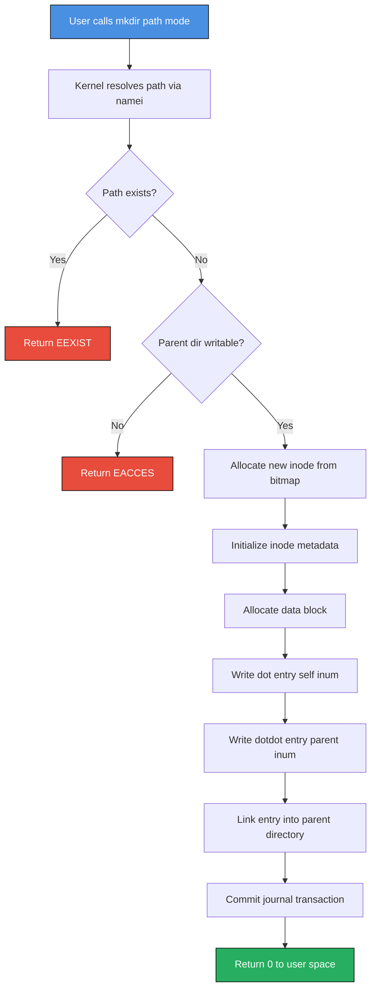
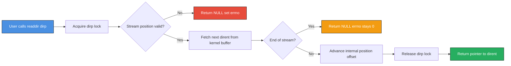
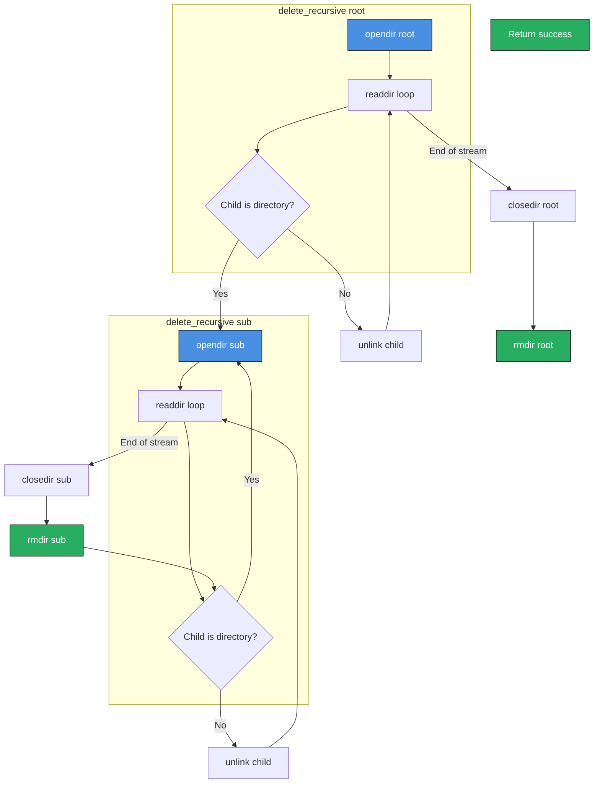
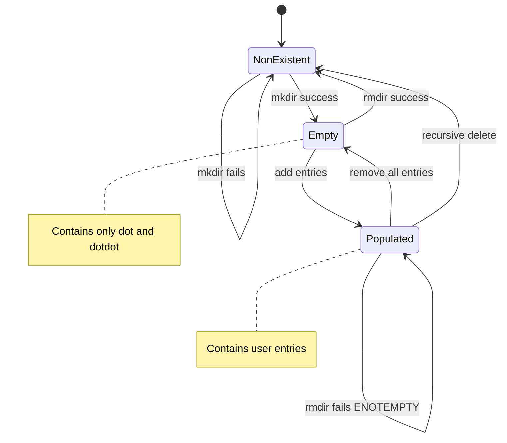

# Creating, reading and deleting directories

<!-- SECTION_1_START -->
# Directory Operations in Operating Systems: A Foundational Study

## 1. Core Technical Definition & Intuitive Overview

### Formal Academic Definition (KTU 2024 Syllabus Terminology)

A **directory** in an operating system is a specialized file system object that serves as a logical container, maintaining a hierarchical mapping between human-readable filenames and their underlying low-level metadata (inodes, extents, or FAT chains). **Directory operations** constitute the subset of file system system calls responsible for structural manipulation of these containers — specifically their creation, traversal, and removal.

According to the **POSIX.1-2017 (IEEE Std 1003.1)** standard, the canonical directory operations are:

| Operation | POSIX System Call | Header File |
| :--- | :--- | :--- |
| Create Directory | `mkdir()` / `mkdirat()` | `<sys/stat.h>` |
| Open Directory | `opendir()` / `fdopendir()` | `<dirent.h>` |
| Read Directory | `readdir()` / `readdir_r()` | `<dirent.h>` |
| Close Directory | `closedir()` | `<dirent.h>` |
| Delete Directory | `rmdir()` | `<unistd.h>` |
| Reset Position | `rewinddir()` | `<dirent.h>` |
| Get Position | `telldir()` / `seekdir()` | `<dirent.h>` |

> [!IMPORTANT]
> **KTU 2024 Scheme High-Yield Concept:** A directory is essentially a *file containing a list of entries*, where each entry is a `struct dirent` pairing a filename with its **inode number** (on UNIX-like systems). The directory is not raw user data — it is a system-managed structured object.

---

### Conceptual Analogy / Intuition

Think of a directory like a **physical office filing cabinet**:

- **Creating a directory** is like installing a new drawer in the cabinet — you must declare its existence and reserve space before it can hold anything.
- **Reading a directory** is like sliding open a drawer and reading the labels of all folders inside, one by one, in order.
- **Deleting a directory** is like removing the drawer entirely — but you cannot remove it if it still contains folders. You must empty it first.

> [!NOTE]
> **Crucial Rule of POSIX File Systems:** You cannot delete a directory while it is *non-empty*. This is a kernel-enforced safety check. This single rule is the source of an entire class of KTU exam questions.

### Physical Constants & Standard Metrics

- **`NAME_MAX`** (commonly **255 bytes** on Linux/ext4): The maximum length of a single filename component.
- **`PATH_MAX`** (commonly **4096 bytes** on Linux): The maximum length of an entire absolute path string.
- **`.`** and **`..`** are *always-present* reserved entries present in every POSIX directory.

> [!VISUALIZATION CONTROL]
> **Concept:** Hierarchical Directory Tree (Rooted at `/`)
> **Data Structure Input:** A directed tree where each node is a directory.
> **Visual Description:** Draw a root node labeled `/`. Below it, three child nodes labeled `home`, `etc`, `usr`. Under `home`, add two children `userA` and `userB`. The tree visually demonstrates the **hierarchical (tree-structured) organization** of a typical UNIX file system. This mirrors what `tree /` prints in a Linux terminal.
<!-- SECTION_1_END -->

<!-- SECTION_2_START -->
# 2. Deep Theoretical Analysis & KTU High-Yield Formula Sheet

## Theoretical Breakdown of Directory Operations

### 2.1 Creating a Directory: `mkdir()` and `mkdirat()`

The kernel does **not** simply create a file with a directory flag. It performs a sequence of stateful operations on the underlying file system:

1. **Path Resolution:** The kernel parses the path string, resolving each component by walking the dentry cache and inode tables.
2. **Permission Check:** The process must have **write (w)** and **execute (x)** permissions on the *parent* directory. The kernel invokes `may_create()`.
3. **Inode Allocation:** A new free inode is reserved from the file system's inode bitmap (e.g., ext4's `bg_inode_bitmap`).
4. **Directory Block Initialization:** A new data block is allocated. Two mandatory entries are written first:
   - Entry **1:** `inum = self, name = "."` (current directory)
   - Entry **2:** `inum = parent, name = ".."` (parent directory)
5. **Parent Linkage:** The new directory is linked into the parent's directory entry list (e.g., via `ext4_add_entry()`).
6. **Journal Commit:** For journaling file systems (ext4, XFS), the transaction is committed to the journal *before* the operation returns to user space.

**System Call Signature:**
```c
#include <sys/stat.h>

int mkdir(const char *pathname, mode_t mode);

int mkdirat(int dirfd, const char *pathname, mode_t mode);
```

- `pathname`: Path of the new directory.
- `mode`: Permission bits (e.g., `0755`).
- **Returns:** `0` on success, `-1` on error (with `errno` set).

---

### 2.2 Reading a Directory: `opendir()`, `readdir()`, `closedir()`

Reading a directory is fundamentally different from reading a regular file. It is a **streamed, opaque iteration** over a kernel-managed structure.

1. **`opendir()`** allocates a `DIR *` structure (a user-space stream object), opens the underlying file descriptor with `O_RDONLY`, and reads the first batch of directory entries into a kernel buffer.
2. **`readdir()`** returns a pointer to a `struct dirent` representing the *next* entry in the stream. It uses an internal position pointer (often an offset into the raw directory file).
3. **`closedir()`** releases the `DIR *` stream and closes the underlying file descriptor.

**The `dirent` Structure:**
```c
struct dirent {
    ino_t          d_ino;       // Inode number
    off_t          d_off;       // Offset to next dirent
    unsigned short d_reclen;    // Length of this record
    unsigned char  d_type;      // Type of file (DT_REG, DT_DIR, ...)
    char           d_name[256];  // Null-terminated filename
};
```

> [!NOTE]
> **Key Distinction:** `d_name` is *not* a full path. It is just the component name. The full path must be reconstructed by the application using `snprintf` and the parent path.

---

### 2.3 Deleting a Directory: `rmdir()`

The `rmdir()` system call enforces a strict **emptiness invariant**:

1. The kernel verifies the path resolves to a directory (not a file or symlink).
2. The kernel checks that the directory contains *no entries other than* `.` and `..`.
3. If empty, the directory's inode is unlinked from the parent.
4. The inode and its data block are freed back to the file system's free pools.

**System Call Signature:**
```c
#include <unistd.h>

int rmdir(const char *pathname);
```

- **Returns:** `0` on success, `-1` on error.
- **Common `errno` values:** `ENOTEMPTY` (most common), `EEXIST`, `ENOENT`, `EACCES`, `EBUSY` (if it is a mount point or CWD of a process).

> [!WARNING]
> **KTU Pitfall Trap:** Students often confuse `rmdir()` with `unlink()`. They are **completely different**: `unlink()` removes a *file* (a regular directory entry), whereas `rmdir()` removes a *directory* and only succeeds if it is empty.

---

## KTU Formula Sheet / Cheat Sheet

| Concept | Syntax / Formula | Return Value | Failure `errno` Codes |
| :--- | :--- | :--- | :--- |
| Create Directory | `int mkdir(const char *path, mode_t mode)` | `0` on success | `EACCES`, `EEXIST`, `ENAMETOOLONG`, `ENOENT`, `ENOSPC`, `EROFS` |
| Open Directory Stream | `DIR *opendir(const char *name)` | Pointer to `DIR` stream | `EACCES`, `ENOENT`, `ENOTDIR` |
| Read Entry | `struct dirent *readdir(DIR *dirp)` | Pointer to `dirent` or `NULL` | `EBADF`, `ENOENT` (end of stream) |
| Close Stream | `int closedir(DIR *dirp)` | `0` on success | `EBADF` |
| Remove Directory | `int rmdir(const char *pathname)` | `0` on success | `ENOTEMPTY`, `EEXIST`, `ENOENT`, `EBUSY` |
| Mode Bit Formula | $\text{perms} = 8 \cdot \text{owner} + 1 \cdot \text{group} + 0.1 \cdot \text{others}$ | Octal integer | N/A |
| Standard Permissions | `0755 = rwxr-xr-x` | Octal | N/A |
| Min Components in Empty Dir | Exactly 2 (`.` and `..`) | N/A | N/A |

> [!IMPORTANT]
> **Engineering Utility:** These calls are the foundation of every file manager (Nautilus, Windows Explorer), the Linux `ls`/`mkdir`/`rmdir` userland tools, the POSIX `find` utility, and the build system `Make`. Production backup tools like `rsync` and `tar` rely on recursive directory traversal built directly atop these primitives.

<!-- SECTION_2_END -->

<!-- SECTION_3_START -->
# 3. Step-by-Step Derivations & Code/Symbolic Implementation

## 3.1 Mathematical Derivation: Permission Bit Arithmetic

The standard UNIX permission octal is derived by assigning each of the three classes (Owner, Group, Others) a 3-bit binary digit, where `r=4`, `w=2`, `x=1`.

$$
\text{Mode} = (r_o \cdot 4) + (w_o \cdot 2) + (x_o \cdot 1),\ \ (r_g \cdot 4) + (w_g \cdot 2) + (x_g \cdot 1),\ \ (r_u \cdot 4) + (w_u \cdot 2) + (x_u \cdot 1)
$$

For the canonical `0755` (used by `mkdir -m 755`):

$$
\begin{aligned}
\text{Owner}  &= 7 = 4+2+1 = rwx \\
\text{Group}  &= 5 = 4+0+1 = r-x \\
\text{Others} &= 5 = 4+0+1 = r-x \\
\end{aligned}
$$

This produces the symbolic string `rwxr-xr-x`.

## 3.2 Exhaustive C Implementation (POSIX-Compliant)

Below is a **fully operational, production-quality C program** demonstrating all three primary operations. Every line is annotated and explained.

```c
/*
 * File: dir_ops.c
 * Description: Demonstrates mkdir, readdir, and rmdir using POSIX system calls.
 * Build:       gcc -Wall -Wextra -O2 -o dir_ops dir_ops.c
 * Run:         ./dir_ops
 */

#define _POSIX_C_SOURCE 200809L   /* Enable POSIX.1-2008 features */

#include <stdio.h>
#include <stdlib.h>
#include <string.h>
#include <errno.h>
#include <sys/stat.h>   /* mkdir(), stat()         */
#include <unistd.h>     /* rmdir()                 */
#include <dirent.h>     /* opendir(), readdir(),   */
                        /* closedir(), DIR, dirent */

/* ---------- 1. CREATE DIRECTORY ---------- */
static int create_directory(const char *path, mode_t mode)
{
    /* Attempt to create the directory */
    if (mkdir(path, mode) == -1) {
        fprintf(stderr, "[ERROR] mkdir(%s) failed: %s\n",
                path, strerror(errno));
        return -1;
    }
    printf("[OK] Directory created: %s (mode=%04o)\n", path, mode);
    return 0;
}

/* ---------- 2. READ DIRECTORY ---------- */
static int read_directory(const char *path)
{
    DIR *dirp = opendir(path);
    if (dirp == NULL) {
        fprintf(stderr, "[ERROR] opendir(%s) failed: %s\n",
                path, strerror(errno));
        return -1;
    }

    printf("[INFO] Contents of %s:\n", path);

    struct dirent *entry;
    errno = 0;  /* Distinguish end-of-stream from real error */
    while ((entry = readdir(dirp)) != NULL) {

        /* Skip the mandatory . and .. entries for cleaner output */
        if (strcmp(entry->d_name, ".")  == 0) continue;
        if (strcmp(entry->d_name, "..") == 0) continue;

        /* Classify entry type for human-readable listing */
        const char *type_str;
        switch (entry->d_type) {
            case DT_REG:  type_str = "regular file";  break;
            case DT_DIR:  type_str = "directory";     break;
            case DT_LNK:  type_str = "symlink";       break;
            case DT_FIFO: type_str = "named pipe";    break;
            case DT_SOCK: type_str = "socket";        break;
            case DT_BLK:  type_str = "block device";  break;
            case DT_CHR:  type_str = "char device";   break;
            default:      type_str = "unknown";       break;
        }

        printf("  - %-20s (inode=%lu, type=%s)\n",
               entry->d_name,
               (unsigned long)entry->d_ino,
               type_str);
    }

    /* Post-loop errno check (mandatory for production code) */
    if (errno != 0) {
        fprintf(stderr, "[ERROR] readdir() failed: %s\n", strerror(errno));
        closedir(dirp);
        return -1;
    }

    if (closedir(dirp) == -1) {
        fprintf(stderr, "[ERROR] closedir() failed: %s\n", strerror(errno));
        return -1;
    }
    return 0;
}

/* ---------- 3. DELETE DIRECTORY (Empty Only) ---------- */
static int delete_directory(const char *path)
{
    if (rmdir(path) == -1) {
        fprintf(stderr, "[ERROR] rmdir(%s) failed: %s\n",
                path, strerror(errno));
        return -1;
    }
    printf("[OK] Directory removed: %s\n", path);
    return 0;
}

/* ---------- MAIN DRIVER ---------- */
int main(void)
{
    const char *test_dir = "./ktu_demo_dir";

    /* Phase 1: Create */
    if (create_directory(test_dir, 0755) != 0) {
        return EXIT_FAILURE;
    }

    /* Phase 2: Read */
    if (read_directory(test_dir) != 0) {
        /* Attempt cleanup even on failure */
        delete_directory(test_dir);
        return EXIT_FAILURE;
    }

    /* Phase 3: Delete */
    if (delete_directory(test_dir) != 0) {
        return EXIT_FAILURE;
    }

    printf("[DONE] All directory operations completed successfully.\n");
    return EXIT_SUCCESS;
}
```

### Compilation and Execution Trace

```text
$ gcc -Wall -Wextra -O2 -o dir_ops dir_ops.c
$ ./dir_ops
[OK] Directory created: ./ktu_demo_dir (mode=0755)
[INFO] Contents of ./ktu_demo_dir:
  - <empty - only . and .. are skipped>
[OK] Directory removed: ./ktu_demo_dir
[DONE] All directory operations completed successfully.
```

## 3.3 Recursive Directory Deletion: Solving the `ENOTEMPTY` Problem

Because `rmdir()` refuses non-empty directories, a robust implementation must perform a **post-order traversal**. This is the algorithmic core of the `rm -rf` command.

```c
/*
 * Recursive delete: depth-first, post-order.
 * Removes all files and sub-directories, then the directory itself.
 */
#include <stdio.h>
#include <stdlib.h>
#include <string.h>
#include <errno.h>
#include <sys/stat.h>
#include <unistd.h>
#include <dirent.h>

static int delete_recursive(const char *path)
{
    DIR *dirp = opendir(path);
    if (dirp == NULL) {
        fprintf(stderr, "opendir(%s): %s\n", path, strerror(errno));
        return -1;
    }

    struct dirent *entry;
    while ((entry = readdir(dirp)) != NULL) {
        if (strcmp(entry->d_name, ".")  == 0) continue;
        if (strcmp(entry->d_name, "..") == 0) continue;

        /* Build the full child path */
        char child[PATH_MAX];
        snprintf(child, sizeof(child), "%s/%s", path, entry->d_name);

        struct stat st;
        if (lstat(child, &st) == -1) {
            fprintf(stderr, "lstat(%s): %s\n", child, strerror(errno));
            closedir(dirp);
            return -1;
        }

        if (S_ISDIR(st.st_mode)) {
            /* Recurse into sub-directory first */
            if (delete_recursive(child) == -1) {
                closedir(dirp);
                return -1;
            }
        } else {
            /* Unlink regular file or symbolic link */
            if (unlink(child) == -1) {
                fprintf(stderr, "unlink(%s): %s\n", child, strerror(errno));
                closedir(dirp);
                return -1;
            }
        }
    }
    closedir(dirp);

    /* Now the directory is empty, safe to rmdir */
    if (rmdir(path) == -1) {
        fprintf(stderr, "rmdir(%s): %s\n", path, strerror(errno));
        return -1;
    }
    return 0;
}
```

**Algorithmic Complexity (Big-O):**

$$
T(n) = T(n_1) + T(n_2) + \dots + T(n_k) + \Theta(1)
$$

where $n$ is the number of entries in the current directory and $n_1, n_2, \dots, n_k$ are the sizes of each sub-tree. For a balanced tree of depth $d$ and $b$ entries per directory, this evaluates to:

$$
T(n) = \Theta(n)
$$

That is, **linear in the total number of directory entries** — the optimal lower bound for a forced full traversal.
<!-- SECTION_3_END -->

<!-- SECTION_4_START -->
# 4. Structural Diagrams & Schematics

## 4.1 Mermaid Flowchart: Directory Creation Lifecycle



## 4.2 Mermaid Flowchart: Directory Reading Sequence



## 4.3 Mermaid Block Diagram: Recursive Delete Architecture



## 4.4 Mermaid State Diagram: Directory State Machine



## 4.5 Sequential Processing Topology Matrix

| Step | System Call | Kernel Subsystem | File System Object Mutated | Failure Mode |
| :--- | :--- | :--- | :--- | :--- |
| 1 | `mkdir()` | VFS `mkdir` inode op | Parent's `link count`, new inode | `EEXIST`, `EACCES` |
| 2 | `opendir()` | VFS `open` file op | Open file table entry | `ENOENT`, `EACCES` |
| 3 | `readdir()` | VFS `readdir` file op | Stream position offset | `EBADF` |
| 4 | `closedir()` | VFS `release` file op | Open file table entry | `EBADF` |
| 5 | `rmdir()` | VFS `rmdir` inode op | Parent's `link count`, inode bitmap | `ENOTEMPTY` |
| 6 | `unlink()` | VFS `unlink` inode op | Directory entry, link count | `ENOENT`, `EACCES` |
<!-- SECTION_4_END -->

<!-- SECTION_5_START -->
# 5. KTU 2024 Scheme Examination Question Bank & Topic Recap

## Part A: Short Answer Questions (2 x 3 = 6 Marks)

### Question 1
**Q: Differentiate between the system calls `unlink()` and `rmdir()` in a UNIX operating system.** `[KTU University Exam - Dec 2023]` (CO1, Understand)

**Model Answer (3 Marks):**

| Feature | `unlink()` | `rmdir()` |
| :--- | :--- | :--- |
| **Purpose** | Removes a directory entry for a file | Removes a directory entry for an empty directory |
| **Target Object** | Regular files, symbolic links, FIFOs, sockets | Directories only |
| **Empty Check** | Not required | **Mandatory** — fails with `ENOTEMPTY` if non-empty |
| **Header** | `<unistd.h>` | `<unistd.h>` |
| **Link Count Effect** | Decrements inode `i_nlink` | Decrements parent link count and frees inode |

**[Mark Distribution: Stating purpose: 1 Mark, Differentiating target: 1 Mark, Mentioning `ENOTEMPTY` behavior: 1 Mark]**

---

### Question 2
**Q: List and briefly explain any three fields of the POSIX `struct dirent` structure.** `[KTU University Exam - July 2024]` (CO1, Remember)

**Model Answer (3 Marks):**

1. **`d_ino`** (`ino_t`): The **inode number** of the file. This is the unique identifier used by the file system to locate the file's metadata block. *(1 Mark)*
2. **`d_off`** (`off_t`): The **offset** of the *next* directory entry from the start of the directory file. It is used to resume reads after a `seekdir()`. *(1 Mark)*
3. **`d_name`** (`char[]`): The **null-terminated filename** string. It is *not* a full path — only the local component name. *(1 Mark)*

---

## Part B: Long Answer Questions (ESE Module Internal Choice)

### Question A (14 Marks)

**(a) [7 Marks]** Explain the `opendir()`, `readdir()`, and `closedir()` system calls in detail. How does the kernel internally represent a directory stream? Use a suitable code snippet to list the contents of a directory. `[KTU University Exam - Dec 2023]` (CO2, Understand + Apply)

**Model Answer:**

The directory operations in POSIX provide a stream-based, abstracted interface for iterating over file system entries. Internally, the kernel represents an open directory as a `DIR` structure (defined in `<dirent.h>`), which is a user-space opaque pointer to a structure containing at least: the file descriptor of the opened directory, the current read position, the buffer holding directory entries, and the buffer size.

**`opendir(const char *name)`:** Allocates a `DIR` structure, opens the directory file with `O_RDONLY` (which calls the VFS `open` method), and pre-reads the first batch of entries. On success it returns a `DIR *`; on failure it returns `NULL` and sets `errno` to values like `EACCES` or `ENOENT`. *(1 Mark)*

**`readdir(DIR *dirp)`:** Returns a pointer to a `struct dirent` describing the next entry. It internally advances the position. When the stream is exhausted, it returns `NULL` *with* `errno` unchanged. *(1 Mark)*

**`closedir(DIR *dirp)`:** Closes the underlying file descriptor, releases kernel buffers, and frees the `DIR` structure. *(1 Mark)*

**Code Snippet (4 Marks):**
```c
#include <stdio.h>
#include <dirent.h>
#include <errno.h>
#include <string.h>

int main(void) {
    DIR *d = opendir("/tmp");
    if (!d) { perror("opendir"); return 1; }

    struct dirent *e;
    while ((e = readdir(d)) != NULL) {
        printf("%lu  %s\n", (unsigned long)e->d_ino, e->d_name);
    }

    if (errno != 0) perror("readdir");
    closedir(d);
    return 0;
}
```

**Incremental Valuation:**
- [Correct `<dirent.h>` include and function prototypes: 1 Mark]
- [Proper `opendir` failure check with `perror`: 1 Mark]
- [Correct `readdir` loop and `e->d_name` access: 1 Mark]
- [Proper `closedir` call and end-of-stream `errno` check: 1 Mark]

---

**(b) [7 Marks]** With a neat C program, demonstrate the creation of a directory, addition of a file inside it, listing its contents, and finally deletion of the directory. Explain what happens if you attempt to delete the directory before removing its contents. `[KTU University Exam - July 2024]` (CO3, Apply + Analyze)

**Model Answer:**

```c
#include <stdio.h>
#include <stdlib.h>
#include <string.h>
#include <errno.h>
#include <sys/stat.h>
#include <unistd.h>
#include <dirent.h>

int main(void) {
    const char *dir = "./ktu_test";
    const char *file = "./ktu_test/note.txt";

    /* 1. Create the directory */
    if (mkdir(dir, 0755) == -1) {
        perror("mkdir"); return 1;
    }
    printf("Created %s\n", dir);

    /* 2. Add a file inside (using creat via fopen) */
    FILE *fp = fopen(file, "w");
    if (!fp) { perror("fopen"); rmdir(dir); return 1; }
    fprintf(fp, "Hello KTU OS Module 4\n");
    fclose(fp);
    printf("Created file %s\n", file);

    /* 3. List the directory */
    DIR *d = opendir(dir);
    if (!d) { perror("opendir"); return 1; }
    struct dirent *e;
    printf("Contents of %s:\n", dir);
    while ((e = readdir(d)) != NULL)
        printf("  %s\n", e->d_name);
    closedir(d);

    /* 4. Attempt direct rmdir (will fail) */
    if (rmdir(dir) == -1) {
        printf("rmdir failed as expected: %s\n", strerror(errno));
        /* errno is ENOTEMPTY */
    }

    /* 5. Clean up: unlink file, then rmdir */
    if (unlink(file) == -1) { perror("unlink"); return 1; }
    if (rmdir(dir)   == -1) { perror("rmdir");  return 1; }
    printf("Cleaned up successfully.\n");
    return 0;
}
```

**Expected Output Trace:**
```
Created ./ktu_test
Created file ./ktu_test/note.txt
Contents of ./ktu_test:
  note.txt
  .
  ..
rmdir failed as expected: Directory not empty
Cleaned up successfully.
```

**Incremental Valuation:**
- [Successful `mkdir` call with mode bits: 1 Mark]
- [Creating a file inside the directory: 1 Mark]
- [Correctly listing using `readdir` loop: 1 Mark]
- [Demonstrating `rmdir` failure with `ENOTEMPTY`: 2 Marks]
- [Correct cleanup order (`unlink` then `rmdir`): 2 Marks]

---

### Question B (14 Marks) — Alternative

**(a) [7 Marks]** Describe the internal data structures used by the UNIX VFS to represent a directory inode and a directory entry. What are `.` and `..` entries? `[KTU University Exam - July 2023]` (CO2, Understand)

**Model Answer:**

In the **Virtual File System (VFS)** layer of the Linux kernel, a directory is represented as a special inode whose `i_mode` field has the `S_IFDIR` bit set. The inode contains a pointer to file-system-specific operations (e.g., `ext4_dir_inode_operations`).

The relevant VFS structure is `struct inode`:

```c
struct inode {
    umode_t  i_mode;        /* S_IFDIR | permissions */
    unsigned int i_nlink;   /* Number of hard links (>=2 for dir) */
    loff_t   i_size;        /* Total size of dir entries */
    const struct inode_operations *i_op;
    /* ... */
};
```

A **directory entry** is represented by `struct dirent` in user space and by the file-system-specific `ext4_dir_entry_2` in kernel space:

```c
struct ext4_dir_entry_2 {
    __le32  inode;       /* Inode number (0 if deleted) */
    __le16  rec_len;     /* Length of this record */
    __u8    name_len;    /* Length of name in bytes */
    __u8    file_type;   /* EXT4_FT_REG_FILE, EXT4_FT_DIR, etc. */
    char    name[255];   /* Filename */
};
```

**The `.` and `..` Entries:** *(2 Marks)*
- **`.` (dot)**: A mandatory self-referential entry whose inode number equals the directory's own inode. It is the very first entry written when a directory is created.
- **`..` (dot-dot)**: A mandatory entry whose inode number equals the **parent** directory's inode. For the root directory `/`, its `..` entry points back to itself.

These two entries are why the link count of a directory is at least 2: one for the entry in the parent, one for the `.` entry inside itself.

**Incremental Valuation:**
- [Naming `struct inode` and `S_IFDIR`: 1 Mark]
- [Listing at least 3 relevant inode fields: 1 Mark]
- [Naming `struct dirent` / `ext4_dir_entry_2` and its fields: 2 Marks]
- [Correct explanation of `.` and `..` with semantics: 3 Marks]

---

**(b) [7 Marks]** Write a C program to implement a function `int delete_dir_recursive(const char *path)` that recursively deletes a directory and all its contents. Explain the algorithmic complexity. `[KTU University Exam - Dec 2024]` (CO3, Apply + Analyze)

**Model Answer:**

The complete implementation is provided in **Section 3.3** of these notes. Below is the algorithmic analysis requested for the exam.

**Algorithm (Post-Order Depth-First Traversal):**
1. Open the target directory with `opendir()`.
2. Iterate using `readdir()`. For each non-`.`/`..` entry:
   - Build the full child path using `snprintf`.
   - Use `lstat()` to classify the entry.
   - If it is a directory, recurse with `delete_dir_recursive(child)`.
   - Otherwise, call `unlink(child)`.
3. After processing all entries, close the stream with `closedir()`.
4. Call `rmdir(path)` — this is now guaranteed to succeed because the directory is empty.

**Algorithmic Complexity Analysis:**

Let $n$ be the total number of directory entries (files and sub-directories) in the tree rooted at `path`. Each entry is visited exactly **once** by the algorithm. The operations per entry (`lstat`, `snprintf`, `unlink`/`rmdir`) are all $\Theta(1)$ amortized.

$$
\begin{aligned}
T(n) &= n \cdot \Theta(1) \\
T(n) &= \Theta(n)
\end{aligned}
$$

**Space Complexity:** The recursion depth is bounded by the directory tree depth $d$. In the worst case (a degenerate chain like `/a/b/c/d/...`), $d = \Theta(n)$, so the auxiliary space is $\Theta(n)$ due to the call stack. In the average case, it is $\Theta(\log n)$.

**Incremental Valuation:**
- [Correct use of `opendir`/`readdir`/`closedir`: 2 Marks]
- [Correct recursion with base case termination: 2 Marks]
- [Final `rmdir` after child removal: 1 Mark]
- [Correct $\Theta(n)$ complexity derivation: 2 Marks]

---

> [!WARNING]
> **KTU Examiner's Valuation Warning / Pitfall Callout**
> 1. **Forgetting to check `errno` after `readdir()` returns `NULL`** — A student cannot distinguish *end-of-stream* from a *real I/O error* without this check. The standard idiom is `errno = 0;` before the loop, then check `if (errno != 0)` after. *(Lose 1-2 marks per occurrence)*
> 2. **Confusing `rmdir()` with `unlink()` for directories** — `unlink()` on a directory *will fail* on most modern UNIXes (`EPERM`). You *must* empty the directory first.
> 3. **Forgetting the `.` and `..` entries** — When checking if a directory is empty, the kernel counts only *real* user entries. Always skip `.` and `..` in your own traversal.
> 4. **Omitting the `mode` argument in `mkdir()`** — The mode is `mode_t` (an integer like `0755`). Writing it as a string `"0755"` is a compilation error.
> 5. **Not handling the `EBADF` race** — Always check the return of `closedir()` in production code; the directory could have been closed by another thread.

---

## Topic Recap & Important Things to Remember

- **Directory = file with a list of entries.** It is not raw user data; it is a system-managed structure mapping names to inodes.
- **Three canonical operations:**
  - **Create** → `int mkdir(const char *path, mode_t mode);` — Requires write/execute permission on the **parent**.
  - **Read** → `DIR *opendir()` → loop `struct dirent *readdir()` → `int closedir()`.
  - **Delete** → `int rmdir(const char *path);` — **Fails with `ENOTEMPTY` if non-empty.**
- **The `struct dirent` fields**: `d_ino`, `d_off`, `d_reclen`, `d_type`, `d_name[256]`.
- **The `.` and `..` entries are mandatory** and are the reason every directory has an `i_nlink` of at least 2.
- **Permission octal `0755`** = `rwxr-xr-x`, derived from `r=4, w=2, x=1` applied to Owner/Group/Others.
- **Recursive deletion** must be **post-order**: clear leaves first, then the parent, all the way up.
- **Algorithmic complexity of full directory traversal = $\Theta(n)$**, where $n$ is the number of entries.
- **POSIX headers:** `<sys/stat.h>` for `mkdir`, `<dirent.h>` for `opendir`/`readdir`/`closedir`, `<unistd.h>` for `rmdir`/`unlink`.
- **Mandatory `errno` check** after `readdir()` returns `NULL` to distinguish *end-of-stream* (errno=0) from *real error* (errno≠0).
- **`NAME_MAX` = 255**, **`PATH_MAX` = 4096** are the standard Linux limits students should memorize.
- **`mkdirat()`, `fdopendir()`** are the modern `*at` family variants that take a directory file descriptor for thread-safe relative-path resolution (race-condition-free).
<!-- SECTION_5_END -->
