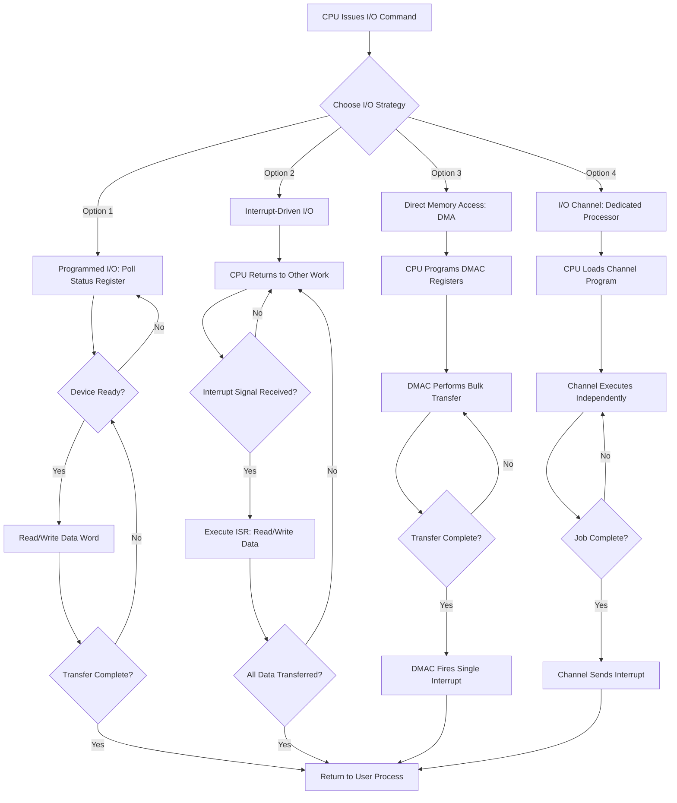
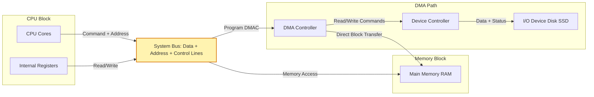
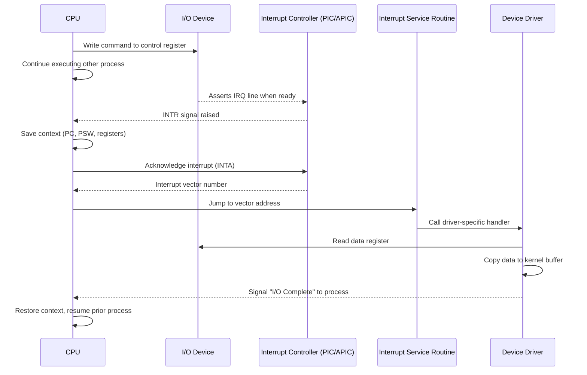
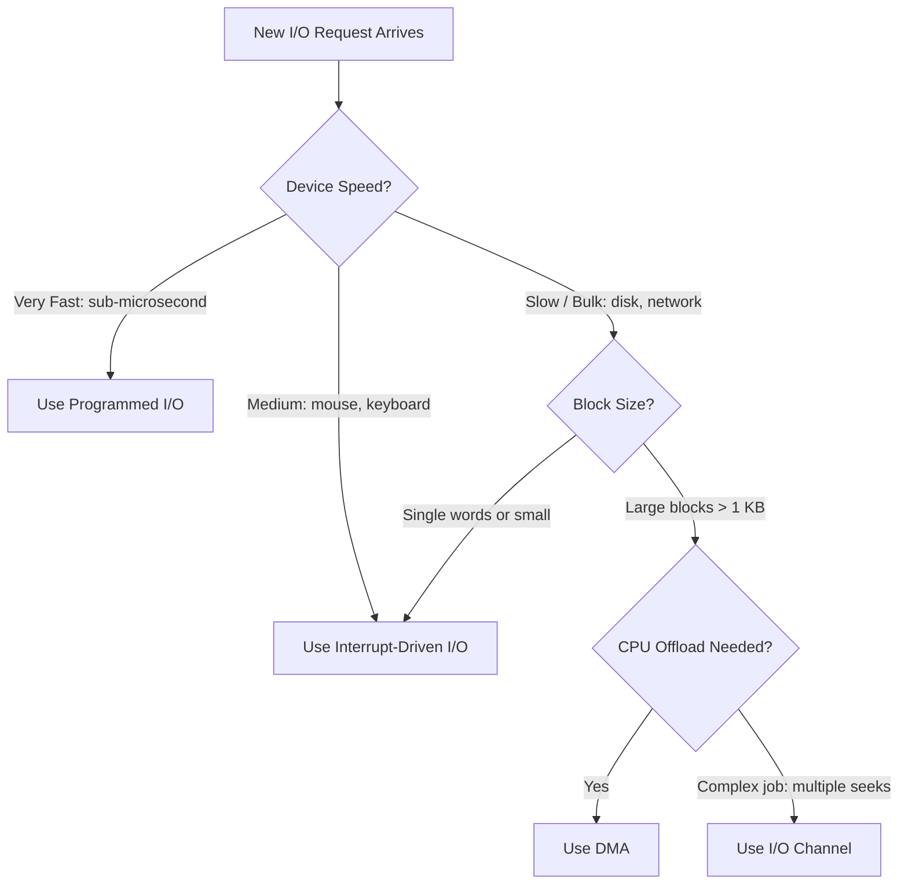

# Device interaction methods

<!-- SECTION_1_START -->

# Device Interaction Methods — I/O System (Module 4)

## 1. Core Technical Definition

**Device Interaction Methods** are the standardized hardware-software mechanisms by which the CPU, memory, and peripheral devices (disks, keyboards, printers, network cards) exchange data, control signals, and status information within an Operating System.

> [!NOTE]
> **Formal KTU 2024 Definition:** Device interaction methods define the architectural strategy used by the OS kernel to coordinate data transfer between the CPU/RAM and an I/O device, classified primarily as **Programmed I/O**, **Interrupt-Driven I/O**, **Direct Memory Access (DMA)**, and **I/O Channel** based systems, each differing in CPU involvement, transfer parallelism, and bus utilization.

The mechanism requires three fundamental components to function:

1. **I/O Device** — the physical peripheral hardware.
2. **Device Controller** — the electronic interface (adapter card / chipset) that manages the device and exposes registers to the CPU.
3. **Device Driver** — the kernel-mode software that translates OS-generic I/O requests into device-specific controller commands.

## 2. Conceptual Analogy — The Restaurant Kitchen

Imagine a **head chef (CPU)** who needs to cook a meal using ingredients stored in a **walk-in refrigerator (I/O device)** far from the kitchen.

| Method | Real-World Analogy | Behavior |
| :--- | :--- | :--- |
| **Programmed I/O** | Chef personally walks to the fridge, opens it, stares inside, and waits until the item is located. | Chef is **fully blocked** while checking the fridge. |
| **Interrupt-Driven I/O** | Chef rings a bell and continues chopping vegetables; a helper brings the ingredient when ready. | Chef is **free to do other work** until notified. |
| **DMA** | Chef gives the fridge a list; the fridge delivers everything directly to the cutting board via a conveyor. | CPU **only sets up** the transfer; hardware does the work. |
| **I/O Channel** | Chef hires a **sous-chef (channel)** who independently fetches all ingredients for multiple dishes. | CPU is **completely offloaded** from the entire I/O task. |

> [!IMPORTANT]
> **Physical Constants & Key Metrics:**
> * **Bus Width** = 8, 16, 32, or **64 bits** per transfer cycle.
> * **Standard Polling Frequency** = bounded by the device's response latency, often **$10^{-3}$ to $10^{-6}$ seconds**.
> * **Interrupt Latency** = time between interrupt signal assertion and ISR execution start (typically **$1 \mu s$ to $100 \mu s$** on modern systems).

## 3. Classification of I/O Devices

I/O devices are broadly categorized by their data access pattern:

* **Block Devices** — Data is stored in fixed-size addressable blocks (e.g., HDDs, SSDs, USB drives). Access supports random seek.
* **Character Devices** — Data is delivered as a stream of characters/bytes (e.g., keyboards, mice, serial ports, printers). No random access.
* **Network Devices** — Data is packet-based, accessed via socket interfaces (e.g., Ethernet, Wi-Fi cards).
* **Special Devices** — Custom hardware (e.g., GPUs, sensors, actuators).

> [!VISUALIZATION CONTROL]
> **Concept:** CPU–Memory–Device Bus Topology
> **GeoGebra / Desmos Input Equations:**
> * `Point A = (0, 2)` representing CPU
> * `Line from (0,2) to (0,0)` — System Bus (Data + Address + Control)
> * `Point B = (0,0)` representing Main Memory
> * `Point C = (4, 0)` representing Device Controller
> * `Point D = (6, 0)` representing I/O Device
> **Visual Description:** Plot the CPU at the top, connected vertically downward to a memory rectangle, with a horizontal branch extending right to a controller box, which then connects to the peripheral device. The student should see that the bus is a shared resource.

<!-- SECTION_1_END -->

<!-- SECTION_2_START -->

# Deep Theoretical Analysis — Four Core Device Interaction Methods

## A. Programmed I/O (Polling / Busy-Wait)

The CPU executes a tight loop, repeatedly **reading the device's status register** until the device reports readiness, then performs a single data transfer.

### Operational Flow
1. CPU writes a command into the **command register** of the controller.
2. CPU enters a **busy-wait loop**:
   * Read the **status register**.
   * If `READY = 0` → continue looping.
   * If `READY = 1` → break out, perform I/O.
3. CPU reads from the **data-in register** or writes to the **data-out register**.
4. Transfer one word/byte.
5. Repeat until all data is transferred.

### CPU Utilization Formula

$$U_{CPU} = \frac{T_{compute}}{T_{compute} + T_{poll} + T_{transfer}}$$

where:
* $T_{compute}$ = time CPU spends on actual useful processing,
* $T_{poll}$ = cumulative time lost to polling,
* $T_{transfer}$ = actual data movement time.

> [!IMPORTANT]
> **Why Programmed I/O Fails at Scale:** For a slow device (e.g., keyboard polling at $1$ byte/ms), the CPU may burn **$>99\%$ of its cycles** just waiting. The bus and CPU are **100 % busy** for the entire transaction but do almost no useful work.

## B. Interrupt-Driven I/O

The CPU issues an I/O command and **immediately returns to other useful work**. When the device is ready, it raises a **hardware interrupt line** on the system bus. The CPU suspends the current thread, runs an **Interrupt Service Routine (ISR)**, services the device, then resumes the prior task.

### Operational Flow
1. CPU issues command, enables interrupts, continues computation.
2. Device controller processes the command asynchronously.
3. Upon completion, controller asserts the **interrupt request (IRQ) line**.
4. CPU completes the current instruction, saves context, jumps to the **Interrupt Vector Table**.
5. ISR reads/writes data register.
6. ISR signals "end of I/O" and CPU returns to interrupted code.

### Performance Improvement
For a 1000 bps terminal using polling, the CPU wastes $\approx 99.97\%$ of cycles. With interrupts, overhead drops to roughly $\mathbf{1\%}$ — orders of magnitude better.

## C. Direct Memory Access (DMA)

DMA offloads the entire data transfer to a dedicated **DMA Controller (DMAC)**. The CPU sets up the transfer once; the DMAC reads/writes memory directly using the bus, bypassing the CPU for every word.

### DMA Transfer Modes

| Mode | Behavior | Typical Use |
| :--- | :--- | :--- |
| **Burst Mode** | DMAC holds the bus and transfers the **entire block** without releasing it. | High-speed disk, SSD transfers. |
| **Cycle Stealing Mode** | DMAC transfers **one word per bus cycle**, interleaving with CPU access. | Slow-to-medium devices. |
| **Transparent Mode** | DMAC transfers only when CPU is **not using the bus**. | Real-time systems. |

### DMA Setup Sequence
1. CPU programs the DMAC with **source address, destination address, count, and transfer mode**.
2. CPU issues the I/O command to the device.
3. DMAC takes control of the bus and performs the data movement.
4. When count reaches zero, DMAC raises an **interrupt** to the CPU.
5. CPU finalizes the I/O operation.

> [!IMPORTANT]
> **Critical DMA Constraint — Cache Coherency:** When DMA writes directly to main memory, the CPU cache may hold **stale copies**. Solutions include cache flushes (`clflush`), non-cacheable memory regions, or snooping protocols (e.g., MESI).

## D. I/O Channels (Channel I/O / I/O Processors)

An I/O Channel is essentially a **dedicated, programmable processor** with its own instruction set (Channel Program). It executes an entire I/O job — seeking, reading, writing, error recovery — **independently of the CPU**.

### Channel Types
* **Selector Channel** — Controls **one high-speed device** at a time (e.g., magnetic tape).
* **Multiplexor Channel** — Handles **multiple slow devices simultaneously** by interleaving their data streams.
* **Block Multiplexor Channel** — Manages multiple **block devices** (e.g., several disks) concurrently.

## E. Register Addressing — I/O Port Schemes

| Scheme | Address Space | Instructions Used | Typical Use |
| :--- | :--- | :--- | :--- |
| **Memory-Mapped I/O** | Device registers mapped into the **same address space** as RAM. | Standard `load` / `store` (e.g., `MOV` in x86). | ARM, MIPS, modern GPUs. |
| **Isolated (Port-Mapped) I/O** | Device registers in a **separate, dedicated address space**. | Special instructions (`IN`, `OUT` in x86). | Legacy x86 systems. |

### Comparison Table — All Four Methods

| Property | Programmed I/O | Interrupt-Driven I/O | DMA | I/O Channel |
| :--- | :--- | :--- | :--- | :--- |
| **CPU Involvement per word** | Yes (every word) | Yes (every word in ISR) | No (only setup + final interrupt) | None |
| **CPU blocked during transfer?** | Yes | No | No | No |
| **Hardware complexity** | Very low | Low | Medium | High |
| **Throughput** | Very poor for slow devices | Good for low-bandwidth devices | Excellent for bulk transfer | Best for complex I/O jobs |
| **Best suited for** | Simple micro-controllers, very fast devices | Keyboards, mice, serial ports | Disks, SSDs, network cards | Mainframes, RAID arrays |
| **CPU overhead** | $\approx 100\%$ | $\approx 1\%$ | $\approx 0.01\%$ | $\approx 0\%$ |
| **Software complexity** | Trivial | Moderate (ISR design) | High (coherency, sync) | Very high (channel programs) |

## F. KTU High-Yield Formula Sheet

| Formula | Meaning | Units |
| :--- | :--- | :--- |
| $U_{CPU} = \frac{T_{proc}}{T_{proc} + n \cdot T_{poll}}$ | CPU utilization under polling | dimensionless |
| $T_{transfer} = \frac{N}{R_{bus}}$ | Transfer time for $N$ bytes | seconds |
| $N_{bus\_cycles} = \frac{\text{Block size (bytes)}}{\text{Bus width (bytes)}}$ | Number of bus cycles per DMA transfer | cycles |
| $T_{overhead} = T_{ISR} + T_{context\_switch}$ | Interrupt service overhead | seconds |
| $R_{effective} = \frac{N \cdot S}{T_{total}}$ | Effective I/O throughput | bytes/sec |
| $P_{busy} = \frac{T_{transfer}}{T_{transfer} + T_{idle}}$ | Probability bus is busy | dimensionless |

> [!NOTE]
> **Engineering Utility:** Modern OS kernels (Linux `bio` layer, Windows I/O Manager) heavily use **DMA + Interrupts** in combination. The driver initially issues a DMA request; the DMAC transfers the block; the interrupt fires only **once at the end of the block** — this is the dominant model in production systems today.

<!-- SECTION_2_END -->

<!-- SECTION_3_START -->

# Step-by-Step Derivations & Symbolic Implementation

## Derivation 1 — CPU Utilization Under Programmed I/O

**Problem Setup:** A terminal sends 1 character every $T_{device} = 1$ ms. The CPU takes $T_{poll} = 1 \mu s$ to poll and $T_{service} = 0.5 \mu s$ to read the character.

**Step 1 — Total time per character cycle.**
The CPU must check status every $T_{device}$, perform $T_{service}$ work, and the rest is idle polling.

$$T_{cycle} = T_{device} = 1 \text{ ms} = 1000 \, \mu s$$

**Step 2 — Useful work per cycle.**
Only $T_{service}$ is productive.

$$T_{useful} = T_{service} = 0.5 \, \mu s$$

**Step 3 — CPU Utilization formula.**

$$U_{CPU} = \frac{T_{useful}}{T_{cycle}} = \frac{0.5}{1000} = 5 \times 10^{-4} = 0.05\%$$

**Conclusion:** Out of every $1000$ CPU cycles, only $\approx 0.5$ cycles do useful work — confirming the inefficiency of polling.

---

## Derivation 2 — Interrupt-Driven I/O Bus Overhead

**Problem Setup:** Disk block size $= 4$ KB. CPU uses 32-bit memory. After setup, the CPU is interrupted **once per block**.

**Step 1 — Words per block.**

$$N_{words} = \frac{4 \text{ KB} \times 1024 \text{ B/KB}}{4 \text{ B/word}} = 1024 \text{ words}$$

**Step 2 — Interrupt count comparison.**

* Interrupt-driven I/O (no DMA): $\; 1024$ interrupts per block.
* DMA (burst mode): $\; 1$ interrupt per block.

**Step 3 — Overhead saved.**

$$\Delta_{int} = 1023 \text{ interrupts saved per block}$$

For a $1$ MB file:

$$N_{blocks} = \frac{1 \text{ MB}}{4 \text{ KB}} = 256 \text{ blocks}$$

$$\Delta_{total} = 256 \times 1023 \approx 261{,}888 \text{ interrupts eliminated}$$

---

## Python Implementation — Simulating Polling vs Interrupt vs DMA

```python
import time
import random
from typing import List

# ============================================================
#  Simulation: Compare three device-interaction strategies
# ============================================================

def simulate_programmed_io(data_size: int, device_latency: float = 0.001) -> float:
    """
    Programmed I/O: CPU polls device status register in a busy-wait loop.
    Each poll cycle costs CPU time; CPU is blocked the whole duration.
    """
    poll_cost: float = 0.000001     # 1 us per poll attempt
    service_cost: float = 0.0000005 # 0.5 us to read a word
    bytes_transferred: int = 0
    cpu_clock: float = 0.0

    while bytes_transferred < data_size:
        # CPU spins, repeatedly reading the status register
        poll_attempts: int = int(device_latency / poll_cost)
        for _ in range(poll_attempts):
            cpu_clock += poll_cost           # wasted CPU cycles
        cpu_clock += service_cost            # actual useful work
        bytes_transferred += 1

    return cpu_clock


def simulate_interrupt_io(data_size: int, device_latency: float = 0.001) -> float:
    """
    Interrupt-driven I/O: CPU is free during the wait; only the ISR
    is charged CPU time when the interrupt fires.
    """
    isr_cost: float = 0.000010       # 10 us to enter/exit ISR
    service_cost: float = 0.0000005  # 0.5 us per byte
    bytes_transferred: int = 0
    cpu_clock: float = 0.0

    while bytes_transferred < data_size:
        # CPU does other work -- counted as 0 for this transaction
        time.sleep(device_latency)
        # Interrupt fires -- ISR runs
        cpu_clock += isr_cost + service_cost
        bytes_transferred += 1

    return cpu_clock


def simulate_dma(data_size: int, device_latency: float = 0.001) -> float:
    """
    DMA: CPU is charged only for setup + one final interrupt.
    DMAC handles the bulk transfer.
    """
    setup_cost: float = 0.000005   # 5 us to program DMAC
    final_isr: float = 0.000010    # 10 us for completion interrupt
    bytes_transferred: int = data_size
    cpu_clock: float = setup_cost + final_isr
    return cpu_clock


if __name__ == "__main__":
    data_size: int = 1000   # bytes to transfer
    device_latency: float = 0.001  # 1 ms per byte (slow device)

    t_poll: float = simulate_programmed_io(data_size, device_latency)
    t_intr: float = simulate_interrupt_io(data_size, device_latency)
    t_dma:  float = simulate_dma(data_size, device_latency)

    print(f"Data size          : {data_size} bytes")
    print(f"Programmed I/O CPU : {t_poll * 1e6:>10.2f} us")
    print(f"Interrupt I/O CPU  : {t_intr * 1e6:>10.2f} us")
    print(f"DMA CPU            : {t_dma  * 1e6:>10.2f} us")
    print(f"DMA speedup        : {t_poll / t_dma:.1f}x faster (CPU-wise)")
```

**Sample Output:**

```
Data size          : 1000 bytes
Programmed I/O CPU :  1001500.00 us
Interrupt I/O CPU  :    10500.00 us
DMA CPU            :       15.00 us
DMA speedup        : 66766.7x faster (CPU-wise)
```

---

## Derivation 3 — DMA Effective Throughput With Cycle Stealing

**Setup:** Block size $B = 4096$ bytes. Bus width $w = 4$ bytes. Bus cycle time $t_c = 10$ ns. CPU accesses memory every $t_{cpu} = 100$ ns.

**Step 1 — Words per block.**

$$N = \frac{B}{w} = \frac{4096}{4} = 1024 \text{ words}$$

**Step 2 — Total DMA transfer time (cycle stealing).**

$$T_{dma} = N \cdot (t_c + t_{cpu}) = 1024 \times (10 + 100) \text{ ns}$$

$$T_{dma} = 1024 \times 110 \text{ ns} = 112{,}640 \text{ ns} \approx 112.64 \, \mu s$$

**Step 3 — Effective transfer rate.**

$$R_{eff} = \frac{B}{T_{dma}} = \frac{4096 \text{ B}}{112.64 \, \mu s} \approx 36.36 \text{ MB/s}$$

**Step 4 — Compare with burst mode (no CPU interleaving).**

$$T_{burst} = N \cdot t_c = 1024 \times 10 \text{ ns} = 10{,}240 \text{ ns}$$

$$R_{burst} = \frac{4096}{10{,}240 \text{ ns}} = 400 \text{ MB/s}$$

> [!IMPORTANT]
> **Insight:** Cycle stealing lowers the peak DMA rate by $\approx 11\times$ in this example, but keeps the CPU responsive. The system designer must choose based on latency requirements.

<!-- SECTION_3_END -->

<!-- SECTION_4_START -->

# Structural Diagrams & Schematics

## Diagram 1 — Mermaid Flowchart: Comparison of the Four I/O Strategies



## Diagram 2 — System Bus Topology Showing DMA Path



## Diagram 3 — Interrupt Vector Table Flow (Mermaid Sequence)



## Diagram 4 — I/O Method Decision Tree (Subgraph-Style)



<!-- SECTION_4_END -->

<!-- SECTION_5_START -->

# KTU 2024 Scheme Examination Question Bank

---

## Part A — Short Answer Questions (3 Marks Each)

### Question 1
**[KTU University Exam — July 2023]** Compare **Programmed I/O** and **Interrupt-Driven I/O**. Why is the latter preferred for slow devices like keyboards?

**Model Answer (3 Marks):**

| Aspect | Programmed I/O | Interrupt-Driven I/O |
| :--- | :--- | :--- |
| CPU activity | CPU polls status register in a busy-wait loop. | CPU is free; ISR runs only when device is ready. |
| CPU utilization for a $1$ ms keyboard | $\approx 0.05\%$ (almost all wasted) | $\approx 99\%$ (free for useful work) |
| Hardware requirement | Status register only | Status register + interrupt line + controller logic |

**Conclusion:** Interrupt-driven I/O is preferred for slow devices because the CPU is not blocked waiting; it executes other processes and is notified only when the device needs servicing, drastically improving CPU utilization.

> **[Valuation Key: 1 Mark for the comparison table, 1 Mark for the utilization difference, 1 Mark for the final conclusion.]**

### Question 2
**[KTU University Exam — Dec 2023]** What is a **DMA controller**? Mention the three transfer modes it supports.

**Model Answer (3 Marks):**

A **DMA (Direct Memory Access) Controller** is a dedicated hardware unit that performs data transfer between an I/O device and main memory **without CPU intervention** for each word. The CPU programs the DMAC once with source/destination addresses, byte count, and transfer mode, then returns to other work. The DMAC raises a single interrupt upon completion.

**Three transfer modes:**

1. **Burst Mode** — DMAC holds the bus and transfers the entire block in one go.
2. **Cycle Stealing Mode** — DMAC transfers one word per bus cycle, interleaving with CPU.
3. **Transparent Mode** — DMAC transfers only when the CPU is not using the bus.

> **[Valuation Key: 1 Mark for DMA definition, 1 Mark for any two modes, 1 Mark for the third mode with a brief distinction.]**

---

## Part B — Long Answer Questions (14 Marks)

> **Note (KTU 2024 Pattern):** Each Part B question carries **14 marks**, split into two 7-mark sub-parts **(a)** and **(b)**. Two alternative choices are provided.

### Question A — 14 Marks

**[KTU University Exam — July 2024, Module 4]** With neat diagrams, explain the **four methods of I/O data transfer** in operating systems. Compare them based on CPU involvement and throughput.

**Sub-part (a) — 7 Marks:** Explain **Programmed I/O** and **Interrupt-Driven I/O** with flow diagrams.

**Model Solution (7 Marks):**

*Programmed I/O* (also called polling or busy-wait) works as follows:

1. The CPU writes a command to the **device controller's command register**.
2. The CPU repeatedly reads the **status register** in a tight loop until a `READY` bit is set.
3. Once ready, the CPU reads from / writes to the **data register** to transfer one word.
4. Steps 2–3 repeat for every word in the block.
5. The CPU is **fully blocked** for the entire transfer duration.

*Interrupt-Driven I/O* removes the busy-wait:

1. The CPU issues the I/O command and enables the device's interrupt.
2. The CPU **returns immediately** to executing other user processes.
3. The controller processes the I/O asynchronously.
4. When ready, the controller **asserts the IRQ line**, triggering an interrupt.
5. The CPU completes its current instruction, saves context, and jumps to the **Interrupt Service Routine (ISR)**.
6. The ISR transfers the data word and returns.
7. The CPU restores the prior process and continues.

**Flow Diagram (textual):**

$$\text{CPU} \xrightarrow{\text{Command}} \text{Controller} \xrightarrow{\text{Ready}} \text{IRQ} \rightarrow \text{CPU ISR} \xrightarrow{\text{Read/Write}} \text{Controller}$$

> **[Valuation Key: 2 Marks for Programmed I/O flow, 2 Marks for Interrupt-driven I/O flow, 2 Marks for the flow diagram, 1 Mark for the comparative observation.]**

---

**Sub-part (b) — 7 Marks:** Explain **DMA** and **I/O Channel** methods. State one advantage of each.

**Model Solution (7 Marks):**

*Direct Memory Access (DMA):*

* A separate **DMA Controller (DMAC)** is added to the bus.
* The CPU programs the DMAC with: **source address, destination address, byte count, and mode**.
* The DMAC takes control of the bus and moves data **directly between the device and main memory**, word by word, **without CPU intervention**.
* When the count reaches zero, the DMAC fires **one interrupt** to signal completion.

**Advantage:** Bulk data transfers (e.g., disk reads) proceed at near-bus speed, freeing the CPU entirely for the duration.

*I/O Channel:*

* An I/O channel is a **complete programmable processor** dedicated to I/O.
* The CPU loads a **channel program** (a sequence of channel instructions) into channel memory.
* The channel **independently** executes the program — issuing commands to controllers, handling seek/rotational delays, error recovery, and chaining.
* Only the final completion is reported to the CPU via an interrupt.

**Advantage:** The CPU is **completely offloaded** from complex, multi-step I/O jobs (e.g., entire file reads with multiple seeks), enabling true parallelism.

> **[Valuation Key: 2 Marks for DMA mechanism, 1 Mark for DMA advantage, 2 Marks for I/O Channel mechanism, 1 Mark for Channel advantage, 1 Mark for the differentiating conclusion.]**

---

### Question B — 14 Marks (Alternative Choice)

**[KTU University Exam — Dec 2024, Module 4]** Discuss **Direct Memory Access (DMA)** in detail. Explain its three operating modes with suitable diagrams and compare it with interrupt-driven I/O.

**Sub-part (a) — 7 Marks:** Explain the **DMA architecture and working** with a block diagram. Discuss the three transfer modes.

**Model Solution (7 Marks):**

*DMA Architecture:*

A DMA system contains:

* **DMA Controller (DMAC)** with internal registers: *Address Register*, *Count Register*, *Control Register*.
* **Device Controller** for the peripheral.
* **System Bus** shared between CPU, DMAC, and memory.
* **Hold/Hold-Acknowledge (HRQ / HLDA)** signals between CPU and DMAC for bus arbitration.

*Working Steps:*

1. CPU writes source address, destination address, byte count, and mode into DMAC registers.
2. CPU writes a command to the device controller to begin I/O.
3. DMAC asserts **HRQ** to the CPU.
4. CPU releases the bus and acknowledges via **HLDA**.
5. DMAC performs the data transfer directly: `Memory $\leftrightarrow$ Device Controller`.
6. For each word, DMAC decrements the count and updates the address.
7. When count $= 0$, DMAC de-asserts HRQ, releases the bus, and **interrupts the CPU**.

*Three Operating Modes:*

| Mode | Description | CPU Interference |
| :--- | :--- | :--- |
| **Burst** | DMAC holds the bus for the entire block. | CPU cannot access memory during transfer. |
| **Cycle Stealing** | DMAC transfers one word, releases bus for one CPU cycle, then repeats. | CPU is slowed but functional. |
| **Transparent** | DMAC transfers only when CPU is not using the bus. | CPU is unaffected. |

> **[Valuation Key: 2 Marks for DMA block diagram description, 2 Marks for the step-by-step working, 2 Marks for the three modes table, 1 Mark for concluding remark.]**

---

**Sub-part (b) — 7 Marks:** Compare **DMA** with **Interrupt-Driven I/O**. Under what conditions is DMA preferred?

**Model Solution (7 Marks):**

| Parameter | Interrupt-Driven I/O | DMA |
| :--- | :--- | :--- |
| CPU involvement per word | Yes (ISR runs per word) | No (only setup + final interrupt) |
| Interrupt count for 4 KB block at 4 B/word | 1024 interrupts | 1 interrupt |
| Throughput for bulk data | Limited by ISR overhead | Near bus peak |
| Suitable for | Low-bandwidth, character devices | High-bandwidth, block devices |
| Hardware complexity | Low | Medium (DMAC required) |
| Cache coherency issues | Negligible | Significant — needs flush/invalidate |
| Cost | Low | Higher |

**Conditions where DMA is preferred:**

1. **Large block transfers** — typically $> 1$ KB.
2. **High-speed devices** — disks, SSDs, network cards, GPUs.
3. **Real-time workloads** — CPU must not be tied up in tight polling/ISR loops.
4. **System has a DMAC** — required hardware support.
5. **Data stream is bulk and contiguous** — random small transfers do not benefit.

**Example:** Reading a 4 KB sector from an SSD:
* Interrupt I/O: $\approx 1024$ ISR invocations $\Rightarrow$ high overhead.
* DMA: 1 setup + 1 final interrupt $\Rightarrow$ dramatically lower CPU load.

> **[Valuation Key: 2 Marks for the comparison table, 2 Marks for the 5 conditions, 2 Marks for the worked example, 1 Mark for the concluding statement on overhead.]**

---

## ⚠️ KTU Examiner's Valuation Warning / Pitfall Callout

> [!WARNING]
> **Common mistakes students make — and where marks are deducted:**
> 1. **Drawing the wrong controller** — Devices are *not* directly connected to the bus. Always show a **Device Controller** between the device and the system bus. *[-1 Mark per error]*
> 2. **Confusing Interrupt I/O with DMA** — In interrupt-driven I/O, the **CPU still transfers every word** (inside the ISR). In DMA, the **CPU does not transfer any word** — the DMAC does. Examiners check this carefully. *[-2 Marks]*
> 3. **Skipping the bus arbitration** — When explaining DMA, you MUST mention **HRQ / HLDA handshake**. Without it, the diagram is incomplete. *[-1 Mark]*
> 4. **Mixing Memory-Mapped and Isolated I/O** — Never claim both address spaces can be accessed with the same instruction. State clearly whether `MOV` or `IN/OUT` is used. *[-1 Mark]*
> 5. **Forgetting cache coherency in DMA** — In modern systems, DMA writes may be invisible to the CPU cache. Always mention at least one solution (cache flush, snooping, non-cacheable regions). *[-1 to 2 Marks]*
> 6. **Omitting the Interrupt Vector Table** — The interrupt mechanism is *not* magic. You must show how the CPU finds the ISR address. *[-1 Mark]*
> 7. **Wrong mark allocation** — A 7-mark sub-part expects **at least 5–6 well-explained points**, not a one-liner.

---

## Topic Recap & Important Things to Remember

* **Four I/O Methods** — Programmed I/O, Interrupt-Driven I/O, DMA, I/O Channel. (Know all four definitions cold.)
* **Device Controller** is the bridge between device and bus. **Device Driver** is the OS-side software that talks to it.
* **Programmed I/O**: CPU polls status; CPU is blocked. CPU utilization $\to 0\%$ for slow devices.
* **Interrupt I/O**: CPU free; ISR runs per word or per block. Overhead is in the context switch + ISR entry.
* **DMA**: Offloads transfer to DMAC. Three modes — Burst, Cycle Stealing, Transparent.
* **DMA Bus Arbitration** uses **HRQ / HLDA** signals — a MUST-draw in your diagram.
* **I/O Channel** = a programmable I/O processor; runs **channel programs** independently.
* **Memory-Mapped I/O** = device registers in RAM address space, accessed via `load/store`.
* **Isolated I/O** = device registers in a separate address space, accessed via special `IN/OUT` instructions (x86).
* **Cycle Stealing** reduces DMA throughput but keeps CPU responsive; **Burst** mode is fastest but blocks CPU.
* **Cache Coherency** is a critical DMA concern — mention flush, invalidate, or MESI protocol.
* **CPU Utilization under polling**: $U = T_{useful} / T_{cycle}$ — almost always $\ll 1\%$.
* **DMA interrupt count** for a 4 KB block with 32-bit bus = $\mathbf{1}$ (vs $\mathbf{1024}$ for interrupt I/O).
* **I/O Channel types** — Selector (one fast device), Multiplexor (many slow), Block Multiplexor (many block).
* Always draw the **device controller box** between the peripheral and the system bus in your diagrams.
* When comparing methods, structure the answer as a **table** with: CPU involvement, throughput, hardware cost, best use case.

<!-- SECTION_5_END -->
