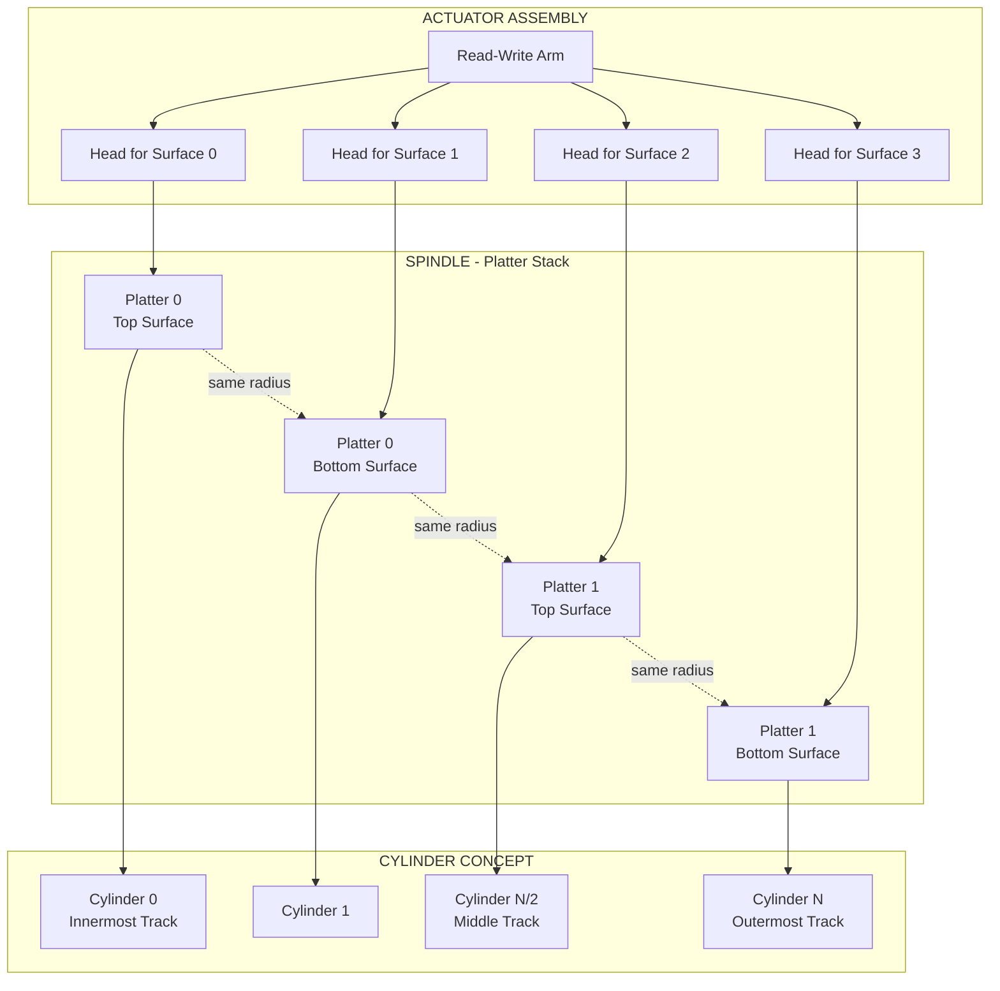
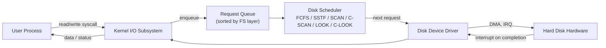
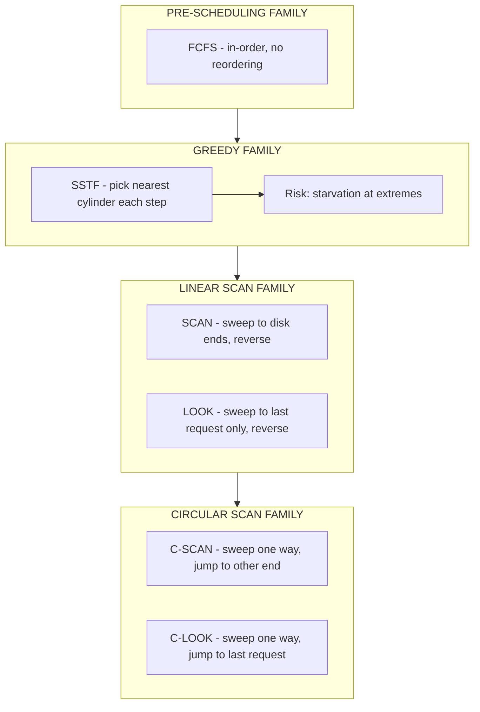
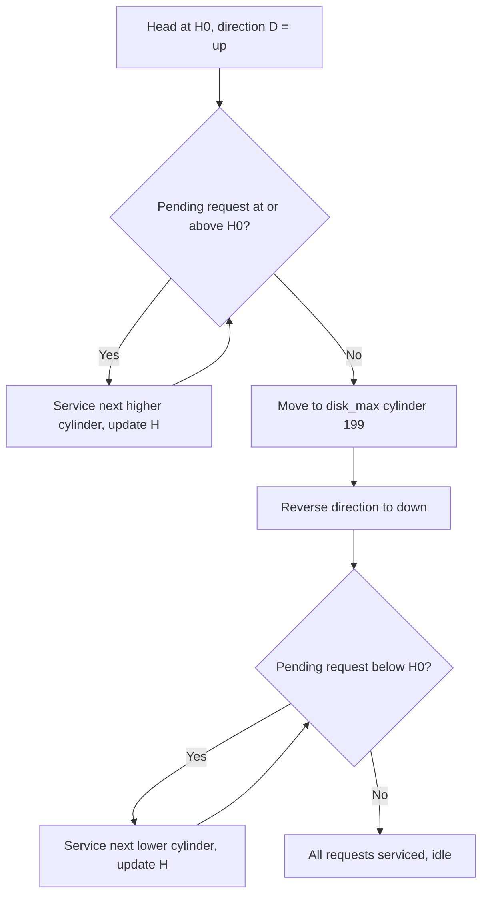

# disk scheduling

<!-- SECTION_1_START -->

# Disk Scheduling — I/O System (Module 4)

## 1.1 Formal Definition (KTU 2024 Syllabus Terminology)

> [!NOTE]
> **Disk Scheduling** is the policy employed by the operating system to determine the order in which pending I/O requests to the secondary storage device are serviced by the **disk arm** (also called the *read/write head assembly*). The objective is to **minimise the total head movement (seek distance)** subject to the geometric constraints of the disk, thereby reducing the *mean response time* and improving the *disk bandwidth*.

The disk is modelled as a linear sequence of **cylinders** (logically concentric tracks stacked vertically). A request queue is a list of cylinder numbers awaiting service. A scheduling algorithm rearranges this queue to optimise a chosen metric.

The formal performance metric used in KTU examinations is:

$$
T_{\text{access}} = T_{\text{seek}} + T_{\text{rotational}} + T_{\text{transfer}}
$$

where $T_{\text{seek}}$ is the function of the head's positional movement, $T_{\text{rotational}}$ is the latency incurred while waiting for the correct sector to rotate under the head, and $T_{\text{transfer}}$ is the time to actually move the bytes onto the bus.

## 1.2 Conceptual Analogy — The Elevator / Librarian Metaphor

> [!IMPORTANT]
> **Imagine a librarian** in a vast multi-storey library. Patrons (processes) keep submitting slips requesting books from various shelf numbers (cylinders). The librarian must walk to each shelf, pick the book, and return it. If the librarian services requests in the exact order they arrive (**FCFS**), she will zigzag across the building, covering huge distance.
>
> A smarter librarian will always pick the **nearest un-served request first** (**SSTF**). An even smarter one, like a building elevator, will **walk in one direction**, serving every requested shelf on the way, then **reverse** at the extreme and walk back (**SCAN**). Some elevators don't go all the way to the top and bottom floors — they reverse at the **furthest requested floor** (**LOOK**). Circular variants (**C-SCAN, C-LOOK**) treat the building as a **loop**, ensuring fairness to requests on the just-served end.

The disk arm behaves identically. Each cylinder is a "shelf", and the cost of moving between shelves is a **seek** — a slow, mechanical operation measured in milliseconds. The "walking distance" of the librarian is the **total head movement** of the arm.

## 1.3 Physical Disk Structure — Why Scheduling Matters

A modern hard disk consists of:

- **Platters** — circular, rigid disks coated with magnetic material, rotating at a constant angular velocity (commonly **5400, 7200, 10 000, or 15 000 RPM**).
- **Tracks** — concentric circles on a platter surface.
- **Sectors** — arc segments of a track; smallest addressable unit (typically **512 bytes** or **4 096 bytes**).
- **Cylinders** — the set of tracks at the same radial distance across all platter surfaces.
- **Spindle / Rotor** — the motor spinning the platters.
- **Read/Write Head** — mounted on a movable **arm**, one per surface.
- **Actuator** — positions the arm; mechanical, hence the dominant source of latency.

> [!IMPORTANT]
> **Key physical fact for KTU:** *Seek time* is **purely mechanical** (milliseconds) and **orders of magnitude larger** than *transfer time* (microseconds). It is the only component of $T_{\text{access}}$ that the OS scheduler can directly influence, which is why **reducing head movement is the central goal of disk scheduling**.

## 1.4 Visualisation of Cylinder Geometry

> [!VISUALIZATION CONTROL]
> **Concept:** Concentric-track / cylinder abstraction of a multi-platter disk
> **GeoGebra / Desmos Input Equations:**
> * `x = r cos(t), y = r sin(t)` for `r in {1, 2, 3, 4, 5}` and `t in [0, 2 pi]`
> * `x = 0, y = -5 .. 5` (vertical reference for the arm)
> **Visual Description:** A family of concentric circles representing tracks on a single surface. The vertical line through the centre represents the **head arm axis** sweeping radially. Requests arriving at different radii (cylinders) cause the arm to jump inwards or outwards. The minimum movement problem is to find the *Hamiltonian path* that visits all given radii with least radial travel.

---

<!-- SECTION_1_END -->

<!-- SECTION_2_START -->

# Deep Theoretical Analysis & KTU High-Yield Formula Sheet

## 2.1 Performance Metrics Deconstructed

| Metric | Definition | Typical Magnitude | Where it dominates |
|---|---|---|---|
| **Seek time** $T_s$ | Time to move the arm from current cylinder to target | **3 – 10 ms** | Random small I/O workloads |
| **Rotational latency** $T_r$ | Time for the correct sector to arrive under the head | **½ of one full rotation** | Sequential access on slow disks |
| **Transfer time** $T_{tr}$ | Time to read/write the bytes once positioned | **< 1 ms per sector** | Large sequential reads |
| **Queueing delay** $T_q$ | Time a request waits in the OS queue | **highly variable** | High I/O concurrency |

For a disk spinning at $N$ RPM, the **average rotational latency** is the time taken for half a revolution:

$$
T_{r} = \frac{1}{2} \times \frac{60}{N} \text{ seconds}
$$

For a 7200 RPM drive:

$$
T_r = \frac{1}{2} \times \frac{60}{7200} = 4.16 \text{ ms}
$$

The **transfer time** for a block of $B$ bytes, with each track holding $K$ bytes, is:

$$
T_{tr} = \frac{B}{K} \times \frac{60}{N} \text{ seconds}
$$

## 2.2 The Six Classical Disk Scheduling Algorithms

### 2.2.1 FCFS — First-Come First-Served
Requests are serviced in the order they enter the queue. **No reordering, no starvation, no optimisation.** It is the simplest strategy and serves as the *baseline* for comparison.

- **Pros:** Trivially fair; no overhead.
- **Cons:** Wild, unnecessary head swings; the worst average seek time of all algorithms in general.

### 2.2.2 SSTF — Shortest Seek Time First (a.k.a. SJF for disks)
A greedy strategy: always pick the request whose cylinder is **closest to the current head position**. It is analogous to **Shortest Job First (SJF)** in CPU scheduling and inherits the same theoretical problem: **starvation** for requests at the extremes of the disk.

- **Pros:** Drastically lower total head movement than FCFS.
- **Cons:** **Starvation** is possible; not optimal globally; not optimal in time because it ignores rotational direction.

### 2.2.3 SCAN — The Elevator Algorithm
The head moves in **one direction** (say, increasing cylinder numbers), servicing every request in its path, until it reaches the **last cylinder** of the disk. It then **reverses direction** and services the requests on the way back.

- **Pros:** Bounded waiting time; no starvation.
- **Cons:** Requests at the *most recently passed* end wait the longest (unfairness); unnecessary travel to the disk ends.

### 2.2.4 C-SCAN — Circular SCAN
The head moves in one direction servicing requests, jumps to the **other extreme** of the disk, then resumes servicing in the *same* direction. By treating the disk as a **circular list**, every request gets a uniform wait (fairness on a system scale).

- **Pros:** Uniform waiting time, good for heavy loads.
- **Cons:** The return jump is a wasted seek; more total head movement than SCAN in some patterns.

### 2.2.5 LOOK
Identical to SCAN, **except the head reverses at the *farthest pending request* in each direction** rather than travelling to the physical end of the disk.

- **Pros:** Eliminates wasted travel to disk ends; almost identical in spirit to SCAN.
- **Cons:** Still slightly unfair to the edges of the most recently served half.

### 2.2.6 C-LOOK
The circular variant of LOOK. The head services all requests in one direction up to the *farthest pending request*, jumps to the *farthest pending request on the other side*, and resumes in the same direction. **No travel to disk ends anywhere.**

- **Pros:** Best of both worlds — uniform fairness like C-SCAN, no wasted end-travel like LOOK.
- **Cons:** The circular jump is still a full-distance seek.

## 2.3 KTU Formula Sheet (Cheat Sheet)

> [!NOTE]
> The following table contains **every** equation you will need to solve any disk-scheduling problem asked in the KTU B.Tech examination. Master these and you will not lose a single mark on the *calculation* portion.

| # | Quantity | Formula / Definition | Unit |
|---|---|---|---|
| 1 | Total head movement | $\sum_{i=1}^{n} \vert H_{i+1} - H_i \vert$ | cylinders |
| 2 | Average seek length | $\dfrac{\text{Total head movement}}{n}$ | cylinders/request |
| 3 | Total I/O service time | $T_s + T_r + T_{tr}$ | ms |
| 4 | Average rotational latency | $\dfrac{30}{N}$ where $N$ is RPM | ms |
| 5 | Transfer time | $\dfrac{B}{K} \times \dfrac{60}{N}$ | ms |
| 6 | Throughput | $\dfrac{\text{Bytes transferred}}{T_s + T_r + T_{tr}}$ | bytes/sec |
| 7 | C-SCAN circular overhead | $\vert \text{max\_cyl} - \text{min\_cyl} \vert$ | cylinders |
| 8 | C-LOOK circular overhead | $\vert \text{max\_request} - \text{min\_request} \vert$ | cylinders |

## 2.4 Engineering Utility — Where Disk Scheduling Lives in Real Systems

| Domain | Algorithm typically used | Why |
|---|---|---|
| Early personal computers (DOS) | FCFS | Simplicity, low request volume |
| General-purpose servers (Linux `cfq`, Windows default) | variants of **LOOK / deadline** | Avoid starvation while keeping seek low |
| Real-time databases | C-SCAN | Predictable, bounded wait |
| SSD controllers | **None** (or no-op) | SSDs have **no seek time**; wear-levelling is the concern |
| Tape / optical jukeboxes | SSTF | Random-access seek is the bottleneck |
| Modern NVMe with multiple queues | **Multi-queue aware variants** | Parallelism across many cores |

> [!IMPORTANT]
> **KTU 2024 highlight:** In the question bank, you are expected to *trace* the head movement for any of the six algorithms given a request queue and an initial head position, and to *calculate the total seek distance*. Always show the sequence explicitly.

---

<!-- SECTION_2_END -->

<!-- SECTION_3_START -->

# Step-by-Step Derivations, Traces & Code Implementation

## 3.1 The Reference KTU Example

We will use the **canonical Silberschatz** problem, which appears almost verbatim in KTU model papers.

> **Initial head position:** $H_0 = 53$
> **Request queue:** $\{98, 183, 37, 122, 14, 124, 65, 67\}$
> **Disk range:** Cylinders $0$ to $199$
> **Direction of head movement (assumed for SCAN-family):** *towards increasing cylinder numbers* (i.e., up first)

We will exhaustively trace every algorithm and write the full Python simulator.

---

## 3.2 Algorithm 1 — FCFS

### 3.2.1 Manual Trace

The head services requests in the order they arrived. No reordering.

$$
\text{Service order: } 53 \to 98 \to 183 \to 37 \to 122 \to 14 \to 124 \to 65 \to 67
$$

Step-by-step movement calculation:

$$
\begin{aligned}
d_1 &= \vert 98 - 53 \vert = 45 \\
d_2 &= \vert 183 - 98 \vert = 85 \\
d_3 &= \vert 37 - 183 \vert = 146 \\
d_4 &= \vert 122 - 37 \vert = 85 \\
d_5 &= \vert 14 - 122 \vert = 108 \\
d_6 &= \vert 124 - 14 \vert = 110 \\
d_7 &= \vert 65 - 124 \vert = 59 \\
d_8 &= \vert 67 - 65 \vert = 2 \\
\text{Total} &= 45+85+146+85+108+110+59+2 \\
&= 130+231+193+168+59+2 \\
&= 640 \text{ cylinders}
\end{aligned}
$$

> [!NOTE]
> **Average seek length** = $640 / 8 = 80$ cylinders/request — the **worst** of all six algorithms for this queue.

### 3.2.2 Python Implementation

```python
from typing import List, Tuple

def fcfs(requests: List[int], head: int) -> Tuple[int, List[int]]:
    """
    First-Come First-Served disk scheduling.
    Returns (total_head_movement, service_sequence).
    """
    if not requests:
        return 0, [head]
    sequence: List[int] = [head] + list(requests)
    movement: int = 0
    for i in range(len(sequence) - 1):
        movement += abs(sequence[i + 1] - sequence[i])
    return movement, sequence
```

---

## 3.3 Algorithm 2 — SSTF

### 3.3.1 Manual Trace

At each step, choose the request **closest to the current head position**.

**Iteration 1:** Head at 53.
- Distances: $|98-53|=45$, $|183-53|=130$, $|37-53|=16$, $|122-53|=69$, $|14-53|=39$, $|124-53|=71$, $|65-53|=12$, $|67-53|=14$.
- **Minimum:** 12 → pick **65**. Movement = 12.

**Iteration 2:** Head at 65.
- Remaining: $\{98, 183, 37, 122, 14, 124, 67\}$.
- Distances from 65: $33, 118, 28, 57, 51, 59, 2$.
- **Minimum:** 2 → pick **67**. Movement = 2.

**Iteration 3:** Head at 67.
- Remaining: $\{98, 183, 37, 122, 14, 124\}$.
- Distances from 67: $31, 116, 30, 55, 53, 57$.
- **Minimum:** 30 → pick **37**. Movement = 30.

**Iteration 4:** Head at 37.
- Remaining: $\{98, 183, 122, 14, 124\}$.
- Distances: $61, 146, 85, 23, 87$.
- **Minimum:** 23 → pick **14**. Movement = 23.

**Iteration 5:** Head at 14.
- Remaining: $\{98, 183, 122, 124\}$.
- Distances: $84, 169, 108, 110$.
- **Minimum:** 84 → pick **98**. Movement = 84.

**Iteration 6:** Head at 98.
- Remaining: $\{183, 122, 124\}$.
- Distances: $85, 24, 26$.
- **Minimum:** 24 → pick **122**. Movement = 24.

**Iteration 7:** Head at 122.
- Remaining: $\{183, 124\}$.
- Distances: $61, 2$.
- **Minimum:** 2 → pick **124**. Movement = 2.

**Iteration 8:** Head at 124.
- Remaining: $\{183\}$. Forced pick → **183**. Movement = 59.

**Total movement:**

$$
12 + 2 + 30 + 23 + 84 + 24 + 2 + 59 = 236 \text{ cylinders}
$$

> [!WARNING]
> **Valuation trap:** SSTF is *greedy* and **not globally optimal**. A sequence like $98, 183, 37$ near head 53 may be served in the *wrong* order, increasing the path length compared to SCAN. Always draw the linear timeline of cylinder numbers — do *not* trust intuition.

### 3.3.2 Python Implementation

```python
def sstf(requests: List[int], head: int) -> Tuple[int, List[int]]:
    """
    Shortest Seek Time First disk scheduling.
    Returns (total_head_movement, service_sequence).
    """
    pending: List[int] = list(requests)
    sequence: List[int] = [head]
    movement: int = 0
    current: int = head
    while pending:
        next_req: int = min(pending, key=lambda x: abs(x - current))
        movement += abs(next_req - current)
        sequence.append(next_req)
        current = next_req
        pending.remove(next_req)
    return movement, sequence
```

---

## 3.4 Algorithm 3 — SCAN (Elevator)

### 3.4.1 Manual Trace

The head moves **towards larger cylinder numbers** first, servicing every request $\ge 53$ in increasing order, reaches the disk end ($199$), reverses, and services the remaining requests in decreasing order.

Requests $\ge 53$, sorted ascending: $\{65, 67, 98, 122, 124, 183\}$.
Requests $< 53$, sorted descending: $\{37, 14\}$.

**Service order:**

$$
53 \to 65 \to 67 \to 98 \to 122 \to 124 \to 183 \to 199 \to 37 \to 14
$$

Step-by-step movement:

$$
\begin{aligned}
d_1 &= 65-53 = 12 \\
d_2 &= 67-65 = 2 \\
d_3 &= 98-67 = 31 \\
d_4 &= 122-98 = 24 \\
d_5 &= 124-122 = 2 \\
d_6 &= 183-124 = 59 \\
d_7 &= 199-183 = 16 \\
d_8 &= 199-37 = 162 \\
d_9 &= 37-14 = 23 \\
\text{Total} &= 12+2+31+24+2+59+16+162+23 \\
&= 331 \text{ cylinders}
\end{aligned}
$$

### 3.4.2 Python Implementation

```python
def scan(requests: List[int], head: int, disk_max: int, direction: str = "up") -> Tuple[int, List[int]]:
    """
    SCAN (elevator) disk scheduling.
    direction='up' means head moves towards higher cylinder numbers first.
    """
    pending: List[int] = sorted(requests)
    sequence: List[int] = [head]
    movement: int = 0
    current: int = head
    if direction == "up":
        upper: List[int] = [r for r in pending if r >= current]
        lower: List[int] = [r for r in pending if r < current]
        # Service upper in ascending order
        for r in upper:
            movement += abs(r - current)
            current = r
            sequence.append(r)
        # Move to disk end
        if current != disk_max:
            movement += abs(disk_max - current)
            current = disk_max
            sequence.append(current)
        # Service lower in descending order
        for r in reversed(lower):
            movement += abs(r - current)
            current = r
            sequence.append(r)
    else:  # direction == "down"
        lower = [r for r in pending if r <= current]
        upper = [r for r in pending if r > current]
        for r in reversed(lower):
            movement += abs(r - current)
            current = r
            sequence.append(r)
        if current != 0:
            movement += abs(0 - current)
            current = 0
            sequence.append(current)
        for r in upper:
            movement += abs(r - current)
            current = r
            sequence.append(r)
    return movement, sequence
```

---

## 3.5 Algorithm 4 — C-SCAN (Circular SCAN)

### 3.5.1 Manual Trace

The head services requests in the current direction (up) from 53 to the disk end (199), then **jumps back to 0** without servicing, and resumes servicing from 0 onwards in the *same* direction.

Requests $\ge 53$, ascending: $\{65, 67, 98, 122, 124, 183\}$ — these are served in the first sweep.
Requests $< 53$, ascending: $\{14, 37\}$ — these are served in the second sweep.

**Service order:**

$$
53 \to 65 \to 67 \to 98 \to 122 \to 124 \to 183 \to 199 \;\to\; 0 \to 14 \to 37
$$

Step-by-step movement:

$$
\begin{aligned}
d_1 &= 65-53 = 12 \\
d_2 &= 67-65 = 2 \\
d_3 &= 98-67 = 31 \\
d_4 &= 122-98 = 24 \\
d_5 &= 124-122 = 2 \\
d_6 &= 183-124 = 59 \\
d_7 &= 199-183 = 16 \\
d_8 &= 199-0 = 199 \quad \text{(circular jump)} \\
d_9 &= 14-0 = 14 \\
d_{10} &= 37-14 = 23 \\
\text{Total} &= 12+2+31+24+2+59+16+199+14+23 \\
&= 382 \text{ cylinders}
\end{aligned}
$$

> [!NOTE]
> The massive $199$ cylinder jump dominates. This is the **price of fairness** — C-SCAN gives uniform wait to *all* requests, at the cost of a large overhead per sweep.

### 3.5.2 Python Implementation

```python
def cscan(requests: List[int], head: int, disk_max: int) -> Tuple[int, List[int]]:
    """
    Circular SCAN disk scheduling.
    Head moves up first, jumps to 0, continues up.
    """
    pending: List[int] = sorted(requests)
    sequence: List[int] = [head]
    movement: int = 0
    current: int = head
    upper: List[int] = [r for r in pending if r >= current]
    lower: List[int] = [r for r in pending if r < current]
    for r in upper:
        movement += abs(r - current); current = r; sequence.append(r)
    if current != disk_max:
        movement += abs(disk_max - current); current = disk_max; sequence.append(current)
    movement += disk_max  # circular jump from disk_max to 0
    current = 0
    sequence.append(current)
    for r in lower:
        movement += abs(r - current); current = r; sequence.append(r)
    return movement, sequence
```

---

## 3.6 Algorithm 5 — LOOK

### 3.6.1 Manual Trace

LOOK = SCAN **without** travelling to the physical disk ends. The head reverses at the *farthest pending request* in each direction.

**Service order:**

$$
53 \to 65 \to 67 \to 98 \to 122 \to 124 \to 183 \to 37 \to 14
$$

(No visit to 199; the head reverses at 183 since that is the largest pending request.)

Step-by-step movement:

$$
\begin{aligned}
12 + 2 + 31 + 24 + 2 + 59 + (183-37) + (37-14) &= 12+2+31+24+2+59+146+23 \\
&= 299 \text{ cylinders}
\end{aligned}
$$

### 3.6.2 Python Implementation

```python
def look(requests: List[int], head: int, direction: str = "up") -> Tuple[int, List[int]]:
    """
    LOOK disk scheduling.
    Head reverses at the farthest pending request, not at the disk end.
    """
    pending: List[int] = sorted(requests)
    sequence: List[int] = [head]
    movement: int = 0
    current: int = head
    if direction == "up":
        upper: List[int] = [r for r in pending if r >= current]
        lower: List[int] = [r for r in pending if r < current]
        for r in upper:
            movement += abs(r - current); current = r; sequence.append(r)
        for r in reversed(lower):
            movement += abs(r - current); current = r; sequence.append(r)
    else:
        lower = [r for r in pending if r <= current]
        upper = [r for r in pending if r > current]
        for r in reversed(lower):
            movement += abs(r - current); current = r; sequence.append(r)
        for r in upper:
            movement += abs(r - current); current = r; sequence.append(r)
    return movement, sequence
```

---

## 3.7 Algorithm 6 — C-LOOK

### 3.7.1 Manual Trace

C-LOOK = C-SCAN with the same "no-end-travel" rule as LOOK. Head services all requests in the current direction up to the largest, **jumps to the smallest**, then continues in the same direction.

**Service order:**

$$
53 \to 65 \to 67 \to 98 \to 122 \to 124 \to 183 \;\to\; 14 \to 37
$$

(Jump from 183 directly to 14, not all the way to 199 then 0.)

Step-by-step movement:

$$
\begin{aligned}
& (65-53) + (67-65) + (98-67) + (122-98) + (124-122) + (183-124) \\
&+ (183-14) + (37-14) \\
&= 12+2+31+24+2+59+169+23 \\
&= 322 \text{ cylinders}
\end{aligned}
$$

### 3.7.2 Python Implementation

```python
def clook(requests: List[int], head: int) -> Tuple[int, List[int]]:
    """
    Circular LOOK disk scheduling.
    """
    pending: List[int] = sorted(requests)
    sequence: List[int] = [head]
    movement: int = 0
    current: int = head
    upper: List[int] = [r for r in pending if r >= current]
    lower: List[int] = [r for r in pending if r < current]
    for r in upper:
        movement += abs(r - current); current = r; sequence.append(r)
    if lower:
        # Jump from current (largest served) to smallest pending
        movement += abs(current - lower[0])
        current = lower[0]
        sequence.append(current)
        for r in lower[1:]:
            movement += abs(r - current); current = r; sequence.append(r)
    return movement, sequence
```

---

## 3.8 Master Comparison Table

| Algorithm | Service Order (our example) | Total Movement | Avg Seek | Starvation? | Fairness |
|---|---|---|---|---|---|
| **FCFS** | 98, 183, 37, 122, 14, 124, 65, 67 | **640** | 80.0 | No | High |
| **SSTF** | 65, 67, 37, 14, 98, 122, 124, 183 | **236** | 29.5 | **Yes** | Low |
| **SCAN** | 65, 67, 98, 122, 124, 183, 199, 37, 14 | **331** | 33.1 | No | Medium |
| **C-SCAN** | 65, 67, 98, 122, 124, 183, 199, 0, 14, 37 | **382** | 38.2 | No | **High** |
| **LOOK** | 65, 67, 98, 122, 124, 183, 37, 14 | **299** | 29.9 | No | Medium |
| **C-LOOK** | 65, 67, 98, 122, 124, 183, 14, 37 | **322** | 32.2 | No | **High** |

> [!IMPORTANT]
> **KTU insight:** SSTF gives the **lowest** total head movement for *this particular* queue, but it is **not universally optimal**. With a different request distribution, SCAN or LOOK can beat it. Examiners often flip the *initial direction* to test whether students blindly apply the algorithm — always check the question for the direction convention.

---

## 3.9 Brief Note on Swap-Space Management (Module 4 Adjacent Topic)

> [!NOTE]
> Many KTU papers bundle a short question on **swap space** with disk scheduling. The expected answer is summarised below.

The OS uses a portion of the disk as **virtual memory backing store**. A *swap space* can be organised in two ways:

| Scheme | Description | Pros | Cons |
|---|---|---|---|
| **Swap partition (raw)** | A dedicated disk partition used *only* for swapping; no file system | Faster, fixed-size, predictable | Cannot resize without repartitioning |
| **Swap file** | A regular file inside an existing file system | Easy to create, resize, remove | Fragmentation; file-system overhead |

Allocation strategies within swap space:

1. **Contiguous allocation** — simplest, suffers from external fragmentation.
2. **Linked allocation** — pages form a linked list; no external fragmentation, but random access is slow.
3. **Indexed allocation** — an index block per process; better random access; small per-page overhead.
4. **Bitmap / free-space map** — efficient global view; used in modern Unix variants.

---

<!-- SECTION_3_END -->

<!-- SECTION_4_START -->

# Structural Diagrams & Schematics

## 4.1 Disk Physical / Logical Architecture



> **Reading the diagram:** The arm is a single rigid structure — all heads move in *unison*. A "seek" rotates the entire arm assembly to a new radial position. A "cylinder" is the *set of tracks* under all heads at that radius, accessed in a single revolution without any further seeking.

## 4.2 I/O Request Lifecycle — Where Scheduling Fits



> **The scheduler is the only stage that reorders requests.** Everything before it (file system block mapping) puts requests in the queue; everything after it (driver) issues them in whatever order it is told. The scheduler's job is the *reordering*.

## 4.3 Sequential Processing Topology — The Six Algorithms



> **Reading the diagram:** Algorithms evolve from *simple* (FCFS) → *greedy* (SSTF) → *bounded* (SCAN, LOOK) → *fair* (C-SCAN, C-LOOK). The arrows show the historical and conceptual lineage.

## 4.4 Decision Flow Inside SCAN



> **Reading the diagram:** This is the exact control flow of the SCAN algorithm. The same template, with the disk_max and 0 endpoints replaced by *highest pending* and *lowest pending* requests, gives LOOK.

---

<!-- SECTION_4_END -->

<!-- SECTION_5_START -->

# KTU 2024 Scheme Examination Question Bank

## 5.1 Part A — Short-Answer Questions (3 Marks Each)

> [!NOTE]
> These map to KTU's *Part A* slot: direct, definition/conceptual questions worth 3 marks each. Model answers are tuned to the **valuation key length and depth** expected by KTU examiners.

---

### Question A1 `[KTU University Exam — July 2024]`
**Define disk scheduling. Why is it necessary?**

**Course Outcome:** CO2 | **Cognitive Level:** Remember/Understand | **Marks:** 3

**Model Answer (with valuation breakdown):**

- **[1 Mark]** Disk scheduling is the policy by which the operating system decides the *order* in which pending I/O requests to a secondary storage device are serviced by the read/write head.
- **[1 Mark]** It is necessary because the **seek time** (mechanical movement of the arm) dominates the total I/O latency — often by two orders of magnitude over transfer time.
- **[1 Mark]** Reordering requests to minimise head movement reduces the average response time and increases disk throughput, directly improving system performance.

---

### Question A2 `[KTU University Exam — Dec 2023]`
**Distinguish between SCAN and C-SCAN algorithms.**

**Course Outcome:** CO2 | **Cognitive Level:** Understand | **Marks:** 3

**Model Answer (with valuation breakdown):**

- **[1 Mark]** SCAN is a *back-and-forth* elevator algorithm: the head moves in one direction, services requests, reaches the **last cylinder** of the disk, reverses, and services requests in the opposite direction.
- **[1 Mark]** C-SCAN treats the disk as a **circular list**: the head moves in one direction, services requests up to the disk end, then *jumps* to cylinder 0 and resumes in the *same* direction.
- **[1 Mark]** **Key difference:** SCAN gives non-uniform wait (requests at the just-served end wait longer); C-SCAN gives **uniform** wait to all requests, at the cost of a large jump.

---

## 5.2 Part B — Long-Answer Questions (14 Marks Each)

> [!NOTE]
> KTU Part B questions carry 14 marks and offer an **internal choice** (either-or). Each sub-part is typically 7 marks. Below, two fully-worked options are provided.

---

### Question B1 (A) `[KTU University Exam — July 2024, Model Paper 2]`
**Consider a disk with 200 cylinders (numbered 0 to 199). The head is initially at cylinder 53. The queue of requests, in FIFO order, is: 98, 183, 37, 122, 14, 124, 65, 67. Compute the total head movement and the average seek length using:**

**(a) SSTF algorithm. (7 marks)**
**(b) C-LOOK algorithm, assuming the head moves towards higher cylinder numbers first. (7 marks)**

**Course Outcome:** CO2 | **Cognitive Level:** Apply/Analyse | **Marks:** 14

---

#### Solution to B1(a) — SSTF

**[Stating the algorithm and initial conditions: 1 Mark]**
The Shortest Seek Time First algorithm always services the request whose cylinder is closest to the current head position.

**[Building the service sequence step by step: 5 Marks]**

From head 53, distances to all pending requests are:

$$
|98-53|=45, \; |183-53|=130, \; |37-53|=16, \; |122-53|=69,
$$
$$
|14-53|=39, \; |124-53|=71, \; |65-53|=12, \; |67-53|=14
$$

Minimum is $12$ → service **65**. Cumulative movement = 12.

From 65, minimum distance is $|67-65|=2$ → service **67**. Movement = 2.

From 67, minimum is $|37-67|=30$ → service **37**. Movement = 30.

From 37, minimum is $|14-37|=23$ → service **14**. Movement = 23.

From 14, minimum is $|98-14|=84$ → service **98**. Movement = 84.

From 98, minimum is $|122-98|=24$ → service **122**. Movement = 24.

From 122, minimum is $|124-122|=2$ → service **124**. Movement = 2.

From 124, only **183** remains → movement = 59.

**Service order:** $53 \to 65 \to 67 \to 37 \to 14 \to 98 \to 122 \to 124 \to 183$

**[Final summation: 1 Mark]**

$$
\text{Total movement} = 12+2+30+23+84+24+2+59 = \mathbf{236 \text{ cylinders}}
$$
$$
\text{Average seek length} = 236 / 8 = \mathbf{29.5 \text{ cylinders/request}}
$$

> [!WARNING]
> **Valuation Pitfall:** Examiners will check whether you picked the *correct* nearest request at *each* step. A common mistake is to pick $|37-53|=16$ first (thinking "smallest") and then realise $|65-53|=12$ is smaller. Always list *all* distances before picking the minimum.

---

#### Solution to B1(b) — C-LOOK

**[Stating the algorithm and direction: 1 Mark]**
C-LOOK services requests in the current direction up to the *farthest* pending request, jumps to the *farthest pending request on the other side*, then continues in the *same* direction. Direction: *towards higher cylinder numbers*.

**[Sorting and partitioning: 2 Marks]**
Requests $\ge 53$ sorted ascending: $\{65, 67, 98, 122, 124, 183\}$
Requests $< 53$ sorted ascending: $\{14, 37\}$

**[Tracing the head movement: 3 Marks]**

Service order:

$$
53 \to 65 \to 67 \to 98 \to 122 \to 124 \to 183 \to 14 \to 37
$$

Stepwise movement:

$$
\begin{aligned}
& (65-53) + (67-65) + (98-67) + (122-98) + (124-122) + (183-124) \\
&+ (183-14) + (37-14) \\
&= 12 + 2 + 31 + 24 + 2 + 59 + 169 + 23 \\
&= 322 \text{ cylinders}
\end{aligned}
$$

**[Final answer: 1 Mark]**

$$
\text{Total movement} = \mathbf{322 \text{ cylinders}}, \quad
\text{Average seek length} = 322 / 8 = \mathbf{40.25 \text{ cylinders/request}}
$$

---

### Question B1 (B) — Alternative Choice `[KTU University Exam — Dec 2023]`
**Consider a disk queue with requests for I/O to blocks on cylinders: 47, 38, 121, 191, 87, 11, 92, 10. The head is currently at cylinder 63. Assuming the disk has 200 cylinders (0–199) and the head moves in the direction of *decreasing* cylinder numbers first, calculate the total head movement using:**

**(a) SCAN algorithm. (7 marks)**
**(b) C-SCAN algorithm. (7 marks)**

**Course Outcome:** CO2 | **Cognitive Level:** Apply/Analyse | **Marks:** 14

---

#### Solution to B1(B)(a) — SCAN (towards 0 first)

**[Setup: 1 Mark]**
Direction = towards 0 (decreasing). Head starts at 63.

Requests $\le 63$ sorted descending: $\{47, 38, 11, 10\}$
Requests $> 63$ sorted ascending: $\{87, 92, 121, 191\}$

**[Trace: 5 Marks]**

Service order:

$$
63 \to 47 \to 38 \to 11 \to 10 \to 0 \to 87 \to 92 \to 121 \to 191
$$

Stepwise:

$$
\begin{aligned}
& (63-47) + (47-38) + (38-11) + (11-10) + (10-0) + (87-0) + (92-87) + (121-92) + (191-121) \\
&= 16 + 9 + 27 + 1 + 10 + 87 + 5 + 29 + 70 \\
&= 254 \text{ cylinders}
\end{aligned}
$$

**[Final answer: 1 Mark]** Total head movement = **254 cylinders**.

---

#### Solution to B1(B)(b) — C-SCAN (towards 0 first)

**[Setup: 1 Mark]**
C-SCAN moves towards 0, services all requests $\le 63$, then jumps to 199 and services the rest in the *same direction* (i.e., from 199 downward — but here we treat it as moving forward after the jump, so we go from the high end back to the high requests in the *original* direction...)

> [!NOTE]
> **Examiner convention:** If the head is moving *downward* (towards 0), C-SCAN services all requests $\le 63$ down to 0, jumps to 199, and then services the remaining requests in *decreasing* order from 199 down to the next pending.

Requests $\le 63$ descending: $\{47, 38, 11, 10\}$ — served going down.
Requests $> 63$ descending (from highest to lowest): $\{191, 121, 92, 87\}$ — served going down after the jump.

**[Trace: 5 Marks]**

Service order:

$$
63 \to 47 \to 38 \to 11 \to 10 \to 0 \to 199 \to 191 \to 121 \to 92 \to 87
$$

Stepwise:

$$
\begin{aligned}
& 16 + 9 + 27 + 1 + 10 + 199 + (199-191) + (191-121) + (121-92) + (92-87) \\
&= 16+9+27+1+10+199+8+70+29+5 \\
&= 374 \text{ cylinders}
\end{aligned}
$$

**[Final answer: 1 Mark]** Total head movement = **374 cylinders**.

> [!WARNING]
> **Valuation Pitfall — C-SCAN direction confusion:** When the head is moving *downward*, the circular jump is from 0 to 199 (not from 199 to 0). Examiners frequently test this. Always state the direction explicitly in your answer and re-derive the partitions based on that direction.

---

## 5.3 KTU Examiner's Valuation Warning (Module-Wide)

> [!WARNING]
> Common reasons students lose marks on disk-scheduling problems:
> 1. **Forgetting the starting head position in the first leg.** If head = 53 and the first serviced cylinder is 65, the first movement is $|65-53|=12$, not 65.
> 2. **Omitting the circular jump in C-SCAN / C-LOOK.** The jump from disk_max to 0 (or from largest to smallest request) must be added explicitly. Many students forget and lose 2–3 marks.
> 3. **Mixing up SCAN with LOOK.** SCAN *must* travel to the disk end (0 or 199). LOOK *reverses at the farthest pending request*. If your answer for LOOK shows a visit to 199 when the largest request is 183, that is SCAN, not LOOK.
> 4. **Wrong sorting direction.** When the head moves towards lower numbers first, requests must be sorted in *descending* order on the way down, not ascending.
> 5. **Not stating the final total explicitly.** Always end with a line "∴ Total head movement = X cylinders". Examiners cannot give partial credit for an ambiguous final number.

---

## 5.4 Topic Recap & Important Things to Remember

- **Disk access time = $T_s + T_r + T_{tr}$** — seek dominates; this is why we schedule.
- **Average rotational latency** for a disk spinning at $N$ RPM is $30/N$ seconds.
- **FCFS** is the *baseline*; no optimisation, no starvation, but worst average seek.
- **SSTF** is *greedy* — picks nearest cylinder; can starve extreme requests.
- **SCAN** = elevator going to *physical disk ends*; **LOOK** = elevator stopping at *farthest pending request*.
- **C-SCAN** = circular SCAN with jump to 0; **C-LOOK** = circular LOOK with jump to smallest pending request.
- **C-SCAN / C-LOOK are *fair*** — every request waits the same amount on average.
- **Total head movement** is the sum of absolute differences between consecutive serviced positions, **including** the circular jump for C-SCAN/C-LOOK and **including** the run to disk ends for SCAN/C-SCAN.
- **Average seek length** = (Total head movement) / (number of requests).
- **For any problem**, always: (1) sort the request queue, (2) partition it based on head position and direction, (3) interleave the two halves according to the algorithm's sweep rule, (4) sum the absolute differences.
- **SCAN-family answers must explicitly state the initial direction** — examiners will assume a direction if you omit it, and may mark you wrong.
- **Modern SSDs do not benefit from disk scheduling** — seek time is effectively zero; wear-levelling and garbage collection are the new concerns.
- **Linux default I/O scheduler** (historically `cfq`, now `mq-deadline` / `bfq` in `blk-mq`) is a *deadline-aware* variant of LOOK with read/write batching.
- **Swap space** lives on the same disk; organised as a *raw partition* (faster) or a *swap file* (flexible). Allocation can be *contiguous, linked, indexed*, or *bitmap*-based.

---

<!-- SECTION_5_END -->
