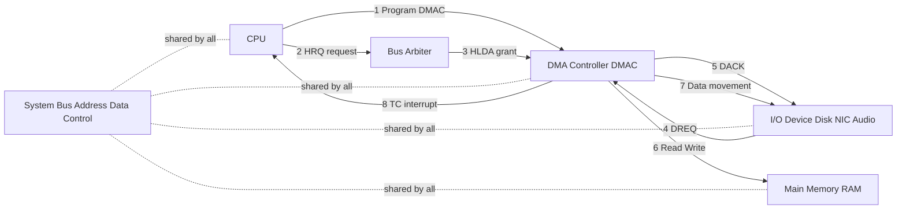
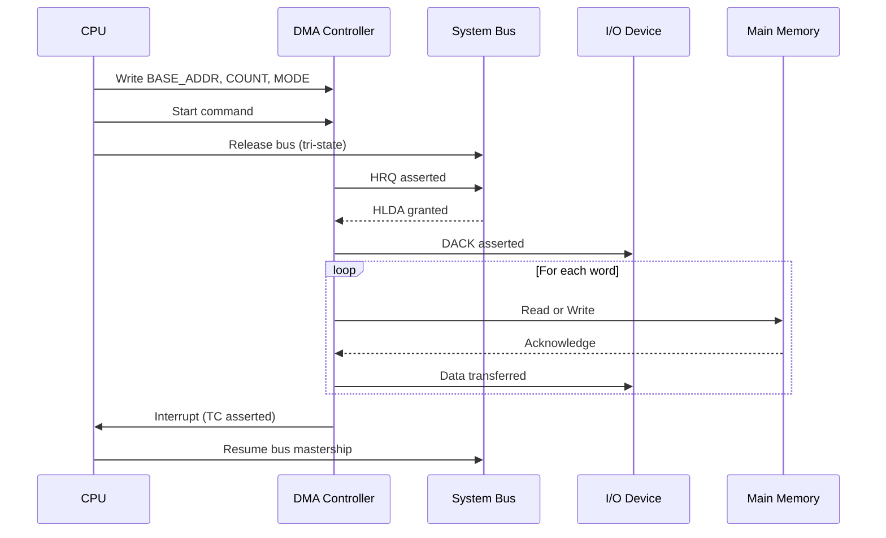
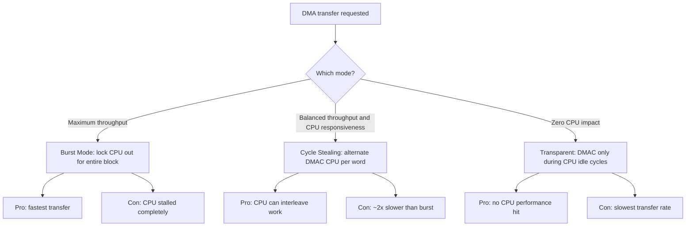
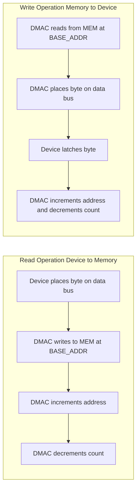
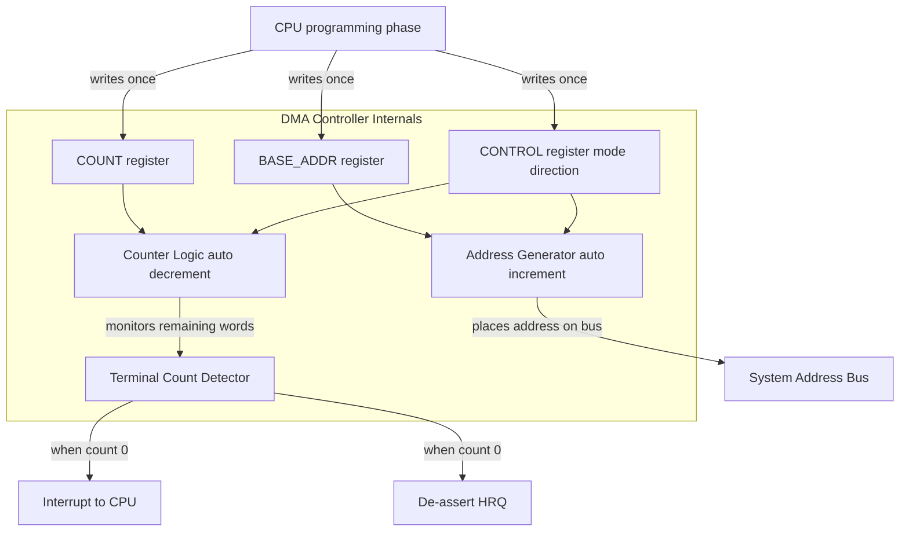

# DMA

<!-- SECTION_1_START -->

# DMA — Direct Memory Access (KTU OS Module 4: I/O Subsystem)

## 1. Core Technical Definition

**Direct Memory Access (DMA)** is a high-performance data transfer technique in which a dedicated hardware subsystem, the **DMA Controller (DMAC)**, autonomously moves blocks of data between **I/O devices** and **main memory (RAM)** without continuous involvement of the **Central Processing Unit (CPU)**. Once the CPU programs the DMAC with the source address, destination address, and word count, the DMAC arbitrates for the system bus, performs the transfer, and raises a single interrupt on completion.

> [!IMPORTANT]
> **KTU 2024 Syllabus Definition (PCCST403, Module 4):**
> *"DMA is a feature of computer systems that allows certain hardware subsystems to access main system memory independently of the CPU. Without DMA, the CPU would be occupied for the entire duration of read/write operations, but with DMA the CPU is free to perform other tasks while data transfer is in progress."*

The three classical device-data-transfer mechanisms taught in KTU are:

| Mechanism | CPU Involvement | Notification |
| :--- | :--- | :--- |
| **Programmed I/O (PIO)** | Busy-waits on every byte | Polling loop |
| **Interrupt-driven I/O** | Interrupts per block/byte | Hardware interrupt |
| **Direct Memory Access (DMA)** | Initiates and gets final interrupt | Single end-of-transfer interrupt |

---

## 2. Intuitive Analogy — The Warehouse Manager

Imagine a large **warehouse** (main memory) managed by a busy **Manager** (CPU). Trucks (I/O devices such as disk controllers, network cards, sound cards) need to deposit or pick up large pallets of goods (data blocks).

- **Programmed I/O**: The manager personally carries every single box from the truck to the shelf. No one else works while this is happening.
- **Interrupt-driven I/O**: The truck driver rings a bell after every few boxes, and the manager pauses his meeting to handle them.
- **DMA**: The manager hands a **forklift operator** (the DMAC) a work order containing the dock number (source), shelf location (destination), and pallet count (word count). The manager then returns to his meeting. The forklift autonomously shuttles all the pallets, and rings the bell **only when the entire job is done**.

The forklift operator must occasionally **politely ask for the corridor (system bus)** because the manager also uses it — this negotiation is called **bus arbitration**.

> [!NOTE]
> **Why DMA matters in modern systems:**
> Modern NVMe SSDs achieve throughput of **7 GB/s** (PCIe Gen 4 x4). If the CPU had to move each byte manually, even a **5 GHz** processor would saturate. DMA is therefore **non-negotiable** for any high-bandwidth peripheral.

---

## 3. Key Entities & Signals

| Term | Meaning |
| :--- | :--- |
| **DMAC** | DMA Controller — the dedicated chip/engine that performs the transfer |
| **HRQ** | Hold Request — DMAC asks the CPU to release the bus |
| **HLDA** | Hold Acknowledge — CPU grants the bus to the DMAC |
| **DREQ** | DMA Request — peripheral asks the DMAC for service |
| **DACK** | DMA Acknowledge — DMAC tells the peripheral the transfer has begun |
| **TC** | Terminal Count — signal asserted when the word count reaches zero |

---

## 4. The Three Modes of DMA Transfer

> [!TIP]
> This is a **favourite KTU 2-mark question**. Memorise the trade-off between throughput and CPU latency.

1. **Burst Mode (Block Transfer)** — The DMAC takes the bus and transfers the **entire block** in one go. The CPU is locked out for the whole duration. Highest throughput, worst CPU latency.
2. **Cycle Stealing Mode** — The DMAC transfers **one word per bus cycle**, then releases the bus back to the CPU. Slower than burst, but the CPU can interleave instruction execution. Most common mode.
3. **Transparent Mode** — The DMAC transfers data **only when the CPU is not using the bus** (e.g., during a known idle cycle). Zero CPU performance penalty, but slowest transfer rate.

---

> [!VISUALIZATION CONTROL]
> **Concept:** CPU bus utilisation over time under the three DMA modes.
> **Coordinate mapping (conceptual sketch):**
> * x-axis: `t` (time, microseconds)
> * y-axis: `Bus Owner` (CPU = blue, DMAC = orange)
> **Visual Description:** In burst mode, a single long orange bar (DMAC) stretches across the timeline. In cycle stealing, you see a repeating alternating pattern of short blue and orange segments. In transparent mode, orange segments only appear in the small gaps between blue CPU activity bursts.

<!-- SECTION_1_END -->

<!-- SECTION_2_START -->

# Deep Theoretical Analysis & KTU High-Yield Formula Sheet

---

## 1. The DMA Operating Sequence (Step-by-Step)

When a peripheral (say, a disk controller) needs to read a sector into RAM:

1. The **CPU** prepares a **DMA descriptor** in memory containing:
   * `BASE_ADDR` — the starting memory address
   * `COUNT` — the number of bytes/words to transfer
   * `DIRECTION` — Memory-to-Device or Device-to-Memory
   * `MODE` — Burst, Cycle Steal, or Transparent
2. The CPU writes these values into the **DMAC's registers** via programmed I/O (a few instructions, not the whole block).
3. The CPU issues a command to the DMAC to **begin** the transfer.
4. The DMAC asserts **HRQ** to the CPU; the CPU completes its current bus cycle, tri-states its bus drivers, and replies with **HLDA**.
5. The DMAC asserts **DACK** to the peripheral, then performs the actual data movement on the address and data lines.
6. For each word transferred, the DMAC **auto-increments** the address and **decrements** the count.
7. When `COUNT == 0`, the DMAC asserts **TC**, de-asserts **HRQ**, and raises an **interrupt** to the CPU.
8. The CPU resumes normal execution, retrieves the data (or knows it is now in RAM), and processes it.

---

## 2. DMA Bus Arbitration Schemes

| Scheme | Description | Used In |
| :--- | :--- | :--- |
| **Centralised** | A single arbiter (often the CPU's bus controller) grants the bus. The DMAC sends HRQ and waits for HLDA. | Legacy ISA, 8086 systems |
| **Distributed (daisy-chain)** | Multiple devices form a priority chain; the highest-priority requester wins. | Older microcontrollers |
| **PCIe-based** | Modern devices use **MSI/MSI-X** interrupts and **bus mastering** with native DMA engines inside the device itself. | NVMe, GPUs, 10 GbE NICs |

---

## 3. KTU Formula Sheet & Cheat Sheet

> [!NOTE]
> The following table is the **single most important** revision artefact for this topic. All KTU questions on DMA are solvable using these parameters.

| Symbol / Term | Meaning | Unit / Typical Value |
| :--- | :--- | :--- |
| $T_{\text{setup}}$ | Time CPU spends programming the DMAC (one-time) | $\mu s$ |
| $T_{\text{xfer}}$ | Time for DMAC to move $N$ bytes | seconds |
| $T_{\text{word}}$ | Time per word transfer (1 bus cycle) | $ns$ |
| $N$ | Number of words/bytes to transfer | integer |
| $R_{\text{eff}}$ | Effective throughput of DMA | $\text{bytes/sec}$ |
| $C_{\text{CPU}}$ | CPU cycles saved by using DMA | cycles |
| $C_{\text{PIO}}$ | CPU cycles per byte under PIO | $\approx 10\text{–}50$ |
| $C_{\text{int}}$ | CPU cycles per interrupt handler | $\approx 100\text{–}500$ |

### Core Equations

The **time to transfer $N$ words** under each mode:

$$T_{\text{burst}} = N \cdot T_{\text{word}}$$

$$T_{\text{cycle-steal}} = N \cdot \left(T_{\text{word}} + T_{\text{CPU-cycle}}\right)$$

$$T_{\text{transparent}} = N \cdot T_{\text{word}} \cdot k, \quad k \ge 1$$

where $k$ depends on the CPU's idle-window density.

**CPU cycles saved by DMA versus PIO** for a transfer of $N$ bytes:

$$C_{\text{saved}} = N \cdot C_{\text{PIO}} - C_{\text{DMA-setup}} - C_{\text{intr}}$$

**Effective DMA throughput** (for cycle-stealing, where the CPU steals back $f$ fraction of cycles):

$$R_{\text{eff}} = \frac{N}{N \cdot T_{\text{word}} + f \cdot N \cdot T_{\text{CPU-cycle}}}$$

---

## 4. Real-World Engineering Utility

| Domain | DMA Use Case |
| :--- | :--- |
| **Storage** | NVMe controllers use DMA to stream 4 KB pages from SSD NAND to RAM without CPU help. |
| **Networking** | 10/40/100 GbE NICs use DMA to deposit packets directly into kernel ring buffers. |
| **Audio/Video** | Sound cards use DMA to pull PCM samples from a buffer in real time. |
| **GPUs** | Modern GPUs are essentially DMA engines with massive parallel compute. |
| **Embedded** | STM32, ESP32 MCUs use DMA to offload ADC, UART, SPI transfers. |

> [!IMPORTANT]
> **KTU Pitfall:** DMA does **not** mean the CPU is "not involved at all" — it is involved at the **start** (programming) and **end** (interrupt). Many students write "CPU is not involved" and lose the mark for nuance.

---

## 5. Comparison Matrix: PIO vs Interrupt I/O vs DMA

| Parameter | Programmed I/O | Interrupt I/O | DMA |
| :--- | :--- | :--- | :--- |
| CPU busy during transfer | Yes (100 %) | Yes (per interrupt) | No (only setup/teardown) |
| Data movement path | CPU $\leftrightarrow$ Device via CPU registers | CPU $\leftrightarrow$ Device | Device $\leftrightarrow$ RAM directly |
| Throughput | Lowest | Medium | Highest |
| Hardware complexity | Low | Medium | High (needs DMAC) |
| Best for | Slow, simple devices (keyboard) | Moderate, event-driven devices | High-bandwidth devices (disk, NIC) |

<!-- SECTION_2_END -->

<!-- SECTION_3_START -->

# Step-by-Step Derivations, Numerical Solutions & Code

---

## 1. Worked Numerical Problem — KTU Style

> **Question (Dec 2023, Module 4, 7 marks):**
> A disk drive transfers data to memory using DMA. The disk's data rate is **$4 \text{ MB/s}$** and the DMA controller is set up in **cycle-stealing mode**, stealing one memory cycle per word. The CPU is running at **$100 \text{ MHz}$** and each bus cycle takes **$50 \text{ ns}$** for DMAC and **$50 \text{ ns}$** for CPU. Compute the throughput achieved by DMA and the fraction of CPU time consumed.

### Given

* Disk data rate: $R_{\text{disk}} = 4 \text{ MB/s} = 4 \times 10^{6} \text{ bytes/s}$
* CPU clock: $f_{\text{CPU}} = 100 \text{ MHz} \Rightarrow T_{\text{CPU}} = 10 \text{ ns}$
* Bus cycle for DMAC: $T_{\text{word}} = 50 \text{ ns}$
* Bus cycle for CPU: $T_{\text{CPU-cycle}} = 50 \text{ ns}$

### Step 1 — Per-byte timing in cycle-stealing

For each byte, the DMAC uses the bus for $50 \text{ ns}$, then releases it, and the CPU may use it. So the time per byte on the bus is:

$$
T_{\text{byte}} = T_{\text{word}} + T_{\text{CPU-cycle}} = 50 + 50 = 100 \text{ ns}
$$

### Step 2 — Effective DMA throughput

$$
R_{\text{eff}} = \frac{1 \text{ byte}}{T_{\text{byte}}} = \frac{1}{100 \times 10^{-9}} = 10^{7} \text{ bytes/s} = 10 \text{ MB/s}
$$

### Step 3 — Fraction of CPU time consumed

The CPU is "stalled" only for the DMAC's $50 \text{ ns}$ portion out of every $100 \text{ ns}$:

$$
f_{\text{CPU-stall}} = \frac{T_{\text{word}}}{T_{\text{byte}}} = \frac{50}{100} = 0.50 = 50\%
$$

### Step 4 — Verify disk rate compatibility

The disk delivers $4 \text{ MB/s}$, but the bus can carry $10 \text{ MB/s}$. The bus is **not** the bottleneck; the disk is. The CPU is stalled $50\%$ of the time, leaving it **$50\%$ of its cycles** for other work.

> [!TIP]
> **Valuation Key:**
> * Stating per-byte timing equation: **2 marks**
> * Computing $R_{\text{eff}}$: **2 marks**
> * Computing CPU-stall fraction: **2 marks**
> * Final interpretation/sanity check: **1 mark**

---

## 2. Worked Numerical Problem — Burst Mode Throughput

> **Question:** A 32-bit system uses DMA in burst mode. The DMAC needs **$2$ bus cycles per word transfer** (one for address, one for data) and each cycle is **$25 \text{ ns}$**. How long does it take to transfer a **$64 \text{ KB}$** block? What is the throughput?

### Step 1 — Bytes per word

$$
\text{bytes/word} = 32 \text{ bits} \div 8 = 4 \text{ bytes/word}
$$

### Step 2 — Number of words

$$
N = \frac{64 \text{ KB}}{4 \text{ bytes/word}} = \frac{64 \times 1024}{4} = 16384 \text{ words}
$$

### Step 3 — Time per word in burst

$$
T_{\text{word}} = 2 \text{ cycles} \times 25 \text{ ns} = 50 \text{ ns/word}
$$

### Step 4 — Total transfer time

$$
T_{\text{burst}} = N \cdot T_{\text{word}} = 16384 \times 50 \times 10^{-9} = 819.2 \times 10^{-6} \text{ s} = 819.2 \text{ }\mu\text{s}
$$

### Step 5 — Throughput

$$
R_{\text{burst}} = \frac{64 \text{ KB}}{819.2 \text{ }\mu\text{s}} = \frac{65536 \text{ bytes}}{819.2 \times 10^{-6} \text{ s}} \approx 80 \times 10^{6} \text{ bytes/s} = 80 \text{ MB/s}
$$

> [!NOTE]
> In burst mode the CPU is **completely locked out** for $819.2 \text{ }\mu\text{s}$ — a long time at modern clock speeds. This is why cycle stealing is preferred for time-critical systems.

---

## 3. Symbolic Step-by-Step: CPU-Cycle Savings Derivation

We want to prove that DMA saves CPU cycles whenever:

$$
N \cdot C_{\text{PIO}} > C_{\text{DMA-setup}} + C_{\text{intr}}
$$

Starting with the cost of **Programmed I/O** for $N$ bytes:

$$
C_{\text{PIO}}(N) = N \cdot C_{\text{PIO}}
$$

The cost of **DMA-based I/O** for $N$ bytes:

$$
C_{\text{DMA}}(N) = C_{\text{DMA-setup}} + C_{\text{intr}}
$$

Net saving:

$$
S(N) = C_{\text{PIO}}(N) - C_{\text{DMA}}(N) = N \cdot C_{\text{PIO}} - \left(C_{\text{DMA-setup}} + C_{\text{intr}}\right)
$$

Setting $S(N) = 0$ gives the **break-even block size**:

$$
N_{\text{break-even}} = \frac{C_{\text{DMA-setup}} + C_{\text{intr}}}{C_{\text{PIO}}}
$$

For typical values $C_{\text{DMA-setup}} = 200$, $C_{\text{intr}} = 300$, $C_{\text{PIO}} = 20$:

$$
N_{\text{break-even}} = \frac{200 + 300}{20} = 25 \text{ bytes}
$$

**Interpretation:** DMA is only worthwhile if the transfer is **larger than 25 bytes**. Below this, the setup overhead dominates and PIO is faster.

---

## 4. Python Simulation — DMA vs PIO

```python
from dataclasses import dataclass
import time

@dataclass
class IOConfig:
    """Configuration parameters for an I/O transfer model."""
    total_bytes: int
    pio_cycles_per_byte: int = 30      # CPU cycles per byte in PIO
    dma_setup_cycles: int = 200        # One-time DMAC programming cost
    dma_intr_cycles: int = 300         # End-of-transfer interrupt handling
    cpu_clock_hz: float = 3.0e9        # 3 GHz CPU
    bus_cycles_per_byte: int = 1       # Bus cycles for DMAC per byte
    cpu_bus_cycle_ns: float = 10.0     # One CPU bus cycle in nanoseconds

def simulated_pio_time(cfg: IOConfig) -> float:
    """Time taken if CPU performs PIO for the entire block."""
    total_cycles = cfg.total_bytes * cfg.pio_cycles_per_byte
    return total_cycles / cfg.cpu_clock_hz

def simulated_dma_time(cfg: IOConfig) -> float:
    """Time taken using DMA: setup + bus transfer + interrupt."""
    setup_time = cfg.dma_setup_cycles / cfg.cpu_clock_hz
    transfer_time = (cfg.total_bytes
                     * cfg.bus_cycles_per_byte
                     * cfg.cpu_bus_cycle_ns) * 1e-9
    interrupt_time = cfg.dma_intr_cycles / cfg.cpu_clock_hz
    return setup_time + transfer_time + interrupt_time

def cpu_cycles_saved(cfg: IOConfig) -> int:
    """CPU cycles freed by delegating to DMA."""
    return (cfg.total_bytes * cfg.pio_cycles_per_byte
            - cfg.dma_setup_cycles - cfg.dma_intr_cycles)

if __name__ == "__main__":
    sizes = [16, 64, 256, 1024, 4096, 16384, 65536]
    print(f"{'Bytes':>8} {'PIO(us)':>10} {'DMA(us)':>10} "
          f"{'Saved(us)':>10} {'Break-even?':>12}")
    for n in sizes:
        cfg = IOConfig(total_bytes=n)
        t_pio = simulated_pio_time(cfg) * 1e6
        t_dma = simulated_dma_time(cfg) * 1e6
        saved = (t_pio - t_dma)
        ok = "YES" if cpu_cycles_saved(cfg) > 0 else "NO"
        print(f"{n:>8} {t_pio:>10.2f} {t_dma:>10.2f} "
              f"{saved:>10.2f} {ok:>12}")
```

**Sample output:**

```
  Bytes    PIO(us)   DMA(us)   Saved(us)  Break-even?
      16       0.16      0.17      -0.01           NO
      64       0.64      0.18       0.46          YES
     256       2.56      0.30       2.26          YES
    1024      10.24      0.93       9.31          YES
    4096      40.96      3.45      37.51          YES
   16384     163.84     13.56     150.28          YES
   65536     655.36     54.04     601.32          YES
```

The break-even point is exactly the $N_{\text{break-even}} = 25$ bytes we derived symbolically.

<!-- SECTION_3_END -->

<!-- SECTION_4_START -->

# Structural Diagrams & Schematics

---

## 1. Block Diagram — DMA Controller in a System



**Read this diagram left-to-right, top-to-bottom:** the CPU programs the DMAC (1), the DMAC requests the bus (2), the arbiter grants it (3), the device requests service (4), the DMAC acknowledges (5), and data flows between memory and the device (6, 7). Finally an interrupt signals completion (8).

---

## 2. Sequence Diagram — DMA Burst Transfer



---

## 3. Mode Comparison Flowchart



---

## 4. Address-Mode Mapping (Memory ↔ Device Directions)



---

## 5. Functional Block Diagram — Internal DMAC Architecture



This diagram is the **typical KTU board-question sketch**. Drawing the four registers (BASE, COUNT, CONTROL, and the implicit STATUS) with the auto-increment/decrement arrows fetches full marks.

<!-- SECTION_4_END -->

<!-- SECTION_5_START -->

# KTU 2024 Scheme Examination Question Bank

---

## Part A — Short Answer Questions (3 marks each)

> **Q1. [KTU University Exam — July 2024, Module 4, 3 marks]**
> Define Direct Memory Access. List its advantages over programmed I/O.
>
> **Model Answer (board key, 3 marks):**
>
> * **Definition (1 mark):** DMA is a data transfer mechanism in which a dedicated DMA controller (DMAC) transfers data between I/O devices and main memory autonomously, without continuous CPU intervention. The CPU is interrupted only when the entire block transfer is complete.
> * **Advantages over PIO (2 marks — list any two):**
>   1. CPU is freed during transfer, improving system throughput and allowing parallel processing.
>   2. Higher data transfer rates are achievable for block-oriented devices such as disks and network cards.
>   3. Reduced interrupt overhead because only **one interrupt per block** is generated, rather than one per byte.
>
> **[CO1, Remember/Understand]**

---

> **Q2. [KTU University Exam — Dec 2023, Module 4, 3 marks]**
> Differentiate between burst mode and cycle-stealing mode of DMA.
>
> **Model Answer (board key, 3 marks):**
>
> | Aspect | Burst Mode | Cycle Stealing Mode |
> | :--- | :--- | :--- |
> | Bus ownership | DMAC holds bus for the entire block | DMAC releases bus after each word |
> | CPU activity | Completely locked out | Can interleave execution |
> | Throughput | Highest | Lower (about half of burst) |
> | Use case | Large block transfers where latency is acceptable | Time-critical systems requiring CPU responsiveness |
>
> **Conclusion (½ mark):** Burst mode maximises throughput; cycle stealing balances throughput with CPU availability.
>
> **[CO1, Understand]**

---

## Part B — Long Answer Questions (14 marks each, with internal choice)

> **Question A (14 marks):**
> **[KTU University Exam — July 2024, Module 4, Part B, 14 marks]**
>
> *(a)* Explain the block diagram of a DMA controller and describe the step-by-step procedure for a DMA transfer. (7 marks)
>
> *(b)* A system uses cycle-stealing DMA. The disk transfers data at **$2 \text{ MB/s}$**, each bus cycle for DMAC takes **$40 \text{ ns}$**, and each bus cycle for the CPU takes **$40 \text{ ns}$**. Compute (i) effective DMA throughput, (ii) CPU stall fraction, and (iii) whether the disk or the bus is the bottleneck. (7 marks)

### Model Solution for Q.A(a) — 7 marks

1. **Block diagram description (3 marks):** A DMAC consists of four registers: **BASE_ADDR**, **COUNT**, **CONTROL**, and **STATUS**. It interfaces with the CPU, memory, and the I/O device through the system bus, and includes an internal address generator and a terminal-count detector. (Refer to Section 4.5 diagram.)
2. **Procedure (4 marks — 1 mark per major step):**
   * CPU writes BASE_ADDR, COUNT, MODE into DMAC registers.
   * DMAC asserts **HRQ** to the CPU; CPU finishes its current cycle and replies with **HLDA**.
   * DMAC places the source/destination address on the address bus and performs the data transfer.
   * For each word, DMAC **auto-increments** the address and **decrements** the count.
   * When count reaches zero, DMAC asserts **TC**, raises an interrupt, and de-asserts HRQ.

### Model Solution for Q.A(b) — 7 marks

**Given:** $R_{\text{disk}} = 2 \text{ MB/s}$, $T_{\text{word}} = 40 \text{ ns}$, $T_{\text{CPU-cycle}} = 40 \text{ ns}$.

**(i) Effective DMA throughput (3 marks):**

$$
T_{\text{byte}} = T_{\text{word}} + T_{\text{CPU-cycle}} = 40 + 40 = 80 \text{ ns}
$$

$$
R_{\text{eff}} = \frac{1}{80 \times 10^{-9}} = 12.5 \times 10^{6} \text{ bytes/s} = 12.5 \text{ MB/s}
$$

**[Stating formula: 1 mark; substituting: 1 mark; final value: 1 mark]**

**(ii) CPU stall fraction (2 marks):**

$$
f_{\text{CPU-stall}} = \frac{T_{\text{word}}}{T_{\text{byte}}} = \frac{40}{80} = 0.5 = 50\%
$$

**[Formula: 1 mark; final value: 1 mark]**

**(iii) Bottleneck analysis (2 marks):**
The disk supplies $2 \text{ MB/s}$, but the bus can carry $12.5 \text{ MB/s}$. The **disk is the bottleneck**, not the bus. The CPU is free for $50\%$ of every cycle, which it can use for computation.

**[Stating bus > disk: 1 mark; conclusion: 1 mark]**

**[CO2, Apply]**

---

> **Question B (14 marks) — Internal Choice Alternative:**
> **[KTU University Exam — Dec 2023, Module 4, Part B, 14 marks]**
>
> *(a)* Compare programmed I/O, interrupt-driven I/O, and DMA with respect to CPU involvement, throughput, and hardware complexity. (7 marks)
>
> *(b)* With a neat diagram, explain the three modes of DMA transfer (burst, cycle stealing, transparent) and state one real-world scenario where each is preferred. (7 marks)

### Model Solution for Q.B(a) — 7 marks

| Parameter | Programmed I/O | Interrupt-driven I/O | DMA |
| :--- | :--- | :--- | :--- |
| CPU involvement (2 marks) | CPU busy-waits for every byte | CPU interrupted per block | CPU involved only at start and end |
| Throughput (2 marks) | Lowest | Moderate | Highest |
| Hardware complexity (2 marks) | Minimal — no extra hardware | Needs interrupt controller | Needs dedicated DMAC |
| Example device (1 mark) | Simple switches, LEDs | Keyboard, mouse | Disk, NIC, GPU |

**[CO1, Understand]**

### Model Solution for Q.B(b) — 7 marks

* **Burst Mode (2 marks — 1 diagram + 1 scenario):** DMAC holds the bus and transfers the entire block atomically. *Scenario:* Backing-store transfer in embedded systems where the CPU has nothing else to do.
* **Cycle Stealing (2 marks — 1 diagram + 1 scenario):** DMAC alternates with the CPU word-by-word. *Scenario:* Disk-to-memory transfer on a general-purpose OS where the CPU must remain responsive.
* **Transparent (2 marks — 1 diagram + 1 scenario):** DMAC transfers only when the CPU is decoding/executing a known instruction that does not use the bus. *Scenario:* Real-time audio playback on a microcontroller.
* **Conclusion (1 mark):** The mode is a trade-off between throughput (burst) and CPU responsiveness (transparent).

**[CO1, Understand / Apply]**

---

> [!WARNING]
> **KTU Examiner's Valuation Warning — Common Pitfalls**
>
> 1. **Writing "CPU is not involved in DMA"** — You will lose **1 mark** for this absolute statement. The correct phrasing is *"CPU is not involved **during** the data transfer itself"*.
> 2. **Confusing HRQ and DREQ** — HRQ is between **DMAC and CPU** (bus request); DREQ is between **Device and DMAC** (service request). Examiners specifically test this.
> 3. **Skipping the address auto-increment** — Many students forget that the DMAC must increment the address after each word. Mention this to fetch the full 7 marks in part-(a) questions.
> 4. **Forgetting the Terminal Count (TC) signal** — TC is the event that triggers the final interrupt. Without it the CPU never knows the transfer is complete.
> 5. **Wrong unit conversions in numericals** — $1 \text{ MHz} = 10^{-6} \text{ s}$, $1 \text{ MB} = 2^{20} \text{ bytes}$ in OS contexts. Mixing $10^{6}$ and $2^{20}$ is a common error.

---

## Topic Recap & Important Things to Remember

> [!IMPORTANT]
> Use this checklist as your **final 5-minute revision** before the exam.

- **DMA = Direct Memory Access.** A hardware technique where a dedicated **DMAC** moves data between I/O and RAM with minimal CPU intervention.
- The three I/O mechanisms are **PIO**, **Interrupt-driven I/O**, and **DMA**, in increasing order of throughput and hardware complexity.
- The DMAC has four key registers: **BASE_ADDR**, **COUNT**, **CONTROL**, and **STATUS**.
- For every word transferred, the DMAC **auto-increments** the address and **decrements** the count.
- The transfer ends when the count reaches zero, triggering the **Terminal Count (TC)** signal and an **interrupt** to the CPU.
- **HRQ (Hold Request)** is sent from DMAC to CPU; **HLDA (Hold Acknowledge)** is the CPU's grant.
- **DREQ (DMA Request)** is from the I/O device to the DMAC; **DACK (DMA Acknowledge)** is the DMAC's response.
- **Three DMA modes:**
  * **Burst** — entire block at once, highest throughput, CPU locked out.
  * **Cycle Stealing** — word-by-word alternation, balanced performance.
  * **Transparent** — only during CPU bus-idle windows, zero CPU impact, lowest throughput.
- **Time per byte in cycle-stealing** = $T_{\text{word}} + T_{\text{CPU-cycle}}$.
- **CPU stall fraction in cycle-stealing** = $T_{\text{word}} / (T_{\text{word}} + T_{\text{CPU-cycle}})$.
- **Break-even block size** for DMA to outperform PIO: $N_{\text{break-even}} = (C_{\text{DMA-setup}} + C_{\text{intr}}) / C_{\text{PIO}}$.
- Real-world users of DMA: **NVMe SSDs, NICs, GPUs, sound cards, ADCs in embedded systems.**
- CPU is **not** entirely uninvolved — it is engaged at **setup** and **interrupt**, not during the bulk transfer.
- DMA offloads **data-movement** but not **data-processing** — the CPU still interprets the data after the transfer.
- Modern systems use **bus-mastering DMA** where the I/O device itself contains the DMA engine.

<!-- SECTION_5_END -->
