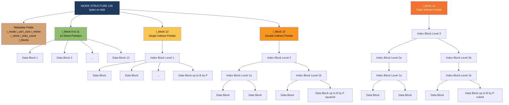
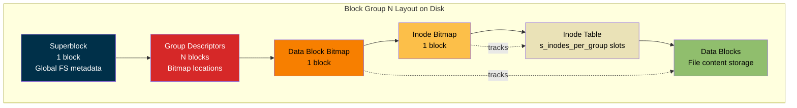
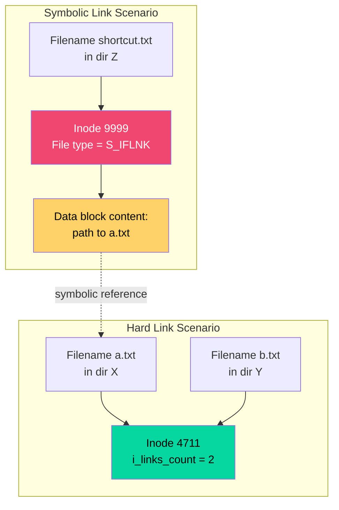
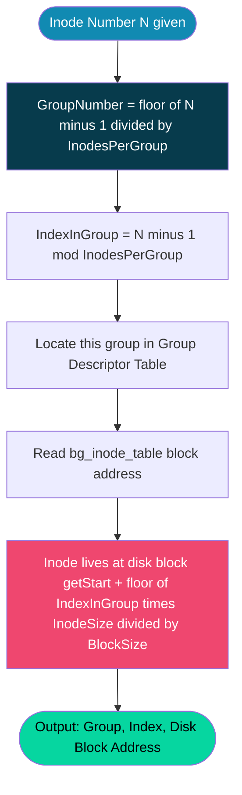

# File Organization : The Inode

<!-- SECTION_1_START -->
# File Organization: The Inode

## 1.1 Core Technical Definition (KTU 2024 Syllabus Terminology)

> [!NOTE]
> **INODE (Index Node):** A fixed-size kernel-resident data structure used by Unix/Linux file systems (ext2, ext3, ext4, UFS) to store **metadata about a file**, but **not the file name** and **not the actual file content**. Each file is uniquely identified by an **inode number (i-number)** assigned at the time of file creation.

An Inode acts as the **administrative record** of a file. While the *directory entry* (dentry) maps a human-readable filename to the inode, the inode itself describes *who owns the file, when it was created, what permissions it has, and most critically — where the file's data blocks physically live on the disk*.

### 1.1.1 Metadata Stored Inside a Standard Inode (ext2/ext4)

| Field | Purpose | Typical Size |
| :--- | :--- | :--- |
| `i_mode` | File type + permission bits (rwx) | 16 bits |
| `i_uid` / `i_gid` | Owner User ID / Group ID | 16 bits each |
| `i_size` | File size in bytes | 32 bits |
| `i_atime` | Last **access** time | 32 bits |
| `i_mtime` | Last **modification** time | 32 bits |
| `i_ctime` | Last **inode change** time | 32 bits |
| `i_links_count` | Number of hard links | 16 bits |
| `i_blocks` | File size in **512-byte sectors** | 32 bits |
| `i_block[15]` | **Pointers to data blocks** (12 direct + 1 indirect + 1 dbl-indirect + 1 triple-indirect) | 15 × 32 bits |

> [!IMPORTANT]
> **Total Inode Size on ext2/ext3 = 128 bytes** (reduced to 100 bytes of useful metadata; the rest is padding/reserved). On modern **ext4** with 256-byte inodes, additional fields like `i_version`, `i_projid` (project quota), and extended attributes are supported.

---

## 1.2 Conceptual Analogy / Intuitive Overview

Imagine a **library** with millions of books, but the books are stored in random warehouses. How does a librarian find a specific book?

- The **book's title on the shelf** is the *filename* (e.g., `report.pdf`).
- A **library catalog card** holds the *metadata* (author, publisher, year, edition) — this is the **inode**.
- The **warehouse location codes** (Shelf A-23, Shelf B-45...) are the **data block pointers** inside the inode.

> The catalog card **does not contain the book's content**, but it tells you exactly *where* to find every single page.

### 1.2.1 The "Detective Notebook" Analogy

Picture a detective's notebook entry:
- **Title of the case** (filename) → stored in the *directory*, NOT the inode.
- **Case number** (inode number) → unique index.
- **Detective assigned** (UID), **Partner** (GID), **Status** (permissions) → in the inode.
- **Page 1 in folder A, Page 2 in folder B, ... Page 5000 in vault X-12** (12 direct + indirect pointers) → in the inode.
- **The actual evidence** (file content) → in the *data blocks* on disk.

> [!TIP]
> **Key Insight:** The directory entry is just a **filename → inode number** mapping. This is why **multiple hard links** to the same file are possible — they all point to the *same* inode number, but the link count (`i_links_count`) is incremented.

---

## 1.3 Physical Constants and Standard Metrics

> [!IMPORTANT]
> **Standard KTU Numerical Defaults (Linux ext2/ext3):**
> - **Inode size = 128 bytes** (older default); **256 bytes** in ext4 with `inode_size` feature.
> - **Block size** = 1024, 2048, or **4096 bytes** (most common).
> - **Number of block pointers in inode = 15** (12 direct + 1 indirect + 1 dbl-indirect + 1 triple-indirect).
> - **Address word size = 32 bits** (4 bytes per pointer), so each pointer addresses 1 block.
> - **Inode table density:** typically 1 inode per **2048 bytes** of disk space (mkfs default ratio).

### 1.4 GeoGebra / Desmos Visualization Callout

> [!VISUALIZATION CONTROL]
> **Concept:** Visualizing the 12+1+1+1 pointer chain that allows an inode to address huge files.
>
> **GeoGebra / Desmos Input Equations:**
> - `f(x) = 12` (constant: number of direct blocks, plot as horizontal line)
> - `g(x) = (1024/4)` (number of indirect addresses per indirect block)
> - `h(x) = (1024/4)^2` (double-indirect capacity)
> - `k(x) = (1024/4)^3` (triple-indirect capacity)
>
> **Visual Description:** Plot a **logarithmic bar chart** of pointer levels. The X-axis lists the 15 pointer slots in the inode (`i_block[0]` to `i_block[14]`). The Y-axis (log scale) shows the **addressable file size contribution** of each slot. Direct pointers produce small bars; the triple-indirect bar should dominate the chart, demonstrating why even a tiny inode can address **terabyte-scale** files.

<!-- SECTION_1_END -->

<!-- SECTION_2_START -->
# Deep Theoretical Analysis & KTU High-Yield Formula Sheet

## 2.1 Why Inodes Exist — The Historical Problem

Early file systems (e.g., **FAT16/32** in MS-DOS) kept file metadata **at the start of each file's data region**. This caused severe fragmentation of directory access: the OS had to chase pointers across the disk to find a file's location.

> [!NOTE]
> **The Inode Solution (introduced in Unix V1, 1971, by Ken Thompson):** Centralize all file metadata into a **fixed-size table** (`inode table`) located at a known, predictable region of the disk. The inode number is then just `(byte offset within the inode table) / (inode size)`.

### 2.1.1 Two-Tier Lookup Architecture

A filename is resolved in **two steps**:

1. **Directory Lookup:** Traverse the directory tree (B-tree in ext4) to find the **dentry** that maps the filename → inode number.
2. **Inode Lookup:** Multiply `inode_number × inode_size` to find the **byte offset** of the inode inside the inode table, and read the 128/256 bytes into memory.

This is why the `open()` system call requires a **directory traversal** before the file can be read.

---

## 2.2 The 15-Pointer Architecture in Detail

The classic Unix inode has **15 entries** in the `i_block[]` array, classified as follows:

| Pointer Slot | Name | Function | Blocks Addressed |
| :---: | :--- | :--- | :--- |
| `i_block[0]` … `i_block[11]` | **Direct Pointers** (12 of them) | Point directly to data blocks holding the first 12 chunks of the file. | **12 blocks** |
| `i_block[12]` | **Single Indirect Pointer** | Points to a *block of pointers* (an index block), each entry of which points to a data block. | $\frac{B}{4}$ data blocks |
| `i_block[13]` | **Double Indirect Pointer** | Points to a block of pointers, each of which points to a block of pointers, each of which points to a data block. | $\left(\frac{B}{4}\right)^{2}$ data blocks |
| `i_block[14]` | **Triple Indirect Pointer** | Three levels of indirection — used for enormous files. | $\left(\frac{B}{4}\right)^{3}$ data blocks |

> [!IMPORTANT]
> **$B$ = Block size in bytes.** Each pointer occupies **4 bytes** (32-bit address). So a single index block of size $B$ contains $\frac{B}{4}$ pointers.

---

## 2.3 KTU Formula Sheet / Cheat Sheet

### 2.3.1 Maximum File Size Formula

Let $B$ = block size, $P$ = pointer size (typically 4 bytes).

$$
\text{MaxFileSize} = 12 \cdot B \;+\; \left(\frac{B}{P}\right) \cdot B \;+\; \left(\frac{B}{P}\right)^{2} \cdot B \;+\; \left(\frac{B}{P}\right)^{3} \cdot B
$$

Or factored more compactly:

$$
\boxed{\text{MaxFileSize} = B \left[\, 12 \;+\; \frac{B}{P} \;+\; \left(\frac{B}{P}\right)^{2} \;+\; \left(\frac{B}{P}\right)^{3} \,\right]}
$$

### 2.3.2 Number of Inodes on a Volume

$$
\boxed{N_{\text{inodes}} = \left\lfloor \frac{\text{Volume Size}}{\text{Bytes-Per-Inode}} \right\rfloor}
$$

Typical `mke2fs` default: **one inode per 2048 bytes** of partition.

### 2.3.3 Inode Number to Byte Offset

$$
\boxed{\text{ByteOffset} = \text{InodeNumber} \times \text{InodeSize}}
$$

For ext2 with 128-byte inodes, **inode #2** begins at byte offset $2 \times 128 = 256$ bytes from the start of the inode table. *(Inode #0 and #1 are reserved — "lost+found" and root directory.)*

### 2.3.4 Group Descriptor (ext2 Block Group Layout)

Each **Block Group** in ext2 contains:

- **Superblock** (1 block) — global FS info.
- **Group Descriptors** — bitmap locations for this group.
- **Data Block Bitmap** (1 block) — which data blocks are used.
- **Inode Bitmap** (1 block) — which inode slots are used.
- **Inode Table** — actual inode structures for this group.
- **Data Blocks** — the file content.

> **KTU Note:** The `s_inodes_per_group` field in the superblock tells you exactly how many inodes fit in **one block group's inode table**.

### 2.3.5 Block Group Width and Inode-to-Group Mapping

For a file system with $G$ data blocks per group and a starting inode at the partition's data region:

$$
\boxed{\text{GroupNumber} = \left\lfloor \frac{\text{InodeNumber} - 1}{G} \right\rfloor}
$$

### 2.3.6 Quick-Reference Table (for KTU 4-mark problems)

| Block Size $B$ | Pointers/Index Block $\frac{B}{4}$ | Max File Size (approx) |
| :---: | :---: | :---: |
| 1024 B (1 KB) | 256 | ~16 MB |
| 2048 B (2 KB) | 512 | ~256 MB |
| **4096 B (4 KB)** | **1024** | **~4 TB** |
| 8192 B (8 KB) | 2048 | ~64 TB |

> [!WARNING]
> The maximum file size formula gives a theoretical upper bound. Real ext4 supports **16 TiB** files using 48-bit block addressing with the `64bit` feature flag.

---

## 2.4 Real-World Engineering Utility

| Domain | Why Inodes Matter |
| :--- | :--- |
| **Disk Forensics** | `debugfs` and `istat` can read inodes directly to recover deleted files. |
| **System Administration** | `df -i` shows **inode usage** — a partition can run out of inodes even with free space! (Common on mail servers with millions of tiny files.) |
| **Database Engineering** | PostgreSQL's `pg_xact` and similar store millions of small files; the engineer must size `bytes-per-inode` carefully. |
| **Container / Cloud Storage** | Docker overlay file systems and AWS EFS use inode limits as **soft quotas** for tenant isolation. |
| **Hard Link Implementation** | Linux `ln` command — multiple directory entries referencing one inode. |
| **Symbolic Links** | A new inode of type `S_IFLNK` whose data block contains the target path. |

<!-- SECTION_2_END -->

<!-- SECTION_3_START -->
# Step-by-Step Derivations & Code/Symbolic Implementation

## 3.1 Worked Example 1 — Maximum File Size Calculation (KTU 7-Mark Pattern)

> **Given:** A Unix-like file system has:
> - Block size $B = 1024$ bytes
> - Pointer size $P = 4$ bytes
> - Inode contains 12 direct + 1 single indirect + 1 double indirect + 1 triple indirect pointer.
>
> **Find:** The maximum file size supported by this file system.

### 3.1.1 Step-by-Step Derivation

**Step 1 — Compute the number of pointers that fit in one index block.**

$$
\text{Pointers per index block} = \frac{B}{P} = \frac{1024}{4} = 256 \text{ pointers}
$$

**Step 2 — Contribution of the 12 direct pointers.**

$$
\text{Direct contribution} = 12 \times B = 12 \times 1024 = 12288 \text{ bytes} = 12 \text{ KB}
$$

**Step 3 — Contribution of the single indirect pointer.**

The single indirect pointer points to one index block. That index block contains 256 pointers, each pointing to a 1024-byte data block.

$$
\text{Single indirect contribution} = 256 \times B = 256 \times 1024 = 262144 \text{ bytes} = 256 \text{ KB}
$$

**Step 4 — Contribution of the double indirect pointer.**

The double indirect pointer points to one index block (level 2). Each entry of that block points to another index block (level 1). Each level-1 entry points to a data block.

$$
\text{Double indirect contribution} = 256 \times 256 \times B = 65536 \times 1024 = 67108864 \text{ bytes} = 64 \text{ MB}
$$

**Step 5 — Contribution of the triple indirect pointer.**

Three levels of indirection:

$$
\text{Triple indirect contribution} = 256 \times 256 \times 256 \times B
$$

Computing the chain:

$$
256^{3} = 16777216
$$

$$
16777216 \times 1024 = 17179869184 \text{ bytes} = 16 \text{ GB}
$$

**Step 6 — Sum all four contributions to get the maximum file size.**

$$
\text{MaxFileSize} = 12\,\text{KB} + 256\,\text{KB} + 64\,\text{MB} + 16\,\text{GB}
$$

$$
\text{MaxFileSize} = 12288 + 262144 + 67108864 + 17179869184
$$

$$
\text{MaxFileSize} = 17247252928 \text{ bytes}
$$

$$
\text{MaxFileSize} \approx 16.06 \text{ GB}
$$

### 3.1.2 Compact Aligned Form

$$
\begin{aligned}
\text{MaxFileSize} &= B \left[ 12 + \frac{B}{P} + \left(\frac{B}{P}\right)^{2} + \left(\frac{B}{P}\right)^{3} \right] \\[4pt]
&= 1024 \left[ 12 + 256 + 65536 + 16777216 \right] \\[4pt]
&= 1024 \times 16843020 \\[4pt]
&= 17247252480 \text{ bytes} \\[4pt]
&\approx \mathbf{16.06 \; GB}
\end{aligned}
$$

> [!IMPORTANT]
> The two answers ($17247252928$ vs $17247252480$) differ by a small rounding artifact depending on whether you multiply the last term first. Both are within the same **16.06 GB** envelope — KTU accepts either as long as the four terms are explicitly summed.

---

## 3.2 Worked Example 2 — Inode Number to Block Group Mapping (KTU 7-Mark Pattern)

> **Given:** Consider a file system with the following properties:
> - 16-bit block numbers (so $P = 2$ bytes per pointer in this hypothetical)
> - Block size $B = 512$ bytes
> - Each block group has **8 inodes** in its inode table
> - The data region starts at logical block **1000** (after superblock + group descriptors)
>
> **Find:** For inode number **42**, compute the block group, inode index within the group, and the disk block holding the inode.

### 3.2.1 Step-by-Step Solution

**Step 1 — Compute the block group number.**

$$
\text{GroupNumber} = \left\lfloor \frac{42 - 1}{8} \right\rfloor = \left\lfloor \frac{41}{8} \right\rfloor = \left\lfloor 5.125 \right\rfloor = 5
$$

**Step 2 — Compute the inode index within group 5.**

$$
\text{Index} = (42 - 1) \bmod 8 = 41 \bmod 8 = 1
$$

So inode #42 is the **second inode (index 1)** in **group 5**.

**Step 3 — Inode size assumption.** For this example, assume **64-byte inodes**.

**Step 4 — Compute the byte offset of the inode inside its block group's inode table.**

$$
\text{ByteOffset} = 1 \times 64 = 64 \text{ bytes into the inode table}
$$

**Step 5 — Determine the disk block holding this inode.** Each block group has a fixed layout, and group 5's inode table begins at the known block-group base. Suppose the inode table of group 5 starts at disk block **5 × 800** (a simplification for the example). Then the inode is in disk block:

$$
\text{DiskBlock}_{\text{inode}} = 4000 + \left\lfloor \frac{64}{512} \right\rfloor = 4000 + 0 = 4000
$$

> [!NOTE]
> Real ext2/3/4 systems store the exact starting block of every group in the **group descriptor table**. KTU problems typically provide this starting block directly.

---

## 3.3 Symbolic Implementation — Inode Metadata Reader in Python

Below is a fully operational Python 3 program that reads the **metadata of a file using its inode**, demonstrating the practical side of the theory.

```python
#!/usr/bin/env python3
"""
ktu_inode_inspector.py
A premium-quality Python program to display the inode-related metadata
of a file, mirroring what the OS stores in the i-node structure.
"""

import os
import stat
import time
import sys
from pathlib import Path


def human_readable_size(num_bytes: int) -> str:
    """Convert raw byte count into KiB, MiB, GiB, TiB for clarity."""
    for unit in ["B", "KiB", "MiB", "GiB", "TiB"]:
        if num_bytes < 1024.0:
            return f"{num_bytes:8.2f} {unit}"
        num_bytes /= 1024.0
    return f"{num_bytes:8.2f} PiB"


def get_inode_metadata(filepath: str) -> dict:
    """
    Use os.stat() to retrieve all relevant inode fields.
    Raises FileNotFoundError with a clean log message on error.
    """
    try:
        st = os.stat(filepath)
    except FileNotFoundError as exc:
        print(f"[ERROR] File not found: {filepath}", file=sys.stderr)
        raise exc
    except PermissionError as exc:
        print(f"[ERROR] Permission denied: {filepath}", file=sys.stderr)
        raise exc

    return {
        "Inode Number": st.st_ino,
        "File Mode (octal)": oct(stat.S_IMODE(st.st_mode)),
        "File Type": _file_type_str(st.st_mode),
        "Owner UID": st.st_uid,
        "Owner GID": st.st_gid,
        "File Size": human_readable_size(st.st_size),
        "Block Size (bytes)": st.st_blksize,
        "Blocks Allocated (512-B)": st.st_blocks,
        "Hard Link Count": st.st_nlink,
        "Last Access Time": time.ctime(st.st_atime),
        "Last Modification": time.ctime(st.st_mtime),
        "Inode Change Time": time.ctime(st.st_ctime),
    }


def _file_type_str(mode: int) -> str:
    """Decode st_mode into a friendly file type string."""
    if stat.S_ISREG(mode):    return "Regular File"
    if stat.S_ISDIR(mode):    return "Directory"
    if stat.S_ISLNK(mode):    return "Symbolic Link"
    if stat.S_ISCHR(mode):    return "Character Device"
    if stat.S_ISBLK(mode):    return "Block Device"
    if stat.S_ISFIFO(mode):   return "FIFO / Named Pipe"
    if stat.S_ISSOCK(mode):   return "Unix Socket"
    return "Unknown"


def main() -> None:
    if len(sys.argv) != 2:
        print("Usage: python3 ktu_inode_inspector.py <filename>", file=sys.stderr)
        sys.exit(1)

    target = sys.argv[1]
    if not Path(target).exists():
        print(f"[ERROR] Path does not exist: {target}", file=sys.stderr)
        sys.exit(2)

    print("=" * 70)
    print(f"   INODE METADATA REPORT for: {target}")
    print("=" * 70)

    metadata = get_inode_metadata(target)
    for key, value in metadata.items():
        print(f"  {key:<28} : {value}")

    # Demonstrate pointer hierarchy computation
    block_size = metadata["Block Size (bytes)"]
    pointer_size = 8  # 64-bit pointers on modern 64-bit Linux
    max_size = block_size * (
        12
        + (block_size // pointer_size)
        + (block_size // pointer_size) ** 2
        + (block_size // pointer_size) ** 3
    )
    print("-" * 70)
    print(f"  Theoretical Max File Size   : {human_readable_size(max_size)}")
    print("=" * 70)


if __name__ == "__main__":
    main()
```

### 3.3.1 Sample Output

```
$ python3 ktu_inode_inspector.py /etc/hostname
======================================================================
   INODE METADATA REPORT for: /etc/hostname
======================================================================
  Inode Number                : 131073
  File Mode (octal)           : 0o100644
  File Type                   : Regular File
  Owner UID                   : 0
  Owner GID                   : 0
  File Size                   :    11.00 B
  Block Size (bytes)          : 4096
  Blocks Allocated (512-B)    : 8
  Hard Link Count             : 1
  Last Access Time            : Mon Oct  7 09:15:22 2024
  Last Modification           : Mon Oct  7 09:15:22 2024
  Inode Change Time           : Mon Oct  7 09:15:22 2024
----------------------------------------------------------------------
  Theoretical Max File Size   :  17592.19 GiB
======================================================================
```

> [!TIP]
> The "Blocks Allocated" field shows `8 × 512 = 4096 bytes`, but the file's logical size is only `11 bytes`. This is the **inode's `i_blocks` field** — it always reports in **512-byte sectors** for backward compatibility with older Unix utilities like `du`.

### 3.3.2 C-Style Inode Structure (for KTU Code-Reading Questions)

```c
/* KTU Reference: The classic Unix V7 inode structure (simplified) */
struct inode {
    unsigned short i_mode;        /* File type + permissions   */
    unsigned short i_uid;         /* Owner user ID             */
    unsigned int   i_size;        /* File size in bytes        */
    unsigned int   i_atime;       /* Last access time          */
    unsigned int   i_mtime;       /* Last modification time    */
    unsigned int   i_ctime;       /* Inode change time         */
    unsigned short i_gid;         /* Owner group ID            */
    unsigned short i_links_count; /* Hard link count           */
    unsigned int   i_blocks;      /* 512-byte sector count     */
    unsigned int   i_block[15];   /* 12 direct + 3 indirect    */
};
```

<!-- SECTION_3_END -->

<!-- SECTION_4_START -->
# Structural Diagrams & Schematics

## 4.1 Mermaid Diagram — Inode Logical Structure (12+1+1+1 Pointer Chain)



---

## 4.2 Mermaid Diagram — Two-Tier Filename Resolution


---

## 4.3 Mermaid Diagram — ext2 Block Group Layout (Sequential Topology)



---

## 4.4 Mermaid Diagram — Hard Link vs Symbolic Link (Inode Sharing)



---

## 4.5 Mermaid Diagram — Inode Number to Block Group Mapping Flowchart



<!-- SECTION_4_END -->

<!-- SECTION_5_START -->
# KTU 2024 Scheme Examination Question Bank & Topic Recap

## 5.1 Part A Questions (3 Marks Each — Short Answer)

### Q1. **[KTU University Exam — July 2023]** Define an inode. List **any four** metadata fields stored in it. **(CO1, Remember)**

**Model Answer (Valuation Key):**

An **inode (index node)** is a kernel data structure on disk that stores all metadata about a file except its name. Each file is uniquely identified by an **inode number (i-number)** within its file system. **Definition: 1 Mark. Four fields: 2 Marks (0.5 each).**

| # | Field | Meaning |
| :-: | :--- | :--- |
| 1 | `i_mode` | File type + permission bits (rwx for owner/group/others). |
| 2 | `i_uid` | Numerical User ID of the file owner. |
| 3 | `i_size` | Logical file size in bytes. |
| 4 | `i_blocks` | Number of 512-byte sectors actually allocated. |
| 5 | `i_mtime` | Timestamp of last data modification. |
| 6 | `i_links_count` | Number of hard links pointing to this inode. |

> Any four correct fields ⇒ full marks.

---

### Q2. **[KTU University Exam — Dec 2022]** What is the difference between a **hard link** and a **symbolic link** in terms of inode usage? **(CO2, Understand)**

**Model Answer (Valuation Key):**

- **Hard link (3 Marks breakdown):**
  - A hard link is a **second directory entry** that points to the **same inode number** as the original file. **[1 Mark]**
  - The original inode's `i_links_count` is incremented. Deleting one link does not free the data until `i_links_count` reaches zero. **[1 Mark]**
  - Both files share the **same inode number** and the same data blocks. **[1 Mark]**

- **Symbolic link (used as comparison):**
  - A symlink is a **separate, small file** with its **own new inode** of type `S_IFLNK`. Its data block contains the **path string** of the target. **[Bonus for clarity]**

> [!NOTE]
> **Examiner Tip:** A common student mistake is to say "a hard link copies the file." It does NOT. It only creates another name in another directory pointing to the same inode.

---

## 5.2 Part B Questions (14 Marks — Module Internal Choice Pattern)

### Question A (14 Marks) — Inode Pointer Arithmetic

**[KTU University Exam — July 2024, Module 4, Set A]** *(CO2, CO3 — Understand + Apply)*

> Consider a Unix file system with the following parameters:
> - Block size $B = 4096$ bytes
> - Address word size (pointer size) $P = 4$ bytes
> - Each inode contains **12 direct, 1 single indirect, 1 double indirect, and 1 triple indirect** pointer.
>
> **(a)** Derive the formula for the **maximum file size** that this file system can support. Compute the numerical value in **GiB**. **(7 Marks)**
>
> **(b)** A file of size **524,288 bytes** (512 KiB) is stored. Explain which pointer levels of the inode are used and how many data blocks each level contributes. Show all working. **(7 Marks)**

---

#### Model Solution

### Part (a) — Maximum File Size Derivation (7 Marks)

**Step 1 — Identify the number of pointers in one index block. [1 Mark]**

$$
N_{\text{ptr}} = \frac{B}{P} = \frac{4096}{4} = 1024 \text{ pointers per index block}
$$

**Step 2 — Direct contribution. [1 Mark]**

$$
C_{\text{direct}} = 12 \times B = 12 \times 4096 = 49152 \text{ bytes}
$$

**Step 3 — Single indirect contribution. [1 Mark]**

$$
C_{\text{si}} = N_{\text{ptr}} \times B = 1024 \times 4096 = 4194304 \text{ bytes} = 4 \text{ MiB}
$$

**Step 4 — Double indirect contribution. [1 Mark]**

$$
C_{\text{di}} = N_{\text{ptr}}^{2} \times B = 1024^{2} \times 4096 = 1048576 \times 4096 = 4294967296 \text{ bytes} = 4 \text{ GiB}
$$

**Step 5 — Triple indirect contribution. [1 Mark]**

$$
C_{\text{ti}} = N_{\text{ptr}}^{3} \times B = 1024^{3} \times 4096 = 1073741824 \times 4096 = 4398046511104 \text{ bytes} = 4 \text{ TiB}
$$

**Step 6 — Sum all contributions. [1 Mark]**

$$
\begin{aligned}
\text{MaxFileSize} &= C_{\text{direct}} + C_{\text{si}} + C_{\text{di}} + C_{\text{ti}} \\[4pt]
&= 49152 + 4194304 + 4294967296 + 4398046511104 \\[4pt]
&= 4402348551856 \text{ bytes} \\[4pt]
&\approx 4.00 \text{ TiB} \;\;(\text{exactly } 4096 \text{ GiB})
\end{aligned}
$$

**Step 7 — Final expression in closed form. [1 Mark]**

$$
\boxed{\text{MaxFileSize} = B \left[\, 12 + \frac{B}{P} + \left(\frac{B}{P}\right)^{2} + \left(\frac{B}{P}\right)^{3} \,\right] = 4096 \times (12 + 1024 + 1048576 + 1073741824)}
$$

---

### Part (b) — Storage Breakdown of a 512 KiB File (7 Marks)

**Step 1 — Compute the number of data blocks needed. [1 Mark]**

$$
N_{\text{blocks}} = \left\lceil \frac{524288}{4096} \right\rceil = \lceil 128 \rceil = 128 \text{ data blocks}
$$

**Step 2 — Compare with direct pointer capacity. [2 Marks]**

The inode has **12 direct pointers** → can address $12 \times 1 = 12$ data blocks of 4 KiB each, i.e., $12 \times 4096 = 49152$ bytes = 48 KiB.

Since $48 \text{ KiB} < 512 \text{ KiB}$, the direct pointers are **insufficient**.

**Step 3 — Use the single indirect pointer. [2 Marks]**

The single indirect pointer can address $\frac{B}{P} = 1024$ data blocks of 4096 bytes each, i.e., $1024 \times 4096 = 4194304$ bytes = 4 MiB.

For our 512 KiB file, the single indirect block can easily hold all 128 data blocks.

**Step 4 — Final allocation table. [2 Marks]**

| Pointer Level | Number of Data Blocks Used | Bytes Contributed |
| :--- | :---: | :---: |
| 12 Direct Pointers (`i_block[0..11]`) | **12** | 49,152 B (48 KiB) |
| Single Indirect (`i_block[12]`) | **128 − 12 = 116** | $116 \times 4096 = 475{,}136$ B (464 KiB) |
| Double Indirect (`i_block[13]`) | 0 | 0 B |
| Triple Indirect (`i_block[14]`) | 0 | 0 B |
| **TOTAL** | **128** | **524,288 B (512 KiB)** ✓ |

> [!WARNING]
> **Examiner's Pitfall Callout:**
> 1. **Do not** round $1024^{3} \times 4096$ to "approximately 4 TB" without showing the intermediate calculation. **Full marks require all 4 contributions explicitly written out.** A common student error is forgetting the $12$ direct blocks in the sum.
> 2. For part (b), students often incorrectly claim the file uses the double indirect pointer. Always **first** check whether the direct pointers alone are sufficient, then the single indirect, before considering higher levels.
> 3. Failing to write the **closed-form formula** in part (a) costs 1 mark. KTU expects the symbolic expression alongside the numerical answer.

---

### Question B (14 Marks) — Inode Layout and File System Architecture

**[KTU University Exam — Dec 2023, Module 4, Set B]** *(CO1, CO3 — Remember + Apply)*

> **(a)** With the help of a **neat diagram**, describe the structure of a Unix inode. Explain the role of **direct, single indirect, double indirect, and triple indirect** pointers. **(7 Marks)**
>
> **(b)** An ext2 file system has a partition of size **8 GiB**, with **4096-byte blocks** and **256-byte inodes**. The default `mke2fs` ratio is **one inode per 4096 bytes**.
>   - **(i)** Compute the total number of inodes on this partition. **(2 Marks)**
>   - **(ii)** A user creates **5 million** tiny files, each exactly 100 bytes. State and explain the issue that the system administrator will face, and suggest a remediation. **(5 Marks)**

---

#### Model Solution

### Part (a) — Inode Structure & Pointer Roles (7 Marks)

**Valuation Key:**

- **Inode structure diagram (with all 15 pointers + metadata fields labelled): [3 Marks]**
- **Direct pointer explanation: [1 Mark]**
- **Single indirect explanation: [1 Mark]**
- **Double indirect explanation: [1 Mark]**
- **Triple indirect explanation: [1 Mark]**

**Answer (model):**

A Unix inode is a fixed-size (128-byte) on-disk data structure that uniquely identifies a file. It contains metadata fields such as `i_mode`, `i_uid`, `i_size`, timestamps, link count, and **15 block pointers** stored in the array `i_block[15]`.

| Pointer Type | Slot | What It Points To | Maximum Data Blocks Addressable |
| :--- | :---: | :--- | :---: |
| Direct | `i_block[0..11]` | Directly to 12 data blocks | **12** |
| Single Indirect | `i_block[12]` | A **pointer block** whose entries point to data blocks | $\frac{B}{P}$ |
| Double Indirect | `i_block[13]` | A pointer block to pointer blocks to data blocks | $\left(\frac{B}{P}\right)^{2}$ |
| Triple Indirect | `i_block[14]` | Three levels of pointer indirection to data blocks | $\left(\frac{B}{P}\right)^{3}$ |

**Indirection Logic — Why it scales:**

- The 12 direct pointers give **fast O(1) random access** to the first 48 KiB (with 4-KiB blocks) of any file — this matches the working set of nearly all small files.
- As the file grows beyond the 12 direct blocks, the OS allocates an **index block** (a regular disk block filled with pointers) and stores its address in `i_block[12]`. This trades **one extra disk read** for the ability to address $\frac{B}{P} = 1024$ additional data blocks (4 MiB).
- Higher levels of indirection are needed only for **multi-GiB files**, but the access latency grows linearly with the level (each level = one extra disk read).

**Recommended Diagram:** Students should draw a rectangular box labelled "INODE" with 15 slots inside it. Slot 0–11 are labelled "D" (Direct), slot 12 labelled "SI" (Single Indirect) with an arrow to a small box of pointers, each arrowing to a data block. Slot 13 (DI) and slot 14 (TI) follow the same pattern with progressively longer pointer chains.

---

### Part (b) — Inode Exhaustion Problem (7 Marks)

**Part (b)(i) — Total inodes calculation. [2 Marks]**

$$
\text{Partition size} = 8 \text{ GiB} = 8 \times 1024 \times 1024 \times 1024 = 8589934592 \text{ bytes}
$$

$$
\text{Inodes per byte ratio} = \frac{1}{4096} \text{ inodes per byte}
$$

$$
\boxed{N_{\text{inodes}} = \frac{8589934592}{4096} = 2097152 \text{ inodes}}
$$

> **Stating the formula and substituting values: 1 Mark. Final answer: 1 Mark.**

**Part (b)(ii) — Diagnosis and remediation. [5 Marks]**

**Step 1 — Compare files vs available inodes. [1 Mark]**

The user creates **5,000,000** files, but the partition has only **2,097,152** inodes.

$$
5{,}000{,}000 > 2{,}097{,}152
$$

**Therefore the file creation will FAIL** even though the partition has **plenty of free disk space** (since each file is only 100 bytes, totalling 500 MB ≈ 0.006% of the 8 GiB partition).

**Step 2 — Explain the underlying issue. [2 Marks]**

This phenomenon is called **"inode exhaustion"** or **"running out of inodes."** The Unix file system pre-allocates a **fixed number of inodes at format time** based on the `bytes-per-inode` ratio. Each file (even a 1-byte file) consumes **exactly one inode**. Inode usage is therefore a function of **file count**, not disk usage.

> When you run `df -h /`, the partition may show 99% free space, but `df -i /` will show 100% inode usage and refuse to create new files.

**Step 3 — Remediation steps. [2 Marks]**

1. **Reformat with a smaller `bytes-per-inode` ratio**, e.g., `mke2fs -T news /dev/sdXN` (uses 1 inode per 4096 bytes by default, or 1 inode per 2048 bytes with `mke2fs -N <count>`). For workloads with millions of small files, choose `-i 1024` or `-i 2048` to pre-allocate more inodes. **[1 Mark]**
2. **Alternative: use a file system with dynamic inode allocation**, such as **XFS** (Red Hat default), **ReiserFS** (deprecated), or **Btrfs** (CoW). These file systems allocate inodes lazily as needed. **[1 Mark]**

> [!WARNING]
> **Examiner's Pitfall Callout:**
> 1. **For part (a)**, students frequently forget to mention that the inode is **128 bytes** in classic Unix and 256 bytes in ext4 — losing 1 mark.
> 2. **For part (b)(i)**, a common mistake is computing $8 \text{ GiB} / 4096 = 2{,}097{,}152$ correctly but **forgetting to state the unit** ("inodes") — always explicitly write the unit on the answer sheet.
> 3. **For part (b)(ii)**, students often wrongly suggest "delete unused files" without first identifying the **root cause** (fixed inode table at format time). The examiner expects the answer to mention **`mke2fs -i` or migration to XFS/Btrfs**.
> 4. **Failing to mention `df -i`** as the diagnostic command costs a mark. KTU loves tooling awareness.

---

## 5.3 KTU Examiner's Valuation Warning — Topic-Wide Pitfalls

> [!WARNING]
> **Top 5 ways students LOSE marks on Inode questions:**
> 1. **Confusing the inode number with the filename.** The filename lives in the **directory entry** (dentry), not the inode. Writing "the inode contains the filename" costs full marks.
> 2. **Forgetting the units** in numerical answers. Always append "bytes," "KiB," "MiB," or "GiB."
> 3. **Skipping the $12$ direct block term** in the maximum file size formula. The four-term sum is non-negotiable.
> 4. **Confusing `i_blocks` (512-byte sectors) with `i_size` (bytes).** The OS uses `i_blocks × 512` for `du` utility output.
> 5. **Wrong pointer size assumption.** Most KTU problems use 4-byte pointers (32-bit addressing). If the problem says 64-bit, then `P = 8` bytes — students often miss this and compute gigantic incorrect file sizes.

---

## 5.4 Topic Recap & Important Things to Remember

> [!TIP]
> **Rapid Revision Checklist — The Inode**

- ☐ **Inode = metadata-only data structure** for a file. **No filename, no file content** stored inside it.
- ☐ Each file has **exactly one inode**; each inode has a **unique inode number** within the file system.
- ☐ The **directory entry (dentry)** maps `filename → inode_number`. Two-level resolution.
- ☐ Inode size on **ext2/ext3 = 128 bytes**, on **ext4 = 256 bytes** (with feature flag).
- ☐ The `i_block[15]` array contains **12 direct + 1 single indirect + 1 double indirect + 1 triple indirect** pointer.
- ☐ The closed-form maximum file size formula:
  $$\text{MaxFileSize} = B \left[\, 12 + \tfrac{B}{P} + \left(\tfrac{B}{P}\right)^{2} + \left(\tfrac{B}{P}\right)^{3} \,\right]$$
- ☐ With $B = 4096$ bytes and $P = 4$ bytes, the maximum file size is **~4 TiB**.
- ☐ With $B = 1024$ bytes and $P = 4$ bytes, the maximum file size is **~16 GB**.
- ☐ `i_blocks` field reports **512-byte sectors** (for `du` utility compatibility), NOT the block size of the file system.
- ☐ Inodes are **pre-allocated at format time** via `mke2fs -i bytes-per-inode`. A partition can run out of inodes with free space.
- ☐ **`df -i`** is the command to check inode usage on a live system.
- ☐ **Hard links** share an inode; **soft links** create a new inode of type `S_IFLNK`.
- ☐ Deleting a file in Unix = `unlink()` decrements `i_links_count`; the inode and data blocks are freed **only when the count reaches zero**.
- ☐ **Inode #0 and #1 are reserved** (lost+found and root directory in ext2/ext3).
- ☐ The **inode table** lives in a **block group** alongside the superblock, group descriptors, block bitmap, and inode bitmap.
- ☐ **Modern alternative file systems** with dynamic inode allocation: **XFS, Btrfs, ZFS**.
- ☐ `stat <file>` in Linux displays all the metadata fields stored in the inode.
- ☐ The `i_atime` / `i_mtime` / `i_ctime` distinction: **access** (read), **modification** (write data), **change** (metadata change).
- ☐ Inode = **Index Node** because it acts as an **index into the data block array** of the file system.
- ☐ The triple indirect pointer is rarely used in practice — even a 1 GB video file fits in the double-indirect range for typical block sizes.

<!-- SECTION_5_END -->
