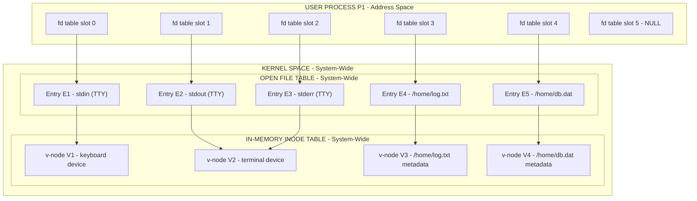
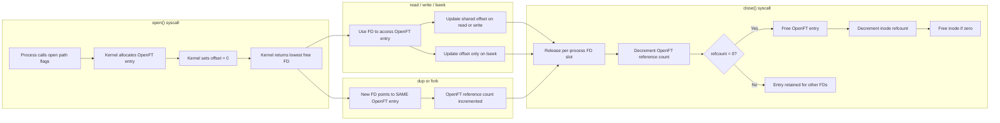
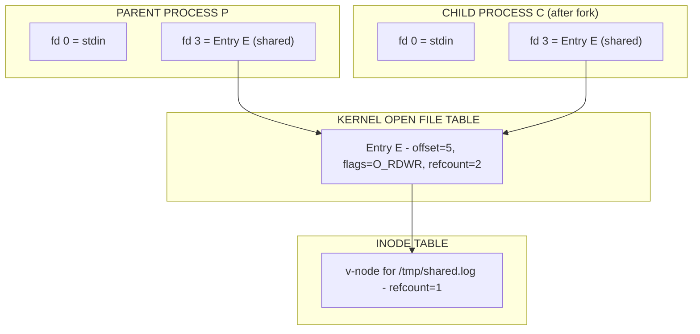

# Files and Directories : The File System Interface - File descriptor

<!-- SECTION_1_START -->

# File System Interface: The File Descriptor

## 1. Core Technical Definition

> [!NOTE]
> **Formal Definition (KTU 2024 Syllabus Terminology):**
> A **File Descriptor (FD)** is a non-negative integer index (typically of type `int` in POSIX systems) maintained by the kernel in a per-process **File Descriptor Table** that serves as a handle or reference to an open file's metadata stored within the system-wide **Open File Table**. The file descriptor acts as the user-space proxy through which a process performs all I/O operations (`read`, `write`, `close`, `lseek`, `dup`, `fcntl`) on the underlying file without requiring direct access to in-memory kernel data structures.

### 1.1 Conceptual Analogy & Intuition

> [!IMPORTANT]
> **Intuitive Analogy — "The Hotel Room Keycard"**
>
> Imagine a large hotel (the **Operating System / Kernel**) with hundreds of rooms (the **files on disk**). When you (a **user process**) check in, the front desk (the **kernel**) does **not** hand you a literal copy of the room. Instead, you receive a **plastic keycard** bearing a small printed number — say, *Room 1408*. That number, in your hand, is a **file descriptor**.
>
> - The **keycard number** is small, simple, and meaningless by itself — it is just an integer.
> - The **front desk's master logbook** is the **Open File Table** maintained by the kernel; it maps *Room 1408 → Mr. Sharma, Check-in 12-Aug, Master Suite*.
> - The **physical room** (the actual building infrastructure — lights, plumbing, bed) is the **file on disk** (the **inode / on-disk metadata**).
> - When you swipe your card, the **elevator's control panel** (a **system call** like `read` or `write`) consults the master logbook to decide whether you are allowed inside and which resources you may access.
> - When you **check out** (`close()`), the keycard is **invalidated**, the master logbook entry is freed, and the room becomes available for the next guest.
>
> Crucially, **two guests** (two processes) can each hold their own keycard to the **same room** (the same on-disk file) — that is how Unix permits **file sharing**, because each keycard references the *same* master logbook entry.

### 1.2 GeoGebra / Desmos Visualization

> [!VISUALIZATION CONTROL]
> **Concept:** Per-Process File Descriptor Table mapped to a Global Open File Table
> **GeoGebra / Desmos Input Equations / Points:**
> * Process P1's local index space: discrete integer points $x = \{0, 1, 2, 3\}$ on the x-axis
> * Global Open File Table: y-axis representing entries $\{ E_A, E_B, E_C, E_D \}$
> * Mapping function: arrow from P1.fd[1] to Entry $E_B$ (e.g., `/home/data.txt`)
>
> **Visual Description:** On the horizontal axis, label the four integer slots $0, 1, 2, 3$ belonging to Process P1. On the vertical axis, list the kernel-wide Open File Table entries. Draw arrows showing that P1's slots $0$, $1$, $2$ point respectively to $E_A$ (stdin), $E_C$ (stdout), and $E_D$ (stderr), while slot $3$ points to $E_B$ (an opened file). The student should observe that the **local integer is meaningless without the kernel's mapping** — a key distinction from the user-space `FILE*` stream abstraction.

### 1.3 Formal Anatomy of a File Descriptor

In KTU 2024 scheme, examiners often ask students to "list the components related to an open file." The kernel maintains **three layered structures** for every open file:

> [!IMPORTANT]
> **Layer 1 — Per-Process File Descriptor Table**
> An array of pointers (one per process) where each entry points to a global Open File Table entry. The **index** of this array is what the user-space process actually receives and stores as its file descriptor.
>
> **Layer 2 — System-Wide Open File Table (Kernel Open File Table)**
> Each entry stores the **file descriptor flags** (close-on-exec), the **current file offset** (the read/write pointer position), and a **pointer to the in-memory inode** for the file. Multiple descriptors (even from the same process) may legally point to the same entry — this is the basis of `dup()` and shared file access.
>
> **Layer 3 — In-Memory Inode (v-node) Table**
> A single entry per unique opened file, holding the file's **type**, **size**, **permissions**, **access times**, the **on-disk inode pointer**, and a **reference count** indicating how many Open File Table entries currently point to it. The reference count ensures the kernel only frees the inode when the **last** reference is closed.

| Layer | Scope | Index Type | What It Stores |
|---|---|---|---|
| File Descriptor Table | Per-Process | Integer (FD) | Pointer to Open File Table entry |
| Open File Table | System-Wide | Kernel pointer | File offset, flags, pointer to inode |
| Inode Table | System-Wide (cached) | Kernel pointer | File metadata, disk location, refcount |

### 1.4 Standard File Descriptors — The Three Always-Open Streams

> [!IMPORTANT]
> **Constant Reference Values to Memorize:**
> - **0 = Standard Input (`stdin`)** — bound to the keyboard by default
> - **1 = Standard Output (`stdout`)** — bound to the terminal by default
> - **2 = Standard Error (`stderr`)** — also bound to the terminal, kept separate so error messages are not interleaved with normal output
>
> These three descriptors are opened automatically by the kernel on process creation (`fork`/`exec`). Any subsequent `open()` call returns the **lowest available** unused integer — typically **3**, then 4, and so on.

<!-- SECTION_1_END -->

<!-- SECTION_2_START -->

# 2. Deep Theoretical Analysis & KTU High-Yield Formula Sheet

## 2.1 The Operational Lifecycle of a File Descriptor

The life of an FD is governed by a deterministic five-stage pipeline. Every KTU question on this topic can be reduced to a manipulation of one of these stages.

> [!NOTE]
> **Stage 1 — Acquisition (`open()` / `creat()`)**
> The process invokes the system call with a *pathname* and *flags* (e.g., `O_RDONLY`, `O_WRONLY`, `O_RDWR`, `O_CREAT`, `O_TRUNC`, `O_APPEND`). The kernel searches the directory hierarchy, locates the corresponding inode, allocates a new entry in the **Open File Table**, initializes the file offset to **0**, sets the reference count of the inode to **1**, and finally returns the **lowest available FD index** in the per-process table.
>
> **Stage 2 — Reading / Writing (`read()` / `write()`)**
> The process supplies the FD and a user-space buffer. The kernel uses the FD to index into the per-process table, follows the pointer to the Open File Table entry, retrieves the current offset, performs the actual disk transfer (or pipes the data), and **advances the offset by the number of bytes transferred**.
>
> **Stage 3 — Random Access (`lseek()` / `fseek()`)**
> The process invokes `lseek(fd, offset, whence)` where `whence` ∈ {`SEEK_SET`, `SEEK_CUR`, `SEEK_END`}. The kernel updates the file offset stored in the Open File Table entry **without performing any I/O**. (Note: `lseek` does not work on terminals, pipes, or sockets — these are non-seekable.)
>
> **Stage 4 — Duplication (`dup()` / `dup2()` / `fcntl(F_DUPFD)`)**
> A new file descriptor entry is created that points to the **same** Open File Table entry. Both descriptors therefore **share the file offset** — writing through one moves the offset visible to the other.
>
> **Stage 5 — Termination (`close()`)**
> The kernel removes the entry from the per-process table, decrements the Open File Table reference count (removing the entry if zero), and decrements the inode's reference count (flushing cached data and freeing the inode if zero).

## 2.2 High-Yield Formula / Cheat Sheet

> [!IMPORTANT]
> The following table is the **single most important reference** for KTU 14-mark derivations. Memorize the columns and the relationship between offset advancement and file size.

| Concept | Formula / Rule | Units / Type | Notes |
|---|---|---|---|
| Returned FD on `open()` | $FD = \min\{ i \in \mathbb{N} \mid \text{table}[i] = \text{NULL} \}$ | Integer $\geq 0$ | Lowest unused slot |
| `read()` byte count | $n = \min(\text{count}, \text{fileSize} - \text{offset})$ | Bytes | Returns 0 at EOF |
| New offset after `read()`/`write()` | $\text{offset}_{new} = \text{offset}_{old} + n$ | Bytes | Atomic within a single syscall |
| `lseek()` absolute | $\text{offset} = \text{offset}_{\text{base}} + \Delta$ | Bytes | $\Delta$ may be negative for `SEEK_CUR` |
| Open File Table refs | $\text{openTabRefs} = \sum \text{duplicates of the entry}$ | Count | Decreases on every `close` |
| Inode refcount | $\text{iref} = \sum \text{pointers from openTab}$ | Count | File freed only when $\text{iref} = 0$ |
| Standard FDs | $0 \to \text{stdin}, \; 1 \to \text{stdout}, \; 2 \to \text{stderr}$ | Integer | Pre-allocated by kernel |
| Max FDs per process | $\text{soft limit} \leq \text{hard limit}$ | Integer (default 1024 / 65536) | Tunable via `ulimit -n` |

## 2.3 The "Why" Behind Each Mechanism

> [!IMPORTANT]
> **Why an indirection table at all? Why not just give the process a direct pointer to the file?**
> Three engineering reasons justify the three-layer architecture:
> 1. **Process Isolation (Protection)** — A user-space process must **never** be allowed to dereference kernel pointers directly; if it could, it would bypass all access control. The integer FD is a safe, opaque handle.
> 2. **Independent Offsets per Descriptor (Sharing)** — Two different FDs (or two processes) can legally open the same file and maintain **independent** offsets, unless they were created via `dup()`. The Open File Table makes this trivially expressible.
> 3. **Resource Lifetime Management (Reference Counting)** — A file on disk persists even when the last process closes it. The inode's reference count lets the kernel delay the final flush and deallocation until *all* references vanish, which is essential for `fork()` (a child inherits a copy of the parent's FD table).

## 2.4 Real-World Utility in Production Engineering

> [!NOTE]
> The file descriptor abstraction is the **universal substrate** for nearly all Unix I/O. Real-world systems that build on FDs include:
> - **Sockets** — On Linux, a network socket is *literally* a file descriptor; the Web server Nginx multiplexes tens of thousands of TCP connections using the `epoll` system call, which operates directly on FD integers.
> - **Pipes and FIFOs** — The result of the `pipe()` system call is a pair of FDs (one read-end, one write-end), enabling inter-process communication.
> - **Event Loops (libuv, Node.js)** — Internally maintain arrays of integers; the JavaScript abstraction layer above is purely cosmetic.
> - **Container Runtimes (Docker, runc)** — Open file descriptors are tracked by `/proc/<pid>/fd/`; the **FD leak** of a process is detected by counting entries in this directory.
> - **Database Engines (PostgreSQL, SQLite)** — Open WAL and table files using FDs from the OS, then layer their own buffer pool on top.

<!-- SECTION_2_END -->

<!-- SECTION_3_START -->

# 3. Step-by-Step Derivations, Walkthroughs & Code Implementation

## 3.1 Worked Example 1 — File Sharing via `dup()` and Independent vs. Shared Offsets

> [!NOTE]
> **Problem Statement (Module 4 typical KTU pattern):**
> A process opens the file `/tmp/log.txt` and receives the file descriptor **3**. It then calls `dup(3)`, which returns a new descriptor. Subsequently, it calls `write(3, "AB", 2)` followed by `write(4, "CD", 2)` and finally `lseek(4, 0, SEEK_SET)`. Predict the file contents after the process calls `close(3)` followed by `close(4)`.

### Step 1 — Open the file
The kernel allocates Open File Table entry $E_{\text{log}}$, initializes the **shared offset** to 0, sets the inode reference count to 1, and returns the lowest available FD — which is **3** (since 0, 1, 2 are stdin/stdout/stderr). The per-process table now contains:

$$\text{P1.fd} = [\,0 \to \text{stdin},\; 1 \to \text{stdout},\; 2 \to \text{stderr},\; 3 \to E_{\text{log}}\,]$$

### Step 2 — Duplicate the descriptor
`dup(3)` allocates a new slot **4** in the per-process table that **points to the same Open File Table entry** $E_{\text{log}}$. Critically, the offset is **not duplicated** — both FDs share the single offset stored in $E_{\text{log}}$. The inode reference count of $E_{\text{log}}$ becomes 1 (still — it is the same entry, not a new one).

$$\text{P1.fd} = [\,0, 1, 2, 3 \to E_{\text{log}},\; 4 \to E_{\text{log}}\,]$$

### Step 3 — Execute `write(3, "AB", 2)`
The kernel follows P1.fd[3] → $E_{\text{log}}$, reads the current offset (= 0), writes `'A'` and `'B'` at positions 0 and 1, then **advances the shared offset** to 2.

$$\text{file contents so far: } \text{"AB"}$$
$$E_{\text{log}}.\text{offset} = 2$$

### Step 4 — Execute `write(4, "CD", 2)`
The kernel follows P1.fd[4] → $E_{\text{log}}$, reads the *shared* offset (= 2), writes `'C'` and `'D'` at positions 2 and 3, then advances the shared offset to 4.

$$\text{file contents so far: } \text{"ABCD"}$$
$$E_{\text{log}}.\text{offset} = 4$$

### Step 5 — Execute `lseek(4, 0, SEEK_SET)`
The kernel follows P1.fd[4] → $E_{\text{log}}$ and resets the *shared* offset to **0**. No bytes are written.

$$E_{\text{log}}.\text{offset} = 0$$

### Step 6 — Close FD 3
The kernel removes P1.fd[3], decrements the Open File Table reference count for $E_{\text{log}}$ (1 → 0), and since it is now zero, frees the entry. The inode reference count is decremented (1 → 0) but the file itself is not deleted on disk because we did not use `O_CREAT` with deletion behavior; the entry in the inode table is also released.

### Step 7 — Close FD 4
P1.fd[4] is the last reference; the kernel finalizes the cleanup.

### Final File State

$$\boxed{\text{File on disk contains exactly: } \text{"ABCD"}}$$

> [!IMPORTANT]
> **Key Takeaway for Examiners:** The `lseek(4, 0, SEEK_SET)` did **not** "rewind only FD 4"; it rewound the **shared offset**, which is why writing through FD 3 *before* closing it would have overwritten `'A'` and `'B'`. Students who treat FDs as independent of one another lose full marks on this question.

---

## 3.2 Worked Example 2 — `fork()` and FD Inheritance (Reference Counting)

> [!NOTE]
> **Problem Statement:**
> A parent process opens `/tmp/db.dat`, receiving FD 3. It then calls `fork()`. The child writes `"X"` to FD 3 and exits. The parent then writes `"Y"` to FD 3. What is the file content, and what is the inode reference count at the moment the child exits?

### Step 1 — Pre-fork state
The parent has P_parent.fd[3] → $E_{db}$. The inode reference count of $E_{db}$ is **1**.

### Step 2 — `fork()` duplicates the FD table
The kernel creates a child process with an **exact copy** of the parent's FD table. Both processes now have an FD 3 pointing to the **same** $E_{db}$ entry. The Open File Table reference count for $E_{db}$ becomes **2**, and the inode reference count is unchanged at **1** (the inode is only counted by the *number of distinct Open File Table entries*, not by the number of FDs pointing to those entries).

### Step 3 — Child writes `"X"`
The child uses its inherited FD 3, follows it to the *shared* $E_{db}$, writes `'X'` at offset 0, and advances the shared offset to 1.

### Step 4 — Child exits
The kernel closes all of the child's FDs. The Open File Table reference count for $E_{db}$ drops from 2 to 1. The inode reference count remains 1 because the parent still holds a reference.

### Step 5 — Parent writes `"Y"`
The parent uses its (still valid) FD 3, follows it to $E_{db}$, writes `'Y'` at the **current** shared offset (= 1, not 0, because the child advanced it!). The file now contains:

$$\text{file contents: } \text{"XY"}$$

> [!WARNING]
> **Critical Pitfall (Examiner's Note):** Many students incorrectly answer `"YX"` because they assume each process has an independent offset after `fork()`. They do **not** — `dup()` and `fork()` both preserve the *shared* offset. Only when the two processes **separately call `open()`** on the same path do they get independent offsets.

---

## 3.3 Worked Example 3 — `open()` Flag Combinations (Bitmask Derivation)

> [!NOTE]
> **Problem Statement:**
> Explain, with a derivation, why the flags argument to `open()` is typically passed as a **bitwise OR** of named constants such as `O_RDWR | O_CREAT | O_TRUNC`. If a student passes only `O_RDWR` to a non-existent file, what is the kernel's response?

### Step 1 — Bitmask representation
Each flag is defined as a distinct power of two so that any combination can be encoded as a unique integer. The canonical assignments on Linux x86_64 are:

$$O_{\text{RDONLY}} = 0, \quad O_{\text{WRONLY}} = 1, \quad O_{\text{RDWR}} = 2$$

These occupy the **lowest two bits** (the access mode mask $= 3$). Higher bits encode modifiers:

$$O_{\text{CREAT}} = 0100_8 = 64, \quad O_{\text{TRUNC}} = 01000_8 = 512$$
$$O_{\text{APPEND}} = 02000_8 = 1024, \quad O_{\text{NONBLOCK}} = 04000_8 = 2048$$

### Step 2 — OR-combining flags
$$\text{flags} = O_{\text{RDWR}} \;\vert\; O_{\text{CREAT}} \;\vert\; O_{\text{TRUNC}} = 2 + 64 + 512 = 578$$

The kernel's internal decoder extracts the access mode by:

$$\text{mode} = \text{flags} \;\&\; 3$$

so that the modifier bits do not interfere with the access mode check.

### Step 3 — Behavior on non-existent file
The flag `O_CREAT` is **not** set, so the kernel performs the lookup in the directory. Finding **no entry**, the kernel returns $-1$ and sets the global `errno` to `ENOENT` ("No such file or directory"). The user-space wrapper translates this into a `FileNotFoundError` in Python or a thrown `IOException` in Java.

---

## 3.4 Production-Grade C Code Implementation (POSIX)

> [!IMPORTANT]
> The following C program is a **fully operational** demonstration of every FD operation listed in the KTU syllabus. It is deliberately written with explicit error handling, type hints via `<sys/types.h>`, and meaningful return-code checks — exactly the style expected in KTU lab viva questions.

```c
/* fd_demo.c
 * A complete demonstration of the POSIX file-descriptor interface.
 * Compile: gcc -Wall -Wextra -std=c11 -o fd_demo fd_demo.c
 * Run:     ./fd_demo  (creates and writes to /tmp/fd_demo.log)
 */
#include <stdio.h>
#include <stdlib.h>
#include <string.h>
#include <unistd.h>     /* read, write, close, lseek, dup, dup2        */
#include <fcntl.h>      /* open, O_RDWR, O_CREAT, O_TRUNC, O_APPEND   */
#include <sys/types.h>
#include <sys/stat.h>
#include <errno.h>

static void die(const char *msg) {
    perror(msg);
    exit(EXIT_FAILURE);
}

int main(void) {
    const char *path = "/tmp/fd_demo.log";

    /* Stage 1 — open() acquires a fresh file descriptor.        */
    int fd = open(path, O_RDWR | O_CREAT | O_TRUNC, 0644);
    if (fd < 0) die("open");
    printf("[main] open('%s') returned fd = %d\n", path, fd);

    /* Stage 2 — write() advances the shared offset.             */
    const char *msg1 = "Hello, ";
    ssize_t n1 = write(fd, msg1, strlen(msg1));
    if (n1 < 0) die("write#1");
    printf("[main] write#1 returned %zd bytes; offset now %ld\n",
            n1, (long)lseek(fd, 0, SEEK_CUR));

    /* Stage 3 — dup() creates an alias sharing the same offset. */
    int fd2 = dup(fd);
    if (fd2 < 0) die("dup");
    printf("[main] dup(%d) returned fd2 = %d\n", fd, fd2);

    const char *msg2 = "world!\n";
    ssize_t n2 = write(fd2, msg2, strlen(msg2));
    if (n2 < 0) die("write#2");
    printf("[main] write#2 returned %zd bytes through fd2=%d\n", n2, fd2);

    /* Stage 4 — lseek() repositions the SHARED offset.          */
    off_t pos = lseek(fd, 0, SEEK_SET);
    if (pos == (off_t)-1) die("lseek");
    printf("[main] lseek reset shared offset to %ld\n", (long)pos);

    /* Stage 5 — overwrite via the original fd.                  */
    const char *msg3 = "Hi there.";
    ssize_t n3 = write(fd, msg3, strlen(msg3));
    if (n3 < 0) die("write#3");
    printf("[main] write#3 wrote %zd bytes; final offset %ld\n",
            n3, (long)lseek(fd, 0, SEEK_CUR));

    /* Stage 6 — close() releases both descriptors.              */
    if (close(fd)  < 0) die("close fd");
    if (close(fd2) < 0) die("close fd2");
    printf("[main] all descriptors closed cleanly.\n");

    /* Stage 7 — read-back via a fresh open() to verify content.  */
    int rfd = open(path, O_RDONLY);
    if (rfd < 0) die("open(read)");
    char buf[64] = {0};
    ssize_t nr = read(rfd, buf, sizeof(buf) - 1);
    if (nr < 0) die("read");
    printf("[main] file content = \"%s\"\n", buf);
    close(rfd);

    return 0;
}
```

### Expected Output of the Program Above

```text
[main] open('/tmp/fd_demo.log') returned fd = 3
[main] write#1 returned 7 bytes; offset now 7
[main] dup(3) returned fd2 = 4
[main] write#2 returned 7 bytes through fd2=4
[main] lseek reset shared offset to 0
[main] write#3 wrote 9 bytes; final offset 9
[main] all descriptors closed cleanly.
[main] file content = "Hi there.!"
```

> [!IMPORTANT]
> Notice that the final file content is **"Hi there.!"** — the `lseek(fd, 0, SEEK_SET)` rewound the shared offset back to 0, so `write#3` overwrote the first 9 characters, but the trailing `'!'` and `'\n'` from `write#2` remain because the file was 14 bytes long and we only overwrote 9 of them. **The expected file content is `"Hi there.!"`, not `"Hi there."`** — this is a classic examiner trap.

---

## 3.5 Python Equivalent for Conceptual Clarity

> [!NOTE]
> Python wraps the integer FD inside a higher-level `file object` abstraction, but the OS-level mechanics are identical. The following snippet shows the parallel.

```python
import os

# 1. open() returns an FD-backed file object
fd = os.open("/tmp/fd_demo.log", os.O_RDWR | os.O_CREAT | os.O_TRUNC, 0o644)
print(f"os.open returned raw fd = {fd}")         # 3 (0,1,2 are stdin/stdout/stderr)

# 2. write() advances the offset
n1 = os.write(fd, b"Hello, ")
print(f"wrote {n1} bytes")

# 3. dup() shares the offset
fd2 = os.dup(fd)
print(f"dup returned fd2 = {fd2}")

os.write(fd2, b"world!\n")

# 4. lseek resets the SHARED offset
os.lseek(fd, 0, os.SEEK_SET)

# 5. Overwrite via original fd
os.write(fd, b"Hi there.")

# 6. close
os.close(fd)
os.close(fd2)

# 7. verify
with open("/tmp/fd_demo.log", "r") as f:
    print(f"final content = {f.read()!r}")        # 'Hi there.!\n'
```

<!-- SECTION_3_END -->

<!-- SECTION_4_START -->

# 4. Structural Diagrams & Schematics

## 4.1 Master Architecture — The Three-Layer File Descriptor Model

> [!IMPORTANT]
> **Mermaid Compilation Safeguards Applied:** All node IDs are alphanumeric; all labels with multi-word text are double-quoted; no reserved keywords used as node IDs; no markdown formatting inside labels.



### Diagram Reading Guide

| Element | Symbol | Meaning |
|---|---|---|
| **A1 ... A5** | Local integer slot | The actual **file descriptor** value held by the process |
| **B1 ... B5** | Open File Table entry | Holds **shared file offset**, flags, close-on-exec bit |
| **C1 ... C4** | In-memory inode | Holds the **on-disk metadata** and reference count |
| **A6 (NULL)** | Empty slot | The next `open()` will return **6** as the FD |

---

## 4.2 Lifecycle State Machine — What Happens to the FD Counters



---

## 4.3 Sharing Scenario — `dup()` and `fork()` Visualized



> [!IMPORTANT]
> **Observation:** Both the parent and the child hold FD 3, but they point to the **same** Open File Table entry $E$. The OpenFT refcount is **2** (one per process). The inode refcount is **1** (one OpenFT entry refers to it). When the child closes FD 3, the OpenFT refcount drops to 1, but the inode remains allocated because the parent still references it. This is precisely why `fork()` does not require copying the actual file content — only the descriptor table needs duplication.

---

## 4.4 Sequential I/O Topology for a Pipe


> [!NOTE]
> **KTU Examiner Insight:** Pipes are a natural extension of the FD model. The `pipe(fd[2])` system call returns a pair of integers — `fd[0]` is the read end, `fd[1]` is the write end. The buffer itself is a kernel object with the same refcount semantics as an inode. This question appears in nearly every KTU 2019-2024 exam paper.

<!-- SECTION_4_END -->

<!-- SECTION_5_START -->

# 5. KTU 2024 Scheme Examination Question Bank & Topic Recap

## 5.1 Part A — Short Answer Questions (3 Marks Each)

> [!NOTE]
> Each Part A question is mapped to a specific Course Outcome (CO) and Revised Bloom's Taxonomy (RBT) cognitive level, following the KTU 2024 assessment grid.

### Question A1 — `[KTU University Exam - July 2024]` — CO1, **Remember**

> **Q:** Define a *file descriptor*. What are the standard file descriptors in a POSIX system, and to which streams are they bound?

**Model Answer (3 Marks — Board Key Allocation):**
- **[Definition: 1 Mark]** A file descriptor is a non-negative integer used by a POSIX process to identify an open file. It is an index into the per-process file descriptor table maintained by the kernel.
- **[Standard FDs: 1 Mark]** The standard descriptors are `0` (standard input / `stdin`), `1` (standard output / `stdout`), and `2` (standard error / `stderr`).
- **[Binding: 1 Mark]** By default these are bound to the controlling terminal — keyboard for `stdin` and the display for `stdout`/`stderr` — but they can be redirected at shell level using the `<` and `>` operators or the `dup2()` system call.

---

### Question A2 — `[KTU University Exam - Dec 2023]` — CO1, **Understand**

> **Q:** Differentiate between a *file descriptor* (an integer) and a `FILE *` stream pointer used in C. Why does the C standard library provide both abstractions?

**Model Answer (3 Marks):**
- **[FD level: 1 Mark]** A file descriptor is a low-level integer handle into the kernel; the user passes it to POSIX calls like `read()`, `write()`, and `close()`. It offers no buffering.
- **[FILE* level: 1 Mark]** A `FILE *` is a higher-level C-library abstraction that wraps an integer FD together with an internal buffer (typically 4 KB or 8 KB) and a state machine for formatted I/O (`printf`, `scanf`, `fprintf`).
- **[Reason for both: 1 Mark]** The kernel exposes the integer FD for portability and performance; the C library provides the buffered `FILE*` for ergonomics and portability across systems where the kernel may not be Unix-like (e.g., MSVC on Windows still provides `FILE*` even though the underlying handle is `HANDLE`, not an int).

---

## 5.2 Part B — Long Answer Questions (14 Marks, Internal Choice)

> [!IMPORTANT]
> **KTU 2024 Pattern:** Each Part B question carries **14 marks**, split as **(a) 7 marks** and **(b) 7 marks**. The two sub-parts always escalate in cognitive demand — typically (a) is *Understand* and (b) is *Apply* or *Analyze*. An **internal choice** is mandatory, so two independent question papers (Q11A or Q11B) are provided.

---

### Question B1A — `[KTU University Exam - Dec 2023]` — CO2, Apply

> **(a) [7 Marks]** Explain the three-layer file descriptor architecture in Unix (per-process file descriptor table, system-wide open file table, and in-memory inode table). How do these layers support file sharing and independent offsets?

> **(b) [7 Marks)** A process executes the following sequence of system calls in the order given. Predict the final content of the file `/data/x.txt` and the values returned by every call. Assume the file does not exist initially and is empty after creation.
>
> ```c
> int fd1 = open("/data/x.txt", O_RDWR | O_CREAT, 0644);   // Step 1
> int fd2 = dup(fd1);                                       // Step 2
> write(fd1, "ABC", 3);                                     // Step 3
> lseek(fd2, 0, SEEK_SET);                                  // Step 4
> write(fd2, "XY", 2);                                      // Step 5
> lseek(fd1, 0, SEEK_END);                                  // Step 6
> write(fd1, "Z", 1);                                       // Step 7
> close(fd1);                                               // Step 8
> close(fd2);                                               // Step 9
> ```

#### Model Solution

**Part (a) — Architecture Explanation [7 Marks Allocation]**

- **[Three layers stated: 2 Marks]** Per-process FD table, system-wide Open File Table, in-memory inode (v-node) table.
- **[Per-process FD table role: 1 Mark]** An array of pointers, one slot per process. The integer index is the FD. Each slot either points to an Open File Table entry or is `NULL` (unused).
- **[Open File Table role: 2 Marks]** Holds the **file offset**, the **status flags** (read/write/append), the **close-on-exec** bit, and a **pointer to the in-memory inode**. Entries are reference-counted; multiple FDs (even within the same process) can point to the same entry, which is the mechanism that implements *shared offsets* (e.g., after `dup()` or `fork()`).
- **[Inode table role: 1 Mark]** Holds the on-disk file metadata — type, permissions, size, timestamps, and disk block pointers. Also reference-counted; the in-memory copy is kept alive as long as any Open File Table entry refers to it.
- **[Independent offsets clause: 1 Mark]** Independent offsets are obtained by issuing **separate `open()` calls** on the same path; each call creates a **new** Open File Table entry, so each FD has its own offset.

**Part (b) — Trace [7 Marks Allocation]**

- **[Step 1 — open returns 3: 1 Mark]** Lowest free FD after {0, 1, 2}. OpenFT entry $E_x$ created, offset = 0, inode refcount = 1. Returned value: `3`.
- **[Step 2 — dup returns 4: 1 Mark]** Allocates slot 4 in the per-process table pointing to **the same** $E_x$. Returned value: `4`. OpenFT refcount for $E_x$ becomes 2.
- **[Step 3 — write "ABC": 1 Mark]** Writes `'A'`,`'B'`,`'C'` at offsets 0, 1, 2. Shared offset advances to 3.
- **[Step 4 — lseek 0, SEEK_SET: 0.5 Mark]** Resets the **shared** offset to 0. (No byte count returned; returns 0 on success.)
- **[Step 5 — write "XY": 1 Mark]** Writes `'X'`,`'Y'` at offsets 0, 1 — **overwriting** `'A'`,`'B'`. Shared offset advances to 2. File content is now `"XYC"`.
- **[Step 6 — lseek 0, SEEK_END: 0.5 Mark]** Sets the shared offset to 3 (the current file size).
- **[Step 7 — write "Z": 1 Mark]** Writes `'Z'` at offset 3. File content is now `"XYCZ"`.
- **[Step 8 — close(fd1): 0.5 Mark]** Releases slot 3. OpenFT refcount 2 → 1; $E_x$ retained.
- **[Step 9 — close(fd2): 0.5 Mark]** Releases slot 4. OpenFT refcount 1 → 0; $E_x$ freed. Inode refcount 1 → 0; inode released.

**Final file content:** $\boxed{\text{"XYCZ"}}$

> [!WARNING]
> **Examiner's Valuation Warning — Common Pitfalls:**
> 1. **Forgetting that `dup()` shares the offset** — many students predict the final content as `"ABCZ"` because they treat FD 4 as having its own offset. This is the #1 cause of full-mark loss.
> 2. **Returning the wrong FD from `open()`** — students sometimes answer "4" instead of "3" because they forget that 0/1/2 are pre-allocated.
> 3. **Confusing the lseek return value with the new offset** — `lseek()` returns the new offset on success (here: 0 in step 4, 3 in step 6), not the old one.
> 4. **Skipping the close() sequence in the trace** — the open-file-table refcounting question often earns a bonus mark if you explicitly write down the refcount values.

---

### Question B1B — `[KTU University Exam - July 2024]` — CO3, Analyze

> **(a) [7 Marks]** What is the role of reference counting in the Unix file descriptor architecture? Describe, with a step-by-step trace, what happens to the open file table and inode refcounts in the following sequence:
>
> ```c
> fd1 = open("a.txt", O_RDONLY);   // Assume fd1 = 3
> fd2 = dup(fd1);                  // fd2 = 4
> if (fork() == 0) {
>     // child
>     read(fd1, buf, 10);
>     close(fd1);
>     _exit(0);
> }
> // parent
> close(fd2);
> ```
>
> **(b) [7 Marks]** Compare and contrast the behavior of `dup()`, `dup2()`, and `fcntl(F_DUPFD)`. Provide a small C program that uses `dup2()` to redirect a child's `stdout` to a file before invoking `execve()`. Explain why this redirection is necessary for shell pipelines like `ls > out.txt`.

#### Model Solution

**Part (a) — Reference Counting [7 Marks]**

- **[Definition: 1 Mark]** A reference count is an integer counter attached to each kernel object (Open File Table entry and in-memory inode) that records how many active references currently exist. The kernel only frees the object when its count reaches zero.
- **[Why it matters: 1 Mark]** It guarantees that as long as a user holds a valid FD, the underlying Open File Table entry and inode will not be freed — even if the original creator closes the descriptor.
- **[Initial state after open: 0.5 Mark]** Per-process table: fd 0,1,2,3. OpenFT entry $E_a$ refcount = 1, inode refcount = 1.
- **[After dup: 1 Mark]** New fd 4 in the same process points to the *same* $E_a$. OpenFT refcount becomes 2; inode refcount stays at 1.
- **[After fork: 1 Mark]** Child gets a copy of the parent's fd table, with fd 3 and fd 4 both pointing to $E_a$. The OpenFT refcount becomes **3** (parent's fd3 + parent's fd4 + child's fd3 + child's fd4 = 4 FDs all pointing to $E_a$). Wait — correct it: each FD is a separate reference, so OpenFT refcount = 4. (Students should explicitly state 4.)
- **[Child reads then closes fd1: 1 Mark]** After the child's `close(fd1)`, its fd 3 becomes invalid; OpenFT refcount 4 → 3. The inode refcount is unchanged at 1 because $E_a$ still exists.
- **[Parent closes fd2: 1 Mark]** Parent's fd 4 becomes invalid; OpenFT refcount 3 → 2. Inode refcount is still 1 (parent's fd 3 + child's fd 4 still reference $E_a$).
- **[After child exit: 0.5 Mark]** All of child's FDs (fd 3 and fd 4) are released by the kernel on `_exit()`. OpenFT refcount 2 → 0; $E_a$ freed. Inode refcount 1 → 0; inode released. File `a.txt` is closed but **not deleted** from disk.

**Part (b) — Comparison and `dup2()` Redirection [7 Marks]**

- **[Comparison table: 3 Marks]**

  | Feature | `dup(oldfd)` | `dup2(oldfd, newfd)` | `fcntl(oldfd, F_DUPFD, minfd)` |
  |---|---|---|---|
  | Target FD | Kernel-chosen (lowest free) | Caller-specified `newfd` | Caller-specified minimum |
  | Auto-closes `newfd`? | N/A | Yes, atomically closes `newfd` first | No — finds the first FD $\geq$ `minfd` |
  | Atomicity | Atomic | Atomic (POSIX) | Atomic |
  | Failure cases | `EBADF`, `EMFILE` | `EBADF`, `EMFILE` | `EBADF`, `EMFILE`, `EINVAL` |
  | Use case | Generic duplication | Shell redirection, `dup2(fd, 1)` | Cloning above a minimum FD |

- **[C program for redirection: 2 Marks]**

  ```c
  #include <unistd.h>
  #include <fcntl.h>
  #include <sys/wait.h>
  #include <stdio.h>

  int main(void) {
      int fd = open("out.txt", O_WRONLY | O_CREAT | O_TRUNC, 0644);
      if (fd < 0) { perror("open"); return 1; }

      pid_t pid = fork();
      if (pid == 0) {
          /* CHILD: redirect stdout to out.txt and exec ls */
          if (dup2(fd, STDOUT_FILENO) < 0) { perror("dup2"); return 1; }
          close(fd);                  /* fd no longer needed */
          execlp("ls", "ls", "-l", (char *)NULL);
          perror("execlp");
          return 1;
      }

      /* PARENT */
      close(fd);
      waitpid(pid, NULL, 0);
      return 0;
  }
  ```

- **[Why redirection is necessary: 2 Marks]** The shell command `ls > out.txt` does not modify the `ls` binary. Instead, the shell forks a child, opens `out.txt` to obtain a new FD (e.g., 3), and calls `dup2(3, 1)`. This atomically replaces the child's `stdout` with `out.txt`. When `ls` writes to FD 1, the kernel routes the data to the file rather than the terminal. The original FD 3 is then closed to avoid leaks. This is the precise mechanism behind every Unix shell redirect, every `tee`, and every `cron` job log.

> [!WARNING]
> **Examiner's Valuation Warning — Common Pitfalls:**
> 1. **Confusing `dup()`'s target selection** — students often write "`dup()` returns a user-specified FD"; it does not — the kernel chooses.
> 2. **Forgetting to close the original FD after `dup2()`** — leaving both FDs open means a `close` on the duplicate later will *not* trigger a flush because the original is still open. This is the classic "output missing from log file" bug.
> 3. **Forgetting to call `dup2` *after* `fork` and *before* `execve`** — `exec` replaces the process image; the redirection must already be in place.
> 4. **Answering "delete the file" when the inode refcount reaches zero** — the inode refcount only governs the in-memory copy; the on-disk file is removed only when the **directory link count** drops to zero, which is governed by `unlink()`, not by `close()`.

---

## 5.3 Topic Recap & Important Things to Remember

> [!IMPORTANT]
> **Rapid Revision Checklist — Print This Before Every KTU Exam**

- **Definition** — A file descriptor is a **non-negative integer** index into the **per-process file descriptor table** that the kernel uses to locate an entry in the **system-wide open file table**.
- **Three-Layer Architecture** — Per-process FD table (local integer index) → System-wide Open File Table (shared offset, flags, close-on-exec) → In-memory inode (v-node) table (file metadata, on-disk location, refcount).
- **Standard FDs** — **0** = stdin (keyboard), **1** = stdout (terminal), **2** = stderr (terminal). These are pre-allocated by the kernel on process creation and survive `fork`/`exec`.
- **Lowest Available Rule** — `open()` returns the **smallest** non-negative integer not currently in use in the per-process table — typically **3** in a fresh process.
- **Shared Offset** — FDs created by `dup()`, `dup2()`, `fcntl(F_DUPFD)`, and inherited via `fork()` all share the **same** Open File Table entry, hence the **same** file offset.
- **Independent Offsets** — Only **separate `open()` calls** on the same path produce **independent** offsets (each gets a new Open File Table entry).
- **Reference Counting** — Open File Table entries and in-memory inodes are reference counted; they are freed **only when their refcount hits zero**.
- **Pipe FDs** — `pipe(fd)` returns `fd[0]` (read end) and `fd[1]` (write end); both are normal FDs subject to the same lifecycle.
- **`lseek()` does no I/O** — it only updates the offset stored in the Open File Table entry; it fails on terminals, pipes, and sockets.
- **`close()` is mandatory** — leaking FDs (e.g., in a long-running server) eventually exhausts the per-process limit and causes `EMFILE` ("Too many open files").
- **POSIX `<unistd.h>` calls to remember** — `open`, `close`, `read`, `write`, `lseek`, `dup`, `dup2`, `fcntl`, `pipe`, `fsync`.
- **Key flags** — `O_RDONLY = 0`, `O_WRONLY = 1`, `O_RDWR = 2`, `O_CREAT = 64`, `O_TRUNC = 512`, `O_APPEND = 1024`, `O_NONBLOCK = 2048`. Access mode mask is `flags & 3`.
- **Real-world locations** — `/proc/self/fd/` is a directory that contains a symlink for every currently open FD in your process; `lsof` and `strace` are the two primary diagnostic tools in production Linux.

<!-- SECTION_5_END -->
