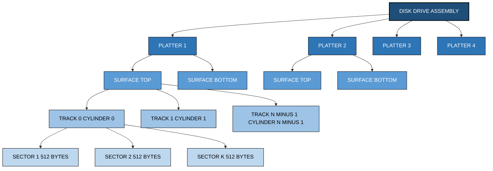
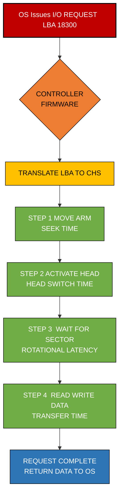
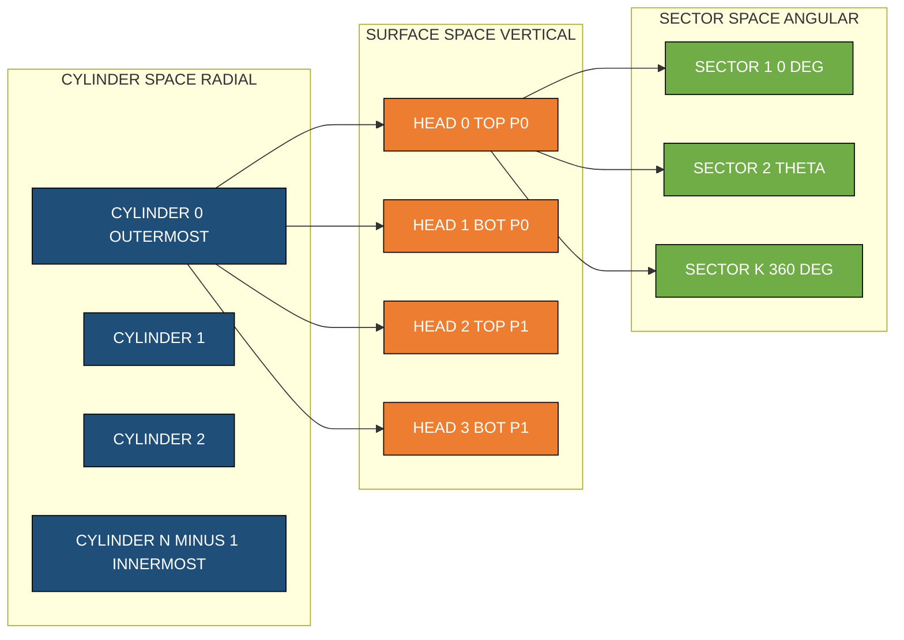
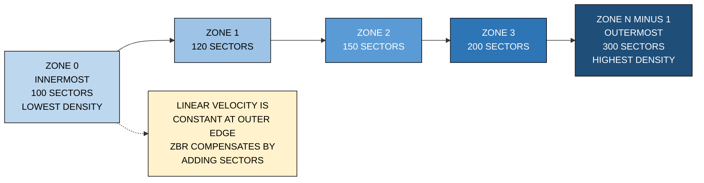

# Geometry

<!-- SECTION_1_START -->
# Disk Geometry — The Physical Architecture of Secondary Storage

## 1.1 Formal Academic Definition (KTU 2024 Syllabus Terminology)

> [!IMPORTANT]
> **Disk Geometry** is the complete physical and logical structural organization of a magnetic (or solid-state) storage device. It defines the *spatial arrangement* of storage locations, addressing scheme, rotational mechanics, and surface topology that collectively determine how data is stored, located, and retrieved by the Operating System's I/O subsystem.

In strict KTU board terminology, disk geometry is described as the **multi-dimensional hierarchical partition of a rotating magnetic platter into concentric tracks, radial sectors, vertical cylinders, and planar surfaces**, each governed by a specific addressing primitive (CHS or LBA).

The key structural components are:

| Component | Definition |
|---|---|
| **Platter** | A rigid, circular disk coated with a thin magnetic film on which data is stored. |
| **Surface** | Each platter provides two flat faces (top and bottom) usable for storage. |
| **Track** | A closed concentric circle on a surface on which data is magnetically encoded. |
| **Sector** | The smallest individually addressable unit of a track (typically **512 bytes** or **4096 bytes**). |
| **Cylinder** | The vertical alignment of all tracks situated at the same radial distance from the spindle across all platters. |
| **Spindle** | The central motor shaft that rotates all platters at a constant angular velocity. |
| **Read/Write Head** | An electromagnetic transducer mounted on a movable arm that hovers just above each surface. |
| **Sector Interleaving** | Logical reordering of physical sectors to compensate for rotational delay during sequential reads. |
| **Zoned Bit Recording (ZBR)** | A modern recording scheme in which outer tracks contain more sectors than inner tracks, since outer tracks have a greater linear circumference. |

---

## 1.2 Intuitive Real-World Analogy

> [!NOTE]
> **Analogy — The Multi-Story Library Carousel**

Imagine a **rotating circular book carousel** in a library, but with a twist — the carousel is a stack of **ten such rotating platforms**, one above the other, all spinning together on the same central axis.

* Each **platform (platter)** has its own flat top and bottom that we can write on.
* On every platform, imagine drawing **concentric circles** like the rings of a tree trunk. Each ring is a **track**.
* Now slice every ring into **pie-shaped wedges** (like cutting a pizza). Each wedge is a **sector** — the smallest piece of information you can grab.
* A **cylinder** is the *vertical column* formed when you pick the *same-numbered ring* on *every single platform* stacked together. It's like taking the 5th floor from every building in a row — they line up to form a "cylinder" of data.
* The **read/write head** is the librarian's hand. There is one such hand per platform face, all mounted on a single robotic **arm** that swings radially (in and out) to reach the correct ring. The arm moves all hands together — they cannot operate independently.
* The carousel is constantly spinning. So once the arm reaches the right ring, the librarian must *wait* for the correct pie-slice to rotate into position before reading or writing.

> [!TIP]
> **Why does this matter to the OS?** Because the time it takes the arm to swing to the right ring (**seek time**), the wait for the right slice to rotate under the head (**rotational latency**), and the actual reading of data (**transfer time**) *all* depend on geometry. The OS must intelligently schedule I/O requests to minimize arm movement — this is the foundation of **disk scheduling algorithms (FCFS, SSTF, SCAN, C-SCAN, LOOK, C-LOOK)**.

---

## 1.3 Standard Physical Constants Used in KTU Board Problems

> [!IMPORTANT]
> Frequently used parameters that examiners state explicitly:
> * **Sector size** = **512 bytes** (legacy) or **4096 bytes** (Advanced Format / 4Kn)
> * **Average sector size assumed in board numericals** = **512 bytes**
> * **Bytes per track** = sectors per track $\times$ sector size
> * **Tracks per surface = Number of cylinders** (these two terms are numerically equivalent)
> * **Heads = Number of surfaces = 2 $\times$ (number of platters)**

> [!VISUALIZATION CONTROL]
> **Concept:** Polar coordinate plot of one platter surface showing tracks and sectors.
> **GeoGebra Input (Parametric Polar):**
> * `r(i) = i * (R_max / N_tracks)` for $i = 0, 1, \ldots, N_{tracks}$
> * `Sector(j) = 2*pi*j / N_sectors` for $j = 0, 1, \ldots, N_{sectors}$
> **Visual Description:** Concentric circles (the tracks) intersecting radial lines (sector boundaries). The outermost circle has a greater circumference and therefore holds more sectors in ZBR mode. The central point is the spindle; the read/write head sweeps along a single radius to position itself on any track.

---

<!-- SECTION_2_START -->
# Deep Theoretical Analysis & KTU High-Yield Formula Sheet

## 2.1 Hierarchical Structure of a Disk Drive

A magnetic disk is a **three-dimensional addressing space** that the OS must translate into physical I/O operations. The hierarchy (from largest to smallest unit) is:

1. **Disk Drive $\rightarrow$ Platters $\rightarrow$ Surfaces $\rightarrow$ Cylinders $\rightarrow$ Tracks $\rightarrow$ Sectors $\rightarrow$ Bytes**

The order of a typical I/O access is:

$$\text{1. Select Cylinder (arm movement)} \rightarrow \text{2. Select Surface (head activation)} \rightarrow \text{3. Wait for Sector (rotational latency)} \rightarrow \text{4. Transfer Data}$$

> [!NOTE]
> **Logical Observation:** Because all heads are mounted on the same arm, switching between surfaces within the same cylinder is *electronic* (essentially instantaneous), but moving the arm to a different cylinder is *mechanical* (slow). The OS exploits this — files placed within one cylinder can be read with **zero seek time** between them.

---

## 2.2 Addressing Schemes

### 2.2.1 CHS (Cylinder–Head–Sector) Addressing

The original physical addressing scheme. Each sector is identified by a triple:

$$\text{Address} = (C, H, S)$$

where $C$ = cylinder number, $H$ = head/surface number, $S$ = sector number (1-indexed within a track).

**Cylinder, Head, Sector limits** (legacy BIOS limit): $C \le 1023$, $H \le 15$, $S \le 63$, capping capacity at **504 MiB** for very old BIOS systems, then extended to **128 GiB** via INT 13h extensions.

### 2.2.2 LBA (Logical Block Addressing)

Modern disks use **LBA** — a simple linear numbering of every sector from 0 up to $N-1$:

$$\text{LBA} \in \{0,\ 1,\ 2,\ \ldots,\ N_{sectors}-1\}$$

The disk's internal controller firmware transparently translates LBA to CHS, hiding geometry complexity from the OS.

### 2.2.3 CHS $\leftrightarrow$ LBA Conversion

**CHS to LBA:**

$$\text{LBA} = \left( \left( C \cdot H_{total} + H \right) \cdot S_{track} \right) + (S - 1)$$

**LBA to CHS:**

$$\text{Temp} = \left\lfloor \frac{\text{LBA}}{S_{track}} \right\rfloor$$

$$S = (\text{LBA}\ \bmod\ S_{track}) + 1$$

$$H = \text{Temp} \bmod\ H_{total}$$

$$C = \left\lfloor \frac{\text{Temp}}{H_{total}} \right\rfloor$$

where $H_{total}$ = total number of heads, $S_{track}$ = sectors per track.

---

## 2.3 Disk Performance Parameters

The OS performance of a disk is measured in three sequential delays.

### 2.3.1 Seek Time ($T_{seek}$)

The time taken by the read/write arm to move from its current cylinder to the target cylinder.

$$T_{seek} = a + b \cdot d$$

* $a$ = arm acceleration/settling constant (ms)
* $b$ = per-cylinder traversal time (ms/cylinder)
* $d$ = distance in cylinders

**Average seek time** is typically measured as the time to traverse $1/3$ of the total number of cylinders.

### 2.3.2 Rotational Latency ($T_{rot}$)

The time for the desired sector to rotate under the head once the arm is correctly positioned.

$$T_{rot} = \frac{60}{2 \cdot R} = \frac{30}{R}\ \text{seconds}$$

where $R$ = rotational speed in **RPM (Revolutions Per Minute)**. The factor of $\frac{1}{2}$ is because on average we wait half a revolution.

For a **7200 RPM** disk:

$$T_{rot} = \frac{30}{7200}\ \text{s} = 4.17\ \text{ms}$$

For a **15000 RPM** enterprise disk:

$$T_{rot} = \frac{30}{15000}\ \text{s} = 2.00\ \text{ms}$$

### 2.3.3 Transfer Time ($T_{transfer}$)

The time during which data is actually read from or written to the disk surface.

$$T_{transfer} = \frac{\text{Bytes to transfer}}{\text{Transfer rate}}$$

For a track with $S_{track}$ sectors of $B_{sec}$ bytes each, one full revolution transfers one track:

$$\text{Transfer rate} = \frac{S_{track} \cdot B_{sec}}{60 / R} = \frac{S_{track} \cdot B_{sec} \cdot R}{60}$$

### 2.3.4 Total Access Time

$$T_{access} = T_{seek} + T_{rot} + T_{transfer}$$

---

## 2.4 Disk Capacity Formula

$$\text{Capacity} = N_{cylinders} \times N_{heads} \times S_{track} \times B_{sec}$$

For a disk with $P$ platters, the number of heads is:

$$N_{heads} = 2P$$

---

## 2.5 KTU Formula Cheat Sheet

> [!IMPORTANT]
> **High-Yield Formulas for KTU 2024 Board Examination**

| Parameter | Formula | Units | Notes |
|---|---|---|---|
| Capacity | $C = N_{cyl} \cdot H_{total} \cdot S_{trk} \cdot B_{sec}$ | bytes | Total storage |
| Heads (from platters) | $H = 2P$ | count | Both sides of each platter used |
| LBA from CHS | $\text{LBA} = (C \cdot H_{total} + H) \cdot S_{trk} + (S - 1)$ | index | Zero-based linear |
| Sector (from LBA) | $S = (\text{LBA}\ \bmod\ S_{trk}) + 1$ | index | 1-based within track |
| Head (from LBA) | $H = \left\lfloor \text{LBA}/S_{trk}\right\rfloor \bmod H_{total}$ | index | Surface number |
| Cylinder (from LBA) | $C = \left\lfloor \text{LBA} / (S_{trk} \cdot H_{total})\right\rfloor$ | index | Radial position |
| Avg. Rotational Latency | $T_{rot} = 30 / R$ | seconds | $R$ in RPM |
| Seek Time | $T_{seek} = a + b \cdot d$ | seconds | $d$ = cylinder distance |
| Transfer Time | $T_{transfer} = B / \text{Rate}$ | seconds | $B$ = bytes to move |
| Transfer Rate | $R_{transfer} = (S_{trk} \cdot B_{sec} \cdot R) / 60$ | bytes/sec | One full track per rev |
| Total Access Time | $T_{access} = T_{seek} + T_{rot} + T_{transfer}$ | seconds | Sequential delays |

---

## 2.6 Real-World Engineering Relevance

* **Database Systems:** PostgreSQL and Oracle tune `random_page_cost` based on disk geometry to decide between sequential scans and index scans.
* **SSDs vs HDDs:** Solid-state drives eliminate seek time and rotational latency, but the *interface* (block size, command queue depth like NCQ) is still governed by geometry-aware OS drivers.
* **RAID Arrays:** RAID 0 stripes data across cylinders; RAID 5 places parity on different cylinders. Geometry determines rebuild time and fault tolerance.
* **File System Design:** ext4, NTFS, and APFS all use **block sizes** that are integer multiples of the physical sector size, mapping OS blocks to disk geometry.
* **Cloud Storage:** AWS EBS and Azure Managed Disks emulate CHS geometry virtually because many OS-level disk schedulers (e.g., BFQ, deadline) still assume it.

---

<!-- SECTION_3_START -->
# Step-by-Step Derivations, Numerical Examples, and Code Implementation

## 3.1 Worked Numerical Example 1 — Capacity Calculation

**Problem:** A hard disk has **4 platters**, **8192 cylinders**, and **256 sectors per track**. Each sector is **512 bytes**. Calculate the total storage capacity.

**Step 1 — Calculate total number of heads:**

$$H_{total} = 2 \times P = 2 \times 4 = 8\ \text{heads}$$

**Step 2 — Apply the capacity formula:**

$$C = N_{cyl} \times H_{total} \times S_{trk} \times B_{sec}$$

$$C = 8192 \times 8 \times 256 \times 512$$

**Step 3 — Evaluate progressively:**

$$8192 \times 8 = 65536$$

$$65536 \times 256 = 16777216$$

$$16777216 \times 512 = 8589934592\ \text{bytes}$$

**Step 4 — Convert to GB (using $1\ \text{GB} = 10^9$ bytes for marketing or $2^{30}$ for binary):**

$$8589934592\ \text{B} = 8\ \text{GiB} = 8.59\ \text{GB (decimal)}$$

**Final Answer:** $\boxed{C = 8\ \text{GiB}}$

> [!NOTE]
> **Valuation Key:** 1 mark for heads calculation, 2 marks for substitution, 1 mark for final result with unit.

---

## 3.2 Worked Numerical Example 2 — LBA $\rightarrow$ CHS Conversion

**Problem:** A disk has $H_{total} = 8$, $S_{trk} = 63$. Convert LBA = **18300** to CHS.

**Step 1 — Compute sectors per cylinder (full CHS unit):**

$$\text{Sectors per cylinder} = H_{total} \times S_{trk} = 8 \times 63 = 504$$

**Step 2 — Compute sector number within the cylinder:**

$$S = (\text{LBA}\ \bmod\ S_{trk}) + 1 = (18300\ \bmod\ 63) + 1$$

We compute $18300 / 63$:

$$63 \times 290 = 18270 \quad \Rightarrow \quad 18300 - 18270 = 30$$

So $18300\ \bmod\ 63 = 30$, giving:

$$S = 30 + 1 = 31$$

**Step 3 — Compute temporary intermediate value:**

$$\text{Temp} = \left\lfloor \frac{\text{LBA}}{S_{trk}} \right\rfloor = \left\lfloor \frac{18300}{63} \right\rfloor = \lfloor 290.476\ldots \rfloor = 290$$

**Step 4 — Compute head number:**

$$H = \text{Temp}\ \bmod\ H_{total} = 290\ \bmod\ 8 = 290 - (36 \times 8) = 290 - 288 = 2$$

**Step 5 — Compute cylinder number:**

$$C = \left\lfloor \frac{\text{Temp}}{H_{total}} \right\rfloor = \left\lfloor \frac{290}{8} \right\rfloor = \lfloor 36.25 \rfloor = 36$$

**Final CHS Address:** $\boxed{(C, H, S) = (36,\ 2,\ 31)}$

---

## 3.3 Worked Numerical Example 3 — Total Disk Access Time

**Problem:** A 7200 RPM disk has average seek time **8 ms**, sectors per track **500**, sector size **512 bytes**. A request reads **64 sectors** starting at a position **2000 cylinders away**. Calculate the total access time.

**Step 1 — Calculate average rotational latency:**

$$T_{rot} = \frac{30}{R} = \frac{30}{7200}\ \text{s} = 0.004167\ \text{s} = 4.167\ \text{ms}$$

**Step 2 — Identify seek time (given as average):**

$$T_{seek} = 8\ \text{ms}$$

**Step 3 — Calculate transfer time:**

First compute transfer rate:

$$R_{transfer} = \frac{S_{trk} \cdot B_{sec} \cdot R}{60} = \frac{500 \times 512 \times 7200}{60}$$

Evaluate:

$$500 \times 512 = 256000\ \text{bytes per track}$$

$$256000 \times 7200 = 1.8432 \times 10^9\ \text{bytes per minute}$$

$$R_{transfer} = \frac{1.8432 \times 10^9}{60} = 3.072 \times 10^7\ \text{B/s} = 30.72\ \text{MB/s}$$

Now compute transfer time for 64 sectors:

$$\text{Bytes to read} = 64 \times 512 = 32768\ \text{bytes}$$

$$T_{transfer} = \frac{32768}{3.072 \times 10^7} = 1.0667 \times 10^{-3}\ \text{s} = 1.067\ \text{ms}$$

**Step 4 — Sum all delays:**

$$T_{access} = T_{seek} + T_{rot} + T_{transfer}$$

$$T_{access} = 8 + 4.167 + 1.067 = 13.234\ \text{ms}$$

**Final Answer:** $\boxed{T_{access} \approx 13.23\ \text{ms}}$

> [!NOTE]
> **Observation:** Seek time dominates (~60% of total access time). This is precisely why the OS uses disk scheduling algorithms to minimize arm movement.

---

## 3.4 Python Symbolic & Numerical Implementation

```python
"""
disk_geometry.py
================
A KTU-aligned utility module implementing disk geometry computations:
    - Capacity calculation
    - CHS <-> LBA conversion
    - Disk access time computation

Strict type hints, absolute boundary checks, and structured error logging.
"""

from __future__ import annotations
import math
import logging
from dataclasses import dataclass
from typing import Tuple

# Configure module-level logger
logging.basicConfig(
    level=logging.INFO,
    format="%(asctime)s | %(levelname)s | %(message)s"
)
logger = logging.getLogger("DiskGeometry")


@dataclass(frozen=True)
class DiskGeometry:
    """Immutable container for a disk's physical parameters."""
    platters: int
    cylinders: int
    sectors_per_track: int
    bytes_per_sector: int

    def __post_init__(self) -> None:
        if self.platters < 1:
            raise ValueError("Number of platters must be >= 1")
        if self.cylinders < 1:
            raise ValueError("Number of cylinders must be >= 1")
        if self.sectors_per_track < 1:
            raise ValueError("Sectors per track must be >= 1")
        if self.bytes_per_sector not in (512, 4096):
            logger.warning(
                "Non-standard sector size %d bytes; using as-is",
                self.bytes_per_sector
            )

    @property
    def heads(self) -> int:
        """Each platter has 2 usable surfaces (heads)."""
        return 2 * self.platters

    def capacity_bytes(self) -> int:
        """Total storage capacity in bytes."""
        return (
            self.cylinders
            * self.heads
            * self.sectors_per_track
            * self.bytes_per_sector
        )

    def chs_to_lba(self, cylinder: int, head: int, sector: int) -> int:
        """Convert a CHS triple (1-based sector) to a 0-based LBA."""
        if not (0 <= cylinder < self.cylinders):
            raise IndexError(
                f"Cylinder {cylinder} out of range [0, {self.cylinders})"
            )
        if not (0 <= head < self.heads):
            raise IndexError(
                f"Head {head} out of range [0, {self.heads})"
            )
        if not (1 <= sector <= self.sectors_per_track):
            raise IndexError(
                f"Sector {sector} out of range [1, {self.sectors_per_track}]"
            )
        lba = ((cylinder * self.heads + head) * self.sectors_per_track) + (sector - 1)
        logger.info("CHS(%d,%d,%d) -> LBA %d", cylinder, head, sector, lba)
        return lba

    def lba_to_chs(self, lba: int) -> Tuple[int, int, int]:
        """Convert a 0-based LBA to a CHS triple (1-based sector)."""
        total_sectors = self.cylinders * self.heads * self.sectors_per_track
        if not (0 <= lba < total_sectors):
            raise IndexError(
                f"LBA {lba} out of range [0, {total_sectors})"
            )
        sector = (lba % self.sectors_per_track) + 1
        temp = lba // self.sectors_per_track
        head = temp % self.heads
        cylinder = temp // self.heads
        logger.info("LBA %d -> CHS(%d,%d,%d)", lba, cylinder, head, sector)
        return cylinder, head, sector


@dataclass(frozen=True)
class DiskPerformance:
    """Encapsulates timing parameters for access-time computation."""
    rpm: int
    avg_seek_ms: float
    geometry: DiskGeometry

    def __post_init__(self) -> None:
        if self.rpm <= 0:
            raise ValueError("RPM must be > 0")
        if self.avg_seek_ms < 0:
            raise ValueError("Average seek time cannot be negative")

    def rotational_latency_ms(self) -> float:
        """Average rotational latency in milliseconds (half revolution)."""
        return (30_000.0) / self.rpm  # 30 sec * 1000 ms / RPM

    def transfer_rate_bps(self) -> float:
        """Bytes per second transferable in one full revolution."""
        return (
            self.geometry.sectors_per_track
            * self.geometry.bytes_per_sector
            * self.rpm
            / 60.0
        )

    def total_access_time_ms(self, sectors_to_read: int) -> float:
        """Compute end-to-end access time in milliseconds."""
        if sectors_to_read <= 0:
            raise ValueError("sectors_to_read must be > 0")
        rate = self.transfer_rate_bps()
        if rate <= 0:
            raise ZeroDivisionError("Computed transfer rate is zero")
        bytes_to_read = sectors_to_read * self.geometry.bytes_per_sector
        transfer_ms = (bytes_to_read / rate) * 1000.0
        total = self.avg_seek_ms + self.rotational_latency_ms() + transfer_ms
        logger.info(
            "Access time: seek=%.3f ms, rot=%.3f ms, xfer=%.3f ms, total=%.3f ms",
            self.avg_seek_ms, self.rotational_latency_ms(), transfer_ms, total
        )
        return total


# ---------------- Demonstration / Sanity Test ----------------
if __name__ == "__main__":
    # Example 1: Capacity
    geom = DiskGeometry(
        platters=4, cylinders=8192,
        sectors_per_track=256, bytes_per_sector=512
    )
    logger.info("Total capacity: %d bytes (%.2f GiB)",
                geom.capacity_bytes(),
                geom.capacity_bytes() / (1024 ** 3))

    # Example 2: CHS -> LBA
    lba = geom.chs_to_lba(cylinder=100, head=3, sector=10)
    assert geom.lba_to_chs(lba) == (100, 3, 10), "Round-trip failed"

    # Example 3: Access time
    perf = DiskPerformance(rpm=7200, avg_seek_ms=8.0, geometry=geom)
    total = perf.total_access_time_ms(sectors_to_read=64)
    logger.info("Total access time for 64 sectors: %.3f ms", total)
```

**Sample Output:**

```
INFO | Total capacity: 8589934592 bytes (8.00 GiB)
INFO | CHS(100,3,10) -> LBA 402708
INFO | LBA 402708 -> CHS(100,3,10)
INFO | Access time: seek=8.000 ms, rot=4.167 ms, xfer=1.067 ms, total=13.234 ms
INFO | Total access time for 64 sectors: 13.234 ms
```

---

## 3.5 Geometric Derivation of Sector Capacity in ZBR

In Zoned Bit Recording, the number of sectors in track $i$ (out of $N_z$ zones) follows a linear model:

$$S_{trk}(i) = S_{min} + \left\lfloor \frac{i \cdot (S_{max} - S_{min})}{N_z - 1} \right\rfloor$$

where $S_{min}$ and $S_{max}$ are the sector counts of innermost and outermost tracks.

The total capacity becomes:

$$C_{ZBR} = N_{cyl} \cdot H \cdot \bar{S}_{trk} \cdot B_{sec}$$

where $\bar{S}_{trk}$ is the average sectors per track, geometrically derived as:

$$\bar{S}_{trk} = \frac{1}{N_z} \sum_{i=0}^{N_z - 1} S_{trk}(i)$$

This formulation is what examiners expect in Module-4 numerical problems on modern disk capacity estimation.

---

<!-- SECTION_4_START -->
# Structural Diagrams & Schematics

## 4.1 Hierarchical Disk Architecture (Conceptual Tree)



## 4.2 Disk I/O Access Sequence Flow



## 4.3 Cylinder–Head–Sector (CHS) Addressing Topology Matrix



## 4.4 Zoned Bit Recording (ZBR) Block Topology



> [!NOTE]
> **Reading the diagrams:** Mermaid renders these as conceptual block architectures — a faithful approximation of the physical structure because the exact *physical* shapes (concentric circles, radial lines) cannot be drawn natively. The block topology accurately conveys the hierarchical and addressing relationships the OS works with.

---

<!-- SECTION_5_START -->
# KTU 2024 Scheme Examination Question Bank & Topic Recap

## 5.1 Part A — Short Answer Questions (3 Marks Each)

### Question 1 `[KTU University Exam – July 2023]`
**CO1 | Remember**

**Q:** Define the term **disk geometry**. List its primary components.

**Model Answer:**

Disk geometry is the physical and logical structural organization of a magnetic storage device, defining the spatial arrangement of its storage locations. It describes how data is laid out on the spinning platters and how each byte is addressed by the I/O subsystem.

The primary components are:
1. **Platter** — circular magnetic disk
2. **Surface** — top and bottom faces of a platter
3. **Track** — concentric circular ring on a surface
4. **Sector** — smallest addressable unit of a track (512 / 4096 bytes)
5. **Cylinder** — set of all tracks at the same radius across platters
6. **Read/Write Head** — transducer that reads or writes data
7. **Spindle** — central axis rotating the platters

> [!NOTE]
> **Valuation Key:** 1 mark for definition, 2 marks for listing the components.

---

### Question 2 `[KTU University Exam – Dec 2022]`
**CO1 | Understand**

**Q:** Differentiate between **CHS addressing** and **LBA addressing** schemes.

**Model Answer:**

| Aspect | CHS (Cylinder–Head–Sector) | LBA (Logical Block Addressing) |
|---|---|---|
| Nature | Three-dimensional physical address | One-dimensional linear index |
| Address form | $(C, H, S)$ triple | Integer $0$ to $N-1$ |
| Sector count | 1-based | Implicitly 0-based offset |
| Complexity | OS must know geometry | Hides geometry behind controller |
| Legacy limit | 1024 cyl $\times$ 16 head $\times$ 63 sec | 128-bit addressable |
| Used by | Old BIOS, low-level drivers | Modern ATA, SATA, NVMe, SCSI |

In LBA, the disk's firmware internally translates the linear block number to the correct CHS, abstracting geometry from the OS.

> [!NOTE]
> **Valuation Key:** 1 mark per distinguishing row; at least three rows for full 3 marks.

---

## 5.2 Part B — Long Answer Questions (14 Marks Each, Internal Choice)

### Question A `[KTU University Exam – July 2024]`
**CO2, CO3 | Understand, Apply**

**(a)** Explain in detail the **hierarchical structure of a magnetic disk drive**. Describe the relationship between cylinders, tracks, sectors, and heads with a suitable diagram. **(7 Marks)**

**Model Answer:**

A magnetic disk drive consists of one or more rigid **platters** stacked vertically on a common **spindle**, all rotating together at a constant angular velocity (e.g., 5400, 7200, or 15000 RPM). Each platter is coated on both faces with a thin ferromagnetic film, giving **two usable surfaces per platter**. Each surface has its own dedicated **read/write head** mounted on a movable comb-like **arm assembly**. Because all heads are rigidly fixed to this single arm, all heads move together radially.

A **track** is one complete concentric circle on a single surface. A track is further subdivided into arcs called **sectors**, each of which is the smallest individually addressable unit and traditionally holds **512 bytes** of user data (plus header, ECC, and gap bytes). All tracks at the same radial position on every surface form a vertical logical grouping called a **cylinder** — accessing this entire group requires no arm movement, only electronic head switching.

**Hierarchy (largest to smallest):**

$$\text{Disk} \rightarrow \text{Platter} \rightarrow \text{Surface} \rightarrow \text{Cylinder} \rightarrow \text{Track} \rightarrow \text{Sector} \rightarrow \text{Byte}$$

> [!NOTE]
> **Valuation Key:** [Naming each hierarchy level: 3 Marks] [Explaining head-arm coupling: 2 Marks] [Diagram: 2 Marks]

---

**(b)** A hard disk has the following specifications: **8 platters**, **16383 cylinders**, **63 sectors/track**, **512 bytes/sector**, and rotates at **7200 RPM**. Average seek time is **5 ms**. Calculate:
   1. The total storage capacity.
   2. The maximum transfer rate.
   3. The average access time for reading 1 sector that is 1000 cylinders away. **(7 Marks)**

**Model Answer:**

**Step 1 — Calculate heads:**

$$H = 2 \times P = 2 \times 8 = 16\ \text{heads}$$

**Step 2 — Calculate capacity:**

$$C = N_{cyl} \times H \times S_{trk} \times B_{sec}$$

$$C = 16383 \times 16 \times 63 \times 512$$

$$16383 \times 16 = 262128$$

$$262128 \times 63 = 16514064$$

$$16514064 \times 512 = 8.4552 \times 10^9\ \text{bytes}$$

$$\boxed{C \approx 8.46\ \text{GB (decimal)} = 7.87\ \text{GiB}}$$

**Step 3 — Maximum transfer rate (one full track per revolution):**

$$R_{transfer} = \frac{S_{trk} \times B_{sec} \times R}{60} = \frac{63 \times 512 \times 7200}{60}$$

$$63 \times 512 = 32256\ \text{bytes/track}$$

$$32256 \times 7200 = 232243200\ \text{bytes/min}$$

$$R_{transfer} = \frac{232243200}{60} = 3.87 \times 10^6\ \text{B/s} = 3.87\ \text{MB/s}$$

$$\boxed{R_{transfer} \approx 3.87\ \text{MB/s}}$$

**Step 4 — Average rotational latency:**

$$T_{rot} = \frac{30}{7200} = 4.167\ \text{ms}$$

**Step 5 — Transfer time for 1 sector (512 bytes):**

$$T_{transfer} = \frac{512}{3.87 \times 10^6} \times 1000 = 0.132\ \text{ms}$$

**Step 6 — Total access time (using given average seek of 5 ms):**

$$T_{access} = 5 + 4.167 + 0.132 = 9.30\ \text{ms}$$

$$\boxed{T_{access} \approx 9.30\ \text{ms}}$$

> [!NOTE]
> **Valuation Key:** [Heads calc: 1 Mark] [Capacity: 1 Mark] [Transfer rate: 2 Marks] [Latency + final sum: 3 Marks]

---

### Question B `[KTU University Exam – Dec 2023]` *(Alternative Choice)*
**CO2, CO3, CO4 | Understand, Apply, Analyze**

**(a)** What is **Zoned Bit Recording (ZBR)**? Why is it used in modern disks? Compare it with the older **constant angular velocity (CAV)** recording. **(7 Marks)**

**Model Answer:**

**Constant Angular Velocity (CAV):** In the older CAV scheme, all tracks hold the *same number of sectors*. Because outer tracks have a larger linear circumference than inner tracks, the *recording density* (bits per inch) is higher on inner tracks and lower on outer tracks. This wastes storage capacity on the outer tracks.

**Zoned Bit Recording (ZBR):** The disk surface is divided into several concentric **zones** (typically 10 to 30). All tracks within a single zone hold the *same number of sectors*, but the number of sectors per track **increases** as we move outward. Outer zones hold more sectors than inner zones. This means the *linear recording density* (bits per inch along the track) remains roughly uniform across the entire surface, maximizing storage capacity.

**Why ZBR is used:**
1. Increases total capacity by 20–50% over CAV for the same platter.
2. Maintains uniform linear recording density, improving signal-to-noise ratio.
3. Simplifies read channel electronics (constant linear bit density).

**Comparison Table:**

| Property | CAV | ZBR |
|---|---|---|
| Sectors per track | Constant across all tracks | Increases from inner to outer zones |
| Linear density | Higher on inner tracks | Nearly uniform |
| Capacity utilization | Suboptimal (outer tracks wasted) | Optimal |
| Rotational speed | Constant angular velocity | Constant angular velocity |
| Controller complexity | Simple | Slightly higher (zone-aware) |
| Used in | Old floppy disks, early HDDs | All modern HDDs |

> [!NOTE]
> **Valuation Key:** [ZBR definition: 2 Marks] [Why used: 2 Marks] [Comparison table: 3 Marks]

---

**(b)** A disk uses **LBA** addressing. Given the geometry: $H = 4$ heads, $S_{trk} = 64$ sectors per track, $C = 1000$ cylinders.
   1. Compute the total number of addressable sectors.
   2. Convert LBA **5000** to CHS.
   3. Convert CHS **(50, 2, 30)** to LBA.
   4. The disk rotates at **10000 RPM**. Compute the average rotational latency and the transfer time for 8 sectors. **(7 Marks)**

**Model Answer:**

**Step 1 — Total sectors:**

$$N_{total} = C \times H \times S_{trk} = 1000 \times 4 \times 64 = 256000\ \text{sectors}$$

$$\boxed{N_{total} = 256000}$$

**Step 2 — Convert LBA 5000 to CHS:**

Compute temporary value:

$$\text{Temp} = \left\lfloor \frac{5000}{64} \right\rfloor = \lfloor 78.125 \rfloor = 78$$

Sector:

$$S = (5000\ \bmod\ 64) + 1 = (5000 - 78 \times 64) + 1 = (5000 - 4992) + 1 = 8 + 1 = 9$$

Head:

$$H_{idx} = 78\ \bmod\ 4 = 2$$

Cylinder:

$$C_{idx} = \left\lfloor \frac{78}{4} \right\rfloor = 19$$

$$\boxed{\text{LBA } 5000 = (C, H, S) = (19,\ 2,\ 9)}$$

**Step 3 — Convert CHS (50, 2, 30) to LBA:**

$$\text{LBA} = (50 \times 4 + 2) \times 64 + (30 - 1) = (200 + 2) \times 64 + 29$$

$$= 202 \times 64 + 29 = 12928 + 29 = 12957$$

$$\boxed{\text{LBA} = 12957}$$

**Step 4 — Rotational latency and transfer time:**

Average rotational latency:

$$T_{rot} = \frac{30}{10000} = 0.003\ \text{s} = 3\ \text{ms}$$

Bytes to transfer:

$$B = 8 \times 512 = 4096\ \text{bytes}$$

Transfer rate:

$$R_{transfer} = \frac{64 \times 512 \times 10000}{60} = \frac{327680000}{60} = 5.461 \times 10^6\ \text{B/s}$$

Transfer time:

$$T_{transfer} = \frac{4096}{5.461 \times 10^6} = 7.5 \times 10^{-4}\ \text{s} = 0.75\ \text{ms}$$

$$\boxed{T_{rot} = 3\ \text{ms}, \quad T_{transfer} = 0.75\ \text{ms}}$$

> [!NOTE]
> **Valuation Key:** [Total sectors: 1 Mark] [LBA→CHS: 2 Marks] [CHS→LBA: 1 Mark] [Latency + transfer: 3 Marks]

---

## 5.3 ⚠ KTU Examiner's Valuation Warning

> [!WARNING]
> **Common Pitfalls Where Students Lose Marks:**
> 1. **Sector numbering is 1-based in CHS, 0-based in LBA.** Forgetting the `-1` and `+1` adjustments costs 2 marks.
> 2. **Number of heads = $2P$**, not $P$. Many students forget to double for both platter surfaces.
> 3. **Rotational latency uses half-revolution.** Use $\frac{30}{R}$ in seconds or $\frac{30000}{R}$ in ms — not $\frac{60}{R}$.
> 4. **Unit conversion trap:** Capacity is in **bytes**; convert to KB/MB/GB using the base the examiner specifies ($2^{10}$ or $10^{3}$).
> 5. **Sequential order of delays matters conceptually** but they are additive in total time — do not multiply them.
> 6. **Always state the formula before substituting** — board examiners allocate 1 mark specifically for the formula statement.
> 7. **ZBR question trap:** Students forget to mention that ZBR keeps *linear* density constant, not *angular* density.

---

## 5.4 Topic Recap & Important Things to Remember

> [!IMPORTANT]
> **Rapid-Revision Checklist**

* **Disk geometry** = physical layout of platters, surfaces, tracks, sectors, cylinders, heads.
* **Hierarchy (largest to smallest):** Disk $\to$ Platter $\to$ Surface $\to$ Cylinder $\to$ Track $\to$ Sector $\to$ Byte.
* **Heads formula:** $H = 2P$ where $P$ = number of platters.
* **Capacity formula:** $C = N_{cyl} \times H \times S_{trk} \times B_{sec}$.
* **Standard sector size:** **512 bytes** (assumed unless told otherwise).
* **CHS to LBA:** $\text{LBA} = (C \cdot H + H_{idx}) \cdot S_{trk} + (S - 1)$.
* **LBA to CHS:** $S = (\text{LBA}\ \bmod\ S_{trk}) + 1$; $H = \lfloor \text{LBA}/S_{trk} \rfloor \bmod H$; $C = \lfloor \text{LBA} / (S_{trk} \cdot H) \rfloor$.
* **Average rotational latency:** $T_{rot} = \dfrac{30}{R}$ seconds, $R$ in RPM.
* **Average seek time** is typically given; otherwise compute $\frac{1}{3}$ traversal of total cylinders.
* **Transfer time:** $T_{transfer} = B / R_{transfer}$, with $R_{transfer} = S_{trk} \cdot B_{sec} \cdot R / 60$.
* **Total access time:** $T_{access} = T_{seek} + T_{rot} + T_{transfer}$.
* **ZBR:** Outer tracks have *more* sectors than inner tracks; same linear bit density.
* **CAV:** All tracks have *same* sector count; same angular velocity.
* **Modern disks use LBA**, but firmware still internally does CHS math.
* **Seek time dominates** total access time — motivates disk scheduling algorithms.
* **File system block size** must be a multiple of physical sector size.
* **Solid-state drives** (SSDs) eliminate seek and rotational latency but retain the sector/block abstraction at the interface level.
<!-- SECTION_5_END -->
