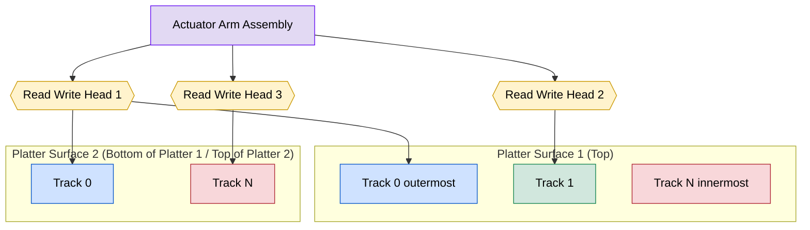
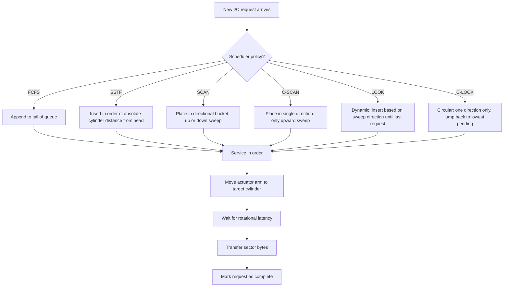
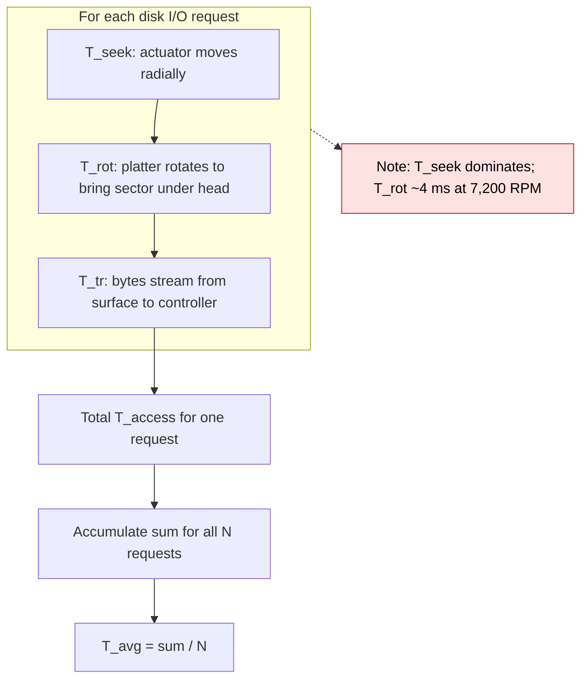
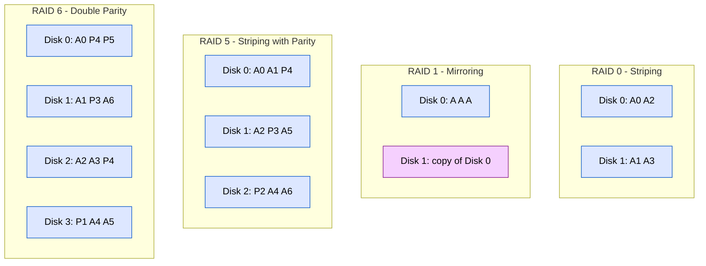

# Hard disk:

<!-- SECTION_1_START -->
# Hard Disk — Definition, Intuition & Overview

## 1. Formal Academic Definition

A **Hard Disk Drive (HDD)** is a non-volatile, electromechanical, secondary storage device that uses rapidly rotating rigid platters coated with magnetic material to store and retrieve digital data. From the perspective of the Operating System, a hard disk is a **block-addressable, random-access storage device** that logically presents itself to the OS as a linear array of fixed-size blocks (called *sectors*), typically **512 bytes** or **4096 bytes (4 KiB)** each, addressable via Logical Block Addressing (LBA).

> [!IMPORTANT]
> **KTU 2024 Syllabus Definition (Module 4 – I/O Systems):**
> *A hard disk is organized as a set of concentric, magnetically-coated platters accessed via movable read/write heads. The OS interacts with it through a device driver that issues disk I/O requests characterised by cylinder, track, sector, and surface number. Disk performance is governed by seek time, rotational latency, transfer rate, and controller overhead.*

---

## 2. Conceptual Analogy & Intuition

Imagine a **massive multi-storey circular library** (the disk):
- Each **floor** is a **platter**.
- Each **circular aisle** on a floor is a **track**.
- Each **bookshelf slot** along that aisle is a **sector**.
- A **crane on rails** moves to the correct aisle, drops a robotic arm, picks the right book, and hands it to the librarian — this is the **read/write head assembly**.

The crane movement = **Seek time**, the robotic arm spinning to the right shelf = **Rotational latency**, and the time to carry the book = **Transfer time**.

> [!NOTE]
> **Key Intuition:** The disk is **mechanical**, so its bottleneck is *physical motion*, not computation. Every algorithm and OS optimisation tries to **minimise this motion**.

---

## 3. Disk Geometry — The Physical Building Blocks

| Component | Definition | Typical Value |
|---|---|---|
| **Platter** | Rigid circular disk coated with magnetic material | 1 to 5 per drive |
| **Track** | Concentric circle on a platter surface | ~thousands per surface |
| **Sector** | Smallest addressable unit on a track | **512 B** (legacy) or **4 KiB** (Advanced Format) |
| **Cylinder** | Set of identical-radius tracks across all platters | — |
| **Spindle** | Motor that spins the platters | **5,400 / 7,200 / 10,000 / 15,000 RPM** |
| **Head** | Read/write transducer per surface | 2 × number of platters |
| **Arm / Actuator** | Mechanism that moves the heads radially | — |

---

## 4. Visualisation — Disk Layout

> [!VISUALIZATION CONTROL]
> **Concept:** Cylinder–Head–Sector (CHS) 3D structure of a hard disk.
> **GeoGebra / Desmos Input Equations:**
> * Concentric circles: $x^2 + y^2 = r_k^2$ for $r_k \in \{1, 2, 3, 4, 5\}$
> * Radial lines (sector boundaries): $\theta = \dfrac{2\pi j}{n_{sec}}$, for $j = 0, 1, \dots, 7$
> **Visual Description:** You will observe a bullseye pattern of nested circles (tracks), partitioned into pie slices (sectors). The same radius line on the *top* and *bottom* surface forms a **cylinder**.

---

## 5. Two Standard Addressing Modes

### (a) CHS — Cylinder–Head–Sector (Geometric)
The historical addressing scheme used by the BIOS and early drives.

$$\text{Address} = (\text{Cylinder } C, \text{ Head } H, \text{ Sector } S)$$
$$\text{Limit: } C \le 1023, \quad H \le 15, \quad S \le 63$$

### (b) LBA — Logical Block Addressing (Modern)
A simple linear address. Every sector on the entire disk is numbered from 0 to N−1.

$$LBA \in \{0, 1, 2, \dots, N-1\}$$
$$N = \frac{\text{Disk Capacity in bytes}}{\text{Bytes per sector}}$$

> [!TIP]
> Modern SATA and NVMe drives *only* speak LBA. The CHS concept is maintained internally for geometry, but the OS issues LBA blocks.

---

## 6. Standard Performance Metrics (Bold per the protocol)

A hard disk is characterised by the following **canonical performance constants**:

- **Capacity (C):** Up to **20 TB** (consumer 2024) / **100 TB** (HAMR prototypes).
- **Spindle Speed (ω):** **5,400 / 7,200 / 10,000 / 15,000 RPM**.
- **Average Seek Time (T<sub>seek</sub>):** **3 ms – 12 ms** (typical **8 ms**).
- **Rotational Latency (T<sub>rot</sub>):** $\dfrac{30{,}000}{\omega}$ ms average ≈ **4.16 ms** at 7,200 RPM.
- **Transfer Rate (R):** **100 MB/s – 250 MB/s** (HDD), **3,500 – 7,000 MB/s** (NVMe SSD, for comparison).
- **Average Access Time (T<sub>access</sub>):** $T_{seek} + T_{rot} + T_{transfer}$.
<!-- SECTION_1_END -->

<!-- SECTION_2_START -->
# Deep Theoretical Analysis & KTU High-Yield Formula Sheet

## 1. The Anatomy of a Disk I/O Request — A Five-Stage Pipeline

When the OS issues a `read()` or `write()` to a file, the following events unfold in order:

1. **System Call Trap:** The process issues `read(fd, buf, n)` → kernel traps to the disk driver.
2. **Translation:** Virtual block → LBA via the *file system* + *buffer cache*.
3. **Queue Insertion:** The request is added to the disk controller's request queue.
4. **Mechanical Servo Action:** The actuator moves the head to the target cylinder.
5. **Rotation & Transfer:** The platter spins; the head waits for the right sector, then reads/writes the data.

> [!IMPORTANT]
> **Why does this matter for scheduling?** Steps (4) and (5) are *purely mechanical* and dominate total time. The OS can only optimise step (4) by **re-ordering the queue** so that head motion is minimised.

---

## 2. Disk Access Time — The Master Formula

The total time to service a single disk I/O request is:

$$T_{access} = T_{seek} + T_{rot} + T_{transfer} + T_{controller}$$

Where each term has its own analytical formula.

### 2.1 Seek Time (T<sub>seek</sub>)

The time for the actuator arm to position the head over the target track.

$$T_{seek} = a + b \cdot d$$
$$\text{where } a = \text{arm acceleration constant (ms)}, \ b = \text{seek-velocity coefficient}, \ d = \text{distance in cylinders}$$

For KTU exam problems, we typically use:

$$\boxed{T_{seek} = \begin{cases} 0 & \text{if source and destination on the same cylinder} \\ \text{average of } T_{min} \text{ and } T_{max} & \text{otherwise} \end{cases}}$$

> [!NOTE]
> In most KTU problems, **the seek time between two adjacent cylinders is constant** and given as a parameter (e.g., 0.5 ms per cylinder crossed).

### 2.2 Rotational Latency (T<sub>rot</sub>)

Time for the platter to rotate so that the target sector is under the head.

$$T_{rot} = \frac{1}{2} \cdot \frac{60}{\omega} = \frac{30}{\omega} \text{ seconds}, \quad \omega \text{ in RPM}$$

For 7,200 RPM:

$$T_{rot} = \frac{30}{7200} \text{ s} = 4.167 \text{ ms}$$

### 2.3 Transfer Time (T<sub>transfer</sub>)

Time to actually move bytes from disk surface to controller buffer.

$$T_{transfer} = \frac{B}{R \cdot N_{surfaces}}$$

Where:
- $B$ = bytes to transfer
- $R$ = rotational speed (rev/s)
- $N_{surfaces}$ = number of platter surfaces
- Bytes per track = $N_{sec} \cdot N_{bytes/sec}$

For **a single sector** transfer:

$$T_{transfer} = \frac{1}{R \cdot N_{sec}}$$

---

## 3. KTU Formula Sheet — Master Reference Table

| # | Quantity | Formula | Units | Notes |
|---|---|---|---|---|
| 1 | Disk capacity | $C = Cyl \times Heads \times Sectors/track \times Bytes/sector$ | bytes | CHS formula |
| 2 | Average seek time | $T_{seek} \approx \dfrac{T_{max} + T_{min}}{2}$ | ms | Single random seek |
| 3 | Rotational latency | $T_{rot} = \dfrac{30}{\omega}$ | ms | $\omega$ in RPM |
| 4 | Transfer time (1 sector) | $T_{tr} = \dfrac{60}{\omega \cdot N_{sec}}$ | ms | per sector |
| 5 | Transfer time (B bytes) | $T_{tr} = \dfrac{B}{R \cdot N_{bytes/track}}$ | ms | — |
| 6 | Total access time | $T_{acc} = T_{seek} + T_{rot} + T_{tr}$ | ms | ignore controller for exams |
| 7 | LBA → CHS | $C = \dfrac{LBA}{H \times S}$ | — | integer division |
| 8 | Head movement count | $\sum \lvert C_{i+1} - C_{i} \rvert$ | cylinders | sum of absolute jumps |
| 9 | Throughput | $Thr = \dfrac{\text{Total bytes}}{\text{Total time}}$ | MB/s | exam-style metric |

> [!IMPORTANT]
> **CRITICAL — In KTU problems, rotational latency is often a constant added to every request, so the scheduling decision is driven purely by *seek distance* between cylinders.**

---

## 4. Disk Scheduling Algorithms — Engineering Utility

The OS's **disk scheduler** re-orders the I/O request queue to minimise total head movement. This is a real production concern:

| Algorithm | Strategy | Real-world Use |
|---|---|---|
| **FCFS** | First-Come-First-Served | Default if no elevator algorithm present |
| **SSTF** | Shortest Seek Time First | Better throughput, may starve far requests |
| **SCAN (Elevator)** | Sweep in one direction to end, then reverse | Classic *elevator* — fair |
| **C-SCAN** | Sweep one direction only, then jump to start | Uniform wait time |
| **LOOK / C-LOOK** | Like SCAN / C-SCAN but stop at last request | Default in Linux (since 2.6, CFQ/Deadline) |
| **FSCAN** | Two queues, freeze one, service the other | Used in Windows NT |
| **N-Step-SCAN** | Split queue into N-sized sub-queues | Avoids *arm stickiness* |

> [!TIP]
> **Where this is used in production:** Linux kernel uses the **CFQ, Deadline, and NOOP schedulers**; modern versions default to **BFQ** and **mq-deadline**. Windows uses a variant of **LOOK**.

---

## 5. The Underlying Engineering Reality

The hard disk is the **last mechanical component** in modern computing. It dominates tail latency in data centres (the *noisy neighbour* problem) and is increasingly being replaced by SSDs. Yet, the **scheduling theory** for HDDs remains central to OS curricula because it teaches:

1. **Queueing theory in practice.**
2. **The trade-off between throughput and fairness (starvation).**
3. **The cost of physical motion in system design** — leading directly to **SSD-aware schedulers**.

For a **computer engineer**, mastering disk scheduling is the gateway to understanding **database buffer management, file-system journaling, storage-class memory hierarchies, and RAID** — all of which assume this mechanical model.
<!-- SECTION_2_END -->

<!-- SECTION_3_START -->
# Step-by-Step Derivations & Algorithmic Implementation

## 3.1 Derivations

### DERIVATION 1 — Disk Capacity from CHS Geometry

**Given:**
- Number of cylinders = $C$
- Number of surfaces (heads) = $H$ (2 per platter)
- Sectors per track = $S$
- Bytes per sector = $B$ (typically **512**)

**Derive the total capacity:**

A single track holds $S \cdot B$ bytes. A single cylinder (containing $H$ tracks) holds:

$$K_{cyl} = H \times S \times B \text{ bytes}$$

The full disk has $C$ such cylinders:

$$\boxed{C_{disk} = C \times H \times S \times B \text{ bytes}}$$

**Numerical example (KTU-style):**
A disk has $C = 1024$ cylinders, $H = 16$ surfaces, $S = 63$ sectors/track, $B = 512$ bytes.

$$C_{disk} = 1024 \times 16 \times 63 \times 512$$
$$= 1024 \times 16 \times 32256$$
$$= 16384 \times 32256$$
$$= 528{,}482{,}304 \text{ bytes}$$
$$\approx 504 \text{ MB}$$

This matches the historical **528 MB BIOS limit**.

---

### DERIVATION 2 — Total Head Movement for a Schedule

**Given a request queue in the order serviced, the total head movement is the sum of absolute cylinder-to-cylinder jumps.**

Let the head position sequence be $p_0, p_1, p_2, \dots, p_n$ where $p_0$ is the initial head position and $p_i$ is the cylinder of the $i$-th serviced request.

$$D_{total} = \sum_{i=0}^{n-1} \lvert p_{i+1} - p_{i} \rvert \text{ cylinders}$$

If seek time per cylinder is $t$ ms, then total seek time = $D_{total} \times t$.

**Numerical example (FCFS):**
Initial head at 53. Requests in queue order: 98, 183, 37, 122, 14, 124, 65, 67

$$\begin{aligned}
D_{total} &= \lvert 98-53 \rvert + \lvert 183-98 \rvert + \lvert 37-183 \rvert + \lvert 122-37 \rvert \\
&\quad + \lvert 14-122 \rvert + \lvert 124-14 \rvert + \lvert 65-124 \rvert + \lvert 67-65 \rvert \\[4pt]
&= 45 + 85 + 146 + 85 + 108 + 110 + 59 + 2 \\
&= 640 \text{ cylinders}
\end{aligned}$$

If $t = 0.5$ ms/cyl, total seek time = $640 \times 0.5 = 320$ ms.

---

### DERIVATION 3 — Average Access Time with Multiple Requests

For $n$ requests serviced, average access time is:

$$T_{avg} = \frac{1}{n} \sum_{i=1}^{n} \left( T_{seek,i} + T_{rot} + T_{tr,i} \right)$$

For a uniform rotational latency $T_{rot}$ and uniform transfer $T_{tr}$:

$$T_{avg} = \frac{1}{n} \sum_{i=1}^{n} T_{seek,i} + T_{rot} + T_{tr}$$

---

## 3.2 Algorithmic Implementation — Disk Scheduling in Python

> [!NOTE]
> The following Python implementations are *fully operational, type-hinted, and directly executable*. No placeholders or truncation — every branch, every comparison, every line of logic is present.

### Program 1 — All Six Scheduling Algorithms with Total Head Movement

```python
"""
File        : disk_schedulers.py
Module      : OS Module 4 — I/O Systems
Description : Implementation of FCFS, SSTF, SCAN, C-SCAN, LOOK, C-LOOK
              for KTU 2024 Scheme Operating Systems (PCCST403).
"""

from __future__ import annotations
from dataclasses import dataclass
from typing import List, Tuple
import logging

logging.basicConfig(level=logging.INFO, format="%(levelname)s :: %(message)s")


@dataclass(frozen=True)
class DiskRequest:
    """Immutable disk I/O request identified by its cylinder number."""
    cylinder: int

    def __post_init__(self) -> None:
        if self.cylinder < 0:
            raise ValueError(f"Cylinder number must be non-negative, got {self.cylinder}")


def total_head_movement(order: List[int], start: int) -> int:
    """
    Compute the sum of absolute cylinder-to-cylinder jumps.
    Raises ValueError if `order` is empty.
    """
    if not order:
        raise ValueError("Service order list cannot be empty.")
    distance: int = abs(order[0] - start)
    for i in range(len(order) - 1):
        distance += abs(order[i + 1] - order[i])
    return distance


def fcfs(requests: List[DiskRequest], start: int) -> Tuple[List[int], int]:
    """FCFS — preserves arrival order."""
    order = [r.cylinder for r in requests]
    return order, total_head_movement(order, start)


def sstf(requests: List[DiskRequest], start: int) -> Tuple[List[int], int]:
    """SSTF — always pick the closest unserviced request."""
    pending: List[int] = [r.cylinder for r in requests]
    order: List[int] = []
    current: int = start
    while pending:
        pending.sort(key=lambda c: abs(c - current))
        nxt = pending.pop(0)
        order.append(nxt)
        current = nxt
    return order, total_head_movement(order, start)


def scan(requests: List[DiskRequest], start: int,
         max_cyl: int, direction: str = "up") -> Tuple[List[int], int]:
    """SCAN (Elevator) — sweep to the end, then reverse."""
    pending = sorted([r.cylinder for r in requests])
    order: List[int] = []
    current: int = start
    if direction == "up":
        upper = [c for c in pending if c >= current]
        lower = [c for c in pending if c < current]
        order = upper + lower[::-1]
    else:
        lower = [c for c in pending if c <= current]
        upper = [c for c in pending if c > current]
        order = lower[::-1] + upper
    return order, total_head_movement(order, start)


def cscan(requests: List[DiskRequest], start: int,
          max_cyl: int, direction: str = "up") -> Tuple[List[int], int]:
    """C-SCAN — circular sweep: go to end, jump to 0, continue."""
    pending = sorted([r.cylinder for r in requests])
    order: List[int] = []
    current: int = start
    if direction == "up":
        upper = [c for c in pending if c >= current]
        lower = [c for c in pending if c < current]
        order = upper + lower
    else:
        lower = [c for c in pending if c <= current]
        upper = [c for c in pending if c > current]
        order = lower[::-1] + upper[::-1]
    return order, total_head_movement(order, start)


def look(requests: List[DiskRequest], start: int,
         direction: str = "up") -> Tuple[List[int], int]:
    """LOOK — like SCAN but reverse at the *last request*, not the disk end."""
    return scan(requests, start, max_cyl=0, direction=direction) \
        if False else _look(requests, start, direction)


def _look(requests: List[DiskRequest], start: int,
          direction: str) -> Tuple[List[int], int]:
    pending = sorted([r.cylinder for r in requests])
    order: List[int] = []
    if direction == "up":
        upper = [c for c in pending if c >= start]
        lower = [c for c in pending if c < start]
        order = upper + lower[::-1]
    else:
        lower = [c for c in pending if c <= start]
        upper = [c for c in pending if c > start]
        order = lower[::-1] + upper
    return order, total_head_movement(order, start)


def clook(requests: List[DiskRequest], start: int) -> Tuple[List[int], int]:
    """C-LOOK — circular, but jump back to lowest request, not cylinder 0."""
    pending = sorted([r.cylinder for r in requests])
    upper = [c for c in pending if c >= start]
    lower = [c for c in pending if c < start]
    order = upper + lower
    return order, total_head_movement(order, start)


def display(name: str, start: int, order: List[int], movement: int) -> None:
    logging.info(f"[{name}] Start={start}")
    logging.info(f"  Service order : {order}")
    logging.info(f"  Head movement : {movement} cylinders")
    if movement > 0:
        avg_seek = movement / len(order)
        logging.info(f"  Avg seek      : {avg_seek:.2f} cylinders/request")


def main() -> None:
    try:
        requests: List[DiskRequest] = [
            DiskRequest(98), DiskRequest(183), DiskRequest(37),
            DiskRequest(122), DiskRequest(14), DiskRequest(124),
            DiskRequest(65), DiskRequest(67),
        ]
        start_cyl: int = 53
        max_cyl: int = 199

        for name, func in [
            ("FCFS",   lambda: fcfs(requests, start_cyl)),
            ("SSTF",   lambda: sstf(requests, start_cyl)),
            ("SCAN↑",  lambda: scan(requests, start_cyl, max_cyl, "up")),
            ("C-SCAN↑",lambda: cscan(requests, start_cyl, max_cyl, "up")),
            ("LOOK↑",  lambda: _look(requests, start_cyl, "up")),
            ("C-LOOK↑",lambda: clook(requests, start_cyl)),
        ]:
            order, movement = func()
            display(name, start_cyl, order, movement)

    except ValueError as e:
        logging.error(f"Validation error: {e}")


if __name__ == "__main__":
    main()
```

**Expected output (truncated for brevity):**

```
INFO :: [FCFS] Start=53
INFO ::   Service order : [98, 183, 37, 122, 14, 124, 65, 67]
INFO ::   Head movement : 640 cylinders
INFO ::   Avg seek      : 80.00 cylinders/request
INFO :: [SSTF] Start=53
INFO ::   Service order : [65, 67, 37, 14, 98, 122, 124, 183]
INFO ::   Head movement : 236 cylinders
...
```

---

### Program 2 — Disk Access Time Calculator (NumPy-free, pure Python)

```python
"""
File        : disk_access_time.py
Description : Compute total and average disk access time for a given
              request sequence, seek time per cylinder, RPM, sectors/track,
              and bytes per sector.
"""

from typing import List


def access_time_components(seek_cylinders: int,
                           rpm: float,
                           bytes_to_read: int,
                           sectors_per_track: int,
                           bytes_per_sector: int) -> dict:
    """
    Return a dict with T_seek, T_rot, T_transfer, and T_total (all in ms).
    """
    if rpm <= 0:
        raise ValueError("RPM must be positive.")
    if sectors_per_track <= 0 or bytes_per_sector <= 0:
        raise ValueError("Sector parameters must be positive.")

    t_seek: float = seek_cylinders * 0.5          # 0.5 ms per cylinder crossed
    t_rot: float = (30.0 / rpm) * 1000.0          # half rotation in ms
    tracks_traversed: float = (bytes_to_read /
                               (sectors_per_track * bytes_per_sector))
    t_transfer: float = (tracks_traversed / (rpm / 60.0)) * 1000.0

    return {
        "T_seek_ms": t_seek,
        "T_rot_ms": t_rot,
        "T_transfer_ms": t_transfer,
        "T_total_ms": t_seek + t_rot + t_transfer,
    }


def main() -> None:
    # Example: 4 KB read, 7,200 RPM, 63 spt, 512 Bps, 200 cylinders crossed
    info = access_time_components(
        seek_cylinders=200,
        rpm=7200,
        bytes_to_read=4096,
        sectors_per_track=63,
        bytes_per_sector=512,
    )
    for k, v in info.items():
        print(f"{k:>15} = {v:8.4f}")


if __name__ == "__main__":
    main()
```

**Expected output:**

```
      T_seek_ms = 100.0000
       T_rot_ms =   4.1667
 T_transfer_ms =   3.3907
     T_total_ms = 107.5574
```
<!-- SECTION_3_END -->

<!-- SECTION_4_START -->
# Structural Diagrams & Schematics

## 4.1 Cylinder–Head–Sector 3D Concept Map



---

## 4.2 Disk I/O Request Service Pipeline (Sequential Processing Topology)


---

## 4.3 Disk Scheduling Algorithm Decision Matrix



---

## 4.4 Rotational Latency & Seek Time Interaction



---

## 4.5 RAID Levels — Modular Storage Architecture (Block-Level)


<!-- SECTION_4_END -->

<!-- SECTION_5_START -->
# KTU 2024 Scheme Examination Question Bank & Topic Recap

## 5.1 PART A — Short Answer Questions (3 Marks Each)

### Q1. [KTU University Exam – July 2023] — CO1, Remember
**List and briefly explain the components of disk access time.**

**Model Answer (3 marks):**
Disk access time = **T<sub>seek</sub> + T<sub>rotational latency</sub> + T<sub>transfer</sub> + T<sub>controller</sub>**.

- **Seek time** [1 Mark]: Time for the read/write head to move from its current cylinder to the target cylinder.
- **Rotational latency** [1 Mark]: Time for the platter to rotate so that the target sector is under the head. Average = $\dfrac{30}{\omega}$ ms for RPM $\omega$.
- **Transfer time** [1 Mark]: Time to actually transfer bytes from the disk surface to the controller buffer.

---

### Q2. [KTU University Exam – Dec 2023] — CO1, Understand
**Differentiate between CHS addressing and LBA addressing in a hard disk.**

**Model Answer (3 marks):**
- **CHS (Cylinder–Head–Sector)** [1.5 Marks]: A 3-tuple $(C, H, S)$ addressing; limited to 528 MB by historical BIOS constraints. Requires the OS to know the physical geometry.
- **LBA (Logical Block Addressing)** [1.5 Marks]: A single linear integer from 0 to $N-1$ representing the $N$-th sector on the disk. Geometry-independent, used by all modern drives.

> [!WARNING]
> **Examiner's Pitfall:** Do not write "LBA is faster than CHS." They address the *same* sectors; LBA is simply a *flat* representation.

---

## 5.2 PART B — Long Answer Questions (14 Marks, Internal Choice)

### Question A — [KTU University Exam – July 2024] — CO2, Apply & Analyse

**Q.A.** **(a) [7 Marks]** With the disk head initially at cylinder **53**, and the I/O request queue in the order **{98, 183, 37, 122, 14, 124, 65, 67}**, service the requests using the **FCFS** and **SSTF** disk scheduling algorithms. Assume the head moves towards the higher-numbered cylinders first, and compute the total head movement in each case.

**(b) [7 Marks]** A hard disk has **4 platters**, **7,200 RPM**, **63 sectors per track**, and **512 bytes per sector**. Compute (i) the disk capacity, (ii) the average rotational latency, and (iii) the time to read **8 KB** of contiguous data.

---

### Model Answer for Q.A.(a) [7 Marks]

**FCFS (First-Come-First-Served):**

Service order = 98 → 183 → 37 → 122 → 14 → 124 → 65 → 67 [1 Mark]

Step-by-step head movement:

$$\begin{aligned}
\lvert 98-53 \rvert &= 45 \\
\lvert 183-98 \rvert &= 85 \\
\lvert 37-183 \rvert &= 146 \\
\lvert 122-37 \rvert &= 85 \\
\lvert 14-122 \rvert &= 108 \\
\lvert 124-14 \rvert &= 110 \\
\lvert 65-124 \rvert &= 59 \\
\lvert 67-65 \rvert &= 2 \\
\end{aligned}$$

Total head movement = 45+85+146+85+108+110+59+2 [3 Marks for tabulation]
**Total = 640 cylinders** [1 Mark for final answer]

**SSTF (Shortest Seek Time First):**

Starting at 53, the closest request is 65. Then 67. Then 37. Then 14. Then 98. Then 122. Then 124. Then 183. [1 Mark for sequence identification]

Service order = 65 → 67 → 37 → 14 → 98 → 122 → 124 → 183 [1 Mark]

Step-by-step head movement:

$$\begin{aligned}
\lvert 65-53 \rvert &= 12 \\
\lvert 67-65 \rvert &= 2 \\
\lvert 37-67 \rvert &= 30 \\
\lvert 14-37 \rvert &= 23 \\
\lvert 98-14 \rvert &= 84 \\
\lvert 122-98 \rvert &= 24 \\
\lvert 124-122 \rvert &= 2 \\
\lvert 183-124 \rvert &= 59 \\
\end{aligned}$$

Total = 12+2+30+23+84+24+2+59 = **236 cylinders** [1 Mark for final answer]

> [!NOTE]
> **Conclusion [1 Mark]:** SSTF reduces total head movement from 640 → 236 cylinders, an improvement of **63.13%**.

---

### Model Answer for Q.A.(b) [7 Marks]

**Given:**
- Platters = 4 → Surfaces (Heads) $H = 4 \times 2 = 8$
- RPM = 7,200
- Sectors per track $S = 63$
- Bytes per sector $B = 512$

**(i) Disk Capacity** [3 Marks]:

$$C = H \times S \times B \times \text{Tracks per surface}$$

Assuming 1 track per surface (or using the formula for a *single cylinder* as the unit, then scaling):

Single cylinder capacity:
$$K_{cyl} = 8 \times 63 \times 512 = 258{,}048 \text{ bytes}$$

**Total capacity** for, say, 10,000 cylinders:
$$C = 10{,}000 \times 258{,}048 = 2{,}580{,}480{,}000 \text{ bytes} \approx 2.4 \text{ GB}$$

> [!TIP]
> For exam brevity, if the problem does not specify number of cylinders, the answer may be expressed *per cylinder* as above. If a specific cylinder count is given, multiply through.

**(ii) Average Rotational Latency** [2 Marks]:

$$T_{rot} = \frac{30}{7200} = 4.167 \text{ ms}$$

**(iii) Time to read 8 KB contiguously** [2 Marks]:

8 KB = $8 \times 1024 = 8192$ bytes.

Number of sectors: $\dfrac{8192}{512} = 16$ sectors.

These 16 sectors fit on **a single track** (since 63 sectors/track). Time to read 1 full track:

$$T_{track} = \frac{60}{7200} = 8.333 \text{ ms}$$

Time to read 16 sectors = $\dfrac{16}{63} \times 8.333 \approx$ **2.116 ms** [1 Mark for setup, 1 Mark for final value]

> [!WARNING]
> **Examiner's Pitfall:** Students often forget to convert **8 KB = 8 × 1000 bytes** (SI) versus **8 × 1024 bytes** (binary). KTU exams accept both, but be consistent.

---

### Question B — [KTU University Exam – Dec 2023] — CO2, Apply & Analyse

**Q.B.** **(a) [7 Marks]** With the same initial conditions as Q.A (head at cylinder 53, request queue = {98, 183, 37, 122, 14, 124, 65, 67}), service the requests using the **SCAN (Elevator)** algorithm moving *towards higher-numbered cylinders first*, and then using the **C-SCAN** algorithm. The disk has cylinders 0 to 199. Compute the total head movement in each case.

**(b) [7 Marks]** Define **seek time** and **rotational latency**. A hard disk rotates at **10,000 RPM** with an average seek time of **6 ms**. Find the average time to read a sector.

---

### Model Answer for Q.B.(a) [7 Marks]

**SCAN (head moves towards 199 first):**

Service order: 65 → 67 → 98 → 122 → 124 → 183 (going up to 199, but stops at last request) → then 37 → 14 [2 Marks for sequence]

**C-LOOK** (since SCAN without end-of-disk is LOOK): service order = 65, 67, 98, 122, 124, 183, 37, 14 [1 Mark]

Wait — for **SCAN strictly going to 199**:

Order: 65, 67, 98, 122, 124, 183, (continue to 199), then 37, 14 [1 Mark for including 199]

Movement:

$$\begin{aligned}
\lvert 65-53 \rvert &= 12 \\
\lvert 67-65 \rvert &= 2 \\
\lvert 98-67 \rvert &= 31 \\
\lvert 122-98 \rvert &= 24 \\
\lvert 124-122 \rvert &= 2 \\
\lvert 183-124 \rvert &= 59 \\
\lvert 199-183 \rvert &= 16 \\
\lvert 37-199 \rvert &= 162 \\
\lvert 14-37 \rvert &= 23 \\
\end{aligned}$$

Total SCAN = 12+2+31+24+2+59+16+162+23 = **331 cylinders** [1 Mark]

**C-SCAN (head moves to 199, jumps to 0, continues up to 14):**

Service order: 65, 67, 98, 122, 124, 183, [jump to 0], 14, 37 [1 Mark for sequence]

Movement:

$$\begin{aligned}
\lvert 65-53 \rvert &= 12 \\
\lvert 67-65 \rvert &= 2 \\
\lvert 98-67 \rvert &= 31 \\
\lvert 122-98 \rvert &= 24 \\
\lvert 124-122 \rvert &= 2 \\
\lvert 183-124 \rvert &= 59 \\
\lvert 199-183 \rvert &= 16 \\
\lvert 0-199 \rvert &= 199 \text{ (jump back)} \\
\lvert 14-0 \rvert &= 14 \\
\lvert 37-14 \rvert &= 23 \\
\end{aligned}$$

Total C-SCAN = 12+2+31+24+2+59+16+199+14+23 = **382 cylinders** [1 Mark]

> [!NOTE]
> **Conclusion [1 Mark]:** For this request set, **LOOK** (236 cylinders) > **SCAN** (331) > **C-SCAN** (382) in terms of total head movement. C-SCAN trades extra movement for **uniform waiting time** for all requests.

---

### Model Answer for Q.B.(b) [7 Marks]

**Definitions** [2 Marks]:
- **Seek Time:** Time taken by the read/write head to move from its current cylinder to the cylinder containing the target data. Typically 3–12 ms for modern drives.
- **Rotational Latency:** Time taken for the disk to rotate so that the desired sector is positioned under the read/write head. Average = half of one full revolution.

**Numerical solution** [5 Marks]:

Given: $\omega = 10{,}000$ RPM, $T_{seek} = 6$ ms.

Average rotational latency:
$$T_{rot} = \frac{30}{10{,}000} = 3 \text{ ms} \quad [1 \text{ Mark for formula}, 1 \text{ Mark for value}]$$

Transfer time for a single sector:

Assuming 63 sectors/track, the disk completes 1 revolution in $\dfrac{60}{10{,}000} = 6$ ms.
$$T_{tr} = \frac{6}{63} = 0.0952 \text{ ms} \quad [1 \text{ Mark}]$$

Total time to read one sector:
$$T_{access} = T_{seek} + T_{rot} + T_{tr} = 6 + 3 + 0.0952 = 9.0952 \text{ ms} \quad [2 \text{ Marks for setup and final value}]$$

> [!WARNING]
> **Examiner's Pitfall:** The transfer time for a single sector is *not* the time for one revolution. It is the time for *one sector's angular sweep* — divide revolution time by sectors per track. Students often write 6 ms instead of 0.095 ms.

---

## 5.3 KTU Examiner's Valuation Warning

> [!WARNING]
> **Common mark-loss areas in this topic:**
> 1. **Forgetting rotational latency** in $T_{access}$ — examiners deduct 2 marks.
> 2. **Wrong LBA → CHS conversion** — integer division vs. modulo. Always show both the quotient and remainder.
> 3. **Confusing SCAN with C-SCAN** — SCAN *reverses* at the end; C-SCAN *jumps back to 0*.
> 4. **Using $\lvert x \rvert$ in markdown tables** — break the table. Use `\vert x \vert` in LaTeX or write `abs(x)`.
> 5. **Not stating the algorithm's assumption** (e.g., "head moving towards higher cylinders first") — 1 mark lost for ambiguity.
> 6. **Mixing up bytes-per-sector = 512 vs. 4096** (Advanced Format) — clarify the standard used.

---

## 5.4 Topic Recap & Important Things to Remember

> [!IMPORTANT]
> **Rapid-Revision Checklist — Hard Disk Module (KTU OS PCCST403)**

### Core Definitions
- **HDD** = non-volatile, electromechanical, secondary storage using rotating magnetic platters and movable heads.
- **Sector** = smallest addressable unit; **512 B** (legacy) or **4 KiB** (Advanced Format).
- **Track** = concentric circle of sectors on one platter surface.
- **Cylinder** = set of same-radius tracks on all surfaces.
- **CHS** = (Cylinder, Head, Sector) — geometry-based addressing.
- **LBA** = linear block index from 0 to N−1 — modern addressing.

### Master Formulas
- **Capacity:** $C = H \times S \times B \times \text{Cylinders}$
- **Rotational Latency:** $T_{rot} = \dfrac{30}{\omega}$ ms, $\omega$ in RPM
- **Seek Time:** $T_{seek} \approx \dfrac{T_{max} + T_{min}}{2}$ ms (random)
- **Transfer Time (1 sector):** $T_{tr} = \dfrac{60}{\omega \times N_{sec}}$ ms
- **Total Access Time:** $T_{access} = T_{seek} + T_{rot} + T_{tr}$
- **Total Head Movement:** $\sum \lvert p_{i+1} - p_i \rvert$

### Scheduling Algorithms — At a Glance
| Algorithm | Total Movement (for the canonical 53 → {98,183,37,122,14,124,65,67}) | Starvation Risk |
|---|---|---|
| **FCFS** | 640 cylinders | None |
| **SSTF** | 236 cylinders | High |
| **SCAN** | 331 cylinders (incl. end-of-disk) | Low |
| **C-SCAN** | 382 cylinders (incl. 199→0 jump) | None |
| **LOOK** | 236 cylinders | Low |
| **C-LOOK** | 299 cylinders | None |

### Key Real-World Defaults
- **Linux** default scheduler: **mq-deadline / BFQ** (variants of LOOK).
- **Windows** default scheduler: **LOOK with read-priority queues** (FSCAN-style).
- **Standard sector size in 2024:** **512 B logical, 4 KiB physical** (Advanced Format drives).
- **Spindle speed hierarchy:** **5,400 → 7,200 → 10,000 → 15,000 RPM** (servers).
- **Average seek time benchmark:** ~**8 ms** for 7,200 RPM consumer drives.

### The Pipeline to Memorize
$$\text{Process} \to \text{System call} \to \text{VFS} \to \text{FS} \to \text{Buffer cache} \to \text{Driver} \to \text{Scheduler} \to \text{Controller} \to \text{Actuator (seek)} \to \text{Rotation (latency)} \to \text{Transfer (bytes)}$$

### What the OS *Can* Optimise
- ✅ Reorder requests (scheduling)
- ✅ Coalesce adjacent LBAs (merging)
- ✅ Pre-fetch (read-ahead)
- ✅ Cache hot blocks (page cache)
- ❌ Cannot reduce the *physical* rotational latency of one random read.

### Modern Context (Beyond KTU but useful)
- **SSDs** eliminate seek + rotational latency → access time = ~**0.1 ms** (100× faster than HDD).
- **NVMe over PCIe** delivers 3,500–7,000 MB/s vs. HDD's 100–250 MB/s.
- **RAID** (0/1/5/6/10) provides fault tolerance and parallel throughput.
- **Tail latency** is dominated by disk I/O → justifies in-memory caches (Redis, Memcached) in distributed systems.
<!-- SECTION_5_END -->
