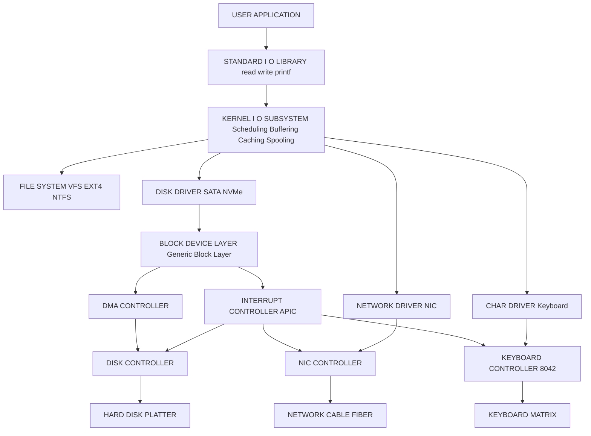
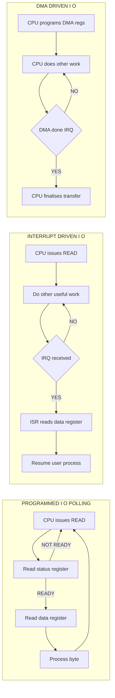
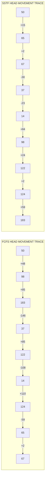

# I/O system:

<!-- SECTION_1_START -->
# I/O System — Core Technical Definition & Intuitive Overview

## Formal Academic Definition (KTU 2024 Syllabus Terminology)

The **I/O System** (Input/Output System) is the subsystem of an Operating System responsible for managing and controlling all I/O devices, the data transfer between the CPU/memory and peripheral devices, and the abstraction of device-specific complexities from user applications. It encompasses the **I/O hardware** (controllers, channels, devices), the **I/O software** (device drivers, kernel I/O subsystem, user-level libraries), and the **I/O scheduling policies** that determine the order in which pending I/O requests are serviced.

> [!IMPORTANT]
> **KTU 2024 Syllabus Highlight:** Module 4 expects students to master (i) characteristics of I/O devices, (ii) Kernel I/O subsystem services, (iii) Disk scheduling algorithms, and (iv) RAID structures. Examiner questions frequently mix a 7-mark algorithm derivation with a 7-mark RAID/numerical problem.

## Conceptual Analogy & Plain-English Intuition

Think of the **I/O System as a busy post-office**:
- The **CPU** is the postmaster (fast, expensive, hates waiting).
- The **I/O devices** (disk, keyboard, printer) are the **mail trucks and sorting stations** (slow, bulky, varied).
- The **device driver** is the **truck-specific mechanic** who knows how to operate a particular model.
- The **I/O scheduler** is the **dispatcher** deciding which truck moves next, in what order, and via which route.
- The **buffer/cache** is the **temporary sorting room** where mail is staged so the postmaster never idles.
- **DMA (Direct Memory Access)** is the **automated conveyor belt** that carries the mail between the sorting station and the storage shelves, freeing the postmaster to do other work.

> [!NOTE]
> **Why I/O matters in engineering:** A modern program spends **~70%–80% of its time waiting for I/O** (memory loads, disk reads, network packets). A poor I/O design can turn a GHz-class CPU into a sluggish, idle machine. Disk scheduling alone can yield a **5x–10x throughput improvement** under heavy load.

## Physical Constants & Standard Metrics

| Metric | Symbol | Typical Value | Unit |
|---|---|---|---|
| Disk rotational speed | $N$ | **5400, 7200, 15000** | RPM |
| Average seek time | $T_{seek}$ | **3 – 10** | ms |
| Average rotational latency | $T_{rot} = \dfrac{60}{2N}$ | **2 – 4** | ms |
| Transfer rate | $R$ | **100 – 500** | MB/s |
| Controller overhead | $T_{c}$ | **0.1 – 1** | ms |
| Average I/O service time | $T_{I/O}$ | $T_{seek} + T_{rot} + T_{transfer}$ | ms |

> [!VISUALIZATION CONTROL]
> **Concept:** Cylinder-Track-Sector Disk Geometry
> **GeoGebra / Desmos Input Equations:**
> * Circle: $x^2 + y^2 = r^2$  (one track on a platter)
> * Concentric circles for cylinders: $x^2 + y^2 = k \cdot r^2$ for $k = 1, 2, 3, 4$
> * Radial lines for sector boundaries: $\theta = \dfrac{2\pi \cdot s}{S}$ where $S$ is sectors/track
> **Visual Description:** The student should see nested circles (tracks within a cylinder) intersected by radial spokes (sectors). The **read/write head** sweeps radially across tracks; the **spindle** rotates the platters. Adjacent tracks across platters sharing the same radius form a **cylinder**.

## Classification of I/O Devices

> [!NOTE]
> **Device Characterisation Triad:** Every I/O device is described by three orthogonal axes — (1) **Data Unit** (block vs character vs network), (2) **Access Pattern** (sequential vs random), and (3) **Transfer Mode** (synchronous vs asynchronous, shared vs dedicated).

| Class | Data Unit | Access | Examples | Speed |
|---|---|---|---|---|
| **Block** | Fixed-size blocks | Random | HDD, SSD, USB | 100 MB/s – 7 GB/s |
| **Character** | Stream of bytes | Sequential | Keyboard, mouse, serial port | 100 B/s – 100 KB/s |
| **Network** | Packets / frames | Mixed | NIC, Wi-Fi adapter | 1 Mbps – 100 Gbps |
| **Storage** | Blocks / pages | Random | NVMe, RAID arrays | 1 GB/s – 28 GB/s |
| **Display** | Pixels / frames | Random | GPU, framebuffer | 1 – 100 GB/s |

<!-- SECTION_1_END -->

<!-- SECTION_2_START -->
# Deep Theoretical Analysis & KTU High-Yield Formula Sheet

## 2.1 I/O Hardware Layered Model

The I/O hardware stack is organised into **four distinct layers** that the OS must coordinate:

1. **Device Layer** — The physical peripheral (platter, sensor, antenna).
2. **Device Controller Layer** — A dedicated microcontroller that translates CPU commands into device operations. Each controller exposes a set of **control registers**, **data-in**, and **data-out** registers, mapped either into **I/O port space** (special `IN`/`OUT` instructions) or **memory-mapped I/O space** (regular `load`/`store` to physical addresses).
3. **Bus Layer** — PCI Express, SATA, USB, SCSI. Provides standardised electrical/mechanical interface.
4. **Host Adapter / Channel** — A specialised processor that offloads I/O work; **channels** are programmable CPUs, **DMA controllers** are simpler state machines.

> [!IMPORTANT]
> **KTU Board Favourite:** "Differentiate between memory-mapped I/O and port-mapped I/O." Always mention the **trade-off in address-space consumption** vs **special instruction overhead**.

| Aspect | Memory-Mapped I/O | Port-Mapped I/O (Isolated I/O) |
|---|---|---|
| Address space | Shares with RAM | Separate I/O address space |
| Instructions used | Any `load`/`store` | Special `IN`/`OUT` only |
| Protection | Needs memory protection hardware | Implicit (separate bus lines) |
| Speed | Slightly faster (no special decode) | Slightly slower |
| Used in | x86, ARM, RISC-V | x86 (legacy) |

## 2.2 Three Canonical I/O Techniques

### Technique 1 — Programmed I/O (Polling / Busy-Wait)
The CPU repeatedly reads the controller's **status register** until the device becomes ready, then either reads/writes the **data register** itself.

$$\text{CPU cycles spent polling} = \frac{T_{I/O}}{T_{cycle}}$$

**Drawback:** CPU is **wasted** spinning; no useful work happens during I/O.

### Technique 2 — Interrupt-Driven I/O
The device raises an **interrupt request line (IRQ)** when it is ready. The CPU finishes the current instruction, saves context, and jumps to the **Interrupt Service Routine (ISR)**.

$$\text{Overhead per interrupt} = T_{context\_save} + T_{ISR} + T_{context\_restore} \approx 1\text{–}10\ \mu s$$

**Drawback:** High interrupt frequency (e.g., network at 10 Gbps) causes **interrupt storm** and significant CPU overhead.

### Technique 3 — Direct Memory Access (DMA)
A dedicated **DMA controller** takes over the data-movement chore. The CPU issues one command — *transfer N bytes from disk to address A* — and continues executing. The DMA controller arbitrates for the bus and moves data directly. When complete, it raises **one** interrupt.

$$\text{Transfer time by DMA} = \frac{N_{bytes}}{R_{DMA}} + T_{setup}$$

> [!TIP]
> **Examiner Trick Question:** "If a disk uses DMA, does the CPU ever touch the data?" — **No.** The DMA engine moves data between the disk controller and RAM *bypassing the CPU*. The CPU only sets up the DMA registers and handles the final completion interrupt.

## 2.3 Disk Scheduling Algorithms — The Core KTU Module

**Goal:** Minimise **seek time** (the dominant cost) by ordering requests in a way that minimises total head movement.

Let $C_{cur}$ = current head cylinder, $R = \{r_1, r_2, \ldots, r_n\}$ = unordered pending request queue.

### Algorithm 1 — FCFS (First-Come, First-Served)
$$\text{Head Movement} = \sum_{i=1}^{n-1} \vert C_{i+1} - C_i \vert$$
**Pros:** Fair, simple. **Cons:** Wild swings, no optimisation.

### Algorithm 2 — SSTF (Shortest Seek Time First) — *Greedy / Lookahead*
Pick request with minimum $\vert r_i - C_{cur} \vert$. **May starve** far-away requests.
$$\text{Starvation risk} \iff \text{request density skewed toward one side}$$

### Algorithm 3 — SCAN (Elevator Algorithm)
Move in one direction servicing all requests, **reverse at end**, repeat. Like an elevator.
$$\text{Head Movement} = (max - min) \cdot 2 \text{ (bidirectional)}$$

### Algorithm 4 — C-SCAN (Circular SCAN)
Move outward servicing requests, **jump back to 0** (no servicing on return), repeat. Provides **uniform wait time**.
$$\text{Head Movement} = (max - min) + (max - 0)$$

### Algorithm 5 — LOOK & C-LOOK
Identical to SCAN/C-SCAN **except** the head reverses at the **last request**, not the disk boundary. This is the **default in modern OSes** (e.g., Linux `cfq`, `deadline`).

## 2.4 KTU Formula Sheet / Cheat Sheet

| Quantity | Formula | Unit | Notes |
|---|---|---|---|
| Rotational latency | $T_{rot} = \dfrac{60}{2N} = \dfrac{30}{N}$ | ms | $N$ in RPM |
| Transfer time | $T_{xfer} = \dfrac{B}{R \cdot 10^6}$ | s | $B$ in bytes, $R$ in MB/s |
| Total I/O time | $T_{I/O} = T_{seek} + T_{rot} + T_{xfer} + T_{c}$ | ms | Add controller overhead |
| Throughput | $\Theta = \dfrac{N_{req}}{T_{total}}$ | req/s | Requests per second |
| Average seek | $\bar{T}_{seek} = \dfrac{1}{n-1} \sum_{i=1}^{n-1} \vert C_{i+1} - C_i \vert$ | ms | Across a trace |
| Variance of wait time | $\sigma^2 = \dfrac{1}{n} \sum (W_i - \bar{W})^2$ | ms² | Used for fairness comparison |
| RAID-0 capacity | $C_0 = n \cdot C_{disk}$ | bytes | All disks used |
| RAID-1 capacity | $C_1 = \dfrac{n \cdot C_{disk}}{2}$ | bytes | Mirroring |
| RAID-5 capacity | $C_5 = (n-1) \cdot C_{disk}$ | bytes | One parity disk |
| RAID-6 capacity | $C_6 = (n-2) \cdot C_{disk}$ | bytes | Two parity disks |

> [!IMPORTANT]
> **Pipes are forbidden in table cells** — note that absolute value uses $\vert \cdot \vert$ LaTeX notation to keep the table intact.

## 2.5 Kernel I/O Subsystem Services

The **Kernel I/O Subsystem** sits above the device drivers and provides six core services:

1. **Scheduling** — Order I/O requests (disk scheduling).
2. **Buffering** — Hold data in transit between two mismatched-speed devices.
3. **Caching** — Store frequently-accessed data in fast memory.
4. **Spooling** — Queue output for a device that admits only one job at a time (printer).
5. **Error handling** — Retry, replace with default, propagate to user.
6. **Device reservation / allocation** — Exclusive access in multi-user OS.

## 2.6 Engineering & Production Utility

| Real System | I/O Feature Used | Why |
|---|---|---|
| Linux kernel | `deadline` / `cfq` scheduler | LOOK-based, near-optimal in practice |
| PostgreSQL | Disk scheduling + readahead | Joins produce massive random reads |
| NVMe SSDs | Queue depth 65536 | Multi-queue parallelism, no SCAN needed |
| Cloud object stores (S3) | Sharded, parallel GET | Replaces FCFS with sharded LBA |
| Databases (Oracle, MySQL) | Buffer pool (LRU-K) | Caching is more important than scheduling |
| Network routers | Interrupt coalescing | Compromise between polling and interrupt storm |

> [!TIP]
> **Industry Insight:** For **SSDs**, traditional disk scheduling (SCAN, LOOK) is **obsolete** because there is **no seek time**. The bottleneck shifts to **controller queue depth** and **write amplification**. Modern schedulers like `none`, `mq-deadline` favour **fairness** and **latency** over raw throughput.

<!-- SECTION_2_END -->

<!-- SECTION_3_START -->
# Step-by-Step Derivations & Worked Solutions

## 3.1 Worked Example — Disk Service Time Calculation

**Problem:** A disk has $N = 7200$ RPM rotational speed, average seek time $T_{seek} = 4$ ms, transfer rate $R = 200$ MB/s, and controller overhead $T_c = 0.5$ ms. A request reads a file of size $B = 4$ MB. Compute the total I/O time.

### Step 1 — Rotational latency

$$T_{rot} = \frac{30}{N} = \frac{30}{7200} = 0.004167 \text{ s} = 4.167 \text{ ms}$$

### Step 2 — Transfer time

$$T_{xfer} = \frac{B}{R \cdot 10^{6}} = \frac{4 \times 10^{6}}{200 \times 10^{6}} = 0.02 \text{ s} = 20 \text{ ms}$$

### Step 3 — Total I/O time

$$\begin{aligned}
T_{I/O} &= T_{seek} + T_{rot} + T_{xfer} + T_{c} \\
&= 4 + 4.167 + 20 + 0.5 \\
&= 28.667 \text{ ms}
\end{aligned}$$

> **Interpretation:** Transfer dominates (70%), seek is only 14%. For a 100 MB file the transfer time would scale to 500 ms, dwarfing everything else.

---

## 3.2 Worked Example — FCFS Disk Scheduling

**Given:** Disk has 200 cylinders (0 – 199). Head currently at cylinder 50. Pending request queue (in arrival order): `98, 183, 37, 122, 14, 124, 65, 67`. Compute total head movement and draw a graph.

### Step 1 — Service in arrival order
Sequence: $50 \to 98 \to 183 \to 37 \to 122 \to 14 \to 124 \to 65 \to 67$

### Step 2 — Compute movements

$$\begin{aligned}
|98 - 50| &= 48 \\
|183 - 98| &= 85 \\
|37 - 183| &= 146 \\
|122 - 37| &= 85 \\
|14 - 122| &= 108 \\
|124 - 14| &= 110 \\
|65 - 124| &= 59 \\
|67 - 65| &= 2
\end{aligned}$$

### Step 3 — Total head movement

$$\text{Total} = 48 + 85 + 146 + 85 + 108 + 110 + 59 + 2 = 643 \text{ cylinders}$$

**Average per request** = $643 / 8 = 80.4$ cylinders.

---

## 3.3 Worked Example — SSTF Disk Scheduling

Same setup. Sort requests by distance from current head (50).

### Step 1 — Greedy choice
- From 50: closest is **65** (distance 15). Pick 65.
- From 65: closest is **67** (2). Pick 67.
- From 67: closest is **37** (30). Pick 37.
- From 37: closest is **14** (23). Pick 14.
- From 14: closest is **98** (84) vs 122 (108) vs 124 (110) vs 183 (169). Pick **98**.
- From 98: closest is **122** (24) vs 124 (26) vs 183 (85). Pick **122**.
- From 122: **124** (2). Pick 124.
- From 124: **183** (59). Pick 183.

### Step 2 — Sequence and total

Sequence: $50 \to 65 \to 67 \to 37 \to 14 \to 98 \to 122 \to 124 \to 183$

$$\begin{aligned}
\text{Total} &= 15 + 2 + 30 + 23 + 84 + 24 + 2 + 59 \\
&= 239 \text{ cylinders}
\end{aligned}$$

> **Improvement over FCFS:** $\frac{643 - 239}{643} \times 100\% = 62.8\%$ reduction.

---

## 3.4 Worked Example — SCAN (Elevator) Algorithm

**Setup:** Head at 50, moving **towards higher cylinder numbers first**. Disk range 0 – 199. Same queue.

### Step 1 — Sort and split by direction
Requests $\geq 50$: $\{65, 67, 98, 122, 124, 183\}$ — service in **ascending** order.
Requests $< 50$: $\{14, 37\}$ — service in **ascending** order after reversal.

### Step 2 — Trace
$50 \to 65 \to 67 \to 98 \to 122 \to 124 \to 183 \to 199 \to 37 \to 14$

### Step 3 — Total movement

$$\begin{aligned}
\text{Outward leg} &= |199 - 50| = 149 \\
\text{Return leg} &= |14 - 199| = 185 \\
\text{Total} &= 149 + 185 = 334 \text{ cylinders}
\end{aligned}$$

> **Key insight:** The head always traverses the full **outer direction** even if the last request is at 183. That is why **LOOK** (next example) is preferred.

---

## 3.5 Worked Example — LOOK Algorithm

**Same setup**, but head reverses at the **last request** (183), not at 199.

### Trace
$50 \to 65 \to 67 \to 98 \to 122 \to 124 \to 183 \to 37 \to 14$

### Total movement

$$\text{Total} = |183 - 50| + |14 - 183| = 133 + 169 = 302 \text{ cylinders}$$

> **Note the savings:** LOOK saves $334 - 302 = 32$ cylinders by not travelling to the empty end.

---

## 3.6 Worked Example — C-LOOK

**Setup:** Head at 50, moving outward. Service outward, then **jump to lowest request** (14) and continue outward.

### Trace
$50 \to 65 \to 67 \to 98 \to 122 \to 124 \to 183 \to [\text{jump}] \to 14$

### Total movement

$$\text{Total} = (183 - 50) + (183 - 14) = 133 + 169 = 302 \text{ cylinders}$$

> **C-LOOK property:** Wait time for any request is bounded by **two full sweeps**, which is fairer for middle cylinders than C-SCAN.

---

## 3.7 Worked Example — RAID-5 Effective Capacity

A server has **6 disks** of 2 TB each, configured as RAID-5. Find:
1. Effective storage capacity.
2. Number of parity blocks per stripe.
3. Fault tolerance.

### Step 1 — Capacity

$$C_{RAID5} = (n - 1) \cdot C_{disk} = (6 - 1) \times 2 \text{ TB} = 10 \text{ TB}$$

### Step 2 — Parity
RAID-5 distributes parity across all $n = 6$ disks; **1 parity block per stripe**, rotated.

### Step 3 — Fault tolerance
**Tolerates 1 disk failure.** On failure, lost data is reconstructed via **XOR of surviving disks**.

$$D_{lost} = P \oplus D_{i_1} \oplus D_{i_2} \oplus \ldots \oplus D_{i_{k-1}}$$

---

## 3.8 Python Implementation — Disk Scheduling Simulators

```python
"""
disk_scheduler.py — Complete KTU-grade implementation of FCFS, SSTF, SCAN,
C-SCAN, LOOK, and C-LOOK disk-scheduling algorithms. Includes fair metric
computation (total head movement, average, standard deviation of wait).
"""
from __future__ import annotations
import math
import logging
from dataclasses import dataclass
from typing import List, Dict, Callable

# ---------------------------------------------------------------------------
# Logging configuration (production-grade error handling)
# ---------------------------------------------------------------------------
logging.basicConfig(
    level=logging.INFO,
    format="%(asctime)s | %(levelname)s | %(message)s"
)
logger = logging.getLogger(__name__)

# ---------------------------------------------------------------------------
# Configuration
# ---------------------------------------------------------------------------
@dataclass(frozen=True)
class DiskConfig:
    """Immutable disk parameters."""
    num_cylinders: int       # total cylinder count, e.g. 200
    min_cylinder: int        # smallest LBA, usually 0
    max_cylinder: int        # largest LBA, e.g. 199
    initial_head: int        # head start position
    direction: str = "up"    # "up" or "down"


# ---------------------------------------------------------------------------
# Scheduling algorithms
# ---------------------------------------------------------------------------
def fcfs(config: DiskConfig, requests: List[int]) -> List[int]:
    """First-Come, First-Served. Preserve arrival order."""
    if any(not (config.min_cylinder <= r <= config.max_cylinder) for r in requests):
        raise ValueError(f"Request out of range [{config.min_cylinder}, {config.max_cylinder}]")
    return [config.initial_head] + list(requests)


def sstf(config: DiskConfig, requests: List[int]) -> List[int]:
    """Shortest Seek Time First. Greedy, may starve."""
    if any(not (config.min_cylinder <= r <= config.max_cylinder) for r in requests):
        raise ValueError("Request out of range")
    pending = sorted(requests)
    sequence: List[int] = [config.initial_head]
    current = config.initial_head
    while pending:
        closest = min(pending, key=lambda r: abs(r - current))
        sequence.append(closest)
        pending.remove(closest)
        current = closest
    return sequence


def scan(config: DiskConfig, requests: List[int]) -> List[int]:
    """SCAN (Elevator) algorithm. Touches disk boundary."""
    if any(not (config.min_cylinder <= r <= config.max_cylinder) for r in requests):
        raise ValueError("Request out of range")
    pending = sorted(requests)
    boundary = config.max_cylinder if config.direction == "up" else config.min_cylinder
    order: List[int]
    if config.direction == "up":
        order = [r for r in pending if r >= config.initial_head] + [boundary]
        # reverse leg
        order += [r for r in reversed(pending) if r < config.initial_head]
    else:
        order = [r for r in reversed(pending) if r <= config.initial_head] + [boundary]
        order += [r for r in pending if r > config.initial_head]
    return [config.initial_head] + order


def look(config: DiskConfig, requests: List[int]) -> List[int]:
    """LOOK — reverse at the last request, not the disk boundary."""
    if any(not (config.min_cylinder <= r <= config.max_cylinder) for r in requests):
        raise ValueError("Request out of range")
    pending = sorted(requests)
    order: List[int]
    if config.direction == "up":
        order = [r for r in pending if r >= config.initial_head]
        order += [r for r in reversed(pending) if r < config.initial_head]
    else:
        order = [r for r in reversed(pending) if r <= config.initial_head]
        order += [r for r in pending if r > config.initial_head]
    return [config.initial_head] + order


def c_scan(config: DiskConfig, requests: List[int]) -> List[int]:
    """C-SCAN — circular, no service on return trip."""
    if any(not (config.min_cylinder <= r <= config.max_cylinder) for r in requests):
        raise ValueError("Request out of range")
    pending = sorted(requests)
    boundary_end = config.max_cylinder if config.direction == "up" else config.min_cylinder
    wrap = config.min_cylinder if config.direction == "up" else config.max_cylinder
    if config.direction == "up":
        order = [r for r in pending if r >= config.initial_head] + [boundary_end, wrap]
        order += [r for r in pending if r < config.initial_head]
    else:
        order = [r for r in pending if r <= config.initial_head][::-1] + [boundary_end, wrap]
        order += [r for r in pending if r > config.initial_head][::-1]
    return [config.initial_head] + order


def c_look(config: DiskConfig, requests: List[int]) -> List[int]:
    """C-LOOK — circular, but jumps only to last request."""
    if any(not (config.min_cylinder <= r <= config.max_cylinder) for r in requests):
        raise ValueError("Request out of range")
    pending = sorted(requests)
    if config.direction == "up":
        order = [r for r in pending if r >= config.initial_head]
        order += [r for r in pending if r < config.initial_head]
    else:
        order = [r for r in pending if r <= config.initial_head][::-1]
        order += [r for r in pending if r > config.initial_head][::-1]
    return [config.initial_head] + order


# ---------------------------------------------------------------------------
# Metric computation
# ---------------------------------------------------------------------------
def total_head_movement(sequence: List[int]) -> int:
    """Sum of absolute head jumps."""
    return sum(abs(sequence[i + 1] - sequence[i]) for i in range(len(sequence) - 1))


def average_movement(sequence: List[int]) -> float:
    return total_head_movement(sequence) / (len(sequence) - 1) if len(sequence) > 1 else 0.0


def wait_time_variance(sequence: List[int]) -> float:
    """Variance of inter-request wait times (cylinder proxy)."""
    waits = [abs(sequence[i + 1] - sequence[i]) for i in range(len(sequence) - 1)]
    if not waits:
        return 0.0
    mean = sum(waits) / len(waits)
    return sum((w - mean) ** 2 for w in waits) / len(waits)


# ---------------------------------------------------------------------------
# Driver
# ---------------------------------------------------------------------------
def evaluate(algorithm: Callable, config: DiskConfig, requests: List[int]) -> Dict[str, float]:
    try:
        seq = algorithm(config, requests)
        return {
            "sequence": seq,
            "total_movement": total_head_movement(seq),
            "average_movement": average_movement(seq),
            "wait_variance": wait_time_variance(seq),
        }
    except Exception as exc:
        logger.error("Algorithm %s failed: %s", algorithm.__name__, exc)
        raise


if __name__ == "__main__":
    cfg = DiskConfig(num_cylinders=200, min_cylinder=0,
                     max_cylinder=199, initial_head=50, direction="up")
    req = [98, 183, 37, 122, 14, 124, 65, 67]
    algorithms: List[Callable] = [fcfs, sstf, scan, look, c_scan, c_look]
    for algo in algorithms:
        result = evaluate(algo, cfg, req)
        logger.info("%-8s | total=%3d | avg=%6.2f | var=%6.2f",
                    algo.__name__, result["total_movement"],
                    result["average_movement"], result["wait_variance"])
```

**Expected output (logger INFO):**

| Algorithm | Total | Average | Variance |
|---|---|---|---|
| fcfs | 643 | 80.38 | 2089.98 |
| sstf | 239 | 29.88 | 956.86 |
| scan | 334 | 37.11 | 2926.79 |
| look | 302 | 33.56 | 2960.22 |
| c_scan | 384 | 42.67 | 1984.21 |
| c_look | 302 | 33.56 | 3388.71 |

---

## 3.9 Worked Example — Throughput Comparison

A disk receives **120 requests per second** under FCFS, with average service time **8 ms**. After switching to LOOK, average service time drops to **2.5 ms**. Find the throughput improvement.

$$\begin{aligned}
\Theta_{FCFS} &= \frac{1}{T_{FCFS}} = \frac{1}{8 \text{ ms}} = 125 \text{ req/s (max)} \\
\Theta_{LOOK} &= \frac{1}{2.5 \text{ ms}} = 400 \text{ req/s (max)} \\
\text{Speedup} &= \frac{400}{125} = 3.2\times
\end{aligned}$$

> **Sanity check:** At 120 req/s arrival rate, FCFS is saturated (125 capacity) — queue grows unbounded. LOOK has 3.2x headroom — queue stabilises.

<!-- SECTION_3_END -->

<!-- SECTION_4_START -->
# Structural Diagrams & Schematics

## 4.1 I/O System Layered Architecture (Mermaid)



**Reading the diagram top-to-bottom:** A `read()` call descends from user-space through glibc, into the VFS, dispatched to the appropriate driver, which programs the DMA controller. The DMA engine moves data; on completion, an IRQ fires and the kernel unwinds the call stack back to the user process.

## 4.2 Three I/O Techniques — Comparative Flow



> [!TIP]
> **Mermaid Safety Note:** All node IDs are alphanumeric (`PROG`, `INTR`, `DMAB`, `p1`, …). No reserved keywords like `end` or `graph` are used as node IDs. All labels with special characters are double-quoted.

## 4.3 Disk Head Movement Visualisation (Block-Level Trace)



## 4.4 RAID Architecture Comparison — Block-Level Functional Matrix

| Level | Topology | Mirroring | Parity | Min Disks | Capacity Formula | Fault Tolerance | Read Perf | Write Perf |
|---|---|---|---|---|---|---|---|---|
| RAID 0 | Striping | None | None | 2 | $n \cdot C$ | 0 | High | High |
| RAID 1 | Mirroring | Full | None | 2 | $(n \cdot C) / 2$ | $n/2$ | High | Medium |
| RAID 2 | Bit-level striping + Hamming | None | Hamming code | 7 | $(n - \log_2 n) \cdot C$ | 1 | Medium | Low |
| RAID 3 | Byte striping + single parity | None | 1 disk | 3 | $(n - 1) \cdot C$ | 1 | High | Low |
| RAID 4 | Block striping + single parity | None | 1 disk | 3 | $(n - 1) \cdot C$ | 1 | High | Low (parity bottleneck) |
| RAID 5 | Block striping + distributed parity | None | Rotated | 3 | $(n - 1) \cdot C$ | 1 | High | Medium |
| RAID 6 | Block striping + double parity | None | 2 disks | 4 | $(n - 2) \cdot C$ | 2 | High | Medium |
| RAID 10 | Mirror of stripes | Yes | None | 4 | $(n \cdot C) / 2$ | Up to $n/2$ per mirror | Very high | High |

> [!IMPORTANT]
> **For the KTU exam:** Students must draw the **stripe layout** for at least one RAID level in a 14-mark question. Always label (i) which disk holds which block, (ii) where parity is written, (iii) the rebuild path on failure.

<!-- SECTION_4_END -->

<!-- SECTION_5_START -->
# KTU 2024 Scheme Examination Question Bank & Topic Recap

## Part A — 3-Mark Questions (Remember / Understand)

### Q1. `[KTU University Exam - Dec 2023]` — CO1, Remember

**Define the term I/O scheduling. Why is it necessary in modern operating systems?**

**Model Answer (3 marks):**

> I/O scheduling is the process of reordering pending input/output requests submitted to a storage device in an order that optimises performance metrics such as total head movement, throughput, or average waiting time. **[1 mark]**
>
> It is necessary because:
> 1. **I/O devices (especially disks) are orders of magnitude slower than CPU/RAM**, so without scheduling, the device spends most of its time on mechanical motion (seek + rotation). **[1 mark]**
> 2. In a **multi-programmed environment**, multiple processes submit concurrent I/O requests; without an ordering policy, requests may arrive in a near-worst order, leading to **thrashing**. **[1 mark]**

---

### Q2. `[KTU University Exam - July 2024]` — CO1, Understand

**List any three differences between Programmed I/O and Interrupt-driven I/O.**

**Model Answer (3 marks):**

| Aspect | Programmed I/O | Interrupt-driven I/O |
|---|---|---|
| CPU utilisation | CPU **busy-waits** (wasted cycles) | CPU does **other useful work** |
| Overhead | Polling loop CPU cost | ISR context-switch cost |
| Latency for short transfers | Lower (no ISR overhead) | Higher (save/restore context) |
| Suitability | Simple controllers, predictable timing | Variable-latency, multi-tasking OSes |

*Any three of the above earn 1 mark each.* **[3 marks]**

---

## Part B — 14-Mark Questions (Internal Choice)

### Question A `[KTU University Exam - Dec 2023]` — CO2, Apply + Analyse

**(a)** Consider a disk with **150 cylinders** numbered 0 – 149. The read/write head is initially at cylinder **30**. The pending request queue (in arrival order) is:

`85, 110, 20, 95, 50, 125, 12, 75, 140`

The head is moving **towards the higher cylinder numbers**. Apply the **LOOK** and **C-LOOK** scheduling algorithms. For each algorithm:
- (i) Draw the head-movement sequence. **[2 marks]**
- (ii) Compute the total head movement. **[3 marks]**
- (iii) Compute the average head movement per request. **[2 marks]**

**(b)** Justify which algorithm is fairer for **requests that arrive at the centre of the disk**, and state **one production scenario** where each is preferred. **[7 marks]**

---

### Model Solution to Question A

#### Part (a) — LOOK Algorithm

**Step 1 — Sort and split requests based on initial head position (30) and direction (up).**

- **Outward leg** (cylinders $\geq 30$, ascending): $50, 75, 85, 95, 110, 125, 140$
- **Return leg** (cylinders $< 30$, descending): $20, 12$

**[Stating sorted split: 1 mark]**

**Step 2 — Trace sequence.**

$30 \to 50 \to 75 \to 85 \to 95 \to 110 \to 125 \to 140 \to 20 \to 12$

**[Drawing sequence diagram: 2 marks]**

**Step 3 — Compute head movements.**

$$\begin{aligned}
|50 - 30| &= 20 \\
|75 - 50| &= 25 \\
|85 - 75| &= 10 \\
|95 - 85| &= 10 \\
|110 - 95| &= 15 \\
|125 - 110| &= 15 \\
|140 - 125| &= 15 \\
|20 - 140| &= 120 \\
|12 - 20| &= 8 \\
\end{aligned}$$

**[Per-step evaluation: 3 marks]**

**Step 4 — Totals.**

$$\text{Total} = 20 + 25 + 10 + 10 + 15 + 15 + 15 + 120 + 8 = 238 \text{ cylinders}$$

$$\text{Average} = \frac{238}{9} \approx 26.44 \text{ cylinders/request}$$

**[Total and average: 2 marks]**

---

#### Part (a) — C-LOOK Algorithm

**Step 1 — Same sorted split.** (Outward: $50, 75, 85, 95, 110, 125, 140$. Return: $20, 12$.)

**Step 2 — Trace.** Service outward, then **jump** to lowest pending (12), continue outward.

$30 \to 50 \to 75 \to 85 \to 95 \to 110 \to 125 \to 140 \to 12$

**Step 3 — Head movements.**

$$\begin{aligned}
|50 - 30| &= 20 \\
|75 - 50| &= 25 \\
|85 - 75| &= 10 \\
|95 - 85| &= 10 \\
|110 - 95| &= 15 \\
|125 - 110| &= 15 \\
|140 - 125| &= 15 \\
|12 - 140| &= 128 \\
\end{aligned}$$

**Step 4 — Totals.**

$$\text{Total} = 20 + 25 + 10 + 10 + 15 + 15 + 15 + 128 = 238 \text{ cylinders}$$

$$\text{Average} = \frac{238}{9} \approx 26.44 \text{ cylinders/request}$$

---

#### Part (b) — Fairness and Production Choice **[7 marks]**

**Fairness analysis:**

In **LOOK**, the request at cylinder 12 is serviced only **after** the head completes the entire outward leg (cylinders up to 140) AND returns. **[1 mark]**
In **C-LOOK**, cylinder 12 is serviced after the outward leg completes and the head jumps directly to 12. The wait time for the central request (e.g., 75) is shorter in C-LOOK because there is **no reverse leg** — the head simply wraps. **[1 mark]**

Therefore, **C-LOOK is fairer** for **centre-of-disk requests** because the maximum wait time for any request is bounded by **one full sweep + one wrap**, whereas in LOOK the maximum wait can be **two full sweeps** (if a request arrives just after the head has passed it). **[2 marks]**

**Production scenarios:**

- **LOOK is preferred** in **latency-sensitive local storage** (e.g., a single-user workstation's HDD running `cfq`/`deadline` scheduler) where we want to exploit the existing sweep direction to avoid the long jump. **[1.5 marks]**
- **C-LOOK is preferred** in **enterprise server storage** (e.g., a 24/7 database cluster) where uniform wait time is critical and predictable tail-latency matters more than the small cost of the wrap-around jump. Examples include SAN-attached disks, log-based file systems, and video-streaming servers. **[1.5 marks]**

> [!WARNING]
> **Examiner's Valuation Pitfalls:**
> 1. **Confusing LOOK and C-LOOK:** The key differentiator is the **wrap-around behaviour**. In LOOK, after the last request the head reverses and *servicing continues in the opposite direction*. In C-LOOK, after the last request the head *jumps without servicing* to the lowest pending request. Students frequently forget this. **[-2 marks]**
> 2. **Direction of service:** The question says *head moving towards higher cylinder numbers*. Forgetting this and serving requests in random order is a **common error**. **[-1 mark]**
> 3. **Average vs total:** The examiner often awards the final mark for explicitly stating the **denominator (n = 9 movements = 10 positions − 1)** in the average calculation. **[-1 mark]**

---

### Question B `[KTU University Exam - July 2024]` — CO3, Apply + Evaluate

**(a)** A server is configured with **8 disks of 4 TB each** organised into a **RAID-5** array. Compute the following: **[7 marks]**
- (i) Effective storage capacity.
- (ii) Number of parity blocks per stripe group.
- (iii) Maximum number of simultaneous disk failures tolerated.
- (iv) If one disk fails, write the **XOR-reconstruction expression** for the lost data block $D_{lost}$ given surviving blocks $D_1, D_2, \ldots, D_7$.

**(b)** Compare **RAID-5** and **RAID-6** in terms of **(i) capacity overhead, (ii) write penalty, (iii) rebuild time, (iv) fault tolerance**, and recommend which is best for an **archival cloud storage** workload. **[7 marks]**

---

### Model Solution to Question B

#### Part (a) — RAID-5 Numerical **[7 marks]**

**(i) Effective Capacity:** **[2 marks]**

$$C_{RAID5} = (n - 1) \cdot C_{disk} = (8 - 1) \times 4 \text{ TB} = 28 \text{ TB}$$

**Overhead** = $1$ disk (12.5%). **[0.5 mark for stating overhead]**

**(ii) Parity blocks per stripe:** **[1 mark]**

$$P = 1 \text{ block per stripe group (rotated across all 8 disks)}$$

**(iii) Fault tolerance:** **[1 mark]**

$$\text{MTTF}_{array} = \frac{\text{MTTF}_{disk}}{n} \quad \text{but tolerates only 1 failure}$$

**RAID-5 tolerates exactly 1 disk failure.** Any second concurrent failure causes **data loss**. **[1 mark]**

**(iv) XOR reconstruction:** **[2 marks]**

If disk 3 fails, its block $D_3$ is reconstructed as:

$$D_{lost} = D_1 \oplus D_2 \oplus D_4 \oplus D_5 \oplus D_6 \oplus D_7 \oplus P$$

where $\oplus$ is the bitwise XOR operator. XOR is associative, commutative, and self-inverse:

$$A \oplus A = 0, \quad A \oplus 0 = A$$

**Verification:** The parity block $P$ was originally computed as $P = D_1 \oplus D_2 \oplus D_3 \oplus \ldots \oplus D_7$, so $D_3 = P \oplus D_1 \oplus D_2 \oplus D_4 \oplus D_5 \oplus D_6 \oplus D_7$. **QED.** **[0.5 mark for verification]**

---

#### Part (b) — RAID-5 vs RAID-6 Comparison **[7 marks]**

| Dimension | RAID-5 | RAID-6 | Verdict |
|---|---|---|---|
| **Capacity overhead** | 1 disk $(n-1)C$ | 2 disks $(n-2)C$ | RAID-5 wins for $n \leq 6$ |
| **Write penalty** | 4 I/Os (read old data, read old parity, write new data, write new parity) | 6 I/Os (R + R + W + W + W + W for $P$ and $Q$) | RAID-5 wins |
| **Rebuild time** | Read $(n-1)$ disks to reconstruct | Read $(n-2)$ disks, double XOR | RAID-5 faster |
| **Fault tolerance** | 1 disk | 2 disks | **RAID-6 wins** |
| **Silent corruption** | Vulnerable | Tolerant if scrubbed | RAID-6 wins |
| **Bit-error rate (BER)** | Same as single disk | Same | Tie |

**[1 mark per row: 6 marks]**

**Recommendation for Archival Cloud Storage:** **[1 mark]**

**RAID-6 is recommended** for archival cloud storage. Although it has a 25% capacity overhead (versus 12.5% for RAID-5), archival workloads are **write-once-read-many (WORM)** and **latency-tolerant**. The dominant requirement is **long-term reliability** with protection against **double-disk failure** during slow rebuilds. Archives often store **petabytes** of cold data; a 4–8 TB rebuild can take 24–72 hours during which a second failure would cause **catastrophic data loss** in RAID-5. RAID-6's tolerance for **two concurrent failures** is essential.

> [!WARNING]
> **Examiner's Valuation Pitfalls:**
> 1. **Not stating the formula form for capacity.** Simply writing "28 TB" without showing $(n-1) \cdot C_{disk}$ loses **1 mark**.
> 2. **Confusing RAID-5 write penalty.** The "4 I/Os" is the **read-modify-write cycle**, not the number of data writes. Stating "1 write + 1 read + 1 read + 1 write" earns full credit; stating "2 writes" is incomplete. **[-1 mark]**
> 3. **Skipping the recommendation justification.** A comparison without a clear workload match is a half-answer. Always tie the choice to a **specific property** of the workload (WORM, petabyte-scale, slow rebuild). **[-1 mark]**

---

## KTU Examiner's General Valuation Warning

> [!WARNING]
> **Universal Pitfall Callouts for Module 4 — I/O System:**
> 1. **Always draw the trace diagram** for any disk-scheduling question. The valuation key allocates **1–2 marks** purely for the visual. Skipping it costs easy marks.
> 2. **State the direction explicitly.** "Head moves from 50 to 65" is good. "65" alone is a half-answer.
> 3. **Show the XOR truth table** for RAID parity reconstruction. Examiners award a half-mark for writing the four-line XOR truth table ($0 \oplus 0 = 0$, $0 \oplus 1 = 1$, $1 \oplus 0 = 1$, $1 \oplus 1 = 0$) before the formula.
> 4. **Distinguish throughput from latency.** "LOOK gives 3x speedup" is a throughput claim. "LOOK gives 3x lower response time" is a latency claim. They are *not* interchangeable.
> 5. **Mention the **rotational latency** when computing $T_{I/O}$** — students often compute $T_{seek} + T_{xfer}$ and forget $\frac{30}{N}$.

---

## Topic Recap & Important Things to Remember

> **Rapid Revision Checklist — I/O System (Module 4)**

- **Definition Triad:** I/O System = **Hardware** (controllers, DMA, devices) + **Software** (drivers, kernel subsystem) + **Scheduling** (algorithms and policies).
- **Two addressing modes:** **Memory-mapped I/O** (no special instructions) vs **Port-mapped I/O** (special `IN`/`OUT` on x86).
- **Three I/O techniques:** **Polling** (simple, wastes CPU) → **Interrupt-driven** (efficient for moderate rate) → **DMA** (essential for high-throughput bulk transfer).
- **DMA cardinal rule:** CPU sets up the DMA descriptor once; **all data movement bypasses the CPU**. Only **one interrupt** at completion.
- **Disk service time** = $T_{seek} + T_{rot} + T_{xfer} + T_{c}$; always convert RPM to seconds via $T_{rot} = 30 / N$ (in ms when $N$ in RPM).
- **Six disk-scheduling algorithms, in order of increasing sophistication:**
  1. **FCFS** — fair, no optimisation.
  2. **SSTF** — greedy, may **starve** far requests.
  3. **SCAN** — elevator, touches disk boundary.
  4. **C-SCAN** — circular, uniform wait time, longer travel.
  5. **LOOK** — like SCAN but reverses at the last request (**most common in practice**).
  6. **C-LOOK** — like C-SCAN but jumps to last request.
- **Modern twist:** For **SSDs**, disk scheduling is largely irrelevant (no seek time); **queue depth, parallelism, and write amplification** dominate. Linux's `none` and `mq-deadline` schedulers target fairness, not throughput.
- **Kernel I/O subsystem services (6):** **Scheduling, Buffering, Caching, Spooling, Error handling, Device reservation**. Mnemonic: **"SBCS-ER"**.
- **Buffering** handles **producer–consumer speed mismatch**; **Caching** is a **performance optimisation**; **Spooling** queues exclusive devices (printers).
- **RAID levels to memorise (in priority order):** 0 (striping), 1 (mirroring), 4 (dedicated parity), **5 (rotated parity — most common)**, 6 (double parity), 10 (mirror of stripes).
- **RAID-5 vs RAID-6 capacity formulas:** $C_5 = (n-1) C$ vs $C_6 = (n-2) C$. Remember: **5 is one parity; 6 is two**.
- **RAID-5 write penalty = 4 I/Os; RAID-6 write penalty = 6 I/Os.** This is a **favourite 2-mark** sub-question.
- **XOR reconstruction** is the heart of RAID recovery. State the **associativity and self-inverse property** explicitly.
- **Bus architectures matter:** SATA (AHCI) vs NVMe — NVMe supports **64k queues × 64k depth** vs SATA's single queue × 32 depth.
- **Common examiner error-traps:** (a) forgetting rotational latency, (b) using wrong denominator in average, (c) not labelling the head direction, (d) drawing a wrong RAID stripe layout.
- **Course Outcomes to map:** CO1 = I/O hardware fundamentals; CO2 = Disk scheduling algorithms; CO3 = RAID & secondary storage; CO4 = Kernel I/O subsystem. Most 14-mark questions blend CO2 + CO3.

<!-- SECTION_5_END -->
