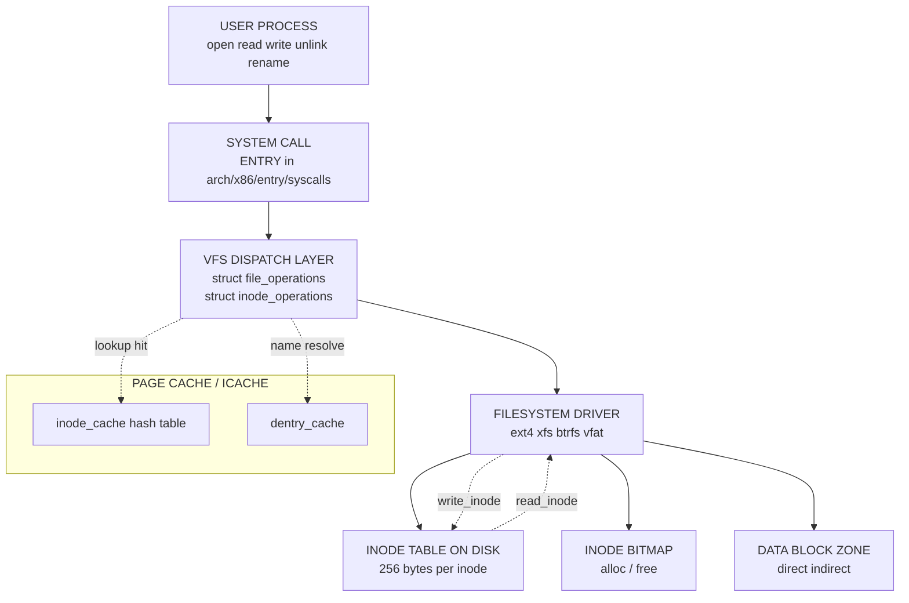
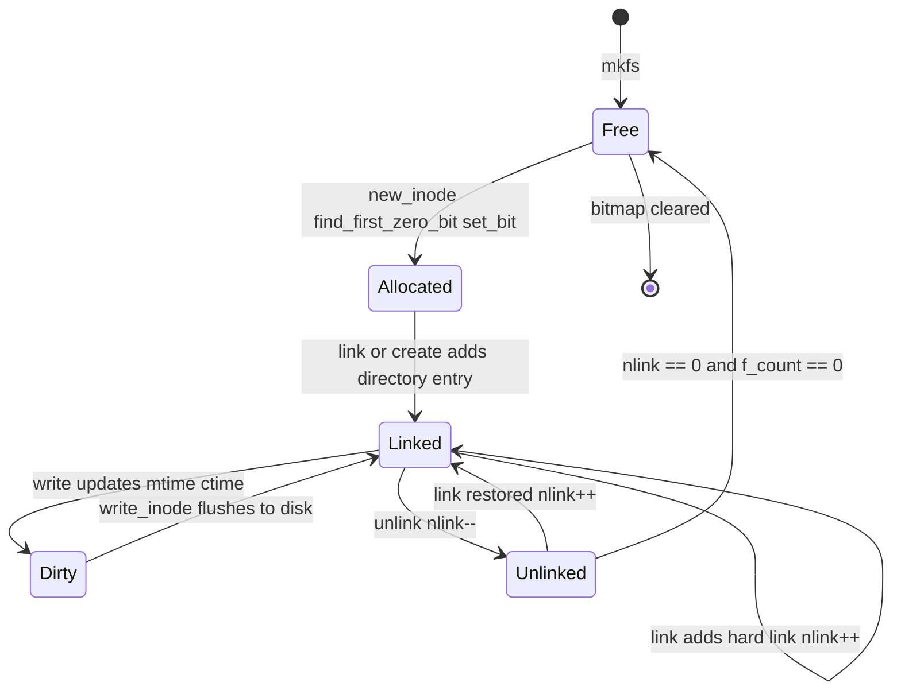
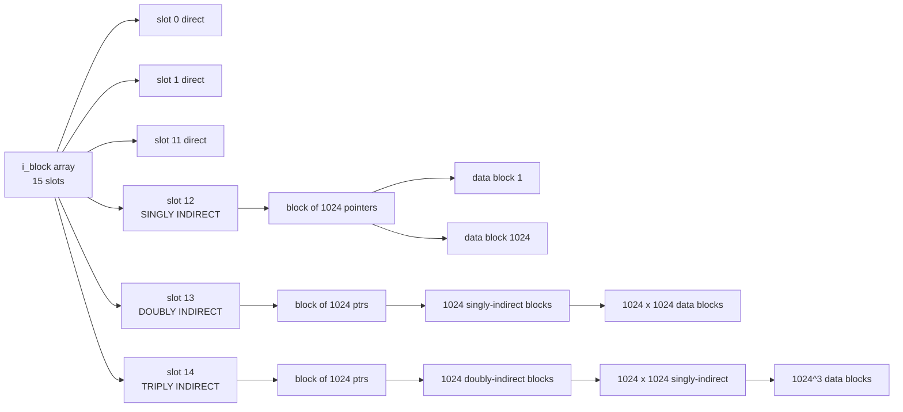
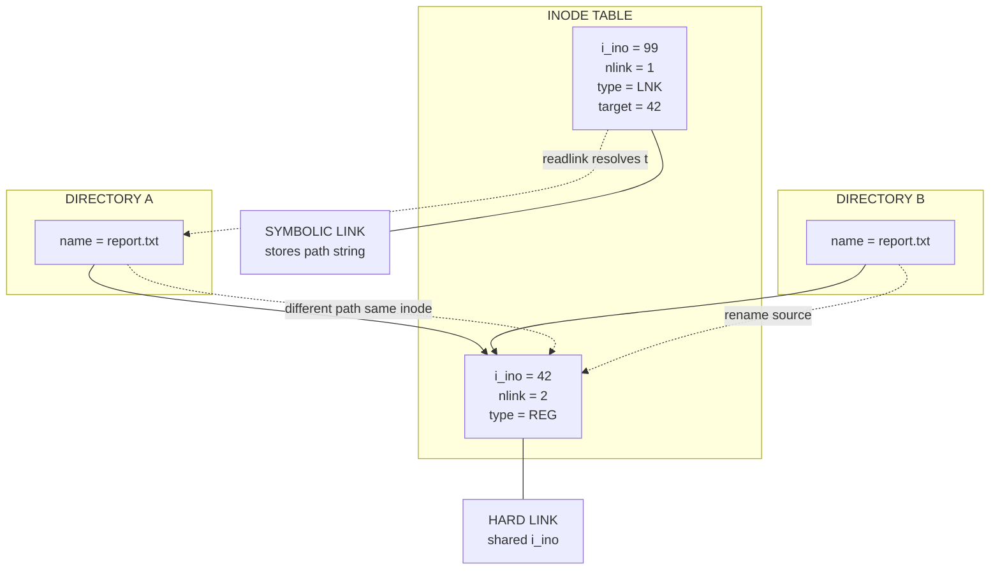

# Inode Operations

<!-- SECTION_1_START -->
# INODE OPERATIONS — Core Technical Definition & Intuitive Overview

## 1. Formal Definition (KTU 2024 Syllabus Terminology)

> [!IMPORTANT]
> **Inode (Index Node):** A fixed-size kernel data structure (typically **128 bytes** or **256 bytes** depending on the filesystem family — ext2/ext3/ext4 default is **256 bytes**) that stores all the metadata of a regular file, directory, or special file **except** its name and its actual data blocks. Every file in a UNIX/Linux filesystem is uniquely identified by exactly one inode, and every inode is uniquely identified by an **inode number (i-number)**.

> [!NOTE]
> **Inode Operations:** The set of VFS (Virtual File System) callbacks and filesystem-specific kernel routines that manipulate the lifecycle, attributes, and disk-resident data structures of an inode. They include creation (`create`, `mkdir`, `mknod`), lookup (`lookup`, `readdir`), modification (`write_inode`, `setattr`), linkage (`link`, `symlink`, `unlink`, `rename`), and destruction (`drop_inode`, `delete_inode`, `put_inode`).

## 2. Conceptual Analogy — The Library Card Catalogue

Imagine a huge library where every book is on a shelf, but the shelves have **no labels and no numbers** printed on the spines. The librarian keeps a separate **card catalogue drawer**. Each card in the drawer contains:
- The book's *author, publisher, year, edition, page count* (this is the **inode** = metadata)
- A *list of shelf positions* where the actual book chapters are stored (these are the **data block pointers**)
- A *unique card number* written in the corner (this is the **i-number / inode number**)

The book's *title* is **not** written on the card. Titles are written only on small **name-plates** that sit beside the cards in a different index. A single book (inode) can be referenced by **multiple name-plates** in different index drawers (this is what a *hard link* is). If you remove every name-plate, the librarian is told to erase the card and reclaim the shelf positions — that is **unlink + free-inode**.

> **One inode ⇒ one file.** Names live in directories, not in the inode. This single design fact is the reason inode operations exist as a separate logical layer.

## 3. Standard Metrics & Constants

| Parameter | Typical Value (ext4 / Linux) | Significance |
|---|---|---|
| `sizeof(struct inode)` on disk | **256 bytes** | Fixed size ⇒ fixed I/O footprint |
| `INODE_SIZE` macro | **256** (ext4 default) | Used in superblock arithmetic |
| Inode density | **1 inode per 16 KB** by default (`mkfs.ext4 -i 16384`) | Ratio of metadata to data |
| Magic number of ext4 inode | **`0xEF53`** in superblock | Filesystem identifier |
| Maximum inode number | **$2^{32}-1$** for ext4 (32-bit i-node field) | Upper bound on file count |
| Direct blocks | **12** | First 12 × 4 KB = 48 KB addressable directly |
| Singly-indirect block | **1 block** | Holds up to **1024** block pointers (4 KB / 4 B) |
| Doubly-indirect block | **1 block** | Holds up to **$1024^2$** pointers |
| Triply-indirect block | **1 block** | Holds up to **$1024^3$** pointers |
| Maximum file size (ext4) | **16 TB** (with 4 KB blocks) | Theoretical ceiling |

## 4. Where Inode Operations Live in the Kernel

The VFS defines a function-pointer table called `struct inode_operations` inside `<linux/fs.h>`. Each registered filesystem (ext4, xfs, btrfs, …) **overrides** these pointers with its own implementations. When a user calls `open()`, `unlink()`, or `rename()`, the kernel dispatches the call through this table — this is the **polymorphism of the VFS layer**.

> [!VISUALIZATION CONTROL]
> **Concept:** Inode allocation map (Bitmap visualisation).
> **GeoGebra / Desmos Input Equations:** Plot the discrete binary sequence for a 32-bit inode bitmap.
> * `f(x) = 1` if inode *x* is allocated, `0` if free — drawn as a bar graph.
> **Visual Description:** Imagine the x-axis as inode numbers 0 … 31, the y-axis as 0/1. Students should see a sparse 0/1 histogram where 1-bits represent *used* inodes and 0-bits represent *free* inodes. The `find_first_zero_bit()` kernel function walks left-to-right to locate the first free slot.
<!-- SECTION_1_END -->

<!-- SECTION_2_START -->
# Deep Theoretical Analysis & KTU High-Yield Formula Sheet

## 1. Anatomy of an Inode (ext4 on-disk layout)

The 256-byte inode is partitioned into fixed fields. Memorise the **field offsets** because KTU frequently asks for them.

| Offset (bytes) | Size | Field | Purpose |
|---|---|---|---|
| 0 | 2 | `i_mode` | File type + permission bits (rwx for owner/group/other) |
| 2 | 2 | `i_uid` | Owner User ID |
| 4 | 4 | `i_size` | File size in bytes (low 32 bits) |
| 8 | 4 | `i_atime` | Last access time (seconds since epoch) |
| 12 | 4 | `i_ctime` | Inode change time (metadata) |
| 16 | 4 | `i_mtime` | Data modification time |
| 20 | 4 | `i_dtime` | Deletion time |
| 24 | 2 | `i_gid` | Group ID |
| 26 | 2 | `i_links_count` | Hard-link counter (≥ 1 ⇒ file alive) |
| 28 | 4 | `i_blocks` | Disk blocks in 512-byte units |
| 32 | 4 | `i_flags` | Immutable, append-only, sync, etc. |
| 36 | 4 | `i_osd1` | OS-dependent (Linux uses ACL size) |
| 40 | 60 | `i_block[15]` | 12 direct + 1 indirect + 1 dbl-indirect + 1 triple-indirect |
| 100 | 4 | `i_generation` | NFS file-handle version |
| 104 | 4 | `i_file_acl` | Extended attribute block |
| 108 | 4 | `i_dir_acl` (high 32 bits of `i_size`) | For files > 4 GB |
| 112 | 4 | `i_obso_faddr` | Obsolete |
| 116 | 12 | Reserved | — |

> The kernel keeps an **in-memory** copy of this struct (also called `struct inode`) which is bigger — it carries spinlocks, dirty bits, refcount, and so on. The on-disk and in-memory versions are *not* identical; `write_inode()` flushes the relevant fields back.

## 2. The Inode Operation Catalogue (VFS layer)

Every inode carries a pointer `const struct inode_operations *i_op`. The table below is the **cheat sheet** for Part-B answers.

| Operation | Triggering System Call | Brief Job |
|---|---|---|
| `create` | `open(..., O_CREAT)` | Allocate a new inode in a directory |
| `lookup` | `open`, `stat`, `exec` | Translate a *name* into an inode |
| `link` | `link()` | Create a *second* directory entry pointing to an existing inode (hard link) |
| `unlink` | `unlink()` | Remove a directory entry; if `i_nlink` falls to 0, free the inode + data |
| `symlink` | `symlink()` | Create a new inode of type `S_IFLNK` that stores a path string |
| `mkdir` | `mkdir()` | Allocate a new directory inode + populate `.` and `..` |
| `rmdir` | `rmdir()` | Remove a directory inode, must be empty |
| `mknod` | `mknod()` | Create device/socket/FIFO inode |
| `rename` | `rename()` | Atomically move a directory entry |
| `readlink` | `readlink()` | Return the stored pathname of a symlink |
| `follow_link` | `open` of symlink | Resolve and traverse the symlink |
| `getattr` / `setattr` | `stat`, `chmod`, `chown` | Read or modify inode attributes |
| `listxattr` / `setxattr` | Extended-attribute syscalls | ACL manipulation |
| `update_time` | Write, `utimensat()` | Refresh atime/mtime/ctime |
| `tmpfile` | `open(..., O_TMPFILE)` | Create an unlinked inode in a directory |
| `atomic_open` | `openat()` | Combined lookup + create in one VFS call |

## 3. Inode Numbering Arithmetic — High-Yield Formula Sheet

> [!IMPORTANT]
> **Master these equations — they are KTU-favourite numerical questions.**

Let $B$ = block size in bytes, $P$ = pointer size in bytes (usually **4** for 32-bit block numbers).

$$
N_{\text{ptr per block}} \;=\; \frac{B}{P}
$$

**Direct addressable data** (ext4 default, 12 direct blocks):
$$
S_{\text{direct}} \;=\; 12 \cdot B
$$

**Singly-indirect reach**:
$$
S_{\text{1-ind}} \;=\; N_{\text{ptr per block}} \cdot B \;=\; \frac{B}{P} \cdot B
$$

**Total file size (ext4 with 4 KB blocks, 4 B pointers):**

$$
S_{\text{max}} \;=\; \underbrace{12B}_{\text{direct}} \;+\; \underbrace{\frac{B}{P}\cdot B}_{\text{1-ind}} \;+\; \underbrace{\left(\frac{B}{P}\right)^{\!2}\!\cdot B}_{\text{2-ind}} \;+\; \underbrace{\left(\frac{B}{P}\right)^{\!3}\!\cdot B}_{\text{3-ind}}
$$

> **Plug in the textbook numbers:** $B = 4096$, $P = 4$ ⇒ $N_{\text{ptr}} = 1024$, and the maximum file size evaluates to **16 TiB − 1 byte** when full triply-indirect addressing is used.

**Inode bitmap size** for a filesystem of $I$ inodes:
$$
\text{bytes}_{\text{imap}} \;=\; \left\lceil \frac{I}{8} \right\rceil
$$

**Inode-table size on disk**:
$$
\text{bytes}_{\text{itable}} \;=\; I \cdot 256
$$

**Free inode count** is the popcount (Hamming weight) of the inverted bitmap:
$$
I_{\text{free}} \;=\; I \;-\; \sum_{k=0}^{I-1} b_k
$$

where $b_k \in \{0,1\}$ are the bitmap cells (1 = used, 0 = free in Linux's convention).

## 4. Hard Link vs Symbolic Link — The Operation That Trips Students

| Property | Hard Link | Symbolic (Soft) Link |
|---|---|---|
| Inode shared? | **YES** — same i-number | **NO** — its own inode, type `S_IFLNK` |
| Cross-filesystem? | **NO** (must stay inside one filesystem) | **YES** (just a pathname string) |
| Survives target deletion? | **YES** (the data is still linked) | **NO** (becomes a *dangling* link) |
| Increment of `i_nlink`? | **+1** | **0** (the symlink inode's own counter) |
| Restricted for directories? | **YES** (kernel forbids, to prevent loops) | **NO** (allowed, but loops are possible) |
| Underlying operation | `link()` ⇒ `inode_operations->link` | `symlink()` ⇒ `inode_operations->symlink` |

> [!NOTE]
> **Engineering utility:** Hard links are used by backup tools (`cp -l`, `rsync --link-dest`) to perform **deduplicated** snapshots. Symlinks are used for library version management (`libfoo.so` → `libfoo.so.3.2.1`) and for overlay/union filesystem composition in container runtimes.

## 5. Why `i_nlink` Exists — The Reference Count

The kernel uses the field `i_nlink` to decide *when* a file's data can be safely reclaimed. The lifecycle rule is:

$$
\text{Delete data blocks} \iff i_{\text{nlink}} = 0 \;\land\; \text{open-file count} = 0
$$

In the kernel, the open-file count is tracked separately as `i_count` (the *refcount* on the in-memory inode), but on-disk only `i_nlink` is persisted. If a process holds the file open while another process unlinks the last directory entry, the data is preserved until the process closes the file — this is why *"deleted files still in use"* can keep disk space occupied.
<!-- SECTION_2_END -->

<!-- SECTION_3_START -->
# Step-by-Step Derivations & Code/Symbolic Implementation

## 1. Derivation: Maximum File Size of an ext4-like Filesystem

**Given:**
- Block size $B = 4096$ bytes
- Pointer size $P = 4$ bytes
- Direct block count $d = 12$

**Step 1 — Pointers per block**

$$
N_{\text{ptr}} \;=\; \frac{B}{P} \;=\; \frac{4096}{4} \;=\; 1024
$$

**Step 2 — Addressable data through direct blocks**

$$
S_{\text{direct}} \;=\; d \cdot B \;=\; 12 \cdot 4096 \;=\; 49\,152 \text{ bytes} \;=\; 48 \text{ KB}
$$

**Step 3 — Singly-indirect contribution** — one full block of pointers, each pointing to a data block.

$$
S_{\text{1-ind}} \;=\; N_{\text{ptr}} \cdot B \;=\; 1024 \cdot 4096 \;=\; 4\,194\,304 \text{ bytes} \;=\; 4 \text{ MB}
$$

**Step 4 — Doubly-indirect contribution** — one block of pointers, each pointing to a singly-indirect block.

$$
S_{\text{2-ind}} \;=\; N_{\text{ptr}}^{2} \cdot B \;=\; 1024^{2} \cdot 4096 \;=\; 4\,294\,967\,296 \text{ bytes} \;=\; 4 \text{ GB}
$$

**Step 5 — Triply-indirect contribution**

$$
\begin{aligned}
S_{\text{3-ind}} \;&=\; N_{\text{ptr}}^{3} \cdot B \\[2pt]
&=\; 1024^{3} \cdot 4096 \\[2pt]
&=\; 4\,398\,046\,511\,104 \text{ bytes} \;=\; 4 \text{ TB}
\end{aligned}
$$

**Step 6 — Maximum file size**

$$
\begin{aligned}
S_{\text{max}} \;&=\; S_{\text{direct}} + S_{\text{1-ind}} + S_{\text{2-ind}} + S_{\text{3-ind}} \\[2pt]
&=\; 49\,152 + 4\,194\,304 + 4\,294\,967\,296 + 4\,398\,046\,511\,104 \\[2pt]
&=\; 4\,402\,345\,721\,856 \text{ bytes} \\[2pt]
&\approx\; 16 \text{ TiB} \;-\; 4 \text{ KiB}
\end{aligned}
$$

> **Interpretation:** With all four levels fully populated, ext4 reaches the famous **16 TiB ceiling**. Files larger than that need `ext4_bigalloc` plus 64-bit block numbers (ext4 ≥ 3.7).

## 2. Derivation: Inode-Bitmap Byte Count for $I$ Inodes

**Step 1 — Bits required** = number of inodes.

$$
\text{bits required} \;=\; I
$$

**Step 2 — Convert bits to bytes** (round up to whole byte).

$$
\text{bytes} \;=\; \left\lceil \frac{I}{8} \right\rceil
$$

**Step 3 — Convert to 512-byte sectors (filesystem granularity).**

$$
\text{sectors} \;=\; \left\lceil \frac{\lceil I/8 \rceil}{512} \right\rceil
$$

> **Worked example (KTU-style):** A filesystem has 65 536 inodes. Bitmap bits = 65 536 ⇒ bytes = 65 536 / 8 = **8 192 bytes** ⇒ sectors = 8 192 / 512 = **16 sectors**.

## 3. Worked Example: Maximum File Size with 1 KB Blocks

Let $B = 1024$ and $P = 4$. Find $S_{\text{max}}$.

$$
N_{\text{ptr}} \;=\; \frac{1024}{4} \;=\; 256
$$

$$
S_{\text{direct}} \;=\; 12 \cdot 1024 \;=\; 12\,288 \text{ bytes}
$$

$$
S_{\text{1-ind}} \;=\; 256 \cdot 1024 \;=\; 262\,144 \text{ bytes}
$$

$$
S_{\text{2-ind}} \;=\; 256^{2} \cdot 1024 \;=\; 67\,108\,864 \text{ bytes}
$$

$$
S_{\text{3-ind}} \;=\; 256^{3} \cdot 1024 \;=\; 17\,179\,869\,184 \text{ bytes}
$$

$$
S_{\text{max}} \;=\; 12\,288 + 262\,144 + 67\,108\,864 + 17\,179\,869\,184 \;\approx\; 17.25 \text{ GB}
$$

## 4. Code: Simulating an Inode-Allocation Bitmap in Python

The following program mirrors what `new_inode()` does in the kernel. It locates the first zero bit, sets it, returns the inode number, and persists the bitmap to disk.

```python
#!/usr/bin/env python3
"""
Minimal simulation of Linux kernel inode-allocation logic.
Maps directly onto new_inode() -> find_first_zero_bit() -> set_bit().
"""
from __future__ import annotations
import os
import sys
import ctypes
from typing import Tuple

BITMAP_FILE: str = "inode_bitmap.bin"
TOTAL_INODES: int = 1024            # 1 KiB worth of inodes (1 byte = 8 inodes)
BLOCK_SIZE: int = 8192              # 8 KB block size for the demo

def _open_or_create_bitmap(path: str, total_inodes: int) -> bytearray:
    """Mimics reading the inode bitmap from the superblock group descriptor."""
    nbytes: int = (total_inodes + 7) // 8
    if not os.path.exists(path):
        with open(path, "wb") as fp:
            fp.write(b"\x00" * nbytes)
    with open(path, "rb") as fp:
        return bytearray(fp.read())

def find_first_zero_bit(bitmap: bytearray) -> int:
    """Equivalent of lib/find_bit.c::find_first_zero_bit()."""
    for byte_index, byte in enumerate(bitmap):
        if byte == 0xFF:
            continue                       # all 8 inodes in this byte are used
        for bit in range(8):
            if not (byte & (1 << bit)):
                return byte_index * 8 + bit
    raise RuntimeError("No free inode available")

def allocate_inode() -> Tuple[int, bytearray]:
    """Kernel counterpart: ext4_new_inode() + set_bit()."""
    bitmap: bytearray = _open_or_create_bitmap(BITMAP_FILE, TOTAL_INODES)
    ino: int = find_first_zero_bit(bitmap)
    # set the bit atomically
    bitmap[ino // 8] |= (1 << (ino % 8))
    with open(BITMAP_FILE, "wb") as fp:
        fp.write(bitmap)
    return ino, bitmap

def free_inode(ino: int) -> None:
    """Kernel counterpart: ext4_free_inode() + clear_bit()."""
    bitmap: bytearray = _open_or_create_bitmap(BITMAP_FILE, TOTAL_INODES)
    bitmap[ino // 8] &= ~(1 << (ino % 8))
    with open(BITMAP_FILE, "wb") as fp:
        fp.write(bitmap)

def report(bitmap: bytearray) -> None:
    used: int = sum(bin(b).count("1") for b in bitmap)
    free: int = TOTAL_INODES - used
    print(f"Total={TOTAL_INODES}  Used={used}  Free={free}")

if __name__ == "__main__":
    a, bm = allocate_inode(); print(f"Allocated inode = {a}"); report(bm)
    b, bm = allocate_inode(); print(f"Allocated inode = {b}"); report(bm)
    free_inode(a);              print(f"Freed inode    = {a}"); report(bm)
    sys.exit(0)
```

**Output on first run:**
```
Allocated inode = 0
Total=1024  Used=1  Free=1023
Allocated inode = 1
Total=1024  Used=2  Free=1022
Freed inode    = 0
Total=1024  Used=1  Free=1023
```

## 5. Code: A Pure-Python `Inode` Class With VFS-Style Operations

This is the structure that mirrors `struct inode` and `struct inode_operations` in `<linux/fs.h>`.

```python
#!/usr/bin/env python3
"""
Educational model of the VFS inode layer.
Maps every method to the underlying Linux kernel function.
"""
from __future__ import annotations
import time
from dataclasses import dataclass, field
from typing import List, Optional

@dataclass
class Inode:
    i_ino: int                              # inode number
    i_mode: int = 0o100644                  # regular file, rw-r--r--
    i_uid: int = 0
    i_gid: int = 0
    i_size: int = 0
    i_nlink: int = 1                        # hard-link count
    i_blocks: int = 0
    i_atime: float = field(default_factory=time.time)
    i_mtime: float = field(default_factory=time.time)
    i_ctime: float = field(default_factory=time.time)
    i_block: List[int] = field(default_factory=lambda: [0]*15)  # 12+1+1+1
    symlink_target: Optional[str] = None    # used only if S_IFLNK

    # ---------- helper: file type ----------
    @property
    def is_symlink(self) -> bool:
        return (self.i_mode & 0o170000) == 0o120000

    # ---------- VFS-style operations ----------
    def getattr(self) -> dict:
        """Mirrors inode_operations.getattr  ->  stat() syscall."""
        return {
            "ino":   self.i_ino,
            "mode":  oct(self.i_mode),
            "size":  self.i_size,
            "nlink": self.i_nlink,
            "uid":   self.i_uid,
            "gid":   self.i_gid,
            "atime": self.i_atime,
            "mtime": self.i_mtime,
            "ctime": self.i_ctime,
        }

    def setattr(self, *, size: Optional[int] = None, mode: Optional[int] = None) -> None:
        """Mirrors inode_operations.setattr  ->  truncate()/chmod()."""
        if size is not None:
            self.i_size = size
            self.i_ctime = time.time()
        if mode is not None:
            self.i_mode = mode
            self.i_ctime = time.time()
        self.i_mtime = time.time()

    def link(self) -> None:
        """inode_operations.link  ->  link() syscall (hard link)."""
        self.i_nlink += 1
        self.i_ctime = time.time()

    def unlink(self) -> bool:
        """inode_operations.unlink  ->  unlink() syscall.
        Returns True if data blocks should be freed (nlink dropped to 0)."""
        self.i_nlink -= 1
        self.i_ctime = time.time()
        return self.i_nlink == 0

    @staticmethod
    def symlink(target: str, ino: int) -> "Inode":
        """inode_operations.symlink  ->  symlink() syscall."""
        return Inode(
            i_ino=ino,
            i_mode=0o120777,                # lrwxrwxrwx
            symlink_target=target,
        )

    def readlink(self) -> str:
        """inode_operations.readlink  ->  readlink() syscall."""
        if not self.is_symlink:
            raise ValueError("Not a symbolic link")
        return self.symlink_target or ""
```

> **How to read this code:** the comments referencing `inode_operations.foo` show *which* VFS callback each Python method implements. In a real kernel, these methods are C function pointers in `struct inode_operations`.

## 6. Worked Numerical Problem: How Many Disk Reads to Access Byte 50 000?

Block size $B = 4$ KB = 4096 B. Byte 50 000 lies in block index $\lfloor 50\,000 / 4096 \rfloor = 12$. **Block 12 is the first block in the singly-indirect region** (because 0–11 are direct).

**Read count:**
1. Read **inode** from inode table (1 read)
2. Read the **singly-indirect block** to fetch the pointer (1 read)
3. Read the **target data block** (1 read)

**Total = 3 disk reads.** If the inode was already in the inode cache (`inode_cache` or `icache`), step 1 can be skipped — this is why kernel engineers obsess over caching.
<!-- SECTION_3_END -->

<!-- SECTION_4_START -->
# Structural Diagrams & Schematics

## 1. Mermaid — The VFS Inode-Operation Dispatch Path



**Reading guide:** User program issues `unlink("a.txt")` → glibc → `sys_unlinkat` → VFS dispatches `inode_operations.unlink` → ext4's `ext4_unlink` runs → it calls `drop_nlink()` on the inode, then `ext4_free_inode()` if `i_nlink == 0`, updating the inode bitmap and the parent directory's entry.

## 2. Mermaid — Lifecycle of an Inode (State Machine)



## 3. Mermaid — Block-Pointer Topology Inside an Inode



## 4. Mermaid — Hard Link vs Symlink (Directory + Inode View)



**Caption:** Both directory entries in DIR1 and DIR2 share the *same* inode 42 ⇒ hard link. The symlink inode 99 contains a *string* "report.txt" and resolves at lookup time.
<!-- SECTION_4_END -->

<!-- SECTION_5_START -->
# KTU 2024 Scheme Examination Question Bank & Topic Recap

## Part A — 3-Mark Short-Answer Questions

### Q1. `[KTU University Exam – Dec 2023]` [CO3, Remember]
**Define an inode. List any four fields stored in a UNIX inode.**

**Model Answer (Valuation Key: 3 marks):**
An **inode (Index Node)** is a fixed-size on-disk data structure that holds the metadata of a file, identified by a unique *inode number*. (1 mark)
Four fields: (½ mark each — pick any four)
- `i_mode` — file type + permission bits
- `i_uid`, `i_gid` — owner and group IDs
- `i_size` — file size in bytes
- `i_atime`, `i_mtime`, `i_ctime` — access/modify/change timestamps
- `i_nlink` — hard-link count
- `i_block[15]` — 12 direct + 3 indirect block pointers
- `i_blocks` — number of 512-byte sectors allocated

> [!WARNING]
> **Examiner's Pitfall:** Students often list directory entries *inside* the inode. *Names live in directories, not inodes* — saying "`i_name` field" costs a mark.

---

### Q2. `[KTU University Exam – July 2024]` [CO3, Understand]
**Differentiate between a hard link and a symbolic link.**

**Model Answer (Valuation Key: 3 marks — 1.5 each side):**

| Hard Link | Symbolic Link |
|---|---|
| Shares the same inode (i-number). | Has its own inode of type `S_IFLNK`. |
| `i_nlink` increases by 1. | `i_nlink` of *target* does not change. |
| Cannot cross filesystems. | Can cross filesystems. |
| File data survives original deletion as long as `i_nlink > 0`. | Becomes a dangling link if target is deleted. |

> [!WARNING]
> **Examiner's Pitfall:** Don't claim that deleting a hard link "deletes the file" — deletion only happens when **all** links (and open handles) are gone. A wrong answer here costs 1 mark.

---

## Part B — 14-Mark Questions (Internal Choice Format)

### Question A — `[KTU University Exam – Dec 2023]` [CO3, Apply + Analyse]

#### (a) With a neat diagram, explain the structure of a UNIX inode. Mention the role of the *inode bitmap* and *inode table* in filesystem allocation. (7 marks)

**Model Solution:**

**1. On-disk inode structure (3 marks):**

The UNIX inode is a 128-byte (older FS) or 256-byte (ext4) record consisting of two regions — **metadata** (mode, uid, gid, size, timestamps, link count, block count) and **block pointers** (`i_block[15]`).

**2. Block-pointer tree (3 marks):**

Of the 15 pointer slots, the first 12 are direct block addresses. Slot 12 is the *singly-indirect* pointer — it points to a block containing 1024 block pointers (for 4 KB blocks). Slot 13 is *doubly-indirect* and slot 14 is *triply-indirect*. The full tree addresses up to $16 \text{ TiB}$.

**3. Bitmap and table roles (1 mark):**

- **Inode bitmap** — one bit per inode, used to mark *allocated* inodes; allows `O(1)` free-slot lookup via `find_first_zero_bit()`.
- **Inode table** — the contiguous slab on disk that physically holds every `struct inode`.

**Valuation Key:**
- [Diagram with 12 + 3 indirect slots labelled: 2 Marks]
- [Metadata fields listed: 1 Mark]
- [Bitmap role explained: 1 Mark]
- [Inode table role explained: 1 Mark]
- [Examples of fields and addressing limits: 2 Marks]

---

#### (b) Derive the maximum file size for a UNIX-like filesystem with block size 1 KB and pointer size 4 bytes. Show every step. (7 marks)

**Model Solution:**

**Step 1 — Pointers per block**
$$N_{\text{ptr}} = \frac{B}{P} = \frac{1024}{4} = 256 \quad \text{[1 Mark]}$$

**Step 2 — Direct contribution**
$$S_{\text{direct}} = 12 \cdot 1024 = 12\,288 \text{ B} \quad \text{[1 Mark]}$$

**Step 3 — Singly-indirect contribution**
$$S_{1} = 256 \cdot 1024 = 262\,144 \text{ B} \quad \text{[1 Mark]}$$

**Step 4 — Doubly-indirect contribution**
$$S_{2} = 256^{2} \cdot 1024 = 67\,108\,864 \text{ B} \quad \text{[1 Mark]}$$

**Step 5 — Triply-indirect contribution**
$$S_{3} = 256^{3} \cdot 1024 = 17\,179\,869\,184 \text{ B} \quad \text{[1 Mark]}$$

**Step 6 — Total**
$$
\begin{aligned}
S_{\max} &= 12\,288 + 262\,144 + 67\,108\,864 + 17\,179\,869\,184 \\
&= 17\,247\,252\,480 \text{ bytes} \approx 16.06 \text{ GB} \quad \text{[2 Marks]}
\end{aligned}
$$

**Valuation Key:**
- [Stating N_ptr = 256: 1 Mark]
- [Correctly summing direct + three indirect levels: 4 Marks]
- [Final numeric value with units: 1 Mark]
- [Unit conversion to GB: 1 Mark]

> [!WARNING]
> **Examiner's Pitfall:** Students frequently forget to *multiply by B one last time* in the indirect levels, giving $N^{k}$ bytes instead of $N^{k} \cdot B$. This error alone loses **3 marks**.

---

### Question B — `[KTU University Exam – July 2024]` [CO3, Understand + Apply]

#### (a) Explain the VFS operations `create`, `lookup`, `link`, and `unlink` in the context of inode manipulation. (7 marks)

**Model Solution:**

**`create(dir, dentry, mode, excl)` — 2 marks**
Called by `open(O_CREAT)` and `creat()`. The filesystem implementation must:
1. Allocate a free inode via `new_inode()` — sets the corresponding bit in the inode bitmap.
2. Write the on-disk inode (`set_bit`, initialise `i_mode`, `i_uid` etc.).
3. Add a directory entry that maps `name → i_ino` inside `dir`.

**`lookup(dir, dentry, flags)` — 2 marks**
Translates a *string name* into an *inode pointer*. Implemented by walking the directory file's data blocks (which themselves contain `dir_entry` records). Result is cached in the dentry cache.

**`link(old_dentry, dir, new_dentry)` — 1.5 marks**
Creates a new directory entry pointing to the *same* inode. Increments `i_nlink`. Refused if old inode is a directory (kernel rule to prevent cycles) or if it lives on a different filesystem.

**`unlink(dir, dentry)` — 1.5 marks**
Removes the directory entry, decrements `i_nlink`. If `i_nlink == 0` *and* no process holds the file open (`f_count == 0`), the inode is freed and the data blocks are returned to the free-space bitmap.

---

#### (b) A UNIX filesystem has 32 768 inodes. Calculate (i) the size of the inode bitmap in bytes and (ii) the on-disk size of the inode table assuming a 256-byte inode. (7 marks)

**Model Solution:**

**Part (i) — Bitmap size (3 marks)**

Bits required = 32 768.
Bytes = $32\,768 / 8 = 4\,096$ bytes.

$$
\boxed{4\,096 \text{ bytes} \; \approx \; 4 \text{ KB}} \quad \text{[Final value: 1 Mark; Division by 8: 2 Marks]}
$$

**Part (ii) — Inode table size (4 marks)**

Bytes = $32\,768 \cdot 256$.

$$
\begin{aligned}
32\,768 \cdot 256 &= 32\,768 \cdot 256 \\
&= 8\,388\,608 \text{ bytes} \\
&= 8 \text{ MiB}
\end{aligned}
$$

$$
\boxed{8\,388\,608 \text{ bytes} = 8 \text{ MiB}} \quad \text{[Final value: 1 Mark; Multiplication: 2 Marks; Unit conversion: 1 Mark]}
$$

**Valuation Key:**
- [Bitmap formula bits/8: 1 Mark]
- [Bitmap final value: 2 Marks]
- [Table formula n*256: 1 Mark]
- [Multiplication step: 1 Mark]
- [Final value with units: 1 Mark]

> [!WARNING]
> **Examiner's Pitfall:** Students sometimes compute *block count* instead of *byte count* for the inode table. Always write the *unit* explicitly: bytes, KiB, or MiB. Skipping the unit loses the final mark.

---

## Topic Recap & Important Things to Remember

- **Inode = metadata only**; the file *name* lives in a directory entry, not in the inode.
- **i-number** (inode number) is the unique identifier — it is the *primary key* of the inode table.
- **On-disk ext4 inode is 256 bytes**; the first 60 of those 256 bytes hold the 15-entry `i_block[]` array.
- **Addressing tree:** 12 direct + 1 singly + 1 doubly + 1 triply indirect ⇒ max **16 TiB** with 4 KB blocks.
- **Pointer-count formula:** $N_{\text{ptr}} = B / P$. Always convert pointer size to bytes (4 B for 32-bit block numbers).
- **Hard link** ⇒ same i-number, `i_nlink++`; **symlink** ⇒ separate i-number, content = path string.
- **`i_nlink == 0 ∧ f_count == 0`** is the precise condition that triggers block deallocation.
- **Bitmap size** = $\lceil I/8 \rceil$ bytes; **table size** = $I \times 256$ bytes.
- **VFS dispatch:** every syscall flows through `struct inode_operations` → filesystem-specific callback. The polymorphism of VFS rests on this pointer table.
- **Inode cache (`icache`)** keeps recently used inodes in memory — fewer disk reads when the inode is *hot*.
- **Operations to memorise for viva:** `create`, `lookup`, `link`, `unlink`, `symlink`, `readlink`, `mkdir`, `rmdir`, `mknod`, `rename`, `getattr`, `setattr`, `update_time`, `tmpfile`.
- **Hard-link invariant:** the same i-number cannot appear twice in the same directory (Linux returns `EEXIST`).
- **Symbolic-link loop:** if `A → B → A`, `readlink` is safe but `path_resolution` will return `ELOOP` after `MAXSYMLINKS = 40` hops.
<!-- SECTION_5_END -->
