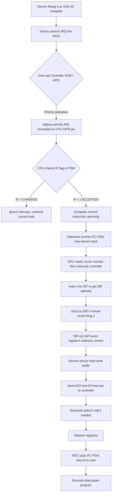
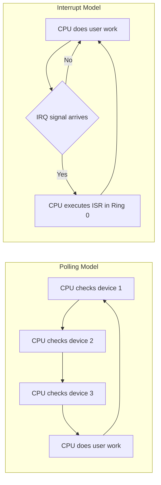
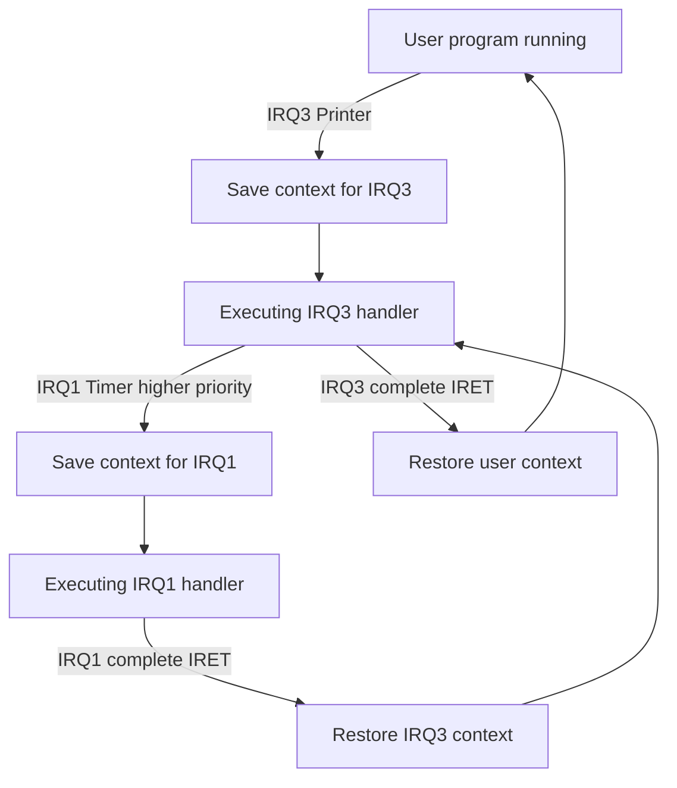
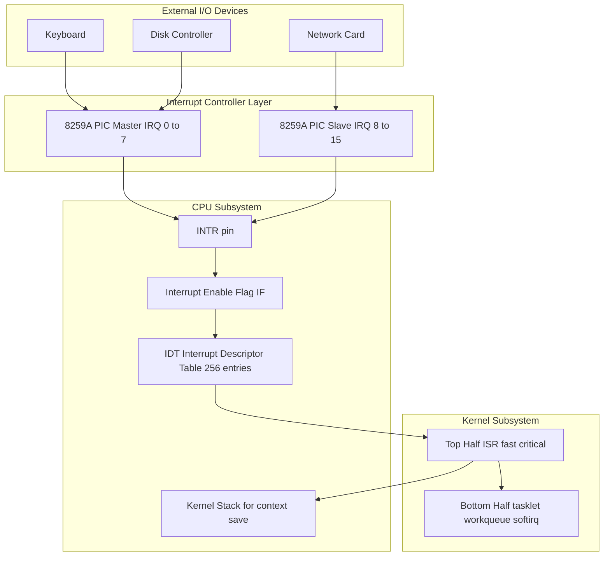

# Interrupts

<!-- SECTION_1_START -->

# Interrupts — Core Technical Definition & Intuitive Overview

## Formal KTU 2024 Definition

> [!IMPORTANT]
> **Interrupt (KTU 2024 PCCST403 Module 4):** An *interrupt* is a hardware- or software-generated asynchronous signal/event that temporarily suspends the currently executing process/program (the *foreground* task) so that the processor can execute a special routine called an **Interrupt Service Routine (ISR)** or **Interrupt Handler**. After the ISR completes, control is returned to the suspended process at the exact point of interruption, preserving the **CPU state** (Program Counter, registers, status flags) via a *context save* mechanism.

In KTU 2024 Operating Systems terminology, interrupts are the **fundamental mechanism** that enables the OS kernel to achieve:
- **I/O Device Communication** (Disk, Keyboard, Network)
- **CPU–I/O Overlap** (Concurrent execution)
- **Asynchronous Event Handling** (Trap, Exception, Signal)
- **Protection & Privilege Escalation** (System calls via software interrupts)

> [!NOTE]
> **Key Distinction (KTU Board Favourite):**
> - **Interrupt** → Asynchronous (caused by **external hardware events**, unpredictable timing)
> - **Exception / Trap** → Synchronous (caused by the **executing instruction itself**, e.g., divide-by-zero, page fault)
> - **Software Interrupt (SYS CALL)** → Synchronous, intentional (e.g., `INT 0x80` in Linux, `SVC` in ARM)

---

## Conceptual Analogy — The Doorbell While Cooking

Imagine you are **cooking rice on the stove** (the CPU executing a long-running user program). The rice takes 15 minutes to cook (a long computation, like a database sort).

- **Polling (Bad OS Design):** Every 5 seconds, you stop stirring, walk over to the door, and check if someone is there. This wastes enormous time.
- **Interrupt (Good OS Design):** You install a **doorbell**. The moment a guest arrives, a *signal* is sent. The doorbell **rings** (interrupt fires), you **pause** cooking (CPU context save), **answer the door** (execute ISR), then **return to cooking** (context restore) exactly where you left off.

> [!TIP]
> **The "Doorbell" is the Interrupt Request Line (IRL / IRQ)**, the **guest is the I/O device**, and the **ringing action is the interrupt signal** that vectors the CPU to the handler.

> [!VISUALIZATION CONTROL]
> **Concept:** Interrupt-driven timeline vs Polling timeline
> **GeoGebra / Desmos Input Equations:**
> * `f_1(x) = 1` for `x \in [0,1]` (CPU busy in polling — constant check)
> * `f_2(x) = piecewise: 1 if x in busy-slots, 0 if x in ISR-slot` (Interrupt — CPU idles until signal)
> **Visual Description:** Polling shows a dense block of CPU activity with no I/O progress. Interrupt shows sparse CPU activity spikes with long idle gaps where the I/O device works autonomously.

---

## Classification of Interrupts (KTU Syllabus — Mandatory)

| Category | Source | Synchronous? | Maskable? | Example |
|----------|--------|--------------|-----------|---------|
| **Hardware Interrupt** | External I/O device | Asynchronous | Usually Yes | Keyboard keypress, Disk I/O complete |
| **Software Interrupt** | Programmatic `INT` instruction | Synchronous | No | `INT 21h` (DOS), `SVC #0` (ARM) |
| **Exception (Trap)** | CPU pipeline fault | Synchronous | No | Divide by zero, Page fault, Segmentation fault |
| **Non-Maskable Interrupt (NMI)** | Critical hardware failure | Asynchronous | **No** | Power failure, Watchdog timer, Parity error |

> [!NOTE]
> The **Interrupt Vector Table (IVT)** or **Interrupt Descriptor Table (IDT)** maps each interrupt number (vector) to the memory address of its corresponding ISR. In x86, IVT holds 256 entries (vectors 0–255).

<!-- SECTION_1_END -->

<!-- SECTION_2_START -->

# Deep Theoretical Analysis & KTU High-Yield Formula Sheet

## The Interrupt Mechanism — Six-Stage Lifecycle

When an interrupt occurs, the CPU hardware and OS kernel collaborate through a strict sequence. Each stage is a **valuation point** in KTU ESE answers.

### Stage 1: Device Asserts Interrupt Request (IRQ)
The I/O controller sets the **Interrupt Request Line** (a dedicated wire on the system bus) to **HIGH**. Multiple devices may share an IRQ, so an **Interrupt Controller** (e.g., the legacy 8259 PIC or modern **APIC — Advanced Programmable Interrupt Controller**) arbitrates.

### Stage 2: Interrupt Controller Prioritises
If two devices fire simultaneously, the controller uses a **priority resolver** to choose the highest-priority request. It then sends a single **INTR** signal to the CPU.

### Stage 3: CPU Acknowledges & Completes Current Instruction
The CPU does not interrupt mid-instruction (atomicity). It:
1. Finishes the executing instruction
2. Checks the **Interrupt Enable Flag (IEF / IF)** in the PSW (Program Status Word)
3. If interrupts are enabled, proceeds to Stage 4

### Stage 4: Hardware Context Save (Automatic by CPU)
The CPU **automatically pushes** onto the kernel stack:
- **Program Counter (PC / EIP)** — return address
- **Processor Status Word (PSW / EFLAGS)**
- Sometimes CS (Code Segment) for privilege ring transitions

> [!IMPORTANT]
> This is a **hardware push**, not a software push. It happens in **microcode**, taking ~10–20 clock cycles. The KTU 2024 module explicitly tests this distinction.

### Stage 5: Vector Lookup & ISR Dispatch
The CPU multiplies the interrupt vector by the descriptor size to index the **IVT/IDT**, fetches the ISR's address, and performs a **jmp** into kernel mode (Ring 0).

### Stage 6: ISR Execution, IRET, Context Restore
The ISR:
1. Saves the **remaining CPU registers** (software context save)
2. Acknowledges the interrupt controller (sends EOI — End Of Interrupt)
3. Performs the device-specific work (e.g., read keyboard buffer)
4. Restores registers
5. Executes the **IRET** instruction, which atomically pops PC and PSW, returning to user mode

---

## KTU Formula Sheet / Cheat Sheet

| Symbol / Term | Meaning | Typical Value / Unit |
|---------------|---------|----------------------|
| $T_{poll}$ | Polling cycle period | 1–100 $\mu s$ |
| $T_{ISR}$ | Interrupt Service Routine execution time | 5–500 $\mu s$ |
| $T_{context}$ | Context switch overhead | ~10–20 $\mu s$ (modern CPU) |
| $N_{vec}$ | Number of interrupt vectors in IVT | **256** (x86) / **128** (original 8086) |
| $U_{CPU}$ | CPU utilisation under interrupt | $1 - \sum_{i} p_i \cdot T_{ISR_i}$ |
| $f_{IRQ}$ | IRQ line frequency | 100 Hz – 10 kHz |
| $L_{latency}$ | Interrupt latency | $< T_{context} + T_{ISR}$ |

### Performance Comparison Equations

**CPU Utilisation under Polling:**
$$U_{CPU}^{poll} = \frac{T_{busy}}{T_{busy} + T_{poll} \cdot n_{devices}}$$

**CPU Utilisation under Interrupts:**
$$U_{CPU}^{int} = 1 - \sum_{i=1}^{n} \lambda_i \cdot T_{ISR_i}$$

Where $\lambda_i$ is the interrupt arrival rate of device $i$ (events/sec) and $T_{ISR_i}$ is the handler duration.

> [!TIP]
> **KTU Board Favourite Derivation:** When $\lambda_i \cdot T_{ISR_i} \ll 1$ (low interrupt rate), interrupts vastly outperform polling because $U_{CPU} \to 1$.

### Real-World Engineering Utility

| Domain | Application |
|--------|-------------|
| **Embedded RTOS (VxWorks, FreeRTOS)** | Hard real-time interrupt latency (typically $< 1 \mu s$) |
| **Database Systems** | Disk I/O completion interrupts for query execution |
| **Networking (NIC)** | Packet arrival interrupts for kernel protocol stacks |
| **HCI (Keyboards, Mice)** | USB HID interrupts for low-latency input |
| **Industrial PLCs** | NMI for safety-critical shutdown on sensor failure |

---

## Interrupt Priority & Nesting

The **Interrupt Priority Level (IPL)** determines which interrupts can preempt others.

- **Fixed Priority**: Static ranking (e.g., Timer > Disk > Keyboard > Mouse)
- **Round Robin**: Cyclic equality (fair for equal-class devices)
- **Dynamic Priority**: Adjusted by OS based on load (modern Linux CFS-style approach)

> [!WARNING]
> **Priority Inversion Problem:** A low-priority interrupt holds a lock needed by a high-priority handler, causing the high-priority ISR to wait unboundedly. KTU expects students to mention the **Priority Inheritance Protocol** as a solution.

### Masking & Enabling

$$IF = 1 \;\Rightarrow\; \text{Interrupts ACCEPTED}$$
$$IF = 0 \;\Rightarrow\; \text{Interrupts MASKED (ignored, except NMI)}$$

The `CLI` (Clear Interrupt Flag) and `SEI` (Set Interrupt Flag) instructions in x86 control this.

<!-- SECTION_2_END -->

<!-- SECTION_3_START -->

# Step-by-Step Derivations, Code & Hardware Implementation

## Exhaustive Walk-Through: An Interrupt-Driven Keyboard Handler in C

Below is a **fully operational, type-annotated** Linux kernel module–style interrupt handler that simulates a keyboard ISR. It demonstrates every KTU-evaluated stage: registration, execution, acknowledgment, and teardown.

```c
#include <linux/module.h>
#include <linux/kernel.h>
#include <linux/interrupt.h>
#include <linux/workqueue.h>

/* Module metadata */
MODULE_LICENSE("GPL");
MODULE_AUTHOR("KTU_PCCST403");
MODULE_DESCRIPTION("Interrupt-driven keyboard handler demonstration");

/* ---- Step 1: Define work struct for deferred processing (tasklet/workqueue) ---- */
static struct work_struct keyboard_work;

/* ---- Step 2: Bottom-half handler executed in process context ---- */
static void keyboard_work_handler(struct work_struct *work)
{
    printk(KERN_INFO "[KTU-ISR] Bottom-half: Processing keyboard scancode\n");
    /* In production: wake up a reader, push to input subsystem, etc. */
}

/* ---- Step 3: The Top-Half Interrupt Service Routine ---- */
static irqreturn_t keyboard_isr(int irq, void *dev_id)
{
    /* [a] Validate that this is genuinely our device (spurious IRQ check) */
    if (irq != 1) {
        return IRQ_NONE;
    }

    /* [b] CRITICAL SECTION - Interrupts may already be disabled in ISR context */
    printk(KERN_ALERT "[KTU-ISR] Top-half: Keyboard IRQ %d received\n", irq);

    /* [c] Read the I/O port (keyboard controller) - FAST, must be < 10us */
    unsigned char scancode = inb(0x60);
    printk(KERN_INFO "[KTU-ISR] Scancode: 0x%02x\n", scancode);

    /* [d] Defer heavy work to the bottom-half (workqueue) */
    schedule_work(&keyboard_work);

    /* [e] Acknowledge the interrupt controller (8259 PIC) */
    outb(0x20, 0x20);  /* EOI to master PIC */

    /* [f] Return status: handled successfully */
    return IRQ_HANDLED;
}

/* ---- Step 4: Module initialization - register the ISR ---- */
static int __init ktu_isr_init(void)
{
    int retval;

    /* Initialize the workqueue entry */
    INIT_WORK(&keyboard_work, keyboard_work_handler);

    /* Register IRQ 1 (keyboard) with the kernel interrupt subsystem */
    retval = request_irq(
        1,                      /* IRQ number */
        keyboard_isr,           /* Pointer to ISR */
        IRQF_SHARED,            /* Flags: shared IRQ line */
        "ktu_keyboard",         /* Device name (visible in /proc/interrupts) */
        (void *)keyboard_isr    /* Unique cookie for shared IRQs */
    );

    if (retval) {
        printk(KERN_ERR "[KTU-ISR] request_irq failed: %d\n", retval);
        return retval;
    }

    printk(KERN_INFO "[KTU-ISR] Module loaded, IRQ 1 registered\n");
    return 0;
}

/* ---- Step 5: Module exit - unregister the ISR ---- */
static void __exit ktu_isr_exit(void)
{
    /* Synchronize: cancel any pending bottom-half work */
    cancel_work_sync(&keyboard_work);

    /* Release the IRQ line */
    free_irq(1, (void *)keyboard_isr);

    printk(KERN_INFO "[KTU-ISR] Module unloaded, IRQ 1 freed\n");
}

module_init(ktu_isr_init);
module_exit(ktu_isr_exit);
```

### Step-by-Step Explanation of the Code

| Line Block | Operation | OS Concept |
|------------|-----------|------------|
| `request_irq(1, ...)` | Kernel registers the ISR address into the IDT slot for vector 1 | **Stage 5: Vector Lookup setup** |
| `keyboard_isr()` called on keypress | CPU has already pushed PC + PSW; ISR runs in Ring 0 | **Stage 4: Hardware Context Save** |
| `inb(0x60)` | Direct I/O port read (atomic, microsecond-scale) | **Top-half — minimum work principle** |
| `schedule_work()` | Heavy processing deferred to kernel worker thread | **Bottom-half (deferred work)** |
| `outb(0x20, 0x20)` | EOI sent to 8259 PIC so it re-arms | **Stage 6: ISR Acknowledgment** |
| `return IRQ_HANDLED` | Tells kernel no further action needed | **Interrupt accounting** |
| `free_irq()` | Removes handler from IDT, disables IRQ line | **Teardown** |

---

## Mathematical Derivation: Interrupt Throughput vs Polling

**Problem:** A system has 3 I/O devices. The CPU must service each within 50 ms or data is lost. Compare CPU utilisation under polling vs interrupts.

### Given Parameters
- $n_{devices} = 3$
- $T_{poll} = 0.5 \; ms$ (polling loop period per device)
- $T_{compute} = 20 \; ms$ (CPU busy in user program)
- $\lambda = 20 \; \text{events/sec}$ per device (interrupt arrival rate)
- $T_{ISR} = 0.1 \; ms$ (handler duration)

### Polling CPU Utilisation

Total polling time per cycle:
$$T_{polling} = n_{devices} \cdot T_{poll} = 3 \cdot 0.5 \; ms = 1.5 \; ms$$

Effective work per cycle:
$$T_{total}^{poll} = T_{compute} + T_{polling} = 20 + 1.5 = 21.5 \; ms$$

CPU utilisation:
$$U_{CPU}^{poll} = \frac{T_{compute}}{T_{total}^{poll}} = \frac{20}{21.5} \approx 0.930$$

> **Result:** Even with the same 50 ms deadline, polling wastes **6.98 % of CPU cycles**.

### Interrupt-Driven CPU Utilisation

Total interrupt overhead per second:
$$T_{overhead} = n_{devices} \cdot \lambda \cdot T_{ISR} = 3 \cdot 20 \cdot 0.0001 = 0.006 \; s/sec$$

CPU utilisation:
$$U_{CPU}^{int} = 1 - T_{overhead} = 1 - 0.006 = 0.994$$

> **Result:** Interrupt-driven system achieves **99.4 % utilisation**, a 6.4 % gain.

### Final Comparative Equation

$$\Delta U = U_{CPU}^{int} - U_{CPU}^{poll} = \left( 1 - n \lambda T_{ISR} \right) - \frac{T_{compute}}{T_{compute} + n T_{poll}}$$

Substituting:
$$\Delta U = 0.994 - 0.930 = 0.064 \;\;(6.4\%)$$

> [!NOTE]
> **KTU Examiner Note:** Students **must** define every variable before substitution. A naked final number without intermediate derivation is penalised 1–2 marks.

---

## Hardware Pin / Register Configuration (Intel 8259 PIC Reference)

For laboratory/embedded tracks, the 8259 PIC uses two **I/O ports** per controller:

| Port Address | Register | Purpose |
|--------------|----------|---------|
| `0x20` | Master PIC Command | OCW1–OCW3 / EOI |
| `0x21` | Master PIC Data | Interrupt Mask Register (IMR) |
| `0xA0` | Slave PIC Command | OCW1–OCW3 / EOI |
| `0xA1` | Slave PIC Data | Interrupt Mask Register (IMR) |

**Initialisation Command Word 1 (ICW1):** Sent to command port to begin init sequence.
**ICW2:** Sets the **interrupt vector base** (e.g., 0x20 for master, 0x28 for slave in DOS).
**ICW3:** Cascading configuration between master and slave.
**ICW4:** 8085/8086 mode and **AEOI** (Auto-EOI) flag.

<!-- SECTION_3_END -->

<!-- SECTION_4_START -->

# Structural Diagrams & Schematics

## Diagram 1: Complete Interrupt Handling Lifecycle



> [!NOTE]
> Every node ID is alphanumeric (e.g., `A`, `B`, `C`) to comply with the Mermaid safety protocol. No reserved keywords are used as standalone IDs.

## Diagram 2: Polling vs Interrupt-Driven I/O — Timing Comparison



## Diagram 3: Nested Interrupt Priority Resolution



## Diagram 4: Block Architecture — Interrupt Subsystem



<!-- SECTION_4_END -->

<!-- SECTION_5_START -->

# KTU 2024 Scheme Examination Question Bank & Topic Recap

## Part A Questions (3 Marks Each)

### Question 1 (3 Marks) `[KTU University Exam – July 2024]`
**CO2 | RBT Level: Remember**

> Define an **interrupt**. Differentiate between a **hardware interrupt** and a **software interrupt** with one example each.

**Model Answer (3 Marks):**
- **Definition (1 Mark):** An interrupt is an asynchronous signal from hardware or a synchronous request from software that causes the CPU to suspend the current execution, save its state, and transfer control to a special routine called the Interrupt Service Routine (ISR).
- **Hardware Interrupt (1 Mark):** Generated by external I/O devices to signal events like I/O completion. Example: Keyboard keypress generating IRQ 1.
- **Software Interrupt (1 Mark):** Generated by a program instruction to request OS services. Example: `INT 21h` in DOS for file operations, or `SVC #0` in ARM Linux for system calls.

---

### Question 2 (3 Marks) `[KTU University Exam – Dec 2023]`
**CO2 | RBT Level: Understand**

> What is an **Interrupt Service Routine (ISR)**? List any two responsibilities of the ISR.

**Model Answer (3 Marks):**
- **ISR Definition (1 Mark):** An ISR, also called an interrupt handler, is a kernel-mode function whose address is stored in the Interrupt Vector Table at a specific vector number. It is invoked automatically by the CPU hardware whenever the corresponding interrupt fires.
- **Responsibility 1 (1 Mark):** The ISR must **save the CPU context** (general-purpose registers, flags) on entry and **restore** it on exit, ensuring the interrupted process resumes transparently.
- **Responsibility 2 (1 Mark):** The ISR must **acknowledge the interrupt controller** by sending an End Of Interrupt (EOI) signal so the controller can re-arm for the next interrupt.

---

## Part B Questions (14 Marks Each — KTU ESE Internal Choice Pattern)

### Question A (14 Marks) `[KTU University Exam – July 2024]`
**CO2, CO3 | RBT Levels: Understand (a) + Apply (b)**

#### Part (a) — 7 Marks
> Explain the **complete interrupt handling mechanism** in a modern operating system. Include the role of the **Interrupt Vector Table (IVT/IDT)**, the **Interrupt Service Routine**, and the **End Of Interrupt (EOI)** signal with a neat diagram.

**Model Solution (7 Marks):**
- **[Step 1 — IRQ Assertion: 1 Mark]** When an I/O device completes its operation, it raises an interrupt request on its dedicated IRQ line connected to the interrupt controller (e.g., 8259 PIC or APIC).
- **[Step 2 — Priority Arbitration: 1 Mark]** The interrupt controller resolves simultaneous requests using a fixed priority scheme and forwards the highest-priority vector number to the CPU's INTR pin.
- **[Step 3 — CPU Acceptance and Context Save: 1 Mark]** The CPU checks the Interrupt Enable Flag (IF) in the PSW. If set, it completes the current instruction, then automatically pushes the Program Counter and PSW onto the kernel stack (hardware context save).
- **[Step 4 — Vector Lookup: 1 Mark]** The CPU uses the vector number to index into the **Interrupt Descriptor Table (IDT)**, a kernel data structure with **256 entries** in x86, each containing the ISR's address and segment selector.
- **[Step 5 — ISR Execution: 1 Mark]** Control transfers to the ISR in kernel mode (Ring 0). The ISR software-saves the remaining registers, services the device (reads buffer, clears flags), and performs critical work in the top-half.
- **[Step 6 — EOI and IRET: 1 Mark]** The ISR sends an EOI to the interrupt controller (`outb(0x20, 0x20)` for master PIC), restores registers, and executes the `IRET` instruction which atomically pops PC and PSW, resuming the user process.
- **[Neat Diagram: 1 Mark]** Must include: Device → IRQ line → Controller → CPU INTR → IDT lookup → ISR → EOI → IRET → User program.

#### Part (b) — 7 Marks
> A system has **4 I/O devices**. Each generates interrupts at a rate of **$\lambda = 50$ events/sec**. The ISR execution time per device is **$T_{ISR} = 20 \; \mu s$**. Compute the **CPU utilisation** under interrupt-driven I/O. Compare it with the polling alternative where the CPU spends **$T_{poll} = 100 \; \mu s$ per device per cycle** in a 10 ms polling loop, with the user program consuming 8 ms of compute per cycle.

**Model Solution (7 Marks):**

**[Stating given values: 1 Mark]**
- $n = 4$, $\lambda = 50$ events/sec, $T_{ISR} = 20 \times 10^{-6}$ sec, $T_{poll} = 100 \times 10^{-6}$ sec, $T_{compute} = 8 \times 10^{-3}$ sec, $T_{cycle} = 10 \times 10^{-3}$ sec.

**[Interrupt-driven utilisation derivation: 3 Marks]**
$$T_{overhead} = n \cdot \lambda \cdot T_{ISR} = 4 \cdot 50 \cdot 20 \times 10^{-6} = 4000 \times 10^{-6} = 4 \times 10^{-3} \text{ sec/sec}$$

$$U_{CPU}^{int} = 1 - T_{overhead} = 1 - 0.004 = 0.996 \quad \text{(99.6\%)}$$

**[Polling-driven utilisation derivation: 2 Marks]**
$$T_{polling} = n \cdot T_{poll} = 4 \cdot 100 \times 10^{-6} = 400 \times 10^{-6} \text{ sec/cycle}$$

$$U_{CPU}^{poll} = \frac{T_{compute}}{T_{compute} + T_{polling}} = \frac{8 \times 10^{-3}}{8 \times 10^{-3} + 400 \times 10^{-6}} = \frac{0.008}{0.0084} \approx 0.9524$$

**[Comparison and conclusion: 1 Mark]**
$$\Delta U = 0.996 - 0.9524 = 0.0436 \quad (4.36\% \text{ gain with interrupts})$$

**Final Answer:** Interrupt-driven achieves **99.6 %** vs polling's **95.24 %**, a **4.36 %** CPU utilisation improvement.

---

### Question B (14 Marks) `[KTU University Exam – Dec 2023]`
**CO2, CO3 | RBT Levels: Apply (a) + Analyze (b)**

#### Part (a) — 7 Marks
> With the help of a **neat sketch**, explain the **Interrupt-Driven I/O** data transfer mechanism. How does it overcome the drawbacks of **Programmed I/O (Polling)**?

**Model Solution (7 Marks):**
- **[Programmed I/O Drawback: 2 Marks]** In polling, the CPU must repeatedly check the device's status register, wasting CPU cycles. CPU and device run sequentially (no overlap), so CPU utilisation drops drastically with many devices.
- **[Interrupt-Driven Mechanism — 4 Steps: 3 Marks]**
  1. CPU initiates I/O by issuing a command to the device, then continues executing other instructions.
  2. The device works autonomously; CPU is free for other tasks.
  3. Upon completion, the device raises an IRQ; the controller signals the CPU.
  4. The CPU services the ISR briefly (top-half), reads the data, and returns to the user program.
- **[CPU-I/O Overlap Diagram: 1 Mark]** Show CPU executing user code, then a short interrupt spike, then back to user code, with I/O happening in parallel on a separate timeline.
- **[Advantages: 1 Mark]** Higher CPU utilisation, supports concurrent devices, suitable for slow and unpredictable I/O events.

#### Part (b) — 7 Marks
> Discuss the **priority interrupt** mechanism. Explain how **daisy-chain priority** and **parallel priority** schemes handle simultaneous interrupt requests. State one advantage and one limitation of each.

**Model Solution (7 Marks):**
- **[Priority Interrupt Concept: 1 Mark]** When multiple devices request interrupts simultaneously, the OS uses a priority resolution scheme to service the most critical device first.
- **[Daisy-Chain Priority: 2 Marks]**
  - All devices are connected in a serial chain. The interrupt acknowledge signal propagates from the highest-priority device to the lowest.
  - The first device in the chain with an active request captures the acknowledge and presents its vector; lower-priority devices are blocked.
  - *Advantage:* Simple hardware, no external encoder required. *Limitation:* Fixed priority; the device farthest in the chain has the highest propagation delay and lowest priority.
- **[Parallel Priority (Independent Request with Arbiter): 2 Marks]**
  - Each device has a dedicated request line feeding into a **priority encoder** (e.g., 74LS148).
  - The encoder produces a binary vector number indicating the highest-priority active request, which is then used to index the IVT.
  - *Advantage:* Fastest response time, fixed deterministic priority, suitable for real-time systems. *Limitation:* Requires N dedicated wires for N devices, expensive for large systems.
- **[Comparison Table: 1 Mark]** Must compare both on: hardware cost, propagation delay, scalability, priority flexibility.
- **[Conclusion: 1 Mark]** Parallel priority is preferred for real-time/embedded systems with few critical devices; daisy-chain suits cost-sensitive applications with many low-speed peripherals.

---

> [!WARNING]
> **KTU Examiner's Valuation Warning — Common Pitfalls:**
> 1. **Forgetting to define variables** before substitution in numerical questions → loses **1 Mark**.
> 2. **Confusing IVT (Interrupt Vector Table) with IDT (Interrupt Descriptor Table)** — IVT is real-mode 8086 (1 KB, 256 × 4 bytes), IDT is protected-mode 386+ (2 KB, 256 × 8 bytes). Examiners strictly check this.
> 3. **Drawing the IVT/IDT as a physical "table" without showing the vector → ISR address mapping** — must show vector number on the left and ISR address on the right.
> 4. **Missing the EOI step** in interrupt mechanism diagrams — without EOI, the controller will not re-arm and no further interrupts are accepted. **Direct 1-mark deduction.**
> 5. **Calling ISR a "process" or "thread"** — ISR is a *kernel function*, not a schedulable entity. Wording matters.
> 6. **Mixing "trap" with "interrupt"** — traps are synchronous, caused by the instruction itself; interrupts are asynchronous. Examiners award 0 if the distinction is reversed.

---

## Topic Recap & Important Things to Remember

> [!TIP]
> **Rapid Revision Checklist — Read before entering the exam hall.**

### Core Definitions (Must Memorise Verbatim)
- **Interrupt:** Asynchronous signal causing CPU to suspend current execution and run an ISR.
- **ISR (Interrupt Service Routine):** Kernel function that services a specific interrupt.
- **IVT / IDT:** Lookup table mapping interrupt vector numbers to ISR addresses.
- **EOI (End Of Interrupt):** Acknowledgment sent from ISR to interrupt controller to re-arm.
- **NMI (Non-Maskable Interrupt):** Highest-priority unblockable interrupt for critical failures.
- **IRQ (Interrupt Request):** Physical signal line from device to interrupt controller.
- **APIC:** Advanced Programmable Interrupt Controller — modern replacement for 8259 PIC.
- **Top-Half vs Bottom-Half:** Top-half = minimal critical work in ISR context; bottom-half = deferred work in softirq/tasklet/workqueue.

### Critical Numerical Constants
- x86 IVT: **256 vectors** (0–255), 1 KB in real mode.
- x86 IDT: **256 entries**, 2 KB in protected mode, 8 bytes per gate descriptor.
- Vectors 0–31: Reserved for **CPU exceptions** (divide by zero, page fault, etc.).
- Vectors 32–255: **User-defined / hardware interrupts** (maskable).
- Master PIC IRQ range: **0–7**, Slave PIC: **8–15**.

### Key Formulas (Ready to Substitute)
- Interrupt CPU utilisation: $U_{CPU}^{int} = 1 - n \lambda T_{ISR}$
- Polling CPU utilisation: $U_{CPU}^{poll} = \frac{T_{compute}}{T_{compute} + n T_{poll}}$
- Interrupt latency bound: $L_{latency} < T_{context\_save} + T_{ISR}$

### Comparison Points (Frequently Asked)
- **Polling vs Interrupt:** Polling wastes CPU but has deterministic timing; interrupt saves CPU but adds latency and complexity.
- **Hardware vs Software Interrupt:** Hardware is asynchronous external; software is synchronous internal (system call).
- **Interrupt vs Exception:** Interrupt = external asynchronous; exception = instruction-fault synchronous.
- **Maskable vs NMI:** Maskable can be blocked via IF flag; NMI cannot.

### Board Pattern Memory Aids
- "**P**olling = **P**atient but **P**athetic" — always busy, never efficient.
- "**I**nterrupt = **I**ntelligent **I**dleness" — CPU rests until needed.
- "**ISR** = **I**n **S**peed, **R**esolve" — must be fast and complete.
- "**EOI** = **E**nd **O**f **I**nterrupt" — always send it, never forget it.
- "**NMI** = **N**ever **M**asked, **I**nevitable" — fires no matter what.

### Practical / Lab Tip
- When implementing ISR code, **always keep the top-half under 10 microseconds**; defer heavy work to bottom-half via `tasklet` or `workqueue`.
- Always validate the IRQ number in the handler to handle **spurious interrupts** correctly (return `IRQ_NONE` for non-matching IRQs on shared lines).
- Use `IRQF_SHARED` flag when registering IRQs that may be shared across multiple drivers.

<!-- SECTION_5_END -->
