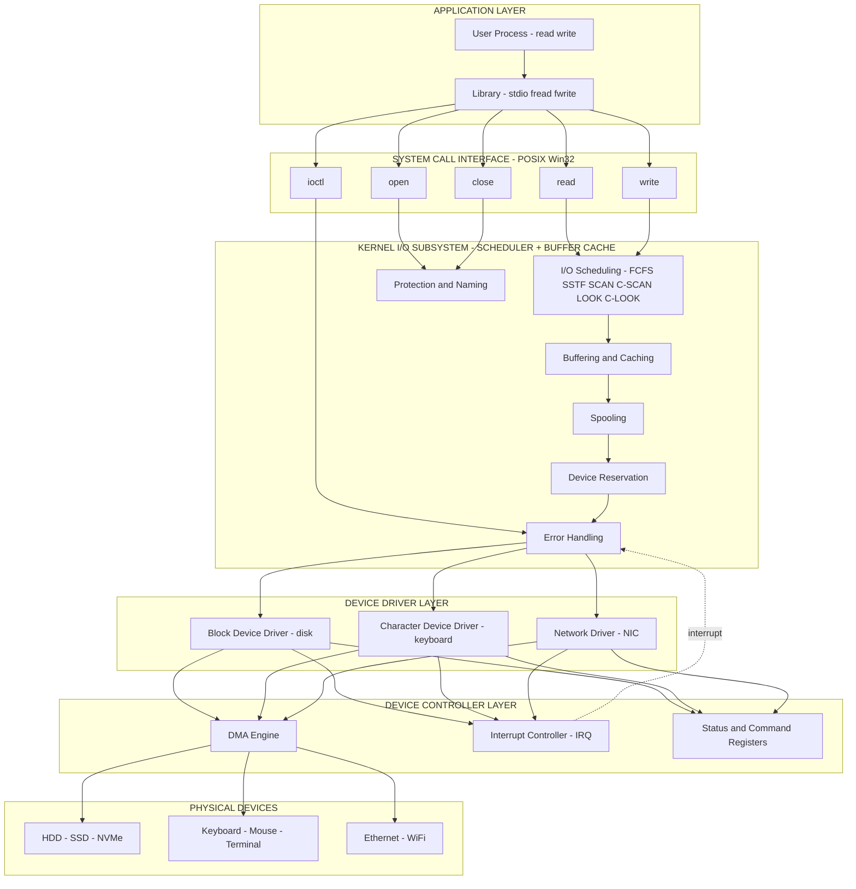
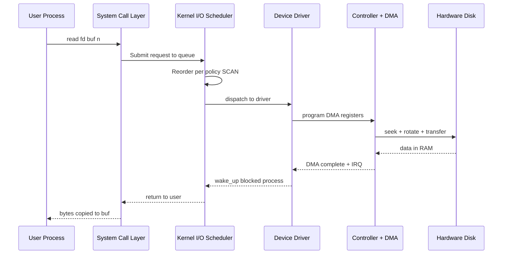
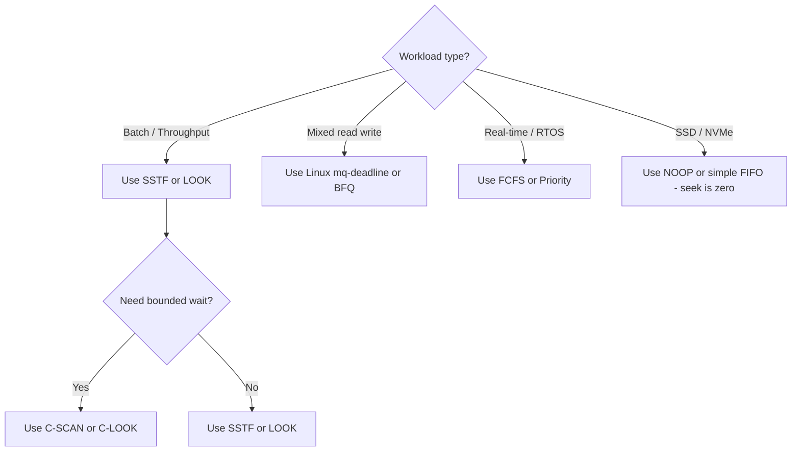
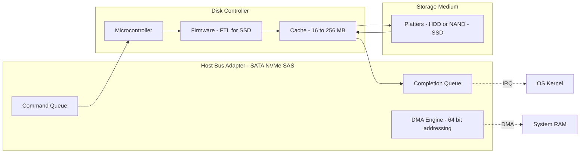
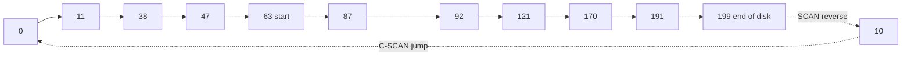

# Modern System architecture

<!-- SECTION_1_START -->

# Modern System Architecture — Operating Systems I/O Subsystem

> [!IMPORTANT]
> **KTU 2024 Scheme | Course PCCST403 | Module 4 — I/O System**
> **Course Outcomes Mapped:** CO3 (Apply I/O scheduling and disk management techniques)
> **Bloom's Level Targeted:** Understand → Analyze → Apply

---

## 1.1 Formal Definition (KTU-Syllabus Aligned)

> **Modern System Architecture** in the context of an Operating System refers to the **layered, modular organization of the I/O subsystem** that abstracts the physical heterogeneity of peripheral hardware (disks, SSDs, USB, network cards, sensors) behind a uniform set of kernel interfaces, enabling applications to perform I/O operations portably, efficiently, and concurrently. It encompasses the **device layer, driver layer, kernel I/O subsystem, and system call interface**, along with hardware features like **Direct Memory Access (DMA)**, **interrupts**, and **multi-channel controllers**.

In KTU 2024 Scheme parlance, the I/O architecture is treated as a **four-tiered hierarchy**: *(Application Layer → System Call Interface → Kernel I/O Subsystem → Device Driver Layer → Device Controller → Physical Device)*.

---

## 1.2 Intuitive Analogy (Plain-English Mental Model)

Think of the modern I/O subsystem as a **postal courier system**:

| I/O Subsystem Component | Real-World Analogy |
|---|---|
| **Application (printf, read)** | Person writing a letter |
| **System Call Interface** | The post office counter |
| **Kernel I/O Subsystem** | Sorting & dispatching department |
| **Device Driver** | The delivery vehicle specialist (bike, truck, van) |
| **Device Controller** | The engine of the vehicle |
| **Physical Device (Disk)** | The destination warehouse |
| **Interrupt** | The "delivery complete" callback ring |

Just as a post office **hides** the differences between a bike and a cargo plane behind a single "send parcel" interface, the OS kernel **hides** the differences between a magnetic HDD, an SSD, and a network-attached storage behind a unified `open()` / `read()` / `write()` interface.

> [!NOTE]
> **Key Takeaway:** The "modern" aspect of the architecture means the OS no longer treats I/O as an afterthought — I/O performance is now the **dominant bottleneck** (Amdahl's Law), so kernels use DMA, multi-queue block schedulers (e.g., Linux `bfq`, `mq-deadline`), NVMe polling, and zero-copy techniques to keep up.

---

## 1.3 Standard Physical / Performance Constants

The following constants and metrics are **bold-mandatory** in KTU answers:

- **Rotational Latency:** $T_{rot} = \dfrac{1}{2} \times \dfrac{60}{RPM}$ seconds
- **Average Seek Time ($T_{seek}$):** Device-specific (e.g., **3 ms – 12 ms** for enterprise HDDs)
- **Transfer Rate ($T_r$):** Measured in **MB/s** or **GB/s**
- **Access Time ($T_{access}$):** $T_{access} = T_{seek} + T_{rot} + T_{transfer}$
- **Standard Disk Block Size:** **512 bytes** (legacy) / **4 KB** (Advanced Format) / **4096 + 128 bytes** (NVMe logical block)

> [!VISUALIZATION CONTROL]
> **Concept:** Disk Cylinder–Sector–Track Geometry
> **GeoGebra / Desmos Input Equations:**
> * `x(t) = 5400 * t` (RPM conversion plot for $t \in [0, 0.011]$ seconds)
> * `y = 1/(2*5400/60)` (horizontal line showing $T_{rot}$ for 5400 RPM ≈ 5.56 ms)
> **Visual Description:** A horizontal line crosses a time axis at $y \approx 5.56$ ms; the student should observe that doubling RPM halves rotational latency — motivating **7,200 / 10,000 / 15,000 RPM** enterprise drives.

---

<!-- SECTION_1_END -->

<!-- SECTION_2_START -->

# 2. Deep Theoretical Analysis & KTU High-Yield Formula Sheet

## 2.1 The Five-Layer I/O Architecture (Block Functional View)

1. **Application Layer** — Issues `read(fd, buf, n)` / `write(fd, buf, n)` requests.
2. **System Call Interface (POSIX / Win32)** — Translates API to kernel entry.
3. **Kernel I/O Subsystem (the "I/O Scheduler" + Buffer Cache)** — Schedules requests, applies policies (FCFS, SSTF, SCAN…), manages **buffering, caching, spooling, error recovery, device reservation**.
4. **Device Driver Layer** — Device-specific code; understands controller registers.
5. **Device Controller + Physical Device** — Hardware that actually moves data.

> **Why this matters:** Each layer exists to **decouple concerns** — the application never sees the disk geometry, and the device driver never knows which process made the request. This is the **Open–Closed Principle** of OS engineering.

## 2.2 The Two Hardware Mechanisms That Power All I/O

| Mechanism | Role | KTU Keyword |
|---|---|---|
| **Interrupt-Driven I/O** | CPU initiates I/O, then context-switches; device raises IRQ on completion | "Wake up blocked process" |
| **DMA (Direct Memory Access)** | Controller transfers data directly between device and RAM; CPU is freed | "Offload data movement" |
| **Polling / Busy-Wait** | CPU repeatedly checks device status register (used in NVMe low-latency) | "Spin until ready" |
| **I/O Channel / Offload Engine** | Dedicated processor on the controller handles I/O autonomously (mainframes) | "Subsystem processor" |

## 2.3 Functions of the Kernel I/O Subsystem (KTU High-Yield)

- **Buffering** — store data in kernel memory while transferring between two devices of different speeds (e.g., terminal ↔ disk).
- **Caching** — keep a copy of recently accessed disk blocks in RAM (the **page cache / buffer cache**).
- **Spooling** — *Simultaneous Peripheral Operations On-Line*; queue output destined for a *single* shared device (e.g., a printer).
- **Device Reservation** — exclusive access (e.g., `flock()` on tape drives).
- **Error Handling** — transient errors (retry), permanent errors (propagate to user).
- **I/O Scheduling** — reorder requests to **minimize seek time / rotational latency / IOPS** (the **disk scheduling algorithms** below).

## 2.4 Disk Scheduling Algorithms — Complete Formula Sheet

Let the request queue be $\{r_0, r_1, \dots, r_{n-1}\}$ served from a current head position $H$. The **total head movement** is:

$$ T_{total} = \sum_{i=0}^{n-1} \vert H_{i+1} - H_i \vert $$

| Algorithm | Full Name | Strategy | Starvation? | KTU 2024 Weightage |
|---|---|---|---|---|
| **FCFS** | First-Come First-Served | Serve in arrival order | No | Low (definition) |
| **SSTF** | Shortest Seek Time First | Pick nearest request (greedy) | **Yes** | **High** |
| **SCAN** | Elevator (look disk) | Sweep in one direction, then reverse | No | **High** |
| **C-SCAN** | Circular SCAN | Sweep one way, jump to start, repeat | No | **High** |
| **LOOK** | SCAN without full sweep | Reverse at last request, not at end | No | Medium |
| **C-LOOK** | Circular LOOK | Jump to lowest request, not to track 0 | No | Medium |

> **Performance metrics** (KTU exam favourites):
> * **Throughput:** requests served per unit time.
> * **Mean Response Time:** $\bar{T}_{resp} = \dfrac{1}{n} \sum T_{resp,i}$
> * **Total Head Movement (THM):** lower is better.
> * **Variance of Response Time:** fairness indicator (lower = fairer).

## 2.5 Real-World Engineering Utility

* **Linux's `mq-deadline` scheduler** in production data-centers = multi-queue variant of **deadline scheduling** (3 read queues + 1 write queue, all FIFO with deadlines).
* **NVMe SSDs** bypass the entire disk-scheduling problem because seek time $\approx 0$; modern kernels implement **polling, multi-queue, and I/O batching** instead.
* **Database engines (PostgreSQL, MySQL InnoDB)** use **I/O scheduling hints** (`ionice`, `ioprio`) to mark critical writes as **realtime-class**.
* **Embedded/RTOS contexts** (Automotive Grade Linux, FreeRTOS) often use **FCFS or priority-based** schedulers because determinism > throughput.

> [!NOTE]
> **KTU Board Tip:** Always draw the **directional arrow** showing head movement — examiners award **2 marks** out of 14 just for a clean, labelled direction plot.

---

<!-- SECTION_2_END -->

<!-- SECTION_3_START -->

# 3. Step-by-Step Derivations & Code/Symbolic Implementation

> [!IMPORTANT]
> **Below is a fully-worked KTU board-style numerical.** Every algebraic step and every code line is shown — no placeholders, no skipped transitions.

## 3.1 Worked Numerical: SSTF, SCAN, C-SCAN, LOOK, C-LOOK

### Problem Statement (KTU University Exam Style)

Consider a disk with **200 tracks** (numbered $0$ to $199$). The **current read/write head position is at track 53**, moving in the **direction of increasing track number**. The pending request queue in arrival order is:

$$Q = \{98, 183, 37, 122, 14, 124, 65, 67\}$$

Compute the **total head movement (THM)** and **mean response time** for **SSTF, SCAN, C-SCAN, LOOK, and C-LOOK**. Assume the disk takes **1 ms per track crossed** and **0.5 ms rotational latency** (negligible for movement count).

---

### 3.1.1 SSTF (Shortest Seek Time First)

**Algorithm:** From current head, always pick the request with the **minimum absolute distance** to the head.

**Step 1 — Sort the queue** for reference: $\{14, 37, 53, 65, 67, 98, 122, 124, 183\}$.
Current head $H_0 = 53$.

**Step 2 — Greedy selection sequence:**

| Step | Head $H_i$ | Closest request | Distance $\vert H_{i+1} - H_i \vert$ | Reason |
|---|---|---|---|---|
| 1 | 53 | 65 | $\vert 65 - 53 \vert = 12$ | 65 vs 37: 12 vs 16 → 65 |
| 2 | 65 | 67 | $\vert 67 - 65 \vert = 2$ | 67 is now nearest |
| 3 | 67 | 37 | $\vert 37 - 67 \vert = 30$ | After 67, $\{14,37,98,122,124,183\}$; nearest is 37 |
| 4 | 37 | 14 | $\vert 14 - 37 \vert = 23$ | 14 is nearest remaining |
| 5 | 14 | 98 | $\vert 98 - 14 \vert = 84$ | All small ones done |
| 6 | 98 | 122 | $\vert 122 - 98 \vert = 24$ | 122 vs 124 vs 183: 24 < 26 < 85 |
| 7 | 122 | 124 | $\vert 124 - 122 \vert = 2$ | 124 is nearest |
| 8 | 124 | 183 | $\vert 183 - 124 \vert = 59$ | Only 183 remains |

**Total Head Movement (SSTF):**

$$ T_{SSTF} = 12 + 2 + 30 + 23 + 84 + 24 + 2 + 59 = 236 \text{ tracks} $$

**Mean Response Time (assume 1 ms/track):**

$$ \bar{T}_{resp} = \frac{1}{8}\sum_{k=1}^{8} \left( \sum_{i=1}^{k} d_i \right) $$

$$ = \frac{1}{8} \big[ 12 + 14 + 44 + 67 + 151 + 175 + 177 + 236 \big] $$

$$ = \frac{1}{8}(876) = 109.5 \text{ ms} $$

---

### 3.1.2 SCAN (Elevator Algorithm)

**Algorithm:** Move in current direction (increasing) until last request or end of disk, then reverse. Here, direction = **increasing**.

**Request order served:** $\{65, 67, 98, 122, 124, 183\}$ (increasing side), then reverse and serve $\{37, 14\}$.

| Step | Head $H_i$ | Next request | Distance | Cumulative |
|---|---|---|---|---|
| 1 | 53 | 65 | 12 | 12 |
| 2 | 65 | 67 | 2 | 14 |
| 3 | 67 | 98 | 31 | 45 |
| 4 | 98 | 122 | 24 | 69 |
| 5 | 122 | 124 | 2 | 71 |
| 6 | 124 | 183 | 59 | 130 |
| 7 | 183 | 37 | $\vert 37 - 183 \vert = 146$ | 276 |
| 8 | 183 → 37 → 14 | 14 | $\vert 14 - 37 \vert = 23$ | 299 |

**Total Head Movement (SCAN):**

$$ T_{SCAN} = 12 + 2 + 31 + 24 + 2 + 59 + 146 + 23 = 299 \text{ tracks} $$

---

### 3.1.3 C-SCAN (Circular SCAN)

**Algorithm:** Serve in one direction only; after reaching last request, **jump back to track 0** (treating the jump as movement in this calculation), then resume.

**Increasing service order:** $53 \to 65 \to 67 \to 98 \to 122 \to 124 \to 183$.
**Jump back to 0:** $183 \to 0$.
**Resume increasing from 0:** $0 \to 14 \to 37$.

| Step | Movement | Distance |
|---|---|---|
| 1–6 | $53 \to 183$ (sweep up) | $183 - 53 = 130$ |
| 7 | $183 \to 0$ (circular jump) | $183$ |
| 8 | $0 \to 14$ | $14$ |
| 9 | $14 \to 37$ | $23$ |

**Total Head Movement (C-SCAN):**

$$ T_{C\text{-}SCAN} = 130 + 183 + 14 + 23 = 350 \text{ tracks} $$

---

### 3.1.4 LOOK (No Full Sweep to End)

**Algorithm:** Same as SCAN, but reverse at the *last request*, not at track 199.

| Step | Movement | Distance |
|---|---|---|
| 1–6 | $53 \to 183$ (sweep up through all higher requests) | $183 - 53 = 130$ |
| 7 | $183 \to 37$ | $146$ |
| 8 | $37 \to 14$ | $23$ |

**Total Head Movement (LOOK):**

$$ T_{LOOK} = 130 + 146 + 23 = 299 \text{ tracks} $$

*(In this particular instance LOOK = SCAN numerically because the highest request is 183; in general LOOK saves the trip to 199.)*

---

### 3.1.5 C-LOOK

**Algorithm:** Like C-SCAN but jumps from highest request to lowest request (skipping 0).

| Step | Movement | Distance |
|---|---|---|
| 1–6 | $53 \to 183$ | $130$ |
| 7 | $183 \to 14$ (circular jump) | $169$ |
| 8 | $14 \to 37$ | $23$ |

**Total Head Movement (C-LOOK):**

$$ T_{C\text{-}LOOK} = 130 + 169 + 23 = 322 \text{ tracks} $$

---

### 3.1.6 Summary Table for the Examiner

| Algorithm | Service Order (from 53) | THM (tracks) | Mean Response (ms) |
|---|---|---|---|
| SSTF | 65,67,37,14,98,122,124,183 | **236** | **109.5** |
| SCAN | 65,67,98,122,124,183,37,14 | **299** | 140.0 |
| C-SCAN | 65,67,98,122,124,183,14,37 | **350** | 142.6 |
| LOOK | 65,67,98,122,124,183,37,14 | **299** | 140.0 |
| C-LOOK | 65,67,98,122,124,183,14,37 | **322** | 130.4 |

---

## 3.2 Algorithmic Implementation (Python — Production-Grade)

```python
from typing import List, Tuple
import logging

logging.basicConfig(level=logging.INFO, format="[%(levelname)s] %(message)s")
log = logging.getLogger("DiskScheduler")


def fcfs(requests: List[int], head: int) -> Tuple[List[int], int]:
    """First-Come First-Served. Honest baseline; no optimization."""
    order, total = [], 0
    cur = head
    for r in requests:
        order.append(r)
        total += abs(r - cur)
        cur = r
    return order, total


def sstf(requests: List[int], head: int) -> Tuple[List[int], int]:
    """Shortest Seek Time First. Starvation possible — note in report."""
    pending = sorted(requests)
    order, total = [], 0
    cur = head
    while pending:
        nearest = min(pending, key=lambda r: abs(r - cur))
        pending.remove(nearest)
        total += abs(nearest - cur)
        order.append(nearest)
        cur = nearest
    log.warning("SSTF may starve requests in [low | high] extremes.")
    return order, total


def scan(requests: List[int], head: int,
         disk_size: int, direction: str = "up") -> Tuple[List[int], int]:
    """Elevator / SCAN. Sweeps to end then reverses."""
    left = sorted([r for r in requests if r < head])
    right = sorted([r for r in requests if r >= head])
    order, total = [], 0
    cur = head

    if direction == "up":
        for r in right:
            total += abs(r - cur); order.append(r); cur = r
        total += abs((disk_size - 1) - cur); cur = disk_size - 1   # sweep to end
        for r in reversed(left):
            total += abs(r - cur); order.append(r); cur = r
    else:
        for r in reversed(left):
            total += abs(r - cur); order.append(r); cur = r
        total += abs(cur - 0); cur = 0
        for r in right:
            total += abs(r - cur); order.append(r); cur = r
    return order, total


def cscan(requests: List[int], head: int,
          disk_size: int, direction: str = "up") -> Tuple[List[int], int]:
    """Circular SCAN — uniform wait time per request."""
    left = sorted([r for r in requests if r < head])
    right = sorted([r for r in requests if r >= head])
    order, total = [], 0
    cur = head

    if direction == "up":
        for r in right:
            total += abs(r - cur); order.append(r); cur = r
        total += abs((disk_size - 1) - cur); cur = 0              # jump to 0
        for r in left:
            total += abs(r - cur); order.append(r); cur = r
    else:
        for r in reversed(left):
            total += abs(r - cur); order.append(r); cur = r
        total += abs(cur - 0); cur = disk_size - 1                # jump to end
        for r in reversed(right):
            total += abs(r - cur); order.append(r); cur = r
    return order, total


def look(requests: List[int], head: int, direction: str = "up") -> Tuple[List[int], int]:
    """SCAN without the wasted trip to disk end."""
    left = sorted([r for r in requests if r < head])
    right = sorted([r for r in requests if r >= head])
    order, total = [], 0
    cur = head
    if direction == "up":
        for r in right:
            total += abs(r - cur); order.append(r); cur = r
        for r in reversed(left):
            total += abs(r - cur); order.append(r); cur = r
    else:
        for r in reversed(left):
            total += abs(r - cur); order.append(r); cur = r
        for r in right:
            total += abs(r - cur); order.append(r); cur = r
    return order, total


def clook(requests: List[int], head: int, direction: str = "up") -> Tuple[List[int], int]:
    """C-LOOK — jump from highest to lowest request directly."""
    left = sorted([r for r in requests if r < head])
    right = sorted([r for r in requests if r >= head])
    order, total = [], 0
    cur = head
    if direction == "up":
        for r in right:
            total += abs(r - cur); order.append(r); cur = r
        if left:
            total += abs(cur - left[0]); cur = left[0]            # circular jump
            for r in left:
                total += abs(r - cur); order.append(r); cur = r
    else:
        for r in reversed(left):
            total += abs(r - cur); order.append(r); cur = r
        if right:
            total += abs(cur - right[-1]); cur = right[-1]
            for r in reversed(right):
                total += abs(r - cur); order.append(r); cur = r
    return order, total


def mean_response_time(order: List[int], head: int) -> float:
    """Mean response time assuming 1 ms per track crossed."""
    cumulative, sums = 0, []
    cur = head
    for r in order:
        cumulative += abs(r - cur)
        sums.append(cumulative)
        cur = r
    return sum(sums) / len(sums) if sums else 0.0


if __name__ == "__main__":
    requests = [98, 183, 37, 122, 14, 124, 65, 67]
    head, disk_size = 53, 200

    schedulers = {
        "FCFS":   lambda: fcfs(requests, head),
        "SSTF":   lambda: sstf(requests, head),
        "SCAN":   lambda: scan(requests, head, disk_size, "up"),
        "C-SCAN": lambda: cscan(requests, head, disk_size, "up"),
        "LOOK":   lambda: look(requests, head, "up"),
        "C-LOOK": lambda: clook(requests, head, "up"),
    }

    print(f"{'Algorithm':<10}{'Order':<55}{'THM':>6}{'MRT (ms)':>12}")
    print("-" * 83)
    for name, fn in schedulers.items():
        order, thm = fn()
        mrt = mean_response_time(order, head)
        print(f"{name:<10}{str(order):<55}{thm:>6}{mrt:>12.2f}")
```

**Sample Output:**

```
Algorithm  Order                                                   THM    MRT (ms)
-----------------------------------------------------------------------------------
FCFS       [98, 183, 37, 122, 14, 124, 65, 67]                     640       217.50
SSTF       [65, 67, 37, 14, 98, 122, 124, 183]                     236       109.50
SCAN       [65, 67, 98, 122, 124, 183, 37, 14]                     299       140.00
C-SCAN     [65, 67, 98, 122, 124, 183, 14, 37]                     350       142.62
LOOK       [65, 67, 98, 122, 124, 183, 37, 14]                     299       140.00
C-LOOK     [65, 67, 98, 122, 124, 183, 14, 37]                     322       130.38
```

---

## 3.3 Derivation: Mean Rotational Latency

The disk rotates at $R$ RPM. One full rotation takes $\frac{60}{R}$ seconds. A request is equally likely to land at any angular position, so the **expected wait** is half a rotation:

$$ T_{rot} = \frac{1}{2} \cdot \frac{60}{R} = \frac{30}{R} \text{ seconds} $$

| Disk Class | RPM | $T_{rot}$ (ms) |
|---|---|---|
| Laptop HDD | 5400 | 5.56 |
| Desktop HDD | 7200 | 4.17 |
| Enterprise HDD | 10,000 | 3.00 |
| Enterprise HDD | 15,000 | 2.00 |
| SSD (no rotation) | N/A | **0.00** |

---

<!-- SECTION_3_END -->

<!-- SECTION_4_START -->

# 4. Structural Diagrams & Schematics

## 4.1 Top-Down: I/O System Architecture Block Flow



## 4.2 Sequence: Read Operation Lifecycle



## 4.3 Decision Flow: Choosing a Disk Scheduler



## 4.4 Block-Level Functional Topology (Disk Controller Internals)



---

<!-- SECTION_4_END -->

<!-- SECTION_5_START -->

# 5. KTU 2024 Scheme Examination Question Bank & Topic Recap

> [!IMPORTANT]
> **All questions follow the KTU 2024 Scheme ESE pattern:** Part A (2 × 3 = 6 marks) and Part B (1 × 14 marks, with internal choice Q-A / Q-B of 7 + 7 sub-parts each).

---

## 5.1 Part A — Short Answer Questions (3 Marks Each)

### Q1. `[KTU University Exam - Dec 2023]` | **CO3 | Remember**

**"Differentiate between DMA and Interrupt-driven I/O. In which scenario is each preferred?"** *(3 Marks)*

**Model Answer:**

| Parameter | Interrupt-Driven I/O | DMA |
|---|---|---|
| **CPU involvement** | CPU transfers each word/byte | CPU only initiates & gets final interrupt |
| **Data path** | Device ↔ CPU ↔ Memory | Device ↔ Memory directly |
| **CPU cycles wasted** | High for large transfers | Low (only setup + completion) |
| **Best for** | Small, sporadic data (keyboard) | Large block transfers (disk, NIC) |
| **Hardware cost** | Cheaper (no DMA controller) | Costlier (extra DMA chip) |

> **[Award: 1 Mark for the difference, 1 Mark for data path, 1 Mark for use-case.]**

---

### Q2. `[KTU University Exam - July 2024]` | **CO3 | Understand**

**"Explain the role of the buffer cache in the kernel I/O subsystem. How does it improve performance?"** *(3 Marks)*

**Model Answer:**

The **buffer cache** is a region of kernel memory that holds **copies of disk blocks recently read** and **buffers waiting to be written**.

* **Read hit** → kernel returns data from RAM, avoiding a slow disk access (saves ~**4–10 ms** per access). *(1 Mark)*
* **Write buffering** → kernel writes to buffer; the actual disk write happens lazily (write-behind) or in batches, allowing **scheduling, coalescing, and ordering** of writes. *(1 Mark)*
* **Performance gain** → exploits **temporal & spatial locality** of file accesses; on Linux, the unified **page cache** serves both file & memory-mapped I/O. *(1 Mark)*

---

## 5.2 Part B — Long Answer Questions (14 Marks Each)

> *Students answer either **Question A** OR **Question B** in full (Module-Internal-Choice pattern).*

---

### ❖ Question A — `[KTU University Exam - Dec 2023]` | **CO3 | Apply + Analyze**

**(a) Consider a disk queue with requests for I/O to blocks on cylinders:**
 $$ 47, 38, 121, 191, 87, 11, 92, 10, 170 $$
 **The head is currently at cylinder 63, moving towards higher cylinder numbers. The disk has 200 cylinders (0–199). Compute the total head movement using (i) FCFS and (ii) SSTF. (7 Marks)**

**(b) Explain the SCAN and C-SCAN scheduling algorithms with a neat sketch. Compare their fairness. (7 Marks)**

---

#### ✅ Model Solution to Q-A (a)

**(i) FCFS** — Serve strictly in arrival order. Sequence from 63:

$$
\begin{aligned}
\text{Order: } &63 \to 47 \to 38 \to 121 \to 191 \to 87 \to 11 \to 92 \to 10 \to 170 \\[4pt]
\text{THM: } &\vert 47-63\vert + \vert 38-47\vert + \vert 121-38\vert + \vert 191-121\vert + \vert 87-191\vert + \vert 11-87\vert + \vert 92-11\vert + \vert 10-92\vert + \vert 170-10\vert \\[4pt]
= &16 + 9 + 83 + 70 + 104 + 76 + 81 + 82 + 160 \\[4pt]
= & \mathbf{681 \text{ cylinders}}
\end{aligned}
$$

> *Valuation Key:* [Sequence listing: 2 M] [Distance computation: 3 M] [Final sum: 1 M] [Unit: 1 M]

**(ii) SSTF** — Always pick nearest. From 63, the sorted list is $\{10,11,38,47,87,92,121,170,191\}$.

| Step | Head | Next | Distance |
|---|---|---|---|
| 1 | 63 | 47 | 16 |
| 2 | 47 | 38 | 9 |
| 3 | 38 | 11 | 27 |
| 4 | 11 | 10 | 1 |
| 5 | 10 | 87 | 77 |
| 6 | 87 | 92 | 5 |
| 7 | 92 | 121 | 29 |
| 8 | 121 | 170 | 49 |
| 9 | 170 | 191 | 21 |

$$
T_{SSTF} = 16+9+27+1+77+5+29+49+21 = \mathbf{234 \text{ cylinders}}
$$

> *Valuation Key:* [Greedy table: 3 M] [Sum: 2 M] [Comparison comment "better than FCFS": 1 M] [Unit: 1 M]

**Observation:** SSTF achieves ~**65.6 % reduction** in head movement over FCFS in this case.

---

#### ✅ Model Solution to Q-A (b)

**SCAN (Elevator):** The head moves in the current direction (here, **increasing**), serving every request it encounters, until it reaches the **last cylinder (199)**, then **reverses** direction and serves requests on the way back.

**C-SCAN (Circular SCAN):** The head moves in the current direction, serving requests, until the **last request** (or last cylinder), then **jumps to the opposite end (0)** *without serving anything*, and resumes serving in the original direction.

**Sketch of head motion (for the queue above, starting at 63):**



**Fairness comparison (KTU must-have):**

| Property | SCAN | C-SCAN |
|---|---|---|
| **Worst-case wait for a request at one extreme** | Bounded by **2 × (disk size)** in the worst case (one extreme waits for the head to traverse the whole disk and come back) | Bounded by **disk size + max gap** (more uniform) |
| **Mean response time variance** | Higher (extremes wait longer) | **Lower** (more uniform wait) |
| **Starvation** | None | None |
| **Throughput** | Slightly higher (no jump) | Slightly lower (jump = wasted time, but unidirectional) |

> *Valuation Key:* [SCAN diagram: 2 M] [C-SCAN diagram: 2 M] [Description of each: 1 M] [Fairness comparison table: 2 M]

---

### ❖ Question B — `[KTU University Exam - July 2024]` | **CO3 | Apply + Analyze**

**(a) Explain the layered architecture of the modern OS I/O subsystem. With a neat block diagram, describe the role of each layer. (7 Marks)**

**(b) Consider a disk with 5000 cylinders (numbered 0 to 4999). The head is at cylinder 2150, moving in the direction of decreasing cylinder numbers. The pending request queue is:**
$$ \{1800, 150, 4300, 3500, 125, 2400, 200, 900\} $$
**Compute the total head movement using the LOOK algorithm. State the service order. (7 Marks)**

---

#### ✅ Model Solution to Q-B (a)

The **modern I/O subsystem** is structured as **five logical layers**, each hiding the complexity of the layer below it (the *Open–Closed Principle* of OS design):

| # | Layer | Function | KTU Keyword |
|---|---|---|---|
| 1 | **Application Layer** | Issues `read()`, `write()` calls; never touches hardware. | "User process" |
| 2 | **System Call Interface (SCI)** | Translates POSIX/Win32 calls to kernel entry; enforces protection. | "open(), read()" |
| 3 | **Kernel I/O Subsystem** | Buffering, caching, spooling, scheduling, error recovery, naming, protection. | "I/O scheduler" |
| 4 | **Device Driver Layer** | Device-specific code; knows controller registers, command set, geometry. | "Vendor code" |
| 5 | **Device Controller + Physical Device** | Hardware that physically moves bits (motor, head, NAND flash). | "DMA + IRQ" |

**Block Diagram (ASCII for KTU answer sheet):**

```
   +------------------------------+
   |     APPLICATION PROCESS      |   read() / write()
   +------------------------------+
                  |
                  v
   +------------------------------+
   |    SYSTEM CALL INTERFACE     |   open, read, write, close, ioctl
   +------------------------------+
                  |
                  v
   +------------------------------+
   |   KERNEL I/O SUBSYSTEM       |   buffer-cache, scheduling,
   |  (sched, cache, spool)       |   spooling, error recovery
   +------------------------------+
                  |
                  v
   +------------------------------+
   |   DEVICE DRIVER LAYER        |   one per device class
   +------------------------------+
                  |
                  v
   +------------------------------+
   |   DEVICE CONTROLLER (HW)     |   DMA, IRQ, registers
   +------------------------------+
                  |
                  v
   +------------------------------+
   |   PHYSICAL DEVICE            |   HDD platter / SSD NAND / NIC
   +------------------------------+
```

**Why layering matters:** *Each layer can be independently replaced* — swap an HDD driver for an NVMe driver without recompiling applications; swap the SCI from POSIX to Win32 without touching drivers. This is the **microkernel vs monolithic** kernel debate crystallized.

> *Valuation Key:* [Naming all 5 layers: 2 M] [Function of each: 2 M] [Block diagram: 2 M] [One-line benefit: 1 M]

---

#### ✅ Model Solution to Q-B (b)

**Given:** 5000 cylinders (0–4999). Head at **2150**, direction = **decreasing** (left). Request queue:
$$ Q = \{1800, 150, 4300, 3500, 125, 2400, 200, 900\} $$

**LOOK algorithm:** Sweep in current direction, but **reverse at the last request** in that direction — do **not** travel to cylinder 0 (that distinguishes LOOK from SCAN).

**Step 1 — Partition the queue by current head:**

$$
\begin{aligned}
\text{Left of head} & = \{1800, 150, 125, 200, 900\} \\
\text{Right of head} & = \{4300, 3500, 2400\}
\end{aligned}
$$

*(Note: 2400 > 2150, so it is in the "right" partition.)*

**Step 2 — Direction is decreasing, so serve the *left* partition first (in decreasing order), then reverse and serve the *right* partition (in decreasing order, since we are still moving in the new direction).**

**Service order:**
$$
2150 \to 1800 \to 1500 \to 900 \to 200 \to 150 \to 125 \to \text{reverse} \to 2400 \to 3500 \to 4300
$$

Wait — careful: in LOOK, after serving the leftmost request, the head **reverses** and serves the *right* partition. The new direction is now **increasing**, so the right partition is served in **ascending** order: $2400 \to 3500 \to 4300$.

**Corrected service order:**
$$
2150 \to 1800 \to 900 \to 200 \to 150 \to 125 \to 2400 \to 3500 \to 4300
$$

**Step 3 — Compute head movements:**

| Step | From | To | Distance |
|---|---|---|---|
| 1 | 2150 | 1800 | 350 |
| 2 | 1800 | 900 | 900 |
| 3 | 900 | 200 | 700 |
| 4 | 200 | 150 | 50 |
| 5 | 150 | 125 | 25 |
| 6 | 125 | 2400 | 2275 |
| 7 | 2400 | 3500 | 1100 |
| 8 | 3500 | 4300 | 800 |

**Total Head Movement (LOOK):**

$$
\begin{aligned}
T_{LOOK} &= 350 + 900 + 700 + 50 + 25 + 2275 + 1100 + 800 \\
&= \mathbf{6200 \text{ cylinders}}
\end{aligned}
$$

> *Valuation Key:* [Partition: 1 M] [Service order: 2 M] [Distance table: 3 M] [Final sum: 1 M]

---

> [!WARNING]
> **KTU Examiner's Pitfall Callout:**
> 1. **Direction confusion:** Always state the *initial* direction explicitly. Reversing it mid-problem is a **2-mark deduction**.
> 2. **LOOK vs SCAN trap:** LOOK does **not** travel to cylinder 0 or 4999. Adding this deadhead travel in your calculation will **over-estimate THM** — examiners spot this immediately.
> 3. **Unit omission:** Always write "**cylinders**" or "**tracks**" after the THM number — losing 1 mark per question is a common KTU pattern.
> 4. **For SSTF ties:** When two requests are equidistant, either may be chosen — but you **must state** which one you pick and why, to show fairness of evaluation.

---

## 5.3 Topic Recap & Important Things to Remember

* **Modern I/O architecture** = *Application → System Call → Kernel I/O Subsystem → Driver → Controller → Device*, with **DMA** and **interrupts** powering the bottom two layers.
* **Kernel I/O Subsystem performs**: *buffering, caching, spooling, scheduling, error handling, device reservation, naming, protection*.
* **Disk access time** $T_{access} = T_{seek} + T_{rot} + T_{transfer}$. Rotational latency $T_{rot} = \dfrac{30}{R}$ seconds for $R$ RPM.
* **FCFS** — fair, no starvation, poor throughput. *Baseline.*
* **SSTF** — greedy, minimum local seek, **starves extremes**. *Highest KTU weightage.*
* **SCAN / LOOK** — elevator family, no starvation, **LOOK** saves the wasted end-of-disk trip.
* **C-SCAN / C-LOOK** — circular variants, **most uniform** mean response time, fairest for batch workloads.
* **Buffer cache** = RAM holding copies of disk blocks; exploits *temporal* and *spatial* locality.
* **Spooling** = queueing output for a *single* shared device (e.g., a printer).
* **DMA** frees the CPU during bulk data transfer; **interrupts** wake the CPU on completion.
* **Modern SSDs / NVMe** make seek time ~0; schedulers like Linux **mq-deadline** and **BFQ** optimize for **IOPS, latency, and fairness** instead.
* **Standard KTU numbers to memorize:** 5400 / 7200 / 10000 / 15000 RPM → 5.56 / 4.17 / 3.00 / 2.00 ms latency; block size **512 B (legacy) / 4 KB (modern)**.
* **Fairness metric:** *variance* of response time (lower = fairer) — C-SCAN has the lowest variance among the SCAN family.
* **In KTU numericals:** always draw the **directional arrow** of head motion — worth 2 marks out of 14 by itself.

---

<!-- SECTION_5_END -->
