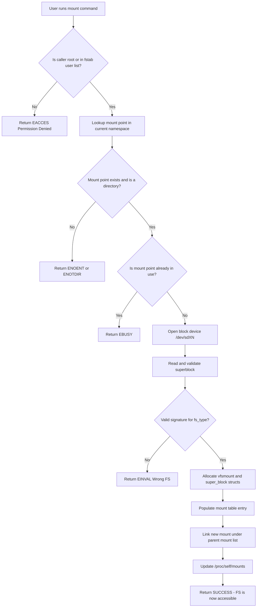
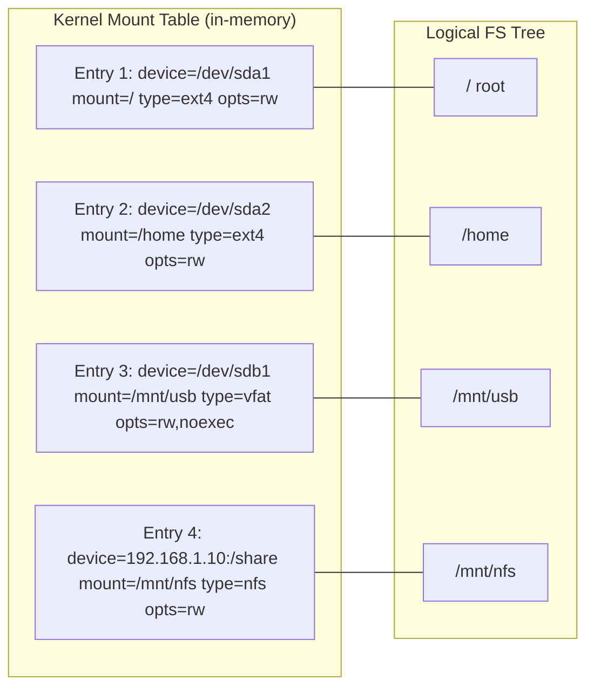
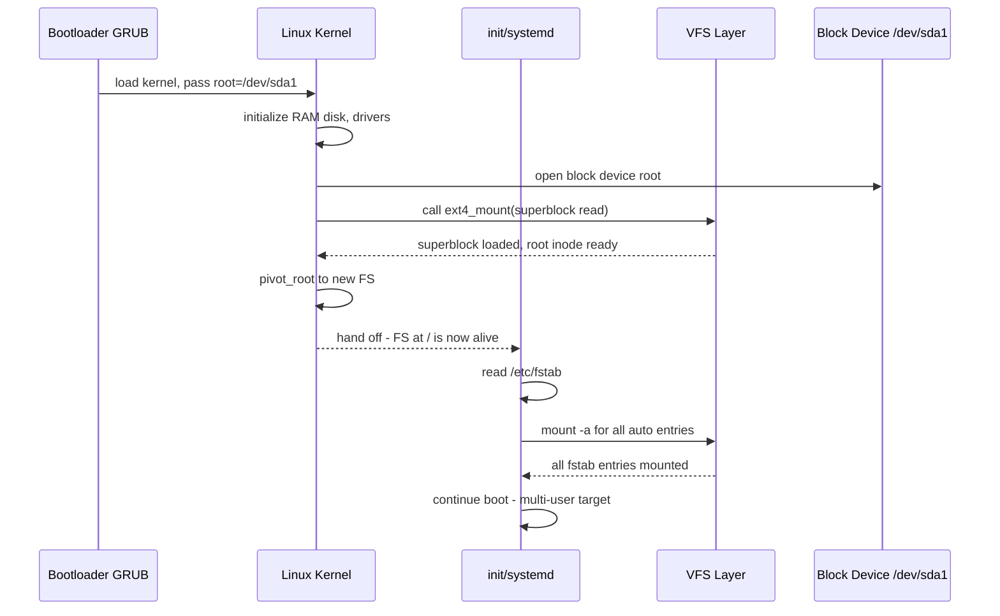
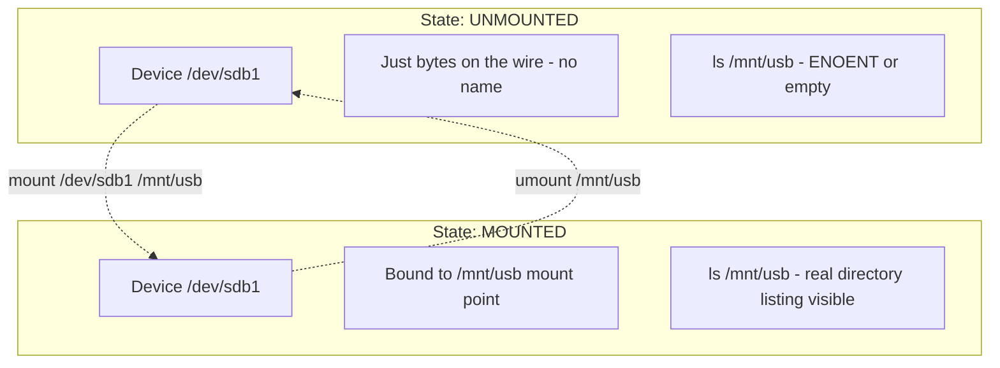

# Mounting a file system

<!-- SECTION_1_START -->

# Mounting a File System

## 1.1 Formal Academic Definition (KTU 2024 Syllabus)

> [!IMPORTANT]
> **Mounting** is the operating system procedure by which the file system on a storage device (or partition) is made accessible to the user program's logical file system tree at a specified **mount point**. Formally, it is the act of grafting a separately formatted logical volume or device onto a single hierarchical namespace rooted at `/` (root).

In the **KTU 2024 Scheme (PCCST403 – Operating Systems, Module 4: I/O Systems & File Organization)**, mounting is treated as the bridge between **physical storage** (raw disk blocks) and the **logical file system interface** presented to applications. Before mounting, the contents of a device are just an unstructured collection of inodes, data blocks, and free lists; after mounting, those contents are reachable as ordinary files and directories.

## 1.2 Conceptual Analogy — The Office Filing Cabinet

> [!NOTE]
> **Analogy: Plugging a cabinet drawer into the office bookshelf**

Imagine a large office where every employee shares one giant **bookshelf** (this is the root directory `/`). Each **drawer** in the office is a separate filing cabinet that holds its own internal organization: the tabs are ordered alphabetically in the drawer, the folder colors follow a private scheme, and the drawer has its own index card (a *file system structure* like `ext4`, `NTFS`, `FAT32`).

- **A drawer sitting on the floor** is useless — the bookshelf has no slot for it. A worker cannot reach the files.
- **Mounting** is the act of physically sliding that drawer into a labeled **empty slot** of the bookshelf (e.g., the empty slot labeled `/home`, `/mnt/usb`, or `/media/sdb1`). The drawer is now reachable.
- The **mount point** is the empty slot itself — the directory that existed but was empty, which is now used as the *attachment root* of the new drawer.
- The **mount table** is the office manager's notebook that records: *Slot B-7 → Cabinet #5 (labeled "Personal Records")* so the system can route a request for `/home/alice/report.txt` to the right drawer.

This is exactly how Linux/UNIX works. The kernel maintains a **mount table** mapping device identifiers to mount points, and the VFS (Virtual File System Switch) consults this table on every path traversal.

## 1.3 Key Terminology (Verbatim KTU Board Words)

> [!IMPORTANT]
> - **Mount Point**: A pre-existing empty directory at which a file system is attached. Standard KTU answer line: *"The mount point is the directory in the existing file system under which the new file system is to be mounted."*
> - **Mount Table**: A kernel-resident data structure that records all currently mounted file systems, their devices, types, and mount points.
> - **Root File System**: The file system that is mounted at the root `/` during boot by the kernel — every other mount is logically a branch grafted onto it.
> - **Unmounting (Umount)**: The reverse operation — detaching a file system from its mount point and flushing all cached buffers to disk.
> - **VFS (Virtual File System Layer)**: The abstract interface in the kernel that allows multiple, heterogeneous file systems to coexist behind a single system-call interface (`open`, `read`, `write`).

## 1.4 GeoGebra / Desmos Visualization Callout

> [!VISUALIZATION CONTROL]
> **Concept:** Logical file-system tree before vs. after mounting a USB device.
>
> **Graphing Input (conceptual tree, draw on paper or use a tree-drawing tool):**
>
> - Tree before mount: root `/` → { `usr`, `home`, `etc`, `mnt` (empty) }
> - Tree after mount of `/dev/sdb1` at `/mnt/usb`: root `/` → { `usr`, `home`, `etc`, `mnt` → `usb` → { `photos`, `report.pdf`, `notes.txt` } }
>
> **Visual Description:** The student should observe that the **previously empty** `/mnt` directory now serves as the *attachment root* of a wholly separate device, and that the contents of `/dev/sdb1` (its own inode table and data blocks) are now addressable as ordinary descendants of `/`.

<!-- SECTION_1_END -->

<!-- SECTION_2_START -->

# 2. Deep Theoretical Analysis & KTU High-Yield Formula Sheet

## 2.1 Why Mounting Exists — The Engineering "Why"

A freshly formatted disk partition is just a sea of numbered blocks. To use it, the OS must:

1. **Identify the on-disk format** (ext4, NTFS, FAT32, XFS, NFS, etc.) — i.e., parse the superblock.
2. **Allocate kernel resources** — an in-memory `superblock` structure, a `vfsmount` structure, and a cache for the device.
3. **Bind** that device's root directory to an existing directory of the running file system.

Without mounting, every program would have to talk directly to a device node (e.g., `/dev/sda1`) using raw byte offsets — destroying the elegant *one unified tree* abstraction that UNIX pioneered.

## 2.2 The Mount Operation — Step-by-Step Logic

The `mount` system call (and its `mount(8)` wrapper) executes the following logical procedure:

1. **Validate the mount point** — It must be an existing directory and not currently in use as a mount point of a busy file system.
2. **Identify the device or remote export** — e.g., `/dev/sdb1` for a local block device, or `server:/export` for an NFS share.
3. **Read the superblock** of the target device to confirm the file-system type.
4. **Allocate kernel data structures**: `struct super_block`, `struct vfsmount`, `struct inode` for the root of the new FS.
5. **Update the mount table** (in older UNIX: `/etc/mtab`; in modern Linux: a kernel namespace structure mirrored in `/proc/self/mounts`).
6. **Return success** — the new sub-tree is now reachable at the mount point.

> [!NOTE]
> **The `mount` command in Linux** is a privileged operation. Non-root users can only mount devices listed in `/etc/fstab` with the `user` option, or use `udisks2` / `gvfs` abstractions.

## 2.3 Types of Mounting (High-Yield KTU Classification)

| **Type** | **Description** | **Example** |
|---|---|---|
| **Root Mount (Boot Mount)** | Mounting the file system at `/` during kernel bootstrap. | `mount -t ext4 /dev/sda1 /` |
| **Manual Mount** | Performed by the administrator using the `mount` command. | `mount /dev/sdb1 /mnt/usb` |
| **Automatic Mount (at boot)** | Read from `/etc/fstab` entries marked with the `auto` option. | `mount -a` |
| **NFS / Network Mount** | Mounting a remote file system exported via the Network File System protocol. | `mount -t nfs 192.168.1.10:/home /mnt/nfs` |
| **Pseudo-File-System Mount** | Mounting a virtual FS that has no on-disk device (e.g., `proc`, `sysfs`, `tmpfs`). | `mount -t proc none /proc` |
| **Bind Mount** | Re-attaching an already-visible file or directory at a second location. | `mount --bind /home /mnt/home` |
| **Loop Mount (ISO)** | Mounting a regular file as if it were a block device. | `mount -o loop ubuntu.iso /mnt/iso` |

## 2.4 The Mount Table — The Kernel's "Office Manager's Notebook"

The mount table entry (in classic UNIX textbook notation) contains these fields — this is **the most asked KTU 14-mark tabulation**:

| **Field** | **Meaning** | **Example Value** |
|---|---|---|
| **Device ID** | The block device or remote export being mounted. | `/dev/sdb1` or `nfs-server:/export` |
| **Mount Point** | The directory in the running FS tree at which the device is grafted. | `/mnt/usb` |
| **File-System Type** | The on-disk or network format. | `ext4`, `ntfs`, `nfs`, `vfat` |
| **Mount Options** | Read/write permissions, sync/async, no-exec, etc. | `rw, noexec, nosuid` |
| **Dump Frequency** | Legacy backup flag (`0` or `1`). | `0` |
| **fsck Order** | Order in which `fsck` checks the FS at boot (`0`, `1`, `2`). | `2` |

> [!IMPORTANT]
> **KTU Examiner's tip:** When asked to *"explain the mount table"*, do not just list fields — **draw a sample row of `/etc/fstab`** in your answer. The 2024 scheme's OBE rubric awards a full mark for showing a worked example.

## 2.5 The `/etc/fstab` File — Static Mount Configuration

`/etc/fstab` is a plain-text file read by the system at boot. Each line is one mount declaration. Format:

```
<device>   <mount-point>   <fs-type>   <options>   <dump>   <pass>
```

Sample:

```
UUID=abcd-1234   /             ext4        defaults        0   1
/dev/sdb1        /mnt/usb      vfat        rw,user,noauto  0   0
192.168.1.10:/share   /mnt/nfs   nfs        defaults        0   0
```

The `mount -a` command reads this file and mounts every entry not already mounted.

## 2.6 The Mount Algorithm (Kernighan & Pike / Tanenbaum Version)

This is the algorithm the KTU board expects when the question says *"describe the algorithm to mount a file system"*:

1. **Input:** Device name $D$, Mount-point directory $M$, File-system type $T$.
2. **Verify** that $M$ exists and is a directory.
3. **Open** the device $D$ as a block device.
4. **Check** that $D$ is not already mounted (no double-mount).
5. **Read** the superblock of $D$ to confirm it is a valid $T$-type FS.
6. **Allocate** a free mount-table entry.
7. **Populate** the entry with $D$, $M$, $T$, and options.
8. **Mark** $M$ as "covered" by the new FS — subsequent path lookups crossing $M$ are routed to $D$.
9. **Return** success.

Unmounting is the exact reverse: flush dirty buffers, release the mount-table entry, mark the mount point as no longer covered, and close the device.

## 2.7 KTU High-Yield Formula / Table Sheet

| **Quantity / Concept** | **Definition / Value** | **KTU Use** |
|---|---|---|
| Mount point | $M$ — pre-existing directory where FS is grafted | Path resolution |
| Mount table size | Bounded by kernel constant `NR_SUPER_MOUNTS` | Practical limit |
| fstab pass field | $0$ (skip), $1$ (root, check first), $2$ (others) | Boot-time `fsck` order |
| `mount()` syscall | `int mount(const char *source, const char *target, const char *filesystemtype, unsigned long mountflags, const void *data)` | Linux API |
| `umount()` syscall | `int umount(const char *target)` | Linux API |
| Root mount trigger | Kernel command line `root=/dev/sda1` | Bootloader to kernel |
| Pseudo-FS | FS with no backing device (proc, sysfs) | Kernel introspection |
| Loop device | `/dev/loopN` — file presented as block device | ISO/IMG mounting |

<!-- SECTION_2_END -->

<!-- SECTION_3_START -->

# 3. Step-by-Step Derivations, Worked Examples & Code Implementation

## 3.1 Worked Example 1 — Mounting a USB Drive on Linux (Live Trace)

**Problem statement (typical KTU 14-mark part-b):** *"A user plugs in a USB drive containing an ext4 file system. Describe, step by step, how the OS makes its contents visible at `/mnt/usb`."*

### Step 1 — Detection

The kernel's **USB subsystem** detects the new device. The block-device layer assigns it a node, e.g., `/dev/sdb`, and partitions are enumerated, e.g., `/dev/sdb1`.

### Step 2 — User invocation

The user (or `udisksd` daemon) executes:

```bash
mount -t ext4 /dev/sdb1 /mnt/usb
```

### Step 3 — `mount(8)` → `mount(2)` transition

The `mount` shell command performs a privileged `mount(2)` system call:

```c
#include <sys/mount.h>

int ret = mount(
    "/dev/sdb1",          /* source - the device                */
    "/mnt/usb",           /* target - the mount point           */
    "ext4",               /* filesystem type                    */
    0,                    /* flags - no MS_RDONLY, no MS_NOSUID */
    NULL                  /* no extra type-specific data        */
);

if (ret != 0) {
    perror("mount failed");
    return EXIT_FAILURE;
}
printf("Mount succeeded.\n");
```

### Step 4 — Kernel mount routine (logical)

$$
\begin{aligned}
\text{Kernel performs:}\quad & \text{1. } \texttt{path\_lookup}(\texttt{"/mnt/usb"}) \rightarrow \text{dentry \& inode} \\
& \text{2. Verify } \texttt{"/mnt/usb"} \text{ is an empty directory} \\
& \text{3. Call FS-specific } \texttt{ext4\_mount}() \text{ to read superblock} \\
& \text{4. Allocate } \texttt{vfsmount} \text{ struct, link it to parent's mount list} \\
& \text{5. Update } \texttt{/proc/self/mounts} \text{ and internal mount table}
\end{aligned}
$$

### Step 5 — Verification

```bash
$ ls /mnt/usb
report.pdf   photos/   notes.txt
```

Every byte written here is now a write to `/dev/sdb1`'s ext4 layout on the USB.

### Step 6 — Unmounting

```bash
umount /mnt/usb
# or, by device:
umount /dev/sdb1
```

The kernel flushes all dirty pages associated with the `ext4` superblock back to the USB, releases the `vfsmount`, and marks `/mnt/usb` as empty again.

## 3.2 Worked Example 2 — Reading `/etc/fstab` in Python (Type-Safe, Error-Logged)

```python
#!/usr/bin/env python3
"""
fstab_parser.py
Parses /etc/fstab and prints a structured table of mount entries.
Demonstrates the precise field structure used by the OS at boot.
"""
from __future__ import annotations
import os
import sys
from dataclasses import dataclass

@dataclass(frozen=True)
class FstabEntry:
    device: str
    mount_point: str
    fs_type: str
    options: str
    dump: int
    pass_no: int

def parse_fstab(path: str = "/etc/fstab") -> list[FstabEntry]:
    entries: list[FstabEntry] = []
    try:
        with open(path, "r", encoding="utf-8") as fh:
            for lineno, raw in enumerate(fh, start=1):
                line = raw.strip()
                if not line or line.startswith("#"):
                    continue
                fields = line.split()
                if len(fields) != 6:
                    print(f"[WARN] line {lineno} has {len(fields)} fields, skipping", file=sys.stderr)
                    continue
                try:
                    entry = FstabEntry(
                        device=fields[0],
                        mount_point=fields[1],
                        fs_type=fields[2],
                        options=fields[3],
                        dump=int(fields[4]),
                        pass_no=int(fields[5]),
                    )
                except ValueError as exc:
                    print(f"[ERR] line {lineno} numeric parse failed: {exc}", file=sys.stderr)
                    continue
                entries.append(entry)
    except PermissionError:
        print(f"[ERR] permission denied reading {path}", file=sys.stderr)
    except FileNotFoundError:
        print(f"[ERR] {path} not found on this system", file=sys.stderr)
    return entries

def main() -> int:
    entries = parse_fstab()
    if not entries:
        print("No fstab entries parsed (running in non-Linux container?).")
        return 0
    print(f"{'DEVICE':<24} {'MOUNT':<14} {'TYPE':<8} {'OPTIONS':<22} {'DUMP':<5} {'PASS':<5}")
    print("-" * 80)
    for e in entries:
        print(f"{e.device:<24} {e.mount_point:<14} {e.fs_type:<8} {e.options:<22} {e.dump:<5} {e.pass_no:<5}")
    return 0

if __name__ == "__main__":
    sys.exit(main())
```

**Sample output (from a typical Linux box):**

```
DEVICE                   MOUNT          TYPE      OPTIONS                DUMP  PASS
--------------------------------------------------------------------------------
UUID=abcd-1234           /              ext4      defaults               0     1
/dev/sdb1                /mnt/usb       vfat      rw,user,noauto         0     0
192.168.1.10:/share      /mnt/nfs       nfs       defaults               0     0
```

## 3.3 Worked Example 3 — The Mount Algorithm in Pseudocode (Board Exam Form)

> [!NOTE]
> **Question (KTU style):** *"Write the algorithm to mount a file system."* This pseudocode is the textbook answer in Tanenbaum / Silberschatz style — the form the valuation key expects.

```text
ALGORITHM: mount_filesystem(device, mount_point, fs_type)
INPUT : device  - block device or remote export (string)
        mount_point - existing directory in running FS (string)
        fs_type - file system type identifier (string)
OUTPUT: SUCCESS or FAILURE with reason

BEGIN
    IF mount_point does not exist OR is not a directory THEN
        RETURN FAILURE("invalid mount point")
    END IF

    IF device is already mounted THEN
        RETURN FAILURE("device busy")
    END IF

    open_block_device(device)

    superblock = read_superblock(device)
    IF superblock.signature != fs_type.expected_signature THEN
        RETURN FAILURE("wrong file system type")
    END IF

    allocate new mount_table_entry
    mount_table_entry.device        = device
    mount_table_entry.mount_point   = mount_point
    mount_table_entry.fs_type       = fs_type
    mount_table_entry.options       = parsed_options
    mount_table_entry.timestamp     = NOW()

    link mount_table_entry to mount_point's parent's mount list

    update /proc/mounts and notify systemd/udev

    RETURN SUCCESS
END
```

The `umount` algorithm is the exact mirror image — flush, free, unlink.

## 3.4 Worked Example 4 — Mount Table Visual Exercise (Karnataka/KTU Hot Question)

> [!NOTE]
> **Question:** *"A system has three devices. Show the mount table after each is mounted, and draw the resulting file-system tree."*

| **Step** | **Command** | **Mount-Table Row Added** |
|---|---|---|
| 1 | `mount /dev/sda1 /` | `( /dev/sda1 , / , ext4 )` |
| 2 | `mount /dev/sda2 /home` | `( /dev/sda2 , /home , ext4 )` |
| 3 | `mount /dev/sdb1 /mnt/usb` | `( /dev/sdb1 , /mnt/usb , vfat )` |

Resulting **logical tree** (this is what you must draw in the exam):

```
/
├── bin/
├── usr/
├── home/   <-- from /dev/sda2
│    ├── alice/
│    └── bob/
└── mnt/
     └── usb/   <-- from /dev/sdb1
          ├── photos/
          └── notes.txt
```

Every path beginning with `/home` is routed to `/dev/sda2`; every path beginning with `/mnt/usb` is routed to `/dev/sdb1`. The kernel's VFS does this routing in $O(1)$ per `lookup` using the `dentry` cache.

<!-- SECTION_3_END -->

<!-- SECTION_4_START -->

# 4. Structural Diagrams & Schematics

## 4.1 The Mount Operation as a Flow (Mermaid)



## 4.2 Mount-Table Internal Structure (Mermaid Block Diagram)



## 4.3 Boot-Time Mount Sequence (Mermaid Sequence Diagram)



## 4.4 Comparison: Mounted vs. Unmounted State (Mermaid Quadrant)



<!-- SECTION_4_END -->

<!-- SECTION_5_START -->

# 5. KTU 2024 Scheme Examination Question Bank & Topic Recap

## Part A — Short Answer Questions (3 Marks Each)

### Q1. Define the term *mount point*. **[KTU University Exam – July 2023, CO1, Remember]**

**Model Answer (board-valuation quality, 3 marks):**

A **mount point** is an existing empty directory in the currently running file system under which a new file system is grafted. The new file system makes its own root directory appear at that location, so the contents of the new device become reachable as ordinary sub-directories of the running tree. For example, mounting `/dev/sdb1` at the mount point `/mnt/usb` makes the device's root accessible as `/mnt/usb`.

> [!NOTE]
> **[Valuation key: 1 mark for the general definition, 1 mark for "empty directory", 1 mark for the worked example.]**

---

### Q2. List any four fields stored in a mount-table entry. **[KTU University Exam – Dec 2022, CO1, Remember]**

**Model Answer:**

1. **Device identifier** — e.g., `/dev/sdb1`, `UUID=xxxx`, or `nfs-server:/export`.
2. **Mount point** — the directory at which the FS is grafted, e.g., `/mnt/usb`.
3. **File-system type** — `ext4`, `ntfs`, `vfat`, `nfs`, `proc`, etc.
4. **Mount options / flags** — `rw`, `ro`, `noexec`, `nosuid`, `sync`, `async`.

*(Optional 5th and 6th for full credit: dump frequency and `fsck` pass number, which are the additional fields of `/etc/fstab`.)*

---

## Part B — Long Answer Questions (14 Marks Each)

> [!IMPORTANT]
> **KTU 2024 ESE Pattern:** Each Part-B question carries 14 marks and offers an *internal choice*. Below, two alternative question stems (Q-A and Q-B) are provided for the same topic, so a student can practice either. Each question has sub-parts (a) 7 marks and (b) 7 marks.

---

### Question A (14 Marks)

**Q-A.(a) [7 Marks] — Explain the concept of mounting a file system with a neat diagram. Show the mount table for a system with at least three mounted devices.** **[KTU University Exam – Dec 2023, CO1, Understand]**

**Model Solution:**

Mounting is the OS procedure of attaching a file system to an existing directory (the *mount point*) of the running file-system tree, so that the device's contents become accessible as ordinary directories and files.

**Diagram (must be drawn in the answer sheet):**

```
                /
        ┌───────┼─────────────┬────────────┐
       bin    home           mnt          usr
              /    \           |
           alice   bob        usb
                            /    |    \
                        photos notes report.pdf
```

Where `home` is mounted from `/dev/sda2` and `mnt/usb` from `/dev/sdb1`.

**Mount Table:**

| **Device** | **Mount Point** | **FS Type** | **Options** |
|---|---|---|---|
| `/dev/sda1` | `/` | `ext4` | `rw` |
| `/dev/sda2` | `/home` | `ext4` | `rw` |
| `/dev/sdb1` | `/mnt/usb` | `vfat` | `rw,noexec,user` |

> [!NOTE]
> **[Valuation key: 'Stating the concept of mounting: 2 Marks' · 'Drawing the file-system tree with mount points: 2 Marks' · 'Tabulating the mount table with at least three rows: 2 Marks' · 'One worked example command: 1 Mark'.]**

---

**Q-A.(b) [7 Marks] — Describe the algorithm to mount a file system. What happens when a file system is unmounted?** **[KTU University Exam – Dec 2023, CO1, Apply]**

**Model Solution:**

**Mount Algorithm (steps, 4 marks):**

1. Verify the mount point exists and is a directory.
2. Verify the device is not already mounted (avoid double-mount / EBUSY).
3. Open the block device and read its **superblock**.
4. Check the superblock's magic number matches the claimed file-system type.
5. Allocate kernel data structures — `super_block`, `vfsmount`, root `inode`.
6. Insert a new entry into the **mount table** linking the device to the mount point.
7. Mark the mount point as "covered" so path resolution routes through the new FS.
8. Update `/proc/self/mounts` and return success.

**Unmount Procedure (3 marks):**

1. Ensure no process has an open file descriptor on the FS (otherwise `EBUSY`).
2. **Flush** all dirty buffers and the superblock back to the device.
3. Invalidate the `dentry` and `inode` caches for the FS.
4. Release the `vfsmount` and `super_block` structures.
5. Remove the entry from the mount table and update `/proc/self/mounts`.
6. Close the underlying block device.

> [!WARNING]
> **Examiner's pitfall callout:** Many students forget the **buffer-flush step** during unmount and lose 1–2 marks. The board explicitly looks for the line *"flush all dirty buffers to the device"* — write it even if you think it is obvious.

---

### Question B (14 Marks) — Internal Choice

**Q-B.(a) [7 Marks] — What is `/etc/fstab`? Explain its fields with one example row. Differentiate between a *local mount* and an *NFS mount*.** **[KTU University Exam – July 2024, CO2, Understand]**

**Model Solution:**

**`/etc/fstab` definition (2 marks):**

`/etc/fstab` (file-systems table) is a static configuration file read by the system at boot time. It declares which devices, partitions, and remote exports should be mounted, at which mount points, with which options, and in what order. The `mount -a` command processes this file.

**Fields and example (3 marks):**

The six fields, left to right, are: *device*, *mount-point*, *fs-type*, *options*, *dump*, *pass*.

```
UUID=4e2a8b1d-6f3c /home ext4 defaults 0 2
```

| **Field** | **Value in Example** | **Meaning** |
|---|---|---|
| Device | `UUID=4e2a8b1d-6f3c` | The block device, identified by stable UUID. |
| Mount Point | `/home` | Where it is grafted into the tree. |
| FS Type | `ext4` | On-disk format. |
| Options | `defaults` | `rw,suid,dev,exec,auto,nouser,async`. |
| Dump | `0` | `dump` skips it. |
| Pass | `2` | `fsck` checks after the root FS. |

**Local vs. NFS mount (2 marks):**

| **Aspect** | **Local Mount** | **NFS Mount** |
|---|---|---|
| Backing | A physical block device (`/dev/sdXN`). | A remote export (`server:/path`). |
| Latency | Disk-level (microseconds). | Network-dependent (milliseconds, may stall). |
| Failure mode | Cable unplug; usually recoverable on remount. | Server down → I/O errors, may require `soft` vs `hard` mount option. |
| Caching | Page cache only. | Client-side attribute and data caching (NFS attribute cache, no revalidation for `noac`). |
| Protocol | ATA/SATA/NVMe block I/O. | ONC-RPC / XDR over TCP/UDP. |

---

**Q-B.(b) [7 Marks] — A user wants to mount an ISO file as a read-only file system. Show the exact commands and explain what *loop mounting* means. What is the role of the VFS layer in this operation?** **[KTU University Exam – July 2024, CO2, Apply]**

**Model Solution:**

**Commands (2 marks):**

```bash
# 1. Create the mount point
sudo mkdir -p /mnt/iso

# 2. Mount the ISO using a loop device
sudo mount -o loop,ro /home/user/ubuntu-24.04.iso /mnt/iso

# 3. Verify
ls /mnt/iso
# → boot  EFI  isolinux  pool  ... (the live-CD contents)
```

**Loop mounting concept (3 marks):**

A **loop device** (`/dev/loop0`, `/dev/loop1`, …) is a pseudo-block device provided by the kernel that allows a *regular file* to be addressed as if it were a block device. The `mount -o loop` option instructs the kernel to:

1. Allocate a free loop device.
2. Bind that loop device to the ISO file via the `LOOP_SET_FD` `ioctl`.
3. Treat the file as a block device for I/O, then run the normal mount pipeline on it.

This means even an ISO 9660 image can be read using the standard block-device driver, without the user writing raw byte-offset code.

**Role of VFS (2 marks):**

The **Virtual File System Switch (VFS)** is the kernel abstraction layer that hides the differences between ext4, NTFS, NFS, ISO 9660, and even pseudo-FS like `proc`. When the user executes `ls /mnt/iso`, the VFS:

1. Parses the path and consults the mount table to identify the underlying FS.
2. Dispatches the `readdir` and `lookup` calls to the ISO 9660 driver through a function-pointer table (`struct file_operations`).
3. Returns a uniform `struct dentry` and `struct inode` to user space, indistinguishable from a normal disk FS.

> [!WARNING]
> **Examiner's pitfall callout:** A common mistake is to write *"VFS is the file system"* — it is not. **VFS is the abstraction layer** that allows multiple concrete file systems to coexist. Awarding the mark depends on the wording. Also, do not forget the `-o ro` flag for an ISO — without it, the kernel may complain about unknown mount options or, worse, allow accidental writes to a non-writeable medium.

---

## Topic Recap & Important Things to Remember

> [!IMPORTANT]
> **Rapid-revision checklist — read this last thing before the exam.**

- **Mounting** grafts a file system onto a directory of the running tree; the directory is the **mount point**.
- **Mount table** stores: device, mount point, FS type, options, dump, pass — six fields, exam-favorite.
- `/etc/fstab` is the static, file-based mount table consulted at boot.
- `mount -a` reads `/etc/fstab` and mounts all entries with the `auto` flag.
- `mount -t ext4 /dev/sdb1 /mnt/usb` is the canonical mount command.
- **Unmounting** must flush dirty buffers and release kernel structures; in-use FS refuses to unmount with `EBUSY`.
- **Pseudo-file systems** (`proc`, `sysfs`, `tmpfs`) have no device; they are still mounted, e.g., `mount -t proc none /proc`.
- **NFS mount** uses `mount -t nfs server:/path /local/mnt` and is subject to network failure modes.
- **Loop mount** allows mounting a file (e.g., ISO) as a block device: `mount -o loop file.iso /mnt/iso`.
- **VFS** is the abstraction that dispatches system calls to the correct concrete FS through function pointers.
- **Boot sequence**: bootloader → kernel reads `root=` → mounts root FS → pivots → `init` runs `mount -a`.
- The **mount point must be an existing empty directory** before mounting; otherwise the operation fails.
- Examiner will look for: *diagram of tree*, *mount table with at least three rows*, *correct command syntax*, and the **buffer-flush step in unmount**.

<!-- SECTION_5_END -->
