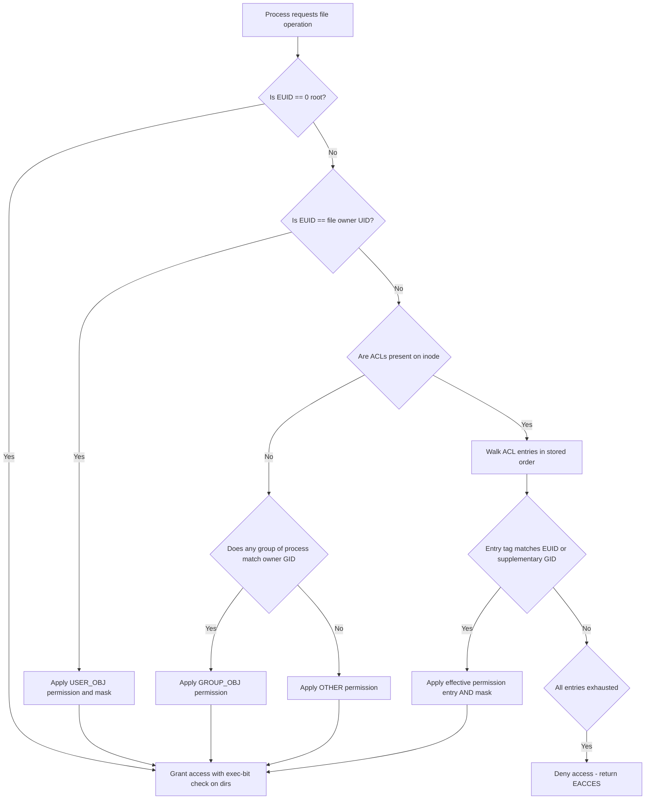
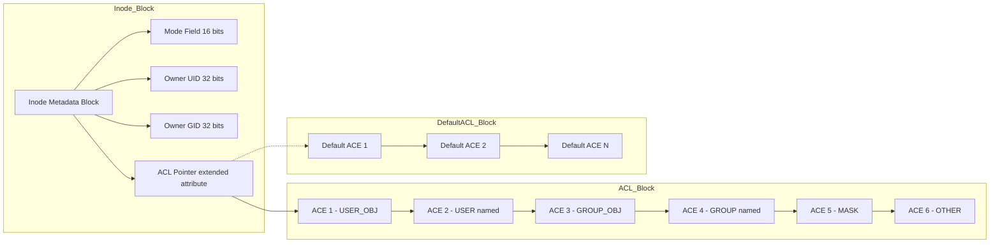
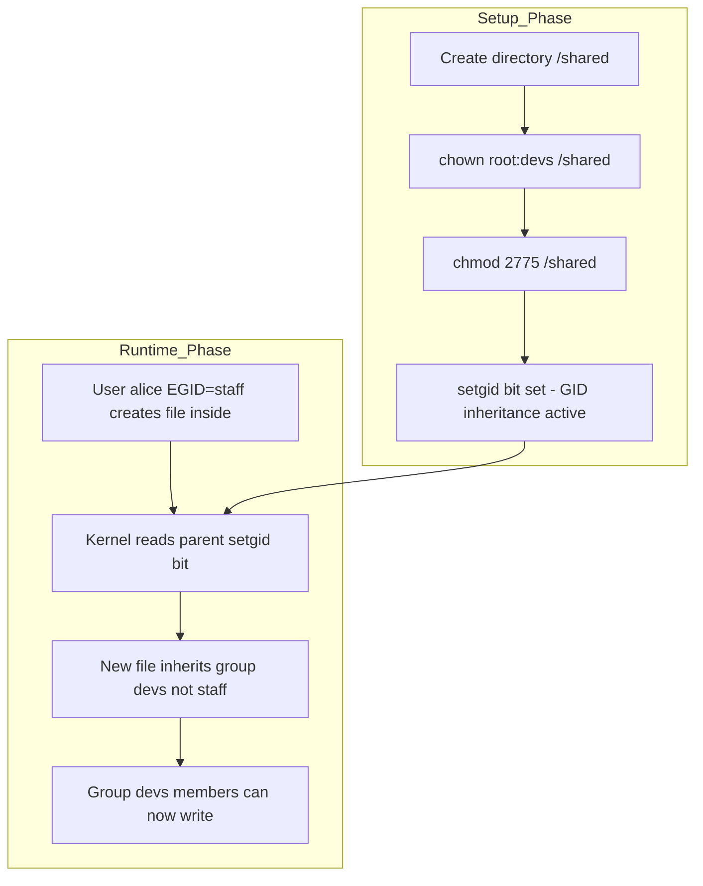
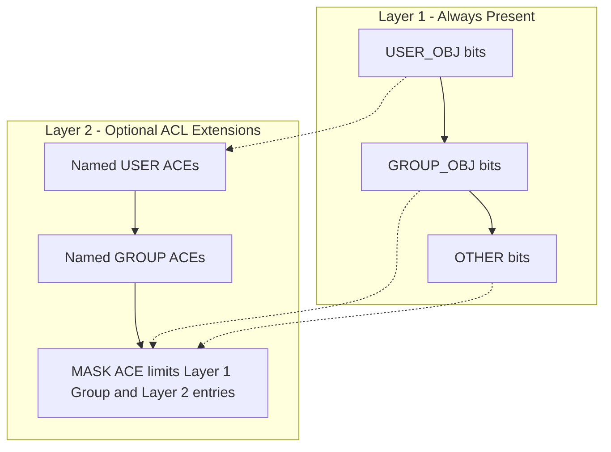
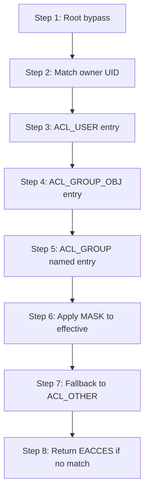

# Permission bits and Access Control Lists

<!-- SECTION_1_START -->

# Permission Bits and Access Control Lists

> [!NOTE]
> **KTU 2024 Scheme — Operating Systems (PCCST403) | Module 4: I/O System**
> This module covers the security primitives that the OS uses to gate access to files, directories, and I/O devices. Two cooperating mechanisms dominate Unix-like systems: the classic **permission bits** model and the more granular **Access Control Lists (ACLs)**.

## 1.1 Formal Definition

**Permission bits** (also called *file mode bits* or *UGO bits*) are a compact 12-bit field stored in every inode of a Unix-like file system. These bits are split into three triplets $(r, w, x)$ assigned to three principal classes — **User (owner)**, **Group**, and **Others (world)** — and three additional special bits (**setuid**, **setgid**, **sticky**) that modify privilege escalation and directory deletion semantics.

**Access Control Lists (ACLs)** are an extended permission model, standardized in **POSIX.1e draft 1003.1e**, that augments the UGO model with named entries. Each ACL is an ordered list of **Access Control Entries (ACEs)**. Each ACE binds a specific user identifier (UID) or group identifier (GID) to a permission mask $(r, w, x)$, allowing fine-grained per-user and per-group rules that go far beyond the single-owner / single-group restriction of UGO bits.

## 1.2 Conceptual Analogy

> [!IMPORTANT]
> **Intuition: The Office Building Analogy**
>
> Imagine a corporate office building with three levels of access:
> - **Permission bits** = A single sign at the main door stating *"Employees, Interns, and Visitors"*. There are exactly three keycards — red (employees = User), blue (interns = Group), green (visitors = Others). The sign is short, fast to read, and sufficient for small organizations.
> - **ACLs** = A detailed security desk with a printed guest list. Each named contractor, vendor, or VIP is added by name with their own access hours and floors. When a person swipes, the guard (kernel) walks the list top-to-bottom and grants the **first match**.
>
> Permission bits are **compact and fast**; ACLs are **expressive and precise**. Linux supports both simultaneously — ACLs are layered *on top of* UGO bits, never replacing them.

## 1.3 Visualization: Permission Bit Layout

A single inode stores the mode field as a 16-bit value (the upper 4 bits are the file type, e.g., regular file, directory, symlink).

> [!VISUALIZATION CONTROL]
> **Concept:** Binary layout of the Unix file mode field
> **Coordinate Mapping (LSB at right):**
> * X-axis position $b_0 \rightarrow b_{11}$ represents bit index
> * Bits $b_0$–$b_2$ = **Others** $rwx$
> * Bits $b_3$–$b_5$ = **Group** $rwx$
> * Bits $b_6$–$b_8$ = **User (owner)** $rwx$
> * Bits $b_9$ = **Sticky bit** ($t$)
> * Bits $b_{10}$ = **Setgid** ($s_g$)
> * Bits $b_{11}$ = **Setuid** ($s_u$)
> **Visual Description:** A horizontal register of 12 bits grouped into four coloured triplets (red for User, blue for Group, green for Others, gold for Special) showing how `rwxr-xr--` becomes the binary string `111 101 100 000`.

## 1.4 File Type Bits (Context Only)

Although not strictly "permission" bits, the upper nibble of the mode word encodes the inode type. Common values:

| Octal Code | File Type        |
|:----------:|:-----------------|
| `0o100000` | Regular file     |
| `0o040000` | Directory        |
| `0o120000` | Symbolic link    |
| `0o060000` | Block device     |
| `0o020000` | Character device |
| `0o100000` | Named pipe (FIFO)|

<!-- SECTION_1_END -->

<!-- SECTION_2_START -->

# Deep Theoretical Analysis & KTU High-Yield Formula Sheet

## 2.1 The UGO Permission Triplet

Every file has **one owner UID** and **one owner GID**. The kernel stores three permission triplets:

$$
M_{\text{file}} = (U, G, O), \quad \text{where } U, G, O \in \{r, w, x\}^3
$$

When a process requests an operation, the kernel classifies the calling process into exactly **one** of the three classes based on the effective UID (EUID) and effective GID (EGID):

1. **Superuser match** — if `EUID == 0` (root), the kernel bypasses all bit checks except execute on directories. Root has unrestricted access.
2. **User match** — if `EUID == inode->uid`, the **User** triplet governs.
3. **Group match** — if `EGID == inode->gid` **OR** the EGID (or any supplementary GID) appears in the inode's group list, the **Group** triplet governs.
4. **Other match** — fallback; the **Others** triplet governs.

> [!IMPORTANT]
> **Critical Rule:** When ACLs are present on a file, step (3) above is extended — a process matches the Group class if **any** of its group IDs (primary or supplementary) is granted access via an ACL entry. This is why the kernel must consult the ACL even for files that "look" like they have simple UGO permissions.

## 2.2 Special Bits Explained

### 2.2.1 Setuid (`s_u`, octal `4000`)

When set on an **executable file**, the process's effective UID becomes the **owner's UID** upon `execve()`. Used legitimately by `/usr/bin/passwd` so a normal user can update `/etc/shadow`. On a **directory**, modern Linux ignores setuid.

### 2.2.2 Setgid (`s_g`, octal `2000`)

- On an **executable file**: process's effective GID becomes the file's GID.
- On a **directory** (the powerful case): new files and subdirectories created inside inherit the **parent directory's GID**, not the creator's primary GID. This enables collaborative shared directories.

### 2.2.3 Sticky Bit (`t`, octal `1000`)

On a **directory**, the sticky bit restricts file deletion/renaming: a user may delete or rename files inside the directory **only if** they are the file's owner, the directory's owner, or root. The classic example is `/tmp`.

## 2.3 Octal Encoding

Each triplet $(r, w, x)$ is summed as powers of two:

$$
\text{triplet value} = (r \times 4) + (w \times 2) + (x \times 1)
$$

A full mode (without special bits) is then concatenated:

$$
\text{mode}_{\text{octal}} = U \cdot 64 + G \cdot 8 + O
$$

> [!NOTE]
> **Example:** `rwxr-xr--` → User = 4+2+1 = 7, Group = 4+0+1 = 5, Others = 4+0+0 = 4. Symbolic mode `0754`.

## 2.4 umask and Default Permissions

When a process creates a file, the kernel starts with a **base mode** (e.g., `0666` for files, `0777` for directories) and clears bits masked by the process's **umask**:

$$
M_{\text{created}} = M_{\text{base}} \;\&\; \lnot\,\text{umask}
$$

The umask thus *subtracts* (in bitwise AND-NOT) unwanted default permissions.

## 2.5 Access Control Lists (ACLs) — Theory of Operation

### 2.5.1 ACL Entry Types (Linux/POSIX)

| Tag Type              | Symbolic    | Meaning                                             |
|:----------------------|:-----------:|:----------------------------------------------------|
| `ACL_USER_OBJ`        | `u::`       | Permissions for the file owner                      |
| `ACL_USER`            | `u:`        | Named user (additional UIDs beyond the owner)       |
| `ACL_GROUP_OBJ`       | `g::`       | Permissions for the owning group                    |
| `ACL_GROUP`           | `g:`        | Named group (additional GIDs)                       |
| `ACL_MASK`            | `m::`       | Maximum effective rights for User/Group/Mask entries|
| `ACL_OTHER`           | `o::`       | Permissions for everyone not matched above          |

### 2.5.2 The ACL_MASK Entry

> [!IMPORTANT]
> **The Mask is NOT the Group field anymore.** The mask acts as the **upper bound** on permissions granted by `ACL_USER`, `ACL_GROUP_OBJ`, and `ACL_GROUP` entries. The kernel computes *effective* permissions for those entries as a bitwise AND with the mask. This means **modifying the group bits via `chmod g=rwx` actually changes the mask, not the GROUP_OBJ entry**, when an ACL is present.

### 2.5.3 Default ACLs (Directory Inheritance)

A directory may carry a **default ACL** (a second ACL stored in the extended attribute `system.posix_acl_default`). When a file or subdirectory is created inside, the kernel copies the default ACL as the new object's access ACL (and, for subdirectories, as its default ACL too). This is the only way to propagate ACLs automatically through a directory tree.

## 2.6 The Access Check Algorithm

When a process `P` with `EUID_P`, `EGID_P`, and supplementary groups $G_P$ requests operation `op` on a file with ACL $\{A_1, A_2, \ldots, A_n\}$:

```
1.  if EUID_P == 0 (root):           grant immediately (with exec-bit check on dirs)
2.  for each ACE in order:
       if ACE.tag == USER_OBJ and ACE.id == EUID_P:           apply mask → result
       if ACE.tag == USER     and ACE.id == EUID_P:           apply mask → result
       if ACE.tag == GROUP_OBJ and ACE.id in groups_of_P:     apply mask → result
       if ACE.tag == GROUP     and ACE.id in groups_of_P:     apply mask → result
       if ACE.tag == OTHER:                                   (no mask) → result
3.  if no match and ACE.tag == OTHER: apply OTHER entry
4.  deny
```

## 2.7 KTU High-Yield Formula & Concept Sheet

| Concept                              | Formula / Rule                                                                              | Notes                                  |
|:-------------------------------------|:--------------------------------------------------------------------------------------------|:---------------------------------------|
| Octal digit per class                | $d = r \cdot 4 + w \cdot 2 + x \cdot 1$                                                     | $r, w, x \in \{0,1\}$                  |
| Full mode (no special bits)          | $M = U \cdot 64 + G \cdot 8 + O$                                                            | `chmod 0754 file`                      |
| Effective ACL permission             | $P_{\text{eff}} = P_{\text{entry}} \;\&\; M_{\text{mask}}$                                  | Mask limits User/Group entries         |
| Default file creation mode           | $M_{\text{new}} = 0666 \;\&\; \lnot\,\text{umask}$                                          | Block & char devices use `0666`        |
| Default directory creation mode      | $M_{\text{new}} = 0777 \;\&\; \lnot\,\text{umask}$                                          | Always `0777`                          |
| Special-bit octal value              | setuid=`4000`, setgid=`2000`, sticky=`1000`                                                 | Added in the thousands place           |
| Owner classification priority        | root $\rightarrow$ USER $\rightarrow$ GROUP $\rightarrow$ OTHER                              | First match wins                       |
| ACL inheritance                      | Default ACL on parent $\Rightarrow$ Access ACL of new child                                 | Sub-dirs also inherit default ACL      |

## 2.8 Real-World Engineering Utility

- **Web servers (Apache, Nginx)**: use setgid bit on document root so all uploaded files share the web-server group.
- **Build servers (Jenkins, CI)**: sticky bit on artifact directories prevents one job from deleting another's output.
- **Shared research storage (HPC clusters)**: POSIX ACLs grant per-project directories with named-user and named-group entries — far more practical than juggling Unix groups for every collaboration.
- **Container security (Docker, Podman)**: file capabilities in `/proc/PID/status` and ACLs on volume mounts enforce least-privilege access.

<!-- SECTION_2_END -->

<!-- SECTION_3_START -->

# Step-by-Step Derivations, Worked Examples & Code Implementation

## 3.1 Worked Example 1 — Octal Conversion of Symbolic Mode

**Problem:** Convert symbolic mode `drwxr-x---` into octal notation.

**Step 1 — Strip the file-type character.**
The leading `d` indicates a directory. The remaining nine characters are the permission bits.

$$
\text{mode bits} = \texttt{r w x \; r - x \; - - -}
$$

**Step 2 — Translate each triplet into its octal digit.**

For the **User** triplet `rwx`:

$$
U = (1 \times 4) + (1 \times 2) + (1 \times 1) = 7
$$

For the **Group** triplet `r-x`:

$$
G = (1 \times 4) + (0 \times 2) + (1 \times 1) = 5
$$

For the **Others** triplet `---`:

$$
O = (0 \times 4) + (0 \times 2) + (0 \times 1) = 0
$$

**Step 3 — Concatenate the digits.**

$$
\boxed{M = 0750 \quad \text{or equivalently} \quad u = \text{owner},\; g = \text{read+exec},\; o = \text{none}}
$$

**Step 4 — Verify using `chmod`.**

```bash
$ chmod 0750 project_plan/
$ ls -ld project_plan/
drwxr-x---  2 alice research 4096 Jun 10 10:00 project_plan/
```

*[Symbolic-to-octal mapping: 3 Marks | Final octal value: 1 Mark]*

## 3.2 Worked Example 2 — Default Permission Calculation with umask

**Problem:** A process has `umask = 0027`. What is the effective permission of a newly created regular file and a newly created directory?

**Step 1 — Recall the base modes.**

$$
M_{\text{base,file}} = 0666, \qquad M_{\text{base,dir}} = 0777
$$

**Step 2 — Compute the bitwise NOT of the umask.**

$$
\lnot\,\text{umask} = \lnot\,0027 = \lvert 000\,010\,111 \quad \text{(in binary)}
$$

**Step 3 — Apply bitwise AND.**

For the **file**:

$$
\begin{aligned}
M_{\text{file}} &= 110\,110\,110 \;\&\; 111\,101\,001 \\
                &= 110\,100\,000 \\
                &= 0640
\end{aligned}
$$

For the **directory**:

$$
\begin{aligned}
M_{\text{dir}} &= 111\,111\,111 \;\;\&\;\; 111\,101\,001 \\
               &= 111\,101\,001 \\
               &= 0750
\end{aligned}
$$

**Step 4 — Interpret the results.**

$$
\boxed{\text{New file: } rw-r----- \qquad \text{New directory: } rwxr-x---}
$$

*[Stating base mode: 1 Mark | Bitwise NOT of umask: 1 Mark | AND operation: 2 Marks | Final mode: 1 Mark]*

## 3.3 Worked Example 3 — Effective ACL Permission with Mask

**Problem:** A file has the following ACL:

```
user::rwx
user:alice:r--      ← ACL_USER
group::r-x
group:devs:rw-      ← ACL_GROUP
mask::r-x
other::---
```

What is the **effective permission** of user `alice` and the group `devs`?

**Step 1 — Identify the mask.** The mask is `r-x` = binary `101` = `0o5`.

**Step 2 — Apply $P_{\text{eff}} = P_{\text{entry}} \;\&\; M_{\text{mask}}$.**

For `alice` (entry `r--` = `100`):

$$
P_{\text{eff, alice}} = 100 \;\&\; 101 = 100 = \texttt{r--}
$$

For group `devs` (entry `rw-` = `110`):

$$
P_{\text{eff, devs}} = 110 \;\&\; 101 = 100 = \texttt{r--}
$$

The `w` bit in the `devs` entry is **clipped** by the mask.

**Step 3 — State the final answer.**

$$
\boxed{\text{Alice: } \texttt{r--} \qquad \text{Group devs: } \texttt{r--}}
$$

*[Identifying the mask: 1 Mark | AND for alice: 2 Marks | AND for devs: 2 Marks | Final interpretation: 1 Mark]*

## 3.4 Worked Example 4 — Access Decision Walkthrough

**Scenario:** Process `P` has `EUID = 1001`, `EGID = 1001`, supplementary groups `{1002, 1003}`. It tries to `read()` a file with ACL:

```
user::rw-            ← owner UID 1000
user:1001:---        ← ACL_USER
group::r--           ← owner GID 1000
group:1002:r--       ← ACL_GROUP
mask::r--
other::---
```

**Step 1 — Classify the process.**

- Is P root? No (`EUID ≠ 0`).
- Does P own the file? No (owner is `1000`, P is `1001`).
- Does P match a named user entry? **Yes** — `ACL_USER 1001`.

**Step 2 — Apply the mask.**

Entry permission for `1001` is `---`. Effective permission is `---`.

**Step 3 — Decision: DENY.**

Even though P's supplementary groups match `ACL_GROUP 1002` and `group::r--`, **the kernel uses the FIRST match in ACE order**, which is the named-user entry. The named-user deny wins.

$$
\boxed{\text{read() returns } -1 \text{ with } \texttt{EACCES}}
$$

*[Process classification: 2 Marks | First-match ACE identification: 3 Marks | EACCES conclusion: 2 Marks]*

## 3.5 C Code — Setting Permission Bits with `chmod(2)`

```c
/*
 * demo_chmod.c
 * Demonstrates octal-mode chmod() and verification with stat().
 * Compile: gcc -Wall -Wextra -O2 demo_chmod.c -o demo_chmod
 */
#include <stdio.h>
#include <stdlib.h>
#include <sys/stat.h>
#include <sys/types.h>
#include <errno.h>
#include <string.h>

static void die(const char *msg) {
    fprintf(stderr, "[ERROR] %s: %s (errno=%d)\n", msg, strerror(errno), errno);
    exit(EXIT_FAILURE);
}

int main(int argc, char *argv[]) {
    if (argc != 3) {
        fprintf(stderr, "Usage: %s <path> <octal_mode>\n", argv[0]);
        return EXIT_FAILURE;
    }

    const char *path = argv[1];
    /* strtol with base 8 accepts 0640, 640, 0750, etc. */
    char *endptr = NULL;
    long mode_raw = strtol(argv[2], &endptr, 8);
    if (endptr == argv[2] || mode_raw < 0 || mode_raw > 07777) {
        fprintf(stderr, "[ERROR] Invalid octal mode: %s\n", argv[2]);
        return EXIT_FAILURE;
    }
    mode_t mode = (mode_t)mode_raw;

    if (chmod(path, mode) == -1) die("chmod");

    struct stat st;
    if (stat(path, &st) == -1) die("stat");

    printf("Applied mode: 0%03lo\n", (unsigned long)st.st_mode & 07777U);
    printf("File type code: 0%03lo\n", ((unsigned long)st.st_mode & S_IFMT) >> 12);
    printf("Owner UID: %u\n", (unsigned)st.st_uid);
    printf("Owner GID: %u\n", (unsigned)st.st_gid);
    return EXIT_SUCCESS;
}
```

## 3.6 C Code — Reading and Setting POSIX ACLs (libacl)

```c
/*
 * demo_acl.c
 * Demonstrates getfacl-style enumeration of ACL entries.
 * Compile: gcc -Wall -Wextra -O2 demo_acl.c -lacl -o demo_acl
 */
#include <stdio.h>
#include <stdlib.h>
#include <sys/acl.h>
#include <acl/libacl.h>
#include <errno.h>
#include <string.h>

static const char *tag_to_string(acl_tag_t t) {
    switch (t) {
        case ACL_USER_OBJ:  return "user_obj";
        case ACL_USER:      return "user";
        case ACL_GROUP_OBJ: return "group_obj";
        case ACL_GROUP:     return "group";
        case ACL_MASK:      return "mask";
        case ACL_OTHER:     return "other";
        default:            return "unknown";
    }
}

int main(int argc, char *argv[]) {
    if (argc != 2) {
        fprintf(stderr, "Usage: %s <path>\n", argv[0]);
        return EXIT_FAILURE;
    }
    acl_t acl = acl_get_file(argv[1], ACL_TYPE_ACCESS);
    if (acl == NULL) die("acl_get_file");

    acl_entry_t entry;
    int entry_id = ACL_FIRST_ENTRY;
    while (acl_get_entry(acl, entry_id) == 1) {
        entry_id = ACL_NEXT_ENTRY;

        acl_tag_t tag;
        if (acl_get_tag_type(entry, &tag) == -1) die("acl_get_tag_type");

        id_t *id_p = NULL;
        if (tag == ACL_USER || tag == ACL_GROUP) {
            id_p = (id_t *)malloc(sizeof(id_t));
            if (acl_get_qualifier(entry, id_p) == -1) die("acl_get_qualifier");
        }

        acl_permset_t permset;
        if (acl_get_permset(entry, &permset) == -1) die("acl_get_permset");

        int r = acl_get_perm(permset, ACL_READ);
        int w = acl_get_perm(permset, ACL_WRITE);
        int x = acl_get_perm(permset, ACL_EXECUTE);

        if (id_p) {
            printf("%s:%ld:%c%c%c\n", tag_to_string(tag), (long)*id_p,
                   r?'r':'-', w?'w':'-', x?'x':'-');
            free(id_p);
        } else {
            printf("%s::%c%c%c\n", tag_to_string(tag),
                   r?'r':'-', w?'w':'-', x?'x':'-');
        }
    }
    acl_free(acl);
    return EXIT_SUCCESS;
}
```

## 3.7 Shell Session — End-to-End Demonstration

```bash
# 1. Create a shared project directory
$ sudo mkdir -p /srv/project
$ sudo chown root:research /srv/project

# 2. Enable setgid so new files inherit the group 'research'
$ sudo chmod 2775 /srv/project
$ ls -ld /srv/project
drwxrwsr-x  2 root research 4096 Jun 10 10:00 /srv/project

# 3. Add the sticky bit so only owners delete their own files
$ sudo chmod +t /srv/project
$ ls -ld /srv/project
drwxrwsr-t  2 root research 4096 Jun 10 10:00 /srv/project

# 4. Install ACL utilities (Debian/Ubuntu)
$ sudo apt install acl

# 5. Grant named-user 'bob' read+write via ACL
$ sudo setfacl -m u:bob:rw- /srv/project/README.md

# 6. Inspect
$ getfacl /srv/project/README.md
# file: srv/project/README.md
# owner: root
# group: research
user::rw-
user:bob:rw-
group::r--
mask::rw-
other::r--
```

## 3.8 Lab Pin / Tool Configuration — Equivalent Mapping for Filesystems

Although this topic is not a hardware module, the following **conceptual configuration table** maps each "knob" to the syscall that adjusts it. This pattern is identical in spirit to a lab pin-configuration table.

| "Pin" / Knob              | System Call / Command         | Argument             | Effect                                       |
|:--------------------------|:------------------------------|:---------------------|:---------------------------------------------|
| Mode bits                 | `chmod(path, mode)`           | octal `mode_t`       | Sets `U`, `G`, `O`, and special bits         |
| Owner UID                 | `chown(path, uid, -1)`        | numeric UID          | Changes owner                                |
| Owner GID                 | `chown(path, -1, gid)`        | numeric GID          | Changes group                                |
| umask                     | `umask(new_mask)`             | octal `mode_t`       | Sets default permission mask                 |
| Named-user ACL            | `setfacl -m u:name:perms`     | qualifier + perms    | Adds a `ACL_USER` entry                      |
| Named-group ACL           | `setfacl -m g:name:perms`     | qualifier + perms    | Adds a `ACL_GROUP` entry                     |
| Mask                      | `setfacl -m m:perms`          | perms                | Modifies `ACL_MASK`                          |
| Default ACL (directory)   | `setfacm -d -m u:name:perms`  | qualifier + perms    | Sets inheritance for new children            |
| Read ACL                  | `getfacl path`                | —                    | Enumerates ACEs                              |
| Remove ACL                | `setfacl -b path`             | —                    | Strips all extended entries, restores UGO    |
<!-- SECTION_3_END -->

<!-- SECTION_4_START -->

# Structural Diagrams & Schematics

## 4.1 Mermaid Flow — Kernel Access Check Algorithm



## 4.2 Mermaid Block Diagram — ACL Storage Layout in an Inode



## 4.3 Mermaid Subgraph — Setgid Shared Directory Mechanism



## 4.4 Block Diagram — Layered Relationship Between UGO and ACLs



## 4.5 Sequential Topology — Permission Resolution Order



<!-- SECTION_4_END -->

<!-- SECTION_5_START -->

# KTU 2024 Scheme Examination Question Bank & Topic Recap

## 5.1 Part A — Short Answer Questions (3 Marks Each)

### Question 1 `[KTU University Exam – July 2024]`
> Explain the significance of the **sticky bit** on a directory. Give a suitable example directory where it is commonly set.

**Model Answer (3 Marks):**

The sticky bit is a special permission bit (octal `1000`) that, when set on a directory, restricts the deletion and renaming of files inside that directory. A user can delete or rename files **only if** they are the owner of the file, the owner of the directory, or the superuser. This prevents users from accidentally (or maliciously) removing each other's files in a world-writable shared location.

The classic example is the `/tmp` directory:

```
$ ls -ld /tmp
drwxrwxrwt  12 root root 4096 Jun 10 10:00 /tmp
```

The trailing `t` (not `x`) in the others-execute position confirms that the sticky bit is active. The directory itself is world-writable (`rwx` for others) so any user can create files, yet users cannot delete files owned by other users.

*[Sticky bit meaning: 1 Mark | Restriction on deletion: 1 Mark | Example with ls output: 1 Mark]*

### Question 2 `[KTU University Exam – Dec 2023]`
> Differentiate between **permission bits** and **Access Control Lists (ACLs)** in Linux.

**Model Answer (3 Marks):**

| Aspect                | Permission Bits (UGO)                          | Access Control Lists (ACLs)                              |
|:----------------------|:------------------------------------------------|:----------------------------------------------------------|
| Granularity           | Three fixed classes (User, Group, Other)        | Named users and named groups individually                 |
| Storage               | 12 bits inside the inode mode field             | Extended attribute `system.posix_acl_access` + inode bits |
| Number of entries     | Exactly 3 (one triplet per class)               | Arbitrary number of ACEs                                  |
| Inheritance           | None — every file's mode is set independently   | Default ACLs on directories propagate to new children     |
| Mask concept          | No mask                                         | `ACL_MASK` caps the effective rights of User/Group entries|
| Tools                 | `chmod`, `chown`, `umask`                       | `setfacl`, `getfacl` (require `libacl` package)           |

*[Any three valid differences: 3 Marks]*

## 5.2 Part B — Module Internal Choice (14 Marks Each)

### Question A `[KTU University Exam – July 2024, Module 4]`
> **(a)** With neat diagrams, explain the **Unix file permission model** including the three classes (User, Group, Others) and the three basic permission bits (read, write, execute). Describe how the kernel classifies a process into exactly one of the three classes during an access check. **(7 Marks)**

> **(b)** Explain the **setuid** and **setgid** bits. Illustrate with one example for each showing how the effective UID/GID of a process changes after `execve()`. Also show how to set and remove these bits using both symbolic and octal `chmod` syntax. **(7 Marks)**

#### Model Solution — (a) **[7 Marks]**

**Step 1 — Permission Bits Definition.** A file in Unix has one owner UID and one owning GID. Associated with it are three permission triplets: $(r,w,x)_U$, $(r,w,x)_G$, $(r,w,x)_O$. The bits mean:

- `r` (read, value **4**) — file content may be read, or directory entries may be listed.
- `w` (write, value **2**) — file content may be modified, or directory entries may be added/removed.
- `x` (execute, value **1**) — file may be executed, or directory may be `cd`-ed into.

**Step 2 — Octal Encoding.** $[M_{\text{octal}} = U \times 64 + G \times 8 + O]$. Example: `rwxr-xr--` = `0754`.

**Step 3 — Process Classification Algorithm (Kernel).** For a process with effective UID $U_P$ and effective GID $G_P$ plus supplementary groups $S_P$:

1. If $U_P = 0$ → root, grant access.
2. Else if $U_P = $ file owner UID → use **User** class.
3. Else if $G_P \in $ owning group **OR** $S_P$ contains owning GID → use **Group** class.
4. Else → use **Other** class.

**Step 4 — Diagram.**

```
         ┌──────────── File Permission Triplet ────────────┐
         │  r   w   x     r   w   x     r   w   x          │
         │  4   2   1     4   2   1     4   2   1          │
         │  ─────────     ─────────     ─────────          │
         │   U S E R      G R O U P     O T H E R          │
         └─────────────────────────────────────────────────┘
```

**Step 5 — Worked Trace.** File `/etc/passwd` mode `0644` owner `root`. Process P has `EUID=1000`, `EGID=1000`. Classification: not root, not owner (UID ≠ 0), so fall to Other class with permission `r--`. Result: P can read but not write.

*[Permission meaning: 2 Marks | Octal formula: 1 Mark | Classification rules: 3 Marks | Example trace: 1 Mark]*

#### Model Solution — (b) **[7 Marks]**

**Step 1 — setuid Bit.** When set on an executable file, the kernel sets the new process's **effective UID** to the file owner's UID during `execve()`. This allows unprivileged users to perform privileged operations through a controlled program.

**Example:**

```bash
$ ls -l /usr/bin/passwd
-rwsr-xr-x  1 root root 59976 Nov 24  2023 /usr/bin/passwd
#        ^-- setuid bit shown as 's' in user-execute position
$ cp /usr/bin/passwd ./mypasswd
$ chmod 4755 ./mypasswd
$ ls -l ./mypasswd
-rwsr-xr-x  1 root root 59976 Jun 10 10:00 ./mypasswd
```

When user `alice` runs `./mypasswd`, her `EUID` becomes `0` (root) only for that process.

**Step 2 — setgid Bit on Executable.** Same as setuid, but for GID. Useful for group-shared utilities (e.g., `wall`, `crontab`).

**Step 3 — setgid Bit on Directory.** New files/subdirectories created inside inherit the **directory's GID**, not the creator's GID. This is the canonical mechanism for shared project folders.

```bash
$ mkdir /shared
$ chgrp devs /shared
$ chmod 2775 /shared
$ ls -ld /shared
drwxrwsr-x  2 root devs 4096 Jun 10 10:00 /shared
#         ^-- setgid on directory, shown as 's' in group-execute position
```

**Step 4 — Setting/Removing with `chmod`.**

| Action                | Symbolic             | Octal            |
|:----------------------|:---------------------|:-----------------|
| Add setuid            | `chmod u+s file`     | `chmod 4755 file`|
| Add setgid            | `chmod g+s file`     | `chmod 2755 file`|
| Remove setuid         | `chmod u-s file`     | `chmod 0755 file`|
| Remove setgid         | `chmod g-s file`     | `chmod 0755 file`|
| Add both + sticky     | `chmod ug+s,o+t dir` | `chmod 7755 dir` |

*[setuid explanation: 2 Marks | setgid on executable: 1 Mark | setgid on directory: 1 Mark | Setting/removing via chmod: 3 Marks]*

---

### Question B `[KTU University Exam – Dec 2023, Module 4]`
> **(a)** What are **POSIX Access Control Lists (ACLs)**? Explain the six entry tags (`ACL_USER_OBJ`, `ACL_USER`, `ACL_GROUP_OBJ`, `ACL_GROUP`, `ACL_MASK`, `ACL_OTHER`) and illustrate with one example. **(7 Marks)**

> **(b)** Explain the concept of a **default ACL** on a directory. Describe how inheritance works when files and subdirectories are created. Provide a complete `setfacl` / `getfacl` session that creates a default ACL granting group `devs` read+write on a new project folder. **(7 Marks)**

#### Model Solution — (a) **[7 Marks]**

**Step 1 — Definition.** A POSIX ACL is an extended, ordered list of Access Control Entries stored in an inode's extended attribute. It refines the UGO model by allowing multiple named users and named groups, each with their own permission mask.

**Step 2 — The Six Tags.**

| Tag                | Symbolic Form | Purpose                                                  |
|:-------------------|:--------------|:---------------------------------------------------------|
| `ACL_USER_OBJ`     | `u::perms`    | Permissions for the file owner (always present)           |
| `ACL_USER`         | `u:name:perms`| Additional UID with custom rights                         |
| `ACL_GROUP_OBJ`    | `g::perms`    | Permissions for the owning group (always present)         |
| `ACL_GROUP`        | `g:name:perms`| Additional GID with custom rights                         |
| `ACL_MASK`         | `m::perms`    | Upper bound for `ACL_USER`, `ACL_GROUP_OBJ`, `ACL_GROUP` |
| `ACL_OTHER`        | `o::perms`    | Rights for everyone not matched by any prior entry       |

**Step 3 — Example.**

```
$ getfacl /srv/data/report.txt
# file: srv/data/report.txt
# owner: alice
# group: research
user::rw-
user:bob:r--
group::rwx
group:devs:rw-
mask::rwx
other::---
```

- Alice (owner) has `rw-` via `ACL_USER_OBJ`.
- Bob has only `r--` via `ACL_USER`.
- The owning group `research` has `rwx` via `ACL_GROUP_OBJ`.
- Group `devs` has `rw-` via `ACL_GROUP` (effective is also `rw-` because mask is `rwx`).
- All others have `---` via `ACL_OTHER`.

**Step 4 — Key Insight on MASK.** If the mask were `r--`, the effective permission of `devs` would be clipped to `r--` even though the entry stores `rw-`. The mask is what `chmod g=...` modifies when an ACL is present.

*[Definition: 1 Mark | Six tags in table: 3 Marks | Example walkthrough: 2 Marks | Mask clipping note: 1 Mark]*

#### Model Solution — (b) **[7 Marks]**

**Step 1 — Definition of Default ACL.** A default ACL is a *second* ACL stored under the extended attribute `system.posix_acl_default`. It exists **only on directories**. Whenever a new file or subdirectory is created within, the kernel **copies** the default ACL as:

- the new object's **access ACL** (always), and
- for subdirectories, the new object's **default ACL** too (propagating the inheritance).

**Step 2 — Why Default ACLs Matter.** Without default ACLs, every new file inside a directory starts with the kernel's base mode (`0666 & ~umask`). The directory's extended permissions would not propagate. Default ACLs solve this.

**Step 3 — Worked Shell Session.**

```bash
# 1. Create the project folder
$ mkdir -p /srv/projects/alpha
$ sudo chown root:devs /srv/projects/alpha

# 2. Set the base mode (will be overridden by ACL inheritance)
$ sudo chmod 0750 /srv/projects/alpha

# 3. Grant group 'devs' read+write via DEFAULT ACL
$ sudo setfacl -d -m g:devs:rw- /srv/projects/alpha

# 4. Also grant default read+write to a named user 'carol'
$ sudo setfacl -d -m u:carol:rw- /srv/projects/alpha

# 5. Inspect the default ACL
$ getfacl /srv/projects/alpha
# file: srv/projects/alpha
# owner: root
# group: devs
user::rwx
group::r-x
other::---

default:user::rwx
default:user:carol:rw-
default:group::r-x
default:group:devs:rw-
default:mask::rwx
default:other::---

# 6. Create a new file - it inherits the default ACL
$ touch /srv/projects/alpha/notes.txt
$ getfacl /srv/projects/alpha/notes.txt
# file: srv/projects/alpha/notes.txt
# owner: root
# group: devs
user::rw-
user:carol:rw-
group::r-x
group:devs:rw-
mask::rwx
other::---
```

**Step 4 — Inheritance Rules Summary.**

- The new file gets an **access ACL** equal to the parent directory's default ACL.
- New **subdirectory** gets both an access ACL **and** a default ACL equal to the parent's default ACL.
- If the parent has **no** default ACL, the child receives a minimal ACL built from the kernel's base mode and the creator's UID/GID.

*[Default ACL definition: 1 Mark | Inheritance mechanism for files: 2 Marks | Inheritance for subdirectories: 1 Mark | Complete shell session: 3 Marks]*

## 5.3 KTU Examiner's Valuation Warning

> [!WARNING]
> **Common Pitfalls Where Students Lose Marks**
>
> 1. **Forgetting the MASK entry.** Many students treat the group field of `chmod` as the `ACL_GROUP_OBJ` entry. After an ACL is installed, **the group field actually controls the MASK**. This is the most-failed point in KTU valuation.
> 2. **Octal digit order.** Reversing the order (writing `0457` instead of `0754`) loses 1–2 marks. Always write Owner first.
> 3. **setuid on a directory.** A common wrong answer is "setuid on a directory makes new files owned by the directory owner." On Linux, setuid is **ignored on directories**; it is setgid that does GID inheritance.
> 4. **Confusing `chmod u+s` and `chmod 4755`.** Both are correct, but mixing them in the same answer without explanation is penalised.
> 5. **Omitting the base mode in umask problems.** Students often write only the umask result; they must state $M_{\text{base}}$ first.
> 6. **First-match ACE order.** In ACL problems, students frequently apply *all* matching ACEs. The kernel uses the **first match** in stored order — explain this explicitly.
> 7. **Sticky bit presentation.** Use the lowercase `t` in `ls` output to show it is set; an uppercase `T` would mean the bit is set but execute is missing (an error state).

## 5.4 Topic Recap & Important Things to Remember

> [!IMPORTANT]
> **High-Density Rapid Revision Checklist**
>
> - **Three classes of UGO**: User (owner UID), Group (owner GID + supplementary), Others (everyone else). The kernel picks **exactly one** class per access check.
> - **Octal digit formula**: $U \times 64 + G \times 8 + O$, where each digit is $r \cdot 4 + w \cdot 2 + x \cdot 1$.
> - **Special bits (octal thousands place)**: setuid = `4000`, setgid = `2000`, sticky = `1000`.
> - **Sticky bit** restricts deletion in world-writable directories (`/tmp` is the canonical example). Shown as `t` in `ls -ld` output.
> - **setuid bit** on executables elevates the process's EUID to the file owner's UID. Ignored on directories in Linux.
> - **setgid bit** on a directory causes **GID inheritance** for new files — the shared-folder mechanism.
> - **umask** clears bits from the base mode: $M_{\text{new}} = M_{\text{base}} \;\&\; \lnot\,\text{umask}$. Base modes are `0666` for files, `0777` for directories.
> - **ACLs extend UGO** — they do not replace it. `ACL_USER_OBJ`, `ACL_GROUP_OBJ`, `ACL_OTHER` are mandatory and mirror the UGO fields.
> - **Six ACL tags**: `ACL_USER_OBJ`, `ACL_USER`, `ACL_GROUP_OBJ`, `ACL_GROUP`, `ACL_MASK`, `ACL_OTHER`. Always exactly one of each mandatory tag.
> - **ACL_MASK is NOT the same as the UGO group field once an ACL exists.** It caps the effective rights of User/Group entries; `chmod g=...` modifies the mask.
> - **Effective ACL permission** = $P_{\text{entry}} \;\&\; M_{\text{mask}}$.
> - **First-match ACE rule**: the kernel walks the ACL top-to-bottom and grants/denies on the first matching entry, then stops. There is no union of rights.
> - **Default ACLs** live only on directories. They propagate to new children as the child's access ACL, and to new subdirectories as both access and default ACLs.
> - **Tools**: `chmod` (octal/symbolic), `chown`, `umask`, `setfacl`, `getfacl`, `ls -l`/`ls -ld` (visual confirmation).
> - **Syscalls**: `chmod(2)`, `fchmod(2)`, `chown(2)`, `umask(2)`, `acl_get_file(3)`, `acl_set_file(3)`.
> - **Performance note**: UGO bits are checked using only the mode field — O(1). ACL checks walk a list — O(n) but typically n ≤ 8 in practice.
> - **Security caveat**: setuid root binaries are a frequent privilege-escalation vector. Modern distros drop setuid from unmaintained packages (e.g., `ping`, `mount`).

<!-- SECTION_5_END -->
