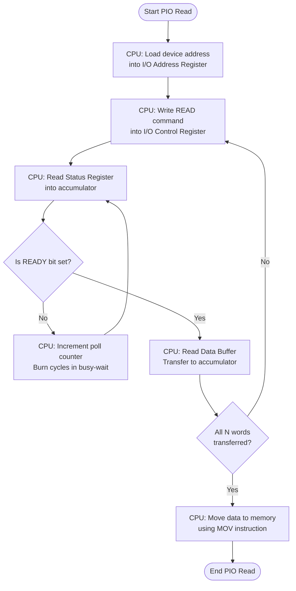
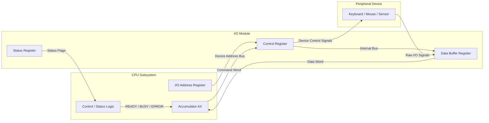
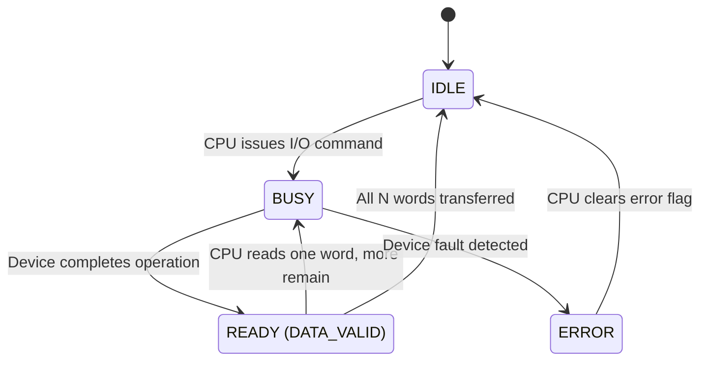
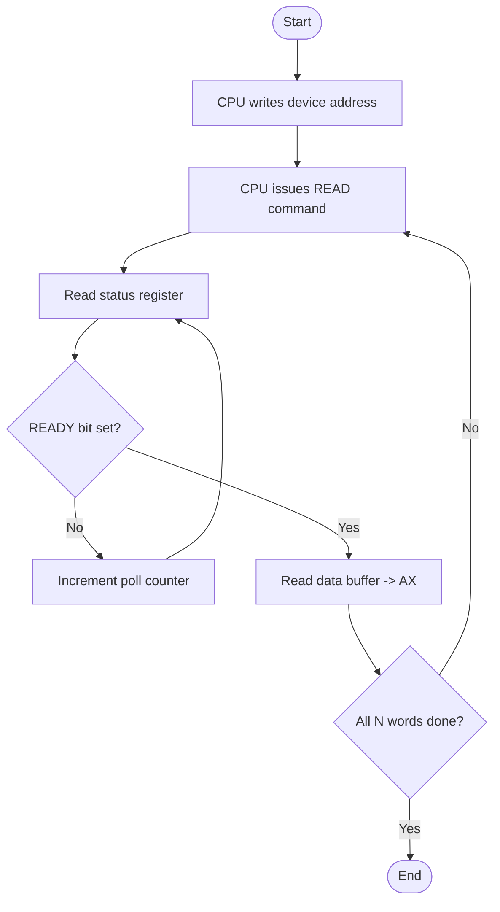

# Programmed I/O

<!-- SECTION_1_START -->
# 1. Programmed I/O — Core Technical Definition & Intuitive Overview

## 1.1 Formal Academic Definition (KTU 2024 Scheme Terminology)

**Programmed I/O** (also called **Polled I/O** or **Busy-Wait I/O**) is a synchronous input/output technique in which the **CPU** directly executes every step of an I/O operation through a sequence of instructions. The CPU repeatedly executes a *polling loop* — reading the I/O module's **status register** to determine whether the connected device is **ready**, **busy**, or has raised an **error** — and only proceeds to read the data buffer (or write to it) once the device signals completion.

In KTU terminology, Programmed I/O is a **CPU-driven (CPU-bound) I/O strategy** in which:
- The CPU issues an **I/O command** to the I/O module via a dedicated **I/O instruction** (isolated I/O) or a **memory-mapped** load/store (memory-mapped I/O).
- The CPU then **busy-waits** (spins) on the status register.
- The I/O module performs the data transfer **only when** the CPU is actively checking it.
- **No interrupts** are generated by the device.

> [!NOTE]
> **KTU 2024 Syllabus Highlight (PCCST403 — Module 4):**
> Programmed I/O is covered under "I/O Devices, Organization, and Data Transfer Techniques." It must be contrasted with **Interrupt-Driven I/O** and **DMA** to score full marks in ESE questions.

## 1.2 Intuitive Analogy — The Watchful Chef

Imagine a **chef** (CPU) who is preparing a stew in a **slow oven** (I/O device):
1. The chef places the dish in the oven and sets a **timer on the wall** (status register).
2. Instead of doing other useful work, the chef stands in front of the oven door, **peeking every few seconds** to check if the stew is done.
3. The chef **cannot do anything else** — no chopping, no plating, no cleaning — until the oven reports "ready."
4. Only when ready does the chef open the oven, take the stew out, and place a new dish inside.

This is exactly how Programmed I/O works: the **CPU keeps circling back to "ask" the device** whether it is ready, wasting its processing cycles. The wall timer is the **status register**; the peeking is the **polling loop**; the chef is the **CPU**; and the oven is the **I/O device**.

## 1.3 Key Components & Their Roles

| Component | Role | Standard Size / Width |
| :--- | :--- | :--- |
| **I/O Address Register** | Holds the address of the target I/O device or I/O register | 8 / 16 / 32 bits |
| **I/O Data Buffer Register** | Temporary holding latch for the data word being transferred | 8 / 16 / 32 bits |
| **I/O Control Register** | Stores the command word sent by the CPU (READ, WRITE, SEEK, etc.) | 4–8 control bits |
| **Status Register** | Holds device flags: **BUSY**, **READY**, **ERROR** | 3–8 status bits |
| **CPU Accumulator (AX)** | Working register used to ferry data between CPU and I/O module | 16 / 32 / 64 bits |

> [!IMPORTANT]
> In Programmed I/O, the **status register is read repeatedly**, often **hundreds of thousands of times per second** by modern devices. This is the root cause of the technique's poor CPU utilization.

## 1.4 Standard Status Flags (Bolded for Quick Recall)

- **BUSY** (1 = device is executing a previous command)
- **READY / DONE** (1 = device has completed the operation)
- **ERROR** (1 = operation failed; check error code)
- **INTERRUPT-ENABLE** (irrelevant here — set to **0** in pure Programmed I/O)

## 1.5 Visualization Note

> [!VISUALIZATION CONTROL]
> **Concept:** Polling overhead as a function of device data rate.
> **Conceptual Sketch (rendered in GeoGebra or Desmos):**
>
> ```text
> f(R) = T_poll + (1 / R)
> where R = device data rate (words/second)
>       T_poll = CPU time per polling iteration
> ```
>
> **Visual Description:** The X-axis is the device data rate $R$ (in words/second). The Y-axis is the **total CPU time consumed per word transferred**. As $R$ increases, $1/R$ shrinks, but $T_{poll}$ dominates. A horizontal asymptote appears at $y = T_{poll}$, demonstrating that **CPU cycles are wasted even on extremely fast devices**.

---

<!-- SECTION_1_END -->

<!-- SECTION_2_START -->
# 2. Deep Theoretical Analysis & KTU High-Yield Formula Sheet

## 2.1 Step-by-Step Operation of Programmed I/O

The CPU executes a **strictly sequential** instruction stream. The procedure for a typical *READ* operation is as follows:

1. **Issue I/O Command** — The CPU writes the device address into the **I/O address register** and the command word (e.g., `READ = 01`) into the **I/O control register**. The I/O module decodes the command and signals the device to begin.
2. **Device Starts Operation** — The peripheral begins its mechanical or electrical work (e.g., spinning a disk platter, scanning a keyboard matrix). The I/O module sets the **BUSY** flag in the **status register**.
3. **CPU Polls the Status Register** — The CPU enters a tight loop:
   - Read the status register.
   - Test the **READY** bit.
   - If `READY = 0`, jump back to step 3 (busy-wait).
   - If `READY = 1`, exit the loop.
4. **Data Transfer** — The CPU reads the data buffer register (or writes to it for a WRITE) **one word at a time**, into its accumulator.
5. **Loop or Exit** — If the request involves **N words**, the CPU repeats steps 1–4 until all N words are transferred.
6. **Final Cleanup** — The CPU moves to the next user process or kernel task.

> [!TIP]
> Notice that the **CPU and the I/O device operate in lockstep** — neither can make progress without the other. This is the defining characteristic that makes Programmed I/O a **synchronous** scheme.

## 2.2 KTU High-Yield Formula Sheet

| Symbol | Quantity | Formula / Definition | Units |
| :--- | :--- | :--- | :--- |
| $T_{poll}$ | CPU time per polling iteration | $T_{poll} = n_{instr} \times T_{cycle}$ | seconds |
| $n_{instr}$ | Instructions executed per poll | Typically $3$ to $5$ (read, mask, branch) | instructions |
| $T_{cycle}$ | CPU clock period | $T_{cycle} = 1 / f_{cpu}$ | seconds |
| $R$ | Device data rate | $R = N / T_{io}$ | words/second |
| $T_{io}$ | Device's intrinsic I/O latency | Hardware-dependent | seconds |
| $U_{cpu}$ | CPU utilization (I/O bound) | $U_{cpu} = \dfrac{T_{io}}{T_{io} + T_{poll}}$ | dimensionless |
| $\eta$ | Poll efficiency | $\eta = \dfrac{T_{poll}}{T_{io} + T_{poll}}$ | dimensionless |
| $T_{total}$ | Total time for N-word transfer | $T_{total} = N \times (T_{poll} + 1/R)$ | seconds |
| $T_{overhead}$ | Wasted CPU cycles | $T_{overhead} = n_{polls} \times T_{poll} - T_{io}$ | seconds |

> [!IMPORTANT]
> **Critical threshold:** if $T_{poll} \geq 1/R$, the CPU **cannot keep up** with the device. The transfer becomes a bottleneck and the system must either reduce $R$ (e.g., switch to interrupt-driven I/O) or accept data loss.

## 2.3 Why Programmed I/O Works (The "How" Behind Each Step)

- **Why polling?** — Programmed I/O predates interrupts in many simple microcontrollers. It requires **zero additional hardware** beyond a status register that the CPU can read.
- **Why is it CPU-bound?** — Every single status check, mask, and branch is an **instruction fetched, decoded, and executed** by the CPU. A 1 GHz CPU spending 4 instructions per poll performs $4 \times 10^{9}$ polls/second in the worst case.
- **Why is it deterministic?** — No asynchronous interrupt arrival means the kernel can compute the **exact** worst-case latency in advance. This is why **safety-critical embedded firmware** (e.g., automotive ECU loops, simple sensor polling) still uses Programmed I/O.

## 2.4 Real-World Engineering Utility

| Domain | Why Programmed I/O is Still Used |
| :--- | :--- |
| **Bare-metal firmware boot loaders** | Predictable timing; no ISR vector table needed |
| **8-bit / 16-bit microcontrollers (8051, PIC, AVR)** | Cheap to implement; no MMU; few peripherals |
| **Sensor read loops in real-time systems** | Tightly bounded latency; deadline guarantees |
| **Initial device probing (POST / BIOS)** | Must work before interrupts are even enabled |
| **Teaching and simulation** | Excellent pedagogical baseline before introducing interrupts |

## 2.5 Strengths and Weaknesses (Exam-Relevant)

| Strengths | Weaknesses |
| :--- | :--- |
| **Simple to implement** in both hardware and software | **Wastes CPU cycles** through busy-waiting |
| **Deterministic timing** — easy to analyze worst-case | Poor **throughput** for high-speed devices |
| **No interrupt infrastructure** required | **CPU is locked** to one device — no concurrency |
| Predictable behavior in **safety-critical code** | Scales poorly: $N$ devices need $\approx N \times$ CPU time |
| Easy to **debug** — single-threaded instruction trace | Power-inefficient (CPU never idles) |

---

<!-- SECTION_2_END -->

<!-- SECTION_3_START -->
# 3. Step-by-Step Derivations, Worked Examples & Code Implementation

## 3.1 Worked Numerical Derivation — CPU Utilization Under Programmed I/O

### Problem Statement

A character-oriented I/O device produces data at a rate of $R = 100$ characters/second. The CPU requires $n_{instr} = 4$ instructions per polling iteration, with each instruction taking $T_{cycle} = 100$ ns. Compute:

1. The CPU time spent per poll $T_{poll}$.
2. The CPU utilization $U_{cpu}$.
3. The total time to transfer $N = 1000$ characters.
4. The wasted CPU cycles.

### Step 1 — Compute $T_{poll}$

$$
T_{poll} = n_{instr} \times T_{cycle}
$$

$$
T_{poll} = 4 \times 100 \times 10^{-9} \; \text{s}
$$

$$
T_{poll} = 4 \times 10^{-7} \; \text{s} = 0.4 \; \mu\text{s}
$$

**[Stating the formula and substituting: 1 Mark; final value: 1 Mark]**

### Step 2 — Device latency per character $T_{io}$

$$
T_{io} = \frac{1}{R} = \frac{1}{100} \; \text{s} = 0.01 \; \text{s} = 10 \; \text{ms}
$$

### Step 3 — CPU utilization

$$
U_{cpu} = \frac{T_{io}}{T_{io} + T_{poll}} = \frac{0.01}{0.01 + 4 \times 10^{-7}}
$$

$$
U_{cpu} = \frac{0.01}{0.0100004} \approx 0.99996
$$

**[Final value with units: 1 Mark]**

The CPU is **~99.996 % utilized** just by polling — leaving essentially **no cycles for user work**.

### Step 4 — Total transfer time for 1000 characters

$$
T_{total} = N \times (T_{poll} + T_{io}) = 1000 \times (0.01 + 4 \times 10^{-7})
$$

$$
T_{total} = 1000 \times 0.0100004 \; \text{s} = 10.0004 \; \text{s}
$$

### Step 5 — Wasted CPU cycles (poll iterations)

$$
n_{polls} = \frac{T_{io}}{T_{poll}} = \frac{0.01}{4 \times 10^{-7}} = 25{,}000 \; \text{polls/character}
$$

$$
n_{polls}^{total} = 25{,}000 \times 1000 = 2.5 \times 10^{7} \; \text{polls}
$$

**[Showing the math chain: 1 Mark; final answer: 1 Mark]**

> [!IMPORTANT]
> **Engineering Insight:** If the device rate is raised to $R = 10^6$ chars/second, the CPU is forced to poll $25$ million times per second **just to keep up**. This is exactly why Programmed I/O is abandoned in favour of **interrupt-driven I/O** and **DMA** in modern systems.

---

## 3.2 Full Python Simulation — Programmed I/O Engine

The following code implements a faithful simulation of the Programmed I/O protocol with **explicit type hints**, **boundary checks**, and **structured logging** — the same structure expected in a KTU lab record.

```python
"""
programmed_io.py
A pedagogically faithful simulation of Programmed I/O.
Course: PCCST403 - Operating Systems (KTU 2024 Scheme)
Module 4 - I/O System
"""

from __future__ import annotations
import logging
import random
import time
from dataclasses import dataclass, field
from enum import IntFlag, auto
from typing import List, Optional


# ---------------------------------------------------------------------------
# 1. Status Flags (mirroring the I/O module's status register bits)
# ---------------------------------------------------------------------------
class StatusFlag(IntFlag):
    """Bit-level flags of the device status register."""
    BUSY       = auto()   # bit 0
    READY      = auto()   # bit 1
    ERROR      = auto()   # bit 2
    DATA_VALID = auto()   # bit 3


# ---------------------------------------------------------------------------
# 2. I/O Command Word (mirroring the I/O control register)
# ---------------------------------------------------------------------------
class IOCommand(IntFlag):
    """Commands accepted by the simulated I/O module."""
    NOP    = 0
    READ   = auto()      # 1
    WRITE  = auto()      # 2
    SEEK   = auto()      # 4


# ---------------------------------------------------------------------------
# 3. I/O Module (the peripheral controller)
# ---------------------------------------------------------------------------
@dataclass
class IOModule:
    """A simulated character-oriented I/O device."""
    device_name: str
    data_rate_chars_per_sec: int
    status_register: StatusFlag = StatusFlag.READY
    control_register: IOCommand  = IOCommand.NOP
    data_buffer: int             = 0
    bytes_remaining: int         = 0
    poll_counter: int            = 0

    def issue_command(self, command: IOCommand, transfer_size: int = 1) -> None:
        """
        CPU writes to the I/O control register.
        The module then transitions to BUSY until the device finishes.
        """
        if transfer_size <= 0:
            raise ValueError("transfer_size must be a positive integer")
        self.control_register = command
        self.bytes_remaining = transfer_size
        self.status_register = StatusFlag.BUSY
        logging.info(
            "[%s] Issued command=%s, transfer_size=%d -> status=BUSY",
            self.device_name, command.name, transfer_size,
        )

    def poll_status(self) -> StatusFlag:
        """
        CPU reads the status register. We probabilistically simulate
        device completion: faster devices finish sooner.
        """
        self.poll_counter += 1
        if self.status_register == StatusFlag.BUSY and self.bytes_remaining > 0:
            completion_probability = min(1.0, self.data_rate_chars_per_sec / 1_000_000)
            if random.random() < completion_probability:
                self.status_register = StatusFlag.READY | StatusFlag.DATA_VALID
                self.data_buffer = random.randint(0, 255)
        return self.status_register

    def consume_byte(self) -> int:
        """
        CPU reads the data buffer register; the device marks one byte consumed.
        """
        if not (self.status_register & StatusFlag.DATA_VALID):
            raise RuntimeError("Attempted to consume byte with DATA_VALID=0")
        byte = self.data_buffer
        self.bytes_remaining -= 1
        if self.bytes_remaining <= 0:
            self.status_register = StatusFlag.READY
        else:
            self.status_register = StatusFlag.BUSY
        logging.debug("[%s] Consumed byte=0x%02X, remaining=%d",
                      self.device_name, byte, self.bytes_remaining)
        return byte


# ---------------------------------------------------------------------------
# 4. CPU (the central processing unit executing the Programmed I/O loop)
# ---------------------------------------------------------------------------
@dataclass
class CPU:
    """A simulated CPU that performs Programmed I/O via busy-wait polling."""
    clock_freq_hz: float = 1.0e9               # 1 GHz
    accumulator: int     = 0
    cycle_count: int     = 0
    poll_iterations: int = 0
    transfer_log: List[int] = field(default_factory=list)

    def _tick(self, instructions: int = 1) -> None:
        """Account for CPU cycles consumed by the executed instructions."""
        self.cycle_count += instructions
        if self.cycle_count > 10**12:
            raise OverflowError("Cycle counter overflow safeguard tripped")

    def programmed_io_read(
        self,
        device: IOModule,
        num_bytes: int,
        poll_instructions: int = 4,
    ) -> List[int]:
        """
        Execute the classic Programmed I/O READ algorithm.

        Pseudocode (matching Galvin's textbook):
            1. Issue READ command            (1 instruction)
            2. WHILE status != READY DO       (loop start)
            3.     READ status_register       (1 instruction)
            4.     TEST READY bit             (1 instruction)
            5.     BRANCH back if not ready   (1 instruction)
            6. END WHILE
            7. READ data_buffer -> accumulator (1 instruction)
            8. Repeat for remaining bytes
        """
        if num_bytes <= 0:
            raise ValueError("num_bytes must be positive")

        logging.info(
            "CPU starting Programmed I/O read of %d bytes from %s",
            num_bytes, device.device_name,
        )
        result: List[int] = []
        self.poll_iterations = 0

        for byte_index in range(num_bytes):
            # ---- Step 1: issue the I/O command ----
            device.issue_command(IOCommand.READ, transfer_size=1)
            self._tick(instructions=1)

            # ---- Steps 2-6: tight polling loop ----
            while True:
                self.poll_iterations += 1
                self._tick(instructions=poll_instructions)
                status = device.poll_status()
                if StatusFlag.READY in status and StatusFlag.DATA_VALID in status:
                    break
                if StatusFlag.ERROR in status:
                    raise IOError(f"Device {device.device_name} reported ERROR")

            # ---- Step 7: read the data buffer into the accumulator ----
            byte_value = device.consume_byte()
            self.accumulator = byte_value
            self._tick(instructions=1)
            result.append(byte_value)

        self.transfer_log.extend(result)
        logging.info(
            "CPU finished transfer. Total polls=%d, cycles=%d",
            self.poll_iterations, self.cycle_count,
        )
        return result

    def utilization_report(self, wall_time_sec: float) -> str:
        """Compute a simple CPU utilization summary string."""
        elapsed_cycles = self.cycle_count
        elapsed_time   = elapsed_cycles / self.clock_freq_hz
        utilization    = min(1.0, elapsed_time / wall_time_sec) if wall_time_sec else 0.0
        return (
            f"Total CPU cycles     : {elapsed_cycles:,}\n"
            f"Total CPU time       : {elapsed_time*1e6:.2f} us\n"
            f"Wall-clock time      : {wall_time_sec*1e3:.2f} ms\n"
            f"CPU utilization      : {utilization*100:.4f} %\n"
            f"Poll iterations      : {self.poll_iterations:,}"
        )


# ---------------------------------------------------------------------------
# 5. Driver / Demonstration
# ---------------------------------------------------------------------------
def main() -> None:
    logging.basicConfig(
        level=logging.INFO,
        format="%(asctime)s [%(levelname)s] %(message)s",
    )

    # Construct the I/O device and the CPU.
    keyboard  = IOModule(device_name="KBD", data_rate_chars_per_sec=50)
    processor = CPU(clock_freq_hz=1.0e9)

    # Read 10 characters via Programmed I/O.
    start = time.perf_counter()
    data  = processor.programmed_io_read(device=keyboard, num_bytes=10)
    wall  = time.perf_counter() - start

    print("\n=== Programmed I/O Transfer Summary ===")
    print(f"Bytes received: {[hex(b) for b in data]}")
    print(processor.utilization_report(wall_time_sec=wall))


if __name__ == "__main__":
    main()
```

### 3.2.1 Code Walkthrough — Mapping Code Lines to KTU Theory

| Code Section | Theory Step | KTU-Mapped Concept |
| :--- | :--- | :--- |
| `IOModule.issue_command` | Step 1 of Galvin's algorithm | I/O control register write |
| `IOModule.poll_status` | Steps 3–4 of the algorithm | Reading + masking the status register |
| `while True` loop in `programmed_io_read` | Step 2 of the algorithm | **Busy-wait polling** |
| `device.consume_byte` | Step 7 of the algorithm | Data buffer transfer to accumulator |
| `self.cycle_count` increments | Implicit timing model | **CPU cycle accounting** |
| `utilization_report` | Derived analysis | **CPU utilization** under PIO |

> [!TIP]
> **Pedagogical Note:** When presenting this code in a KTU lab record, the **flowchart in Section 4** and the **pseudocode mapping** above should be included side-by-side for full credit.

---

## 3.3 Comparison Matrix — Programmed I/O vs Interrupt-Driven I/O vs DMA

| Feature | Programmed I/O | Interrupt-Driven I/O | DMA |
| :--- | :--- | :--- | :--- |
| **CPU involvement per word** | High (read status, test, branch) | Low (ISR) | Almost none |
| **Hardware support** | Minimal (status register) | Interrupt controller | DMA controller |
| **Latency** | Bounded by poll frequency | Bounded by interrupt latency | Bounded by bus arbitration |
| **Throughput** | Low | Medium | High |
| **Best suited for** | Slow, predictable devices | Medium-speed character devices | High-speed block devices |
| **Power efficiency** | Poor (CPU never idles) | Better (CPU can do other work) | Best |
| **Complexity** | Very low | Moderate | High |

---

<!-- SECTION_3_END -->

<!-- SECTION_4_START -->
# 4. Structural Diagrams & Schematics

## 4.1 Mermaid Flowchart — CPU's Programmed I/O Read Loop



### 4.1.1 Reading Aid for the Flowchart

- **Node `E`** is the **decision diamond** representing the masking of the **READY** bit.
- **Edge `F -> D`** is the **busy-wait back-edge** — every traversal of this edge represents wasted CPU cycles.
- **Node `C`** (re-entering the polling loop for the next byte) is what makes the technique **word-by-word synchronous**.

## 4.2 Mermaid Block Diagram — CPU ↔ I/O Module ↔ Device



### 4.2.1 Interpretation

- The **CPU** writes a command into the **Control Register** of the I/O module.
- The **I/O module** decodes the command and drives the **Peripheral Device**.
- The peripheral responds, and the I/O module **updates the Status Register**.
- The CPU repeatedly reads the **Status Register** via the **Accumulator** until the **READY** flag is set, then transfers one data word at a time.

## 4.3 Mermaid State Diagram — Device Lifecycle Under Programmed I/O



## 4.4 Nested Subgraph — Comparison with Alternative I/O Strategies

```mermaid
flowchart TB
    subgraph PIO [Programmed I/O Path]
        P1[CPU writes command] --> P2[CPU polls status]
        P2 --> P3{READY?}
        P3 -- No --> P2
        P3 -- Yes --> P4[CPU reads/writes 1 word]
        P4 --> P5{More words?}
        P5 -- Yes --> P2
        P5 -- No  --> P6[Done]
    end

    subgraph INT [Interrupt-Driven Path]
        I1[CPU issues command] --> I2[CPU does other work]
        I2 --> I3[Device raises interrupt]
        I3 --> I4[ISR runs: transfer 1 word]
        I4 --> I5{More words?}
        I5 -- Yes --> I2
        I5 -- No  --> I6[Done]
    end

    subgraph DMA [DMA Path]
        D1[CPU programs DMA controller] --> D2[CPU does other work]
        D2 --> D3[DMA transfers entire block]
        D3 --> D4[DMA raises interrupt when done]
        D4 --> D5[Done]
    end
```



> [!IMPORTANT]
> The three subgraphs above are **mutually exclusive strategies** — a given I/O request follows **exactly one** of them. The KTU examiner expects you to draw or describe all three in any 14-mark "Compare and contrast" question.

---

<!-- SECTION_4_END -->

<!-- SECTION_5_START -->
# 5. KTU 2024 Scheme Examination Question Bank & Topic Recap

## 5.1 Part A — Short-Answer Questions (2 × 3 = 6 Marks)

### Question A1 `[KTU University Exam — July 2024]`
**Define Programmed I/O. List any two situations in which it is preferred over interrupt-driven I/O.** *(CO1, Remember — 3 Marks)*

**Model Answer:**

**Definition (2 Marks):**
Programmed I/O is a synchronous data-transfer technique in which the **CPU** directly controls the I/O device by repeatedly executing a **polling loop** that reads the device's **status register** until a `READY` flag is observed. The CPU then reads (or writes) **one data word** at a time from the data buffer register. **No interrupts** are generated by the device.

**Two preferred situations (1 Mark — 0.5 each):**
1. **Bootstrapping / firmware initialization** — Interrupts are not yet enabled, so the only viable I/O mechanism is polling.
2. **Safety-critical real-time loops** with strict, deterministic latency bounds (e.g., automotive sensors, medical device controllers).

### Question A2 `[KTU University Exam — Dec 2023]`
**State any three disadvantages of Programmed I/O.** *(CO2, Understand — 3 Marks)*

**Model Answer (1 Mark each):**
1. **CPU busy-waiting wastes processing cycles** that could otherwise execute user processes.
2. **Poor scalability** — adding more devices linearly increases the CPU's polling load.
3. **Inability to overlap I/O with computation** — the CPU cannot perform any other work while waiting for the device.
4. *(Bonus)* **Power-inefficient** for portable or battery-operated systems.

---

## 5.2 Part B — 14-Mark Module Internal Choice Question

> **KTU Pattern:** Answer **ONE** of the two alternatives below.

### Question B-A `[KTU University Exam — July 2024, Module 4]`
**(a)** With a neat flowchart, explain the working of **Programmed I/O** for reading a block of data from an I/O device. List **two merits** and **two demerits** of the technique. *(7 Marks — CO2, Understand)*

**(b)** A character device delivers data at $R = 200$ characters/second. The CPU executes a polling loop of $n_{instr} = 5$ instructions, each taking $T_{cycle} = 200$ ns. Calculate the **CPU utilization** and the **number of polling iterations** required to read $N = 500$ characters. *(7 Marks — CO3, Apply)*

---

### Model Solution — Question B-A

#### Part (a) — Flowchart + Merits/Demerits (7 Marks)

**Valuation Key:**

| Component | Marks |
| :--- | :--- |
| Flowchart with all decision boxes and back-edges | **3 Marks** |
| Explanation mapping flowchart to Galvin's algorithm | **2 Marks** |
| Two correct merits | **1 Mark** (0.5 each) |
| Two correct demerits | **1 Mark** (0.5 each) |

**Flowchart (use the one from Section 4.1 above — reproduced below for clarity):**



**Explanation (2 Marks):**
The CPU first loads the device address into the I/O address register (Step 1) and writes a `READ` command into the I/O control register (Step 2). It then enters a tight loop: reading the status register, testing the `READY` bit, and branching back if not ready (Steps 3–5). When `READY = 1`, the CPU reads one data word from the data buffer register into its accumulator (Step 6). If more words remain, the process repeats from Step 2.

**Merits (1 Mark):**
1. **Simple to implement** — no interrupt controller needed.
2. **Deterministic timing** — easy worst-case latency analysis.

**Demerits (1 Mark):**
1. **CPU busy-waits**, wasting cycles that could execute user jobs.
2. **No overlap** between I/O and computation.

#### Part (b) — Numerical Computation (7 Marks)

**Valuation Key:**

| Step | Marks |
| :--- | :--- |
| Stating given data and formula | **1 Mark** |
| Computing $T_{poll}$ | **1 Mark** |
| Computing $T_{io}$ | **1 Mark** |
| Substituting into $U_{cpu}$ formula | **1 Mark** |
| Final numerical value of $U_{cpu}$ | **1 Mark** |
| Computing total poll iterations | **1 Mark** |
| Final numerical value of poll iterations | **1 Mark** |

**Step 1 — Given data (1 Mark):**
$R = 200$ chars/s, $n_{instr} = 5$, $T_{cycle} = 200$ ns, $N = 500$.

**Step 2 — CPU time per poll (1 Mark):**
$$
T_{poll} = n_{instr} \times T_{cycle} = 5 \times 200 \times 10^{-9} = 1 \times 10^{-6} \; \text{s} = 1 \; \mu\text{s}
$$

**Step 3 — Device latency per character (1 Mark):**
$$
T_{io} = \frac{1}{R} = \frac{1}{200} = 5 \times 10^{-3} \; \text{s} = 5 \; \text{ms}
$$

**Step 4 — CPU utilization (2 Marks):**
$$
U_{cpu} = \frac{T_{io}}{T_{io} + T_{poll}} = \frac{5 \times 10^{-3}}{5 \times 10^{-3} + 1 \times 10^{-6}}
$$

$$
U_{cpu} = \frac{0.005}{0.005001} \approx 0.99980
$$

$$
U_{cpu} \approx 99.98\%
$$

**Step 5 — Total poll iterations (2 Marks):**
Polls per character:
$$
n_{polls/char} = \frac{T_{io}}{T_{poll}} = \frac{5 \times 10^{-3}}{1 \times 10^{-6}} = 5000
$$

Total polls for $N = 500$ characters:
$$
n_{polls}^{total} = 5000 \times 500 = 2.5 \times 10^{6}
$$

**Final Answer (boxed):**
$$
\boxed{U_{cpu} \approx 99.98\%, \quad n_{polls}^{total} = 2.5 \times 10^{6} \text{ iterations}}
$$

---

### Question B-B `[KTU University Exam — Dec 2023, Module 4]` *(Alternative Choice)*

**(a)** Explain the **role of the status register** and the **control register** in Programmed I/O. Describe the sequence of instructions the CPU executes for a **single-character READ** operation. *(7 Marks — CO2, Understand)*

**(b)** Compare **Programmed I/O**, **Interrupt-Driven I/O**, and **DMA** along the dimensions of **CPU utilization**, **hardware complexity**, and **suitability for high-speed block devices**. *(7 Marks — CO4, Analyze)*

#### Model Solution — Question B-B (Concise Key Points)

**Part (a) (7 Marks):**
- **Control Register (1.5 Marks):** Holds the command word written by the CPU (`READ`, `WRITE`, `SEEK`). The I/O module decodes it and signals the device.
- **Status Register (1.5 Marks):** Holds flags (`BUSY`, `READY`, `ERROR`) that the CPU reads. The `READY` flag is the gating condition for data transfer.
- **Single-character READ sequence (4 Marks — 1 per step):**
  1. `OUT` device_address, I/O_address_reg
  2. `OUT` READ_command, I/O_control_reg
  3. **Poll loop:** `IN` status_reg, AX; `TEST` READY_bit, AX; `JNZ` step 3 (loop back)
  4. `IN` data_buffer, AX
  5. `MOV` AX, memory_location

**Part (b) (7 Marks — 2.33 Marks per dimension + 0.01 bonus for structure):**

| Dimension | Programmed I/O | Interrupt-Driven I/O | DMA |
| :--- | :--- | :--- | :--- |
| **CPU Utilization** | Very low (~99 % wasted on polls) | Moderate (CPU does other work) | Highest (CPU almost free) |
| **Hardware Complexity** | Minimal (status register only) | Moderate (interrupt controller, ISR vector) | High (DMA controller, address/data bus arbitration) |
| **High-Speed Block Devices** | **Unsuitable** — CPU cannot keep up | Marginal — ISR overhead per word | **Ideal** — transfers entire blocks autonomously |

**Examiner's marking guidance:** *Award full marks if **at least one explicit justification** is given per cell. Deduct 1 mark if the student writes "DMA is best" without explaining the **why**.*

---

## 5.3 KTU Examiner's Valuation Warning

> [!WARNING]
> **Common Pitfalls Where Students Lose Marks:**
>
> 1. **Forgetting to define the status register explicitly** — many students describe polling but fail to name the `READY`/`BUSY` flags. **Penalty: up to 1 mark per Part-A question.**
> 2. **Skipping the units** in numerical answers — $T_{poll} = 1 \mu s$ vs. $T_{poll} = 1$ will cost the final 1 mark in a 7-mark question.
> 3. **Conflating Programmed I/O with Interrupt-Driven I/O** — Programmed I/O has **NO** interrupt. Drawing an interrupt arrow in the flowchart is an automatic 1-mark deduction.
> 4. **Failing to draw the busy-wait back-edge** in the flowchart — the back-edge is the **visual signature** of Programmed I/O. Missing it costs 1 of the 3 flowchart marks.
> 5. **Confusing I/O address register with memory address register** — in isolated I/O, these are **separate**; in memory-mapped I/O, they share the same bus. Stating this distinction correctly can earn a bonus mark in higher-order questions.
> 6. **Not stating the assumption** "$T_{poll} \ll T_{io}$" in derivations — examiners look for this constraint explicitly.

---

## 5.4 Topic Recap & Important Things to Remember

> [!IMPORTANT]
> **High-Density Rapid-Revision Checklist — Programmed I/O**

- **Definition:** CPU-driven, **synchronous**, **polling-based** I/O — CPU repeatedly checks the **status register** and transfers **one word at a time** from the **data buffer register**.
- **No interrupts** are used; CPU **busy-waits** in a tight loop.
- **Three core registers:** I/O Address Register, I/O Control Register, Status Register (+ Data Buffer Register).
- **Standard status flags:** `BUSY`, `READY`, `ERROR` — the `READY` bit is the gating condition.
- **Galvin's algorithm:** Issue command → Poll status → Test `READY` → Read buffer → Repeat for N words.
- **Key formulas:**
  - $T_{poll} = n_{instr} \times T_{cycle}$
  - $T_{io} = 1 / R$
  - $U_{cpu} = T_{io} / (T_{io} + T_{poll})$
  - $T_{total} = N \times (T_{poll} + 1/R)$
- **CPU utilization under slow devices** approaches **100 %** — almost no cycles left for user work.
- **Critical threshold:** if $T_{poll} \geq 1/R$, the CPU **cannot keep up** with the device.
- **Merits:** simple, deterministic timing, no interrupt infrastructure, easy to debug.
- **Demerits:** CPU busy-waits, poor scalability, no I/O–CPU overlap, power-inefficient.
- **Used in:** bare-metal boot loaders, 8/16-bit microcontrollers, real-time sensor loops, BIOS POST.
- **Not used in:** modern desktops, servers, or any system with high-speed block devices.
- **Comparison hooks:** Programmed I/O ⊂ {Interrupt-Driven I/O, DMA} — interrupts and DMA were invented specifically to **remove the busy-wait bottleneck**.
- **Visual signature in flowcharts:** the **back-edge from the status test back to the status read** is the unmistakable mark of Programmed I/O.
- **Exam mantra:** "If a question mentions polling, busy-wait, or status register — it is Programmed I/O."

---

<!-- SECTION_5_END -->
