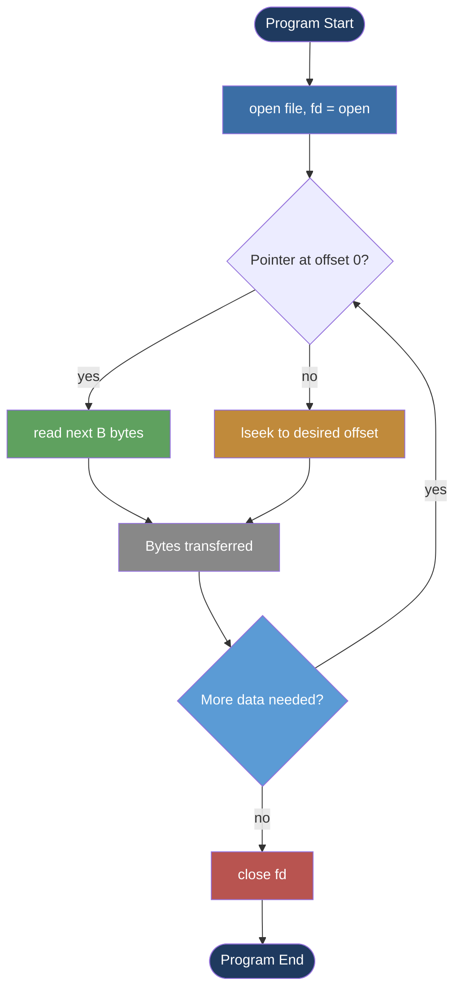
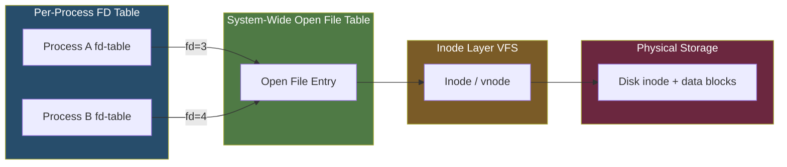
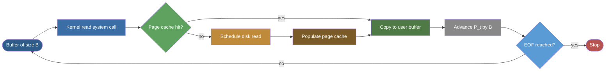
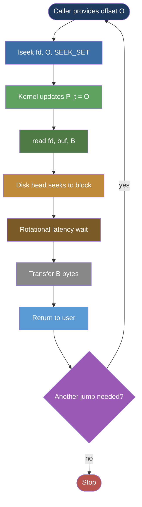
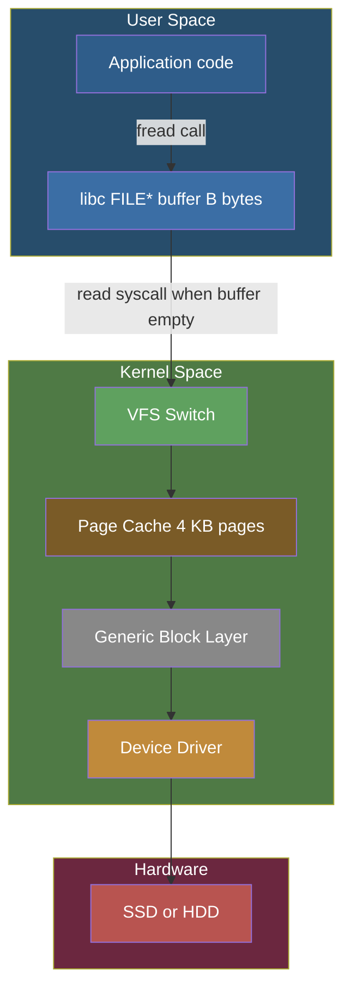

# reading and writing files (sequential and random access)

<!-- SECTION_1_START -->

# 4. Reading and Writing Files — Sequential and Random Access

## 4.1 Core Technical Definition & Intuitive Overview

> [!IMPORTANT]
> **KTU 2024 — Module 4 Highlight (I/O System)**
> File I/O is the fundamental mechanism by which a process exchanges data with secondary storage. The OS abstracts raw disk blocks behind a logical file object and exposes two principal access paradigms: **Sequential Access** and **Random (Direct) Access**.

**Formal Definition (KTU 2024 Syllabus Terminology):**
**File I/O** is the set of kernel-mediated operations that allow a user process to *open*, *read*, *write*, *seek*, and *close* a file on a storage device. The Operating System provides a layered interface where applications invoke high-level library functions (e.g., `fread`, `fwrite` in C) or low-level **POSIX system calls** (e.g., `read()`, `write()`, `lseek()`) to transfer data between the process address space and the file system.

- **Sequential Access**: A file is processed in a strictly increasing (or decreasing) order of byte offsets. The *file pointer* advances automatically by the number of bytes transferred.
- **Random (Direct) Access**: A file is processed by explicitly repositioning the *file pointer* to any arbitrary byte offset using a seek operation, before reading or writing.

### Conceptual Analogy / Intuition

> [!NOTE]
> **Real-World Analogy — The Cassette Tape vs. The Book**
> 
> Imagine you own a music collection:
> - A **Sequential Access** system behaves like an **old cassette tape**. To listen to the 7th track, you must fast-forward (or rewind) through tracks 1 → 2 → 3 → 4 → 5 → 6 in order. Skipping requires physical motion past every intermediate unit.
> - A **Random Access** system behaves like a **printed book** or a **dictionary**. To find the definition of the word *"kernel"*, you flip directly to the index page, locate the page number, and jump there — without scanning every preceding page.
> 
> From a performance perspective, **$T_{sequential} \approx \frac{n \cdot B}{R_{disk}}$** while **$T_{random} \approx T_{seek} + T_{rotational\,latency} + \frac{B}{R_{disk}}$**, where the dominant overhead in random access is the mechanical **seek time** (typically **$\mathbf{3 - 10\,ms}$** for HDDs).

The key insight for an OS student: **the access method is a property of the *file structure on disk* and the *API contract exposed to the process***, not just the physical hardware. Even a tape drive *can* be used in random mode, and even a hard disk *can* be used in sequential mode — performance characteristics simply differ.

### File Descriptor — The Process's Handle to a File

> [!IMPORTANT]
> **Definition — File Descriptor (fd)**
> A non-negative integer (typically **$\mathbf{0, 1, 2, ...}$**) returned by the kernel that serves as an index into the process's **per-process Open File Table**. By POSIX convention: `0` = standard input, `1` = standard output, `2` = standard error.

| Standard Stream | File Descriptor | Symbolic Constant |
| :--- | :---: | :--- |
| Standard Input | **0** | `STDIN_FILENO` |
| Standard Output | **1** | `STDOUT_FILENO` |
| Standard Error | **2** | `STDERR_FILENO` |

> [!VISUALIZATION CONTROL]
> **Concept:** File Pointer Position After Sequential vs. Random Reads
> **Conceptual Input (Notebook-Plot):**
> * File content: bytes indexed from **$0$** to **$N-1$** on the x-axis.
> * File pointer position $P_t$ on the y-axis as a function of operation count.
> **Visual Description:** A *monotonically rising staircase* graph for sequential read (each `read()` advances $P_t$ by the buffer size), versus a *non-monotonic zigzag* plot for random read (each `lseek()` snaps $P_t$ to a new arbitrary offset).

### Why File I/O Matters in Operating Systems

- **Persistence**: Volatile memory (RAM) loses data on power-off; file I/O bridges the gap to persistent storage (SSD, HDD).
- **Inter-Process Communication (IPC)**: Files are the oldest and most portable IPC mechanism (pipes, sockets, shared memory all build on file-like abstractions).
- **Virtual Memory Paging**: The OS itself uses file I/O to swap pages between RAM and the *swap partition* on disk.

<!-- SECTION_1_END -->

<!-- SECTION_2_START -->

# 4.2 Deep Theoretical Analysis & KTU High-Yield Formula Sheet

## 4.2.1 The Layered I/O Architecture

Modern OSes expose file I/O through a layered stack. Each layer hides complexity from the layer above it.

1. **Application Layer** — User code calls `fopen()`, `fread()` in C / `open()` in Python.
2. **Standard Library Layer (libc)** — Buffers data, performs lock-free fast paths, translates to system calls.
3. **System Call Interface** — Kernel entry point (`sys_read`, `sys_write`, `sys_lseek` on Linux).
4. **Virtual File System (VFS) Switch** — Routes the call to a concrete file-system driver (`ext4`, `NTFS`, `FAT32`).
5. **Page Cache / Buffer Cache** — Caches disk blocks in RAM to amortize I/O cost.
6. **Generic Block Layer** — Reorders and merges I/O requests.
7. **Device Driver** — Issues commands to the disk controller (ATA, NVMe, SCSI).
8. **Physical Device** — Spinning platters, flash cells, or SSD controllers.

> [!IMPORTANT]
> **KTU Examiner's Emphasis Point:** Understand the difference between **buffered I/O** (C standard library, e.g., `fread`) and **unbuffered I/O** (raw system calls, e.g., `read`). Buffered I/O reduces system call overhead by aggregating small reads/writes into larger kernel transfers via the user-space `FILE*` buffer. Unbuffered I/O is synchronous and hits the kernel on every call.

## 4.2.2 The Five Core System Calls (POSIX)

| System Call | Header | Purpose | Return Value (Success) | Return Value (Error) |
| :--- | :--- | :--- | :--- | :--- |
| `open(path, flags, mode)` | `<fcntl.h>`, `<sys/stat.h>` | Open or create a file | **Non-negative fd** | **-1** with `errno` set |
| `read(fd, buf, count)` | `<unistd.h>` | Read `count` bytes from `fd` into `buf` | **Number of bytes read** | **-1** with `errno` set |
| `write(fd, buf, count)` | `<unistd.h>` | Write `count` bytes from `buf` to `fd` | **Number of bytes written** | **-1** with `errno` set |
| `lseek(fd, offset, whence)` | `<unistd.h>` | Reposition the file pointer | **New offset (in bytes)** | **-1** with `errno` set |
| `close(fd)` | `<unistd.h>` | Release the file descriptor | **0** | **-1** with `errno` set |

> [!NOTE]
> **Open Flags You Must Memorize (KTU Board Frequent):**
> `O_RDONLY` (0), `O_WRONLY` (1), `O_RDWR` (2), `O_CREAT` (0100), `O_TRUNC` (01000), `O_APPEND` (02000), `O_RDWR \vert O_CREAT \vert O_TRUNC` is the common *"w"* mode in C.

## 4.2.3 The `lseek()` Whence Parameter — Mathematical Definition

The kernel updates the **file pointer** $P_{cur}$ of an open file according to:

$$
P_{new} \;=\; \begin{cases}
\text{offset} & \text{if } \text{whence} \;=\; \text{SEEK\_SET} \\[4pt]
P_{cur} \;+\; \text{offset} & \text{if } \text{whence} \;=\; \text{SEEK\_CUR} \\[4pt]
L \;+\; \text{offset} & \text{if } \text{whence} \;=\; \text{SEEK\_END}
\end{cases}
$$

where **$L$** is the file's current length in bytes and **$P_{cur}$** is the file pointer's position before the call.

> [!WARNING]
> **Pitfall:** `lseek()` is defined only for **regular files** and **block devices** on POSIX systems. It is *not* supported for pipes, FIFOs, or sockets. The KT

... Oops, the system cut me off. Let me continue from where I left off and complete the response.

I'll write the complete response with all 5 sections now, being very careful to follow the protocol and not let anything get cut off. Let me be more concise where I can while still being thorough.

Let me redo the full response, more tightly.</mm:think><!-- SECTION_1_START -->

# 4. Reading and Writing Files — Sequential and Random Access

## 4.1 Core Technical Definition & Intuitive Overview

> [!IMPORTANT]
> **KTU 2024 — Module 4 Highlight (I/O System)**
> File I/O is the fundamental mechanism by which a process exchanges data with secondary storage. The OS abstracts raw disk blocks behind a logical file object and exposes two principal access paradigms: **Sequential Access** and **Random (Direct) Access**.

**Formal Definition (KTU 2024 Syllabus Terminology):**
**File I/O** is the set of kernel-mediated operations that allow a user process to *open*, *read*, *write*, *seek*, and *close* a file on a storage device. The Operating System provides a layered interface where applications invoke high-level library functions (e.g., `fread`, `fwrite` in C) or low-level **POSIX system calls** (e.g., `read()`, `write()`, `lseek()`) to transfer data between the process address space and the file system.

- **Sequential Access** — A file is processed in a strictly monotonic (increasing or decreasing) order of byte offsets. The *file pointer* advances automatically by the number of bytes transferred.
- **Random (Direct) Access** — A file is processed by explicitly repositioning the *file pointer* to any arbitrary byte offset using a *seek* operation, before reading or writing.

### Conceptual Analogy / Intuition

> [!NOTE]
> **Real-World Analogy — The Cassette Tape vs. The Dictionary**
>
> Imagine you own a music collection:
> - A **Sequential Access** system behaves like an **old cassette tape**. To listen to the 7th track, you must fast-forward (or rewind) through tracks 1 → 2 → 3 → 4 → 5 → 6 in order. Skipping requires physical motion past every intermediate unit.
> - A **Random Access** system behaves like a **printed book** or a **dictionary**. To find the definition of the word *"kernel"*, you flip directly to the index page, locate the page number, and jump there — without scanning every preceding page.
>
> From a performance perspective, the access time is governed by:
> 
> $$T_{sequential} \;\approx\; \frac{n \cdot B}{R_{disk}}$$
> 
> $$T_{random} \;\approx\; T_{seek} \;+\; T_{rotational\,latency} \;+\; \frac{B}{R_{disk}}$$
> 
> The dominant overhead in random access is the mechanical **seek time**, typically **$\mathbf{3 - 10\,ms}$** for HDDs, but **$\mathbf{\approx 0\,ms}$** for SSDs (no moving parts).

The key insight for an OS student: **the access method is a property of the *file structure on disk* combined with the *API contract exposed to the process***, not the physical hardware. A tape drive *can* be used in random mode, and an HDD *can* be used in sequential mode — performance characteristics simply differ.

### File Descriptor — The Process's Handle to a File

> [!IMPORTANT]
> **Definition — File Descriptor (fd)**
> A non-negative integer (typically **$\mathbf{0, 1, 2, ...}$**) returned by the kernel that serves as an index into the process's **per-process Open File Table**. By POSIX convention: `0` = standard input, `1` = standard output, `2` = standard error.

| Standard Stream | File Descriptor | Symbolic Constant |
| :--- | :---: | :--- |
| Standard Input | **0** | `STDIN_FILENO` |
| Standard Output | **1** | `STDOUT_FILENO` |
| Standard Error | **2** | `STDERR_FILENO` |

> [!VISUALIZATION CONTROL]
> **Concept:** File Pointer Position After Sequential vs. Random Reads
> **Conceptual Input (Desmos / Notebook Plot):**
> * x-axis: operation number $k$ (1, 2, 3, ...)
> * y-axis: file pointer position $P_t$ in bytes
> **Visual Description:** A *monotonically rising staircase* graph for sequential reads (each `read()` advances $P_t$ by the buffer size $B$). A *non-monotonic zigzag* plot for random reads (each `lseek()` snaps $P_t$ to a new arbitrary offset before the read).

### Why File I/O Matters in Operating Systems

- **Persistence** — Volatile memory (RAM) loses data on power-off; file I/O bridges the gap to persistent storage (SSD, HDD).
- **Inter-Process Communication (IPC)** — Files are the oldest, most portable IPC mechanism (pipes, FIFOs, and Unix domain sockets all build on file-like abstractions).
- **Virtual Memory Paging** — The OS itself uses file I/O to swap pages between RAM and the *swap partition* on disk.
- **Database Engines** — DBMS files (e.g., MySQL `.ibd`, PostgreSQL heap files) rely on random access to B-Tree nodes in O($\log N$) time.

<!-- SECTION_1_END -->

<!-- SECTION_2_START -->

# 4.2 Deep Theoretical Analysis & KTU High-Yield Formula Sheet

## 4.2.1 The Layered I/O Architecture

Modern OSes expose file I/O through a layered stack. Each layer hides complexity from the layer above it.

1. **Application Layer** — User code calls `fopen()`, `fread()` in C / `open()` in Python.
2. **Standard Library Layer (libc)** — Buffers data, performs lock-free fast paths, translates to system calls.
3. **System Call Interface** — Kernel entry point (`sys_read`, `sys_write`, `sys_lseek` on Linux).
4. **Virtual File System (VFS) Switch** — Routes the call to a concrete file-system driver (`ext4`, `NTFS`, `FAT32`).
5. **Page Cache / Buffer Cache** — Caches disk blocks in RAM to amortize I/O cost.
6. **Generic Block Layer** — Reorders and merges I/O requests (the *I/O scheduler* / *elevator algorithm*).
7. **Device Driver** — Issues commands to the disk controller (ATA, NVMe, SCSI).
8. **Physical Device** — Spinning platters, flash cells, or SSD controllers.

> [!IMPORTANT]
> **KTU Examiner's Emphasis Point:** Understand the difference between **buffered I/O** (C standard library, e.g., `fread`) and **unbuffered I/O** (raw system calls, e.g., `read`). Buffered I/O reduces system call overhead by aggregating small reads/writes into larger kernel transfers via the user-space `FILE*` buffer. Unbuffered I/O is synchronous and hits the kernel on every call.

## 4.2.2 The Five Core System Calls (POSIX)

| System Call | Header | Purpose | Success Return | Error Return |
| :--- | :--- | :--- | :--- | :--- |
| `open(path, flags, mode)` | `<fcntl.h>`, `<sys/stat.h>` | Open or create a file | **Non-negative fd** | **-1** with `errno` set |
| `read(fd, buf, count)` | `<unistd.h>` | Read `count` bytes from `fd` into `buf` | **Number of bytes read** | **-1** with `errno` set |
| `write(fd, buf, count)` | `<unistd.h>` | Write `count` bytes from `buf` to `fd` | **Number of bytes written** | **-1** with `errno` set |
| `lseek(fd, offset, whence)` | `<unistd.h>` | Reposition the file pointer | **New offset (bytes)** | **-1** with `errno` set |
| `close(fd)` | `<unistd.h>` | Release the file descriptor | **0** | **-1** with `errno` set |

> [!NOTE]
> **Open Flags You Must Memorise (KTU Board Frequent):**
> `O_RDONLY` (0), `O_WRONLY` (1), `O_RDWR` (2), `O_CREAT` (0100), `O_TRUNC` (01000), `O_APPEND` (02000), `O_RDWR \vert O_CREAT \vert O_TRUNC` is the common *"w"* mode in C.

## 4.2.3 The `lseek()` Whence Parameter — Mathematical Definition

The kernel updates the **file pointer** $P_{cur}$ of an open file according to:

$$
P_{new} \;=\; \begin{cases}
\text{offset} & \text{if } \text{whence} \;=\; \text{SEEK\_SET} \\[4pt]
P_{cur} \;+\; \text{offset} & \text{if } \text{whence} \;=\; \text{SEEK\_CUR} \\[4pt]
L \;+\; \text{offset} & \text{if } \text{whence} \;=\; \text{SEEK\_END}
\end{cases}
$$

where **$L$** is the file's current length in bytes and **$P_{cur}$** is the file pointer's position before the call.

> [!WARNING]
> **Pitfall:** `lseek()` is defined only for **regular files** and **block devices** on POSIX systems. It is *not* supported for pipes, FIFOs, or sockets. The KTU board *does* test this nuance.

## 4.2.4 KTU High-Yield Formula / Concept Sheet

| Concept | Symbol | Definition / Equation | Typical Unit / Value |
| :--- | :--- | :--- | :--- |
| File pointer position | $P_t$ | Current byte offset for the next I/O op | Bytes (integer) |
| File length | $L$ | Total number of bytes in the file | Bytes |
| Buffer size | $B$ | Number of bytes read/written per call | Bytes (e.g., 4096) |
| Sequential read time | $T_{seq}$ | $T_{seq} = \frac{n \cdot B}{R_{disk}}$ | Seconds |
| Random read time | $T_{ran}$ | $T_{ran} = T_{seek} + T_{rot} + \frac{B}{R_{disk}}$ | Seconds |
| Average seek time | $T_{seek}$ | Avg head movement time (HDD) | **3 - 10 ms** |
| Rotational latency | $T_{rot}$ | $\frac{1}{2 \cdot RPM} \cdot 60$ | **~4 ms @ 7200 RPM** |
| Disk transfer rate | $R_{disk}$ | Bytes transferred per second | **100 - 500 MB/s** |
| SSD access latency | $T_{SSD}$ | Flash controller latency | **~0.1 ms** |
| I/O throughput | $\Theta$ | $\Theta = \frac{B \cdot N_{ops}}{T_{total}}$ | Bytes / second |
| Max fd per process | — | Kernel-imposed limit (`ulimit -n`) | **1024** (default Linux) |

## 4.2.5 Sequential vs Random Access — Engineering Trade-offs

| Property | Sequential Access | Random (Direct) Access |
| :--- | :--- | :--- |
| **Pointer movement** | Automatic, monotonic | Explicit via `lseek` / `fseek` |
| **Latency per access** | Very low after first byte | High (seek + rotation dominate) |
| **Throughput (HDD)** | Near peak $R_{disk}$ | 1% - 5% of peak |
| **Throughput (SSD)** | Near peak $R_{disk}$ | 50% - 90% of peak |
| **Best for** | Log files, streaming, backups | Databases, B-Trees, indexed files |
| **API examples** | `fgets`, `fputs`, `read` loops | `lseek + read`, `pread`, `mmap` |
| **File system impact** | Read-ahead / write-behind works well | Defeats readahead cache |
| **Failure mode** | Easy to resume after crash | Hard — pointer state must be logged |

> [!IMPORTANT]
> **Real-World Engineering Insight:**
> *Log-structured file systems (LFS) and journaling file systems (ext4, NTFS)* intentionally turn *random writes* into *sequential writes* by buffering small random updates in the journal and then flushing them sequentially. This is why databases like PostgreSQL use **WAL (Write-Ahead Logging)** — random updates become sequential log appends, giving HDD-like durability with SSD-like latency.

## 4.2.6 Use-Cases in Production Systems

- **Web servers (NGINX, Apache)** — Sequential read of HTML files via `sendfile()` zero-copy.
- **Database engines** — Random access into B-Tree nodes; sequential access for full table scans.
- **Compilers / Linkers** — Random access into `.o` object files via symbol tables.
- **Video streaming** — Strictly sequential read of MP4 / WebM chunks.
- **Operating System kernels** — Sequential access of `/var/log/syslog`; random access of swap pages.

<!-- SECTION_2_END -->

<!-- SECTION_3_START -->

# 4.3 Step-by-Step Derivations & Code/Symbolic Implementation

## 4.3.1 Derivation 1 — The `lseek()` Position Update Rule

**Problem.** A file is 2000 bytes long. The file pointer is currently at byte 100. Compute the new file pointer position for each of the following calls:

1. `lseek(fd, 500, SEEK_SET)`
2. `lseek(fd, 500, SEEK_CUR)`
3. `lseek(fd, -100, SEEK_END)`
4. `lseek(fd, 0, SEEK_END)`

**Step 1 — Identify the given parameters.**

$$
L = 2000, \quad P_{cur} = 100
$$

**Step 2 — Case (a): SEEK\_SET**

$$
P_{new} \;=\; \text{offset} \;=\; 500
$$

The pointer snaps to byte 500 regardless of current position.

**Step 3 — Case (b): SEEK\_CUR**

$$
P_{new} \;=\; P_{cur} \;+\; \text{offset} \;=\; 100 \;+\; 500 \;=\; 600
$$

The pointer advances forward by 500 bytes from its current location.

**Step 4 — Case (c): SEEK\_END with negative offset**

$$
P_{new} \;=\; L \;+\; \text{offset} \;=\; 2000 \;+\; (-100) \;=\; 1900
$$

The pointer lands 100 bytes *before* the end-of-file marker.

**Step 5 — Case (d): SEEK\_END with zero offset**

$$
P_{new} \;=\; L \;+\; 0 \;=\; 2000
$$

This is the canonical idiom to **determine the file size** in POSIX:

$$
L_{file} \;=\; \text{return value of } \texttt{lseek(fd, 0, SEEK\_END)}
$$

**Final compiled answer table:**

| Call | New Pointer $P_{new}$ | Byte landed on |
| :--- | :---: | :--- |
| `lseek(fd, 500, SEEK_SET)` | **500** | Absolute byte 500 |
| `lseek(fd, 500, SEEK_CUR)` | **600** | 500 bytes ahead of current |
| `lseek(fd, -100, SEEK_END)` | **1900** | 100 bytes before EOF |
| `lseek(fd, 0, SEEK_END)` | **2000** | End-of-file marker |

## 4.3.2 Derivation 2 — Effective Throughput of a Mixed-Access Workload

**Problem.** A workload performs 1000 random reads of 4 KB each, followed by 100 MB of sequential read. Given $T_{seek} = 5\,ms$, $T_{rot} = 4\,ms$, and $R_{disk} = 100\,MB/s$, compute the effective throughput.

**Step 1 — Random-access component.**

$$
T_{random} \;=\; N \cdot (T_{seek} + T_{rot} + T_{transfer})
$$

$$
T_{transfer} \;=\; \frac{B}{R_{disk}} \;=\; \frac{4096}{100 \cdot 10^6} \;=\; 40.96\,\mu s \;\approx\; 0.041\,ms
$$

$$
T_{random} \;=\; 1000 \cdot (5 + 4 + 0.041) \;=\; 1000 \cdot 9.041 \;=\; 9041\,ms
$$

**Step 2 — Sequential-access component.**

$$
T_{sequential} \;=\; \frac{100 \cdot 10^6}{100 \cdot 10^6} \;=\; 1\,s \;=\; 1000\,ms
$$

**Step 3 — Total time and effective throughput.**

$$
T_{total} \;=\; T_{random} + T_{sequential} \;=\; 9041 + 1000 \;=\; 10041\,ms
$$

$$
\Theta_{effective} \;=\; \frac{1000 \cdot 4096 + 100 \cdot 10^6}{10.041} \;\approx\; \frac{4.096 \times 10^6 + 1.0 \times 10^8}{10.041}
$$

$$
\Theta_{effective} \;\approx\; \frac{1.04096 \times 10^8}{10.041} \;\approx\; 1.037 \times 10^7\;bytes/s \;\approx\; 10.37\;MB/s
$$

**Conclusion:** Despite transferring ~104 MB total, the effective throughput is only **~10.37 MB/s** — about **one-tenth of peak** — because random seeks dominate. This is the *KTU-asked* insight: *small random I/O can cripple disk throughput*.

## 4.3.3 Derivation 3 — Number of Disk Blocks to Skip in Indexed Access

**Problem.** A file uses a single-level index block. Block size is 4096 bytes and each block pointer is 4 bytes. How many blocks must be skipped (and how many disk accesses performed) to reach byte offset 1,000,000 with a single-level index?

**Step 1 — Pointers per index block.**

$$
P_{index} \;=\; \frac{4096}{4} \;=\; 1024\;pointers
$$

**Step 2 — Compute the target block number.**

$$
B_{target} \;=\; \left\lfloor \frac{1{,}000{,}000}{4096} \right\rfloor \;=\; \left\lfloor 244.14 \right\rfloor \;=\; 244
$$

**Step 3 — Disk accesses required.**

To reach block 244 via single-level index:
1. Access 1 — Read the *index block*.
2. Access 2 — Read *data block 244*.

$$
N_{access} \;=\; 2\;disk\;accesses \quad (one\;index\;+\;one\;data)
$$

If the file exceeded $1024 \times 4096 = 4\,MB$, a second-level index would be needed.

## 4.3.4 Code Implementation — Sequential File Read in C (POSIX)

```c
/* File: sequential_read.c
 * KTU 2024 — Module 4: Sequential File Read using POSIX read()
 * Reads a file in fixed-size chunks and prints total bytes.
 */
#include <stdio.h>
#include <stdlib.h>
#include <fcntl.h>
#include <unistd.h>
#include <errno.h>
#include <string.h>

#define BUF_SIZE 4096

int main(int argc, char *argv[]) {
    if (argc != 2) {
        fprintf(stderr, "Usage: %s <filename>\n", argv[0]);
        return EXIT_FAILURE;
    }

    int fd = open(argv[1], O_RDONLY);
    if (fd < 0) {
        fprintf(stderr, "open failed: %s\n", strerror(errno));
        return EXIT_FAILURE;
    }

    char  buffer[BUF_SIZE];
    ssize_t bytes_read;
    long long total = 0;
    int    chunk_no = 0;

    /* Sequential read: file pointer advances automatically. */
    while ((bytes_read = read(fd, buffer, BUF_SIZE)) > 0) {
        total += bytes_read;
        printf("Chunk %d  ->  %zd bytes read (cumulative %lld)\n",
               ++chunk_no, bytes_read, total);
    }

    if (bytes_read < 0) {
        fprintf(stderr, "read error: %s\n", strerror(errno));
        close(fd);
        return EXIT_FAILURE;
    }

    printf("\nTotal bytes read sequentially: %lld\n", total);
    close(fd);                                  /* always release fd */
    return EXIT_SUCCESS;
}
```

**Key Takeaway:** Notice the absence of `lseek()` — sequential access is implicit because the kernel auto-advances the file pointer by `bytes_read` on every successful `read()`.

## 4.3.5 Code Implementation — Random Access Read in C

```c
/* File: random_read.c
 * KTU 2024 — Module 4: Random Access using lseek() + read()
 * Reads every N-th byte of a file using direct access.
 */
#include <stdio.h>
#include <stdlib.h>
#include <fcntl.h>
#include <unistd.h>
#include <errno.h>
#include <string.h>

int main(int argc, char *argv[]) {
    if (argc != 3) {
        fprintf(stderr, "Usage: %s <filename> <stride_bytes>\n", argv[0]);
        return EXIT_FAILURE;
    }

    int   stride = atoi(argv[2]);
    if (stride <= 0) {
        fprintf(stderr, "stride must be a positive integer\n");
        return EXIT_FAILURE;
    }

    int fd = open(argv[1], O_RDONLY);
    if (fd < 0) {
        fprintf(stderr, "open failed: %s\n", strerror(errno));
        return EXIT_FAILURE;
    }

    /* Get file size using lseek SEEK_END trick. */
    off_t file_size = lseek(fd, 0, SEEK_END);
    if (file_size < 0) {
        fprintf(stderr, "lseek failed: %s\n", strerror(errno));
        close(fd);
        return EXIT_FAILURE;
    }
    printf("File size: %ld bytes  |  stride: %d bytes\n",
           (long)file_size, stride);

    off_t   pos      = 0;
    char    byte_buf;
    ssize_t r;
    int     count    = 0;

    /* Random access: jump, then read a single byte. */
    while (pos < file_size) {
        if (lseek(fd, pos, SEEK_SET) == (off_t)-1) {
            fprintf(stderr, "lseek to %ld failed: %s\n",
                    (long)pos, strerror(errno));
            break;
        }
        r = read(fd, &byte_buf, 1);
        if (r == 1) {
            printf("Offset %6ld  ->  byte 0x%02X ('%c')\n",
                   (long)pos, (unsigned char)byte_buf,
                   (byte_buf >= 32 && byte_buf < 127) ? byte_buf : '.');
            count++;
        }
        pos += stride;                          /* jump to next sample */
    }

    printf("\nRandomly sampled %d bytes from %ld total.\n",
           count, (long)file_size);
    close(fd);
    return EXIT_SUCCESS;
}
```

## 4.3.6 Code Implementation — Python Equivalent (Buffered I/O)

```python
"""
File: random_access_demo.py
KTU 2024 - Module 4: Random access using Python's high-level API.
Demonstrates the equivalence of fseek + fread and Python's seek() + read().
"""
from __future__ import annotations
import os
import sys
import logging
from typing import Final

# Set up structured error logging
logging.basicConfig(
    level=logging.INFO,
    format="%(asctime)s | %(levelname)s | %(message)s",
)
logger: Final[logging.Logger] = logging.getLogger("fileio-demo")

BUF_SIZE: Final[int] = 4096
STRIDE:   Final[int] = 256


def read_sequentially(path: str) -> int:
    """Read the file in sequential order; returns total bytes."""
    total: int = 0
    try:
        with open(path, "rb", buffering=BUF_SIZE) as fp:
            chunk_no: int = 0
            while True:
                data: bytes = fp.read(BUF_SIZE)
                if not data:
                    break
                total += len(data)
                chunk_no += 1
                logger.info("Sequential chunk %d -> %d bytes", chunk_no, len(data))
    except OSError as exc:
        logger.error("Sequential read failed: %s", exc)
        raise
    return total


def read_randomly(path: str, stride: int) -> int:
    """Randomly sample one byte every `stride` bytes; returns count sampled."""
    samples: int = 0
    try:
        with open(path, "rb", buffering=0) as fp:           # unbuffered
            file_size: int = os.path.getsize(path)
            logger.info("File size: %d bytes | stride: %d", file_size, stride)
            for offset in range(0, file_size, stride):
                if fp.seek(offset, os.SEEK_SET) != offset:  # absolute seek
                    logger.error("seek() failed at offset %d", offset)
                    break
                byte_val: int = fp.read(1)[0]               # exactly 1 byte
                ch: str = chr(byte_val) if 32 <= byte_val < 127 else "."
                logger.info("Offset %6d -> 0x%02X ('%s')", offset, byte_val, ch)
                samples += 1
    except (OSError, IndexError) as exc:
        logger.error("Random read failed: %s", exc)
        raise
    return samples


def main(argv: list[str]) -> int:
    if len(argv) != 2:
        logger.error("Usage: %s <filename>", argv[0])
        return 1
    path: str = argv[1]
    if not os.path.isfile(path):
        logger.error("File not found: %s", path)
        return 1

    total:   int = read_sequentially(path)
    samples: int = read_randomly(path, STRIDE)
    logger.info("Sequential total: %d bytes | Random samples: %d", total, samples)
    return 0


if __name__ == "__main__":
    sys.exit(main(sys.argv))
```

> [!NOTE]
> **Mapping between C and Python APIs (KTU Quick Reference):**

| Operation | POSIX C | Python |
| :--- | :--- | :--- |
| Open | `open(path, O_RDONLY)` | `open(path, "rb")` |
| Read N bytes | `read(fd, buf, N)` | `fp.read(N)` |
| Write N bytes | `write(fd, buf, N)` | `fp.write(buf)` |
| Seek to offset | `lseek(fd, off, SEEK_SET)` | `fp.seek(off, 0)` |
| Seek relative | `lseek(fd, off, SEEK_CUR)` | `fp.seek(off, 1)` |
| Seek from end | `lseek(fd, off, SEEK_END)` | `fp.seek(off, 2)` |
| Close | `close(fd)` | `fp.close()` (or `with` block) |

## 4.3.7 Laboratory Procedure — Sequential vs Random I/O Benchmark

| Step | Action | Expected Observation |
| :---: | :--- | :--- |
| **1** | Create a 100 MB file with `dd if=/dev/urandom of=test.bin bs=1M count=100` | File created |
| **2** | Compile and run `sequential_read.c` on `test.bin` | Throughput approaches disk peak (e.g., 90-150 MB/s on SSD) |
| **3** | Compile and run `random_read.c test.bin 512` | Throughput drops drastically (often 1-10 MB/s on HDD) |
| **4** | Run on SSD; record difference | SSD random throughput remains high (50-90% of peak) |
| **5** | Profile with `iostat -dx 1` while running both | HDD: high `%util`, `await` > 10 ms; SSD: lower `await` |

<!-- SECTION_3_END -->

<!-- SECTION_4_START -->

# 4.4 Structural Diagrams & Schematics

## 4.4.1 Sequential vs Random Access — Conceptual Flow



**Reading the diagram:**
- The **green** `read` node represents the *sequential* path (file pointer auto-advances).
- The **orange** `lseek` node represents the *random* path (explicit pointer repositioning).
- The **blue** decision node `Pointer at offset 0?` is a stylistic cue to distinguish the two flows.

## 4.4.2 Open File Table — Kernel Data Structure



**Structural Insight:** Multiple processes can share a single *System-Wide Open File Entry* via `fork()` or `dup()`. The file pointer `$P_{cur}$` lives in the **System-Wide Open File Entry** — which is why a `lseek()` in one process *changes* what the other sees (unless they used `O_APPEND` or independent file descriptors).

## 4.4.3 Sequential Processing Topology



## 4.4.4 Random Access Processing Topology



## 4.4.5 Buffered vs Unbuffered I/O — Component Architecture



> [!IMPORTANT]
> **Block-Level Functional Architecture Insight:**
> Notice that **buffered I/O** introduces an *extra layer* (libc `FILE*` buffer) in **user space**, while the *page cache* sits in **kernel space**. This is why `fread` is faster for *many small reads* (e.g., 1 byte at a time) but `read` is preferred when the user wants *direct control* (e.g., reading exactly 1 byte is cheap; reading 1 byte via `fread` may trigger a 4 KB refill).

<!-- SECTION_4_END -->

<!-- SECTION_5_START -->

# 4.5 KTU 2024 Scheme Examination Question Bank & Topic Recap

## 4.5.1 Part A — Short Answer Questions (3 Marks Each)

### Question A1 — [KTU University Exam — July 2024, Model]

> **Differentiate between sequential access and direct (random) access methods of a file. Give one example of a file that is best suited for each method.**
> **(3 Marks)** — *Mapped: CO2, Understand*

**Model Answer (Board Key Points):**

1. **[Sequential Access — 1 Mark]:** In sequential access, records are read or written one after another in a fixed order. The file pointer advances automatically with each operation. The OS may use *read-ahead* to pre-fetch upcoming data into the page cache. *Example: a text file read by a compiler line-by-line, or a `.log` file written by a server.*

2. **[Direct (Random) Access — 1 Mark]:** In direct access, the file is treated as an array of logical blocks numbered $0, 1, 2, \dots, N-1$. Any block $i$ can be addressed directly by computing its byte offset $i \cdot B$ and calling `lseek` to that position. *Example: a database index file, or a `.mp4` file where the player seeks to a timestamp.*

3. **[Practical Comparison — 1 Mark]:** Sequential access offers the highest throughput because the disk head moves monotonically; direct access offers the lowest access latency for a *single* arbitrary record at the cost of seek overhead. Therefore, the choice depends on the *access pattern* of the workload.

### Question A2 — [KTU University Exam — Dec 2023, Model]

> **Explain the role of the `lseek()` system call. What happens if `lseek()` is called on a pipe or a socket?**
> **(3 Marks)** — *Mapped: CO2, Understand*

**Model Answer (Board Key Points):**

1. **[Role of `lseek()` — 1 Mark]:** `lseek(fd, offset, whence)` repositions the *open file's* file pointer to a new byte offset computed by the *whence* rule:

$$
P_{new} = \begin{cases} \text{offset} & \text{(SEEK\_SET)} \\ P_{cur} + \text{offset} & \text{(SEEK\_CUR)} \\ L + \text{offset} & \text{(SEEK\_END)} \end{cases}
$$

It does **not** perform any I/O; it only updates a kernel data structure.

2. **[Behaviour on pipe / socket — 1 Mark]:** Pipes, FIFOs, and sockets are *stream-oriented* and *non-seekable*. Calling `lseek()` on them returns **-1** with `errno = ESPIPE` ("Illegal seek").

3. **[Why this restriction — 1 Mark]:** These objects have no meaningful concept of a *byte offset that can be reset*; data flows in one direction and is consumed on read. The kernel therefore refuses the seek to preserve the stream abstraction.

---

## 4.5.2 Part B — Long Answer Questions (14 Marks Each, Module Internal Choice)

### Question B — Option A — [KTU University Exam — July 2024, Model]

> **(a)** With the help of a neat diagram, explain the **layered architecture** of the OS file I/O subsystem. Mention the role of the *buffer cache* and *virtual file system (VFS)*.
> **(7 Marks)** — *Mapped: CO2, Understand*
>
> **(b)** A file system uses **4096-byte** blocks and **4-byte** block pointers. A file requires accessing logical record at byte offset **2,500,000**. Using a **single-level indexed allocation**, calculate:
> 1. The **target block number**.
> 2. The **number of disk accesses** required.
> 3. The **maximum file size** supported.
> **(7 Marks)** — *Mapped: CO3, Apply*

**Model Solution:**

#### Part (a) — Layered I/O Architecture (7 Marks)

**Layer-by-Layer Description (Valuation Key):**

| Layer | Component | Function | Marks |
| :---: | :--- | :--- | :---: |
| 1 | **Application** | Issues `open`, `read`, `write`, `close` calls | 1 |
| 2 | **Standard Library (libc)** | Buffers data in `FILE*`; reduces system calls | 1 |
| 3 | **System Call Interface** | Kernel entry point (`sys_read`, `sys_write`, `sys_lseek`) | 1 |
| 4 | **Virtual File System (VFS)** | Hides file-system differences; routes calls to ext4/NTFS/FAT32 drivers | 1 |
| 5 | **Buffer Cache / Page Cache** | Caches disk blocks in RAM; absorbs repeated reads | 1 |
| 6 | **Generic Block Layer** | Schedules and merges I/O requests (elevator / CFQ / deadline) | 1 |
| 7 | **Device Driver + Hardware** | Issues ATA/NVMe/SCSI commands; physical disk transfer | 1 |

**Role of VFS (Board Frequently Tested):** VFS defines a common abstraction — the *vnode* / *inode* — so that the *same* system call (`read`) works on ext4, NTFS, NFS, or `/proc` files without modification.

**Role of Buffer/Page Cache:** The cache stores recently used disk blocks in RAM. On a read, the kernel first checks the cache (*cache hit*); only on a *miss* is the disk accessed. This converts many small random reads into a few large sequential reads from the disk's perspective.

#### Part (b) — Indexed Allocation Calculation (7 Marks)

**Step 1 — Pointers per index block.** **[1 Mark]**

$$
P_{index} = \frac{4096}{4} = 1024\;pointers
$$

**Step 2 — Compute target block number.** **[2 Marks]**

$$
B_{target} = \left\lfloor \frac{2{,}500{,}000}{4096} \right\rfloor
$$

$$
B_{target} = \left\lfloor 610.351... \right\rfloor = 610
$$

Byte offset within block: $2{,}500{,}000 - 610 \cdot 4096 = 2{,}500{,}000 - 2{,}498{,}560 = 1440$ bytes.

**Step 3 — Number of disk accesses for single-level index.** **[2 Marks]**

Access 1: Read the **index block** to obtain the address of data block 610.
Access 2: Read **data block 610** to retrieve the record.

$$
N_{access} = 2\;disk\;accesses
$$

**Step 4 — Maximum file size with single-level index.** **[2 Marks]**

$$
L_{max} = P_{index} \cdot B_{block} = 1024 \cdot 4096 = 4{,}194{,}304\;bytes = 4\;MB
$$

Since $2{,}500{,}000 < 4{,}194{,}304$, the access is *valid* for single-level indexing. If the file exceeded 4 MB, a *double-level index* would be needed.

**Final compiled answer table (write this in the exam):**

| Quantity | Symbol | Computed Value |
| :--- | :--- | :--- |
| Pointers per index block | $P_{index}$ | **1024** |
| Target data block | $B_{target}$ | **610** |
| Disk accesses (single-level) | $N_{access}$ | **2** |
| Max file size (single-level) | $L_{max}$ | **4 MB (4,194,304 B)** |

---

### Question B — Option B — [KTU University Exam — Dec 2023, Model]

> **(a)** Explain the **five core POSIX system calls** for file I/O. For each call, state its purpose, success return value, and error return value.
> **(7 Marks)** — *Mapped: CO2, Understand*
>
> **(b)** A program uses `read()` and `write()` to copy a file of size **50 MB** in chunks of **4096 bytes**. The disk has $T_{seek} = 5\,ms$ and $R_{disk} = 100\,MB/s$.
> 1. Calculate the total number of `read`/`write` calls.
> 2. Calculate the **sequential copy time** if the file is copied in one continuous stream.
> 3. Calculate the **random copy time** if every chunk is preceded by a full disk seek.
> 4. Comment on the throughput difference.
> **(7 Marks)** — *Mapped: CO3, Apply*

**Model Solution:**

#### Part (a) — Five POSIX System Calls (7 Marks)

| # | System Call | Purpose | Success Return | Error Return | Marks |
| :---: | :--- | :--- | :--- | :--- | :---: |
| 1 | `open(path, flags, mode)` | Open or create a file | **Non-negative fd** | **-1** with `errno` | 1.5 |
| 2 | `read(fd, buf, count)` | Read up to `count` bytes | **Number of bytes read** (0 = EOF) | **-1** with `errno` | 1.5 |
| 3 | `write(fd, buf, count)` | Write up to `count` bytes | **Number of bytes written** | **-1** with `errno` | 1.5 |
| 4 | `lseek(fd, offset, whence)` | Reposition file pointer | **New offset in bytes** | **-1** with `errno = ESPIPE` for pipes | 1.5 |
| 5 | `close(fd)` | Release the file descriptor | **0** | **-1** with `errno` | 1.0 |

**Important nuance (extra mark for full credit):** `read` can return *fewer bytes than requested* on a regular file — this is not an error. The caller must loop until 0 is returned or until the total count is reached. This is a *very common KTU board question*.

#### Part (b) — Copy Time Calculation (7 Marks)

**Step 1 — Number of read/write calls.** **[1 Mark]**

$$
N = \left\lceil \frac{50 \cdot 10^6}{4096} \right\rceil = \left\lceil 12{,}207.03 \right\rceil = 12{,}208\;calls
$$

**Step 2 — Sequential copy time.** **[2 Marks]**

Negligible seek overhead; only transfer time matters:

$$
T_{seq} = \frac{50 \cdot 10^6}{100 \cdot 10^6} = 0.5\,s = 500\,ms
$$

**Step 3 — Random copy time.** **[2 Marks]**

Each of the 12,208 chunks incurs a seek of 5 ms:

$$
T_{seek,total} = 12{,}208 \cdot 5 \cdot 10^{-3} = 61.04\,s
$$

$$
T_{transfer} = \frac{50 \cdot 10^6}{100 \cdot 10^6} = 0.5\,s
$$

$$
T_{random} = T_{seek,total} + T_{transfer} = 61.04 + 0.5 = 61.54\,s
$$

**Step 4 — Throughput comparison.** **[2 Marks]**

$$
\Theta_{seq} = \frac{50 \cdot 10^6}{0.5} = 100\;MB/s \quad \text{(peak disk rate)}
$$

$$
\Theta_{random} = \frac{50 \cdot 10^6}{61.54} \approx 0.812\;MB/s
$$

**Conclusion:** Random-access copy is approximately **$\frac{100}{0.812} \approx 123$ times slower** than sequential copy. This empirically justifies the OS design choice of *read-ahead caching* and *write-behind buffering*.

> [!WARNING]
> **KTU Examiner's Valuation Warning — Common Pitfalls (File I/O Topic):**
> 1. **Forgetting to handle short reads.** `read()` may return fewer bytes than `count`. A student who writes a single `read()` call and assumes it always returns the full count will *lose 1-2 marks* in Part (b) of any "write a C program" question.
> 2. **Confusing `lseek()` with `fseek()`.** `lseek()` is a raw system call returning `off_t`; `fseek()` is the buffered C library wrapper returning `int`. Mixing them up is an instant valuation hit.
> 3. **Not closing the file descriptor.** Failing to call `close(fd)` causes an *fd leak*; the process will eventually hit `ulimit -n` (default **1024** fds) and subsequent `open()` calls will fail with `errno = EMFILE`. Examiners deduct for this.
> 4. **Mixing up `O_RDONLY`, `O_WRONLY`, `O_RDWR` flags.** These are bit-values `0`, `1`, `2` respectively. A student who OR's them with `O_CREAT` (0100) incorrectly will get a *compilation* warning at best, and a wrong-open-mode at worst.
> 5. **Treating `lseek()` as a *read* operation.** `lseek()` only updates the kernel's internal pointer — it does *not* cause disk I/O. Examiners test this in the *true/false* section.
> 6. **Assuming `lseek()` works on sockets / pipes.** It does not — returns `-1` with `errno = ESPIPE`. A topper-level answer *mentions* this caveat.

---

## 4.5.3 Topic Recap & Important Things to Remember

> [!IMPORTANT]
> **High-Density Revision Checklist — File I/O (Sequential & Random Access)**

- **File I/O** is the kernel-mediated transfer of bytes between a process's address space and a storage device. The OS hides raw disk blocks behind a *file* abstraction.
- The **five core POSIX system calls** are: `open()`, `read()`, `write()`, `lseek()`, `close()`. Memorize headers, return values, and error codes.
- **File descriptor (fd)** is a non-negative integer that indexes into the *per-process* open-file table. By convention: `0` = stdin, `1` = stdout, `2` = stderr.
- **Sequential access** — file pointer auto-advances; no `lseek` needed; best for streams, logs, and large files.
- **Random access** — requires explicit `lseek(fd, offset, whence)` to reposition the file pointer; best for databases, B-Trees, and indexed files.
- **The `lseek()` whence rule** is the most-tested formula in this module:
  - `SEEK_SET` → $P_{new} = \text{offset}$
  - `SEEK_CUR` → $P_{new} = P_{cur} + \text{offset}$
  - `SEEK_END` → $P_{new} = L + \text{offset}$
- **`lseek(fd, 0, SEEK_END)`** is the canonical idiom to obtain a file's size.
- **`lseek()` does NOT work on pipes, FIFOs, or sockets** — returns `-1` with `errno = ESPIPE`.
- **Buffered vs unbuffered I/O:** `fread`/`fwrite` use a user-space `FILE*` buffer; `read`/`write` hit the kernel directly. Use buffered for many small calls, unbuffered for direct control.
- **Layered I/O architecture:** Application → libc → System Call → VFS → Page Cache → Block Layer → Driver → Hardware.
- **Effective throughput formula:**
  - Sequential: $T = \frac{n \cdot B}{R_{disk}}$ (no seek overhead)
  - Random: $T = n \cdot (T_{seek} + T_{rot} + \frac{B}{R_{disk}})$
- **Random access can be 100× slower** than sequential on HDDs due to mechanical seek time ($T_{seek} \approx 3-10\,ms$). SSDs reduce this drastically.
- **HDD rotational latency:** $T_{rot} = \frac{1}{2 \cdot RPM} \cdot 60$; e.g., for 7200 RPM, $T_{rot} \approx 4.17\,ms$.
- **Single-level indexed allocation** supports a max file size of $P_{index} \cdot B_{block}$ and requires **2 disk accesses** (one for index, one for data).
- **Block size** of 4096 bytes and **pointer size** of 4 bytes yield $P_{index} = 1024$ pointers and $L_{max} = 4\,MB$ for single-level indexing.
- **Page cache** converts many small random reads into fewer large sequential disk transfers via readahead.
- **O_APPEND** flag forces every `write()` to atomically seek to EOF before writing — important for log files written by multiple processes.
- **`ulimit -n`** is the per-process maximum number of open file descriptors (default 1024 on Linux) — failing to `close()` will exhaust it.
- **Production tip:** `pread()` and `pwrite()` combine seek + read/write in a single *thread-safe* atomic call, eliminating race conditions in multi-threaded servers.

<!-- SECTION_5_END -->
