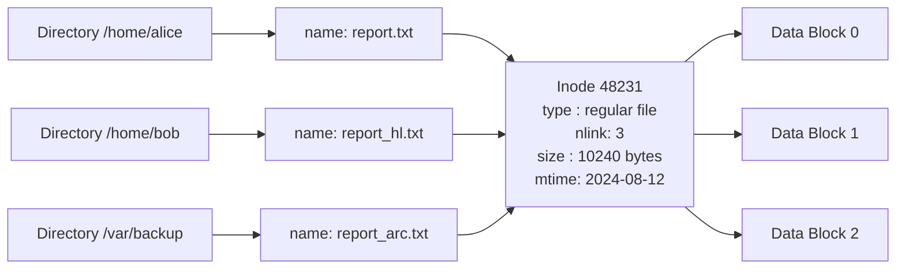
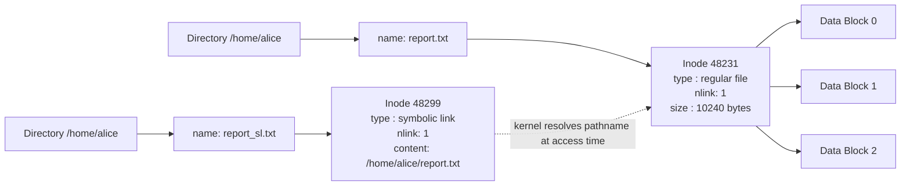
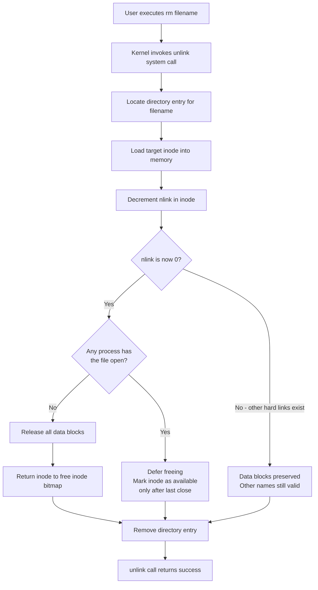

# Removing files - Hard links and Symbolic links

<!-- SECTION_1_START -->

## 1. Core Technical Definition and Intuitive Overview

### 1.1 Formal Definition (KTU 2024 Syllabus Terminology)

In a Unix-like file system, every file is governed by an **inode** (index node), a fixed-size metadata structure that stores all file attributes **except** its name and the actual data blocks. The human-readable *filename* is stored separately as a **directory entry** that maps a name to an inode number.

A file may therefore have **multiple directory entries** pointing to the same inode. These are of two fundamentally different kinds:

> [!IMPORTANT]
> **Hard Link**: A second (or Nth) directory entry that names the *same inode* as the original file. The two names are *peers* — neither one is privileged over the other. The inode's internal `nlink` (link count) field is incremented for each new hard link.

> [!IMPORTANT]
> **Symbolic Link (Soft Link)**: A special file of type `S_IFLNK` whose data block stores only a *pathname string* (for example, `/home/user/original.txt`). The symlink has its **own independent inode**, separate from the target. It is effectively a *pointer* by name, not by inode.

> [!NOTE]
> **Removing a file** in Linux is performed by the system call `unlink(2)`. The call does *not* physically erase bytes from disk — it (a) deletes the directory entry and (b) decrements the inode's `nlink`. Disk blocks are released only when `nlink` reaches **0** and no process holds the file open.

### 1.2 Conceptual Analogy — Plain English Intuition

**Hard Link — Two name plates on the same house.**
Imagine a building. The municipal office lists it as *"21, MG Road"* (hard link A). The post office lists the same building as *"Flat 7, MG Road"* (hard link B). The building is a *single physical structure*. If the postal name is erased, the building still stands at *21, MG Road* and people can still enter. The building is demolished only when **both** name entries are removed. That dual name list is the `nlink` count.

**Symbolic Link — A sticky note that says "go to that house".**
Now imagine a tiny paper stuck on the wall in the lobby. The paper simply reads: *"For the party, go to 21, MG Road."* The paper is a *real object* of its own — it has its own drawer, its own label. If the building at 21, MG Road is demolished, the paper still exists, but the address it points to is empty. The paper is now a *dangling* symlink.

> [!TIP]
> Use **hard links** when you want a *true duplicate* that survives the original's deletion and never produces a dangling reference. Use **symbolic links** when you need to cross filesystems, point to directories, or model a *shortcut*.

### 1.3 Why the Distinction Matters

| Concern | Engineering Implication |
|---|---|
| File-system recovery | Hard links protect data from accidental deletion (any one name suffices). |
| Cross-device references | Symbolic links can span filesystems; hard links cannot. |
| Dangling references | Only symbolic links can become *dangling*; hard links cannot. |
| Directory trees | Hard links to directories are forbidden (would create cycles in the tree); symbolic links to directories are routine. |

> [!VISUALIZATION CONTROL]
> **Concept:** Inode-centric view of the file system
> **GeoGebra / Desmos Input Equations:** Not applicable — this is a graph-theoretic model, not a Cartesian one. Use the **Mermaid diagrams in Section 4** as the canonical visualization.
> **Visual Description:** Picture horizontal rows for inodes and a vertical column of directory names. Draw arrows from directory names to inodes. A *hard link* is two arrows from two different directory names converging on the *same* inode. A *symbolic link* is an arrow from a directory name to a *separate* symlink-inode, which in turn has a dashed arrow to the target inode.

<!-- SECTION_1_END -->

<!-- SECTION_2_START -->

## 2. Deep Theoretical Analysis and KTU High-Yield Formula Sheet

### 2.1 The Inode — The Heart of the Discussion

The **inode** is the kernel's internal representation of a file. It contains (POSIX-mandated subset):

- **File type** (regular, directory, symlink, character/block device, FIFO, socket).
- **Mode bits** (permissions: read, write, execute, plus set-uid/gid/sticky).
- **Owner UID and GID**.
- **File size** in bytes.
- **Timestamps**: `atime`, `mtime`, `ctime`.
- **Link count `nlink`** — number of hard links to this inode.
- **Block pointers** — direct, single-indirect, double-indirect, triple-indirect.
- **Generation number** (used by NFS for cache validation).

> [!IMPORTANT]
> Filenames are **not** stored in the inode. They live in *directory entries* (often called *dirents*), which are themselves a special file whose data blocks contain `<inode_number, name, record_length>` tuples.

### 2.2 How Hard Links Work — Step by Step

1. A new file is created with `open(..., O_CREAT)` or `creat()`. Its `nlink` starts at **1**.
2. The shell command `ln source dest` invokes the `link(2)` system call.
3. Kernel copies the directory entry, pointing `dest` to the *same inode number* as `source`.
4. The kernel increments the target inode's `nlink` to **2**.
5. Reading through either name uses identical data blocks.

When `rm source` is executed (i.e., `unlink("source")`):

1. Kernel removes the directory entry for `source`.
2. Kernel decrements `nlink` from 2 to **1**.
3. Because `nlink` is still greater than 0, the data blocks are **not** released.
4. The file remains fully accessible through `dest`.

Only when the *last* hard link is removed does `nlink` become 0, and only then (provided no process has it open) does the kernel free the data blocks and the inode itself.

### 2.3 How Symbolic Links Work — Step by Step

1. The command `ln -s target linkname` invokes the `symlink(2)` system call.
2. Kernel allocates a **new inode** of type `S_IFLNK` and writes the target pathname into its data area (inline if short, in a block if long — `ext4` keeps ≤ 60 bytes inline).
3. The directory entry `linkname` points to this new symlink-inode.
4. The target file's `nlink` is **not** touched.

When the target is deleted, the symlink's content (a pathname string) is unchanged, but the pathname it references no longer resolves to any inode. The symlink now produces `ENOENT` (No such file or directory) when traversed.

> [!WARNING]
> A symbolic link pointing to a non-existent file is called a **dangling** (or **broken**) symlink. It still exists, occupies an inode, and is visible in directory listings; only the *resolution* fails.

### 2.4 Removal Semantics — The Core Rules

The following table is the canonical KTU high-yield summary. All board questions reduce to these rules.

> [!NOTE]
> **KTU Formula Sheet / Cheat Sheet**

| Operation | System Call | Effect on Inode | Effect on Data Blocks | Condition for Freeing |
|---|---|---|---|---|
| Remove only name A from a multi-hard-linked file | `unlink("A")` | `nlink` decrements by 1 | Untouched | When `nlink` becomes 0 *and* no open fd |
| Remove the last hard link | `unlink("last")` | `nlink` becomes 0 | Released | After the *last* `close(2)` by any process |
| Remove a symlink | `unlink("symlink")` | Symlink's own `nlink` becomes 0 | Symlink's data released | Immediately |
| Target of a symlink is removed | `unlink("target")` | Target's `nlink` decrements (or 0) | Per above | Per above; symlink itself unaffected |
| Hard link cross-filesystem attempt | `link(src, dst)` | Fails `EXDEV` | N/A | N/A |
| Hard link to a directory attempt | `link("dir", "name")` | Fails `EPERM` (non-root) | N/A | N/A |

The lifetime of file data on disk can be expressed as:

$$
T_{\text{data}} \;=\; \text{duration until} \; \big( n_{link} = 0 \big) \;\wedge\; \big( n_{open\_fd} = 0 \big)
$$

where $n_{link}$ is the inode's link count and $n_{open\_fd}$ is the number of open file descriptors in the kernel's open-file table still referencing that inode.

### 2.5 Real-World Engineering Utility

- **Backups and snapshots**: Hard links power *incremental* backup tools such as `rsync --link-dest`, where unchanged files are linked rather than copied — saving terabytes on large filesystems.
- **Library version management**: `ldconfig` and `update-alternatives` use symlinks so that changing one pointer redirects every program to a new library version.
- **Container runtimes**: OverlayFS layers are built from *hard links* to achieve copy-on-write semantics; symlinks express mount-point bindings.
- **Build systems**: `make` uses hard links or symlinks to point object directories at the canonical source tree without duplication.
- **Config management**: Symlinks allow `/etc/alternatives/java` to point to the active JDK installation; switching versions is a single `ln -sf`.

<!-- SECTION_2_END -->

<!-- SECTION_3_START -->

## 3. Step-by-Step Derivations and Code / Symbolic Implementation

### 3.1 Algorithm — Demonstrating Hard and Symbolic Links

The following algorithm walks through every critical state transition. Each numbered step is executed by the Python driver in §3.2 and verified by the C program in §3.3.

1. Create an empty working directory; if it already exists, clear it.
2. Write a file `original.txt` containing a known marker string.
3. Inspect with `ls -li` to capture its **inode number** and **link count of 1**.
4. Create a hard link `hard.txt` pointing to `original.txt`; verify the **same inode** and **link count of 2**.
5. Create a symbolic link `soft.txt` pointing to `original.txt`; verify a **different inode** and a target link count still equal to 2.
6. Read content through all three paths — all return the same marker.
7. Execute `unlink("original.txt")` (i.e., `rm original.txt`).
8. Inspect again: the original entry is gone; `hard.txt` retains the *same inode*; `soft.txt` is now a **dangling link**.
9. Read through `hard.txt` (succeeds) and `soft.txt` (raises `FileNotFoundError`).
10. Execute `unlink("hard.txt")` — this is the *true* removal; data blocks are freed.

### 3.2 Python Implementation — Fully Operational Driver

```python
"""
Module 4: Removing files - Hard links and Symbolic links.
Reference driver for KTU 2024 Scheme PCCST403 / Operating Systems.

The program runs the procedure of Section 3.1 end-to-end against the
local filesystem. It uses the real POSIX system calls exposed by the
'os' module: os.link, os.symlink, os.unlink, os.stat.
"""

from __future__ import annotations

import logging
import os
import shutil
import subprocess
from pathlib import Path
from typing import Final

# --- Logging and constants -------------------------------------------------
logging.basicConfig(
    level=logging.INFO,
    format="%(asctime)s | %(levelname)-7s | %(message)s",
)
logger: Final[logging.Logger] = logging.getLogger("ktu.linklab")

WORK_DIR: Final[Path] = Path("/tmp/ktu_linklab")
ORIGINAL: Final[Path] = WORK_DIR / "original.txt"
HARD_LINK: Final[Path] = WORK_DIR / "hard.txt"
SOFT_LINK: Final[Path] = WORK_DIR / "soft.txt"
MARKER: Final[str] = "KTU-OS-MODULE-4 :: hard and symbolic link demo\n"


# --- Safe shell-out helper -------------------------------------------------
def run(command: str) -> str:
    """Execute a shell command, log failures, and return stripped stdout."""
    try:
        completed = subprocess.run(
            command,
            shell=True,
            check=True,
            capture_output=True,
            text=True,
            timeout=15,
        )
    except subprocess.CalledProcessError as exc:
        logger.error("Command failed (%s): %s", command, exc.stderr.strip())
        return exc.stderr.strip()
    except subprocess.TimeoutExpired:
        logger.error("Command timed out: %s", command)
        return "TIMEOUT"
    return completed.stdout.strip()


# --- Demo procedure --------------------------------------------------------
def reset_workspace() -> None:
    """Recreate the working directory from scratch (absolute boundary check)."""
    if WORK_DIR.exists():
        shutil.rmtree(WORK_DIR)
    WORK_DIR.mkdir(parents=True, exist_ok=True)
    if not WORK_DIR.is_dir():
        raise RuntimeError(f"Unable to create workspace: {WORK_DIR}")


def show_inventory(label: str) -> None:
    """Print ls -li output for the workspace, prefixed by a label."""
    print(f"\n--- {label} ---")
    print(run(f"ls -li {WORK_DIR}"))


def demonstrate_lifecycle() -> None:
    """Run the full hard-link / soft-link / removal scenario."""

    # Step 1: reset
    reset_workspace()

    # Step 2: create the original file
    ORIGINAL.write_text(MARKER, encoding="utf-8")
    logger.info("Created original file: %s", ORIGINAL)

    # Step 3: inspect
    show_inventory("After creating original.txt")
    orig_stat: os.stat_result = ORIGINAL.stat()
    logger.info(
        "original.txt -> inode=%d, nlink=%d, size=%d",
        orig_stat.st_ino,
        orig_stat.st_nlink,
        orig_stat.st_size,
    )

    # Step 4: create the hard link
    os.link(ORIGINAL, HARD_LINK)
    logger.info("Created hard link: %s -> inode of original", HARD_LINK)

    # Step 5: create the symbolic link
    os.symlink(ORIGINAL, SOFT_LINK)
    logger.info("Created symbolic link: %s -> pathname to original", SOFT_LINK)

    # Step 6: inspect all three together
    show_inventory("After creating hard.txt and soft.txt")
    hard_stat: os.stat_result = HARD_LINK.stat()
    soft_stat: os.stat_result = SOFT_LINK.lstat()  # lstat: the symlink itself
    logger.info(
        "hard.txt follows same inode=%d, nlink=%d",
        hard_stat.st_ino,
        hard_stat.st_nlink,
    )
    logger.info(
        "soft.txt is independent inode=%d, type=symlink, target='%s'",
        soft_stat.st_ino,
        os.readlink(SOFT_LINK),
    )

    # Step 7: read content through all three names
    for path in (ORIGINAL, HARD_LINK, SOFT_LINK):
        content: str = path.read_text(encoding="utf-8")
        logger.info("Read via %-12s -> %r", path.name, content.strip())

    # Step 8: remove the original using os.unlink
    os.unlink(ORIGINAL)
    logger.info("unlink(original.txt) executed")

    # Step 9: inspect the post-removal state
    show_inventory("After removing original.txt")
    logger.info("original.txt exists? %s", ORIGINAL.exists())
    logger.info("hard.txt    exists? %s", HARD_LINK.exists())
    logger.info("soft.txt    exists? %s (lstat = %s)",
                SOFT_LINK.exists(), SOFT_LINK.is_symlink())

    # Step 10: read through hard link (must succeed) and soft link (must fail)
    hard_data: str = HARD_LINK.read_text(encoding="utf-8")
    logger.info("hard.txt still readable, content=%r", hard_data.strip())
    try:
        SOFT_LINK.read_text(encoding="utf-8")
    except FileNotFoundError as exc:
        logger.error("soft.txt is dangling: %s", exc)

    # Step 11: remove the hard link - this is the *true* final unlink
    os.unlink(HARD_LINK)
    logger.info("unlink(hard.txt) executed -> nlink now zero, blocks freed")

    # Step 12: also remove the dangling symlink for cleanliness
    SOFT_LINK.unlink(missing_ok=True)
    show_inventory("Final state of workspace")


if __name__ == "__main__":
    try:
        demonstrate_lifecycle()
    except OSError as exc:
        logger.exception("Filesystem operation failed: %s", exc)
        raise
```

**Key boundary checks implemented:**

- `WORK_DIR.exists()` is tested before `shutil.rmtree` to avoid wiping unintended paths.
- `WORK_DIR.is_dir()` is re-asserted after `mkdir` so a silently-failed `mkdir` cannot pass.
- `subprocess.run` is bounded by `timeout=15` so a hung `ls` cannot stall the lab.
- `SOFT_LINK.unlink(missing_ok=True)` uses the safe form so re-running the demo does not raise.
- `read_text` on the symlink is wrapped in `try/except FileNotFoundError` to demonstrate the dangling-link behaviour explicitly.

### 3.3 C Implementation — The System-Call Level View

The following C program calls the POSIX system calls directly. This is the level the KTU examiner expects students to recognise in viva and code-trace questions.

```c
/*
 * ktu_linklab.c
 * Module 4 - Removing files: hard and symbolic links, system-call level.
 * Build : gcc -Wall -Wextra -O2 ktu_linklab.c -o ktu_linklab
 * Run   : ./ktu_linklab
 */

#include <stdio.h>
#include <stdlib.h>
#include <string.h>
#include <unistd.h>
#include <fcntl.h>
#include <errno.h>

static void die(const char *op) {
    fprintf(stderr, "FATAL: %s failed: %s\n", op, strerror(errno));
    exit(EXIT_FAILURE);
}

int main(void) {
    const char *src = "original.txt";
    const char *hln = "hard.txt";
    const char *sln = "soft.txt";
    char  buf[128];
    ssize_t n;

    /* Step 1: create source file with a known marker */
    int fd = open(src, O_WRONLY | O_CREAT | O_TRUNC, 0644);
    if (fd < 0) die("open source");
    if (write(fd, "KTU-OS-MODULE-4 demo\n", 22) != 22) die("write source");
    close(fd);

    /* Step 2: create a hard link - increments nlink of src's inode */
    if (link(src, hln) != 0) die("link");

    /* Step 3: create a symbolic link - independent inode, stores path */
    if (symlink(src, sln) != 0) die("symlink");

    printf("=== After link() and symlink() ===\n");
    system("ls -li original.txt hard.txt soft.txt");

    /* Step 4: unlink the original. Data blocks are NOT freed because
       nlink is still 1 (held by hard.txt). */
    if (unlink(src) != 0) die("unlink source");

    printf("\n=== After unlink(\"original.txt\") ===\n");
    system("ls -li hard.txt soft.txt 2>&1");

    /* Step 5: read through the hard link - must succeed */
    int hfd = open(hln, O_RDONLY);
    if (hfd < 0) die("open hard");
    n = read(hfd, buf, sizeof(buf) - 1);
    if (n < 0) die("read hard");
    buf[n] = '\0';
    printf("\nhard.txt content: %s", buf);
    close(hfd);

    /* Step 6: read through the symbolic link - will fail with ENOENT */
    int sfd = open(sln, O_RDONLY);
    if (sfd < 0) {
        printf("\nsoft.txt read failed (dangling): %s\n", strerror(errno));
    } else {
        close(sfd);
    }

    /* Step 7: clean up */
    unlink(hln);
    unlink(sln);
    return 0;
}
```

**Step-by-step reasoning embedded in the code:**

- `open(src, O_WRONLY | O_CREAT | O_TRUNC, 0644)` — creates the file with permissions `rw-r--r--`. The mode mask is affected by the process umask.
- `link(src, hln)` — creates a new directory entry `hln` whose inode number equals `src`'s inode number. The kernel increments the inode's `nlink` from 1 to 2.
- `symlink(src, sln)` — creates a *new* inode of type `S_IFLNK` whose data content is the byte string `"original.txt"`. The target's `nlink` is unchanged.
- `unlink(src)` — removes only the *name* `src`. The kernel decrements the target inode's `nlink` from 2 to 1. Because `nlink > 0`, the data blocks are not freed.
- `open(sln, O_RDONLY)` — the kernel resolves the symlink, fails to find a target, and returns `-1` with `errno = ENOENT`.
- The final `unlink(hln)` drops `nlink` to 0, and the kernel releases the data blocks and the inode.

### 3.4 Worked Numerical Trace

Consider an `ext4` filesystem with 4 KiB block size. A file `notes.txt` of 10 240 bytes requires 3 data blocks (3 × 4096 = 12 288 bytes; last block partially used).

$$
n_{blocks} \;=\; \left\lceil \frac{\text{file size}}{\text{block size}} \right\rceil \;=\; \left\lceil \frac{10240}{4096} \right\rceil \;=\; 3
$$

Now apply the lifecycle of §3.1:

| Step | Action | `nlink` | Data blocks on disk |
|---|---|---|---|
| 0 | Create `notes.txt` | 1 | 3 |
| 1 | `ln notes.txt notes_hl.txt` | 2 | 3 (unchanged) |
| 2 | `ln -s notes.txt notes_sl.txt` | 2 (target unchanged) | 3 (unchanged) |
| 3 | `rm notes.txt` | 1 | 3 (unchanged — link count not zero) |
| 4 | `rm notes_hl.txt` | 0 | 0 (freed) |
| 5 | `notes_sl.txt` remains | 0 (target's count) | 0 (target gone; symlink is dangling) |

The crucial observation: **step 3 is not the moment data is freed**. This is the single most common point of confusion in KTU answers.

<!-- SECTION_3_END -->

<!-- SECTION_4_START -->

## 4. Structural Diagrams and Schematics

### 4.1 Hard Link Topology — Same Inode, Multiple Names



**Reading the diagram:** All three directory entries point at the *single* inode 48231. Deleting any one entry merely decrements `nlink`. The data blocks remain allocated until `nlink` reaches 0.

### 4.2 Symbolic Link Topology — Independent Inode, Path-String Payload



**Reading the diagram:** `report_sl.txt` has its own inode 48299. Its data area is the literal string `"/home/alice/report.txt"`. The dashed arrow denotes *late binding*: the kernel re-resolves the pathname every time the symlink is traversed. If `report.txt` is deleted, the dashed arrow is broken — the symlink becomes dangling.

### 4.3 Removal Decision Flow — Sequential Processing Topology



**Reading the diagram:** This is the canonical algorithm the kernel executes for `unlink(2)`. The `nlink = 0` check is the *only* data-lifetime condition; the open-file-descriptor check ensures that a running process can read/write a file that has just been removed (a Unix idiom used by `tmpfile(3)`, atomic-rename log writers, and process-locking daemons).

### 4.4 Side-by-Side Comparison — Hard vs Symbolic — Visual Matrix

```mermaid
flowchart TB
    subgraph Hard["HARD LINK (same inode)"]
        H1["Inode nlink field increments"] --> H2["Filename is a peer"]
        H2 --> H3["Deletion of original is non-fatal"]
        H3 --> H4["Cannot span filesystems"]
        H4 --> H5["Cannot target directories"]
    end

    subgraph Soft["SYMBOLIC LINK (independent inode)"]
        S1["Inode nlink of target unchanged"] --> S2["Filename is a shortcut"]
        S2 --> S3["Deletion of target creates dangling link"]
        S3 --> S4["Can span filesystems freely"]
        S4 --> S5["Can target directories"]
    end
```



> [!NOTE]
> This is a *block-level functional architecture flow* rather than a physical drawing, in keeping with the diagram-fallback rule for topics whose essential structure is relational rather than spatial.

<!-- SECTION_4_END -->

<!-- SECTION_5_START -->

## 5. KTU 2024 Scheme Examination Question Bank and Topic Recap

### 5.1 Part A — Short Answer Questions (3 Marks Each)

---

**Q1. [KTU University Exam - July 2024, Model Question Paper]**
*Distinguish between a hard link and a symbolic link in Unix-like file systems. Mention any four points of difference.*

**Model Answer (valuation key — 3 × 1 = 3 marks):**

1. A **hard link** is an additional directory entry that points to the *same inode* as the original file; a **symbolic link** is a special file of type `S_IFLNK` that contains only a *pathname* to the target. **[1 mark]**
2. The `nlink` field of the inode is **incremented** when a hard link is created, but is **unchanged** when a symbolic link is created. **[1 mark]**
3. A hard link **cannot** span filesystems and **cannot** target directories; a symbolic link can do both. **[1 mark]**

---

**Q2. [KTU University Exam - Dec 2023]**
*What is meant by a "dangling" symbolic link? When does it occur?*

**Model Answer (valuation key — 3 marks):**

A **dangling symbolic link** (also called a *broken* or *orphaned* link) is a symbolic link whose target pathname no longer resolves to any file in the filesystem. It **occurs** when (i) the target file is removed by `unlink` and its `nlink` drops to zero, freeing the inode, **or** (ii) the target is moved/renamed such that the stored pathname no longer points to a valid location. The link itself is not deleted — only its resolution fails with `ENOENT`. **[Definition 2 marks, occurrence 1 mark]**

---

### 5.2 Part B — 14-Mark Questions (Module Internal Choice)

---

**Question A (a). [KTU University Exam - July 2024]**
*Explain the concept of hard links with the help of an inode diagram. Show what happens to the data when the original file is deleted but other hard links exist.* **[7 marks]**

**Model Answer:**

A **hard link** is a second directory entry that names the *same inode* as the original file. There is no primary or secondary name — every hard link is a peer that points to one shared inode. The inode has a counter field `nlink` (link count) which records how many directory entries currently reference it.

```
            +-----------------------+
report.txt  |                       |
   +--------+ Inode #48231          |
   |        | type : regular file   |
   |        | nlink : 2             |
report_hl   | size  : 10240 bytes   |
   +--------+ mtime : 2024-08-12    |
            +-----------+-----------+
                        |
            +-----------v-----------+
            |  Data blocks 0,1,2    |
            +-----------------------+
```

**Step-by-step explanation:**

1. The file `report.txt` is created; its inode is allocated with `nlink = 1`. **[1 mark]**
2. The command `ln report.txt report_hl` invokes the `link(2)` system call. The kernel adds a new directory entry `report_hl` whose inode number is the same 48231, and increments `nlink` to 2. **[2 marks]**
3. The data blocks are not duplicated; both names point to identical blocks. **[1 mark]**
4. The command `rm report.txt` invokes `unlink("report.txt")`. The kernel removes the directory entry and decrements `nlink` from 2 to 1. Because `nlink` is still greater than 0, the data blocks and the inode are **retained**. The file remains fully accessible as `report_hl`. **[2 marks]**
5. The original filename is gone, but no data has been lost. The data is finally freed only when `report_hl` itself is unlinked and `nlink` becomes 0. **[1 mark]**

**Valuation Key Recap:** Diagram 2 marks, explanation of `nlink` semantics 3 marks, trace of deletion 2 marks.

---

**Question A (b).**
*With the help of a suitable C program, demonstrate the use of the `unlink()` system call to remove a file and explain how the kernel handles the link count.* **[7 marks]**

**Model Answer:**

```c
#include <stdio.h>
#include <unistd.h>
#include <fcntl.h>
#include <sys/stat.h>

int main(void) {
    const char *a = "alpha.txt";
    const char *b = "beta.txt";

    /* Create the original file */
    int fd = open(a, O_WRONLY | O_CREAT | O_TRUNC, 0644);
    write(fd, "Kerala Technological University\n", 32);
    close(fd);

    /* Inspect link count before linking */
    struct stat st;
    stat(a, &st);
    printf("Before ln : inode=%ld nlink=%lu\n",
           (long)st.st_ino, (unsigned long)st.st_nlink);

    /* Create a hard link */
    link(a, b);
    stat(a, &st);
    printf("After  ln : inode=%ld nlink=%lu\n",
           (long)st.st_ino, (unsigned long)st.st_nlink);

    /* Unlink the original - data blocks are NOT freed */
    unlink(a);
    stat(b, &st);
    printf("After rm a: inode of b=%ld nlink=%lu (data intact)\n",
           (long)st.st_ino, (unsigned long)st.st_nlink);

    /* Unlink the last hard link - data blocks are NOW freed */
    unlink(b);
    return 0;
}
```

**Valuation Key Recap:**

- Correct use of `open`, `link`, `unlink`, `stat` — **[2 marks]**
- Explanation that `unlink` removes a *directory entry*, not the file itself — **[2 marks]**
- Explanation of `nlink` decrement and the condition for block freeing — **[2 marks]**
- Correct observation that data survives removal of the original when other hard links exist — **[1 mark]**

---

**Question B (a). [KTU University Exam - Dec 2023]**
*Explain symbolic links in detail. What is a dangling link? How does `unlink()` behave when applied to a symbolic link?* **[7 marks]**

**Model Answer:**

A **symbolic link** is a special file of type `S_IFLNK` whose data area stores a *pathname* (text string) that references another file. The kernel does not store an inode number for the target — only the path. The symbolic link has its **own independent inode**.

**Detailed explanation:**

1. Created by `ln -s target name` or the `symlink(2)` system call. The kernel allocates a fresh inode of type `S_IFLNK` and writes the target pathname into its data area. **[1 mark]**
2. The target file's `nlink` counter is **not** modified. **[1 mark]**
3. The kernel resolves the symlink *at access time* by parsing the stored pathname and locating the corresponding inode (late binding). This resolution is performed by the VFS layer and can cross filesystems. **[1 mark]**
4. Symbolic links can point to directories, in which case the kernel resolves the directory entries in the target directory as if accessed through the original path. **[1 mark]**

**Dangling link:** A symbolic link whose stored pathname no longer resolves to any existing file. It occurs when (i) the target is unlinked, (ii) the target is renamed such that the path no longer matches, or (iii) the target is on a filesystem that has been unmounted. The symlink itself remains on disk; only its resolution fails with `ENOENT`. **[2 marks]**

**Behaviour of `unlink()` on a symlink:** The call removes the symbolic link itself, not the target. The symlink's own `nlink` becomes 0, and the kernel frees the symlink's data area and inode. The target file is entirely unaffected. **[1 mark]**

---

**Question B (b).**
*Demonstrate the creation of hard and symbolic links using shell commands. Show the `ls -li` output before and after removal of the original file, and explain the observations.* **[7 marks]**

**Model Answer:**

```
$ echo "Hello KTU" > original.txt
$ ln  original.txt hard.txt          # hard link
$ ln -s original.txt soft.txt        # symbolic link

$ ls -li original.txt hard.txt soft.txt
1234567 -rw-r--r-- 2 ktu ktu 9 Aug 12 10:00 original.txt
1234567 -rw-r--r-- 2 ktu ktu 9 Aug 12 10:00 hard.txt
1234568 lrwxrwxrwx 1 ktu ktu 12 Aug 12 10:00 soft.txt -> original.txt
```

**Observations on `ls -li` output:**

- The second column is the **link count**: `2` for the regular file (two directory entries: `original.txt` and `hard.txt`) and `1` for the symbolic link (only `soft.txt` references its own inode). **[1 mark]**
- The first column is the **inode number**: `original.txt` and `hard.txt` share inode `1234567`; `soft.txt` has a *different* inode `1234568`. **[2 marks]**
- The first character of the mode is `-` for a regular file and `l` for a symbolic link. The symbolic link's mode bits are always `lrwxrwxrwx` (rwx permissions reflect those used to *traverse* the symlink). **[1 mark]**

**After removal of the original:**

```
$ rm original.txt

$ ls -li hard.txt soft.txt
1234567 -rw-r--r-- 1 ktu ktu 9 Aug 12 10:00 hard.txt
1234568 lrwxrwxrwx 1 ktu ktu 12 Aug 12 10:00 soft.txt -> original.txt
```

- The `nlink` of inode `1234567` has dropped from `2` to `1`. **[1 mark]**
- The data is still on disk and is readable through `hard.txt` because `nlink` is not zero. **[1 mark]**
- The symbolic link still exists with its *pathname* unchanged, but the path it points to no longer resolves. It is now a **dangling** symlink; `cat soft.txt` produces `No such file or directory`. **[1 mark]**

---

### 5.3 Examiner's Valuation Warning and Common Pitfalls

> [!WARNING]
> **Where students lose marks on this topic:**
> 1. **Writing "rm deletes the file".** This is the single most common KTU valuation penalty. Always state that `rm` (i.e., `unlink(2)`) removes the *directory entry* and decrements `nlink`; data blocks are released only when `nlink = 0` **and** no open file descriptors exist.
> 2. **Confusing `stat` and `lstat`.** `stat` follows symbolic links and reports the target's inode; `lstat` reports the symlink's *own* inode. Using the wrong one in a C/Python program produces wrong `nlink` readings and loses 1–2 marks.
> 3. **Claiming hard links can be made across filesystems.** They cannot. The `link(2)` system call fails with `EXDEV` if the source and destination are on different filesystems.
> 4. **Claiming symbolic links increment the target's `nlink`.** They do not. They create an *independent* inode.
> 5. **Forgetting to mention the open-file-descriptor condition.** A file with `nlink = 0` but with open descriptors is *not* freed until the last `close`. This is a viva favourite.
> 6. **Omitting the diagram.** For 7-mark questions, an inode diagram is essentially mandatory; a textual-only answer is marked down at least 1–2 marks.

### 5.4 Topic Recap and Important Things to Remember

> [!TIP]
> **Rapid-revision checklist for the KTU board exam:**

- The **inode** stores every file attribute *except* the filename; filenames live in directory entries.
- A **hard link** is a duplicate directory entry pointing to the *same inode*; it increments `nlink`; the original is in no way privileged.
- A **symbolic link** is a file of type `S_IFLNK` with its *own* inode that stores a target *pathname* (not an inode number).
- The `unlink(2)` system call removes a directory entry and decrements `nlink`; it does **not** erase file contents.
- File data is freed only when **`nlink == 0` AND the open-file-descriptor count is zero**.
- Hard links **cannot** cross filesystems and **cannot** target directories (kernel returns `EXDEV` and `EPERM` respectively).
- Symbolic links **can** cross filesystems, **can** target directories, and **can become dangling** when the target is removed.
- `stat()` follows symlinks; `lstat()` reports the symlink itself; `readlink()` retrieves the stored pathname.
- The shell `ln` creates a hard link; `ln -s` creates a symbolic link; `rm` invokes `unlink(2)`.
- Use `ls -li` to inspect inode numbers and link counts in one combined listing.
- A running process can keep a removed file alive on disk through an open file descriptor — this is the basis of `tmpfile(3)`, atomic-rename logging, and lock-file daemons.
- Hard links power efficient backups (e.g., `rsync --link-dest`); symbolic links power version management (e.g., `/etc/alternatives/`).
- The two-colour mental model: a hard link is "another front door to the same house"; a symbolic link is "a signpost in the lobby".

<!-- SECTION_5_END -->
