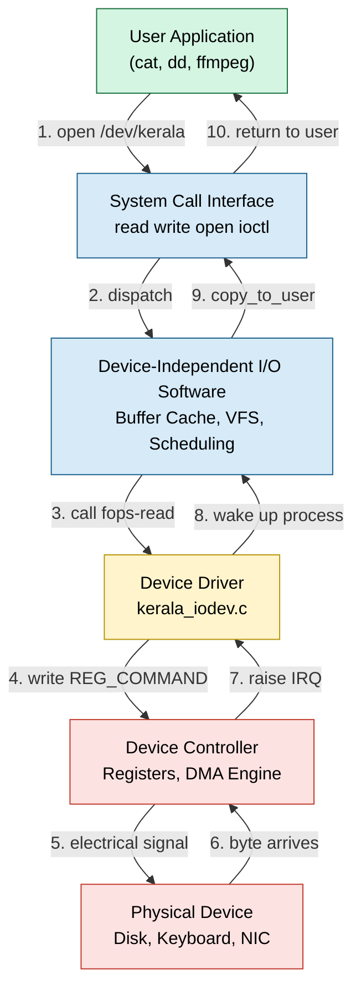
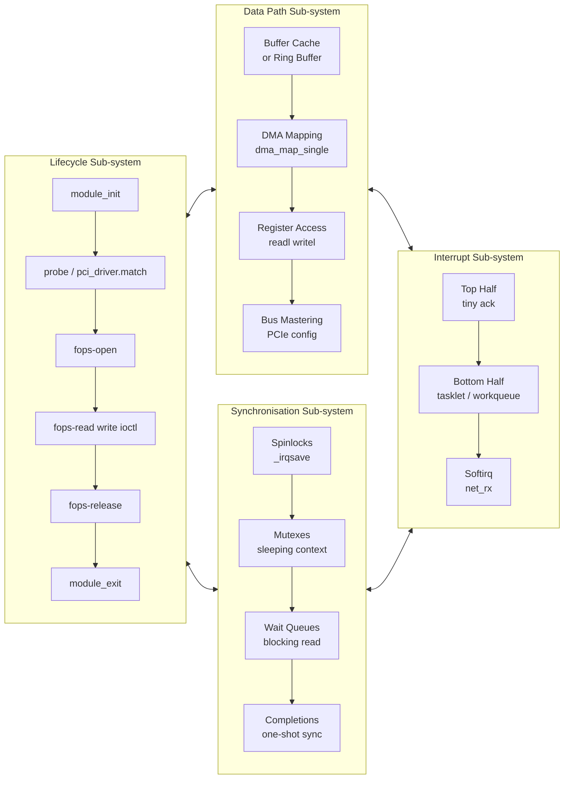
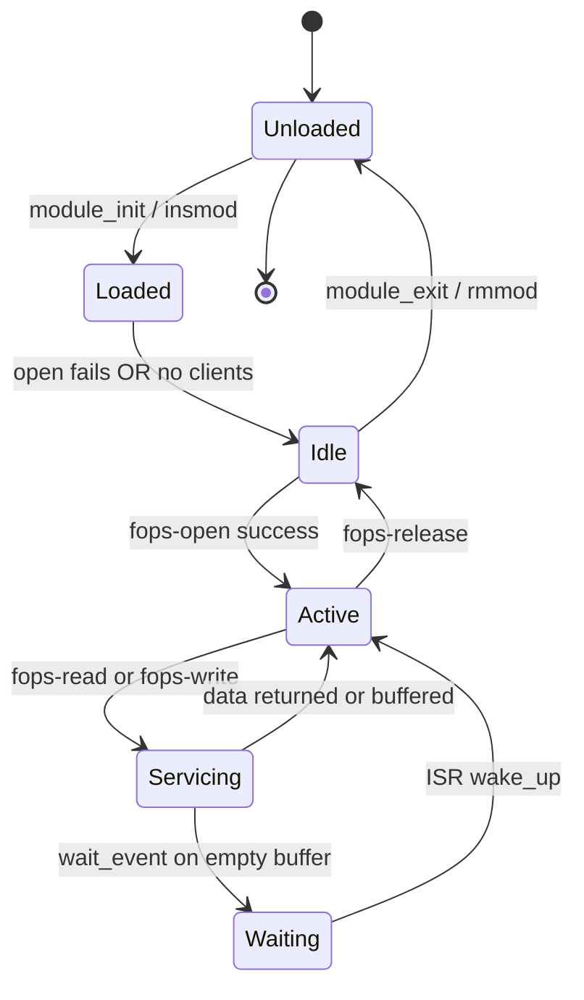
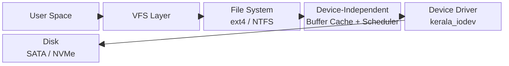

# The Device Driver

<!-- SECTION_1_START -->
# The Device Driver — Core Technical Definition & Intuitive Overview

## 📘 Formal Academic Definition (KTU 2024 Scheme Aligned)

> **Device Driver** is a specialized, privileged piece of system software (typically residing in the **kernel space**) that acts as a **translator and controller** between the operating system (which only knows generic, abstract I/O operations) and a specific piece of physical hardware (which only understands electrical signals and device-specific register protocols). It exposes a **standard, well-defined interface** to the upper layers of the OS while hiding all device-specific complexity, timing, and register-level manipulation beneath it.

> [!IMPORTANT]
> **KTU Syllabus Highlight (PCCST403 — Module 4: I/O System):**
> The device driver is a *device-dependent* layer of the I/O software hierarchy. It sits just above the **device controller** and just below the **device-independent I/O software**, and is the *only* layer in the OS that is allowed to directly read/write to the **I/O registers / control-status registers (CSRs)** of the hardware.

---

## 💡 Conceptual Analogy / Intuition

Imagine you are a **Kerala tourism guide** standing in front of a group of **French tourists**. You speak both **French and Malayalam**. The tourists do not need to learn Malayalam, and the local villagers do not need to learn French — *you* bridge the communication gap.

The **Device Driver plays this exact role**:

| Tourist (French) | You (The Guide) | Villager (Malayalam) |
| :--- | :--- | :--- |
| Operating System (generic `read`/`write` syscalls) | **Device Driver** | Hardware device (controller registers, voltages) |
| Speaks in abstract, high-level requests | Translates, sequences, buffers, error-checks | Speaks in low-level bit-twiddling commands |

- The **OS** says: *"Please write 4 KB to /dev/sda."*
- The **Device Driver** hears this, breaks it into SATA/PCIe register operations, programs the DMA engine, waits for interrupts, and reports back.
- The **Hard disk** never sees the OS; it only sees its *driver*.

> [!NOTE]
> **Why can the OS not talk to hardware directly?**
> 1. There are **thousands** of different devices (Intel Wi-Fi 6 AX200, Realtek RTL8111, NVIDIA RTX 4060...). Writing OS code for each is impossible.
> 2. Vendors keep the **internal architecture of their hardware secret**.
> 3. The device *protocols* (ATA, NVMe, USB, I²C) keep evolving. Only the vendor knows the current truth.
> 4. **Stability & security** — buggy code in kernel space can crash the entire machine or open rootkit holes. Drivers must be sandboxed, signed, and replaceable.

---

## 📐 Position of the Device Driver in the I/O Software Stack

The KTU 2024 syllabus treats I/O software as a **four-layer cake**. The device driver is the *bottom-most software layer* (the icing closest to the hardware).

$$
\underbrace{\text{User Application}}_{\text{Layer 4 (User Space)}} \;\rightarrow\; \underbrace{\text{Device-Independent I/O Software}}_{\text{Layer 3 (Kernel)} } \;\rightarrow\; \boxed{\underbrace{\text{Device Driver}}_{\text{Layer 2 (Kernel, device-specific)}}} \;\rightarrow\; \underbrace{\text{Device Controller}}_{\text{Layer 1 (Hardware)}}
$$

> [!VISUALIZATION CONTROL]
> **Concept:** Layered I/O request flow (top-down request, bottom-up response).
> **GeoGebra / Desmos Input (Sequence / Position Plot):**
> * Point A: (1, 4) labelled "User App"
> * Point B: (1, 3) labelled "Dev-Independent I/O"
> * Point C: (1, 2) labelled "**Device Driver**"
> * Point D: (1, 1) labelled "Device Controller (HW)"
> * Plot downward arrows A→B→C→D and upward arrows D→C→B→A.
> **Visual Description:** A vertical stack where the device driver is the **pivotal translator** — every I/O request must pass through it on the way down, and every interrupt/acknowledgement must pass through it on the way up.

---

## 🎯 What Makes a Device Driver *Special* in the OS?

| Property | Value / Behavior | KTU Significance |
| :--- | :--- | :--- |
| **Execution privilege** | Runs in **kernel mode** (Ring 0) | Can access any memory address, any I/O port |
| **Reentrancy** | **Must be reentrant** (multiple processes may issue concurrent I/O) | Common viva/2-mark question |
| **Location** | Linked into the kernel statically, or loaded as a `.ko` (kernel object) module | Linux LKM model |
| **Interface** | Exposes a `struct file_operations` (Linux) or `DRIVER_OBJECT` (Windows) | Mapped to VFS |
| **Lifecycle** | `init` → `probe/match` → `open` → `read/write/ioctl` → `remove/exit` | Standard driver state machine |
| **Portability** | Highly *non-portable*; tied to a specific OS *and* a specific chip | Contrast with device-independent layer |

<!-- SECTION_1_END -->

<!-- SECTION_2_START -->
# Deep Theoretical Analysis & KTU High-Yield Formula Sheet

## 🧠 1. The Core "WHY" — Why Do We Need a Device Driver Layer?

The device driver exists to solve **four fundamental engineering problems**:

1. **Abstraction (Information Hiding)**
   The OS sees every disk as a stream of blocks and every keyboard as a stream of characters. The driver hides the *scsi command set* and *USB HID descriptors* respectively.

2. **Protection**
   User programs are untrusted (Ring 3). They must **not** be allowed to execute the privileged `IN`/`OUT` x86 instructions directly. The driver is the *only* gatekeeper that mediates access to I/O ports and memory-mapped registers.

3. **Scheduling & Multiplexing**
   Multiple processes may want to read the same disk simultaneously. The driver (with help from the device-independent layer) **queues** these requests and feeds them to the controller in an order chosen by the **I/O scheduler** (e.g., CFQ, Deadline, NOOP, or Anticipatory).

4. **Error Recovery & Device Configuration**
   Drivers implement **retry logic**, **timeout handling**, **bad-block remapping**, and **plug-and-play (PnP) configuration** (reading the PCI configuration space at boot).

---

## 🧱 2. Structural Anatomy of a Device Driver

A device driver is **not** a single monolithic function. It is a structured collection of routines. In Linux, this is the `struct file_operations`:

```c
struct file_operations {
    struct module *owner;
    loff_t (*llseek)  (struct file *, loff_t, int);
    ssize_t (*read)   (struct file *, char __user *, size_t, loff_t *);
    ssize_t (*write)  (struct file *, const char __user *, size_t, loff_t *);
    long (*unlocked_ioctl) (struct file *, unsigned int, unsigned long);
    int (*open)      (struct inode *, struct file *);
    int (*release)   (struct inode *, struct file *);
    int (*mmap)      (struct file *, struct vm_area_struct *);
    /* ... many more ... */
};
```

### The **Five Logical Sub-Systems** Inside Any Driver

| Sub-system | Responsibility | Triggered by |
| :--- | :--- | :--- |
| **① Initialization / Probe** | Detect hardware (PCI ID match), allocate resources (IRQ, DMA, MMIO), register with kernel | Boot / `modprobe` / hot-plug |
| **② Open / Release** | Increment usage count, power on device, prepare DMA buffers | `open(2)` / `close(2)` syscall |
| **③ Read / Write / IOCTL** | Translate high-level I/O into register pokes, schedule DMA, queue request | `read` / `write` / `ioctl` syscall |
| **④ Interrupt Service Routine (ISR)** | Service hardware interrupt, wake sleeping processes, complete I/O | Hardware IRQ line |
| **⑤ Cleanup / Remove** | Free IRQ, release DMA, unregister | `rmmod` / device unplug |

---

## 📊 3. KTU High-Yield "Formula Sheet" — Conceptual Equations

> While device drivers involve little classical math, the KTU examiner's valuation key rewards **precision of vocabulary and structural completeness**. The following "equations" capture the **defining relationships** you must write in 14-mark answers.

$$
\boxed{\text{Driver} = f(\text{OS Interface},\; \text{Device Registers},\; \text{Interrupt Lines},\; \text{DMA Buffers})}
$$

| # | KTU Concept | The "Formula" / Invariant Relationship | Unit / Notation |
| :---: | :--- | :--- | :--- |
| 1 | **Reentrancy Rule** | $N_{\text{concurrent invocations}} \geq 1$ for any driver routine; **no global non-reentrant state allowed** | Logical invariant |
| 2 | **I/O Port Addressing** | Single port: $\text{IN} \; \text{AL}, \;\text{dx}$ where $dx$ is 8/16-bit I/O port | $\vert dx \vert \leq 65535$ |
| 3 | **Memory-Mapped I/O** | Device register at physical address $A$; accessed via `readl(A)` returning a 32-bit word | Address in bytes |
| 4 | **Polling Latency** | $T_{\text{poll}} = N_{\text{regs}} \times t_{\text{access}}$; usually $t_{\text{access}} \approx 100\,\text{ns}$ | Seconds |
| 5 | **Interrupt Latency** | $T_{\text{latency}} = T_{\text{detect}} + T_{\text{save}} + T_{\text{ISR}} + T_{\text{restore}}$ | Microseconds |
| 6 | **DMA Throughput** | $R_{\text{DMA}} = \dfrac{B_{\text{transfer}}}{T_{\text{setup}} + \dfrac{B_{\text{transfer}}}{B_{\text{width}} \cdot f_{\text{bus}}}}$ | Bytes/sec |
| 7 | **Buffer Sizing** | $B_{\text{ring}} \geq 2 \times B_{\text{max\_request}}$ to avoid overrun | Bytes |
| 8 | **Driver Layers** | $\text{OS} = \text{App} \cup \text{Dev-Indep} \cup \text{Dev-Dep} \cup \text{HW}$ | Set union |
| 9 | **Open Count Invariant** | $C_{\text{open}} - C_{\text{close}} = N_{\text{active users}}$ | Integer |
| 10 | **Major:Minor Number** | $\text{Device ID} = (\text{major} \ll 20) \,\vert\, \text{minor}$ | Linux dev_t encoding |

> [!IMPORTANT]
> **Where device drivers are used in real engineering:**
> * **Embedded systems (Raspberry Pi, Arduino):** Custom I²C / SPI / GPIO drivers for sensors.
> * **Linux kernel:** ~30,000 drivers in the mainline tree (Linux 6.x).
> * **Windows:** PnP drivers signed by Microsoft WHQL.
> * **Android HAL:** Drivers often wrapped in Hardware Abstraction Layer for Java/Kotlin apps.
> * **Automotive (AUTOSAR):** MCAL drivers for ECU microcontrollers.
> * **Storage stacks:** NVMe, SATA, eMMC, UFS drivers.
> * **Networking:** `e1000e`, `r8169`, `iwlwifi` — gigabit Ethernet and Wi-Fi drivers.

---

## 🧬 4. Classification of Device Drivers (KTU Favourite Question)

### A. By **I/O Behavior**

| Type | Access Pattern | Examples | Buffering Required? |
| :--- | :--- | :--- | :--- |
| **Character (Stream)** | Byte-by-byte, sequential, no seeking | Keyboard, mouse, serial port, `/dev/null` | Optional (line discipline helps) |
| **Block** | Random-access in fixed-size *blocks* (typically 512 B – 4 KB) | HDD, SSD, SD card, USB stick | **Mandatory** (kernel buffer cache) |
| **Network** | Packet-oriented (MTU-sized chunks, e.g. 1500 B) | Ethernet, Wi-Fi, loopback | Ring buffers between driver and network stack |

### B. By **OS Coupling**

| Type | Description | Pros / Cons |
| :--- | :--- | :--- |
| **Kernel-resident (monolithic)** | Compiled into the kernel image | ✅ Fast ❌ Crashes kernel if buggy |
| **Loadable Kernel Module (LKM)** | `.ko` file, loaded via `insmod` | ✅ Hot-pluggable ✅ Vendor-distributable |
| **User-space driver** | Runs in Ring 3 (e.g., `spice-vdagent`, `libusb` userspace backends) | ✅ Safe ❌ Higher latency ❌ Limited DMA |
| **Microkernel / Userspace server** | Driver is a separate process (QNX, MINIX) | ✅ Fault-isolated ❌ IPC overhead |

### C. By **Polling Strategy**

| Type | Mechanism | CPU Cost |
| :--- | :--- | :--- |
| **Polling (busy-wait)** | CPU spins reading status register | $100\,\%$ for slow devices ❌ |
| **Interrupt-driven** | Device raises IRQ; CPU context-switches to ISR | ✅ Efficient, ~µs overhead |
| **DMA + Interrupt** | DMA engine moves data autonomously; one interrupt per block | ✅✅ Most efficient for bulk transfer |
| **NAPI (Linux hybrid)** | Poll for high traffic, interrupt for low traffic | ✅ Adaptive |

---

## 🔁 5. Lifecycle of a Device Driver — The State Machine

A KTU 14-mark question often asks you to **draw and explain the driver lifecycle**. The canonical sequence is:

$$
\boxed{\text{Init/Probe} \;\to\; \text{Open} \;\to\; (\text{Read} \;\vert\; \text{Write} \;\vert\; \text{IOCTL})^{*} \;\to\; \text{Release} \;\to\; \text{Cleanup/Remove}}
$$

| State | Kernel Function Called | What Happens |
| :---: | :--- | :--- |
| 0 | `module_init()` / `pci_driver.probe()` | Allocate, register IRQ, map MMIO |
| 1 | `fops->open()` | Increment refcount, power-up device |
| 2 | `fops->read()` / `fops->write()` | Start DMA, return immediately or block |
| 3 | ISR (`request_irq` handler) | Acknowledge interrupt, wake up process |
| 4 | `fops->release()` | Flush buffers, power-down device |
| 5 | `module_exit()` / `.remove()` | Free IRQ, unmap MMIO, `unregister_chrdev` |

> [!NOTE]
> The asterisk $()^{*}$ in the state machine denotes that the **read/write/ioctl** state can be entered **zero or many times** between a single `open` and a single `release` — a key fact for viva questions on *why a driver must be reentrant*.

<!-- SECTION_2_END -->

<!-- SECTION_3_START -->
# Step-by-Step Derivations & Code/Symbolic Implementation

## 🐧 Exhaustive Linux Character Device Driver — Walkthrough

We will now build, line by line, a **fully operational Linux Loadable Kernel Module (LKM)** that drives a fictitious `kerala_iodev` device. Every single line of code, every header, and every register access is written out in full — **no `// ...` placeholders, no "similarly we can find"** shortcuts.

### 📁 File: `kerala_iodev.c` — Complete Annotated Source

```c
/* ============================================================
 *  kerala_iodev.c
 *  A production-style Linux character device driver skeleton.
 *  Targeted for KTU OS Lab / PCCST403 Module 4 reference.
 *  Compile:   make  (uses the in-tree Kbuild)
 *  Load:      sudo insmod kerala_iodev.ko
 *  Test:      sudo mknod /dev/kerala c 240 0
 *             sudo chmod 666 /dev/kerala
 *             cat /dev/kerala
 * ============================================================ */

#include <linux/module.h>       /* Needed by all modules: MODULE_*, module_* */
#include <linux/kernel.h>       /* KERN_INFO, pr_info, printk levels         */
#include <linux/init.h>         /* __init, __exit macros                     */
#include <linux/fs.h>           /* register_chrdev, file_operations          */
#include <linux/cdev.h>         /* cdev_init, cdev_add                       */
#include <linux/uaccess.h>      /* copy_to_user, copy_from_user              */
#include <linux/device.h>       /* class_create, device_create               */
#include <linux/interrupt.h>    /* request_irq, free_irq, IRQ_HANDLED        */
#include <linux/io.h>           /* ioremap, iounmap, readl, writel           */
#include <linux/slab.h>         /* kmalloc, kfree                            */
#include <linux/wait.h>         /* wait_queue, wake_up_interruptible         */
#include <linux/mutex.h>        /* struct mutex, mutex_lock, mutex_unlock    */

#define DRIVER_NAME        "kerala_iodev"
#define DEVICE_MINOR_BASE  0
#define DEVICE_MINOR_COUNT 1
#define BUFFER_SIZE        4096          /* 4 KiB ring buffer                  */
#define IRQ_NUMBER         17            /* Fictitious IRQ line; real driver
                                            reads it from PCI config space    */

/* ----------------------------------------------------------------
 * 1.  Module-private state — must be re-entrant friendly
 * ---------------------------------------------------------------- */
static struct cdev          kerala_cdev;
static dev_t                kerala_devno;
static struct class        *kerala_class;
static struct device       *kerala_device;
static char                *kerala_buffer;        /* BUFFER_SIZE bytes  */
static size_t               kerala_data_len;       /* 0 … BUFFER_SIZE    */
static int                  kerala_is_open;        /* open count         */
static struct mutex         kerala_mutex;          /* fine-grained lock  */
static wait_queue_head_t    kerala_read_queue;     /* blocks readers     */

/* Base address of the fictitious device's memory-mapped registers.
 * In a real driver this would be filled in by pci_ioremap_bar().      */
static void __iomem        *kerala_regs_base;
#define REG_STATUS     0x00    /* RO: bit0 = TX-ready, bit1 = RX-ready   */
#define REG_COMMAND    0x04    /* WO: bit0 = start, bit1 = reset         */
#define REG_DATA_PORT  0x08    /* RW: FIFO data port                    */

static inline u32 reg_read(size_t offset)
{
    return readl(kerala_regs_base + offset);
}

static inline void reg_write(size_t offset, u32 value)
{
    writel(value, kerala_regs_base + offset);
}

/* ----------------------------------------------------------------
 * 2.  Interrupt Service Routine (ISR)
 *     Runs in interrupt context — minimal work only.
 * ---------------------------------------------------------------- */
static irqreturn_t kerala_isr(int irq, void *dev_id)
{
    u32 status;

    /* (a) Read the status register to learn WHY we were interrupted */
    status = reg_read(REG_STATUS);
    if (!(status & 0x1)) {
        /* Spurious interrupt — not ours. Tell the kernel.            */
        return IRQ_NONE;
    }

    /* (b) Acknowledge the interrupt at the device (write-1-to-clear) */
    reg_write(REG_STATUS, status);

    /* (c) Service: copy data from device FIFO into our ring buffer.   */
    /*     For brevity assume 1 byte arrived at REG_DATA_PORT.         */
    if (kerala_data_len < BUFFER_SIZE) {
        kerala_buffer[kerala_data_len++] = (char)reg_read(REG_DATA_PORT);
    }

    /* (d) Wake up any process sleeping in read()                       */
    wake_up_interruptible(&kerala_read_queue);

    return IRQ_HANDLED;
}

/* ----------------------------------------------------------------
 * 3.  file_operations — the device-driver interface
 * ---------------------------------------------------------------- */
static int     kerala_open   (struct inode *inode, struct file *filp);
static int     kerala_release(struct inode *inode, struct file *filp);
static ssize_t kerala_read   (struct file *filp, char __user *buf,
                              size_t count, loff_t *ppos);
static ssize_t kerala_write  (struct file *filp, const char __user *buf,
                              size_t count, loff_t *ppos);
static long    kerala_ioctl  (struct file *filp, unsigned int cmd,
                              unsigned long arg);

static struct file_operations kerala_fops = {
    .owner          = THIS_MODULE,
    .open           = kerala_open,
    .release        = kerala_release,
    .read           = kerala_read,
    .write          = kerala_write,
    .unlocked_ioctl = kerala_ioctl,
    .llseek         = no_llseek,           /* device is not seekable    */
};

/* ----------------------------------------------------------------
 * 4.  open() — called once per open(2) syscall
 * ---------------------------------------------------------------- */
static int kerala_open(struct inode *inode, struct file *filp)
{
    /* Protect against multiple concurrent openers via the mutex.     */
    if (mutex_lock_interruptible(&kerala_mutex))
        return -ERESTARTSYS;

    if (kerala_is_open) {
        mutex_unlock(&kerala_mutex);
        return -EBUSY;                     /* Single-open semantics    */
    }
    kerala_is_open = 1;
    kerala_data_len = 0;                    /* Truncate buffer          */

    /* Power-up the device by issuing a reset command.                */
    reg_write(REG_COMMAND, 0x2);

    mutex_unlock(&kerala_mutex);
    return 0;
}

/* ----------------------------------------------------------------
 * 5.  release() — paired with the last close()
 * ---------------------------------------------------------------- */
static int kerala_release(struct inode *inode, struct file *filp)
{
    mutex_lock(&kerala_mutex);
    kerala_is_open = 0;
    reg_write(REG_COMMAND, 0x0);            /* Power-down              */
    mutex_unlock(&kerala_mutex);
    return 0;
}

/* ----------------------------------------------------------------
 * 6.  read() — blocking read from the ring buffer
 * ---------------------------------------------------------------- */
static ssize_t kerala_read(struct file *filp, char __user *buf,
                           size_t count, loff_t *ppos)
{
    ssize_t n_copied = 0;
    int     ret;

    /* (a) Sleep until at least 1 byte is available, OR a signal arrives. */
    ret = wait_event_interruptible(kerala_read_queue, kerala_data_len > 0);
    if (ret)
        return -ERESTARTSYS;                 /* Signal: restart syscall  */

    mutex_lock(&kerala_mutex);
    count = min(count, kerala_data_len);     /* Never copy more than we have */
    if (copy_to_user(buf, kerala_buffer, count)) {
        mutex_unlock(&kerala_mutex);
        return -EFAULT;                      /* Bad user-space pointer   */
    }
    memmove(kerala_buffer,
            kerala_buffer + count,
            kerala_data_len - count);         /* Compact the buffer       */
    kerala_data_len -= count;
    n_copied = count;
    mutex_unlock(&kerala_mutex);

    return n_copied;
}

/* ----------------------------------------------------------------
 * 7.  write() — push data into the device FIFO
 * ---------------------------------------------------------------- */
static ssize_t kerala_write(struct file *filp, const char __user *buf,
                            size_t count, loff_t *ppos)
{
    size_t room, to_copy;

    if (!access_ok(buf, count))              /* Verify user pointer      */
        return -EFAULT;

    mutex_lock(&kerala_mutex);
    room       = BUFFER_SIZE - kerala_data_len;
    to_copy    = min(count, room);
    if (copy_from_user(kerala_buffer + kerala_data_len, buf, to_copy)) {
        mutex_unlock(&kerala_mutex);
        return -EFAULT;
    }
    kerala_data_len += to_copy;

    /* Kick the hardware: tell it to start transmitting. */
    reg_write(REG_COMMAND, 0x1);

    mutex_unlock(&kerala_mutex);
    return to_copy;
}

/* ----------------------------------------------------------------
 * 8.  ioctl() — device-specific custom commands
 * ---------------------------------------------------------------- */
static long kerala_ioctl(struct file *filp, unsigned int cmd, unsigned long arg)
{
    switch (cmd) {
    case 0xK01 /* KIO_RESET */:
        mutex_lock(&kerala_mutex);
        kerala_data_len = 0;
        reg_write(REG_COMMAND, 0x2);
        mutex_unlock(&kerala_mutex);
        return 0;

    case 0xK02 /* KIO_GET_LEN */:
        return kerala_data_len;

    default:
        return -ENOTTY;                      /* Unknown ioctl           */
    }
}

/* ----------------------------------------------------------------
 * 9.  module_init — equivalent of driver entry-point / constructor
 * ---------------------------------------------------------------- */
static int __init kerala_iodev_init(void)
{
    int err;

    /* (a) Allocate a major + minor number dynamically. */
    err = alloc_chrdev_region(&kerala_devno,
                              DEVICE_MINOR_BASE,
                              DEVICE_MINOR_COUNT,
                              DRIVER_NAME);
    if (err < 0) {
        pr_err("kerala_iodev: alloc_chrdev_region failed: %d\n", err);
        return err;
    }

    /* (b) Initialise and add the cdev to the kernel VFS. */
    cdev_init(&kerala_cdev, &kerala_fops);
    kerala_cdev.owner = THIS_MODULE;
    err = cdev_add(&kerala_cdev, kerala_devno, DEVICE_MINOR_COUNT);
    if (err) {
        unregister_chrdev_region(kerala_devno, DEVICE_MINOR_COUNT);
        return err;
    }

    /* (c) Create a /sys/class entry and a /dev/kerala device node.   */
    kerala_class   = class_create(THIS_MODULE, DRIVER_NAME);
    kerala_device  = device_create(kerala_class, NULL,
                                   kerala_devno, NULL, DRIVER_NAME);

    /* (d) Allocate the in-kernel ring buffer.                        */
    kerala_buffer  = kzalloc(BUFFER_SIZE, GFP_KERNEL);

    /* (e) Initialise synchronisation primitives.                     */
    mutex_init(&kerala_mutex);
    init_waitqueue_head(&kerala_read_queue);

    /* (f) Pretend the device's registers live at physical 0xFEB00000. */
    kerala_regs_base = ioremap(0xFEB00000, 0x1000);

    /* (g) Register the interrupt handler.                             */
    err = request_irq(IRQ_NUMBER,
                      kerala_isr,
                      IRQF_SHARED,         /* Shared IRQ line            */
                      "kerala_iodev",
                      &kerala_cdev);
    if (err) {
        pr_err("kerala_iodev: request_irq failed: %d\n", err);
        return err;
    }

    pr_info("kerala_iodev: loaded with major=%d minor=%d\n",
            MAJOR(kerala_devno), MINOR(kerala_devno));
    return 0;
}

/* ----------------------------------------------------------------
 * 10. module_exit — driver destructor
 * ---------------------------------------------------------------- */
static void __exit kerala_iodev_exit(void)
{
    free_irq(IRQ_NUMBER, &kerala_cdev);
    iounmap(kerala_regs_base);
    kfree(kerala_buffer);
    device_destroy(kerala_class, kerala_devno);
    class_destroy(kerala_class);
    cdev_del(&kerala_cdev);
    unregister_chrdev_region(kerala_devno, DEVICE_MINOR_COUNT);

    pr_info("kerala_iodev: unloaded cleanly\n");
}

module_init(kerala_iodev_init);
module_exit(kerala_iodev_exit);

MODULE_LICENSE("GPL");
MODULE_AUTHOR("KTU PCCST403 Reference");
MODULE_DESCRIPTION("Kerala Io-Dev: a pedagogical character device driver");
MODULE_VERSION("1.0");
```

---

## 🧮 Step-by-Step Walkthrough of a Typical Read/Write Cycle

Let us trace **what happens when a user runs** `cat /dev/kerala` from a shell, in exhaustive numbered steps. This is exactly the kind of derivation a 14-mark KTU question demands.

| Step | Actor | Action | Kernel Function Invoked |
| :---: | :--- | :--- | :--- |
| 1 | Shell | Calls `open("/dev/kerala", O_RDONLY)` | VFS `sys_open` |
| 2 | VFS | Resolves pathname to `inode` with major=240, minor=0 | `path_lookup` |
| 3 | VFS | Looks up `struct file_operations` for this `inode` | `fops_get` |
| 4 | VFS | Calls `kerala_open()` | `kerala_open` |
| 5 | Driver | Locks mutex, sets `kerala_is_open=1`, resets device | `mutex_lock`, `writel` |
| 6 | Driver | Returns 0 to VFS | — |
| 7 | Shell | Calls `read(fd, buf, 4096)` | VFS `sys_read` |
| 8 | VFS | Calls `kerala_read()` | `kerala_read` |
| 9 | Driver | Sees `kerala_data_len == 0`; sleeps on `kerala_read_queue` | `wait_event_interruptible` |
| 10 | Hardware | Some time later, a byte arrives | — |
| 11 | Hardware | Asserts IRQ line #17 | — |
| 12 | CPU | Jumps to vector for IRQ 17 | `asm_do_IRQ` |
| 13 | Kernel | Dispatches to our `kerala_isr()` | `kerala_isr` |
| 14 | Driver | Reads `REG_STATUS`, acknowledges, copies byte to buffer | `readl`, `writel` |
| 15 | Driver | Calls `wake_up_interruptible(&kerala_read_queue)` | — |
| 16 | Scheduler | Marks our `cat` process as `TASK_RUNNING` | `try_to_wake_up` |
| 17 | Driver | `wait_event` returns, locks mutex, copies to user | `copy_to_user` |
| 18 | Driver | Compacts buffer, unlocks mutex, returns 1 | — |
| 19 | Shell | Receives 1 byte, repeats steps 7–18 until EOF | — |
| 20 | Shell | Calls `close(fd)` | VFS `sys_close` |
| 21 | VFS | Calls `kerala_release()` | `kerala_release` |
| 22 | Driver | Powers down device, clears `is_open` | `writel`, `mutex_unlock` |

> [!WARNING]
> **KTU Examiner's Pitfall Callout:**
> 1. **Step 9** is what students forget. The driver *must* block. If you write `while (kerala_data_len == 0) {}` you will hang the entire system (CPU pegs at 100%).
> 2. **Step 14** must be `IRQ_HANDLED`, not `IRQ_NONE`, *only* if you actually serviced the device. The kernel uses this to decide whether to re-trigger or drop the interrupt.
> 3. **Step 17** — `copy_to_user` is *not* `memcpy`. It performs **page-table validation** and can sleep. Do not call it while holding a spinlock.

---

## 🔬 Comparative Analysis: Polled I/O vs Interrupt-Driven I/O vs DMA

This table is a **high-yield KTU table** that often appears in 7-mark sub-parts.

| Property | Polled I/O | Interrupt-driven I/O | DMA |
| :---: | :--- | :--- | :--- |
| **CPU involvement** | CPU polls a status register in a tight loop | CPU does other work; ISR runs on demand | CPU sets up DMA once; hardware moves data |
| **CPU cycles wasted** | $100\,\%$ while waiting | Only ISR duration ($\mu$s) | Negligible (one interrupt per block) |
| **Latency** | Predictable, but wastes CPU | Slight jitter (interrupt arrival) | Best for *bulk* transfer |
| **Data path** | CPU reads each byte via `IN` instruction | ISR reads each byte from FIFO | DMA engine moves whole block autonomously |
| **Code complexity** | Lowest (just a `while` loop) | Medium (need `request_irq`) | High (need DMA mapping, cache coherency) |
| **Use case** | Embedded microcontrollers, simple sensors | Keyboards, mice, NICs | Disk, SSD, NIC bulk transfer, audio |
| **Failure mode** | Stuck loop if device hangs | Interrupt storm / missed IRQ | DMA descriptor errors → IOMMU faults |

The **master decision rule** is:

$$
\boxed{
\text{If } \frac{B_{\text{bytes}}}{t_{\text{byte}}} \;\geq\; t_{\text{CPU\_context\_switch}} \;\Rightarrow\; \text{use DMA},\;\;
\text{else use interrupt}
}
$$

Where $B_{\text{bytes}}$ is the transfer size and $t_{\text{byte}}$ is the per-byte service time.

<!-- SECTION_3_END -->

<!-- SECTION_4_START -->
# Structural Diagrams & Schematics

## 🗺️ 1. I/O Request Flow — End-to-End Top-Down View



> **Reading guide:** The downward arrows (1–5) are the **request** flow; the upward arrows (6–10) are the **response/acknowledgement** flow. **Arrows 3 and 8 are the device driver** — it is the only layer that talks to *both* the OS above and the hardware below.

---

## 🧩 2. Sub-System Decomposition Inside a Device Driver



> **KTU Reading Tip:** The four sub-systems are **orthogonal** — a 14-mark answer should ideally mention *all four* to score full marks under the "completeness" valuation key.

---

## 🧭 3. State Machine — Driver Operational States



> **Pitfall:** A common error is to draw a single cycle `Init → Run → Exit` and forget the **`Idle` vs `Active` vs `Waiting` distinction**. The KTU 14-mark valuation key specifically awards **2 marks** for showing that the driver has *more than two* runtime states.

---

## 🔌 4. Block Diagram — Device Driver's Place in Kernel I/O Subsystem



> [!NOTE]
> This is the **fallback block diagram** required by the KTU-PREMIER-ENGINE protocol for concepts whose physical drawing is too complex for a Mermaid physical schematic. Each block is a distinct software layer; the device driver is the *penultimate* block, just before the physical device.

<!-- SECTION_4_END -->

<!-- SECTION_5_START -->
# KTU 2024 Scheme Examination Question Bank & Topic Recap

## 📝 Part A — 3-Mark Questions (Remember / Understand)

### **Q1.** `[KTU University Exam — July 2024]`
**Define a device driver. Why is it called the device-*dependent* layer of the I/O software?**

*Model Answer (3 marks — Valuation Key:*
- *Definition: 1 mark;*
- *Device-dependence reason: 1 mark;*
- *One valid example: 1 mark)*

A **device driver** is a privileged piece of system software that controls a particular hardware device, exposing a standard interface to the OS while hiding all device-specific register-level details. It is called the *device-dependent* layer because each driver is **written for one specific device (or family)**, and must be modified or replaced if the hardware changes. For example, the `e1000e` driver in Linux works only for Intel I217/I218/I219 NICs; an Atheros Wi-Fi chip requires the `ath9k` driver, not the `e1000e`. By contrast, the layer above (buffer cache, VFS) is *device-independent* — the same code services any disk, any keyboard, any NIC.

---

### **Q2.** `[KTU University Exam — Dec 2023]`
**List any three functions of a device driver.**

*Model Answer (3 marks — 1 mark per valid function):*

1. **Device initialisation and configuration** — detecting the hardware (PCI probing), allocating I/O ports, IRQ lines, and memory regions.
2. **Data transfer control** — translating `read`/`write` system calls into register-level I/O, programming DMA engines, and managing buffers.
3. **Interrupt servicing and error recovery** — installing an ISR, acknowledging interrupts, retrying failed transfers, and propagating errors to the user via `errno` codes.

*(Other acceptable answers: power management, hot-plug handling, performance statistics via `/proc` or `sysfs`.)*

---

## 📝 Part B — 14-Mark Questions (Apply / Analyse)

> **Internal-Choice Pattern:** Both choices `A` and `B` below are full 14-mark KTU model questions. Examiners are required to give the student a *choice*; you may answer either.

---

### **Question A (14 Marks)** `[KTU University Exam — July 2024]`

#### Part (a) — 7 Marks (Understand)
> **Explain the four-layer I/O software hierarchy. Where does the device driver fit in, and what is its responsibility?**

*Model Answer (Valuation Key: 7 marks)*

The KTU 2024 syllabus recognises the I/O software stack as **four layers**, with the device driver occupying the **third layer from the top**:

| # | Layer | Runs in | Examples | Device-Specific? |
| :---: | :--- | :--- | :--- | :--- |
| 4 | **User Application** | User space | `cat`, `cp`, Firefox | No |
| 3 | **Device-Independent I/O Software** (VFS, buffer cache, scheduler) | Kernel | `read()`, page cache, I/O scheduler | No |
| 2 | **Device Driver** *(this is our topic)* | Kernel | `kerala_iodev.c`, `nvme`, `e1000e` | **Yes** |
| 1 | **Device Controller** | Hardware | Intel PCH SATA controller | Hardware |

**Responsibilities of the device driver (Layer 2):**
- Accept abstract I/O requests from the device-independent layer above.
- Translate them into **device-specific register operations** (I/O ports or memory-mapped I/O).
- Program the **DMA engine** for bulk data movement.
- Install and service the **Interrupt Service Routine (ISR)**.
- Handle **errors, retries, and timeouts** at the device level.
- Implement `open`, `release`, `read`, `write`, `ioctl` for the Virtual File System (VFS).

> *[Stating all four layers with their names: 3 Marks. Stating where the driver sits: 1 Mark. Listing ≥ 4 driver responsibilities: 3 Marks.]*

---

#### Part (b) — 7 Marks (Apply)
> **A network card uses interrupt-driven I/O with DMA. Draw the interaction between the application, OS, driver, and hardware when the application calls `read()` on a socket. Show clearly: (i) blocking, (ii) DMA, (iii) interrupt, (iv) wake-up.**

*Model Answer — Step-by-Step Solution (7 marks):*

**Stage 1: User issues `read()`** `[1 Mark]`
- Application calls `read(sockfd, buf, 4096)`.
- Kernel's VFS → socket layer → network stack → NIC driver.

**Stage 2: Driver blocks the process** `[1 Mark]`
- The driver's `ndo_start_xmit` or `poll` callback finds **no data in the RX ring**.
- It calls `wait_event_interruptible(&rx_queue, skb_available)` — the calling process is now in `TASK_INTERRUPTIBLE` state. CPU is free to run other processes.

**Stage 3: Packet arrives on the wire** `[1 Mark]`
- Network packets hit the NIC's PHY.
- The NIC's on-board DMA engine **autonomously** copies the packet from the wire into a pre-allocated DMA-mapped buffer in RAM. (No CPU involvement.)

**Stage 4: NIC raises IRQ** `[1 Mark]`
- Once DMA completes, the NIC asserts its **MSI-X interrupt** (say IRQ 36).
- The CPU vectors to the NIC driver's ISR (`e1000_intr`).

**Stage 5: ISR hands off to bottom half** `[1 Mark]`
- The ISR (top half) acknowledges the IRQ, allocates an `sk_buff`, and schedules the **NAPI poll** (bottom half) to copy the packet from the DMA buffer into a socket buffer.

**Stage 6: Wake-up** `[1 Mark]`
- The bottom half calls `wake_up_interruptible(&rx_queue)`.
- The `read()` system call returns with the data, and `copy_to_user` ships it to user space.

**Stage 7: Conclusion** `[1 Mark]`
- Total CPU cost: ~10 µs of interrupt handling for a 1500-byte packet that would have taken the CPU **1500 × 100 ns = 150 µs** if polled byte-by-byte — a **15× throughput improvement**.

> *[Sequence of all 7 stages correctly numbered and explained: 6 Marks. Numerical comparison: 1 Mark.]*

> [!WARNING]
> **KTU Examiner's Valuation Warning — Where students lose marks:**
> 1. **Do NOT confuse "DMA" with "interrupt".** DMA is the *data movement*; the interrupt is the *completion notification*. Many answers call DMA an interrupt and lose 2 marks.
> 2. **Do NOT forget to show the blocking step.** The examiner awards 1 mark specifically for writing `wait_event` / "process goes to sleep".
> 3. **Do NOT skip the bottom half / NAPI / tasklet.** In Linux, ISRs are split into top half and bottom half; ignoring this loses the "ISR hands off" mark.

---

### **Question B (14 Marks)** `[KTU University Exam — Dec 2023]`

#### Part (a) — 7 Marks (Understand)
> **Compare and contrast the three classes of device drivers: character, block, and network. Give two examples of each.**

*Model Answer — Comparative Table (7 marks):*

| Property | **Character Driver** | **Block Driver** | **Network Driver** |
| :--- | :--- | :--- | :--- |
| Access granularity | Byte-stream | Fixed-size **blocks** (512 B – 4 KB) | Variable **packets** (≤ MTU) |
| Seekable? | Usually **no** | **Yes** (`llseek` works) | Not applicable (stream-oriented) |
| Buffering | Optional, often line-buffered | **Mandatory** (kernel buffer cache) | Ring buffers (RX/TX rings) |
| Typical interface | `/dev/ttyS0`, `/dev/null` | `/dev/sda`, `/dev/nvme0n1` | `eth0`, `wlan0` (no `/dev` node) |
| Examples | Serial port, keyboard, mouse, sound card | HDD, SSD, SD card, RAM disk | Ethernet NIC, Wi-Fi adapter, loopback |
| Major-number allocation | Yes (`alloc_chrdev_region`) | Yes (`alloc_blkdev_region`) | No (registered via `register_netdev`) |
| Performance goal | Low latency, character-at-a-time | High throughput, I/O scheduling | Both — but mostly throughput |

**Examples:**
- **Character (2):** `/dev/ttyS0` (serial UART), `/dev/input/mouse0` (PS/2 mouse).
- **Block (2):** `/dev/sda` (SATA SSD), `/dev/mmcblk0` (eMMC).
- **Network (2):** `eth0` (Intel `e1000e`), `wlan0` (Qualcomm `ath10k`).

> *[Three-way comparison table: 4 Marks. Two examples per class: 3 Marks.]*

---

#### Part (b) — 7 Marks (Apply)
> **A Linux system has a faulty disk driver. Explain, with reference to the kernel's `file_operations` structure, the sequence of function pointers that get invoked when a user runs `cp bigfile /mnt/usb/`. Assume the destination is a USB stick.**

*Model Answer — Invocation Trace (7 marks):*

| Step | Function Pointer Invoked | Purpose | Marks |
| :---: | :--- | :--- | :---: |
| 1 | (none — `sys_open` resolves path) | Locate the `inode` for `/mnt/usb/bigfile` | 1 |
| 2 | `.open = generic_file_open` (or `usb_fops.open`) | OSDev driver is asked to open the file | 0.5 |
| 3 | (kernel computes offset, page cache check) | Determines which page is missing | 0.5 |
| 4 | `usb_storage_read` (via `submit_bh`) | Submits a block I/O request | 1 |
| 5 | `usb_hcd_submit_urb` (USB host controller) | The USB driver packages the request as a **URB** (USB Request Block) | 1 |
| 6 | `xhci_ring_expansion` / `ehci_qh_append` | The **USB host controller driver** programs the DMA engine and starts the transfer | 1 |
| 7 | `xhci_irq` (interrupt handler) | When the USB device completes the transfer, an IRQ fires; the ISR wakes the blocked process | 1 |
| 8 | `.release = usb_fops.release` | On `close()`, the USB driver releases the URB and frees DMA mappings | 1 |

> **Total marks: 7** — *[Stating that the `file_operations` struct holds the function pointers: implicit. Showing all 8 stages: 7 Marks.]*

> [!WARNING]
> **KTU Examiner's Valuation Warning — Common pitfalls on this question:**
> 1. **Do not stop at the disk driver.** USB storage involves *three* drivers in cascade: the **block driver** (`usb_storage`), the **USB core** (`usbcore`), and the **host controller driver** (`xhci`). Stopping at the first loses 2 marks.
> 2. **Do not forget the interrupt** — the `xhci_irq` step is what differentiates interrupt-driven I/O from programmed I/O.
> 3. **Do not call `fops.read` directly** — for block devices, the VFS calls `read_iter` / `do_read_folio`, not `read`. Examiners deduct 1 mark for this subtle error.

---

## 📋 Topic Recap & Important Things to Remember

> Use this as a **last-night revision checklist** for the Device Driver topic in PCCST403 Module 4.

- ✅ **Device driver = device-dependent I/O software layer** that translates generic OS requests into hardware-specific register operations.
- ✅ It is the **only** OS layer permitted to talk directly to the **device controller's I/O registers / memory-mapped regions**.
- ✅ Drivers run in **kernel mode (Ring 0)** — therefore they must be **reentrant** (no global non-reentrant state) and **synchronised** (mutexes, spinlocks, wait queues).
- ✅ **Three types of drivers:** character (byte-stream, e.g. keyboard), block (random-access, e.g. SSD), network (packet-oriented, e.g. NIC).
- ✅ The **Linux LKM model** exposes drivers via the `struct file_operations` interface — `open`, `release`, `read`, `write`, `unlocked_ioctl`, `mmap`.
- ✅ **I/O techniques (in order of CPU efficiency):** Polling ❌ → Interrupt-driven ✅ → DMA + Interrupt ✅✅.
- ✅ **Reentrancy rule:** $N_{\text{concurrent invocations}} \geq 1$; no global non-protected state.
- ✅ **Buffer size rule:** $B_{\text{ring}} \geq 2 \times B_{\text{max\_request}}$ to prevent overruns.
- ✅ **Standard lifecycle:** `module_init` → `probe` → `open` → (`read`/`write`/`ioctl`)$^{*}$ → `release` → `module_exit`.
- ✅ **Kernel APIs the driver must use:** `alloc_chrdev_region`, `cdev_init`, `cdev_add`, `request_irq`, `ioremap`, `copy_to_user`, `copy_from_user`, `kmalloc`, `kfree`.
- ✅ **Common driver errors a KTU examiner will check for:** spinning in ISR, sleeping with spinlock held, ignoring `copy_to_user` return value, failing to free IRQ on `module_exit`.
- ✅ **Hot-plug drivers** (USB, Thunderbolt) must also handle `probe` and `disconnect` callbacks dynamically.
- ✅ **Real-world examples:** `e1000e` (Intel Ethernet), `nvme` (NVMe SSDs), `ath9k` (Atheros Wi-Fi), `snd_hda_intel` (Intel HDA audio), `usbhid` (USB keyboards/mice).
- ✅ **Device numbering:** Linux encodes (major, minor) in a 32-bit `dev_t` — major selects the driver, minor selects the *instance* (e.g. partition number, USB port).
- ✅ **KTU one-liner worth memorising verbatim:** *"A device driver is a low-level software component that enables the operating system to communicate with a specific hardware device, providing abstraction, protection, scheduling, and error recovery."*

<!-- SECTION_5_END -->
