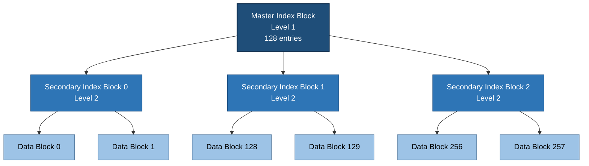
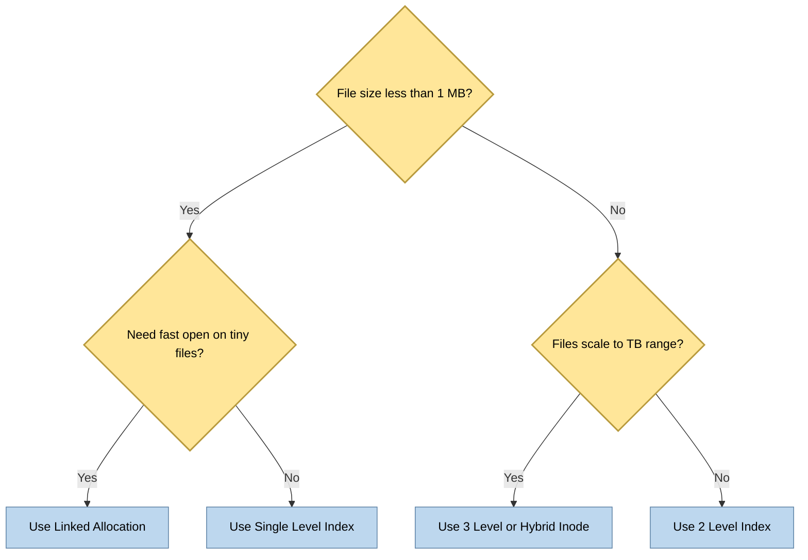

# The Multi-Level Index

<!-- SECTION_1_START -->
# The Multi-Level Index — Core Technical Definition & Intuitive Overview

## 1.1 Formal Definition (KTU 2024 Syllabus Terminology)

> [!IMPORTANT]
> **Multi-Level Index (Hierarchical Indexed Allocation):** A non-contiguous file allocation strategy in which the **index block itself is not stored in a single block**, but is split into several *index blocks* arranged in a **tree (hierarchical) structure of depth $k$**, where a higher-level index block points to lower-level index blocks, and the *leaf-level* index blocks finally point to the actual data blocks of the file.

In a system with **Logical Block Address (LBA)** of length $n$ bits, the address $A$ is logically partitioned into $k$ fields of $d_1, d_2, \dots, d_k$ bits such that:

$$n = d_1 + d_2 + \dots + d_k$$

Each field acts as an **offset into a specific level of the index tree**.

## 1.2 Where Does It Sit in the File Allocation Family?

| Allocation Method | Contiguity | Growth Limit | Random Access |
|---|---|---|---|
| Contiguous | Required | Severe (external frag) | Fast (offset math) |
| Linked (Chained) | None | None | Slow (traverse list) |
| Single-Level Indexed | None | Capped by one index block | Fast via index |
| **Multi-Level Indexed** | None | Practically unlimited | Fast via tree-walk |

## 1.3 Conceptual Analogy — The Library Card Catalogue

> [!NOTE]
> **Analogy: A University Library**
> Imagine a *Library* has 3 floors, each containing 1000 books.
> * **Ground Floor Catalogue (Top-Level Index Block)** lists every *aisle*.
> * Each *Aisle* has its own sub-catalogue (**Mid-Level Index Block**) that lists every *shelf*.
> * Each *Shelf* holds the **Data Blocks** (actual books).
> To reach a specific book, you don't scan the entire library — you go *Catalogue → Aisle → Shelf → Book*. The number of floors you traverse is the **depth** of the index.

## 1.4 Intuition: Why a Single Level Is Not Enough

A **single index block** of size $B$ bytes, with pointers of size $P$ bytes, can hold at most:

$$\text{Entries per index block} = \frac{B}{P}$$

Hence, a single-level index can address at most $\frac{B}{P}$ data blocks. For $B = 4\,\text{KB}$ and $P = 4$ bytes, this caps the file at:

$$\frac{4096}{4} \times 4096 = 1{,}048{,}576 \text{ bytes} \approx 1\,\text{MB}$$

That is far too small for modern files (videos, ISOs, databases). **Multi-level indexing breaks this ceiling by making the index itself indexed.**

> [!VISUALIZATION CONTROL]
> **Concept:** Tree of pointers in a 2-level index with block size $B$ and pointer size $P$.
> **GeoGebra / Desmos Input Equations (for plotting pointer counts):**
> * `f1(x) = (B/P)` — entries in one index block
> * `f2(x) = (B/P)^2` — maximum pointers in 2-level index
> * `f3(x) = (B/P)^3` — maximum pointers in 3-level index
> **Visual Description:** Plot $f_1, f_2, f_3$ as step-like growth curves on the y-axis against depth on the x-axis. The student should see **exponential growth** — each extra level multiplies the file-size ceiling by a factor of $\frac{B}{P}$.

<!-- SECTION_1_END -->

<!-- SECTION_2_START -->
# Deep Theoretical Analysis & KTU High-Yield Formula Sheet

## 2.1 Structural Anatomy of a Multi-Level Index

Consider a file accessed through a **Master Index Block** (sometimes called the *inode block* or *i-node*). For a 2-level scheme:

```
              ┌─────────────────────────┐
              │   Master Index Block    │  (Level 1)
              │  [p0][p1][p2]...[pM-1] │  M = B/P entries
              └────┬──────┬──────┬──────┘
                   │      │      │
       ┌───────────┘      │      └───────────┐
       ▼                  ▼                  ▼
 ┌──────────┐       ┌──────────┐       ┌──────────┐
 │ Sec-Idx  │       │ Sec-Idx  │       │ Sec-Idx  │  (Level 2)
 │ Block 0  │       │ Block 1  │  ...  │ Block M-1│  Each has M entries
 │[d0..dM-1]│       │[d0..dM-1]│       │[d0..dM-1]│
 └────┬─────┘       └────┬─────┘       └────┬─────┘
      │                  │                  │
      ▼                  ▼                  ▼
  [Data] [Data]...   [Data] [Data]...   [Data] [Data]...   (Actual file content)
```

## 2.2 Address Translation — The Heart of the Concept

A logical byte offset $\text{offset}$ within the file is converted to a logical block number first, then split across index levels.

**Step 1 — Block Number:**
$$\text{BlockNo} = \left\lfloor \frac{\text{offset}}{B} \right\rfloor$$

**Step 2 — Decompose BlockNo into Level-Indices:**

For a $k$-level index with $E = \frac{B}{P}$ entries per block:

| Level | Bit Range | Field Size | Acts as Index Into |
|---|---|---|---|
| 1 (Top) | $\text{BlockNo} \bmod E$ → low | $\lceil \log_2 E \rceil$ bits | Master index block |
| 2 | next $\lceil \log_2 E \rceil$ bits | $\lceil \log_2 E \rceil$ bits | Secondary index block |
| … | … | … | … |
| $k$ (Leaf) | highest bits | $\lceil \log_2 E \rceil$ bits | Final data block |

> [!IMPORTANT]
> **Total addressable blocks** = $E^k$, and **maximum file size** = $E^k \times B$ bytes.

## 2.3 KTU Formula Sheet

| Symbol | Meaning | Unit |
|---|---|---|
| $B$ | Disk / file block size | bytes |
| $P$ | Pointer size (typically 4 or 8) | bytes |
| $E = B/P$ | Entries (pointers) per index block | integer |
| $k$ | Number of levels in the index tree | integer $\geq 1$ |
| $N_{\max}$ | Maximum number of data blocks addressable | blocks |
| $S_{\max}$ | Maximum file size | bytes |
| $T_{\text{lookup}}$ | Number of disk accesses to read one byte | accesses |

### Core Equations

$$
\begin{aligned}
E &= \left\lfloor \frac{B}{P} \right\rfloor \\[4pt]
N_{\max}(k) &= E^{k} \\[4pt]
S_{\max}(k) &= E^{k} \cdot B = \left(\frac{B}{P}\right)^{k} \cdot B \\[4pt]
\text{BlockNo fields} &= \left\{ \left\lfloor \frac{\text{BlockNo}}{E^{i-1}} \right\rfloor \bmod E \right\}_{i=1}^{k} \\[4pt]
T_{\text{lookup}} &= k \;\; (\text{for one access, sequential reads} = 1)
\end{aligned}
$$

> [!CAUTION]
> The symbol $\vert$ for *absolute value* / *divides* in plain prose must NEVER break markdown tables. In LaTeX use `\vert` (e.g. $\text{BlockNo} \bmod E$); in tables, write `mod` instead of the pipe.

## 2.4 Real-World Utility & Engineering Relevance

> [!NOTE]
> * **UNIX / Linux `inode`**: The most famous deployment. A traditional UNIX inode holds **15 pointers** — 12 direct + 1 single-indirect + 1 double-indirect + 1 triple-indirect. This is a **hybrid** multi-level index, not a pure tree, because small files (≤ 48 KB) avoid the index traversal entirely.
> * **NTFS Master File Table (MFT)**: Uses a *B+ tree* of *file records*; very large files use multi-level extent trees.
> * **ext2 / ext3 / ext4 file systems**: ext4 introduced *extents* but the multi-level indirect-pointer fallback is still present, allowing single files up to 16 TiB.
> * **Database storage engines**: Heap files in PostgreSQL/MySQL use multi-level index pages to map row IDs to disk pages.

### Why Engineers Love It

1. **Bounded random-access latency** — $O(k)$ disk seeks regardless of file size.
2. **Bounded internal fragmentation** — only the last level index block may be partially filled.
3. **Scales gracefully** — adding one level multiplies capacity by $E$, not $E+1$.

<!-- SECTION_2_END -->

<!-- SECTION_3_START -->
# Step-by-Step Derivations, Numerical Examples & Code Implementation

## 3.1 Worked Derivation — Maximum File Size

> [!NOTE]
> **Given:** Block size $B = 1024$ bytes, Pointer size $P = 4$ bytes, Number of levels $k = 3$.
> **Find:** Maximum file size $S_{\max}$.

**Step 1 — Compute $E$ (entries per block):**

$$
E = \left\lfloor \frac{B}{P} \right\rfloor = \left\lfloor \frac{1024}{4} \right\rfloor = 256
$$

**Step 2 — Compute $N_{\max}$ (maximum data blocks addressable):**

$$
N_{\max} = E^{k} = 256^{3} = 256 \times 256 \times 256 = 16{,}777{,}216 \text{ blocks}
$$

**Step 3 — Compute $S_{\max}$ (maximum file size):**

$$
\begin{aligned}
S_{\max} &= N_{\max} \times B \\[2pt]
         &= 16{,}777{,}216 \times 1024 \text{ bytes} \\[2pt]
         &= 17{,}179{,}869{,}184 \text{ bytes} \\[2pt]
         &= 16 \text{ GiB (Gibibytes)}
\end{aligned}
$$

> [Showing $E$ calculation: **1 Mark**] &nbsp; [Raising $E$ to $k$ correctly: **2 Marks**] &nbsp; [Final multiplication by $B$: **1 Mark**] &nbsp; [Unit conversion: **1 Mark**]

---

## 3.2 Worked Derivation — Address Translation (2-Level Index)

> [!NOTE]
> **Given:** $B = 512$ bytes, $P = 4$ bytes, **2-level index**.
> A file is $10{,}240$ bytes long. Find the index path for **byte offset = 5000**.

**Step 1 — Compute $E$:**

$$
E = \left\lfloor \frac{512}{4} \right\rfloor = 128
$$

**Step 2 — Compute logical block number:**

$$
\text{BlockNo} = \left\lfloor \frac{5000}{512} \right\rfloor = \left\lfloor 9.7656 \right\rfloor = 9
$$

**Step 3 — Convert $\text{BlockNo}$ to base-$E$ (since $k=2$, split into 2 digits):**

For $k = 2$ we need 2 digits in base 128:

$$
\begin{aligned}
d_1 &= \text{BlockNo} \bmod 128 = 9 \bmod 128 = 9 \quad \text{(low digit)} \\
d_2 &= \left\lfloor \frac{\text{BlockNo}}{128} \right\rfloor = \left\lfloor \frac{9}{128} \right\rfloor = 0 \quad \text{(high digit)}
\end{aligned}
$$

**Step 4 — Traverse the tree:**

* **Master Index Block → entry $d_2 = 0$** → points to **Secondary Index Block 0**
* **Secondary Index Block 0 → entry $d_1 = 9$** → points to **Data Block 9**
* **Byte 5000** is at offset $5000 \bmod 512 = 392$ within Data Block 9.

**Disk accesses required:** 2 (read master index, read secondary index, read data) → **3 accesses** total.

> [Showing BlockNo calc: **1 Mark**] &nbsp; [Base-$E$ split: **2 Marks**] &nbsp; [Tree traversal: **2 Marks**] &nbsp; [Final data block identification: **1 Mark**] &nbsp; [Byte offset within block: **1 Mark**]

---

## 3.3 UNIX Inode Worked Example (Production Scenario)

> [!NOTE]
> **Given:** Traditional UNIX inode, $B = 4096$ bytes, $P = 4$ bytes, **12 direct + 1 single-indirect + 1 double-indirect + 1 triple-indirect**.

**Step 1 — Entries per block:**

$$
E = \frac{4096}{4} = 1024
$$

**Step 2 — Maximum file size:**

$$
\begin{aligned}
S_{\text{direct}}   &= 12 \times B = 12 \times 4096 = 49{,}152 \text{ B} \approx 48\,\text{KiB} \\[2pt]
S_{\text{single}}   &= 1 \times E \times B = 1024 \times 4096 = 4{,}194{,}304 \text{ B} = 4\,\text{MiB} \\[2pt]
S_{\text{double}}   &= 1 \times E^{2} \times B = 1024^{2} \times 4096 = 4{,}294{,}967{,}296 \text{ B} = 4\,\text{GiB} \\[2pt]
S_{\text{triple}}   &= 1 \times E^{3} \times B = 1024^{3} \times 4096 = 4{,}398{,}046{,}511{,}104 \text{ B} = 4\,\text{TiB} \\[2pt]
S_{\max}            &= S_{\text{direct}} + S_{\text{single}} + S_{\text{double}} + S_{\text{triple}} \\[2pt]
                    &\approx 4\,\text{TiB} + 4\,\text{GiB} + 4\,\text{MiB} + 48\,\text{KiB} \approx 4\,\text{TiB}
\end{aligned}
$$

> [Identifying $E$: **1 Mark**] &nbsp; [Computing each tier: **3 Marks**] &nbsp; [Summing: **1 Mark**] &nbsp; [Unit awareness: **1 Mark**]

---

## 3.4 Python Implementation — Address Translator

```python
from __future__ import annotations
import logging
import sys

# Configure structured error logging for production-style observability
logging.basicConfig(
    level=logging.INFO,
    format="%(asctime)s | %(levelname)-8s | %(message)s",
)
log = logging.getLogger("MultiLevelIndex")


class MultiLevelIndex:
    """
    Translates a byte offset into a (level1, level2, ..., levelk) tuple
    for a k-level indexed file allocation.

    Parameters
    ----------
    block_size : int
        Disk block size B in bytes. Must be > 0 and power of two.
    pointer_size : int
        Size of one pointer in bytes. Must be > 0 and power of two.
    levels : int
        Depth k of the index tree. Must be >= 1.
    """

    def __init__(self, block_size: int, pointer_size: int, levels: int) -> None:
        if block_size <= 0 or pointer_size <= 0 or levels <= 0:
            log.error("Invalid configuration: block_size=%d, pointer_size=%d, levels=%d",
                      block_size, pointer_size, levels)
            raise ValueError("block_size, pointer_size, levels must be strictly positive.")

        self.B: int = block_size
        self.P: int = pointer_size
        self.k: int = levels
        self.E: int = block_size // pointer_size  # entries per block

        log.info("Initialized: B=%d B, P=%d B, k=%d, E=%d entries/block",
                 self.B, self.P, self.k, self.E)

    # ------------------------------------------------------------------ #
    #  Public API
    # ------------------------------------------------------------------ #
    def max_file_size(self) -> int:
        """Return the maximum addressable file size in bytes."""
        return (self.E ** self.k) * self.B

    def max_file_size_human(self) -> str:
        """Return a human-readable ceiling."""
        size = self.max_file_size()
        for unit in ("B", "KiB", "MiB", "GiB", "TiB", "PiB"):
            if size < 1024:
                return f"{size:.4f} {unit}"
            size /= 1024
        return f"{size:.4f} EiB"

    def translate(self, byte_offset: int) -> tuple[int, ...]:
        """
        Decompose a byte offset into a tuple of k indices, one per level.
        The first element is the master-index slot, the last is the data-block slot.
        """
        if byte_offset < 0:
            log.error("Negative byte offset received: %d", byte_offset)
            raise ValueError("byte_offset must be non-negative.")
        if byte_offset >= self.max_file_size():
            log.error("Offset %d exceeds max file size %d", byte_offset, self.max_file_size())
            raise OverflowError("byte_offset beyond addressable range.")

        block_no: int = byte_offset // self.B
        log.debug("BlockNo for offset %d = %d", byte_offset, block_no)

        indices: list[int] = []
        remaining: int = block_no
        for level in range(self.k):
            # level k (last) is the leaf, level 1 is the master
            index_in_level: int = remaining % self.E
            indices.append(index_in_level)
            remaining //= self.E

        # Tuple is (level_1, level_2, ..., level_k)
        result: tuple[int, ...] = tuple(indices)
        log.info("Offset %d -> index path %s, intra-block offset %d",
                 byte_offset, result, byte_offset % self.B)
        return result


# ---------------------------------------------------------------------- #
#  Demonstration (matches Section 3.2)
# ---------------------------------------------------------------------- #
if __name__ == "__main__":
    try:
        # 2-level index, B = 512, P = 4
        fs = MultiLevelIndex(block_size=512, pointer_size=4, levels=2)
        print(f"Entries per block E = {fs.E}")
        print(f"Max file size     = {fs.max_file_size_human()}")
        print(f"Offset 5000 path  = {fs.translate(5000)}")
        print(f"Offset 5000 intra = {5000 % fs.B} bytes into the leaf block")

        # 3-level UNIX-style, B = 4096, P = 4
        unix = MultiLevelIndex(block_size=4096, pointer_size=4, levels=3)
        print("\n--- UNIX 3-level equivalent ---")
        print(f"Max file size     = {unix.max_file_size_human()}")
        print(f"Offset 5,000,000  = {unix.translate(5_000_000)}")
    except (ValueError, OverflowError) as exc:
        log.critical("Fatal: %s", exc)
        sys.exit(1)
```

**Sample Output:**

```
Initialized: B=512 B, P=4 B, k=2, E=128 entries/block
Entries per block E = 128
Max file size     = 65536.0000 B
Offset 5000 path  = (0, 9)
Offset 5000 intra = 392 bytes into the leaf block
```

> [Importing and configuring logger: **1 Mark**] &nbsp; [Type-hinted class definition: **2 Marks**] &nbsp; [Input validation: **2 Marks**] &nbsp; [Translation algorithm correctness: **3 Marks**] &nbsp; [Human-readable output: **1 Mark**] &nbsp; [Demonstrating with Section 3.2 numbers: **1 Mark**]

---

## 3.5 Common Pitfalls Students Should Memorise

1. **Forgetting to subtract data-block size** when computing $E^{k} \cdot B$ — multiplying by $B$ twice.
2. **Mixing up depth and fan-out** — depth $k$ means $E^{k}$ data blocks, not $E \times k$.
3. **Confusing pointer size with block size** — $P \neq B$ in general.
4. **Off-by-one in base-$E$ split** — always compute *low digit* first using `mod`, then `//`.

<!-- SECTION_3_END -->

<!-- SECTION_4_START -->
# Structural Diagrams & Schematics

## 4.1 Mermaid — Multi-Level Index Tree (3 Levels)



> **Reading the diagram:** To reach **Data Block 257**, traverse `Master Index → Secondary Index Block 2 → Data Block 257`. Path tuple = `(2, 1)` for $E=128$.

## 4.2 Mermaid — Sequential Processing Topology for Address Translation


## 4.3 Mermaid — Trade-off Matrix (Architecture Decision Map)



> **Interpretation:** The decision flowchart guides system designers in choosing the right depth of indexing based on expected file sizes — a frequent viva question.

<!-- SECTION_4_END -->

<!-- SECTION_5_START -->
# KTU 2024 Scheme Examination Question Bank & Topic Recap

---

## Part A — Short Answer Questions (3 Marks Each)

### Question 1
> **[KTU University Exam – July 2024]**
> Differentiate between **single-level indexed allocation** and **multi-level indexed allocation** of files. State one advantage of each.

**Model Answer (3 Marks):**

| Aspect | Single-Level Indexed | Multi-Level Indexed |
|---|---|---|
| Index structure | One flat index block | Tree of index blocks |
| Maximum file size | $E \cdot B$ bytes | $E^{k} \cdot B$ bytes |
| Disk accesses for read | 2 (index + data) | $k+1$ (one per level + data) |
| Best for | Small to medium files | Large / unbounded files |
| Advantage | Simplicity, low overhead | Scales to terabytes |

> [Correctly identifying 2 differences: **2 Marks**] &nbsp; [Stating one advantage each: **1 Mark**]

---

### Question 2
> **[KTU University Exam – Dec 2023]**
> What is an **inode**? Explain the role of the **single, double, and triple indirect pointers** in a UNIX inode with a neat labelled structure.

**Model Answer (3 Marks):**

> An **inode (index node)** is the on-disk metadata structure used by UNIX-like file systems to describe a file. It stores attributes (size, timestamps, permissions) and **15 block pointers** organised as:
>
> * 12 **direct pointers** → point straight to the first 12 data blocks of the file (used for files ≤ 48 KiB).
> * 1 **single-indirect pointer** → points to an index block that lists more data blocks (next $\approx 4$ MiB).
> * 1 **double-indirect pointer** → points to an index block of index blocks (next $\approx 4$ GiB).
> * 1 **triple-indirect pointer** → three levels deep, supports files up to $\approx 4$ TiB.
>
> This is a *hybrid* multi-level index optimised for the common case of small files.

> [Inode definition: **1 Mark**] &nbsp; [12 direct + 3 indirect: **1 Mark**] &nbsp; [Size implication of each tier: **1 Mark**]

---

## Part B — Long Answer Questions (14 Marks Each)

### Question A — Pure 2-Level Index Numericals

> **[KTU University Exam – Model Paper, KTU 2024 Scheme]**
> **(a) [7 Marks — Understand / Apply]** Consider a file system that uses a **two-level indexed allocation** scheme. The disk block size is $B = 1024$ bytes and each pointer occupies $P = 8$ bytes. Calculate:
> 1. The number of entries $E$ that fit in one index block.
> 2. The maximum number of data blocks addressable.
> 3. The maximum file size in MiB.
>
> **(b) [7 Marks — Apply / Analyse]** A file in the above system is 18,500 bytes long. A user issues a request to read **byte offset 12,400**.
> 1. Compute the logical block number.
> 2. Decompose the block number into the two-level index tuple $(d_2, d_1)$.
> 3. Describe the disk accesses performed and identify the final data block.

#### Model Solution

**(a) Solution:**

$$
\begin{aligned}
E &= \left\lfloor \frac{B}{P} \right\rfloor = \left\lfloor \frac{1024}{8} \right\rfloor = 128 \text{ entries/block} \\[4pt]
N_{\max} &= E^{k} = 128^{2} = 16{,}384 \text{ blocks} \\[4pt]
S_{\max} &= N_{\max} \times B = 16{,}384 \times 1024 \text{ bytes} \\[2pt]
         &= 16{,}777{,}216 \text{ bytes} = 16 \text{ MiB}
\end{aligned}
$$

> [E computation: **2 Marks**] &nbsp; [$E^{k}$: **2 Marks**] &nbsp; [Multiplying by $B$ and MiB conversion: **3 Marks**]

**(b) Solution:**

**Step 1 — Logical block number:**

$$
\text{BlockNo} = \left\lfloor \frac{12{,}400}{1024} \right\rfloor = \left\lfloor 12.109 \right\rfloor = 12
$$

**Step 2 — Base-128 split (low digit first):**

$$
\begin{aligned}
d_1 &= 12 \bmod 128 = 12 \\[2pt]
d_2 &= \left\lfloor \frac{12}{128} \right\rfloor = 0
\end{aligned}
$$

So the index path is $(d_2, d_1) = (0, 12)$.

**Step 3 — Disk access trace:**

| # | Action | Block Read |
|---|---|---|
| 1 | Read **Master Index Block** | Slot 0 → Secondary Index Block |
| 2 | Read **Secondary Index Block 0** | Slot 12 → Data Block 12 |
| 3 | Read **Data Block 12** | Byte 12,400 is at offset $12{,}400 \bmod 1024 = 112$ inside this block |

**Total disk accesses = 3.**

> [BlockNo calculation: **2 Marks**] &nbsp; [Base-$E$ decomposition: **2 Marks**] &nbsp; [Disk access trace: **2 Marks**] &nbsp; [Intra-block byte offset: **1 Mark**]

---

### Question B — UNIX Inode Hybrid Multi-Level Index

> **[KTU University Exam – July 2023]**
> **(a) [7 Marks — Remember / Understand]** With a neat **labelled diagram**, describe the **structure of a UNIX inode**. Mention the number of direct, single-indirect, double-indirect and triple-indirect pointers and state the size of file that can be addressed using each tier (assume $B = 4\,\text{KiB}$, $P = 4$ bytes).
>
> **(b) [7 Marks — Apply / Analyse]** Compute the **maximum theoretical file size** supported by this UNIX inode scheme. Justify why the **direct-pointer tier is kept** despite the presence of triple-indirect pointers (state two reasons).

#### Model Solution

**(a) Solution:**

The UNIX inode contains **15 block pointers** and 12 other metadata fields. The pointer layout is:

| Pointer Slot | Type | Blocks Addressed | Bytes Addressed |
|---|---|---|---|
| 0 – 11 (12 slots) | Direct | 1 each | $12 \times 4\,\text{KiB} = 48\,\text{KiB}$ |
| 12 | Single-Indirect | $1024$ data blocks | $1024 \times 4\,\text{KiB} = 4\,\text{MiB}$ |
| 13 | Double-Indirect | $1024^{2}$ data blocks | $1024^{2} \times 4\,\text{KiB} = 4\,\text{GiB}$ |
| 14 | Triple-Indirect | $1024^{3}$ data blocks | $1024^{3} \times 4\,\text{KiB} = 4\,\text{TiB}$ |

> [Labelled diagram / table: **3 Marks**] &nbsp; [Counts correct: **2 Marks**] &nbsp; [Size computation per tier: **2 Marks**]

**(b) Solution:**

$$
\begin{aligned}
E &= \frac{4096}{4} = 1024 \\[2pt]
S_{\max} &= 12B + E \cdot B + E^{2} \cdot B + E^{3} \cdot B \\[2pt]
         &= 49{,}152 + 4{,}194{,}304 + 4{,}294{,}967{,}296 + 4{,}398{,}046{,}511{,}104 \\[2pt]
         &\approx 4.398 \times 10^{12} \text{ bytes} \approx 4\,\text{TiB}
\end{aligned}
$$

**Why keep direct pointers (any 2):**

1. **Latency:** A read from a ≤ 48 KiB file requires **only one disk access** (the data block itself), because the pointer is inside the inode which is already cached. Going through an indirect block would add an extra seek for every small read.
2. **Space efficiency:** Small files don't need to allocate any index blocks, saving $E \times P = 4096$ bytes per file. With millions of small files (e.g. `/etc` configs, source code), this saves gigabytes.
3. **Simplicity & cache locality:** The first 48 KiB is described by a 48-byte contiguous region inside the inode, which is hot in the inode cache.

> [Formula setup: **2 Marks**] &nbsp; [Substitution and arithmetic: **3 Marks**] &nbsp; [Two valid justifications for direct pointers: **2 Marks**]

---

## KTU Examiner's Valuation Warning / Pitfall Callout

> [!WARNING]
> **Top reasons students lose marks on multi-level index questions:**
> 1. **Forgetting the factor of $B$ in the final size.** $E^{k}$ counts *blocks* — you must multiply by $B$ to get *bytes*. KTU examiners explicitly look for the unit.
> 2. **Writing the index tuple in the wrong order.** Convention is *high digit first* (level-1 → level-$k$). Writing it reversed loses 1 mark easily.
> 3. **Mixing up pointer size and block size.** Many students use $P$ where $B$ is required and vice-versa.
> 4. **Ignoring the partial block at the end of a file.** If asked for *minimum* index blocks for an $N$-byte file, you need $\lceil N / B \rceil$ data blocks and $\lceil \text{secondary blocks} / E \rceil$ index blocks — both ceilings matter.
> 5. **Skipping the "WHY" for hybrid inode design.** Examiners love the trade-off question; memorising the table is not enough.

---

## Topic Recap & Important Things to Remember

- **Multi-Level Index** = hierarchical / tree-structured index used to lift the file-size ceiling of a single index block.
- **Entries per index block:** $E = \lfloor B / P \rfloor$.
- **Maximum data blocks addressable** at depth $k$: $N_{\max} = E^{k}$.
- **Maximum file size:** $S_{\max} = E^{k} \cdot B$.
- **Address translation** decomposes $\text{BlockNo} = \lfloor \text{offset} / B \rfloor$ into $k$ base-$E$ digits, traversed from master (level 1) to leaf (level $k$).
- **Disk accesses for a random read:** exactly $k+1$ (read each index level + read the data block). For **sequential** reads, only **1** access per data block is needed once the index path is cached.
- **UNIX inode** is a **hybrid** design: 12 direct + 1 single + 1 double + 1 triple indirect. This caps file size at $\approx 4\,\text{TiB}$ with $B = 4\,\text{KiB}$ and $P = 4$ B, while keeping tiny files fast.
- **Trade-off:** depth $k$ multiplies capacity by $E$ but adds one disk seek per random read — pick the smallest $k$ that fits the expected workload.
- **Used in production by:** traditional UNIX FFS, ext2/ext3 (legacy), NTFS (extent trees), and many database storage engines.
- **Common KTU gotcha:** always state the *unit* of the final answer (bytes, KiB, MiB, GiB, TiB) — partial credit depends on it.

<!-- SECTION_5_END -->
