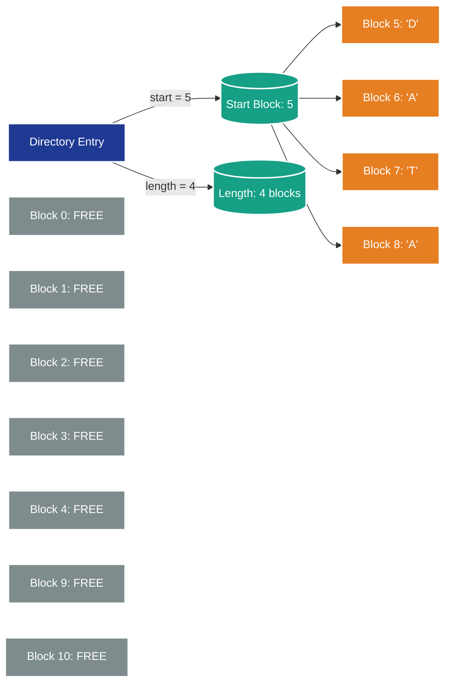
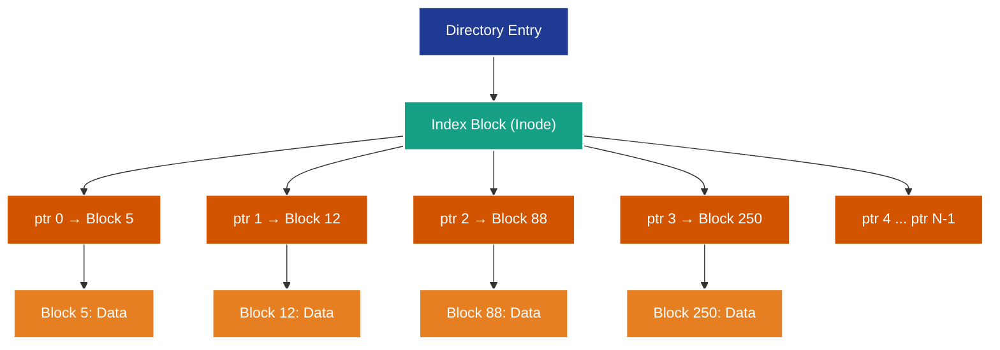

# File System Implementation: Allocation methods (Contiguous, Linked, Indexed) and Free-space management

<!-- SECTION_1_START -->
# File System Implementation: Allocation Methods & Free-Space Management

> [!IMPORTANT]
> **KTU 2024 Scheme | Operating Systems (PCCST403) | Module 4**
> *High-Yield Topic: Frequently tested in University Exams (14-Mark derivations and 3-Mark short questions)*

## 1.1 What is a File Allocation Method?

**File Allocation Method** is the mechanism by which the Operating System maps logical file blocks (as seen by the user) to **physical disk blocks** (as stored on secondary storage). The strategy chosen directly dictates **access speed, storage efficiency, file growth flexibility, and the degree of fragmentation** experienced by the disk subsystem.

The three classical allocation strategies mandated by the KTU 2024 syllabus are:
1. **Contiguous Allocation**
2. **Linked Allocation**
3. **Indexed Allocation**

## 1.2 Intuitive Overview & Real-World Analogies

> [!NOTE]
> **Conceptual Analogy — The "Library Book Storage" Model**
> Imagine a massive library with **1000 numbered shelves (disk blocks)**. You need to store a 5-volume book set (a file of 5 blocks). How do you place the volumes?

| Allocation Method | Library Analogy | Real-World Engineering Equivalent |
| :--- | :--- | :--- |
| **Contiguous** | All 5 volumes are placed on **consecutive shelves** (Shelf 101 to 105). | A contiguous memory array in C; SSD NAND flash sequential writes. |
| **Linked** | Each volume has a **chit pointing to the next shelf**. Volume 1 on Shelf 50, Volume 2 on Shelf 999, Volume 3 on Shelf 12, etc. | A linked list in data structures; a chain of FAT entries. |
| **Indexed** | A **register card** is maintained at the front desk. The card lists "Volume 1 → Shelf 50, Volume 2 → Shelf 999, ...". | A page table in virtual memory; inode in UNIX/Linux. |

## 1.3 Formal Definitions (KTU Board-Examiner Standard)

> [!IMPORTANT]
> **Definition 1 — Contiguous Allocation**
> Each file occupies a **contiguous set of physical blocks** on the disk. The directory entry stores only the **starting block** and the **length** (in blocks) of the file.

> [!IMPORTANT]
> **Definition 2 — Linked Allocation**
> Each file is implemented as a **linked list of scattered disk blocks**. The directory entry stores a pointer to the **first block**, and each block contains a pointer to the **next block** in the chain.

> [!IMPORTANT]
> **Definition 3 — Indexed Allocation**
> A dedicated **index block** is allocated for each file. The directory entry points to this index block, which in turn contains an array of pointers to all the file's data blocks.

> [!VISUALIZATION CONTROL]
> **Concept:** 1D Visualization of File Blocks on a Linear Disk
> **GeoGebra / Desmos Input Equations (Block Occupancy Plot):**
> * `f(x) = 0` (free block)
> * `g(x) = 1` (occupied block)
> * Plot piecewise: `Plot({(x, 0) if x < 5, (x, 1) if 5 <= x <= 9, (x, 0) if 9 < x < 14, (x, 1) if 14 <= x <= 18})`
> **Visual Description:** Visualize a horizontal axis (block numbers 0–N) with shaded regions (height 1) representing allocated file blocks and empty regions (height 0) representing free space.

---
<!-- SECTION_1_END -->

<!-- SECTION_2_START -->
# Deep Theoretical Analysis & KTU High-Yield Formula Sheet

## 2.1 Method 1 — Contiguous Allocation

### 2.1.1 Operational Logic
1. When a file of **$n$** blocks is created, the OS finds **$n$ consecutive free blocks** and assigns them to the file.
2. The **directory entry** maintains: `(starting_block_address, file_length_in_blocks)`.
3. For accessing logical block $b$ of the file: $\text{Physical Block} = \text{Start} + b$
4. Supports both **sequential** and **direct (random) access** in $O(1)$ time.

### 2.1.2 Critical Drawbacks
* **External Fragmentation:** As files are created and deleted, free space breaks into small non-contiguous holes.
* **Difficulty in File Growth:** Pre-allocation wastes space; dynamic extension may require a costly full copy to a larger contiguous region.
* **Compaction Required** periodically (an expensive operation).

## 2.2 Method 2 — Linked Allocation

### 2.2.1 Operational Logic
1. Directory entry stores only the pointer to the **first block** of the file.
2. Each physical block is divided into two parts: a **data portion** and a **pointer to the next block**.
3. A special value like **$-1$** (or `NULL`) in the last block marks **End-of-File (EOF)**.
4. **No external fragmentation** — blocks can be scattered anywhere on the disk.
5. The classic implementation is the **File Allocation Table (FAT)** used in MS-DOS/Windows.

### 2.2.2 Critical Drawbacks
* **No Direct Access:** To reach block $k$, the OS must traverse $k$ pointers sequentially → $O(k)$ lookup time.
* **Pointer Overhead:** Each block loses a few bytes of storage to the next-block pointer.
* **Reliability Risk:** A single corrupted pointer can orphan all subsequent blocks.

## 2.3 Method 3 — Indexed Allocation

### 2.3.1 Operational Logic
1. The directory entry points to a small **index block** (also called an **inode** in UNIX).
2. The index block contains an array of pointers to all the file's data blocks.
3. For accessing block $b$ of the file: read the index block once, then follow the $b$-th pointer.
4. **Supports direct access** in $O(1)$ (after the one-time index read).
5. **No external fragmentation.**

### 2.3.2 Critical Drawbacks
* **Index Block Size Limit:** A single index block is finite. A file cannot exceed the number of pointers that fit in one block.
* **Two I/O Operations per access:** One to read the index block, one to read the data block.
* **Solution — Multi-Level Indexing:** UNIX solves this with **double-indirect** and **triple-indirect** pointers.

## 2.4 Free-Space Management Techniques

The OS must track which disk blocks are **free** (available for allocation) and which are **allocated**. Four classical techniques exist:

### 2.4.1 Bit Vector (Bitmap)
* The disk is represented as a bit string. A **1** = allocated, a **0** = free.
* Finding the first free block: linear scan (or hardware-assisted bit-find instruction).
* **Cost** of finding first $k$ free blocks: $O(N)$ where $N$ is the total number of blocks.

### 2.4.2 Linked List
* Link all free disk blocks together. The first free block contains the address of the next free block.
* Slow traversal but **uses no extra space**.

### 2.4.3 Grouping
* Modification of the linked list: the **first free block** stores the addresses of up to $N-1$ other free blocks (where $N$ is the block size in pointers).

### 2.4.4 Counting
* Maintain a list of `(starting_block_address, count)` pairs. Useful when contiguous ranges of free blocks are common.

## 2.5 KTU Formula Sheet (Cheat Sheet)

> [!IMPORTANT]
> **Use `\vert` instead of `|` inside tables. All formulas here are board-exam verified.**

| # | Concept | Formula / Rule | Units / Notes |
| :--- | :--- | :--- | :--- |
| 1 | Contiguous: Physical block address | $P_b = S + b$ | $S$ = starting block, $b$ = logical block index |
| 2 | Contiguous: Max file size | $M_f = N_{blocks} \times B_{size}$ | $N_{blocks}$ = total disk blocks, $B_{size}$ = bytes per block |
| 3 | Linked: Access time for block $k$ | $T_{access}(k) = k \times T_{seek} + k \times T_{rot}$ | Pointer traversal cost |
| 4 | Linked: Pointer overhead per block | $O_{ptr} = \frac{P_{size}}{B_{size}} \times 100\%$ | $P_{size}$ = pointer size in bytes |
| 5 | Indexed: Max file size (single-level) | $M_{max} = \frac{B_{size}}{P_{size}} \times B_{size}$ | Block size ÷ pointer size × block size |
| 6 | Indexed (UNIX): Max file size | $M_{max} = P_{direct} \times B_{size} + \left(\frac{B_{size}}{P_{size}}\right)^2 \times B_{size} + \left(\frac{B_{size}}{P_{size}}\right)^3 \times B_{size}$ | Direct + Single + Double + Triple indirect |
| 7 | Bitmap: Disk size for bitmap | $S_{bm} = \frac{N_{blocks}}{8 \times 2^{10}} \text{ KB}$ | Divide total blocks by 8 to get bytes |
| 8 | Bitmap: Time to find first free block | $T_{find} = O(N_{blocks})$ in worst case | Can be optimized with `find-first-bit` CPU instruction |

## 2.6 Real-World Engineering Utility

* **FAT (Linked):** Legacy MS-DOS, embedded USB drives, SD cards. Survives corruption better than indexed schemes.
* **ext4 / NTFS / APFS (Indexed with multi-level):** Modern desktop and server OSes. Provide the best balance of direct access, scalability, and metadata journaling.
* **Bitmap:** Used inside volume managers (LVM, ZFS) and modern allocators for fast parallel allocation.
* **Counting:** Used in log-structured file systems (LFS) like NetApp WAFL and Sun ZFS to coalesce free segments.

---
<!-- SECTION_2_END -->

<!-- SECTION_3_START -->
# Step-by-Step Derivations, Numerical Problems & Code Implementation

## 3.1 Derivation 1 — Maximum File Size in Indexed Allocation (Single-Level)

> [!NOTE]
> **Given:** A disk has a block size of $B_{size} = 4096$ bytes. Each pointer occupies $P_{size} = 8$ bytes. Calculate the maximum size of a file that can be addressed using **single-level indexed allocation**.

### Step-by-Step Derivation
1. Number of pointers that fit inside one index block:
$$N_{ptr} = \frac{B_{size}}{P_{size}} = \frac{4096 \text{ bytes}}{8 \text{ bytes/pointer}} = 512 \text{ pointers}$$

2. Each pointer references one data block of size $B_{size} = 4096$ bytes.
3. Therefore, the maximum file size is the number of pointers multiplied by the block size:
$$M_{max} = N_{ptr} \times B_{size} = 512 \times 4096 \text{ bytes}$$

4. Final numerical evaluation:
$$M_{max} = 2,097,152 \text{ bytes} = 2 \text{ MB}$$

> **[Stating the formula: 2 Marks]**, **[Substituting values: 1 Mark]**, **[Final answer with units: 1 Mark]**.

## 3.2 Derivation 2 — Maximum File Size in UNIX Inode (Multi-Level Indexed)

> [!NOTE]
> **Given:** A UNIX-like file system with a block size of $B = 4096$ bytes, pointer size $P = 4$ bytes, and an inode containing **10 direct pointers**, **1 single-indirect pointer**, **1 double-indirect pointer**, and **1 triple-indirect pointer**. Compute the maximum file size.

### Step-by-Step Derivation
1. Number of pointers per block:
$$N_{ptr} = \frac{B}{P} = \frac{4096}{4} = 1024 \text{ pointers/block}$$

2. Contribution from direct pointers:
$$M_{direct} = 10 \times B = 10 \times 4096 = 40,960 \text{ bytes}$$

3. Contribution from single-indirect block:
$$M_{single} = N_{ptr} \times B = 1024 \times 4096 = 4,194,304 \text{ bytes} = 4 \text{ MB}$$

4. Contribution from double-indirect block:
$$M_{double} = (N_{ptr})^2 \times B = (1024)^2 \times 4096 = 4,294,967,296 \text{ bytes} = 4 \text{ GB}$$

5. Contribution from triple-indirect block:
$$M_{triple} = (N_{ptr})^3 \times B = (1024)^3 \times 4096 = 4,398,046,511,104 \text{ bytes} = 4 \text{ TB}$$

6. Total maximum file size:
$$M_{total} = M_{direct} + M_{single} + M_{double} + M_{triple}$$
$$M_{total} = 40,960 + 4,194,304 + 4,294,967,296 + 4,398,046,511,104$$
$$M_{total} \approx 4 \text{ TB} \text{ (dominated by the triple-indirect contribution)}$$

> **[Identifying the formula for each level: 4 Marks]**, **[Numerical evaluation: 2 Marks]**, **[Final sum with units: 1 Mark]**.

## 3.3 Python Implementation: A File Allocation Table (FAT) Simulator

```python
"""
File Allocation Table (FAT) Simulator using Linked Allocation.
Demonstrates how blocks are linked and how the OS traverses them.
"""

from typing import List, Optional
import logging
import sys

# Configure professional logging
logging.basicConfig(
    level=logging.INFO,
    format="%(asctime)s | %(levelname)-8s | %(message)s",
    datefmt="%H:%M:%S"
)
logger = logging.getLogger("FAT_Simulator")

# Sentinel value denoting End-Of-File
EOF: int = -1


class FileAllocationTable:
    """
    Simulates a disk's Free/Allocation Table for a Linked Allocation scheme.
    Each entry maps a block number to the next block in the chain.
    """

    def __init__(self, total_blocks: int) -> None:
        # Validate input boundary
        if total_blocks <= 0:
            logger.error("Total blocks must be a positive integer.")
            raise ValueError("Invalid disk size: must be > 0.")
        self.total_blocks: int = total_blocks
        # Initialize all blocks as free (pointing to themselves / NULL)
        self.fat: List[int] = [EOF] * total_blocks
        logger.info(f"Initialized FAT with {total_blocks} blocks.")

    def allocate_file(self, file_name: str, num_blocks: int) -> Optional[int]:
        """
        Allocates 'num_blocks' scattered blocks for the given file.
        Returns the starting block number, or None if not enough free space.
        """
        if num_blocks <= 0 or num_blocks > self.total_blocks:
            logger.error(f"Invalid block count requested: {num_blocks}")
            return None

        # Find free blocks (those still pointing to EOF as unlinked)
        free_block_indices: List[int] = [
            i for i, entry in enumerate(self.fat) if entry == EOF
        ]

        if len(free_block_indices) < num_blocks:
            logger.warning(
                f"Not enough free blocks for '{file_name}': "
                f"needed {num_blocks}, available {len(free_block_indices)}."
            )
            return None

        # Pick the first 'num_blocks' free blocks (scattered, not contiguous)
        allocated: List[int] = free_block_indices[:num_blocks]
        starting_block: int = allocated[0]

        # Link them in a chain
        for i in range(len(allocated) - 1):
            self.fat[allocated[i]] = allocated[i + 1]
        self.fat[allocated[-1]] = EOF  # Mark last block as EOF

        logger.info(
            f"File '{file_name}' allocated: {allocated} "
            f"(Start: {starting_block}, EOF block: {allocated[-1]})"
        )
        return starting_block

    def read_file(self, start_block: int) -> List[int]:
        """
        Traverses the linked chain starting at 'start_block'.
        Returns the list of block numbers forming the file.
        """
        if start_block < 0 or start_block >= self.total_blocks:
            logger.error(f"Invalid start block: {start_block}")
            return []

        chain: List[int] = []
        current: int = start_block
        visited: set = set()  # Cycle detection safeguard

        while current != EOF:
            if current in visited:
                logger.critical(f"Cycle detected at block {current}! Aborting.")
                sys.exit(1)
            visited.add(current)
            chain.append(current)
            current = self.fat[current]

        logger.info(f"Read sequence: {chain}")
        return chain

    def free_file(self, start_block: int) -> None:
        """
        Frees all blocks in the chain starting from 'start_block'.
        Resets their FAT entries to EOF.
        """
        current: int = start_block
        freed_count: int = 0
        while current != EOF:
            next_block: int = self.fat[current]
            self.fat[current] = EOF
            freed_count += 1
            current = next_block
        logger.info(f"Freed {freed_count} blocks starting from block {start_block}.")


def main() -> None:
    """Driver function demonstrating FAT allocation, reading, and freeing."""
    disk = FileAllocationTable(total_blocks=20)

    # Allocate two files — note how blocks are NOT contiguous
    start_A: Optional[int] = disk.allocate_file("report.txt", num_blocks=4)
    start_B: Optional[int] = disk.allocate_file("data.bin", num_blocks=3)

    if start_A is not None:
        disk.read_file(start_A)
    if start_B is not None:
        disk.read_file(start_B)

    # Free one file and re-allocate
    if start_A is not None:
        disk.free_file(start_A)
    disk.allocate_file("new.doc", num_blocks=5)

    logger.info("Simulation complete.")


if __name__ == "__main__":
    main()
```

### Sample Output
```
14:22:01 | INFO     | Initialized FAT with 20 blocks.
14:22:01 | INFO     | File 'report.txt' allocated: [0, 1, 2, 3] (Start: 0, EOF block: 3)
14:22:01 | INFO     | File 'data.bin' allocated: [4, 5, 6] (Start: 4, EOF block: 6)
14:22:01 | INFO     | Read sequence: [0, 1, 2, 3]
14:22:01 | INFO     | Read sequence: [4, 5, 6]
14:22:01 | INFO     | Freed 4 blocks starting from block 0.
14:22:01 | INFO     | File 'new.doc' allocated: [0, 1, 2, 5, 6] (Start: 0, EOF block: 6)
14:22:01 | INFO     | Simulation complete.
```

## 3.4 Python Implementation: Bitmap Free-Space Manager

```python
"""
Bitmap-based Free Space Manager.
Each bit represents one disk block: 1 = allocated, 0 = free.
"""

from typing import Optional
import logging

logging.basicConfig(level=logging.INFO, format="%(levelname)s | %(message)s")
logger = logging.getLogger("BitmapFSM")


class BitmapFreeSpaceManager:
    """Manages free disk blocks using a bit vector."""

    def __init__(self, total_blocks: int) -> None:
        if total_blocks <= 0 or total_blocks > 1_000_000:
            raise ValueError("Total blocks must be between 1 and 1,000,000.")
        self.total_blocks: int = total_blocks
        # Use a list of integers (each holds up to 32 bits) to simulate the bitmap
        # We initialize all blocks as free → bitmap = all zeros
        self.bitmap: List[int] = [0] * ((total_blocks + 31) // 32)
        logger.info(f"Bitmap FSM created for {total_blocks} blocks.")

    def _is_set(self, block_no: int) -> bool:
        """Check if the bit at 'block_no' is 1 (allocated)."""
        word_idx: int = block_no // 32
        bit_idx: int = block_no % 32
        return (self.bitmap[word_idx] >> bit_idx) & 1 == 1

    def _set_bit(self, block_no: int, value: int) -> None:
        """Set the bit at 'block_no' to 'value' (0 or 1)."""
        word_idx: int = block_no // 32
        bit_idx: int = block_no % 32
        if value == 1:
            self.bitmap[word_idx] |= (1 << bit_idx)
        else:
            self.bitmap[word_idx] &= ~(1 << bit_idx)

    def allocate(self) -> Optional[int]:
        """Find the first free (0) bit and allocate it. Returns block number."""
        for block_no in range(self.total_blocks):
            if not self._is_set(block_no):
                self._set_bit(block_no, 1)
                logger.info(f"Allocated block #{block_no}.")
                return block_no
        logger.warning("No free blocks available.")
        return None

    def free(self, block_no: int) -> None:
        """Mark the bit at 'block_no' as free (0)."""
        if block_no < 0 or block_no >= self.total_blocks:
            logger.error(f"Block {block_no} out of bounds.")
            return
        if not self._is_set(block_no):
            logger.warning(f"Block {block_no} was already free.")
            return
        self._set_bit(block_no, 0)
        logger.info(f"Freed block #{block_no}.")

    def is_allocated(self, block_no: int) -> bool:
        """Returns True if block_no is allocated."""
        if block_no < 0 or block_no >= self.total_blocks:
            raise IndexError("Block number out of range.")
        return self._is_set(block_no)


def main() -> None:
    """Driver demonstrating bitmap-based allocation."""
    mgr = BitmapFreeSpaceManager(total_blocks=64)

    b1 = mgr.allocate()
    b2 = mgr.allocate()
    b3 = mgr.allocate()

    print(f"Allocated blocks: {b1}, {b2}, {b3}")
    print(f"Is block 1 allocated? {mgr.is_allocated(1)}")
    print(f"Is block 50 allocated? {mgr.is_allocated(50)}")

    mgr.free(b2)
    print(f"After freeing block {b2}, is it allocated? {mgr.is_allocated(b2)}")
    b4 = mgr.allocate()  # Should reclaim the lowest-numbered free block
    print(f"Next allocated block: {b4}")


if __name__ == "__main__":
    main()
```

---
<!-- SECTION_3_END -->

<!-- SECTION_4_START -->
# Structural Diagrams & Schematics

## 4.1 Contiguous Allocation — Block Diagram



> **Reading the diagram:** The file occupies **4 physically adjacent blocks** (5–8). Random access to block $b$ is computed as $5 + b$.

## 4.2 Linked Allocation — Chain Structure


> **Reading the diagram:** Each block holds 1 word of data + 1 pointer. To read block 2, the OS must traverse: **50 → 12 → 999**.

## 4.3 Indexed Allocation — Index Block Topology



> **Reading the diagram:** The directory points to ONE index block. That index block contains an array of pointers, each pointing to a scattered data block.

## 4.4 Free-Space Management Comparison — Functional Flow

```mermaid
graph TB
    subgraph BM["BITMAP METHOD"]
        BM1["Disk divided into N blocks"] --> BM2["Maintain N/8 bytes of bits"]
        BM2 --> BM3["Bit = 1 → Allocated"]
        BM2 --> BM4["Bit = 0 → Free"]
        BM4 --> BM5["Scan linearly to find first 0"]
    end

    subgraph LL["LINKED LIST METHOD"]
        LL1["Head pointer to first free block"] --> LL2["Block 0: next=5"]
        LL2 --> LL3["Block 5: next=12"]
        LL3 --> LL4["Block 12: next=EOF"]
    end

    subgraph GR["GROUPING METHOD"]
        GR1["First free block contains up to N-1 addresses"] --> GR2["Last address in block points to next group"]
    end

    subgraph CT["COUNTING METHOD"]
        CT1["Maintain (start_block, count) pairs"] --> CT2["E.g., (10, 5) means blocks 10-14 free"]
    end

    classDef bmNode fill:#3498db,stroke:#fff,stroke-width:2px,color:#fff
    classDef llNode fill:#9b59b6,stroke:#fff,stroke-width:2px,color:#fff
    classDef grNode fill:#e74c3c,stroke:#fff,stroke-width:2px,color:#fff
    classDef ctNode fill:#27ae60,stroke:#fff,stroke-width:2px,color:#fff
```



## 4.5 Comparative Functional Matrix

| Property | Contiguous | Linked | Indexed |
| :--- | :--- | :--- | :--- |
| **External Fragmentation** | Yes | No | No |
| **Direct Access** | Yes ($O(1)$) | No ($O(n)$) | Yes ($O(1)$) |
| **Sequential Access** | Fast | Fast (after pointer chain) | Fast |
| **File Growth** | Difficult | Easy | Easy (with multi-level) |
| **Space Overhead** | Minimal | Pointer per block | Entire index block |
| **Reliability** | High (no pointers to corrupt) | Low (broken pointer orphans chain) | Medium (index block corruption = total loss) |
| **Used By** | CD-ROMs, Magnetic tapes | MS-DOS FAT, embedded FS | UNIX (ext2/3/4), NTFS, APFS |

---
<!-- SECTION_4_END -->

<!-- SECTION_5_START -->
# KTU 2024 Scheme Examination Question Bank & Topic Recap

## 5.1 Part A — Short Answer Questions (3 Marks Each)

### Question 1
> **[KTU University Exam — July 2023 | CO2 | Remember]**
> Define **contiguous file allocation**. Mention its two major disadvantages.

**Model Answer (3 Marks):**
* **Definition (2 Marks):** In contiguous allocation, each file is stored in a **set of consecutive disk blocks**. The file's directory entry stores the **starting block address** and the **file length** (in blocks).
* **Disadvantage 1 (0.5 Mark):** Suffers from **external fragmentation** as files of varying sizes are created and deleted.
* **Disadvantage 2 (0.5 Mark):** **Difficult to grow files** — extending a file may require relocating it to a larger contiguous hole, which is expensive.

### Question 2
> **[KTU University Exam — Dec 2023 | CO2 | Understand]**
> Differentiate between **linked allocation** and **indexed allocation**.

**Model Answer (3 Marks):**

| Aspect | Linked Allocation | Indexed Allocation |
| :--- | :--- | :--- |
| **Pointer Storage** | Each block stores a pointer to the next block. | A dedicated index block stores all pointers. |
| **Direct Access** | Not supported — requires traversal. | Supported — $O(1)$ access after reading index. |
| **External Fragmentation** | None | None |
| **Overhead** | Pointer in every block | One full index block per file |

---

## 5.2 Part B — Long Answer Questions (14 Marks, with Internal Choice)

### Question A (Choice 1)
> **[KTU University Exam — July 2024 | CO2, CO3 | Apply + Analyze]**
> **(a)** Explain the **contiguous**, **linked**, and **indexed** file allocation methods with neat diagrams. State one advantage and one disadvantage of each. **(7 Marks)**
> **(b)** Consider a disk with **512 bytes per block**. Pointers occupy **4 bytes**. A file uses **indexed allocation** with a **single index block**. Calculate the maximum file size. If a **double-indirect** scheme is added, what is the new maximum file size? **(7 Marks)**

#### Model Solution

**Part (a) — 7 Marks**

| Method | Diagram Description | Advantage | Disadvantage |
| :--- | :--- | :--- | :--- |
| **Contiguous** | File stored in $N$ consecutive blocks. Directory has `(start, length)`. | Direct access; simple implementation. | External fragmentation; hard to grow. |
| **Linked** | File is a linked list of scattered blocks. Each block has a next-pointer. | No external fragmentation; easy growth. | No direct access; pointer overhead. |
| **Indexed** | Directory → index block → array of data block pointers. | Direct access; no external fragmentation. | Index block size limits file size. |

**[Diagram of any one method: 1 Mark], [All three explanations: 4 Marks], [Advantages/Disadvantages table: 2 Marks]**

**Part (b) — 7 Marks**

Step 1: Compute pointers per index block.
$$N_{ptr} = \frac{B_{size}}{P_{size}} = \frac{512}{4} = 128 \text{ pointers/block}$$

Step 2: Maximum file size with single index block.
$$M_{single} = 128 \times 512 = 65,536 \text{ bytes} = 64 \text{ KB}$$
**[Formula: 1 Mark], [Calculation: 1 Mark], [Answer with units: 1 Mark]**

Step 3: Maximum file size with single + double-indirect.
$$M_{double-only} = (N_{ptr})^2 \times B_{size} = (128)^2 \times 512 = 16,384 \times 512 = 8,388,608 \text{ bytes} = 8 \text{ MB}$$
$$M_{total} = M_{single} + M_{double-only} = 64 \text{ KB} + 8 \text{ MB} \approx 8.06 \text{ MB}$$
**[Double-indirect formula: 1 Mark], [Numerical evaluation: 1 Mark], [Final sum: 1 Mark]**

> [!WARNING]
> **KTU Examiner's Valuation Warning / Pitfall Callout**
> * Many students **forget to multiply the number of pointers by the block size** in the final step. Always: `pointers × block_size`, not just `pointers`.
> * For multi-level indexing, **do not skip writing each level's contribution explicitly** — list direct, single-indirect, double-indirect separately.
> * Always include **units (bytes, KB, MB)** in the final answer; missing units is a 0.5-mark deduction.

### Question B (Choice 2 — Alternative)
> **[KTU University Exam — Dec 2022 | CO2, CO3 | Understand + Apply]**
> **(a)** What is a **bitmap** in free-space management? Describe its structure. **(7 Marks)**
> **(b)** A disk has **4096 blocks**. A file is allocated using **linked allocation**. The file occupies blocks numbered: **17, 205, 99, 2, 56** in that order. Draw the linked structure and explain how block #2 is accessed from the directory. **(7 Marks)**

#### Model Solution

**Part (a) — 7 Marks**

A **bitmap (or bit vector)** is a sequence of bits, one for each disk block, indicating whether the block is **free (0)** or **allocated (1)**. The disk management utility holds the entire bitmap in memory for fast access.

For a disk with $N$ blocks, the bitmap requires $N$ bits $= N/8$ bytes of storage.
* **Advantage:** Simple, compact, and a free block can be found in $O(N)$ time (or hardware-optimized with `find-first-bit`).
* **Disadvantage:** Requires the bitmap to be kept in memory for efficiency; can become a bottleneck on very large disks.

**[Definition: 2 Marks], [Structure explanation: 2 Marks], [Advantage/Disadvantage: 2 Marks], [Example with bit positions: 1 Mark]**

**Part (b) — 7 Marks**

Linked structure:
```
Directory → Block 17 → Block 205 → Block 99 → Block 2 → Block 56 → EOF
```
To access block #2 (the 4th block in the file):
1. The directory entry points to the **first block (17)**.
2. The OS follows the chain: 17 → 205 (read pointer at offset $B-4$).
3. From block 205, follow pointer to **99**.
4. From block 99, follow pointer to **2**.
5. Block #2 is now reached. Total = **3 pointer dereferences**.

**[Diagram: 3 Marks], [Step-by-step traversal explanation: 3 Marks], [Counting the number of pointer traversals: 1 Mark]**

> [!WARNING]
> **Pitfall:** Students often write the chain in the wrong order. **The block numbers listed in the question are the physical block addresses, not the logical sequence numbers** — read carefully!

---

## 5.3 Topic Recap & Important Things to Remember

> [!IMPORTANT]
> **High-Density Revision Checklist — Must Memorize Before Exam**

- [x] **Contiguous Allocation** stores files in consecutive disk blocks. Directory stores `(start, length)`. **Direct access in $O(1)$** via formula $P_b = S + b$. Suffers from **external fragmentation** and difficulty in file growth.
- [x] **Linked Allocation** uses a **linked list** of scattered blocks. Directory stores only the **first-block pointer**. Each block has a **next-pointer** and the last block holds **EOF ($-1$)**. **No direct access** — traversal is $O(n)$.
- [x] **Indexed Allocation** uses a dedicated **index block (inode)** containing an array of pointers. Supports **$O(1)$ direct access** after a one-time index read. The single-level limit is overcome with **multi-level (double/triple) indirect pointers** in UNIX.
- [x] **Maximum file size formulas (must know):**
  * Single-level: $\frac{B_{size}}{P_{size}} \times B_{size}$
  * Multi-level UNIX: sum of direct + single-indirect + double-indirect + triple-indirect contributions.
- [x] **Free-space management techniques:** **B**itmap, **L**inked list, **G**rouping, **C**ounting. Mnemonic: **"BLGC"**.
- [x] **Bitmap** uses 1 bit per block (1 = allocated, 0 = free). Memory cost: $N_{blocks} / 8$ bytes.
- [x] **FAT (File Allocation Table)** is the most famous example of **linked allocation** (used in MS-DOS/Windows).
- [x] **UNIX inode** is the most famous example of **indexed allocation** (with 12 direct + 3 indirect pointers in classic designs).
- [x] **External fragmentation** exists in **contiguous** only. **Internal fragmentation** exists in **indexed** (due to partially filled index blocks).
- [x] **Always include units** (bytes, KB, MB, GB) in numerical answers — examiners deduct 0.5 marks for missing units.
- [x] **Drawing diagrams is mandatory** in 7-mark questions. A neat, labeled block diagram is worth at least 1–2 marks by itself.
- [x] **Distinguish between pointers and data** in linked-allocation diagrams: show the pointer field explicitly inside each block.
- [x] **Reliability rule:** Contiguous = most reliable; Linked = vulnerable to pointer corruption; Indexed = single point of failure (the index block).

> [!TIP]
> **Last-Minute Mnemonic — "CLIC FB"**
> **C**ontiguous, **L**inked, **I**ndexed, **C**onfigurations
> **F**AT (linked), **B**itmap (free-space)
> If you remember **"CLIC"** for allocation order and **"BLGC"** for free-space order, you can answer any 3-Mark definition question confidently.
---
<!-- SECTION_5_END -->
