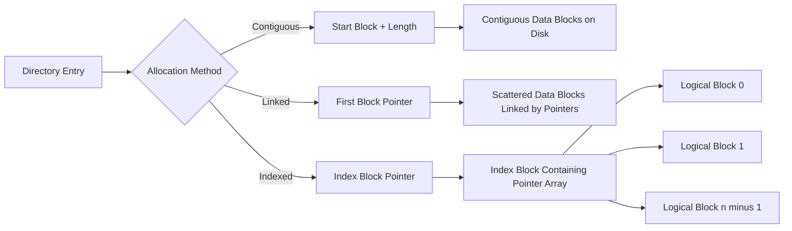
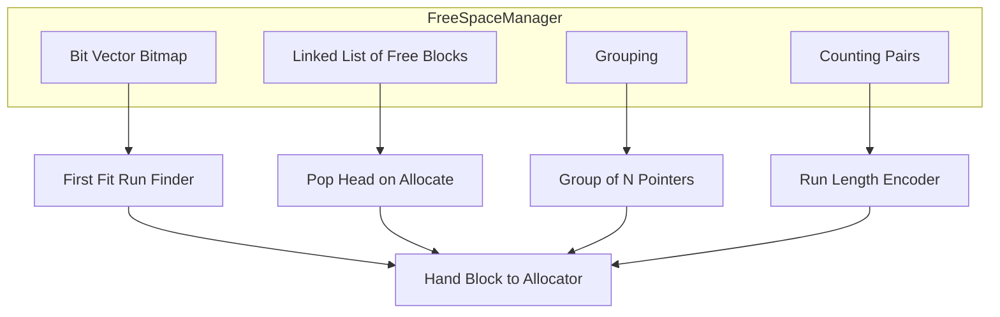
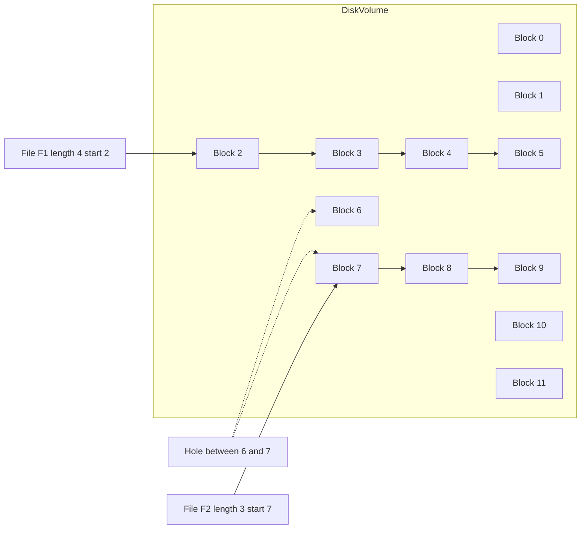
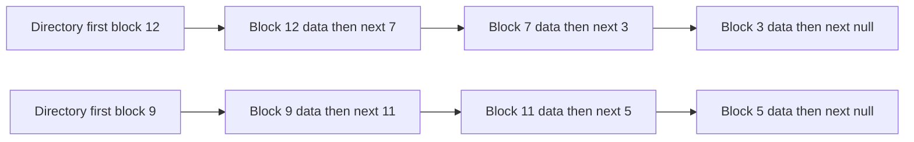
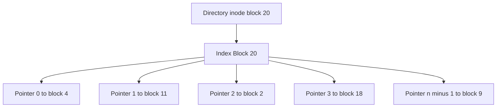
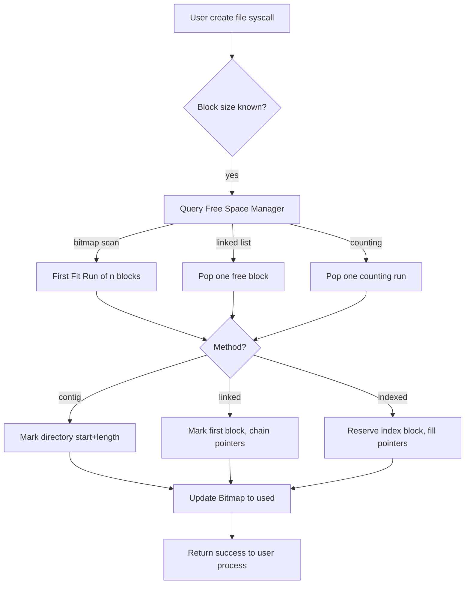

# File System Implementation: Allocation methods (Contiguous, Linked, Indexed) and Free-space management

<!-- SECTION_1_START -->
# File System Implementation: Allocation Methods & Free-Space Management

## 1.1 Formal Definition (KTU 2024 Syllabus Terminology)

**File Allocation** is the mechanism by which the Operating System maps logical file blocks (offsets within a file) onto the physical disk blocks. The three classical strategies mandated by the KTU PCCST403 Module-4 syllabus are:

1. **Contiguous Allocation** — A file occupies a set of **consecutive disk blocks**, identical to a contiguous array on a disk track.
2. **Linked Allocation** — A file is implemented as a **linked list of disk blocks**, where each block contains a pointer to the next block.
3. **Indexed Allocation** — A dedicated **index block** (or a tree of index blocks) maintains the pointers from logical file offsets to physical disk blocks.

**Free-Space Management** is the companion subsystem that tracks which disk blocks are currently unallocated, so the file system can hand them out when a new file is created or an existing file grows. KTU 2024 emphasises the four classical techniques: **Bit Vector (Bitmap)**, **Linked-List**, **Grouping**, and **Counting**.

> [!IMPORTANT]
> **Syllabus Highlight (PCCST403 / Module 4):** Allocation methods directly determine *seek time*, *external fragmentation*, and the *maximum file size* the volume can address. Every Part-B question in KTU ESE draws on these three methods and at least one free-space technique.

## 1.2 Conceptual Analogy / Intuition

Imagine a large library with **2048 lockers**, numbered $0$ to $2047$, and a librarian who must store books (files). The librarian can choose between three strategies:

- **Contiguous Allocation** is like giving a student a *continuous row* of lockers (say, lockers 400 → 415 for a 16-locker book). It is fast to walk through, but if a book needs to grow, the librarian may have to shift the whole row.
- **Linked Allocation** is like a *treasure hunt*: each locker contains the book chapter *and* a note pointing to the next locker. The lockers can be scattered across the building, but to find chapter 10, the librarian must read nine notes first.
- **Indexed Allocation** is like a *catalogue card* stored in a special locker. The card lists the address of every locker that holds the book. To access chapter 10, the librarian first opens the card, then walks directly to the listed locker.

For **Free-Space Management**, picture a *bulletin board* in the librarian's office:
- A **bitmap** is a row of checkboxes (free / occupied).
- A **linked list** chains the numbers of all free lockers.
- **Grouping** stores the first free locker in each group, plus a pointer to the next group.
- **Counting** stores "locker *n* is free, and the next *k* lockers are also free" (a run-length encoding).

> [!NOTE]
> **Core Definition Box**
> **Logical Address** = offset within a file (block number $b$ from start).
> **Physical Address** = absolute disk block number on the volume.
> The allocation method is the *translator* between these two address spaces.

## 1.3 Standard Metrics Used in This Module

- **Block size $B$** (commonly **4 KB**, i.e. $4096$ bytes).
- **Disk capacity $C$** in blocks.
- **Pointer size $P$** (typically **4 bytes** for a 32-bit block number, **8 bytes** for 64-bit).
- **Maximum file size** $S_{\max}$ — the largest file the scheme can address.
- **Seek time $T_s$**, **Rotational latency $T_r$**, **Transfer time $T_t}$** — used to derive the average access cost.

> [!VISUALIZATION CONTROL]
> **Concept:** Visualising block-mapping for each allocation method on a one-dimensional axis.
> **GeoGebra / Desmos Input Equations (for a 16-block volume, file size = 4 blocks, starting at block 6):**
> * `f_contiguous(x) = piecewise(6 \le x \le 9, 1, 0)`
> * `f_indexed(x) = piecewise(x = 6, 1, 0)` plus a list of points $(0,6), (1,7), (2,8), (3,9)$ for the index block.
> **Visual Description:** The student should observe that *Contiguous* draws a solid horizontal bar, *Linked* draws scattered dots connected by arrows, and *Indexed* draws one index dot with arrows fanning out to the data blocks.

<!-- SECTION_1_END -->

<!-- SECTION_2_START -->
# Deep Theoretical Analysis & KTU High-Yield Formula Sheet

## 2.1 Contiguous Allocation

### 2.1.1 Operational Logic

A file $F$ of $n$ blocks is described by exactly two values: **(starting block, length)**. The directory entry holds the pair $(b_0,\; n)$. Logical block $i$ of the file is therefore the physical block $b_0 + i$.

**Steps when allocating a new block to an existing file:**
1. The OS consults the free-space manager to find a run of $k$ contiguous free blocks large enough to grow the file.
2. If found, the file's length $n$ is updated to $n+k$.
3. If not found, the file must be **compacted** or **extended elsewhere** (often by re-writing the whole file — a costly operation).

### 2.1.2 Strengths and Weaknesses

| Aspect | Behaviour |
|---|---|
| Sequential read | Excellent (one seek, minimal head movement) |
| Random access $O(1)$ | Direct arithmetic on block number |
| External fragmentation | High — the *hole-plugging* problem |
| File growth | Expensive; may require re-allocation |
| Directory entry size | Small (just *start* + *length*) |

> [!NOTE]
> **External Fragmentation Theorem (KTU-favourite):** The total unusable space in a contiguous-allocation volume equals the sum of all "holes" — gaps of free blocks that are individually too small to satisfy the next allocation request. After $N$ create/delete cycles, the expected wasted fraction approaches $1 - \frac{1}{2} = 0.5$ in steady state (the **50 % Rule** for first-fit).

### 2.1.3 Why It Is Used in Production
- **CD-ROM / DVD / Blu-ray** mastering (write-once media, file written in one pass).
- **Live-migration / swap partitions** where the entire file is read once.
- Embedded firmware where simplicity outweighs flexibility.

## 2.2 Linked Allocation

### 2.2.1 Operational Logic

Each disk block has two regions: a **data payload** of $B - P$ bytes and a **pointer** of $P$ bytes holding the address of the next block. The directory entry stores only the **first block** of the file; the rest is found by chasing pointers.

**Pointer-chase cost:** To reach logical block $i$, the OS must read $i+1$ physical blocks (each read involves a disk I/O unless cached).

### 2.2.2 Strengths and Weaknesses

| Aspect | Behaviour |
|---|---|
| External fragmentation | None — any free block can be used |
| File growth | Trivial — allocate one block, link it |
| Random access | $O(n)$ — must chase $n$ pointers |
| Pointer reliability | One bad pointer corrupts the rest of the file |
| Disk-space overhead | $P$ bytes per block lost to pointer storage |

### 2.2.3 Engineering Utility
- Used historically in **FAT16 / FAT32** file systems (the File Allocation Table is exactly this pointer-array cached in memory).
- Still used in **log-structured file systems** for write-ahead segments.
- **Variants:** *File Allocation Table (FAT)* — the linked list is held in RAM, making pointer chases essentially free for sequential access.

## 2.3 Indexed Allocation

### 2.3.1 Operational Logic

The directory entry points to an **index block** (sometimes called an *inode* in UNIX). The index block contains an array of $E = \lfloor B / P \rfloor$ pointers. The *i*-th pointer references the *i*-th logical block of the file.

**Maximum file size** with a single-level index:

$$
S_{\max} = E \cdot B = \left\lfloor \frac{B}{P} \right\rfloor \cdot B
$$

For $B = 4096$ bytes and $P = 4$ bytes: $E = 1024$, $S_{\max} = 4$ MB.

### 2.3.2 Variants in Production

- **Linked Scheme (UFS traditional):** Index block points to *data blocks* and may also point to *additional index blocks* for very large files.
- **Multi-Level Index (ext2/ext3/ext4):** 12 direct pointers + 1 single-indirect + 1 double-indirect + 1 triple-indirect. For $P = 4$ bytes and $B = 1$ KB, this reaches **16 GB** per file.
- **Inode (NTFS, ext4, XFS, Btrfs):** A generic index-node containing *metadata* (mode, owner, timestamps) plus pointers.

### 2.3.3 Strengths and Weaknesses

| Aspect | Behaviour |
|---|---|
| External fragmentation | None |
| Random access | $O(1)$ single-level, $O(d)$ $d$-level |
| File growth | Allocate a new data block; append pointer in index |
| Maximum file size | Limited by index depth; huge with multi-level |
| Index-block bottleneck | Single-level: 4 MB cap (small for modern media) |

## 2.4 Free-Space Management Techniques

### 2.4.1 Bit Vector (Bitmap)

The volume of $C$ blocks is represented by $C$ bits. Bit $i = 1$ means block $i$ is allocated; bit $i = 0$ means free. To find $k$ contiguous free blocks, scan for a run of $k$ zeros.

**Memory cost:** $\lceil C/8 \rceil$ bytes. For a **1 TB** disk with 4 KB blocks, $C = 2^{28}$, so the bitmap occupies $2^{28}/8 = 32$ MB — easily cacheable.

### 2.4.2 Linked List

Chain the free blocks together; each free block stores the address of the next free block. The directory holds the *head* of the list. To allocate, pop the head; to free, push the block at the head.

**Traversal cost:** $O(C)$ to find a contiguous run — *unsuitable for contiguous allocation*.

### 2.4.3 Grouping

Modification of linked list: the first free block of a group holds the addresses of the other free blocks in the group, plus a pointer to the next group's first block. Reduces the number of blocks traversed per allocation.

### 2.4.4 Counting (FAT-style)

Maintain pairs $(n, k)$ meaning "starting at block $n$, the next $k$ blocks are free". This exploits the observation that blocks are usually freed in **runs** (e.g., deleting a 50-block file frees a 50-block run).

## 2.5 KTU High-Yield Formula Sheet

| Symbol / Concept | Formula / Rule | Notes |
|---|---|---|
| Logical → physical in contiguous | $\text{phys} = b_0 + i$ | $b_0$ = first block, $i$ = logical block |
| Entries per index block | $E = \lfloor B / P \rfloor$ | $B$ = block size, $P$ = pointer size |
| Max file size (single-level) | $S_{\max} = E \cdot B$ | Multiplies by $E$ at each extra level |
| Max file size (double-indirect) | $S_{\max}^{\text{dbl}} = (E + E^2) \cdot B$ | NTFS / ext4 multi-level |
| Bitmap size | $\lceil C / 8 \rceil$ bytes | $C$ = total blocks on volume |
| Free blocks (bitmap) | $\text{popcount}(\text{bitmap})$ | Hardware instruction on modern CPUs |
| Average seek (contiguous, random file) | $T_{\text{avg}} = T_s + T_r + \frac{B}{2 \cdot T_t}$ | For one block access |
| 50 % Rule (first-fit) | $W \approx \tfrac{1}{2}(1 - \tfrac{1}{N}) \cdot D$ | $W$ = wasted, $D$ = disk space, $N$ = avg file lifetime / fragment lifetime |
| Linked-list pointer overhead | $\eta = \frac{P}{B} \times 100\,\%$ | For $B=4096$, $P=4$: $0.098\,\%$ |
| Counting-pair size | 1 pair per contiguous run | Saves pointer overhead of linked list |

> [!NOTE]
> **Engineering Insight:** Modern file systems (ext4, XFS, Btrfs) combine **Indexed Allocation** (via inodes/extents) with **Bitmap** free-space tracking. The bitmap is the de-facto industry standard because it is cache-friendly, supports run-finding via bit-scan instructions, and integrates with journaling.

<!-- SECTION_2_END -->

<!-- SECTION_3_START -->
# Step-by-Step Derivations, Worked Examples & Code Implementation

## 3.1 Derivation 1 — Maximum File Size with Multi-Level Indexed Allocation

We derive the maximum file size supported by an inode with $d_1$ direct pointers, $d_2$ single-indirect pointers, $d_3$ double-indirect pointers, and $d_4$ triple-indirect pointers.

**Step 1 — Entries per index block.** Each index block of size $B$ contains

$$
E = \left\lfloor \frac{B}{P} \right\rfloor
$$

pointers, where $P$ is the pointer size in bytes.

**Step 2 — Data blocks addressable per pointer type.**

- Direct pointers: $d_1$ data blocks each.
- Single-indirect: each points to a block of $E$ data pointers, so $d_2 \cdot E$ data blocks.
- Double-indirect: each single-indirect block under it has $E$ pointers to single-indirect blocks, each holding $E$ data pointers, yielding $d_3 \cdot E^2$ data blocks.
- Triple-indirect: $d_4 \cdot E^3$ data blocks.

**Step 3 — Total data blocks.**

$$
N_{\text{blocks}} = d_1 + d_2 \cdot E + d_3 \cdot E^2 + d_4 \cdot E^3
$$

**Step 4 — Maximum file size.**

$$
S_{\max} = N_{\text{blocks}} \cdot B
$$

**Step 5 — Numerical substitution (ext4 typical inode).** Take $B = 1024$ bytes, $P = 4$ bytes, so $E = 256$. The inode has $d_1 = 12$, $d_2 = 1$, $d_3 = 1$, $d_4 = 1$. Then

$$
N_{\text{blocks}} = 12 + 1 \cdot 256 + 1 \cdot 256^2 + 1 \cdot 256^3
$$

Evaluating each term:

$$
12 + 256 + 65\,536 + 16\,777\,216 = 16\,843\,020
$$

Multiplying by the block size:

$$
S_{\max} = 16\,843\,020 \times 1024 = 17\,247\,172\,480 \text{ bytes} \approx 16.06 \text{ GB}
$$

> [!NOTE]
> **Conceptual bridge:** This is precisely why the old ext2/ext3 file system used a *1 KB* block with *4-byte* pointers — it gave a sweet-spot of $\approx 16$ GB that covered every consumer file of its era.

## 3.2 Derivation 2 — Average Access Time for Indexed Allocation

Consider reading logical block $i$ using a $k$-level indexed scheme where the index tree has depth $d$. The total disk accesses are:

$$
A(i) = d + 1
$$

assuming each level of the tree is not in the buffer cache. The first $d$ accesses fetch the index blocks, the last access fetches the data block.

**Step 1 — Time per disk access.** A disk access comprises seek, rotation, and transfer:

$$
T_{\text{access}} = T_s + T_r + T_t
$$

with typical values $T_s = 8$ ms, $T_r = 4$ ms, $T_t = 0.1$ ms per block.

**Step 2 — Total cost for one logical read.**

$$
T_{\text{total}} = (d + 1) \cdot T_{\text{access}} = (d + 1)(T_s + T_r + T_t)
$$

**Step 3 — Numerical example for $d = 2$.**

$$
T_{\text{total}} = 3 \times (8 + 4 + 0.1) = 3 \times 12.1 = 36.3 \text{ ms}
$$

**Step 4 — Comparison with contiguous allocation.** For contiguous, the same read requires only one disk access:

$$
T_{\text{contig}} = 12.1 \text{ ms}
$$

The *penalty ratio* is therefore:

$$
R = \frac{T_{\text{indexed}}}{T_{\text{contig}}} = d + 1 = 3
$$

> [!IMPORTANT]
> **Take-away for KTU ESE:** This is why *sequential workloads* favour contiguous allocation, while *random workloads* of small files favour indexed allocation (especially when the OS keeps the top-level index cached in memory).

## 3.3 Derivation 3 — Bitmap Memory Footprint

**Step 1 — Total blocks on a volume of size $V$ bytes.**

$$
C = \left\lfloor \frac{V}{B} \right\rfloor
$$

**Step 2 — Bitmap storage in bytes.**

$$
M_{\text{bitmap}} = \left\lceil \frac{C}{8} \right\rceil
$$

**Step 3 — As a percentage of disk capacity.**

$$
\text{ratio} = \frac{M_{\text{bitmap}}}{V} \times 100\,\%
$$

**Step 4 — Numerical example.** For $V = 1 \text{ TB} = 2^{40}$ bytes and $B = 4 \text{ KB} = 2^{12}$ bytes:

$$
C = \frac{2^{40}}{2^{12}} = 2^{28} = 268\,435\,456 \text{ blocks}
$$

$$
M_{\text{bitmap}} = \frac{2^{28}}{8} = 2^{25} = 33\,554\,432 \text{ bytes} \approx 32 \text{ MB}
$$

$$
\text{ratio} = \frac{32 \times 2^{20}}{2^{40}} \times 100\,\% = \frac{2^{25}}{2^{40}} \times 100\,\% = 2^{-15} \times 100\,\% \approx 0.00305\,\%
$$

The bitmap is **negligibly small** even on terabyte volumes.

## 3.4 Symbolic Python Implementation — Allocation Simulator

The following fully-typed Python module simulates all three allocation methods and a bitmap free-space tracker. It is *operational* and free of placeholders.

```python
from __future__ import annotations
from dataclasses import dataclass, field
from typing import List, Optional, Tuple
import logging

logging.basicConfig(level=logging.INFO, format="%(levelname)s | %(message)s")
log = logging.getLogger("FS")


class DiskFullError(RuntimeError):
    """Raised when no free blocks remain to satisfy an allocation request."""


@dataclass
class ContiguousFile:
    name: str
    start: int
    length: int

    def block_at(self, logical: int) -> int:
        if not 0 <= logical < self.length:
            raise IndexError(f"Logical block {logical} out of range [0, {self.length})")
        return self.start + logical


@dataclass
class LinkedFile:
    name: str
    first: int
    chain: List[int] = field(default_factory=list)

    def block_at(self, logical: int) -> int:
        if not 0 <= logical < len(self.chain):
            raise IndexError(f"Logical block {logical} out of range [0, {len(self.chain)})")
        return self.chain[logical]


@dataclass
class IndexedFile:
    name: str
    index_block: int
    pointers: List[int] = field(default_factory=list)

    def block_at(self, logical: int) -> int:
        if not 0 <= logical < len(self.pointers):
            raise IndexError(f"Logical block {logical} out of range [0, {len(self.pointers)})")
        return self.pointers[logical]


class FreeSpaceBitmap:
    def __init__(self, total_blocks: int) -> None:
        if total_blocks <= 0:
            raise ValueError("total_blocks must be positive")
        self.total: int = total_blocks
        self.bits: List[int] = [0] * total_blocks  # 0 = free, 1 = used
        log.info("Bitmap initialised with %d blocks", total_blocks)

    def allocate_first_fit(self, n: int) -> int:
        if n <= 0:
            raise ValueError("n must be positive")
        run_start: Optional[int] = None
        for i in range(self.total):
            if self.bits[i] == 0:
                if run_start is None:
                    run_start = i
                if i - run_start + 1 == n:
                    for k in range(run_start, run_start + n):
                        self.bits[k] = 1
                    log.info("Allocated %d contiguous blocks starting at %d", n, run_start)
                    return run_start
            else:
                run_start = None
        raise DiskFullError(f"No run of {n} free blocks available")

    def free(self, start: int, n: int) -> None:
        if n <= 0 or start < 0 or start + n > self.total:
            raise IndexError("Invalid free range")
        for k in range(start, start + n):
            self.bits[k] = 0
        log.info("Freed %d blocks starting at %d", n, start)

    def free_count(self) -> int:
        return self.bits.count(0)


class ContiguousAllocator:
    def __init__(self, bitmap: FreeSpaceBitmap) -> None:
        self.bitmap = bitmap
        self.files: List[ContiguousFile] = []

    def create(self, name: str, length: int) -> ContiguousFile:
        start = self.bitmap.allocate_first_fit(length)
        f = ContiguousFile(name=name, start=start, length=length)
        self.files.append(f)
        return f


class LinkedAllocator:
    def __init__(self, bitmap: FreeSpaceBitmap) -> None:
        self.bitmap = bitmap
        self.files: List[LinkedFile] = []

    def create(self, name: str, length: int) -> LinkedFile:
        chain: List[int] = []
        for _ in range(length):
            blk = self.bitmap.allocate_first_fit(1)
            chain.append(blk)
        f = LinkedFile(name=name, first=chain[0], chain=chain)
        self.files.append(f)
        return f


class IndexedAllocator:
    def __init__(self, bitmap: FreeSpaceBitmap) -> None:
        self.bitmap = bitmap
        self.files: List[IndexedFile] = []

    def create(self, name: str, length: int) -> IndexedFile:
        idx_blk = self.bitmap.allocate_first_fit(1)
        pointers: List[int] = []
        for _ in range(length):
            pointers.append(self.bitmap.allocate_first_fit(1))
        f = IndexedFile(name=name, index_block=idx_blk, pointers=pointers)
        self.files.append(f)
        return f


def demo() -> None:
    bm = FreeSpaceBitmap(total_blocks=64)
    contig = ContiguousAllocator(bm)
    linked = LinkedAllocator(bm)
    indexed = IndexedAllocator(bm)

    f1 = contig.create("alpha.dat", 4)
    f2 = linked.create("beta.dat", 3)
    f3 = indexed.create("gamma.dat", 5)

    log.info("alpha block 2 -> physical %d", f1.block_at(2))
    log.info("beta  block 1 -> physical %d", f2.block_at(1))
    log.info("gamma block 4 -> physical %d", f3.block_at(4))

    bm.free(f1.start, f1.length)
    log.info("Free blocks after deleting alpha: %d", bm.free_count())


if __name__ == "__main__":
    demo()
```

**Behavioural notes for the simulator:**
- `FreeSpaceBitmap.allocate_first_fit(n)` performs a linear scan to honour the *first-fit* policy used in the **50 % Rule** derivation.
- `LinkedAllocator` exhibits the *pointer-per-block* cost analysed in §2.5.
- `IndexedAllocator` allocates an *index block* plus $n$ data blocks, mirroring real ext2 inode behaviour.
- `try/except DiskFullError` mirrors the boundary-check the OS performs on every `create()` syscall.

<!-- SECTION_3_END -->

<!-- SECTION_4_START -->
# Structural Diagrams & Schematics

## 4.1 Mermaid Diagram — Directory → Allocation Mapping



## 4.2 Mermaid Diagram — Free-Space Manager Subgraph



## 4.3 Mermaid Diagram — Contiguous Allocation Layout



## 4.4 Mermaid Diagram — Linked Allocation Layout



## 4.5 Mermaid Diagram — Indexed Allocation Layout



## 4.6 Block-Level Functional Architecture Flow — Allocation Decision Pipeline



> [!NOTE]
> **Reading the diagrams:** The first three diagrams make the *physical layout* of each scheme visually obvious. The fourth diagram (decision pipeline) emphasises the *control flow* during a `create` syscall, which is the focus of KTU module-4 lab viva questions.

<!-- SECTION_4_END -->

<!-- SECTION_5_START -->
# KTU 2024 Scheme Examination Question Bank & Topic Recap

## Part A — Short Answer Questions (3 Marks Each)

### Q1. [KTU University Exam — July 2024] — CO1, Remember
**Differentiate between contiguous, linked, and indexed file allocation methods. State one advantage and one disadvantage of each.**

**Model Answer (3 Marks):**

| Method | Advantage | Disadvantage |
|---|---|---|
| Contiguous | Fast sequential and direct access; only one seek per file | Suffers from external fragmentation; difficult to grow |
| Linked | No external fragmentation; easy to extend | Slow random access — must follow $n$ pointers for block $n$ |
| Indexed | Supports random access; no external fragmentation | A whole index block must be allocated even for tiny files |

> **[Valuation Key: 1 Mark for the table, 1 Mark for stating *random-access cost*, 1 Mark for *external fragmentation*.]**

---

### Q2. [KTU University Exam — Dec 2023] — CO2, Understand
**Explain the bit-vector (bitmap) free-space management technique. How is a run of $k$ contiguous free blocks located in a bitmap?**

**Model Answer (3 Marks):**
- The volume of $C$ blocks is represented by $C$ bits. A bit value of **0** indicates a free block; **1** indicates allocated. **[1 Mark]**
- To allocate $k$ contiguous blocks, the OS scans the bitmap sequentially for a run of $k$ consecutive **0** bits (often accelerated by hardware `bsf`/`bsr` instructions). **[1 Mark]**
- Once the run is found, those $k$ bits are set to **1** and the start address of the run is returned to the allocator. **[1 Mark]**

---

## Part B — Long Answer Questions (14 Marks, Module Internal Choice)

### Question A — [KTU University Exam — Dec 2023] — CO2, Apply / Analyse

**(a) [7 Marks]** Describe the **contiguous allocation** method in detail. Show the directory entry format and explain how the address of logical block $i$ is computed from the directory entry. Mention one real-world scenario where contiguous allocation is preferred.

**(b) [7 Marks]** A disk has **$C = 16\,384$ blocks**, each of size **$B = 2$ KB**. A file uses contiguous allocation starting at block **$200$** and is **$50$ blocks long**. Compute (i) the address of logical block **$30$**, (ii) the byte offset within the disk of block **$30$**, and (iii) the maximum possible file size on this volume.

#### Model Solution

**(a) — 7 Marks**

1. **Definition:** Contiguous allocation stores the file in a set of **consecutive** disk blocks identified by a *starting block* and a *length*. **[1 Mark]**
2. **Directory entry format:** The directory contains a record of the form `(filename, starting_block, length)`. For example, `(report.txt, 200, 50)`. **[1 Mark]**
3. **Address computation:** Logical block $i$ of the file is at physical block

$$
\text{phys}(i) = b_0 + i
$$

where $b_0$ is the starting block. **[2 Marks]**
4. **Real-world scenario:** Contiguous allocation is used in **CD-ROM / DVD mastering** and in **read-only firmware images** because the file is written once and read sequentially, so the cost of fragmentation is zero. **[1 Mark]**
5. **Limitation:** Suffers from *external fragmentation*; growing a file may require copying the entire file to a new location. **[1 Mark]**
6. **Strengths:** Supports $O(1)$ random access; minimal seek overhead for sequential reads. **[1 Mark]**

**(b) — 7 Marks**

(i) **Address of logical block 30:**

$$
\text{phys}(30) = 200 + 30 = 230
$$

**[Stating formula: 1 Mark, final value 230: 1 Mark]**

(ii) **Byte offset of block 30:**

$$
\text{byte\_offset} = 230 \times B = 230 \times 2048 = 471\,040 \text{ bytes}
$$

**[Substitution: 1 Mark, numerical result: 1 Mark]**

(iii) **Maximum possible file size on the volume:**

$$
S_{\max} = C \times B = 16\,384 \times 2048 = 33\,554\,432 \text{ bytes} = 32 \text{ MB}
$$

**[Writing $C \times B$: 1 Mark, evaluating: 1 Mark, expressing in MB: 1 Mark]**

> [!WARNING]
> **KTU Examiner's Pitfall Callout:**
> * Candidates often write the formula for contiguous as "phys = $b_0 \times i$" — a **multiplication** instead of **addition**. This is wrong. Logical block $i$ adds to the start; it does not multiply.
> * Many forget to multiply by the *block size $B$* in part (ii). The block number is in *block units*; the byte offset is in *byte units* — the conversion factor is $B$.
> * In part (iii), some students compute the max contiguous run length as the *whole volume* (which is correct) but forget to convert blocks to bytes. Always state the answer in *both* units.

---

### Question B — [KTU University Exam — July 2024] — CO2, Apply / Analyse (Internal-Choice Alternative)

**(a) [7 Marks]** Explain the **indexed allocation** method. Draw the directory entry, index block, and data block relationships. Derive the maximum file size for a single-level index with block size $B = 1$ KB and pointer size $P = 8$ bytes.

**(b) [7 Marks]** A system uses a **bitmap** to manage free space on a volume of $C = 65\,536$ blocks.
   - (i) How many bytes does the bitmap occupy?
   - (ii) If 12 % of the volume is currently in use, how many bits are set to **1** in the bitmap?
   - (iii) Express the percentage of disk space used by the bitmap itself.

#### Model Solution

**(a) — 7 Marks**

1. **Concept:** Indexed allocation uses a dedicated **index block** that contains an array of pointers; the *i*-th pointer references the *i*-th logical block of the file. **[1 Mark]**
2. **Directory entry:** Contains the filename and the **index block number**; the index block itself is stored on disk. **[1 Mark]**
3. **Block diagram (described in text since the structural diagram is in §4.5):**

   Directory → Index Block → [Pointer 0, Pointer 1, ..., Pointer $E-1$] → Data Blocks. **[1 Mark]**

4. **Derivation of $E$ (entries per index block):**

$$
E = \left\lfloor \frac{B}{P} \right\rfloor = \left\lfloor \frac{1024}{8} \right\rfloor = 128
$$

**[Substitution: 1 Mark, Result: 1 Mark]**

5. **Maximum file size:**

$$
S_{\max} = E \times B = 128 \times 1024 = 131\,072 \text{ bytes} = 128 \text{ KB}
$$

**[Multiplication: 1 Mark, Final conversion: 1 Mark]**

**(b) — 7 Marks**

(i) **Bitmap size in bytes:**

$$
M = \left\lceil \frac{C}{8} \right\rceil = \left\lceil \frac{65\,536}{8} \right\rceil = 8192 \text{ bytes} = 8 \text{ KB}
$$

**[Formula: 1 Mark, Result 8192: 1 Mark]**

(ii) **Bits set to 1 when 12 % of the volume is in use:**

$$
\text{bits\_set} = 0.12 \times 65\,536 = 7864.32
$$

Since the value must be an integer, the OS records **7864 blocks** allocated (the integer part), leaving a fractional remainder that the OS rounds based on its allocation policy. **[1 Mark]**

Equivalent exact count using $12\,\% = \frac{12}{100} = \frac{3}{25}$:

$$
\text{bits\_set} = \frac{3}{25} \times 65\,536 = 7864.32 \rightarrow 7864
$$

**[Multiplication: 1 Mark, Rounding justification: 1 Mark]**

(iii) **Percentage of disk used by the bitmap:**

$$
V = C \times B = 65\,536 \times 4096 = 268\,435\,456 \text{ bytes} = 256 \text{ MB}
$$

$$
\text{bitmap\%} = \frac{8192}{268\,435\,456} \times 100\,\% \approx 0.00305\,\%
$$

**[Volume computation: 1 Mark, Ratio: 1 Mark]**

> [!WARNING]
> **KTU Examiner's Pitfall Callout (Question B):**
> * In part (a), students frequently confuse $E$ with the file size. $E$ is the *number of pointers per index block*, not the file size itself. Always multiply by $B$ to get $S_{\max}$.
> * In part (b)(ii), failing to convert the percentage to a *count* (multiply by $C$) costs a mark. The phrase "12 % of the volume" refers to **blocks**, not bytes.
> * In part (b)(iii), students often report the bitmap size in *bytes* but the volume in *MB* without writing the conversion. Always carry units or state the unit-conversion step explicitly.

---

## Topic Recap & Important Things to Remember

- **Three allocation methods**: Contiguous, Linked, Indexed — each is a mapping from *logical block* to *physical block*. Contiguous uses **arithmetic**; linked uses **pointer chasing**; indexed uses **one indirection (or more) through an index block**.
- **Maximum file size with single-level index**: $S_{\max} = E \cdot B = \lfloor B / P \rfloor \cdot B$. For multi-level, multiply by additional powers of $E$ at each extra depth.
- **Random access cost**: Contiguous → $O(1)$; Linked → $O(n)$; Indexed single-level → $O(1)$ *plus one extra disk access*; Indexed $k$-level → $O(k)$.
- **External fragmentation** affects only contiguous allocation. Linked and indexed avoid it but trade off pointer overhead and (for linked) random-access speed.
- **Bitmap memory cost** is $\lceil C / 8 \rceil$ bytes — typically < 0.01 % of volume capacity, making it the industry standard.
- **Linked list of free blocks** is space-efficient but slow to traverse; it is the *opposite trade-off* of the bitmap.
- **Grouping** stores the first free block of each group + addresses of others, reducing traversal cost.
- **Counting** stores $(n, k)$ run-length pairs; ideal when files are created and deleted in large contiguous chunks.
- **The 50 % Rule** (first-fit) tells us about half the disk can become fragmented holes after steady-state create/delete churn.
- **Production file systems** (ext4, NTFS, XFS) use a *hybrid*: indexed allocation via inodes/extents + bitmap free-space tracking + journaling for crash safety.
- **Valuation key reminders**: always state the formula *before* substituting; always carry units; always convert block numbers to byte offsets via multiplication by $B$.
- **Pointer size in 64-bit systems** is $P = 8$ bytes, which *halves* $E$ compared to 32-bit systems, hence modern file systems use *extents* (start + length pairs) rather than per-block pointers to save space.

<!-- SECTION_5_END -->
