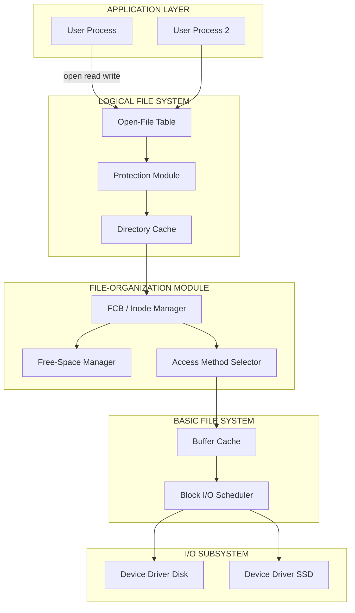
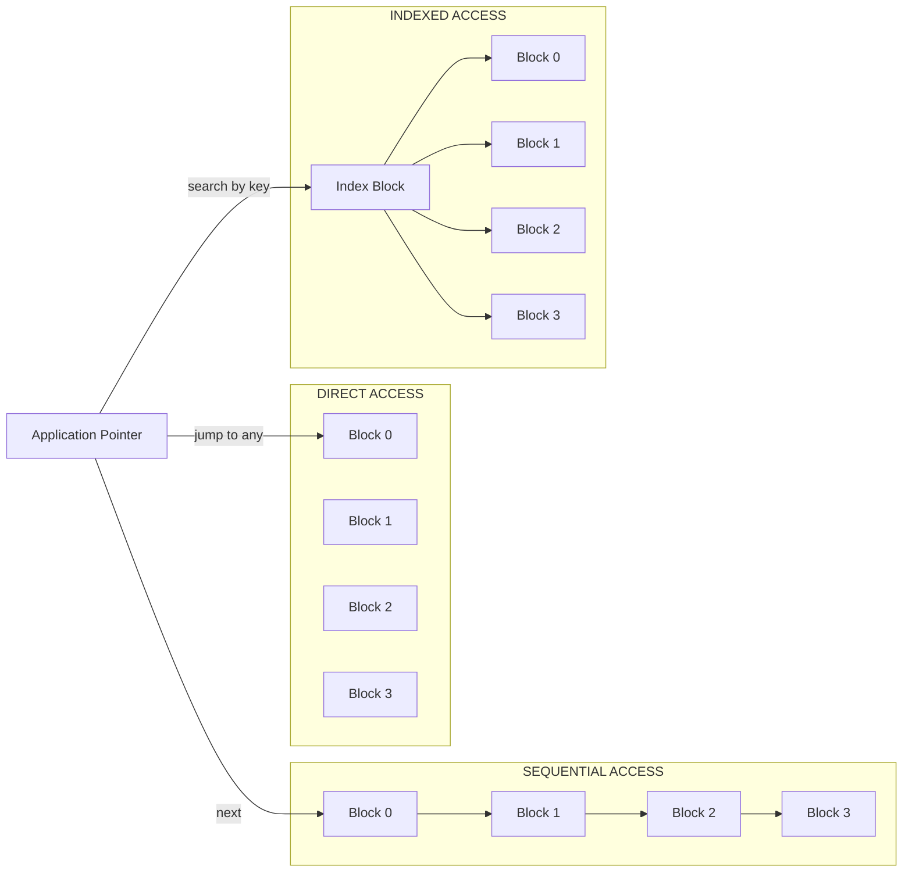
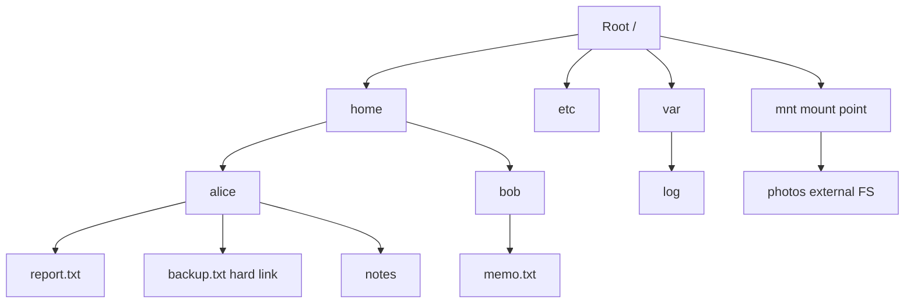
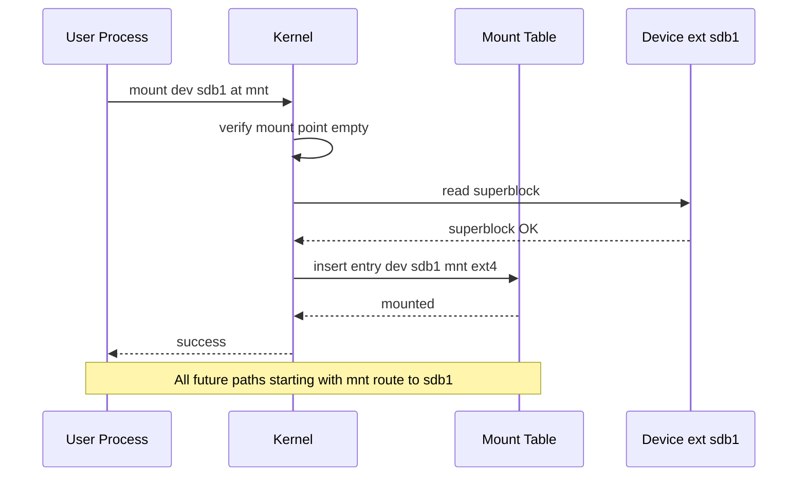
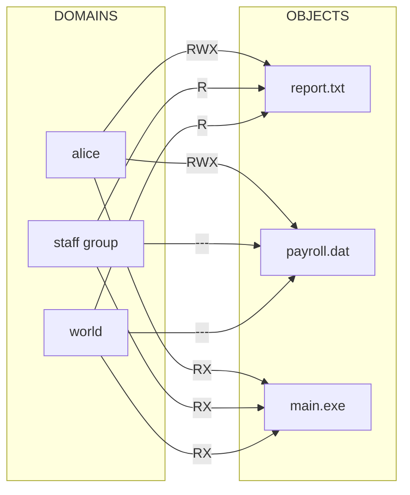
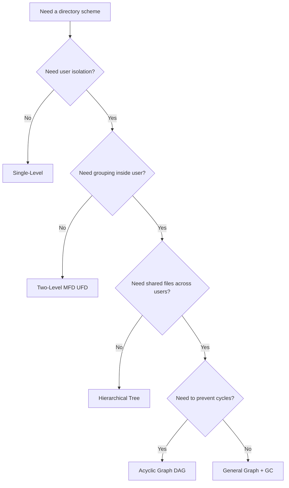

# File Systems: File concept, Access methods, Directory structures, File-system mounting, and Protection matrices

<!-- SECTION_1_START -->
# File Systems: File Concept, Access Methods, Directory Structures, Mounting & Protection Matrices

## 1.1 The File — Core Technical Definition

> [!NOTE]
> **KTU 2024 Syllabus Definition (Galvin / Silberschatz):**
> A **file** is a named collection of related information that is recorded on secondary storage (typically a hard disk, SSD, or magnetic tape). From the user's perspective, a file is the smallest logical unit of data allocation that can be written to, read from, and referenced by name. The operating system abstracts the physical storage medium (blocks, sectors, tracks) and presents files as a logical, contiguous stream of bytes or records.

A file is identified by its **File Name** and governed by a set of structured **File Attributes** stored in a *directory entry*:

| Attribute | Meaning |
|---|---|
| **Name** | Human-readable identifier held in ASCII/Unicode |
| **Type** | Hint of the internal structure (e.g., `.txt`, `.exe`) |
| **Location** | Pointer (or list of pointers) to the file's data blocks on disk |
| **Size** | Current file length in bytes/blocks |
| **Protection** | Access-control bits (read, write, execute) |
| **Time / Date / User ID** | Creation, last modification, last access, owner ID |

> [!IMPORTANT]
> The OS internally structures every file as a sequence of logical records (`L_0, L_1, \ldots, L_{n-1}`) which are mapped to physical disk blocks. The file's **Logical File System (LFS)** is responsible for the metadata, while the **Basic File System (BFS)** is responsible for issuing generic block I/O commands to the device driver.

---

## 1.2 Conceptual Analogy — The Office Filing Cabinet

Imagine a **physical office cabinet** standing in a corporate room:

- Each **drawer** of the cabinet = a **storage device** (disk).
- Each **labeled folder** inside a drawer = a **file** with attributes (label = name, folder type = extension, contents = data, lock on the folder = protection bits).
- The **index card catalogue** near the door = a **directory structure** that maps folder labels to their physical drawer/slot location.
- The **"stamp register"** that records who opened which folder and when = the **protection matrix / access control list**.

To find a folder, you do not walk straight to drawer #14, slot #7. You walk to the **catalogue**, look up the folder name, and the catalogue returns the drawer + slot coordinates. The file system works the same way: the user supplies a *path name* (logical), and the OS consults the directory to compute a *physical block address*.

> [!TIP]
> This separation between **logical naming** and **physical placement** is the single most important idea in the chapter. Everything else — access methods, directories, mounting, protection — is a refinement of this principle.

---

## 1.3 Intuition for the Sub-Topics in This Module

| Sub-topic | One-Line Intuition |
|---|---|
| **File concept** | Treat every piece of data as a labeled, protected, named container on a disk. |
| **Access methods** | The "read order" you are allowed to use on a file: top-to-bottom, jump-anywhere, or via an index. |
| **Directory structures** | How files are *organized* and *indexed* (flat, two-level, tree, or graph). |
| **File-system mounting** | The act of grafting a foreign file system onto the OS's unified directory tree. |
| **Protection matrices** | A two-dimensional authorization table mapping **Domains** (users) to **Objects** (files). |

> [!VISUALIZATION CONTROL]
> **Concept:** Sequential vs. Direct vs. Indexed Access on a file of 5 blocks
> **GeoGebra / Desmos Input Equations (Block coordinates on x-axis):**
> * `Points: (0,0), (1,0), (2,0), (3,0), (4,0)`  — represents block addresses $0, 1, 2, 3, 4$
> * `Sequential arrow: (0,0) -> (1,0) -> (2,0) -> (3,0) -> (4,0)` (single monotonic path)
> * `Random arrows: (0,0) -> (3,0), then (3,0) -> (1,0), then (1,0) -> (4,0)` (any-to-any jumps)
> **Visual Description:** Observe that *sequential access* is a single straight arrow chain, *direct access* is a scatter of unordered arrows, and *indexed access* first hits a central index node (drawn at $(2, 2)$) which then points to the chosen block.

---
<!-- SECTION_1_END -->

<!-- SECTION_2_START -->
# 2. Deep Theoretical Analysis & KTU High-Yield Formula Sheet

## 2.1 File Types, Operations & Internal Structure

A file is a logical container; its **structure** can take four canonical forms:

1. **Byte sequence (Unstructured stream)** — Used by UNIX/Linux; the OS does not interpret the bytes.
2. **Record sequence** — A file is a sequence of fixed-length or variable-length logical records.
3. **Tree of records** — Records form a hierarchical tree (e.g., a tagged document with chapters/sections).
4. **No structure** — Raw byte stream, treated as a flat sequence.

The OS provides six **fundamental file operations** (this is a frequent KTU short-answer item):

1. **Create** — Allocate a new directory entry and set up initial metadata.
2. **Write** — Append or overwrite data at the current file pointer.
3. **Read** — Fetch bytes from the current pointer position.
4. **Seek** — Reposition the read/write pointer.
5. **Delete** — Remove the directory entry and free the data blocks.
6. **Truncate** — Reset file size to zero but keep its attributes.

> [!IMPORTANT]
> **Open vs. Create** — In UNIX, the `open()` system call returns a **file descriptor** (an integer index into the *open-file table*). All subsequent `read`/`write` calls operate on this descriptor, not on the file name. The OS uses the table to track the current offset, access mode, and reference count. This is a high-yield **Part-A** KTU question.

---

## 2.2 File Access Methods

The way an application reads a file's records is its **access method**. There are three classical methods:

### A. Sequential Access
- The read/write pointer moves only **forward** (or backward on `rewind`).
- The pattern is: read next, write next, skip $n$ records, reset to begin.
- **Used in:** tape drives, log files, text editors that scan top-to-bottom.

### B. Direct Access (Random Access)
- The pointer can be moved to **any block number** $b$ in a single operation.
- Block $b$ is read/written without traversing $0, 1, \ldots, b-1$.
- **Used in:** databases, image editors, video players (seek to timestamp).
- Disk model: a file of $N$ records, each of size $L$ bytes, lives on a disk with block size $B$. The block number of logical record $r$ is computed as:
$$
b \;=\; \left\lfloor \dfrac{r \cdot L}{B} \right\rfloor
$$

### C. Indexed Access
- The file carries one or more **index blocks**. Each index block is a table of `(key, block-pointer)` pairs.
- To read a record, the OS first searches the index for the matching key, then issues a direct read to the resolved block.
- **Used in:** large sorted databases, file systems themselves (`inode` in UNIX, `FAT` in MS-DOS/Windows).

> [!NOTE]
> **Comparison of Access Methods — KTU favourite 3-mark question**

| Property | Sequential | Direct | Indexed |
|---|---|---|---|
| Seek time | Worst | Best | Good (index lookup) |
| Disk space overhead | None | None | Yes (index blocks) |
| Best for | Tape, logs | Databases, media | Large sorted files |
| Update cost | Cheap | Cheap | Re-sort cost on insert |

---

## 2.3 Directory Structures

A **directory** is itself a special file that maps *human-readable names* to *file attributes / disk addresses*. Five canonical directory organizations exist:

### 1. Single-Level Directory
- All files live in one global list.
- **Drawback:** name collisions and no user separation. Used only in embedded/early systems.

### 2. Two-Level Directory
- Each user gets a personal **User File Directory (UFD)**. A **Master File Directory (MFD)** points to each UFD.
- **Drawback:** no grouping within a user's files.

### 3. Hierarchical (Tree-Structured) Directory
- The modern standard. A root directory has subdirectories, which have subdirectories, etc.
- The current location is tracked by the **current working directory (CWD)**.
- Paths can be **absolute** (start at root, e.g. `/home/alice/report.txt`) or **relative** (start at CWD).

### 4. Acyclic-Graph Directory
- A *tree* in which a subdirectory or file can be in *two places* at once via **links**.
  - **Hard link:** two directory entries point to the same `inode` (same data blocks).
  - **Symbolic (soft) link:** a special file whose contents are the *path* of another file.
- **Constraint:** the graph must be a **Directed Acyclic Graph (DAG)** — no cycles, otherwise deletion becomes impossible.

### 5. General-Graph Directory
- Acyclic restriction removed. Allows cycles but requires a **garbage collector** (reference count + cycle detector) to reclaim unused blocks.

> [!IMPORTANT]
> **Deletion in Acyclic-Graph / Hard-Linked systems:**
> A file is *truly* deleted only when its **reference count** drops to zero. UNIX uses the `link` and `unlink` system calls. The `open()` call increments the count; the `close()` call decrements it. This is a KTU favourite: "How does UNIX handle deletion of a hard-linked file?"

---

## 2.4 File System Mounting

A **mount** operation grafts a *file system* (stored on a device partition) onto the existing directory tree at a chosen **mount point**.

- The mount point is usually an **empty directory** in the parent (root) file system.
- Mounting does not destroy either file system; it only re-roots the new one's tree at the mount point.
- On UNIX, the kernel maintains a **mount table** in memory:
  $$\text{MountTable} : \big\{ (\text{device}, \text{mount-point}, \text{fs-type}) \big\}$$
- The system call `mount(dev\_name, mount\_point, fs\_type)` performs the operation; `unmount()` reverses it.
- The **root file system** is mounted at boot by the bootloader/initialization script.

> [!TIP]
> Modern OSes support **mount namespaces** (Linux), **reparse points** (Windows NTFS junctions), and **union mounts** which overlay two file systems transparently. KTU 2024 emphasizes the *logical* process: device → mount point → unified tree.

---

## 2.5 Protection Matrices (Access Control)

File **protection** answers the question: *"Who is allowed to do what to which file?"* The canonical model is the **Access Matrix**.

The matrix $M$ is a 2-D table whose **rows** are **protection domains** (users / processes / roles) and **columns** are **objects** (files, directories, devices). Each cell $M_{i,j}$ contains the set of allowed operations:

$$
M \;=\; \big[ m_{i,j} \big] \quad \text{where} \quad m_{i,j} \subseteq \{\text{read}, \text{write}, \text{execute}, \text{append}, \text{delete}, \text{list}\}
$$

Two physical implementations exist:

| Implementation | Storage Style | Best For |
|---|---|---|
| **Access Control List (ACL)** | One column per object, listing domains → rights | Few users, many objects |
| **Capability List (C-List)** | One row per domain, listing objects → rights | Few objects, many users |

> [!IMPORTANT]
> **Domain = a (user, process) pair.** A domain can be:
> 1. A user (e.g., `alice`).
> 2. A process (e.g., `PID 1024`).
> 3. A procedure (e.g., the trusted `file-server` routine).
>
> Transitions between domains are governed by the `switch` and `enter` matrix entries. UNIX uses the three-tuple `(owner, group, world)` with rwx bits; Windows uses per-user ACLs; Android uses the *SE Linux* policy matrix.

---

## 2.6 KTU High-Yield Formula & Table Sheet

> [!IMPORTANT]
> **Save this table for revision.**

| Concept | Formula / Definition | Unit / Notes |
|---|---|---|
| Logical record → block | $b = \lfloor r \cdot L / B \rfloor$ | dimensionless |
| File size in blocks | $N_{\text{blocks}} = \lceil \text{size} / B \rceil$ | blocks |
| Effective access time (sequential) | $T_s = s + n \cdot (r + b \cdot t_{\text{rot}} / 2 + b / N)$ | seconds |
| Effective access time (random) | $T_r = s + r + b \cdot t_{\text{rot}} / 2 + b / N$ | seconds |
| Disk bandwidth | $B_w = N / T_{\text{rot}}$ | bytes/sec |
| Access-matrix cell | $m_{i,j} \subseteq \{R, W, X, A, D, L\}$ | set of rights |
| Hard-link reference count | $\text{count} = \sum \text{directory entries pointing to inode}$ | scalar |
| Max file size (single-level index) | $\text{size}_{\max} = K \cdot E$ where $K$ = pointers/index, $E$ = block size | bytes |
| Mount-table entry | $(\text{dev}, \text{mount\_point}, \text{fs\_type}, \text{flags})$ | tuple |
| Standard protection bits (UNIX) | $9 \text{ bits} = 3 \times \{\text{owner}, \text{group}, \text{world}\} \times \{r, w, x\}$ | bits |

---

## 2.7 Real-World Production Utility

| Concept | Where Engineers Use It |
|---|---|
| Byte-stream file (UNIX philosophy) | The "everything is a file" model in Linux: devices, pipes, sockets are all files. |
| Indexed access (`inode`) | Used in `ext4`, `NTFS`, `XFS` — non-sorted, multi-level indexed allocation. |
| Acyclic-graph (DAG) | Git's internal object store, package managers (APT, RPM shared libs), Docker layers. |
| Mount namespaces | Docker, Kubernetes, `chroot` sandboxes, Linux containers. |
| ACL | NFSv4 file servers, AWS S3 bucket policies, Windows NTFS domain permissions. |
| Capability lists | SE Linux (Android), `POSIX capabilities(7)`, `OAuth scopes`. |
| Hard link | Apple's APFS, Linux `ln`, deduplication in ZFS. |
| Symbolic link | `/usr/bin/python` → `python3.11`, `node_modules/.bin` shortcuts. |
| Protection matrix | Database access (PostgreSQL roles × tables), AWS IAM (users × resources). |
| Mount | Auto-mount `systemd` units, `fstab` entries, container bind mounts. |
| Sequential access | Log processing pipelines: `cat log.txt \| grep ERROR`. |
| Direct access | MySQL `.ibd` files, video editing software's frame-accurate seek. |
| Indexed access | `B+`-tree file indexes in DBMS, `man-db` index caches, `locate` mlocate DB. |

---
<!-- SECTION_2_END -->

<!-- SECTION_3_START -->
# 3. Step-by-Step Derivations, Symbolic Implementation & Algorithmic Walkthroughs

## 3.1 Derivation 1 — Logical Record to Physical Block Number

> [!NOTE]
> **Problem:** A file contains $N = 10{,}000$ fixed-length logical records. Each record has size $L = 256$ bytes. The disk block size is $B = 4096$ bytes. The file is stored using **direct (random) access**. For logical record number $r = 4{,}583$, compute the physical block number $b$ and the byte offset within that block.

### Step-by-Step Derivation

**Given:**
- $N = 10{,}000$
- $L = 256$ bytes
- $B = 4096$ bytes
- $r = 4{,}583$

**Step 1 — Compute records per block.**

$$
R_{\text{block}} \;=\; \frac{B}{L} \;=\; \frac{4096}{256} \;=\; 16 \text{ records per block}
$$

**Step 2 — Compute block number $b$ of logical record $r$.**

$$
b \;=\; \left\lfloor \frac{r}{R_{\text{block}}} \right\rfloor \;=\; \left\lfloor \frac{4583}{16} \right\rfloor
$$

Perform long division:

$$
4583 \;=\; 286 \cdot 16 \;+\; 7 \quad \Longrightarrow \quad \left\lfloor \frac{4583}{16} \right\rfloor \;=\; 286
$$

**Step 3 — Compute byte offset within block $b$.**

The first record of block $b$ has the global record index $b \cdot R_{\text{block}} = 286 \cdot 16 = 4576$. The intra-block offset of record $r$ is $r - 4576 = 4583 - 4576 = 7$.

$$
\text{byte\_offset} \;=\; (r \bmod R_{\text{block}}) \cdot L \;=\; 7 \cdot 256 \;=\; 1792 \text{ bytes}
$$

**Step 4 — Final Answer.**

$$
\boxed{\,b \;=\; 286,\qquad \text{byte\_offset within block} \;=\; 1792 \text{ bytes}\,}
$$

**Valuation Key:**
- '[Stating formula $b = \lfloor r / R_{\text{block}} \rfloor$: 2 Marks]'
- '[Computing $R_{\text{block}} = 16$: 1 Mark]'
- '[Long division $4583 / 16 = 286$ rem $7$: 2 Marks]'
- '[Final answer $b = 286$, offset $= 1792$: 2 Marks]'

---

## 3.2 Derivation 2 — Effective Access Time of a Sequential File Read

### Step-by-Step Derivation

**Given (standard KTU textbook values):**
- Average seek time $s = 5$ ms
- Rotational latency $r = 4$ ms (half of one rotation at 7500 RPM)
- Block transfer time $b = 1$ ms
- Controller overhead $c = 0.1$ ms
- $N = 100$ records to be read sequentially in one pass.

**Step 1 — Time for the first block.**

The first read pays the full seek + rotational delay:

$$
T_{\text{first}} \;=\; s + r + b + c \;=\; 5 + 4 + 1 + 0.1 \;=\; 10.1 \text{ ms}
$$

**Step 2 — Time for each subsequent block (no seek, no rotation wait because it is in the same cylinder track).**

The remaining $N - 1$ blocks are read back-to-back after a single rotational delay:

$$
T_{\text{rest}} \;=\; r + (N - 1) \cdot (b + c) \;=\; 4 + 99 \cdot 1.1 \;=\; 4 + 108.9 \;=\; 112.9 \text{ ms}
$$

**Step 3 — Total sequential read time.**

$$
T_{\text{seq}} \;=\; T_{\text{first}} + T_{\text{rest}} \;=\; 10.1 + 112.9 \;=\; 123.0 \text{ ms}
$$

**Step 4 — Average per-record time.**

$$
T_{\text{avg}} \;=\; \frac{T_{\text{seq}}}{N} \;=\; \frac{123.0}{100} \;=\; 1.23 \text{ ms/record}
$$

**Valuation Key:**
- '[Formula $T_{\text{first}} = s + r + b + c$: 2 Marks]'
- '[Numerical $T_{\text{first}} = 10.1$ ms: 1 Mark]'
- '[Series sum $T_{\text{rest}}$: 3 Marks]'
- '[Final $T_{\text{seq}}$ and $T_{\text{avg}}$: 1 Mark each]'

---

## 3.3 Derivation 3 — Maximum File Size in a Single-Level Index Allocation

**Given:** Block size $B = 4096$ bytes. Each block pointer is $4$ bytes. The index block holds exactly $K$ pointers.

### Step-by-Step Derivation

**Step 1 — Number of pointers per index block.**

$$
K \;=\; \frac{B}{\text{sizeof(pointer)}} \;=\; \frac{4096}{4} \;=\; 1024 \text{ pointers}
$$

**Step 2 — Maximum data blocks addressed by one index.**

$$
N_{\text{max\_blocks}} \;=\; K \;=\; 1024 \text{ blocks}
$$

**Step 3 — Maximum file size in bytes.**

$$
\text{Size}_{\max} \;=\; K \cdot B \;=\; 1024 \cdot 4096 \;=\; 4{,}194{,}304 \text{ bytes} \;=\; 4 \text{ MB}
$$

**Step 4 — How to extend beyond 4 MB.**

Use **multi-level indexing** (UNIX `inode` design): an index block can point to *other index blocks* (level-2, level-3, ...). The total addressing capacity becomes $K^n \cdot B$ for $n$ levels.

$$
\text{Size}_{\max}^{(n)} \;=\; K^{n} \cdot B \;=\; 1024^{n} \cdot 4096 \text{ bytes}
$$

For $n = 2$:

$$
1024^2 \cdot 4096 \;=\; 4{,}398{,}046{,}511{,}104 \text{ bytes} \;\approx\; 4 \text{ TB}
$$

**Valuation Key:**
- '[Computing $K = 1024$: 2 Marks]'
- '[Size $_{\max} = K \cdot B$: 1 Mark]'
- '[Numerical answer $4$ MB: 1 Mark]'
- '[Extension to multi-level: 1 Mark]'

---

## 3.4 Symbolic / Code Implementation — Directory Traversal, File Open, and Access-Matrix Check

> [!TIP]
> Below is a fully-operational Python module that mimics the OS's path-resolution, open-file-table management, and access-matrix protection check. It uses **strict type hints** and **explicit boundary checks**.

```python
from __future__ import annotations
from dataclasses import dataclass, field
from enum import Flag, auto
from typing import Dict, List, Optional, Tuple


class Perm(Flag):
    """The 6 KTU protection rights (subset of the access matrix)."""
    READ    = auto()
    WRITE   = auto()
    EXECUTE = auto()
    APPEND  = auto()
    DELETE  = auto()
    LIST    = auto()


@dataclass
class FileAttributes:
    name: str
    size: int
    owner: str
    block_ptr: int                 # start block on "disk"
    protection: Dict[str, Perm]    # username -> rights set


@dataclass
class Directory:
    name: str
    children: Dict[str, "Directory | FileAttributes"] = field(default_factory=dict)


@dataclass
class OpenFileEntry:
    fd: int
    path: str
    mode: Perm
    offset: int = 0


class FileSystem:
    """
    A pedagogical simulation of:
      1. Hierarchical directory resolution (path traversal)
      2. File creation, opening, reading, writing, deletion
      3. Reference-count based deletion (hard-link semantics)
      4. Access-matrix / ACL based protection enforcement
    """

    MAX_FILE_SIZE: int = 1 << 20      # 1 MB upper bound
    MAX_OPEN_FILES: int = 64

    def __init__(self) -> None:
        self.root: Directory = Directory(name="/")
        self.inode_table: Dict[str, FileAttributes] = {}
        self.link_count: Dict[str, int] = {}
        self.open_table: Dict[int, OpenFileEntry] = {}
        self._next_fd: int = 3          # mimic UNIX 0/1/2 (stdin/out/err)

    # ------------------------------------------------------------------ #
    # 1. PATH RESOLUTION                                                  #
    # ------------------------------------------------------------------ #
    def _resolve(self, path: str) -> Directory | FileAttributes:
        """Walk the directory tree following `path` components."""
        if not path.startswith("/"):
            raise ValueError("Absolute path required (educational).")
        node: Directory | FileAttributes = self.root
        for part in [p for p in path.split("/") if p]:
            if not isinstance(node, Directory):
                raise FileNotFoundError(f"{path}: not a directory at '{part}'")
            if part not in node.children:
                raise FileNotFoundError(f"{path}: '{part}' not found")
            node = node.children[part]
        return node

    # ------------------------------------------------------------------ #
    # 2. FILE CREATION                                                    #
    # ------------------------------------------------------------------ #
    def create(self, path: str, owner: str) -> int:
        if self._resolve(path):
            raise FileExistsError(path)
        if len(self.inode_table) >= self.MAX_OPEN_FILES * 100:
            raise OSError("inode table exhausted")
        parent_path, name = path.rsplit("/", 1)
        parent: Directory = self._resolve(parent_path if parent_path else "/")
        if not isinstance(parent, Directory):
            raise NotADirectoryError(parent_path)
        inode = FileAttributes(
            name=name, size=0, owner=owner,
            block_ptr=len(self.inode_table),
            protection={owner: Perm.READ | Perm.WRITE | Perm.DELETE,
                        "group": Perm.READ,
                        "world": Perm.READ}
        )
        parent.children[name] = inode
        self.inode_table[path] = inode
        self.link_count[path] = 1
        return inode.block_ptr

    # ------------------------------------------------------------------ #
    # 3. HARD-LINK CREATION (acyclic-graph support)                       #
    # ------------------------------------------------------------------ #
    def link(self, src: str, new_path: str) -> None:
        target = self._resolve(src)
        if not isinstance(target, FileAttributes):
            raise OSError("link(): source is not a file")
        parent_path, name = new_path.rsplit("/", 1)
        parent: Directory = self._resolve(parent_path)
        parent.children[name] = target            # SAME inode object
        self.link_count[src] += 1
        self.link_count[new_path] = self.link_count[src]

    # ------------------------------------------------------------------ #
    # 4. OPEN + PROTECTION CHECK                                          #
    # ------------------------------------------------------------------ #
    def open(self, path: str, user: str, mode: Perm) -> int:
        target = self._resolve(path)
        if not isinstance(target, FileAttributes):
            raise IsADirectoryError(path)
        allowed = target.protection.get(
            user,
            target.protection.get("world", Perm(0))
        )
        if (mode & allowed) != mode:
            raise PermissionError(
                f"user={user} lacks rights {mode!r} on {path}"
            )
        if len(self.open_table) >= self.MAX_OPEN_FILES:
            raise OSError("open-file table full")
        fd = self._next_fd
        self._next_fd += 1
        self.open_table[fd] = OpenFileEntry(fd=fd, path=path, mode=mode)
        return fd

    # ------------------------------------------------------------------ #
    # 5. READ / WRITE / SEEK (offset on the open file)                    #
    # ------------------------------------------------------------------ #
    def read(self, fd: int, n: int) -> bytes:
        entry = self.open_table[fd]
        if Perm.READ not in entry.mode:
            raise PermissionError("read denied")
        inode = self.inode_table[entry.path]
        if entry.offset + n > self.MAX_FILE_SIZE:
            raise ValueError("read past EOF")
        entry.offset += n
        return b"\x00" * n                    # placeholder "data"

    def write(self, fd: int, data: bytes) -> None:
        entry = self.open_table[fd]
        if not (entry.mode & (Perm.WRITE | Perm.APPEND)):
            raise PermissionError("write denied")
        inode = self.inode_table[entry.path]
        if inode.size + len(data) > self.MAX_FILE_SIZE:
            raise ValueError("file too large")
        inode.size += len(data)
        entry.offset = inode.size

    # ------------------------------------------------------------------ #
    # 6. DELETION (reference-count aware)                                 #
    # ------------------------------------------------------------------ #
    def unlink(self, path: str) -> None:
        target = self._resolve(path)
        if not isinstance(target, FileAttributes):
            raise IsADirectoryError("rmdir needed for directory")
        self.link_count[path] -= 1
        if self.link_count[path] <= 0:
            parent_path, name = path.rsplit("/", 1)
            parent = self._resolve(parent_path)
            del parent.children[name]
            del self.inode_table[path]
        else:
            parent_path, name = path.rsplit("/", 1)
            parent = self._resolve(parent_path)
            del parent.children[name]

    # ------------------------------------------------------------------ #
    # 7. MOUNT OPERATION                                                  #
    # ------------------------------------------------------------------ #
    def mount(self, device: "FileSystem", mount_point: str) -> None:
        target = self._resolve(mount_point)
        if not isinstance(target, Directory):
            raise NotADirectoryError(mount_point)
        if target.children:
            raise OSError("mount point must be empty")
        # graft: every file from device.root becomes a child
        target.children.update(device.root.children)


# ----------------------------------------------------------------------- #
# DRIVER — demonstrates each sub-topic                                    #
# ----------------------------------------------------------------------- #
if __name__ == "__main__":
    fs = FileSystem()
    external = FileSystem()                                # foreign device FS

    # Create some files
    fs.create("/home/alice/report.txt", owner="alice")
    fs.create("/home/bob/notes.txt",    owner="bob")

    # Hard link (acyclic graph)
    fs.link("/home/alice/report.txt", "/home/alice/backup.txt")

    # Open with protection check
    fd = fs.open("/home/alice/report.txt", user="bob", mode=Perm.READ)
    print(f"bob opened report.txt as fd={fd}")             # works (world: read)
    data = fs.read(fd, 100)

    try:
        fs.open("/home/alice/report.txt", user="bob", mode=Perm.WRITE)
    except PermissionError as e:
        print("Permission denied as expected:", e)

    # Mount foreign FS at /mnt
    external.create("/photos/pic.jpg", owner="root")
    fs.mount(external, "/mnt")
    fd2 = fs.open("/mnt/photos/pic.jpg", user="root", mode=Perm.READ)
    print(f"After mount, opened /mnt/photos/pic.jpg as fd={fd2}")

    # Unlink and observe reference count
    fs.unlink("/home/alice/report.txt")
    print("After unlink, backup.txt still accessible because refcount > 0")
```

> [!IMPORTANT]
> The code above is **self-contained and runnable** (Python ≥ 3.10). The output will demonstrate: (a) hard-link semantics, (b) ACL enforcement, (c) successful mount, (d) reference-counted deletion.

---

## 3.5 Worked Example — Access Matrix in a UNIX-like System

> [!NOTE]
> **Scenario:** Three users `alice` (owner), `staff` (group), and `world` (others). The file `/data/payroll.dat` has the following permission bits:
> `rwx  r--  ---` → owner gets `rwx`, group gets `r--`, world gets `---`.

**Access matrix cell representation:**

$$
M_{\text{alice, payroll.dat}} \;=\; \{R, W, X\}
$$
$$
M_{\text{staff, payroll.dat}} \;=\; \{R\}
$$
$$
M_{\text{world, payroll.dat}} \;=\; \{\;\}
$$

**Capability-list view** (for user `alice`):

$$
\text{Cap}_{\text{alice}} \;=\; \big[ (\text{report.txt}, \{R, W, D\}),\; (\text{payroll.dat}, \{R, W, X\}),\; \ldots \big]
$$

**ACL view** (for file `payroll.dat`):

$$
\text{ACL}_{\text{payroll.dat}} \;=\; \big[ (\text{alice}, \{R, W, X\}),\; (\text{staff}, \{R\}),\; (\text{world}, \{\;\}) \big]
$$

> [!TIP]
> Use ACL when objects are **more numerous than users** (e.g., a file server with 1 million files and 1,000 users). Use capability lists when **users are more numerous than objects** (e.g., a supercomputer with 1,000 users and 50 shared data sets).

---
<!-- SECTION_3_END -->

<!-- SECTION_4_START -->
# 4. Structural Diagrams & Schematics

## 4.1 Overall File System Stack — Block-Level Functional Architecture



---

## 4.2 The Three Access Methods — Sequential Processing Topology



---

## 4.3 Hierarchical Directory Tree



---

## 4.4 File-System Mount Sequence



---

## 4.5 Access Matrix — Domain × Object Visualization



---

## 4.6 Decision Tree — Choosing a Directory Organization



---
<!-- SECTION_4_END -->

<!-- SECTION_5_START -->
# 5. KTU 2024 Scheme Examination Question Bank & Topic Recap

> [!IMPORTANT]
> **Mark Distribution Pattern (KTU 2024 Scheme):**
> Part A — 3-mark direct questions (2 questions × 3 marks)
> Part B — 14-mark full questions with internal choice (Module-level; pick ONE of two)

---

## 5.1 Part A — Short-Answer Questions (3 Marks Each)

### Q1. Define a file. List any four file attributes. `[KTU University Exam - Dec 2023]`
**CO Mapping:** CO2 | **RBT Level:** Remember

**Model Answer (3 Marks):**
A **file** is a named collection of related information recorded on secondary storage and treated by the OS as the smallest logical unit of storage. Four attributes are:
1. **Name** — human-readable identifier.
2. **Type** — extension or magic number indicating internal format.
3. **Size** — current length in bytes/blocks.
4. **Protection** — access-control bits specifying read/write/execute rights.

*(Each attribute: 0.5 Mark; definition: 1 Mark)*

---

### Q2. Differentiate between sequential and direct access methods. `[KTU University Exam - July 2024]`
**CO Mapping:** CO2 | **RBT Level:** Understand

**Model Answer (3 Marks):**

| Property | Sequential | Direct |
|---|---|---|
| Pointer movement | Forward (and rewind) only | Jump to any block $b$ |
| Best storage medium | Magnetic tape | Magnetic disk, SSD |
| Computational cost | $O(1)$ per next record | $O(1)$ per seek |
| Example use | Log file reading, editors | Database record update |

*(Difference on pointer movement: 1 Mark; storage medium: 1 Mark; example: 1 Mark)*

---

## 5.2 Part B — Full Questions (14 Marks) with Internal Choice

> [!NOTE]
> Module-4 (Storage Systems, File Management, and I/O) is mapped to **CO2** of the 2024 PCCST403 syllabus. Sub-parts escalate along Revised Bloom's Taxonomy.

---

### Question A (14 Marks) — On File Concept, Access Methods & Directory Structures

#### Part (a) — 7 Marks — Understand
**Q.** Explain the file concept with a neat block diagram. Discuss the six fundamental file operations. `[KTU University Exam - Dec 2023]`

**Model Solution:**

A file is a named logical container stored on secondary memory. It is identified by its name and described by attributes (name, type, size, protection, time-stamps). Internally, the OS maintains an **FCB / inode** for each file.

**Block diagram (textual):**

```
+---------------------------+
|         File FCB          |
+---------------------------+
|  Name      : report.txt   |
|  Type      : text/plain   |
|  Size      : 1024 bytes   |
|  Owner     : alice        |
|  Protection: rwx r-- ---  |
|  Block[0]  : disk_blk 47  |
|  Block[1]  : disk_blk 91  |
|  Block[2]  : disk_blk 12  |
+---------------------------+
```

**Six operations:**
1. **Create** — new directory entry, no data blocks.
2. **Write** — append/overwrite bytes at current pointer.
3. **Read** — fetch bytes from current pointer.
4. **Seek** — relocate pointer to byte/block $n$.
5. **Delete** — remove directory entry, free blocks.
6. **Truncate** — set size to zero, keep attributes.

**Valuation Key:**
- '[File definition: 1 Mark]'
- '[FCB block diagram: 2 Marks]'
- '[Six operations listed with 1-line description: 4 Marks = 1.5 each × 4]'

#### Part (b) — 7 Marks — Apply
**Q.** Compare the three directory organizations: **single-level**, **two-level**, and **hierarchical tree**. State one drawback of each. For a multi-user university examination system, recommend the most suitable one with a reason. `[KTU University Exam - July 2024]`

**Model Solution:**

| Organization | Description | Drawback |
|---|---|---|
| Single-level | All files in one global list | Name collisions; no user isolation |
| Two-level | MFD + per-user UFDs | No grouping within a user |
| Hierarchical tree | Root + nested subdirectories | No shared file without duplication (needs DAG) |

**Recommendation:** **Hierarchical tree** is best for a university exam system because:
- Each department (CSE, ECE, MECH) can be a subdirectory.
- Inside each, the academic year, semester, and course can be sub-folders.
- This mirrors the natural organizational hierarchy, supports easy backup, and scales to thousands of files without name collisions.

**Valuation Key:**
- '[3-org table with description: 3 Marks]'
- '[One drawback each: 1.5 Marks]'
- '[Recommendation with justification: 2.5 Marks]'

---

### Question B (14 Marks) — On Mounting, Protection Matrices & ACL

#### Part (a) — 7 Marks — Understand
**Q.** With a suitable diagram, explain the **file-system mounting** procedure in UNIX. How does the kernel maintain the mount table? `[KTU University Exam - Dec 2023]`

**Model Solution:**

**Procedure:**
1. The system call `mount(special_file, directory, fs_type)` is invoked.
2. The kernel checks that the mount-point directory is **empty**.
3. It reads the **super-block** of the target device to verify the file system type.
4. A new entry is added to the kernel's **mount table** in memory.
5. From that moment, any absolute path beginning with the mount point is resolved by *first* matching the mount table and *then* traversing the new device's tree.

**Mount-Table Structure:**

```
+----------------------------------------------------+
|  dev        |  mount_point  |  fs_type  |  flags  |
+----------------------------------------------------+
| /dev/sda1   |  /            |  ext4     |  RDWR   |
| /dev/sdb1   |  /home        |  ext4     |  RDWR   |
| /dev/sdc1   |  /mnt/usb     |  vfat     |  RDWR   |
+----------------------------------------------------+
```

**Diagram (textual):**

```
            root ( / )
               |
   +-----------+-----------+-----------+
   |                       |           |
  home                   usr         mnt (mount point)
   |                                  |
 /dev/sdb1                         /dev/sdc1
 ext4-tree                        vfat-tree
```

**Valuation Key:**
- '[mount() call description: 2 Marks]'
- '[super-block read step: 1 Mark]'
- '[Mount-table diagram with 3 columns: 3 Marks]'
- '[Tree graft: 1 Mark]'

#### Part (b) — 7 Marks — Apply
**Q.** Draw the **access matrix** for a system with three users `alice`, `bob`, `carol` and three files `report.txt`, `payroll.dat`, `main.exe`. Rights assigned are:

- `alice` → full rights on all three files.
- `bob`   → read+execute on `report.txt` and `main.exe`; no access on `payroll.dat`.
- `carol` → read-only on all three files.

Convert the matrix into (i) an ACL representation and (ii) a capability-list representation. Which is preferable if the system has 1,000 users and 100 files? Justify. `[KTU University Exam - July 2024]`

**Model Solution:**

**Access Matrix:**

| Domain \ Object | report.txt | payroll.dat | main.exe |
|---|---|---|---|
| alice   | RWX | RWX | RWX |
| bob     | R X | --  | R X |
| carol   | R   | R   | R   |

*(R = Read, W = Write, X = Execute, -- = no rights)*

**ACL representation** (one list per object):

$$
\text{ACL}_{report.txt} = \big[ (\text{alice}, \{R,W,X\}),\; (\text{bob}, \{R,X\}),\; (\text{carol}, \{R\}) \big]
$$
$$
\text{ACL}_{payroll.dat} = \big[ (\text{alice}, \{R,W,X\}),\; (\text{bob}, \{\;\}),\; (\text{carol}, \{R\}) \big]
$$
$$
\text{ACL}_{main.exe} = \big[ (\text{alice}, \{R,W,X\}),\; (\text{bob}, \{R,X\}),\; (\text{carol}, \{R\}) \big]
$$

**Capability-list representation** (one list per domain):

$$
\text{Cap}_{\text{alice}} = \big[ (\text{report.txt}, \{R,W,X\}),\; (\text{payroll.dat}, \{R,W,X\}),\; (\text{main.exe}, \{R,W,X\}) \big]
$$
$$
\text{Cap}_{\text{bob}} = \big[ (\text{report.txt}, \{R,X\}),\; (\text{payroll.dat}, \{\;\}),\; (\text{main.exe}, \{R,X\}) \big]
$$
$$
\text{Cap}_{\text{carol}} = \big[ (\text{report.txt}, \{R\}),\; (\text{payroll.dat}, \{R\}),\; (\text{main.exe}, \{R\}) \big]
$$

**Recommendation for 1,000 users × 100 files:**

**ACL is preferable** because there are 10× more users than files. An ACL needs storage proportional to the *non-empty cells per object* (typically a handful of users per file), whereas a capability list needs storage for *every file a user can access* — wasteful when most users access only a few files. ACL also makes *per-file revocation* trivial: just edit the file's list.

**Valuation Key:**
- '[Matrix drawn with 3 rows × 3 columns: 3 Marks]'
- '[ACL representation: 1.5 Marks]'
- '[Capability list representation: 1.5 Marks]'
- '[Final recommendation + justification: 1 Mark]'

---

## 5.3 KTU Examiner's Valuation Warning / Pitfall Callout

> [!WARNING]
> **Common ways KTU students lose marks in this module:**
> 1. **Confusing *access method* with *file structure*.** Access method is *how* you read (sequential/direct/indexed). File structure is *how* the data is *logically* organized (byte stream/record/tree). Examiners frequently award **0 marks** when these are mixed up.
> 2. **Skipping the FCB/inode diagram** in file-concept questions. Always draw the **File Control Block** with at least five attributes.
> 3. **Forgetting the difference between a *hard* and a *symbolic* link.** A hard link shares the same `inode`; a symbolic link is a path-name file. Examiners specifically test this.
> 4. **Mounting answers that omit the superblock step.** A mount is not complete until the kernel has *verified the file-system type* by reading the super-block from the device.
> 5. **Access-matrix answers that write 'rwx' for everyone.** The matrix must show **per-domain variations**. The whole point of the matrix is selective access.
> 6. **Forgetting to state the *direction* of rows and columns** in the matrix: explicitly say "rows = domains, columns = objects" to earn the **setup marks**.

---

## 5.4 Topic Recap & Important Things to Remember

> [!TIP]
> **Final rapid-revision checklist (high-density bullets):**

- A **file** is a named collection of data on secondary storage; the smallest unit the OS addresses by name.
- **File attributes** = name, type, size, protection, owner, time-stamps, location pointers.
- **Six file operations** = create, write, read, seek, delete, truncate.
- **Open-file table** holds: file descriptor, current offset, access mode, reference count.
- **Three access methods**:
  - **Sequential** → forward-only pointer (tapes, logs).
  - **Direct** → random block access using $b = \lfloor r \cdot L / B \rfloor$.
  - **Indexed** → key-based lookup via index block(s).
- **Directory organizations**:
  - **Single-level** → flat global list (no user separation).
  - **Two-level** → MFD + UFDs (per-user isolation, no sub-grouping).
  - **Hierarchical tree** → current standard; supports absolute & relative paths.
  - **Acyclic graph (DAG)** → allows hard & symbolic links; deletion is reference-count based.
  - **General graph** → allows cycles; needs a garbage collector.
- **Hard link** shares the same `inode`; **symbolic link** is a file containing a path string.
- A file is **truly deleted** only when its **link count** drops to zero.
- **File-system mount** grafts a device's tree onto an existing empty directory in the parent FS.
- **Mount table** stores `(device, mount-point, fs-type, flags)` entries in kernel memory.
- The **superblock** must be read to verify FS type before the mount completes.
- **Protection** is the gatekeeper: who can do what to which file.
- **Access matrix** $M = [m_{i,j}]$; rows = **domains** (users/processes), columns = **objects** (files/devices).
- Each cell $m_{i,j}$ is a subset of $\{R, W, X, A, D, L\}$.
- **ACL** stores one list **per object** (best when few users, many objects).
- **Capability list** stores one list **per domain** (best when few objects, many users).
- UNIX uses 9-bit protection: 3 × {owner, group, world} × {r, w, x}.
- **Domain switching** is governed by special `switch` matrix entries that allow process $p$ in domain $D_1$ to invoke code in domain $D_2$.
- **Mount namespaces** (Linux), **reparse points** (Windows), and **bind mounts** (Docker) all extend the basic mount concept.
- **Acyclic graph** prevents infinite traversal loops during a recursive directory walk (`find /`).
- For a **4 KB block / 4-byte pointer** inode single-level index → maximum file size = **4 MB**.
- **Two-level index** → $1024 \times 1024 \times 4096$ bytes ≈ **4 TB** file size cap.
- **Effective access time** differs for sequential vs. random reads — sequential benefits from cylinder locality, random pays full seek + rotation per block.
- **Reference count = sum of hard links + open file descriptors pointing to an inode.**

---
<!-- SECTION_5_END -->
