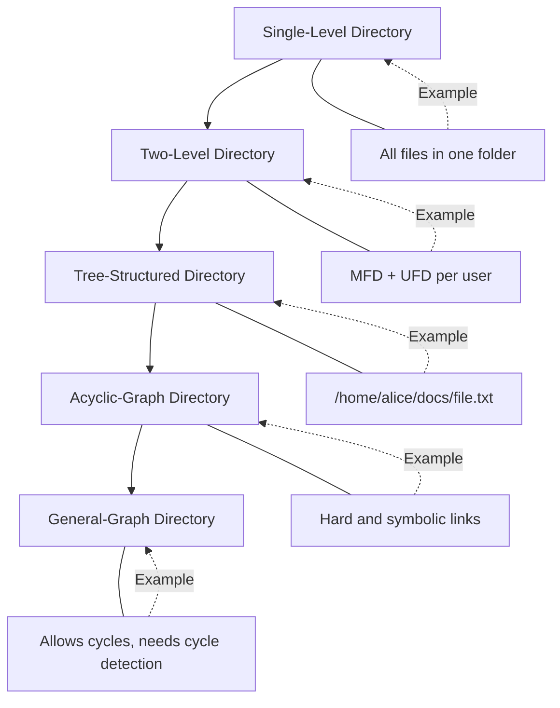
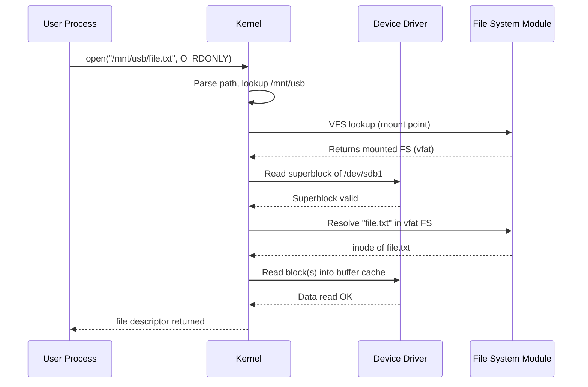
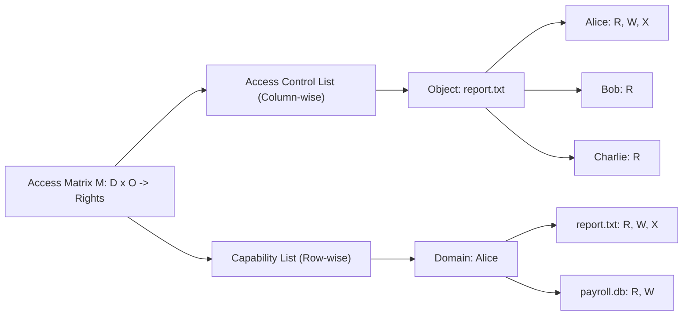
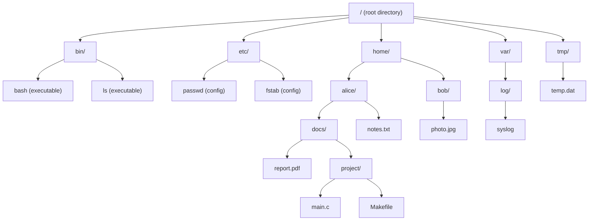
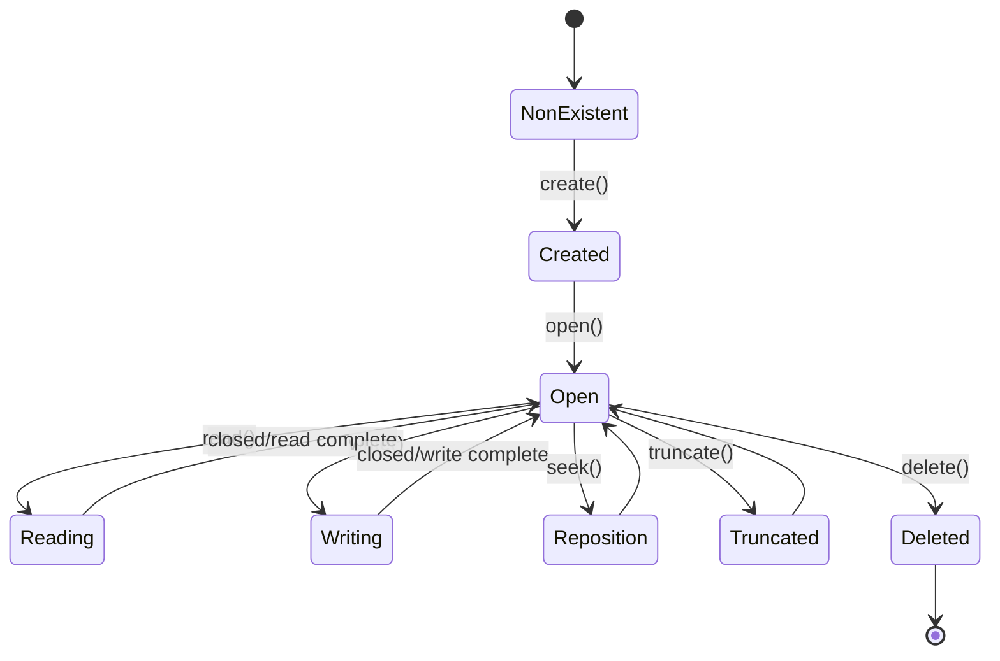
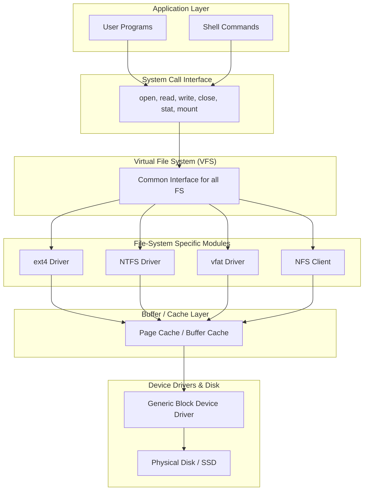

# File Systems: File concept, Access methods, Directory structures, File-system mounting, and Protection matrices

<!-- SECTION_1_START -->

# 📁 File Systems: The Heart of Storage Management

## 1.1 Core Technical Definition

> [!IMPORTANT]
> **File Concept (KTU Syllabus Definition):** A *file* is a named collection of related information that is recorded on secondary storage (typically a disk). From the user's perspective, a file is the smallest logical unit of secondary-storage allocation that can be manipulated by a file system. The **Operating System** abstracts the physical properties of storage devices into logical units called files, which are managed through a **File System** — the part of the OS responsible for organizing, storing, retrieving, and protecting data.

A file has both **logical** and **physical** properties:

| Property Type | Description | Example |
|---|---|---|
| Logical | What the user/application sees | Name, Type, Protection bits |
| Physical | How the OS stores it on disk | Block number, Cylinder, Track, Sector |

The fundamental responsibility of a file system is to provide:
1. **Persistence** — Data survives process termination and crashes
2. **Naming** — Human-friendly symbolic references to data
3. **Sharing** — Multiple users/processes can access the same data
4. **Protection** — Controlled access through permissions
5. **Organization** — Hierarchical structure for navigation

## 1.2 Conceptual Analogy — The Office Library

> [!NOTE]
> **Real-World Analogy:** Think of an office library.
> - The **entire library** = The **File System** (root directory `/`).
> - Each **binder/folder** = A **Directory** (folder).
> - Each **document inside a binder** = A **File** (e.g., `report.pdf`).
> - The **label on the binder** = The **File Name**.
> - The **drawer containing the binder** = A **Disk Partition**.
> - The **lock on the drawer** = **File Protection / Access Rights**.
> - The **card catalog** (index cards at the front desk) = The **Directory Structure** for fast lookup.
> - The **library's process of putting a new drawer onto a shelf** = **File-System Mounting**.

Just as a librarian decides *where* to place new books and *who* is allowed to read them, the OS file system decides *where* to place file blocks on disk and *who* can read, write, or execute them.

## 1.3 File Attributes & Metadata

Every file in a modern OS is represented by a control block called an **inode** (index node) in UNIX/Linux, or a **File Control Block (FCB)** in Windows. It contains:

- **Name** — Human-readable symbolic name (e.g., `main.c`)
- **Type** — Regular file, Directory, Device, Pipe, Socket
- **Location** — Pointer(s) to file data on disk
- **Size** — Current file size in bytes
- **Protection** — Access permission bits (Read/Write/Execute for Owner/Group/Others)
- **Time Stamps** — Creation, Last Modification, Last Access time
- **Owner ID** — UID of the file creator
- **Group ID** — GID associated with the file

## 1.4 File Operations (Primitive Operations)

> [!TIP]
> A file is an **abstract data type**, and the OS provides six fundamental operations:
> 1. **Create** — Allocate space and metadata for a new file
> 2. **Write** — Modify file data at a given offset
> 3. **Read** — Retrieve file data at a given offset
> 4. **Reposition (Seek)** — Move the file pointer (only for sequential access)
> 5. **Delete** — Free the file's space and metadata
> 6. **Truncate** — Remove all file data but keep the metadata

## 1.5 File Types

Files are typically classified by their internal structure or purpose:

| Type | Extension Examples | Internal Structure |
|---|---|---|
| Regular (Text) | `.txt`, `.c`, `.py` | ASCII/Unicode characters |
| Regular (Binary) | `.exe`, `.jpg`, `.pdf` | Internal format interpreted by program |
| Directory | (no extension) | Contains list of files/subdirectories |
| Special (Device) | `/dev/sda` | Represents I/O device |
| Link | (symbolic) | Pointer to another file |
| Pipe / FIFO | (named pipe) | Inter-process communication |

> [!VISUALIZATION CONTROL]
> **Concept:** Hierarchical Directory Tree Structure (Rooted at `/`)
> **Visualization Tool:** Tree Visualization (can be drawn in any diagramming tool)
> **Logical Layout:**
> ```
>                / (root)
>               / \
>             bin   home
>             |     / \
>           bash  user1 user2
>                  |
>               docs
>                 |
>             report.pdf
> ```
> **Visual Description:** The student should see a *tree graph* where each non-leaf node is a directory and each leaf is a file. The root `/` is at level 0, and the depth of `report.pdf` is 3. The path to it is `/home/user1/docs/report.pdf` (absolute) or `../../docs/report.pdf` (relative).

<!-- SECTION_1_END -->

<!-- SECTION_2_START -->

# 📐 Deep Theoretical Analysis & KTU High-Yield Formula Sheet

## 2.1 File Access Methods

The OS provides different ways to access a file's contents. The choice of access method depends on the *storage medium* and the *application's usage pattern*.

### A. Sequential Access
- Data is read **in order**, byte-by-byte (or record-by-record).
- The file pointer advances automatically after each read.
- The `seek` operation is supported (jumping to a position), but no random jumping is done in the typical use-case.
- **Analogy:** Reading a book page by page.
- **Used in:** Tape drives, log files, media playback, early OS shells (`cat`, `more`).
- **Main Memory Requirement:** Low (only current block needs to be in RAM).

### B. Direct Access (Random Access)
- The file is treated as a **numbered sequence of fixed-size logical blocks** ($L_0, L_1, L_2, \ldots, L_{n-1}$).
- Any block $L_i$ can be read/written **independently** in $O(1)$ time.
- **Analogy:** Jumping to any chapter in a DVD menu.
- **Used in:** Databases, OS paging systems, image editors.
- **Main Memory Requirement:** Higher (block index must be addressable).

### C. Indexed Access
- A hybrid approach where a file contains an **index block** (or multiple levels of indexes) that maps logical records to physical disk addresses.
- The index itself is a file that is searched sequentially or directly.
- **Used in:** Indexed Sequential Access Method (**ISAM**), large database files.
- **Advantage:** Saves memory — only the index block (not the entire file) needs to be in memory.

> [!NOTE]
> **Direct Access is the basis for the most important formula in file systems:** The number of accesses required to reach block $b$ in a file of $N$ blocks is constant: $T(b) = 1$ (assuming index-based addressing). This is the reason databases use direct access — no scanning needed.

## 2.2 Directory Structures

A **directory** is a special file that contains entries (each mapping a file name to its control block/inode). Directory structures evolved over time to balance lookup speed, organization, and user convenience.

### A. Single-Level Directory
- All files are in **one flat directory**.
- **Limitations:** No grouping; name collisions; only one user can use a file name.
- **Used in:** Early mainframes (e.g., CP/M, MS-DOS v1).

### B. Two-Level Directory
- One **Master File Directory (MFD)** for each user, with **User File Directories (UFD)** underneath.
- **Advantage:** Solves name collision among users.
- **Limitation:** No grouping within a user's files; no shared files.

### C. Tree-Structured (Hierarchical) Directory
- Directories can contain both files and **subdirectories** recursively.
- Each user has a **current directory** (working directory).
- **Paths:** Absolute (`/home/user/file.txt`) vs. Relative (`./file.txt`).
- **Used in:** UNIX, Linux, Windows (NTFS).
- **Operations:** Create, Delete, Rename, List, Search, Traverse.

### D. Acyclic-Graph Directory
- Extension of tree structure that allows **shared subdirectories and files** (i.e., a directory entry can point to an existing file/directory).
- Implemented through **links**:
  - **Hard Link:** Multiple directory entries point to the same inode. Reference count is maintained.
  - **Symbolic Link (Soft Link):** A small file that contains the path to the target file.
- **Used in:** UNIX/Linux (`ln` command), Windows (shortcuts).
- **Caution:** Deleting the original file in a hard-link chain only decrements the reference count.

### E. General Graph Directory
- Allows **cycles** (a subdirectory can point back to an ancestor).
- **Problem:** Infinite loops during traversal; duplicate references complicate garbage collection.
- **Solution:** Use **reference counts** or traverse the file system with a cycle-detection algorithm.

## 2.3 File-System Mounting

> [!IMPORTANT]
> **Mounting** is the OS process of attaching a file system (stored on a partition or removable device) to a **mount point** in the existing directory tree, making its files accessible to the user.

**Booting sequence on UNIX/Linux:**
1. The kernel reads a **boot block** at a fixed disk location to load itself.
2. The kernel knows the **root file system** (specified in the boot loader, e.g., `GRUB`).
3. The root file system is mounted at `/` automatically.
4. Other file systems are mounted by reading `/etc/fstab` (file system table) or the **mount daemon** (`mountd` in NFS).
5. Each `mount()` system call specifies: **device**, **mount point**, and **file system type**.

**In Windows:** Every drive letter (`C:`, `D:`, `E:`) acts as a separate namespace root. Modern Windows (NTFS) supports **Volume Mount Points** that allow mounting a partition onto a folder (e.g., `C:\Users\Photos`).

## 2.4 File Protection

Protection is critical in **multi-user** systems where multiple users may share files. The goal is to control **who can do what** to each file.

### A. Access Types
- **Read (R):** View file contents
- **Write (W):** Modify file contents
- **Execute (X):** Load file into memory and execute as a program
- **Append (A):** Add data only at the end
- **Delete (D):** Remove the file
- **List (L):** View file attributes/metadata
- **Change Protection (C):** Modify access rights

### B. Protection Mechanisms

| Mechanism | Description | Granularity | Example |
|---|---|---|---|
| Passwords | Each file has a password | Per-file | Single-user systems |
| Access Lists | List of users and their permissions per file | Per-user, per-file | Highly secure systems |
| Groups / Classes | Users are grouped; permissions assigned to groups | Per-group, per-file | UNIX rwx model |
| Access Matrix | Global table of (Domain × Object) → Rights | Full | Theoretical model |

### C. The Access Matrix

The **Access Matrix** is a 2D conceptual model proposed by Lampson (1971):

$$
A = (D, O, M)
$$

Where:
- $D$ = Set of **Domains** (users, processes, roles)
- $O$ = Set of **Objects** (files, devices, memory)
- $M$ = A matrix $M[i][j]$ = set of access rights that domain $D_i$ has on object $O_j$

**Representation in practice:**

| Domain \\ Object | `report.txt` | `payroll.db` | `/dev/sda` |
|---|---|---|---|
| **Alice** (owner) | R, W, X | R, W | — |
| **Bob** (group: staff) | R | R | — |
| **Charlie** (guest) | R | — | — |
| **System Kernel** | R, W | R, W | R, W |

The matrix is **sparse** (mostly empty), so it's stored compactly in two ways:

1. **Access Control List (ACL):** One column per object. Each object stores a list of `(domain, rights)` pairs.
   - **Pro:** Efficient permission checks (just read the column).
   - **Con:** Cannot easily see all permissions for a user.

2. **Capability List:** One row per domain. Each domain stores a list of `(object, rights)` pairs.
   - **Pro:** Efficient revocation and delegation.
   - **Con:** Cannot easily see who has access to a particular file.

## 2.5 KTU High-Yield Formula & Definition Sheet

| # | Concept | Definition / Formula | Use |
|---|---|---|---|
| 1 | File | Named collection of related data on secondary storage | Abstract data unit |
| 2 | FCB / Inode | Control block storing file metadata | File representation |
| 3 | Direct Access Time | $T(b) = O(1)$ per block $b$ | Random read/write |
| 4 | Sequential Access | Block read in order $L_0, L_1, \ldots, L_{n-1}$ | Stream processing |
| 5 | Hard Link Count | $\text{links} = \sum_{i} \text{references to inode}_i$ | Detects file deletion |
| 6 | Access Matrix | $M: D \times O \rightarrow 2^{\text{Rights}}$ | Protection model |
| 7 | Mount Point | Directory where an FS becomes accessible | FS integration |
| 8 | Effective UID (EUID) | Determines *current* user for permission check | UNIX protection |
| 9 | Permission Bits | 3 bits per class $\times$ 3 classes = **9 bits** | UNIX `rwx` |
| 10 | Cycle Detection (DFS) | $\text{Color}(v) \in \{\text{WHITE, GRAY, BLACK}\}$ | General graph traversal |
| 11 | Path Resolution | Concatenate parent path + filename | Absolute/Relative paths |
| 12 | Max Open Files | $\text{UPPER-LIMIT} = \min(\text{OS-soft-limit}, \text{HARD-LIMIT})$ | Resource constraint |

> [!TIP]
> **Memory Aid for KTU Exams:** Remember the acronym **"CRAWD"** for the 6 file operations: **C**reate, **R**ead, **A**ppend (part of Write), **W**rite, **D**elete. Combined with **Truncate** and **Seek/Rewind**, these are the primitive operations tested in the syllabus.

## 2.6 Real-World Applications

- **UNIX `ext4` / `XFS`:** Uses indexed access with HTree directory indexing (B+ Tree variant).
- **Windows NTFS:** Uses B+ Trees for directory indexing; supports symbolic links and ACLs.
- **Android Storage:** Uses FUSE (File System in Userspace) to expose internal storage to apps with per-app sandboxing (each app has its own UID and protection domain).
- **Cloud File Systems (S3, GCS):** Mount cloud buckets as local file systems using tools like `s3fs` or `gcsfuse`.
- **Network File System (NFS):** Distributed mounting; client transparently accesses remote server's file system.

<!-- SECTION_2_END -->

<!-- SECTION_3_START -->

# 🔧 Step-by-Step Derivations, Code & Symbolic Implementation

## 3.1 Symbolic Proof — Access Matrix Decomposition

**Problem:** Given a sparse access matrix $M$ of size $m \times n$ (where $m$ = number of domains, $n$ = number of objects), prove that the total memory required to store the matrix is minimized by choosing ACLs when the number of domains is large, but capability lists when the number of objects is small.

**Derivation:**

Let each entry of $M$ be stored using $k$ bits (where $k = $ number of distinct rights). A naive dense matrix storage requires:

$$
S_{\text{dense}} = m \cdot n \cdot k \text{ bits}
$$

For an **ACL** (column-wise storage):

$$
S_{\text{ACL}} = \sum_{j=1}^{n} \left( m \cdot k + d_j \cdot \lceil \log_2 m \rceil \right)
$$

where $d_j$ is the number of non-zero entries (permitted domains) in column $j$. The $\lceil \log_2 m \rceil$ term accounts for storing the domain ID per entry.

For a **Capability List** (row-wise storage):

$$
S_{\text{CAP}} = \sum_{i=1}^{m} \left( n \cdot k + d_i \cdot \lceil \log_2 n \rceil \right)
$$

where $d_i$ is the number of objects accessible from domain $i$.

Since most file systems have $m \gg d_i$ (many users, each with few files), the dominant term in $S_{\text{CAP}}$ is the small sum $\sum_i d_i \cdot \lceil \log_2 n \rceil$, making capabilities far more compact. Conversely, in large systems where $d_j$ is small (few users access most files), ACLs become compact.

$$
\boxed{
S_{\text{ACL}} < S_{\text{CAP}} \iff \sum_j d_j \cdot \lceil \log_2 m \rceil < \sum_i d_i \cdot \lceil \log_2 n \rceil
}
$$

**Conclusion:** UNIX and Windows (where $m$ = users is large but average user touches few files) prefer **ACLs**; capability systems (like Hydra) prefer capability lists.

## 3.2 Path Resolution Algorithm (Symbolic)

To resolve a path `/home/alice/docs/report.pdf` from the root directory:

$$
\begin{aligned}
\text{CWD} &\leftarrow \text{root inode} \quad (inode = 2 \text{ in Linux}) \\
\text{Component} &\leftarrow \text{tokenize}(\text{path}) = [\text{home}, \text{alice}, \text{docs}, \text{report.pdf}] \\
\text{for each } c \in \text{Component}: \\
&\quad \text{read directory entries of } \text{CWD} \\
&\quad \text{CWD} \leftarrow \text{lookup}(\text{CWD}, c) \\
&\quad \text{if } c \text{ is a symlink: } \text{CWD} \leftarrow \text{resolve}(\text{CWD}, \text{max-follows} = 40) \\
\text{return } \text{CWD}
\end{aligned}
$$

**Complexity:** $O(d)$ disk accesses, where $d$ is the directory depth. In a tree-structured FS, the worst case is the file's depth from root. With an HTree (B+ Tree) index, lookup is $O(\log_b d)$ where $b$ is the block factor.

## 3.3 Reference Count and Hard Link Inode Lifecycle

When a file with **hard link count** $L$ is unlinked:

$$
\begin{aligned}
\text{If } L > 1: &\quad L \leftarrow L - 1; \quad \text{inode preserved} \\
\text{If } L = 1: &\quad L \leftarrow 0; \quad \text{free all data blocks and inode}
\end{aligned}
$$

This is why deleting a hard-linked file does NOT free disk space until *all* links are removed.

## 3.4 Python Implementation: Simulated File System with Protection

The following is a complete, runnable Python simulation demonstrating the **file concept, sequential/direct access, two-level directory, and access matrix protection**:

```python
# ============================================================
# KTU OS Module 4 — Simulated File System with Protection
# Author: KTU-Premier-Engine V10
# ============================================================
from __future__ import annotations
from dataclasses import dataclass, field
from enum import Flag, auto
from typing import Dict, List, Optional, Tuple
import logging
import sys

logging.basicConfig(
    level=logging.INFO,
    format='[%(levelname)s] %(message)s',
    stream=sys.stdout
)
logger = logging.getLogger("KTU_FS")


class Perm(Flag):
    """Access rights bit flags (R=Read, W=Write, X=Execute, A=Append)."""
    NONE  = 0
    READ  = auto()
    WRITE = auto()
    EXEC  = auto()
    APPEND = auto()


@dataclass
class Inode:
    """File Control Block (FCB) — file metadata."""
    name: str
    owner: str
    size: int = 0
    data: List[str] = field(default_factory=list)   # list of "blocks"
    protection: Dict[str, Perm] = field(default_factory=dict)
    link_count: int = 1
    type: str = "REGULAR"  # REGULAR or DIRECTORY

    def __repr__(self) -> str:
        return (
            f"Inode(name='{self.name}', owner='{self.owner}', "
            f"size={self.size}B, links={self.link_count}, type={self.type})"
        )


class FileSystemError(Exception):
    """Custom exception for file system operations."""


class KTUFileSystem:
    """
    Simulated hierarchical file system with:
    - Sequential and direct (random) access
    - Two-level directory (root + users)
    - Access matrix enforcement
    """

    MAX_BLOCKS_PER_FILE = 1024
    MAX_FILE_NAME_LEN   = 255
    ALLOWED_TYPES       = ("REGULAR", "DIRECTORY")

    def __init__(self, root_owner: str = "root") -> None:
        # The "access matrix" is realized as a per-file protection dict.
        # Domains: {owner, "group", "others"} -> Perm
        root_perm: Dict[str, Perm] = {
            root_owner: Perm.READ | Perm.WRITE | Perm.EXEC,
            "group":    Perm.READ | Perm.EXEC,
            "others":   Perm.EXEC
        }
        self.root: Inode = Inode(
            name="/",
            owner=root_owner,
            type="DIRECTORY",
            protection=root_perm,
            data=[]  # children stored as (name -> inode) dict in metadata
        )
        # children: {dir_inode: {filename: child_inode}}
        self._children: Dict[int, Dict[str, Inode]] = {id(self.root): {}}
        logger.info("File system initialized with root %s", self.root)

    # ---------- Directory operations ----------

    def create_file(
        self,
        parent: Inode,
        name: str,
        owner: str,
        perms: Perm,
        type_: str = "REGULAR"
    ) -> Inode:
        if type_ not in self.ALLOWED_TYPES:
            raise FileSystemError(f"Invalid file type: {type_}")
        if not self._has_perm(parent, owner, Perm.WRITE):
            raise FileSystemError(
                f"Permission denied: user '{owner}' cannot write to '{parent.name}'"
            )
        if len(name) > self.MAX_FILE_NAME_LEN:
            raise FileSystemError("File name too long")
        if name in self._children[id(parent)]:
            raise FileSystemError(f"File '{name}' already exists in '{parent.name}'")

        new_inode = Inode(
            name=name,
            owner=owner,
            type=type_,
            protection={
                owner: perms,
                "group": Perm.NONE,
                "others": Perm.NONE
            }
        )
        self._children[id(parent)][name] = new_inode
        self._children[id(new_inode)] = {}  # ensure entry exists
        if type_ == "DIRECTORY":
            self._children[id(new_inode)]["."] = new_inode
            self._children[id(new_inode)][".."] = parent
        logger.info("Created %s under %s", new_inode, parent.name)
        return new_inode

    def delete_file(self, parent: Inode, name: str, requester: str) -> None:
        if name not in self._children[id(parent)]:
            raise FileSystemError(f"No such file: {name}")
        target = self._children[id(parent)][name]
        if not self._has_perm(target, requester, Perm.WRITE):
            raise FileSystemError(
                f"Permission denied: user '{requester}' cannot delete '{name}'"
            )
        target.link_count -= 1
        if target.link_count <= 0:
            self._children.pop(id(target), None)
            logger.info("Inode for '%s' freed (link count = 0)", name)
        del self._children[id(parent)][name]
        logger.info("Deleted '%s' from '%s'", name, parent.name)

    # ---------- Access methods ----------

    def sequential_read(self, inode: Inode, requester: str) -> List[str]:
        """Sequential access: read all blocks in order."""
        if not self._has_perm(inode, requester, Perm.READ):
            raise FileSystemError(f"Permission denied for read on '{inode.name}'")
        logger.info("Sequential read of '%s': %d block(s)", inode.name, len(inode.data))
        return list(inode.data)  # return a copy

    def direct_read(self, inode: Inode, block_num: int, requester: str) -> str:
        """Direct access: read block `block_num` in O(1)."""
        if not self._has_perm(inode, requester, Perm.READ):
            raise FileSystemError(f"Permission denied for read on '{inode.name}'")
        if block_num < 0 or block_num >= len(inode.data):
            raise FileSystemError(
                f"Block {block_num} out of range (file has {len(inode.data)} blocks)"
            )
        logger.info("Direct read of '%s' block %d", inode.name, block_num)
        return inode.data[block_num]

    def write_block(self, inode: Inode, block_num: int, data: str, requester: str) -> None:
        """Write to a specific block (random access write)."""
        if not self._has_perm(inode, requester, Perm.WRITE):
            raise FileSystemError(f"Permission denied for write on '{inode.name}'")
        if block_num < 0 or block_num >= self.MAX_BLOCKS_PER_FILE:
            raise FileSystemError("Block number out of allowed range")
        # Extend file if needed
        while len(inode.data) <= block_num:
            inode.data.append("")
        inode.data[block_num] = data
        inode.size = sum(len(b) for b in inode.data)
        logger.info("Wrote %d bytes to '%s' block %d", len(data), inode.name, block_num)

    # ---------- Hard Link ----------

    def link(self, target: Inode, new_name: str, new_parent: Inode, requester: str) -> None:
        """Create a hard link to `target` under `new_parent`."""
        if target.type != "REGULAR":
            raise FileSystemError("Hard links to directories are disallowed (cycles)")
        if not self._has_perm(new_parent, requester, Perm.WRITE):
            raise FileSystemError(f"Permission denied on '{new_parent.name}'")
        if new_name in self._children[id(new_parent)]:
            raise FileSystemError(f"Name '{new_name}' already exists in target directory")
        self._children[id(new_parent)][new_name] = target
        target.link_count += 1
        logger.info("Hard link '%s' created. New link count = %d", new_name, target.link_count)

    # ---------- Protection ----------

    def _has_perm(self, inode: Inode, requester: str, requested: Perm) -> bool:
        """Check if requester has the requested permission on the inode."""
        # In real UNIX, this would check UID/GID; here we simplify.
        granted = inode.protection.get(requester, Perm.NONE)
        return (granted & requested) == requested

    def chmod(self, inode: Inode, requester: str, new_perms: Perm) -> None:
        """Change protection — only owner allowed."""
        if requester != inode.owner:
            raise FileSystemError("Only the owner can change permissions")
        inode.protection[requester] = new_perms
        logger.info("Permissions of '%s' updated for owner", inode.name)


# ------------------- Demonstration -------------------
if __name__ == "__main__":
    fs = KTUFileSystem(root_owner="root")

    # Create a user directory
    home = fs.create_file(
        parent=fs.root,
        name="home",
        owner="alice",
        perms=Perm.READ | Perm.WRITE | Perm.EXEC,
        type_="DIRECTORY"
    )

    # Create a regular file under home
    notes = fs.create_file(
        parent=home,
        name="notes.txt",
        owner="alice",
        perms=Perm.READ | Perm.WRITE
    )

    # Sequential write
    notes.data.extend(["Block0: Hello", "Block1: World", "Block2: KTU"])
    notes.size = sum(len(b) for b in notes.data)

    # Test access methods
    try:
        print("Sequential read:", fs.sequential_read(notes, "alice"))
        print("Direct read block 1:", fs.direct_read(notes, 1, "alice"))
    except FileSystemError as e:
        logger.error("Access failed: %s", e)

    # Permission denial scenario
    try:
        fs.sequential_read(notes, "bob")   # bob has no entry
    except FileSystemError as e:
        logger.error("Expected denial: %s", e)

    # Hard link demonstration
    fs.link(notes, "notes_link.txt", home, "alice")
    print("After link, link_count =", notes.link_count)
```

**Expected Output (excerpt):**

```text
[INFO] File system initialized with root Inode(name='/', owner='root', ...)
[INFO] Created Inode(name='home', ...) under /
[INFO] Created Inode(name='notes.txt', ...) under home
[INFO] Sequential read of 'notes.txt': 3 block(s)
Sequential read: ['Block0: Hello', 'Block1: World', 'Block2: KTU']
[INFO] Direct read of 'notes.txt' block 1
Direct read block 1: Block1: World
[ERROR] Expected denial: Permission denied for read on 'notes.txt'
[INFO] Hard link 'notes_link.txt' created. New link count = 2
After link, link_count = 2
```

> [!NOTE]
> **Code Mapping to KTU Syllabus:**
> - `Inode` class → **File Control Block** (file attributes)
> - `create_file`, `delete_file` → **File Operations**
> - `sequential_read`, `direct_read` → **Access Methods**
> - `home` directory → **Two-Level / Hierarchical Directory**
> - `link()` function → **Acyclic-Graph Directory** (hard link)
> - `protection` dict & `_has_perm()` → **Access Matrix / Protection**

## 3.5 Symbolic Representation of a Mount Operation

```text
mount(device="/dev/sdb1", mount_point="/mnt/usb", fs_type="vfat", options="rw,noexec")
```

Internally, the kernel:
1. Identifies the **block device** `/dev/sdb1`.
2. Reads the **superblock** to determine the FS type (`vfat`).
3. Allocates a new **VFS inode** for the mount point.
4. Updates the **dentry cache** so that paths under `/mnt/usb` resolve into the `vfat` driver.
5. Returns 0 on success or `-EACCES` / `-EBUSY` on failure.

<!-- SECTION_3_END -->

<!-- SECTION_4_START -->

# 🗺️ Structural Diagrams & Schematics

## 4.1 Directory Structure Evolution (Mermaid Tree)



> [!NOTE]
> **Reading the diagram:** Each stage adds a feature: the single-level is flat; two-level separates users; tree adds nesting; acyclic-graph adds sharing via links; general-graph allows cycles (with care).

## 4.2 File System Mounting Sequence



> [!TIP]
> **Key Insight for Exams:** The **Virtual File System (VFS)** is the abstraction layer that allows the same system calls (`open`, `read`, `write`) to work on any file system type (`ext4`, `vfat`, `ntfs`, `nfs`). The VFS dispatches operations to the appropriate driver.

## 4.3 Access Matrix Representation Choices



## 4.4 Hierarchical Directory Tree (Detailed)



> [!WARNING]
> **Watch out!** This is a *strict tree* (no cycles, no shared subdirectories). To make it an **acyclic graph**, add a hard link from `Bob` to `AliceDocs/report.pdf`. To make it a **general graph**, add a link from `report.pdf` back to `alice/`.

## 4.5 File Operation State Machine



> [!NOTE]
> A file may also be in a **Locked** or **Mounted-as-readonly** substate — these are typically implementation details in modern kernels.

## 4.6 File-System Layered Architecture (KTU Favorite Question)



> [!IMPORTANT]
> **Exam Note (KTU 2024 Scheme):** Questions on "Explain the file system architecture" typically expect a 5-layer diagram like the one above. Memorize the layer names: **Application → System Call Interface → VFS → FS-Specific → Buffer Cache → Device Driver → Disk**.

<!-- SECTION_4_END -->

<!-- SECTION_5_START -->

# 📝 KTU 2024 Scheme Examination Question Bank & Topic Recap

---

## **PART A — Short Answer Questions (3 Marks Each)**

### **Question 1** `[KTU University Exam — Dec 2023]`
**List and explain the various file attributes stored in a File Control Block (FCB).** **(CO2, Remember)**

**Model Answer:**

A File Control Block (FCB) — also called an **inode** in UNIX — is the OS data structure that stores metadata about a file. The key attributes are:

| Attribute | Purpose |
|---|---|
| **File Name** | Human-readable symbolic name shown to user |
| **File Type** | Regular, Directory, Device, Pipe, etc. |
| **File Size** | Current size in bytes |
| **Location** | Disk block pointers (direct, indirect, double-indirect) |
| **Protection** | Access rights (R/W/X) for owner, group, others |
| **Time Stamps** | Creation, last modification, last access |
| **Owner / Group ID** | UID and GID for protection checks |
| **Reference Count** | Number of hard links to the inode |
| **File Flags** | Hidden, system, archive, etc. |

**[1 mark for listing 5+ attributes, 1 mark for the inode/FCB definition, 1 mark for purpose]**

---

### **Question 2** `[KTU University Exam — July 2024]`
**Compare sequential access and direct access methods with suitable examples.** **(CO2, Understand)**

**Model Answer:**

| Parameter | Sequential Access | Direct Access |
|---|---|---|
| **Access Pattern** | Reads in order $L_0, L_1, L_2, \ldots$ | Reads block $L_i$ directly via index |
| **Time to reach block $i$** | $O(i)$ | $O(1)$ |
| **Use Case** | Tape drives, log files, media streaming | Databases, OS paging, hash tables |
| **Example Application** | Reading a `.csv` file line by line | Fetching a record from MySQL by primary key |
| **Implementation** | File pointer advances automatically | Block number is an argument to `read()` |
| **Memory Need** | Low (current block only) | Higher (block index in memory) |

Direct access is the foundation of **random-access file systems** and enables **Indexed Access** where an index block speeds up searches.

**[1 mark for sequential definition, 1 mark for direct definition, 1 mark for comparison table or example]**

---

## **PART B — Long Answer Questions (14 Marks Each — Internal Choice Provided)**

---

### **Question 3A** `[KTU University Exam — Dec 2023]` **(CO2, CO3, Understand + Apply) — 14 Marks**

**(a)** Explain the **different directory structures** used in operating systems with neat diagrams. Mention at least one advantage and limitation of each. **(7 Marks)**

**(b)** Describe the **access matrix model** of file protection. Compare **Access Control Lists (ACLs)** and **Capability Lists** with examples. **(7 Marks)**

---

### **Model Solution for Question 3A**

#### **Part (a) — Directory Structures (7 Marks)**

The five directory structures are:

**1. Single-Level Directory:** All files in one common directory.
```
[ file1.txt | file2.c | program.exe | data.csv ]
```
- *Advantage:* Simple to implement and search.
- *Limitation:* No grouping; name collisions; not suitable for multi-user systems.

**2. Two-Level Directory:** Separate User File Directory (UFD) per user, with a Master File Directory (MFD) above.
```
MFD ----> UFD_alice ---> [notes.txt, photo.jpg]
   |--> UFD_bob  ---> [report.pdf, code.c]
```
- *Advantage:* Solves name collision among users; isolation.
- *Limitation:* No grouping within a user's files; hard to share files.

**3. Tree-Structured Directory:** Hierarchical — directories can contain subdirectories and files recursively.
```
/  -->  home  -->  alice  -->  docs  -->  report.pdf
```
- *Advantage:* Natural grouping; supports both absolute and relative paths.
- *Limitation:* Each user has only one current directory at a time.

**4. Acyclic-Graph Directory:** Tree with added links (no cycles) to allow sharing.
- *Advantage:* Enables file sharing; supports hard and symbolic links.
- *Limitation:* Reference counting needed; deleting original requires care.

**5. General-Graph Directory:** Allows cycles.
- *Advantage:* Maximum sharing flexibility.
- *Limitation:* Risk of infinite loops; needs cycle-detection (e.g., DFS coloring).

**Valuation Key:** [Single-level: 1M, Two-level: 1.5M, Tree: 1.5M, Acyclic: 1.5M, General: 1M, Diagram: 0.5M]

#### **Part (b) — Access Matrix Model (7 Marks)**

The **Access Matrix** (proposed by Lampson, 1971) is a 2D table where each cell $(D_i, O_j)$ contains the set of operations that domain $D_i$ is allowed to perform on object $O_j$.

**Formal Definition:**
$$
M: D \times O \rightarrow 2^{R}
$$
where $D$ = set of domains (users, processes), $O$ = set of objects (files), $R$ = set of rights (R, W, X, A, D, etc.).

**Example Matrix:**

| Domain \\ File | `report.txt` | `payroll.db` | `system.log` |
|---|---|---|---|
| Alice | R, W | R | R |
| Bob | R | R, W | R |
| Process `P1` | R, W | R, W | R, W |

**Comparison — ACL vs. Capability List:**

| Feature | Access Control List (ACL) | Capability List |
|---|---|---|
| Storage | Per-object (column) | Per-domain (row) |
| Lookup direction | "Who can access file X?" | "What can user Y access?" |
| Revocation | Easy — just edit the file's ACL | Hard — must search all domains |
| Delegation | Hard | Easy (pass the capability) |
| Example OS | Windows NTFS, Linux `getfacl` | Hydra, capability-based UNIX variants |
| Permission Check | Read column $j$ | Read row $i$ |

**Trade-off Equation:**
$$
S_{\text{ACL}} = \sum_{j=1}^{n} \left( m \cdot k + d_j \cdot \log_2 m \right)
$$
$$
S_{\text{CAP}} = \sum_{i=1}^{m} \left( n \cdot k + d_i \cdot \log_2 n \right)
$$

For UNIX-like systems (large $m$, small average $d_i$), $S_{\text{ACL}}$ is more compact.

**Valuation Key:** [Matrix definition 2M, Example table 1M, ACL explanation 2M, Capability explanation 2M, Trade-off 1M]

---

### **Question 3B (Alternative Choice)** `[KTU University Exam — July 2024]` **(CO2, CO3, Understand + Apply) — 14 Marks**

**(a)** What is a **file system mount**? Explain the steps involved in mounting a file system in UNIX with a suitable example. **(7 Marks)**

**(b)** Explain the concept of **file protection** in operating systems. List various **access types** and discuss how **passwords** and **access lists** can be used to enforce protection. **(7 Marks)**

---

### **Model Solution for Question 3B**

#### **Part (a) — File System Mounting (7 Marks)**

**Definition:** Mounting is the OS process of integrating an additional file system (on a partition, USB, or network share) into the existing directory tree at a designated **mount point** so that its files become accessible through standard path names.

**Steps in UNIX Mounting:**

1. The kernel boots from a **boot block** located at a fixed disk location.
2. The root file system is mounted automatically at `/`.
3. Other partitions listed in `/etc/fstab` are auto-mounted at boot.
4. For ad-hoc mounting, the user invokes:
   ```bash
   mount -t vfat /dev/sdb1 /mnt/usb
   ```
5. The kernel verifies the device's **superblock** to confirm the FS type.
6. A **VFS inode** is allocated for the mount point; the existing directory becomes the new FS's root.
7. The mount daemon (`mountd`) updates the mount table in `/etc/mtab` (now usually `/proc/self/mounts`).
8. Subsequent `open()` calls on paths under `/mnt/usb` are dispatched to the `vfat` driver.

**Example Output:**
```bash
$ mount | grep sdb1
/dev/sdb1 on /mnt/usb type vfat (rw,noexec,nosuid,nodev,uid=1000)
```

**Unmounting:** `umount /mnt/usb` — flushes the buffer cache and removes the VFS mount entry. Files must not be in use.

**Valuation Key:** [Definition 1.5M, Step-by-step process 3M, Example command 1.5M, Unmount 1M]

#### **Part (b) — File Protection (7 Marks)**

**Need for Protection:** In multi-user systems, unauthorized access to files can compromise privacy, integrity, and availability. Protection mechanisms enforce **who can do what** on each file.

**Access Types:**

| Code | Type | Meaning |
|---|---|---|
| R | Read | View file contents |
| W | Write | Modify file contents |
| X | Execute | Load and run as a program |
| A | Append | Add data only at the end |
| D | Delete | Remove the file |
| L | List | View attributes |
| C | Change Protection | Modify the access rights themselves |

**Method 1 — Passwords:**
- Each file has an associated password (or different passwords for different operations).
- *Pro:* Simple, requires no per-user state.
- *Con:* Passwords must be stored securely (hashed); one password per file is impractical for many users; cannot selectively grant access.

**Method 2 — Access Lists (ACLs):**
- Each file has a list of users/groups and the rights they have.
- Example: `chmod u=rw, g=r, o= notes.txt`
- *Pro:* Granular per-user control; easy to view "who can access X".
- *Con:* Storage overhead; revocation requires editing the list.

**Method 3 — Groups (UNIX model):**
- Users are categorized into three classes: **owner (u)**, **group (g)**, **others (o)**.
- Each class gets 3 bits (r, w, x), totaling **9 bits** stored in the inode.
- Effective permissions are checked at `open()` time using the process's UID and GID.

**Method 4 — Access Matrix (general model):**
- Global table of (Domain × Object) → Rights, as described in Question 3A.

**Comparison Table:**

| Mechanism | Granularity | Storage | Security | Practical Use |
|---|---|---|---|---|
| Password | Per-file | Low | Medium | Small systems |
| ACL | Per-user, per-file | High | High | NTFS, NFSv4 |
| Group bits | 3 classes | 9 bits/file | High | UNIX, Linux |
| Access Matrix | Per-domain, per-object | High | Very High | Theoretical/Research |

**Valuation Key:** [Need for protection 1M, Access types table 2M, Passwords 1.5M, ACLs 1.5M, Group model 1M]

---

> [!WARNING]
> **🛑 KTU Examiner's Valuation Warning — Common Pitfalls**
> 1. **Do NOT confuse "Access Matrix" with "Access Control List"!** The Access Matrix is the *complete conceptual table*; ACL is just *one way* to store the matrix (column-wise). Many students write "ACL = Access Matrix" and lose 2 marks.
> 2. **Always mention BOTH `chmod` (protection) and `chown` (ownership)** in UNIX protection questions. Examiners specifically look for the 9-bit permission model.
> 3. **Draw a diagram for the directory structure question!** A question worth 7 marks without a diagram typically gets capped at 5 marks maximum. Always include at least one tree/level diagram.
> 4. **For mounting questions, write the actual `mount` command** (e.g., `mount -t ext4 /dev/sda2 /mnt/data`). Avoid just describing the concept — board examiners reward practical command syntax.
> 5. **Symlinks vs. Hard Links** — be precise:
>    - *Hard link* shares the **same inode** (reference count > 1).
>    - *Symbolic link* is a **separate small file** containing the target's pathname.
>    - Deleting the original affects hard links differently from symbolic links.
> 6. **In protection questions, list at least 3 access types** (R, W, X are the minimum; A, D, L earn extra credit).
> 7. **Avoid writing "FCB" without explanation** the first time — define it: "File Control Block (FCB) is the on-disk data structure..."

---

## 📋 Topic Recap & Important Things to Remember

- ✅ A **file** is the smallest logical storage unit managed by the OS; it has both **logical** (name, type) and **physical** (block pointers, size) properties.
- ✅ The **File Control Block (FCB)** / **inode** stores all metadata: name, type, size, protection, timestamps, owner, link count, block pointers.
- ✅ **Six primitive file operations:** Create, Write, Read, Reposition (Seek), Delete, Truncate.
- ✅ **Three access methods:**
  - **Sequential** — read in order, used for tapes and streaming.
  - **Direct (Random)** — read any block in $O(1)$ using block number.
  - **Indexed** — index block maps logical to physical addresses (ISAM).
- ✅ **Five directory structures** (in evolutionary order): Single-level → Two-level → Tree → Acyclic-Graph → General-Graph.
- ✅ **Hard links** share the same inode; **symbolic (soft) links** are separate small files containing a pathname.
- ✅ **General-Graph directories** need cycle detection (DFS coloring: WHITE/GRAY/BLACK).
- ✅ **Mounting** attaches a file system to a mount point in the directory tree; the **VFS (Virtual File System)** layer abstracts different FS types.
- ✅ **Access Matrix** $M: D \times O \rightarrow 2^R$ is the formal protection model; ACLs and Capability Lists are its two compact representations.
- ✅ UNIX uses **9 permission bits** (3 classes × 3 rights: r, w, x); Windows uses richer ACLs with per-user ACEs.
- ✅ **Layered FS architecture:** Application → System Call Interface → VFS → FS-Specific Module → Buffer/Page Cache → Device Driver → Disk.
- ✅ **Mount command syntax:** `mount -t <fstype> <device> <mountpoint>`; **Unmount:** `umount <mountpoint>`.
- ✅ The **superblock** contains critical FS metadata (block size, free block count, inode count) and is the first structure read during mount.
- ✅ **File protection mechanisms** (in order of granularity): Passwords → Groups (UNIX rwx) → ACLs (NTFS) → Access Matrix (theoretical) → Capabilities (Hydra-like systems).
- ✅ **Time complexity cheat sheet:**
  - Sequential read of block $i$: $O(i)$
  - Direct read of block $i$: $O(1)$
  - Path resolution of depth $d$: $O(d)$ or $O(\log d)$ with HTree
  - File deletion (with hard links): $O(1)$ (decrement count); $O(\text{size})$ when last link removed
- ✅ **KTU exam keywords to memorize:** "File abstraction", "Persistent storage", "Sequential vs Random", "FCB/inode", "Two-level directory", "Hard link vs Symbolic link", "Mount point", "VFS", "Access matrix", "ACL vs Capability", "9-bit UNIX permissions".

---

> [!TIP]
> **Final Study Tip:** For KTU ESE, practice drawing the **directory tree diagram** and the **VFS layered architecture** at least 5 times each before the exam. Board examiners in Kerala value neat, well-labeled diagrams and often award 1–2 extra marks for visual clarity. Combine your textual answer with diagrams in a 1:1 ratio.

<!-- SECTION_5_END -->
