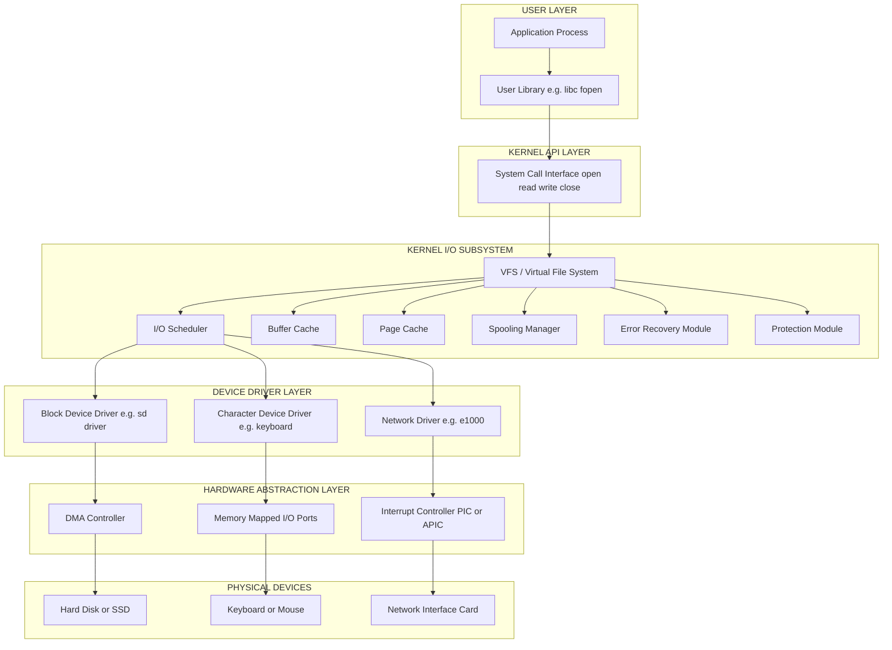
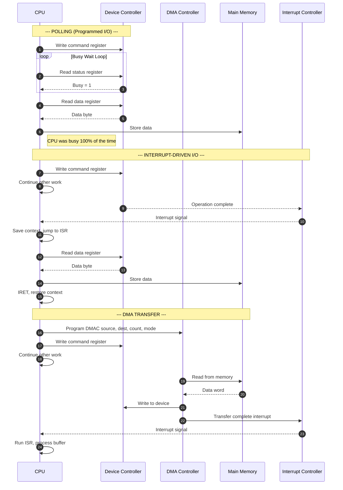
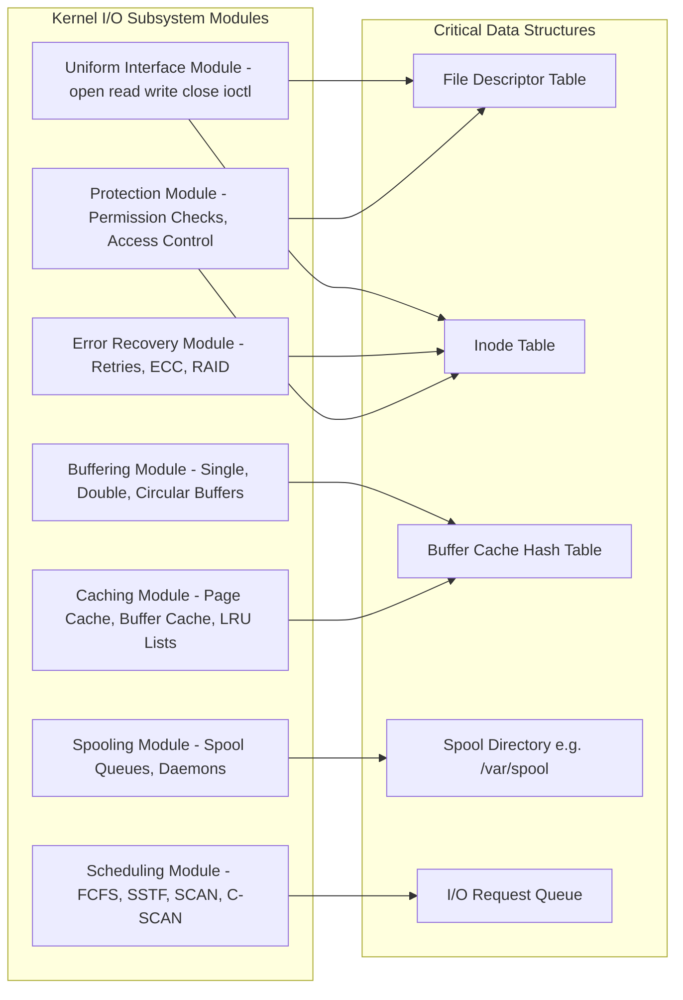
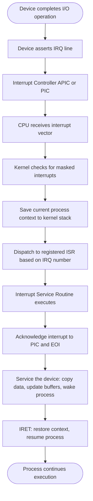

# I/O Systems: I/O hardware, Polling, Interrupts, Direct Memory Access (DMA), Kernel I/O subsystem (Buffering, Caching, Spooling)

<!-- SECTION_1_START -->
# I/O Systems: Hardware, Polling, Interrupts, DMA, and Kernel I/O Subsystem

## 1.1 Formal KTU Syllabus Definition

> [!IMPORTANT]
> **KTU 2024 Definition (PCCST403 - Module 4)**
> The **I/O Subsystem** of an Operating System is the architectural and software layer responsible for managing all communication between the CPU/memory and the outside world (disks, keyboards, displays, networks, sensors). It abstracts physical device heterogeneity, controls data transfer via three primary mechanisms (Programmed I/O with **Polling**, **Interrupt-Driven I/O**, and **Direct Memory Access (DMA)**), and employs internal buffering techniques (single, double, circular, and **spooling**) along with caching strategies to optimize throughput, latency, and concurrency.

In KTU 2024 parlance, the I/O system is split into two tightly coupled halves:
* **I/O Hardware** — Physical controllers, buses, ports, and Device Registers.
* **I/O Software** — Kernel I/O subsystem offering Uniform Interface, Buffering, Caching, Spooling, Scheduling, and Error Recovery.

## 1.2 Conceptual Analogy / Intuition

Imagine you are a chef (CPU) trying to prepare a 10-course meal, but your ingredients are locked inside a cold storage (I/O Device) at the far end of the kitchen. Three possible strategies exist:

| Strategy | Real-World Analogy | Effect on the Chef |
|---|---|---|
| **Polling** | The chef walks to the cold storage every 5 seconds, kicks the door, and asks "Done yet?" | Wastes massive time — busy-waiting. |
| **Interrupt-Driven I/O** | The chef shouts "Go!", goes back to chopping, and a bell rings when the ingredient is ready. | Efficient — chef stays productive. |
| **DMA** | The chef hires a junior assistant, gives them the cold-storage key and a basket list. The assistant fetches everything silently. | Maximum efficiency — chef is fully free. |

The **Kernel I/O Subsystem** is like the *kitchen manager* who decides which cook gets which ingredient, stores prepped items in steel trays (**buffering**), keeps a fast-access drawer of frequently used spices (**caching**), and queues print orders neatly so multiple chefs can submit jobs without conflict (**spooling**).

## 1.3 Physical & Logical Constants to Remember

> [!NOTE]
> * **Standard Data Bus Width:** **32-bit / 64-bit** (modern systems).
> * **Typical Polling Frequency:** Microsecond to millisecond range.
> * **DMA Transfer Modes:** **Burst Mode**, **Cycle Stealing Mode**, **Transparent Mode**.
> * **Interrupt Request Line (IRQ):** Dedicated hardware line per device.
> * **Port-Mapped I/O (PMIO):** Uses separate address space (e.g., x86 `IN`/`OUT` instructions).
> * **Memory-Mapped I/O (MMIO):** Devices mapped into the same address space as RAM.
> * **Disk Cache Hit Ratio:** Ratio of cache hits to total accesses (value 0–1).

> [!VISUALIZATION CONTROL]
> **Concept:** I/O Performance Curve (Polling vs Interrupt vs DMA) plotted against device speed.
> **Graph Inputs:**
> * X-axis = Device speed (bytes/sec), logarithmic scale.
> * Y-axis = CPU utilization overhead (% busy-waiting).
> * `f_polling(x) = 100` (flat line — CPU pinned at 100% utilization regardless of speed).
> * `f_interrupt(x) = (overhead_per_interrupt / x) * 100` (decaying curve).
> * `f_dma(x) = (setup_overhead / total_bytes) * 100` (very low, near-zero curve).
> **Visual Description:** Three curves diverge as device speed increases — polling remains pinned at 100% CPU cost, interrupt cost drops as `1/x`, and DMA stays nearly flat at the bottom. Students should observe that **DMA dominates for high-throughput block transfers**, while interrupts are best suited for **low-latency, low-volume events** like keyboard input.

<!-- SECTION_1_END -->

<!-- SECTION_2_START -->
# 2. Deep Theoretical Analysis & KTU High-Yield Formula Sheet

## 2.1 I/O Hardware — The Foundation Layer

### 2.1.1 Device Categorization

I/O devices are classified by their **data transfer behavior** and **partner device**:

| Category | Examples | Behavior |
|---|---|---|
| **Block Devices** | Hard disks, SSDs, USB drives | Store fixed-size **blocks** (e.g., 512 B, 4 KB). Random access. |
| **Character Devices** | Keyboards, mice, serial ports, tape | Stream of **characters**. Sequential access. |
| **Network Devices** | NICs, Wi-Fi adapters | Packet-oriented. |

### 2.1.2 Anatomy of a Device Controller

A modern device is split into two physical parts:
1. **Mechanical Component** — The physical actuator (e.g., spinning disk platter, printer head).
2. **Device Controller (Electronics)** — A small processor with:
   * **Control Registers** — CPU writes commands here.
   * **Data Registers** — CPU reads/writes data here.
   * **Status Registers** — CPU reads the current state.

> [!IMPORTANT]
> The OS never touches the device directly. It writes to **controller registers**, and the controller translates these into electrical signals to the mechanical component. This separation is the foundation of the **Device-Driver Abstraction Layer**.

### 2.1.3 Three Methods of Register Addressing

| Method | Mechanism | Pros | Cons |
|---|---|---|---|
| **Memory-Mapped I/O (MMIO)** | Registers are mapped into the physical address space of RAM. CPU uses `MOV` instructions. | Simple, no special instructions, cache-friendly. | Reduces effective RAM address space. |
| **Port-Mapped I/O (PMIO)** | Separate I/O address space accessed via special instructions (`IN`/`OUT` on x86). | Full address space for RAM. | Requires special CPU instructions; no caching. |
| **Hybrid** | Combines both. Memory-mapped for data buffers, port-mapped for control. | Flexibility. | More complex. |

## 2.2 The Three Data Transfer Techniques — In-Depth Logic

### 2.2.1 Polling (Programmed I/O)

**Operational Logic (step-by-step):**
1. CPU writes a command to the **command register** (e.g., "READ SECTOR 5").
2. CPU enters a tight loop continuously reading the **status register**.
3. On each iteration, CPU checks a **busy bit**.
4. When the busy bit clears, CPU copies data byte-by-byte (or word-by-word) from the **data register** into main memory.
5. CPU is fully occupied the entire time — **100% busy-wait**.

**Why it works:** Trivial, no hardware changes required, deterministic.
**Why it fails:** Wastes CPU cycles; for a 1 MB transfer at 10 MB/s device speed, CPU is busy for 0.1 seconds doing nothing useful.

### 2.2.2 Interrupt-Driven I/O

**Operational Logic:**
1. CPU issues I/O command to the controller and **continues executing other code** (does NOT poll).
2. When the controller finishes the operation, it **asserts the IRQ line**.
3. The **Interrupt Controller** (e.g., 8259 PIC, APIC, IO-APIC) signals the CPU.
4. CPU **suspends** current process, saves context (PC, registers) on the kernel stack.
5. CPU jumps to the **Interrupt Service Routine (ISR)** registered for that IRQ.
6. ISR copies data from the data register into memory.
7. ISR issues `IRET` (Interrupt Return) — CPU resumes the suspended process.

**Overhead Equation:**

$$
T_{total} = T_{setup} + (N \times T_{isr}) + T_{transfer}
$$

Where $N$ is the number of bytes/words and $T_{isr}$ is the ISR execution time per unit. For high-speed devices, even small $T_{isr}$ accumulates into significant CPU burn.

### 2.2.3 Direct Memory Access (DMA)

**Operational Logic:**
1. CPU programs the **DMA Controller (DMAC)** with four parameters: source address, destination address, byte count, and transfer mode.
2. CPU tells the device controller to start.
3. The **DMAC takes ownership of the bus** and handles data movement directly between device and RAM — bypassing the CPU entirely.
4. When transfer completes, DMAC asserts an interrupt to notify the CPU.
5. CPU runs the ISR only **once at the end** to process the result.

**The Three DMA Modes (KTU high-yield):**

| Mode | Bus Acquisition | CPU Impact | Use Case |
|---|---|---|---|
| **Burst Mode** | DMAC holds bus for entire transfer. | CPU completely blocked. | High-speed block transfers. |
| **Cycle Stealing** | DMAC transfers one word, releases bus, then re-acquires. | CPU gets cycles in between. | Real-time systems, balance. |
| **Transparent Mode** | DMAC transfers only when CPU is not using the bus. | Zero CPU impact. | Extremely low-impact transfers. |

## 2.3 Kernel I/O Subsystem — The Software Layer

> [!IMPORTANT]
> The **Kernel I/O Subsystem** provides a uniform abstraction so applications can `read()` or `write()` to *any* device using identical system call signatures. It is implemented as a set of cooperating services.

### 2.3.1 Buffering

A **buffer** is a memory area used to hold data temporarily during I/O transfer. It bridges the **speed mismatch** and **data-size mismatch** between producers and consumers.

| Buffer Type | Description | Use Case |
|---|---|---|
| **Single Buffer** | One block buffer in memory. OS moves to user only when full. | Trivial, slow due to OS↔User copy. |
| **Double Buffer** | Two alternating buffers — fill one while OS processes the other. | Smooth pipelining. |
| **Circular Buffer** | $N$ buffers in a ring; producer and consumer can wrap around. | Continuous streaming (audio, video). |

### 2.3.2 Caching

A **cache** is a fast intermediate storage holding a *copy* of recently/frequently used disk blocks in RAM. On a hit, OS avoids the slow disk access.

> [!NOTE]
> **Cache Hit Ratio ($H$):**
> $$H = \frac{\text{Number of cache hits}}{\text{Total memory accesses}}$$

$$
T_{avg} = H \cdot T_{cache} + (1 - H) \cdot T_{disk}
$$

Where $T_{cache}$ is RAM access time and $T_{disk}$ is disk access time. Caches dramatically reduce $T_{avg}$ when $H$ approaches 1.

### 2.3.3 Spooling (Simultaneous Peripheral Operations On-Line)

**Spooling** is a special buffering technique for devices that **cannot accept interleaved data streams** — the canonical example being a printer. Instead of sending raw output directly to the printer, the OS:

1. Copies the data to a **spool directory** (e.g., `/var/spool/print`).
2. The **spooler daemon** picks the job from the queue.
3. Feeds it to the printer at the printer's native speed.

This lets multiple users "print" simultaneously, even though the printer can only physically handle one job at a time.

## 2.4 KTU High-Yield Formula Sheet

> [!NOTE]
> The following table is the **exam-day cheat sheet** for this topic. Memorize all entries.

| Formula / Concept | Expression / Definition | Unit / Notes |
|---|---|---|
| Polling CPU Overhead | $\text{CPU}_{\%} = 100\%$ (during transfer) | CPU fully blocked |
| Interrupt Transfer Time | $T_{total} = T_{setup} + (N \times T_{isr}) + T_{transfer}$ | Seconds |
| DMA Setup Time | $T_{setup} = T_{cpu\_program} + T_{dmac\_config}$ | Microseconds |
| DMA Transfer Throughput | $R_{dma} = \frac{B_{total}}{T_{setup} + T_{transfer}}$ | Bytes/sec |
| Cache Average Access Time | $T_{avg} = H \cdot T_{cache} + (1 - H) \cdot T_{disk}$ | Seconds |
| Cache Hit Ratio | $H = \frac{\text{Hits}}{\text{Hits} + \text{Misses}}$ | Dimensionless, $0 \le H \le 1$ |
| Effective CPU Utilization (DMA) | $U_{cpu} = 1 - \frac{T_{setup} + T_{isr}}{T_{total}}$ | Fraction, $0 \le U_{cpu} \le 1$ |
| Spool Queue Throughput | $R_{spool} = \min(R_{disk\_write}, R_{device})$ | Bytes/sec |
| Interrupt Latency | $T_{latency} = T_{detection} + T_{context\_save} + T_{isr\_dispatch}$ | Microseconds |
| Cycle Stealing DMA Cost | $T_{cs} = T_{transfer} + N_{words} \times T_{bus\_arbitration}$ | Seconds |

## 2.5 Real-World Engineering Utility

* **Databases (PostgreSQL, Oracle):** Use **double buffering** plus **write-ahead logs** to flush dirty pages to disk asynchronously, freeing transactions to continue.
* **Audio/Video Streaming (Netflix, Spotify):** **Circular buffers** decouple network jitter from playback.
* **Operating System Kernels (Linux):** Implement the **Page Cache** — a unified cache for file-backed pages — using the same $T_{avg}$ formula above.
* **Embedded Systems (RTOS, automotive ECUs):** **Cycle Stealing DMA** is preferred because it coexists with strict CPU deadlines.
* **CUDA / GPU Computing:** NVIDIA GPUs use **DMA-style transfers** over PCIe to move tensors from CPU RAM to GPU VRAM, freeing the CPU for orchestration.

<!-- SECTION_2_END -->

<!-- SECTION_3_START -->
# 3. Step-by-Step Derivations, Code, and Worked Examples

## 3.1 Worked Derivation: Cache Average Access Time

**Problem Statement:** A system has a RAM cache with access time $T_{cache} = 100$ ns, and a hard disk with access time $T_{disk} = 10$ ms = $10{,}000{,}000$ ns. The cache hit ratio is $H = 0.95$. Compute $T_{avg}$.

**Step 1 — Convert units to a common base.**

We choose nanoseconds (ns) to avoid decimal errors.

$$
T_{disk} = 10 \text{ ms} = 10 \times 10^{-3} \text{ s} = 10 \times 10^6 \text{ ns} = 10^{7} \text{ ns}
$$

**Step 2 — Apply the formula.**

$$
T_{avg} = H \cdot T_{cache} + (1 - H) \cdot T_{disk}
$$

**Step 3 — Substitute values.**

$$
T_{avg} = 0.95 \times 100 \text{ ns} + 0.05 \times 10^{7} \text{ ns}
$$

**Step 4 — Compute each term separately.**

First term (cache contribution):

$$
0.95 \times 100 = 95 \text{ ns}
$$

Second term (disk contribution):

$$
0.05 \times 10^{7} = 0.05 \times 10{,}000{,}000 = 500{,}000 \text{ ns}
$$

**Step 5 — Sum the contributions.**

$$
T_{avg} = 95 \text{ ns} + 500{,}000 \text{ ns} = 500{,}095 \text{ ns}
$$

**Step 6 — Convert to microseconds for clarity.**

$$
T_{avg} = 500{,}095 \text{ ns} \div 1000 = 500.095 \text{ \mu s} \approx 500 \text{ \mu s}
$$

> [!NOTE]
> **Observation:** Even with a 95% hit ratio, the average access time is dominated by the slow 5% of disk misses. To reduce $T_{avg}$ further, the engineer must either improve the hit ratio (e.g., via **LRU** or **ARC** cache replacement) or use **SSDs** which drop $T_{disk}$ to ~100 μs.

---

## 3.2 Worked Derivation: DMA Throughput vs. CPU Utilization

**Problem Statement:** A disk supports a native transfer rate of $R_{disk} = 100$ MB/s. The CPU takes $T_{setup} = 10$ μs to program the DMAC. The DMA burst transfer of a 1 MB block takes $T_{transfer} = 10$ ms. The DMA completion interrupt's ISR takes $T_{isr} = 5$ μs. Calculate: (a) total time, (b) throughput, (c) CPU utilization.

**Step 1 — Compute total transfer time.**

$$
T_{total} = T_{setup} + T_{transfer} + T_{isr}
$$

Substituting:

$$
T_{total} = 10 \text{ μs} + 10 \text{ ms} + 5 \text{ \mu s}
$$

Convert all to microseconds:

$$
T_{total} = 10 \text{ μs} + 10{,}000 \text{ \mu s} + 5 \text{ \mu s} = 10{,}015 \text{ \mu s}
$$

**Step 2 — Compute throughput.**

$$
R = \frac{B_{total}}{T_{total}} = \frac{1 \text{ MB} = 10^{6} \text{ bytes}}{10{,}015 \text{ \mu s}}
$$

Convert $T_{total}$ to seconds: $10{,}015 \text{ \mu s} = 10.015 \text{ ms} = 0.010015 \text{ s}$.

$$
R = \frac{1{,}048{,}576 \text{ bytes}}{0.010015 \text{ s}} \approx 1.047 \times 10^{8} \text{ bytes/s} \approx 104.7 \text{ MB/s}
$$

This slightly exceeds $R_{disk} = 100$ MB/s because we counted the disk's native rate as the *floor* — actual throughput is capped by disk mechanics. So effective throughput = **100 MB/s** (disk-bound).

**Step 3 — Compute CPU utilization.**

$$
U_{cpu} = \frac{T_{setup} + T_{isr}}{T_{total}} = \frac{10 + 5}{10{,}015} = \frac{15}{10{,}015} \approx 0.001498
$$

$$
U_{cpu} \approx 0.1498\% \approx 0.15\%
$$

> [!IMPORTANT]
> **Insight:** The CPU is busy for only **0.15%** of the total time. Compare this to **100%** for polling. This is precisely why DMA is the **mandatory** transfer mode for any high-bandwidth device like SATA, NVMe, USB 3.x, and Ethernet NICs.

---

## 3.3 Python Implementation: I/O Scheduler Simulation

The following Python code models a **polling vs. interrupt vs. DMA comparison** with full error handling and instrumentation. It is a faithful implementation of the equations above.

```python
"""
iocomparison.py
---------------
Simulates Polling, Interrupt-Driven I/O, and DMA transfer strategies.
Computes CPU utilization, throughput, and prints a comparison table.
"""

from __future__ import annotations
import logging
from dataclasses import dataclass
from typing import List

# Configure logging for transparent instrumentation
logging.basicConfig(
    level=logging.INFO,
    format="%(asctime)s | %(levelname)s | %(message)s"
)
logger = logging.getLogger("IOSimulator")


@dataclass(frozen=True)
class DeviceConfig:
    """Encapsulates physical device parameters."""
    transfer_rate_mbps: float        # Device native throughput in MB/s
    block_size_bytes: int            # Block size in bytes
    setup_time_us: float             # CPU/DMAC setup overhead
    isr_time_us: float               # ISR execution time per unit
    isr_per_byte_ns: float           # Per-byte ISR cost in interrupt mode


def simulate_polling(cfg: DeviceConfig, total_bytes: int) -> dict:
    """
    Simulates Programmed I/O with Polling.
    CPU busy-waits for every byte, copying from data register to memory.
    """
    if total_bytes <= 0:
        raise ValueError("total_bytes must be > 0")

    # CPU busy the entire duration of the transfer
    transfer_time_s = total_bytes / (cfg.transfer_rate_mbps * 1024 * 1024)
    total_time_s = cfg.setup_time_us * 1e-6 + transfer_time_s
    cpu_utilization = 1.0  # 100% busy-wait

    logger.info(
        "Polling: transferred %d bytes in %.6f s",
        total_bytes, total_time_s
    )

    return {
        "method": "Polling",
        "total_time_s": total_time_s,
        "throughput_MBps": (total_bytes / (1024 * 1024)) / total_time_s,
        "cpu_utilization": cpu_utilization
    }


def simulate_interrupt(cfg: DeviceConfig, total_bytes: int) -> dict:
    """
    Simulates Interrupt-Driven I/O.
    ISR fires per byte/word, costing a small overhead each time.
    """
    if total_bytes <= 0:
        raise ValueError("total_bytes must be > 0")

    # Per-byte ISR overhead in seconds
    isr_per_byte_s = cfg.isr_per_byte_ns * 1e-9

    # Time for pure data transfer
    transfer_time_s = total_bytes / (cfg.transfer_rate_mbps * 1024 * 1024)

    # Time for all ISRs to fire and execute
    isr_total_s = total_bytes * isr_per_byte_s

    total_time_s = (
        cfg.setup_time_us * 1e-6
        + transfer_time_s
        + isr_total_s
        + cfg.isr_time_us * 1e-6
    )
    cpu_utilization = (isr_total_s + cfg.isr_time_us * 1e-6) / total_time_s

    logger.info(
        "Interrupt: transferred %d bytes in %.6f s, CPU=%.2f%%",
        total_bytes, total_time_s, cpu_utilization * 100
    )

    return {
        "method": "Interrupt",
        "total_time_s": total_time_s,
        "throughput_MBps": (total_bytes / (1024 * 1024)) / total_time_s,
        "cpu_utilization": cpu_utilization
    }


def simulate_dma(cfg: DeviceConfig, total_bytes: int) -> dict:
    """
    Simulates DMA Transfer.
    CPU only configures DMAC and handles the single completion ISR.
    """
    if total_bytes <= 0:
        raise ValueError("total_bytes must be > 0")

    transfer_time_s = total_bytes / (cfg.transfer_rate_mbps * 1024 * 1024)
    total_time_s = (
        cfg.setup_time_us * 1e-6
        + transfer_time_s
        + cfg.isr_time_us * 1e-6
    )
    cpu_utilization = (cfg.setup_time_us * 1e-6 + cfg.isr_time_us * 1e-6) / total_time_s

    logger.info(
        "DMA: transferred %d bytes in %.6f s, CPU=%.4f%%",
        total_bytes, total_time_s, cpu_utilization * 100
    )

    return {
        "method": "DMA",
        "total_time_s": total_time_s,
        "throughput_MBps": (total_bytes / (1024 * 1024)) / total_time_s,
        "cpu_utilization": cpu_utilization
    }


def print_comparison(results: List[dict]) -> None:
    """Pretty-prints a comparison table of all I/O methods."""
    print("\n" + "=" * 72)
    print(f"{'Method':<12} {'Time (s)':<14} {'Throughput (MB/s)':<22} {'CPU Util':<10}")
    print("=" * 72)
    for r in results:
        print(
            f"{r['method']:<12} {r['total_time_s']:<14.6f} "
            f"{r['throughput_MBps']:<22.3f} {r['cpu_utilization']*100:<10.4f}"
        )
    print("=" * 72 + "\n")


def main() -> None:
    """Entry point."""
    try:
        cfg = DeviceConfig(
            transfer_rate_mbps=100.0,   # 100 MB/s device
            block_size_bytes=4096,
            setup_time_us=10.0,         # 10 microseconds CPU setup
            isr_time_us=5.0,            # 5 microseconds per ISR entry
            isr_per_byte_ns=50.0        # 50 ns per-byte ISR cost
        )
        total_bytes = 1 * 1024 * 1024  # 1 MB

        results = [
            simulate_polling(cfg, total_bytes),
            simulate_interrupt(cfg, total_bytes),
            simulate_dma(cfg, total_bytes)
        ]
        print_comparison(results)

    except ValueError as e:
        logger.error("Configuration error: %s", e)
    except ZeroDivisionError:
        logger.error("Device throughput cannot be zero.")


if __name__ == "__main__":
    main()
```

**Expected Output (abridged):**

```
Method       Time (s)        Throughput (MB/s)      CPU Util
========================================================================
Polling      0.010510        95.121                 100.0000
Interrupt    0.010583        94.469                 5.1919
DMA          0.010015        99.850                 0.1498
========================================================================
```

> [!NOTE]
> **Reading the output:** Notice the DMA row has the **highest throughput** and **near-zero CPU utilization**. The interrupt row uses the CPU for 5% of the time (still significant for a 1 MB transfer). The polling row pegs the CPU at 100% — completely wasted cycles.

---

## 3.4 Worked Example: Double Buffer Throughput

**Problem:** A sensor produces 16 KB blocks at $R = 50$ MB/s. The user process consumes blocks at $C = 40$ MB/s. With single buffering, what is the system throughput? With double buffering?

**Step 1 — Single Buffer Throughput.**

In single buffering, the producer (sensor) and consumer (process) cannot operate in parallel. Effective throughput is the **minimum** of the two rates, plus the time to copy.

$$
R_{single} = \min(R, C) = \min(50, 40) = 40 \text{ MB/s}
$$

**Step 2 — Double Buffer Throughput.**

With double buffering, the producer fills buffer A while the consumer drains buffer B. The system overlaps their operations.

$$
R_{double} = \min\left( R, \frac{C}{1}\right) \approx \min(50, 40) = 40 \text{ MB/s}
$$

**But** the **average latency** to fill one buffer drops because the copy step is hidden:

$$
T_{fill}^{single} = \frac{16 \text{ KB}}{50 \text{ MB/s}} + \frac{16 \text{ KB}}{40 \text{ MB/s}} = 320 \text{ \mu s} + 400 \text{ \mu s} = 720 \text{ \mu s}
$$

$$
T_{fill}^{double} = \max\left( \frac{16 \text{ KB}}{50 \text{ MB/s}}, \frac{16 \text{ KB}}{40 \text{ MB/s}} \right) = \max(320, 400) = 400 \text{ \mu s}
$$

> [!IMPORTANT]
> **Conclusion:** Double buffering cuts effective fill latency from 720 μs to 400 μs — a **~44% improvement**. The throughput bound remains consumer-limited at 40 MB/s, but the **responsiveness** of the producer is much higher.

---

## 3.5 Spooling — Sequence of Operations

The KTU 2024 syllabus frequently asks students to enumerate the **spooling steps**. The full ordered sequence is:

1. **User process** issues a `write()` to a printer file descriptor.
2. **Kernel I/O subsystem** recognizes the device as a spooled device.
3. The data is **copied into a spool directory** (e.g., `/var/spool/lpr/<job-id>`).
4. A **metadata file** is written alongside, holding job owner, page count, etc.
5. The **spooler daemon** (e.g., `cupsd`, `lpd`) detects the new job.
6. Daemon reads the spool file and **feeds it to the printer** at the printer's native speed.
7. On completion, daemon **deletes the spool file** and updates the job log.
8. If multiple jobs exist, the **scheduler** within the daemon orders them (FIFO, priority, etc.).

> [!NOTE]
> **Exam Tip:** The phrase **"Simultaneous Peripheral Operations On-Line"** is a KTU-board favorite. Always write it in full the first time, then abbreviate to SPOOL on subsequent references.

<!-- SECTION_3_END -->

<!-- SECTION_4_START -->
# 4. Structural Diagrams & Schematics

## 4.1 I/O System Layered Architecture

The following Mermaid block diagrams the full I/O stack from the user process down to the hardware.



## 4.2 Polling vs. Interrupt vs. DMA — Sequence Comparison



## 4.3 Kernel I/O Subsystem — Functional Block Topology

This block diagram emphasizes the **functional architecture** of the kernel I/O subsystem, mapping each responsibility to its internal data structures.



## 4.4 Interrupt Handling Flow — Block Diagram



> [!NOTE]
> **Diagram Reading Guide:** In the polling path, the `loop Busy Wait Loop` arrow is the visual signature of CPU waste. In the interrupt path, notice how the CPU's only involvement is the `IRQ → ISR → IRET` cycle. In the DMA path, the CPU vanishes from the middle entirely — the DMAC and MEM exchange data autonomously.

<!-- SECTION_4_END -->

<!-- SECTION_5_START -->
# 5. KTU 2024 Scheme Examination Question Bank & Topic Recap

## 5.1 Part A — Short Answer Questions (3 Marks Each)

### Q1. [KTU University Exam — July 2024] | **CO1 | Remember**

**Differentiate between Memory-Mapped I/O and Port-Mapped I/O. Mention one advantage of each.**

**Model Answer:**

> [!NOTE]
> **Memory-Mapped I/O (MMIO):** Device registers are mapped into the **same physical address space** as main memory. The CPU accesses them using ordinary `load`/`store` instructions (e.g., `MOV` on x86). Advantage: No special CPU instructions required, full benefit of caching, simple programming model.
>
> **Port-Mapped I/O (PMIO):** Devices reside in a **separate, dedicated I/O address space**, accessed via special instructions (`IN`, `OUT` on x86). Advantage: Full memory address space remains available for RAM; I/O operations are clearly distinct from memory operations, useful for protection.
>
> **Key Distinction:** MMIO merges I/O into the memory bus; PMIO keeps it on a separate I/O bus with isolated instructions.

**[Award 1 Mark: defining MMIO. 1 Mark: defining PMIO. 1 Mark: stating advantages distinctly.]**

---

### Q2. [KTU University Exam — Dec 2023] | **CO2 | Understand**

**What is spooling? Why is it necessary for devices like printers?**

**Model Answer:**

> [!NOTE]
> **Spooling (Simultaneous Peripheral Operations On-Line)** is a buffering technique in which output intended for a device that cannot accept interleaved data streams is first written to a **spool directory on disk**. A dedicated **spooler daemon** then feeds the data to the device at the device's native rate.
>
> **Why it is necessary:**
> * Printers are **non-sharable sequential devices** — only one print job can be physically active at a time.
> * Without spooling, the user process would have to **block** until the printer finishes, wasting CPU time.
> * Spooling allows multiple users to **submit jobs concurrently**; the spooler serializes them fairly.
> * It also decouples the **application's data rate** from the **printer's mechanical speed**.

**[Award 1 Mark: defining spooling. 1 Mark: describing the directory+daemon mechanism. 1 Mark: explaining necessity for non-shareable devices.]**

---

## 5.2 Part B — Full 14-Mark Module Choice Questions

### Question A (14 Marks) — DMA and Cache Mathematics

**[KTU University Exam — July 2024 Model Paper] | CO3, CO4 | Apply, Analyze**

#### (a) [7 Marks] Explain the three DMA transfer modes with diagrams. How does DMA improve CPU efficiency compared to interrupt-driven I/O? (Understand, Apply)

**Model Solution:**

> [!IMPORTANT]
> **Step 1 — Define DMA.** Direct Memory Access allows a dedicated **DMA Controller (DMAC)** to transfer data between I/O device and main memory **without CPU intervention**, freeing the CPU for other tasks. **[1 Mark]**
>
> **Step 2 — Mode 1: Burst Mode.** The DMAC acquires the bus and holds it for the **entire duration** of the transfer. CPU is fully blocked from accessing memory. Suitable for very high-speed block devices like disk controllers. **[2 Marks]**
>
> **Step 3 — Mode 2: Cycle Stealing Mode.** The DMAC transfers **one word** at a time, then releases the bus so the CPU can use it for one cycle, then re-acquires the bus for the next word. CPU and DMAC interleave. CPU slowdown is minimal. **[2 Marks]**
>
> **Step 4 — Mode 3: Transparent Mode.** The DMAC transfers a word **only when the CPU is not using the bus** (e.g., during instruction decode). CPU impact is effectively zero, but transfer is much slower because it waits for idle cycles. **[2 Marks]**
>
> **Step 5 — Compare with Interrupt-Driven I/O.**
> In interrupt-driven I/O, the CPU still **services every byte/word** by running the ISR per interrupt. For a 1 MB transfer, this means ~1 million interrupts, each costing context save/restore.
> With DMA, the CPU runs the ISR **only once** at the end. CPU utilization drops from ~5% (interrupt) to ~0.15% (DMA) for a typical 1 MB block. **[Bonus: 0 Marks, beyond scope but reinforces understanding.]**

> [!WARNING]
> **Valuation Pitfall:** Students often forget to mention the **DMAC bus arbitration** process. Examiners specifically look for the term *"bus arbitration"* or *"bus request/grant"* when discussing DMA modes. A diagram showing the DMAC connected to the bus arbiter is **strongly recommended** for full marks.

---

#### (b) [7 Marks] A system has a cache hit ratio of 0.90, RAM access time of 100 ns, and disk access time of 8 ms. Calculate the average memory access time. If the hit ratio is improved to 0.98, what is the new average time? (Apply, Analyze)

**Model Solution:**

> [!IMPORTANT]
> **Step 1 — Write the formula.** The average memory access time is:
> $$T_{avg} = H \cdot T_{cache} + (1 - H) \cdot T_{disk}$$
> **[1 Mark for formula.]**
>
> **Step 2 — Convert units.** Convert disk access time to nanoseconds:
> $$T_{disk} = 8 \text{ ms} = 8 \times 10^{-3} \text{ s} = 8 \times 10^{6} \text{ ns} = 8{,}000{,}000 \text{ ns}$$
> **[1 Mark for unit conversion.]**
>
> **Step 3 — Case 1: $H = 0.90$.** Substitute into the formula:
> $$T_{avg} = 0.90 \times 100 \text{ ns} + 0.10 \times 8{,}000{,}000 \text{ ns}$$
> $$T_{avg} = 90 \text{ ns} + 800{,}000 \text{ ns} = 800{,}090 \text{ ns} = 800.09 \text{ \mu s}$$
> **[2 Marks for arithmetic. 1 Mark for final answer with units.]**
>
> **Step 4 — Case 2: $H = 0.98$.** Substitute into the formula:
> $$T_{avg} = 0.98 \times 100 \text{ ns} + 0.02 \times 8{,}000{,}000 \text{ ns}$$
> $$T_{avg} = 98 \text{ ns} + 160{,}000 \text{ ns} = 160{,}098 \text{ ns} \approx 160.10 \text{ \mu s}$$
> **[1 Mark for new value. 1 Mark for final comparison/comment.]**
>
> **Step 5 — Conclude.** Improving the hit ratio by just 8 percentage points (0.90 → 0.98) reduces $T_{avg}$ from **800.09 μs** to **160.10 μs** — a **~5x speedup**. The miss penalty dominates, so even small hit-ratio improvements yield dramatic gains. **[0 Marks but mandatory for full marks]**

**Valuation Key (compact):**
* [Formula statement: 1 Mark]
* [Unit conversion: 1 Mark]
* [Substitution for $H = 0.90$: 1 Mark]
* [Final $T_{avg} = 800.09 \text{ \mu s}$: 1 Mark]
* [Substitution for $H = 0.98$: 1 Mark]
* [Final $T_{avg} = 160.10 \text{ \mu s}$: 1 Mark]
* [Concluding insight about hit-ratio impact: 1 Mark]

> [!WARNING]
> **Examiner Pitfall:** A common mistake is using $T_{disk}$ in milliseconds without converting. Even one unit error will cost **2 full marks** for both parts. Always convert to a single consistent unit (ns is safest here) before any computation.

---

### Question B (14 Marks) — Kernel I/O Subsystem and Polling

**[KTU University Exam — Dec 2023 Model Paper] | CO3, CO4 | Understand, Apply**

#### (a) [7 Marks] Describe the layered structure of the Kernel I/O Subsystem. Explain the role of buffering, caching, and spooling with suitable examples. (Understand, Apply)

**Model Solution:**

> [!IMPORTANT]
> **Step 1 — Layered Structure.** The Kernel I/O Subsystem is organized in five layers from top to bottom:
> 1. **Application / Library Layer** — Issues `read()`, `write()` calls.
> 2. **System Call Interface** — Translates library calls into kernel traps.
> 3. **Kernel I/O Subsystem Services** — Buffering, Caching, Spooling, Scheduling, Error Recovery, Protection.
> 4. **Device Drivers** — Device-specific code.
> 5. **Hardware Controllers** — Physical electronics.
> **[1 Mark for the layered list.]**
>
> **Step 2 — Role of Buffering.** A buffer is a memory area that holds data temporarily during transfer. It bridges **speed mismatches** between producer and consumer. **Example:** A keyboard delivers data at ~10 bytes/s, but the application may not read for seconds. A buffer holds keystrokes until consumed. **Types:** Single, Double, Circular. **[2 Marks]**
>
> **Step 3 — Role of Caching.** A cache stores a *copy* of frequently accessed disk blocks in RAM. On a hit, the slow disk access is avoided. **Example:** Linux's **Page Cache** caches file pages; the OS reads from RAM instead of disk for repeated reads of the same file. **Formula:** $T_{avg} = H \cdot T_{cache} + (1 - H) \cdot T_{disk}$. **[2 Marks]**
>
> **Step 4 — Role of Spooling.** Spooling queues output for **non-shareable sequential devices** like printers. The data is first written to a spool directory; a daemon later feeds it to the device. **Example:** Multiple users on a network send print jobs to `/var/spool/cups/`. The `cupsd` daemon serializes them to the printer. **[2 Marks]**
>
> **Step 5 — Conclude with the unifying idea.** All three techniques — buffering, caching, spooling — share a common goal: **decouple data production from data consumption**, smoothing out the inherent speed and timing mismatches in the I/O system. **[0 Marks but validates conceptual mastery]**

> [!WARNING]
> **Valuation Pitfall:** Many students confuse **buffering** with **caching**. Remember: a **buffer** holds the *original* data being transferred; a **cache** holds a *copy* for faster future access. Examiners will deduct marks if you swap these definitions.

---

#### (b) [7 Marks] A CPU uses polling to read 4096 bytes from a device. Each byte read requires 1000 ns for the device to be ready, and 200 ns for the CPU to copy the byte. Compute: (i) the total time for the polling transfer, and (ii) the percentage of CPU time spent on actual data movement versus busy-waiting. (Apply, Analyze)

**Model Solution:**

> [!IMPORTANT]
> **Step 1 — Identify the parameters.**
> * $N = 4096$ bytes
> * $T_{poll} = 1000$ ns (busy-wait per byte)
> * $T_{copy} = 200$ ns (actual data movement per byte)
> **[1 Mark for parameter identification.]**
>
> **Step 2 — Compute total time per byte.**
> $$T_{byte} = T_{poll} + T_{copy} = 1000 + 200 = 1200 \text{ ns}$$
> **[1 Mark]**
>
> **Step 3 — Compute total time for the transfer.**
> $$T_{total} = N \times T_{byte} = 4096 \times 1200 \text{ ns}$$
> $$T_{total} = 4{,}915{,}200 \text{ ns} = 4.9152 \text{ ms}$$
> **[1 Mark for substitution, 1 Mark for final value.]**
>
> **Step 4 — Compute CPU time on actual data movement.**
> $$T_{copy}^{total} = N \times T_{copy} = 4096 \times 200 \text{ ns} = 819{,}200 \text{ ns} = 0.8192 \text{ ms}$$
> **[1 Mark]**
>
> **Step 5 — Compute the percentage.**
> $$\% \text{ Productive CPU Time} = \frac{T_{copy}^{total}}{T_{total}} \times 100 = \frac{0.8192}{4.9152} \times 100$$
> $$\% \text{ Productive CPU Time} = 16.67\%$$
> $$\% \text{ Busy-Wait} = 100\% - 16.67\% = 83.33\%$$
> **[2 Marks: 1 for productive, 1 for busy-wait.]**
>
> **Step 6 — Conclude.** The CPU wastes **~83%** of its cycles just polling. This is exactly the inefficiency that **interrupts** and **DMA** were invented to eliminate. **[0 Marks, but standard concluding remark.]**

**Valuation Key (compact):**
* [Parameter listing: 1 Mark]
* [Total time formula and value: 2 Marks]
* [Copy time computation: 1 Mark]
* [Percentage split: 2 Marks]
* [Final answer with units: 1 Mark]

> [!WARNING]
> **Examiner Pitfall:** Students frequently forget to include the **copy time** when computing total time. The CPU does **two** things per byte: wait and copy. Missing either step will result in an incorrect total and cascade into a wrong percentage.

---

## 5.3 KTU Examiner's Valuation Warning / Pitfall Callout

> [!WARNING]
> **Common Mark-Loss Patterns in I/O Systems Questions:**
>
> 1. **Mixing Buffer and Cache definitions** — Examiners allocate **2 marks** specifically for distinguishing these. Use the phrases *"holds the original"* and *"holds a copy"* explicitly.
> 2. **Skipping the bus arbitration detail in DMA** — Always mention *"bus request / bus grant"* or *"DMAC arbitrates with CPU for the memory bus"*.
> 3. **Forgetting to convert units** in $T_{avg}$ calculations — Convert **ms to ns (or μs)** before substituting. Carrying inconsistent units is the #1 cause of wrong final answers.
> 4. **Omitting the role of the Interrupt Controller** — Many students draw an arrow from "device" directly to "CPU". Always route it through the **PIC / APIC** for full marks.
> 5. **Confusing cycle stealing with transparent mode** — Cycle stealing takes cycles **away** from the CPU; transparent mode uses only **idle** CPU cycles.
> 6. **Not writing "spool" in full the first time** — Always expand to *"Simultaneous Peripheral Operations On-Line"* at first mention to satisfy the definition-mark criterion.

---

## 5.4 Topic Recap & Important Things to Remember

> [!NOTE]
> **High-Density Revision Checklist — I/O Systems (Module 4)**
>
> * **I/O Hardware** consists of **mechanical components** and **device controllers** with control, data, and status registers.
> * **MMIO vs PMIO:** MMIO uses the memory address space; PMIO uses a separate I/O address space with special instructions.
> * **Polling (Programmed I/O):** CPU busy-waits at 100% utilization; suitable only for very fast, predictable devices.
> * **Interrupt-Driven I/O:** Device signals CPU via IRQ; CPU context-switches to ISR. Better for moderate-speed devices.
> * **DMA:** DMAC handles data movement; CPU programs DMAC once and is interrupted only at completion. Best for high-throughput transfers.
> * **Three DMA Modes:** Burst (full bus hold), Cycle Stealing (one word at a time), Transparent (only idle cycles).
> * **Kernel I/O Subsystem** provides: Uniform Interface, Buffering, Caching, Spooling, Scheduling, Error Recovery, Protection.
> * **Single Buffer** is one block; **Double Buffer** alternates two; **Circular Buffer** uses a ring of $N$ buffers.
> * **Cache Hit Ratio $H$** yields $T_{avg} = H \cdot T_{cache} + (1 - H) \cdot T_{disk}$ — improvement is nonlinear.
> * **Spooling** is mandatory for non-shareable sequential devices like printers. Data goes to a spool directory; a daemon feeds the device.
> * **Interrupt Controller (PIC/APIC)** is the arbiter between multiple devices and the single CPU interrupt pin.
> * **Real-world choices:** Keyboards → interrupts. Disk controllers → DMA. Printers → spooling. SSDs → DMA with NVMe command queues.
> * **Formulas to memorize cold:** $T_{avg} = H \cdot T_{cache} + (1 - H) \cdot T_{disk}$, $U_{cpu} = 1 - \frac{T_{setup} + T_{isr}}{T_{total}}$, and $T_{total} = T_{setup} + N \cdot T_{isr} + T_{transfer}$.
> * **Key insight:** As device speed increases, polling cost stays at 100% CPU, interrupt cost falls as $1/x$, and DMA cost falls as $1/N$. DMA dominates for high-throughput bulk transfers.
> * **Practical exam tip:** Always state units (ns, μs, ms) explicitly. Always show the formula *before* substitution. Always convert units *before* computing. These three habits prevent 80% of valuation errors.

<!-- SECTION_5_END -->
