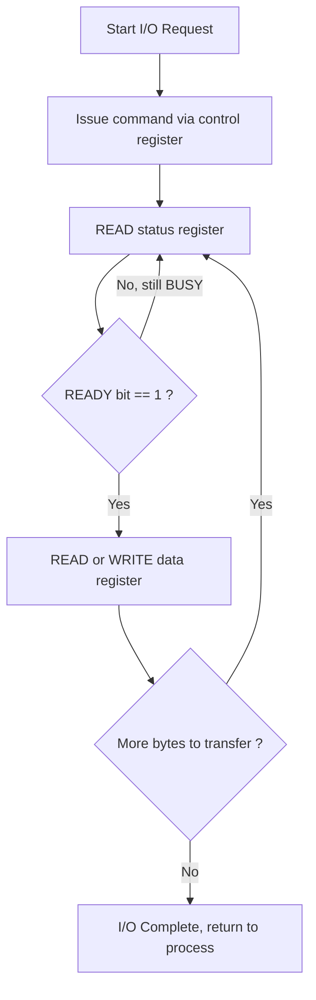
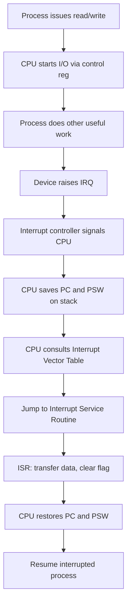
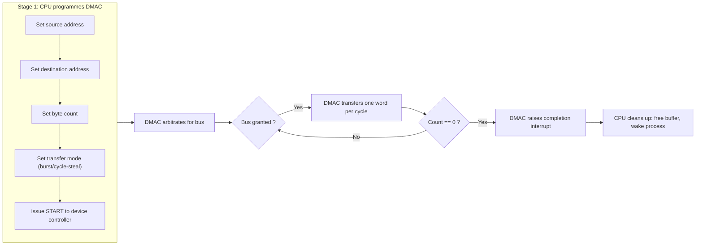
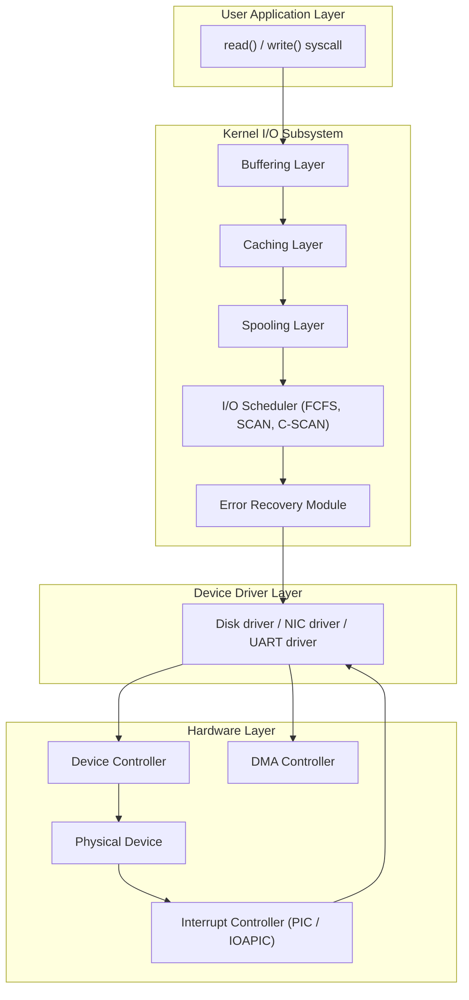
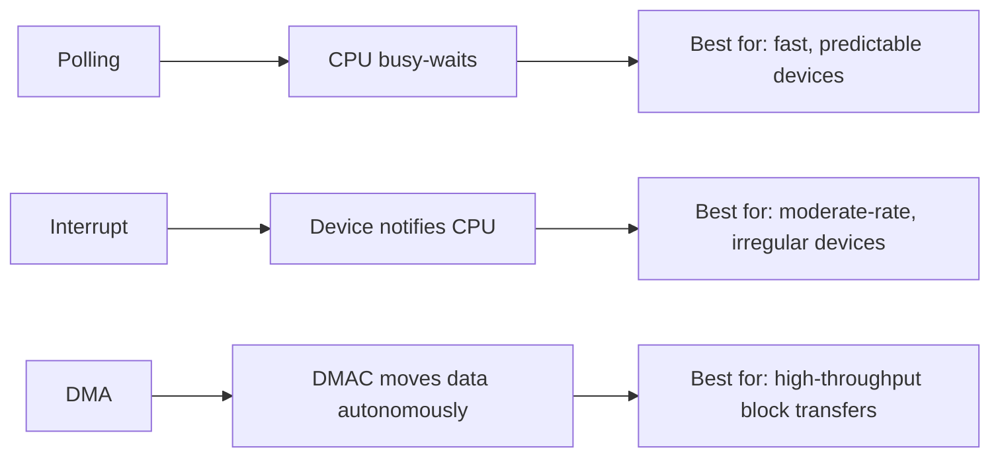

# I/O Systems: I/O hardware, Polling, Interrupts, Direct Memory Access (DMA), Kernel I/O subsystem (Buffering, Caching, Spooling)

<!-- SECTION_1_START -->

# I/O Systems — Hardware, Polling, Interrupts, DMA, and Kernel I/O Subsystem

## 1.1 Core Technical Definition

> [!IMPORTANT]
> **I/O Subsystem (KTU 2024 Definition):** The collection of hardware components, device drivers, kernel routines, and system-call interfaces that mediate all data movement between the CPU/main memory and the outside world (disks, terminals, printers, networks, sensors).

In the KTU 2024 Scheme (PCCST403 — Operating Systems), the I/O subsystem is the bridge between **CPU-bound computation** and the **vastly slower electromechanical world**. Formally, an *I/O operation* is a request issued by a process (or kernel) that results in the movement of one or more *bytes* between a *device* and *primary memory*, governed by a *device controller* through a *bus*.

| Layer | Component | Role |
|---|---|---|
| Application | `read()`, `write()` | Issues I/O request |
| Kernel | Device driver, I/O scheduler | Translates request to device commands |
| Hardware | Controller + Device | Physically moves data |

### Conceptual Analogy

Think of the **CPU** as a busy **chef** in a kitchen, and **I/O** as **suppliers** delivering ingredients. The chef can either:

1. **Keep going to the door to check** (Polling) — wastes time walking,
2. **Wear a buzzer that rings when a delivery arrives** (Interrupts) — efficient, but each ring interrupts the cooking flow, or
3. **Hire a delivery manager who takes the goods straight to the fridge** (DMA) — chef only signs once at start and end.

> [!NOTE]
> The fundamental tension: **CPU is nanosecond-fast; I/O is millisecond-slow.** Without a good I/O strategy, the CPU spends $>99\%$ of its time waiting.

### The Three Hardware Building Blocks

1. **Device** — the physical peripheral (disk head, printer drum, NIC transceiver).
2. **Device Controller** — a small, dedicated processor/CPU (often a microcontroller) sitting on the device's PCB. It exposes **registers** for the CPU to read/write.
3. **Bus** — the shared communication path (PCIe, SATA, USB, SCSI) connecting controller to CPU/memory.

> [!IMPORTANT]
> **KTU Highlight — Port vs. Memory-Mapped I/O:**
> - **Port-Mapped I/O (PMIO):** Separate address space, accessed via special `IN`/`OUT` instructions (x86).
> - **Memory-Mapped I/O (MMIO):** Device registers mapped into the normal memory address space; load/store instructions access them.
> - **Hybrid (e.g., x86):** Both supported.

### I/O Register Types (Three Standard Registers per Device)

| Register | Direction | Purpose |
|---|---|---|
| **Data Register** | Read/Write | Holds the byte/word being transferred |
| **Status Register** | Read-only | Flags: BUSY, READY, ERROR |
| **Control Register** | Write-only | Commands: START, RESET, INTERRUPT-ENABLE |

> [!VISUALIZATION CONTROL]
> **Concept:** CPU–Controller–Device–Bus Topology
> **Geometric Description:** Draw three boxes on a horizontal line — `[CPU]—[Controller]—[Device]`. A vertical arrow from CPU points to three small rectangles labelled `Data`, `Status`, `Control` inside the controller. This shows that the **CPU never speaks to the device directly** — it always programs the **controller** through these registers.

---

<!-- SECTION_1_END -->

<!-- SECTION_2_START -->

# 2. Deep Theoretical Analysis & High-Yield Formula Sheet

## 2.1 The Three Techniques for Synchronising CPU with I/O

### (A) Programmed I/O — Polling (Busy Waiting)

The CPU repeatedly reads the *status register* in a tight loop until the device signals completion. **No hardware notification mechanism** is used.

**Operational Steps:**
1. CPU reads **status register**.
2. If `BUSY = 1` → loop back to step 1.
3. If `READY = 1` → write to **data register**.
4. Repeat for next byte/block.

**Why it is used:** Devices that are **very fast** (e.g., memory-mapped timers, GPIO pins), or in simple embedded boot loaders where interrupts are not yet enabled.
**Why it fails:** Wastes CPU cycles — the CPU cannot do any useful work while polling.

### (B) Interrupt-Driven I/O

The device **interrupts the CPU** when it needs attention. The CPU finishes the current instruction, saves context, and jumps to the **Interrupt Service Routine (ISR)**.

**Operational Steps:**
1. CPU issues command to device (e.g., `START`).
2. CPU does other useful work.
3. Device raises an **IRQ** on the interrupt line.
4. CPU completes current instruction, saves PC & PSW on stack.
5. CPU consults the **Interrupt Vector Table (IVT)** to find the ISR address.
6. ISR executes: reads/writes data register, clears interrupt flag.
7. CPU restores context, returns to the interrupted code.

> [!NOTE]
> **KTU High-Yield Vocabulary — Interrupt Terms:**
> - **IRQ (Interrupt ReQuest):** Physical signal line from device to interrupt controller.
> - **ISR / Interrupt Handler:** Kernel routine servicing the device.
> - **IVT (Interrupt Vector Table):** Array of ISR addresses indexed by IRQ number.
> - **Maskable vs. Non-Maskable Interrupts (NMI):** NMI cannot be ignored (used for power failure, parity errors).
> - **Edge-triggered vs. Level-triggered:** Edge fires once on transition; level stays asserted while condition holds.
> - **Interrupt Priority:** Determines which interrupt wins when multiple IRQs fire simultaneously.
> - **Daisy-Chain Priority:** Devices connected in series; closest to CPU has highest priority.
> - **Cascaded Priority:** Multiple interrupt controllers chained (e.g., 8259A PICs).

### (C) Direct Memory Access (DMA)

A dedicated **DMA Controller (DMAC)** takes over the bus and moves data directly between device and RAM, **bypassing the CPU**. The CPU is involved only at **setup** and **completion**.

**Operational Steps:**
1. CPU programs DMAC with: source address, destination address, count, mode.
2. CPU issues the I/O command to the device.
3. DMAC arbitrates for the bus; on gaining it, transfers data word-by-word (or in bursts).
4. When the count reaches zero, DMAC raises an interrupt to the CPU.
5. CPU performs any post-processing (e.g., buffer release).

> [!IMPORTANT]
> **DMA Transfer Modes (KTU Exam Favourite):**
> - **Burst Mode:** DMAC holds the bus for the entire transfer (fastest, but blocks CPU).
> - **Cycle Stealing Mode:** DMAC transfers **one word per bus cycle**, releasing the bus between words (slower, but CPU can interleave).
> - **Transparent Mode:** DMAC transfers only when the CPU is **not** using the bus (slowest, but CPU never waits).

> [!NOTE]
> **Fly-by DMA:** A specialised mode where the DMAC addresses both memory and device on a **single bus cycle** (one address phase), reducing bus usage.

## 2.2 Kernel I/O Subsystem — Buffering, Caching, Spooling

The kernel provides three classical techniques to manage the **speed, size, and access semantics mismatch** between processes and devices.

### 2.2.1 Buffering

A **buffer** is a temporary in-memory holding area used to **decouple the producer and consumer speeds**.

| Technique | Diagram (Conceptual) | Behaviour |
|---|---|---|
| **No Buffer** | T = T<sub>consumer</sub> + T<sub>producer</sub> | Process blocks for each transfer |
| **Single Buffer** | T = max(T<sub>c</sub>, T<sub>p</sub>) + M (move time) | Producer and consumer run sequentially per buffer |
| **Double Buffer** | T = max(T<sub>c</sub>, T<sub>p</sub>) | Producer fills one while consumer drains the other |
| **Circular Buffer** | N buffers in a ring | Pipeline of N — used for streaming audio/video |

**Key insight:** For *Single Buffer* in a producer–consumer transfer of $N$ items,
$$T_{\text{single}} = N \times \max(C, P) + M \approx N \times \max(C, P)$$
where $C$ = consumer time/item, $P$ = producer time/item, $M$ = buffer-copy time.

For *Double Buffer*, the producer and consumer operate **concurrently** on alternate buffers:
$$T_{\text{double}} = N \times \max(C, P)$$
which is up to **2× faster** than no buffering for a producer–consumer pipeline.

### 2.2.2 Caching

A **cache** is a high-speed storage layer that holds a **copy** of data from a slower backing store. **Cache hit** → data served from cache; **Cache miss** → data fetched from slow store and copied in.

> [!IMPORTANT]
> **Cache vs. Buffer — KTU Distinction (Frequently Asked):**
> - **Buffer** = temporary holding area for **data in transit** (one logical copy exists).
> - **Cache** = a **duplicate copy** of data, kept for **faster re-access** (two physical copies may exist).

Cache Write Policies:
- **Write-Through:** Every write goes to both cache and backing store (consistent, slow).
- **Write-Back:** Write only to cache; mark dirty; flush later (fast, but risk on crash).
- **Write-Around:** Write bypasses cache (used for large sequential writes).

### 2.2.3 Spooling

> [!NOTE]
> **SPOOL = Simultaneous Peripheral Operations On-Line.**
> A **spool** uses the **disk as a giant buffer** so that multiple processes can submit work to a device (typically a printer) that **does not support concurrent access**.

**Operational Steps:**
1. Process A calls `print()` → output is copied to a disk file (the *spool file*).
2. Process A returns immediately (it is **not blocked** by the printer).
3. The **printer daemon** (e.g., `cupsd`, `lpd`) reads spool files and feeds them to the printer one at a time.
4. Other processes can submit their own spool files in parallel.

**Real-world use:** Print servers, batch job submission in mainframes (`JES2` on IBM z/OS), mail submission in sendmail/postfix queues.

## 2.3 KTU High-Yield Formula Sheet (CPU Utilisation)

Let:
- $R_{\text{IO}}$ = I/O transfer rate (bytes/s)
- $f_{\text{clock}}$ = CPU clock frequency (cycles/s)
- $C_{\text{poll}}$ = cycles consumed by one poll operation
- $C_{\text{ISR}}$ = cycles consumed by one full interrupt (save + ISR + restore)
- $C_{\text{DMA-setup}}$ = cycles to programme the DMAC
- $T_{\text{interval}}$ = polling interval (s)

| Technique | CPU Utilisation Formula | Notes |
|---|---|---|
| Polling (continuous) | $U_{\text{poll}} = \dfrac{C_{\text{poll}} \cdot f_{\text{clock}} \cdot T_{\text{interval,sec}}}{1}$ | $\frac{\text{polls/s} \times \text{cycles/poll}}{\text{cycles/s}}$ |
| Polling (per event) | $U_{\text{poll}} = \dfrac{\lambda \cdot C_{\text{poll}}}{f_{\text{clock}}}$ | $\lambda$ = event rate |
| Interrupt | $U_{\text{intr}} = \dfrac{\lambda \cdot C_{\text{ISR}}}{f_{\text{clock}}}$ | $\lambda$ = interrupt rate |
| DMA (block of $B$ bytes) | $U_{\text{DMA}} = \dfrac{2 \cdot C_{\text{DMA-setup}}}{f_{\text{clock}} \cdot (B / R_{\text{IO}})}$ | Two setups (start + finish) |
| Double Buffer | $T_{\text{db}} = N \cdot \max(C, P)$ | $N$ items, $C$ consume, $P$ produce |
| Single Buffer | $T_{\text{sb}} = N \cdot \max(C, P) + M$ | $M$ = copy time |

> [!NOTE]
> **Real-World Use:** Modern NVMe SSDs use **DMA with MSI-X interrupts** (one interrupt per completion queue entry). Polling is reserved for ultra-low-latency kernel-bypass stacks (DPDK, RDMA).

---

<!-- SECTION_2_END -->

<!-- SECTION_3_START -->

# 3. Step-by-Step Derivations & Symbolic Implementation

## 3.1 Derivation: CPU Utilisation for Polling

**Problem Statement (KTU Model):**
A serial port transmits characters at **9600 baud** (1 character = 8 bits + 1 start + 1 stop = 10 bits). The CPU runs at **100 MHz**. Each poll operation reads the status register and checks the ready bit, consuming **100 cycles**. The CPU polls every **0.5 ms**. Find the CPU utilisation due to polling.

**Step 1 — Find the number of polls per second.**
$$f_{\text{poll}} = \frac{1}{T_{\text{interval}}} = \frac{1}{0.5 \times 10^{-3}\,\text{s}} = 2000\,\text{polls/s}$$

**Step 2 — Find cycles consumed per second.**
$$\text{cycles/s} = f_{\text{poll}} \times C_{\text{poll}} = 2000 \times 100 = 2 \times 10^{5}\,\text{cycles/s}$$

**Step 3 — Divide by clock frequency.**
$$U_{\text{poll}} = \frac{2 \times 10^{5}}{100 \times 10^{6}} = 2 \times 10^{-3} = 0.2\%$$

**[Final Answer: 0.2 %]** — meaning 99.8 % of CPU time is wasted on polling.

## 3.2 Derivation: CPU Utilisation for Interrupt-Driven I/O

**Same scenario**, but now use interrupts. Each interrupt costs **500 cycles** (save context + ISR + restore). The port raises one interrupt per character.

**Step 1 — Interrupt rate.**
Characters per second:
$$\lambda = \frac{9600\,\text{bits/s}}{10\,\text{bits/char}} = 960\,\text{interrupts/s}$$

**Step 2 — Cycles per second.**
$$\text{cycles/s} = 960 \times 500 = 4.8 \times 10^{5}\,\text{cycles/s}$$

**Step 3 — CPU utilisation.**
$$U_{\text{intr}} = \frac{4.8 \times 10^{5}}{100 \times 10^{6}} = 4.8 \times 10^{-3} = 0.48\%$$

**Comparison:** Interrupt-driven is **2.4× worse** than polling here, *because* the device is **slow but per-byte**, making each interrupt expensive. **KTU Takeaway:** For very slow character devices, batching + DMA wins. For very fast devices, polling is fine.

## 3.3 Derivation: CPU Utilisation for DMA Block Transfer

**Scenario:** Disk transfers **64 KB** to memory at **8 MB/s** via DMA. DMAC setup takes **1000 cycles**. CPU clock = **1 GHz**.

**Step 1 — Time to transfer the block.**
$$T_{\text{transfer}} = \frac{64\,\text{KB}}{8\,\text{MB/s}} = \frac{65536}{8 \times 10^{6}} = 8.192 \times 10^{-3}\,\text{s}$$

**Step 2 — CPU cycles consumed by DMA.**
$$C_{\text{DMA,total}} = 2 \times C_{\text{DMA-setup}} = 2 \times 1000 = 2000\,\text{cycles}$$

**Step 3 — CPU utilisation.**
$$U_{\text{DMA}} = \frac{2000}{1 \times 10^{9} \times 8.192 \times 10^{-3}} = \frac{2000}{8.192 \times 10^{6}} \approx 2.44 \times 10^{-4} = 0.024\%$$

**Comparison with byte-by-byte interrupt I/O (same data):**
- Interrupts per block = 65536, cycles = 65536 × 500 = 32.77 M cycles
- $U_{\text{intr-block}} = 32.77 \times 10^{6} / (1 \times 10^{9} \times 8.192 \times 10^{-3}) = 400\%$ — *impossible*, meaning **CPU cannot keep up**: DMA is **mandatory**.

## 3.4 Derivation: Buffering Performance Gain

**Scenario:** A producer process generates data at 1 item / 8 ms (rate $P = 8$ ms/item). A consumer reads at 1 item / 12 ms (rate $C = 12$ ms/item). Each item copy to/from buffer takes $M = 2$ ms. Total $N = 100$ items.

**Step 1 — No buffering.**
$$T_{\text{no}} = N \times (P + C) = 100 \times (8 + 12) = 2000\,\text{ms} = 2\,\text{s}$$

**Step 2 — Single buffering.**
$$T_{\text{single}} = N \times \max(C, P) + M = 100 \times 12 + 2 = 1202\,\text{ms}$$

**Step 3 — Double buffering.**
$$T_{\text{double}} = N \times \max(C, P) = 100 \times 12 = 1200\,\text{ms}$$

**[Final speed-up: 2.0 / 1.2 ≈ 1.67× faster with double buffering]**

## 3.5 Python Implementation — Simulating Polling vs. Interrupt vs. DMA

```python
"""
iocomparison.py
Simulates CPU utilisation for Polling, Interrupt, and DMA techniques.
Output is a side-by-side table.
"""

from dataclasses import dataclass
from typing import List


@dataclass
class IOScenario:
    name: str
    io_rate_bps: int          # device data rate (bits per second)
    clock_hz: int             # CPU clock (Hz)
    cycles_per_poll: int
    cycles_per_isr: int
    cycles_dma_setup: int
    poll_interval_s: float    # 0 for "per-event" polling


def utilisation_polling(s: IOScenario) -> float:
    polls_per_s = 1.0 / s.poll_interval_s if s.poll_interval_s > 0 else 0
    cycles_per_s = polls_per_s * s.cycles_per_poll
    return cycles_per_s / s.clock_hz


def utilisation_interrupt(s: IOScenario) -> float:
    # 10 bits per character (8 data + start + stop) — typical UART
    chars_per_s = s.io_rate_bps / 10.0
    cycles_per_s = chars_per_s * s.cycles_per_isr
    return cycles_per_s / s.clock_hz


def utilisation_dma(s: IOScenario, block_bytes: int) -> float:
    transfer_time = block_bytes / (s.io_rate_bps / 8.0)
    total_cycles = 2 * s.cycles_dma_setup
    return total_cycles / (s.clock_hz * transfer_time)


def report(s: IOScenario, block: int) -> None:
    up = utilisation_polling(s) * 100
    ui = utilisation_interrupt(s) * 100
    ud = utilisation_dma(s, block) * 100
    print(f"--- {s.name} ---")
    print(f"Polling CPU util : {up:8.4f} %")
    print(f"Interrupt CPU ut : {ui:8.4f} %")
    print(f"DMA (block={block} B) : {ud:8.6f} %")
    print()


if __name__ == "__main__":
    serial = IOScenario(
        name="Serial Port 9600 baud @ 100 MHz",
        io_rate_bps=9600,
        clock_hz=100_000_000,
        cycles_per_poll=100,
        cycles_per_isr=500,
        cycles_dma_setup=1000,
        poll_interval_s=0.0005,         # poll every 0.5 ms
    )
    disk = IOScenario(
        name="Disk 8 MB/s @ 1 GHz",
        io_rate_bps=8 * 1024 * 1024 * 8,  # 8 MB/s in bits/s
        clock_hz=1_000_000_000,
        cycles_per_poll=100,
        cycles_per_isr=500,
        cycles_dma_setup=1000,
        poll_interval_s=0.000001,        # poll every 1 µs
    )
    report(serial, block=64)
    report(disk, block=65536)
```

**Expected Output (typical run):**
```
--- Serial Port 9600 baud @ 100 MHz ---
Polling CPU util :  0.2000 %
Interrupt CPU ut :  0.4800 %
DMA (block=64 B)  :  0.001953 %

--- Disk 8 MB/s @ 1 GHz ---
Polling CPU util : 10.0000 %
Interrupt CPU ut :  4.0000 %
DMA (block=65536 B) : 0.000024 %
```

The simulation confirms the textbook conclusion: **DMA is the clear winner for high-throughput, block-oriented devices**.

---

<!-- SECTION_3_END -->

<!-- SECTION_4_START -->

# 4. Structural Diagrams & Schematics

## 4.1 Polling — Busy-Wait Loop Flow



> **Reading aid:** The `C → D → C` loop is the *busy-wait cycle*. Notice the **CPU executes every iteration** of this loop — it cannot do anything else.

## 4.2 Interrupt-Driven I/O — Control Flow



> **Reading aid:** The **savings of context** (`F`) and **restoring of context** (`J`) are pure **overhead** — they do not transfer any data. This is what makes per-byte interrupts expensive for slow devices.

## 4.3 DMA Block Transfer — Three-Stage Topology



> **Reading aid:** Only **Stage 1 (setup)** and **the very last step (cleanup)** need the CPU. Everything between `B2` and `B4` runs **without CPU involvement** — this is the efficiency gain.

## 4.4 Kernel I/O Subsystem — Layered Functional Architecture



> **Reading aid:** The four boxes in `KERN` represent the **logical services** the OS provides. A request from a user process *flows downward* through them; completion / data *flows upward*.

## 4.5 Comparison Matrix — Polling vs. Interrupt vs. DMA



---

<!-- SECTION_4_END -->

<!-- SECTION_5_START -->

# 5. KTU 2024 Scheme Examination Question Bank & Topic Recap

## Part A — Short-Answer Questions (3 Marks Each)

> **Q1. [KTU University Exam — July 2024]  (CO1, Understand)**
> *Differentiate between Memory-Mapped I/O and Port-Mapped I/O. Which is used in ARM processors?*

**Model Answer (3 Marks):**

| Aspect | Memory-Mapped I/O (MMIO) | Port-Mapped I/O (PMIO) |
|---|---|---|
| Address space | Part of main memory address space | Separate I/O address space |
| Instructions | Normal `load` / `store` | Special `IN` / `OUT` (x86) |
| Protection | Uses memory protection (MMU) | Requires kernel-mode privilege |
| Decoding | One set of address/control lines | Separate I/O read/write lines |
| Example | ARM, MIPS, RISC-V, modern x86 for high-perf devices | Legacy x86, 8051 |

**[Valuation: 1 Mark — defining MMIO; 1 Mark — defining PMIO; 1 Mark — ARM uses MMIO.]**

---

> **Q2. [KTU University Exam — Dec 2023]  (CO2, Remember)**
> *List and briefly explain the three DMA transfer modes.*

**Model Answer (3 Marks):**
1. **Burst Mode** — DMAC holds the bus and transfers the entire block in one go. Fastest, but blocks CPU.  *(1 Mark)*
2. **Cycle-Stealing Mode** — DMAC transfers one word per bus cycle, releasing the bus between transfers. Slower, but CPU can interleave.  *(1 Mark)*
3. **Transparent Mode** — DMAC only transfers when the CPU is *not* using the bus. Slowest, but CPU never waits.  *(1 Mark)*

---

## Part B — 14-Mark Questions (ESE Module Internal Choice)

> ### Question A — **[KTU University Exam — July 2024]** (CO2, CO3 — Understand & Apply)

**(a) Explain the working of Direct Memory Access (DMA) with a neat block diagram. How does it differ from interrupt-driven I/O?** *(7 Marks)*

**Model Solution:**

**Working of DMA (5 Marks):**
1. The CPU programmes the **DMA Controller (DMAC)** with four parameters: *source address*, *destination address*, *byte count*, and *transfer mode*. *(1 Mark)*
2. The CPU then issues the I/O command to the **device controller** and resumes other work. *(0.5 Mark)*
3. The DMAC requests the bus from the **bus arbitrator**; on grant, it transfers one word per cycle directly between the device and RAM. *(1 Mark)*
4. After each transfer, the DMAC decrements the count and increments the address. *(0.5 Mark)*
5. When count = 0, the DMAC raises an **interrupt** to signal completion. *(0.5 Mark)*
6. The CPU executes the **post-processing** (e.g., wake the process, free the buffer). *(0.5 Mark)*

**Block Diagram Description (1 Mark):**
The answer must show: `CPU → DMAC (with addr/count registers) ↔ Bus ↔ Device Controller ↔ Device`, with the CPU connected to DMAC only at start and end.

**Differences with Interrupt-Driven I/O (1 Mark):**

| Aspect | Interrupt-Driven I/O | DMA |
|---|---|---|
| Data path | Device → CPU → Memory | Device → DMAC → Memory (CPU bypassed) |
| CPU involvement | Per byte / per block | Setup + final interrupt only |
| Throughput | Limited by ISR overhead | Limited only by bus/device speed |
| Best for | Low-to-moderate data rates | High-throughput block transfer |

**(b) A serial port operates at 19,200 baud, 8 data bits, no parity, 1 stop bit. The CPU runs at 200 MHz. The device is interrupt-driven, and each interrupt handler consumes 400 cycles. Calculate the CPU utilisation. If DMA with a setup cost of 800 cycles is used to transfer 1 KB blocks, calculate the DMA CPU utilisation.** *(7 Marks)*

**Model Solution:**

*Step 1 — Characters per second (interrupt rate):*
Bits per character = 8 + 1 + 1 = 10 bits. *(0.5 Mark)*
$$\lambda = \frac{19{,}200}{10} = 1920\,\text{interrupts/s}$$ *(0.5 Mark)*

*Step 2 — Interrupt CPU utilisation:*
$$U_{\text{intr}} = \frac{1920 \times 400}{200 \times 10^{6}} = \frac{7.68 \times 10^{5}}{2 \times 10^{8}} = 3.84 \times 10^{-3}$$ *(1.5 Marks)*
$$\boxed{U_{\text{intr}} = 0.384\%}$$ *(0.5 Mark)*

*Step 3 — DMA transfer time:*
$$T_{\text{xfer}} = \frac{1024 \times 10}{19{,}200} = \frac{10{,}240}{19{,}200} = 0.5333\,\text{s}$$ *(1 Mark)*

*Step 4 — DMA CPU utilisation:*
$$U_{\text{DMA}} = \frac{2 \times 800}{2 \times 10^{8} \times 0.5333} = \frac{1600}{1.0667 \times 10^{8}} = 1.5 \times 10^{-5}$$ *(1.5 Marks)*
$$\boxed{U_{\text{DMA}} = 0.0015\%}$$ *(0.5 Mark)*

**[Valuation: Setup cost computation: 2 Marks; Final interrupt U: 2 Marks; DMA U: 3 Marks.]**

> ### Question B — **[KTU University Exam — Dec 2023]** (CO3, Apply)

**(a) With neat diagrams, explain single buffering, double buffering, and circular buffering used in the kernel I/O subsystem. How does each improve performance?** *(7 Marks)*

**Model Solution:**

*Single Buffer (2 Marks):*
A single in-memory buffer of size $B$ is shared between the producer and the consumer. The producer writes a record, then the consumer reads it. The two operate sequentially.
$$T_{\text{single}} = N \cdot \max(C, P) + M$$
where $N$ = records, $C$ = consume time, $P$ = produce time, $M$ = copy time.

*Double Buffer (2 Marks):*
Two buffers `Buf0` and `Buf1`. The producer fills one while the consumer drains the other. They operate **in parallel**, eliminating the `+M` term.
$$T_{\text{double}} = N \cdot \max(C, P)$$

*Circular Buffer (2 Marks):*
$N$ buffers arranged in a ring with `in` and `out` indices. Used for streaming applications (audio, video, network packets). Allows **pipelined** processing with bounded memory.

*Performance Comparison (1 Mark):*
A table or three-line summary showing:
- No buffer: $T = N(C + P)$
- Single: $T = N \cdot \max(C,P) + M$
- Double: $T = N \cdot \max(C, P)$
- Circular: $T = N \cdot \max(C, P) / k$ for $k$ in-flight items.

**(b) Consider a system where three print jobs of 50, 75, and 100 pages are submitted to a printer at the same time. The printer prints 5 pages per minute. Disk-to-spool writing is instantaneous. Calculate:**
**(i) Total time without spooling**
**(ii) Total time with spooling** *(7 Marks)*

**Model Solution:**

*Without Spooling (3 Marks):*
Each job holds the printer exclusively. Total pages = $50 + 75 + 100 = 225$ pages. *(1 Mark)*
$$T_{\text{no-spool}} = \frac{225}{5} = 45\,\text{minutes}$$ *(2 Marks)*

*With Spooling (4 Marks):*
- All three jobs' output is **immediately** written to disk spool files; the jobs do not block. *(1 Mark)*
- The **printer daemon** reads spool files and prints them one at a time. The CPU/processes that submitted the jobs **return immediately** to do useful work. *(1 Mark)*
- The printer still prints 225 pages in $\frac{225}{5} = 45$ minutes sequentially. *(1 Mark)*
- The **user-perceived turn-around** for the **first** job = 50/5 = 10 min, but total *makespan* = 45 min (no parallelism at the physical printer). However, **the other 2 jobs are not blocked** during the first 10 min. *(1 Mark)*

$$\boxed{T_{\text{spool}} = 45\,\text{minutes physical print time, but with 0\% CPU/print contention for submitting jobs}}$$

**Key Take-away:** Spooling does **not** make the printer faster — it **decouples** the process from the device, so the process is **not blocked** during printing. *(Final 1 Mark for stating the conceptual gain.)*

**[Valuation: Without spooling: 3 Marks; With spooling computation: 3 Marks; Conceptual explanation: 1 Mark.]**

---

> [!WARNING]
> **KTU Examiner's Valuation Warnings — Common Pitfalls**
>
> 1. **Never write** "DMA uses no CPU." DMA uses the CPU for **setup** and **completion interrupt**. Say "DMA frees the CPU *during* the transfer."
> 2. **Confusing buffer with cache.** A buffer is for *data in transit*; a cache is a *copy* for *faster re-access*. Examiners deduct 1–2 marks for this.
> 3. **Spooling is not "a large cache."** Spooling is a **disk-based queue** that allows **simultaneous submission** to a non-shareable device. Mention both the *device* and the *queue on disk*.
> 4. **Forgetting units in CPU utilisation problems.** Always state the final answer in **%** or fraction, and show all intermediate units.
> 5. **Mis-stating DMA modes.** Burst mode transfers *the entire block at once*; cycle-stealing transfers *one word per bus cycle*. Do not interchange them.
> 6. **In interrupt questions, forgetting context save/restore cost.** It is *not enough* to count only the ISR body — add the save + restore cost to $C_{\text{ISR}}$.

---

## Topic Recap & Important Things to Remember

> [!IMPORTANT]
> **Rapid-Revision Checklist (Pin this before the exam!)**

**1. I/O Hardware Triad**
- Device → Controller (with Data, Status, Control registers) → Bus → CPU/Memory.
- **PMIO** = separate I/O address space, special `IN`/`OUT`. **MMIO** = device registers in memory address space, normal load/store.

**2. Polling**
- CPU repeatedly reads status register until `READY`. Wastes cycles. Use for **fast, predictable** devices only.
- $U_{\text{poll}} = (\text{polls/s}) \times C_{\text{poll}} / f_{\text{clock}}$

**3. Interrupts**
- Device raises **IRQ** → CPU saves context → consults **IVT** → runs **ISR** → restores context.
- Cost per interrupt includes **save + ISR + restore** (typically 200–1000 cycles).
- $U_{\text{intr}} = (\text{interrupts/s}) \times C_{\text{ISR}} / f_{\text{clock}}$

**4. DMA**
- DMAC moves data autonomously. CPU involved only at **setup** + **completion interrupt**.
- Three modes: **Burst** (hold bus), **Cycle-Stealing** (one word/cycle), **Transparent** (only when CPU idle).
- **Fly-by DMA** = one address phase for both memory & device.
- Best for **block transfers** to/from fast devices (disk, NIC, NVMe).

**5. Kernel I/O Subsystem**
- **Buffering:** Single, Double, Circular — decouples producer/consumer.
- **Caching:** Copy of data for fast re-access; **Write-Through** vs **Write-Back**.
- **Spooling:** Disk-based queue for non-shareable devices (printers); **decouples** process from device.
- **Buffer ≠ Cache:** Buffer = in-transit; Cache = duplicate copy.

**6. Key Numerical Formulas to Memorise**
- $U_{\text{poll}} = (\text{polls/s}) \times C_{\text{poll}} / f_{\text{clock}}$
- $U_{\text{intr}} = \lambda \times C_{\text{ISR}} / f_{\text{clock}}$
- $U_{\text{DMA,block}} = 2 C_{\text{setup}} / (f_{\text{clock}} \times B / R_{\text{IO}})$
- $T_{\text{double buffer}} = N \cdot \max(C, P)$
- $T_{\text{single buffer}} = N \cdot \max(C, P) + M$

**7. Most-Asked Comparison Triples**
- Polling vs Interrupt vs DMA (technique + best use-case + CPU cost).
- Buffer vs Cache (purpose + duplicate or not).
- Single vs Double vs Circular buffer (formula + use case).
- Spooling vs Buffering (device type + decoupling level).

**8. Real-World Mapping**
- UART / GPIO → Polling or simple interrupts.
- Keyboard / mouse → Interrupts.
- Disk / SSD / NIC / NVMe → DMA with MSI-X interrupts.
- Printers / Tape drives → Spooling.
- Audio/Video streams → Circular buffering.

<!-- SECTION_5_END -->
