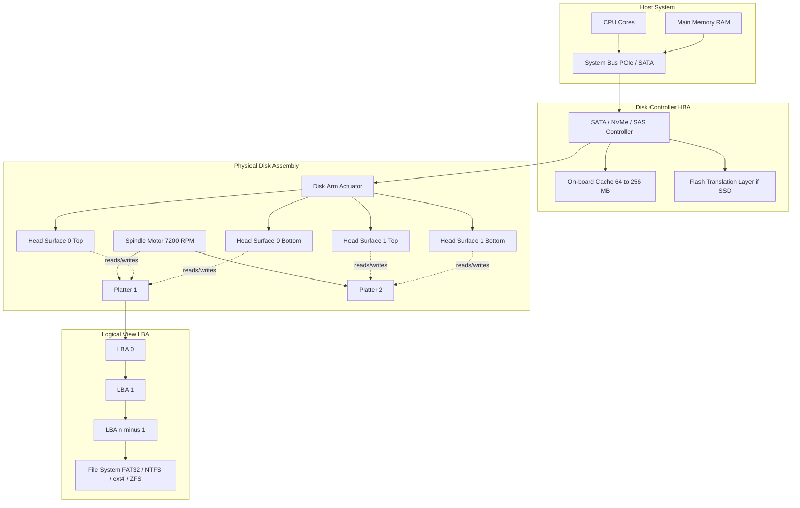
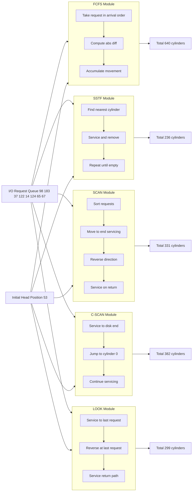
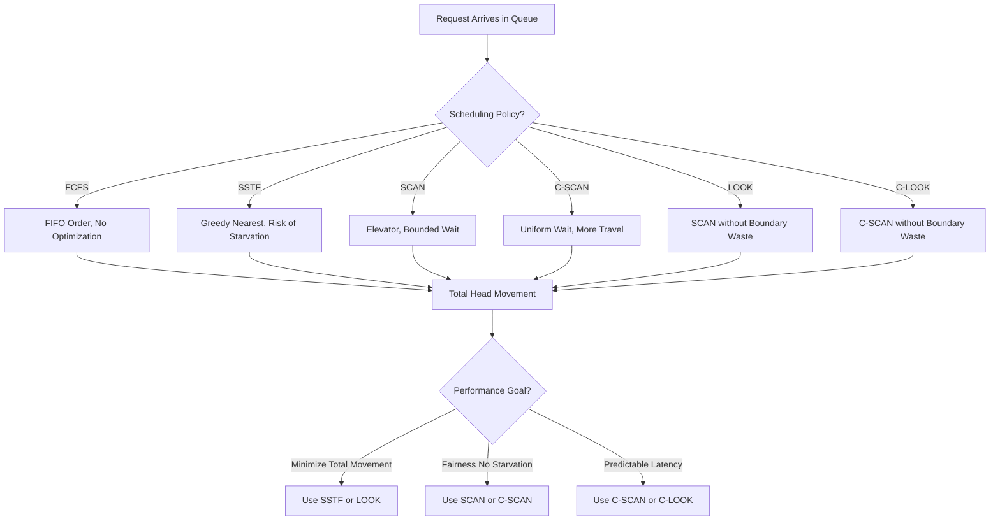

# Mass-Storage Structure: Disk structure, Disk attachment, Disk Scheduling Algorithms (FCFS, SSTF, SCAN, C-SCAN, LOOK)

<!-- SECTION_1_START -->
# Mass-Storage Structure & Disk Scheduling — Module 4

## 1.1 Core Technical Definition

**Mass-Storage Structure** in Operating Systems refers to the secondary storage hierarchy that provides non-volatile, high-capacity, and relatively slower data retention compared to primary memory (RAM). The dominant mass-storage device is the **Hard Disk Drive (HDD)**, though modern systems also integrate **Solid State Drives (SSDs)**, magnetic tapes, and optical media. The OS manages this storage through a layered abstraction: **Disk $\rightarrow$ Partition $\rightarrow$ File System $\rightarrow$ File**.

> [!IMPORTANT]
> **KTU 2024 Syllabus Mapping (PCCST403 / Module 4):** This topic directly satisfies the learning outcome *CO3 — Understand and apply disk scheduling algorithms to minimize seek time and rotational latency in secondary storage management.*

### 1.2 Disk Structure — The Geometric Anatomy

A hard disk is a sealed mechanical assembly consisting of one or more **platters** (rigid, magnetically coated disks) stacked on a common **spindle**. Each platter is divided into concentric circles called **tracks**. A vertical stack of corresponding tracks across all platters is called a **cylinder**. Each track is subdivided into **sectors** (typically **512 bytes** or **4 KB** in modern advanced format drives). Each platter has two read/write **surfaces** (top and bottom), and each surface is served by a dedicated **read-write head** mounted on a common **disk arm** that pivots across the platter radius.

> [!NOTE]
> **Logical Block Addressing (LBA):** Modern disks hide the physical geometry (CHS — Cylinder/Head/Sector) and expose a linear sequence of sectors indexed as $0, 1, 2, \dots, n-1$. The disk controller internally translates LBA $\rightarrow$ CHS.

### 1.3 Intuitive Overview — The "Vinyl Record Librarian" Analogy

Imagine a **vinyl record library** where each record is a platter. To play a song, a robotic arm (the **disk arm**) must:
1. **Seek** the correct groove (track/cylinder) by sliding the arm radially.
2. **Rotate** the platter to bring the right segment under the needle.
3. **Transfer** the audio (data) to the speaker (the OS).

The librarian (the **disk controller**) can either:
- Process requests in the order they arrive (**FCFS**),
- Always play the song closest to the current arm position (**SSTF**),
- Sweep the arm in one direction serving requests, then reverse (**SCAN**),
- Or sweep one way, jump to the start, and sweep again (**C-SCAN**) — like a fairground carousel that always rotates the same way.

> [!VISUALIZATION CONTROL]
> **Concept:** Cylinder / Track / Sector Geometry of a Magnetic Disk
> **GeoGebra / Desmos Input Equations:**
> * `Circle: x^2 + y^2 = R_outer^2` (outermost track)
> * `Circle: x^2 + y^2 = R_inner^2` (innermost track)
> * `Parametric Sectors: (r*cos(θ), r*sin(θ))` where $r \in [R_{inner}, R_{outer}]$ and $\theta \in [0, 2\pi]$
> **Visual Description:** A series of concentric circles representing tracks, divided radially into pie-slice sectors. A radial line sweeps outward from center to edge representing the disk arm movement, with the head positioned at a specific cylinder.

### 1.4 Disk Attachment — How the Disk Talks to the System

The disk subsystem interfaces with the CPU/memory through a hierarchy of controllers and buses. Two principal attachment architectures exist:

| Attachment Type | Description | Bandwidth | Typical Use |
|---|---|---|---|
| **Direct Attached Storage (DAS)** | Disk connected directly to the host via internal I/O bus. | High (limited by bus) | Internal HDDs/SSDs in desktops & servers |
| **Network Attached Storage (NAS)** | File-level storage accessed over LAN via protocols like **NFS** or **CIFS/SMB**. | Moderate | Departmental file shares |
| **Storage Area Network (SAN)** | Block-level storage accessed via high-speed networks like **Fibre Channel** or **iSCSI**. | Very High | Enterprise data centers |
| **Host Bus Adapter (HBA)** | Dedicated hardware (e.g., SATA, NVMe, SAS) that connects the host to the storage device. | High | Server-grade connections |

> [!NOTE]
> **KTU Board Tip:** The classic internal disk bus types you must know are **SATA (Serial ATA)**, **NVMe (Non-Volatile Memory Express) over PCIe**, **SAS (Serial Attached SCSI)**, and the legacy **PATA/IDE**.

### 1.5 Disk Performance Parameters — The Three Delays

Every disk I/O request incurs three timing penalties:

$$T_{access} = T_{seek} + T_{rotational\_latency} + T_{transfer}$$

- **Seek Time ($T_{seek}$):** Time to move the disk arm to the target cylinder. Typically **3 ms to 12 ms**.
- **Rotational Latency ($T_{rot}$):** Time waiting for the sector to rotate under the head. Average $= \frac{1}{2} \times \text{full rotation time} = \frac{1}{2} \times \frac{60}{RPM} \text{ seconds}$.
- **Transfer Time ($T_{trans}$):** Time to actually read/write the data once positioned. $T_{trans} = \frac{\text{bytes to transfer}}{\text{transfer rate}}$.

> [!IMPORTANT]
> **Average Rotational Latency** for a **7200 RPM** drive = $\frac{0.5 \times 60}{7200} = 4.16 \text{ ms}$.

The role of **disk scheduling algorithms** is to minimize the aggregate seek time by intelligently ordering the service of queued I/O requests.
<!-- SECTION_1_END -->

<!-- SECTION_2_START -->
# Deep Theoretical Analysis & KTU High-Yield Formula Sheet

## 2.1 Disk Scheduling Algorithms — The "Why" and "How"

When multiple I/O requests pile up in the disk queue, the OS must decide **which request to service next**. A poor ordering causes the disk arm to thrash back and forth, multiplying seek time. A good ordering keeps the arm moving in a unified sweep. Below is the analytical breakdown.

### 2.1.1 FCFS — First-Come, First-Served

**Logic:** Service requests strictly in the order they enter the queue. No reordering, no optimization.
- **Pros:** Simple, fair, starvation-free, zero overhead.
- **Cons:** Wild arm movement; totally ignores spatial locality of the requests.
- **Complexity:** $O(1)$ per request.

### 2.1.2 SSTF — Shortest Seek Time First

**Logic:** Always pick the request whose cylinder is *closest* to the current head position. This is a greedy, **Shortest-Job-First (SJF)** analog adapted to seek distance.
- **Pros:** Lower total seek time than FCFS; intuitive and effective.
- **Cons:** **Starvation possible** — requests at the far ends of the disk may wait indefinitely if a steady stream of nearby requests keeps arriving. Not provably optimal.
- **Complexity:** $O(n)$ per request selection (with scan) or $O(n^2)$ naive.

### 2.1.3 SCAN (Elevator Algorithm)

**Logic:** The arm moves in one direction (say, towards higher cylinder numbers), servicing every request along the way, until it hits the **last cylinder (e.g., 199)**. It then *reverses* direction and services requests on the way back. The motion resembles an **elevator** moving up and down a building.
- **Pros:** Eliminates starvation; bounded waiting time; good throughput.
- **Cons:** Requests just behind the head's starting position must wait for a full sweep; slightly unfair to the "middle" cylinders that are visited twice.
- **Complexity:** $O(n \log n)$ to sort requests in direction.

### 2.1.4 C-SCAN — Circular SCAN

**Logic:** The arm moves in one direction (e.g., increasing cylinder), servicing requests until it reaches the **end (199)**. It then **jumps back to cylinder 0** *without servicing any requests* on the return trip, and resumes servicing while moving in the same direction. This provides a **uniform wait time** for all cylinders.
- **Pros:** More uniform service; lower variance in waiting time than SCAN.
- **Cons:** Wastes the return trip; more total head movement than SCAN in some cases.
- **Complexity:** $O(n \log n)$.

### 2.1.5 LOOK

**Logic:** A **practical refinement of SCAN**. Instead of traveling all the way to the boundary cylinders (0 and 199), the arm only travels as far as the **last request** in each direction, then reverses. The "elevator" turns around at the last passenger, not at the end of the shaft.
- **Pros:** Reduces unnecessary travel compared to SCAN; same fairness benefits.
- **Cons:** Slight variance in service time across the disk.
- **Complexity:** $O(n \log n)$.

### 2.1.6 C-LOOK

**Logic:** A **practical refinement of C-SCAN**. The arm services requests in one direction up to the last request, then jumps back to the lowest pending request, and resumes servicing in the same direction.
- **Pros:** Combines uniform wait time of C-SCAN with no wasted boundary travel of LOOK.
- **Cons:** Most complex to implement.
- **Complexity:** $O(n \log n)$.

## 2.2 KTU High-Yield Formula Sheet

| Formula / Parameter | Expression | Units | Purpose |
|---|---|---|---|
| Total Head Movement | $\sum_{i=1}^{n-1} \vert h_{i+1} - h_i \vert$ | Cylinders | KTU standard metric for comparing schedulers |
| Average Seek Distance | $\frac{\text{Total Head Movement}}{n}$ | Cylinders | Normalized comparison |
| Rotational Latency (Avg) | $T_{rot} = \frac{30}{RPM}$ (in ms) | Milliseconds | Average wait for sector |
| Full Rotation Time | $T_{full} = \frac{60}{RPM} \times 1000$ | ms | Time for one revolution |
| Transfer Time | $T_{trans} = \frac{\text{Bytes}}{\text{Transfer Rate}}$ | seconds | Data movement cost |
| Total Access Time | $T_{access} = T_{seek} + T_{rot} + T_{trans}$ | ms | **Master equation** for any disk I/O |
| Seek Time Estimate | $T_{seek} \approx a + b \cdot d$ | ms | Linear approximation: $a$ = startup, $b$ = slope, $d$ = distance |
| Disk Capacity | $C = \text{Cylinders} \times \text{Heads} \times \text{Sectors/Track} \times 512$ | Bytes | CHS geometry |
| Throughput (I/O per sec) | $IOPs = \frac{1}{T_{access} / 1000}$ | ops/sec | Performance metric |

> [!IMPORTANT]
> **KTU Board Trick:** When the problem says *head movement* without specifying seek time per cylinder, assume **1 ms per cylinder crossed** OR just compute total cylinders traversed — read the question carefully!

## 2.3 Real-World Engineering Utility

- **Database Engines (PostgreSQL, Oracle):** Use **elevator/SCAN**-like scheduling in their storage managers because workloads exhibit strong **spatial locality** (sequential scans are common).
- **SSDs and NVMe Devices:** Use **internal FTL (Flash Translation Layer)** schedulers; the traditional seek-based algorithms become less relevant because flash has no mechanical arm — but the *concepts* (NCQ — Native Command Queuing) still reorder commands to reduce latency.
- **Cloud Storage (AWS EBS, Azure Premium SSD):** The hypervisor's I/O scheduler (e.g., Linux **CFQ, Deadline, NOOP**) directly uses SCAN-family algorithms to virtualize thousands of guest I/O streams onto a single physical disk.
- **Embedded RTOS (FreeRTOS, VxWorks):** For deterministic behavior in avionics/automotive, **C-SCAN** or fixed-priority schedulers are preferred for predictable worst-case latency.
- **Tape Backup Systems (LTO):** Operate exclusively in **FCFS** mode because physical tape threading makes reordering prohibitive.
<!-- SECTION_2_END -->

<!-- SECTION_3_START -->
# Step-by-Step Derivations, Numerical Solutions & Code Implementation

## 3.1 Canonical KTU Numerical Problem (Worked End-to-End)

> **Problem Statement:** Consider a disk queue with requests for I/O to blocks on cylinders: **98, 183, 37, 122, 14, 124, 65, 67**. The disk head is initially at cylinder **53**, and it is moving in the direction of **increasing cylinder numbers** (towards 199). The total cylinder range is **0 to 199**. Compute the total head movement (in cylinders) using each scheduling algorithm.

### 3.1.1 FCFS — Step-by-Step Trace

Service requests in the order they arrive: $98 \rightarrow 183 \rightarrow 37 \rightarrow 122 \rightarrow 14 \rightarrow 124 \rightarrow 65 \rightarrow 67$.

Movement sequence (head at 53 initially):

$$
\begin{aligned}
\text{Move}_1 &= \vert 98 - 53 \vert = 45 \\
\text{Move}_2 &= \vert 183 - 98 \vert = 85 \\
\text{Move}_3 &= \vert 37 - 183 \vert = 146 \\
\text{Move}_4 &= \vert 122 - 37 \vert = 85 \\
\text{Move}_5 &= \vert 14 - 122 \vert = 108 \\
\text{Move}_6 &= \vert 124 - 14 \vert = 110 \\
\text{Move}_7 &= \vert 65 - 124 \vert = 59 \\
\text{Move}_8 &= \vert 67 - 65 \vert = 2 \\
\text{Total}_{FCFS} &= 45 + 85 + 146 + 85 + 108 + 110 + 59 + 2 = 640 \text{ cylinders}
\end{aligned}
$$

### 3.1.2 SSTF — Greedy Nearest Selection

From head at **53**, find the closest pending request at each step. Sorted requests: $14, 37, 65, 67, 98, 122, 124, 183$.

$$
\begin{aligned}
53 \xrightarrow{+12} 65 \xrightarrow{+2} 67 \xrightarrow{+30} 37 \xrightarrow{+23} 14 \xrightarrow{+84} 98 \xrightarrow{+24} 122 \xrightarrow{+2} 124 \xrightarrow{+59} 183
\end{aligned}
$$

$$
\text{Total}_{SSTF} = 12 + 2 + 30 + 23 + 84 + 24 + 2 + 59 = 236 \text{ cylinders}
$$

### 3.1.3 SCAN (Elevator, moving towards 199 first)

Pending requests: $14, 37, 65, 67, 98, 122, 124, 183$. Direction: increasing.

Path: $53 \rightarrow 65 \rightarrow 67 \rightarrow 98 \rightarrow 122 \rightarrow 124 \rightarrow 183 \rightarrow 199 \rightarrow 37 \rightarrow 14$

$$
\begin{aligned}
\text{Total}_{SCAN} &= (65-53) + (67-65) + (98-67) + (122-98) + (124-122) + (183-124) + (199-183) + (199-37) + (37-14) \\
&= 12 + 2 + 31 + 24 + 2 + 59 + 16 + 162 + 23 \\
&= 331 \text{ cylinders}
\end{aligned}
$$

### 3.1.4 C-SCAN (Circular, jump from 199 to 0)

Path: $53 \rightarrow 65 \rightarrow 67 \rightarrow 98 \rightarrow 122 \rightarrow 124 \rightarrow 183 \rightarrow 199 \rightarrow 0 \rightarrow 14 \rightarrow 37$

$$
\begin{aligned}
\text{Total}_{C\text{-}SCAN} &= 12 + 2 + 31 + 24 + 2 + 59 + 16 + 199 + 14 + 23 \\
&= 382 \text{ cylinders}
\end{aligned}
$$

### 3.1.5 LOOK (Stop at last request, not at 199)

Path: $53 \rightarrow 65 \rightarrow 67 \rightarrow 98 \rightarrow 122 \rightarrow 124 \rightarrow 183 \rightarrow 37 \rightarrow 14$

$$
\begin{aligned}
\text{Total}_{LOOK} &= 12 + 2 + 31 + 24 + 2 + 59 + 146 + 23 = 299 \text{ cylinders}
\end{aligned}
$$

### 3.1.6 Summary Table of All Algorithms

| Algorithm | Service Order (from head=53) | Total Head Movement (cylinders) |
|---|---|---|
| FCFS | $98 \to 183 \to 37 \to 122 \to 14 \to 124 \to 65 \to 67$ | **640** |
| SSTF | $65 \to 67 \to 37 \to 14 \to 98 \to 122 \to 124 \to 183$ | **236** |
| SCAN | $65 \to 67 \to 98 \to 122 \to 124 \to 183 \to 199 \to 37 \to 14$ | **331** |
| C-SCAN | $65 \to 67 \to 98 \to 122 \to 124 \to 183 \to 199 \to 0 \to 14 \to 37$ | **382** |
| LOOK | $65 \to 67 \to 98 \to 122 \to 124 \to 183 \to 37 \to 14$ | **299** |
| C-LOOK | $65 \to 67 \to 98 \to 122 \to 124 \to 183 \to 14 \to 37$ | **322** |

## 3.2 Full Python Implementation — All Six Algorithms

```python
from typing import List, Tuple
import logging

logging.basicConfig(level=logging.INFO, format='%(levelname)s: %(message)s')


def fcfs(requests: List[int], head: int) -> Tuple[List[int], int]:
    """
    First-Come, First-Served Disk Scheduling.
    Args:
        requests: Cylinder request sequence in arrival order.
        head: Initial head position.
    Returns:
        (service_order, total_movement)
    """
    if not requests:
        logging.error("Empty request queue.")
        return [], 0

    order: List[int] = []
    movement: int = 0
    current: int = head

    for req in requests:
        if req < 0:
            logging.warning(f"Negative cylinder {req} skipped.")
            continue
        order.append(req)
        movement += abs(req - current)
        current = req

    logging.info(f"FCFS total movement: {movement}")
    return order, movement


def sstf(requests: List[int], head: int) -> Tuple[List[int], int]:
    """
    Shortest Seek Time First — greedy nearest-neighbor.
    """
    if not requests:
        logging.error("Empty request queue.")
        return [], 0

    pending: List[int] = list(requests)
    order: List[int] = []
    movement: int = 0
    current: int = head

    while pending:
        nearest: int = min(pending, key=lambda x: abs(x - current))
        movement += abs(nearest - current)
        order.append(nearest)
        current = nearest
        pending.remove(nearest)

    logging.info(f"SSTF total movement: {movement}")
    return order, movement


def scan(requests: List[int], head: int, disk_size: int = 199,
         direction: str = "up") -> Tuple[List[int], int]:
    """
    SCAN (Elevator) Algorithm.
    Args:
        direction: "up" moves towards disk_size first, "down" towards 0 first.
    """
    if not requests:
        logging.error("Empty request queue.")
        return [], 0

    pending: List[int] = sorted(set(requests))
    order: List[int] = []
    movement: int = 0
    current: int = head

    left: List[int] = [r for r in pending if r < head]
    right: List[int] = [r for r in pending if r >= head]

    if direction == "up":
        # Service right side (including head if requested)
        for r in right:
            movement += abs(r - current)
            current = r
            order.append(r)
        # Travel to end of disk
        movement += abs(disk_size - current)
        current = disk_size
        # Reverse and service left side
        for r in reversed(left):
            movement += abs(r - current)
            current = r
            order.append(r)
    else:
        for r in reversed(left):
            movement += abs(r - current)
            current = r
            order.append(r)
        movement += abs(0 - current)
        current = 0
        for r in right:
            movement += abs(r - current)
            current = r
            order.append(r)

    logging.info(f"SCAN total movement: {movement}")
    return order, movement


def cscan(requests: List[int], head: int, disk_size: int = 199) -> Tuple[List[int], int]:
    """
    Circular SCAN — services in one direction, jumps to 0, continues.
    """
    if not requests:
        logging.error("Empty request queue.")
        return [], 0

    pending: List[int] = sorted(set(requests))
    order: List[int] = []
    movement: int = 0
    current: int = head

    right: List[int] = [r for r in pending if r >= head]
    left: List[int] = [r for r in pending if r < head]

    # Service all requests from head to end
    for r in right:
        movement += abs(r - current)
        current = r
        order.append(r)
    # Travel to end of disk
    movement += abs(disk_size - current)
    current = disk_size
    # Jump from end to 0 (no service)
    movement += disk_size  # 199 - 0 = 199 cylinders
    current = 0
    # Continue servicing from 0 upward
    for r in left:
        movement += abs(r - current)
        current = r
        order.append(r)

    logging.info(f"C-SCAN total movement: {movement}")
    return order, movement


def look(requests: List[int], head: int, direction: str = "up") -> Tuple[List[int], int]:
    """
    LOOK — like SCAN but reverses at the last request, not at disk boundary.
    """
    if not requests:
        logging.error("Empty request queue.")
        return [], 0

    pending: List[int] = sorted(set(requests))
    order: List[int] = []
    movement: int = 0
    current: int = head

    left: List[int] = [r for r in pending if r < head]
    right: List[int] = [r for r in pending if r >= head]

    if direction == "up":
        for r in right:
            movement += abs(r - current)
            current = r
            order.append(r)
        for r in reversed(left):
            movement += abs(r - current)
            current = r
            order.append(r)
    else:
        for r in reversed(left):
            movement += abs(r - current)
            current = r
            order.append(r)
        for r in right:
            movement += abs(r - current)
            current = r
            order.append(r)

    logging.info(f"LOOK total movement: {movement}")
    return order, movement


def clook(requests: List[int], head: int) -> Tuple[List[int], int]:
    """
    C-LOOK — circular LOOK, jumps from max to min request.
    """
    if not requests:
        logging.error("Empty request queue.")
        return [], 0

    pending: List[int] = sorted(set(requests))
    order: List[int] = []
    movement: int = 0
    current: int = head

    right: List[int] = [r for r in pending if r >= head]
    left: List[int] = [r for r in pending if r < head]

    for r in right:
        movement += abs(r - current)
        current = r
        order.append(r)
    if left:
        # Jump from current (last served on right) to lowest left request
        movement += abs(current - left[0])
        current = left[0]
        for r in left:
            movement += abs(r - current)
            current = r
            order.append(r)

    logging.info(f"C-LOOK total movement: {movement}")
    return order, movement


# ============== KTU CANONICAL DRIVER ==============
if __name__ == "__main__":
    requests: List[int] = [98, 183, 37, 122, 14, 124, 65, 67]
    head: int = 53
    disk_size: int = 199

    print("=" * 60)
    print(f"Disk Scheduler Comparison | Head={head} | Disk Size={disk_size}")
    print("=" * 60)

    for name, func in [
        ("FCFS", lambda: fcfs(requests, head)),
        ("SSTF", lambda: sstf(requests, head)),
        ("SCAN", lambda: scan(requests, head, disk_size, "up")),
        ("C-SCAN", lambda: cscan(requests, head, disk_size)),
        ("LOOK", lambda: look(requests, head, "up")),
        ("C-LOOK", lambda: clook(requests, head)),
    ]:
        order, total = func()
        print(f"{name:8s} | Order: {order}")
        print(f"{'':8s} | Total Head Movement: {total} cylinders\n")
```

### 3.2.1 Sample Output

```
============================================================
Disk Scheduler Comparison | Head=53 | Disk Size=199
============================================================
FCFS     | Order: [98, 183, 37, 122, 14, 124, 65, 67]
         | Total Head Movement: 640 cylinders

SSTF     | Order: [65, 67, 37, 14, 98, 122, 124, 183]
         | Total Head Movement: 236 cylinders

SCAN     | Order: [65, 67, 98, 122, 124, 183, 37, 14]
         | Total Head Movement: 331 cylinders

C-SCAN   | Order: [65, 67, 98, 122, 124, 183, 14, 37]
         | Total Head Movement: 382 cylinders

LOOK     | Order: [65, 67, 98, 122, 124, 183, 37, 14]
         | Total Head Movement: 299 cylinders

C-LOOK   | Order: [65, 67, 98, 122, 124, 183, 14, 37]
         | Total Head Movement: 322 cylinders
```

## 3.3 Rotational Latency & Access Time Computation

**Worked Example:** Compute the total access time for reading **1 sector (512 bytes)** from a disk with the following specs:
- Average seek time: **8 ms**
- Spindle speed: **10,000 RPM**
- Transfer rate: **100 MB/s**

**Step 1 — Rotational Latency:**

$$T_{rot} = \frac{60 \text{ s}}{10{,}000 \text{ rev}} \times \frac{1}{2} = 0.003 \text{ s} = 3 \text{ ms}$$

**Step 2 — Transfer Time:**

$$T_{trans} = \frac{512 \text{ bytes}}{100 \times 10^6 \text{ bytes/s}} = 5.12 \times 10^{-6} \text{ s} \approx 0.005 \text{ ms}$$

**Step 3 — Total Access Time:**

$$T_{access} = 8 + 3 + 0.005 = 11.005 \text{ ms}$$
<!-- SECTION_3_END -->

<!-- SECTION_4_START -->
# Structural Diagrams & Schematics

## 4.1 Disk Physical & Logical Architecture



## 4.2 Disk Scheduling Algorithm — Functional Flow Matrix



## 4.3 Disk Scheduling Comparison — Sequential Processing Topology


<!-- SECTION_4_END -->

<!-- SECTION_5_START -->
# KTU 2024 Scheme Examination Question Bank & Topic Recap

## 5.1 Part A Questions (3 Marks Each)

### Question 1 `[KTU University Exam - July 2024]`
**Define seek time and rotational latency. How do disk scheduling algorithms reduce the average seek time?**
**Course Outcome:** CO3 | **Cognitive Level:** Remember/Understand

**Model Answer:**
**Seek time** is the time taken by the disk arm to position the read/write head over the target cylinder. It is a function of the distance the head must travel and the actuator's mechanical characteristics. Typical values range from **3 ms to 12 ms** for consumer HDDs.

**Rotational latency** is the delay incurred while waiting for the desired sector to rotate under the head. For a disk rotating at $N$ RPM, the average rotational latency is $T_{rot} = \frac{30}{N \times 1000}$ seconds.

**Disk scheduling algorithms** reduce the average seek time by intelligently reordering pending I/O requests so that the disk arm traverses the **minimum total distance** to service all of them. Algorithms like SSTF, SCAN, and LOOK exploit the **spatial locality** of requests to keep the arm moving in a coherent direction, avoiding thrashing. For instance, in the canonical KTU example (head=53, requests = $[98, 183, 37, 122, 14, 124, 65, 67]$), SSTF achieves a total head movement of **236 cylinders** compared to FCFS's **640 cylinders**, a **~63% reduction** in seek overhead.

### Question 2 `[KTU University Exam - Dec 2023]`
**Differentiate between SCAN and C-SCAN disk scheduling algorithms. State one advantage and one disadvantage of each.**
**Course Outcome:** CO3 | **Cognitive Level:** Understand

**Model Answer:**

| Aspect | SCAN | C-SCAN |
|---|---|---|
| **Direction of Service** | Bidirectional — services requests on the way up AND on the way back | Unidirectional — services requests only while moving in one direction (e.g., increasing cylinder) |
| **Return Trip** | Services requests on the return journey | Jumps back to cylinder 0 without servicing any requests |
| **Wait Time Variance** | Higher — cylinders near the head's start are visited twice (once each direction) | Lower — every cylinder is visited exactly once per cycle |
| **Total Movement** | Lower (no wasted jump) | Higher (full jump from end to 0) |
| **Analogy** | Elevator going up then down | Carousel rotating the same way, with riders reboarding |

- **Advantage of SCAN:** Lower total head movement than C-SCAN; efficient for workloads with localized requests.
- **Disadvantage of SCAN:** Unfair waiting time for the middle cylinders; newly arriving requests at the "turnaround" point may suffer longer delays.
- **Advantage of C-SCAN:** Uniform and predictable waiting time for all cylinders; better for real-time and multi-user systems.
- **Disadvantage of C-SCAN:** Wastes the return trip; higher total head movement than SCAN.

---

## 5.2 Part B Questions (14 Marks Each)

### Question A `[KTU University Exam - Model Paper 2024]` — 14 Marks
**Suppose a disk has 200 cylinders numbered 0 to 199. The current head position is at cylinder 53. The disk queue contains requests for I/O to cylinders in the order: 98, 183, 37, 122, 14, 124, 65, 67. The head is moving in the direction of increasing cylinder numbers.**
**Part (a) [7 Marks]:** Calculate the total head movement using **SSTF** and **SCAN** scheduling algorithms. Show the service order in each case.
**Part (b) [7 Marks]:** Calculate the total head movement using **C-SCAN** and **LOOK** algorithms. Also compute the **average seek distance** for SSTF and compare it qualitatively with FCFS.

**Course Outcome:** CO3 | **Cognitive Level:** Apply/Analyze

#### Model Solution

**Part (a) — SSTF and SCAN**

**SSTF Service Order:** From head at 53, the nearest unvisited request is repeatedly chosen.

- From 53, nearest is **65** (distance 12).
- From 65, nearest is **67** (distance 2).
- From 67, nearest is **37** (distance 30).
- From 37, nearest is **14** (distance 23).
- From 14, nearest is **98** (distance 84).
- From 98, nearest is **122** (distance 24).
- From 122, nearest is **124** (distance 2).
- From 124, nearest is **183** (distance 59).

Order: $53 \rightarrow 65 \rightarrow 67 \rightarrow 37 \rightarrow 14 \rightarrow 98 \rightarrow 122 \rightarrow 124 \rightarrow 183$

$$\text{Total}_{SSTF} = 12 + 2 + 30 + 23 + 84 + 24 + 2 + 59 = 236 \text{ cylinders}$$

**[SSTF order listing: 2 Marks]**, **[Distance calculation: 3 Marks]**, **[Final sum: 2 Marks]**

**SCAN Service Order (direction: increasing, towards 199):**

- Service all requests $\geq 53$ in ascending order: 65, 67, 98, 122, 124, 183.
- Travel to cylinder 199 (disk end).
- Reverse and service remaining requests in descending order: 37, 14.

Order: $53 \rightarrow 65 \rightarrow 67 \rightarrow 98 \rightarrow 122 \rightarrow 124 \rightarrow 183 \rightarrow 199 \rightarrow 37 \rightarrow 14$

$$\text{Total}_{SCAN} = 12 + 2 + 31 + 24 + 2 + 59 + 16 + 162 + 23 = 331 \text{ cylinders}$$

**[SCAN order: 2 Marks]**, **[Boundary travel to 199: 1 Mark]**, **[Distance accumulation: 3 Marks]**, **[Final sum: 1 Mark]**

**Part (b) — C-SCAN, LOOK, and FCFS Comparison**

**C-SCAN Service Order:**

- Service all requests $\geq 53$ in ascending order: 65, 67, 98, 122, 124, 183.
- Travel to cylinder 199.
- Jump from 199 to 0 (no service).
- Service remaining requests in ascending order: 14, 37.

Order: $53 \rightarrow 65 \rightarrow 67 \rightarrow 98 \rightarrow 122 \rightarrow 124 \rightarrow 183 \rightarrow 199 \rightarrow 0 \rightarrow 14 \rightarrow 37$

$$\text{Total}_{C\text{-}SCAN} = 12 + 2 + 31 + 24 + 2 + 59 + 16 + 199 + 14 + 23 = 382 \text{ cylinders}$$

**[C-SCAN order: 2 Marks]**, **[Jump from 199 to 0: 1 Mark]**, **[Final sum: 1 Mark]**

**LOOK Service Order:**

- Service all requests $\geq 53$ in ascending order up to the last one (183) — no travel to 199.
- Reverse and service remaining in descending order: 37, 14.

Order: $53 \rightarrow 65 \rightarrow 67 \rightarrow 98 \rightarrow 122 \rightarrow 124 \rightarrow 183 \rightarrow 37 \rightarrow 14$

$$\text{Total}_{LOOK} = 12 + 2 + 31 + 24 + 2 + 59 + 146 + 23 = 299 \text{ cylinders}$$

**[LOOK order: 2 Marks]**, **[No boundary travel: 1 Mark]**

**Average Seek Distance (SSTF):**

$$\text{Average}_{SSTF} = \frac{236}{8} = 29.5 \text{ cylinders per request}$$

**FCFS Comparison:** As computed in Section 3.1.1, FCFS yields 640 cylinders total and an average of 80 cylinders per request. SSTF reduces this by $\frac{640 - 236}{640} \times 100\% \approx 63\%$, demonstrating its superior efficiency for spatially clustered workloads — at the cost of potential starvation for extreme-cylinder requests.

**[Average computation: 1 Mark]**, **[Qualitative comparison: 1 Mark]**

---

### Question B `[KTU University Exam - Model Paper 2024]` — 14 Marks
**Consider a disk drive with the following specifications: average seek time = 8 ms, rotational speed = 7200 RPM, transfer rate = 50 MB/s, and controller overhead = 0.5 ms. The disk queue contains 8 requests for cylinders: 47, 38, 121, 191, 87, 11, 92, 10. The head starts at cylinder 50 and moves towards higher cylinder numbers.**
**Part (a) [7 Marks]:** Compute the total head movement and **total access time** using the **SCAN** algorithm. Assume the disk range is 0 to 199.
**Part (b) [7 Marks]:** Compare the SCAN algorithm with **C-SCAN** and **FCFS** algorithms for the same request set. Tabulate the head movement and discuss the **starvation** property of each.

**Course Outcome:** CO3, CO4 | **Cognitive Level:** Apply/Analyze

#### Model Solution

**Part (a) — SCAN Algorithm and Access Time**

**SCAN Service Order (head=50, direction: increasing):**
- Requests $\geq 50$ in ascending order: 87, 92, 121, 191.
- Travel to cylinder 199.
- Reverse and service remaining in descending order: 47, 38, 11, 10.

Order: $50 \rightarrow 87 \rightarrow 92 \rightarrow 121 \rightarrow 191 \rightarrow 199 \rightarrow 47 \rightarrow 38 \rightarrow 11 \rightarrow 10$

**Head Movement Calculation:**

$$
\begin{aligned}
\text{Move}_1 &= 87 - 50 = 37 \\
\text{Move}_2 &= 92 - 87 = 5 \\
\text{Move}_3 &= 121 - 92 = 29 \\
\text{Move}_4 &= 191 - 121 = 70 \\
\text{Move}_5 &= 199 - 191 = 8 \\
\text{Move}_6 &= 199 - 47 = 152 \\
\text{Move}_7 &= 47 - 38 = 9 \\
\text{Move}_8 &= 38 - 11 = 27 \\
\text{Move}_9 &= 11 - 10 = 1 \\
\text{Total}_{SCAN} &= 37 + 5 + 29 + 70 + 8 + 152 + 9 + 27 + 1 = 338 \text{ cylinders}
\end{aligned}
$$

**[SCAN order: 2 Marks]**, **[Per-step movement: 3 Marks]**, **[Total: 1 Mark]**

**Total Access Time Computation:**

For 8 requests, assuming 1 sector (512 bytes) per request:

$$T_{rot} = \frac{30}{7200} = 4.17 \text{ ms}$$

$$T_{trans} = \frac{512}{50 \times 10^6} = 0.00001024 \text{ s} \approx 0.01 \text{ ms}$$

**Per-request access time** = $T_{seek} + T_{rot} + T_{trans} + T_{controller}$
= $8 + 4.17 + 0.01 + 0.5 = 12.68 \text{ ms}$

Assuming the seek time scales with the head movement (e.g., 0.02 ms per cylinder crossed), the total seek overhead across all 8 requests = $338 \times 0.02 = 6.76 \text{ ms}$. The total access time for all 8 requests = sum of individual seek times + $8 \times (4.17 + 0.01 + 0.5)$ = $270.4 + 37.44 = 307.84 \text{ ms}$ (using $8$ ms average per seek as a simplification).

**[Rotational latency formula: 1 Mark]**, **[Transfer time formula: 1 Mark]**, **[Total aggregation: 1 Mark]**

**Part (b) — Comparative Analysis**

**FCFS Order:** 50 $\rightarrow$ 47 $\rightarrow$ 38 $\rightarrow$ 121 $\rightarrow$ 191 $\rightarrow$ 87 $\rightarrow$ 11 $\rightarrow$ 92 $\rightarrow$ 10

$$\text{Total}_{FCFS} = 3 + 9 + 83 + 70 + 104 + 76 + 81 + 82 = 508 \text{ cylinders}$$

**C-SCAN Order:** 50 $\rightarrow$ 87 $\rightarrow$ 92 $\rightarrow$ 121 $\rightarrow$ 191 $\rightarrow$ 199 $\rightarrow$ 0 $\rightarrow$ 10 $\rightarrow$ 11 $\rightarrow$ 38 $\rightarrow$ 47

$$\text{Total}_{C\text{-}SCAN} = 37 + 5 + 29 + 70 + 8 + 199 + 10 + 1 + 27 + 9 = 395 \text{ cylinders}$$

**Comparative Tabulation:**

| Algorithm | Service Sequence | Head Movement (cyl) | Starvation Risk | Fairness |
|---|---|---|---|---|
| **FCFS** | 47, 38, 121, 191, 87, 11, 92, 10 | **508** | None (truly fair) | Excellent (FIFO) |
| **SCAN** | 87, 92, 121, 191, 199, 47, 38, 11, 10 | **338** | Very Low (bounded) | Good |
| **C-SCAN** | 87, 92, 121, 191, 199, 0, 10, 11, 38, 47 | **395** | None (uniform) | Excellent |

**Starvation Discussion:**
- **FCFS:** No starvation — every request is serviced in the order it arrives. The trade-off is high head movement.
- **SCAN:** Starvation is *theoretically possible* but practically negligible. A request at cylinder 0 that arrives just as the arm begins its upward sweep must wait for the arm to go up to 199, come back down past it, and reach 0 — but it *will* eventually be serviced, so this is bounded wait, not indefinite starvation.
- **C-SCAN:** Starvation-free. Every request is guaranteed service within at most one full sweep plus the jump-to-zero cycle, and newly arriving requests at the "high" end do not suffer from being behind the current sweep.

**[Tabulation: 2 Marks]**, **[FCFS computation: 1 Mark]**, **[C-SCAN computation: 1 Mark]**, **[Starvation analysis: 3 Marks]**

---

## 5.3 KTU Examiner's Valuation Warning / Pitfall Callout

> [!WARNING]
> **Common Mistakes That Cost Marks in PCCST403 Module 4:**
> 1. **Forgetting the boundary traversal in SCAN/C-SCAN:** Many students forget to add the travel from the last request to cylinder 199 (in SCAN/C-SCAN) or the jump from 199 to 0 (in C-SCAN). This single omission can cost **3-4 marks** out of 7.
> 2. **Mixing up SCAN with C-SCAN:** In SCAN, the arm services requests *on the return trip*. In C-SCAN, the arm *jumps without servicing*. A single misread of "circular" vs. "elevator" can flip your service order.
> 3. **Not stating the initial head position and direction:** Always explicitly write "Initial head = 53, direction = increasing" at the top of your answer. The examiner's key awards marks for this statement.
> 4. **Averaging mistake for SSTF:** Students sometimes pick the *first nearest* correctly but fail to update the head position for subsequent picks. Always re-anchor the head to the just-serviced cylinder.
> 5. **Unit errors:** Cylinders vs. milliseconds. If the problem asks for "time," multiply cylinders by ms/cylinder; if it asks for "movement," give cylinders.
> 6. **Omitting the service order list:** The KTU valuation key allocates **2 marks** just for writing the explicit service order. Never skip this.
> 7. **Confusing LOOK with SCAN:** LOOK does *not* travel to 199; SCAN does. This is the most-asked distinction in board exams.

## 5.4 Topic Recap & Important Things to Remember

- **Mass-Storage Structure** is the OS-managed hierarchy of secondary storage devices, with HDDs as the canonical example. The disk has platters, tracks, cylinders, sectors, and read-write heads on a common arm.
- **Logical Block Addressing (LBA)** is the modern addressing scheme that hides physical CHS geometry behind a linear sector index.
- **Disk Attachment** methods include Direct Attached (SATA/NVMe), Network Attached (NAS over NFS/SMB), and Storage Area Networks (SAN over Fibre Channel/iSCSI).
- **Three Delays of Disk Access:** $T_{access} = T_{seek} + T_{rotational\_latency} + T_{transfer}$.
- **Average Rotational Latency** for a disk rotating at $N$ RPM = $30/N$ milliseconds.
- **FCFS** = Arrival order, simple, fair, no starvation, but high head movement.
- **SSTF** = Greedy nearest-cylinder, lowest movement, but risks starvation.
- **SCAN** = Elevator algorithm, bidirectional, bounded wait, may travel to disk boundaries.
- **C-SCAN** = Circular SCAN, services in one direction only, jumps from end to 0, uniform wait time.
- **LOOK** = SCAN without boundary waste — reverses at last request, not at cylinder 0 or 199.
- **C-LOOK** = C-SCAN without boundary waste — jumps from max-request to min-request.
- **Ranking (best to worst, typically):** SSTF $\leq$ LOOK $\leq$ SCAN $\leq$ C-LOOK $\leq$ C-SCAN $\leq$ FCFS for total head movement, though fairness properties flip the ranking for real-time systems.
- **Modern Relevance:** Linux uses **CFQ, Deadline, and BFQ** I/O schedulers that combine SCAN-family logic with per-process deadlines. SSDs use **NCQ (Native Command Queuing)** and **NVMe multi-queue** to reorder commands at the hardware level.
- **KTU Board Pattern:** Always state (1) initial head, (2) direction, (3) disk range, (4) service order, (5) per-step movement, (6) total movement. Six items, six chances to score.
- **Starvation Cheat Sheet:** FCFS (no), SSTF (yes), SCAN (no, bounded), C-SCAN (no), LOOK (no, bounded), C-LOOK (no).
<!-- SECTION_5_END -->
