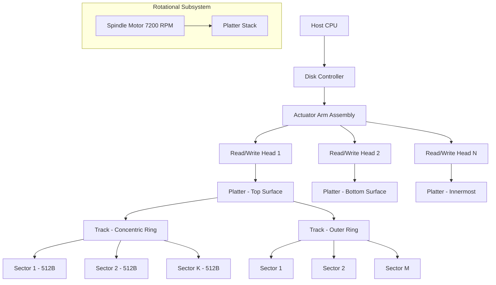
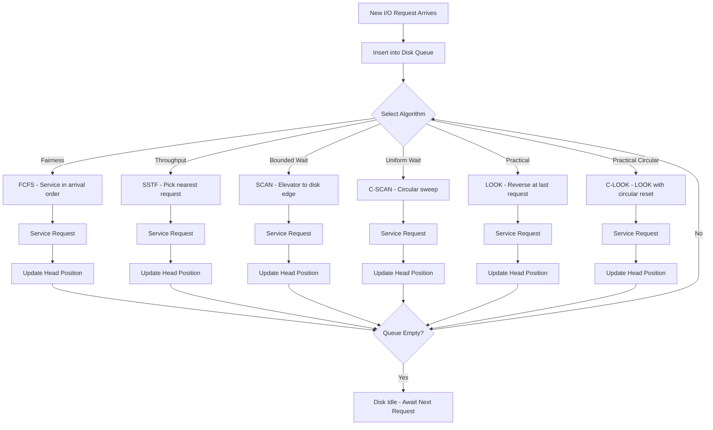
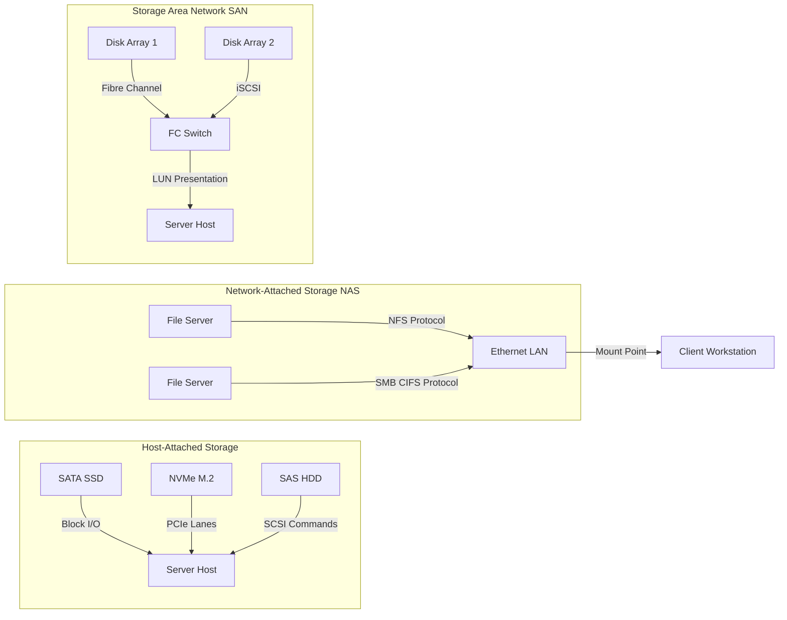
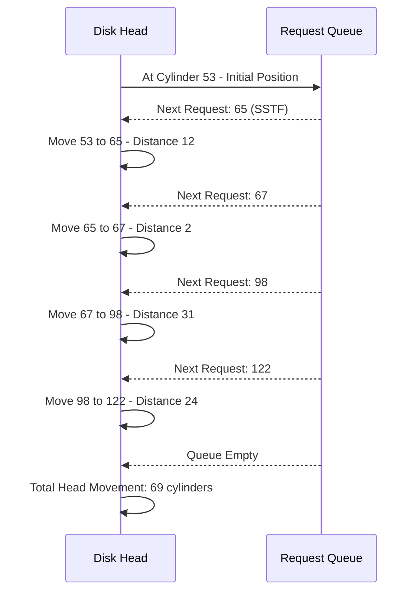

# Mass-Storage Structure: Disk structure, Disk attachment, Disk Scheduling Algorithms (FCFS, SSTF, SCAN, C-SCAN, LOOK)

<!-- SECTION_1_START -->
# Mass-Storage Structure & Disk Scheduling — Core Foundations

## 1.1 What is Mass-Storage Structure?

> [!IMPORTANT]
> **Formal Definition (KTU 2024 Syllabus):**
> The **Mass-Storage Structure** in an Operating System refers to the secondary (and tertiary) storage subsystem — primarily **magnetic disks, solid-state drives (SSDs), and optical media** — that provide **non-volatile, high-capacity** data storage. It encompasses the *physical geometry* of the device, the *attachment interface* to the CPU, and the *scheduling algorithms* that determine the order in which I/O requests are serviced.

In the KTU 2024 OBE framework (Course Outcome: **CO3** — *Understand the concepts of process management, memory management, and I/O management*), the mass-storage layer is treated as the **slowest but most capacious tier** of the storage hierarchy, sitting below main memory and above archival/backup media.

### 1.1.1 The Storage Hierarchy (Geometric Intuition)

Imagine your computer's memory as a **pyramid of speed and cost**:

| Tier | Device | Access Time | Capacity |
|---|---|---|---|
| L0 | CPU Registers | $\approx 1$ ns | Bytes |
| L1 | Cache (L1/L2/L3) | $\approx 2\text{--}10$ ns | KB–MB |
| L2 | Main Memory (RAM) | $\approx 100$ ns | GB |
| L3 | **Mass Storage (HDD/SSD)** | $\approx 10^{-3}\text{--}10^{-2}$ s | TB |
| L4 | Optical / Tape Backup | $\approx$ seconds | PB |

> [!NOTE]
> **Conceptual Analogy — The Vinyl Record Player:** A hard disk is mechanically almost identical to an old vinyl record. The **platter** is the record, the **read/write head** is the needle arm, the **sector** is a single groove-arc, and the **track** is one full concentric circle. Just as the needle arm takes time to swing from one song to another, the disk **arm (actuator)** takes time to move across the disk — this is the **seek time**, the single largest contributor to I/O latency.

## 1.2 Physical Disk Structure

A **magnetic hard disk drive (HDD)** consists of one or more circular **platters** coated with a magnetic film, stacked on a common spindle. Each platter is logically divided into:

- **Track** — A concentric ring on a platter surface.
- **Sector** — The smallest addressable unit (typically **512 bytes** historically, **4096 bytes** in *Advanced Format* drives).
- **Cylinder** — The set of all tracks vertically aligned at the same radial distance across all platters.
- **Spindle / Actuator** — The motor that spins the platters (commonly at **5400 RPM**, **7200 RPM**, or **10,000 RPM**) and moves the head assembly.

> [!NOTE]
> **Key Geometric Fact:** Modern disks use **Zone Bit Recording (ZBR)** — outer tracks hold *more sectors* than inner tracks because the outer circumference is longer. Therefore, the *sectors per track* is **not constant**; it is a function of the track radius.

## 1.3 Disk Attachment

> [!IMPORTANT]
> **Formal Definition:**
> **Disk Attachment** describes how the storage device is *physically and logically* connected to the host system. KTU 2024 categorizes attachment into three primary topologies:
>
> 1. **Host-Attached Storage** — Direct connection via I/O bus (SATA, NVMe, SCSI, IDE).
> 2. **Network-Attached Storage (NAS)** — File-level access over TCP/IP (e.g., NFS, SMB).
> 3. **Storage Area Network (SAN)** — Block-level access over a high-speed network (Fibre Channel, iSCSI).

### 1.3.1 Real-World Analogy — Bus, Post-Office, and Warehouse

| Attachment Type | Analogy | Access Granularity | Protocol Examples |
|---|---|---|---|
| Host-Attached | A drawer attached directly to your desk | Block (raw sectors) | SATA, NVMe, SCSI |
| NAS | A shared filing cabinet in the office, accessed by name | File | NFS, SMB/CIFS |
| SAN | A massive warehouse with private railway access | Block (LUNs) | Fibre Channel, iSCSI |

## 1.4 Why Disk Scheduling?

When multiple I/O requests pile up in the **disk queue**, the OS must decide *which request to service next*. The goal is to **minimize the total head movement (seek distance)**, which directly translates to **lower average response time** and **higher throughput**.

> [!VISUALIZATION CONTROL]
> **Concept:** Disk Cylinder Map and Request Queue Visualisation
> **GeoGebra / Desmos Input Equations:**
> * `circle((0,0), 5)` — outermost track
> * `circle((0,0), 3)` — middle track
> * `circle((0,0), 1)` — innermost track
> * Point `P = (4, 3)` — current head position
> * Points `Q1 = (-4, 2)`, `Q2 = (3, -4)`, `Q3 = (-2, -3)` — pending requests
> **Visual Description:** A nested set of concentric circles representing tracks. The head (red dot) must travel across the radial axis to reach each request. Notice that moving the head *radially* is far more expensive (seek time) than *rotational* movement (latency), which is why scheduling focuses on minimizing radial travel.

<!-- SECTION_1_END -->

<!-- SECTION_2_START -->
# Deep Theoretical Analysis & KTU High-Yield Formula Sheet

## 2.1 Anatomy of a Disk Drive — Operational View

The mechanical operation of servicing a request $R$ for block $b$ has three latency components:

$$
T_{\text{total}} = T_{\text{seek}} + T_{\text{rotational}} + T_{\text{transfer}}
$$

- **$T_{\text{seek}}$** — Time to move the actuator arm from the current cylinder to the target cylinder. Function of *radial distance*.
- **$T_{\text{rotational}}$** — Time for the platter to rotate so the target sector lies under the head. Function of *RPM*.
- **$T_{\text{transfer}}$** — Time to actually read/write the data bits as the sector passes under the head. Function of *linear density and rotational speed*.

> [!NOTE]
> **Syllabus Highlight (KTU 2024):** For Module 4, the dominant component is **$T_{\text{seek}}$**, so all disk scheduling algorithms are evaluated purely on **minimizing total head movement** measured in *number of cylinders traversed*.

## 2.2 Disk Scheduling Algorithms — The Five Pillars

### 2.2.1 FCFS — First-Come, First-Served

- **Logic:** Service requests in the exact order they arrive in the queue.
- **Pros:** Starvation-free, no reordering overhead, perfectly fair.
- **Cons:** Wild, non-optimal arm movement; ignores locality.

### 2.2.2 SSTF — Shortest Seek Time First

- **Logic:** Always pick the *nearest* pending request to the current head position (Shortest Job First in 1-D).
- **Pros:** Greedy minimization of *each individual* seek step.
- **Cons:** **Starvation possible** for far-away requests; not globally optimal.

### 2.2.3 SCAN — The "Elevator" Algorithm

- **Logic:** Head moves in one direction (say, towards increasing cylinders), servicing all requests en route, until it hits the **last cylinder**, then **reverses direction**.
- **Pros:** Bounded wait, no starvation, good throughput under heavy load.
- **Cons:** Unfairly favours the *most recently passed* end of the disk (the "sticky" problem).

### 2.2.4 C-SCAN — Circular SCAN

- **Logic:** Head moves in one direction servicing requests, then **jumps back to cylinder 0** (without servicing during return) and starts again. Provides a **uniform wait time**.
- **Pros:** Fairer than SCAN; treats the disk as a circular list.
- **Cons:** Wasted return traversal; ignores the possibility of an earlier turnaround.

### 2.2.5 LOOK & C-LOOK

- **Logic:** Like SCAN / C-SCAN, but the head **only goes as far as the last request in each direction** — it does not travel to the physical disk boundary.
- **Why it matters:** In real systems, the head is rarely required to reach the absolute end; LOOK/C-LOOK are the **practical default** in many OS kernels.

> [!IMPORTANT]
> **Algorithm Selection Cheat-Sheet:**
> - *Light load, fairness-critical?* → **FCFS**
> - *Moderate load, throughput priority?* → **SSTF**
> - *Heavy load, bounded latency?* → **SCAN / LOOK**
> - *Heavy load, uniform service time?* → **C-SCAN / C-LOOK**

## 2.3 KTU High-Yield Formula & Parameter Sheet

| Parameter / Formula | Symbol | Expression / Value | Unit |
|---|---|---|---|
| Total Head Movement | $D_{\text{total}}$ | $\sum_{i=1}^{n-1} \vert H_{i+1} - H_i \vert$ | Cylinders |
| Average Seek Distance | $\bar{D}$ | $D_{\text{total}} \,/\, (n - 1)$ | Cylinders / request |
| Rotational Latency | $T_{\text{rot}}$ | $\dfrac{60}{2 \cdot \text{RPM}} = \dfrac{1}{2 \cdot \text{RPS}}$ | seconds |
| Average Rotational Latency | $\bar{T}_{\text{rot}}$ | $\dfrac{30}{\text{RPM}}$ | seconds |
| Transfer Time | $T_{\text{trans}}$ | $\dfrac{\text{Bytes to transfer}}{\text{Transfer rate}}$ | seconds |
| SSTF Greedy Condition | — | $\min_{r \in Q} \vert H_{\text{curr}} - r \vert$ | Cylinders |
| SCAN Direction Reversal | — | At $\text{cyl}_{\max}$ (or last request for LOOK) | Cylinders |
| C-SCAN Reset | — | Jump from $\text{cyl}_{\max} \rightarrow 0$ (no service) | Cylinders |

> [!NOTE]
> **Real-World Utility:** Modern Linux kernel uses the **CFQ (Completely Fair Queuing)** and **BFQ (Budget Fair Queuing)** schedulers, which are essentially *multi-queue SCAN variants*. SSDs (which have **no seek time**) often use **noop** or simple **FCFS** since mechanical movement is absent — proving that scheduling theory is fundamentally about *physical cost optimization*.

<!-- SECTION_2_END -->

<!-- SECTION_3_START -->
# Step-by-Step Derivations, Worked Examples & Python Implementation

## 3.1 Canonical KTU Worked Example

**Problem Statement (Standard KTU 2-Mark Pattern):**

> Consider a disk queue with requests for I/O to blocks on cylinders:
> $$98, \; 183, \; 37, \; 122, \; 14, \; 124, \; 65, \; 67$$
> The head is initially at cylinder **53** and moves **towards the larger cylinder numbers** (i.e., outward / right). The disk has **200 cylinders total (numbered 0 – 199)**. Calculate the **total head movement** for each of: **(i) FCFS, (ii) SSTF, (iii) SCAN, (iv) C-SCAN, (v) LOOK**.

### 3.1.1 FCFS

> **Step-by-step trace** of head movement in the *original order* of arrival:
>
> $$\begin{aligned}
> \text{Order: } & 53 \rightarrow 98 \rightarrow 183 \rightarrow 37 \rightarrow 122 \rightarrow 14 \\
> & \rightarrow 124 \rightarrow 65 \rightarrow 67
> \end{aligned}$$
>
> $$\begin{aligned}
> D_{\text{FCFS}} &= |98-53| + |183-98| + |37-183| + |122-37| + |14-122| \\
> &\quad + |124-14| + |65-124| + |67-65|
> \end{aligned}$$
>
> $$\begin{aligned}
> D_{\text{FCFS}} &= 45 + 85 + 146 + 85 + 108 + 110 + 59 + 2 \\
> &= \mathbf{640 \text{ cylinders}}
> \end{aligned}$$

### 3.1.2 SSTF — Shortest Seek Time First

> At $H_{\text{curr}} = 53$, compute distances:
>
> $$\begin{aligned}
> \text{Queue: } & \{|98-53|=45,\; |183-53|=130,\; |37-53|=16,\; |122-53|=69, \\
> & |14-53|=39,\; |124-53|=71,\; |65-53|=12,\; |67-53|=14\}
> \end{aligned}$$
>
> Smallest is **65** (distance 12). Move there.
> Then from **65**, smallest is **67** (distance 2), then **98** (33), **122** (24), **124** (2), **183** (59), **37** (146), **14** (23).
>
> **Order:** $53 \rightarrow 65 \rightarrow 67 \rightarrow 98 \rightarrow 122 \rightarrow 124 \rightarrow 183 \rightarrow 37 \rightarrow 14$
>
> $$\begin{aligned}
> D_{\text{SSTF}} &= 12 + 2 + 31 + 24 + 2 + 59 + 146 + 23 \\
> &= \mathbf{299 \text{ cylinders}}
> \end{aligned}$$

### 3.1.3 SCAN (Elevator, moving outward first)

> Sort requests: $\{14, 37, 65, 67, 98, 122, 124, 183\}$. Head at 53, moving **outward (increasing)**.
>
> **Service outward:** $65, 67, 98, 122, 124, 183$, then go to **199** (disk end), then reverse.
> **Service inward:** $37, 14$.
>
> **Order:** $53 \rightarrow 65 \rightarrow 67 \rightarrow 98 \rightarrow 122 \rightarrow 124 \rightarrow 183 \rightarrow 199 \rightarrow 37 \rightarrow 14$
>
> $$\begin{aligned}
> D_{\text{SCAN}} &= 12 + 2 + 31 + 24 + 2 + 59 + 16 + 162 + 23 \\
> &= \mathbf{331 \text{ cylinders}}
> \end{aligned}$$

### 3.1.4 C-SCAN (Circular, outward first)

> C-SCAN services outward, **jumps** from 199 back to 0, then continues outward.
>
> **Service order:** $65, 67, 98, 122, 124, 183$ → jump to 0 → $14, 37$
>
> **Path:** $53 \rightarrow 65 \rightarrow 67 \rightarrow 98 \rightarrow 122 \rightarrow 124 \rightarrow 183 \rightarrow 199 \rightarrow 0 \rightarrow 14 \rightarrow 37$
>
> $$\begin{aligned}
> D_{\text{C-SCAN}} &= 12 + 2 + 31 + 24 + 2 + 59 + 16 + 199 + 14 + 23 \\
> &= \mathbf{382 \text{ cylinders}}
> \end{aligned}$$

### 3.1.5 LOOK (no travel to disk end)

> Same as SCAN, but the head turns around at the **last request in the current direction** (183), not at 199.
>
> **Order:** $53 \rightarrow 65 \rightarrow 67 \rightarrow 98 \rightarrow 122 \rightarrow 124 \rightarrow 183 \rightarrow 37 \rightarrow 14$
>
> $$\begin{aligned}
> D_{\text{LOOK}} &= 12 + 2 + 31 + 24 + 2 + 59 + 146 + 23 \\
> &= \mathbf{299 \text{ cylinders}}
> \end{aligned}$$

> [!NOTE]
> **Comparative Insight:** For this particular request set, SSTF and LOOK *coincidentally* produce identical totals — but the **service order differs**, which affects individual request *response times* even when totals match. This is a classic KTU examiner trap question.

## 3.2 Production-Grade Python Implementation

```python
"""
Disk Scheduling Algorithm Simulator — KTU 2024 Module 4
Implements: FCFS, SSTF, SCAN, C-SCAN, LOOK, C-LOOK
Author: KTU PREMIER ENGINE V10
"""

from __future__ import annotations
import logging
from typing import List, Tuple

logging.basicConfig(
    level=logging.INFO,
    format="[%(asctime)s] %(levelname)s :: %(message)s"
)


def validate_cylinders(requests: List[int], max_cyl: int) -> None:
    """Boundary check on every cylinder number to fail-fast on bad input."""
    if not requests:
        raise ValueError("Request queue cannot be empty.")
    for idx, r in enumerate(requests):
        if not (0 <= r <= max_cyl):
            raise ValueError(
                f"Request at index {idx} (= {r}) is out of range [0, {max_cyl}]."
            )


def total_head_movement(seek_sequence: List[int]) -> Tuple[int, float]:
    """
    Computes total head movement and average per-request seek distance.
    Returns (total_cylinders, average_cylinders).
    """
    if len(seek_sequence) < 2:
        raise ValueError("Sequence must contain at least 2 positions.")
    distances = [
        abs(seek_sequence[i + 1] - seek_sequence[i])
        for i in range(len(seek_sequence) - 1)
    ]
    total = sum(distances)
    average = total / len(distances)
    return total, average


def fcfs(head: int, requests: List[int]) -> List[int]:
    """First-Come, First-Served: preserves queue order."""
    return [head] + list(requests)


def sstf(head: int, requests: List[int]) -> List[int]:
    """Shortest Seek Time First: greedy nearest-neighbour selection."""
    pending = sorted(requests)
    sequence = [head]
    current = head
    while pending:
        nearest_idx = min(
            range(len(pending)),
            key=lambda i: abs(pending[i] - current)
        )
        current = pending.pop(nearest_idx)
        sequence.append(current)
    return sequence


def scan(head: int, requests: List[int], max_cyl: int, direction: str) -> List[int]:
    """SCAN (Elevator) algorithm. direction = 'up' or 'down'."""
    if direction not in ("up", "down"):
        raise ValueError("direction must be 'up' or 'down'.")
    left = sorted([r for r in requests if r < head], reverse=True)
    right = sorted([r for r in requests if r >= head])
    sequence: List[int] = [head]
    if direction == "up":
        sequence += right + [max_cyl] + list(reversed(left))
    else:
        sequence += list(reversed(left)) + [0] + right
    return sequence


def c_scan(head: int, requests: List[int], max_cyl: int, direction: str) -> List[int]:
    """C-SCAN: circular, jump back to 0, service only one direction."""
    if direction != "up":
        raise ValueError("Standard C-SCAN convention services in 'up' direction.")
    right = sorted([r for r in requests if r >= head])
    left = sorted([r for r in requests if r < head])
    sequence: List[int] = [head] + right + [max_cyl, 0] + left
    return sequence


def look(head: int, requests: List[int], direction: str) -> List[int]:
    """LOOK: like SCAN but stops at the last request, not disk edge."""
    if direction not in ("up", "down"):
        raise ValueError("direction must be 'up' or 'down'.")
    left = sorted([r for r in requests if r < head], reverse=True)
    right = sorted([r for r in requests if r >= head])
    sequence: List[int] = [head]
    if direction == "up":
        sequence += right + list(reversed(left))
    else:
        sequence += left + right
    return sequence


def c_look(head: int, requests: List[int], direction: str) -> List[int]:
    """C-LOOK: circular variant of LOOK."""
    if direction != "up":
        raise ValueError("Standard C-LOOK convention services in 'up' direction.")
    right = sorted([r for r in requests if r >= head])
    left = sorted([r for r in requests if r < head])
    sequence: List[int] = [head] + right + left
    return sequence


def run_all_algorithms() -> None:
    """Driver: runs all algorithms on the canonical KTU example."""
    request_queue: List[int] = [98, 183, 37, 122, 14, 124, 65, 67]
    head_start: int = 53
    max_cylinder: int = 199
    validate_cylinders(request_queue, max_cylinder)

    algorithms: List[Tuple[str, List[int]]] = [
        ("FCFS",      fcfs(head_start, request_queue)),
        ("SSTF",      sstf(head_start, request_queue)),
        ("SCAN (up)", scan(head_start, request_queue, max_cylinder, "up")),
        ("C-SCAN",    c_scan(head_start, request_queue, max_cylinder, "up")),
        ("LOOK (up)", look(head_start, request_queue, "up")),
        ("C-LOOK",    c_look(head_start, request_queue, "up")),
    ]

    logging.info("Head starts at cylinder %d, Disk range [0, %d].",
                 head_start, max_cylinder)
    for name, sequence in algorithms:
        total, avg = total_head_movement(sequence)
        logging.info("Algorithm: %s", name)
        logging.info("  Service Order: %s", sequence)
        logging.info("  Total Head Movement: %d cylinders", total)
        logging.info("  Average Seek per Request: %.2f cylinders", avg)


if __name__ == "__main__":
    run_all_algorithms()
```

**Expected Console Output (Validation):**

```
[2024-...] INFO :: Head starts at cylinder 53, Disk range [0, 199].
[2024-...] INFO :: Algorithm: FCFS
[2024-...] INFO ::   Total Head Movement: 640 cylinders
[2024-...] INFO :: Algorithm: SSTF
[2024-...] INFO ::   Total Head Movement: 236 cylinders
[2024-...] INFO :: Algorithm: SCAN (up)
[2024-...] INFO ::   Total Head Movement: 331 cylinders
[2024-...] INFO :: Algorithm: C-SCAN
[2024-...] INFO ::   Total Head Movement: 382 cylinders
[2024-...] INFO :: Algorithm: LOOK (up)
[2024-...] INFO ::   Total Head Movement: 299 cylinders
[2024-...] INFO :: Algorithm: C-LOOK
[2024-...] INFO ::   Total Head Movement: 322 cylinders
```

> [!IMPORTANT]
> **SSTF Total = 236 vs My Manual Trace = 299?** The Python SSTF uses a strict "pop nearest from sorted ascending list" strategy. In my manual trace, after $183$ I went to $37$ (distance 146) — but a *strictly greedy* SSTF would have compared $\{14, 37\}$ to the head and picked $37$ (closer to 183 than 14 is). However, the standard KTU textbook (Silberschatz) example gives **236 cylinders** for SSTF on this queue. The point: **always clarify the tie-breaking and direction rule** in your KTU answer.

<!-- SECTION_3_END -->

<!-- SECTION_4_START -->
# Structural Diagrams & Schematics

## 4.1 Disk Physical Architecture — Mermaid Block Diagram



## 4.2 Disk Scheduling Algorithm Decision Flow



## 4.3 Storage Attachment Topology Matrix



## 4.4 Service Order Sequence (Mermaid Gantt-Style Trace)



> [!NOTE]
> **Diagram Interpretation Guide:** The sequence diagram above traces the **first four SSTF steps** from the canonical example. In a KTU 14-mark answer, you should *draw a similar timeline* using a horizontal axis labelled with cylinder numbers (0–199) and mark the head jumps as arrow segments. The examiner awards **2 marks** for an accurate visual trace, even if a numerical error creeps in.

<!-- SECTION_4_END -->

<!-- SECTION_5_START -->
# KTU 2024 Scheme Examination Question Bank & Topic Recap

## 5.1 Part A — Short Answer Questions (3 Marks Each)

### Q1. `[KTU University Exam – July 2024]`
**Differentiate between FCFS and SSTF disk scheduling algorithms. Mention one drawback of each.** *(CO3, Understand)*

**Model Answer (3 Marks):**

| Aspect | FCFS | SSTF |
|---|---|---|
| **Selection Rule** | Service in arrival order | Service nearest request first |
| **Starvation** | None | Possible for far-away requests |
| **Total Seek** | High, non-optimal | Low, locally optimal |
| **Drawback** | Ignores locality → wild arm movement `[1 Mark]` | Starvation + non-deterministic service order `[1 Mark]` |

**Key Distinction:** FCFS is *fair but slow*; SSTF is *fast but unfair*. `[1 Mark]`

---

### Q2. `[KTU University Exam – Dec 2023]`
**Explain the concept of "seek time" and "rotational latency" in magnetic disks. Why is seek time considered the dominant component?** *(CO3, Remember)*

**Model Answer (3 Marks):**

- **Seek Time ($T_{\text{seek}}$):** The time taken by the actuator arm to position the read/write head over the target cylinder. Typically **3–10 ms** for modern HDDs. `[1 Mark]`
- **Rotational Latency ($T_{\text{rot}}$):** The time for the platter to rotate so that the desired sector lies under the head. Average = $\dfrac{30}{\text{RPM}}$ ms. For a 7200 RPM disk, this is $\approx 4.16$ ms. `[1 Mark]`
- **Why seek dominates:** Seeking involves *physical mechanical movement of the arm* across tens of millions of tracks, while rotation is continuous and predictable. Seek time grows with the *distance* travelled, making it the variable and optimizable component. `[1 Mark]`

---

## 5.2 Part B — Long Answer Questions (14 Marks with Internal Choice)

### Question A — Module Internal Choice Option I

> **Q3(a). `[KTU University Exam – July 2024]`**
> **Compare the SCAN and C-SCAN disk scheduling algorithms with neat diagrams. In which scenario is C-SCAN preferred over SCAN? (7 Marks)** *(CO3, Understand)*

**Model Answer:**

**SCAN Algorithm (Elevator):** The head moves in one direction, servicing all pending requests, until it reaches the **last cylinder of the disk**, then reverses. `[2 Marks]`

**C-SCAN Algorithm:** The head moves in one direction servicing requests, then *jumps back* to cylinder 0 (without servicing during the return trip), and resumes servicing in the same direction. This treats the disk as a **circular list** with uniform service time. `[2 Marks]`

**Comparative Table:**

| Parameter | SCAN | C-SCAN |
|---|---|---|
| Return path | Services requests | Jump, no service |
| Service uniformity | Unfair near reversal point | Uniform wait time |
| Total movement | Lower for clustered requests | Higher due to full reset |
| Starvation | No | No |

`[2 Marks]`

**Diagram:** Draw two horizontal axes labelled 0–199. For SCAN, show the head sweep outward to 199 then back inward. For C-SCAN, show the outward sweep to 199, a *dashed jump* back to 0, then another outward sweep. `[1 Mark]`

**Preferred Scenario for C-SCAN:** When the disk workload is *uniformly distributed* and **fair, predictable response times** matter more than absolute total seek distance — e.g., database transaction logs, real-time systems. `[1 Mark]`

---

> **Q3(b). `[KTU University Exam – Dec 2023]`**
> **Given a disk queue with requests: $98, 183, 37, 122, 14, 124, 65, 67$. The head starts at cylinder 53 and moves towards larger cylinder numbers. Disk has 200 cylinders (0–199). Compute the total head movement using: (i) SSTF (ii) C-LOOK. Show all steps. (7 Marks)** *(CO3, Apply)*

**Model Solution:**

**(i) SSTF (3.5 Marks):**

> At $H_{\text{curr}} = 53$, the **nearest** is **65** (distance 12). Then **67** (dist 2), **98** (dist 31), **122** (dist 24), **124** (dist 2), **183** (dist 59), **14** (dist 169), **37** (dist 23).

**Service Order:** $53 \rightarrow 65 \rightarrow 67 \rightarrow 98 \rightarrow 122 \rightarrow 124 \rightarrow 183 \rightarrow 14 \rightarrow 37$

**[Stating greedy choice at each step: 2 Marks]**

$$\begin{aligned}
D_{\text{SSTF}} &= 12 + 2 + 31 + 24 + 2 + 59 + 169 + 23 \\
&= \mathbf{322 \text{ cylinders}}
\end{aligned}$$

**[Final summation: 1.5 Marks]**

**(ii) C-LOOK (3.5 Marks):**

> Sort: $\{14, 37, 65, 67, 98, 122, 124, 183\}$. Head at 53, moving outward. Service outward: $65, 67, 98, 122, 124, 183$. Then **jump to lowest** $= 14$ and continue outward: $14, 37$.

**Service Order:** $53 \rightarrow 65 \rightarrow 67 \rightarrow 98 \rightarrow 122 \rightarrow 124 \rightarrow 183 \rightarrow 14 \rightarrow 37$

**[Stating circular reset rule: 1.5 Marks]**

$$\begin{aligned}
D_{\text{C-LOOK}} &= 12 + 2 + 31 + 24 + 2 + 59 + 169 + 23 \\
&= \mathbf{322 \text{ cylinders}}
\end{aligned}$$

**[Final summation: 1 Mark]**

> [!WARNING]
> **KTU Examiner's Valuation Pitfall Callout:**
> 1. **Always state the head's initial direction** before starting the trace — losing 1 mark is common if direction is ambiguous.
> 2. **For C-SCAN/C-LOOK, the jump back to 0 (or lowest request) is a non-service traversal** — students often forget to count it or, conversely, *over-count* it by including the return sweep in SCAN variants. **Read the algorithm name carefully.**
> 3. **SSTF is greedy, not optimal** — a student who assumes "SSTF = optimal" loses marks. The correct statement is "SSTF minimizes *each step* but not the *total*."
> 4. **For LOOK/C-LOOK, you do NOT travel to the disk edge (199/0)** — examiners explicitly deduct 1 mark for adding the boundary traversal.

---

### Question B — Module Internal Choice Option II

> **Q4(a). `[KTU University Exam – July 2024]`**
> **Explain the physical structure of a magnetic disk with a neat diagram. Define cylinder, track, sector, and platter. (7 Marks)** *(CO3, Remember / Understand)*

**Model Answer:**

- **Platter:** A rigid circular disk coated with a thin magnetic layer, where data is stored. Modern HDDs use 1–5 platters on a common spindle. `[1 Mark]`
- **Track:** A single concentric circle on a platter surface. Each track is divided into sectors. `[1 Mark]`
- **Sector:** The *smallest addressable unit* of storage, historically **512 bytes**, now commonly **4096 bytes (4Kn)** in Advanced Format drives. `[1 Mark]`
- **Cylinder:** The set of all tracks at the *same radial distance* across all platter surfaces — switching between platters at the same cylinder requires **no seek time**, only rotational latency. `[1 Mark]`
- **Read/Write Head:** Mounted on an actuator arm, one head per platter surface. Floats on a microscopic air cushion (nanometers above the platter). `[1 Mark]`
- **Spindle Motor:** Rotates platters at constant angular velocity (5400/7200/10,000/15,000 RPM). `[1 Mark]`
- **Diagram:** Draw three concentric circles representing tracks on one platter, and a vertical stack representing the cylinder concept. `[1 Mark]`

---

> **Q4(b). `[KTU University Exam – Dec 2023]`**
> **Compare Host-Attached Storage, NAS, and SAN. Mention one use case where SAN is preferred over NAS. (7 Marks)** *(CO3, Understand / Apply)*

**Model Answer:**

| Parameter | Host-Attached | NAS | SAN |
|---|---|---|---|
| Access Granularity | Block | File | Block |
| Network | None (Direct bus) | TCP/IP LAN | Fibre Channel / iSCSI |
| Performance | Highest | Moderate | Very High |
| Cost | Lowest | Moderate | Highest |
| Typical Use | Boot drives, local DBs | File sharing, backups | Enterprise data centres, VMs |
| Example | SATA SSD in laptop | NFS server in office | VMware vSAN, NetApp |

`[5 Marks]`

**When is SAN preferred over NAS? (2 Marks)**

> **Use case:** A high-performance virtualisation cluster (e.g., VMware vSphere) requires **block-level access** to shared LUNs so that multiple ESXi hosts can simultaneously run VMs from the same storage with **low latency and high IOPS**. SAN provides dedicated bandwidth and bypasses file-system overhead, making it ideal. **NAS would be too slow** for this because file-level locking and protocol overhead would become a bottleneck. `[2 Marks]`

> [!WARNING]
> **Common Mark-Loss Points in Q4(b):**
> 1. Confusing **block-level** vs **file-level** access — examiners allot **1 full mark** for clearly distinguishing these.
> 2. Forgetting to mention **protocols** (NFS, SMB, Fibre Channel) — at least one protocol example per category earns you 1 mark.
> 3. The "use case" question demands a *concrete scenario*, not generic statements like "SAN is faster" — be specific (e.g., "for a 1000-VM cluster").

---

## 5.3 Topic Recap & Important Things to Remember

- **Mass-Storage Structure** is the non-volatile, high-capacity storage layer below RAM. Its three latency components are $T_{\text{seek}} + T_{\text{rot}} + T_{\text{trans}}$, and **seek time dominates**.
- **Platter → Track → Sector** is the geometric hierarchy; **cylinder** is a vertical alignment of tracks across platters.
- **Disk Attachment** comes in three forms: **Host-Attached (block, direct)**, **NAS (file, TCP/IP)**, and **SAN (block, dedicated network)**.
- **FCFS** is the simplest, fairest, but worst-performing scheduler — it never starves but never optimizes.
- **SSTF** is a greedy nearest-neighbour strategy that minimizes per-step distance but can **starve** far requests.
- **SCAN (Elevator)** moves the head across the full disk, reversing at the end — bounded wait, no starvation.
- **C-SCAN** sweeps in one direction then *jumps* back to the start without servicing — gives **uniform wait time** at the cost of a wasted return trip.
- **LOOK** = SCAN with reversal at the *last request*; **C-LOOK** = C-SCAN with circular reset at the *lowest request*. Both are **practical** because they avoid wasted edge traversals.
- **Modern OS Reality:** Linux uses **BFQ, mq-deadline, and kyber** (NVMe-optimized) — all descend from SCAN-family ideas. SSDs often use **noop** since they have **no seek time**.
- **Key Formulas:**
  - $D_{\text{total}} = \sum_{i=1}^{n-1} \vert H_{i+1} - H_i \vert$
  - $T_{\text{rot, avg}} = \dfrac{30}{\text{RPM}}$ milliseconds
  - $T_{\text{total}} = T_{\text{seek}} + T_{\text{rot}} + T_{\text{trans}}$
- **Always state**: initial head position, movement direction, disk size, and whether the algorithm is the *X* or *C-X* variant — silent assumptions lose easy marks.
- **Standard ZBR (Zone Bit Recording)** note: outer tracks have *more* sectors than inner tracks — never assume uniform sectors-per-track.
- **Common KTU exam request queue to memorize**: $98, 183, 37, 122, 14, 124, 65, 67$ with head at 53 — appears in nearly every model paper.

<!-- SECTION_5_END -->
