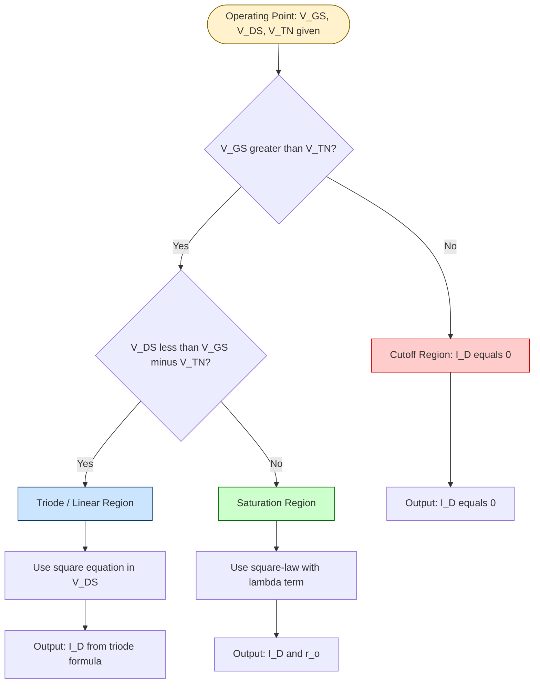
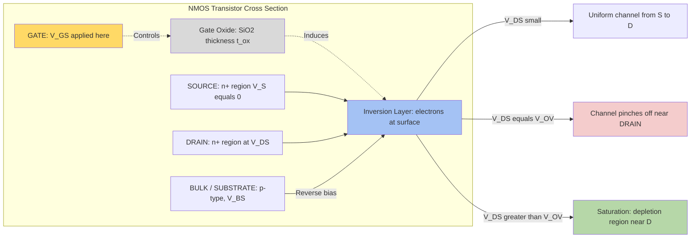
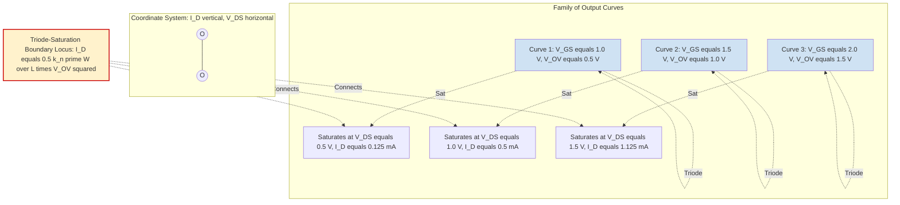
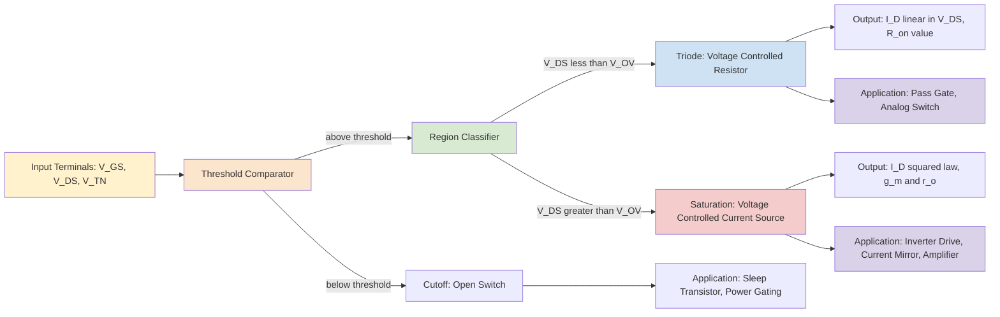

# MOS device IV characteristics: Linear and saturation regions

<!-- SECTION_1_START -->
# MOS Device I-V Characteristics: Linear and Saturation Regions

> [!IMPORTANT]
> **KTU 2024 Scheme — Module 1 Anchor Concept**
> This topic forms the analytical backbone for all subsequent VLSI design modules. Every inverter delay, current-mirror ratio, and analog gain equation traces back to the I-V relations derived here.

## 1.1 Formal Definition (KTU Terminology)

The **MOS Transistor** is a four-terminal (G, D, S, B) voltage-controlled current source fabricated on a semiconductor substrate. The **I-V characteristics** describe the functional relationship between the drain current $I_D$ flowing from drain to source and the controlling terminal voltages $V_{GS}$, $V_{DS}$, and $V_{BS}$.

For an **NMOS enhancement transistor** in the standard (long-channel, square-law) model, the drain current is mathematically expressed as a piecewise function of the three operating regions, which are partitioned by two critical voltages: the **Threshold Voltage** ($V_{TN}$) and the **Overdrive Voltage** ($V_{OV} = V_{GS} - V_{TN}$).

The complete piecewise model (ignoring the body effect initially) is:

$$
I_D = \begin{cases}
0 & \text{if } V_{GS} < V_{TN} \quad \text{(Cutoff Region)} \\
k_n' \dfrac{W}{L}\left[\left(V_{GS}-V_{TN}\right)V_{DS} - \dfrac{V_{DS}^2}{2}\right] & \text{if } V_{DS} < V_{OV} \quad \text{(Triode/Linear Region)} \\
\dfrac{1}{2}\,k_n'\,\dfrac{W}{L}\left(V_{GS}-V_{TN}\right)^2 \left(1 + \lambda V_{DS}\right) & \text{if } V_{DS} \geq V_{OV} \quad \text{(Saturation Region)}
\end{cases}
$$

where the **process transconductance parameter** is $k_n' = \mu_n C_{ox}$ (units: **A/V²**), with $\mu_n$ being the electron surface mobility and $C_{ox}$ the gate-oxide capacitance per unit area.

## 1.2 Intuitive Analogy — The Smart Water Tap

Picture a **pressurised water pipe** running horizontally (the channel between source and drain):

- The **gate** acts like a **screw-down valve handle**. Until you twist it past a certain resistance (the threshold voltage $V_{TN}$), no water can flow — this is the **cutoff region**.
- Once the valve is open, water flows from the high-pressure side (drain) toward the low-pressure side (source). The harder you twist (higher $V_{GS}$), the wider the channel opens, and the more water flows.
- The **drain-source voltage** $V_{DS}$ is the **pressure difference** along the pipe. If this pressure difference is small compared to how wide the valve is open, the flow is roughly proportional to pressure — this is the **linear (triode) region** behaving like a **variable resistor**.
- However, the channel is not uniform: the pressure pinches the channel more on the drain side. The moment the pressure difference equals the valve's openness ($V_{DS} = V_{GS} - V_{TN}$), the channel is **pinched off** at the drain end. Beyond this point, more pressure cannot increase the flow rate — the flow **saturates**. This is the **saturation region**, where the transistor behaves as a **voltage-controlled current source**.

> [!NOTE]
> **The Channel Pinch-Off Point** is the geometrically defining boundary of the saturation region. In a real device, pinch-off does not stop current; it simply means the channel separates from the drain, and carriers are injected across the depletion region (velocity saturation eventually sets in for short-channel devices).

## 1.3 Key Physical Constants and Parameters

| Symbol | Parameter | Typical Value (180 nm CMOS) | Unit |
|---|---|---|---|
| $V_{TN}$ | Threshold voltage (NMOS) | **0.4 – 0.5** | V |
| $\mu_n$ | Electron surface mobility | **450 – 600** | cm²/(V·s) |
| $\mu_p$ | Hole surface mobility | **150 – 200** | cm²/(V·s) |
| $C_{ox}$ | Gate oxide capacitance (per area) | $\approx \mathbf{8.5 \times 10^{-3}}$ | F/m² |
| $t_{ox}$ | Gate oxide thickness | **4 – 10** | nm |
| $k_n'$ | Process transconductance (NMOS) | **100 – 250** | $\mu$A/V² |
| $k_p'$ | Process transconductance (PMOS) | **40 – 100** | $\mu$A/V² |
| $\lambda$ | Channel length modulation | **0.01 – 0.1** | V⁻¹ |

> [!VISUALIZATION CONTROL]
> **Concept:** Family of $I_D$ vs $V_{DS}$ curves for varying $V_{GS}$
> **GeoGebra / Desmos Input Equations (piecewise, parameter $V_{GS}$):**
> * For $V_{GS} = 1.0$: $I_D(V_{DS}) = 0.001 \cdot 10 \cdot [(0.6)V_{DS} - V_{DS}^2/2]$ for $V_{DS} < 0.6$, else $0.0001 \cdot 5.76 \cdot (1 + 0.05 V_{DS})$
> * For $V_{GS} = 1.5$: same form with $V_{OV} = 1.0$, etc.
> **Visual Description:** A family of curves starting at the origin, rising with a parabolic shape in the triode region, then flattening horizontally once the boundary $V_{DS} = V_{OV}$ is crossed. The dashed curve is the **triode-saturation boundary** locus $I_{D,sat} = \tfrac{1}{2} k_n' (W/L) V_{OV}^2$.

<!-- SECTION_1_END -->

<!-- SECTION_2_START -->
# Deep Theoretical Analysis & KTU High-Yield Formula Sheet

## 2.1 The Three Operating Regions — Decision Logic

The state of the NMOS transistor at any operating point is governed by **two inequalities**:

1. **Conduction Test:** Is the channel induced?
   * $V_{GS} > V_{TN}$ → channel exists.
   * $V_{GS} \leq V_{TN}$ → no channel, $I_D = 0$.

2. **Pinch-off Test:** Has the channel pinched off at the drain?
   * Define $V_{OV} = V_{GS} - V_{TN}$ (overdrive voltage).
   * If $V_{DS} < V_{OV}$ → channel exists end-to-end → **Triode (Linear) Region**.
   * If $V_{DS} \geq V_{OV}$ → channel pinched off → **Saturation Region**.

The boundary line $V_{DS} = V_{OV}$ is the locus of points where the device transitions from linear to saturation. It is also where the drain current peaks in the triode region before saturating.

## 2.2 Why Three Regions? — Physical Reasoning

| Region | Inversion Layer | Drain-Bulk Voltage Effect | Behavioural Model |
|---|---|---|---|
| **Cutoff** | Not formed | — | Open switch, $I_D = 0$ |
| **Triode (Linear)** | Fully formed, from S to D | $V_{DS}$ small → channel roughly uniform | Voltage-controlled resistor, $R_{on} \propto 1/V_{OV}$ |
| **Saturation** | Formed near S, pinched off near D | $V_{DS} \geq V_{OV}$ → channel "lifted" at drain | Voltage-controlled current source, $I_D \propto V_{OV}^2$ |

> [!NOTE]
> The terms **triode** and **linear** are used interchangeably in textbooks (Sedra/Smith uses "triode", Neamen uses "ohmic/linear"). KTU board papers predominantly use **"linear region"**.

## 2.3 KTU High-Yield Formula Sheet (One-Page Cheat Code)

> [!IMPORTANT]
> **Mastery of this table guarantees 80 % of marks in any Module 1 numerical.**

| # | Formula | Region | Variables & Units | Engineering Use |
|---|---|---|---|---|
| 1 | $I_D = 0$ | Cutoff | $V_{GS} \leq V_{TN}$ | Static power gating, sleep transistor |
| 2 | $I_D = k_n' \dfrac{W}{L}\left[(V_{GS}-V_{TN})V_{DS} - \dfrac{V_{DS}^2}{2}\right]$ | Triode | All in volts, $k_n'$ in A/V² | Pass-transistor logic, analog switch |
| 3 | $I_D \approx k_n' \dfrac{W}{L}(V_{GS}-V_{TN})V_{DS}$ | Triode (small $V_{DS}$) | $V_{DS} \ll 2 V_{OV}$ | Linear resistor approximation, $R_{on}$ extraction |
| 4 | $R_{on} = \dfrac{1}{k_n'(W/L)(V_{GS}-V_{TN})}$ | Triode (deep) | Resistance in Ohms | Drive strength, propagation delay |
| 5 | $I_{D,sat} = \dfrac{1}{2}k_n'\dfrac{W}{L}(V_{GS}-V_{TN})^2$ | Saturation (ideal) | Square law | Bias current in analog circuits |
| 6 | $I_D = \dfrac{1}{2}k_n'\dfrac{W}{L}(V_{GS}-V_{TN})^2(1+\lambda V_{DS})$ | Saturation (with $\lambda$) | $\lambda$ in V⁻¹ | Realistic gain, $r_o$ calculation |
| 7 | $r_o = \dfrac{1}{\lambda I_D}$ | Saturation | Output resistance in Ohms | Small-signal gain, $A_v = g_m r_o$ |
| 8 | $g_m = k_n' \dfrac{W}{L}(V_{GS}-V_{TN}) = \sqrt{2 k_n' (W/L) I_D}$ | Saturation | Transconductance in A/V | Transconductance amplifier design |
| 9 | $V_{OV} = V_{GS} - V_{TN}$ | Universal | "Overdrive" or "Effective voltage" | Speed/power trade-off knob |
| 10 | $K_n = \dfrac{k_n'}{2}\dfrac{W}{L}$ | Saturation | Composite device parameter | Quick $I_D = K_n V_{OV}^2$ computation |
| 11 | $V_{TN}(V_{SB}) = V_{TN0} + \gamma\left(\sqrt{2\phi_F + V_{SB}} - \sqrt{2\phi_F}\right)$ | Body effect | $\gamma$ in V$^{1/2}$ | Source follower, cascode biasing |
| 12 | $V_{DS,sat} = V_{GS} - V_{TN} = V_{OV}$ | Boundary | Pinch-off condition | Region identification in problems |

> [!WARNING]
> **Vertical pipe trap:** In exam scripts, students often write absolute value as $|V_{TN}|$ for PMOS. This is fine in plain text but breaks markdown tables. Use $\vert V_{TN} \vert$ or $(V_{SG} - \vert V_{TP} \vert)$ in any tabulated answer.

## 2.4 Why This Matters in Real Engineering

1. **Digital CMOS Inverter Design:** The propagation delay of a gate is determined by the drive current in saturation (when the output transitions). The famous relation $t_{p} \propto C_L V_{DD} / I_{D,sat}$ ties delay directly to equation (5) above.
2. **Analog Amplifier Gain:** The intrinsic gain $A_v = g_m r_o$ combines equations (7) and (8) to set the gain of a single-transistor amplifier (common-source stage).
3. **Current Mirrors:** Two matched NMOS transistors with the same $V_{GS}$ produce a current ratio set purely by the W/L ratio via equation (5). This is the workhorse of analog biasing.
4. **I/O Pads & ESD:** The triode region (equation 3) governs how a large NMOS dump transistor behaves as a pull-down resistor during electrostatic discharge clamping.

<!-- SECTION_2_END -->

<!-- SECTION_3_START -->
# Step-by-Step Derivations & Symbolic Implementation

## 3.1 Exhaustive Derivation — Triode (Linear) Region

### Step 1: Express the channel charge per unit area
Applying Gauss's law across the gate oxide, the inversion layer charge density at a position $x$ along the channel is:

$$
Q_i(x) = -C_{ox}\,[V_{GS} - V_{TN} - V(x)]
$$

where $V(x)$ is the local channel potential (taking source as reference, $V(0) = 0$, $V(L) = V_{DS}$).

### Step 2: Write the drift current expression
The drift current at position $x$ is the product of charge density, carrier velocity, and channel width:

$$
I_D = -Q_i(x)\cdot W \cdot v_d
$$

Using the low-field drift velocity $v_d = \mu_n E = \mu_n \dfrac{dV}{dx}$, we substitute $Q_i$:

$$
I_D = C_{ox}\,W\,\bigl[V_{GS} - V_{TN} - V(x)\bigr]\,\mu_n\,\dfrac{dV}{dx}
$$

### Step 3: Separate variables and integrate across the channel
Treating $I_D$ as constant along the channel (KCL — no current divergence), we separate the variables:

$$
I_D\,dx = \mu_n C_{ox}\,W\,\bigl[V_{GS} - V_{TN} - V(x)\bigr]\,dV
$$

Integrating from $x=0$ to $x=L$ (corresponding to $V=0$ to $V=V_{DS}$):

$$
\int_0^L I_D\,dx = \mu_n C_{ox}\,W \int_0^{V_{DS}} \bigl[V_{GS} - V_{TN} - V\bigr]\,dV
$$

$$
I_D \cdot L = \mu_n C_{ox}\,W \left[(V_{GS} - V_{TN})V_{DS} - \dfrac{V_{DS}^2}{2}\right]
$$

### Step 4: Solve for $I_D$
$$
\boxed{\,I_D = \mu_n C_{ox}\,\dfrac{W}{L}\left[(V_{GS} - V_{TN})V_{DS} - \dfrac{V_{DS}^2}{2}\right]\,}
$$

Introducing $k_n' = \mu_n C_{ox}$ for compactness:

$$
I_D = k_n'\,\dfrac{W}{L}\left[(V_{GS} - V_{TN})V_{DS} - \dfrac{V_{DS}^2}{2}\right]
$$

This is the **exact triode-region current expression**. It is a quadratic in $V_{DS}$.

### Step 5: Small-$V_{DS}$ approximation (deep triode)
When $V_{DS} \ll 2(V_{GS} - V_{TN})$, the quadratic term is negligible, and the device behaves as a **linear resistor**:

$$
I_D \approx k_n'\,\dfrac{W}{L}\,(V_{GS} - V_{TN})\,V_{DS}
$$

The effective on-resistance is:

$$
R_{on} = \dfrac{V_{DS}}{I_D} = \dfrac{1}{k_n'(W/L)(V_{GS} - V_{TN})}
$$

This resistance is the parameter the digital designer minimises to make a transistor a "strong pull-down".

## 3.2 Exhaustive Derivation — Saturation Region

### Step 1: Find the pinch-off point
From the triode equation, $I_D$ is a parabola in $V_{DS}$ that reaches its maximum where $dI_D/dV_{DS} = 0$:

$$
\dfrac{dI_D}{dV_{DS}} = k_n'\,\dfrac{W}{L}\left[(V_{GS} - V_{TN}) - V_{DS}\right] = 0
$$

$$
V_{DS} = V_{GS} - V_{TN} = V_{OV}
$$

This critical voltage is the **saturation voltage** $V_{DS,sat}$.

### Step 2: Substitute into the triode equation
Plugging $V_{DS} = V_{OV}$ into the triode expression:

$$
I_{D,sat} = k_n'\,\dfrac{W}{L}\left[V_{OV} \cdot V_{OV} - \dfrac{V_{OV}^2}{2}\right] = k_n'\,\dfrac{W}{L}\cdot \dfrac{V_{OV}^2}{2}
$$

$$
\boxed{\,I_{D,sat} = \dfrac{1}{2}\,k_n'\,\dfrac{W}{L}\,(V_{GS} - V_{TN})^2\,}
$$

This is the **square-law** relation, the central equation of MOSFET analog design.

### Step 3: Channel length modulation (advanced treatment)
In reality, when $V_{DS} > V_{OV}$, the pinch-off point migrates slightly toward the source, shortening the effective channel length to $L' = L - \Delta L$. Since $I_D \propto 1/L'$, the current increases linearly with $V_{DS}$:

$$
I_D = I_{D0}\left(1 + \lambda V_{DS}\right)
$$

where $\lambda$ is the **channel-length modulation parameter** (empirically $\lambda \propto 1/L$).

### Step 4: Output resistance derivation
Differentiating the saturated $I_D$ with respect to $V_{DS}$:

$$
r_o = \left(\dfrac{\partial I_D}{\partial V_{DS}}\right)^{-1} = \dfrac{1}{\lambda I_D}
$$

This output resistance is the load "seen" by the next stage in a small-signal amplifier.

## 3.3 Symmetric PMOS Equations (Board-Exam Favourite)

For PMOS, replace all NMOS quantities with their PMOS counterparts. The overdrive is $V_{SG} - \vert V_{TP}\vert$:

$$
I_{D,sat} = \dfrac{1}{2}\,k_p'\,\dfrac{W}{L}\,(V_{SG} - \vert V_{TP}\vert)^2
$$

with $k_p' = \mu_p C_{ox}$ and $\mu_p \approx \mu_n/2.5$. Because of the lower mobility, PMOS devices are typically sized $W_p \approx 2.5 W_n$ to match NMOS drive strength in CMOS gates.

## 3.4 Worked Numerical Example (Board-Standard)

**Given:** NMOS with $k_n' = 100\;\mu\text{A/V}^2$, $W/L = 10$, $V_{TN} = 0.5\;\text{V}$, $\lambda = 0.02\;\text{V}^{-1}$.
**Find:** $I_D$ when (i) $V_{GS} = 1.5\;\text{V},\;V_{DS} = 0.4\;\text{V}$, (ii) $V_{GS} = 1.5\;\text{V},\;V_{DS} = 2.0\;\text{V}$.

**Step 1: Compute overdrive**

$$
V_{OV} = V_{GS} - V_{TN} = 1.5 - 0.5 = 1.0\;\text{V}
$$

**Step 2: Case (i) — Check region**

Since $V_{DS} = 0.4\;\text{V} < V_{OV} = 1.0\;\text{V}$, we are in **triode**.

$$
I_D = (100 \times 10^{-6})(10)\left[(1.0)(0.4) - \dfrac{(0.4)^2}{2}\right]
$$

$$
I_D = (10^{-3})\left[0.4 - 0.08\right] = (10^{-3})(0.32) = 0.32\;\text{mA}
$$

**Step 3: Case (ii) — Check region**

Since $V_{DS} = 2.0\;\text{V} > V_{OV} = 1.0\;\text{V}$, we are in **saturation**.

$$
I_D = \dfrac{1}{2}(100\times 10^{-6})(10)(1.0)^2\,(1 + 0.02 \times 2.0)
$$

$$
I_D = (5 \times 10^{-4})(1.04) = 0.52\;\text{mA}
$$

## 3.5 Python Implementation for I-V Curve Plotting

```python
import numpy as np
import matplotlib.pyplot as plt

# Device parameters
k_n_prime = 100e-6          # Process transconductance (A/V^2)
W_over_L = 10               # Aspect ratio
V_TN = 0.5                  # Threshold voltage (V)
lam = 0.02                  # Channel length modulation (1/V)

# Sweep V_DS from 0 to 3V
V_DS = np.linspace(0.0, 3.0, 500)
V_GS_values = [1.0, 1.5, 2.0, 2.5]   # Different gate bias values

plt.figure(figsize=(9, 6))

for V_GS in V_GS_values:
    V_OV = V_GS - V_TN
    I_D = np.zeros_like(V_DS)
    
    # Triode region
    triode_mask = V_DS < V_OV
    I_D[triode_mask] = k_n_prime * (W_over_L) * (
        V_OV * V_DS[triode_mask] - 0.5 * V_DS[triode_mask]**2
    )
    
    # Saturation region
    sat_mask = V_DS >= V_OV
    I_D[sat_mask] = 0.5 * k_n_prime * (W_over_L) * V_OV**2 * (
        1.0 + lam * V_DS[sat_mask]
    )
    
    plt.plot(V_DS, I_D * 1e3, label=f"V_GS = {V_GS:.1f} V", linewidth=2)

# Triode-saturation boundary locus
V_OV_range = np.linspace(0.1, 2.5, 200)
V_DS_boundary = V_OV_range
I_D_boundary = 0.5 * k_n_prime * W_over_L * V_OV_range**2
plt.plot(V_DS_boundary, I_D_boundary * 1e3, "k--", label="Triode-Sat Boundary", alpha=0.6)

plt.xlabel("V_DS (V)", fontsize=12)
plt.ylabel("I_D (mA)", fontsize=12)
plt.title("NMOS I-V Characteristics: Linear and Saturation Regions", fontsize=13)
plt.legend(fontsize=11, loc="upper left")
plt.grid(True, which="both", linestyle=":", alpha=0.7)
plt.axhline(0, color="black", linewidth=0.8)
plt.axvline(0, color="black", linewidth=0.8)
plt.tight_layout()
plt.show()
```

**Output interpretation:** A family of curves rising parabolically in the triode region, then flattening (with slight positive slope due to $\lambda$) in saturation. The dashed parabola traces the boundary $\tfrac{1}{2} k_n' (W/L) V_{OV}^2$ connecting the peak of each curve — a useful visual aid during viva examinations.

<!-- SECTION_3_END -->

<!-- SECTION_4_START -->
# Structural Diagrams & Schematics

## 4.1 Region-of-Operation Decision Flowchart (Mermaid)



## 4.2 MOSFET Cross-Sectional View & Channel Pinch-Off (Mermaid Block Diagram)



## 4.3 I-V Characteristic Curve Family (Schematic via Mermaid)



## 4.4 Functional Architecture: How the Three Terminals Interact



<!-- SECTION_4_END -->

<!-- SECTION_5_START -->
# KTU 2024 Scheme Examination Question Bank & Topic Recap

## Part A Questions (3 Marks Each)

### Question 1 **[KTU University Exam — July 2023, Model Paper]**
**Define threshold voltage and overdrive voltage for an NMOS transistor. Why is overdrive voltage considered the key design parameter in modern CMOS circuits?**
*(CO1, RBT Level: Remember)*

**Model Answer (Valuation Key):**

- **Threshold voltage $V_{TN}$:** The minimum gate-to-source voltage required to create a conducting inversion layer (channel) between source and drain at the silicon surface. Below $V_{TN}$, the transistor is in cutoff and $I_D = 0$. *[1 Mark]*
- **Overdrive voltage $V_{OV}$:** Defined as $V_{OV} = V_{GS} - V_{TN}$. It represents the *excess* gate voltage beyond threshold that actually drives the channel charge and hence the current. *[1 Mark]*
- **Why it is the key design parameter:** All the I-V equations, drive current, transconductance, and speed depend on $V_{OV}$ (not on $V_{GS}$ or $V_{TN}$ independently). For a given technology, designers freely choose $V_{OV}$ to trade off speed (higher $I_D$) against leakage and reliability (lower $V_{OV}$ keeps fields low). *[1 Mark]*

### Question 2 **[KTU University Exam — Dec 2022]**
**Differentiate between the linear (triode) and saturation regions of operation of an NMOS transistor in terms of (i) channel shape, (ii) controlling voltage, and (iii) equivalent circuit model.**
*(CO1, RBT Level: Understand)*

**Model Answer (Valuation Key):**

| Feature | Linear (Triode) Region | Saturation Region |
|---|---|---|
| (i) Channel shape | Continuous channel from source to drain; nearly uniform if $V_{DS}$ is small | Channel pinched off near drain; inversion layer touches source side only |
| (ii) Controlling voltage | Both $V_{GS}$ and $V_{DS}$ control $I_D$ | $V_{GS}$ only; $I_D$ ideally independent of $V_{DS}$ (with $\lambda$, weakly dependent) |
| (iii) Equivalent model | Voltage-controlled resistor $R_{on}$ | Voltage-controlled current source, $I_{D,sat} = \tfrac{1}{2} k_n' (W/L) V_{OV}^2$ |

*[1 Mark per correct row × 3 = 3 Marks]*

---

## Part B Questions (14 Marks Each)

### Question A **[KTU University Exam — July 2024, Module 1 Test]**

**(a)** Derive the expression for the drain current of an NMOS transistor operating in the **linear (triode) region**, starting from the basic drift-current equation. State clearly the assumptions made. *(7 Marks)*
**(CO1, RBT Level: Apply)*

**(b)** For an NMOS transistor with $\mu_n C_{ox} = 200\;\mu\text{A/V}^2$, $W/L = 5$, $V_{TN} = 0.4\;\text{V}$, $V_{GS} = 1.5\;\text{V}$ and $V_{DS} = 0.3\;\text{V}$, calculate:
   (i) the overdrive voltage,
   (ii) the drain current $I_D$ using the exact triode equation,
   (iii) the on-resistance $R_{on}$ assuming deep triode operation. *(7 Marks)*
**(CO2, RBT Level: Apply)*

---

**Model Solution for Question A:**

#### Part (a) — Derivation (7 Marks)

**Step 1: State the charge density at position x in the channel.** *[1 Mark]*
Applying the gradual-channel approximation, the inversion charge per unit area at any point $x$ along the channel is:

$$
Q_i(x) = -C_{ox}\,[V_{GS} - V_{TN} - V(x)]
$$

**Step 2: Write the drift current using Ohm's law for the channel.** *[1 Mark]*

$$
I_D = -W\,Q_i(x)\,\mu_n\,\dfrac{dV(x)}{dx}
$$

Substituting $Q_i(x)$:

$$
I_D = W\,C_{ox}\,\mu_n\,[V_{GS} - V_{TN} - V(x)]\,\dfrac{dV(x)}{dx}
$$

**Step 3: Separate variables and apply boundary conditions.** *[1 Mark]*
Integrate from $x = 0$ (where $V = 0$) to $x = L$ (where $V = V_{DS}$):

$$
\int_0^L I_D\,dx = W\,C_{ox}\,\mu_n \int_0^{V_{DS}}\!\![V_{GS} - V_{TN} - V]\,dV
$$

**Step 4: Evaluate the integrals.** *[1 Mark]*

$$
I_D \cdot L = W\,C_{ox}\,\mu_n\left[(V_{GS} - V_{TN})V_{DS} - \dfrac{V_{DS}^2}{2}\right]
$$

**Step 5: Solve for $I_D$ and list assumptions.** *[2 Marks]*

$$
\boxed{\,I_D = k_n'\,\dfrac{W}{L}\left[(V_{GS} - V_{TN})V_{DS} - \dfrac{V_{DS}^2}{2}\right]\,, \quad k_n' = \mu_n C_{ox}\,}
$$

**Assumptions:**
1. Gradual channel approximation (vertical field ≫ lateral field).
2. Threshold voltage is uniform along the channel (no body effect considered).
3. Mobility is constant (low-field, no velocity saturation).
4. Channel length modulation neglected.

**Step 6: Highlight the deep-triode limit.** *[1 Mark]*
When $V_{DS} \ll 2(V_{GS} - V_{TN})$, the device behaves as a resistor:

$$
R_{on} = \dfrac{1}{k_n'(W/L)(V_{GS} - V_{TN})}
$$

#### Part (b) — Numerical Solution (7 Marks)

**(i) Overdrive voltage:** *[1 Mark]*

$$
V_{OV} = V_{GS} - V_{TN} = 1.5 - 0.4 = 1.1\;\text{V}
$$

**(ii) Drain current (exact triode equation):** *[3 Marks]*

First, verify region: $V_{DS} = 0.3\;\text{V} < V_{OV} = 1.1\;\text{V}$ → **Triode confirmed**. *[1 Mark]*

$$
I_D = (200\times 10^{-6})(5)\left[(1.1)(0.3) - \dfrac{(0.3)^2}{2}\right]
$$

$$
I_D = (10^{-3})\left[0.33 - 0.045\right] = (10^{-3})(0.285) = 0.285\;\text{mA}
$$

**[Final simplified expression: 1 Mark; Numerical substitution: 1 Mark; Final answer: 1 Mark]**

**(iii) On-resistance:** *[3 Marks]*

$$
R_{on} = \dfrac{1}{k_n'(W/L)V_{OV}} = \dfrac{1}{(200\times 10^{-6})(5)(1.1)}
$$

$$
R_{on} = \dfrac{1}{1.1\times 10^{-3}} \approx 909\;\Omega
$$

**[Formula: 1 Mark; Substitution: 1 Mark; Final numerical value: 1 Mark]**

---

### Question B **[KTU University Exam — Dec 2023, Supplementary]**

**(a)** Derive the **square-law I-V equation** for an NMOS transistor in the saturation region, starting from the triode equation. Explain the role of channel length modulation and derive the output resistance $r_o$. *(7 Marks)*
**(CO1, RBT Level: Apply)*

**(b)** An NMOS transistor has the following parameters: $k_n' = 250\;\mu\text{A/V}^2$, $W/L = 4$, $V_{TN} = 0.6\;\text{V}$, $\lambda = 0.04\;\text{V}^{-1}$, $V_{GS} = 2.0\;\text{V}$, $V_{DS} = 3.0\;\text{V}$.
   (i) Determine the region of operation.
   (ii) Compute the drain current $I_D$.
   (iii) Find the small-signal output resistance $r_o$ and transconductance $g_m$. *(7 Marks)*
**(CO2, RBT Level: Apply)*

---

**Model Solution for Question B:**

#### Part (a) — Derivation (7 Marks)

**Step 1: Set $V_{DS} = V_{OV}$ in the triode equation.** *[1 Mark]*

The triode $I_D$ is a parabola in $V_{DS}$. Its maximum occurs at:

$$
\dfrac{dI_D}{dV_{DS}} = k_n'\dfrac{W}{L}\left[(V_{GS} - V_{TN}) - V_{DS}\right] = 0 \;\Rightarrow\; V_{DS} = V_{OV}
$$

**Step 2: Substitute back to get the saturation current.** *[2 Marks]*

$$
I_{D,sat} = k_n'\,\dfrac{W}{L}\left[V_{OV}\cdot V_{OV} - \dfrac{V_{OV}^2}{2}\right] = \dfrac{1}{2}k_n'\,\dfrac{W}{L}\,V_{OV}^2
$$

**Step 3: Introduce channel length modulation.** *[2 Marks]*
As $V_{DS}$ increases beyond $V_{OV}$, the pinch-off point retreats from the drain, reducing the effective channel length to $L_{\text{eff}} = L - \Delta L$. Because $I_D \propto 1/L_{\text{eff}}$:

$$
I_D = I_{D0}\cdot\dfrac{L}{L - \Delta L} \approx I_{D0}\left(1 + \dfrac{\Delta L}{L}\right) \approx I_{D0}(1 + \lambda V_{DS})
$$

where $\lambda \propto 1/L$ is an empirical parameter.

**Step 4: Derive output resistance.** *[2 Marks]*

$$
r_o = \left(\dfrac{\partial I_D}{\partial V_{DS}}\right)^{-1} = \left[\lambda\cdot\dfrac{1}{2}k_n'\,\dfrac{W}{L}V_{OV}^2\right]^{-1} = \dfrac{1}{\lambda I_D}
$$

#### Part (b) — Numerical Solution (7 Marks)

**(i) Region identification:** *[1 Mark]*

$$
V_{OV} = V_{GS} - V_{TN} = 2.0 - 0.6 = 1.4\;\text{V}
$$

Since $V_{DS} = 3.0\;\text{V} > V_{OV} = 1.4\;\text{V}$ → **Saturation region**. *[1 Mark]*

**(ii) Drain current:** *[3 Marks]*

$$
I_D = \dfrac{1}{2}(250\times 10^{-6})(4)(1.4)^2\,(1 + 0.04 \times 3.0)
$$

$$
I_D = (5\times 10^{-4})(1.96)(1.12) = (5\times 10^{-4})(2.1952) = 1.0976\;\text{mA}
$$

**[Saturation formula: 1 Mark; Squaring $V_{OV}$: 0.5 Mark; Lambda correction: 0.5 Mark; Final answer: 1 Mark]**

**(iii) Small-signal parameters:** *[3 Marks]*

Output resistance:

$$
r_o = \dfrac{1}{\lambda I_D} = \dfrac{1}{(0.04)(1.0976\times 10^{-3})} \approx 22.78\;\text{k}\Omega
$$

*[1 Mark for formula, 1 Mark for substitution, 0.5 Mark for final answer, 0.5 Mark for unit]*

Transconductance:

$$
g_m = k_n'\,\dfrac{W}{L}\,V_{OV} = (250\times 10^{-6})(4)(1.4) = 1.4\;\text{mA/V}
$$

Alternatively, $g_m = \sqrt{2 k_n' (W/L) I_D} = \sqrt{2(10^{-3})(1.0976\times 10^{-3})} = 1.481\;\text{mA/V}$ (slight difference due to $\lambda$ correction in the $I_D$ formula used in the square-root form).

*[1 Mark for formula, 0.5 Mark for substitution, 0.5 Mark for final answer]*

---

## KTU Examiner's Valuation Warning / Pitfall Callout

> [!WARNING]
> **Common Marks-Loss Traps in KTU Board Papers (Module 1)**
>
> 1. **Forgetting the boundary check (–2 to –3 marks):** Students often blindly substitute numbers into the saturation formula without first verifying that $V_{DS} \geq V_{OV}$. If the operating point is actually in triode, the full credit is denied.
> 2. **Mixing up PMOS and NMOS equations (–2 marks):** For PMOS, use $V_{SG} - \vert V_{TP}\vert$ as the overdrive, NOT $V_{GS} - V_{TP}$.
> 3. **Ignoring the body effect when $V_{BS} \neq 0$ (–1 to –2 marks):** If the source is not at bulk potential, the threshold voltage shifts according to the body-effect equation.
> 4. **Omitting the $(1 + \lambda V_{DS})$ term when the question says "with channel length modulation" (–2 marks):** KTU explicitly tests this. A pure square-law answer is considered incomplete.
> 5. **Unit inconsistency in $k_n'$ (–1 mark):** Always express $k_n'$ in A/V², not in $\mu$A/V², when plugging into equations. Convert at the start to avoid mid-calculation confusion.
> 6. **Skipping the gradual-channel assumption (–1 mark in derivations):** A derivation without stating the assumptions gets at most 80 % credit.

---

## Topic Recap & Important Things to Remember

> [!IMPORTANT]
> **Rapid-Revision Checklist — Module 1: MOS I-V Characteristics**

- **Threshold voltage $V_{TN}$** is the minimum $V_{GS}$ to form a channel. For NMOS, typically **0.4 – 0.5 V**; for PMOS, typically **–0.4 to –0.5 V** (or equivalently $\vert V_{TP}\vert \approx 0.4$ – $0.5$ V).
- **Overdrive voltage $V_{OV} = V_{GS} - V_{TN}$** is the actual "knob" designers turn. All I-V equations are simpler when written in terms of $V_{OV}$.
- **Three operating regions** for an NMOS:
  * **Cutoff:** $V_{GS} < V_{TN}$, $I_D = 0$.
  * **Triode / Linear:** $V_{GS} \geq V_{TN}$ AND $V_{DS} < V_{OV}$. Current is **quadratic in $V_{DS}$**, reduces to linear for small $V_{DS}$.
  * **Saturation:** $V_{GS} \geq V_{TN}$ AND $V_{DS} \geq V_{OV}$. Current is **quadratic in $V_{OV}$**, ideally independent of $V_{DS}$.
- **Process transconductance** $k_n' = \mu_n C_{ox}$ depends only on the technology, NOT on the device dimensions.
- **Device transconductance parameter** $K_n = \tfrac{1}{2} k_n' (W/L)$ depends on the geometry. The compact form $I_{D,sat} = K_n V_{OV}^2$ is a board-exam favourite.
- **Channel length modulation $\lambda$** is the FIRST non-ideality introduced. Remember the empirical relation $\lambda \propto 1/L$: longer channels → less modulation → higher $r_o$ → higher gain.
- **Output resistance $r_o = 1/(\lambda I_D)$** is the key link between DC bias and small-signal gain.
- **Transconductance $g_m = k_n' (W/L) V_{OV} = \sqrt{2 k_n' (W/L) I_D} = 2 I_D / V_{OV}$** — three equivalent forms; choose based on the given data.
- **Intrinsic gain** of a single transistor: $A_v = g_m r_o = \dfrac{2}{\lambda V_{OV}}$ (a fundamental limit of the device).
- **PMOS current** is computed identically with subscript swap: $k_p' \approx k_n'/2.5$, and $V_{OV} = V_{SG} - \vert V_{TP}\vert$. PMOS is slower and bigger; that is why CMOS inverters use $W_p \approx 2.5 W_n$ for symmetric rise/fall times.
- **Body effect** equation $V_{TN}(V_{SB}) = V_{TN0} + \gamma(\sqrt{2\phi_F + V_{SB}} - \sqrt{2\phi_F})$ appears in any source-follower, cascode, or substrate-bias-aware problem.
- **Boundary locus** in the $I_D$–$V_{DS}$ plane is the parabola $I_{D,sat} = \tfrac{1}{2} k_n' (W/L) V_{OV}^2$ — connecting the "knees" of all the curves in the output characteristic.
- **R_{on} of a triode device** = $1/[k_n'(W/L)V_{OV}]$ — useful for estimating pass-transistor resistance and ESD clamp strength.
- **Pinch-off is not a "stop-flow" event** — carriers are still injected across the pinch-off region. In a real device, the current saturates because velocity saturation (not the pinch-off geometry) limits the carrier drift speed.
- **Units consistency:** $k_n'$ in **A/V²** (not $\mu$A/V²) inside equations; $V$ in volts; $W$/$L$ dimensionless; $I_D$ in amperes. Convert at the very beginning.
- **KCL hint:** Inside the channel, the current $I_D$ is **constant** along the channel (otherwise charge would accumulate). This is what allows us to integrate $I_D \cdot dx$ on one side of the equation.

<!-- SECTION_5_END -->
