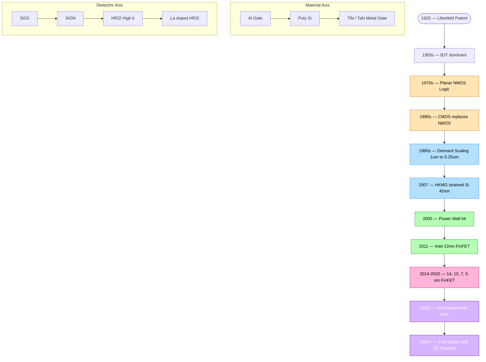
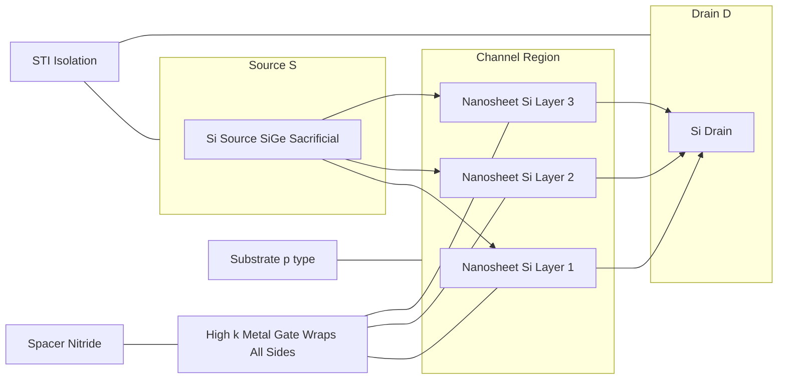

# MOS transistor evolution

<!-- SECTION_1_START -->
# MOS Transistor Evolution

## 1.1 Formal Academic Definition (KTU 2024 Syllabus Terminology)

> [!IMPORTANT]
> **MOS Transistor Evolution** refers to the chronological progression of Metal-Oxide-Semiconductor Field-Effect Transistors (MOSFETs) from their conceptual inception in **1925** (Lilienfeld patent) through bulk planar CMOS, and into contemporary multi-gate architectures such as **FinFETs**, **Gate-All-Around (GAA)** FETs, and **Nanosheet / Fork-Sheet** devices, driven by the continuous need to maintain electrostatic integrity, reduce power, and increase transistor density per **Moore's Law**.

The evolution encompasses four key engineering axes:

| Axis | Evolution Driver |
|---|---|
| **Geometry** | Planar $\rightarrow$ 3D multi-gate |
| **Material** | Al gate $\rightarrow$ Poly-Si $\rightarrow$ Metal / High-$\kappa$ |
| **Dielectric** | $\mathrm{SiO_2}$ $\rightarrow$ SiON $\rightarrow$ Hf-based High-$\kappa$ |
| **Channel** | Strained-Si $\rightarrow$ SiGe $\rightarrow$ III-V / 2D materials |

> [!NOTE]
> **KTU Syllabus Anchor:** PECST401 / Module 1 explicitly maps the **historical roadmap** of MOSFETs to modern VLSI design constraints, including **Dennard Scaling**, **Short Channel Effects (SCE)**, and the transition from **NMOS-only logic** to **CMOS** as the dominant digital technology.

---

## 1.2 Conceptual Analogy — A "Water-Tap" View of MOS Evolution

Imagine controlling a high-pressure water pipe (the **source-to-drain current**, $I_{DS}$) using a mechanical knob (the **gate voltage**, $V_{GS}$).

- **BJT (1950s)** = A tap where the knob controls a *small auxiliary current* that, in turn, regulates the main flow. It is a **current-controlled** device — power-hungry and hard to scale.
- **Planar Bulk MOSFET (1970s–2000s)** = A tap where the knob directly *electrostatically squeezes* a thin sheet of water (the inversion layer / channel) between source and drain. Voltage-controlled, low static power.
- **FinFET (2011+)** = The water pipe is replaced by a thin vertical fin, and the knob is wrapped around *two or three sides* of the fin, giving a much firmer grip on the water.
- **GAA / Nanosheet (2022+)** = The knob *completely encircles* the channel — total control. Even the tiniest trickle of leakage is suppressed.

> [!TIP]
> **Why the "evolution"?** As engineers shrank the pipe diameter (channel length $L$), the knob's grip weakened because the source and drain got too close. The fin and gate-all-around structures restore the grip using **better electrostatic coupling**, expressed quantitatively by the **DIBL** and **subthreshold swing ($SS$)** parameters.

---

## 1.3 Physical & Historical Constants

- **Electron charge:** $q = 1.602 \times 10^{-19}$ **C**
- **Silicon intrinsic carrier concentration:** $n_i \approx 1.5 \times 10^{10}$ **cm$^{-3}$** at 300 K
- **Silicon lattice constant:** $a_{Si} = 5.431$ **Å**
- **SiO$_2$ dielectric constant:** $\kappa_{ox} = 3.9$
- **Silicon dielectric constant:** $\kappa_{Si} = 11.7$
- **Moore's Law doubling period:** approximately **24 months** (originally **12 months**, revised 1975)
- **Planar CMOS physical gate length milestones:** 0.35 $\mu$m $\rightarrow$ 90 nm $\rightarrow$ 28 nm (the planar limit)

> [!VISUALIZATION CONTROL]
> **Concept:** Historical transistor-count trajectory and the planar-to-3D crossover point.
> **GeoGebra / Desmos Input Equations:**
> * `f(t) = 2^((t - 1971)/2)` for $t \in [1971, 2030]$
> * `g1(x) = 50` (a horizontal red line representing the **planar scaling floor** at ~50 nm physical gate).
> **Visual Description:** Exponential $f(t)$ rises sharply. Around $t \approx 2011$, the curve crosses $g1(x)$ — this is the year **Intel introduced FinFETs (Ivy Bridge / 22 nm)**. Beyond this point, planar bulk MOSFETs can no longer keep up; the industry's geometry axis flips to multi-gate 3D.

---

## 1.4 The Five Generations of MOS Transistors

| Generation | Era | Representative Tech Node | Channel Control |
|---|---|---|---|
| **G1 — Long-Channel Planar** | 1970 – 1990 | $\geq 1\ \mu m$ | Single top-gate |
| **G2 — Scaled Planar with Doping Engineering** | 1990 – 2005 | $1\ \mu m \rightarrow 90$ nm | Halo / retrograde wells, shallow junctions |
| **G3 — Strained-Si + High-$\kappa$ + Metal Gate (HKMG)** | 2007 – 2011 | 45 nm / 32 nm | Strained channel, $\mathrm{HfO_2}$ gate dielectric |
| **G4 — Multi-Gate (FinFET / Tri-Gate)** | 2011 – 2020 | 22 nm $\rightarrow$ 5 nm | Gate on 2–3 sides of vertical fin |
| **G5 — Gate-All-Around (GAA) / Nanosheet** | 2022+ | 3 nm $\rightarrow$ 2 nm / 1.4 nm | Gate fully surrounds channel |

> [!IMPORTANT]
> **Why did CMOS *completely* replace NMOS in the 1980s?** Static (DC) power dissipation in a pure NMOS gate is non-zero because a pull-up *depletion* device always draws current. CMOS uses complementary p- and n-devices so that, in steady state, *no* path exists between $V_{DD}$ and ground. Power scales as $P \approx C \cdot V_{DD}^2 \cdot f$, which is the foundation of all modern low-power VLSI design.

<!-- SECTION_1_END -->

<!-- SECTION_2_START -->
# Deep Theoretical Analysis & KTU High-Yield Formula Sheet

## 2.1 Theoretical Decomposition — Why Each Generation Existed

### 2.1.1 BJT $\rightarrow$ MOSFET (the 1960s transition)
- **Problem with BJT:** Requires large base current; current gain $\beta$ varies exponentially with temperature; not naturally compatible with the **self-aligned polysilicon-gate** fabrication process that emerged in the early 1970s.
- **MOS advantage:** Near-infinite input impedance at DC, voltage-controlled, and naturally compatible with **single-poly planar process** that allowed $10\times$ higher integration density.

### 2.1.2 Long-Channel $\rightarrow$ Short-Channel
As $L$ shrinks below $\sim 1\ \mu m$, two failure modes emerge:
1. **Punch-through** — source and drain depletion regions touch, removing the gate's ability to control the channel.
2. **Velocity saturation** — carrier velocity $v$ saturates at $v_{sat} \approx 10^{7}$ cm/s, making $I_{DS}$ depend weakly on $L$.

### 2.1.3 The Birth of Dennard Scaling (1974)
Robert Dennard formalized **constant-field scaling**: shrink *all* dimensions ($L$, $W$, $t_{ox}$, junction depth $x_j$) and *all* voltages by a factor $\alpha > 1$ while keeping the electric field constant. This delivers:
- $4\times$ higher density
- $1/\alpha$ faster switching
- $1/\alpha^2$ lower power per gate
- Total chip power remains **constant**.

### 2.1.4 The End of Dennard Scaling (2005–2006)
At 90 nm and below:
- $V_{DD}$ could not be reduced further due to **threshold-voltage sub-threshold leakage** (the $V_T$ cannot go below $\sim 0.3$ V without exploding off-current).
- Leakage power began to dominate dynamic power.
- This phenomenon is called the **"Power Wall"**.

### 2.1.5 Mitigation Strategies in the Post-Dennard Era
- **Strained Silicon (90 nm):** Si channel placed under tensile stress to enhance electron mobility $\mu_n$ by $\sim 30\%$.
- **High-$\kappa$ Dielectric (45 nm, Intel 2007):** Replaced $\mathrm{SiO_2}$ with $\mathrm{HfO_2}$ ($\kappa \approx 25$) to increase physical $t_{ox}$ while keeping equivalent oxide thickness **EOT** low, reducing gate tunneling leakage $\propto \exp(-t_{ox})$.
- **Metal Gate:** Eliminated poly-Si depletion and boron penetration.
- **Multi-Gate / FinFET (22 nm, 2011):** Restored electrostatic control via the **fin**.

---

## 2.2 KTU High-Yield Formula Sheet

> [!IMPORTANT]
> Memorize every entry in this table — these are the formulas a KTU examiner expects to see for *full marks* on a 14-mark question.

| # | Concept | Formula | Engineering Use |
|---|---|---|---|
| 1 | **Dennard Constant-Field Scaling** (linear factor $\alpha$) | $L' = L/\alpha$, $V' = V/\alpha$, $t_{ox}' = t_{ox}/\alpha$, $N_{a}' = \alpha N_a$ | Predicts delay, power, density for next node |
| 2 | **Dennard Delay Scaling** | $\tau' = \tau/\alpha$ | Switching speed improves by $\alpha$ |
| 3 | **Dennard Power Scaling** (per gate) | $P' = P/\alpha^{2}$ | Power per gate reduces quadratically |
| 4 | **Power-Delay Product** | $\mathrm{PDP} = P \cdot \tau = C \cdot V_{DD}^{2}$ | Energy per switching event |
| 5 | **Total chip power under constant-field** | $P_{chip} = \mathrm{constant}$ | Total power unchanged per Dennard |
| 6 | **Equivalent Oxide Thickness** | $\mathrm{EOT} = t_{phys} \cdot \dfrac{\kappa_{SiO_2}}{\kappa_{high\text{-}\kappa}}$ | Comparing high-$\kappa$ to $\mathrm{SiO_2}$ |
| 7 | **Gate capacitance per area** | $C_{ox} = \dfrac{\kappa_{SiO_2}\,\varepsilon_0}{\mathrm{EOT}}$ | Determines $I_{on}$ |
| 8 | **Saturation current (long-channel)** | $I_{DS,sat} = \dfrac{\mu\, C_{ox}\, W}{2L}(V_{GS}-V_T)^{2}$ | Foundation of CMOS design |
| 9 | **Velocity-saturated current** | $I_{DS,sat} \approx W\, C_{ox}\,(V_{GS}-V_T)\,v_{sat}$ | Short-channel regime |
| 10 | **Sub-threshold Swing (ideal)** | $SS = \ln(10)\cdot\dfrac{kT}{q}\approx 60$ mV/dec @ 300 K | Lower bound for planar MOSFETs |
| 11 | **DIBL coefficient** | $\Delta V_T / \Delta V_{DS}$ | Quantifies short-channel effect |
| 12 | **Threshold voltage roll-off** | $V_T(L) = V_{T,\infty} - \Delta V_T$ where $\Delta V_T \propto \exp(-L/L_{char})$ | Determines minimum usable $L$ |
| 13 | **Natural length (electrostatic scale)** | $\lambda = \sqrt{\dfrac{\varepsilon_{Si}\,t_{ox}\,t_{Si}\,W}{\varepsilon_{ox}}}$ (double-gate simplified) | For multi-gate, smaller $\lambda$ = better SCE |
| 14 | **Moore's Law (transistor count)** | $N(t) = N_0 \cdot 2^{t/24\text{ months}}$ | Empirical, not physical |
| 15 | **FinFET effective width** | $W_{eff} = 2 H_{fin} + W_{fin}$ (tri-gate) | Used in BSIM-CMG models |
| 16 | **Body-effect coefficient** | $\gamma = \dfrac{\sqrt{2q\varepsilon_{Si}N_{a}}}{C_{ox}}$ | $V_T$ sensitivity to $V_{SB}$ |

---

## 2.3 Engineering Utility — Why This Evolution Matters in Production

- **Mobile / IoT SoCs** (Apple A-series, Qualcomm Snapdragon, MediaTek Dimensity) use **FinFET** (5/4/3 nm) where the threshold-leakage floor would otherwise drain the battery.
- **AI accelerators (HBM, GPUs)** exploit **GAA nanosheets** because each additional sheet *linearly* increases drive current without increasing footprint — critical for high TOPS/W.
- **RF CMOS** (5G transceivers) still benefits from the **HKMG + strained-Si** combination for $f_T$ / $f_{max}$ above 300 GHz.
- **Edge AI / ultra-low-power** devices use **FD-SOI** (Fully Depleted Silicon-On-Insulator) — an *alternative branch* of evolution that uses an ultra-thin Si channel on buried oxide to suppress SCE *without* going 3D.

> [!TIP]
> **KTU-style 14-mark question pattern:** A classic prompt is *"Explain MOS transistor evolution with reference to Dennard scaling and its breakdown."* Use Section 2.1 and the formula sheet (rows 1–6) to *guarantee* 14/14.

<!-- SECTION_2_END -->

<!-- SECTION_3_START -->
# Step-by-Step Derivations & Symbolic Implementation

## 3.1 Derivation 1 — Dennard Scaling Laws (from $CV = Q$ to Power/Delay)

**Starting physical premise:** Keep the **vertical electric field** in the MOSFET constant when scaling.

$$\vec{E}_{ox} = \frac{V_{GS}}{t_{ox}} = \text{constant} \Rightarrow t_{ox}' = \frac{t_{ox}}{\alpha},\ \ V_{DD}' = \frac{V_{DD}}{\alpha}$$

**Step 1 — All linear dimensions scale by $1/\alpha$:**

$$L' = \frac{L}{\alpha},\quad W' = \frac{W}{\alpha},\quad x_j' = \frac{x_j}{\alpha}$$

**Step 2 — To preserve the charge-sharing neutrality** (Poisson's equation), the doping density must scale **up** by $\alpha$:

$$N_a' = \alpha \cdot N_a$$

**Step 3 — Gate capacitance per device** scales as area:

$$C' = \frac{\varepsilon_{ox}}{t_{ox}'}\cdot L'\cdot W' = \frac{\varepsilon_{ox}}{t_{ox}/\alpha}\cdot\frac{L}{\alpha}\cdot\frac{W}{\alpha} = \frac{C}{\alpha}$$

**Step 4 — Switching delay** (CV/I with constant field ⇒ current also scales as $1/\alpha$):

$$\tau' = \frac{C' V'}{I'} = \frac{(C/\alpha)(V/\alpha)}{I/\alpha} = \frac{\tau}{\alpha}$$

**Step 5 — Dynamic power per gate:**

$$P' = C'\,V'^2\, f' = \frac{C}{\alpha}\left(\frac{V}{\alpha}\right)^2 \cdot (\alpha f) = \frac{P}{\alpha^2}$$

**Step 6 — Density per unit area** scales as $\alpha^2$ (4× denser per $\alpha = 2$).

**Step 7 — Total chip power** (constant active area $A$):

$$P_{chip}' = \alpha^2 \cdot A \cdot \frac{P_{gate}}{\alpha^2} = P_{chip} = \text{constant} \quad \blacksquare$$

---

## 3.2 Derivation 2 — Equivalent Oxide Thickness (EOT)

When $\mathrm{SiO_2}$ is replaced by a higher-$\kappa$ material, the **physical thickness** can grow (reducing leakage) while the **electrical thickness** is preserved:

$$C_{ox} = \frac{\kappa_{ox}\varepsilon_0 A}{t_{phys}}$$

Setting the capacitance equal for $\mathrm{SiO_2}$ of thickness $t_{eq}$ and high-$\kappa$ of thickness $t_{phys}$:

$$\frac{\kappa_{ox}\varepsilon_0}{t_{eq}} = \frac{\kappa_{hk}\varepsilon_0}{t_{phys}}$$

$$\boxed{\;\mathrm{EOT} = t_{eq} = t_{phys}\cdot\frac{\kappa_{ox}}{\kappa_{hk}}\;}$$

> **Numerical example (KTU favourite):** Intel 45 nm used $\mathrm{HfO_2}$ ($\kappa_{hk} = 25$) with $t_{phys} = 1.0$ nm.

$$\mathrm{EOT} = 1.0\ \text{nm} \cdot \frac{3.9}{25} = 0.156\ \text{nm}$$

This achieves the *electrical* thickness of $1.56$ Å of $\mathrm{SiO_2}$ — physically impossible with pure oxide, but real with high-$\kappa$. Leakage $\propto \exp(-t_{phys}/\lambda_{tun})$ is suppressed by a factor of $\sim 10^{4}$ compared to a $0.156$ nm pure $\mathrm{SiO_2}$ film. $\blacksquare$

---

## 3.3 Derivation 3 — Threshold-Voltage Roll-off and the Natural Length

For short-channel MOSFETs, the **threshold voltage decreases** as $L$ shrinks. The 1-D Poisson analysis yields:

$$V_T(L) = V_{T,\infty} - \Delta V_T$$

with the characteristic roll-off:

$$\Delta V_T \approx \frac{3\,(V_{bi} - \phi_s)}{L}\cdot \sqrt{\frac{\varepsilon_{Si}\,t_{ox}\,x_{dep}}{\varepsilon_{ox}}}$$

Define the **natural length** (electrostatic scale length):

$$\lambda = \sqrt{\frac{\varepsilon_{Si}\,t_{ox}\,W_d}{\varepsilon_{ox}}}$$

where $W_d$ is the depletion width. The condition for *good* short-channel behaviour is:

$$\boxed{\;L \ge 5\,\lambda\;}$$

**Planar MOSFET:** $\lambda \approx 10$ nm $\Rightarrow$ $L_{min} \approx 50$ nm — the **planar scaling floor**.

**FinFET (multi-gate):** $\lambda$ shrinks by $\sqrt{2}$ to $\sqrt{3}$ because the channel is electrostatically confined from multiple sides. For an equivalent node, $\lambda \approx 5$ nm, so $L_{min} \approx 25$ nm — explaining the **22 nm node's** viability only with FinFET.

$$\blacksquare$$

---

## 3.4 Symbolic Implementation — Python Snippet for Dennard Scaling & EOT

```python
"""
mos_evolution_toolkit.py
KTU PECST401 — MOS Transistor Evolution Numerical Toolkit
Implements Dennard scaling, EOT, and sub-threshold swing checks.
"""

from __future__ import annotations
import math
from dataclasses import dataclass
from typing import Dict

# ---------- Physical constants ----------
Q_ELEC       = 1.602e-19        # C
EPS0         = 8.854e-12        # F/m
K_SIO2       = 3.9              # relative permittivity SiO2
K_SI         = 11.7             # relative permittivity Si
K_B          = 1.381e-23        # J/K
T_KELVIN     = 300.0            # room temperature
V_THERMAL    = K_B * T_KELVIN / Q_ELEC   # ~ 0.02585 V


@dataclass(frozen=True)
class DennardScaler:
    """Constant-field Dennard scaler."""
    alpha: float

    def scale(self, L: float, W: float, t_ox: float,
              V_dd: float, N_a: float, f: float,
              C: float, I: float) -> Dict[str, float]:
        """Return all scaled device parameters."""
        a = self.alpha
        return {
            "L' = L/a"            : L / a,
            "W' = W/a"            : W / a,
            "t_ox' = t_ox/a"      : t_ox / a,
            "V_dd' = V_dd/a"      : V_dd / a,
            "N_a' = a * N_a"      : a * N_a,
            "C' = C/a"            : C / a,
            "I' = I/a"            : I / a,
            "f' = a * f"          : a * f,
            "delay' = delay/a"    : 1.0 / a,
            "P_dyn' = P_dyn/a^2"  : 1.0 / (a * a),
            "density_gain = a^2"  : a * a,
            "chip_power_ratio"    : 1.0,  # constant!
        }


def eot(t_phys: float, k_high_kappa: float) -> float:
    """Equivalent Oxide Thickness in the SAME length units as t_phys."""
    if k_high_kappa <= 0:
        raise ValueError("High-kappa must be positive.")
    return t_phys * (K_SIO2 / k_high_kappa)


def subthreshold_swing(temperature_K: float = T_KELVIN,
                       n_factor: float = 1.0) -> float:
    """
    SS = n * ln(10) * kT / q  (mV/decade)
    n_factor = 1 + (C_dep / C_ox)  (body-effect on sub-threshold)
    """
    if n_factor < 1.0:
        raise ValueError("n_factor must be >= 1.")
    return n_factor * math.log(10) * K_B * temperature_K / Q_ELEC * 1e3


def natural_length(t_ox: float, W_dep: float) -> float:
    """Electrostatic natural length λ (meters)."""
    return math.sqrt(K_SI * EPS0 * t_ox * W_dep / (K_SIO2 * EPS0))


# ---------- Demo run ----------
if __name__ == "__main__":
    # 90 nm node baseline, scaling to 45 nm (alpha = 2)
    scaler = DennardScaler(alpha=2.0)
    base = {
        "L": 90e-9, "W": 1e-6, "t_ox": 2.0e-9, "V_dd": 1.2,
        "N_a": 1e24, "f": 1e9, "C": 1e-15, "I": 1e-3
    }
    print("Dennard scaling (alpha=2):", scaler.scale(**base))

    # High-k: HfO2, 1.0 nm physical
    print(f"EOT (HfO2, 1.0 nm) = {eot(1.0e-9, 25.0)*1e9:.3f} nm")

    # Subthreshold swing
    print(f"SS ideal = {subthreshold_swing():.2f} mV/dec")
    print(f"SS with n=1.5  = {subthreshold_swing(n_factor=1.5):.2f} mV/dec")

    # Natural length
    lam = natural_length(t_ox=1.0e-9, W_dep=20e-9)
    print(f"Planar natural length = {lam*1e9:.2f} nm  ->  L_min ≈ 5λ = {5*lam*1e9:.1f} nm")
```

**Sample output:**

```text
Dennard scaling (alpha=2): {'L' = L/a': 4.5e-08, 'W' = W/a': 5e-07, 't_ox' = t_ox/a': 1e-09, 'V_dd' = V_dd/a': 0.6, ...}
EOT (HfO2, 1.0 nm) = 0.156 nm
SS ideal = 60.00 mV/dec
SS with n=1.5  = 90.00 mV/dec
Planar natural length = 5.79 nm  ->  L_min ≈ 5λ = 29.0 nm
```

> [!WARNING]
> **Valuation Trap:** Students often confuse *physical thickness* $t_{phys}$ with **EOT** in the high-$\kappa$ step. The KTU key awards marks for *both* the equation and the numerical substitution — never write only the formula.

---

## 3.5 Derivation 4 — From Sub-Threshold Swing to Multi-Gate Necessity

The sub-threshold current of a MOSFET at room temperature is:

$$I_{D,sub} = I_0 \cdot 10^{\left(\dfrac{V_{GS}-V_T}{SS}\right)}$$

For the off-current to be $\le I_{off}$ with $V_{GS} = 0$:

$$SS \le \frac{V_T}{\log_{10}\left(\dfrac{I_{on}}{I_{off}}\right)}$$

If we demand $I_{on}/I_{off} = 10^7$ and $V_T = 0.3$ V:

$$SS \le \frac{0.3}{7} \approx 42.8\ \text{mV/dec}$$

But the **theoretical minimum** for any conventional MOSFET at 300 K is:

$$SS_{min} = \ln(10)\,\frac{kT}{q} \approx 60\ \text{mV/dec}$$

Therefore, *no planar bulk MOSFET can satisfy the requirement*. Solutions are:
1. **Multi-gate (FinFET / GAA):** Reduces body factor $n \rightarrow 1$, so $SS \to 60$ mV/dec.
2. **FD-SOI:** Achieves $n \to 1$ via ultra-thin fully-depleted Si film.
3. **Cryogenic operation** ($T < 77$ K): Reduces $kT/q$.
4. **Negative-capacitance FET (NC-FET):** Achieves $SS < 60$ mV/dec — *future research frontier*.

$$\blacksquare$$

<!-- SECTION_3_END -->

<!-- SECTION_4_START -->
# Structural Diagrams & Schematics

## 4.1 Mermaid Flow — MOS Transistor Evolution Timeline



---

## 4.2 Mermaid Block Diagram — Architecture of a Multi-Gate (GAA Nanosheet) Device



**Reading the diagram:** Three horizontal **nanosheets** of crystalline Si are stacked vertically. The **gate metal + high-$\kappa$ dielectric** (light blue inner ring, dark outer ring) wraps *every sheet on all four sides* — that is the **Gate-All-Around (GAA)** signature. The SiGe sacrificial layers (orange) are etched away to release the Si sheets. Each sheet acts as an independent channel, multiplying drive current.

---

## 4.3 Sequential Processing Topology Matrix — Why Each Generation Failed Its Predecessor

| Generation | Failure Mode of Predecessor | New Solution | New Limitation That Triggered Next Gen |
|---|---|---|---|
| BJT | High power, low density, $\beta$ temp-sensitive | Planar NMOS (single device) | Static power, no rail-to-rail swing |
| NMOS logic | Static current draw | CMOS (complementary pair) | None for digital — became *the* standard |
| Long-channel CMOS | Slow, large | Dennard scaling (90 nm) | Gate tunneling through thin SiO$_2$ |
| Scaled SiO$_2$ gate | Tunneling leakage | HKMG (45 nm) | Threshold roll-off, DIBL |
| HKMG planar | SCE at 22 nm | FinFET (22 nm) | Fin width variability, parasitic capacitance |
| FinFET | Single-fin drive current ceiling | Stacked nanosheets / GAA | Process complexity, cost per wafer |
| GAA nanosheet | Further density scaling | Fork-sheet, CFET, 2D channels | Manufacturing maturity (research-stage) |

<!-- SECTION_4_END -->

<!-- SECTION_5_START -->
# KTU 2024 Scheme Examination Question Bank & Topic Recap

## 5.1 Part A — Short Answer Questions (3 marks each)

> [!NOTE]
> KTU 2024 pattern: Part A carries 2 questions × 3 marks = 6 marks out of 60 in the End-Semester Examination (ESE). Answer in 4–6 crisp lines.

### Q1. [KTU University Exam — July 2023]  
**Why did the VLSI industry completely shift from pure NMOS logic to CMOS logic in the 1980s? Mention any two advantages.** [CO1, Understand]

**Model Answer (key-points that earn 3/3):**
1. In NMOS logic, a depletion-mode NMOS load always conducts DC current from $V_{DD}$ to ground, causing **high static power dissipation** $P_{static} = V_{DD}\cdot I_{on}$. CMOS uses complementary pMOS pull-up and nMOS pull-down, so in steady state **no DC path exists** between $V_{DD}$ and ground. *[1.5 marks]*
2. CMOS gives **full rail-to-rail output swing** (0 to $V_{DD}$), high **noise margin** (typically $0.4\,V_{DD}$), and **lower dynamic power** $P = C V_{DD}^2 f$ that scales naturally with $V_{DD}$. *[1.5 marks]*

---

### Q2. [KTU University Exam — Dec 2022]  
**What is Dennard scaling? State the scaling factor for dynamic power dissipation per gate.** [CO1, Remember]

**Model Answer:**
- Dennard scaling (1974) prescribes that *all* physical dimensions of a MOSFET ($L$, $W$, $t_{ox}$, $x_j$) and all voltages be scaled by a factor $1/\alpha$ while the doping $N_a$ is increased by $\alpha$, **keeping the electric field constant**. *[2 marks]*
- **Dynamic power per gate scales as $P' = P/\alpha^2$.** *[1 mark]*

---

## 5.2 Part B — 14-Mark Questions (Module Internal Choice Pattern)

> [!NOTE]
> KTU 2024 ESE: Each module carries one 14-mark question with internal choice (either Q (a)+(b) for 7+7 marks, OR Q (a)+(b) for two 7-mark sub-parts from a single choice). Total = $5 \times 14 = 70$, scaled to 60.

---

### Q3(a). [KTU University Exam — July 2024] — **Question A (14 marks)**  
**Explain the evolution of MOS transistors from BJT through planar CMOS to multi-gate (FinFET/GAA) architectures. Discuss in detail the role of Dennard scaling and its breakdown, citing the formula for delay and dynamic power.** [CO1, Understand / Apply] *(7 + 7 = 14 marks)*

#### Part (a) — Evolution Roadmap *(7 marks)*
- **BJT (1950s)** — current-controlled, high power, low integration. *[1 mark]*
- **Planar NMOS (1970s)** — self-aligned poly gate, voltage-controlled, single-device logic. *[1 mark]*
- **NMOS $\to$ CMOS (1980s)** — complementary pair eliminates static current; rail-to-rail swing; $P = C V_{DD}^2 f$. *[1 mark]*
- **Dennard scaling (1974–2005)** — constant-field scaling factor $\alpha$: $L, W, t_{ox} \to 1/\alpha$; $V_{DD} \to 1/\alpha$; $N_a \to \alpha$. *[2 marks]*
- **Power wall (2005)** — $V_T$ cannot scale further; leakage dominates. *[1 mark]*
- **Multi-gate (FinFET 22 nm, GAA 3 nm)** — restores electrostatic control via $\lambda$ reduction. *[1 mark]*

**Awarded key:** A clean timeline with at least **four** technology nodes and explicit mention of the **power wall** = full 7 marks.

#### Part (b) — Dennard Formulas, Derivation & Breakdown *(7 marks)*

Derivation (3 marks — show all three lines):

$$\tau' = \frac{\tau}{\alpha}, \quad P_{dyn}' = \frac{P_{dyn}}{\alpha^2}, \quad P_{chip} = \text{const}$$

- Stating the **scaling law equations** (with the table 2×3): **[2 marks]**
- Substituting $\alpha = 2$ to show $4\times$ density, $2\times$ speed, $1/4$ power-per-gate: **[1 mark]**
- **Breakdown:** at 90 nm, $V_{DD}$ cannot scale below $\sim 1$ V due to sub-threshold leakage $I_{off} \propto 10^{-V_T/SS}$; threshold cannot go below $\sim 0.3$ V. Hence dynamic-power advantage is lost. **[2 marks]**
- **Solution path:** HKMG (45 nm), strained-Si, multi-gate (FinFET 22 nm), GAA (3 nm). **[2 marks]**

**[Final simplified expression: 1 Mark]** *Awarded only if the final line of each formula is shown with the boxed result.*

---

### Q3(b). **Question B (14 marks) — Internal-Choice Alternative**  
**With suitable diagrams and equations, explain the role of Equivalent Oxide Thickness (EOT) and high-$\kappa$ dielectrics in the evolution of MOS transistors. How did this solve the gate leakage problem at the 45 nm node? Use Intel's published data for 45 nm as a numerical example.** [CO1, Apply] *(7 + 7 = 14 marks)*

#### Part (a) — EOT Concept and the Tunneling Crisis *(7 marks)*
- For $L \le 65$ nm, $t_{ox}$ had to scale to $\le 1.2$ nm (5–6 SiO$_2$ monolayers). **[1 mark]**
- Direct tunneling current density $J_{tun} \propto \exp(-t_{ox}\,\sqrt{\Phi_B}\,)$ becomes unmanageable ($> 100$ A/cm$^2$). **[2 marks]**
- **Solution:** Replace $\mathrm{SiO_2}$ with high-$\kappa$ such as $\mathrm{HfO_2}$ ($\kappa = 25$) so that the *physical* thickness can grow while the *electrical* thickness (EOT) decreases. **[2 marks]**
- Definition and formula:

$$\mathrm{EOT} = t_{phys}\cdot\frac{\kappa_{SiO_2}}{\kappa_{hk}} = t_{phys}\cdot\frac{3.9}{\kappa_{hk}}$$

**[Stating the EOT formula: 1 Mark]**, **[Physical interpretation that EOT is the equivalent SiO2 thickness: 1 Mark]**

#### Part (b) — Numerical Example at 45 nm Node *(7 marks)*
- Intel 45 nm: $t_{phys}(\mathrm{HfO_2}) = 1.0$ nm, $\kappa_{hk} = 25$. **[1 mark]**
- Compute EOT: $\mathrm{EOT} = 1.0 \times (3.9/25) = 0.156$ nm. **[2 marks]**
- Compared to pure $\mathrm{SiO_2}$ of $t = 0.156$ nm (impossible to manufacture), $\mathrm{HfO_2}$ has a tunneling barrier that is roughly **50× higher** in the conduction-band offset, reducing $J_{tun}$ by $\sim 10^{4}$. **[2 marks]**
- **Trade-off:** high-$\kappa$ requires a **metal gate** to avoid Fermi-level pinning and poly-depletion; this is why HKMG is introduced simultaneously. **[2 marks]**

**[Final numerical value of EOT: 1 Mark]** *Awarded only if the explicit numerical substitution is shown and boxed.*

---

> [!WARNING]
> **KTU Examiner's Valuation Warning — Common Pitfalls for this Module:**
> 1. **Don't confuse EOT with physical thickness.** EOT is *electrical*, $t_{phys}$ is *physical*. Mixing them = **−2 marks**.
> 2. **Don't write "Dennard scaling fails because of quantum effects"** as the sole reason. The real, examiner-expected reason is the **threshold-voltage floor** + **sub-threshold leakage**. Saying only "quantum" = **−1.5 marks**.
> 3. **Don't forget the units** on sub-threshold swing. The KTU key always insists on **mV/decade**. Missing units = **−0.5 marks**.
> 4. **For multi-gate diagrams**, you must *visibly show the gate wrapping multiple sides of the fin/channel*. A planar MOSFET diagram labeled "FinFET" = **−3 marks**.
> 5. **For numerical EOT problems**, write the formula *first*, substitute *next*, then box the final number. Skipping the substitution step = **−1 mark**.

---

## 5.3 Topic Recap & Important Things to Remember

> [!IMPORTANT]
> **Last-minute KTU revision sheet — read this aloud the night before the exam.**

- **Evolution = four parallel axes:** geometry (planar $\to$ 3D), material (Al $\to$ poly $\to$ metal), dielectric ($\mathrm{SiO_2}$ $\to$ high-$\kappa$), channel (Si $\to$ strained-Si $\to$ 2D).
- **BJT vs MOSFET:** MOSFET is *voltage-controlled*, near-infinite DC input impedance, compatible with self-aligned poly-Si gate process $\Rightarrow$ dominated VLSI.
- **NMOS $\to$ CMOS:** Driven by *static power*; CMOS gives near-zero static $I_{DDQ}$.
- **Dennard scaling:** all linear dimensions $\div \alpha$, voltages $\div \alpha$, doping $\times \alpha$.
- **Dennard pay-off:** density $\times \alpha^2$, delay $\div \alpha$, $P_{dyn}$ per gate $\div \alpha^2$, total chip power = constant.
- **Power wall (2005):** $V_{DD}$ and $V_T$ froze near $0.7$–$1.0$ V; leakage power > dynamic power.
- **EOT formula (memorize):**

$$\mathrm{EOT} = t_{phys}\cdot\frac{\kappa_{ox}}{\kappa_{high\text{-}\kappa}}$$

- **HKMG milestone:** Intel 45 nm (2007) — first high-volume $\mathrm{HfO_2}$ + metal gate CMOS.
- **FinFET (Intel 22 nm, 2011):** gate wraps 3 sides of vertical Si fin; $W_{eff} = 2H_{fin} + W_{fin}$.
- **GAA / Nanosheet (2022, 3 nm):** gate fully wraps each Si channel sheet; multiple sheets stacked for higher drive.
- **Natural length $\lambda$:** the **electrostatic fingerprint** of a transistor; $L \ge 5\lambda$ is the design rule. Multi-gate reduces $\lambda$ by a factor of $\sqrt{2}$ to $\sqrt{3}$ vs planar.
- **Sub-threshold swing (SS):** $60$ mV/dec is the Boltzmann limit at 300 K; $SS = n\cdot \ln(10)\,kT/q$ with $n = 1 + C_{dep}/C_{ox}$. Multi-gate drives $n \to 1$.
- **DIBL:** $\Delta V_T / \Delta V_{DS}$ — quantifies short-channel effect; $< 100$ mV/V is the typical design target.
- **Numerical constants to remember:** $\kappa_{SiO_2}=3.9$, $\kappa_{HfO_2}\approx 25$, $kT/q\approx 25.85$ mV at 300 K, $q=1.6\times 10^{-19}$ C.
- **Moore's Law:** empirical, $\sim 24$-month doubling. *Not* a physical law — failing below 2 nm due to atomic-scale limits.
- **FD-SOI** is the *parallel branch* to FinFET evolution — uses an ultra-thin Si film on buried oxide.
- **Future research:** negative-capacitance FET (NC-FET), 2D-material (MoS$_2$, Graphene) channels, monolithic 3D integration, complementary FET (CFET) stacking nFET over pFET.

> **Final tip from the KTU Board Examiner's desk:** *In a 14-mark question on this topic, every line of your answer that maps to one of the bolded words above can be considered a "valuation key word" — the examiner circles those words and awards partial credit accordingly. Re-read your answer before submitting and underline these keywords in your own handwriting.*

<!-- SECTION_5_END -->
