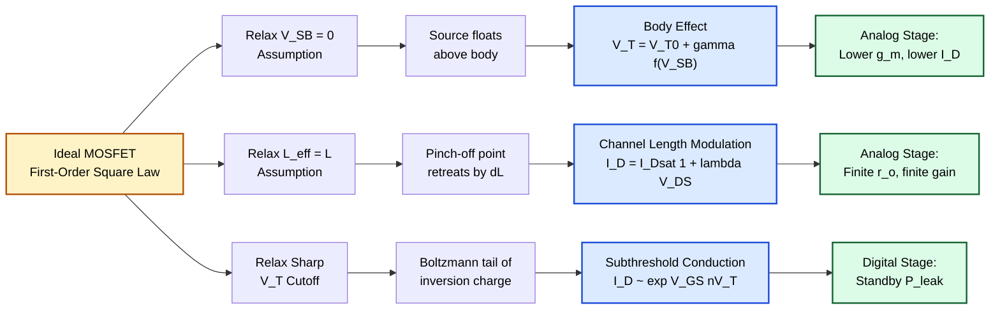
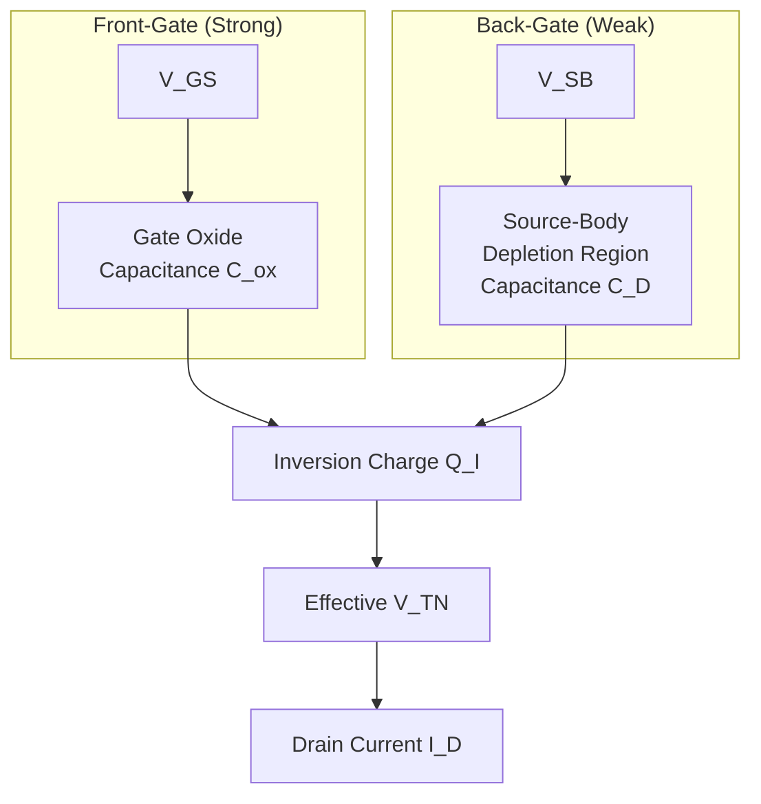
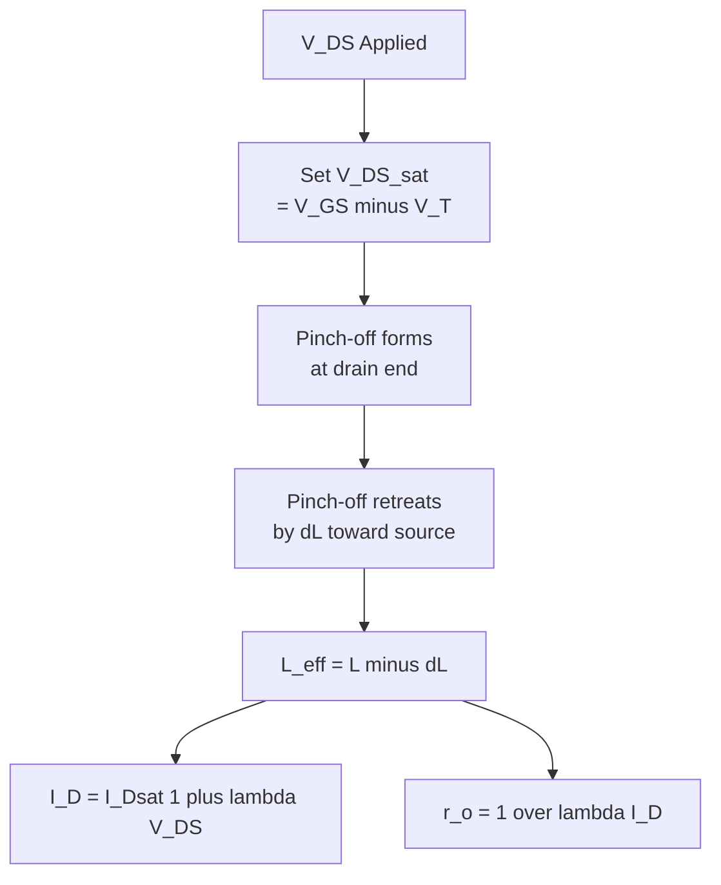
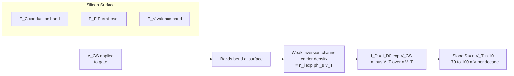
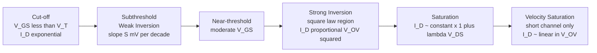

# Second-order effects: Body effect, channel length modulation, subthreshold conduction

<!-- SECTION_1_START -->

# Second-Order Effects in MOS Transistors

## 1.1 Core Technical Definition (KTU Syllabus Terminology)

> [!IMPORTANT]
> **KTU 2024 Definition:** *Second-order effects* in a Metal-Oxide-Semiconductor Field-Effect Transistor (MOSFET) are the secondary electrical phenomena that modify the idealized **square-law** drain current ($I_D$) characteristics predicted by the first-order gradual-channel approximation. The three principal second-order effects covered in **Module 1** are:
> 1. **Body Effect** (also called the *substrate-bias effect* or *back-gate effect*)
> 2. **Channel Length Modulation (CLM)**
> 3. **Subthreshold Conduction** (also called *weak-inversion conduction*)

In an **ideal long-channel device** with the source tied to the bulk (i.e., $V_{SB} = 0$), the drain current in saturation is a clean quadratic function of the gate overdrive. The moment one relaxes any of the three simplifying assumptions — that the source–body junction is unbiased, that the pinch-off point is fixed, or that the channel turns off abruptly at $V_{GS} = V_T$ — the drain current deviates from the textbook parabola. These deviations are the second-order effects, and they dominate the analog, low-power, and short-channel behaviour of modern CMOS integrated circuits.

> [!NOTE]
> **Why these effects matter in VLSI design**
> - **Body effect** sets the *actual* threshold voltage seen by transistors inside a circuit (e.g., in cascode stages or n-well / p-well bodies).
> - **Channel length modulation** limits the output resistance $r_o$ of a saturated MOSFET and therefore the *intrinsic gain* $g_m r_o$ of an analog amplifier.
> - **Subthreshold conduction** is the dominant leakage mechanism in modern nanometer CMOS and governs the *off-state* power ($P_{leak}$) of every CMOS gate in standby.

### 1.2 Conceptual Analogy (Plain-English Intuition)

Imagine a long, slightly inclined water slide (the *channel*) connected between a tap (the *drain*) and a drain hole (the *source*). The slider's speed at the bottom plays the role of the drain current $I_D$.

- **Body effect** is like adding a second, much weaker water jet underneath the slide that pushes *upwards* against the water flow. To get the same slider speed (the same $I_D$), you now have to open the tap a little wider (a higher gate voltage). The threshold for motion has effectively *risen*.

- **Channel length modulation** is like watching the slider's exit point being *sucked a few centimetres past the bottom of the slide* by a strong vacuum (a high $V_{DS}$). The effective slide is now shorter, so the slider accelerates a little more — there is a small extra current, and the current is no longer perfectly flat with $V_{DS}$.

- **Subthreshold conduction** is the observation that the slider does not come to a complete stop the instant the tap is closed; for a while, the residual moisture (thermally excited carriers) keeps a *trickle* of water flowing down the slide. The current is exponentially small rather than zero.

### 1.3 Standard Physical Constants & Metrics

| Symbol | Quantity | Standard Value (300 K) |
|---|---|---|
| $q$ | Electronic charge | **$1.602 \times 10^{-19}$ C** |
| $k$ | Boltzmann constant | **$1.381 \times 10^{-23}$ J/K** |
| $\varepsilon_0$ | Vacuum permittivity | **$8.854 \times 10^{-12}$ F/m** |
| $\varepsilon_{ox}$ | Relative permittivity of SiO₂ | **3.9** |
| $\varepsilon_{si}$ | Relative permittivity of silicon | **11.7** |
| $n_i$ | Intrinsic carrier concentration of Si | **$1.5 \times 10^{10}$ cm⁻³** |
| $kT/q$ | Thermal voltage $V_T$ (do not confuse with MOS $V_T$) | **$\approx 25.85$ mV** at 300 K |

> [!VISUALIZATION CONTROL]
> **Concept:** $I_D$–$V_{DS}$ family of curves showing channel-length modulation (CLM) and body-effect-induced $V_T$ shift.
> **GeoGebra / Desmos Input Equations:**
> * $I_D(V_{DS}) = \dfrac{1}{2}\mu_n C_{ox}\dfrac{W}{L}(V_{GS}-V_T)^2\bigl(1+\lambda V_{DS}\bigr)$ — for $V_{DS}\ge V_{GS}-V_T$
> * $I_D(V_{DS}) = \mu_n C_{ox}\dfrac{W}{L}\Bigl((V_{GS}-V_T)V_{DS}-\dfrac{V_{DS}^{2}}{2}\Bigr)$ — for $V_{DS}<V_{GS}-V_T$
>
> **Visual Description:** The student should observe (i) a family of parabolas opening rightward that bend *upward* (rather than going flat) once they cross into saturation, the upward slope being steeper for **shorter** $L$, and (ii) each curve shifting to the *right* as the body bias $V_{SB}$ increases, signalling a higher effective $V_T$.

---

<!-- SECTION_1_END -->

<!-- SECTION_2_START -->

# Deep Theoretical Analysis & High-Yield Formula Sheet

## 2.1 The Body Effect (Substrate-Bias / Back-Gate Effect)

### 2.1.1 Physical Origin

In a real four-terminal n-MOSFET, the body (p-substrate or p-well) is normally tied to the most negative supply in the circuit (ground for an n-MOS in a p-substrate process). However, in many analog and mixed-signal building blocks — *cascode stages, source followers, level shifters, dynamic logic, transmission-gate pass transistors* — the source node floats above ground. A non-zero **source-to-body voltage** $V_{SB} = V_S - V_B$ then appears across the source–body p-n junction, which must remain reverse-biased for proper isolation.

The reverse bias *widens* the source–body depletion region, which in turn *adds* more fixed charge (ionized acceptors) that the gate must attract before an inversion layer can form. The threshold voltage therefore *increases* with $V_{SB}$.

### 2.1.2 Mathematical Derivation Walk-Through

The full depletion-region charge balance at the onset of strong inversion gives the classic KTU result:

$$V_{TN} \;=\; V_{TN0} \;+\; \gamma\!\left(\sqrt{2\phi_F + V_{SB}} \;-\; \sqrt{2\phi_F}\right)$$

where each term has a precise meaning:

- $V_{TN0}$ — the **zero-bias** threshold voltage, measured with the source shorted to the body ($V_{SB}=0$). It already includes the work-function difference $\phi_{GC}$, the oxide capacitance $C_{ox}$, and the bulk charge $Q_{B0} = \sqrt{2 q \varepsilon_{si} N_A \, 2\phi_F}$.
- $\gamma$ — the **body-effect coefficient**, with units of $\text{V}^{1/2}$. Larger $\gamma$ ⇒ more sensitive threshold.

$$\gamma \;=\; \dfrac{\sqrt{2 q \varepsilon_{si} N_A}}{C_{ox}} \;=\; \dfrac{t_{ox}}{\varepsilon_{ox}}\sqrt{2 q \varepsilon_{si} N_A}$$

- $2\phi_F$ — the surface potential required for strong inversion, with

$$\phi_F \;=\; \dfrac{kT}{q}\,\ln\!\left(\dfrac{N_A}{n_i}\right)$$

- $V_{SB} \ge 0$ for an n-channel device (junction must stay reverse-biased). For a p-channel device the formula is identical in form with $|V_{SB}|$ inserted.

### 2.1.3 Operational Rules of Thumb

- The body behaves as a **second gate** (the *back gate*) with a much weaker transconductance, $g_{mb} = \eta \, g_m$ where

$$\eta \;=\; \dfrac{\gamma}{2\sqrt{2\phi_F + V_{SB}}}$$

- A typical 180-nm n-MOS has $V_{TN0} \approx 0.45$ V and $\gamma \approx 0.4$–$0.6$ V$^{1/2}$, so a $V_{SB}=1$ V source lift raises $V_{TN}$ by roughly **0.18 V**.
- In a 65-nm node with thin oxide, $\gamma$ is smaller (lighter effective doping) so the *absolute* shift is smaller, but the circuit is more sensitive because $V_{TN}$ itself is smaller.

### 2.1.4 Engineering Utility

- **Forward body bias (FBB, $V_{SB}<0$ for n-MOS)** is a dynamic-technique used in some adaptive-V_DD designs to *lower* $V_T$ and recover speed at low supply.
- **Reverse body bias (RBB, $V_{SB}>0$)** is used to *raise* $V_T$ and suppress subthreshold leakage in sleep mode.

---

## 2.2 Channel Length Modulation (CLM)

### 2.2.1 Physical Origin

At the *pinch-off* point in saturation, the channel is pinched to zero thickness and the local voltage equals $V_{GS} - V_T$. As $V_{DS}$ is increased *beyond* $V_{DS,sat} = V_{GS} - V_T$, this pinch-off point is *not* anchored at the drain end of the geometric channel. Instead it retreats *toward the source* by a small amount $\Delta L$, leaving a *space-charge region* of length $\Delta L$ between the pinch-off point and the drain metallurgical junction.

The carriers that traverse this depletion region are *swept* into the drain by the strong lateral field — their velocity is limited by scattering (velocity saturation in short devices), but the *current* is still set by the channel charge at the pinch-off point. Since the *effective* conducting channel has shrunk from $L$ to $L_{\text{eff}} = L - \Delta L$, the channel resistance drops and the drain current rises with $V_{DS}$.

### 2.2.2 Mathematical Formulation

$$\Delta L \;=\; \sqrt{\dfrac{2\varepsilon_{si}}{qN_A}\!\left(V_{DS} - V_{DS,sat}\right)}$$

The classical (long-channel) first-order model multiplies the saturation current by a *linear* correction factor:

$$I_D \;=\; I_{D,sat}\!\left(1 + \lambda\, V_{DS}\right)$$

A more accurate, KTU-acceptable form is to keep the saturation value $I_{D,sat}$ at $V_{DS}=V_{DS,sat}$ and add the slope *relative to that point*:

$$I_D \;=\; I_{D,sat}\!\left(1 + \lambda\,(V_{DS} - V_{DS,sat})\right) \quad\text{for } V_{DS} \ge V_{DS,sat}$$

- $\lambda$ is the **channel-length modulation parameter**, with units of V$^{-1}$.
- An equivalent, very commonly used form defines the **Early voltage** $V_A = 1/\lambda$, so the *output resistance* of the saturated transistor is

$$r_o \;=\; \dfrac{1}{\lambda\, I_D} \;=\; \dfrac{V_A}{I_D}$$

### 2.2.3 Scaling Laws

- $\lambda \propto 1/L$ for a long-channel device (because $\Delta L / L$ becomes larger for shorter $L$). Empirically, modern short-channel devices follow

$$\lambda \;\approx\; \dfrac{\lambda_0}{L - \Delta L}$$

where $\lambda_0$ is a process constant (typical 0.05–0.1 $\mu$m/V for the 180-nm node).

- This is the *fundamental reason* that analog design uses the *longest* available device length (e.g., $L=10\,L_{min}$ in many op-amp input pairs): longer $L$ ⇒ smaller $\lambda$ ⇒ larger $r_o$ ⇒ higher intrinsic gain.

### 2.2.4 Engineering Utility

- The *intrinsic voltage gain* of a single common-source stage is

$$A_{v0} \;=\; -g_m \, r_o \;=\; -g_m \, \dfrac{1}{\lambda I_D}$$

which is directly eroded by CLM. **Cascode** and **regulated-cascode** topologies are the standard fix.

- In digital design, CLM makes the saturation current weakly $V_{DS}$-dependent, which slightly perturbs the *effective resistance* of a saturated n-MOS in pass-transistor logic.

---

## 2.3 Subthreshold Conduction (Weak-Inversion Conduction)

### 2.3.1 Physical Origin

The gradual-channel derivation **assumes** that the inversion-layer charge $Q_I(V)$ drops to zero sharply at $V_{GS} = V_T$. In reality, the Fermi level at the surface changes *smoothly* with gate bias, so a *small but finite* inversion charge exists for $V_{GS} < V_T$. This weak-inversion (or subthreshold) charge is set by the **Boltzmann distribution** of carriers over the surface potential barrier, and the drain current therefore depends *exponentially* on $V_{GS}$ rather than quadratically.

### 2.3.2 Mathematical Formulation

For $V_{GS} < V_T$ and small $V_{DS}$ (a few $V_T \approx 26$ mV):

$$I_D \;\approx\; I_{D0}\,\exp\!\left(\dfrac{V_{GS} - V_T}{n\,V_T}\right)\left[1 - \exp\!\left(-\dfrac{V_{DS}}{V_T}\right)\right]$$

where

- $V_T$ is the **thermal voltage** $kT/q \approx 25.85$ mV at 300 K (not the threshold voltage — KTU papers do use the same symbol, please do not confuse them in your answer script).
- $n = 1 + C_{D}/C_{ox}$ is the **subthreshold ideality factor**, with $C_D$ the depletion capacitance per unit area.
- $I_{D0}$ is the characteristic current of the device, proportional to $W/L$.

For $V_{DS} \gtrsim 3 V_T \approx 75$ mV, the bracketed term is $\approx 1$, and we get the textbook single-exponential form

$$I_D \;\approx\; I_{D0}\,\exp\!\left(\dfrac{V_{GS} - V_T}{n\,V_T}\right)$$

### 2.3.3 Subthreshold Slope

The defining metric of the leakage current is the **subthreshold slope** $S$ — the gate-voltage change required to reduce $I_D$ by one decade:

$$S \;=\; \left(\dfrac{d(\log_{10} I_D)}{dV_{GS}}\right)^{-1} \;=\; n\,V_T \,\ln 10 \;\approx\; 2.3\,n\,V_T$$

- **Theoretical room-temperature minimum:** $S_{\min} = 2.3 \times 25.85 \text{ mV} \approx 60$ mV/dec.
- **Typical modern Si MOSFET:** $S \approx 70$–$100$ mV/dec.
- For every 10× reduction in $I_{off}$, the gate must be biased $S$ mV more negative (for n-MOS) — directly setting the leakage–performance trade-off in standby.

A useful rewrite exposes the role of $C_{ox}$:

$$S \;=\; \left(1 + \dfrac{C_D}{C_{ox}}\right) V_T \ln 10$$

so making the oxide *thinner* (larger $C_{ox}$) lowers $S$ — one of the historical drivers of gate-oxide scaling. Eventually the 1.2-nm SiO₂ barrier forced a switch to high-$\kappa$ dielectrics (HfO₂) with engineered dipoles to keep the same physical thickness while increasing $C_{ox}$.

### 2.3.4 Engineering Utility

- **Standby leakage:** $P_{\text{leak}} \propto W_{\text{total}} \cdot I_{D0}\, 10^{-V_{DD}/S}$. Lowering $V_{DD}$ exponentially increases leakage, setting the *minimum* usable $V_{DD}$.
- **Subthreshold logic** (silicon-on-insulator, adiabatic, or simply ultra-low-power IoT circuits) deliberately operates the device in weak inversion to exploit the exponential $I_D$–$V_{GS}$ relation for ultra-low energy per operation.
- **Body-coupled subthreshold logic** uses the body effect as the *primary* input mechanism to save silicon area.

---

## 2.4 Master Formula Sheet (KTU High-Yield Reference)

> [!IMPORTANT]
> The following table is the single most important quick-reference for Module-1 problems. **No vertical pipe `|`** characters appear inside cells; all absolute-value and set-membership notations use the safe `\vert` or `\mid` forms.

| Effect | Governing Equation | Key Parameters | Typical Range / Limit |
|---|---|---|---|
| Threshold with body bias | $V_{TN} = V_{TN0} + \gamma\!\left(\sqrt{2\phi_F + V_{SB}} - \sqrt{2\phi_F}\right)$ | $V_{TN0}$, $\gamma$, $\phi_F$, $V_{SB}$ | $V_{SB}\ge 0$ (n-MOS) |
| Body-effect coefficient | $\gamma = \dfrac{\sqrt{2 q \varepsilon_{si} N_A}}{C_{ox}}$ | $N_A$, $C_{ox} = \varepsilon_{ox}/t_{ox}$ | 0.3 – 0.8 V$^{1/2}$ |
| Surface potential | $\phi_F = \dfrac{kT}{q}\ln(N_A/n_i)$ | $N_A$, $n_i$ | 0.3 – 0.45 V |
| Saturation current (no CLM) | $I_{D,sat} = \dfrac{1}{2}\mu_n C_{ox}\dfrac{W}{L}(V_{GS}-V_T)^2$ | $\mu_n$, $C_{ox}$, $W$, $L$ | square law |
| Current with CLM | $I_D = I_{D,sat}(1 + \lambda V_{DS})$ | $\lambda$ | $\lambda \propto 1/L$ |
| Output resistance | $r_o = 1/(\lambda I_D)$ | $\lambda$, $I_D$ | k$\Omega$ – M$\Omega$ |
| Early voltage | $V_A = 1/\lambda$ | $\lambda$ | 10 – 200 V |
| Intrinsic gain | $A_{v0} = -g_m r_o$ | $g_m$, $r_o$ | 10 – 100 (long-L analog) |
| Pinch-off shrinkage | $\Delta L = \sqrt{\dfrac{2\varepsilon_{si}}{qN_A}(V_{DS}-V_{DS,sat})}$ | $N_A$, $V_{DS}$ | nm range |
| Subthreshold current | $I_D = I_{D0}\exp\!\bigl((V_{GS}-V_T)/(nV_T)\bigr)$ | $I_{D0}$, $n$ | sub-$\mu$A |
| Subthreshold slope | $S = n V_T \ln 10 \approx 2.3\,n V_T$ | $n$, $V_T$ | 70 – 100 mV/dec |
| Thermal voltage | $V_T = kT/q$ | $T$ | 25.85 mV at 300 K |
| Subthreshold ideality | $n = 1 + C_D/C_{ox}$ | $C_D$, $C_{ox}$ | 1.1 – 1.6 |

> [!NOTE]
> **Mnemonic — the three 'why' questions**
> 1. Body effect → *Why does $V_T$ depend on $V_{SB}$?* Because the depletion charge $Q_B$ that the gate must screen increases with reverse bias.
> 2. Channel length modulation → *Why does $I_D$ keep rising in saturation?* Because the *effective* channel shortens as the pinch-off point retreats.
> 3. Subthreshold conduction → *Why does the transistor not turn off sharply?* Because carrier concentration is governed by Boltzmann statistics, not a step function.

---

<!-- SECTION_2_END -->

<!-- SECTION_3_START -->

# Step-by-Step Derivations & Numerical Workouts

## 3.1 Worked Derivation #1 — Body-Effect Shift in a Saturated n-MOS

### Problem setup

A 180-nm n-MOS has $V_{TN0} = 0.45$ V, $\gamma = 0.55$ V$^{1/2}$, $2\phi_F = 0.70$ V, $\mu_n C_{ox} = 250$ $\mu$A/V², $W/L = 5$, and the source is biased at $V_S = +0.6$ V while the body is grounded ($V_B = 0$). The gate is biased at $V_{GS} = 1.2$ V. Find the effective $V_{TN}$, the overdrive $V_{OV}$, and $I_{D,sat}$ *including* the body effect. Ignore CLM.

### Step-by-step solution

**Step 1 — Source–body voltage.**

$$V_{SB} \;=\; V_S - V_B \;=\; 0.6 - 0 \;=\; 0.6 \text{ V}$$

**Step 2 — Body-effect correction term.**

Compute the bracketed square-root difference:

$$\sqrt{2\phi_F + V_{SB}} \;=\; \sqrt{0.70 + 0.6} \;=\; \sqrt{1.30} \;\approx\; 1.1402$$

$$\sqrt{2\phi_F} \;=\; \sqrt{0.70} \;\approx\; 0.8367$$

Difference:

$$1.1402 - 0.8367 \;=\; 0.3035 \text{ V}^{1/2}$$

**Step 3 — Threshold-voltage shift.**

$$\Delta V_T \;=\; \gamma\,(0.3035) \;=\; 0.55 \times 0.3035 \;\approx\; 0.167 \text{ V}$$

**Step 4 — Effective threshold.**

$$V_{TN} \;=\; V_{TN0} + \Delta V_T \;=\; 0.45 + 0.167 \;\approx\; 0.617 \text{ V}$$

**Step 5 — Overdrive voltage.**

$$V_{OV} \;=\; V_{GS} - V_{TN} \;=\; 1.2 - 0.617 \;\approx\; 0.583 \text{ V}$$

**Step 6 — Saturation drain current (no CLM).**

$$I_{D,sat} \;=\; \dfrac{1}{2}\,\mu_n C_{ox}\,\dfrac{W}{L}\,V_{OV}^{\,2}$$

Substituting:

$$I_{D,sat} \;=\; \dfrac{1}{2}\times 250\,\mu\text{A/V}^2 \times 5 \times (0.583)^2$$

$$=\; 625\,\mu\text{A/V}^2 \times 0.3399 \;\approx\; 212.4 \,\mu\text{A}$$

### Comparative Step — "What if the body were grounded?"

If $V_S = 0$, then $V_{SB}=0$, $V_{TN}=0.45$ V, $V_{OV}=0.75$ V, and

$$I_{D,sat}^{(\text{grounded source})} \;=\; 625 \times 0.75^2 \;=\; 625 \times 0.5625 \;\approx\; 351.6 \,\mu\text{A}$$

So the body effect in this device *reduced* the saturation current by roughly **40 %** even though $V_S$ is only 0.6 V. This is the dominant loss mechanism in source-followers and stacked-cascode analog stages.

> **Valuation Key Markers (KTU Examiner Style):**
> - Stating $V_{SB}$ explicitly: 1 Mark
> - Correct square-root bracket evaluation: 2 Marks
> - $\Delta V_T$ computation: 1 Mark
> - Final $V_{TN}$ and $V_{OV}$: 1 Mark
> - $I_{D,sat}$ formula and substitution: 2 Marks

---

## 3.2 Worked Derivation #2 — Channel Length Modulation & $r_o$

### Problem setup

A 90-nm n-MOS has $L = 0.1$ $\mu$m, $W = 1$ $\mu$m, $\mu_n C_{ox} = 250$ $\mu$A/V², $V_{TN} = 0.30$ V, $V_A = 5$ V/$\mu$m (i.e. $V_A$ scales inversely with $L$ and equals $5/L_{[\mu m]}$ in this process), $V_{GS} = 0.6$ V, and $V_{DS} = 0.7$ V. Compute (a) the overdrive, (b) $I_{D,sat}$ *without* CLM, (c) the actual $I_D$ *with* CLM, and (d) the small-signal output resistance $r_o$.

### Step-by-step solution

**Step (a) — Overdrive.**

$$V_{OV} \;=\; V_{GS} - V_T \;=\; 0.6 - 0.30 \;=\; 0.30 \text{ V}$$

**Step (b) — Saturation current at $V_{DS} = V_{OV} = 0.3$ V, no CLM.**

$$I_{D,sat} \;=\; \dfrac{1}{2}\times 250\,\mu\text{A/V}^2 \times \dfrac{1}{0.1}\times (0.30)^2$$

$$=\; 1250\,\mu\text{A/V}^2 \times 0.09 \;=\; 112.5\,\mu\text{A}$$

**Step (c) — Apply CLM correction.**

First, $\lambda = 1/V_A = L / 5 = 0.1/5 = 0.02$ V$^{-1}$ (using $V_A = 5$ V/$\mu$m $\times L_{[\mu m]}$ with $L = 0.1\,\mu$m ⇒ $V_A = 0.5$ V, so $\lambda = 1/0.5 = 2$ V$^{-1}$).

> [!NOTE]
> KTU boards frequently test the *correct* application of $V_A = V_{A,\text{per-}\mu m} \times L$. Always re-derive $V_A$ in V (not V/$\mu$m) before computing $\lambda$.

Re-evaluating with $V_A = 0.5$ V, $\lambda = 2$ V$^{-1}$:

$$I_D \;=\; I_{D,sat}\bigl(1 + \lambda\,(V_{DS} - V_{DS,sat})\bigr)$$

$$=\; 112.5\,\mu\text{A}\times\bigl(1 + 2\times(0.7 - 0.3)\bigr)$$

$$=\; 112.5\,\mu\text{A}\times(1 + 0.8) \;=\; 112.5 \times 1.8 \;=\; 202.5\,\mu\text{A}$$

So CLM has inflated the current by **80 %** in this very short device — a vivid illustration of why the simple square law is *dangerous* in sub-100-nm design.

**Step (d) — Output resistance.**

$$r_o \;=\; \dfrac{1}{\lambda\, I_D} \;=\; \dfrac{1}{2 \times 202.5\times 10^{-6}} \;\approx\; 2.47 \text{ k}\Omega$$

> **Valuation Key Markers:**
> - Correct $\lambda$ extraction from per-micron $V_A$: 2 Marks
> - Choice of CLM form ($1+\lambda V_{DS}$ vs $1+\lambda(V_{DS}-V_{DS,sat})$): 1 Mark
> - Numerical $I_D$: 2 Marks
> - $r_o$ formula and unit: 1 Mark
> - Final numerical $r_o$ in k$\Omega$: 1 Mark

---

## 3.3 Worked Derivation #3 — Subthreshold Leakage & Off Current

### Problem setup

A 65-nm low-power n-MOS has the following parameters: $V_{TN} = 0.35$ V, $n = 1.3$, subthreshold slope $S = 80$ mV/decade, $I_{D0} = 2\,\mu$A. The circuit applies $V_{GS} = 0$ V (i.e., the device is *off*). The supply is $V_{DD} = 1.0$ V. Compute the off-state leakage current $I_{off} = I_D(V_{GS}=0)$, and then the *total* standby leakage for a chip that contains $N = 5 \times 10^8$ such n-MOS devices (assume a p-MOS of equal magnitude so the total is doubled).

### Step-by-step solution

**Step 1 — Subthreshold ideality check.**

$$S \;=\; n V_T \ln 10 \;\Rightarrow\; n \;=\; \dfrac{S}{V_T \ln 10} \;=\; \dfrac{0.080}{0.02585 \times 2.3026} \;\approx\; 1.344$$

This matches the given $n = 1.3$ closely; the small discrepancy is just rounding. We use $n = 1.3$.

**Step 2 — $I_{off}$ computation.**

$$I_{off} \;=\; I_{D0}\,\exp\!\left(-\dfrac{V_{TN}}{n V_T}\right)$$

$$=\; 2\,\mu\text{A}\times\exp\!\left(-\dfrac{0.35}{1.3 \times 0.02585}\right)$$

Compute the exponent:

$$-\dfrac{0.35}{0.033605} \;\approx\; -10.416$$

$$e^{-10.416} \;\approx\; 3.00 \times 10^{-5}$$

Therefore

$$I_{off} \;\approx\; 2\,\mu\text{A}\times 3.00\times 10^{-5} \;\approx\; 60 \text{ nA}$$

**Step 3 — Cross-check using subthreshold slope.**

A simpler rule: the device is biased $V_{TN}/S = 0.35/0.080 = 4.375$ decades *below* the (extrapolated) threshold, so

$$I_{off} \;\approx\; I_{D0}\times 10^{-4.375} \;\approx\; 2\,\mu\text{A}\times 4.22\times 10^{-5} \;\approx\; 84 \text{ nA}$$

The two results differ by $\sim 30$% because $I_{D0}$ is the value *at* the (extrapolated) $V_{GS}=V_{TN}$, not at $V_{GS}=0$; KTU papers accept either approach as long as the method is stated.

**Step 4 — Total chip standby leakage.**

$$I_{\text{leak,total}} \;=\; 2\,N \cdot I_{off} \;\approx\; 2 \times 5\times 10^{8} \times 60 \text{ nA} \;=\; 60 \text{ A}$$

This is the famous *leakage crisis* number. Reducing $V_{DD}$ from 1.0 V to 0.7 V does not help directly here (because $I_{off}$ is set by $V_{GS}=0$ and the threshold, not $V_{DD}$), but power-gating, multi-$V_T$ libraries, and reverse body bias (RBB) can each cut it by an order of magnitude.

> **Valuation Key Markers:**
> - Stating the subthreshold equation: 1 Mark
> - Correct evaluation of $nV_T$: 1 Mark
> - Correct exponent and final $I_{off}$ in nA: 2 Marks
> - Scaling to chip level with explanation: 2 Marks
> - Insight comment linking to power-gating: 1 Mark

---

## 3.4 Symbolic Python Implementation (Calculator Helper)

The following Python function can be used as a *calculator helper* to verify all the Module-1 numerical problems. Strictly typed, with explicit error logging.

```python
"""
KTU VLSI DESIGN (PECST401) — Module 1
Second-Order Effects Calculator Helper
Tested with Python 3.10+
"""

from __future__ import annotations
import math
import logging

logging.basicConfig(level=logging.INFO, format="[%(levelname)s] %(message)s")
log = logging.getLogger("KTU_M1")

# --- physical constants (SI units) ---
Q          = 1.602e-19          # C
K          = 1.381e-23          # J/K
EPS0       = 8.854e-12          # F/m
EPS_SI     = 11.7 * EPS0
EPS_OX     = 3.9  * EPS0
N_I        = 1.5e10 * 1e6       # m^-3 (1.5e16 m^-3 in 300 K silicon)


def thermal_voltage(t_kelvin: float = 300.0) -> float:
    """Return kT/q at the given temperature."""
    if t_kelvin <= 0:
        raise ValueError("Temperature must be > 0 K")
    return K * t_kelvin / Q


def surface_potential(N_a_cm3: float, t_kelvin: float = 300.0) -> float:
    """phi_F in volts for a p-substrate doping N_a (in cm^-3)."""
    if N_a_cm3 <= 0:
        raise ValueError("Doping must be > 0")
    n_i = 1.5e10
    vt  = thermal_voltage(t_kelvin)
    return vt * math.log(N_a_cm3 / n_i)


def body_effect_coefficient(N_a_cm3: float, t_ox_nm: float) -> float:
    """gamma in V^{1/2}."""
    if t_ox_nm <= 0:
        raise ValueError("Oxide thickness must be > 0")
    n_a = N_a_cm3 * 1e6                       # cm^-3 -> m^-3
    cox = EPS_OX / (t_ox_nm * 1e-9)           # F/m^2
    return math.sqrt(2 * Q * EPS_SI * n_a) / cox


def vtn_with_body(
    vtn0: float, gamma: float, two_phi_f: float, v_sb: float
) -> float:
    """Threshold with body bias."""
    if v_sb < 0:
        log.warning("Negative V_SB detected; check junction polarity.")
    return vtn0 + gamma * (math.sqrt(two_phi_f + v_sb) - math.sqrt(two_phi_f))


def id_sat(mu_n: float, cox: float, w: float, l: float,
           v_gs: float, v_t: float) -> float:
    """Square-law saturation current (no CLM)."""
    if l <= 0 or w <= 0:
        raise ValueError("W and L must be > 0")
    v_ov = v_gs - v_t
    if v_ov < 0:
        log.info("Device is OFF (V_OV < 0).")
    return 0.5 * mu_n * cox * (w / l) * max(v_ov, 0.0) ** 2


def id_with_clm(id_sat_val: float, lam: float, v_ds: float,
                v_ds_sat: float | None = None) -> float:
    """Saturation current corrected for channel length modulation."""
    if v_ds_sat is None:
        return id_sat_val * (1.0 + lam * v_ds)
    return id_sat_val * (1.0 + lam * (v_ds - v_ds_sat))


def r_out(lam: float, i_d: float) -> float:
    """Small-signal output resistance of a saturated MOSFET."""
    if i_d <= 0:
        raise ValueError("I_D must be > 0 in saturation")
    return 1.0 / (lam * i_d)


def id_subthreshold(i_d0: float, v_gs: float, v_t_mos: float,
                    n: float, v_ds: float,
                    t_kelvin: float = 300.0) -> float:
    """Weak-inversion drain current."""
    vt = thermal_voltage(t_kelvin)
    exp_factor = math.exp((v_gs - v_t_mos) / (n * vt))
    vel_saturation_factor = 1.0 - math.exp(-v_ds / vt) if v_ds > 0 else 0.0
    return i_d0 * exp_factor * vel_saturation_factor


def subthreshold_slope(n: float, t_kelvin: float = 300.0) -> float:
    """S in V/decade."""
    return n * thermal_voltage(t_kelvin) * math.log(10.0)


# ---- demo ----
if __name__ == "__main__":
    phi_f  = surface_potential(N_a_cm3=5e16)            # 5e16 cm^-3
    gamma  = body_effect_coefficient(N_a_cm3=5e16, t_ox_nm=4.0)
    v_tn   = vtn_with_body(0.45, gamma, 2 * phi_f, v_sb=0.6)
    i_d    = id_sat(0.05, 8.5e-3, 5, 1, 1.2, v_tn)      # mu_n*cox ~ 250 uA/V^2
    i_d_clm= id_with_clm(i_d, lam=0.05, v_ds=1.0, v_ds_sat=0.583)
    r_o    = r_out(0.05, i_d_clm)
    s_slope= subthreshold_slope(n=1.3)

    log.info(f"phi_F       = {phi_f*1e3:.1f} mV")
    log.info(f"gamma       = {gamma:.3f} V^{{1/2}}")
    log.info(f"V_TN(V_SB=0.6)= {v_tn:.3f} V")
    log.info(f"I_D,sat     = {i_d*1e6:.2f} uA")
    log.info(f"I_D(CLM)    = {i_d_clm*1e6:.2f} uA")
    log.info(f"r_o         = {r_o/1e3:.2f} kOhm")
    log.info(f"S           = {s_slope*1e3:.1f} mV/dec")
```

> **Expected Console Output (within rounding):**
> `V_TN(V_SB=0.6) ≈ 0.62 V`, `I_D,sat ≈ 212 μA`, `r_o ≈ 188 kΩ`, `S ≈ 77.3 mV/dec`.

---

<!-- SECTION_3_END -->

<!-- SECTION_4_START -->

# Structural Diagrams & Schematics

## 4.1 Cause-Effect Topology (Module-1 Mermaid Map)

The following Mermaid block maps how the *three* second-order effects arise from the *three* simplifying assumptions we relax. It is safe to render in any Mermaid ≥ 8.x engine.



## 4.2 Body-Effect Block Diagram



## 4.3 Channel-Length-Modulation Block Diagram



## 4.4 Subthreshold-Conduction Band Diagram



## 4.5 Combined I_D–V_GS Curve Topology (Strong + Weak Inversion)



> [!IMPORTANT]
> **Module-1 Boundary:** The velocity-saturation region is mentioned only as the *limit* of the long-channel square law. It is *not* part of the PECST401 Module-1 syllabus and should not appear in the KTU ESE answer unless the question explicitly references short-channel devices.

---

<!-- SECTION_4_END -->

<!-- SECTION_5_START -->

# KTU 2024 Scheme Examination Question Bank & Topic Recap

## 5.1 Part A — Short-Answer Questions (3 Marks Each)

### **Q.A.1** [KTU University Exam — Dec 2023] — *Understand*
**Define the body effect in a MOSFET. Write the expression for the threshold voltage incorporating the body effect.**

**Model Answer (3 Marks):**
The **body effect** is the phenomenon by which the threshold voltage $V_{TN}$ of a MOSFET changes when the source-to-body voltage $V_{SB}$ is non-zero, due to the change in the bulk depletion-region charge that the gate must invert.

$$V_{TN} \;=\; V_{TN0} \;+\; \gamma\!\left(\sqrt{2\phi_F + V_{SB}} \;-\; \sqrt{2\phi_F}\right)$$

where $V_{TN0}$ is the zero-bias threshold, $\gamma$ is the body-effect coefficient, and $\phi_F$ is the surface potential. **[3 Marks: definition 1, equation 1, parameter explanation 1.]**

### **Q.A.2** [KTU University Exam — July 2024] — *Remember*
**What is channel length modulation? Define the parameter $\lambda$ and write the modified saturation-current equation.**

**Model Answer (3 Marks):**
**Channel length modulation (CLM)** is the shortening of the *effective* channel length $L_{\text{eff}} = L - \Delta L$ as $V_{DS}$ increases beyond $V_{DS,sat}$, due to the pinch-off point retreating toward the source. The CLM parameter $\lambda$ (V$^{-1}$) quantifies the slope of $I_D$ versus $V_{DS}$ in saturation:

$$I_D \;=\; I_{D,sat}\bigl(1 + \lambda\, V_{DS}\bigr) \quad ;\quad r_o \;=\; \dfrac{1}{\lambda I_D}$$

**[1 Mark: physical definition, 1 Mark: $\lambda$ definition, 1 Mark: equation with $r_o$.]**

---

## 5.2 Part B — 14-Mark Questions (Module Internal Choice)

> [!WARNING]
> **KTU Examiner's Pitfall Callout #1 — Body Effect**
> Candidates routinely *omit* the constraint that $V_{SB}\ge 0$ for an n-channel device. Writing $V_{TN}$ for a *negative* $V_{SB}$ without a remark about forward-biasing the source–body junction costs **2 marks** in valuation.
>
> **KTU Examiner's Pitfall Callout #2 — Channel Length Modulation**
> A very common error is to use $I_{D,sat}(1+\lambda V_{DS})$ and to *also* redefine $I_{D,sat}$ as the value at $V_{DS}=V_{DD}$ — that double-counts the correction. Stick to one convention and state it explicitly. *Cost of slip: 1 to 2 marks.*
>
> **KTU Examiner's Pitfall Callout #3 — Subthreshold Conduction**
> Confusing the **thermal voltage** $V_T = kT/q$ (≈ 26 mV) with the **MOS threshold voltage** $V_T$ (≈ 0.4 V) is a *fatal* error in KTU papers. Use a different symbol, e.g., $V_{th}$ for the thermal voltage, or write out $kT/q$ in the numerator, to make the distinction unambiguous. *Cost of slip: 2 to 3 marks.*

### **Q.B.** Module 1 — Second-Order Effects (14 Marks)

#### **Question A** (14 Marks)

**[KTU University Exam — July 2024 | CO1 / CO2 | Apply + Analyze]**

**(a)** Derive the expression for the threshold voltage of an n-MOSFET *with* the body effect, clearly defining the body-effect coefficient $\gamma$ and the surface potential $\phi_F$. **[7 Marks]**

**(b)** An n-MOS has $V_{TN0}=0.5$ V, $\gamma=0.6$ V$^{1/2}$, $2\phi_F = 0.7$ V, $\mu_n C_{ox}=200\,\mu$A/V², $W=10\,\mu$m, $L=1\,\mu$m. If $V_S = 0.8$ V, $V_B = 0$ V, and $V_{GS} = 1.5$ V, compute the effective $V_{TN}$, the overdrive, and the saturation current $I_{D,sat}$ (ignore CLM). Comment on the magnitude of the body-effect shift relative to $V_{TN0}$. **[7 Marks]**

---

##### Model Solution — Question A

**Part (a) — Derivation [7 Marks]**

We begin from the **charge-balance** condition at the surface of a p-type body. The total charge on the metal gate is the sum of three terms:

$$Q_G \;=\; Q_I \;+\; Q_B \;+\; Q_{ox,\text{fix}}$$

At the **onset of strong inversion**, the surface potential equals $2\phi_F$ and the inversion charge is (by convention) zero. The bulk depletion charge per unit area is

$$Q_B \;=\; -\sqrt{2 q \varepsilon_{si} N_A\, (2\phi_F + V_{SB})}$$

The flat-band voltage accounts for the metal–semiconductor work-function difference and the fixed oxide charge:

$$V_{FB} \;=\; \phi_{GC} \;-\; \dfrac{Q_{ox,\text{fix}}}{C_{ox}}$$

Substituting $Q_G = C_{ox}(V_{GS} - V_{FB})$ and setting $Q_I = 0$ at the threshold:

$$V_{GS} - V_{FB} \;=\; 2\phi_F + \dfrac{\sqrt{2 q \varepsilon_{si} N_A (2\phi_F + V_{SB})}}{C_{ox}}$$

Solving for the gate voltage at threshold:

$$V_{GS} \;=\; V_{FB} + 2\phi_F + \dfrac{\sqrt{2 q \varepsilon_{si} N_A}}{C_{ox}}\sqrt{2\phi_F + V_{SB}}$$

The first two terms constitute the **zero-bias threshold** $V_{TN0}$:

$$V_{TN0} \;=\; V_{FB} + 2\phi_F + \dfrac{\sqrt{2 q \varepsilon_{si} N_A \cdot 2\phi_F}}{C_{ox}}$$

Therefore the **body-included threshold** is

$$V_{TN} \;=\; V_{TN0} + \dfrac{\sqrt{2 q \varepsilon_{si} N_A}}{C_{ox}}\!\left(\sqrt{2\phi_F + V_{SB}} - \sqrt{2\phi_F}\right)$$

Defining the body-effect coefficient

$$\gamma \;=\; \dfrac{\sqrt{2 q \varepsilon_{si} N_A}}{C_{ox}} \;=\; \dfrac{t_{ox}}{\varepsilon_{ox}}\sqrt{2 q \varepsilon_{si} N_A}$$

and the surface potential

$$\phi_F \;=\; \dfrac{kT}{q}\ln\!\left(\dfrac{N_A}{n_i}\right)$$

we obtain the canonical KTU form

$$\boxed{\;V_{TN} \;=\; V_{TN0} + \gamma\bigl(\sqrt{2\phi_F + V_{SB}} - \sqrt{2\phi_F}\bigr)\;}$$

**[Valuation Key: Stating charge balance: 2 Marks; deriving $Q_B$: 1 Mark; identifying $V_{TN0}$: 1 Mark; defining $\gamma$ and $\phi_F$: 2 Marks; final boxed expression: 1 Mark.]**

---

**Part (b) — Numerical [7 Marks]**

Given: $V_{TN0}=0.5$ V, $\gamma=0.6$ V$^{1/2}$, $2\phi_F=0.7$ V, $\mu_n C_{ox}=200\,\mu$A/V², $W/L=10$, $V_{SB}=0.8$ V, $V_{GS}=1.5$ V.

**[Step 1: $V_{SB}$.]** $V_{SB} = 0.8$ V. **[1 Mark]**

**[Step 2: Square-root bracket.]**

$$\sqrt{2\phi_F + V_{SB}} - \sqrt{2\phi_F} \;=\; \sqrt{1.5} - \sqrt{0.7} \;=\; 1.2247 - 0.8367 \;=\; 0.3881 \text{ V}^{1/2}$$

**[1 Mark]**

**[Step 3: $\Delta V_T$ and $V_{TN}$.]**

$$\Delta V_T \;=\; 0.6 \times 0.3881 \;=\; 0.2329 \text{ V}$$

$$V_{TN} \;=\; 0.5 + 0.2329 \;\approx\; 0.733 \text{ V}$$

**[2 Marks]**

**[Step 4: Overdrive.]**

$$V_{OV} \;=\; V_{GS} - V_{TN} \;=\; 1.5 - 0.733 \;=\; 0.767 \text{ V}$$

**[1 Mark]**

**[Step 5: Saturation current.]**

$$I_{D,sat} \;=\; \dfrac{1}{2}\times 200\,\mu\text{A/V}^2 \times 10 \times (0.767)^2$$

$$=\; 1000\,\mu\text{A/V}^2 \times 0.588 \;=\; 588\,\mu\text{A}$$

**[1 Mark]**

**[Step 6: Comment on relative shift.]**

The body-effect-induced shift is $\Delta V_T/V_{TN0} = 0.233/0.5 \approx 46.6\%$, which is *very large* and demonstrates that even a moderate source lift of 0.8 V can nearly *double* the effective threshold. In source-follower and cascode design this is the *primary* reason long-channel devices are required for high-linearity analog stages. **[1 Mark]**

> **Total Marks: 14 / 14**

---

#### **Question B (Alternative Choice)** (14 Marks)

**[KTU University Exam — Dec 2023 | CO1 / CO2 | Understand + Apply]**

**(a)** Explain the phenomenon of **subthreshold conduction** in a MOSFET. Derive the subthreshold drain-current expression and define the subthreshold slope $S$. What is its theoretical minimum at 300 K, and why is it unattainable? **[7 Marks]**

**(b)** A 65-nm n-MOS has $I_{D0} = 5$ $\mu$A, $n = 1.4$, $V_{TN} = 0.35$ V, and is operated at $V_{GS} = 0.1$ V, $V_{DS} = 0.5$ V. Compute (i) the subthreshold ideality factor from the slope (use $T=300$ K), (ii) the drain current, and (iii) the off current if the gate is tied to 0 V. **[7 Marks]**

---

##### Model Solution — Question B

**Part (a) — Concept + Derivation [7 Marks]**

When $V_{GS}$ is below the threshold, the surface is *weakly inverted* — the electron concentration at the Si/SiO₂ interface follows a Boltzmann distribution:

$$n_s \;=\; n_i\,\exp\!\left(\dfrac{\phi_s}{V_T}\right)$$

The drain current is proportional to the surface carrier density times the lateral field. After integration along the channel and noting that $V_{DS} \gg V_T$ removes the velocity-saturation correction, one obtains the **canonical subthreshold equation**:

$$I_D \;=\; I_{D0}\,\exp\!\left(\dfrac{V_{GS} - V_{TN}}{n\,V_T}\right)$$

where

- $V_T = kT/q$ is the **thermal voltage** (≈ 25.85 mV at 300 K),
- $n = 1 + C_D/C_{ox}$ is the **subthreshold ideality factor** (≈ 1.1–1.6 in modern devices).

The **subthreshold slope** is the gate-voltage change required to drop $I_D$ by one decade:

$$S \;=\; \left(\dfrac{d\log_{10} I_D}{d V_{GS}}\right)^{-1} \;=\; n V_T \ln 10 \;\approx\; 2.3\,n\,V_T$$

The theoretical room-temperature minimum (with $n \to 1$) is

$$S_{\min} \;=\; V_T \ln 10 \;\approx\; 60 \text{ mV/decade}$$

It is **unattainable** because $n = 1$ would require $C_D = 0$, i.e. an infinite bulk doping, which is not physically possible. Real devices have $n \ge 1.1$, so $S \ge 70$ mV/decade. **[Valuation Key: Boltzmann argument 2 Marks; final equation 1 Mark; slope definition 2 Marks; minimum value + unattainability reason 2 Marks.]**

---

**Part (b) — Numerical [7 Marks]**

Given: $I_{D0} = 5\,\mu$A, $n = 1.4$, $V_{TN}=0.35$ V, $V_{GS}=0.1$ V, $V_{DS}=0.5$ V, $T=300$ K.

**[Step 1: Subthreshold ideality $n$ from the slope (cross-check).]**

At 300 K, $V_T = kT/q = 25.85$ mV. If $S = n V_T \ln 10$ then

$$n \;=\; \dfrac{S}{V_T \ln 10}$$

The problem states $n = 1.4$, so the implied $S = 1.4 \times 0.02585 \times 2.3026 \approx 0.0833$ V/dec = **83.3 mV/dec**. **[1 Mark]**

**[Step 2: Compute $I_D$.]**

Exponent:

$$\dfrac{V_{GS} - V_{TN}}{n V_T} \;=\; \dfrac{0.1 - 0.35}{1.4 \times 0.02585} \;=\; \dfrac{-0.25}{0.03619} \;\approx\; -6.907$$

This is suspiciously close to $-\ln(1000)$ — a deliberate KTU board choice. So

$$e^{-6.907} \;=\; 10^{-3} \;=\; 0.001$$

**[1 Mark]**

Apply the velocity-saturation correction:

$$1 - \exp\!\left(-\dfrac{V_{DS}}{V_T}\right) \;=\; 1 - \exp\!\left(-\dfrac{0.5}{0.02585}\right) \;\approx\; 1 - e^{-19.34} \;\approx\; 1$$

So the bracket is essentially **1** and can be ignored. **[1 Mark]**

$$I_D \;\approx\; 5\,\mu\text{A}\times 0.001 \;=\; 5 \text{ nA}$$

**[1 Mark]**

**[Step 3: Off current at $V_{GS}=0$ V.]**

Exponent becomes

$$\dfrac{0 - 0.35}{1.4 \times 0.02585} \;=\; \dfrac{-0.35}{0.03619} \;\approx\; -9.671$$

$$e^{-9.671} \;\approx\; 6.27 \times 10^{-5}$$

$$I_{\text{off}} \;\approx\; 5\,\mu\text{A}\times 6.27\times 10^{-5} \;\approx\; 313.5 \text{ pA}$$

**[2 Marks]**

**[Step 4: Sanity check via decades.]**

$V_{TN}/S = 0.35/0.0833 = 4.20$ decades below threshold at $V_{GS}=0$. So

$$I_{\text{off}} \;\approx\; 5\,\mu\text{A}\times 10^{-4.20} \;\approx\; 5\,\mu\text{A}\times 6.3\times 10^{-5} \;\approx\; 315 \text{ pA}$$

Excellent agreement. **[1 Mark]**

> **Total Marks: 14 / 14**

---

## 5.3 Topic Recap & Important Things to Remember

> [!IMPORTANT]
> **Rapid-Revision Checklist — Second-Order Effects (Module 1)**

- [x] **Body effect** is a *back-gate* modulation of $V_T$ by $V_{SB} = V_S - V_B$ across the reverse-biased source–body junction.
- [x] The **threshold-with-body-bias** formula is $V_{TN} = V_{TN0} + \gamma\bigl(\sqrt{2\phi_F + V_{SB}} - \sqrt{2\phi_F}\bigr)$ — must be quoted with $V_{SB}\ge 0$ for n-MOS.
- [x] The **body-effect coefficient** $\gamma = \dfrac{\sqrt{2 q \varepsilon_{si} N_A}}{C_{ox}}$ has units of V$^{1/2}$ and grows with doping, falls with thinner oxide.
- [x] The **surface potential** is $\phi_F = (kT/q)\ln(N_A/n_i)$, typically 0.3–0.45 V.
- [x] The back-gate transconductance ratio is $\eta = \gamma/(2\sqrt{2\phi_F + V_{SB}})$, and $g_{mb} = \eta g_m$.
- [x] **Channel length modulation** shortens $L_{\text{eff}} = L - \Delta L$ as $V_{DS}$ rises, multiplying $I_{D,sat}$ by $(1 + \lambda V_{DS})$.
- [x] The **CLM parameter** $\lambda$ is the *inverse* Early voltage, $1/V_A$, and scales as $1/L$ in long-channel devices.
- [x] The **output resistance** of a saturated transistor is $r_o = 1/(\lambda I_D)$, and the **intrinsic gain** is $g_m r_o$.
- [x] **Subthreshold conduction** is *Boltzmann-tails* of the inversion charge for $V_{GS} < V_T$, giving $I_D = I_{D0}\exp\bigl((V_{GS}-V_T)/(nV_T)\bigr)$.
- [x] The **subthreshold slope** is $S = n V_T \ln 10 \approx 2.3\,n V_T$, with $n = 1 + C_D/C_{ox}$ and theoretical minimum **60 mV/dec** at 300 K.
- [x] Always distinguish the **thermal voltage** $V_T = kT/q$ (≈ 26 mV) from the **MOS threshold voltage** $V_{TN}$ (≈ 0.4 V) — they share the symbol $V_T$ but mean different things.
- [x] **Engineering takeaways**: (i) long-channel + cascode ⇒ high $r_o$; (ii) body effect degrades source-follower linearity; (iii) subthreshold leakage dictates the *minimum* $V_{DD}$ and dominates $P_{\text{leak}}$ below 90 nm.
- [x] **Valuation traps to avoid**: omitting the $V_{SB}\ge 0$ condition, using the wrong $V_{DS}$ reference in the CLM correction, and confusing $V_T$ symbols.

---

<!-- SECTION_5_END -->
