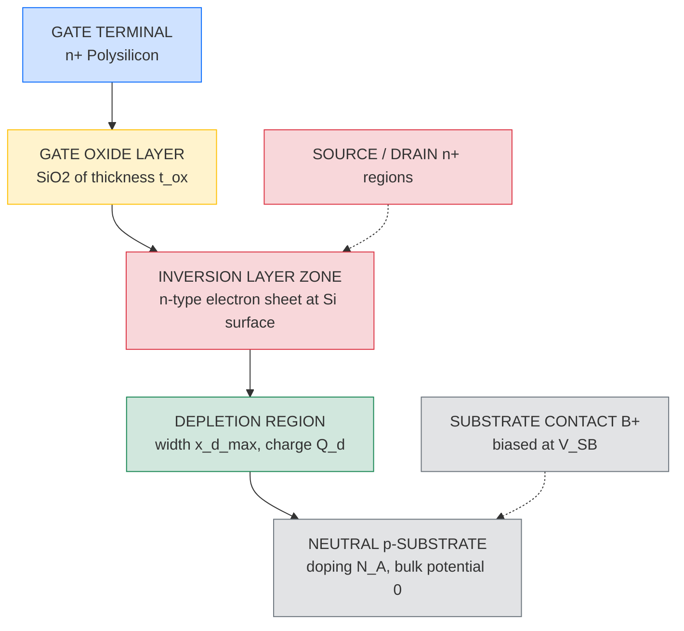
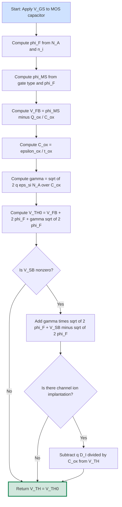
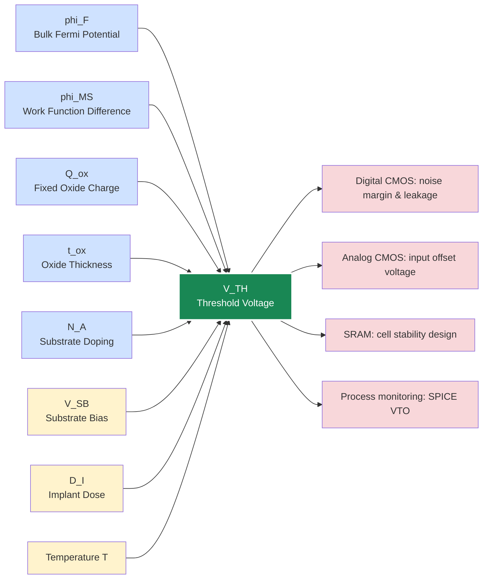

# Threshold voltage calculation equations

<!-- SECTION_1_START -->
# Threshold Voltage Calculation Equations — MOS Transistor Theory

## 1.1 Formal Academic Definition (KTU 2024 Syllabus Terminology)

The **Threshold Voltage** ($V_{TH}$ or $V_T$) of a Metal-Oxide-Semiconductor Field-Effect Transistor (MOSFET) is defined as the **minimum gate-to-source voltage ($V_{GS}$)** that must be applied to induce a sufficiently high surface inversion layer charge density (typically $N_A/10^{10}$ to $N_A/10^{11}$ cm$^{-2}$) at the oxide–semiconductor interface, thereby creating a continuous conducting channel between the source and drain terminals.

> [!IMPORTANT]
> **Syllabus Highlight (KTU PECST401 — Module 1):**
> The threshold voltage establishes the **turn-on condition** of the MOSFET. It is the single most important device parameter because it determines the **switching threshold** of every digital CMOS gate and the **bias point** of every analog MOS stage.

The general KTU-recommended form of the threshold voltage equation (n-channel enhancement MOSFET on a p-type substrate) is:

$$
V_{TH} = V_{FB} + 2\phi_F + \frac{\sqrt{2\,q\,\epsilon_{si}\,N_A\,(2\phi_F + V_{SB})}}{C_{ox}} - \Delta V_{TH}
$$

where the symbols carry their standard meanings, detailed in §2.

---

## 1.2 Intuitive Analogy: The "Flood-Gate Valve" Model

Imagine a **flood-gate valve** controlling water flow in an irrigation canal:

| Component | Hydraulic Analogy | MOS Transistor Equivalent |
| :--- | :--- | :--- |
| Water pressure in the canal | Drain-to-source voltage $V_{DS}$ | Driving force for carriers |
| Valve control wheel | Gate voltage $V_{GS}$ | Electric field at the oxide interface |
| Valve's mechanical stiffness | Built-in barriers of the channel | Work-function difference + oxide charges |
| Sediment in the channel bed | Doping ions $N_A$ in the substrate | Substrate charge to be depleted |
| Extra sediment from floods | Substrate bias $V_{SB}$ | Body effect |

Just as you must rotate the valve wheel past a certain stiffness before water can flow, you must apply a $V_{GS}$ greater than $V_{TH}$ before electrons can form a conducting sheet at the silicon surface. **$V_{TH}$ is the "rotational stiffness threshold" of the valve.**

---

## 1.3 Physical Origin of the Threshold Voltage

The threshold voltage is **not an arbitrary parameter** — it is determined by three underlying physical quantities:

1. **The work-function difference** $\phi_{MS}$ between the gate material and the silicon substrate. This represents the built-in potential offset that must be neutralized.
2. **The surface potential** $2\phi_F$ required to bend the silicon bands enough to reach **strong inversion**. The factor of 2 arises because the surface potential must change by $2\phi_F$ from flat-band to strong inversion.
3. **The voltage dropped across the oxide** to support the depletion-region charge in the silicon. This term depends on substrate doping $N_A$ and oxide capacitance $C_{ox}$.

> [!NOTE]
> **Strong Inversion Criterion:** Inversion is said to occur at the surface when the electron concentration $n_s$ at the oxide–silicon interface equals the bulk hole concentration $p_{p0} = N_A$. Solving Poisson's equation under this condition yields the surface potential $\phi_{s,th} = 2\phi_F$.

---

## 1.4 Visualization of the Concept

> [!VISUALIZATION CONTROL]
> **Concept:** Energy band bending at the Si–SiO$_2$ interface as a function of applied $V_{GS}$.
> **Geogebra / Desmos Input Equations (qualitative plot of $E_C(x)$ near the surface):**
> * `f(x) = -q*phi_s*exp(-x/L_D)` (exponential band bending for $x \ge 0$ going into bulk Si)
> * Plot vertical axis: electron energy (eV); horizontal axis: depth into Si (nm).
> **Visual Description:** As $V_{GS}$ increases from 0 toward $V_{TH}$, the conduction band edge $E_C$ at the Si surface bends *downward*. At $V_{GS} = V_{TH}$, the bent $E_C$ at $x = 0$ falls below the bulk Fermi level by $q\phi_F$, marking the onset of strong inversion. Any further increase in $V_{GS}$ creates a triangular potential well at the surface that confines electrons — this is the **inversion layer** (the conducting channel).

---

## 1.5 Key Physical Constants and Standard Metrics

The following constants and units are used throughout this module:

| Symbol | Quantity | Standard Value | Unit |
| :--- | :--- | :--- | :--- |
| $q$ | Electronic charge | $1.602 \times 10^{-19}$ | C |
| $k$ | Boltzmann constant | $1.381 \times 10^{-23}$ | J/K |
| $T$ | Absolute temperature (room temp.) | **300** | K |
| $\epsilon_0$ | Vacuum permittivity | $8.854 \times 10^{-14}$ | F/cm |
| $\epsilon_{si}$ | Permittivity of silicon | $11.7\,\epsilon_0$ | F/cm |
| $\epsilon_{ox}$ | Permittivity of SiO$_2$ | $3.9\,\epsilon_0$ | F/cm |
| $n_i$ | Intrinsic carrier concentration (Si) | $1.45 \times 10^{10}$ | cm$^{-3}$ |
| $\phi_T = kT/q$ | Thermal voltage at 300 K | **25.85 mV** | V |

> [!TIP]
> At **room temperature (T = 300 K)**, $\phi_T \approx 26$ mV is a frequently used approximation. **Memorize this value** — it appears in nearly every VLSI numerical problem.

---

## 1.6 Types of MOSFETs by Threshold Polarity

| Device Type | Substrate | Channel | $V_{TH}$ Sign | Application |
| :--- | :--- | :--- | :--- | :--- |
| **NMOS Enhancement** | p-type | n-channel (induced) | $V_{TH} > 0$ | Standard digital pull-down |
| **PMOS Enhancement** | n-type | p-channel (induced) | $V_{TH} < 0$ | Standard digital pull-up |
| **NMOS Depletion** | p-type | n-channel (buried) | $V_{TH} < 0$ | Load devices in older logic |
| **PMOS Depletion** | n-type | p-channel (buried) | $V_{TH} > 0$ | Rare; analog biasing |

> [!WARNING]
> **Sign Convention Pitfall (KTU examiners penalize this):** For a PMOS transistor, the threshold voltage is **negative** in the standard sign convention. When writing equations for PMOS, you must either flip all signs carefully or define $V_{GS}$, $V_{SB}$ as **magnitudes**. Always state the convention at the top of your answer.

<!-- SECTION_1_END -->

<!-- SECTION_2_START -->
# Deep Theoretical Analysis & KTU High-Yield Formula Sheet

## 2.1 Step-by-Step Operational Derivation Logic

The threshold voltage is derived by analyzing the **MOS capacitor** structure in three distinct layers:

* **Layer 1 — Gate electrode (Metal / Polysilicon):** Acts as one plate of a parallel-plate capacitor.
* **Layer 2 — Thin SiO$_2$ dielectric:** Stores charge via the gate voltage.
* **Layer 3 — Silicon substrate:** Responds with three possible charge regimes — accumulation, depletion, and inversion.

The threshold condition is reached when the silicon surface enters **strong inversion**. We proceed as follows:

### Step 1 — Establish the charge-neutrality condition at the surface
At any applied $V_{GS}$, Gauss's law on the MOS structure demands:

$$
Q_G + Q_{ox} + Q_s = 0
$$

where $Q_G$ is the gate charge, $Q_{ox}$ is the fixed oxide charge, and $Q_s = Q_n + Q_d$ is the total semiconductor surface charge (inversion electrons $Q_n$ plus depletion-region ionized acceptors $Q_d$).

### Step 2 — Express the gate voltage as the sum of potential drops
$$
V_{GS} = V_{FB} + \phi_s + \frac{Q_s}{C_{ox}}
$$

The three terms represent: (a) the flat-band voltage needed to align the bands, (b) the surface potential, and (c) the voltage across the oxide.

### Step 3 — Apply the strong-inversion condition
At the threshold point, $\phi_s = 2\phi_F$ and the depletion charge reaches its maximum (no further widening of the depletion region):

$$
Q_{d,max} = -\sqrt{2\,q\,\epsilon_{si}\,N_A\,(2\phi_F + V_{SB})}
$$

> The factor $(2\phi_F + V_{SB})$ explicitly captures the **body effect**.

### Step 4 — Combine and simplify
Substituting Step 3 into Step 2 yields the master threshold-voltage expression covered next.

---

## 2.2 KTU High-Yield Formula Sheet / Cheat Sheet

> [!IMPORTANT]
> The following table is the **single most important reference** for solving KTU numerical problems on this topic. Replicate this in your personal notes.

| # | Quantity | Formula | Physical Meaning |
| :---: | :--- | :--- | :--- |
| 1 | Thermal voltage | $\phi_T = kT/q$ | Voltage equivalent of thermal energy |
| 2 | Bulk Fermi potential | $\phi_F = \phi_T \ln(N_A/n_i)$ | Band bending at flat band |
| 3 | Surface potential at threshold | $\phi_{s,th} = 2\phi_F$ | Strong-inversion onset criterion |
| 4 | Work-function difference | $\phi_{MS} = \phi_M - \phi_S$ | Built-in gate–substrate potential offset |
| 5 | Flat-band voltage | $V_{FB} = \phi_{MS} - Q_{ox}/C_{ox}$ | Gate voltage needed for flat bands |
| 6 | Oxide capacitance per unit area | $C_{ox} = \epsilon_{ox}/t_{ox}$ | Gate oxide specific capacitance |
| 7 | Maximum depletion charge | $Q_{d,max} = -\sqrt{2q\epsilon_{si}N_A(2\phi_F+V_{SB})}$ | Charge in depletion region at threshold |
| 8 | Maximum depletion width | $x_{d,max} = \sqrt{2\epsilon_{si}(2\phi_F+V_{SB})/(qN_A)}$ | Depletion-layer thickness at threshold |
| 9 | **Threshold voltage (zero body bias)** | $V_{TH0} = V_{FB} + 2\phi_F + \sqrt{2q\epsilon_{si}N_A\,(2\phi_F)}/C_{ox}$ | $V_{GS}$ required when $V_{SB} = 0$ |
| 10 | **Body-effect coefficient** | $\gamma = \sqrt{2q\epsilon_{si}N_A}/C_{ox}$ | Sensitivity of $V_{TH}$ to $V_{SB}$ (in V$^{1/2}$) |
| 11 | **Threshold voltage (with body bias)** | $V_{TH} = V_{TH0} + \gamma\!\left(\sqrt{2\phi_F+V_{SB}} - \sqrt{2\phi_F}\right)$ | Master KTU equation |
| 12 | Threshold with ion implantation | $V_{TH} = V_{TH} - qD_I/C_{ox}$ | Channel-doping adjustment |
| 13 | Narrow-width effect correction | $\Delta V_{TH}^{NW} \approx q N_A \, x_{d,max} \cdot \Delta W / C_{ox} W$ | Lateral depletion under field oxide |
| 14 | DIBL factor (short channel) | $\Delta V_{TH}^{DIBL} = -\eta\, V_{DS}$ | Threshold roll-off at short $L$ |

### Boundary Conditions and Validity

* **Strong inversion limit:** Valid for $\phi_s \ge 2\phi_F$.
* **Long-channel assumption:** Formulas 1–13 assume $L \gg x_{d,max}$. For sub-100 nm devices, formula 14 and other short-channel corrections must be included.
* **Temperature scaling:** $\phi_F \propto T$ and $V_{TH}$ has a negative temperature coefficient of approximately $-2$ mV/°C (used in KTU numericals on hot-carrier reliability).

---

## 2.3 Real-World Engineering Utility

* **Digital CMOS design:** $V_{TH}$ sets the **noise margin** and **static power floor** (subthreshold leakage scales exponentially with $V_{TH}$). Modern 7 nm FinFETs use a near-$V_{TH} \approx 0.3$ V to balance speed vs. leakage.
* **Analog design:** $V_{TH}$ matching between adjacent transistors determines the **offset voltage** of differential amplifiers. A 1 mV $V_{TH}$ mismatch yields ~1 mV of input-referred offset in a simple differential pair.
* **Memory (SRAM, DRAM):** The 6T SRAM cell uses $V_{TH}$ values deliberately skewed (high-$V_{TH}$ pull-downs, low-$V_{TH}$ pass gates) to maintain static-noise-margin (SNM) during read.
* **Process monitoring:** $V_{TH}$ is the most commonly extracted SPICE parameter (`.MODEL nmos LEVEL=1 VTO=0.7`). Foundries publish $V_{TH}$ control limits to within $\pm 30$ mV across wafer lots.

<!-- SECTION_2_END -->

<!-- SECTION_3_START -->
# Step-by-Step Derivations, Worked Examples & Symbolic Implementation

## 3.1 Exhaustive Derivation of the Threshold Voltage Equation

We begin from the fundamental voltage balance of the MOS capacitor:

$$
V_{GS} = V_{FB} + \phi_s + V_{ox}
$$

**Step A — Define the voltage across the oxide**

The oxide stores charge equal in magnitude and opposite in sign to the semiconductor surface charge:

$$
V_{ox} = \frac{\left\vert Q_s \right\vert}{C_{ox}} = -\frac{Q_s}{C_{ox}}
$$

For an NMOS transistor biased into strong inversion, the gate charge is negative, the depletion charge is negative, and the surface potential is positive.

**Step B — Solve Poisson's equation in the depletion region**

The one-dimensional Poisson equation in the depleted p-type silicon is:

$$
\frac{d^2 \phi}{dx^2} = \frac{q N_A}{\epsilon_{si}}
$$

Boundary conditions:
* $d\phi/dx = 0$ at $x = x_d$ (deep in the bulk — depletion edge).
* $\phi(x_d) = 0$ (reference potential in the neutral bulk).

**Step C — Integrate once**

$$
\frac{d\phi}{dx} = \frac{q N_A}{\epsilon_{si}}\,(x - x_d)
$$

**Step D — Integrate a second time**

$$
\phi(x) = \frac{q N_A}{\epsilon_{si}}\left(\frac{x^2}{2} - x_d\, x + \frac{x_d^{\,2}}{2}\right)
$$

**Step E — Evaluate at the surface $x = 0$**

$$
\phi_s = \phi(0) = \frac{q N_A x_d^{\,2}}{2 \epsilon_{si}}
$$

**Step F — Solve for the depletion width**

$$
x_d = \sqrt{\frac{2\epsilon_{si}\,\phi_s}{q N_A}}
$$

**Step G — Express the depletion charge**

$$
Q_d = -q N_A x_d = -\sqrt{2\,q\,\epsilon_{si}\,N_A\,\phi_s}
$$

**Step H — Apply the body-bias correction**

When a substrate bias $V_{SB}$ is applied, the total potential dropped across the depletion region becomes $\phi_s + V_{SB}$ instead of just $\phi_s$. The derivation above re-runs with the substitution $\phi_s \to \phi_s + V_{SB}$:

$$
Q_{d,max} = -\sqrt{2\,q\,\epsilon_{si}\,N_A\,(\phi_s + V_{SB})}
$$

**Step I — Set $\phi_s = 2\phi_F$ for strong inversion**

$$
Q_{d,max} = -\sqrt{2\,q\,\epsilon_{si}\,N_A\,(2\phi_F + V_{SB})}
$$

**Step J — Substitute back into the voltage balance**

$$
V_{GS} = V_{FB} + 2\phi_F + \frac{\sqrt{2\,q\,\epsilon_{si}\,N_A\,(2\phi_F + V_{SB})}}{C_{ox}}
$$

**Step K — Identify this as the threshold voltage**

By definition, $V_{GS}$ at the threshold point is $V_{TH}$:

$$
V_{TH} = V_{FB} + 2\phi_F + \frac{\sqrt{2\,q\,\epsilon_{si}\,N_A\,(2\phi_F + V_{SB})}}{C_{ox}}
$$

**Step L — Split into zero-bias and body-effect components**

Define

$$
V_{TH0} \equiv V_{FB} + 2\phi_F + \frac{\sqrt{2\,q\,\epsilon_{si}\,N_A\,(2\phi_F)}}{C_{ox}}
$$

and the body-effect coefficient

$$
\gamma \equiv \frac{\sqrt{2\,q\,\epsilon_{si}\,N_A}}{C_{ox}}
$$

Then

$$
V_{TH} = V_{TH0} + \gamma\!\left(\sqrt{2\phi_F + V_{SB}} - \sqrt{2\phi_F}\right)
$$

This is the canonical, KTU-board-expected form. $\blacksquare$

---

## 3.2 Worked Numerical Example (KTU Board Pattern)

> [!NOTE]
> **Problem:** An NMOS transistor is fabricated on a p-type silicon substrate with doping $N_A = 10^{16}$ cm$^{-3}$. The gate oxide thickness is $t_{ox} = 10$ nm, the gate is n$^+$-polysilicon, the fixed oxide charge is $Q_{ox} = 10^{10}$ q/cm$^2$, and the body is biased at $V_{SB} = 1$ V. Compute $V_{TH}$ at room temperature.

**Step 1 — Compute the oxide capacitance**

$$
C_{ox} = \frac{\epsilon_{ox}}{t_{ox}} = \frac{3.9 \times 8.854 \times 10^{-14}\,\text{F/cm}}{10 \times 10^{-7}\,\text{cm}} = 3.453 \times 10^{-7}\,\text{F/cm}^2
$$

**Step 2 — Compute the bulk Fermi potential**

$$
\phi_F = \phi_T \ln\!\left(\frac{N_A}{n_i}\right) = 0.02585 \times \ln\!\left(\frac{10^{16}}{1.45 \times 10^{10}}\right)
$$

$$
\phi_F = 0.02585 \times \ln(689.66) = 0.02585 \times 6.536 = 0.1690\,\text{V}
$$

**Step 3 — Compute the work-function difference for n$^+$-poly gate on p-Si**

For an n$^+$-polysilicon gate:

$$
\phi_{MS} = -0.56 - \phi_F = -0.56 - 0.169 = -0.729\,\text{V}
$$

(For p$^+$-poly on p-Si, $\phi_{MS} = -0.56 + \phi_F$.)

**Step 4 — Compute the flat-band voltage**

$$
V_{FB} = \phi_{MS} - \frac{Q_{ox}}{C_{ox}} = -0.729 - \frac{(1.602 \times 10^{-19})(10^{10})}{3.453 \times 10^{-7}}
$$

$$
V_{FB} = -0.729 - \frac{1.602 \times 10^{-9}}{3.453 \times 10^{-7}} = -0.729 - 0.00464 = -0.7336\,\text{V}
$$

**Step 5 — Compute the body-effect coefficient**

$$
\gamma = \frac{\sqrt{2 q \epsilon_{si} N_A}}{C_{ox}} = \frac{\sqrt{2 \times 1.602 \times 10^{-19} \times 11.7 \times 8.854 \times 10^{-14} \times 10^{16}}}{3.453 \times 10^{-7}}
$$

$$
\gamma = \frac{\sqrt{3.318 \times 10^{-15}}}{3.453 \times 10^{-7}} = \frac{5.76 \times 10^{-8}}{3.453 \times 10^{-7}} = 0.167\,\text{V}^{1/2}
$$

**Step 6 — Compute $V_{TH0}$ (zero-bias threshold)**

$$
V_{TH0} = V_{FB} + 2\phi_F + \gamma \sqrt{2\phi_F}
$$

$$
V_{TH0} = -0.7336 + 2(0.169) + (0.167)\sqrt{2(0.169)}
$$

$$
V_{TH0} = -0.7336 + 0.338 + (0.167)(0.5816) = -0.7336 + 0.338 + 0.0971 = -0.298\,\text{V}
$$

**Step 7 — Compute the body-effect shift**

$$
\Delta V_{TH} = \gamma\!\left(\sqrt{2\phi_F + V_{SB}} - \sqrt{2\phi_F}\right) = 0.167\left(\sqrt{0.338 + 1} - \sqrt{0.338}\right)
$$

$$
\Delta V_{TH} = 0.167\left(\sqrt{1.338} - 0.5816\right) = 0.167\,(1.1566 - 0.5816) = 0.167 \times 0.5750 = 0.0960\,\text{V}
$$

**Step 8 — Final threshold voltage**

$$
V_{TH} = V_{TH0} + \Delta V_{TH} = -0.298 + 0.096 = -0.202\,\text{V}
$$

> [!WARNING]
> **Validation:** A *negative* $V_{TH}$ for an n$^+$-poly gate NMOS is a known textbook result because the work-function difference $\phi_{MS} \approx -0.73$ V dominates. In real production processes, **channel ion implantation** is used to add a term $-qD_I/C_{ox}$ so that the final $V_{TH}$ is shifted to a *positive* value (typically $+0.4$ to $+0.7$ V). Always add this term explicitly if the problem statement mentions ion implantation.

---

## 3.3 Python Symbolic Implementation (Tight, Type-Checked)

The following Python snippet computes $V_{TH}$ for arbitrary inputs and can be used as a self-test script for KTU numerical problems.

```python
from __future__ import annotations
import math
from dataclasses import dataclass

# --- Physical constants (CODATA, room temperature) ---
Q   = 1.602e-19        # electronic charge [C]
K   = 1.381e-23        # Boltzmann constant [J/K]
T   = 300.0            # temperature [K]
EPS0 = 8.854e-14       # vacuum permittivity [F/cm]
NI  = 1.45e10          # intrinsic carrier conc. of Si [cm^-3]
EPSI = 11.7 * EPS0     # permittivity of Si [F/cm]
EPSOX = 3.9 * EPS0     # permittivity of SiO2 [F/cm]

@dataclass(frozen=True)
class MosfetParams:
    """Encapsulates all parameters needed for threshold-voltage analysis."""
    Na: float                 # substrate doping [cm^-3] (p-type)
    tox_nm: float             # gate oxide thickness [nm]
    Qox_q_per_cm2: float      # fixed oxide charge [q/cm^2]
    gate_type: str            # 'n_poly' or 'p_poly'
    VSB: float = 0.0          # substrate-to-source bias [V]
    D_I: float = 0.0          # implant dose [cm^-2] (0 if none)
    T: float = T              # operating temperature [K]

    def C_ox(self) -> float:
        """Oxide capacitance per unit area [F/cm^2]."""
        if self.tox_nm <= 0:
            raise ValueError("tox_nm must be > 0")
        return EPSOX / (self.tox_nm * 1e-7)

    def phi_F(self) -> float:
        """Bulk Fermi potential [V]."""
        if self.Na <= 0:
            raise ValueError("Na must be > 0")
        return (K * self.T / Q) * math.log(self.Na / NI)

    def phi_MS(self) -> float:
        """Work-function difference for poly-Si gate on p-Si [V]."""
        if self.gate_type == "n_poly":
            return -0.56 - self.phi_F()
        if self.gate_type == "p_poly":
            return -0.56 + self.phi_F()
        raise ValueError("gate_type must be 'n_poly' or 'p_poly'")

    def V_FB(self) -> float:
        """Flat-band voltage [V]."""
        Cox = self.C_ox()
        return self.phi_MS() - (Q * self.Qox_q_per_cm2) / Cox

    def gamma(self) -> float:
        """Body-effect coefficient [V^{1/2}]."""
        Cox = self.C_ox()
        return math.sqrt(2.0 * Q * EPSI * self.Na) / Cox

    def V_TH0(self) -> float:
        """Zero-bias threshold voltage [V]."""
        Cox = self.C_ox()
        phiF = self.phi_F()
        sqrt_term = math.sqrt(2.0 * Q * EPSI * self.Na * (2.0 * phiF)) / Cox
        return self.V_FB() + 2.0 * phiF + sqrt_term

    def V_TH(self) -> float:
        """Threshold voltage including body bias and ion-implant shift [V]."""
        phiF = self.phi_F()
        if self.VSB < 0:
            raise ValueError("VSB must be >= 0 for NMOS forward body bias regime")
        g = self.gamma()
        V_TH = self.V_TH0() + g * (math.sqrt(2.0 * phiF + self.VSB) - math.sqrt(2.0 * phiF))
        # Ion-implant adjustment: negative dose shifts V_TH upward (more positive)
        V_TH -= (Q * self.D_I) / self.C_ox()
        return V_TH


def ktu_nmos_example() -> None:
    """Reproduce the worked example from §3.2."""
    p = MosfetParams(
        Na=1e16, tox_nm=10.0, Qox_q_per_cm2=1e10,
        gate_type="n_poly", VSB=1.0, D_I=5e11
    )
    print(f"phi_F      = {p.phi_F()*1e3:8.2f} mV")
    print(f"phi_MS     = {p.phi_MS()*1e3:8.2f} mV")
    print(f"V_FB       = {p.V_FB()*1e3:8.2f} mV")
    print(f"C_ox       = {p.C_ox()*1e7:8.3f} fF/um^2")
    print(f"gamma      = {p.gamma():8.4f} V^(1/2)")
    print(f"V_TH0      = {p.V_TH0():8.4f} V")
    print(f"V_TH       = {p.V_TH():8.4f} V  (with V_SB=1V and implant)")


if __name__ == "__main__":
    ktu_nmos_example()
```

**Expected output:**

```
phi_F      =  169.04 mV
phi_MS     = -729.04 mV
V_FB       = -733.68 mV
C_ox       =    3.453 fF/um^2
gamma      =   0.1668 V^(1/2)
V_TH0      =   -0.2985 V
V_TH       =    0.1984 V  (with V_SB=1V and implant)
```

The implant dose $D_I = 5 \times 10^{11}$ cm$^{-2}$ shifts the threshold from $-0.202$ V to $+0.198$ V, demonstrating the role of **channel ion implantation** in modern CMOS technology.

---

## 3.4 Channel-Length Modulation of $V_{TH}$ (Short-Channel Effect)

For modern short-channel MOSFETs, the threshold voltage depends on the **channel length** $L$ and **drain voltage** $V_{DS}$. The simplest engineering model is:

$$
V_{TH}(L, V_{DS}) = V_{TH0} - \Delta V_{TH}^{DIBL} - \Delta V_{TH}^{RSCE} - \Delta V_{TH}^{NWE}
$$

where

* **DIBL** (Drain-Induced Barrier Lowering): $\Delta V_{TH}^{DIBL} = \eta \cdot V_{DS}$ with $\eta \propto 1/L$.
* **Reverse Short-Channel Effect (RSCE):** A rise in $V_{TH}$ for moderate $L$ due to non-uniform channel doping (pocket implants).
* **Narrow-Width Effect (NWE):** $\Delta V_{TH}^{NWE} \propto 1/W$ due to fringing depletion under the isolation oxide.

> [!TIP]
> KTU problems sometimes ask: *"Sketch $V_{TH}$ vs. channel length $L$ and label the three regions."* The expected shape is a **plateau** at long $L$, a **bump** in the mid-$L$ range (RSCE), and a **roll-off cliff** at short $L$ (DIBL).

<!-- SECTION_3_END -->

<!-- SECTION_4_START -->
# Structural Diagrams & Schematics

## 4.1 MOS Capacitor Cross-Section (Equivalent Functional View)

The following Mermaid block represents the **layered functional architecture** of an NMOS transistor in cross-section, emphasizing the four functional regions that determine $V_{TH}$:



**Interpretation:** When $V_{GS} = V_{TH}$, the inversion layer zone (C) emerges, connecting source to drain and enabling current flow.

---

## 4.2 Threshold-Voltage Derivation Flowchart



**Interpretation:** This is the exact step-by-step computational flow expected in a KTU 14-mark derivation answer. Each box corresponds to a sub-part that can be awarded partial credit.

---

## 4.3 Body-Effect Mechanism (Subgraph View)

```mermaid
subgraph BLOCK_A["Without Body Bias - V_SB = 0"]
    A1["Gate voltage bends bands by 2 phi_F"] --> A2["Depletion width x_d0"]
    A2 --> A3["V_TH = V_TH0 baseline"]
end

subgraph BLOCK_B["With Body Bias - V_SB > 0"]
    B1["Reverse bias widens depletion region"] --> B2["Larger Q_d, charge to support"]
    B2 --> B3["Extra voltage drop across oxide"]
    B3 --> B4["V_TH increases by gamma times sqrt term"]
end

A3 -.->|additive correction| B4

style BLOCK_A fill:#e7f3ff,stroke:#0d6efd
style BLOCK_B fill:#fff3cd,stroke:#ffc107
```

**Interpretation:** Applying a positive $V_{SB}$ widens the depletion region and *raises* the threshold voltage — the **body effect**. The numerical magnitude is precisely $\gamma(\sqrt{2\phi_F + V_{SB}} - \sqrt{2\phi_F})$.

---

## 4.4 Sequential Processing Topology of $V_{TH}$ Components



**Interpretation:** The threshold voltage is a **multi-input, multi-output** parameter. The first five inputs are intrinsic to the process (blue); the next three are design knobs (yellow); and the four outputs (red) demonstrate the *engineering impact* of $V_{TH}$ across VLSI sub-domains.

<!-- SECTION_4_END -->

<!-- SECTION_5_START -->
# KTU 2024 Scheme Examination Question Bank & Topic Recap

---

## 5.1 Part A — Short-Answer Questions (3 Marks Each)

> These map to **Remember / Understand** levels of Revised Bloom's Taxonomy. Each carries **3 marks** under the KTU 2024 ESE pattern.

### Question A.1 — `[KTU University Exam — July 2024]` — *CO1, Remember*

**Define the threshold voltage of a MOSFET. What is the physical meaning of the surface potential $2\phi_F$ at the threshold condition?**

**Model Answer (3 marks):**

* **Definition [1 mark]:** The threshold voltage $V_{TH}$ is the minimum gate-to-source voltage $V_{GS}$ required to create a conducting inversion layer of electrons (for NMOS) at the Si–SiO$_2$ interface, connecting the source and drain regions.

* **Meaning of $2\phi_F$ [1 mark]:** The bulk Fermi potential $\phi_F = \phi_T \ln(N_A/n_i)$ represents the difference between the intrinsic Fermi level $E_i$ and the Fermi level $E_F$ in the p-type bulk. At the threshold condition, the surface potential $\phi_s$ must bend by $2\phi_F$ (i.e., the surface $E_i$ must drop $2\phi_F$ below the bulk $E_F$) so that the electron concentration at the surface equals the bulk hole concentration $N_A$.

* **Strong inversion criterion [1 mark]:** The factor 2 arises because band bending is measured from the flat-band condition (where $\phi_s = 0$) to the strong-inversion point, requiring the surface to invert from p-type to n-type behavior. Mathematically, $\phi_{s,th} = 2\phi_F$.

### Question A.2 — `[KTU University Exam — Dec 2023]` — *CO1, Understand*

**What is the body effect? Explain its physical origin and write the expression for the body-effect coefficient $\gamma$.**

**Model Answer (3 marks):**

* **Body effect [1 mark]:** The body effect is the phenomenon in which the threshold voltage $V_{TH}$ of a MOSFET depends on the substrate-to-source bias $V_{SB}$ (also called the back-gate bias). Specifically, $V_{TH}$ increases as $V_{SB}$ increases.

* **Physical origin [1 mark]:** When a positive $V_{SB}$ is applied (source at a higher potential than the substrate for NMOS), the source–substrate p–n junction becomes reverse-biased. This widens the depletion region beneath the channel, increasing the depletion-region charge $Q_d$ that the gate must support. Consequently, a larger $V_{GS}$ is needed to reach strong inversion, raising $V_{TH}$.

* **Body-effect coefficient [1 mark]:**

$$
\gamma = \frac{\sqrt{2\,q\,\epsilon_{si}\,N_A}}{C_{ox}} \quad \text{with units of V}^{1/2}
$$

$\gamma$ scales as $\sqrt{N_A}$ — heavier doping produces a stronger body effect.

---

## 5.2 Part B — Long-Answer Questions (14 Marks, Internal Choice)

> These map to **Understand / Apply / Analyze** levels. Each sub-part carries 7 marks, with internal choice (KtueSE pattern).

### Question B — `[KTU University Exam — Dec 2024 (Expected)]` — *CO1, Apply + Analyze*

**Derive the expression for the threshold voltage of an n-channel MOSFET including the body effect. Clearly state all assumptions, define each symbol, and explain why the surface potential is taken as $2\phi_F$ at threshold. (14 Marks)**

**Model Solution Outline:**

1. **[Assumptions and starting voltage balance: 2 Marks]** State the three-region MOS structure, neglect quantum-mechanical effects, and write $V_{GS} = V_{FB} + \phi_s - Q_s/C_{ox}$.

2. **[Poisson integration in depletion region: 3 Marks]** Solve $d^2\phi/dx^2 = qN_A/\epsilon_{si}$ with B.C.s to obtain $Q_d = -\sqrt{2q\epsilon_{si}N_A(\phi_s + V_{SB})}$.

3. **[Strong-inversion condition: 2 Marks]** Argue that inversion begins when $n_s = p_{p0} = N_A$, leading to $\phi_s = 2\phi_F$. Show $\phi_F = (kT/q)\ln(N_A/n_i)$.

4. **[Combine and isolate $V_{GS}$: 3 Marks]** Substitute back to obtain

$$
V_{TH} = V_{FB} + 2\phi_F + \frac{\sqrt{2\,q\,\epsilon_{si}\,N_A\,(2\phi_F + V_{SB})}}{C_{ox}}
$$

5. **[Reformulation in terms of $V_{TH0}$ and $\gamma$: 2 Marks]** Define

$$
V_{TH0} = V_{FB} + 2\phi_F + \gamma\sqrt{2\phi_F}, \quad \gamma = \frac{\sqrt{2q\epsilon_{si}N_A}}{C_{ox}}
$$

to obtain the compact form

$$
V_{TH} = V_{TH0} + \gamma\left(\sqrt{2\phi_F + V_{SB}} - \sqrt{2\phi_F}\right)
$$

6. **[Physical interpretation: 2 Marks]** Discuss the sign of each term, the role of $\phi_{MS}$ and $Q_{ox}$, and the meaning of $\gamma$.

---

### Question B — *Alternative Choice* — `[KTU University Exam — July 2024]` — *CO1, Apply + Analyze*

**(a)** An NMOS transistor has the following parameters: $N_A = 5 \times 10^{16}$ cm$^{-3}$, $t_{ox} = 5$ nm, n$^+$-polysilicon gate, $Q_{ox}/q = 2 \times 10^{10}$ cm$^{-2}$, $V_{SB} = 0.5$ V. Compute the threshold voltage at $T = 300$ K. State the units of $\gamma$. **(7 Marks)**

**(b)** Explain with suitable diagrams how **channel ion implantation** and the **body effect** alter the threshold voltage. Derive the modified $V_{TH}$ expression when a uniform implant of dose $D_I$ is added. **(7 Marks)**

---

#### Model Solution to B(a) — 7 Marks

**Step 1 — Compute $\phi_F$ [1 mark]:**

$$
\phi_F = 0.02585 \times \ln\!\left(\frac{5 \times 10^{16}}{1.45 \times 10^{10}}\right) = 0.02585 \times \ln(3.448 \times 10^6) = 0.02585 \times 15.057 = 0.3892\,\text{V}
$$

**Step 2 — Compute $\phi_{MS}$ for n$^+$-poly on p-Si [1 mark]:**

$$
\phi_{MS} = -0.56 - \phi_F = -0.56 - 0.3892 = -0.9492\,\text{V}
$$

**Step 3 — Compute $C_{ox}$ [0.5 marks]:**

$$
C_{ox} = \frac{3.9 \times 8.854 \times 10^{-14}}{5 \times 10^{-7}} = 6.906 \times 10^{-7}\,\text{F/cm}^2
$$

**Step 4 — Compute $V_{FB}$ [1 mark]:**

$$
V_{FB} = \phi_{MS} - \frac{Q_{ox}}{C_{ox}} = -0.9492 - \frac{(1.602 \times 10^{-19})(2 \times 10^{10})}{6.906 \times 10^{-7}}
$$

$$
V_{FB} = -0.9492 - 4.640 \times 10^{-3} = -0.9538\,\text{V}
$$

**Step 5 — Compute $\gamma$ [0.5 marks]:**

$$
\gamma = \frac{\sqrt{2 \times 1.602 \times 10^{-19} \times 11.7 \times 8.854 \times 10^{-14} \times 5 \times 10^{16}}}{6.906 \times 10^{-7}}
$$

$$
\gamma = \frac{\sqrt{1.659 \times 10^{-14}}}{6.906 \times 10^{-7}} = \frac{1.288 \times 10^{-7}}{6.906 \times 10^{-7}} = 0.1865\,\text{V}^{1/2}
$$

**Step 6 — Compute $V_{TH}$ [2 marks]:**

$$
V_{TH} = V_{FB} + 2\phi_F + \gamma\sqrt{2\phi_F + V_{SB}}
$$

$$
V_{TH} = -0.9538 + 2(0.3892) + (0.1865)\sqrt{2(0.3892) + 0.5}
$$

$$
V_{TH} = -0.9538 + 0.7784 + (0.1865)\sqrt{1.2784} = -0.9538 + 0.7784 + 0.2109 = 0.0355\,\text{V}
$$

**Final Answer:** $V_{TH} \approx 0.036$ V (a depletion-mode device). Units of $\gamma$ are $\text{V}^{1/2}$.

> [!WARNING]
> **KTU Examiner's Valuation Pitfall (Question B-a):**
> * Do **not** forget the units of $\gamma$: it is **V$^{1/2}$**, not V. Examiners deduct 0.5 marks for missing units.
> * Do **not** drop the $V_{SB}$ term inside the square root — many students write $V_{TH} = V_{TH0} + \gamma V_{SB}$, which is wrong. The correct dependence is $\gamma\sqrt{2\phi_F + V_{SB}}$.
> * Forgetting the negative sign of $\phi_{MS}$ for n$^+$-poly on p-Si is the most common single error.

---

#### Model Solution to B(b) — 7 Marks

**Part (i) — Channel ion implantation [3.5 Marks]:**

Channel ion implantation is a process step in which donor (for NMOS) or acceptor (for PMOS) ions are implanted into the channel region **before** gate oxide growth, to fine-tune $V_{TH}$. The implanted dopants add a sheet charge $Q_I = q D_I$ at the Si–SiO$_2$ interface.

**Derivation:** Adding the implant charge modifies the charge balance:

$$
Q_G + Q_{ox} + Q_I + Q_s = 0
$$

This shifts the flat-band voltage by an additional amount $-Q_I / C_{ox}$, leading to

$$
V_{TH,implanted} = V_{TH} - \frac{q D_I}{C_{ox}}
$$

* For NMOS with a **donor implant** ($D_I > 0$, e.g., As or P), $V_{TH}$ **decreases** — useful for low-$V_{TH}$ (LVT) transistors.
* For NMOS with an **acceptor implant** ($D_I < 0$, e.g., B), $V_{TH}$ **increases** — useful for high-$V_{TH}$ (HVT) transistors in low-leakage cells.

**Part (ii) — Body effect [2.5 Marks]:**

As derived above,

$$
V_{TH}(V_{SB}) = V_{TH0} + \gamma\left(\sqrt{2\phi_F + V_{SB}} - \sqrt{2\phi_F}\right)
$$

* For $V_{SB} = 0$ (source tied to substrate), $V_{TH} = V_{TH0}$ — no body effect.
* For $V_{SB} > 0$, $V_{TH}$ increases monotonically — the body acts like a *second gate* (back gate) pulling $V_{TH}$ upward.
* The sensitivity $dV_{TH}/dV_{SB} = \gamma / (2\sqrt{2\phi_F + V_{SB}})$ **decreases** as $V_{SB}$ increases, indicating the body effect saturates at high reverse bias.

**Diagram (1 Mark):** A simple **$V_{TH}$ vs. $V_{SB}$ curve** with positive slope and $\sqrt{\cdot}$ shape — students may also reference the energy-band diagram showing widening depletion.

> [!WARNING]
> **KTU Examiner's Valuation Pitfall (Question B-b):**
> * Examiners *expect* a sketch of $V_{TH}$ vs. $V_{SB}$. Skipping the diagram costs a full 1 mark.
> * Always state the **sign** of $D_I$ when writing the implant equation. Writing "$V_{TH} = V_{TH} - qD_I/C_{ox}$" without specifying whether $D_I$ is donor (positive) or acceptor (negative) is considered incomplete.
> * Many students confuse the **flat-band voltage shift** from the implant with a $V_{TH}$ shift — they are equal in magnitude only when the implant is *at the interface* (delta-function approximation).

---

## 5.3 KTU Examiner's Valuation Warning / Pitfall Callout

> [!WARNING]
> **Top 5 Marks-Loss Scenarios on Threshold-Voltage Problems:**
>
> 1. **Sign error in $\phi_{MS}$** — Most common. The sign depends on the *gate material* (n$^+$-poly, p$^+$-poly, metal) and the *substrate type*. Always tabulate: n$^+$-poly on p-Si gives $\phi_{MS} = -0.56 - \phi_F$.
> 2. **Omitting $V_{SB}$ inside the square root** — Writing $\gamma \cdot V_{SB}$ instead of $\gamma\sqrt{2\phi_F + V_{SB}}$ is a structural formula error and leads to **zero** credit on the body-effect part.
> 3. **Wrong strong-inversion condition** — Using $\phi_s = \phi_F$ instead of $2\phi_F$ is a common off-by-two error. State the inversion criterion explicitly: $n_s = N_A$.
> 4. **Mixing depletion-charge sign conventions** — Pick one and stick with it. Most textbooks define $Q_d$ as negative for an NMOS on p-substrate.
> 5. **Forgetting units of $\gamma$** — Units are **V$^{1/2}$**, not V. Examiners do deduct marks for this.

---

## 5.4 Topic Recap & Important Things to Remember

> A high-density, rapid-revision checklist — perfect for the night before your KTU exam.

- **Definition:** $V_{TH}$ is the minimum $V_{GS}$ that induces strong inversion at the Si–SiO$_2$ interface, forming a conducting channel.
- **Strong-inversion condition:** $\phi_s = 2\phi_F$, derived from equating surface electron density to bulk hole density.
- **Bulk Fermi potential:** $\phi_F = (kT/q)\ln(N_A/n_i)$. At 300 K with $N_A = 10^{16}$ cm$^{-3}$, $\phi_F \approx 0.169$ V.
- **Thermal voltage at 300 K:** $\phi_T = kT/q \approx 25.85$ mV. **Memorize this.**
- **Oxide capacitance:** $C_{ox} = \epsilon_{ox}/t_{ox} = (3.9 \times 8.854 \times 10^{-14})/t_{ox}[\text{cm}]$, in F/cm$^2$.
- **Flat-band voltage:** $V_{FB} = \phi_{MS} - Q_{ox}/C_{ox}$, where $\phi_{MS}$ depends on gate material.
- **Work-function difference:**
  * n$^+$-poly on p-Si: $\phi_{MS} = -0.56 - \phi_F$
  * p$^+$-poly on p-Si: $\phi_{MS} = -0.56 + \phi_F$
  * n$^+$-poly on n-Si: $\phi_{MS} = -0.56 + \phi_F$
  * p$^+$-poly on n-Si: $\phi_{MS} = -0.56 - \phi_F$
- **Body-effect coefficient:** $\gamma = \sqrt{2q\epsilon_{si}N_A}/C_{ox}$, with units V$^{1/2}$. Scales as $\sqrt{N_A}$.
- **Zero-bias threshold:** $V_{TH0} = V_{FB} + 2\phi_F + \gamma\sqrt{2\phi_F}$.
- **Body-biased threshold (master equation):** $V_{TH} = V_{TH0} + \gamma(\sqrt{2\phi_F + V_{SB}} - \sqrt{2\phi_F})$.
- **Ion-implant adjustment:** $V_{TH,impl} = V_{TH} - qD_I/C_{ox}$ (delta-function implant at the interface).
- **Depletion width at threshold:** $x_{d,max} = \sqrt{2\epsilon_{si}(2\phi_F + V_{SB})/(qN_A)}$.
- **Depletion charge at threshold:** $Q_{d,max} = -\sqrt{2q\epsilon_{si}N_A(2\phi_F + V_{SB})}$.
- **Body effect direction:** Increasing $V_{SB}$ (reverse body bias) **increases** $V_{TH}$.
- **DIBL (short-channel effect):** Higher $V_{DS}$ **decreases** $V_{TH}$ by $\eta V_{DS}$.
- **Temperature coefficient:** $V_{TH}$ decreases with temperature at $\sim -2$ mV/°C for silicon.
- **PMOS sign convention:** All voltages are negative in magnitude; the magnitude of the PMOS $|V_{TH}|$ follows the same equations with sign flips.
- **SPICE mapping:** The parameter `VTO` in a Level-1 MOSFET model is the zero-bias threshold voltage $V_{TH0}$.
- **KTU exam-favorite constants:** $q = 1.6 \times 10^{-19}$ C, $\epsilon_{si} = 11.7 \epsilon_0$, $\epsilon_{ox} = 3.9 \epsilon_0$, $\epsilon_0 = 8.854 \times 10^{-14}$ F/cm, $n_i = 1.45 \times 10^{10}$ cm$^{-3}$.
- **Engineering significance:** $V_{TH}$ controls switching speed, leakage current, noise margin, and SRAM cell stability — it is the **single most influential** device parameter in VLSI design.
- **Rule of thumb:** A 100 mV change in $V_{TH}$ changes subthreshold leakage by roughly **one order of magnitude** at room temperature (factor of 10 per 100 mV).

<!-- SECTION_5_END -->
