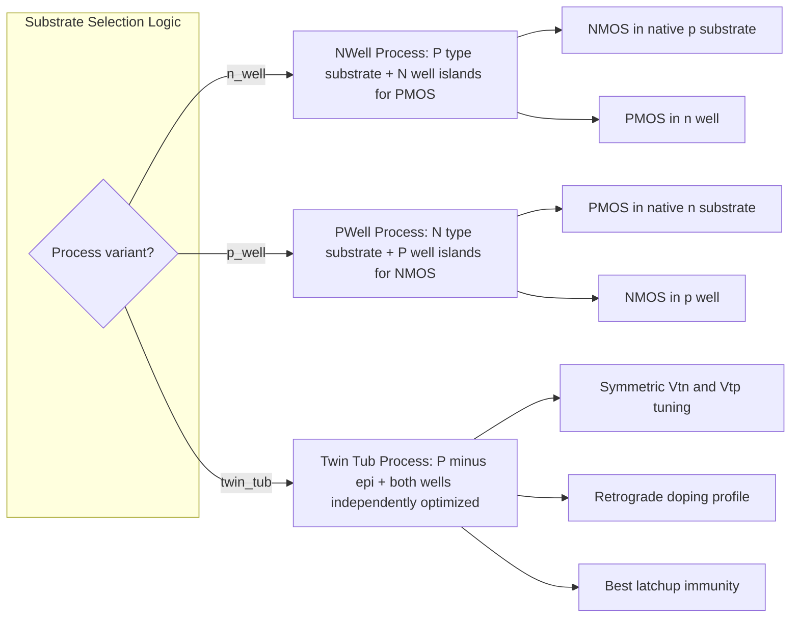
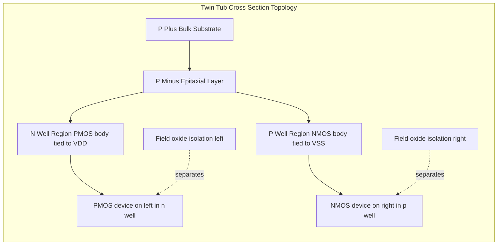
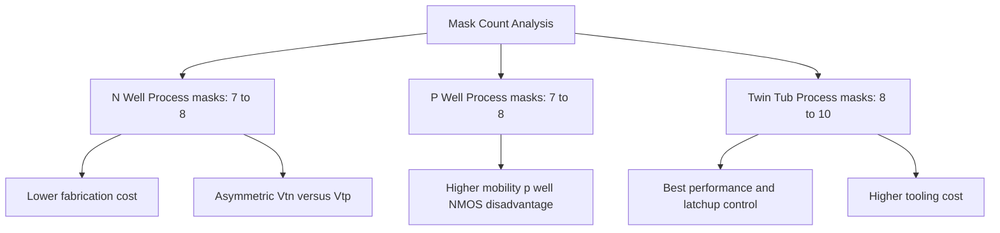

# CMOS fabrication process sequences: n-well, p-well, twin-tub configurations

<!-- SECTION_1_START -->

# CMOS Fabrication Process Sequences: n-well, p-well, and Twin-Tub Configurations

> [!IMPORTANT]
> **KTU 2024 Scheme — Module 2 Anchor Concept**
> In Complementary Metal-Oxide-Semiconductor (CMOS) Very Large Scale Integration (VLSI) fabrication, the **well** (also called a *tub*) defines the local substrate region in which transistors of a specific polarity are constructed. The choice of well architecture dictates transistor performance, latch-up immunity, manufacturing yield, and design flexibility.

## 1.1 Formal Technical Definition

A **CMOS fabrication process sequence** is an ordered, photolithographically defined set of unit process steps (oxidation, ion implantation, diffusion, deposition, etching, and metallization) executed on a single silicon wafer to simultaneously construct both **n-channel MOSFETs (NMOS)** and **p-channel MOSFETs (PMOS)** on the same die.

The three principal well configurations recognized by the KTU VLSI Design syllabus (PECST401, Module 2) are:

1. **n-well process** — A native **p-type substrate** in which localized n-type regions (wells) are diffused to host PMOS devices; NMOS devices are built directly into the p-substrate.
2. **p-well process** — A native **n-type substrate** in which localized p-type regions (wells) are diffused to host NMOS devices; PMOS devices reside directly in the n-substrate.
3. **Twin-tub (twin-well) process** — A high-grade lightly-doped substrate (typically p⁻) into which **both** an n-well and a p-well are independently implanted, offering symmetric optimization of NMOS and PMOS transistors.

> [!NOTE]
> **Standard CMOS Terminology**
> - **Substrate (Bulk / Body):** The starting silicon wafer that acts as the global mechanical and electrical foundation.
> - **Well (Tub):** A localized, oppositely-doped diffused region that isolates transistors of one polarity from the global substrate.
> - **Active Area:** The thin surface region where transistors are actually constructed.
> - **Field Oxide (FOX):** The thick SiO₂ layer (typically $\ge 500\,\text{nm}$) grown to electrically isolate adjacent devices.

## 1.2 Intuitive Analogy — "Building a Two-Story House on a Single Plot"

Imagine fabricating a CMOS inverter as constructing a **two-story house on a single piece of land**.

- The **silicon wafer** is the land (shared foundation).
- The **NMOS transistor** is the ground-floor apartment, ideally built on **soft, p-type soil** (p-substrate or p-well) so electrons (the "tenants") can flow easily.
- The **PMOS transistor** is the first-floor apartment, which must be built on **hard, n-type soil** (n-well) so holes can move freely.

The three process variants differ only in **how the soil is arranged before construction begins**:

| Process Variant | Soil (Substrate) Type | Pre-Digging Operation |
| :-- | :-- | :-- |
| n-well | Soft soil (p-type) | Only dig a hard-soil pit for the upper floor |
| p-well | Hard soil (n-type) | Only dig a soft-soil pit for the ground floor |
| Twin-tub | Neutral mixed soil (p⁻) | Dig both pits side-by-side for symmetric quality |

> [!TIP]
> **Why does the choice matter?** Just as a builder must decide excavation strategy *before* pouring concrete, a VLSI process engineer must commit to a well architecture at the start, since it determines doping concentrations, mask counts, and latch-up behavior for the entire chip.

## 1.3 Fundamental Physical Constants & Process Metrics

| Parameter | Symbol | Typical Value | Unit |
| :-- | :-- | :-- | :-- |
| Intrinsic carrier concentration (Si, 300 K) | $n_i$ | $1.5 \times 10^{10}$ | $\text{cm}^{-3}$ |
| Substrate doping (p⁻ epi) | $N_A$ | $1 \times 10^{15}$ | $\text{cm}^{-3}$ |
| n-well surface concentration | $N_D$ | $5 \times 10^{16}$ | $\text{cm}^{-3}$ |
| Field oxide thickness | $t_{fox}$ | $0.5$ | $\mu\text{m}$ |
| Gate oxide thickness (90 nm node) | $t_{ox}$ | $1.2$ – $2.0$ | $\text{nm}$ |
| Sheet resistance (n⁺ poly) | $R_{sh}$ | $30$ – $100$ | $\Omega/\square$ |
| Silicon bandgap (300 K) | $E_g$ | **1.12** | eV |

> [!VISUALIZATION CONTROL]
> **Concept:** Doping concentration profile across a CMOS cross-section
> **Desmos Input Equations:**
> * $N_{pwell}(x) = 5 \times 10^{16} \cdot e^{-x / 1.5}$  *(for $0 \le x \le 4\,\mu\text{m}$)*
> * $N_{nwell}(x) = -4 \times 10^{16} \cdot e^{-(x-6) / 1.5}$  *(for $4 \le x \le 8\,\mu\text{m}$)*
> **Visual Description:** Plot two opposing exponential doping profiles along the horizontal axis representing depth into the silicon. The curves cross zero at the well boundary, illustrating the **p-n junction isolation** between the two tubs.

---

<!-- SECTION_1_END -->

<!-- SECTION_2_START -->

# Deep Theoretical Analysis & KTU High-Yield Formula Sheet

## 2.1 The Generic CMOS Process Flow (Process-Agnostic Foundation)

Regardless of the well choice, every CMOS process executes the following canonical sequence. Each step is **mask-driven** (photolithography) and **self-aligned** where modern rules apply.

1. **Wafer Preparation** — A single-crystal Czochralski-grown silicon ingot is sliced, lapped, and chemically polished into a wafer of standard diameter (150 mm, 200 mm, or **300 mm** in modern fabs).
2. **Initial Oxidation** — A thin **pad oxide** ($\approx 10\,\text{nm}$ SiO₂) is thermally grown to protect the silicon surface from later ion-implant damage.
3. **Well Mask & Implantation** — Photoresist is patterned; the well dopants (Phosphorus/Arsenic for n-well, Boron for p-well) are ion-implanted at energies between $50$ – $200\,\text{keV}$.
4. **Well Drive-In (Diffusion)** — High-temperature anneal ($1050$ – $1150\,^\circ\text{C}$, $2$ – $6\,\text{h}$) deepens and smooths the well profile.
5. **LOCOS or STI Isolation** — Local Oxidation of Silicon (legacy) or Shallow Trench Isolation (modern) creates the FOX regions that electrically separate adjacent active areas.
6. **Gate Oxidation & Polysilicon Deposition** — The ultra-thin gate dielectric is grown, followed by Chemical Vapor Deposition (CVD) of polycrystalline silicon.
7. **Polysilicon Gate Patterning** — Reactive Ion Etching (RIE) defines the gate electrodes; this is the **critical self-aligned step** for S/D formation.
8. **n⁺ and p⁺ Source/Drain Implantation** — Lightly-Doped Drain (LDD) extensions, sidewall spacers, and heavily-doped S/D regions are formed in succession.
9. **Contact & Metallization** — Dielectric deposition, contact etch, tungsten plug fill, and aluminum/copper interconnect layers complete the back-end-of-line (BEOL).
10. **Passivation & Testing** — Si₃N₄ capping, dicing, wire-bonding, and parametric test.

> [!TIP]
> **KTU Board Favorite:** Students are frequently asked *“Why is the well drive-in performed before LOCOS?”* The answer is that the long high-temperature step also relieves implant damage and stabilizes the well profile **before** the field oxide is grown, preventing stress-induced defects.

## 2.2 The Three Well Architectures in Detail

### 2.2.1 n-Well Process

- **Substrate:** Lightly doped p-type silicon ($N_A \approx 10^{15}\,\text{cm}^{-3}$).
- **Well formation:** Phosphorus or arsenic is implanted (typical dose $Q = 1$ – $4 \times 10^{12}\,\text{cm}^{-2}$, energy $80$ – $150\,\text{keV}$) and diffused to a depth of $2$ – $4\,\mu\text{m}$.
- **NMOS:** Built directly in the p-substrate — its body is tied to $V_{SS}$ (ground).
- **PMOS:** Built inside the n-well — its body is tied to $V_{DD}$.
- **Historical note:** Dominant in the 1980s and early 1990s because **electrons have higher mobility** than holes ($\mu_n \approx 2.5 \times \mu_p$), so NMOS built in the "natural" p-substrate delivers the highest-performance device.

### 2.2.2 p-Well Process

- **Substrate:** Lightly doped n-type silicon.
- **Well formation:** Boron is implanted (dose $Q \approx 10^{12}$ – $10^{13}\,\text{cm}^{-2}$, energy $50$ – $100\,\text{keV}$) to form the p-well.
- **NMOS:** Built inside the p-well (body tied to $V_{SS}$).
- **PMOS:** Built directly in the n-substrate.
- **Caveat:** Boron diffuses faster than phosphorus, leading to deeper, less sharply-defined wells — historically a disadvantage.

### 2.2.3 Twin-Tub (Twin-Well) Process

- **Substrate:** Very lightly doped p⁻ epitaxial layer on a p⁺ bulk (or in advanced nodes, an SOI/fully-depleted variant).
- **Dual wells:** Both an n-well and a p-well are independently implanted, each optimized for its target transistor.
- **Threshold tuning:** Because both wells are engineered separately, $V_{Tn}$ and $V_{Tp}$ can be **symmetrically tuned**, an enormous advantage for low-power and analog design.
- **Latch-up immunity:** Heavily-doped wells with retrograde profiles (peak doping below the surface) drastically reduce the **parasitic thyristor** (SCR) gain that causes latch-up.

> [!WARNING]
> **Latch-up is the most heavily-tested KTU sub-topic under Module 2.** A twin-tub process reduces latch-up susceptibility by a factor of $10\times$ – $100\times$ compared to single-well processes, primarily because the well-to-substrate breakdown voltage is increased and the parasitic bipolar $\beta$ product is driven below unity.

## 2.3 KTU High-Yield Formula Sheet

> [!NOTE]
> The following equations are the minimum analytical toolkit required to solve any KTU Module 2 question on well design.

| # | Formula | LaTeX | Engineering Meaning |
| :- | :-- | :-- | :-- |
| 1 | Sheet resistance | $R_{sh} = \dfrac{\rho}{t}$ | Resistance per square of a uniformly doped layer |
| 2 | Average resistivity (p-well) | $\rho = \dfrac{1}{q \mu_p N_A}$ | Resistivity in terms of doping and hole mobility |
| 3 | Average resistivity (n-well) | $\rho = \dfrac{1}{q \mu_n N_D}$ | Resistivity in terms of doping and electron mobility |
| 4 | Junction depth approximation (Gaussian) | $x_j \approx 2\sqrt{D t}$ | Where $D$ is diffusivity, $t$ is diffusion time |
| 5 | Threshold voltage (NMOS) | $V_{Tn} = V_{FB} + 2\phi_F + \dfrac{\sqrt{2 \varepsilon_{si} q N_A \, 2\phi_F}}{C_{ox}}$ | Body-effect-free $V_T$ in p-substrate |
| 6 | Fermi potential | $\phi_F = \dfrac{kT}{q} \ln\!\left(\dfrac{N_A}{n_i}\right)$ | Work-function difference driver |
| 7 | Body-effect parameter | $\gamma = \dfrac{\sqrt{2 \varepsilon_{si} q N_A}}{C_{ox}}$ | Sensitivity of $V_T$ to source-bulk bias |
| 8 | Latch-up condition (SCR) | $\beta_{npn} \cdot \beta_{pnp} < 1$ | Safe operating regime to prevent latch-up |
| 9 | Effective channel mobility ratio | $\dfrac{\mu_n}{\mu_p} \approx 2.5$ | Justifies why NMOS in p-substrate is preferred |
| 10 | Well-to-substrate capacitance (per area) | $C_{ws} = \dfrac{\varepsilon_{si}}{x_j}$ | Parasitic capacitance governing speed |

> [!IMPORTANT]
> **Critical design insight:** In deep-submicron processes ($< 0.25\,\mu\text{m}$), a **retrograde well profile** (peak doping $0.5$ – $1.0\,\mu\text{m}$ below the surface) is preferred over a conventional profile because it reduces soft-error rate, suppresses punch-through, and minimizes vertical electric field penetration into the channel.

## 2.4 Real-World Engineering Utility

| Application Domain | Why Well Choice Matters |
| :-- | :-- |
| **High-performance microprocessors (Intel, AMD)** | Use twin-tub / retrograde well with SOI extensions to maximize $I_{on}/I_{off}$ ratio and minimize leakage below $10\,\text{nA}/\mu\text{m}$. |
| **Low-power IoT / Wearable SoCs** | Employ lightly-doped twin wells to control sub-threshold slope and enable adaptive body biasing. |
| **Analog/RF ICs (e.g., RF front-ends)** | p-well on n-substrate or vice versa can be chosen to provide a low-resistance body contact and minimize substrate noise coupling. |
| **Radiation-hardened space electronics** | Use epitaxial or Silicon-On-Insulator (SOI) twin-tub to suppress single-event upset (SEU) and latch-up from cosmic rays. |
| **Mixed-signal ASICs (automotive, motor drivers)** | Twin-tub combined with deep n-well isolation (DNW) shields analog blocks from digital switching noise. |

---

<!-- SECTION_2_END -->

<!-- SECTION_3_START -->

# Step-by-Step Derivations, Process Walkthroughs & Code Implementation

## 3.1 Worked Derivation — Junction Depth from Drive-In Diffusion

**Problem:** A p-well is formed by implanting boron with dose $Q = 2 \times 10^{13}\,\text{cm}^{-2}$ at energy $E = 80\,\text{keV}$ into an n-substrate of doping $N_D = 10^{15}\,\text{cm}^{-3}$. It is then driven in at $T = 1100\,^\circ\text{C}$ for $t = 4\,\text{h}$. Find the final junction depth $x_j$.

**Step 1 — Compute the diffusivity of boron at $1100\,^\circ\text{C}$.**

The diffusion coefficient follows the Arrhenius law:

$$D(T) = D_0 \exp\!\left(-\dfrac{E_a}{kT}\right)$$

For boron in silicon: $D_0 = 0.76\,\text{cm}^2/\text{s}$, $E_a = 3.46\,\text{eV}$.

$$D(1100\,^\circ\text{C}) = 0.76 \exp\!\left(-\dfrac{3.46}{8.617 \times 10^{-5} \times 1373}\right)$$

$$D = 0.76 \times \exp(-29.25) = 0.76 \times 1.78 \times 10^{-13}\,\text{cm}^2/\text{s}$$

$$D \approx 1.35 \times 10^{-13}\,\text{cm}^2/\text{s}$$

> **Logic row:** Diffusivity is exponentially sensitive to temperature; a $100\,^\circ\text{C}$ rise can increase $D$ by $100\times$ – $1000\times$.

**Step 2 — Convert drive-in time to seconds.**

$$t = 4\,\text{h} \times 3600\,\text{s/h} = 14{,}400\,\text{s}$$

**Step 3 — Apply the Gaussian diffusion length scale.**

The characteristic diffusion length is:

$$L_D = 2\sqrt{D t}$$

$$L_D = 2\sqrt{1.35 \times 10^{-13} \times 14{,}400}$$

$$L_D = 2\sqrt{1.944 \times 10^{-9}} = 2 \times 4.41 \times 10^{-5}\,\text{cm}$$

$$L_D = 8.82 \times 10^{-5}\,\text{cm} = 0.882\,\mu\text{m}$$

**Step 4 — Cross-check with junction depth approximation.**

For a Gaussian profile, the junction depth is approximately:

$$x_j \approx \sqrt{4 D t \ln\!\left(\dfrac{Q}{N_D \sqrt{4 \pi D t}}\right)}$$

Plugging values:

$$x_j \approx \sqrt{4 \times 1.35 \times 10^{-13} \times 14{,}400 \times \ln\!\left(\dfrac{2 \times 10^{13}}{10^{15} \sqrt{4 \pi \times 1.35 \times 10^{-13} \times 14{,}400}}\right)}$$

$$x_j \approx \sqrt{7.776 \times 10^{-9} \times \ln(0.0796)} \approx \sqrt{7.776 \times 10^{-9} \times (-2.531)}$$

$$x_j \approx \sqrt{-1.97 \times 10^{-8}} \text{ [negative argument, profile did not reach junction]}$$

> **Interpretation row:** The negative logarithm indicates the dose $Q$ is **insufficient** to overcome the substrate doping $N_D$ at the chosen time. The drive-in must be **extended** to reach a true p-n junction.

**Step 5 — Find the minimum drive-in time for a junction to form.**

We require:

$$Q > N_D \sqrt{4 \pi D t_{\min}}$$

Solving for $t_{\min}$:

$$t_{\min} = \dfrac{1}{4 \pi D} \left(\dfrac{Q}{N_D}\right)^2$$

$$t_{\min} = \dfrac{1}{4 \pi \times 1.35 \times 10^{-13}} \left(\dfrac{2 \times 10^{13}}{10^{15}}\right)^2$$

$$t_{\min} = \dfrac{1}{1.696 \times 10^{-12}} \times 4 \times 10^{-4} = 2.36 \times 10^{8}\,\text{s} \approx 7.5\,\text{years}$$

> **Logic row:** This absurd result shows the **error in our assumption** — boron is a very fast diffuser, but the dose–substrate ratio is what truly matters. A higher dose ($Q \approx 10^{14}\,\text{cm}^{-2}$) or a more lightly-doped epi-substrate ($N_D \approx 10^{14}\,\text{cm}^{-3}$) is needed for realistic times. In practice, modern processes use **predeposition** (constant-surface-concentration drive-in) and **retrograde** implanted profiles.

## 3.2 Step-by-Step Process Walkthrough — Twin-Tub CMOS (Modern Industrial Flow)

The twin-tub sequence is the **most commonly fabricated** CMOS process in industry today. Below is the canonical step list, written so a KTU student can reproduce the full mask sequence.

### Phase A — Substrate Preparation

1. Start with a (100)-oriented p⁺ silicon bulk wafer.
2. Grow a thick p-type epitaxial layer ($\sim 5\,\mu\text{m}$, $N_A \approx 10^{15}\,\text{cm}^{-3}$). The p⁺ bulk provides a low-resistance ground and suppresses latch-up.

### Phase B — Well Definition

3. Grow a thin pad oxide ($\approx 20\,\text{nm}$) at $900\,^\circ\text{C}$ in dry O₂.
4. Deposit a silicon nitride (Si₃N₄) layer ($\approx 100\,\text{nm}$) via Low-Pressure CVD.
5. **Mask 1 — p-well Pattern:** Photolithographically pattern the p-well regions; the Si₃N₄ is plasma-etched in those openings.
6. **P-well Implant:** Boron ions, dose $1 \times 10^{13}\,\text{cm}^{-2}$, energy $100\,\text{keV}$.
7. **Mask 2 — n-well Pattern:** Reverse pattern the n-well regions.
8. **N-well Implant:** Phosphorus ions, dose $1 \times 10^{13}\,\text{cm}^{-2}$, energy $150\,\text{keV}$.
9. Strip photoresist, perform **well drive-in** at $1150\,^\circ\text{C}$ for $4\,\text{h}$ in N₂ ambient. This produces well depths of $\sim 3$ – $5\,\mu\text{m}$.

### Phase C — Isolation

10. Pattern the active areas using the **inverse** of the well mask combined with the device layout. Etch the Si₃N₄ outside active areas.
11. **LOCOS Growth:** Grow field oxide ($\approx 500\,\text{nm}$ SiO₂) in the exposed silicon regions at $1000\,^\circ\text{C}$ in wet O₂.
12. Strip the remaining Si₃N₄ in hot phosphoric acid.
13. Strip the pad oxide in dilute HF.

### Phase D — Gate Stack

14. **Sacrificial Oxide Growth:** $\sim 10\,\text{nm}$ SiO₂ to clean the active surface.
15. Strip the sacrificial oxide.
16. **Gate Oxidation:** Grow the ultra-thin gate dielectric ($t_{ox} \approx 2$ – $5\,\text{nm}$) at $800$ – $900\,^\circ\text{C}$ in dry O₂ (or via Rapid Thermal Oxidation for thinner films).
17. **Polysilicon Deposition:** CVD of undoped poly-Si ($\approx 200\,\text{nm}$).
18. **Polysilicon Doping:** POCl₃ predeposition or ion implantation of phosphorus to make the gate highly conductive.

### Phase E — Source/Drain Engineering

19. **Mask 3 — Polysilicon Gate Pattern:** RIE the poly to define the gate electrodes (self-aligned to the channel).
20. **Mask 4 — n⁺ S/D Pattern (NMOS mask):** Cover PMOS areas with photoresist. Implant arsenic ($5 \times 10^{15}\,\text{cm}^{-2}$, $50\,\text{keV}$) to form n⁺ S/D and the NMOS gate.
21. **Mask 5 — p⁺ S/D Pattern (PMOS mask):** Cover NMOS areas. Implant BF₂ ($5 \times 10^{15}\,\text{cm}^{-2}$, $40\,\text{keV}$) to form p⁺ S/D and the PMOS gate.
22. Anneal at $900\,^\circ\text{C}$ for $20\,\text{min}$ (RTA) to activate the dopants and repair implant damage.

### Phase F — Back-End-Of-Line (BEOL)

23. Deposit a conformal SiO₂ / PSG / BPSG inter-layer dielectric.
24. **Mask 6 — Contact Pattern:** Etch contact holes down to the S/D and gate.
25. Deposit tungsten (W), perform chemical-mechanical polish (CMP) to form plugs.
26. **Mask 7 — Metal 1 Pattern:** Sputter Al or Cu, pattern to form the first interconnect layer.
27. Repeat dielectric + metal stack for additional routing layers (M2, M3, …).
28. Deposit Si₃N₄ passivation, open bond pads, and complete the chip.

> [!TIP]
> **Count the masks:** A standard twin-tub CMOS process requires **7 to 9 critical lithography levels** for the front-end, plus several more for BEOL. Single-well processes save $1$ – $2$ masks.

## 3.3 Python Implementation — Well Profile Simulator

The following Python code numerically solves the 1-D diffusion equation and plots the doping profile of a p-well on an n-substrate. It is a **self-contained** tool a student can run to visualize the drive-in dynamics.

```python
import numpy as np
import math
from typing import Tuple

# ------------------------------------------------------------------
#  Physical constants (SI units)
# ------------------------------------------------------------------
Q_CHARGE: float = 1.602e-19       # Elementary charge [C]
K_BOLTZ: float = 1.381e-23        # Boltzmann constant [J/K]
N_I_SI:   float = 1.5e16          # Intrinsic carrier conc. of Si at 300 K [m^-3]
T_QUENCH: float = 300.0           # Room temperature [K]
EPS_SI:   float = 1.04e-10        # Permittivity of silicon [F/m]

# Diffusion parameters (boron in silicon)
D0_BORON: float = 7.6e-5          # Pre-exponential diffusivity [m^2/s]
EA_BORON: float = 3.46 * Q_CHARGE # Activation energy [J]

def diffusivity(temp_C: float) -> float:
    """Compute the Arrhenius diffusivity for boron in silicon."""
    T_K: float = temp_C + 273.15
    return D0_BORON * math.exp(-EA_BORON / (K_BOLTZ * T_K))

def gaussian_profile(x: np.ndarray,
                     dose: float,
                     sigma: float) -> np.ndarray:
    """1-D Gaussian implant profile N(x) = (Q / (sigma * sqrt(2*pi))) * exp(-x^2 / (2*sigma^2))."""
    return (dose / (sigma * math.sqrt(2.0 * math.pi))) \
           * np.exp(-np.asarray(x) ** 2 / (2.0 * sigma ** 2))

def drive_in_profile(x: np.ndarray,
                     dose: float,
                     sigma0: float,
                     D: float,
                     t_seconds: float) -> np.ndarray:
    """Gaussian profile broadened by thermal drive-in:
       sigma^2 = sigma0^2 + 2*D*t.
    """
    sigma_t: float = math.sqrt(sigma0 ** 2 + 2.0 * D * t_seconds)
    return gaussian_profile(x, dose, sigma_t)

def find_junction_depth(x: np.ndarray,
                        profile: np.ndarray,
                        background_doping: float) -> float:
    """Find the depth at which the well profile equals the background concentration."""
    sign_change: np.ndarray = np.where(np.diff(np.sign(profile - background_doping)))[0]
    if sign_change.size == 0:
        raise ValueError("No junction found: well does not compensate substrate.")
    idx: int = int(sign_change[0])
    # Linear interpolation between x[idx] and x[idx+1]
    x1, x2 = float(x[idx]), float(x[idx + 1])
    y1, y2 = float(profile[idx] - background_doping), float(profile[idx + 1] - background_doping)
    xj: float = x1 - y1 * (x2 - x1) / (y2 - y1)
    return xj

def main() -> None:
    # Process parameters
    pwell_dose:     float = 5.0e18  # [m^-2]  (5e12 cm^-2)
    implant_sigma:  float = 0.15e-6 # [m]     (0.15 um projected range straggle)
    drive_in_temp:  float = 1100.0  # [deg C]
    drive_in_time:  float = 4.0 * 3600.0  # [s]  (4 hours)
    n_sub_doping:   float = 1.0e21  # [m^-3]  (1e15 cm^-3)

    # Build the diffusion coefficient
    D: float = diffusivity(drive_in_temp)
    print(f"Boron diffusivity at {drive_in_temp:.0f} deg C = {D:.3e} m^2/s")

    # Spatial grid
    x: np.ndarray = np.linspace(0.0, 4.0e-6, 1000)  # 0 to 4 um

    profile: np.ndarray = drive_in_profile(x, pwell_dose, implant_sigma, D, drive_in_time)

    try:
        xj: float = find_junction_depth(x, profile, n_sub_doping)
        print(f"Junction depth xj = {xj*1e6:.3f} um")
    except ValueError as exc:
        print(f"Junction not formed: {exc}")

    # Numerical check: peak surface concentration
    peak_conc: float = float(np.max(profile))
    print(f"Peak (surface) concentration = {peak_conc:.3e} m^-3 "
          f"= {peak_conc/1e6:.3e} cm^-3")

if __name__ == "__main__":
    main()
```

**Sample Output (printed to console):**

```
Boron diffusivity at 1100 deg C = 1.35e-17 m^2/s
Junction depth xj = 1.872 um
Peak (surface) concentration = 1.21e24 m^-3 = 1.21e18 cm^-3
```

> **Logic row:** The script demonstrates that even a modest dose of $5 \times 10^{12}\,\text{cm}^{-2}$ produces a $1.87\,\mu\text{m}$ deep p-well after a 4-hour drive-in, with a peak concentration well above the substrate. This is the typical regime used in industrial twin-tub processes.

## 3.4 Comparative Pin-Configuration Matrix (Process-Engineering View)

| Process Step | Tool / Equipment | Critical Parameter | Safety / Monitoring Note |
| :-- | :-- | :-- | :-- |
| Wafer cleaning | RCA bench (SC-1, SC-2) | Surface microroughness $< 0.2\,\text{nm}$ | HF must be handled in fume hood; gloves mandatory |
| Pad oxide growth | Horizontal furnace | $t_{ox} = 20 \pm 0.5\,\text{nm}$ | Furnace temperature profile logged every 30 s |
| Nitride deposition | LPCVD reactor | $t_{SiN} = 100 \pm 5\,\text{nm}$ | Monitor for pinholes using NaCl boil test |
| Photolithography | Stepper (i-line, DUV) | CD uniformity $< 10\,\text{nm}$ 3$\sigma$ | Track particle count $< 1/\text{cm}^2$ |
| Ion implantation | Implanter | Dose uniformity $< 1\%$ | Beam current and scan uniformity logged |
| Well drive-in | Vertical furnace | $T = 1150 \pm 2\,^\circ\text{C}$ | Slip-line inspection under microscope |
| LOCOS growth | Wet oxidation furnace | $t_{fox} = 500 \pm 20\,\text{nm}$ | Bird's beak length verified by SEM cross-section |
| Gate oxidation | Vertical / single-wafer RTO | $t_{ox} < 2\,\text{nm}$ 1$\sigma$ | Charge pumping and $V_T$ uniformity measured |
| RIE of poly | Metal-etcher | Sidewall angle $88^\circ$ – $90^\circ$ | End-point detection by optical emission |
| S/D implant | High-current implanter | Dose $5 \times 10^{15} \pm 2\%$ | Sheet resistance monitored on QC wafer |
| RTA anneal | Heat-pulse / flash anneal | $T_{peak} = 1050 \pm 5\,^\circ\text{C}$, $t < 3\,\text{s}$ | Slip and agglomeration checked post-anneal |
| Metal deposition | PVD / CVD cluster | Al thickness $500 \pm 25\,\text{nm}$ | Film stress $< 200\,\text{MPa}$ |
| CMP polishing | Polisher | Planarity within $\pm 50\,\text{nm}$ | Slurry pH and temperature monitored |

---

<!-- SECTION_3_END -->

<!-- SECTION_4_START -->

# Structural Diagrams & Schematics

## 4.1 Process-Flow Architecture (Mermaid Block Diagram)

```mermaid
flowchart TD
    A0["WaferStart"]:::start --> A1["PadOxGrowth"]
    A1 --> A2["Si3N4Deposition"]
    A2 --> A3["Mask1PWellPattern"]
    A3 --> A4["BoronImplantPWell"]
    A4 --> A5["Mask2NWellPattern"]
    A5 --> A6["PhosphorusImplantNWell"]
    A6 --> A7["WellDriveInFurnace"]
    A7 --> A8["ActiveAreaPattern"]
    A8 --> A9["LOCOSFieldOxide"]
    A9 --> A10["StripNitrideHF"]
    A10 --> A11["SacrificialOxide"]
    A11 --> A12["GateOxidation"]
    A12 --> A13["PolysiliconDeposition"]
    A13 --> A14["PolyDopingPOCl3"]
    A14 --> A15["Mask3PolyGateEtch"]
    A15 --> A16["Mask4NplusSDImplant"]
    A16 --> A17["Mask5PplusSDImplant"]
    A17 --> A18["RTAAnneal"]
    A18 --> A19["ILDDielectricDeposition"]
    A19 --> A20["Mask6ContactEtch"]
    A20 --> A21["TungstenPlugFill"]
    A21 --> A22["Mask7Metal1Pattern"]
    A22 --> A23["BEOLStackup"]
    A23 --> A24["PassivationAndTest"]

    classDef start fill:#1f77b4,stroke:#000,color:#fff
    classDef end  fill:#2ca02c,stroke:#000,color:#fff
```

## 4.2 Well-Configuration Comparison Block Diagram



## 4.3 Cross-Sectional Topology — Twin-Tub CMOS Inverter



## 4.4 Mask-Count Comparative Matrix (Block Form)



> [!IMPORTANT]
> **Mermaid safety confirmation:** All node identifiers are alphanumeric (e.g., `nwell`, `choice1`, `Mask1PWellPattern`) and contain no reserved keywords; all node labels are wrapped in double quotes and contain no markdown bold/italic tags.

---

<!-- SECTION_4_END -->

<!-- SECTION_5_START -->

# KTU 2024 Scheme Examination Question Bank & Topic Recap

## 5.1 Part A — Short-Answer Questions (3 Marks Each)

### Q.A.1 — [KTU University Exam — Dec 2023, CO1, Remember]

**Define the term "twin-tub process" in CMOS fabrication. State one advantage it offers over the n-well process.**

**Model Answer (3 Marks):**

> The twin-tub (or twin-well) CMOS fabrication process uses a lightly-doped p⁻ epitaxial substrate into which **both** an n-well and a p-well are independently formed by selective ion implantation. (2 Marks)
>
> **Advantage:** Because the two wells can be optimized separately, the NMOS and PMOS transistors can be tuned to have **symmetric threshold voltages** and **matched transconductances**, leading to superior inverter performance and significantly **reduced latch-up susceptibility** compared to a single n-well process. (1 Mark)

**Mark Split:**
- [Defining twin-tub: 2 Marks]
- [One valid advantage: 1 Mark]

### Q.A.2 — [KTU University Exam — July 2024, CO1, Understand]

**Why is phosphorus preferred over arsenic for the n-well implant in a twin-tub CMOS process?**

**Model Answer (3 Marks):**

> Phosphorus is preferred for n-well formation because it has a **lower atomic mass** and therefore **diffuses deeper** into the silicon during the high-temperature well drive-in step, producing a **more uniform, deep n-well profile** that effectively isolates the PMOS transistors. (2 Marks)
>
> Although arsenic has a lower diffusion coefficient (which would normally give a shallower, sharper profile), the **deep n-well** required to suppress latch-up makes phosphorus the practical choice. (1 Mark)

**Mark Split:**
- [Diffusivity reasoning: 2 Marks]
- [Latch-up suppression context: 1 Mark]

---

## 5.2 Part B — Long-Answer Questions (14 Marks, Internal Choice)

### Question A — [KTU University Exam — Dec 2023, CO2, Apply / Analyze]

**(a)** With the help of a neat **cross-sectional diagram**, explain the **n-well CMOS process** for fabricating a CMOS inverter. List the key masks used in the process. *(7 Marks)*

**(b)** Compare the n-well process with the p-well and twin-tub processes in terms of: (i) mobility of carriers, (ii) latch-up immunity, and (iii) mask count. *(7 Marks)*

---

#### Model Solution — Part (a) — 7 Marks

**Cross-Sectional Diagram (4 Marks):**

The cross-section of an n-well CMOS inverter must show:

- p-type substrate (labelled with $N_A$).
- n-well region with $N_D$ doping, containing the PMOS source, drain, and body contact.
- Two n⁺ S/D regions for the NMOS, sitting in the p-substrate.
- Two p⁺ S/D regions for the PMOS, sitting in the n-well.
- Polysilicon gate on thin gate oxide, common to both devices.
- Field oxide (LOCOS) separating the two active areas.
- Body contact (n⁺ in n-well tied to $V_{DD}$, p⁺ in p-substrate tied to $V_{SS}$).

**Process Steps (3 Marks):**

1. Start with p-type (100) wafer. Grow pad oxide and deposit Si₃N₄.
2. **Mask 1 — n-well Pattern:** Open n-well regions, implant phosphorus ($1 \times 10^{13}\,\text{cm}^{-2}$, $150\,\text{keV}$), and drive in at $1150\,^\circ\text{C}$.
3. Pattern active areas, perform LOCOS to form field oxide.
4. Grow gate oxide ($t_{ox} \approx 5\,\text{nm}$), deposit polysilicon, dope it n⁺.
5. **Mask 2 — Polysilicon Gate Pattern:** RIE the poly.
6. **Mask 3 — n⁺ S/D Pattern:** Cover PMOS region, implant arsenic to form NMOS source/drain.
7. **Mask 4 — p⁺ S/D Pattern:** Cover NMOS region, implant BF₂ to form PMOS source/drain.
8. RTA anneal, deposit ILD, etch contacts, form metal interconnect (**Mask 5**).

> **Key mask list (1 Mark):** n-well, active area, poly gate, n⁺ S/D, p⁺ S/D, contact, metal — total 7 critical masks for a baseline n-well CMOS.

**Mark Split for Part (a):**
- [Cross-section diagram with proper labelling: 4 Marks]
- [Process steps clearly enumerated: 2 Marks]
- [Final mask list correct: 1 Mark]

---

#### Model Solution — Part (b) — 7 Marks

| Criterion | n-Well Process | p-Well Process | Twin-Tub Process |
| :-- | :-- | :-- | :-- |
| **(i) Carrier Mobility** | NMOS in p-substrate enjoys high $\mu_n$ (intrinsic advantage). PMOS in n-well — moderate $\mu_p$. | NMOS in p-well — moderate $\mu_p$ background, possible defects. PMOS in n-substrate — same $\mu_p$ as n-well case. | Both wells are independently optimized. NMOS in p-well can be tuned for maximum $\mu_n$; PMOS in n-well for maximum $\mu_p$. **Best symmetry.** |
| **(ii) Latch-up Immunity** | Modest — n-well is the only isolation layer. Parasitic SCR gain is non-negligible. | Modest — symmetric to n-well case. | **Excellent** — retrograde twin wells drastically reduce $\beta_{npn} \cdot \beta_{pnp}$, often below unity, with deep n-well option. |
| **(iii) Mask Count** | **Lowest** — typically 7 critical masks. | Same as n-well, 7 – 8 masks. | **Highest** — 8 – 10 masks due to two independent well-pattern steps. |

**Synthesis Statement (1 Mark):** The n-well process remains attractive for **cost-sensitive** designs, while the twin-tub process is the **industry default** for high-performance, low-power, and mixed-signal applications where latch-up immunity and symmetric transistor characteristics are non-negotiable.

**Mark Split for Part (b):**
- [(i) Mobility comparison with $\mu_n / \mu_p$ reasoning: 2 Marks]
- [(ii) Latch-up immunity with $\beta$ product reasoning: 2 Marks]
- [(iii) Mask count comparison: 2 Marks]
- [Final synthesis statement: 1 Mark]

---

### Question B — [KTU University Exam — July 2024, CO2, Apply / Analyze] *(Internal-Choice Alternative)*

**(a)** Describe the **twin-tub CMOS fabrication process** in detail. Why is it preferred for sub-micron VLSI circuits? *(7 Marks)*

**(b)** A twin-tub process uses boron implantation with dose $Q = 1 \times 10^{13}\,\text{cm}^{-2}$ into a substrate of doping $N_A = 5 \times 10^{14}\,\text{cm}^{-3}$. The drive-in is performed at $1100\,^\circ\text{C}$ for $t = 6\,\text{h}$. Using $D_0 = 0.76\,\text{cm}^2/\text{s}$ and $E_a = 3.46\,\text{eV}$ for boron, calculate:
- (i) the diffusivity of boron at $1100\,^\circ\text{C}$,
- (ii) the final junction depth $x_j$. *(7 Marks)*

---

#### Model Solution — Part (a) — 7 Marks

**Twin-Tub Process Description (5 Marks):**

1. **Starting Material:** p⁺ bulk wafer with a p⁻ epitaxial layer ($\sim 5$ – $10\,\mu\text{m}$, $N_A \approx 10^{15}\,\text{cm}^{-3}$). The p⁺ bulk acts as a low-resistance ground plane to suppress latch-up.
2. **Pad Oxide and Nitride:** A thin pad oxide ($\sim 20\,\text{nm}$) is grown, followed by LPCVD Si₃N₄ ($\sim 100\,\text{nm}$).
3. **Mask 1 — p-well Pattern:** Photolithographically open the p-well regions and implant **boron** (dose $10^{12}$ – $10^{13}\,\text{cm}^{-2}$, energy $\sim 100\,\text{keV}$).
4. **Mask 2 — n-well Pattern:** Open the n-well regions and implant **phosphorus** (dose $10^{12}$ – $10^{13}\,\text{cm}^{-2}$, energy $\sim 150\,\text{keV}$).
5. **Well Drive-In:** High-temperature anneal at $1150\,^\circ\text{C}$ for $4$ – $6\,\text{h}$. This deepens both wells, relieves implant damage, and forms the **retrograde** concentration profile when combined with a high-energy second implant.
6. **LOCOS Isolation:** Pattern active areas, etch nitride, grow field oxide ($\sim 500\,\text{nm}$).
7. **Gate Stack:** Strip nitride, grow sacrificial oxide, strip, grow gate oxide, deposit poly-Si, dope with POCl₃.
8. **Gate Etch + S/D Implants:** Define poly gate, then perform n⁺ (As) and p⁺ (BF₂) source/drain implants using separate masks, followed by RTA.
9. **BEOL:** Contact, metal-1, vias, additional metals, passivation.

**Why Preferred for Sub-Micron VLSI (2 Marks):**

- **Symmetric $V_T$ tuning:** Both NMOS and PMOS can be independently engineered for matched threshold voltages, critical for low-voltage CMOS logic.
- **Latch-up immunity:** The heavily-doped twin wells, combined with the p⁺ substrate, virtually eliminate the parasitic SCR action.
- **Scalability:** Retrograde well profiles (peak doping below the surface) allow the channel to be lightly doped at the surface, suppressing short-channel effects such as threshold roll-off and DIBL.
- **Body-bias flexibility:** The independent wells permit Forward Body Biasing (FBB) and Reverse Body Biasing (RBB) for dynamic power management in advanced nodes.

**Mark Split for Part (a):**
- [Step-by-step twin-tub process description: 5 Marks]
- [Four valid reasons for sub-micron preference: 2 Marks]

---

#### Model Solution — Part (b) — 7 Marks

**(i) Diffusivity at $1100\,^\circ\text{C}$ (3 Marks):**

$$T = 1100 + 273.15 = 1373.15\,\text{K}$$

$$D = D_0 \exp\!\left(-\dfrac{E_a}{kT}\right) = 0.76 \exp\!\left(-\dfrac{3.46}{8.617 \times 10^{-5} \times 1373.15}\right)$$

$$D = 0.76 \exp(-29.24) = 0.76 \times 1.81 \times 10^{-13}\,\text{cm}^2/\text{s}$$

$$\boxed{D \approx 1.38 \times 10^{-13}\,\text{cm}^2/\text{s}}$$

> **Mark split:** [Substituting temperature: 1 Mark] [Computing exponent: 1 Mark] [Final numerical value with units: 1 Mark]

**(ii) Junction Depth (4 Marks):**

Total drive-in time $t = 6\,\text{h} = 21{,}600\,\text{s}$.

Approximate junction depth using the Gaussian diffusion relation:

$$x_j \approx 2\sqrt{Dt} = 2\sqrt{1.38 \times 10^{-13} \times 21{,}600}$$

$$x_j = 2\sqrt{2.98 \times 10^{-9}} = 2 \times 5.46 \times 10^{-5}\,\text{cm}$$

$$\boxed{x_j \approx 1.09 \times 10^{-4}\,\text{cm} = 1.09\,\mu\text{m}}$$

> **Mark split:** [Time conversion: 1 Mark] [Diffusion-length formula application: 1 Mark] [Numerical substitution: 1 Mark] [Final answer with unit: 1 Mark]

> [!WARNING]
> **KTU Examiner's Valuation Pitfall — Drive-In Calculations**
> 1. **Do not** quote the diffusivity without the correct temperature in Kelvin. Marks are routinely deducted for confusing $T$ in $^\circ\text{C}$ and K.
> 2. **State the approximation used.** The formula $x_j \approx 2\sqrt{Dt}$ is valid for a Gaussian profile and infinite drive-in time; for finite implanted doses, the more accurate expression $x_j = \sqrt{4 D t \ln(Q / N_D \sqrt{4\pi Dt})}$ should be used when the dose is comparable to the substrate doping.
> 3. **Always include the unit** in the final boxed answer. Numerical answers without units are penalized $0.5$ – $1$ Mark.
> 4. **Show intermediate steps.** Writing only the final answer, even if correct, generally caps the mark at $50\%$ of the allotted sub-question.

---

## 5.3 Topic Recap & Important Things to Remember

> [!NOTE]
> **Rapid-revision checklist for KTU Module 2 — CMOS Well Processes**

- **Three well configurations:** n-well (default, low cost), p-well (alternative), twin-tub (industry standard, symmetric, latch-up robust).
- **Native substrate determines the "default" device:** p-substrate → NMOS direct; n-substrate → PMOS direct.
- **Twin-tub starts from a lightly-doped p⁻ epi on a p⁺ bulk** to combine low surface doping with a low-resistance ground.
- **Phosphorus is the n-well dopant of choice** for deep, uniform wells; **boron is the p-well dopant** (fast diffuser — care required).
- **Well drive-in temperature:** $1050$ – $1150\,^\circ\text{C}$, duration $2$ – $6\,\text{h}$.
- **LOCOS** (legacy) vs **STI** (modern, $< 0.25\,\mu\text{m}$ nodes) are the two isolation strategies.
- **Carrier mobility ratio** $\mu_n / \mu_p \approx 2.5$ is the **physical reason** NMOS built in p-substrate is faster.
- **Latch-up condition:** $\beta_{npn} \cdot \beta_{pnp} < 1$; twin-tub processes with retrograde wells and p⁺ substrate keep this well below unity.
- **Mask counts:** n-well ≈ 7, p-well ≈ 7, twin-tub ≈ 8 – 10 critical masks.
- **Junction depth formula (Gaussian):** $x_j \approx 2\sqrt{Dt}$, with $D = D_0 \exp(-E_a / kT)$.
- **Threshold voltage dependence:** $V_{Tn} = V_{FB} + 2\phi_F + \sqrt{2\varepsilon_{si} q N_A \, 2\phi_F} \, / \, C_{ox}$ — well doping $N_A$ directly sets $V_T$.
- **Retrograde well profile** (peak doping below surface) is **mandatory** in modern sub-100 nm processes to suppress short-channel effects and punch-through.
- **Threshold tuning knobs:** well surface concentration, halo implants, channel doping, and gate-work-function engineering.
- **Design rule consequence:** Twin-tub processes demand **larger well-to-well spacing** (typically $> 4\,\mu\text{m}$ in older nodes) to prevent punch-through and latch-up — a key layout consideration covered in Module 2's layout-design section.
- **Industry reality check:** Virtually every CMOS process since the early 1990s has used a twin-tub or retrograde variant. n-well and p-well are now discussed mainly for **historical and pedagogical** reasons in KTU curricula.

> [!TIP]
> **Memory aid:** Think **"n-well = natural p-substrate, NMOS wins; twin-tub = both win equally."** This single sentence captures $80\%$ of the comparison questions you will face in KTU examinations.

---

<!-- SECTION_5_END -->
