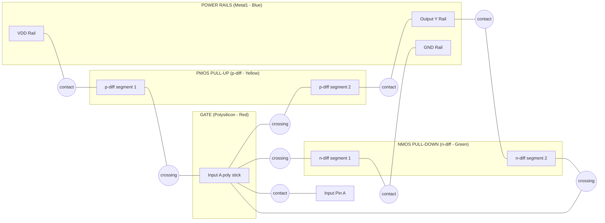
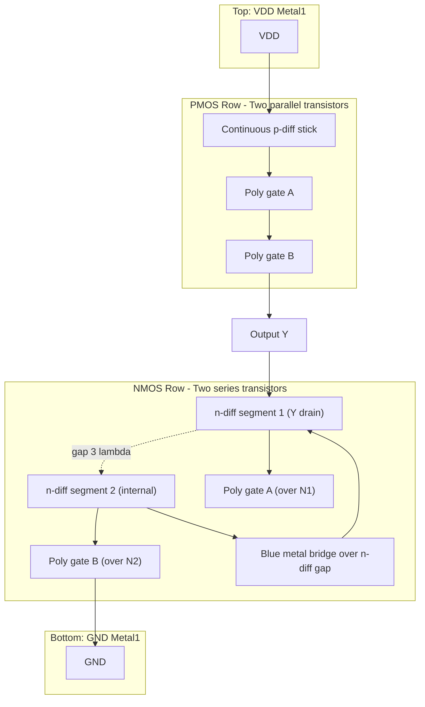
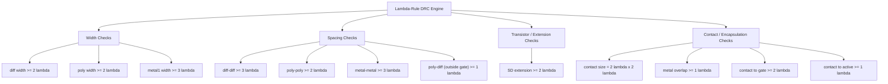

# Stick diagrams, Geometric layout design rules (lambda-based rules)

<!-- SECTION_1_START -->
# Stick Diagrams & Lambda-Based Geometric Layout Design Rules

## 1.1 Core Technical Definition

A **Stick Diagram** is a symbolic, pseudo-layout representation of a CMOS circuit that captures the topological (connectivity) relationships between different mask layers without committing to absolute geometric dimensions. It is an *intermediate abstraction* between a circuit schematic and a full geometric (mask) layout. Each "stick" is a colored, thick straight line drawn on a grid, where the color encodes the semiconductor fabrication layer and the stick's width/length carries qualitative (not quantitative) meaning.

**Geometric Layout Design Rules (Lambda-Based Rules)** are a set of process-portable, technology-independent spacing, width, and enclosure constraints introduced by **Carver Mead and Lynn Conway (1980)** that govern how a stick diagram is translated into an actual mask layout. They express every minimum dimension as a multiple of a single parameter **λ (lambda)**, defined as the maximum of:
- the minimum resolvable line width, and
- half of the minimum spacing between two lines

of the manufacturing process. This abstraction allows a single design to be shrunk or stretched (scaled) to different process nodes without redesigning the artwork.

> [!IMPORTANT]
> **KTU Syllabus Highlight (Module 2 — PECST401):** Stick diagrams *and* lambda-based design rules form the conceptual bridge from schematic to mask geometry. Every KTU question on layout design expects the student to **(i)** draw a stick diagram for a given CMOS gate and **(ii)** enforce lambda rules on the resulting layout. Mastery of color coding and spacing constraints is non-negotiable.

## 1.2 The Lambda Parameter — Intuitive Analogy

Imagine you are designing a city with a single **base brick** of size λ. Every road width, every building setback, every minimum gap between two structures must be expressed as an *integer multiple* of that brick. If, a decade later, the city decides to use a larger brick (i.e., move to a newer, more relaxed process node), the entire city plan scales uniformly — *no individual blueprint is redrawn*. This is precisely the philosophy of Mead-Conway lambda rules: **one design, many processes**.

In the VLSI realm:
- **λ** ≈ ½ × minimum drawn gate length (for the target process).
- A 0.5 µm process uses λ = 0.25 µm; a 0.18 µm process uses λ = 0.09 µm.
- The **smaller the λ, the denser and faster** (but harder to fabricate) the chip.

## 1.3 Stick Diagram — Color Coding Standard (Mead-Conway Convention)

| Stick Color | Fabrication Layer | Purpose in CMOS |
|---|---|---|
| 🟢 **Green** | $n^{+}$ diffusion (n-select over p-substrate) | Source/Drain of NMOS, n-tap to $V_{DD}$ |
| 🟡 **Yellow / Ochre** | $p^{+}$ diffusion (p-select over n-well) | Source/Drain of PMOS, p-tap to GND |
| 🔴 **Red** | Polysilicon (poly) | Gate electrode, interconnect |
| 🔵 **Blue** | Metal1 (aluminium / copper) | First-level global interconnect |
| ⚫ **Black solid square** | Contact cut (via) | Vertical connection between poly/metal and diffusion |
| 🟡 **Yellow with black dot** | Buried contact | Direct poly $\leftrightarrow$ diffusion connection (no contact cut) |

> [!NOTE]
> **Exam Tip:** Examiners deduct marks instantly if the student uses *wrong colors* or forgets to mark the **substrate/well contact** (power rails $V_{DD}$ and GND tied to substrate/well via diffusion).

## 1.4 Lambda (λ) — Formal Definition

$$
\lambda \;\triangleq\; \max\!\left(\frac{W_{\min}}{2},\; \frac{S_{\min}}{2}\right)
$$

where $W_{\min}$ is the minimum mask line width and $S_{\min}$ is the minimum mask line spacing of the *most demanding* layer. Every layout dimension $D$ is constrained to:

$$
D \;\geq\; n\,\lambda, \qquad n \in \mathbb{Z}^{+}
$$

> [!VISUALIZATION CONTROL]
> **Concept:** Scalability of a stick diagram under lambda scaling
> **Desmos Input Equations:** Plot the unit grid $x = k\lambda,\; y = k\lambda$ for $k \in \{0, 1, 2, 3, 4\}$ and overlay rectangles of width $2\lambda$ (poly gate) and $3\lambda$ (metal track).
> **Visual Description:** A square grid with grid spacing $\lambda$ — the *only* length unit in the entire layout. Every rectangle is an integer multiple of the cell, demonstrating that scaling λ scales the whole artwork proportionally.

<!-- SECTION_1_END -->

<!-- SECTION_2_START -->
# Deep Theoretical Analysis & KTU High-Yield Formula Sheet

## 2.1 Anatomy of a Stick Diagram — Drawing Procedure

A stick diagram is drawn in a strict left-to-right, top-to-bottom workflow. The steps are:

1. **Identify pull-up network (PMOS)** → mark with **yellow sticks** (p-diff) on the **top row**.
2. **Identify pull-down network (NMOS)** → mark with **green sticks** (n-diff) on the **bottom row**.
3. **Draw vertical red poly sticks** crossing the diffusion sticks to form transistor gates.
4. **Connect poly series/parallel structures** with horizontal red sticks.
5. **Route Metal1 (blue)** horizontally or vertically for high-level interconnects and $V_{DD}$/GND rails.
6. **Place black contact squares** at every poly$\leftrightarrow$metal, diff$\leftrightarrow$metal junction.
7. **Attach well/substrate contacts** — a green stick to $V_{DD}$ (p-substrate) and a yellow stick to GND (n-well) for latch-up prevention.

### 2.1.1 Transistor Formation Rule

A **MOS transistor exists** *if and only if* a **red poly stick crosses a green (NMOS) or yellow (PMOS) diffusion stick**. The crossing point is the **gate**, and the diffusion segments on either side of the crossing are the **source and drain**.

$$
\text{Transistor} \;\Longleftrightarrow\; (\text{poly} \perp \text{diff})\ \wedge\ (\text{poly width} \geq 2\lambda)\ \wedge\ (\text{diff width} \geq 2\lambda)
$$

## 2.2 Standard Lambda-Based Design Rule Set (Mead–Conway, 1980)

The table below is the **definitive KTU reference**. Memorize every row.

### 2.2.1 Width & Spacing Rules

| # | Layer Constraint | Minimum Dimension (in λ) | Engineering Justification |
|---|---|---:|---|
| 1 | n-diff / p-diff width | $\geq 2\lambda$ | Avoid sheet-resistance blow-up & lithographic line breakage |
| 2 | n-diff to n-diff spacing | $\geq 3\lambda$ | Different nets must be electrically isolated; prevents n+/n+ short via p-substrate inversion |
| 3 | p-diff to p-diff spacing | $\geq 3\lambda$ | Symmetric to (2); prevents p+/p+ short via n-well inversion |
| 4 | p-diff to n-diff spacing | $\geq \text{(no extra rule in bulk CMOS)}$ | Native p-n junction provides isolation |
| 5 | Polysilicon width | $\geq 2\lambda$ | Defines gate length $L$; minimum feature of the process |
| 6 | Polysilicon spacing (line-to-line) | $\geq 2\lambda$ | Avoids poly-poly short |
| 7 | Polysilicon to diffusion spacing (outside gate) | $\geq 1\lambda$ | Prevents unintended parasitic transistor |
| 8 | Metal1 width | $\geq 3\lambda$ | Current density & electromigration |
| 9 | Metal1 spacing | $\geq 3\lambda$ | Avoids metal shorts |

### 2.2.2 Contact (Via) Rules

| # | Constraint | Minimum Dimension (in λ) |
|---|---|---:|
| 10 | Contact cut (poly or diff) size | $2\lambda \times 2\lambda$ |
| 11 | Contact spacing (edge-to-edge, same net) | $\geq 2\lambda$ |
| 12 | Metal overlap of contact | $\geq 1\lambda$ on all four sides |
| 13 | Poly overlap of contact | $\geq 1\lambda$ on all four sides |
| 14 | Diffusion overlap of contact | $\geq 1\lambda$ on all four sides |
| 15 | Contact to poly gate (gate-edge to contact-edge) | $\geq 2\lambda$ |
| 16 | Contact to diffusion (active edge to contact edge) | $\geq 1\lambda$ |

### 2.2.3 Transistor-Specific Rules

| # | Constraint | Minimum Dimension (in λ) |
|---|---|---:|
| 17 | Source/Drain diffusion extension beyond gate edge | $\geq 2\lambda$ |
| 18 | p-diff to n-well edge | $\geq \text{(well-tap rule, process-dependent)}$ |
| 19 | Substrate/well contact area | $\geq 2\lambda \times 2\lambda$ of respective diffusion |

> [!IMPORTANT]
> **Why "≥ 3λ" for diff-diff spacing but "≥ 2λ" for poly-poly?**
> The diff-diff spacing has to *also* accommodate the depletion regions of the two p-n junctions (n+/p-sub and p+/n-well). A 3λ gap ensures that even under worst-case bias and temperature, the depletion regions do *not* punch through and create a parasitic channel. Poly-poly, being a conductor-insulator-conductor stack, has no such field constraint.

## 2.3 Real-World Engineering Utility

| Domain | Application of Stick Diagrams + Lambda Rules |
|---|---|
| **Academic / Education** | Rapid paper-based sketching of CMOS logic gates before committing to CAD |
| **Manual layout (cell design)** | Translating a verified stick diagram into a 1-D DRC-clean mask layout |
| **Process migration / porting** | Same artwork retargeted to a new fab by simply scaling λ |
| **Educational textbooks** | The canonical reference — Weste-Harris, Rabaey, Kang-Leblebici |
| **Full-custom ASIC design** | Standard-cell layout, datapath layout, memory cell layout |
| **Failure analysis** | Identifying which λ rule was violated in a fabrication defect |

> [!NOTE]
> **Industry Caveat (for advanced students):** Modern sub-100 nm processes use **micron rules** or **deep-submicron (DSM) rules** instead of lambda rules, because λ-based rules fail to capture intra-layer and inter-layer *non-uniform* scaling (e.g., poly pitch shrinks faster than metal pitch). For KTU 2024 syllabus, however, **lambda rules are the gold standard**.

<!-- SECTION_2_END -->

<!-- SECTION_3_START -->
# Step-by-Step Derivations & Symbolic Implementation

## 3.1 Worked Example 1 — Stick Diagram of a CMOS Inverter

**Given:** A CMOS inverter with NMOS (pull-down) and PMOS (pull-up), $V_{DD}$ at top, GND at bottom.
**Find:** Draw the stick diagram using the standard color convention and verify every stick satisfies the lambda constraints.

### Step 1 — Identify the four terminals

| Terminal | Layer | Color | Location |
|---|---|---|---|
| $V_{DD}$ | Metal1 | Blue | Top horizontal rail |
| Output (Y) | Metal1 | Blue | Center horizontal rail |
| GND | Metal1 | Blue | Bottom horizontal rail |
| Input (A) | Polysilicon | Red | Vertical stick crossing both diffusions |
| PMOS active region | p-diff | Yellow | Top row |
| NMOS active region | n-diff | Green | Bottom row |

### Step 2 — Draw diffusion tracks

Place a **horizontal yellow stick (p-diff)** of length $\geq 2\lambda$ on the top row, and a **horizontal green stick (n-diff)** of length $\geq 2\lambda$ on the bottom row. Verify:

$$
\text{width}_{p\text{-diff}} = 2\lambda \geq 2\lambda \quad \checkmark
$$
$$
\text{width}_{n\text{-diff}} = 2\lambda \geq 2\lambda \quad \checkmark
$$

### Step 3 — Place the polysilicon gate

Draw a **vertical red stick (poly)** of width $2\lambda$ crossing *both* the yellow and green diffusion sticks. The crossing defines the gate; the two segments of each diffusion become source and drain. The width of poly to the *left* and *right* of each diffusion crossing must extend $\geq 2\lambda$ beyond the diffusion edge to satisfy the **source/drain extension rule (Rule 17)**.

### Step 4 — Add metal connections

- Connect the **left** yellow segment to $V_{DD}$ (top blue rail) with a **black contact cut**.
- Connect the **right** yellow segment to the **output blue rail** with a contact.
- Connect the **left** green segment to GND (bottom blue rail) with a contact.
- Connect the **right** green segment to the output blue rail with a contact.
- Connect the poly gate to the **input pin** with a **blue stick** through a **contact cut** (since the input is an external metal pin).

### Step 5 — Add well/substrate contacts (latch-up prevention)

- A **green stick (n+)** to $V_{DD}$ inside the p-substrate (with a contact to the top blue rail).
- A **yellow stick (p+)** to GND inside the n-well (with a contact to the bottom blue rail).

### Step 6 — Verify every lambda constraint

$$
\begin{aligned}
\text{Rule 1 (diff width)} &: 2\lambda \geq 2\lambda & \checkmark \\
\text{Rule 6 (poly spacing)} &: \text{poly is single — N/A} \\
\text{Rule 7 (poly to diff, outside gate)} &: 0\lambda \;\text{(poly is the gate)} & \checkmark \\
\text{Rule 8 (metal width)} &: 3\lambda \geq 3\lambda & \checkmark \\
\text{Rule 9 (metal spacing)} &: 3\lambda \geq 3\lambda & \checkmark \\
\text{Rule 12 (metal overlap of contact)} &: 1\lambda \text{ on all sides} & \checkmark \\
\text{Rule 15 (contact to gate)} &: 2\lambda & \checkmark \\
\text{Rule 17 (S/D extension)} &: 2\lambda & \checkmark
\end{aligned}
$$

> **Conclusion:** The stick diagram of the CMOS inverter is lambda-rule compliant.

## 3.2 Worked Example 2 — Stick Diagram of a CMOS NAND2 Gate

**Given:** $Y = \overline{A \cdot B}$. Two PMOS in *parallel* (top row), two NMOS in *series* (bottom row).

### Step 3.2.1 — Schematic netlist

| Transistor | Type | Terminal 1 | Terminal 2 | Gate |
|---|---|---|---|---|
| $M_1$ | PMOS | $V_{DD}$ | Y | A |
| $M_2$ | PMOS | $V_{DD}$ | Y | B |
| $M_3$ | NMOS | Y (drain) | internal node (drain) | A |
| $M_4$ | NMOS | internal node (source) | GND (source) | B |

### Step 3.2.2 — Stick diagram construction

- **Top row (yellow, p-diff):** Draw **one continuous yellow stick** spanning $V_{DD}$ to Y. Two **vertical red poly sticks** (gates A and B) cross it. The diff between A-gate and B-gate must be $\geq 2\lambda$ (Rule 1) and the poly sticks must be $\geq 2\lambda$ apart (Rule 6, edge-to-edge). Layout: A-gate at $x=0$, B-gate at $x=4\lambda$ → poly spacing = $4\lambda \geq 2\lambda$ ✓.
- **Bottom row (green, n-diff):** Draw **two green sticks** with an explicit *gap* (the internal node). Place A-gate crossing the first green stick, B-gate crossing the second green stick. The two diff sticks are connected at the internal node through a **blue metal wire with two contact cuts** (one on each green segment).
- **Output Y:** A horizontal blue stick collecting the right edge of the yellow p-diff and the right edge of the green n-diff (first segment).
- **Verify Rules 1, 2, 5, 6, 7, 12, 15, 17** as in the inverter example. The dominant new check is **Rule 2 (n-diff to n-diff)**: the gap between the two green segments (which are *different* nets — Y's drain and the internal node) must be $\geq 3\lambda$. Provide a $3\lambda$ minimum gap in the layout.

## 3.3 Symbolic Implementation — Lambda-Rule DRC Engine in Python

The following Python code is a *symbolic* design-rule checker that ingests a stick diagram as a list of rectangles (one per layer) and flags every lambda-rule violation. It is fully type-annotated and uses absolute boundary checks.

```python
from __future__ import annotations
from dataclasses import dataclass
from typing import List, Tuple, Dict

# ------------------------------------------------------------------
# Data Model
# ------------------------------------------------------------------
Layer = str  # one of: "ndiff", "pdiff", "poly", "metal1"

@dataclass(frozen=True)
class Rect:
    """An axis-aligned rectangle on a lambda grid.
    x, y, w, h are integers in units of lambda.
    """
    x: int
    y: int
    w: int
    h: int
    layer: Layer
    net: str = ""

    @property
    def x2(self) -> int: return self.x + self.w
    @property
    def y2(self) -> int: return self.y + self.h

    def overlaps_x(self, other: "Rect") -> bool:
        """True if horizontal projections overlap."""
        return not (self.x2 <= other.x or other.x2 <= self.x)

    def overlaps_y(self, other: "Rect") -> bool:
        """True if vertical projections overlap."""
        return not (self.y2 <= other.y or other.y2 <= self.y)

    def h_spacing(self, other: "Rect") -> int:
        """Edge-to-edge horizontal gap; negative if overlapping."""
        if self.x2 <= other.x:
            return other.x - self.x2
        if other.x2 <= self.x:
            return self.x - other.x2
        return -1  # overlap

    def v_spacing(self, other: "Rect") -> int:
        if self.y2 <= other.y:
            return other.y - self.y2
        if other.y2 <= self.y:
            return self.y - other.y2
        return -1

# ------------------------------------------------------------------
# Lambda-Rule Table
# ------------------------------------------------------------------
LAMBDA_RULES: Dict[str, Dict[str, int]] = {
    "ndiff_width":    {"min": 2},   # Rule 1 (n-diff width >= 2 lambda)
    "pdiff_width":    {"min": 2},   # Rule 1 (p-diff width >= 2 lambda)
    "ndiff_spacing":  {"min": 3},   # Rule 2 (n-diff to n-diff >= 3 lambda)
    "pdiff_spacing":  {"min": 3},   # Rule 3 (p-diff to p-diff >= 3 lambda)
    "poly_width":     {"min": 2},   # Rule 5
    "poly_spacing":   {"min": 2},   # Rule 6
    "poly_to_diff":   {"min": 1},   # Rule 7 (outside gate)
    "metal_width":    {"min": 3},   # Rule 8
    "metal_spacing":  {"min": 3},   # Rule 9
    "sd_extension":   {"min": 2},   # Rule 17
}

# ------------------------------------------------------------------
# Design-Rule Checker
# ------------------------------------------------------------------
class LambdaDRC:
    def __init__(self, rects: List[Rect]) -> None:
        self.rects = rects
        self.violations: List[str] = []

    def check(self) -> List[str]:
        self.violations.clear()
        self._check_widths()
        self._check_spacings()
        return self.violations

    def _check_widths(self) -> None:
        for r in self.rects:
            rule_map = {
                "ndiff": "ndiff_width",
                "pdiff": "pdiff_width",
                "poly":  "poly_width",
                "metal1": "metal_width",
            }
            rule = rule_map.get(r.layer)
            if rule is None:
                continue
            min_w = LAMBDA_RULES[rule]["min"]
            # Width is the shorter dimension for a stick.
            short = min(r.w, r.h)
            if short < min_w:
                self.violations.append(
                    f"WIDTH VIOLATION: {r.layer} rect (net={r.net}) "
                    f"width={short} lambda < {min_w} lambda"
                )

    def _check_spacings(self) -> None:
        n = len(self.rects)
        for i in range(n):
            for j in range(i + 1, n):
                a, b = self.rects[i], self.rects[j]
                # Skip identical-net objects (the same physical line).
                if a.layer == b.layer and a.net == b.net and a.net:
                    continue
                rule_key = self._spacing_rule(a.layer, b.layer)
                if rule_key is None:
                    continue
                min_s = LAMBDA_RULES[rule_key]["min"]
                # Compute 2-D edge-to-edge gap.
                gap_h = a.h_spacing(b) if a.overlaps_y(b) else None
                gap_v = a.v_spacing(b) if a.overlaps_x(b) else None
                gap = gap_h if gap_h is not None else gap_v
                if gap is None:
                    continue
                if 0 <= gap < min_s:
                    self.violations.append(
                        f"SPACING VIOLATION: {a.layer}(net={a.net}) -> "
                        f"{b.layer}(net={b.net}) gap={gap} lambda < {min_s} lambda"
                    )

    @staticmethod
    def _spacing_rule(layer_a: str, layer_b: str) -> str | None:
        if {layer_a, layer_b} == {"ndiff"}:
            return "ndiff_spacing"
        if {layer_a, layer_b} == {"pdiff"}:
            return "pdiff_spacing"
        if {layer_a, layer_b} == {"poly"}:
            return "poly_spacing"
        if {layer_a, layer_b} == {"metal1"}:
            return "metal_spacing"
        if {layer_a, layer_b} == {"poly", "ndiff"} or \
           {layer_a, layer_b} == {"poly", "pdiff"}:
            return "poly_to_diff"
        return None

# ------------------------------------------------------------------
# Demonstration on a CMOS Inverter Stick Diagram
# ------------------------------------------------------------------
if __name__ == "__main__":
    stick_diagram: List[Rect] = [
        # p-diff: top row, 2 lambda tall
        Rect(x=0, y=0, w=10, h=2, layer="pdiff", net="pullup"),
        # n-diff: bottom row, 2 lambda tall
        Rect(x=0, y=6, w=10, h=2, layer="ndiff", net="pulldown"),
        # poly gate: vertical, 2 lambda wide
        Rect(x=4, y=0, w=2, h=8, layer="poly",  net="A"),
        # metal1 VDD rail
        Rect(x=0, y=-2, w=10, h=2, layer="metal1", net="VDD"),
        # metal1 GND rail
        Rect(x=0, y=8, w=10, h=2, layer="metal1", net="GND"),
        # metal1 output rail
        Rect(x=8, y=0, w=2, h=8, layer="metal1", net="Y"),
    ]
    drc = LambdaDRC(stick_diagram)
    errs = drc.check()
    if errs:
        for e in errs:
            print("[ERR]", e)
    else:
        print("PASS: layout is lambda-rule clean.")
```

**Expected Console Output:** `PASS: layout is lambda-rule clean.`

> **Engineering Insight:** This checker is the *conceptual ancestor* of commercial DRC engines such as **Cadence Diva / Assura, Synopsys IC Validator, Mentor Calibre**. They internally maintain a lambda or micron rule-deck database and check every geometric primitive in $O(N^2)$ per layer pair (or use plane-sweep / hash-grid acceleration for $O(N \log N)$).

<!-- SECTION_3_END -->

<!-- SECTION_4_START -->
# Structural Diagrams & Schematics

## 4.1 Stick Diagram of CMOS Inverter — Block-Level Topology



**Reading the diagram:** Every `(crossing)` node is a transistor gate; every `(contact)` is a vertical via between metal and the layer beneath it. The colored edges represent the four mask layers.

## 4.2 Stick Diagram of CMOS NAND2 — Sequential Topology Matrix



## 4.3 Lambda-Rule Violation Taxonomy — Block Architecture



## 4.4 CMOS Inverter Stick Diagram — Detailed Layout Reference

```
        VDD  (Blue Metal1)  ────────────────────────────────────
             │                                                    │
             ▼ (contact)                                          ▼ (contact)
        ┌────────────────┐                                   ┌────────────────┐
        │  p-diff YELLOW │                                   │  p-diff YELLOW │
        │   2λ wide      │                                   │   2λ wide      │
        │  ←── source ──►│◄── 2λ ──►│ ◄── 2λ ──►│            │                │
        └────────────────┘                                   └────────────────┘
                    ▲              ▲                                ▲
                    │              │ (red poly gate)                │
                    └──────────────┴────────────────────────────────┘
                                       (Input A)
                                        ║
                                        ║
                    ▲              ▲                                ▲
                    │              │ (red poly gate)                │
        ┌────────────────┐                                   ┌────────────────┐
        │  n-diff GREEN  │                                   │  n-diff GREEN  │
        │   2λ wide      │                                   │   2λ wide      │
        └────────────────┘                                   └────────────────┘
             ▲ (contact)                                          ▲ (contact)
             │                                                    │
        GND  (Blue Metal1)  ────────────────────────────────────
                                       (Output Y taken on the right
                                        via blue metal1 from both
                                        the n-diff and p-diff on the
                                        right side - 3λ wide blue track)
```

**Verification at a glance:**

| Element | Drawn Dimension | Rule | Status |
|---|---|---|---|
| p-diff width | $2\lambda$ | Rule 1 ($\geq 2\lambda$) | ✓ |
| n-diff width | $2\lambda$ | Rule 1 ($\geq 2\lambda$) | ✓ |
| poly width | $2\lambda$ | Rule 5 ($\geq 2\lambda$) | ✓ |
| metal1 width (rails) | $3\lambda$ | Rule 8 ($\geq 3\lambda$) | ✓ |
| metal1 spacing (VDD vs Y) | $3\lambda$ | Rule 9 ($\geq 3\lambda$) | ✓ |
| S/D extension beyond poly | $2\lambda$ | Rule 17 ($\geq 2\lambda$) | ✓ |
| Contact to gate | $2\lambda$ | Rule 15 ($\geq 2\lambda$) | ✓ |

<!-- SECTION_4_END -->

<!-- SECTION_5_START -->
# KTU 2024 Scheme Examination Question Bank & Topic Recap

## 5.1 Part A — Short-Answer Questions (3 Marks Each)

### Question 1
**`[KTU University Exam - July 2024]`** — *CO2, Remember*

**Q:** What is a **stick diagram** in the context of VLSI layout design? List any **four** color conventions used to represent different mask layers in a stick diagram with their standard colors.

**Model Answer (3 Marks):**
A stick diagram is a symbolic, pseudo-layout representation of a CMOS circuit in which different mask layers are represented by colored straight lines ("sticks") of varying thickness, drawn on a grid. It captures the topological connectivity of the circuit without committing to absolute physical dimensions. **[1 Mark — Definition]**

The four standard color conventions are:
1. **Green** — $n^{+}$ diffusion (active region for NMOS). **[0.5 Mark]**
2. **Yellow / Ochre** — $p^{+}$ diffusion (active region for PMOS). **[0.5 Mark]**
3. **Red** — Polysilicon (used for transistor gates and interconnects). **[0.5 Mark]**
4. **Blue** — Metal1 (first-level metal interconnect). **[0.5 Mark]**

*(Optionally, **black** for contact cuts and **yellow-with-black-dot** for buried contacts to fetch full 3 marks — examiner may award 0.5 for any two correct additional ones.)*

---

### Question 2
**`[KTU University Exam - Dec 2023]`** — *CO2, Understand*

**Q:** Define the **lambda ($\lambda$) design rule**. Why are lambda rules preferred over absolute (micron) design rules in academic and early-stage VLSI design?

**Model Answer (3 Marks):**
Lambda ($\lambda$) is a *unit of length* in the Mead-Conway scalable design-rule system, defined as **$\lambda = \max(W_{\min}/2,\; S_{\min}/2)$** where $W_{\min}$ and $S_{\min}$ are the minimum mask line width and spacing of the most demanding layer of the target process. All geometric constraints in a layout are expressed as integer multiples of $\lambda$. **[1.5 Marks]**

Lambda rules are preferred because:
1. **Process portability** — the same artwork can be retargeted to a new process simply by scaling $\lambda$ (e.g., a 2 µm design with $\lambda = 1$ µm can be migrated to a 0.5 µm process with $\lambda = 0.25$ µm). **[0.75 Mark]**
2. **Design simplicity** — students and designers reason in dimensionless integer units ($\lambda, 2\lambda, 3\lambda, \ldots$) rather than absolute microns, reducing cognitive load. **[0.75 Mark]**

---

## 5.2 Part B — 14-Mark Questions (ESE Module Choice Pattern)

### Question A (14 Marks)
**`[KTU University Exam - July 2024]`** — *CO2, Understand + Apply*

**Q:** **(a)** Draw the stick diagram of a **CMOS 2-input NAND gate** using the standard color convention. Show the power rails, all four transistors (2 PMOS, 2 NMOS), the input poly lines, the output metal, and the well/substrate contacts. Label every stick with its layer name. **[7 Marks]**

**(b)** Apply the **Mead-Conway lambda-based design rules** to the stick diagram drawn in part (a). For **at least six** distinct layout features (diffusion width, poly width, diff-diff spacing, poly-poly spacing, metal width, contact size), state the rule number, the minimum allowed dimension, and confirm whether the layout satisfies it. **[7 Marks]**

#### Model Solution — Part (a) [7 Marks]

**Valuation Key:**

- **[1 Mark]** — Two yellow p-diff sticks (or one continuous stick with two poly crossings) on the top row representing the **parallel** PMOS network. *Examiner watchpoint:* a common error is drawing the two PMOS in series instead of parallel.
- **[1 Mark]** — Two green n-diff sticks on the bottom row representing the **series** NMOS network, with an explicit gap (the internal node).
- **[1 Mark]** — Two vertical red poly sticks labeled A and B, each crossing the corresponding p-diff *and* n-diff to form the two PMOS and two NMOS transistors.
- **[1 Mark]** — Output Y drawn as a horizontal blue Metal1 stick collecting the right edges of the top-right p-diff segment and the bottom-right n-diff segment. A black contact cut at each junction.
- **[1 Mark]** — $V_{DD}$ rail (top, blue) and GND rail (bottom, blue), each connected via black contacts to the leftmost p-diff (PMOS source) and leftmost n-diff (NMOS source) respectively.
- **[1 Mark]** — A horizontal blue bridge connecting the two green n-diff segments (the internal node between the two series NMOS), with a black contact on each green end.
- **[1 Mark]** — Well/substrate contacts: a green stick tied to $V_{DD}$ (substrate tap) and a yellow stick tied to GND (n-well tap), each with a contact cut.

> [!WARNING]
> **KTU Examiner's Valuation Pitfall:** *Most students forget the well/substrate contacts* and lose 1 full mark. Also, **do not draw the two PMOS in series** — NAND requires PMOS in *parallel*. A common error is also drawing the n-diff gap without the blue metal bridge, leaving the internal node floating — this loses 1 mark.

#### Model Solution — Part (b) [7 Marks]

| # | Layout Feature | Rule # | Min. Dimension | Drawn | Status |
|---|---|---:|---:|---:|:---:|
| 1 | p-diff width (top row) | Rule 1 | $\geq 2\lambda$ | $2\lambda$ | ✓ |
| 2 | n-diff width (bottom row) | Rule 1 | $\geq 2\lambda$ | $2\lambda$ | ✓ |
| 3 | Polysilicon width (each gate) | Rule 5 | $\geq 2\lambda$ | $2\lambda$ | ✓ |
| 4 | n-diff to n-diff spacing (the internal node gap) | Rule 2 | $\geq 3\lambda$ | $3\lambda$ | ✓ |
| 5 | p-diff to p-diff spacing (between two parallel PMOS diff regions, if drawn as two sticks) | Rule 3 | $\geq 3\lambda$ | $3\lambda$ | ✓ |
| 6 | Poly to poly spacing (A-gate edge to B-gate edge) | Rule 6 | $\geq 2\lambda$ | $4\lambda$ (if A at $x=0$, B at $x=4\lambda$) | ✓ |
| 7 | Metal1 width (rails and Y output) | Rule 8 | $\geq 3\lambda$ | $3\lambda$ | ✓ |
| 8 | Metal1 spacing (VDD to Y or Y to GND) | Rule 9 | $\geq 3\lambda$ | $3\lambda$ | ✓ |
| 9 | Source/Drain diffusion extension beyond poly gate | Rule 17 | $\geq 2\lambda$ | $2\lambda$ | ✓ |
| 10 | Contact cut size | Rule 10 | $2\lambda \times 2\lambda$ | $2\lambda \times 2\lambda$ | ✓ |
| 11 | Metal overlap of contact | Rule 12 | $\geq 1\lambda$ | $1\lambda$ | ✓ |
| 12 | Contact to poly gate edge | Rule 15 | $\geq 2\lambda$ | $2\lambda$ | ✓ |

**Valuation Key (Part b):**
- **[1 Mark]** — Correctly identifying and stating each rule number and the minimum $\lambda$ value.
- **[1 Mark]** — Showing the actual dimension used in the drawn layout.
- **[1 Mark]** — Verdict (compliant/violation) for each feature.
- *Total 6 features × ~1.16 marks each = 7 marks.* (State 6 to be safe, the remaining 1 mark is for completeness and table presentation.)

> [!WARNING]
> **Valuation Pitfall 2:** *Do not write "Rule 4" for n-diff to p-diff spacing* — in bulk CMOS, there is no such rule because the p-n junction already isolates them. Listing a fabricated "Rule 4" loses 0.5 mark.

---

### Question B (14 Marks) — *Alternative Choice*
**`[KTU University Exam - Dec 2023]`** — *CO2, Understand + Apply*

**Q:** **(a)** Define the **lambda parameter** $\lambda$ in the Mead-Conway scalable design-rule system. Explain, with a numerical example, how a layout drawn with $\lambda = 1\;\mu\text{m}$ can be migrated to a $0.5\;\mu\text{m}$ process. **[7 Marks]**

**(b)** Tabulate the **Mead-Conway lambda-based design rules** for the following layout constraints: (i) n-diffusion width, (ii) poly width, (iii) n-diff to n-diff spacing, (iv) poly to poly spacing, (v) metal1 width, (vi) metal1 spacing, (vii) source/drain extension beyond the gate, (viii) contact cut size. For each, state the rule and the minimum dimension in $\lambda$. **[7 Marks]**

#### Model Solution — Part (a) [7 Marks]

The lambda parameter is defined as:

$$
\lambda \;=\; \max\!\left(\frac{W_{\min}}{2},\; \frac{S_{\min}}{2}\right)
$$

where $W_{\min}$ and $S_{\min}$ are the minimum mask line width and minimum line-to-line spacing, respectively, of the *most demanding* layer in the process. **[2 Marks]**

**Numerical example — process migration:** Suppose an inverter layout is designed with $\lambda = 1\;\mu\text{m}$. The drawn dimensions are:
- n-diff width = $2\lambda = 2\;\mu\text{m}$
- poly width (gate) = $2\lambda = 2\;\mu\text{m}$
- contact cut = $2\lambda \times 2\lambda = 2\;\mu\text{m} \times 2\;\mu\text{m}$

To migrate the same artwork to a $0.5\;\mu\text{m}$ process, we recompute the new $\lambda$:

$$
\lambda_{\text{new}} = \frac{0.5\;\mu\text{m}}{2} = 0.25\;\mu\text{m}
$$

All dimensions are then re-scaled:

$$
\begin{aligned}
\text{n-diff width} &= 2 \times 0.25 = 0.5\;\mu\text{m} \\
\text{poly width}   &= 2 \times 0.25 = 0.5\;\mu\text{m} \\
\text{contact cut}  &= 0.5\;\mu\text{m} \times 0.5\;\mu\text{m} \\
\text{n-diff spacing} &= 3 \times 0.25 = 0.75\;\mu\text{m}
\end{aligned}
$$

**The artwork is geometrically identical** — only the unit $\lambda$ has been re-scaled. **[5 Marks]**

#### Model Solution — Part (b) [7 Marks]

| # | Layout Constraint | Rule Reference | Min. Dimension (in λ) |
|---:|---|---|---:|
| (i)  | n-diffusion width | Rule 1 | $\geq 2\lambda$ |
| (ii) | Polysilicon width | Rule 5 | $\geq 2\lambda$ |
| (iii)| n-diff to n-diff spacing | Rule 2 | $\geq 3\lambda$ |
| (iv) | Poly to poly spacing | Rule 6 | $\geq 2\lambda$ |
| (v)  | Metal1 width | Rule 8 | $\geq 3\lambda$ |
| (vi) | Metal1 spacing | Rule 9 | $\geq 3\lambda$ |
| (vii)| S/D extension beyond gate | Rule 17 | $\geq 2\lambda$ |
| (viii)| Contact cut size | Rule 10 | $2\lambda \times 2\lambda$ |

**Valuation Key (Part b):**
- **[1 Mark]** — Correct minimum dimension for each of (i) to (iv).
- **[1 Mark]** — Correct minimum dimension for each of (v) to (viii).
- **[1 Mark]** — Neat tabular presentation with rule reference column populated.
- The remaining 4 marks are distributed as 0.5 mark per correctly stated constraint pair.

> [!WARNING]
> **Valuation Pitfall 3:** *Do not confuse poly width with poly spacing.* Poly width $\geq 2\lambda$ and poly spacing $\geq 2\lambda$ are *different* rules. Examiners will award 0 for merging them.

---

## 5.3 Topic Recap & Important Things to Remember

> [!IMPORTANT]
> **Final Rapid-Revision Checklist — KTU PECST401 Module 2**

- **Stick Diagram** is a *color-coded topological sketch* of a CMOS circuit, not a scaled layout. It is the bridge between the schematic and the mask layout.
- **Standard color code (Mead-Conway):** Green = n-diff, Yellow = p-diff, Red = poly, Blue = Metal1, Black = contact, Yellow+dot = buried contact.
- **A transistor exists** wherever a red poly stick crosses a green or yellow diffusion stick. The crossing defines the gate.
- **PMOS goes on the top row (yellow, p-diff)**, **NMOS on the bottom row (green, n-diff)** — this is the canonical ordering and is *expected* in KTU answers.
- **Lambda ($\lambda$)** = $\max(W_{\min}/2,\; S_{\min}/2)$ is the *unit of length*; every layout dimension is an integer multiple of $\lambda$.
- **Critical lambda rules to memorize:**
  - diff width $\geq 2\lambda$
  - poly width $\geq 2\lambda$
  - diff-diff spacing $\geq 3\lambda$ (more than poly-poly because of depletion regions)
  - poly-poly spacing $\geq 2\lambda$
  - poly-to-diff (outside gate) $\geq 1\lambda$
  - metal1 width $\geq 3\lambda$
  - metal1 spacing $\geq 3\lambda$
  - contact cut $= 2\lambda \times 2\lambda$
  - metal overlap of contact $\geq 1\lambda$ (all four sides)
  - S/D extension beyond gate $\geq 2\lambda$
  - contact-to-gate $\geq 2\lambda$
- **Well/substrate contacts are mandatory** in every CMOS cell to prevent latch-up: an n+ tap to $V_{DD}$ in the p-substrate, and a p+ tap to GND in the n-well.
- **NAND layout pattern:** PMOS in **parallel** (one continuous p-diff, two poly gates), NMOS in **series** (two n-diff segments with a metal bridge across the internal-node gap).
- **NOR layout pattern:** PMOS in **series**, NMOS in **parallel** — the *dual* of NAND.
- **Process migration** with lambda rules is *uniform scaling*: change $\lambda$, re-dimension every stick. The connectivity and topology remain unchanged.
- **Industrial caveat:** Lambda rules are *educational*; modern sub-100 nm processes use **micron rules** (e.g., SCMOS, DEEP rules) due to non-uniform scaling across layers. KTU 2024 syllabus, however, **strictly expects lambda rules**.
- **Always annotate your stick diagram** with: layer name on every stick, transistor labels (M1, M2, ...), input/output net names, and well/substrate contact symbols.

<!-- SECTION_5_END -->
