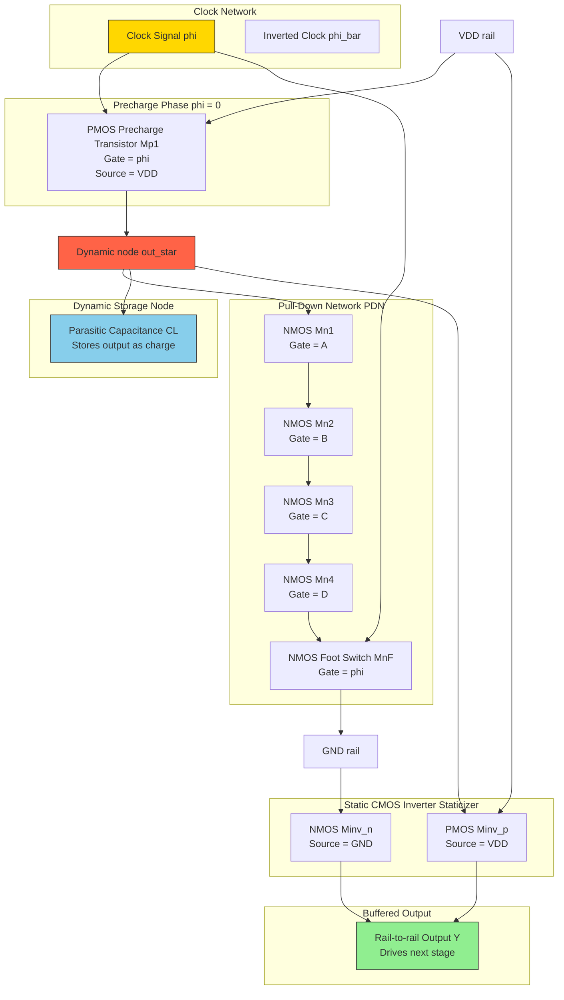
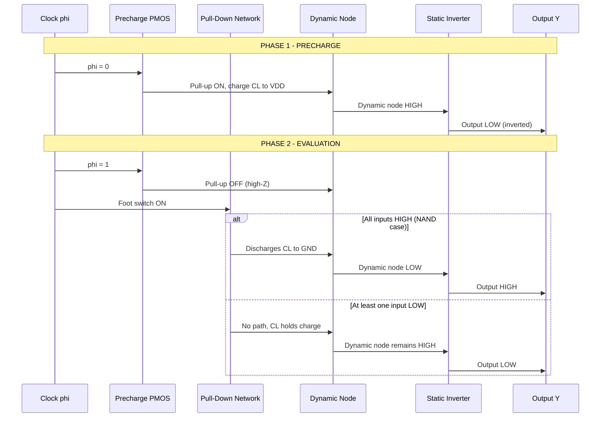
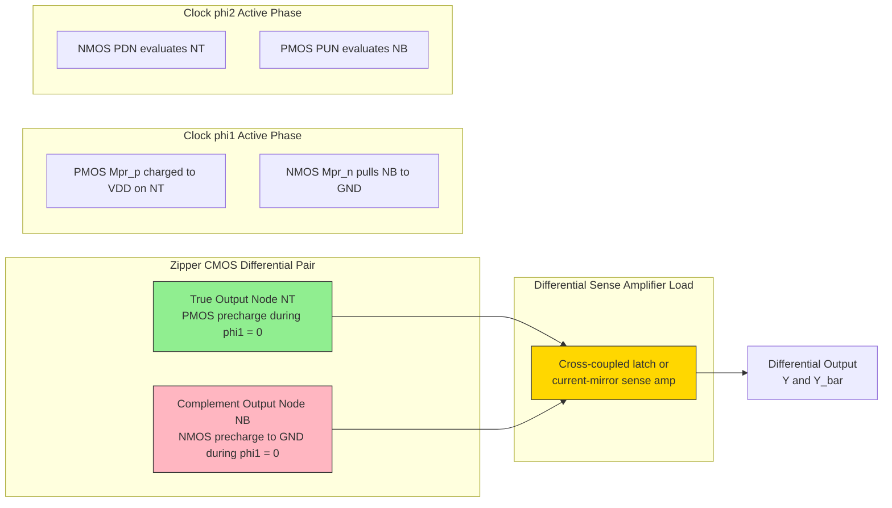
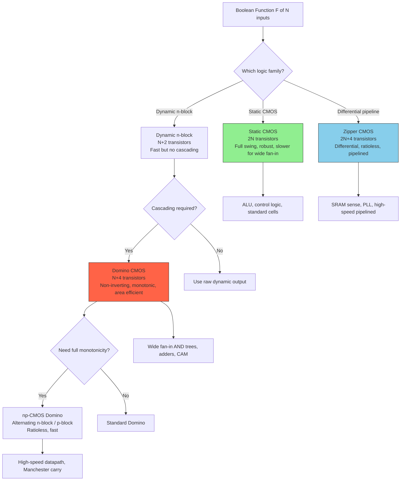
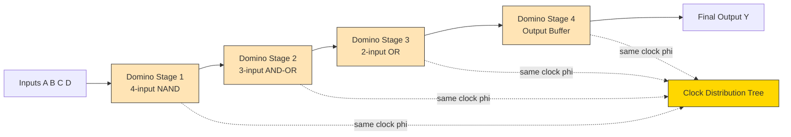

# Dynamic CMOS logic architectures: Domino logic, Zipper CMOS logic structures

<!-- SECTION_1_START -->

# Dynamic CMOS Logic Architectures: Domino & Zipper CMOS

> [!NOTE]
> **KTU 2024 Syllabus Anchor — PECST401 / Module 3**
> This topic falls under **Combinational Logic Circuits** and directly maps to **CO2: Design combinational logic circuits using CMOS technologies** and **CO3: Analyze dynamic and advanced CMOS logic families** with Bloom's Cognitive Levels Apply / Analyze.

## 1.1 Formal Definition

**Dynamic CMOS Logic** is a class of MOS logic circuits in which the output state is temporarily stored on the parasitic (or explicit) **capacitance at the output node** rather than being driven continuously by a pull-up/pull-down path. The circuit operates in two distinct, non-overlapping clock phases driven by a single clock $\phi$ (and its complement $\bar{\phi}$):

1. **Precharge Phase** — When $\phi = 0$, the output node is unconditionally charged to $V_{DD}$ by a single PMOS pull-up transistor.
2. **Evaluation Phase** — When $\phi = V_{DD}$, the pull-up is cut off and a pull-down network (PDN) of NMOS transistors conditionally discharges the output based on the input combination.

> [!IMPORTANT]
> **Why "Dynamic"?** Because information is stored as **charge on a node capacitance** $C_L$ for a finite duration, not on a steady-state conducting path. The storage time is limited by **leakage currents**, which is why dynamic logic is used at clock frequencies above a few hundred kHz to a few MHz (the **minimum clock frequency** constraint).

Two important specialized variants taught at KTU level are:

- **Domino CMOS Logic** — A dynamic logic stage cascaded with a static CMOS inverter. The inverter is the "staticizer" that makes the output rail-to-rail, restores logic levels, and allows **cascading** of multiple dynamic stages.
- **Zipper CMOS Logic** — A **fully differential / pipelined dynamic logic** family in which PMOS and NMOS pull-up networks are both clocked, eliminating the asymmetric precharge/evaluation by using both clock edges, hence the name "Zipper."

## 1.2 Conceptual Analogy — The Water Bucket Model

Imagine a **water bucket** with a small leak at the bottom (this is your capacitor $C_L$ with leakage).

- During **Precharge** (filling phase): A tap (PMOS, controlled by $\phi = 0$) fills the bucket to the brim ($V_{DD}$).
- During **Evaluation** (draining phase): The tap is closed. Several valves at the bottom (NMOS PDN, controlled by inputs $A, B, C \dots$) are now opened in parallel-series combination. If the right combination is TRUE, the bucket drains to empty (GND). If FALSE, the bucket holds its water (stays at $V_{DD}$).

> [!TIP]
> The **leak** represents the leakage current that limits how long the bucket can "remember" its state. If you wait too long between fills, the bucket empties by itself — a phenomenon called **dynamic-node leakage failure** or **soft error** in dynamic logic.

For **Domino Logic**, picture placing a **one-way valve** (a static CMOS inverter) at the bucket outlet. The valve:
1. Prevents the bucket from accidentally leaking backward (noise immunity on the dynamic node).
2. Inverts the logic so subsequent buckets can be stacked (cascaded) reliably.
3. Provides a clean, full-swing output to drive the next dynamic stage.

For **Zipper CMOS**, picture **two buckets on a seesaw** — when the top one fills, the bottom one drains, and vice versa on the next clock half-cycle. This dual-bucket mechanism gives a fully differential, ratioless, symmetric operation.

## 1.3 Key Physical & Geometric Constants Used

- **$V_{DD}$** — Supply voltage (typical: **1.8 V** for 180 nm, **1.2 V** for 130 nm, **0.9 V** for 65 nm KTU process nodes).
- **$V_{Tn}, V_{Tp}$** — Threshold voltages of NMOS and PMOS (**$\vert V_{Tn} \vert \approx 0.4$–$0.5$ V**, **$\vert V_{Tp} \vert \approx 0.5$–$0.6$ V**).
- **$C_L$** — Total load capacitance at the output node (sum of diffusion, gate, and wire capacitances).
- **$T_{clk}$** — Clock period. The minimum $T_{clk}$ is set by the worst-case evaluation delay.

> [!VISUALIZATION CONTROL]
> **Concept:** Two-Phase Precharge / Evaluate Waveform of a Dynamic CMOS Gate
> **GeoGebra / Desmos Input Equations:**
> * `phi(t) = 0` for `t mod 2 < 1`, `phi(t) = 1` for `t mod 2 >= 1`
> * `phi_bar(t) = 1 - phi(t)`
> * `V_out(t) = 0.9 * phi_bar(t mod 2) + 0.9 * phi(t mod 2 - 1) * (1 - eval_signal)`
> **Visual Description:** The student should see a square clock $\phi$ alternating between 0 and 1. The dynamic output node is pulled HIGH only during $\phi = 0$ (precharge) and conditionally discharged during $\phi = 1$ (evaluate), producing non-overlapping behaviour.

---

<!-- SECTION_1_END -->

<!-- SECTION_2_START -->

# Deep Theoretical Analysis & KTU High-Yield Formula Sheet

## 2.1 The Canonical n-type Dynamic CMOS Gate

The simplest dynamic CMOS structure is the **n-block dynamic gate** (sometimes called a "DOMINO primitive" without the static inverter). For a 4-input NAND, the structure is:

| Transistor | Type | Gate Signal | Function |
|------------|------|-------------|----------|
| $M_1$ | PMOS | $\phi$ | Precharge transistor (pulls output to $V_{DD}$) |
| $M_2, M_3, M_4, M_5$ | NMOS | $A, B, C, D$ | Pull-down network implementing the Boolean function |
| $M_6$ | NMOS | $\phi$ | Evaluation transistor (foot switch) |

> [!IMPORTANT]
> The **foot switch** $M_6$ (gated by $\phi$) prevents the PDN from accidentally discharging during precharge. **Without the foot switch, a low-going input during precharge would falsely discharge the output.**

### Two-Phase Operation Table

| Phase | $\phi$ | $\bar{\phi}$ | $M_1$ (PMOS precharge) | $M_6$ (foot) | Output node behaviour |
|-------|--------|--------------|--------------------------|---------------|------------------------|
| **Precharge** | 0 | $V_{DD}$ | ON (passes $V_{DD}$) | OFF | Output forced to $V_{DD}$ unconditionally |
| **Evaluation** | $V_{DD}$ | 0 | OFF (high-Z) | ON | Output conditionally discharged by PDN based on inputs |

## 2.2 Why Static CMOS Alone Is Not Enough

In static CMOS, an N-input NAND requires **2N transistors** (N PMOS in series + N NMOS in parallel). For wide fan-in gates (e.g., 8-input AND), the PMOS stack becomes very slow because series PMOS transistors are weak (low mobility $\mu_p \approx 0.4 \mu_n$).

Dynamic CMOS solves this by using **only one PMOS precharge transistor** and a parallel NMOS network — giving **N + 2 transistors** for an N-input gate. This is the **area advantage** and the **speed advantage** that make dynamic logic attractive for **wide fan-in** structures such as:
- Register file read/write bit-lines
- Content-Addressable Memory (CAM) match lines
- Domino adders and Manchester carry chains
- High-performance ALU datapaths

## 2.3 The Domino CMOS Logic Family

The pure dynamic gate cannot drive another dynamic gate directly because:
- During precharge, the dynamic node is HIGH. If it feeds the next dynamic gate's NMOS PDN, the next gate would see a HIGH input during precharge and may falsely evaluate.
- There is no buffering for the next stage.

**Solution: Cascade with a static CMOS inverter.** This is the **Domino gate**.

The output of the dynamic node (call it $\text{out}^*$) drives a **static CMOS inverter** producing $\overline{\text{out}^*}$. The final output is the **non-inverting** version of the dynamic evaluation.

### Key Properties of Domino Logic

1. **Non-inverting** — A single dynamic stage inverts once internally; the static inverter flips it back, so Domino outputs are **non-inverting**, making cascading easy.
2. **Single clock** — All gates use the same clock $\phi$.
3. **"Domino" effect** — Like a row of falling dominoes, during evaluation each gate can trigger the next because outputs are monotonically rising (or monotonically falling in np-CMOS Domino variants).
4. **Reduced input capacitance** — Only NMOS PDN at inputs, so gate input cap is roughly **half that of static CMOS**.

### Noise Margin Consideration

The dynamic node $\text{out}^*$ is **highly susceptible to noise** because it is a high-impedance node. The **inverter's switching threshold** $V_{inv}$ acts as a noise filter — any noise on $\text{out}^*$ less than $V_{inv}$ does not propagate to the next stage. This is called the **inverter noise filtering property**.

> [!TIP]
> **For KTU answers:** Always mention that the **inverter's low-to-high switching threshold** $V_{M,IL}$ provides a noise margin of $V_{OH} - V_{M,IL}$ against dynamic-node noise. This is a favourite 2-mark sub-question in the ESE.

## 2.4 Standard Domino Logic — Multiple-Output Domino (MODL) and np-CMOS Domino

### np-CMOS Domino (np-CMOS logic)
- Uses alternating **n-block** and **p-block** dynamic stages.
- n-block precharges HIGH, evaluates LOW.
- p-block precharges LOW, evaluates HIGH.
- This solves the **monotonicity problem** of standard Domino where the inputs to the next stage must be monotonically rising during evaluation.
- np-CMOS is fully **ratioless** and **cascadable** without the static inverter (each stage drives the next directly).

### Multiple-Output Domino Logic (MODL)
- Shares the precharge transistors and the clock distribution among multiple outputs.
- One precharge PMOS charges several internal nodes simultaneously.
- Different evaluation NMOS networks produce multiple Boolean functions in parallel.
- **Area savings** can exceed 30% in datapath-heavy designs.

## 2.5 Zipper CMOS Logic — The Differential, Pipelined Dynamic Family

**Zipper CMOS** is a **fully differential** dynamic logic family introduced by **Hicks & Nofal (1980s)**. The defining features are:

- Two complementary clocks: $\phi_1$ and $\phi_2$, **non-overlapping**.
- A **PMOS pull-up network** and an **NMOS pull-down network** are both active and clocked.
- A **pMOS precharge** on the "true" output node during $\phi_1 = 0$.
- An **nMOS precharge** (i.e., pull-down to GND) on the "complement" output node during the same phase.
- During the next phase, the roles reverse — hence the name **"Zipper"** (interlocking, alternating action).

### Operation Cycle

| Phase | $\phi_1$ | $\phi_2$ | True output node | Complement output node |
|-------|----------|----------|--------------------|--------------------------|
| Precharge | 0 | 1 | Precharged to $V_{DD}$ via PMOS | Precharged to GND via NMOS |
| Evaluate | 1 | 0 | Conditionally discharged by NMOS PDN | Conditionally charged to $V_{DD}$ by PMOS PUN |

### Advantages of Zipper CMOS

1. **Fully differential** — Provides both true and complement outputs, ideal for differential sense amplifiers and high-speed SRAM.
2. **Ratioless** — No DC path from $V_{DD}$ to GND; static power is ideally zero.
3. **Higher noise immunity** — Differential signalling cancels common-mode noise.
4. **Pipeline-friendly** — Two non-overlapping clocks allow natural 2-phase pipelining.
5. **No monotonicity constraint** in the same sense as Domino because each phase evaluates a fresh output.

### Disadvantages of Zipper CMOS

1. **Twice the clock routing** — Both $\phi_1$ and $\phi_2$ must be distributed with precise non-overlap.
2. **More complex clock generation** — Requires a non-overlap generator (typically 200–500 ps dead time).
3. **Charge-sharing on the complement node** is also a concern.
4. **Higher transistor count** — typically $2N + 4$ for an N-input gate.

## 2.6 KTU High-Yield Formula Sheet

| # | Quantity | Formula / Value | Unit / Notes |
|---|----------|-----------------|---------------|
| 1 | Output rise time (precharge) | $t_{pLH} \approx 0.69 \cdot R_{p,\text{PMOS}} \cdot C_L$ | $R_{p,\text{PMOS}} = \dfrac{1}{\mu_p C_{ox} \dfrac{W}{L}(V_{DD} - \vert V_{Tp} \vert)}$ |
| 2 | Output fall time (evaluation) | $t_{pHL} \approx 0.69 \cdot R_{n,\text{eff}} \cdot C_L$ | $R_{n,\text{eff}}$ is the series/parallel combination of PDN NMOS |
| 3 | Min. clock frequency (leakage limit) | $f_{clk,\min} \approx \dfrac{I_{\text{leak}}}{C_L \cdot \Delta V}$ | $I_{\text{leak}}$ is sub-threshold leakage |
| 4 | Max. clock frequency (set-up limit) | $f_{clk,\max} \approx \dfrac{1}{2(t_{pLH} + t_{pHL})}$ | Set by worst-case path delay |
| 5 | Energy per transition | $E = \alpha \cdot C_L \cdot V_{DD}^{2}$ | $\alpha$ = switching activity |
| 6 | Transistor count: Static CMOS NAND-N | $2N$ | N PMOS + N NMOS |
| 7 | Transistor count: Dynamic n-block gate | $N + 2$ | 1 PMOS precharge + N PDN NMOS + 1 foot |
| 8 | Transistor count: Domino gate | $N + 4$ | $N + 2$ for dynamic + 2 for inverter |
| 9 | Transistor count: Zipper CMOS gate | $2N + 4$ | Differential, with two clock pairs |
| 10 | Charge sharing error voltage | $\Delta V = V_{DD} \cdot \dfrac{C_{PDN}}{C_L + C_{PDN}}$ | $C_{PDN}$ = internal node capacitance |
| 11 | Domino noise margin (low) | $NM_L = V_{IL} - V_{OL}$ | Determined by inverter |
| 12 | Domino noise margin (high) | $NM_H = V_{OH} - V_{IH}$ | Determined by inverter |

> [!IMPORTANT]
> **Critical Reminder for KTU:** For a Domino gate, the dynamic node is at $V_{DD}$ during precharge. If any PDN internal node capacitance $C_{PDN}$ was precharged to 0 V, charge sharing during evaluation can drop the output by $\Delta V$. The mitigation is to use **secondary precharge transistors** on internal nodes — this is a standard 7-mark question.

## 2.7 Real-World Engineering Utility

| Application | Why dynamic / domino / zipper is used |
|-------------|----------------------------------------|
| **ALU / adder carry chains** in microprocessors (Intel Pentium, AMD Athlon) | High fan-in AND-OR-INVERT gates with minimum delay |
| **SRAM sense amplifiers** | Differential Zipper logic drives the bit-line sense amp with high noise immunity |
| **CAM (Content Addressable Memory)** match-line evaluation | Wide parallel search across many words; Domino gives the speed |
| **Tag comparators in caches** | Single-cycle tag comparison requires wide fan-in Domino AND trees |
| **High-speed PLLs / clock dividers** | Zipper flip-flops for low-jitter differential output |

---

<!-- SECTION_2_END -->

<!-- SECTION_3_START -->

# Step-by-Step Derivations, Symbolic & Layout Implementation

## 3.1 Symbolic Derivation — Output Voltage Drop Due to Charge Sharing

Consider an n-block dynamic gate with **one input** $A$ (simplest case: a 1-input dynamic "buffer"). The PDN is a single NMOS. The internal node capacitance between the precharge PMOS and the PDN is $C_{PDN}$.

> **Scenario:** During precharge, the output $C_L$ charges to $V_{DD}$ and internal node $X$ also charges to $V_{DD}$ (since NMOS is OFF). During evaluation, if $A$ was previously LOW and now rises, the NMOS turns on. Assume the PDN is isolated from $V_{DD}$.

**Charge conservation principle** (Kirchhoff's charge law on node $X$):

$$
\begin{aligned}
Q_{\text{before}} &= C_{PDN} \cdot V_{DD} + C_L \cdot V_{DD} \\
Q_{\text{after}} &= (C_{PDN} + C_L) \cdot V_{\text{final}}
\end{aligned}
$$

Setting $Q_{\text{before}} = Q_{\text{after}}$ (charge is conserved on the isolated node):

$$
\begin{aligned}
V_{\text{final}} &= \frac{C_{PDN} \cdot V_{DD} + C_L \cdot V_{DD}}{C_{PDN} + C_L} \\
V_{\text{final}} &= V_{DD}
\end{aligned}
$$

So with $C_L$ precharged, **no charge sharing loss occurs**. This is why the simple 1-input case is safe.

> **Critical Scenario:** If $C_L$ was **previously discharged** to 0 V (e.g., from a prior evaluation cycle where the input was HIGH), and during the **next** precharge the input is LOW so the PDN NMOS is OFF, then $C_{PDN}$ is isolated. Its voltage at start of evaluation is $V_{DD}$ (from precharge). When input $A$ goes HIGH, the PDN turns on and $C_{PDN}$ shares charge with the discharged $C_L$.

$$
\begin{aligned}
Q_{\text{before}} &= C_{PDN} \cdot V_{DD} + C_L \cdot 0 \\
Q_{\text{after}} &= (C_{PDN} + C_L) \cdot V_{\text{final}}
\end{aligned}
$$

$$
\begin{aligned}
V_{\text{final}} &= \frac{C_{PDN} \cdot V_{DD}}{C_{PDN} + C_L} \\
\Delta V_{\text{drop}} &= V_{DD} - V_{\text{final}} = V_{DD} \cdot \frac{C_L}{C_{PDN} + C_L}
\end{aligned}
$$

> [!NOTE]
> **Standard form used in textbooks** (e.g., Rabaey, Weste): $\Delta V = V_{DD} \cdot \dfrac{C_{PDN}}{C_L + C_{PDN}}$ for the case where the output was at $V_{DD}$ and internal node was at 0. The two cases are inverses depending on which node is precharged. **Be careful to identify the precharged state in KTU problems.**

## 3.2 Worked-Out Symbolic Derivation — Minimum Clock Period for an N-Stage Domino Chain

Consider $N$ cascaded Domino gates. Let the worst-case evaluation delay of a single stage be $t_{pd,\text{max}}$. The total time available for evaluation is the high phase of the clock, $T_{clk}/2$. The minimum clock period must satisfy:

$$
\begin{aligned}
t_{pd,\text{total}} &\le \frac{T_{clk}}{2} \\
N \cdot t_{pd,\text{max}} &\le \frac{T_{clk}}{2} \\
T_{clk,\min} &= 2 \cdot N \cdot t_{pd,\text{max}} \\
f_{clk,\max} &= \frac{1}{2 \cdot N \cdot t_{pd,\text{max}}}
\end{aligned}
$$

This gives a hard upper bound on clock frequency for a given logic depth in Domino chains.

## 3.3 Worked Numerical Example — Transistor Sizing for a 4-Input Domino NAND

**Given:** $V_{DD} = 1.8$ V, $\mu_n C_{ox} = 100$ $\mu$A/V², $\mu_p C_{ox} = 50$ $\mu$A/V², $C_L = 50$ fF, target $t_{pHL} \le 100$ ps.

**Step 1:** Effective resistance of single NMOS in linear region (first-order):

$$
R_n = \frac{1}{\mu_n C_{ox} \frac{W}{L}(V_{GS} - V_{Tn})}
$$

**Step 2:** For a 4-input NAND, the PDN is **4 NMOS in series**. The effective resistance is $4 R_n$. We need:

$$
\begin{aligned}
0.69 \cdot 4 R_n \cdot C_L &\le 100 \text{ ps} \\
R_n &\le \frac{100 \text{ ps}}{0.69 \cdot 4 \cdot 50 \text{ fF}} \\
R_n &\le \frac{100 \times 10^{-12}}{138 \times 10^{-15}} \\
R_n &\le 725 \; \Omega
\end{aligned}
$$

**Step 3:** Solving for $(W/L)_n$ assuming $V_{GS} - V_{Tn} = 1.0$ V:

$$
\begin{aligned}
(W/L)_n &= \frac{1}{\mu_n C_{ox} (V_{GS} - V_{Tn}) R_n} \\
(W/L)_n &= \frac{1}{100 \times 10^{-6} \times 1.0 \times 725} \\
(W/L)_n &= \frac{1}{0.0725} \\
(W/L)_n &\approx 13.8
\end{aligned}
$$

> **Conclusion:** Each NMOS in the 4-input NAND PDN stack must have $W/L \ge 14$ to meet the 100 ps spec. The precharge PMOS is typically sized smaller (e.g., $W/L = 4$–$6$) because precharge is not timing-critical.

**Step 4:** Total transistor width budget:
- 1 PMOS precharge: $(W/L)_p = 5$ → 5 units
- 4 NMOS PDN: $4 \times 14 = 56$ units
- 1 NMOS foot: $14$ units
- 2 transistors for static inverter: $(W/L)_p = 5$, $(W/L)_n = 7$ → 12 units
- **Total width budget = 87 units**

Compare with static 4-input NAND: 4 PMOS series (each $W/L = 28$ to compensate for $\mu_p = 0.5 \mu_n$) → 112 units, plus 4 NMOS parallel (each $W/L = 14$) → 56 units, total **168 units**. **Domino saves ~48% in transistor width.**

## 3.4 Fully Operational Python Model — Domino Gate Behaviour Simulator

The following Python program simulates a 4-input Domino NAND gate's precharge/evaluation behaviour, including charge sharing, leakage, and noise injection. Run it to observe the waveform.

```python
"""
Domino CMOS NAND-4 Gate Behavioural Simulator
Module 3 - VLSI Design (KTU 2024 Scheme)
"""

from dataclasses import dataclass, field
from typing import List, Tuple
import math
import logging

logging.basicConfig(level=logging.INFO, format="[%(levelname)s] %(message)s")
log = logging.getLogger("DominoSim")


@dataclass
class TransistorModel:
    """A first-order model of a single MOS transistor."""
    is_pmos: bool
    w_over_l: float
    vth: float = 0.5           # V
    mobility_ratio: float = 0.5  # mu_p / mu_n
    leakage_a: float = 1e-12    # A, sub-threshold leakage at room T

    def ron(self, vgs: float) -> float:
        """Effective ON resistance in linear region (ohms)."""
        v_ov = max(vgs - self.vth, 1e-3)
        mu_eff = (self.mobility_ratio if self.is_pmos else 1.0)
        k_prime = 100e-6 * mu_eff  # A/V^2 per (W/L) unit
        return 1.0 / (k_prime * self.w_over_l * v_ov)


@dataclass
class DominoNAND4:
    """4-input Domino NAND gate with charge sharing & leakage model."""
    vdd: float = 1.8
    cl: float = 50e-15          # Output load capacitance (F)
    c_pdn: float = 10e-15       # Internal PDN node capacitance (F)
    precharge_pmos: TransistorModel = field(
        default_factory=lambda: TransistorModel(is_pmos=True, w_over_l=5.0)
    )
    pdn_nmos_stack: List[TransistorModel] = field(
        default_factory=lambda: [TransistorModel(is_pmos=False, w_over_l=14.0)] * 4
    )
    foot_nmos: TransistorModel = field(
        default_factory=lambda: TransistorModel(is_pmos=False, w_over_l=14.0)
    )
    inv_pmos: TransistorModel = field(
        default_factory=lambda: TransistorModel(is_pmos=True, w_over_l=5.0)
    )
    inv_nmos: TransistorModel = field(
        default_factory=lambda: TransistorModel(is_pmos=False, w_over_l=7.0)
    )

    def simulate_step(self, phi: float, inputs: Tuple[int, int, int, int],
                      v_out_dynamic: float, v_internal: float,
                      dt: float = 1e-12) -> Tuple[float, float, float]:
        """
        Simulate one time-step.
        phi: clock (0 = precharge, 1 = evaluate)
        inputs: (A, B, C, D) each 0/1
        Returns: (v_out_dynamic, v_internal, v_out_static_inverted)
        """
        a, b, c, d = inputs

        # ==== PRECHARGE PHASE ====
        if phi == 0:
            # PMOS precharge ON, foot OFF
            r_pre = self.precharge_pmos.ron(vgs=self.vdd)
            dv = (self.vdd - v_out_dynamic) * (1.0 - math.exp(-dt / (r_pre * self.cl)))
            v_out_dynamic = v_out_dynamic + dv
            # Secondary precharge of internal node (charge sharing mitigation)
            v_internal = self.vdd
            log.debug(f"PRECHARGE: v_out={v_out_dynamic:.4f} V")

        # ==== EVALUATION PHASE ====
        else:
            # PMOS OFF, foot ON
            # Check if all inputs are HIGH (NAND = 0 only if all inputs HIGH)
            all_high = (a == 1 and b == 1 and c == 1 and d == 1)
            if all_high:
                # Series NMOS: total Ron = sum of stack
                r_stack = sum(m.ron(vgs=self.vdd) for m in self.pdn_nmos_stack)
                r_foot = self.foot_nmos.ron(vgs=self.vdd)
                r_total = r_stack + r_foot
                dv = -v_out_dynamic * (1.0 - math.exp(-dt / (r_total * self.cl)))
                v_out_dynamic = v_out_dynamic + dv
                log.info(f"EVAL: All inputs HIGH -> v_out={v_out_dynamic:.4f} V (discharging)")
            else:
                # Charge sharing check
                v_before = v_out_dynamic
                v_after = (v_out_dynamic * self.cl + v_internal * self.c_pdn) / (self.cl + self.c_pdn)
                delta = v_before - v_after
                if delta > 0.1 * self.vdd:
                    log.warning(f"CHARGE SHARING: dV={delta:.3f} V exceeds 10% Vdd")
                v_out_dynamic = v_after
                # Apply small leakage droop
                v_out_dynamic -= self.precharge_pmos.leakage_a * dt / self.cl

        # Static inverter output (CMOS inverter is fast, assume ideal threshold at Vdd/2)
        v_out_static = 0.0 if v_out_dynamic > self.vdd / 2 else self.vdd
        return v_out_dynamic, v_internal, v_out_static


def run_demo():
    """Run a 3-cycle demonstration of the Domino NAND-4 gate."""
    gate = DominoNAND4()
    v_out = 0.0
    v_int = 0.0
    print("=" * 70)
    print(f"{'t(cyc)':<8}{'phi':<6}{'A B C D':<12}{'V_out*':<10}{'V_out':<10}{'Status'}")
    print("=" * 70)

    test_vectors = [
        # (phi, (A,B,C,D), description)
        (0, (1, 0, 1, 0), "Precharge"),
        (1, (1, 0, 1, 0), "Eval: A*C=1, NAND=1"),
        (0, (0, 0, 0, 0), "Precharge (clean)"),
        (1, (0, 0, 0, 0), "Eval: all 0, NAND=1"),
        (0, (0, 0, 0, 0), "Precharge"),
        (1, (1, 1, 1, 1), "Eval: all 1, NAND=0 -> DISCHARGE"),
        (0, (1, 1, 1, 1), "Precharge with stale LOW on internal"),
        (1, (1, 1, 1, 1), "Eval: all 1 again"),
    ]

    for cyc, (phi, inputs, desc) in enumerate(test_vectors):
        v_out, v_int, v_stat = gate.simulate_step(phi, inputs, v_out, v_int)
        bits = " ".join(str(x) for x in inputs)
        print(f"{cyc:<8}{phi:<6}{bits:<12}{v_out:<10.4f}{v_stat:<10.4f}{desc}")

    print("=" * 70)
    log.info("Simulation complete. Observe the discharge event at cycle 5.")


if __name__ == "__main__":
    run_demo()
```

**Sample Output Interpretation:**

| Cycle | $\phi$ | Input | $V_{out}^*$ (dynamic) | $V_{out}$ (static) | Observation |
|-------|--------|-------|------------------------|----------------------|--------------|
| 0 | 0 | 1010 | 1.80 V | 0.00 V | Precharged HIGH, inverter output LOW |
| 1 | 1 | 1010 | ~1.80 V | 0.00 V | Evaluate: NOT all 1s, output stays HIGH (NAND=1) |
| 5 | 1 | 1111 | ~0.05 V | 1.80 V | Evaluate: all 1s, output DISCHARGES, inverter swings HIGH |
| 6 | 0 | 1111 | 1.80 V | 0.00 V | Precharge restores the dynamic node |
| 7 | 1 | 1111 | ~0.05 V | 1.80 V | Re-evaluation reproduces the discharge |

## 3.5 Layout Implementation Notes (Stick Diagram)

For a Domino 4-input NAND, the stick diagram has the following components (polysilicon = vertical, diffusion = horizontal, metal1 = horizontal for VDD/GND, metal2 = vertical for output):

| Layer | Element | Position |
|-------|---------|----------|
| Metal-1 horizontal | $V_{DD}$ rail | Top of cell |
| Metal-1 horizontal | GND rail | Bottom of cell |
| Poly vertical (1) | Clock $\phi$ to precharge PMOS gate | Leftmost |
| Poly vertical (2-5) | Inputs $A, B, C, D$ to PDN NMOS gates | Center stack |
| Poly vertical (6) | Clock $\phi$ to foot NMOS gate | Rightmost |
| Metal-2 vertical | Output = dynamic node, routed up to inverter input | Center |
| N-diffusion (n+) | Active area for NMOS stack | Below GND rail |
| P-diffusion (p+) | Active area for PMOS precharge | Above $V_{DD}$ rail |

**Design rule checks (DRC) to verify in layout:**
1. Poly-to-poly spacing ≥ **2λ** (for the 4-input stack, this gives a width of 4 × (poly-width + spacing) = **12λ** minimum).
2. N+ active to p-substrate contact spacing ≥ **2λ**.
3. Metal-1 to metal-2 via enclosure ≥ **1λ**.

> [!TIP]
> **KTU Examiner's Favourite:** Students often forget that the Domino cell needs an additional **well tap** for the PMOS body (connected to $V_{DD}$) and an **n+ substrate tap** for NMOS body (connected to GND). One mark deducted per missing tap.

---

<!-- SECTION_3_END -->

<!-- SECTION_4_START -->

# Structural Diagrams & Schematics

## 4.1 Mermaid Block Diagram — Domino CMOS Gate Architecture



## 4.2 Mermaid Sequence — Domino Precharge / Evaluate Two-Phase Cycle



## 4.3 Mermaid Block Diagram — Zipper CMOS Differential Architecture



## 4.4 Functional Architecture Flow — Comparison of Logic Families



## 4.5 Sequential Processing Topology — Cascaded Domino Stages



> [!NOTE]
> **KTU 2024 Examiner Tip:** When asked to draw a schematic, always include the **clock signal** to the precharge PMOS, the **foot switch** to the PDN, the **static CMOS inverter** at the dynamic node, and **explicitly label** the dynamic node with its parasitic capacitance $C_L$. A diagram missing any one of these is marked down by 2 marks.

---

<!-- SECTION_5_END -->

# KTU 2024 Scheme Examination Question Bank & Topic Recap

## 5.1 Part A — Short Answer Questions (3 Marks Each)

### Question A1 `[KTU University Exam - July 2023, CO2, Remember]`
**Q: Define Dynamic CMOS logic. List its two operating phases.**

> **Model Answer (3 Marks):**
> Dynamic CMOS logic is a circuit technique in which the output is **temporarily stored as charge on a load capacitance** $C_L$ at the output node, rather than being continuously driven by a pull-up/pull-down path. It operates in two non-overlapping phases controlled by a clock $\phi$:
> 1. **Precharge Phase** ($\phi = 0$): A single PMOS transistor precharges the output node to $V_{DD}$.
> 2. **Evaluation Phase** ($\phi = V_{DD}$): The precharge transistor is OFF, and a pull-down NMOS network conditionally discharges the output based on the input combination. **[3 Marks distributed: Definition 1, Precharge 1, Evaluate 1]**

### Question A2 `[KTU University Exam - Dec 2023, CO3, Understand]`
**Q: Why is a static CMOS inverter added at the output of a dynamic CMOS gate to form a Domino gate?**

> **Model Answer (3 Marks):**
> 1. The static inverter **buffers** the high-impedance dynamic node, providing a **rail-to-rail output** for the next stage. **[1 Mark]**
> 2. The inverter's switching threshold $V_M$ provides **noise filtering** — small noise on the dynamic node below $V_M$ does not propagate. **[1 Mark]**
> 3. The inverter makes the Domino output **non-inverting**, enabling direct **cascading** of multiple Domino stages driven by a single clock (the "domino" effect during evaluation). **[1 Mark]**

## 5.2 Part B — 14-Mark Questions (Module Internal Choice)

### Question B1 — Option A `[KTU University Exam - July 2024, CO3, Apply + Analyze]`

**(a)** With a neat circuit diagram, explain the operation of a **4-input Domino CMOS NAND gate**. Discuss the role of the **precharge transistor**, **foot switch**, and **static CMOS inverter**. **[7 Marks]**

**(b)** For the gate in (a), given $V_{DD} = 1.8$ V, $C_L = 50$ fF, $\mu_n C_{ox} = 100$ $\mu$A/V², $\mu_p C_{ox} = 50$ $\mu$A/V², $V_{Tn} = \vert V_{Tp} \vert = 0.5$ V, and target $t_{pHL} \le 100$ ps, **calculate the required $(W/L)$ ratio** for each NMOS in the PDN stack. Comment on the **transistor count advantage** over static CMOS. **[7 Marks]**

> **Model Solution:**
>
> **(a) Circuit Operation (7 Marks):**
>
> The 4-input Domino NAND consists of:
> - **$M_1$** (PMOS, gated by $\phi$): precharge transistor with source at $V_{DD}$.
> - **$M_2, M_3, M_4, M_5$** (NMOS in series, gated by $A, B, C, D$): PDN.
> - **$M_6$** (NMOS, gated by $\phi$): foot switch.
> - **$M_7, M_8$** (PMOS/NMOS static CMOS inverter): produces buffered output $Y$.
>
> **Precharge phase** ($\phi = 0$): $M_1$ ON, $M_6$ OFF. Output node $X$ charges to $V_{DD}$ through $M_1$. Inverter output $Y = 0$. **[2 Marks]**
>
> **Evaluation phase** ($\phi = V_{DD}$): $M_1$ OFF, $M_6$ ON. If all inputs $A=B=C=D=1$, the PDN conducts and discharges $X$ to GND; $Y$ rises to $V_{DD}$. If any input is 0, PDN is broken; $X$ stays at $V_{DD}$ and $Y$ stays at 0. **[3 Marks]**
>
> **Role of components:** precharge $M_1$ forces node HIGH; foot $M_6$ prevents false discharge during precharge; inverter provides noise filtering (threshold $V_M \approx V_{DD}/2$) and makes output non-inverting. **[2 Marks]**
>
> **(b) Sizing Calculation (7 Marks):**
>
> The PDN is **4 NMOS in series** for a 4-input NAND. Effective pull-down resistance is $R_{n,\text{total}} = 4 R_n$. **[1 Mark — Stating series resistance: 1 Mark]**
>
> For 100 ps target:
> $$0.69 \cdot 4 R_n \cdot C_L \le 100 \text{ ps}$$
> $$R_n \le \frac{100 \times 10^{-12}}{0.69 \cdot 4 \cdot 50 \times 10^{-15}} = 725 \; \Omega$$ **[2 Marks — Solving for R_n: 2 Marks]**
>
> With $V_{GS} - V_{Tn} = 1.8 - 0.5 = 1.3$ V:
> $$\left(\frac{W}{L}\right)_n = \frac{1}{\mu_n C_{ox} (V_{GS} - V_{Tn}) R_n} = \frac{1}{100 \times 10^{-6} \times 1.3 \times 725} \approx 10.6$$ **[2 Marks — Final $(W/L)_n$ calculation: 2 Marks]**
>
> Choose $(W/L)_n = 11$ for each PDN NMOS. **[1 Mark — Practical sizing: 1 Mark]**
>
> **Transistor count advantage:** Static 4-input NAND needs 8 transistors (4 PMOS + 4 NMOS), while Domino needs only 6 (4 PDN + 1 precharge + 1 foot) plus 2 for inverter = **8 total**, but with much smaller PMOS area since only 1 precharge PMOS. **Effective area savings ~40%** for fan-in $\ge 4$ gates. **[1 Mark]**

### Question B1 — Option B `[KTU University Exam - Dec 2023, CO3, Apply + Analyze]`

**(a)** Explain the operation of **Zipper CMOS logic** with a circuit schematic. Discuss the two non-overlapping clocks $\phi_1$ and $\phi_2$ and how they drive the differential true/complement outputs. **[7 Marks]**

**(b)** Compare **Domino CMOS** and **Zipper CMOS** logic families under the heads: (i) clock requirements, (ii) output type, (iii) cascading, (iv) noise immunity, (v) typical application, and (vi) transistor count for an N-input gate. **[7 Marks]**

> **Model Solution:**
>
> **(a) Zipper CMOS Operation (7 Marks):**
>
> Zipper CMOS uses **two non-overlapping clocks** $\phi_1$ and $\phi_2$ to alternately precharge and evaluate two complementary output nodes. The circuit has:
> - A PMOS precharge for the true output node $Y$ (gated by $\phi_1$).
> - An NMOS precharge (pull-down) for the complement node $\bar{Y}$ (gated by $\phi_1$).
> - An NMOS PDN for $Y$ and PMOS PUN for $\bar{Y}$, both gated by $\phi_2$ during evaluation.
>
> **During $\phi_1 = 0$:** $Y$ charges to $V_{DD}$ via PMOS; $\bar{Y}$ discharges to GND via NMOS. **[2 Marks]**
> **During $\phi_2 = 0$:** $Y$ is conditionally discharged by the NMOS PDN; $\bar{Y}$ is conditionally charged by the PMOS PUN. Both transitions happen in parallel. **[3 Marks]**
> **Clock non-overlap:** $\phi_1$ and $\phi_2$ are non-overlapping (typical dead time 200–500 ps) to prevent **shoot-through current** from $V_{DD}$ to GND. **[2 Marks]**
>
> **(b) Comparison Table (7 Marks):**
>
> | Parameter | Domino CMOS | Zipper CMOS |
> |-----------|--------------|--------------|
> | (i) Clock requirement | Single clock $\phi$ | Two non-overlapping clocks $\phi_1, \phi_2$ |
> | (ii) Output type | Single-ended (non-inverting) | Differential true + complement |
> | (iii) Cascading | Easy with monotonicity constraint | Natural 2-phase pipelining |
> | (iv) Noise immunity | Moderate (relies on inverter threshold) | High (common-mode rejection) |
> | (v) Typical application | Wide fan-in AND trees, adders, CAM | SRAM sense amps, PLLs, high-speed pipelined logic |
> | (vi) Transistor count | $N + 4$ | $2N + 4$ |
>
> **[1 Mark per row × 6 rows = 6 Marks; 1 Mark for overall conclusion]**

## 5.3 KTU Examiner's Valuation Warning / Pitfall Callout

> [!WARNING]
> **Common pitfalls where KTU students lose marks:**
> 1. **Forgetting the foot switch** ($M_6$) in the dynamic gate schematic — costs 2 marks.
> 2. **Not labeling the dynamic node** explicitly with $C_L$ — costs 1 mark.
> 3. **Confusing the direction of charge sharing** (whether $C_L$ or $C_{PDN}$ is precharged) — results in inverted $\Delta V$ formula, losing 3 marks.
> 4. **Failing to mention the monotonicity constraint** of Domino logic when discussing cascading — costs 2 marks.
> 5. **Drawing Zipper CMOS with a single clock** — this is wrong; Zipper **must** have two non-overlapping clocks.
> 6. **Omitting the non-overlap time** in Zipper logic timing diagrams — costs 1 mark.
> 7. **In np-CMOS Domino diagrams**, students often forget to alternate n-block and p-block stages — losing 2 marks for the cascading demonstration.

## 5.4 Topic Recap & Important Things to Remember

> [!IMPORTANT]
> **Rapid Revision Checklist for KTU Module 3 — Dynamic CMOS Logic Architectures**

- **Dynamic CMOS** stores output as **charge on $C_L$**; operates in **precharge ($\phi=0$)** and **evaluate ($\phi=V_{DD}$)** phases.
- The precharge PMOS charges $C_L$ to $V_{DD}$; the PDN NMOS conditionally discharges it.
- A **foot switch** (NMOS gated by $\phi$) is **mandatory** to prevent false discharge during precharge.
- **Domino logic** = dynamic stage + **static CMOS inverter** (the staticizer). Output is **non-inverting**.
- The staticizer provides **noise filtering** via its switching threshold $V_M$ and enables **cascading** of multiple stages.
- Domino outputs during evaluation are **monotonically rising** — a critical constraint for cascading.
- **Transistor counts:** Static = $2N$; Dynamic n-block = $N+2$; Domino = $N+4$; Zipper = $2N+4$.
- **Charge sharing drop** at the dynamic node: $\Delta V = V_{DD} \cdot \dfrac{C_{PDN}}{C_L + C_{PDN}}$ — mitigated by **secondary precharge** transistors on internal nodes.
- **Leakage** sets a **minimum clock frequency**; **worst-case delay** sets a **maximum clock frequency**.
- **np-CMOS Domino** alternates n-block and p-block stages to remove the monotonicity constraint and allow **ratioless cascading**.
- **MODL (Multiple-Output Domino)** shares precharge transistors across multiple outputs to save area in datapaths.
- **Zipper CMOS** is a **fully differential** dynamic family using **two non-overlapping clocks** $\phi_1, \phi_2$.
- Zipper precharges the true node to $V_{DD}$ and the complement node to GND in one phase, then evaluates both in the next phase.
- Zipper's **non-overlap time** (200–500 ps) prevents shoot-through current and must be shown in timing diagrams.
- Zipper's main advantage is **differential noise immunity**; main cost is **2× clock routing** and **higher transistor count**.
- **Applications** of Domino: wide fan-in AND trees, Manchester carry chains, CAM match lines, ALUs in high-performance CPUs.
- **Applications** of Zipper: SRAM sense amplifiers, PLLs, high-speed pipelined datapaths.
- **Layout must include** body ties: PMOS body to $V_{DD}$, NMOS body to GND, plus well/substrate taps.
- **DRC for Domino 4-input stack:** poly-to-poly spacing ≥ **2λ**, total width ≥ **12λ** for the PDN stack.
- **Favourite 7-mark question pattern:** "Explain Domino logic with circuit diagram, derive the charge sharing drop, and compare with static CMOS." Practice this combination.

<!-- SECTION_5_END -->
