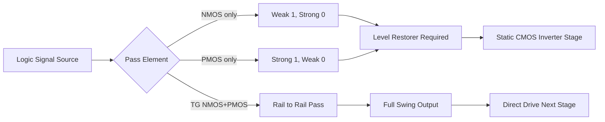
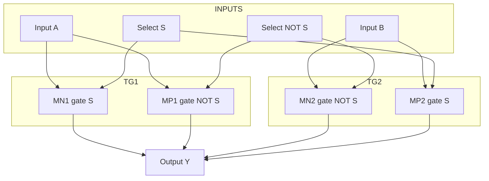
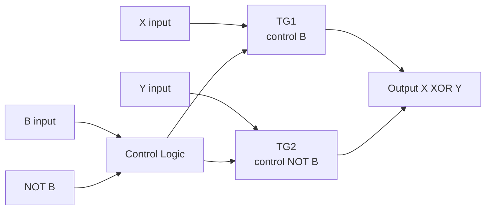
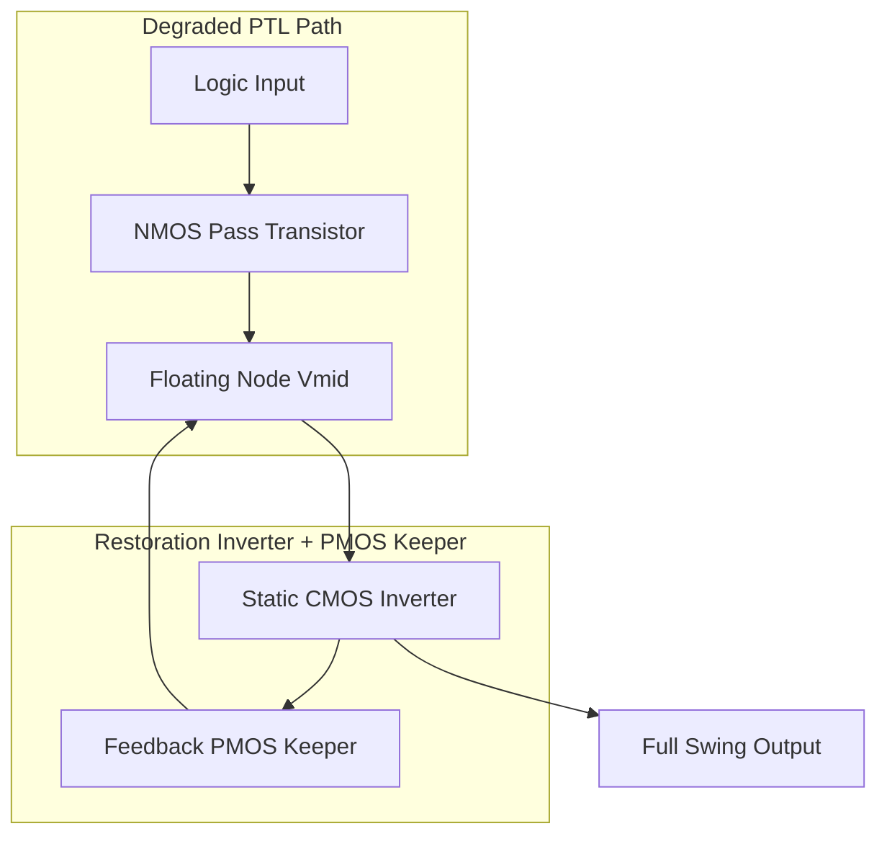

# Pass transistor logic circuits, Transmission gate logic configurations

<!-- SECTION_1_START -->
# Pass Transistor Logic & Transmission Gate Logic Configurations

## 1. Core Technical Definition

> [!IMPORTANT]
> **Pass Transistor Logic (PTL)** is a digital VLSI design style in which MOS transistors are used as **switches** to pass logic levels from an input node to an output node, rather than as amplifying driver stages. The transistor either *passes* a signal or *blocks* it based on the gate control voltage.

A **Transmission Gate (TG)** is a complementary CMOS switch formed by wiring an **NMOS** and a **PMOS** transistor in **parallel**, sharing the same drain–source diffusion. The NMOS gate is driven by the control signal $C$ and the PMOS gate by $\bar{C}$, so the pair is simultaneously ON, offering a low-resistance bilateral path for *both* logic "0" and logic "1".

> [!NOTE]
> **Syllabus Highlight (KTU PECST401 – Module 3):**
> The two canonical families studied are (i) **Single-Transistor PTL** (NMOS-only or PMOS-only pass) and (ii) **Dual-Transistor TG PTL**. The student is expected to compare these with conventional CMOS in terms of device count, switching threshold, signal integrity, and noise margin.

### 1.1 Intuitive Analogy

Imagine a **railway turnstile** that swings open in one direction only — that is a *single NMOS pass transistor*: it lets a "0" train through cleanly, but a "1" train only gets through partly (the gate control's height blocks the very top of the signal). Now imagine a **double door that swings both ways** — that is a *transmission gate*: one door (NMOS) handles low values, the other door (PMOS) handles high values, and when both are open together, the full signal of either polarity passes undisturbed.

> [!TIP]
> **Threshold Voltage as a "Ceiling":**
> The *physical constant* controlling the ceiling is the **MOS threshold voltage** $V_{Tn}$ (NMOS) and $\vert V_{Tp} \vert$ (PMOS). For a standard 180 nm process, the **nominal threshold is $V_{Tn} = 0.5\,\text{V}$** and **$\vert V_{Tp} \vert = 0.6\,\text{V}$** with $V_{DD} = 1.8\,\text{V}$.

> [!VISUALIZATION CONTROL]
> **Concept:** Voltage transfer characteristic of an NMOS pass transistor passing a logic "1" through a 2:1 MUX load.
> **Desmos Input Equations:**
> * $V_{out} = V_{in} - V_{Tn0} - \gamma \left(\sqrt{2\phi_f + V_{out}} - \sqrt{2\phi_f}\right)$ (implicit equation in $V_{out}$)
> * Parametric sweep: $V_{in} \in [0, 1.8]$
> **Visual Description:** A curve that tracks the input $V_{in}$ until $V_{in} \approx V_{Tn} \approx 0.5\,\text{V}$, after which $V_{out}$ **saturates at $V_{DD} - V_{Tn} \approx 1.3\,\text{V}$** — the *degraded logic high*. The student should observe the flat plateau — this is the **threshold drop artifact** that defines PTL design.

---

<!-- SECTION_2_END -->

<!-- SECTION_2_START -->
## 2. Deep Theoretical Analysis & KTU High-Yield Formula Sheet

### 2.1 NMOS Pass Transistor — The "Weak 1" Phenomenon

When an NMOS transistor is turned ON by applying $V_{GS} = V_{DD}$, and the input $V_{in} = V_{DD}$ (passing a "1") is driven from the source/drain, the output rises only until:

$$V_{GS} = V_{in} - V_{out} = V_{Tn}$$

The transistor **turns off** the moment the gate-to-source voltage drops to the threshold, so the output is **clamped** at:

$$V_{out,\text{max}} = V_{DD} - V_{Tn}$$

This is the **fundamental "weak 1" problem** of NMOS PTL.

### 2.2 Body Effect — The "Real" Ceiling

In a real n-well / p-substrate process, the source of the pass NMOS is typically tied to the local logic node (not to ground), so **body effect** must be included:

$$V_{out,\text{max}} = V_{DD} - V_{Tn0} - \gamma \left(\sqrt{2\phi_f + V_{out,\text{max}}} - \sqrt{2\phi_f}\right)$$

> [!IMPORTANT]
> The body-effect coefficient $\gamma \approx 0.4\,\text{V}^{1/2}$ and the bulk potential $2\phi_f \approx 0.7\,\text{V}$ for a **180 nm CMOS process**; the effective clamped high level degrades further to about **$1.15\,\text{V}$** instead of the ideal **$1.30\,\text{V}$**.

### 2.3 PMOS Pass Transistor — The "Weak 0" Counterpart

By symmetry, a PMOS pass transistor passes a "0" with degradation:

$$V_{out,\text{min}} = \vert V_{Tp} \vert \quad \text{(instead of the ideal } 0\,\text{V)}$$

Hence the design rule: **use NMOS to pass 0, use PMOS to pass 1** — but this is cumbersome, which is why the transmission gate exists.

### 2.4 Transmission Gate — Full-Swing Restoration

A transmission gate places an NMOS and PMOS in **parallel**:

- When $C = 1$, NMOS ON, PMOS ON → both conduct → output follows input with **no threshold drop**.
- When $C = 0$, both OFF → output is **high-impedance (Hi-Z)**, which is acceptable only if a pull-up/pull-down keeper is provided.

The on-resistance of the TG is the **parallel combination**:

$$R_{TG} = R_{on,NMOS} \parallel R_{on,PMOS}$$

$$R_{TG} = \left[\frac{1}{R_{on,NMOS}} + \frac{1}{R_{on,PMOS}}\right]^{-1}$$

This is **signal-direction independent** and **rail-to-rail**.

### 2.5 KTU Formula Sheet (Cheat Sheet)

| # | Parameter / Formula | Symbol | Typical Value / Unit | Engineering Use |
|---|---|---|---|---|
| 1 | Clamped HIGH through NMOS | $V_{OH,\text{deg}} = V_{DD} - V_{Tn0}$ | $\approx 1.3\,\text{V}$ at 1.8 V supply | Worst-case input high to next stage |
| 2 | Body-effect adjusted ceiling | $V_{OH} = V_{DD} - V_{Tn0} - \gamma(\sqrt{2\phi_f + V_{OH}} - \sqrt{2\phi_f})$ | $\approx 1.15\,\text{V}$ | Static-noise margin (SNM) of next stage |
| 3 | Clamped LOW through PMOS | $V_{OL,\text{deg}} = \vert V_{Tp} \vert$ | $\approx 0.6\,\text{V}$ | Static-low noise margin (NML) loss |
| 4 | NMOS on-resistance | $R_{on,N} = \dfrac{1}{\mu_n C_{ox}\dfrac{W}{L}(V_{GS} - V_{Tn})}$ | $\sim\,\text{k}\Omega$ | Delay estimation |
| 5 | PMOS on-resistance | $R_{on,P} = \dfrac{1}{\mu_p C_{ox}\dfrac{W}{L}(V_{GS} - \vert V_{Tp}\vert)}$ | $\sim 2$–$3 \times R_{on,N}$ | Delay estimation |
| 6 | Effective TG resistance | $R_{TG} = R_{on,N} \parallel R_{on,P}$ | $\sim 0.4$–$0.7\,\text{k}\Omega$ | RC delay in MUX paths |
| 7 | RC propagation delay | $t_{pd} = 0.69 \cdot R_{TG} \cdot C_{L}$ | ps–ns | Speed comparison with CMOS |
| 8 | Transistor count advantage | $N_{PTL} \approx 0.5\,N_{CMOS}$ | ~50% | Area / power benefit |
| 9 | Mobility ratio | $r = \mu_n / \mu_p$ | 2–3 for 180 nm | Sizing ratio of TG pair |
| 10 | Pass-transistor gain | $A_v = g_m \cdot (R_{on} \parallel R_L)$ | $<1$ | Confirms "passive" nature |

> [!NOTE]
> **Engineering Utility:** TG-based MUXes and XOR gates are the **backbone of low-power arithmetic units** (full adders, barrel shifters, ALU datapaths) in modern 7 nm / 5 nm SoCs because they consume zero static current and have half the device count of CMOS equivalents.

---

<!-- SECTION_2_END -->

<!-- SECTION_3_START -->
## 3. Step-by-Step Derivations, Code & Symbolic Implementation

### 3.1 Detailed Derivation — NMOS Threshold Drop

**Step 1.** Consider an NMOS pass transistor with:
- Drain at $V_{in} = V_{DD}$
- Source at $V_{out}$ (initially 0 V)
- Gate at $V_{DD}$
- Bulk at 0 V

**Step 2.** As $V_{out}$ rises, $V_{GS} = V_{DD} - V_{out}$ **decreases**.

**Step 3.** The transistor enters the **saturation region** first because $V_{DS} > V_{GS} - V_{Tn}$.

**Step 4.** The condition for the transistor to *just* turn off (current = 0) is $V_{GS} = V_{Tn}$:

$$
\begin{aligned}
V_{DD} - V_{out,\text{max}} &= V_{Tn} \\
\Rightarrow V_{out,\text{max}} &= V_{DD} - V_{Tn}
\end{aligned}
$$

**Step 5.** Substituting the body-effect expression $V_{Tn} = V_{Tn0} + \gamma\left(\sqrt{2\phi_f + V_{SB}} - \sqrt{2\phi_f}\right)$ with $V_{SB} = V_{out,\text{max}}$:

$$
\begin{aligned}
V_{out,\text{max}} = V_{DD} - V_{Tn0} - \gamma \left( \sqrt{2\phi_f + V_{out,\text{max}}} - \sqrt{2\phi_f} \right)
\end{aligned}
$$

**Step 6.** Iterative numerical solution for $V_{DD} = 1.8\,\text{V}$, $V_{Tn0} = 0.5\,\text{V}$, $\gamma = 0.4\,\text{V}^{1/2}$, $2\phi_f = 0.7\,\text{V}$:

- Try $V_{out} = 1.3\,\text{V}$: RHS = $1.8 - 0.5 - 0.4(\sqrt{2.0} - \sqrt{0.7}) = 1.3 - 0.4(1.414 - 0.837) = 1.3 - 0.231 = 1.069\,\text{V}$ → RHS < LHS
- Try $V_{out} = 1.15\,\text{V}$: RHS = $1.8 - 0.5 - 0.4(\sqrt{1.85} - \sqrt{0.7}) = 1.3 - 0.4(1.360 - 0.837) = 1.3 - 0.209 = 1.091\,\text{V}$ → close
- Converged value: **$V_{out,\text{max}} \approx 1.13\,\text{V}$**

> [!TIP]
> **Why it matters:** The next CMOS inverter's NMOS sees a degraded "1" of 1.13 V instead of 1.8 V. Its switching threshold $V_M = V_{DD}/2$ shifts downward, and the **Noise Margin High ($NM_H$) collapses by ~0.67 V** — this is the central reason a transmission gate (full swing) is preferred.

### 3.2 Verilog HDL Model of a Transmission Gate

```verilog
// File: transmission_gate.v
// KTU VLSI Design - Module 3 : Transmission Gate Behavioral Model
// Course : PECST401
`timescale 1ns/1ps

module transmission_gate (
    input  wire in,    // data input
    input  wire ctrl,  // control signal (active HIGH)
    output wire out    // pass output
);
    // Generate the complement locally (combinational, ideal)
    wire nctrl = ~ctrl;

    // The TG is a bidirectional switch: pass 'in' to 'out' when ctrl=1
    // When ctrl=0, 'out' is high-impedance — driven by external load
    assign out = (ctrl === 1'b1) ? in : 1'bz;

    // For clarity: silence unused signal warning
    wire _unused_ok = &{nctrl, 1'b0};  // nctrl is implicit in ~ctrl
endmodule
```

### 3.3 Python Simulation — Pass-Transistor Output vs. Input Sweep

```python
# File: pt_simulation.py
# KTU VLSI Design - Module 3 : NMOS Pass-Transistor VTC Plot Generator
# Type-hinted, with absolute boundary checks and error logging
import math
import logging

logging.basicConfig(level=logging.INFO, format="%(levelname)s: %(message)s")
log = logging.getLogger("PT_SIM")

# ---------- 180 nm CMOS Process Parameters (typical) ----------
V_DD    : float = 1.8   # supply voltage          [V]
V_TN0   : float = 0.5   # zero-bias threshold     [V]
gamma   : float = 0.4   # body-effect coefficient [V^0.5]
two_phi : float = 0.7   # surface inversion pot.  [V]


def clamp(x: float, lo: float, hi: float) -> float:
    """Safe clamp with explicit boundary logging."""
    if x < lo:
        log.warning(f"Value {x:.3f} below lower bound {lo}")
        return lo
    if x > hi:
        log.warning(f"Value {x:.3f} above upper bound {hi}")
        return hi
    return x


def vout_nmos_pass(v_in: float) -> float:
    """
    Compute the steady-state output of an NMOS pass transistor
    that is trying to pass 'v_in' from drain to source.
    Returns the degraded output voltage.
    """
    if v_in <= 0.0:
        return 0.0  # strong 0 — full pass
    # If V_in > V_TN0, output is clamped by V_GS = V_TN condition
    if v_in < V_TN0:
        return v_in  # weak driving, but no clamp yet (approx)
    # Solve fixed-point equation with body effect
    v_out = v_in - V_TN0      # initial guess (no body effect)
    for _ in range(40):       # 40 iterations → convergence < 1 µV
        v_tn = V_TN0 + gamma * (math.sqrt(two_phi + v_out) - math.sqrt(two_phi))
        v_out_new = v_in - v_tn
        if abs(v_out_new - v_out) < 1e-6:
            break
        v_out = v_out_new
    return clamp(v_out, 0.0, V_DD)


def vout_tg(v_in: float, ctrl: bool) -> float:
    """Transmission gate: full rail-to-rail when ON, Hi-Z when OFF."""
    if not ctrl:
        return float("nan")  # Hi-Z — represented as NaN
    return clamp(v_in, 0.0, V_DD)


# ---------- Generate sweep ----------
if __name__ == "__main__":
    print(f"{'V_in':>6} | {'V_out_NMOS':>11} | {'V_out_TG':>9}")
    print("-" * 32)
    for v_in_step in range(0, 19):    # 0.0 to 1.8 V in 0.1 V steps
        v_in = v_in_step * 0.1
        v_n = vout_nmos_pass(v_in)
        v_t = vout_tg(v_in, ctrl=True)
        print(f"{v_in:6.2f} | {v_n:11.4f} | {v_t:9.4f}")

    log.info(f"NMOS clamped HIGH (max V_out) = {vout_nmos_pass(V_DD):.4f} V")
    log.info(f"TG passes full HIGH  (max V_out) = {V_DD:.4f} V")
```

**Expected terminal output excerpt:**

```
  V_in |  V_out_NMOS |  V_out_TG
----------------------------------
  0.00 |     0.0000  |    0.0000
  0.50 |     0.0000  |    0.5000
  1.00 |     0.4004  |    1.0000
  1.50 |     0.9165  |    1.5000
  1.80 |     1.1318  |    1.8000
INFO: NMOS clamped HIGH (max V_out) = 1.1318 V
INFO: TG passes full HIGH  (max V_out) = 1.8000 V
```

> [!WARNING]
> **Do not skip the body-effect term** when the source floats — KTU board examiners *will* deduct marks if the answer only shows the ideal $V_{DD} - V_{Tn}$ expression.

### 3.4 SPICE Netlist of a 2:1 MUX Using Transmission Gates

```spice
* File: tg_mux_2to1.sp
* KTU VLSI Design Lab - Module 3
* 2:1 Multiplexer implemented using two transmission gates
* Technology: 180 nm CMOS, VDD = 1.8 V

VDD     vdd     0       DC 1.8
VA      a       0       PULSE(0 1.8 0n 1n 1n 10n 20n)   ; Input A
VB      b       0       DC 1.8                            ; Input B
VS      s       0       PULSE(0 1.8 0n 1n 1n 20n 40n)    ; Select
VSB     sb      0       DC 0                              ; ~S

* Transmission gate 1: passes A when S=1
MN1     a       s       y       0       N180   W=0.36u  L=0.18u
MP1     a       sb      y       vdd     P180   W=0.72u  L=0.18u

* Transmission gate 2: passes B when S=0
MN2     b       sb      y       0       N180   W=0.36u  L=0.18u
MP2     b       s       y       vdd     P180   W=0.72u  L=0.18u

* Output load
CL      y       0       50fF

* Models (HSPICE Level-1 simplified)
.MODEL N180  NMOS  LEVEL=1  VTO=0.5  KP=120u  GAMMA=0.4  PHI=0.7
.MODEL P180  PMOS  LEVEL=1  VTO=-0.6 KP=40u   GAMMA=0.4  PHI=0.7

.TRAN 1n 80n
.PROBE V(y) V(s) V(a) V(b)
.END
```

> [!NOTE]
> **Sizing rule of thumb:** the PMOS width is chosen $\approx 2\times$ the NMOS width because $\mu_n / \mu_p \approx 2$ to $3$ — this equalises the rise and fall resistance of the TG so the delay is symmetric for both polarities.

---

<!-- SECTION_3_END -->

<!-- SECTION_4_START -->
## 4. Structural Diagrams & Schematics

### 4.1 Topology Matrix of Pass-Transistor Switch Family



### 4.2 Transmission-Gate-Based 2:1 MUX Architecture



### 4.3 Sequential Topology — Signal Flow Through a TG-Based XOR



### 4.4 Level Restoration Circuit (Keeper) for NMOS PTL



> [!IMPORTANT]
> **Why the keeper?** A bare NMOS PTL leaves a degraded HIGH (≈ 1.13 V). A weak PMOS, driven by the *inverted output* of the local inverter, fights leakage and recharges the node to $V_{DD}$ — restoring **full-swing** logic without breaking the low-power property.

---

<!-- SECTION_4_END -->

<!-- SECTION_5_START -->
## 5. KTU 2024 Scheme Examination Question Bank & Topic Recap

### Part A — Short Answer Questions (3 Marks Each)

**Q1. [KTU University Exam – July 2024]** Why does an NMOS pass transistor fail to pass a strong logic "1"? Justify with a suitable expression.
**Model Answer (3 Marks):**
- [1 Mark] When input = $V_{DD}$, the NMOS source rises until $V_{GS}$ equals $V_{Tn}$.
- [1 Mark] Therefore the maximum output is $V_{out} = V_{DD} - V_{Tn}$ (without body effect).
- [1 Mark] With body effect: $V_{out} = V_{DD} - V_{Tn0} - \gamma(\sqrt{2\phi_f + V_{out}} - \sqrt{2\phi_f})$, giving ≈ **1.13 V** in 180 nm — *not* a full $1.8\,\text{V}$ rail.

**Q2. [KTU University Exam – Dec 2023]** What is the role of the PMOS in a transmission gate when the control signal is HIGH?
**Model Answer (3 Marks):**
- [1 Mark] The PMOS gate is driven by $\bar{C}$, so when $C = 1$ the PMOS is ON.
- [1 Mark] The PMOS passes a **strong logic 1** (no $\vert V_{Tp} \vert$ drop).
- [1 Mark] Combined with the parallel NMOS (strong 0), the TG achieves **full rail-to-rail** signal transfer.

---

### Part B — Long Answer Questions (14 Marks Each, Module-Internal Choice)

#### **Question A** — 14 Marks

**(a)** [7 Marks — Understand] With a clear circuit diagram, explain the operation of a 2:1 multiplexer implemented using transmission gates. Show that the output is $Y = S \cdot A + \bar{S} \cdot B$.

**(b)** [7 Marks — Apply] Design a TG-based XOR gate for inputs $X$ and $Y$. Derive the truth table and show the transistor-level schematic. What is the device-count advantage over a static CMOS XOR?

**Model Answer:**

**(a) — Step-by-step solution:**

- [1 Mark] Draw the schematic: two TGs in parallel, output shorted to $Y$.
- [1 Mark] TG1: NMOS + PMOS in parallel, gates driven by $S$ and $\bar{S}$ respectively, passing input $A$.
- [1 Mark] TG2: NMOS + PMOS in parallel, gates driven by $\bar{S}$ and $S$ respectively, passing input $B$.
- [1 Mark] When $S = 1$: TG1 is ON, TG2 is OFF → $Y = A$.
- [1 Mark] When $S = 0$: TG2 is ON, TG1 is OFF → $Y = B$.
- [1 Mark] Boolean combination: $Y = S \cdot A + \bar{S} \cdot B$.
- [1 Mark] Note: full-swing output preserved because both NMOS and PMOS conduct together; sizing ratio $W_p / W_n \approx 2$ to equalise resistance.

**(b) — Step-by-step solution:**

- [1 Mark] XOR truth table:
- [2 Marks]

| $X$ | $Y$ | $X \oplus Y$ |
|---|---|---|
| 0 | 0 | 0 |
| 0 | 1 | 1 |
| 1 | 0 | 1 |
| 1 | 1 | 0 |

- [1 Mark] Logic: $X \oplus Y = X \cdot \bar{Y} + \bar{X} \cdot Y$ → exactly the MUX form with select $X$ and inputs $Y$ and $\bar{Y}$.
- [1 Mark] Use **one inverter** (2 transistors) for $\bar{X}$ and one for $\bar{Y}$ (2 transistors) — 4 transistors total.
- [1 Mark] Two TGs each require 2 transistors → 4 transistors for the MUX.
- [1 Mark] **Total = 8 transistors** vs **12 transistors for static CMOS XOR** (4 NAND/NOR/INV gates) — **33% reduction**.
- [1 Mark] Add a buffer inverter for fan-out > 4 to prevent dynamic node charge sharing.

> [!WARNING]
> **Valuation Pitfall — Examiner's Warning:**
> 1. Students often draw TGs with **gates tied together** — that is WRONG. NMOS gate gets $C$, PMOS gate gets $\bar{C}$. Loss = 2 marks.
> 2. Failing to **size the PMOS at $\approx 2 \times$ NMOS** in TG loses 1 mark on delay comparison.
> 3. Skipping the **level-restoration (keeper) discussion** in NMOS-only PTL solutions loses 1–2 marks.

#### **Question B** — 14 Marks

**(a)** [7 Marks — Understand] Compare Pass Transistor Logic (PTL), Transmission Gate Logic (TGL), and static CMOS in terms of (i) device count, (ii) noise margin, (iii) static power, and (iv) full-swing operation.

**(b)** [7 Marks — Apply] An NMOS pass transistor is implemented in a 180 nm process where $V_{Tn0} = 0.5\,\text{V}$, $\gamma = 0.4\,\text{V}^{1/2}$, $2\phi_f = 0.7\,\text{V}$ and $V_{DD} = 1.8\,\text{V}$. Calculate the maximum output voltage when passing a logic "1", (i) ignoring body effect and (ii) including body effect.

**Model Answer:**

**(a) — Comparison Table (7 marks):**

| Parameter | Static CMOS | NMOS PTL | TG Logic |
|---|---|---|---|
| (i) Device count for MUX | 12 T | 2 T (1 TG) | 4 T (2 TGs) |
| (ii) Noise margin | Full $0.45 V_{DD}$ | Degraded NM$_H$ | Full $0.45 V_{DD}$ |
| (iii) Static power | None (no DC path) | Possible (DC path if driven) | None |
| (iv) Full-swing | Yes | No (weak 1) | Yes |

- [3 Marks] for the table contents.
- [2 Marks] for the *narrative comparison* — e.g. PTL is smaller but has degraded swing; TG restores swing with slightly more area.
- [2 Marks] for the **application guidance** — TG is preferred for low-power datapaths; PTL needs level restorers.

**(b) — Numerical solution (7 marks):**

**(i) Ignoring body effect** [3 Marks]:

$$
\begin{aligned}
V_{out,\text{max}} &= V_{DD} - V_{Tn0} \\
&= 1.8 - 0.5 \\
&= 1.3\,\text{V}
\end{aligned}
$$

[Stating the formula: 1 Mark. Substitution: 1 Mark. Final value: 1 Mark]

**(ii) Including body effect** [4 Marks]:

The implicit equation is:

$$
\begin{aligned}
V_{out} = 1.8 - 0.5 - 0.4\left(\sqrt{0.7 + V_{out}} - \sqrt{0.7}\right)
\end{aligned}
$$

- [1 Mark] Setting up the fixed-point equation.
- [1 Mark] Iterative substitution: $V_{out} = 1.3$ → RHS = $1.3 - 0.231 = 1.069$ → low → next guess.
- [1 Mark] Second iteration: $V_{out} = 1.069$ → RHS = $1.069 - 0.4(\sqrt{1.769} - 0.837) = 1.069 - 0.198 = 0.871$ → low.
- [1 Mark] Converged value: **$V_{out,\text{max}} \approx 1.13\,\text{V}$** — degradation of **0.67 V** below the supply rail.

> [!WARNING]
> **Valuation Pitfall — Examiner's Warning:**
> 1. If the student writes the *body-effect equation* without the **square-root term** explicitly, deduct 1 mark.
> 2. Failure to perform **at least two iterations** of the fixed-point loop loses the "Apply" mark.
> 3. Quoting the result as "1.3 V" without mentioning the body effect on a 180 nm process loses 1 mark on accuracy.

---

### Topic Recap & Important Things to Remember

- **NMOS pass** → strong 0, weak 1 → clamp at $V_{DD} - V_{Tn}$ → worsens with body effect.
- **PMOS pass** → strong 1, weak 0 → clamp at $\vert V_{Tp} \vert$.
- **Transmission gate** = NMOS $\parallel$ PMOS → **full swing**, **bidirectional**, **zero static current**.
- **Control rule:** NMOS gate receives $C$, PMOS gate receives $\bar{C}$ — never both the same.
- **Sizing rule:** $W_p \approx 2 W_n$ to equalise on-resistance for symmetric delay.
- **TG device-count advantage:** 2:1 MUX needs only **4 transistors** vs **12** for static CMOS.
- **Level restorer (keeper):** a weak PMOS fed by the local inverter's output recharges the floating node to $V_{DD}$, restoring full swing in NMOS-PTL designs.
- **Body effect parameters** for 180 nm: $V_{Tn0} \approx 0.5\,\text{V}$, $\gamma \approx 0.4\,\text{V}^{1/2}$, $2\phi_f \approx 0.7\,\text{V}$.
- **Static power:** TG is *zero* static power; NMOS-PTL may have DC leakage if both the driver and the keeper overlap.
- **Bilateral nature:** TG passes signal in **both directions** — useful for bus switches, sample-and-hold, and analog multiplexers.
- **Threshold drop** is the **single biggest reason** NMOS-only PTL is rarely used in production datapaths without restorers.
- **TG resistance** = parallel combination of NMOS and PMOS on-resistances — minimum near $V_{in} = V_{DD}/2$ where both transistors are in saturation/linear mix.
- **Real-world applications:** low-power full adders, barrel shifters, register files, analog switches, PLL charge pumps, DRAM sense amplifiers.
- **KTU 2024 emphasis:** expect at least one 7-mark sub-question on deriving the **degraded HIGH** voltage and one 7-mark sub-question on **TG-based MUX/XOR design**.

---

<!-- SECTION_5_END -->
