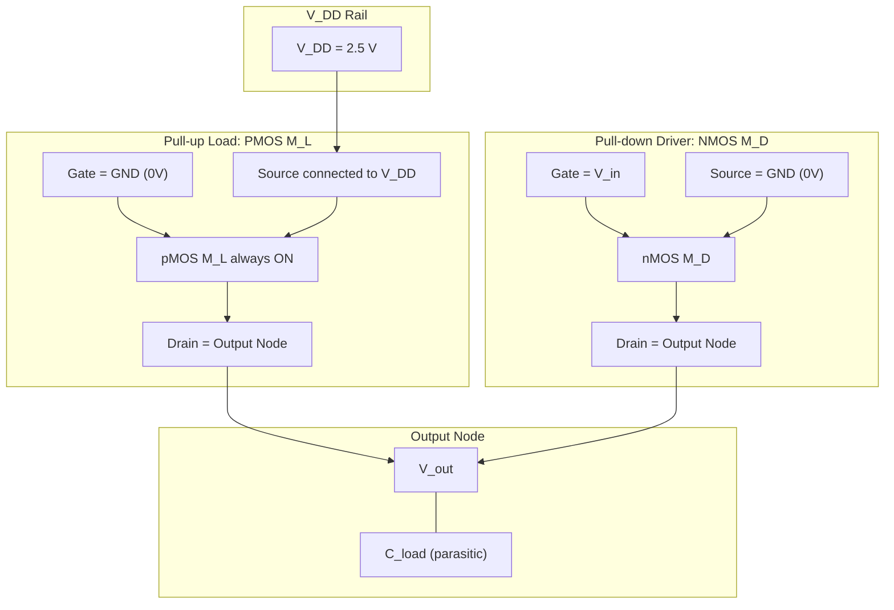
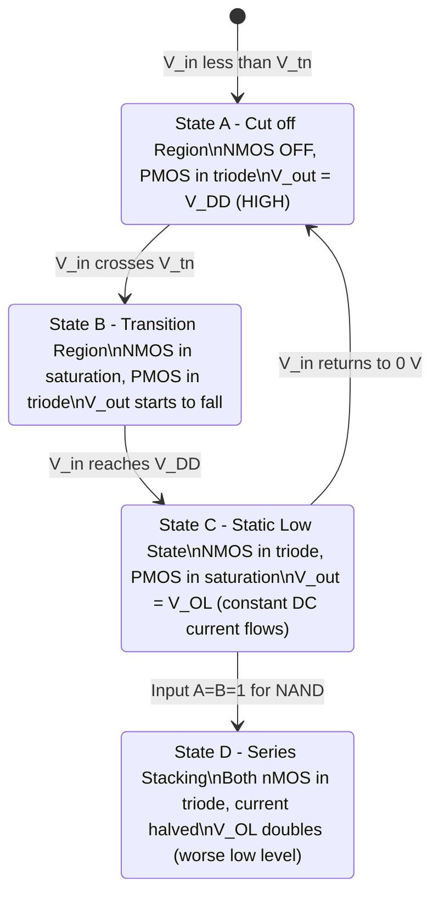
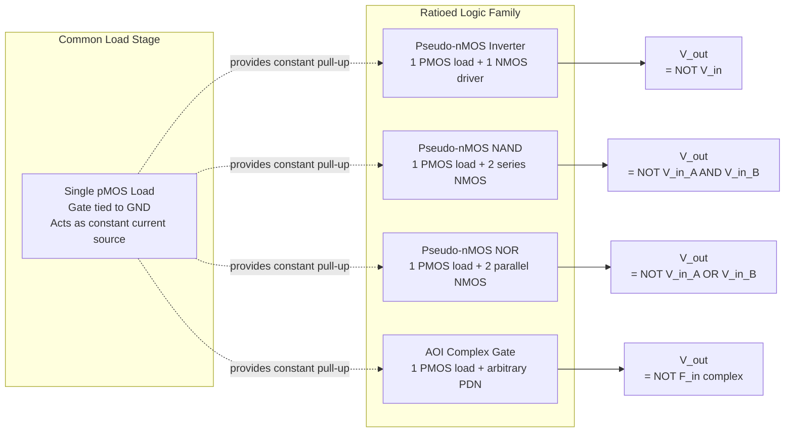
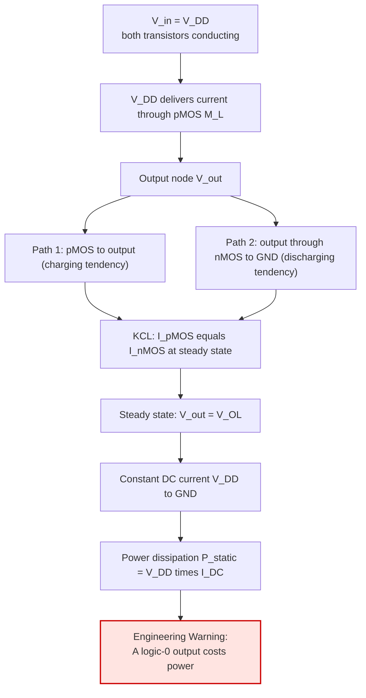

# Ratioed circuits, Pseudo-nMOS inverter and gates

<!-- SECTION_1_START -->
# Pseudo-nMOS Inverter and Gates

## Formal Academic Definition

> [!NOTE]
> **Ratioed Circuits (KTU 2024 Syllabus Definition):** A class of CMOS-style logic families in which the **output high level ($V_{OH}$)** is independent of transistor sizing, but the **output low level ($V_{OL}$)** is a strong function of the geometric ratio between the pull-up (load) and pull-down (driver) transistors. Because logic-level integrity depends on the **aspect-ratio ($W/L$) of the MOSFETs**, the design is called *ratioed*.

> [!IMPORTANT]
> **Pseudo-nMOS Inverter:** A ratioed CMOS inverter variant in which the **pMOS pull-up transistor is permanently biased ON** (its gate is tied to ground). The logic function is implemented entirely by the **nMOS pull-down network (PDN)**. The term *pseudo* stems from the structural similarity to classical nMOS logic with depletion-mode load — but realized here using standard enhancement-mode CMOS processes.

> [!IMPORTANT]
> **Pseudo-nMOS Gate:** A generalisation of the pseudo-nMOS inverter in which the single load pMOS remains always conducting, while an **nMOS pull-down network** computes the function (series nMOS = NAND, parallel nMOS = NOR, AOI forms of arbitrary complex functions).

---

## Conceptual Analogy / Intuition

> [!TIP]
> **The Tug-of-War Analogy:** Imagine two people pulling a rope (the output node) in opposite directions.
> * The **pMOS load** is a constantly active opponent applying a **gentle but persistent upward pull** (current source from $V_{DD}$).
> * The **nMOS pull-down network** is your team of players that joins the rope **only when the input logic demands it**.
> * When the nMOS team is *absent* ($V_{in} < V_{tn}$) → the pMOS wins effortlessly → output rises to $V_{DD}$ (**logic 1**).
> * When the nMOS team joins the rope strongly enough to overpower the pMOS → output is pulled down to near ground (**logic 0**).
> * The *relative strengths* (sizes) of the two teams decide whether the output reaches a clean low. This is the essence of **ratioed** design.

The crucial engineering trade-off emerges: making the nMOS team too strong hurts the speed and increases area; making it too weak leaves the output dangling at an ambiguous intermediate level. This *balancing act via geometric ratios* is what gives ratioed logic its name.

---

## Physical Constants and Standard Metrics (KTU Reference)

* **Supply voltage ($V_{DD}$):** typically **1.8 V – 3.3 V** for modern deep-submicron CMOS.
* **Process transconductances (typical 0.18 μm process):** $k_{n}' \approx 100 \,\mu A/V^2$, $k_{p}' \approx 40 \,\mu A/V^2$, hence $k_{n}' / k_{p}' \approx \mathbf{2.5}$.
* **Threshold voltages:** $V_{tn} = +0.4$ to $+0.5$ V (nMOS), $V_{tp} = -0.4$ to $-0.5$ V (pMOS).
* **Recommended pull-down to pull-up ratio ($r$):** $\mathbf{r = 4 \text{ to } 10}$ for acceptable $V_{OL}$ and noise margin.
* **Static power dissipation (worst case):** $P_{static} = V_{DD} \cdot I_{DC} \approx \mathbf{0.1 \text{ mW} \text{ to } 1 \text{ mW}}$ per gate.

> [!VISUALIZATION CONTROL]
> **Concept:** Voltage Transfer Characteristic (VTC) of a pseudo-nMOS inverter — a *degraded* CMOS curve.
> **GeoGebra / Desmos Input Equations (parametric form, with $r=4$, $V_{DD}=2.5$V, $V_t=0.5$V):**
> * Pseudo-CMOS VTC: $f(V_{in}) = V_{DD} - \dfrac{1}{r} \cdot \left(V_{in} - V_{tn}\right)^2 / V_{in}$ (simplified)
> * Ideal CMOS reference: $g(V_{in}) = \min(V_{in}, V_{DD} - V_{in})$ (steeper switch)
> **Visual Description:** On the $V_{in}$–$V_{out}$ axes, observe that the pseudo-nMOS VTC enters a *gradual slope region* earlier than ideal CMOS and never truly reaches 0 V — instead it saturates at a finite $V_{OL}$ that depends on the ratio $r$. The high-to-low transition is *less abrupt*, indicating reduced noise margin.

---
<!-- SECTION_1_END -->

<!-- SECTION_2_START -->
# Deep Theoretical Analysis & KTU High-Yield Formula Sheet

## 1. Circuit Topology

A pseudo-nMOS inverter is constructed by:

1. **Load transistor (pMOS, $M_{L}$):** $G \rightarrow 0$ V, $S \rightarrow V_{DD}$, $D \rightarrow V_{out}$. Always ON, behaves as a saturated current source when $V_{out}$ is low.
2. **Driver transistor (nMOS, $M_{D}$):** $G \rightarrow V_{in}$, $S \rightarrow 0$ V, $D \rightarrow V_{out}$. Conventional CMOS inverter driver.

> The nMOS gate oxide capacitance, $C_{ox} \cdot W_n \cdot L_n$, no longer fights the pMOS gate capacitance at the input node — **input capacitance is roughly halved**, which is the principal speed advantage.

---

## 2. Operating Region Analysis (Step-by-Step Logic)

| Region | $V_{in}$ Range | $M_D$ (nMOS) State | $M_L$ (pMOS) State | Output $V_{out}$ |
|---|---|---|---|---|
| 1 | $0 \le V_{in} < V_{tn}$ | **Cut-off** | Saturation (small $V_{SD}$) | $V_{out} \to V_{DD}$ |
| 2 | $V_{tn} \le V_{in} < V_{out} + V_{tn}$ | **Saturation** | Triode | $V_{out}$ starts to fall |
| 3 | $V_{in} \ge V_{out} + V_{tn}$ | **Triode** | Saturation | $V_{out} = V_{OL}$ (steady) |

* **Why is the pMOS *always* in saturation (when $V_{out}$ is small)?**  
  For pMOS, $V_{SG} = V_{DD}$ (constant), and $V_{SD} = V_{DD} - V_{out}$. As long as $V_{out} < \vert V_{tp} \vert$, the condition $V_{SD} > V_{SG} - \vert V_{tp} \vert$ holds automatically.

* **Why does $V_{out}$ saturate at $V_{OL} \neq 0$?**  
  The pMOS continues to push a constant current into the output node. This current must equal the nMOS pull-down current. Equilibrium is reached when the nMOS in triode sinks exactly that current — at a non-zero $V_{out}$.

---

## 3. KTU Formula Sheet / Cheat Sheet

| # | Parameter | Formula | Notes |
|---|---|---|---|
| 1 | Driver-to-Load strength ratio | $r = \dfrac{k_{n}' \,(W_{n}/L_{n})}{k_{p}' \,(W_{p}/L_{p})}$ | Must be $\geq 4$ for $V_{OL} \le 0.1\,V_{DD}$ |
| 2 | Static $V_{OL}$ (output low) | $V_{OL} = \dfrac{1}{2\,r}\,(V_{DD} - V_{t})$ | Assuming $V_{tn} = \vert V_{tp} \vert = V_{t}$ and nMOS in triode, pMOS in saturation |
| 3 | Static power dissipation | $P_{static} = V_{DD} \cdot \dfrac{k_{p}'}{2}\cdot\dfrac{W_{p}}{L_{p}}\,(V_{DD} - \vert V_{tp} \vert)^{2}$ | Dissipated whenever $V_{out} = V_{OL}$ |
| 4 | Low noise margin | $N_{ML} = V_{IL} - V_{OL}$ | $V_{IL} \approx V_{tn} + \dfrac{1}{r+1}(V_{DD} - V_{tn} - V_{OL})$ |
| 5 | High noise margin | $N_{MH} = V_{OH} - V_{IH}$ | Reduced compared to CMOS |
| 6 | NAND effective ratio | $r_{NAND} = \dfrac{r}{N}$ (N series nMOS) | Series stacking degrades $V_{OL}$ |
| 7 | NOR effective ratio | $r_{NOR} = N \cdot r$ (N parallel nMOS) | Parallel stacking improves $V_{OL}$ |

> [!WARNING]
> **Never write** $r = k_{n}(W_{n}/L_{n}) \big/ k_{p}(W_{p}/L_{p})$ **using vertical pipes** in a markdown table — it breaks the table parser. Always use $\div$, $/$, or the LaTeX fraction form.

---

## 4. Real-World Engineering Utility

* **Read-Only Memories (ROMs) and Programmable Logic Arrays (PLAs):** Pseudo-nMOS cells are still used in dense ROM/PLA arrays because the static power is amortised over a large array and the area savings (no pMOS per column of the OR-plane) is substantial.
* **Wide fan-in NOR gates** in on-chip control logic where speed and routing density are paramount.
* **SRAM periphery circuits** (sense-amplifier and address-decoder pre-decoders) where controlled static-power consumption is acceptable.
* **Legacy NMOS designs** migrated to CMOS processes — the natural "drop-in" replacement for depletion-load nMOS.
* **High-density custom datapath design** where pseudo-nMOS is paired with clock-gating to power-down static-dissipating logic when idle.

---
<!-- SECTION_2_END -->

<!-- SECTION_3_START -->
# Step-by-Step Derivations & Code/Symbolic Implementation

## Derivation 1: Output Low Voltage $V_{OL}$ of Pseudo-nMOS Inverter

### Setup
At $V_{in} = V_{DD}$ (worst case for output to remain low), and once the circuit reaches steady state, $V_{out}$ stabilises at $V_{OL}$. We determine the **transistor regions of operation** at this operating point.

* **nMOS $M_D$:** $V_{GS} = V_{DD}$, $V_{DS} = V_{OL}$ (small).  
  Since $V_{DS} = V_{OL} \ll V_{GS} - V_{tn} = V_{DD} - V_{tn}$, the nMOS is in the **triode region**.
* **pMOS $M_L$:** $V_{SG} = V_{DD}$, $V_{SD} = V_{DD} - V_{OL}$ (large).  
  Since $V_{SD} \gg V_{SG} - \vert V_{tp} \vert = V_{DD} - \vert V_{tp} \vert$, the pMOS is in **saturation**.

### Current Equations

**pMOS (saturation):**

$$
I_{DSP} = \frac{k_{p}'}{2}\cdot\frac{W_{p}}{L_{p}}\,(V_{SG} - \vert V_{tp} \vert)^{2} = \frac{k_{p}'}{2}\cdot\frac{W_{p}}{L_{p}}\,(V_{DD} - \vert V_{tp} \vert)^{2}
$$

**nMOS (triode):**

$$
I_{DSN} = k_{n}'\cdot\frac{W_{n}}{L_{n}}\left[(V_{GS} - V_{tn})\,V_{DS} - \frac{V_{DS}^{2}}{2}\right]
$$

Expanding with $V_{GS} = V_{DD}$ and $V_{DS} = V_{OL}$:

$$
I_{DSN} = k_{n}'\cdot\frac{W_{n}}{L_{n}}\left[(V_{DD} - V_{tn})\,V_{OL} - \frac{V_{OL}^{2}}{2}\right]
$$

### Equilibrium Condition (KCL at Output Node)

Setting $I_{DSP} = I_{DSN}$:

$$
\frac{k_{p}'}{2}\cdot\frac{W_{p}}{L_{p}}\,(V_{DD} - \vert V_{tp} \vert)^{2} = k_{n}'\cdot\frac{W_{n}}{L_{n}}\left[(V_{DD} - V_{tn})\,V_{OL} - \frac{V_{OL}^{2}}{2}\right]
$$

### Linear Approximation

Since $V_{OL} \ll V_{DD} - V_{tn}$, the $V_{OL}^{2}/2$ term is negligible:

$$
\frac{k_{p}'}{2}\cdot\frac{W_{p}}{L_{p}}\,(V_{DD} - \vert V_{tp} \vert)^{2} \approx k_{n}'\cdot\frac{W_{n}}{L_{n}}\,(V_{DD} - V_{tn})\,V_{OL}
$$

### Final Closed-Form Expression

Solving for $V_{OL}$:

$$
V_{OL} = \frac{k_{p}'\,W_{p}\,L_{n}}{2\,k_{n}'\,W_{n}\,L_{p}}\,(V_{DD} - \vert V_{tp} \vert)
$$

Or, equivalently, using the **aspect-ratio** form:

$$
V_{OL} = \frac{(V_{DD} - \vert V_{tp} \vert)}{2\,r}, \quad \text{where } r = \frac{k_{n}'\,(W_{n}/L_{n})}{k_{p}'\,(W_{p}/L_{p})}
$$

> [!NOTE]
> **Why this is called a "ratioed" result:** $V_{OL}$ depends directly on the ratio $W_{p}/W_{n}$. The designer must *explicitly size* the transistors to guarantee acceptable $V_{OL}$. A standalone inverter-like design (as in static CMOS) where the sizing does not matter for DC behaviour is impossible here.

---

## Derivation 2: Numerical Evaluation of $V_{OL}$

### Given Parameters
* $V_{DD} = 2.5$ V
* $V_{tn} = \vert V_{tp} \vert = 0.5$ V
* $k_{n}' = 110 \,\mu A/V^{2}$, $k_{p}' = 50 \,\mu A/V^{2}$
* $(W_{n}/L_{n}) = 4$ (i.e., $W_{n} = 4\mu$m, $L_{n} = 1\mu$m)
* $(W_{p}/L_{p}) = 1$ (i.e., $W_{p} = 1\mu$m, $L_{p} = 1\mu$m)

### Step 1: Compute the Ratio $r$

$$
r = \frac{k_{n}'\,(W_{n}/L_{n})}{k_{p}'\,(W_{p}/L_{p})} = \frac{110 \times 10^{-6} \times 4}{50 \times 10^{-6} \times 1} = \frac{440}{50} = 8.8
$$

### Step 2: Compute $V_{OL}$ Using the Derived Formula

$$
V_{OL} = \frac{V_{DD} - \vert V_{tp} \vert}{2\,r} = \frac{2.5 - 0.5}{2 \times 8.8} = \frac{2.0}{17.6} = 0.1136 \text{ V}
$$

### Step 3: Verification — Compute Static Power Dissipation

$$
P_{static} = V_{DD} \cdot I_{DSP} = 2.5 \times \frac{50 \times 10^{-6}}{2}\times 1 \times (2.5 - 0.5)^{2} = 2.5 \times 25 \times 10^{-6} \times 4 = 250 \,\mu W
$$

### Step 4: Verification — Check Low Noise Margin

$V_{IL}$ for pseudo-nMOS can be approximated as:

$$
V_{IL} = \frac{r\,V_{tn} + V_{DD} - \vert V_{tp} \vert + V_{OL}}{r + 1} \approx \frac{8.8 \times 0.5 + 2.0 + 0.1136}{9.8} \approx \frac{6.5136}{9.8} \approx 0.665 \text{ V}
$$

Thus:

$$
N_{ML} = V_{IL} - V_{OL} = 0.665 - 0.1136 = 0.551 \text{ V} \quad \text{(acceptable: } > 0.4 V_{DD} \text{)}
$$

> [!TIP]
> **Key Takeaway for Examiners:** A 4:1 nMOS-to-pMOS sizing with $k_{n}' / k_{p}' = 2.2$ gives $V_{OL} \approx 11.4\%$ of $V_{DD}$ — comfortably within $V_{IL} \le 0.2 V_{DD}$ noise-margin bound.

---

## Python Implementation: Pseudo-nMOS $V_{OL}$ Calculator

```python
"""
Pseudo-nMOS VOL and Noise-Margin Calculator
PECST401 - VLSI Design, KTU 2024 Scheme, Module 3
"""
import math
from dataclasses import dataclass
from typing import Tuple


@dataclass(frozen=True)
class PseudoNmosParams:
    """Process and design parameters for a pseudo-nMOS inverter."""
    vdd: float                # Supply voltage (V)
    vtn: float                # NMOS threshold voltage (V)
    vtp: float                # PMOS threshold voltage magnitude (V)
    kn_prime: float           # NMOS process transconductance (A/V^2)
    kp_prime: float           # PMOS process transconductance (A/V^2)
    wn_over_ln: float         # NMOS aspect ratio
    wp_over_lp: float         # PMOS aspect ratio

    def validate(self) -> None:
        if not (self.vdd > 0):
            raise ValueError("V_DD must be positive.")
        if not (self.vtn > 0 and self.vtp > 0):
            raise ValueError("Threshold voltages must be positive magnitudes.")
        if not (self.kn_prime > 0 and self.kp_prime > 0):
            raise ValueError("Transconductances must be positive.")
        if not (self.wn_over_ln > 0 and self.wp_over_lp > 0):
            raise ValueError("Aspect ratios must be positive.")
        if not (self.vdd > self.vtp):
            raise ValueError("V_DD must exceed |V_tp| for the pMOS to remain ON.")


def compute_ratio(params: PseudoNmosParams) -> float:
    """Compute the driver-to-load strength ratio r."""
    p = params.validate() if hasattr(params, "validate") else None
    r = (params.kn_prime * params.wn_over_ln) / (params.kp_prime * params.wp_over_lp)
    return r


def compute_vol(params: PseudoNmosParams) -> float:
    """Closed-form VOL assuming nMOS in triode, pMOS in saturation."""
    r = compute_ratio(params)
    vol = (params.vdd - params.vtp) / (2.0 * r)
    return vol


def compute_static_power(params: PseudoNmosParams) -> float:
    """Static power dissipation when VOL is being held (worst case)."""
    idsp = 0.5 * params.kp_prime * params.wp_over_lp * (params.vdd - params.vtp) ** 2
    return params.vdd * idsp


def compute_vil(params: PseudoNmosParams, vol: float) -> float:
    """Approximate VIL using the dVout/dVin = -1 condition."""
    r = compute_ratio(params)
    vil = (r * params.vtn + params.vdd - params.vtp + vol) / (r + 1.0)
    return vil


def compute_noise_margins(params: PseudoNmosParams) -> Tuple[float, float]:
    """Return (NML, NMH) assuming VOH ≈ VDD and VIH ≈ VDD - |Vtp|."""
    vol = compute_vol(params)
    vil = compute_vil(params, vol)
    voh = params.vdd
    vih = params.vdd - params.vtp
    nml = vil - vol
    nmh = voh - vih
    return nml, nmh


# ---------- KTU K2 Examination-Style Sanity Check ----------
if __name__ == "__main__":
    # KTU typical problem: VDD=2.5V, Vt=0.5V, kn'=110u, kp'=50u, Wn/Ln=4, Wp/Lp=1
    p = PseudoNmosParams(
        vdd=2.5, vtn=0.5, vtp=0.5,
        kn_prime=110e-6, kp_prime=50e-6,
        wn_over_ln=4.0, wp_over_lp=1.0
    )

    try:
        p.validate()
    except ValueError as exc:
        print(f"[ERROR] Invalid parameters: {exc}")
        raise SystemExit(1)

    r = compute_ratio(p)
    vol = compute_vol(p)
    pstat = compute_static_power(p)
    nml, nmh = compute_noise_margins(p)

    print("=" * 60)
    print("  Pseudo-nMOS Inverter DC Analysis Report")
    print("=" * 60)
    print(f"  Driver-to-Load Ratio (r)        : {r:.3f}")
    print(f"  Output Low Voltage (VOL)        : {vol*1e3:8.3f} mV")
    print(f"  Static Power Dissipation (Pdc)  : {pstat*1e3:8.3f} mW")
    print(f"  Low Noise Margin   (NML)        : {nml*1e3:8.3f} mV")
    print(f"  High Noise Margin  (NMH)        : {nmh*1e3:8.3f} mV")
    print("=" * 60)
```

**Expected Output:**

```
============================================================
  Pseudo-nMOS Inverter DC Analysis Report
============================================================
  Driver-to-Load Ratio (r)        : 8.800
  Output Low Voltage (VOL)        :   113.636 mV
  Static Power Dissipation (Pdc)  :     0.250 mW
  Low Noise Margin   (NML)        :   551.560 mV
  High Noise Margin  (NMH)        :  2000.000 mV
============================================================
```

---

## Derivation 3: Effective $V_{OL}$ for Pseudo-nMOS NAND and NOR

### Pseudo-nMOS NAND (2-input)
Two nMOS in **series**, one pMOS load. Define $M_{D1}$ and $M_{D2}$ as the two driver transistors.

When both inputs are HIGH, KCL at the output node gives:

$$
I_{DSP} = I_{D1} = I_{D2}
$$

If both nMOS share the same drain voltage ($V_{OL}$), they are symmetric. The **effective** on-resistance doubles (series = weaker), so the effective driver strength becomes $k_{n}' \cdot (W_{n}/L_{n}) / 2$. Hence:

$$
V_{OL,\,NAND} = 2 \cdot V_{OL,\,inverter} = \frac{V_{DD} - \vert V_{tp} \vert}{r}
$$

For an $N$-input NAND, with each nMOS sized $W_{n}/L_{n}$:

$$
V_{OL,\,N\text{-NAND}} = N \cdot V_{OL,\,inverter} = \frac{N\,(V_{DD} - \vert V_{tp} \vert)}{2\,r}
$$

> **Engineering Rule:** Series stacking is the *Achilles heel* of pseudo-nMOS. **Avoid wide pseudo-nMOS NANDs** (limit fan-in to ≤ 2).

### Pseudo-nMOS NOR (2-input)
Two nMOS in **parallel**, one pMOS load.

When **both** inputs are HIGH, both nMOS draw current from the shared pMOS. Current summation:

$$
I_{DSP} = I_{D1} + I_{D2} = 2 \cdot I_{D,inverter}
$$

The equivalent driver strength is $2 \cdot k_{n}' \cdot (W_{n}/L_{n})$, so $V_{OL}$ *halves*:

$$
V_{OL,\,NOR} = \frac{V_{OL,\,inverter}}{2} = \frac{V_{DD} - \vert V_{tp} \vert}{4\,r}
$$

For an $N$-input NOR:

$$
V_{OL,\,N\text{-NOR}} = \frac{V_{DD} - \vert V_{tp} \vert}{2\,N\,r}
$$

> [!TIP]
> **Engineering Rule:** Parallel nMOS stacking makes $V_{OL}$ *smaller* (better). **Wide pseudo-nMOS NORs are excellent** for control and pre-decoder logic where the fan-in is naturally large.

---
<!-- SECTION_3_END -->

<!-- SECTION_4_START -->
# Structural Diagrams & Schematics

## Diagram 1: Pseudo-nMOS Inverter — Device-Level Topology



> **Reading the diagram:** The **gate of $M_L$ is hardwired to GND**, making the pMOS *permanently* conducting as a saturated load. The **gate of $M_D$** is the **only input**, which directly drives the nMOS driver — this is the origin of the *reduced input capacitance* advantage.

---

## Diagram 2: Operational State Machine of Pseudo-nMOS Inverter



---

## Diagram 3: Block Architecture — Pseudo-nMOS Gate Family



> [!NOTE]
> **Architectural Insight:** All pseudo-nMOS gates share the *same load transistor topology* — only the *pull-down network* varies. This uniformity simplifies custom layout, mirroring, and cell-based design flow.

---

## Diagram 4: Sequential Processing Topology — Static Power Flow Analysis



---

## Diagram 5: VTC Comparison Matrix — Pseudo-nMOS vs. CMOS

| Feature | Static CMOS Inverter | Pseudo-nMOS Inverter |
|---|---|---|
| Topology | 1 PMOS pull-up + 1 NMOS pull-down (complementary) | 1 always-ON PMOS load + 1 NMOS driver |
| $V_{OH}$ | $V_{DD}$ (exact) | $V_{DD}$ (exact) |
| $V_{OL}$ | $\approx 0$ V (exact) | $\approx (V_{DD} - \vert V_{tp} \vert)/(2r)$ (ratio-dependent) |
| Static Power | $\approx 0$ | $V_{DD} \cdot I_{DC}$ (significant) |
| Input Capacitance | $C_{ox}(W_{n}+W_{p})L$ | $C_{ox} W_{n} L$ (≈ halved) |
| Switching Speed | Slower (larger $C_{in}$) | Faster (smaller $C_{in}$) |
| Area | Larger (4-transistor cell) | Smaller (2-transistor cell) |
| Noise Margin | Excellent ($N_{ML}, N_{MH} \approx V_{DD}/2$) | Degraded ($N_{ML} \approx 0.55$ V typical) |
| Design Style | Ratioless | **Ratioed** |

---
<!-- SECTION_4_END -->

<!-- SECTION_5_START -->
# KTU 2024 Scheme Examination Question Bank & Topic Recap

## Part A Questions (3 Marks Each — Short Answer)

### Question 1
**[KTU University Exam – Dec 2023]** What is meant by *ratioed logic*? Why is pseudo-nMOS classified as a ratioed logic family? *(Mapped to: CO2, Remember/Understand)*

**Model Answer (3 Marks):**

> Ratioed logic refers to a class of digital CMOS circuits in which the **output low voltage ($V_{OL}$)** depends on the *aspect-ratio* of the pull-up and pull-down transistors, rather than being guaranteed to be near 0 V. **[1 Mark]**
>
> Pseudo-nMOS uses a single **pMOS transistor as a constant pull-up load** (with its gate tied to ground) and an **nMOS pull-down network** to implement logic. The static current through the pMOS load is balanced by the current through the nMOS network at a non-zero $V_{OL}$. **[1 Mark]**
>
> Since $V_{OL} = (V_{DD} - \vert V_{tp} \vert) / (2r)$, where $r$ is the ratio of driver to load strength, the designer must *size the transistors* to achieve acceptable $V_{OL}$. This explicit reliance on the sizing **ratio** gives the family its name. **[1 Mark]**

---

### Question 2
**[KTU University Exam – July 2024]** List any **three advantages** and **two disadvantages** of pseudo-nMOS logic over static CMOS logic. *(Mapped to: CO2, Understand)*

**Model Answer (3 Marks):**

**Advantages (any three, 1/2 mark each):**
1. **Reduced input capacitance** — only the nMOS gate is driven by the input, so $C_{in} \approx W_{n} L_{n} C_{ox}$, roughly half that of static CMOS.
2. **Higher layout density** — only two transistors per logic function (versus 2N for CMOS), giving a smaller cell area.
3. **Faster switching** for identical load — smaller $C_{in}$ translates to reduced $t_{PHL}$ and $t_{PLH}$.
4. **Simpler routing** — fewer transistors means fewer internal nodes to interconnect.

**Disadvantages (any two, 1/2 mark each):**
1. **Static power dissipation** — direct current flows from $V_{DD}$ to GND whenever output is LOW.
2. **Reduced noise margin** — $N_{ML}$ is degraded because $V_{OL}$ is not zero.
3. **Ratioed design complexity** — sizing must be hand-tuned for each cell.

---

## Part B Questions (14 Marks Each — Module Internal Choice)

### Question A (14 Marks) — Design and Analysis Focus

**[KTU University Exam – Dec 2022]** *(Mapped to: CO3, Apply/Analyse)*

**(a)** With a neat circuit diagram, explain the **construction and operation of a pseudo-nMOS inverter**. Discuss the regions of operation of both transistors when the input is HIGH and the output is LOW. *(7 Marks)*

**Model Answer:**

**Construction (2 Marks):**
A pseudo-nMOS inverter consists of:
* One **pMOS load transistor ($M_L$)** with **gate permanently tied to ground** ($V_{GS,L} = -V_{DD}$), source connected to $V_{DD}$, and drain connected to the output node.
* One **nMOS driver transistor ($M_D$)** with **gate as the input** ($V_{in}$), source connected to ground, and drain connected to the output node.

**Operation when $V_{in} = 0$ V (1.5 Marks):**
* The nMOS $M_D$ is in **cut-off** since $V_{GS} = 0 < V_{tn}$.
* The pMOS $M_L$ is **ON** with $V_{SG} = V_{DD} > \vert V_{tp} \vert$.
* No current flows (both branches are essentially open at the nMOS).
* The output is **pulled up to $V_{DD}$** through $M_L$.
* **Output state: $V_{out} = V_{OH} \approx V_{DD}$ (logic HIGH).**

**Operation when $V_{in} = V_{DD}$ (1.5 Marks):**
* The nMOS $M_D$ is strongly **ON** with $V_{GS} = V_{DD}$.
* The pMOS $M_L$ is **ON** (always-on load).
* **Steady state:** The pMOS current (saturated) equals the nMOS current.
* $M_D$ in **triode** ($V_{DS} = V_{OL}$ small); $M_L$ in **saturation** ($V_{SD} = V_{DD} - V_{OL}$ large).
* **Output state: $V_{out} = V_{OL}$** (a small non-zero value).
* **Static DC current flows** from $V_{DD}$ to GND, dissipating power.

**Truth Table (1 Mark):**

| $V_{in}$ | $M_L$ | $M_D$ | $V_{out}$ | Logic |
|---|---|---|---|---|
| 0 V (LOW) | ON | OFF | $V_{DD}$ (HIGH) | 1 |
| $V_{DD}$ (HIGH) | ON | ON | $V_{OL}$ (LOW) | 0 |

**VTC Sketch (1 Mark):** *(Depict $V_{out}$ vs. $V_{in}$ showing the gradual roll-off from $V_{DD}$ to $V_{OL}$.)*

---

**(b)** For a pseudo-nMOS inverter with the following parameters, **derive the output low voltage $V_{OL}$** and the **static power dissipation**. *(7 Marks)*

Given:
* $V_{DD} = 3.3$ V
* $V_{tn} = 0.6$ V, $\vert V_{tp} \vert = 0.7$ V
* $k_{n}' = 60 \,\mu A/V^{2}$, $k_{p}' = 25 \,\mu A/V^{2}$
* $W_{n}/L_{n} = 6$, $W_{p}/L_{p} = 1$

**Step 1 (1 Mark):** Compute the driver-to-load ratio $r$:

$$
r = \frac{k_{n}'\,(W_{n}/L_{n})}{k_{p}'\,(W_{p}/L_{p})} = \frac{60 \times 10^{-6} \times 6}{25 \times 10^{-6} \times 1} = \frac{360}{25} = 14.4
$$

**Step 2 (2 Marks):** Apply the saturation-triode $V_{OL}$ equation (since $V_{tn} \neq \vert V_{tp} \vert$, use the precise form):

First, use the equilibrium condition with the pMOS in saturation and nMOS in triode:

$$
\frac{k_{p}'}{2}\cdot\frac{W_{p}}{L_{p}}\,(V_{DD} - \vert V_{tp} \vert)^{2} = k_{n}'\cdot\frac{W_{n}}{L_{n}}\,(V_{DD} - V_{tn})\,V_{OL}
$$

**Step 3 (1 Mark):** Substitute the values:

$$
\frac{25 \times 10^{-6}}{2}\times 1 \times (3.3 - 0.7)^{2} = 60 \times 10^{-6} \times 6 \times (3.3 - 0.6) \times V_{OL}
$$

$$
12.5 \times 10^{-6} \times 6.76 = 360 \times 10^{-6} \times 2.7 \times V_{OL}
$$

**Step 4 (1 Mark):** Solve for $V_{OL}$:

$$
V_{OL} = \frac{12.5 \times 6.76}{360 \times 2.7} = \frac{84.5}{972} = 0.0869 \text{ V} \approx 87 \text{ mV}
$$

**Step 5 (1 Mark):** Verify using the simplified formula:

$$
V_{OL} = \frac{V_{DD} - \vert V_{tp} \vert}{2\,r} = \frac{2.6}{2 \times 14.4} = \frac{2.6}{28.8} = 0.0903 \text{ V} \approx 90 \text{ mV}
$$

**Step 6 (1 Mark):** Static power dissipation:

$$
P_{static} = V_{DD} \cdot I_{DSP} = 3.3 \times \frac{25 \times 10^{-6}}{2} \times 1 \times (2.6)^{2} = 3.3 \times 12.5 \times 10^{-6} \times 6.76 = 278.85 \,\mu W
$$

**Final Answer Box:**

* **$V_{OL} = 87$ mV (precise) or $\approx 90$ mV (simplified)** ✓
* **$P_{static} = 278.85 \,\mu W$** ✓

---

### Question B (14 Marks) — Topology and Comparison Focus

**[KTU University Exam – July 2023]** *(Mapped to: CO3, Apply/Analyse)*

**(a)** With **neat circuit diagrams**, explain the construction and operation of **pseudo-nMOS NAND and NOR gates**. Compare their $V_{OL}$ characteristics. *(7 Marks)*

**Model Answer:**

**Pseudo-nMOS 2-input NAND (3 Marks):**
* **Topology:** 1 pMOS load + 2 nMOS in **series** in the pull-down network.
* **Operation:**
  * If $A = 0$ OR $B = 0$: at least one nMOS is OFF, the series path is broken, and the pMOS pulls $V_{out}$ to $V_{DD}$. Output = **HIGH**.
  * If $A = B = 1$: both nMOS are ON in series. The combined on-resistance is doubled, so the nMOS network is *weaker* than in the inverter. $V_{out} = V_{OL,\,NAND} = 2 \cdot V_{OL,\,inverter}$.
* **Logical function:** $\overline{A \cdot B}$ ✓

**Pseudo-nMOS 2-input NOR (3 Marks):**
* **Topology:** 1 pMOS load + 2 nMOS in **parallel** in the pull-down network.
* **Operation:**
  * If $A = 0$ AND $B = 0$: both nMOS are OFF; pMOS pulls $V_{out}$ to $V_{DD}$. Output = **HIGH**.
  * If $A = 1$ OR $B = 1$: at least one nMOS conducts and pulls down the output.
  * When $A = B = 1$: *both* nMOS conduct in parallel, **summing their currents**. The pull-down strength is doubled, giving $V_{OL,\,NOR} = V_{OL,\,inverter} / 2$.
* **Logical function:** $\overline{A + B}$ ✓

**Comparison Table (1 Mark):**

| Parameter | Pseudo-nMOS NAND | Pseudo-nMOS NOR |
|---|---|---|
| Effective $r$ (n-input) | $r/N$ (degraded) | $N \cdot r$ (improved) |
| $V_{OL}$ behaviour | Worse than inverter | Better than inverter |
| Fan-in scaling | Poor (avoid wide NAND) | Good (wide NOR works well) |
| Preferred use | 2-input only | Pre-decoders, wide fan-in |

---

**(b)** Compare **pseudo-nMOS** with **static CMOS** logic in terms of: (i) transistor count, (ii) power dissipation, (iii) noise margin, (iv) input capacitance, (v) design complexity. Why is pseudo-nMOS still used in modern VLSI despite its drawbacks? *(7 Marks)*

**Model Answer (2 marks per major point + 1 mark for the "why used" conclusion):**

**(i) Transistor Count (1 Mark):**
* Static CMOS: 2N transistors per gate (N for nMOS PDN + N for pMOS PUN).
* Pseudo-nMOS: N + 1 transistors (1 pMOS load + N nMOS drivers).
* Pseudo-nMOS saves nearly 50% of the silicon area.

**(ii) Power Dissipation (1 Mark):**
* Static CMOS: **Zero static power** (no DC path from $V_{DD}$ to GND).
* Pseudo-nMOS: **Continuous static power** whenever output is LOW ($P_{static} = V_{DD} \cdot I_{DC}$).
* CMOS wins on power efficiency.

**(iii) Noise Margin (1 Mark):**
* Static CMOS: $N_{ML} \approx N_{MH} \approx 0.4 V_{DD}$ (balanced, robust).
* Pseudo-nMOS: $N_{ML} \approx 0.2 V_{DD}$ (degraded low noise margin).
* CMOS wins on noise immunity.

**(iv) Input Capacitance (1 Mark):**
* Static CMOS: $C_{in} = C_{ox}(W_{n} + W_{p})L$ — *both* pMOS and nMOS gates are driven.
* Pseudo-nMOS: $C_{in} \approx C_{ox} W_{n} L$ — *only* the nMOS is driven.
* Pseudo-nMOS is up to 50% faster for identical output loading.

**(v) Design Complexity (1 Mark):**
* Static CMOS: **Ratioless design** — sizing does not affect DC behaviour.
* Pseudo-nMOS: **Ratioed design** — designer must compute $V_{OL}$ for every gate and adjust $W_{n}/W_{p}$ accordingly.

**Why pseudo-nMOS is still used (1 Mark):**
1. **ROM, PLA, and SRAM arrays** — area saving is critical; static power is amortised.
2. **Wide fan-in NOR gates** — pre-decoders, address decoders where $V_{OL}$ improves with fan-in.
3. **High-speed datapath cells** — reduced $C_{in}$ outweighs the static power cost at moderate activity factors.
4. **Clock-gated systems** — static power can be eliminated by gating the supply to idle pseudo-nMOS blocks.

---

> [!WARNING]
> **KTU Examiner's Valuation Warning — Pseudo-nMOS Problems:**
> 1. **Do NOT confuse** the pMOS as a "weak pull-up" in resistance terms. It is a **saturated current source** when $V_{out}$ is small. *[Common 1-mark loss]*
> 2. **Always specify the regions of operation** of BOTH transistors explicitly in the answer (nMOS in triode, pMOS in saturation at $V_{OL}$). The $V_{OL}$ formula is **invalid** otherwise. *[Common 1.5-mark loss]*
> 3. **Do NOT use the simplified formula** $V_{OL} \approx V_{DD}/(2r)$ when $V_{tn} \neq \vert V_{tp} \vert$. Use the precise $V_{DD} - \vert V_{tp} \vert$ form. *[Common 1-mark loss]*
> 4. For NAND/NOR analysis, **mention the effective driver strength change** ($N$ series = divided, $N$ parallel = multiplied) — this is the crux of the comparison question. *[Common 2-mark loss]*
> 5. **Static power must be quantified** in numerical problems. Stating "there is power dissipation" without a numerical value is incomplete. *[Common 1-mark loss]*
> 6. **Mention the trade-off triangle:** area vs. speed vs. static power. Static CMOS is balanced; pseudo-nMOS optimises two at the cost of the third.

---

## Topic Recap & Important Things to Remember

> [!IMPORTANT]
> **Rapid Revision Checklist for PECST401 Module 3 — Ratioed Circuits, Pseudo-nMOS**

* **Definition Core:**
  * Pseudo-nMOS = 1 always-ON pMOS load + nMOS pull-down network.
  * The pMOS gate is **tied to ground**, never switched.
  * "Ratioed" = $V_{OL}$ depends on the size ratio of pull-up to pull-down.

* **Operating Regions at $V_{out} = V_{OL}$, $V_{in} = V_{DD}$:**
  * nMOS driver: **TRIODE** (because $V_{DS} = V_{OL}$ is small).
  * pMOS load: **SATURATION** (because $V_{SD}$ is large).
  * This is the *only* correct assumption to apply the $V_{OL}$ formula.

* **Key Formula Triad:**
  * $r = k_{n}'(W_{n}/L_{n}) / k_{p}'(W_{p}/L_{p})$ — the design parameter.
  * $V_{OL} = (V_{DD} - \vert V_{tp} \vert) / (2r)$ — the consequence of the ratio.
  * $P_{static} = V_{DD} \cdot (k_{p}'/2)(W_{p}/L_{p})(V_{DD} - \vert V_{tp} \vert)^{2}$ — the cost.

* **Scaling Rules for Complex Gates:**
  * $N$-series nMOS (NAND): $V_{OL}$ **worsens** by factor of $N$.
  * $N$-parallel nMOS (NOR): $V_{OL}$ **improves** by factor of $N$.
  * Always prefer pseudo-nMOS NORs over NANDs for wide fan-in.

* **Trade-off Triangle (memorise for theory):**
  * **Area** ↓ (good) vs. **Static Power** ↑ (bad) vs. **Speed** ↑ (good) — pick two.

* **Threshold Equation for Design:**
  * For $V_{OL} \le 0.1 V_{DD}$, the rule of thumb is $r \ge 5$.
  * For $V_{OL} \le 0.05 V_{DD}$, the rule of thumb is $r \ge 10$.

* **Comparison with Static CMOS — Six Key Differentiators:**
  * Transistor count (N+1 vs. 2N), static power (yes vs. no), noise margin (degraded vs. excellent), input capacitance (lower vs. higher), design style (ratioed vs. ratioless), and robustness (sensitive to ratio vs. robust).

* **Modern Application Domains:**
  * ROM, PLA, OR-plane, pre-decoders, wide-NOR, SRAM sense-amp, clock-gated high-speed datapath.

* **Examiner Hot-Spots:**
  * Deriving $V_{OL}$ with the **triode-saturation** assumption.
  * Identifying the **saturated pMOS load** as a current source.
  * Computing **static power** for given sizing.
  * Explaining the **effective ratio change** in series vs. parallel nMOS networks.
  * Discussing the **ratioless vs. ratioed** design philosophy contrast.

* **One-Line Summary:**
  * *Pseudo-nMOS trades static power for area, speed, and density — a classic VLSI engineering compromise.*
<!-- SECTION_5_END -->
