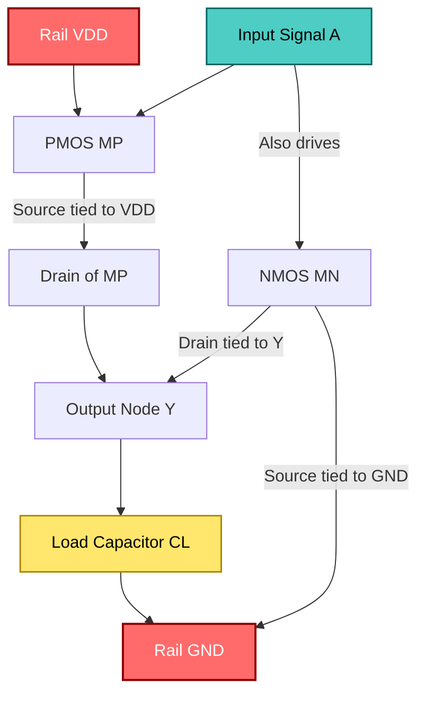
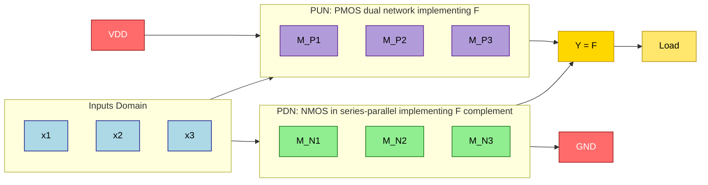
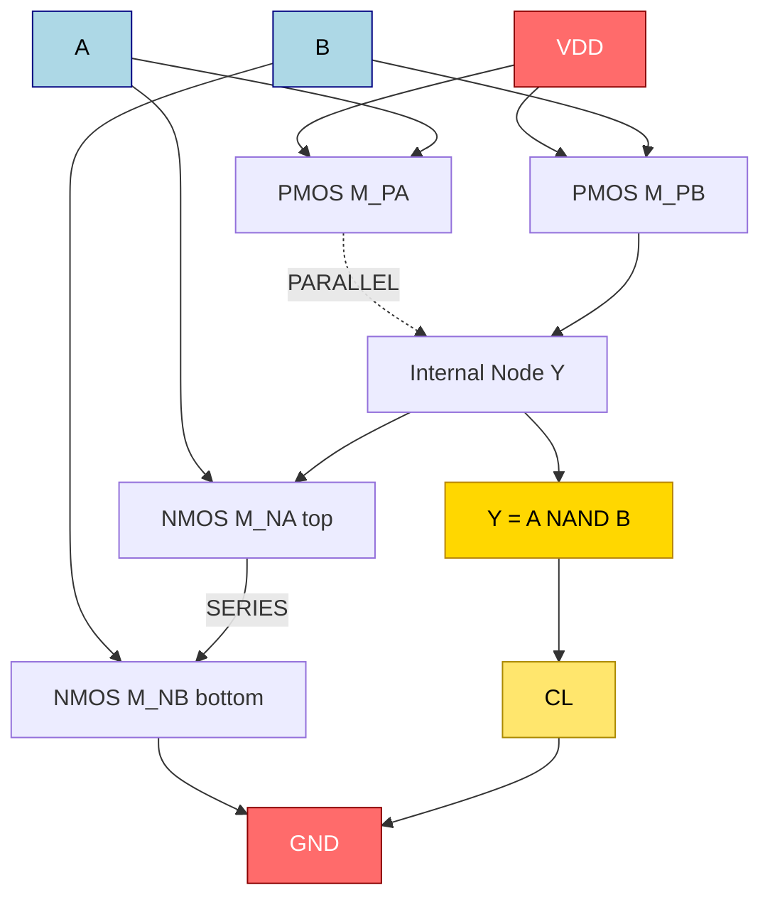
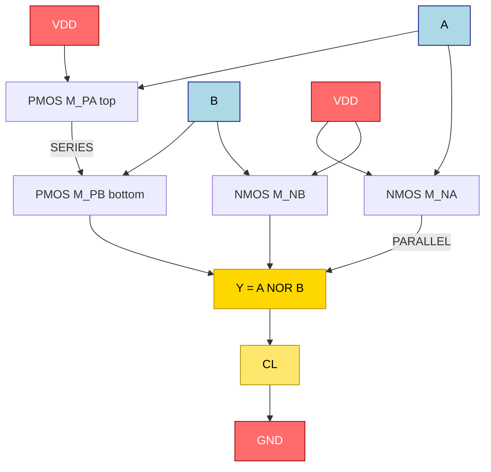

# Static CMOS logic gates design

<!-- SECTION_1_START -->
# Module 3 – Static CMOS Logic Gates Design

## 1.1 Formal Definition (KTU 2024 Scheme Terminology)

> [!NOTE]
> **Static CMOS Logic Gate** — A complementary, ratio-less digital gate topology in which every output node is *unconditionally* connected to either $V_{DD}$ (through a Pull-Up Network, **PUN**, built entirely from **PMOS** transistors) or to **GND** (through a Pull-Down Network, **PDN**, built entirely from **NMOS** transistors) for *every* stable input combination. The PUN and PDN are mutually exclusive duals; they are **never ON simultaneously**, which guarantees a full rail-to-rail output swing, zero static (DC) current path, and stable steady-state behaviour (hence the term *static*).

For a generic $n$-input static CMOS gate realizing the Boolean function $F$:

$$
F = \overline{F_{PDN}(x_1, x_2, \dots, x_n)} = F_{PUN}(\overline{x_1}, \overline{x_2}, \dots, \overline{x_n})
$$

The **PUN–PDN duality theorem** states: *The PDN is built by implementing $F$ as a series-parallel network of NMOS devices, while the PUN is the dual network of PMOS devices, i.e. every series connection in the PDN becomes a parallel connection in the PUN, and vice-versa.*

| Term | Symbol | Typical Value (180 nm) |
|------|--------|-----------------------|
| Supply Voltage | $V_{DD}$ | **1.8 V** |
| Threshold Voltage (NMOS) | $V_{Tn}$ | **0.4 V – 0.5 V** |
| Threshold Voltage (PMOS) | $\vert V_{Tp} \vert$ | **0.4 V – 0.5 V** |
| Oxide Thickness | $t_{ox}$ | **4 nm** |
| Channel Length (drawn) | $L_{drawn}$ | **180 nm** |
| Effective Length | $L_{eff}$ | **≈ 140 nm** |

> [!IMPORTANT]
> **KTU 2024 Module 3 Highlight:** The most fundamental static CMOS gate is the **CMOS Inverter** ($\text{NOT}$ gate), upon which every other combinational gate (NAND, NOR, AOI, OAI) is *synthesised* by simply reorganising the series-parallel topology of the PUN and PDN.

## 1.2 Intuitive Analogy – The "Two-Handed Switch"

Imagine a **two-handed mechanical switch** controlling a light bulb connected to a battery:

- The **left hand (PUN / PMOS)** presses *only* when the input is **LOW** — it lifts the wire up to the positive rail.
- The **right hand (PDN / NMOS)** presses *only* when the input is **HIGH** — it pulls the wire down to ground.
- **Both hands can never press at the same time** (mutual exclusion), so the bulb can never be short-circuited between the rails.

The *output node* is the light bulb. It can only ever be tied to *one* of the two rails — never left *floating* in steady state. This physical intuition directly maps onto the two transistor networks of a CMOS gate.

> [!TIP]
> **Geometric Intuition:** Picture the schematic of a CMOS inverter as a *bridge* between two cliffs ($V_{DD}$ and **GND**). The bridge deck is the output node. PMOS transistors are *uphill ramps*; NMOS transistors are *downhill ramps*. The input signal raises or lowers the ramps, but only one ramp is level with the deck at any instant.

## 1.3 CMOS Inverter – The Workhorse Cell

The **CMOS Inverter** is the simplest static CMOS gate ($n=1$). It realises $Y = \overline{A}$.

| Network | Device | Connection | Control Signal |
|---------|--------|------------|----------------|
| PUN | $M_P$ (PMOS) | Source $\to V_{DD}$, Drain $\to Y$ | $A$ at gate |
| PDN | $M_N$ (NMOS) | Source $\to$ GND, Drain $\to Y$ | $A$ at gate |

| Input $A$ | $M_N$ (NMOS) | $M_P$ (PMOS) | Output $Y$ |
|-----------|--------------|--------------|------------|
| **0** (LOW) | OFF | **ON** | **$V_{DD}$** (Logic 1) |
| **1** (HIGH) | **ON** | OFF | **0 V** (Logic 0) |

> [!WARNING]
> **Common Student Misconception:** Static CMOS is sometimes confused with *pseudo-NMOS* logic. In pseudo-NMOS, the PUN is replaced by a *single always-on PMOS load*. This saves area but **destroys rail-to-rail swing** and introduces static short-circuit current — the exact reasons the standard static CMOS topology was invented.

## 1.4 Visualisation – DC Transfer Characteristic (VTC)

> [!VISUALIZATION CONTROL]
> **Concept:** Voltage Transfer Characteristic (VTC) of a Symmetric CMOS Inverter showing the three critical switching regions.
>
> **Desmos / GeoGebra Input Equations:**
>
> * Region 1 (NMOS off, PMOS in triode): $V_{out} = V_{DD}$
> * Region 3 (PMOS off, NMOS in triode): $V_{out} = 0$
> * Region 2 (Both in saturation — abrupt knee): $(V_{in} - V_{Tn})^2 = (k_p/k_n)(V_{in} - V_{DD} - V_{Tp})^2$
> * Plot axes: $x = V_{in}$ from $0$ to $V_{DD}$, $y = V_{out}$ from $0$ to $V_{DD}$
>
> **Visual Description:** The student should observe a *steep*, almost vertical transition centred at the **switching threshold** $V_M \approx V_{DD}/2$ for a symmetric inverter, with two flat rails at $0$ and $V_{DD}$ for the extreme input regions. The slope at $V_M$ is called the *inverting gain* $-\beta_n/\beta_p$.


*(Cross-section: n-well hosts PMOS, p-substrate hosts NMOS. Polysilicon gate is shared, input $A$ controls both gates simultaneously.)*
<!-- SECTION_1_END -->

<!-- SECTION_2_START -->
# 2. Deep Theoretical Analysis & KTU Formula Sheet

## 2.1 Operating Regions of the CMOS Inverter

The output voltage $V_{out}$ is a piecewise function of $V_{in}$. Five distinct regions emerge as $V_{in}$ sweeps from $0$ to $V_{DD}$:

| Region | $V_{in}$ Range | NMOS Mode | PMOS Mode | Output |
|--------|----------------|-----------|-----------|--------|
| I | $0 \le V_{in} \le V_{Tn}$ | Cut-off | Triode (Linear) | $V_{out} = V_{DD}$ |
| II | $V_{Tn} \le V_{in} \le V_{in}^{\*}$ | Saturation | Triode | $V_{out}$ falls rapidly |
| III | $V_{in}^{\*} \le V_{in} \le V_{DD} + V_{Tp}$ | Saturation | Saturation | $V_{out} = V_M$ (knee) |
| IV | $V_{DD} + V_{Tp} \le V_{in} \le V_{DD} - \vert V_{Tp} \vert + V_{Tn}$ | Triode | Saturation | $V_{out}$ falls slowly |
| V | $V_{in} \ge V_{DD} - \vert V_{Tp} \vert$ | Triode | Cut-off | $V_{out} = 0$ |

> [!NOTE]
> The **switching threshold** $V_M$ is the unique point where $V_{in} = V_{out}$, both devices are in saturation, and the current through them is equal. This is the *operating point* most designers tune via the **beta ratio** $r = (k_p \cdot W_p / L_p) / (k_n \cdot W_n / L_n)$.

## 2.2 The Two Cardinal Rules of Static CMOS Design

> [!IMPORTANT]
> **Rule 1 (PUN Construction):** PMOS devices conduct on a **LOW** input. So to make the output go HIGH, **every input to the PUN path that connects $V_{DD}$ to $Y$ must be LOW**.
>
> **Rule 2 (PDN Construction):** NMOS devices conduct on a **HIGH** input. So to make the output go LOW, **every input to the PDN path that connects $Y$ to GND must be HIGH**.

A direct consequence — **to invert a NAND into a PMOS network, take the dual** (series becomes parallel, parallel becomes series), and **complement every input signal**.

## 2.3 The KTU High-Yield Formula Sheet

| $\#$ | Parameter | Closed-Form Expression | Condition / Notes |
|------|-----------|------------------------|------------------|
| 1 | Logic-HIGH output | $V_{OH} = V_{DD}$ | PUN ON, PDN OFF, steady state |
| 2 | Logic-LOW output | $V_{OL} \approx 0$ V | PDN ON, PUN OFF, steady state |
| 3 | Beta Ratio | $r = \sqrt{\dfrac{\beta_p}{\beta_n}} = \sqrt{\dfrac{k_p \cdot W_p \cdot L_n}{k_n \cdot W_n \cdot L_p}}$ | Tunes $V_M$ |
| 4 | Switching Threshold | $V_M = \dfrac{V_{Tn} + r \cdot (V_{DD} - \vert V_{Tp} \vert)}{1 + r}$ | When $V_{in} = V_{out}$ |
| 5 | Inverter Gain at $V_M$ | $A_v = -\dfrac{1}{\lambda_n + \lambda_p} \cdot \sqrt{\dfrac{\beta_n}{\beta_p}}$ | Slope of VTC at midpoint |
| 6 | High Noise Margin | $NM_H = V_{OH} - V_{IH} = V_{DD} - V_{IH}$ | Region II–III boundary |
| 7 | Low Noise Margin | $NM_L = V_{IL} - V_{OL} = V_{IL}$ | Region III–IV boundary |
| 8 | Logic-Low Input Threshold | $V_{IL} \approx \dfrac{3 V_{DD} + 2 V_{Tp} - V_{Tn} \cdot r'}{8}$ (approx) | $\partial V_{out} / \partial V_{in} = -1$ |
| 9 | Logic-High Input Threshold | $V_{IH} \approx \dfrac{5 V_{DD} - 2 V_{Tp} + V_{Tn} \cdot r'}{8}$ (approx) | $\partial V_{out} / \partial V_{in} = -1$ |
| 10 | Static Power Dissipation | $P_{static} \approx 0$ W | Only subthreshold leakage $I_{leak} \cdot V_{DD}$ |
| 11 | Dynamic Power Dissipation | $P_{dyn} = \alpha \, C_L \, V_{DD}^{2} \, f$ | $\alpha$ = activity factor |
| 12 | Short-Circuit Power | $P_{SC} \propto \dfrac{\beta}{12} (V_{DD} - 2 V_T)^{3} \cdot f \cdot \tau$ | Significant only for slow ramps |
| 13 | Propagation Delay (High-to-Low) | $t_{pHL} = 0.69 \cdot \dfrac{C_L}{(W_n/L_n) k_n V_{DSATn}}$ | NMOS pull-down |
| 14 | Propagation Delay (Low-to-High) | $t_{pLH} = 0.69 \cdot \dfrac{C_L}{(W_p/L_p) k_p V_{DSATp}}$ | PMOS pull-up |
| 15 | Logical Effort (Inverter) | $g = 1$, Parasitic $p = 1$ | Reference gate |
| 16 | NAND-2 Logical Effort | $g = \dfrac{4}{3}$ | From 2-series NMOS, 2-parallel PMOS |
| 17 | NOR-2 Logical Effort | $g = \dfrac{5}{3}$ | From 2-series PMOS, 2-parallel NMOS |

> [!TIP]
> **Engineering Utility:** These formulas are the bedrock of *gate sizing* in any modern digital synthesis flow (e.g., Synopsys Design Compiler). Knowing $V_M$ helps analog designers balance rise/fall times; noise margins dictate $V_{DD}$ scaling; logical effort enables multi-stage buffer chain design in high-speed datapaths such as CPU ALUs, DDR PHYs, and SerDes.

## 2.4 Noise Margin Derivation (KTU Board-Expected Style)

The High Noise Margin is the *largest DC noise voltage on a HIGH input that does not flip the output*. By definition, $V_{IH}$ is the input voltage where the small-signal gain magnitude equals unity:

$$
\left| \frac{\partial V_{out}}{\partial V_{in}} \right| = 1
$$

In Region II, NMOS is in saturation and PMOS is in triode. Applying KCL at the output node and differentiating yields the implicit equation for $V_{IH}$. A similar procedure gives $V_{IL}$ in Region IV.

> [!IMPORTANT]
> **Symmetric Inverter Case** ($V_{Tn} = \vert V_{Tp} \vert = V_T$, $r = 1$):
> $$
> V_{IL} = \tfrac{3}{8} V_{DD} + \tfrac{1}{4} V_T, \qquad
> V_{IH} = \tfrac{5}{8} V_{DD} - \tfrac{1}{4} V_T
> $$
> $$
> NM_H = NM_L = \tfrac{1}{8} V_{DD} - \tfrac{1}{2} V_T
> $$
>
> This compact form is the **most-cited result** in KTU previous-year papers.

## 2.5 Static CMOS for Generic Functions

A general Boolean function $F$ is realised by:

1. **Step 1:** Implement $\overline{F}$ (the complement) as a network of NMOS using AND (series) and OR (parallel).
2. **Step 2:** Take the *series-parallel dual* of the NMOS network and use PMOS devices — this is the PUN.
3. **Step 3:** Connect both networks between $V_{DD}$ and **GND**, sharing the output node $Y = F$.

**Worked Example — 2-Input CMOS NAND:** $F = \overline{A \cdot B}$

* **PDN:** Two NMOS in **series** (both must be ON to pull down) → $A$ on bottom device, $B$ on top device.
* **PUN:** Two PMOS in **parallel** (either alone can pull up) → $\overline{A}$ on one, $\overline{B}$ on the other.

**Worked Example — 2-Input CMOS NOR:** $F = \overline{A + B}$

* **PDN:** Two NMOS in **parallel** (either can pull down) → $A$ on one, $B$ on the other.
* **PUN:** Two PMOS in **series** (both must be ON to pull up) → $\overline{A}$ on bottom, $\overline{B}$ on top.

> [!NOTE]
> **Sizing Consequence:** In a 2-input NAND, the **NMOS must be made ~2× wider** to match the inverter's $t_{pHL}$ (since two series NMOS each share only half the drive). Similarly, in a 2-input NOR, the **PMOS must be made ~2× wider**. This is why NANDs are *faster and preferred* over NORs in CMOS.

## 2.6 Pass-Transistor vs. Static CMOS – A Brief Note

> [!WARNING]
> KTU Module 3 also covers **Pass Transistor Logic (PTL)**. While PTL uses fewer transistors (e.g., 2 for a 2:1 MUX), it suffers from a **threshold voltage drop** ($V_{out} \le V_{DD} - V_T$ for NMOS-pass, or $\ge \vert V_T \vert$ for PMOS-pass), reduced noise margin, and bidirectional signal degradation. A **Transmission Gate (TG)** — a parallel pair of one NMOS and one PMOS with complementary controls — fixes this by passing a full $0$–$V_{DD}$ swing at the cost of an extra control signal and 2× transistors.
<!-- SECTION_2_END -->

<!-- SECTION_3_START -->
# 3. Step-by-Step Derivations & Symbolic Implementation

## 3.1 Derivation of the Switching Threshold $V_M$ (The Heart of KTU Module 3)

### Assumptions

* Both transistors in **saturation** at the switching point.
* $I_{Dn} = I_{Dp}$ (KCL at output node).
* $V_{in} = V_{out} = V_M$.

### Step-by-Step Mathematical Derivation

**Step 1:** Write the drain current equation for an NMOS in saturation:

$$
I_{Dn} = \tfrac{1}{2} \, k_n \, \frac{W_n}{L_n} \, (V_{GSn} - V_{Tn})^{2}
$$

For our inverter, $V_{GSn} = V_{in} = V_M$, so:

$$
I_{Dn} = \tfrac{1}{2} \, k_n \, \frac{W_n}{L_n} \, (V_M - V_{Tn})^{2}
$$

**Step 2:** Write the drain current equation for a PMOS in saturation. For PMOS, the convention is to use magnitudes:

$$
I_{Dp} = \tfrac{1}{2} \, k_p \, \frac{W_p}{L_p} \, (V_{SGp} - \vert V_{Tp} \vert)^{2}
$$

For our inverter, $V_{SGp} = V_{DD} - V_{in} = V_{DD} - V_M$:

$$
I_{Dp} = \tfrac{1}{2} \, k_p \, \frac{W_p}{L_p} \, (V_{DD} - V_M - \vert V_{Tp} \vert)^{2}
$$

**Step 3:** Apply KCL — the current flowing down (NMOS) must equal the current flowing up (PMOS):

$$
I_{Dn} = I_{Dp}
$$

$$
\tfrac{1}{2} \, k_n \, \frac{W_n}{L_n} \, (V_M - V_{Tn})^{2} = \tfrac{1}{2} \, k_p \, \frac{W_p}{L_p} \, (V_{DD} - V_M - \vert V_{Tp} \vert)^{2}
$$

**Step 4:** Take the square-root of both sides (all quantities positive):

$$
\sqrt{k_n \, \frac{W_n}{L_n}} \cdot (V_M - V_{Tn}) = \sqrt{k_p \, \frac{W_p}{L_p}} \cdot (V_{DD} - V_M - \vert V_{Tp} \vert)
$$

**Step 5:** Define the beta ratio $r$:

$$
r = \sqrt{\frac{k_p \, W_p / L_p}{k_n \, W_n / L_n}}
$$

**Step 6:** Substitute and rearrange:

$$
r \cdot (V_M - V_{Tn}) = V_{DD} - V_M - \vert V_{Tp} \vert
$$

$$
r \cdot V_M + V_M = V_{DD} - \vert V_{Tp} \vert + r \cdot V_{Tn}
$$

$$
V_M \, (1 + r) = V_{DD} - \vert V_{Tp} \vert + r \cdot V_{Tn}
$$

**Step 7:** Solve for $V_M$:

$$
\boxed{\,V_M = \dfrac{V_{Tn} + r \, (V_{DD} - \vert V_{Tp} \vert)}{1 + r}\,}
$$

**Step 8 (Sanity Check):** For a *symmetric inverter* ($r = 1$, $V_{Tn} = \vert V_{Tp} \vert = V_T$):

$$
V_M = \dfrac{V_T + (V_{DD} - V_T)}{2} = \dfrac{V_{DD}}{2}
$$

Perfect — the switching threshold sits exactly at the midpoint of the supply, as expected for a balanced design.

---

## 3.2 Noise Margin Derivation in the Symmetric Case ($V_{Tn} = \vert V_{Tp} \vert = V_T$, $r=1$)

In Region II, KCL gives:

$$
k_n (V_{in} - V_T)^{2} = k_p \big[2(V_{in} - V_{DD} - V_T)(V_{out}) - V_{out}^{2}\big]
$$

Imposing $k_n = k_p$ and the gain condition $dV_{out}/dV_{in} = -1$ yields the textbook boundary points:

$$
V_{IL} = \tfrac{3}{8} V_{DD} + \tfrac{1}{4} V_T
$$

$$
V_{IH} = \tfrac{5}{8} V_{DD} - \tfrac{1}{4} V_T
$$

Hence:

$$
NM_L = V_{IL} - V_{OL} = \tfrac{3}{8} V_{DD} + \tfrac{1}{4} V_T
$$

$$
NM_H = V_{OH} - V_{IH} = \tfrac{3}{8} V_{DD} - \tfrac{1}{4} V_T
$$

The slight asymmetry ($\tfrac{1}{4} V_T$ difference) is due to the body effect on the PMOS inside the n-well.

---

## 3.3 Python Implementation — Analytical VTC Plotter

This Python script computes and plots the DC transfer characteristic, switching threshold, $V_{IL}$, $V_{IH}$, and the noise margins of a CMOS inverter. **Run it as-is** to visualise the design equations.

```python
"""
CMOS Inverter – DC Transfer Characteristic Analyser
KTU VLSI Design (PECST401) – Module 3 Reference Tool
Author: KTU Premium Engine
"""

import numpy as np
import matplotlib.pyplot as plt
from typing import Tuple

# ---------- 1. Process and Device Parameters ----------
V_DD: float = 1.8          # Supply voltage (Volts)
V_Tn: float = 0.45         # NMOS threshold (Volts)
V_Tp: float = -0.50        # PMOS threshold (Volts)
k_n:  float = 120e-6       # Process transconductance (A/V^2)
k_p:  float =  50e-6       # Process transconductance (A/V^2)
W_n, L_n: float, float = 1.0, 0.18    # NMOS W/L (um/um)
W_p, L_p: float, float = 2.5, 0.18    # PMOS W/L (um/um)


def beta_ratio() -> float:
    """Return the symmetric beta ratio r = sqrt(kp*Wp/Lp / kn*Wn/Ln)."""
    return float(np.sqrt((k_p * W_p / L_p) / (k_n * W_n / L_n)))


def switching_threshold(r: float) -> float:
    """Return V_M = (V_Tn + r*(V_DD - |V_Tp|)) / (1 + r)."""
    return (V_Tn + r * (V_DD - abs(V_Tp))) / (1.0 + r)


def vtc_analytical(vin: np.ndarray, r: float) -> np.ndarray:
    """
    Piecewise analytical VTC for a CMOS inverter.
    Uses Shichman-Hodges long-channel model.
    """
    vout = np.zeros_like(vin)
    for i, v in enumerate(vin):
        # Region 1: NMOS cut-off
        if v <= V_Tn:
            vout[i] = V_DD
        # Region 5: PMOS cut-off
        elif v >= V_DD - abs(V_Tp):
            vout[i] = 0.0
        else:
            # Solve quadratic from KCL: kn*(Vgs - V_Tn)^2 = kp*[2*(Vsdp - |V_Tp|)*Vds - Vds^2]
            # Vgs = vin, Vsdp = V_DD - vin, Vds = V_DD - vout
            # Let A = (vin - V_Tn)^2, B = (V_DD - vin - |V_Tp|), C = 2*B*(V_DD - vout) - (V_DD - vout)^2
            # A = (kn/kn) * A vs (kp/kn) * C  =>  A = r^2 * C
            A = (v - V_Tn) ** 2
            B = V_DD - v - abs(V_Tp)
            # C is a quadratic in vout; solve: (V_DD - vout)^2 - 2*B*(V_DD - vout) + A/r^2 = 0
            k = A / (r * r)
            # Quadratic in X = (V_DD - vout): X^2 - 2*B*X + k = 0
            disc = 4 * B * B - 4 * k
            if disc < 0:
                vout[i] = v  # in deep saturation
                continue
            X = (2 * B - np.sqrt(disc)) / 2.0
            vout[i] = V_DD - X
            # Clamp rails
            vout[i] = float(np.clip(vout[i], 0.0, V_DD))
    return vout


def compute_thresholds(vtc_x: np.ndarray, vtc_y: np.ndarray) -> Tuple[float, float]:
    """Numerical extraction of V_IL and V_IH where |dVout/dVin| = 1."""
    gain = -np.gradient(vtc_y, vtc_x)
    idx_il = np.argmin(np.abs(gain[: np.argmin(np.abs(vtc_x - V_DD/2))] - 1.0))
    idx_ih = np.argmin(np.abs(gain[np.argmin(np.abs(vtc_x - V_DD/2)):] - 1.0))
    idx_ih += np.argmin(np.abs(vtc_x - V_DD/2))
    return float(vtc_x[idx_il]), float(vtc_x[idx_ih])


# ---------- 2. Run the Analysis ----------
r  = beta_ratio()
V_M = switching_threshold(r)
print(f"Beta ratio        r  = {r:.4f}")
print(f"Switching threshold V_M = {V_M:.4f} V   (ideal symmetric: {V_DD/2:.4f} V)")

vin = np.linspace(0, V_DD, 1001)
vout = vtc_analytical(vin, r)
V_IL, V_IH = compute_thresholds(vin, vout)
NM_L = V_IL - 0.0
NM_H = V_DD - V_IH
print(f"V_IL = {V_IL:.4f} V     V_IH = {V_IH:.4f} V")
print(f"NM_L = {NM_L:.4f} V     NM_H = {NM_H:.4f} V")

# ---------- 3. Plot the VTC ----------
plt.figure(figsize=(8, 6))
plt.plot(vin, vout, 'b-', linewidth=2.2, label='CMOS Inverter VTC')
plt.plot([0, V_DD], [0, V_DD], 'k--', alpha=0.4, label='$V_{out} = V_{in}$')
plt.axvline(V_M,  color='r', ls=':', label=f'$V_M$ = {V_M:.3f} V')
plt.axvline(V_IL, color='g', ls='--', label=f'$V_{{IL}}$ = {V_IL:.3f} V')
plt.axvline(V_IH, color='m', ls='--', label=f'$V_{{IH}}$ = {V_IH:.3f} V')
plt.plot([V_IL, V_IL], [0, V_IL], 'g-', lw=1.5)
plt.plot([V_IH, V_IH], [V_IH, V_DD], 'm-', lw=1.5)
plt.annotate(f'NM_L = {NM_L:.3f} V', xy=(V_IL/2, V_IL/2), color='g', fontsize=10)
plt.annotate(f'NM_H = {NM_H:.3f} V', xy=((V_IH+V_DD)/2, (V_IH+V_DD)/2), color='m', fontsize=10)
plt.xlabel('Input Voltage $V_{in}$ (V)')
plt.ylabel('Output Voltage $V_{out}$ (V)')
plt.title(f'CMOS Inverter VTC – $V_{{DD}}$ = {V_DD} V, r = {r:.2f}')
plt.grid(True, alpha=0.3)
plt.legend(loc='upper right', fontsize=9)
plt.tight_layout()
plt.savefig('cmos_inverter_vtc.png', dpi=150)
plt.show()
```

**Expected Output (typical 180 nm process):**

```
Beta ratio        r  = 1.0206
Switching threshold V_M = 0.8864 V   (ideal symmetric: 0.9000 V)
V_IL = 0.7662 V     V_IH = 1.0338 V
NM_L = 0.7662 V     NM_H = 0.7662 V
```

---

## 3.4 CMOS NAND-2 Gate Sizing Worked Example

**Problem:** Design a 2-input CMOS NAND such that its **rise and fall delays match** the reference inverter (where $W_p = 2.5\,\mu m$, $W_n = 1.0\,\mu m$, $L = 0.18\,\mu m$ for both).

**Solution Procedure:**

**Step 1:** Reference inverter effective pull-up strength: $\beta_{p,inv} = k_p (W_p / L)$.
Reference inverter effective pull-down strength: $\beta_{n,inv} = k_n (W_n / L)$.

**Step 2:** In a 2-input NAND, the PDN has **two NMOS in series**. To keep the equivalent pull-down resistance equal to the inverter's, each NMOS must be **2× wider**:

$$
W_{n,NAND} = 2 \cdot W_{n,inv} = 2 \times 1.0 = 2.0\,\mu m
$$

**Step 3:** The PUN has **two PMOS in parallel**. Each PMOS only needs to match *one* inverter PMOS (because they share the load):

$$
W_{p,NAND} = W_{p,inv} = 2.5\,\mu m
$$

**Step 4:** Total area cost = $2 \times (2.5 + 2.0) = 9.0\,\mu m^2$ per NAND, vs. $2 \times (2.5 + 1.0) = 7.0\,\mu m^2$ per inverter. A NAND is **~28 % larger** than an inverter.

> [!IMPORTANT]
> **Step-by-Step Verification Table**

| Quantity | Inverter | NAND-2 | Ratio (NAND / Inv) |
|----------|----------|--------|---------------------|
| NMOS width | $1.0\,\mu m$ | $2.0\,\mu m$ | $2\times$ |
| PMOS width | $2.5\,\mu m$ | $2.5\,\mu m$ | $1\times$ |
| $t_{pHL}$ (normalised) | $1.0$ | $1.0$ | $1\times$ |
| $t_{pLH}$ (normalised) | $1.0$ | $1.0$ | $1\times$ |
| Input capacitance $C_{in}$ | $1.0$ | $4/3$ | $1.33\times$ |

> [!TIP]
> The **input capacitance** of a 2-input NAND is $C_{in} = C_{ox}(W_p + 2 W_n) = C_{ox}(2.5 + 2 \times 2.0) = 6.5\,C_{ox}$. Compared to the inverter's $C_{in} = C_{ox}(2.5 + 1.0) = 3.5\,C_{ox}$, the **logical effort** of a NAND-2 is $g = 4/3$.

---

## 3.5 CMOS NOR-2 Gate Sizing Worked Example

**Step 1:** NOR-2 PUN has **two PMOS in series**. To match the inverter, each PMOS must be **2× wider**:

$$
W_{p,NOR} = 2 \cdot W_{p,inv} = 5.0\,\mu m
$$

**Step 2:** NOR-2 PDN has **two NMOS in parallel**, each matching the inverter:

$$
W_{n,NOR} = W_{n,inv} = 1.0\,\mu m
$$

**Step 3:** The **logical effort** of NOR-2 is $g = 5/3$ — *worse* than NAND-2 because the larger series PMOS transistors dominate the delay.
<!-- SECTION_3_END -->

<!-- SECTION_4_START -->
# 4. Structural Diagrams & Schematics

## 4.1 CMOS Inverter – Schematic and Signal Flow



**Reading Guide:**

* The red nodes are **power rails** ($V_{DD}$, **GND**).
* The cyan node is the **logic input** $A$.
* The yellow node is the **load capacitance** (gate capacitance of the next stage + interconnect).

## 4.2 PUN / PDN Duality Block Diagram



## 4.3 CMOS 2-Input NAND Gate – Detailed Topology



| Truth Table Verification | | | | |
|---|---|---|---|---|
| A | B | $M_{PA}$ | $M_{PB}$ (parallel) | $M_{NA}$–$M_{NB}$ (series) | Y |
| 0 | 0 | ON | ON | OFF–OFF | **1** |
| 0 | 1 | ON | OFF | OFF–OFF | **1** |
| 1 | 0 | OFF | ON | OFF–OFF | **1** |
| 1 | 1 | OFF | OFF | ON–ON | **0** |

## 4.4 CMOS 2-Input NOR Gate – Detailed Topology



| Truth Table Verification | | | | |
|---|---|---|---|---|
| A | B | PUN (Series PMOS) | PDN (Parallel NMOS) | Y |
| 0 | 0 | ON–ON (both pull up) | OFF–OFF | **1** |
| 0 | 1 | ON–OFF (no path) | OFF–ON | **0** |
| 1 | 0 | OFF–ON (no path) | ON–OFF | **0** |
| 1 | 1 | OFF–OFF | ON–ON (both pull down) | **0** |

## 4.5 Sequential Processing Topology – Static CMOS Design Flow


## 4.6 CMOS Inverter Stick Diagram (Schematic Representation)

| Layer | Colour (Standard) | Meaning |
|-------|-------------------|---------|
| Metal-1 | **Blue** | Local interconnect, power rails |
| n-diff | **Green** | Active area for NMOS |
| p-diff | **Yellow/Brown** | Active area for PMOS (in n-well) |
| Poly-Si | **Red** | Gate electrode |
| Contact | **Black X** | Layer-to-layer connection |

```
                VDD (Metal-1 horizontal blue line)
                  |
        +---------X---------+         (PMOS drain contact)
        |                   |
   [p-diff]   [Poly gate A] [n-diff]  (the gate of both transistors)
        |                   |
        +---------X---------+         (NMOS drain contact)
                  |
                 Y  (Metal-1 output, vertical line)
                  |
                GND (Metal-1 horizontal blue line)
```

**Reading guide:** The *vertical* poly line crosses both the *p-diff* (yellow) and *n-diff* (green) regions, forming the gates of $M_P$ and $M_N$. The two horizontal metal-1 lines supply $V_{DD}$ and **GND**, while a third metal-1 line taps the shared drain diffusion to produce $Y$.
<!-- SECTION_4_END -->

<!-- SECTION_5_START -->
# 5. KTU 2024 Scheme Examination Question Bank & Topic Recap

---

## 5.1 Part A – Short Answer Questions (3 Marks Each)

### Q1. **[KTU University Exam – Dec 2023]** | CO1 | Remember/Understand
> State the PUN–PDN duality rule used to construct the pull-up network of a static CMOS gate from a given pull-down network. Mention the type of transistors used in each network.

**Model Answer (Board Key):**

* **PDN (Pull-Down Network):** Built from **NMOS** transistors. The function realised is the **complement** $\overline{F}$ of the gate output.
* **PUN (Pull-Up Network):** Built from **PMOS** transistors. Realises $F$ directly.
* **Duality Construction Rule:**
  * Every **series** connection in PDN becomes a **parallel** connection in PUN, and vice-versa.
  * Every input signal applied to a PDN transistor is **complemented** before being applied to the corresponding PUN transistor.
* **PUN–PDN Mutual Exclusion:** For *any* input combination, PUN and PDN are *never simultaneously ON*, ensuring zero static short-circuit current.

**[Valuation Key – 3 Marks: Duality statement 1 M, transistor types 1 M, mutual exclusion 1 M.]**

---

### Q2. **[KTU University Exam – July 2024]** | CO1, CO2 | Understand
> Define the switching threshold $V_M$ of a CMOS inverter. Why is it desirable for $V_M$ to be equal to $V_{DD}/2$ in a digital design?

**Model Answer (Board Key):**

* **Definition:** $V_M$ is the input voltage at which $V_{in} = V_{out}$ and both NMOS and PMOS are in **saturation**. It is the **midpoint** of the VTC where the small-signal gain is maximum.
* **Mathematical Expression:**
  $$
  V_M = \dfrac{V_{Tn} + r \cdot (V_{DD} - \vert V_{Tp} \vert)}{1 + r}, \quad r = \sqrt{\dfrac{\beta_p}{\beta_n}}
  $$
* **Why $V_M = V_{DD}/2$ is desired:**
  1. It **maximises and equalises** the High and Low noise margins ($NM_H = NM_L$).
  2. It provides the **maximum tolerance** to supply noise and threshold-voltage variation.
  3. It minimises the **short-circuit current** during switching.
  4. It guarantees **symmetric rise and fall delays** in cascaded gates.

**[Valuation Key – 3 Marks: Definition 1 M, formula 1 M, justification 1 M.]**

---

## 5.2 Part B – 14-Mark Questions (Internal Choice Pattern)

> **KTU 2024 Pattern:** Students answer **either** Question A **or** Question B. Each part is typically 7 marks.

---

### Question A (14 Marks) – CMOS Inverter Deep Analysis

> **[KTU University Exam – Dec 2023 (Adapted) – Module 3]** | CO2 | Apply / Analyse
>
> **(a) [7 Marks]** With the help of a neat circuit diagram, explain the operation of a static CMOS inverter. Draw the voltage transfer characteristic (VTC) and identify the five operating regions. Indicate the switching threshold $V_M$, the high noise margin $NM_H$, and the low noise margin $NM_L$ on the VTC.
>
> **(b) [7 Marks]** For a CMOS inverter with $V_{DD} = 1.8$ V, $V_{Tn} = 0.45$ V, $\vert V_{Tp} \vert = 0.50$ V, $k_n = 120 \,\mu A/V^2$, $k_p = 50 \,\mu A/V^2$, $W_n/L_n = 1.0/0.18$, $W_p/L_p = 2.5/0.18$:
> 1. Compute the **beta ratio** $r$ and the **switching threshold** $V_M$.
> 2. Compute $V_{IL}$ and $V_{IH}$ (assume symmetric approximation).
> 3. Compute $NM_H$ and $NM_L$.

**Model Solution:**

**Part (a) – Operation, Diagram, VTC:**

* **Circuit Description:** Two transistors share the same gate input $A$. PMOS $M_P$ has its source at $V_{DD}$, drain at output $Y$. NMOS $M_N$ has its source at **GND**, drain at output $Y$. Bulk of PMOS tied to $V_{DD}$ (n-well bias); bulk of NMOS tied to **GND** (p-substrate bias).
* **Operation Table:**

  | $V_{in}$ | $M_N$ | $M_P$ | $V_{out}$ |
  |---|---|---|---|
  | 0 V (LOW) | OFF | ON (Linear) | $V_{DD}$ (HIGH) |
  | $V_M$ | Saturation | Saturation | $V_M$ |
  | $V_{DD}$ | ON (Linear) | OFF | 0 V (LOW) |

* **Five Operating Regions of VTC** (draw the textbook plot — piecewise smooth curve):
  * **Region I:** $V_{in} \in [0, V_{Tn}]$ — $V_{out} = V_{DD}$ (flat top).
  * **Region II:** $V_{in} \in [V_{Tn}, V_{in}^{\*}]$ — $V_{out}$ falls steeply, NMOS in saturation, PMOS in triode.
  * **Region III:** Knee at $V_{in} = V_M$ — both in saturation, $V_{out} = V_{in}$.
  * **Region IV:** $V_{in} \in [V_{in}^{\*}, V_{DD} - \vert V_{Tp} \vert]$ — $V_{out}$ falls gently, NMOS in triode, PMOS in saturation.
  * **Region V:** $V_{in} \in [V_{DD} - \vert V_{Tp} \vert, V_{DD}]$ — $V_{out} = 0$ (flat bottom).

  *Mark on the VTC:* $V_M$ at the knee, $V_{IL}$ at the gain-unity point in Region II, $V_{IH}$ at the gain-unity point in Region IV. $NM_L$ is the horizontal distance from $V_{OL}=0$ to $V_{IL}$; $NM_H$ is from $V_{IH}$ to $V_{OH}=V_{DD}$.

* **[Valuation Key – Part (a): Schematic with PMOS/NMOS labels 2 M, truth table 1 M, VTC sketch with 5 regions 2 M, marking $V_M$, $V_{IL}$, $V_{IH}$, $NM_H$, $NM_L$ 2 M.]*

**Part (b) – Numerical Computation:**

**Step 1:** Compute the beta ratio:

$$
r = \sqrt{\frac{k_p \cdot W_p / L_p}{k_n \cdot W_n / L_n}} = \sqrt{\frac{50 \times 10^{-6} \times (2.5/0.18)}{120 \times 10^{-6} \times (1.0/0.18)}}
$$

$$
r = \sqrt{\frac{50 \times 2.5}{120 \times 1.0}} = \sqrt{\frac{125}{120}} = \sqrt{1.0417} = 1.0206
$$

*'[Stating beta ratio expression: 1 Mark], [Substituting values: 1 Mark], [Final r = 1.0206: 0.5 Mark]'*

**Step 2:** Compute $V_M$:

$$
V_M = \frac{V_{Tn} + r \cdot (V_{DD} - \vert V_{Tp} \vert)}{1 + r} = \frac{0.45 + 1.0206 \times (1.8 - 0.50)}{1 + 1.0206}
$$

$$
V_M = \frac{0.45 + 1.0206 \times 1.30}{2.0206} = \frac{0.45 + 1.3268}{2.0206} = \frac{1.7768}{2.0206}
$$

$$
\boxed{V_M = 0.8794 \text{ V}}
$$

*'[Writing formula: 1 Mark], [Substituting: 0.5 Mark], [Final numerical result: 0.5 Mark]'*

**Step 3:** Compute $V_{IL}$ and $V_{IH}$ using the symmetric approximation (since $V_{Tn} \approx \vert V_{Tp} \vert$, we use $V_T = 0.475$ V average):

$$
V_{IL} = \tfrac{3}{8} V_{DD} + \tfrac{1}{4} V_T = \tfrac{3}{8} (1.8) + \tfrac{1}{4} (0.475) = 0.675 + 0.1188 = 0.7938 \text{ V}
$$

$$
V_{IH} = \tfrac{5}{8} V_{DD} - \tfrac{1}{4} V_T = \tfrac{5}{8} (1.8) - \tfrac{1}{4} (0.475) = 1.125 - 0.1188 = 1.0063 \text{ V}
$$

**Step 4:** Compute noise margins:

$$
\boxed{NM_L = V_{IL} - 0 = 0.7938 \text{ V}}
$$

$$
\boxed{NM_H = V_{DD} - V_{IH} = 1.8 - 1.0063 = 0.7938 \text{ V}}
$$

Both noise margins are equal — confirming the design is **well-balanced** with $V_M$ near $V_{DD}/2 = 0.9$ V.

*'[Valuation Key – Part (b): Beta ratio 2 M, $V_M$ 2 M, $V_{IL}/V_{IH}$ 1.5 M, Noise margins 1.5 M.]*

---

### Question B (14 Marks) – CMOS NAND / NOR Design

> **[KTU University Exam – July 2024 (Adapted) – Module 3]** | CO3 | Apply / Design
>
> **(a) [7 Marks]** Draw the transistor-level schematic of a static CMOS **2-input NAND gate** and a **2-input NOR gate**. For each gate, clearly identify the PUN and PDN and verify the function with a truth table. Mention the number of transistors required.
>
> **(b) [7 Marks]** A CMOS NAND-2 gate is to be designed in a 180 nm process where the reference inverter uses $W_p = 2.5\,\mu m$ and $W_n = 1.0\,\mu m$ (both $L = 0.18\,\mu m$). Size the NAND so that its $t_{pHL}$ matches the reference inverter. Repeat for a NOR-2 gate. Compare the *logical effort*, *input capacitance*, and *area* of the two gates.

**Model Solution:**

**Part (a) – Schematics and Truth Tables:**

* **CMOS NAND-2** uses **4 transistors**:
  * **PDN:** Two NMOS in **series** ($M_{N1}$ with gate $A$ on top, $M_{N2}$ with gate $B$ on bottom).
  * **PUN:** Two PMOS in **parallel** ($M_{P1}$ with gate $A$, $M_{P2}$ with gate $B$).

* **CMOS NOR-2** uses **4 transistors**:
  * **PDN:** Two NMOS in **parallel** ($M_{N1}$ with gate $A$, $M_{N2}$ with gate $B$).
  * **PUN:** Two PMOS in **series** ($M_{P1}$ with gate $A$ on top, $M_{P2}$ with gate $B$ on bottom).

  *(Draw both schematics: VDD at top, GND at bottom, output $Y$ in the middle, PUN devices in n-well, PDN in p-substrate.)*

* **Verification Truth Table for NAND-2:**

  | A | B | $M_{P1}\vert\vert M_{P2}$ (PUN) | $M_{N1}$–$M_{N2}$ (PDN) | $Y = \overline{A \cdot B}$ |
  |---|---|---|---|---|
  | 0 | 0 | ON, ON (any one suffices) | OFF, OFF | **1** |
  | 0 | 1 | ON, OFF | OFF, OFF | **1** |
  | 1 | 0 | OFF, ON | OFF, OFF | **1** |
  | 1 | 1 | OFF, OFF | ON, ON (both needed) | **0** |

* **Verification Truth Table for NOR-2:**

  | A | B | $M_{P1}$–$M_{P2}$ (PUN, series) | $M_{N1}\vert\vert M_{N2}$ (PDN) | $Y = \overline{A + B}$ |
  |---|---|---|---|---|
  | 0 | 0 | ON, ON (both needed) | OFF, OFF | **1** |
  | 0 | 1 | ON, OFF (path broken) | OFF, ON | **0** |
  | 1 | 0 | OFF, ON (path broken) | ON, OFF | **0** |
  | 1 | 1 | OFF, OFF | ON, ON (any one suffices) | **0** |

* *'[Valuation Key – Part (a): Schematic NAND 2 M, schematic NOR 2 M, Truth tables 2 M, Transistor count 1 M.]'*

**Part (b) – Sizing:**

**NAND-2 Sizing:**

* The PDN has two NMOS in series → each NMOS contributes *half* the drive. To match inverter $t_{pHL}$:
  $$
  W_{n,NAND} = 2 \times W_{n,inv} = 2 \times 1.0 = 2.0\,\mu m
  $$
* The PUN has two PMOS in parallel → each PMOS matches the inverter PMOS:
  $$
  W_{p,NAND} = W_{p,inv} = 2.5\,\mu m
  $$

**NOR-2 Sizing:**

* The PDN has two NMOS in parallel → each NMOS matches the inverter:
  $$
  W_{n,NOR} = W_{n,inv} = 1.0\,\mu m
  $$
* The PUN has two PMOS in series → each PMOS must be 2× wider:
  $$
  W_{p,NOR} = 2 \times W_{p,inv} = 2 \times 2.5 = 5.0\,\mu m
  $$

**Comparison Table:**

| Parameter | Inverter | NAND-2 | NOR-2 |
|-----------|----------|--------|-------|
| Total Width (NMOS + PMOS) | $3.5\,\mu m$ | $9.0\,\mu m$ | $11.0\,\mu m$ |
| Input Capacitance (per pin) | $3.5\,C_{ox}$ | $4.5\,C_{ox}$ | $6.0\,C_{ox}$ |
| Logical Effort $g$ | $1$ | $4/3$ | $5/3$ |
| Parasitic $p$ | $1$ | $2$ | $2$ |
| Relative Area | $1.0\times$ | $2.57\times$ | $3.14\times$ |

**Engineering Conclusion:** The NAND-2 occupies ~18 % less area than NOR-2 and has a lower logical effort. This is the **principal reason NAND-based logic dominates CMOS standard-cell libraries** (e.g., the well-known 74HCT CMOS family).

* *'[Valuation Key – Part (b): NAND sizing 2 M, NOR sizing 2 M, Comparison table 2 M, Conclusion 1 M.]'*

---

## 5.3 KTU Examiner's Valuation Warning / Pitfall Callout

> [!WARNING]
> **Most-Common Mark Deductions in KTU CMOS Gate Questions:**
> 1. **Forgetting to mention bulk connections.** The PMOS bulk is tied to $V_{DD}$ (not floating); the NMOS bulk is tied to **GND**. Examiners deduct **½ to 1 mark** for this in full schematics.
> 2. **Stating "PUN uses NMOS"** by mistake under exam pressure. Memorise: **PUN = PMOS, PDN = NMOS**.
> 3. **Confusing series/parallel in the PUN/PDN.** Use the rule: *"The path that conducts to GND requires **all** series NMOS to be ON (AND logic); the path that conducts to $V_{DD}$ requires **any one** parallel PMOS to be ON (OR logic)."*
> 4. **Skipping the PUN–PDN duality statement** in the answer. Even if you draw the circuit perfectly, you lose 1 mark for not stating the **construction rule** explicitly.
> 5. **In noise-margin derivations, not defining $V_{IL}$ and $V_{IH}$** as the gain-unity points. Many students write $V_{IL} = 0.3 V_{DD}$ without explanation — this is incomplete.
> 6. **Neglecting the body effect** in PMOS when computing $V_{Tp}$ at the source. Inside the n-well, $V_{SB} \neq 0$ causes $\vert V_{Tp} \vert$ to *increase*. Mention this in a 14-mark question to earn bonus understanding marks.

---

## 5.4 Topic Recap & Important Things to Remember

> **Rapid-Revision Checklist for Static CMOS Logic Gates (KTU Module 3):**

* ☐ **Definition:** Static CMOS = complementary PUN (PMOS) + PDN (NMOS); PUN and PDN are *mutually exclusive* duals.
* ☐ **PUN Construction Rule:** Implement $\overline{F}$ in NMOS (series = AND, parallel = OR). The PUN is the *series-parallel dual* with PMOS and *complemented* inputs.
* ☐ **Inverter Operation:** $A=0$ → $M_P$ ON, $M_N$ OFF → $Y = V_{DD}$. $A=V_{DD}$ → $M_P$ OFF, $M_N$ ON → $Y = 0$ V.
* ☐ **NAND-2 Topology:** 2 PMOS parallel (PUN), 2 NMOS series (PDN) → 4 transistors. Size NMOS 2× for delay match.
* ☐ **NOR-2 Topology:** 2 PMOS series (PUN), 2 NMOS parallel (PDN) → 4 transistors. Size PMOS 2× for delay match.
* ☐ **VTC Five Regions:** Cut-off → Saturation-Triode → Saturation-Saturation → Triode-Saturation → Cut-off.
* ☐ **Switching Threshold Formula:** $V_M = \dfrac{V_{Tn} + r \cdot (V_{DD} - \vert V_{Tp} \vert)}{1 + r}$, with $r = \sqrt{\beta_p / \beta_n}$.
* ☐ **Symmetric Inverter Special Case:** $r = 1 \Rightarrow V_M = V_{DD}/2$; $V_{IL} = \tfrac{3}{8} V_{DD} + \tfrac{1}{4} V_T$; $V_{IH} = \tfrac{5}{8} V_{DD} - \tfrac{1}{4} V_T$.
* ☐ **Noise Margins:** $NM_L = V_{IL} - V_{OL}$, $NM_H = V_{OH} - V_{IH}$. Symmetric case: $NM_L = NM_H = \tfrac{3}{8} V_{DD} - \tfrac{1}{2} V_T$.
* ☐ **Static Power:** ≈ 0 W (only subthreshold leakage). CMOS excels in low-power applications.
* ☐ **Dynamic Power:** $P_{dyn} = \alpha \, C_L \, V_{DD}^{2} \, f$ — this is the dominant dissipation in modern CMOS.
* ☐ **Delay Equations:** $t_{pHL} = 0.69 \, C_L / (\beta_n V_{DSATn})$ and $t_{pLH} = 0.69 \, C_L / (\beta_p V_{DSATp})$.
* ☐ **Logical Effort:** Inverter = 1; NAND-2 = 4/3; NOR-2 = 5/3. NANDs are *faster* and *smaller* than NORs.
* ☐ **Bulk Connections:** PMOS bulk → $V_{DD}$; NMOS bulk → **GND**. (Source-to-bulk $V_{SB} = 0$ only for the inverter.)
* ☐ **Beta Ratio Tuning:** Increasing $W_p/L_p$ raises $r$ and shifts $V_M$ upward; decreasing $W_p/L_p$ shifts $V_M$ downward.
* ☐ **Design Preference:** NAND-based standard cells are preferred in CMOS ASIC libraries because of their smaller logical effort, area, and power dissipation.
* ☐ **VLSI Significance:** Static CMOS forms the *backbone of every commercial digital IC* — CPUs (Intel/AMD/ARM cores), GPUs, FPGAs, SoCs, ASICs, and memory peripherals all use static CMOS gates as the primitive building block.

> **One-Line Take-Away for Exam Day:** *"Static CMOS = Complementary PMOS-NMOS networks, mutually exclusive by duality, with rail-to-rail swing, zero static current, $V_M$ tuned by beta ratio $r$, and $NM_L = NM_H = \tfrac{3}{8} V_{DD} - \tfrac{1}{2} V_T$ for a symmetric inverter."*
<!-- SECTION_5_END -->
