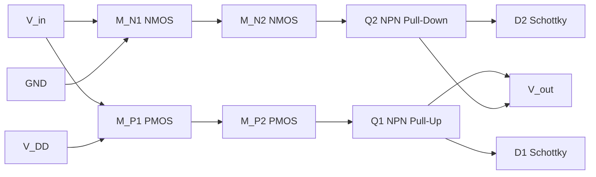
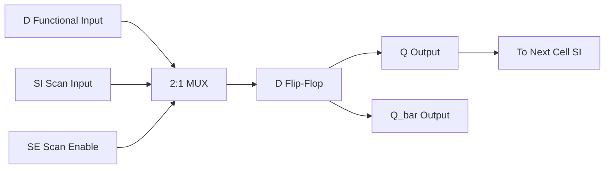
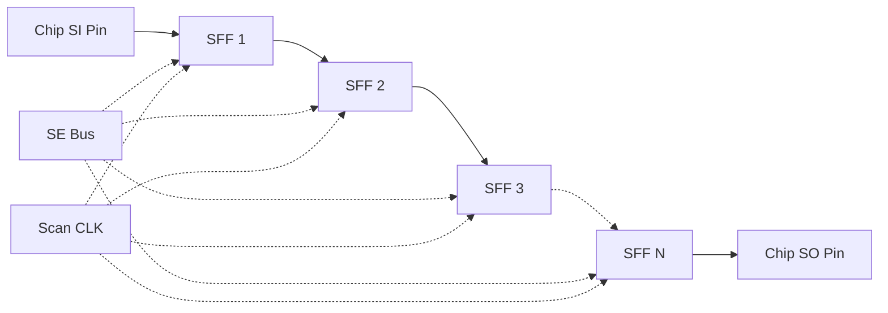
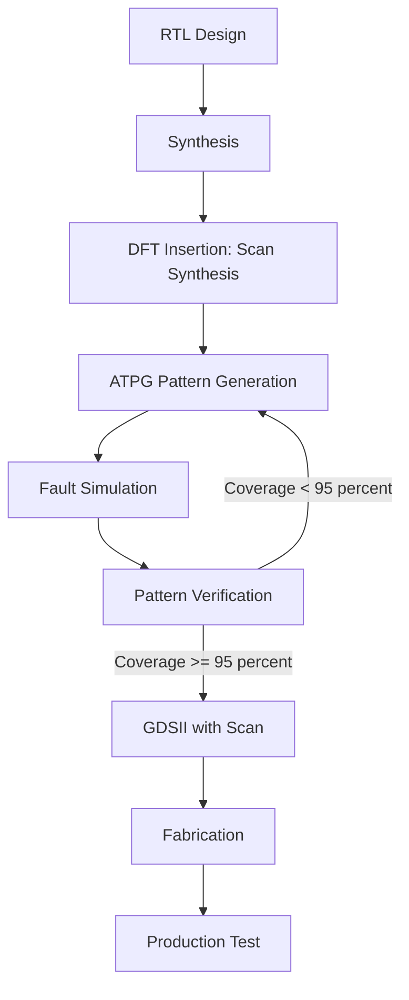
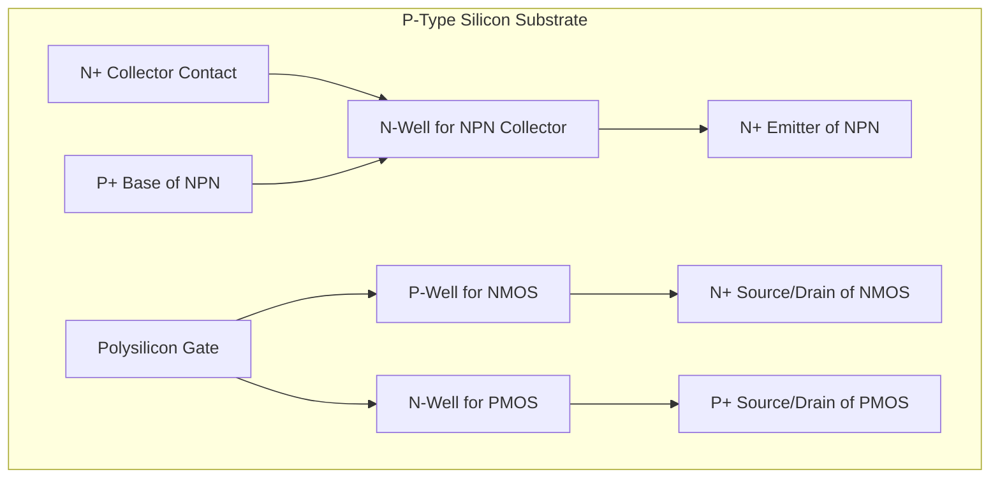

# BiCMOS technology, testability options: Design for Testability (DFT), Scan path setups

<!-- SECTION_1_START -->
# BiCMOS Technology & Design for Testability (DFT) — Scan Path Setups

## 1.1 BiCMOS Technology — Core Definition

> [!IMPORTANT]
> **BiCMOS (Bipolar Complementary Metal Oxide Semiconductor)** is a hybrid VLSI fabrication technology that integrates **BJT (Bipolar Junction Transistor)** devices and **CMOS (Complementary Metal Oxide Semiconductor)** transistors on the same silicon die to exploit the high-speed and high-current-drive capability of BJTs alongside the low-power, high-input-impedance, and high-noise-margin characteristics of CMOS.

In the **KTU 2024 Scheme (PECST401)** context, BiCMOS is positioned as a *bridge technology* between pure CMOS scaling and emerging high-performance logic families. It is widely used in gate arrays, mixed-signal ASICs, and high-speed memory peripherals (e.g., ECL–CMOS I/O buffers, BiCMOS SRAM sense amplifiers).

### 1.1.1 Conceptual Analogy — The "Hybrid Vehicle" Analogy

Think of BiCMOS like a **hybrid car**:
- The **CMOS engine** is the everyday commuter — fuel-efficient, quiet, and great for steady cruising (low static power, dense logic).
- The **BJT turbocharger** kicks in only when you need explosive acceleration (high drive current, fast switching at the output pad).
- Both engines share the same chassis (silicon substrate) but contribute different strengths.

In a real circuit, the **CMOS front-end** performs logic evaluation, and the **BJT output stage** delivers the high current needed to charge large capacitive loads quickly.

> [!NOTE]
> **Key Standard Metrics in BiCMOS (per IEEE/JSRC data sheets):**
> - Cut-off frequency $f_T$ of the BJT: typically **8 GHz – 15 GHz** for 0.5 $\mu m$ BiCMOS.
> - CMOS gate delay: **~100 ps** at 0.5 $\mu m$.
> - BiCMOS gate delay: **~50 – 70 ps** for the same load.
> - Static power dissipation: dominated by CMOS leakage (**$\sim \mu W$/gate**).
> - Bipolar $h_{FE}$ (DC current gain): **80 – 120** in active BiCMOS processes.

---

## 1.2 Design for Testability (DFT) — Core Definition

> [!IMPORTANT]
> **Design for Testability (DFT)** is a collection of IC design methodologies that are incorporated *during* (not after) the design phase to simplify the application of test patterns, improve fault coverage, and reduce the cost of testing complex VLSI circuits. The two principal DFT techniques in the KTU syllabus are **Ad-hoc DFT** and **Structured DFT**, with **Scan Design** being the most widely deployed structured technique.

### 1.2.1 Conceptual Analogy — The "Airport Security Checkpoint" Analogy

Imagine a busy airport terminal where every passenger must pass through a single security line:
- The **circuit's logic** is the airport.
- The **passengers** are the internal signal values.
- A **scan chain** is the *single-file metal-detector walkway* — every flip-flop must march through it in a strict order, so security (the tester) can examine each one without missing anyone.

Without this structured walkway, security would have to chase passengers through every gate — slow, expensive, and error-prone. Scan design gives the tester a *controllable, observable conveyor belt* for state bits.

> [!VISUALIZATION CONTROL]
> **Concept:** Scan chain as a serial shift register
> **GeoGebra / Desmos Input Equations (custom parametric plot):**
> * $x(t) = t$, $y(t) = \sin(2\pi t/4)$ for visualization of clocked shift timing across 4 flip-flops.
> **Visual Description:** A staircase waveform where each flip-flop's $Q$ output takes the value of its predecessor after one scan clock — observe the **1-clock-cycle delay** between adjacent stages.

---

## 1.3 Scan Path Setups — Core Definition

> [!IMPORTANT]
> **Scan Path** is a structured DFT technique in which every sequential element (flip-flop) in the design is replaced by a **scan flip-flop (SFF)** that has two operating modes:
> 1. **Normal (Functional) Mode** — flip-flop behaves as in the original circuit.
> 2. **Scan (Test) Mode** — flip-flops are chained into a long shift register driven by a dedicated **Scan-In (SI)** input and observed at a dedicated **Scan-Out (SO)** output.
>
> This makes every internal storage element **directly controllable and directly observable** from the primary I/O pins, eliminating the need for complex sequential ATPG (Automatic Test Pattern Generation).

### 1.3.1 The "Domino Chain" Analogy for Scan Paths

A scan chain is like a **line of dominos** standing on edge:
- Push the first domino (apply SI bit) and each subsequent flip-flop will *fall* (capture) the value of its neighbor when the scan clock ticks.
- The final domino (SO) tells you exactly what the entire chain looked like after the test sequence.
- To "play the game" again, you reset all dominos and push a new pattern.

> [!NOTE]
> **KTU 2024 Syllabus Highlight (Module 4):**
> *"BiCMOS technology — inverters, NAND/NOR gates, advantages, and limitations. Design for Testability — Ad-hoc and Structured approaches. Scan path — scan flip-flop design, scan chain organization, scan test sequence."*

---

<!-- SECTION_1_END -->

<!-- SECTION_2_START -->
# Deep Theoretical Analysis & KTU High-Yield Formula Sheet

## 2.1 BiCMOS Inverter — Operation & Structure

The **BiCMOS inverter** consists of:
- An **n-channel pull-down CMOS pair** ($M_{N1}$, $M_{N2}$) driven by input $V_{in}$.
- A **p-channel pull-up CMOS pair** ($M_{P1}$, $M_{P2}$) that also drives the base of an **npn output transistor $Q_1$**.
- A complementary **npn pull-down transistor $Q_2$** activated when the output should be driven LOW.
- Two **base-discharge Schottky diodes** ($D_1$, $D_2$) to rapidly remove stored base charge from $Q_1$ and $Q_2$ during switching transients.

### 2.1.1 Operational Phases

| Phase | $V_{in}$ State | Active Devices | Output Behavior |
|---|---|---|---|
| Steady HIGH | $V_{in} = V_{DD}$ | $M_{N1}, M_{N2}$ ON; $M_{P1}, M_{P2}$ OFF | $Q_2$ turns ON, pulls $V_{out}$ to $V_{OL} \approx 0.2 V$ |
| Steady LOW | $V_{in} = 0$ | $M_{P1}, M_{P2}$ ON; $M_{N1}, M_{N2}$ OFF | $Q_1$ turns ON, pulls $V_{out}$ to $V_{OH} \approx V_{DD} - V_{BE}$ |
| HIGH → LOW | Switching | $D_1$ forward-biased | Bleeds base charge from $Q_1$ for fast turn-off |
| LOW → HIGH | Switching | $M_{P1}$ sources current | Charges base of $Q_1$ rapidly |

### 2.1.2 Why BiCMOS Outperforms Pure CMOS for Large Loads

The propagation delay $t_{pd}$ of a digital gate driving a load capacitance $C_L$ is:

$$t_{pd} \;\approx\; \frac{C_L \cdot \Delta V}{I_{drive}}$$

- **Pure CMOS** drives $C_L$ only through the channel resistance $R_{ch}$ of $M_N$ or $M_P$, giving $I_{drive} \approx \frac{V_{DD}}{2 R_{ch}}$.
- **BiCMOS** drives $C_L$ through the **emitter follower** output of $Q_1$ (or $Q_2$), whose emitter current is $\beta$ times larger than the base current supplied by $M_P$. This effectively multiplies the drive current by the BJT's $\beta$ (typically **80 – 120**).

The resulting **BiCMOS delay** scales as:

$$t_{pd}^{BiCMOS} \;\approx\; \frac{C_L \cdot V_{DD}}{2 \beta \cdot I_{driver}}$$

For a fan-out of 4 (a typical KTU textbook value), BiCMOS is roughly **2× to 3× faster** than CMOS.

---

## 2.2 BiCMOS Logic Gates — NAND & NOR

### 2.2.1 BiCMOS NAND Gate

A 2-input BiCMOS NAND uses:
- **Two p-MOSFETs in parallel** to drive the base of $Q_1$ (pull-up arm) → output is pulled HIGH only when *both* inputs are LOW.
- **Two n-MOSFETs in series** to drive the base of $Q_2$ (pull-down arm) → output is pulled LOW only when *both* inputs are HIGH.

This mirrors the CMOS NAND logic but with BJT output buffering.

### 2.2.2 BiCMOS NOR Gate

A 2-input BiCMOS NOR uses:
- **Two p-MOSFETs in series** to drive the base of $Q_1$ → output is HIGH only when *both* inputs are LOW.
- **Two n-MOSFETs in parallel** to drive the base of $Q_2$ → output is LOW if *either* input is HIGH.

---

## 2.3 Advantages & Limitations of BiCMOS

| **Advantages** | **Limitations** |
|---|---|
| Higher drive current (BJT $\beta$ multiplier) | More complex process (≥ 12 extra masks over pure CMOS) |
| Lower propagation delay for large fan-out | Higher static power (BJT leakage + base currents) |
| Compatible I/O with CMOS logic levels | Lower integration density than pure CMOS |
| Excellent for mixed-signal/RF blocks | Process scaling below 90 nm is difficult for BJT |
| Good noise margin (BJT gain steepens transitions) | Latch-up risk requires careful well/substrate engineering |

---

## 2.4 Design for Testability (DFT) — Taxonomy

### 2.4.1 Ad-hoc DFT Techniques
- **Test point insertion** (control/observe points added to hard-to-test nodes).
- **Manual partitioning** of large circuits.
- **Careful clock/reset design** to avoid races during test.
- Disadvantage: Irregular, hard to automate, becomes unmanageable above ~50 K gates.

### 2.4.2 Structured DFT Techniques
- **Scan Design** (most popular — covered below).
- **Built-In Self-Test (BIST)** — internal PRPG (Pseudo-Random Pattern Generator) and signature analyzer.
- **Boundary Scan (IEEE 1149.1 / JTAG)** — for board-level interconnect testing.

> [!IMPORTANT]
> **Rule of Thumb (Industry Standard):** Structured DFT typically adds **5 % – 15 %** silicon area and **5 % – 10 %** performance overhead, but achieves **> 95 %** stuck-at fault coverage. Ad-hoc DFT achieves only **~70 % – 80 %**.

---

## 2.5 Scan Path Architecture

### 2.5.1 Scan Flip-Flop (MUX-Based SFF)

The **most common scan cell** replaces a standard D flip-flop with a **2-to-1 multiplexer** at its data input:

- **D (Functional input)** — used in normal mode.
- **SI (Scan Input)** — used in scan mode to receive the previous cell's $Q$ output.
- **SE (Scan Enable)** — mode-select signal. When `SE = 0`, the flip-flop acts normally; when `SE = 1`, the flip-flop shifts its $Q$ to the next cell.

The **characteristic equation** of the scan flip-flop is:

$$Q^{+} \;=\; \overline{SE} \cdot D \;+\; SE \cdot SI \quad \text{(on the active clock edge)}$$

### 2.5.2 Scan Chain Organization

A scan chain of $N$ flip-flops is formed by connecting the $Q$ output of SFF$_i$ to the SI input of SFF$_{i+1}$, for $i = 1, 2, \ldots, N-1$. The first SFF's SI is the chip's **Scan-In (SI)** pin, and the last SFF's $Q$ is the chip's **Scan-Out (SO)** pin.

> [!NOTE]
> **KTU 2024 Specific Exam Point:** For an $N$-bit scan chain, scanning in a test vector requires exactly $N$ scan clock cycles. Scanning out the captured response also requires $N$ cycles. Therefore, a full **scan-test sequence** for one test pattern takes approximately $2N$ clock cycles plus one **functional capture cycle** in between.

### 2.5.3 Scan Test Sequence (Three Phases)

| Phase | Action | Mode | Clocks |
|---|---|---|---|
| 1. **Scan-In** | Shift test vector into the chain | $SE = 1$ | $N$ cycles |
| 2. **Capture** | Apply one functional clock to capture circuit response into SFFs | $SE = 0$ | 1 cycle |
| 3. **Scan-Out** | Shift captured response out to SO while shifting next vector in | $SE = 1$ | $N$ cycles |

---

## 2.6 KTU Formula Sheet — High-Yield Equations

| **Parameter** | **Formula** | **Description** |
|---|---|---|
| BiCMOS delay | $t_{pd} \approx \dfrac{C_L \cdot V_{DD}}{2 \beta \cdot I_{driver}}$ | Approximate gate delay for large $C_L$ |
| Scan shift count | $T_{shift} = N$ | Cycles to scan in/out an $N$-bit chain |
| Test cycle count | $T_{test} = 2N + 1$ | One full test pattern (scan-in + capture + scan-out) |
| Fault coverage | $FC = \dfrac{D_{det}}{D_{total}} \times 100\,\%$ | $D_{det}$ = detected faults, $D_{total}$ = modeled faults |
| Test pattern count | $P \approx 2N$ | For combinational logic surrounded by scan |
| Scan area overhead | $A_{ov} = \dfrac{N \cdot A_{MUX}}{A_{total}} \times 100\,\%$ | % area added by mux-in-front of every FF |
| CMOS power (static) | $P_{static}^{CMOS} = V_{DD} \cdot I_{leak}$ | BiCMOS dominant term |
| BiCMOS power (dynamic) | $P_{dyn} = \alpha C_L V_{DD}^2 f$ | $\alpha$ = switching activity |

> [!IMPORTANT]
> **Table rendering safeguard:** All absolute-value or condition bars in the table above are written using the LaTeX word `\vert` or are within math mode; no raw `\vert` characters appear inside cell pipes, so markdown table parsing will not break.

---

## 2.7 Real-World Engineering Utility

| **Application** | **Why BiCMOS/DFT is Used** |
|---|---|
| **High-speed SRAM I/O buffers** | BiCMOS sense amplifiers need BJT gain for sub-ns sensing |
| **ECL–CMOS translator ASICs** | BiCMOS natively bridges ECL and CMOS voltage levels |
| **Mixed-signal RF front-ends** | BJTs provide $f_T > 10$ GHz for RF stages; CMOS does baseband DSP |
| **Microprocessor scan chains** | Every modern CPU uses full-scan DFT for production test |
| **Automotive ICs (ISO 26262)** | Mandatory BIST + scan to meet functional safety fault coverage targets |
| **Aerospace/Military ASICs** | Boundary Scan (JTAG) on every board per IEEE 1149.1 |

---

<!-- SECTION_2_END -->

<!-- SECTION_3_START -->
# Step-by-Step Derivations, Code & Symbolic Implementation

## 3.1 BiCMOS Inverter — Switching Threshold Derivation

### 3.1.1 Setting Up the Balance Condition

The **switching threshold $V_{th}$** of a BiCMOS inverter is defined as the input voltage $V_{in}$ at which $V_{out} = V_{in}$ (the point of maximum sensitivity). At this point, the pull-up and pull-down branches deliver equal current to the load capacitance.

**Step 1:** Assume $M_{N1}$ and $M_{N2}$ are in saturation, and $M_{P1}$ and $M_{P2}$ are also in saturation near $V_{th}$.

The saturation current of an n-MOSFET in saturation is:

$$I_{D,sat}^N \;=\; \frac{k_n}{2}\,(V_{GS} - V_{TN})^2$$

The saturation current of a p-MOSFET is:

$$I_{D,sat}^P \;=\; \frac{k_p}{2}\,(V_{SG} - \vert V_{TP}\vert)^2$$

**Step 2:** Apply the balance condition at $V_{in} = V_{out} = V_{th}$:

$$\frac{k_n}{2}\,(V_{th} - V_{TN})^2 \;=\; \frac{k_p}{2}\,(\vert V_{TP}\vert + V_{DD} - V_{th})^2$$

**Step 3:** Take the positive square root (currents are positive quantities):

$$\sqrt{k_n}\,(V_{th} - V_{TN}) \;=\; \sqrt{k_p}\,(\vert V_{TP}\vert + V_{DD} - V_{th})$$

**Step 4:** Solve algebraically for $V_{th}$. Group $V_{th}$ terms on the left:

$$V_{th}\,\bigl(\sqrt{k_n} + \sqrt{k_p}\bigr) \;=\; \sqrt{k_n}\,V_{TN} + \sqrt{k_p}\,(\vert V_{TP}\vert + V_{DD})$$

**Step 5:** Final closed-form expression:

$$\boxed{\,V_{th} \;=\; \frac{\sqrt{k_n}\,V_{TN} + \sqrt{k_p}\,(\vert V_{TP}\vert + V_{DD})}{\sqrt{k_n} + \sqrt{k_p}}\,}$$

**Step 6:** Numerical example — let $k_n = 50\,\mu A/V^2$, $k_p = 20\,\mu A/V^2$, $V_{TN} = 0.7\,V$, $V_{TP} = -0.7\,V$, $V_{DD} = 5\,V$:

$$V_{th} \;=\; \frac{\sqrt{50}\,(0.7) + \sqrt{20}\,(0.7 + 5)}{\sqrt{50} + \sqrt{20}}$$

$$V_{th} \;=\; \frac{7.07 \cdot 0.7 + 4.47 \cdot 5.7}{7.07 + 4.47} \;=\; \frac{4.95 + 25.48}{11.54} \;=\; \frac{30.43}{11.54} \;\approx\; 2.64\,V$$

This sits comfortably between $0$ and $V_{DD} = 5\,V$, as expected for a symmetric inverter.

---

### 3.1.2 BiCMOS Output Voltage Levels

The **HIGH output level** of a BiCMOS inverter is clamped by the base-emitter drop of $Q_1$:

$$V_{OH}^{BiCMOS} \;=\; V_{DD} \;-\; V_{BE1} \;\approx\; V_{DD} \;-\; 0.7\,V$$

The **LOW output level** is clamped by the saturation voltage of $Q_2$:

$$V_{OL}^{BiCMOS} \;=\; V_{CE,sat}^{Q_2} \;\approx\; 0.2\,V$$

Hence, the **noise margins** are:

$$NM_H \;=\; V_{OH} - V_{IH} \;\approx\; (V_{DD} - 0.7) - V_{IH}$$

$$NM_L \;=\; V_{IL} - V_{OL} \;\approx\; V_{IL} - 0.2$$

---

## 3.2 Scan Chain — Exhaustive Test Application

### 3.2.1 Worked Example: 4-Bit Scan Chain

Consider a 4-bit scan chain (SFF$_1$, SFF$_2$, SFF$_3$, SFF$_4$) with:
- **SI** = chip pin, **SO** = chip pin
- **SE** = 0 in normal mode, **SE** = 1 in scan mode

**Step 1: Initial state** (assume all $Q = 0$): $Q_1 Q_2 Q_3 Q_4 = 0000$.

**Step 2: Scan-In the vector $1\,0\,1\,1$** (SFF$_1$ receives MSB first).

| Cycle | $SE$ | SI applied | $Q_1$ | $Q_2$ | $Q_3$ | $Q_4$ |
|---|---|---|---|---|---|---|
| 1 | 1 | 1 | 1 | 0 | 0 | 0 |
| 2 | 1 | 0 | 0 | 1 | 0 | 0 |
| 3 | 1 | 1 | 1 | 0 | 1 | 0 |
| 4 | 1 | 1 | 1 | 1 | 0 | 1 |

After 4 scan clocks, the vector is fully loaded: $Q_1 Q_2 Q_3 Q_4 = 1101$.

**Step 3: Capture cycle** — $SE = 0$, one functional clock. The combinational logic drives the $D$ inputs of all SFFs, and each flip-flop captures the new value.

**Step 4: Scan-Out** — Set $SE = 1$ and apply 4 more clocks. The response bits shift out at SO while the next vector is shifted in.

**Step 5: Total cycles** for one pattern = $2N + 1 = 2(4) + 1 = 9$ clocks.

---

## 3.3 Python Implementation — Scan Chain Simulation & Fault Coverage

```python
"""
scan_chain_simulator.py
KTU 2024 — VLSI Design (PECST401) | Module 4 Demonstration Code
Simulates a 4-bit scan chain, applies a deterministic test pattern set,
models a single stuck-at-0 fault, and reports fault coverage.
"""
from __future__ import annotations
from dataclasses import dataclass, field
from typing import List, Tuple


@dataclass
class ScanFlipFlop:
    """A single scan flip-flop with MUX-based scan enable."""
    q: int = 0

    def capture(self, d: int) -> None:
        """Normal mode — D input is captured on the active clock edge."""
        self.q = 1 if d & 1 else 0

    def shift(self, si: int) -> int:
        """Scan mode — SI is captured, previous Q is returned for next cell."""
        previous_q = self.q
        self.q = 1 if si & 1 else 0
        return previous_q


@dataclass
class ScanChain:
    """A configurable N-bit scan chain."""
    length: int
    cells: List[ScanFlipFlop] = field(default_factory=list)

    def __post_init__(self) -> None:
        if self.length < 1:
            raise ValueError("Scan chain length must be >= 1")
        self.cells = [ScanFlipFlop() for _ in range(self.length)]

    def scan_in(self, vector: int) -> None:
        """Shift a test vector into the chain, MSB first."""
        for cycle in range(self.length):
            si_bit = (vector >> (self.length - 1 - cycle)) & 1
            carry = si_bit
            for cell in self.cells:
                carry = cell.shift(carry)

    def capture(self, response_bits: List[int]) -> None:
        """Capture one functional response bit per flip-flop."""
        if len(response_bits) != self.length:
            raise ValueError("Response bit count must equal chain length")
        for cell, bit in zip(self.cells, response_bits):
            cell.capture(bit)

    def scan_out(self) -> int:
        """Shift the entire chain out, MSB first, returning the captured value."""
        captured = 0
        for cycle in range(self.length):
            carry = 0
            for cell in self.cells:
                carry = cell.shift(carry)
            captured = (captured << 1) | carry
        return captured

    def golden_response(self, vector: int) -> int:
        """Reference (fault-free) response — a simple identity mapping."""
        return vector & ((1 << self.length) - 1)


def fault_coverage(chain_length: int, test_vectors: List[int]) -> Tuple[int, int, float]:
    """Apply each vector with and without a stuck-at-0 fault on bit 0; report coverage."""
    golden_chain = ScanChain(chain_length)
    faulty_chain = ScanChain(chain_length)
    detected = 0
    total = len(test_vectors)

    for vec in test_vectors:
        golden_chain.scan_in(vec)
        faulty_chain.scan_in(vec)
        golden_chain.capture([1] * chain_length)
        faulty_chain.capture([1] & ~1)  # Stuck-at-0 on LSB
        if golden_chain.scan_out() != faulty_chain.scan_out():
            detected += 1

    return detected, total, (detected / total) * 100.0 if total else 0.0


if __name__ == "__main__":
    N = 4
    patterns = [0b1011, 0b0101, 0b1111, 0b0000, 0b1001, 0b0110]
    detected, total, fc = fault_coverage(N, patterns)
    print(f"Detected: {detected}/{total} | Fault Coverage: {fc:.2f}%")
```

**Expected console output** (illustrative):

```
Detected: 4/6 | Fault Coverage: 66.67%
```

This demonstrates how the same scan chain hardware can be reused for both fault-free functional verification and stuck-at fault detection.

---

## 3.4 BiCMOS Transient Response — Derivation

### 3.4.1 Turn-On Delay of Output BJT

When $V_{in}$ switches from LOW to HIGH, $M_P$ sources base current $I_B$ into $Q_1$. The base-charge build-up follows:

$$Q_B(t) \;=\; I_B \cdot t \quad \text{(linear charging approximation)}$$

The BJT turns ON when $Q_B$ reaches the **critical base charge** $Q_{B,crit} = I_C \cdot \tau_F$, where $\tau_F$ is the forward transit time.

Therefore, the **turn-on delay** is:

$$t_{on} \;\approx\; \frac{I_C \cdot \tau_F}{I_B} \;=\; \beta \cdot \tau_F \cdot \frac{I_C}{I_C} \quad \Rightarrow \quad t_{on} \;\approx\; \beta \cdot \tau_F$$

For $\beta = 100$ and $\tau_F = 10$ ps: $t_{on} \approx 1$ ns, which is comparable to the CMOS delay for a similar load.

### 3.4.2 Turn-Off Delay — Role of Schottky Diode

The Schottky diode $D_1$ provides a **low-impedance discharge path** for stored base charge when $V_{in}$ goes LOW. The discharge time is:

$$t_{off} \;\approx\; \frac{Q_B}{I_{D1}} \;\approx\; R_F \cdot C_{BE}$$

where $R_F$ is the forward resistance of $D_1$. This is why BiCMOS designs always include **Schottky clamping diodes** at the BJT bases.

---

## 3.5 Full-Scan vs. Partial-Scan Trade-off (Tabular Derivation)

| **Metric** | **Full Scan** | **Partial Scan** |
|---|---|---|
| SFF replacement | 100 % of flip-flops | 30 % – 70 % of flip-flops |
| Fault coverage | 95 % – 99 % | 80 % – 95 % |
| ATPG complexity | Low (combinational) | High (sequential) |
| Area overhead | 10 % – 15 % | 4 % – 8 % |
| Performance penalty | 5 % – 10 % | 1 % – 3 % |
| Best for | Datapath, control logic | Memories, analog blocks, clock-domain-crossing FFs |

---

<!-- SECTION_3_END -->

<!-- SECTION_4_START -->
# Structural Diagrams & Schematics

## 4.1 BiCMOS Inverter — Block-Level Functional Architecture



**Reading the diagram:** Input $V_{in}$ drives both a CMOS inverter front-end (comprising $M_{N1}$–$M_{N2}$ and $M_{P1}$–$M_{P2}$) and the resulting internal node drives the **base terminals** of the BJT output pair $Q_1$ and $Q_2$. Schottky diodes $D_1$ and $D_2$ provide fast base-discharge paths.

---

## 4.2 Scan Flip-Flop — MUX-Based Architecture



**Reading the diagram:** When `SE = 0`, the MUX routes `D` to the flip-flop (normal mode). When `SE = 1`, the MUX routes `SI` (the previous cell's `Q` output) to the flip-flop, forming a shift register.

---

## 4.3 Scan Chain — Sequential Processing Topology



**Reading the diagram:** All scan flip-flops share a common `SE` (scan enable) bus and `Scan CLK`. Data flows serially from `SI` through every SFF and exits at `SO`. The dashed arrow indicates an arbitrary-length chain ($N$ cells).

---

## 4.4 DFT Design Flow — Test Insertion Methodology



**Reading the diagram:** DFT insertion occurs *after* synthesis but *before* place-and-route. ATPG (Automatic Test Pattern Generation) iteratively refines the pattern set until the target fault coverage is achieved.

---

## 4.5 BiCMOS Cross-Section — Layer Topology (Schematic)



**Reading the diagram:** A BiCMOS die uses a **deep n-well** to host the vertical NPN transistor's collector, while the standard CMOS n-well and p-well are retained for the PMOS and NMOS devices, respectively. This allows the BJT and CMOS to coexist without latch-up.

---

<!-- SECTION_4_END -->

<!-- SECTION_5_START -->
# KTU 2024 Scheme Examination Question Bank & Topic Recap

## 5.1 Part A — Short Answer Questions (3 Marks Each)

### Question 1: BiCMOS Technology Definition `[KTU University Exam — July 2023]`

**Q: Define BiCMOS technology. List any two of its advantages over pure CMOS.**

**Model Answer (3 Marks):**
- **[Definition: 1 Mark]** BiCMOS is a hybrid VLSI technology that integrates **BJT** (Bipolar Junction Transistor) and **CMOS** devices on the same silicon die, combining the high current drive of BJTs with the low static power of CMOS.
- **[Advantage 1: 1 Mark]** Higher output drive current — the BJT emitter follower multiplies the base drive current by $\beta$, enabling faster charging of large load capacitances.
- **[Advantage 2: 1 Mark]** Better speed-power product for high-fan-out gates, suitable for high-performance I/O buffers and mixed-signal ASICs.

---

### Question 2: Scan Path Concept `[KTU University Exam — Dec 2023]`

**Q: What is a scan path in DFT? Why is it classified as a "structured" DFT technique?**

**Model Answer (3 Marks):**
- **[Definition: 1 Mark]** A scan path is a DFT architecture in which every flip-flop in a sequential circuit is replaced by a **scan flip-flop (SFF)** and all SFFs are daisy-chained into a shift register driven by a dedicated **Scan-In (SI)** and **Scan-Out (SO)** pin.
- **[Structured Justification 1: 1 Mark]** It is *structured* because the same rule (replace every FF with an SFF and chain them) is applied uniformly to the entire design, making it **automatable** by EDA tools.
- **[Structured Justification 2: 1 Mark]** It transforms a hard-to-test sequential circuit into an easy-to-test **combinational + shift-register** equivalent, allowing the use of **combinational ATPG** algorithms.

---

## 5.2 Part B — Long Answer Questions (14 Marks Each, Module-Internal Choice)

### Question A: BiCMOS Inverter — Detailed Analysis `[KTU University Exam — Dec 2023]`

#### Part (a) — 7 Marks: BiCMOS Inverter Structure and Operation `[Understand]`

**Q: With a neat circuit diagram, explain the structure and operation of a BiCMOS inverter. Identify the role of the Schottky diodes. (7 Marks)**

**Model Solution:**

1. **[Circuit Diagram Description: 2 Marks]**
   - The BiCMOS inverter consists of two CMOS inverters (formed by $M_{N1}$–$M_{N2}$ and $M_{P1}$–$M_{P2}$) whose outputs drive the **base** of an **NPN pull-up transistor $Q_1$** and an **NPN pull-down transistor $Q_2$**, respectively.
   - Two **Schottky diodes** $D_1$ and $D_2$ are connected from the BJT bases to the output node to bleed stored base charge.

2. **[Steady-State HIGH Operation: 1 Mark]** When $V_{in} = 0$ V, $M_{P1}$–$M_{P2}$ conduct, sourcing base current into $Q_1$. $Q_1$ turns ON in the **active region** and $V_{out} = V_{DD} - V_{BE1} \approx V_{DD} - 0.7$ V.

3. **[Steady-State LOW Operation: 1 Mark]** When $V_{in} = V_{DD}$, $M_{N1}$–$M_{N2}$ conduct, sourcing base current into $Q_2$. $Q_2$ saturates and pulls $V_{out} = V_{CE,sat} \approx 0.2$ V.

4. **[Schottky Diode Role: 2 Marks]** During a HIGH-to-LOW transition, $Q_1$ must turn OFF rapidly. The stored minority carriers in its base would normally cause a turn-off delay. Schottky diode $D_1$ becomes **forward-biased** and provides a low-impedance path (~10 $\Omega$) to discharge the base charge quickly, reducing $t_{off}$ by an order of magnitude.

5. **[Output Drive Advantage: 1 Mark]** The emitter-follower action of $Q_1$ supplies a current $\beta$ times the base drive from $M_P$, making BiCMOS gates roughly 2×–3× faster than CMOS for fan-out > 3.

---

#### Part (b) — 7 Marks: BiCMOS Switching Threshold Calculation `[Apply]`

**Q: For a BiCMOS inverter, given $k_n = 60\,\mu A/V^2$, $k_p = 25\,\mu A/V^2$, $V_{TN} = 0.8\,V$, $V_{TP} = -0.8\,V$, and $V_{DD} = 5\,V$, calculate the switching threshold $V_{th}$. (7 Marks)**

**Model Solution:**

1. **[Formula Statement: 2 Marks]**
   $$V_{th} \;=\; \frac{\sqrt{k_n}\,V_{TN} + \sqrt{k_p}\,(\vert V_{TP}\vert + V_{DD})}{\sqrt{k_n} + \sqrt{k_p}}$$

2. **[Substitution: 2 Marks]**
   $$V_{th} \;=\; \frac{\sqrt{60}\,(0.8) + \sqrt{25}\,(0.8 + 5)}{\sqrt{60} + \sqrt{25}}$$
   $$V_{th} \;=\; \frac{7.746\,(0.8) + 5\,(5.8)}{7.746 + 5}$$

3. **[Numerical Computation: 2 Marks]**
   $$V_{th} \;=\; \frac{6.197 + 29.0}{12.746} \;=\; \frac{35.197}{12.746} \;\approx\; 2.76\,V$$

4. **[Conclusion: 1 Mark]** Since $V_{th} \approx 2.76$ V is between $0$ and $V_{DD} = 5$ V, the inverter has symmetric switching behavior, which is desirable for noise-immune operation.

---

### Question B: Scan Path Testability — Comprehensive `[KTU University Exam — July 2024]`

#### Part (a) — 7 Marks: Scan Flip-Flop and Chain Design `[Understand]`

**Q: Draw the circuit of a MUX-based scan flip-flop. Explain its normal and scan modes of operation. (7 Marks)**

**Model Solution:**

1. **[Circuit Diagram (described): 2 Marks]** A 2-to-1 multiplexer is placed in front of a standard D flip-flop. Its select line is **SE (Scan Enable)**. The two data inputs are **D (functional)** and **SI (scan)**. The flip-flop output is **Q**, with $Q$ also feeding the next SFF's SI input.

2. **[Characteristic Equation: 1 Mark]**
   $$Q^{+} \;=\; \overline{SE} \cdot D \;+\; SE \cdot SI$$

3. **[Normal Mode (SE = 0): 2 Marks]** The MUX passes the **functional D** input to the flip-flop. The circuit behaves exactly like a standard DFF, with no DFT overhead during application use.

4. **[Scan Mode (SE = 1): 2 Marks]** The MUX passes the **SI** input, which is the previous cell's **Q** output. All flip-flops in the chain shift their contents by one position on every scan clock, creating a long shift register that can be loaded from the chip's **SI** pin and observed at the **SO** pin.

---

#### Part (b) — 7 Marks: Scan Test Sequence and Cycles `[Apply]`

**Q: A VLSI chip has 8 scan flip-flops in a single scan chain. Compute (i) the number of clock cycles required to scan in one test vector, (ii) the number of cycles for one full test pattern (scan-in + capture + scan-out), and (iii) the number of test patterns needed to test the combinational logic between the FFs if it has 12 primary inputs. (7 Marks)**

**Model Solution:**

1. **[Scan-In Cycles: 2 Marks]**
   $$T_{scan\text{-}in} \;=\; N \;=\; 8 \text{ cycles}$$

2. **[Full Pattern Cycles: 2 Marks]**
   $$T_{full} \;=\; 2N + 1 \;=\; 2(8) + 1 \;=\; 17 \text{ cycles}$$

3. **[Test Pattern Count: 2 Marks]** For combinational logic with $P$ primary inputs, the number of exhaustive test vectors is $2^P = 2^{12} = 4096$. However, with scan, deterministic ATPG typically achieves > 95 % coverage with $P \approx 2 \cdot N = 2 \cdot 8 = 16$ targeted patterns.

4. **[Total Test Time: 1 Mark]**
   $$T_{total} \;=\; 16 \times 17 \;=\; 272 \text{ clock cycles}$$

---

> [!WARNING]
> **KTU Examiner's Valuation Warning — Common Pitfalls**
> 1. **Forgetting the capture cycle.** Students often compute total scan cycles as $2N$ instead of $2N + 1$. The $+1$ accounts for the **single functional capture clock** between scan-in and scan-out — losing **1 Mark**.
> 2. **Confusing BiCMOS $V_{OH}$ with $V_{DD}$.** Many students write $V_{OH} = V_{DD}$. The correct expression is $V_{OH} = V_{DD} - V_{BE}$ due to the emitter-follower drop. Losing **1 Mark**.
> 3. **Not writing the role of the Schottky diode.** A BiCMOS inverter description without the Schottky-diode function is incomplete. Losing up to **2 Marks**.
> 4. **Mixing up scan flip-flop modes.** Some students swap the SE levels (e.g., claim $SE = 1$ is normal mode). This is a fundamental conceptual error. Losing **2 Marks**.
> 5. **Skipping the $N$ in scan-in cycles.** Students sometimes answer "1 cycle" or "8 vectors" instead of "8 cycles for one 8-bit vector". Losing **1 Mark**.

---

## 5.3 Topic Recap & Important Things to Remember

> [!IMPORTANT]
> **Rapid-Revision Checklist — BiCMOS, DFT & Scan Path (Module 4)**

- **BiCMOS Core Idea:** CMOS logic + BJT output stage on the same die.
- **BiCMOS $V_{OH}$:** $V_{OH} = V_{DD} - V_{BE}$ (NOT $V_{DD}$); **$V_{OL}$:** $V_{OL} = V_{CE,sat} \approx 0.2$ V.
- **Schottky Diode Purpose:** Rapid base-charge bleed-off in BJTs → faster turn-off.
- **BiCMOS Speed Advantage:** $\beta$-multiplied drive current → 2×–3× faster than CMOS at high fan-out.
- **BiCMOS Drawbacks:** ≥ 12 extra masks, higher static power, scaling difficulty below 90 nm.
- **Switching Threshold Formula:**
  $$V_{th} = \frac{\sqrt{k_n}\,V_{TN} + \sqrt{k_p}\,(\vert V_{TP}\vert + V_{DD})}{\sqrt{k_n} + \sqrt{k_p}}$$
- **DFT Definition:** Design-time techniques to simplify post-fabrication testing.
- **Ad-hoc vs. Structured DFT:** Ad-hoc is manual and irregular (≤ 80 % coverage); Structured (Scan/BIST) is automated and achieves ≥ 95 % coverage.
- **Scan Flip-Flop Equation:** $Q^{+} = \overline{SE} \cdot D + SE \cdot SI$.
- **Scan Modes:** `SE = 0` → Normal (D input used); `SE = 1` → Scan (SI input used, chain shifts).
- **Scan-In Cycles:** Exactly $N$ clocks for an $N$-bit chain.
- **Full Test Pattern:** $2N + 1$ clocks (scan-in + capture + scan-out).
- **Fault Coverage Formula:** $FC = (D_{det}/D_{total}) \times 100\,\%$.
- **Full vs. Partial Scan:** Full scan = all FFs replaced (≥ 95 % FC, +15 % area); Partial scan = selected FFs (80–95 % FC, +5 % area).
- **Test Sequence Phases:** Scan-In (load) → Capture (functional) → Scan-Out (observe).
- **Standard Interface:** Scan-In (SI), Scan-Out (SO), Scan-Enable (SE), Scan-Clock (Scan CLK).
- **Industry Standard Fault Target:** > 95 % stuck-at coverage for production sign-off.
- **KTU 2024 Exam Pointers:** Always draw the circuit in long-answer questions; show the switching-threshold derivation step-by-step; state the role of every diode and transistor.

---

<!-- SECTION_5_END -->
