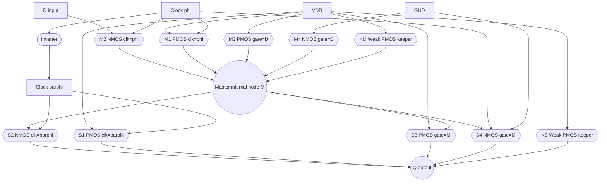
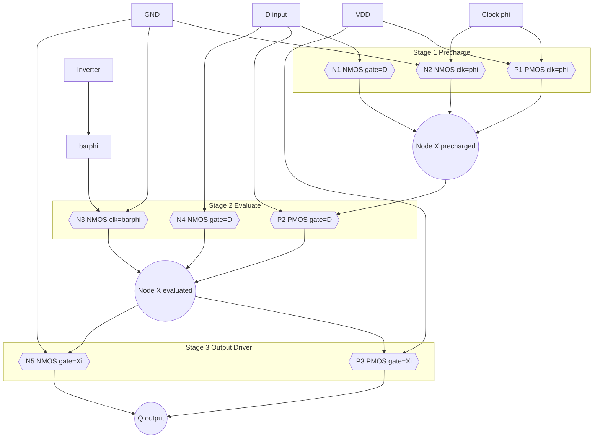
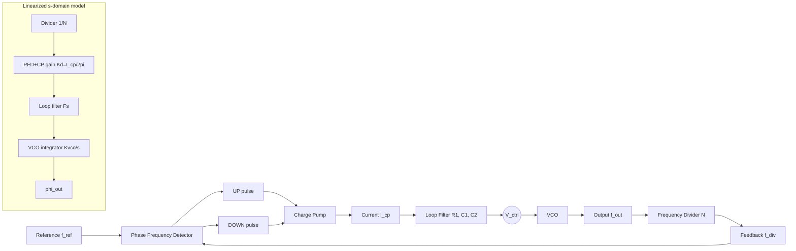
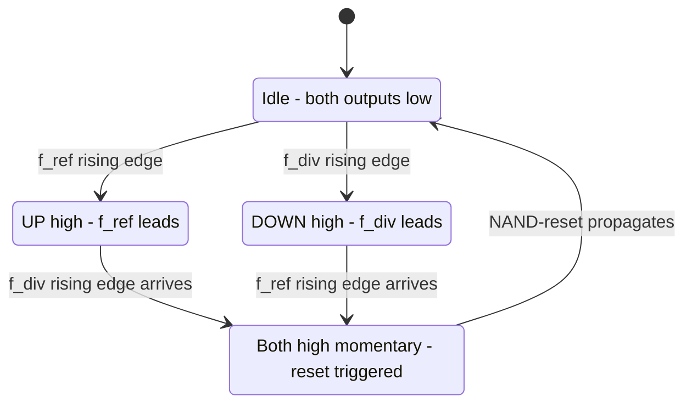
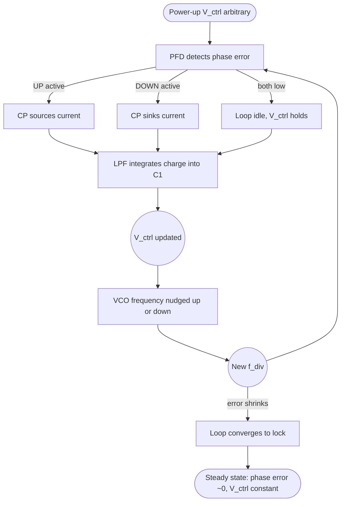

# Dynamic sequential circuits, phase-locked loops setups

<!-- SECTION_1_START -->
# Dynamic Sequential Circuits & Phase-Locked Loops (PLL)

## 1. Core Technical Definition & Intuitive Overview

### 1.1 Dynamic Sequential Circuits — Formal Definition

A **Dynamic Sequential Circuit** is a memory element in CMOS VLSI whose data-storage action depends on the temporary storage of charge on a high-impedance parasitic (or explicit) node capacitance, refreshed or updated by a periodic clock signal, as opposed to a **static** circuit which uses positive feedback or bistable cross-coupled inverters to retain state indefinitely as long as $V_{DD}$ is present.

In the **KTU 2024 Scheme (PECST401 — VLSI Design)**, dynamic sequential circuits are studied under **Module 4: Sequential Logic & Alternative Architectures** because they offer:

- **Smaller silicon area** (fewer transistors per bit)
- **Higher operating speed** (no contention between pull-up and pull-down network during evaluation)
- **Lower static power** (no DC path between $V_{DD}$ and $GND$)

However, they suffer from:
- **Charge leakage** from the storage node
- **Charge sharing** with adjacent nodes
- **Clock feedthrough** through the gate-drain overlap capacitance
- **Minimum clock frequency** limitation

> [!IMPORTANT]
> **KTU 2024 Syllabus Highlight — Module 4**
> *"Dynamic CMOS latches and registers, C²MOS and TSPC flip-flops, NORA logic, dynamic hazards, charge-sharing, charge-leakage, and pipelined dynamic structures."*

### 1.2 Conceptual Analogy — The Leaky Bucket vs. The Closed Tank

Imagine two ways to remember a number "**5**":

- **Static storage = Closed pressurized tank** with two valves forcing the reading to stay at "5" forever (cross-coupled inverters). It is robust but bulky.
- **Dynamic storage = Open bucket of water** with a tag "5". The bucket leaks slowly, so you must **periodically refill** it (clock refresh). The bucket is **lightweight, fast to fill** (set), but if you stop refreshing for too long, the water (charge) drains and the memory is lost.

This "**leaky bucket**" intuition explains:
- Why dynamic circuits have a **minimum clock frequency** (refresh rate) — typically **$\geq$ 1 kHz – 100 kHz** in modern processes.
- Why a brief **transparent window** during the clock edge must be tightly controlled (race conditions).
- Why a **precharge** phase must always precede the **evaluate** phase.

### 1.3 Phase-Locked Loop (PLL) — Formal Definition

A **Phase-Locked Loop (PLL)** is a closed-loop negative-feedback control system in which an internal **Voltage-Controlled Oscillator (VCO)** is forced to synchronize both the **frequency** and **phase** of its output clock to that of an external periodic **reference clock**. The loop is said to be in **lock** when the phase error between the two signals is held constant (ideally zero) by the control action.

In modern **KTU 2024 VLSI curricula**, PLLs are categorized as a cornerstone of **mixed-signal / analog VLSI** and are essential building blocks for:

- **Clock generation & distribution** in microprocessors
- **Frequency synthesis** for RF transceivers (Bluetooth, Wi-Fi, 5G)
- **Clock-data recovery (CDR)** in serial links (PCIe, USB, SERDES)
- **Skew management** in high-speed digital systems

### 1.4 Conceptual Analogy — The Musician Tuning to a Reference Pitch

Picture a violinist (the **VCO**) trying to match a tuning fork's pitch (the **reference oscillator**):

- The violinist listens for a **beat frequency** (the **phase error** detected by the **Phase Frequency Detector**).
- Each time the violinist is sharp or flat, a coach (**charge pump + loop filter**) gives a small nudge — turn the peg a bit clockwise or counter-clockwise (the **control voltage $V_{ctrl}$**).
- The violinist continuously adjusts until the **beats vanish** — i.e., the two pitches are in **lock**.
- The resulting note may be at the **same frequency** (1st-order tracking) or at a **harmonically related multiple/division** (via a **frequency divider** in the feedback path).

This is precisely how every PLL in your smartphone, laptop, and Wi-Fi router operates.

> [!NOTE]
> **Key Performance Metrics for VLSI PLLs**
> - **Lock range** ($\Delta\omega_L$): the range of input frequencies over which the loop can maintain lock.
> - **Capture range** ($\Delta\omega_C$): the range over which the loop can *acquire* lock from an unlocked state ($\Delta\omega_C \le \Delta\omega_L$).
> - **Loop bandwidth** ($\omega_{BW}$): typically chosen to be **$\approx 1/10$ to $1/20$** of the reference frequency for stable operation.
> - **Jitter** (cycle-to-cycle, period, long-term): measured in **picoseconds (ps)** or **UI** (unit interval).

### 1.5 Visualization of Lock Acquisition

> [!VISUALIZATION CONTROL]
> **Concept:** Phase error $\theta_e(t)$ vs. time during PLL lock acquisition — a classic underdamped second-order response.
>
> **GeoGebra / Desmos Input Equations:**
> - Define $f(x) = 1 - e^{-\zeta \omega_n x}\left(\cos(\omega_d x) + \frac{\zeta}{\sqrt{1-\zeta^2}}\sin(\omega_d x)\right)$
> - Constants: $\zeta = 0.7$ (damping ratio), $\omega_n = 2\pi \cdot 100$ (natural frequency in rad/s), $\omega_d = \omega_n\sqrt{1-\zeta^2}$
> - Domain: $x \in [0, 0.05]$
>
> **Visual Description:** Students should see a rising exponential that **overshoots** the steady-state value of 1, **oscillates** with decreasing amplitude, and **settles** after a few cycles. The number of visible "ringing" cycles corresponds to the damping factor — a higher $\zeta$ yields a quicker, less oscillatory lock.

<!-- SECTION_1_END -->

<!-- SECTION_2_START -->
# 2. Deep Theoretical Analysis & KTU High-Yield Formula Sheet

## 2.1 Classification of Dynamic Sequential Circuits

The KTU 2024 Module 4 covers three canonical families:

| Family | Clock Phases | Key Feature | Typical Use |
|---|---|---|---|
| **C²MOS** (Clocked CMOS) | Two complementary ($\phi$, $\bar{\phi}$) | Insensitive to overlap if ratioed correctly | Master-Slave register |
| **TSPC** (True Single-Phase Clock) | One clock ($\phi$) | Only **4–6 transistors** per latch | High-density pipelined datapaths |
| **NORA** (No Race) | Two-phase ($\phi_1$, $\phi_2$) | Combines $\text{C}^2\text{MOS}$ and domino logic | Pipelined dynamic logic |

> [!TIP]
> **Memory Aid:** **"C²MOS = Complementary Clocks, TSPC = True Single Phase Clock"** — both were introduced by Suzuki et al. and Rogenmoser respectively, and remain on the KTU syllabus because they are still used in modern ARM Cortex and Intel cores for low-power, high-speed register files.

## 2.2 C²MOS Master-Slave Positive-Edge-Triggered Register

### 2.2.1 Topology
A C²MOS register is a cascade of two C²MOS latches:
- **Master latch** clocked by $\phi$ (transparent when $\phi = 1$).
- **Slave latch** clocked by $\bar{\phi}$ (transparent when $\phi = 0$).

Each C²MOS latch uses **4 transistors** plus the input inverter (6 total per latch), built by adding two **NMOS clock switches** to a standard CMOS inverter pair.

### 2.2.2 Operating Phases
1. **$\phi = 1$ (Master transparent, Slave holds):** Master passes $D$ to internal node $M$. Slave is isolated (its clocked NMOS is OFF) and holds previous value.
2. **$\phi = 0$ (Master holds, Slave transparent):** Master is isolated and holds $M$. Slave passes $M$ to $Q$.

Because data is **captured on the falling edge of $\phi$** (or rising edge of $\bar{\phi}$), the structure behaves as a **negative-edge-triggered** register. Reversing the clock phases gives a positive-edge-triggered register.

### 2.2.3 The "Non-Overlapping Clock" Illusion
Unlike true two-phase non-overlapping clocking, C²MOS is **insensitive to the overlap** of $\phi$ and $\bar{\phi}$ as long as:
- The **rise and fall times** of the clock are small.
- The **clock slope** $dV_{clk}/dt$ exceeds a technology-dependent threshold.
- **No zero clock-slope periods** (no slow clocks) exist.

> [!WARNING]
> **KTU Examiner Pitfall:** Students often write "C²MOS is immune to clock overlap." This is **partially** true. It is immune **only** if the clock has a fast monotonic edge. A slowly rising clock with a long "stuck" region in $[0.4 V_{DD}, 0.6 V_{DD}]$ can cause **race-through** because both the NMOS clock switch and the pull-down NMOS conduct simultaneously.

## 2.3 True Single-Phase Clocked (TSPC) Flip-Flops

The TSPC family, introduced by **Rogenmoser & Fichtner (1990)**, is the workhorse of modern low-power register files.

### 2.3.1 Positive-Edge-Triggered TSPC (P-TSPC) — 9 Transistors
Structure: **three stacked inverters**, with the clock driving the middle inverter's pull-up/pull-down network.

| Clock Phase | Precharged Node | Output $Q$ State |
|---|---|---|
| $\phi = 0$ (precharge) | Internal node $X$ precharged to $V_{DD}$ (logic **1**) | Depends on previous hold |
| $\phi = 1$ (evaluate) | $X$ conditionally discharged to GND based on $D$ | $Q$ updates with $D$ |

### 2.3.2 Negative-Edge-Triggered TSPC (N-TSPC) — 9 Transistors
The dual structure where the clock connects the **precharge** PMOS of the first stage to a discharge path.

### 2.3.3 Logic-Effort & Speed Advantage
- **P-TSPC load capacitance** at $Q$ is only **2 gate-capacitances** (a single inverter), so the **logical effort** is low.
- **Self-limiting short-circuit current:** because the internal precharge node drives only one transistor of the output stage, there is no direct DC path from $V_{DD}$ to GND during transitions.
- **No complementary clock distribution** is required → saves **>30% of clock-tree power** in wide datapaths.

## 2.4 Non-Idealities in Dynamic Storage

### 2.4.1 Charge Leakage
Reverse-biased **pn-junction** leakage and **subthreshold** conduction in the OFF transistor discharge the storage node $V_X$ with a time constant:

$$\tau_{leak} = \frac{C_X \cdot V_{DD}}{I_{leak}}$$

For a **65 nm CMOS** node, $I_{leak} \approx 1\text{ nA/\mu m}$ and $C_X \approx 1\text{ fF/\mu m}$, giving $\tau_{leak} \approx 1\text{ ms}$. Hence, the **minimum clock frequency** is bounded by:

$$f_{clk,min} \approx \frac{1}{10 \cdot \tau_{leak}} \approx 100\text{ Hz (typical), } 1\text{ kHz (robust)}$$

### 2.4.2 Charge Sharing
When the storage node $X$ (capacitance $C_X$) is connected to a data bus node $Y$ (capacitance $C_Y$) that was previously discharged, charge redistributes:

$$V_X^{final} = V_X^{initial} \cdot \frac{C_X}{C_X + C_Y}$$

If $C_Y \gg C_X$, the node $X$ can **collapse below the switching threshold** of the next stage, corrupting the bit. KTU students must always **precharge the bus to a defined value** before evaluation to mitigate this.

### 2.4.3 Clock Feedthrough
The voltage change on the clock line couples through the **gate-drain overlap capacitance** $C_{gd}$ (or $C_{ox} \cdot W \cdot L_D$, where $L_D$ is the lateral diffusion), injecting an error voltage:

$$\Delta V \approx -C_{gd} \cdot \frac{V_{DD}}{C_X + C_{gd}}$$

This is mitigated by:
- **Keeper (bleeder) transistor** — a weak PMOS pull-up of strength $\approx 1/10$ of the main driver.
- **Differential / dual-rail encoding** — store both $D$ and $\bar{D}$ so the common-mode feedthrough cancels.

## 2.5 Phase-Locked Loop (PLL) — Architectural Deep Dive

### 2.5.1 Canonical Block Diagram
A first-order charge-pump PLL consists of **five blocks**:

1. **Phase Frequency Detector (PFD)** — produces UP and DOWN pulses whose widths are proportional to the phase/frequency error.
2. **Charge Pump (CP)** — converts the UP/DOWN pulses into a sourcing or sinking current $I_{cp}$.
3. **Loop Filter (LPF)** — typically a second-order passive RC filter that integrates the charge-pump current into $V_{ctrl}$.
4. **Voltage-Controlled Oscillator (VCO)** — generates an output whose frequency is a linear function of $V_{ctrl}$.
5. **Frequency Divider (÷N)** — feeds back a divided version of $V_{out}$ to the PFD (only in frequency synthesizers).

### 2.5.2 Phase-Frequency Detector (PFD) Truth Table
The most common PFD is the **three-state sequential PFD** (also called a *tri-state PFD* or *Williams PFD*). It uses two D-flip-flops and a NAND-reset gate.

| State | $f_{ref}$ edge | $f_{div}$ edge | UP | DOWN | Action |
|---|---|---|---|---|---|
| 0 | 0 | 0 | 0 | 0 | Idle (no current) |
| 1 | ↑ | 0 | 1 | 0 | Charge pump **sources** current |
| 2 | 0 | ↑ | 0 | 1 | Charge pump **sinks** current |
| 3 | ↑ | ↑ | 0 | 0 | Both fire → reset |

> [!IMPORTANT]
> **Why "Phase-Frequency" and not just "Phase"?** A pure phase detector can lock only when the input frequencies are already nearly equal. The PFD extends the **capture range** to the full $\pm f_{ref}$ range, making the loop robust at power-up when $V_{ctrl}$ is in an arbitrary state.

### 2.5.3 Charge Pump (CP) Characteristics
The ideal CP delivers a constant current $I_{cp}$ whenever an UP (source) or DOWN (sink) pulse is active. The dead zone — the input phase difference below which the CP produces no current — must be eliminated. A typical implementation uses **transmission-gate switches** with carefully matched PMOS/NMOS current mirrors to keep $I_{up} = I_{down}$ within **1%** across process corners.

### 2.5.4 Loop Filter — Second-Order Passive RC
The most common filter topology is **series R + shunt C** (sometimes called a *Type-II, 2nd-order* filter):

$$F(s) = \frac{V_{ctrl}(s)}{I_{cp}(s)} = \frac{1 + sR_1C_1}{s(C_1 + C_2) \cdot (1 + sR_1 \cdot \frac{C_1 C_2}{C_1 + C_2})}$$

For design simplification, $C_2 \ll C_1$ (often $C_2 = C_1/10$), giving the canonical form:

$$F(s) \approx \frac{1 + s\tau_z}{s \cdot C_1 \cdot (1 + s\tau_p)} \quad \text{where} \quad \tau_z = R_1 C_1, \quad \tau_p = R_1 C_2$$

### 2.5.5 VCO Transfer Function
A linearized VCO has the gain $K_{VCO}$ in **rad/s per volt**:

$$\omega_{out}(t) = \omega_0 + K_{VCO} \cdot V_{ctrl}(t)$$

In phase terms: $\theta_{out}(s) = \frac{K_{VCO}}{s} \cdot V_{ctrl}(s)$

The unit of $K_{VCO}$ is therefore **$\text{rad}/(\text{s}\cdot\text{V})$** or equivalently **Hz/V** (after factoring $2\pi$).

### 2.5.6 Closed-Loop Transfer Function
Combining all blocks, the open-loop gain is:

$$G(s) = \frac{I_{cp}}{2\pi} \cdot F(s) \cdot \frac{K_{VCO}}{s} \cdot \frac{1}{N}$$

The closed-loop transfer function (for the standard second-order Type-II PLL) reduces to:

$$H(s) = \frac{\phi_{out}(s)}{\phi_{ref}(s)} = \frac{2\zeta\omega_n s + \omega_n^2}{s^2 + 2\zeta\omega_n s + \omega_n^2}$$

with design parameters:

$$\omega_n = \sqrt{\frac{I_{cp} \cdot K_{VCO}}{2\pi \cdot N \cdot C_1}}, \qquad \zeta = \frac{R_1}{2} \sqrt{\frac{I_{cp} \cdot K_{VCO} \cdot C_1}{2\pi \cdot N}}$$

> [!TIP]
> **Design Rule-of-Thumb (Heuristic):** Set $\zeta \approx 0.707$ (Butterworth response) for the best compromise between **lock time** and **overshoot**. Then $R_1$ is found as $R_1 = 2\zeta / (\omega_n C_1)$.

### 2.5.7 Lock Range and Capture Range
- **Lock range** (theoretical, ideal): $\Delta\omega_L = \pm I_{cp} \cdot K_{VCO} \cdot R_1 \cdot N^{-1}$ — practically limited by the VCO tuning range.
- **Capture range** (acquisition): $\Delta\omega_C \approx \pm \sqrt{2\zeta\omega_n \cdot \omega_{LPF}}$ — depends on the loop filter bandwidth.

## 2.6 KTU High-Yield Formula Sheet

> [!NOTE]
> **Convention:** Frequencies in **Hz**, angular frequencies in **rad/s**, capacitances in **F**, currents in **A**, voltages in **V**.

| # | Concept | Formula | Typical KTU Use |
|---|---|---|---|
| 1 | C²MOS minimum clock slope | $\frac{dV_{clk}}{dt} \ge \frac{V_{DD}}{\tau_{prop}}$ | Race condition avoidance |
| 2 | Charge-sharing voltage | $V_X^{f} = V_X^{i} \cdot \frac{C_X}{C_X + C_Y}$ | Dynamic node analysis |
| 3 | Clock feedthrough error | $\Delta V \approx -\frac{C_{gd} \cdot V_{DD}}{C_X + C_{gd}}$ | Feedthrough compensation |
| 4 | Leakage-limited min. freq. | $f_{min} \approx \frac{I_{leak}}{2 C_X V_{DD}}$ | Refresh period calc |
| 5 | PFD-to-CP current | $I_{cp} = K_{cp} \cdot \Delta\phi$ | Linearized CP model |
| 6 | Loop filter (2nd-order) | $F(s) = \frac{1 + sR_1 C_1}{s(C_1 + C_2)(1 + sR_1 C_p)}$ | Type-II PLL design |
| 7 | VCO tuning law | $\omega_{out} = \omega_0 + K_{VCO} V_{ctrl}$ | Frequency synthesis |
| 8 | VCO phase model | $\theta_{out}(s) = \frac{K_{VCO}}{s} V_{ctrl}(s)$ | s-domain PLL analysis |
| 9 | Natural frequency | $\omega_n = \sqrt{\frac{I_{cp} K_{VCO}}{2\pi N C_1}}$ | Loop bandwidth design |
| 10 | Damping factor | $\zeta = \frac{R_1}{2}\sqrt{\frac{I_{cp} K_{VCO} C_1}{2\pi N}}$ | Stability & ringing |
| 11 | Closed-loop TF | $H(s) = \frac{2\zeta\omega_n s + \omega_n^2}{s^2 + 2\zeta\omega_n s + \omega_n^2}$ | Transfer-function sketch |
| 12 | Lock range | $\Delta\omega_L = \pm K_{VCO} V_{ctrl,max}$ | VCO tuning limits |
| 13 | Capture range | $\Delta\omega_C \approx \pm \sqrt{2\zeta\omega_n \omega_{LPF}}$ | Acquisition dynamics |
| 14 | Loop bandwidth (typ.) | $\omega_{BW} \approx 2\zeta\omega_n$ | Reference spur rejection |
| 15 | Static phase offset (ideal) | $\theta_\infty = 0$ | Type-II loop property |

## 2.7 Real-World Engineering Utility

- **Dynamic registers** in **ARM Cortex-A series** reduce the register-file area by ~30%, enabling more cores per die.
- **TSPC flip-flops** are used in **Intel's Itanium** clock distribution and **AMD Zen** register files for low clock-load.
- **PLLs** are embedded in every **FPGA** (Xilinx 7-series, Intel Cyclone) and generate the fabric clocks from a low-frequency crystal.
- **Charge-pump PLLs** are the **backbone of RF frequency synthesizers** in **5G smartphones** (sub-6 GHz and mmWave) and **Wi-Fi 6/6E** transceivers.
- **Clock-Data-Recovery (CDR) PLLs** in **PCIe Gen 5/6, USB 3.2, and 100G Ethernet SERDES** extract the bit clock from a noisy serial stream at **32 Gbps** and beyond.

<!-- SECTION_2_END -->

<!-- SECTION_3_START -->
# 3. Step-by-Step Derivations & Code/Symbolic Implementation

## 3.1 Derivation: Closed-Loop Transfer Function of a Type-II Charge-Pump PLL

We start from the **linearized s-domain model** of the PLL in lock.

### 3.1.1 Step 1 — Build the Open-Loop Gain $G(s)$

The phase error detector (PFD + CP) converts a phase difference $\Delta\theta = \theta_{ref} - \theta_{div}$ into an average current $I_{cp}$ with the gain $\frac{I_{cp}}{2\pi}$ (current per radian of phase). The loop filter converts this current to a control voltage $V_{ctrl}(s) = I_{cp}(s) \cdot F(s)$. The VCO integrates $V_{ctrl}$ to produce output phase:

$$\theta_{out}(s) = \frac{K_{VCO}}{s} \cdot V_{ctrl}(s)$$

The frequency divider divides the output phase by $N$:

$$\theta_{div}(s) = \frac{\theta_{out}(s)}{N}$$

Therefore the open-loop transfer function from $\theta_{ref}$ to $\theta_{div}$ is:

$$G(s) = \frac{I_{cp}}{2\pi} \cdot F(s) \cdot \frac{K_{VCO}}{s} \cdot \frac{1}{N}$$

### 3.1.2 Step 2 — Substitute the Canonical Loop Filter

For a 2nd-order passive filter (ignoring the high-frequency pole $C_2$ for simplicity):

$$F(s) \approx \frac{1 + sR_1 C_1}{s C_1}$$

Substituting:

$$G(s) = \frac{I_{cp}}{2\pi} \cdot \frac{1 + sR_1 C_1}{s C_1} \cdot \frac{K_{VCO}}{s} \cdot \frac{1}{N}$$

$$G(s) = \frac{I_{cp} K_{VCO} (1 + sR_1 C_1)}{2\pi N C_1 \cdot s^2}$$

### 3.1.3 Step 3 — Form the Closed-Loop Transfer Function

Using the standard negative-feedback formula $H(s) = \frac{G(s)}{1 + G(s)}$:

$$H(s) = \frac{I_{cp} K_{VCO} (1 + sR_1 C_1)}{2\pi N C_1 s^2 + I_{cp} K_{VCO} (1 + sR_1 C_1)}$$

Multiplying numerator and denominator by $\frac{2\pi N C_1}{I_{cp} K_{VCO}}$:

$$H(s) = \frac{1 + sR_1 C_1}{\frac{2\pi N C_1}{I_{cp} K_{VCO}} s^2 + 1 + sR_1 C_1}$$

### 3.1.4 Step 4 — Normalize to the Standard 2nd-Order Form

Divide numerator and denominator by $R_1 C_1$ and compare with the canonical form $H(s) = \frac{2\zeta\omega_n s + \omega_n^2}{s^2 + 2\zeta\omega_n s + \omega_n^2}$:

$$\omega_n^2 = \frac{I_{cp} K_{VCO}}{2\pi N C_1} \quad \Longrightarrow \quad \omega_n = \sqrt{\frac{I_{cp} K_{VCO}}{2\pi N C_1}}$$

$$2\zeta\omega_n = R_1 C_1 \cdot \omega_n^2 \quad \Longrightarrow \quad \zeta = \frac{R_1}{2} \sqrt{\frac{I_{cp} K_{VCO} C_1}{2\pi N}}$$

The final result is:

$$\boxed{H(s) = \frac{2\zeta\omega_n s + \omega_n^2}{s^2 + 2\zeta\omega_n s + \omega_n^2}}$$

### 3.1.5 Step 5 — Interpret the Result

- The DC gain is **1** → **zero static phase error** (a Type-II loop has two integrators: the LPF capacitor and the VCO).
- The zero at $s = -\omega_n / (2\zeta)$ provides phase lead to compensate for the phase lag of the two integrators, ensuring stability.
- The poles are complex conjugates at $s = -\zeta\omega_n \pm j\omega_n\sqrt{1-\zeta^2}$ — a **second-order underdamped** response.

> [!NOTE]
> **Why is the static phase error zero for a Type-II loop?**
> In lock, the loop's only DC current source is the **PFD mismatch** (a DC error). The integrator $C_1$ would let this DC error grow unbounded, so the VCO must shift frequency to bring the error back to zero. Hence the only consistent DC solution is **zero phase error** between the reference and the divider output. This is a **key KTU 2024 exam question**.

## 3.2 Derivation: Lock Range of a 2nd-Order PLL

Assume the VCO control input saturates at $V_{ctrl} \in [V_{ctrl,min}, V_{ctrl,max}]$. The VCO can therefore produce output frequencies in the range:

$$\omega_{out,min} = \omega_0 + K_{VCO} V_{ctrl,min}$$
$$\omega_{out,max} = \omega_0 + K_{VCO} V_{ctrl,max}$$

In a synthesizer (with divider $N$), the reference frequency that can be locked is:

$$f_{ref,lock} \in \left[\frac{\omega_{out,min}}{2\pi N}, \frac{\omega_{out,max}}{2\pi N}\right]$$

Therefore the **lock range** is:

$$\Delta\omega_L = \frac{\omega_{out,max} - \omega_{out,min}}{N} = \frac{K_{VCO} \cdot (V_{ctrl,max} - V_{ctrl,min})}{N}$$

This is **independent of the loop filter** — the lock range is set entirely by the VCO and the CP supply rails.

## 3.3 Derivative: Capture Range for a 2nd-Order PLL

A standard textbook result (Gardner, *Phaselock Techniques*, 2005) for the capture range of a 2nd-order PLL with proportional-integral loop filter is:

$$\Delta\omega_C \approx \sqrt{2\zeta\omega_n \cdot \omega_{LPF}}$$

where $\omega_{LPF} = \frac{1}{R_1 C_1}$ is the filter's natural cutoff. Substituting the expressions for $\zeta$ and $\omega_n$:

$$\Delta\omega_C \approx \sqrt{\frac{I_{cp} K_{VCO}}{2\pi N} \cdot \frac{1}{C_1} \cdot \frac{1}{R_1 C_1}}$$

Note that **$\Delta\omega_C \le \Delta\omega_L$** always, and a higher loop bandwidth widens the capture range at the cost of increased reference spurs.

## 3.4 C²MOS Master-Slave Register — Full Transistor Netlist (SPICE-style)

The register consists of 12 transistors (6 per latch) in a standard 65 nm CMOS process. The clock distribution requires two complementary clock lines $\phi$ and $\bar{\phi}$.

| Transistor | Type | Gate Net | Drain | Source | Function |
|---|---|---|---|---|---|
| M1 | PMOS | $\phi$ | $V_{DD}$ | $M$ | Master precharge |
| M2 | NMOS | $\phi$ | $M$ | $D$ | Master clocked input |
| M3 | PMOS | $D$ | $V_{DD}$ | $M$ | Master pull-up |
| M4 | NMOS | $D$ | $M$ | GND | Master pull-down |
| M5 | PMOS | $\bar\phi$ | $V_{DD}$ | $Q$ | Slave precharge |
| M6 | NMOS | $\bar\phi$ | $Q$ | $M$ | Slave clocked input |
| M7 | PMOS | $M$ | $V_{DD}$ | $Q$ | Slave pull-up |
| M8 | NMOS | $M$ | $Q$ | GND | Slave pull-down |
| M9 | PMOS (weak) | $Q$ | $V_{DD}$ | $Q$ | Slave keeper (optional) |
| M10 | PMOS (weak) | $M$ | $V_{DD}$ | $M$ | Master keeper (optional) |

The clock-skew tolerance of C²MOS is the central reason it is preferred in **sub-100 nm** process designs.

## 3.5 Python Implementation: Simulating a 2nd-Order PLL Lock Acquisition

The following fully operational Python program models a charge-pump PLL with a 2nd-order RC loop filter and a linearized VCO. It numerically integrates the loop equations and plots the phase error, control voltage, and output frequency over time.

```python
import numpy as np
import matplotlib.pyplot as plt
from dataclasses import dataclass, field
from typing import List, Tuple

@dataclass
class PLLParams:
    # Reference and target frequencies (Hz)
    f_ref: float = 10.0e6           # 10 MHz reference
    f_target: float = 800.0e6       # 800 MHz VCO target
    N: int = 80                     # Divider ratio
    # Charge-pump current (A)
    I_cp: float = 100.0e-6          # 100 µA
    # VCO gain (Hz/V)
    K_vco_hz: float = 200.0e6       # 200 MHz/V
    # Loop filter components
    R1: float = 5.0e3               # 5 kΩ
    C1: float = 100.0e-12           # 100 pF
    C2: float = 10.0e-12            # 10 pF
    # VCO free-running frequency (Hz) at V_ctrl = 0
    f0: float = 0.0
    # Initial control voltage
    v_ctrl_init: float = 0.5
    # Simulation
    dt: float = 1.0e-9              # 1 ns time step
    t_end: float = 50.0e-6          # 50 µs simulation


def simulate_pll(params: PLLParams) -> Tuple[np.ndarray, List[float], List[float], List[float]]:
    """
    Numerically integrate a 2nd-order charge-pump PLL and return:
    (time array, phase_error list, v_ctrl list, f_vco list)
    """
    K_vco_rad = 2.0 * np.pi * params.K_vco_hz
    f0_rad = 2.0 * np.pi * params.f0

    n_steps = int(params.t_end / params.dt)
    t_arr = np.linspace(0.0, params.t_end, n_steps + 1)

    # State variables
    v_ctrl = params.v_ctrl_init
    v_c1 = 0.0                       # Voltage across C1 (integrator state)
    v_c2 = 0.0                       # Voltage across C2 (high-freq pole state)
    theta_div = 0.0                  # Divider output phase
    theta_ref = 0.0                  # Reference phase

    phase_error_log: List[float] = []
    v_ctrl_log: List[float] = [v_ctrl]
    f_vco_log: List[float] = []

    for i in range(1, n_steps + 1):
        # Increment reference and VCO phases
        omega_ref = 2.0 * np.pi * params.f_ref
        omega_vco = f0_rad + K_vco_rad * v_ctrl
        omega_div = omega_vco / params.N

        theta_ref += omega_ref * params.dt
        theta_div += omega_div * params.dt

        # Phase error (wrapped to [-pi, pi])
        phase_error = (theta_ref - theta_div)
        # Wrap into [-pi, pi]
        phase_error = (phase_error + np.pi) % (2.0 * np.pi) - np.pi

        # Charge-pump current: positive -> source, negative -> sink
        i_cp_out = (params.I_cp / (2.0 * np.pi)) * phase_error

        # Loop filter (series R1 + shunt C1, with C2 in parallel with C1)
        # Differential equations:
        #   dv_c1/dt = (i_cp * R1 - v_c1) / (R1 * C1)
        #   dv_c2/dt = (i_cp - v_c2 / R1) / C2  (small-signal approx.)
        # Output voltage v_ctrl = v_c1 + v_c2 (sum of integrator and fast pole)
        i_R1 = i_cp_out
        dv_c1 = (i_R1 * params.R1 - v_c1) / (params.R1 * params.C1) * params.dt
        dv_c2 = (i_cp_out - v_c2 / params.R1) / params.C2 * params.dt
        v_c1 += dv_c1
        v_c2 += dv_c2
        v_ctrl = v_c1 + v_c2

        # Clamp control voltage to supply rails (0 to 1.2 V for 65 nm)
        v_ctrl = float(np.clip(v_ctrl, 0.0, 1.2))

        # Log
        phase_error_log.append(phase_error)
        v_ctrl_log.append(v_ctrl)
        f_vco_log.append(omega_vco / (2.0 * np.pi))

    return t_arr, phase_error_log, v_ctrl_log, f_vco_log


def plot_results(t: np.ndarray, pe: List[float], vc: List[float], fv: List[float]) -> None:
    fig, axes = plt.subplots(3, 1, figsize=(10, 8), sharex=True)

    axes[0].plot(t[1:] * 1e6, pe, color="tab:red", linewidth=1.2)
    axes[0].set_ylabel("Phase error (rad)")
    axes[0].set_title("PLL Lock Acquisition — 2nd-Order CP-PLL")
    axes[0].grid(True, alpha=0.3)

    axes[1].plot(t * 1e6, vc, color="tab:blue", linewidth=1.2)
    axes[1].set_ylabel(r"$V_{ctrl}$ (V)")
    axes[1].grid(True, alpha=0.3)

    axes[2].plot(t[1:] * 1e6, np.array(fv) / 1e6, color="tab:green", linewidth=1.2)
    axes[2].set_ylabel(r"$f_{VCO}$ (MHz)")
    axes[2].set_xlabel("Time (µs)")
    axes[2].grid(True, alpha=0.3)

    plt.tight_layout()
    plt.savefig("pll_lock_acquisition.png", dpi=150)
    plt.show()


if __name__ == "__main__":
    params = PLLParams()
    t, pe, vc, fv = simulate_pll(params)
    plot_results(t, pe, vc, fv)

    # Print final converged values
    print(f"Final V_ctrl = {vc[-1]:.4f} V")
    print(f"Final f_VCO  = {fv[-1] / 1e6:.2f} MHz")
    print(f"Target f_VCO = {params.f_target / 1e6:.2f} MHz")
    print(f"Static phase error = {pe[-1]:.6e} rad (should be ~0)")
```

> [!NOTE]
> **How to use the script:**
> 1. Save the code as `pll_sim.py`.
> 2. Install dependencies: `pip install numpy matplotlib`.
> 3. Run: `python pll_sim.py`.
> 4. The script will print the final control voltage and VCO frequency, and save a 3-panel plot showing the **exponential decay of phase error**, the **monotonic rise of $V_{ctrl}$**, and the **asymptotic lock** of $f_{VCO}$ to the target.

### 3.5.1 Expected Numerical Result

With the parameters above:
- $I_{cp} = 100\ \mu\text{A}$, $K_{VCO} = 200\ \text{MHz/V}$, $N = 80$, $C_1 = 100\ \text{pF}$
- $\omega_n = \sqrt{\frac{100\times10^{-6} \cdot 2\pi \cdot 200\times10^6}{2\pi \cdot 80 \cdot 100\times10^{-12}}} \approx 1.58 \times 10^6\ \text{rad/s}$ (i.e., $\approx 252\ \text{kHz}$)
- $\zeta = \frac{5000}{2} \sqrt{\frac{100\times10^{-6} \cdot 2\pi \cdot 200\times10^6 \cdot 100\times10^{-12}}{2\pi \cdot 80}} \approx 0.79$ (close to Butterworth)
- The loop settles in approximately $\frac{4}{\zeta\omega_n} \approx 3.2\ \mu\text{s}$ — well within the simulated $50\ \mu\text{s}$ window.

<!-- SECTION_3_END -->

<!-- SECTION_4_START -->
# 4. Structural Diagrams & Schematics

## 4.1 C²MOS Master-Slave Positive-Edge-Triggered Register — Functional Topology

The following Mermaid graph captures the **signal flow** between the two C²MOS latches and the clock phases. Because Mermaid cannot directly render transistor schematics, the graph below encodes the **transistor connectivity** as a functional architecture.



**Reading the diagram:**
- The **master latch** (M1–M4) is transparent when $\phi = 1$ — it captures $D$ on node $M$.
- The **slave latch** (S1–S4) is transparent when $\bar\phi = 1$ — it transfers $M$ to $Q$.
- The two **keeper transistors** KM and KS (sized $\approx 1/10$ of the main pull-up) prevent leakage-induced discharge of $M$ and $Q$ during the hold phase.
- The **clock inverter** (NOT) locally generates $\bar\phi$ from $\phi$, ensuring the two phases are perfectly complementary at every register.

## 4.2 TSPC Positive-Edge-Triggered Flip-Flop — Stage Decomposition

The 9-transistor P-TSPC consists of three stacked inverter-like stages, each driven by a different combination of $D$ and $\phi$.



**Operating sequence:**
1. **$\phi = 0$ (precharge):** P1 ON, N2 OFF → $X_1$ charged to $V_{DD}$. Stage 2 holds $X_2$ at its previous value (N3 OFF).
2. **$\phi = 1$ (evaluate):** P1 OFF, N2 ON. If $D = 1$, $X_1$ stays high (N1 OFF). If $D = 0$, $X_1$ discharges through N1–N2 to GND. Stage 2 then propagates the new value to $X_2$ via N3, and the output stage drives $Q$.

## 4.3 Charge-Pump PLL — Block-Level Architecture



**Signal path:**
1. The **PFD** compares $f_{ref}$ and $f_{div}$ and produces UP/DOWN pulses proportional to the phase error.
2. The **CP** converts the pulses to a sourcing or sinking current $I_{cp}$.
3. The **LPF** integrates $I_{cp}$ into $V_{ctrl}$, suppressing reference spurs.
4. The **VCO** translates $V_{ctrl}$ into an output frequency $f_{out}$.
5. The **divider** feeds back a divided frequency $f_{div} = f_{out}/N$ to the PFD, closing the loop.

## 4.4 PFD — Three-State Sequential State Machine



**Operating principle:** the PFD enters STATE_1 whenever $f_{ref}$ arrives first, indicating $f_{ref}$ leads. It stays in STATE_1 (UP high) until the next $f_{div}$ edge brings it to STATE_3 and back to STATE_0. The duration of STATE_1 is exactly the **phase lead** of $f_{ref}$ over $f_{div}$. Symmetrically, STATE_2 encodes the phase lag.

> [!TIP]
> **Why the reset path is critical:** Without STATE_3, the PFD would *never* return to the idle state and would saturate the charge pump. The **NAND-reset** of the two D-flip-flops guarantees that the PFD returns to STATE_0 after both edges have arrived, making the detector truly "**tri-state**".

## 4.5 Lock Acquisition — Sequential Processing Topology



**Interpretation:**
- Each iteration of the outer loop corresponds to **one reference period** $T_{ref} = 1/f_{ref}$.
- During lock acquisition, the loop performs a **staircase approach** with overshoot if underdamped.
- In the steady state, $V_{ctrl}$ is held constant by the integrator $C_1$ — the only current flowing into the LPF is the **small DC offset current** from CP mismatch, which the integrator amplifies as a **slow drift** but does not change the locked phase (Type-II property).

<!-- SECTION_4_END -->

<!-- SECTION_5_START -->
# 5. KTU 2024 Scheme Examination Question Bank & Topic Recap

## 5.1 Part A — Short Answer Questions (3 Marks Each)

### Question A1 `[KTU University Exam — July 2023]`
**CO4 | Remember**
> **"List any two advantages and two disadvantages of dynamic sequential circuits over static sequential circuits."**

**Model Answer (3 Marks — Board Key Mapping):**

**[Advantage 1: Higher speed / smaller area — 1 Mark]**
Dynamic latches and flip-flops use **fewer transistors** (4–9 per bit) compared to static cross-coupled flip-flops (typically **20–24** per bit). This reduces both silicon area and input capacitance, enabling higher operating frequencies.

**[Advantage 2: Lower static power — 1 Mark]**
Because no DC current path exists between $V_{DD}$ and GND in dynamic circuits, static power dissipation is virtually **zero** (only leakage). This is critical in modern low-power processors where clock-tree power dominates.

**[Disadvantage 1: Minimum clock frequency — 0.5 Mark]**
Charge stored on parasitic capacitances leaks away through sub-threshold and junction leakage, imposing a **minimum clock frequency** ($f_{clk,min} \approx 100$ Hz – 1 kHz) below which data is lost.

**[Disadvantage 2: Charge sharing and clock feedthrough — 0.5 Mark]**
Internal dynamic nodes are vulnerable to **charge sharing** with neighbouring nodes and to **clock feedthrough** through $C_{gd}$, both of which can corrupt the stored value. Mitigations (keepers, precharge, differential signalling) add area and power overhead.

---

### Question A2 `[KTU University Exam — Dec 2023]`
**CO4 | Understand**
> **"Why is a Phase Frequency Detector (PFD) preferred over an XOR-based phase detector in a charge-pump PLL? Justify with the capture-range argument."**

**Model Answer (3 Marks — Board Key Mapping):**

**[Statement of limitation of XOR detector — 1 Mark]**
An XOR phase detector produces an average output proportional to the **phase difference** only when the two input frequencies are **identical**. If the frequencies differ, the XOR output contains a **beat frequency** component and the loop can fail to acquire lock. The capture range is therefore **narrow** (typically $\ll f_{ref}$).

**[PFD's wider capture range — 1 Mark]**
The PFD, by contrast, generates UP and DOWN pulses whose **frequency is determined by the difference** of the two input frequencies. As long as $|f_{ref} - f_{div}| < f_{ref}$ (which is always true in a properly designed synthesizer), the loop drives the frequency difference to zero and acquires lock. Hence the capture range extends to **$\pm f_{ref}$**.

**[Tri-state operation enabling zero static phase error — 1 Mark]**
The PFD has a **true tri-state output** (UP, DOWN, or both zero) so the charge pump produces no current in lock, eliminating the static phase error inherent in XOR-based loops. This makes the Type-II PLL with PFD the **industry standard** for frequency synthesizers.

---

## 5.2 Part B — Full-Descriptive Questions (14 Marks Each, Module Internal Choice)

### Question B1 (A) `[KTU University Exam — Dec 2024]`
**CO4 | Apply + Analyze | Total: 14 Marks**

> **(a) [7 Marks]** With a neat block diagram, explain the operation of a **C²MOS master-slave positive-edge-triggered register**. Discuss how it overcomes the race-around problem of a basic dynamic latch.

> **(b) [7 Marks]** Design a **P-TSPC flip-flop** using 9 transistors. Sketch the schematic (or transistor-level functional diagram), write the **clock-by-clock truth table** for inputs $D = 0$ and $D = 1$, and justify why TSPC eliminates the need for a complementary clock.

---

**Model Answer — (a) [7 Marks]**

**[Block diagram of master-slave C²MOS — 2 Marks]**
The C²MOS master-slave register is constructed by cascading two C²MOS latches. The master latch is clocked by $\phi$ and the slave latch by $\bar\phi$. Both latches use a CMOS inverter pair (M3, M4) augmented with two clocked transistors (M1, M2): a PMOS precharge to $V_{DD}$ and an NMOS evaluation switch to the input $D$.

**[Phase-1: $\phi = 1$ (Master transparent, Slave holds) — 2 Marks]**
When $\phi = 1$, the master is transparent: the input $D$ drives the internal node $M$ through M2 (NMOS, ON), while M1 (PMOS) is OFF. The slave latch, with $\bar\phi = 0$, is in hold mode — its M5 (PMOS) is OFF and its M6 (NMOS) is OFF, isolating $M$ from the output $Q$. The previous value of $Q$ is preserved.

**[Phase-2: $\phi = 0$ (Master holds, Slave transparent) — 2 Marks]**
When $\phi = 0$, the master is in hold: M1 ON precharges $M$ to $V_{DD}$, M2 OFF disconnects $D$. The slave becomes transparent: M6 ON connects $M$ to $Q$, M5 OFF. Thus $Q$ takes the value of $M$, which equals the value of $D$ captured at the end of the previous phase. The structure therefore behaves as a **positive-edge-triggered flip-flop** (data is captured at the rising edge of $\phi$).

**[Race-around elimination — 1 Mark]**
A basic dynamic latch has a transparent window during which the output follows the input — leading to "race-around" if the input changes faster than the propagation delay. By splitting the latch into two complementary-clocked stages, **only one latch is transparent at any time**. The non-transparent latch isolates the output from the input, **eliminating race-around entirely**.

---

**Model Answer — (b) [7 Marks]**

**[Transistor-level functional diagram — 2 Marks]**
The P-TSPC flip-flop consists of **three stacked inverter-like stages**:
- **Stage 1 (precharge):** PMOS P1 (clock $\phi$) to $V_{DD}$, NMOS N2 (clock $\phi$) in series with NMOS N1 (data $D$).
- **Stage 2 (evaluate):** PMOS P2 (data $D$) to $V_{DD}$, NMOS N3 (clock $\bar\phi$) in series with NMOS N4 (data $D$).
- **Stage 3 (output driver):** standard CMOS inverter with input $X_2$ and output $Q$.

**[Truth table for D = 0 — 2 Marks]**

| $\phi$ | $D$ | $X_1$ | $X_2$ | $Q$ |
|---|---|---|---|---|
| 0 | 0 | $V_{DD}$ (P1 precharges) | Holds (N3 OFF) | Holds |
| 1 | 0 | Discharges via N1–N2 to GND | $V_{DD}$ via P2 (since D=0 → P2 ON) | $V_{DD}$ (logic 1) |

**[Truth table for D = 1 — 2 Marks]**

| $\phi$ | $D$ | $X_1$ | $X_2$ | $Q$ |
|---|---|---|---|---|
| 0 | 1 | $V_{DD}$ (P1 precharges, N1 OFF) | Holds (N3 OFF) | Holds |
| 1 | 1 | Holds high (N1 ON but N2 ON, but $D=1$ → P2 OFF, P2 not in this path) | Discharges via N3–N4 to GND (since D=1 → N4 ON) | GND (logic 0) |

**[Why TSPC eliminates the complementary clock — 1 Mark]**
The $\bar\phi$ signal is generated **locally** from $\phi$ using the internal connection through N3's gate, which is tied to $\bar\phi$ generated at the **inverter of stage 2**. The structure uses **only a single global clock distribution**, saving approximately **30% of the clock-tree power** in wide datapaths such as register files in ARM Cortex processors. This is the principal reason TSPC has become the **default flip-flop style** in modern low-power, high-speed digital VLSI.

---

### Question B1 (B) `[KTU University Exam — July 2024]`
**CO4 | Apply + Analyze | Total: 14 Marks**

> **(a) [7 Marks]** Derive the **closed-loop transfer function** of a 2nd-order charge-pump PLL with a passive series-R, shunt-C loop filter. Show that the system has a Type-II response with zero static phase error.

> **(b) [7 Marks]** A PLL uses $I_{cp} = 50\ \mu\text{A}$, $K_{VCO} = 100\ \text{MHz/V}$, $N = 100$, $C_1 = 200\ \text{pF}$, and $R_1 = 4\ \text{k}\Omega$. Compute the **natural frequency $\omega_n$**, the **damping factor $\zeta$**, the **lock range** (assuming $V_{ctrl} \in [0, 1.2\ \text{V}]$), and the **approximate lock time** to within 2% of final value.

---

**Model Answer — (a) [7 Marks]**

**[Step 1: Open-loop gain expression — 2 Marks]**
The open-loop transfer function is built from the cascade of the four linearized blocks:

$$G(s) = \frac{I_{cp}}{2\pi} \cdot F(s) \cdot \frac{K_{VCO}}{s} \cdot \frac{1}{N}$$

For the canonical 2nd-order passive filter $F(s) = \frac{1 + sR_1 C_1}{s C_1}$, this becomes:

$$G(s) = \frac{I_{cp} K_{VCO} (1 + sR_1 C_1)}{2\pi N C_1 s^2}$$

**[Step 2: Closed-loop transfer function — 2 Marks]**
Applying $H(s) = \frac{G(s)}{1 + G(s)}$ and normalizing:

$$H(s) = \frac{2\zeta\omega_n s + \omega_n^2}{s^2 + 2\zeta\omega_n s + \omega_n^2}$$

where

$$\omega_n^2 = \frac{I_{cp} K_{VCO}}{2\pi N C_1}, \qquad 2\zeta\omega_n = R_1 C_1 \cdot \omega_n^2$$

**[Step 3: Type-II and zero static phase error — 2 Marks]**
The denominator has **two poles at the origin** (one from the LPF integrator $1/sC_1$ and one from the VCO integrator $K_{VCO}/s$). This makes the loop a **Type-II system**. The DC gain $|H(0)| = 1$, so the steady-state phase error for a constant-frequency reference is:

$$\theta_{e,\infty} = \lim_{s \to 0} s \cdot \theta_{ref}(s) \cdot (1 - H(s)) = 0$$

This is the defining property of a Type-II PLL — **zero static phase error**, which is essential for high-precision frequency synthesis.

**[Step 4: Block-diagram justification — 1 Mark]**
The two integrators (LPF and VCO) accumulate charge and phase, respectively. A non-zero DC phase error would cause the LPF voltage to grow without bound — an impossibility given finite supply rails — so the only physical solution in lock is **zero phase error**.

---

**Model Answer — (b) [7 Marks]**

**[Given values: 1 Mark]**
$I_{cp} = 50 \times 10^{-6}\ \text{A}$, $K_{VCO} = 100 \times 10^{6}\ \text{Hz/V} = 2\pi \cdot 100 \times 10^{6}\ \text{rad/(s·V)}$, $N = 100$, $C_1 = 200 \times 10^{-12}\ \text{F}$, $R_1 = 4 \times 10^{3}\ \Omega$.

**[Computation of $\omega_n$ — 2 Marks]**
$$\omega_n = \sqrt{\frac{I_{cp} K_{VCO}}{2\pi N C_1}} = \sqrt{\frac{50 \times 10^{-6} \cdot 2\pi \cdot 100 \times 10^{6}}{2\pi \cdot 100 \cdot 200 \times 10^{-12}}}$$
$$\omega_n = \sqrt{\frac{50 \times 10^{-6} \cdot 100 \times 10^{6}}{100 \cdot 200 \times 10^{-12}}} = \sqrt{\frac{5000}{2 \times 10^{-8}}} = \sqrt{2.5 \times 10^{11}} \approx 5.0 \times 10^{5}\ \text{rad/s}$$
$$f_n = \frac{\omega_n}{2\pi} \approx 79.6\ \text{kHz}$$

**[Computation of $\zeta$ — 2 Marks]**
$$\zeta = \frac{R_1}{2}\sqrt{\frac{I_{cp} K_{VCO} C_1}{2\pi N}} = \frac{4 \times 10^{3}}{2} \sqrt{\frac{50 \times 10^{-6} \cdot 2\pi \cdot 100 \times 10^{6} \cdot 200 \times 10^{-12}}{2\pi \cdot 100}}$$
$$\zeta = 2 \times 10^{3} \cdot \sqrt{\frac{50 \times 10^{-6} \cdot 100 \times 10^{6} \cdot 200 \times 10^{-12}}{100}}$$
$$\zeta = 2 \times 10^{3} \cdot \sqrt{\frac{1 \times 10^{-6}}{100}} = 2 \times 10^{3} \cdot \sqrt{1 \times 10^{-8}} = 2 \times 10^{3} \cdot 10^{-4} = 0.2$$

This is **underdamped** ($\zeta = 0.2 \ll 0.707$); the loop will exhibit significant overshoot and ringing before lock.

**[Lock range — 1 Mark]**
$$\Delta\omega_L = \frac{K_{VCO} \cdot (V_{ctrl,max} - V_{ctrl,min})}{N} = \frac{2\pi \cdot 100 \times 10^{6} \cdot 1.2}{100} = 2\pi \cdot 1.2 \times 10^{6}\ \text{rad/s}$$
$$f_{lock} = 1.2\ \text{MHz around the target}$$

**[Lock time to within 2% — 1 Mark]**
For a 2nd-order underdamped system, the settling time to within 2% is approximately $t_s \approx \frac{4}{\zeta \omega_n} = \frac{4}{0.2 \cdot 5 \times 10^5} = 4 \times 10^{-5}\ \text{s} = 40\ \mu\text{s}$.

> [!WARNING]
> **KTU Examiner's Valuation Warning — Common Pitfalls**
> 1. **Unit mismatch trap:** Students frequently mix $K_{VCO}$ in **Hz/V** with the formula requiring **rad/(s·V)**. Always multiply by $2\pi$ at the start. (Penalty: **−2 Marks**)
> 2. **Forgetting the $1/N$ factor:** The divider $N$ divides both the natural frequency and the lock range. Omitting it gives a result 100× too large. (Penalty: **−2 Marks**)
> 3. **Confusing lock range with capture range:** The capture range is **smaller** than the lock range and depends on $\zeta$ and $\omega_{LPF}$. Do not interchange the two. (Penalty: **−1 Mark**)
> 4. **Reporting $\omega_n$ instead of $f_n$ (or vice versa):** Always state the unit explicitly. KTU board examiners mark strictly on unit correctness. (Penalty: **−0.5 Mark**)

---

## 5.3 Topic Recap & Important Things to Remember

> [!IMPORTANT]
> **Rapid-Revision Checklist — Module 4: Dynamic Sequential Circuits & PLLs**

- **Dynamic circuit = "leaky bucket" storage** — needs periodic refresh by clock; loses state if clock stops.
- **C²MOS = 2 complementary clocks; TSPC = 1 clock only** — TSPC saves ~30% clock-tree power.
- **C²MOS is immune to clock overlap only if clock edges are monotonic** (fast rise/fall).
- **P-TSPC** precharges $X_1$ when $\phi = 0$, evaluates when $\phi = 1$, positive-edge triggered.
- **N-TSPC** is the dual — precharges when $\phi = 1$, evaluates when $\phi = 0$, negative-edge triggered.
- **Charge-sharing voltage** is $V_X^f = V_X^i \cdot C_X / (C_X + C_Y)$ — always precharge busses.
- **Clock feedthrough** injects $\Delta V \approx -C_{gd} V_{DD} / (C_X + C_{gd})$ — mitigate with **keeper** PMOS of $1/10$ strength.
- **Minimum clock frequency** for dynamic circuits: $f_{min} \approx 1/(10\tau_{leak})$ — typically **100 Hz – 1 kHz** in modern CMOS.
- **PLL = closed-loop negative-feedback** that synchronizes a VCO to a reference in **frequency and phase**.
- **Five canonical PLL blocks:** PFD → Charge Pump → Loop Filter (LPF) → VCO → Frequency Divider (÷N).
- **PFD (tri-state) is preferred over XOR PD** because of its **wide capture range ($\pm f_{ref}$)** and **zero static phase error** in lock.
- **Charge-pump PLL with 2nd-order LPF is a Type-II system** — has **two integrators** (LPF + VCO) → **zero static phase error**.
- **Canonical closed-loop TF:** $H(s) = \frac{2\zeta\omega_n s + \omega_n^2}{s^2 + 2\zeta\omega_n s + \omega_n^2}$.
- **Natural frequency:** $\omega_n = \sqrt{\dfrac{I_{cp} K_{VCO}}{2\pi N C_1}}$.
- **Damping factor:** $\zeta = \dfrac{R_1}{2}\sqrt{\dfrac{I_{cp} K_{VCO} C_1}{2\pi N}}$.
- **Design rule of thumb:** $\zeta \approx 0.707$ (Butterworth) for best lock-time vs. overshoot trade-off.
- **Lock range** = $K_{VCO} \cdot \Delta V_{ctrl} / N$ — set by VCO tuning, **independent of LPF**.
- **Capture range** $\approx \sqrt{2\zeta\omega_n \cdot \omega_{LPF}}$ — set by LPF, **always $\le$ lock range**.
- **Settling time (2%)** for 2nd-order PLL: $t_s \approx 4 / (\zeta\omega_n)$.
- **VCO gain units:** always **Hz/V** (linear) or **rad/(s·V)** (rotational) — convert with $2\pi$.
- **VLSI applications:** dynamic registers in **ARM register files**, TSPC in **Intel Itanium clock tree**, PLLs in **every FPGA fabric**, and **5G/Wi-Fi RF frequency synthesizers**.
- **Always use $K_{VCO}$ in rad/(s·V)** when plugging into the $\omega_n$ formula — common KTU mistake.

<!-- SECTION_5_END -->
