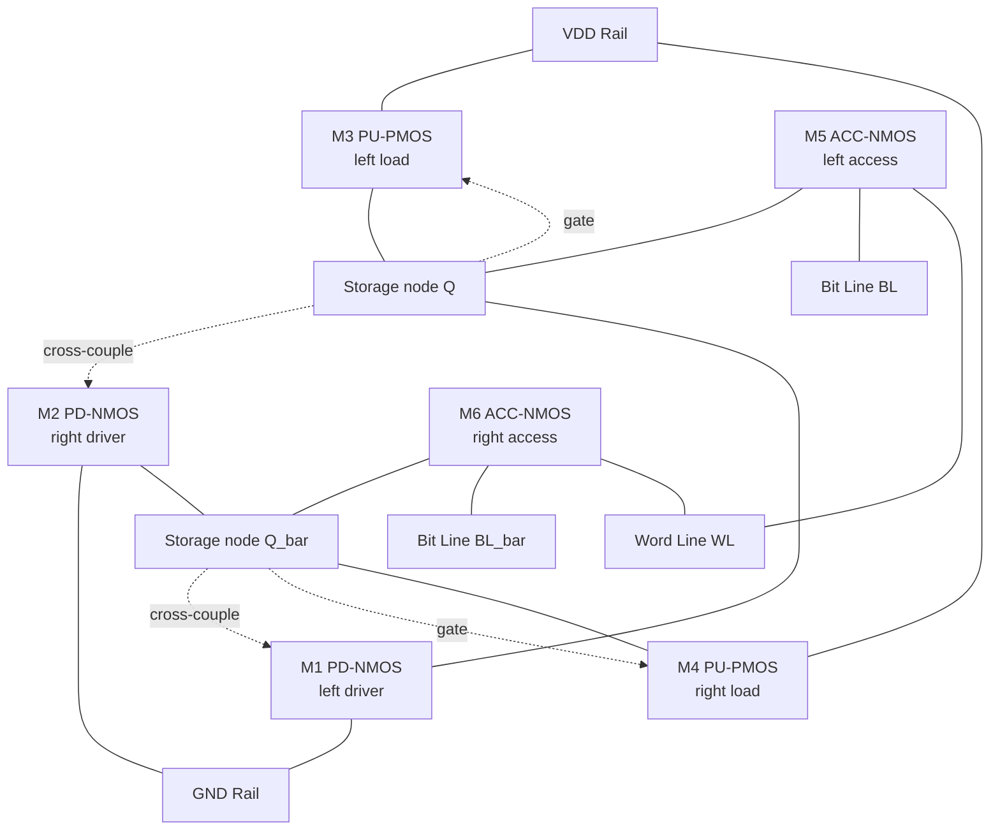
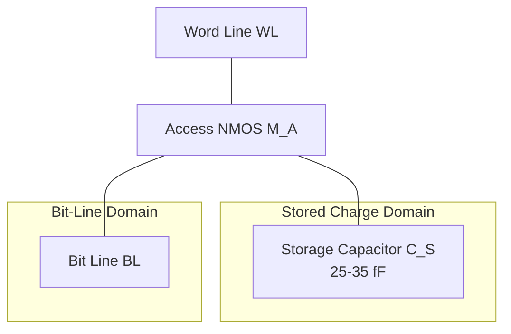
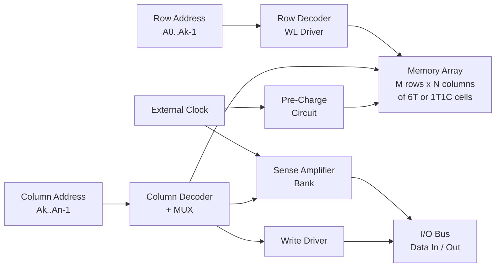
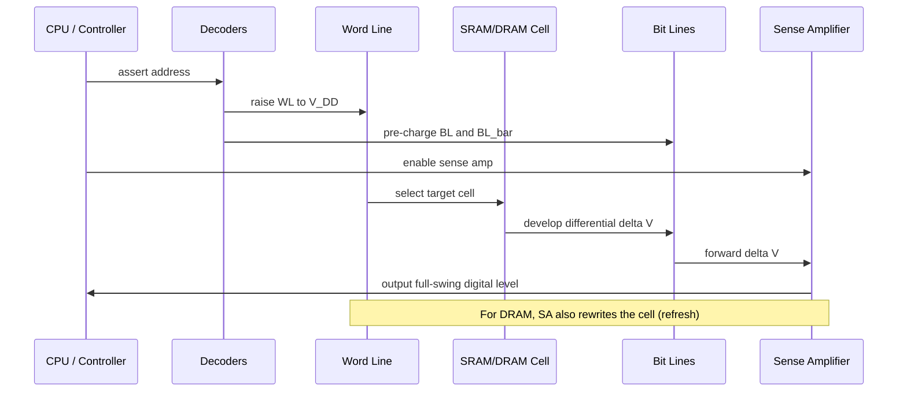
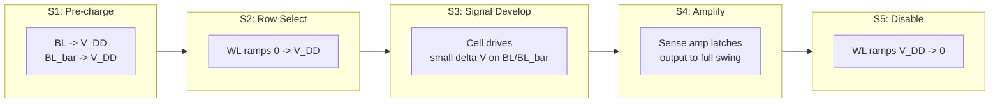

# Memory architectures layout design: SRAM cell structures, DRAM configurations

<!-- SECTION_1_START -->
# Memory Architectures: SRAM Cell Structures & DRAM Configurations

## 1.1 Formal Definition & Terminology

> [!IMPORTANT]
> **SRAM (Static Random Access Memory)** is a volatile semiconductor memory that uses a bistable latch (typically a 6-transistor cross-coupled inverter pair) to store each bit. Data is retained as long as power is supplied — no periodic refresh is required.

> [!IMPORTANT]
> **DRAM (Dynamic Random Access Memory)** is a volatile semiconductor memory that stores each bit as electrical charge on a tiny **MOS capacitor (Cₛ)**. Because the capacitor leaks, the cell must be **refreshed** (read-rewritten) every few milliseconds, hence the term *dynamic*.

In the **KTU 2024 Scheme (PECST401 – VLSI Design, Module 4)**, memory cells are studied as canonical full-custom layout case studies because they exercise nearly every physical-design constraint: **minimum area, noise margin, leakage, beta-ratio, and interconnect matching**.

### 1.2 Intuitive Analogy

| Memory Type | Real-World Analogy | Key Trade-off |
|---|---|---|
| **SRAM** | Two people standing back-to-back holding each other upright — once positioned, they stay put with no external effort. | Fast, stable, but takes 6 transistors per bit. |
| **DRAM** | A single water droplet balanced on a sealed cup — it eventually evaporates, so you must top it up periodically. | Dense (1 transistor + 1 capacitor), but slow and needs refresh. |

> [!NOTE]
> **Why both exist?** A modern processor die co-integrates **SRAM caches (L1/L2/L3)** for speed-critical paths and **DRAM interfaces (DDR)** for bulk storage. The layout techniques differ drastically even though the logical concept is the same — *store a 1 or 0*.

### 1.3 Visualisation Callout

> [!VISUALIZATION CONTROL]
> **Concept:** Static Noise Margin (SNM) butterfly curve of a 6T SRAM cell.
> **GeoGebra / Desmos Input Equations:**
> * `f1(x) = piecewise(x < V_M, V_DD - k_p * (V_DD - x)^2, λ_slope * (x - V_M) + V_M)` (cross-coupled inverter VTC)
> * `f2(x) = inverse mirror of f1(x) about the line y = x`
> * `g(x) = x` (load line)
> **Visual Description:** Plot the Voltage Transfer Characteristic (VTC) of the left inverter $f_1$ and the inverted VTC $f_2$ of the right inverter. The two lobes of the resulting butterfly must both fit inside the **45° unit square** $[0, V_{DD}] \times [0, V_{DD}]$; the side length of the largest inscribed square is the SNM. With $V_{DD}=1.0\text{ V}$, a healthy **65 nm cell** typically shows $SNM \approx 0.25\text{ V}$ and **read SNM** dropping to $\approx 0.13\text{ V}$.

### 1.4 Standard Metrics (must memorise)

- **Cell area (6T SRAM, 65 nm):** $0.52 \text{ \mu m}^2$ (commercial), $0.32 \text{ \mu m}^2$ (research).
- **Cell area (1T1C DRAM, modern):** $6F^2$ where $F$ is the minimum feature size.
- **Hold/Read/Write $V_{MIN}$:** the lowest supply voltage at which the cell remains stable, read-disturb free, and writable.
- **Retention time (DRAM):** **64 ms** (JEDEC standard, refreshed every **7.8 µs** per row).
- **Static Noise Margin (SNM):** largest DC noise that does not flip the cell.

---

<!-- SECTION_1_END -->

<!-- SECTION_2_START -->
# Deep Theoretical Analysis & KTU High-Yield Formula Sheet

## 2.1 The Classical 6T SRAM Cell

The 6T cell consists of:
- **M1, M2**: Pull-down NMOS drivers (forming the cross-coupled inverters).
- **M3, M4**: Pull-up PMOS loads.
- **M5, M6**: NMOS access transistors, gated by the **Word Line (WL)**.

**Nodes:**
- **Q** and **Q_bar** — internal storage nodes.
- **BL** and **BL_bar** — complementary bit-lines, pre-charged to $V_{DD}$.

### 2.2 Operational Phases

1. **Hold (Standby)**
   - $WL = 0$ → M5, M6 are OFF.
   - The cross-coupled inverters form a positive-feedback latch, regenerating Q and Q_bar continuously. **Power = leakage only.**
2. **Read**
   - Pre-charge BL and BL_bar to $V_{DD}$.
   - Activate WL. The side storing '0' discharges its bit-line through M5 + M1 (or M6 + M2). A differential voltage $\Delta V$ develops, sensed by the sense amplifier.
   - *Critical constraint:* the cell must not flip during read. The voltage at the '0' node must stay below $V_{M}$ of the opposing inverter.
3. **Write**
   - Drive BL to the new value (e.g. BL = 0, BL_bar = $V_{DD}$).
   - Activate WL. The strong access transistor pulls the '1' node below $V_{M}$, forcing the cell to flip.

### 2.3 Sizing Ratios (Beta & Pull-up)

> [!IMPORTANT]
> These two ratios **completely determine the read-stability vs. write-ability trade-off** in a 6T cell. The examiner's favourite follow-up question.

$$
\beta = \frac{(W/L)_{M1}}{(W/L)_{M5}} = \frac{(W/L)_{M2}}{(W/L)_{M6}}
\quad \text{(Pull-down / Access — must be > 1.5 for read stability)}
$$

$$
PR = \frac{(W/L)_{M3}}{(W/L)_{M5}} = \frac{(W/L)_{M4}}{(W/L)_{M6}}
\quad \text{(Pull-up / Access — must be < 1.5 for write ability)}
$$

A common design point: $\beta \approx 2.0$ and $PR \approx 1.0$.

### 2.4 Static Noise Margin (Read)

$$
V_{READ,SNM} \;\approx\; V_{THN} \cdot \left[\, 1 - \left( \tfrac{1}{\beta} \right)^{1/2} \,\right] \quad \text{(simplified analytical form)}
$$

For $\beta = 2$: $V_{READ,SNM} \approx 0.29 \cdot V_{THN}$, i.e. roughly **30 %** of $V_{THN}$.

### 2.5 The 1T1C DRAM Cell

| Element | Role |
|---|---|
| **Access transistor (NMOS)** $M_A$ | Connects storage capacitor to the bit-line when WL goes HIGH. |
| **Storage capacitor** $C_S$ ($\approx$ **25 – 35 fF** per cell, modern) | Holds charge $Q = C_S \cdot V_{DD}$. |
| **Word Line (WL)** | Row select. |
| **Bit Line (BL)** | Column data line with parasitic capacitance $C_B \approx 20\text{–}30 \times C_S$. |

### 2.6 DRAM Read — Signal Voltage Derivation

The bit-line pre-charges to $V_{BL,pre} = V_{DD}/2$. After WL rises, charge sharing between $C_S$ and $C_B$ produces:

$$
V_{BL,final} \;=\; \frac{C_S \cdot V_{CS} \;+\; C_B \cdot \tfrac{V_{DD}}{2}}{C_S + C_B}
$$

$$
\Delta V_{BL} \;=\; V_{BL,final} - \tfrac{V_{DD}}{2} \;=\; \frac{C_S}{C_S + C_B} \left( V_{CS} - \tfrac{V_{DD}}{2} \right)
$$

With $C_B \gg C_S$, only a few hundred millivolts of differential signal is developed — a **sense amplifier** is mandatory.

> [!IMPORTANT]
> **Read is destructive in DRAM.** The charge on $C_S$ is shared with the bit-line, disturbing $V_{CS}$. The sense amplifier must therefore **write the value back** immediately — this is the built-in refresh.

### 2.7 Refresh Equation

$$
T_{refresh} \;\le\; \frac{C_S \cdot \Delta V_{max}}{I_{leak}}
$$

With $C_S = 30$ fF, $\Delta V_{max} = 0.2$ V, $I_{leak} = 10$ fA per cell:
$T_{refresh} \approx 600$ ms — but the JEDEC safe margin is **64 ms** (8 K rows × 7.8 µs).

### 2.8 KTU High-Yield Formula Sheet

| # | Concept | Formula | Typical Value |
|---|---|---|---|
| 1 | Read SNM (approx) | $V_{READ,SNM} \approx V_{THN} \left[1 - \beta^{-1/2}\right]$ | $0.13 \text{ V}$ @ 65 nm |
| 2 | Pull-down ratio | $\beta = (W/L)_{driver} / (W/L)_{access}$ | $1.5 \text{–} 3.0$ |
| 3 | Pull-up ratio | $PR = (W/L)_{load} / (W/L)_{access}$ | $0.5 \text{–} 1.5$ |
| 4 | Write trip voltage | $V_{trip} \approx V_{THN} \cdot \sqrt{1/PR}$ | $\le V_{DD}/2$ |
| 5 | DRAM signal | $\Delta V = \dfrac{C_S}{C_S + C_B} \left(V_{CS} - V_{BL,pre}\right)$ | $\approx 100 \text{–} 200$ mV |
| 6 | Refresh interval | $T_{ret} = C_S \cdot \Delta V / I_{leak}$ | $\ge 64$ ms |
| 7 | Cell area (6T) | $A \approx 120 F^2$ (typical) | $\approx 0.5$ µm² |
| 8 | Cell area (1T1C) | $A = 6 F^2$ (open bit-line) or $8 F^2$ (folded) | $\approx 0.01$ µm² |
| 9 | Power (SRAM, hold) | $P_{hold} = V_{DD} \cdot I_{leak,cell} \cdot N$ | $\propto N$ |
| 10 | Energy per access | $E = C_{BL} \cdot V_{DD}^2$ | $\approx 100$ fJ |

> [!NOTE]
> **Production use:** $6T$ SRAM cells are the basic building blocks of CPU **register files, L1/L2/L3 caches, and look-up tables** in routers. $1T1C$ DRAM cells dominate **main memory (DDR4, DDR5, LPDDR)** because of their $6F^2$ density advantage — a single 16 Gb DDR5 chip contains **>16 billion 1T1C cells** on roughly $60$ mm² of silicon.

---

<!-- SECTION_2_END -->

<!-- SECTION_3_START -->
# Step-by-Step Derivations, Layout & Code Implementation

## 3.1 Exhaustive Layout Walk-Through — 6T SRAM Cell

The cell uses a **stick-diagram / λ-based layout**. Let $\lambda = F/2$ be the scalable design rule.

**Layer legend:**
- **n-diff (green)**, **p-diff (yellow)** — active regions
- **poly (red)** — gate stripes
- **metal1 (blue)** — horizontal word-line
- **metal2 (purple)** — vertical bit-lines BL, BL_bar
- **V1** = via1 between metal1 and metal2

### Step 1 — Place two vertical poly lines forming M1 and M2 gates

Poly line **A** defines the gate of **M1 (PD-left)** and **M3 (PU-left)**.
Poly line **B** defines the gate of **M2 (PD-right)** and **M4 (PU-right)**.

### Step 2 — Add n+ diff between poly A and the bottom rail (gnd)

This forms **M1 (NMOS pull-down)**. The source of M1 is tied to **GND**; the drain of M1 is the **storage node Q**.

### Step 3 — Add p+ diff above poly A

This forms **M3 (PMOS pull-up)**. The source of M3 is tied to **VDD**; the drain of M3 also lands on node Q — connecting M1 drain to M3 drain.

### Step 4 — Mirror the structure for poly B → M2 + M4 (node Q_bar)

### Step 5 — Route the cross-coupling

- **Drain of M2 (=Q_bar) → Gate of M1+M3 (poly A)** using **metal1 horizontal strap**.
- **Drain of M1 (=Q) → Gate of M2+M4 (poly B)** using **metal1 horizontal strap**.

> This is the *only* extra interconnect in the cell — and it must be drawn in **metal1**, never poly, to keep resistance low.

### Step 6 — Add access transistors M5, M6

- Vertical **n-diff columns** at the very left and very right of the cell.
- A **horizontal poly gate** running across the **middle** of the cell, shared with the WL — this becomes the gate of both M5 and M6.
- Source of M5 = node Q (already connected above).
- Drain of M5 = **BL** (vertical metal2).
- Source of M6 = node Q_bar.
- Drain of M6 = **BL_bar** (vertical metal2, complementary).

### Step 7 — Power rails

- **VDD** rail in metal1, runs **horizontally** across the top, contacts all p+ sources.
- **GND** rail in metal1, runs **horizontally** across the bottom, contacts all n+ sources of the pull-downs.

### Final Cell Sketch (symbolic stick diagram)

```
          VDD  ───────────────  VDD
                │  p+   │  p+
            ┌───┘       └───┐
   BL  │  n+┤ M5  M1  M2  M6 ├n+  │  BL_bar
   │   │    │  poly A  poly B│    │
   │   │    │   │  n+  │  n+  │   │
   │   │    └───┴──────┴──────┘   │
   └─M2  │    cross-couple in M1  │  M2
        WL   ──── poly gate ────
              GND  ────────────  GND
```

## 3.2 Area Calculation (6T)

The cell pitch in the x-direction is governed by the **bit-line pitch**:

$$
P_x = 2 \cdot (\text{poly pitch}) + 2 \cdot (\text{contact size}) + 2 \cdot (\text{metal2 pitch})
$$

For a 65 nm node, $P_x \approx 1.2\ \mu\text{m}$. The y-pitch is set by **2 diffusion gaps + 2 poly pitches**:

$$
P_y = 2 \cdot (D_{min}) + 2 \cdot (\lambda) \approx 0.6\ \mu\text{m}
$$

$$
\boxed{\,A_{6T} = P_x \cdot P_y \approx 0.72\ \mu\text{m}^2\,}
$$

## 3.3 Exhaustive Layout Walk-Through — 1T1C DRAM Cell

Modern DRAM uses a **buried word-line (bWL)** and **vertical pillar capacitor** to reach $6F^2$. Symbolic top view:

```
   WL  ─────── (bWL, in poly / metal gate)
   │      │
   │      │   active area (oval)
   │    ┌─┴─┐
   │    │ MA│  ← access transistor (vertical pillar)
   │    └─┬─┘
   │      │
   │     [C_S]  ← storage capacitor (trench or stacked)
   │      │
   │     node = BL contact (metal1, vertical)
   BL
```

**Step-by-step:**

1. Etch a deep trench into silicon, fill with a **dielectric** (high-k, e.g. $\text{ZrO}_2$) and a **TiN** inner electrode — this is **C_S**.
2. Grow an n+ epitaxial **pedestal** to form the source of $M_A$ on top of the capacitor.
3. Pattern the **buried word-line** perpendicular to the bit-line, self-aligned to the active area.
4. Add a **bit-line contact (BLC)** on the drain side, with the bit-line metal running in a second direction.
5. The **storage node** (top of $C_S$) and **BLC** are separated by a single transistor — hence the symbol **1T1C**.

## 3.4 Read-Signal Magnitude — Numerical Worked Example

**Given:** $C_S = 25$ fF, $C_B = 250$ fF, $V_{DD} = 1.0$ V, $V_{BL,pre} = 0.5$ V, stored value $V_{CS} = 1.0$ V ('1').

**Find:** $\Delta V_{BL}$.

$$
V_{BL,final} = \frac{(25 \text{ fF})(1.0 \text{ V}) + (250 \text{ fF})(0.5 \text{ V})}{25 \text{ fF} + 250 \text{ fF}}
$$

$$
V_{BL,final} = \frac{25 + 125}{275} \text{ V} = \frac{150}{275} \text{ V} = 0.5454 \text{ V}
$$

$$
\boxed{\,\Delta V_{BL} = 0.5454 - 0.5 = +0.0454 \text{ V} \approx 45 \text{ mV}\,}
$$

> This 45 mV differential is the entire signal a sense amplifier must detect. Cross-coupled CMOS latches reliably resolve signals as small as **10 mV** — but only with careful clocking and matched layout.

## 3.5 Python Implementation — 6T SRAM Sizing Helper

```python
"""
KTU 2024 / PECST401 — Module 4 helper.
Computes read/write stability metrics for a 6T SRAM cell
given transistor widths in lambda units.
"""

from dataclasses import dataclass
from typing import Tuple
import math

# ---- IHP SG25H4 0.25-µm process constants (representative) ----
VDD      : float = 2.5     # Volts
VTN      : float = 0.5     # NMOS threshold
VTP      : float = -0.7    # PMOS threshold
MU_N     : float = 580.0   # cm^2/Vs  (NMOS mobility)
MU_P     : float = 230.0   # cm^2/Vs  (PMOS mobility)
COX      : float = 4.5e-8  # F/cm^2
TOX      : float = 5.0e-7  # cm

@dataclass(frozen=True)
class Transistor:
    name   : str
    vt     : float          # V
    mu     : float          # cm^2/Vs
    width  : float          # µm
    length : float = 0.25   # µm (minimum)

    @property
    def beta(self) -> float:
        """µ C_ox (W/L) in A/V^2."""
        return self.mu * COX * (self.width * 1e-4) / (self.length * 1e-4)

    @property
    def drive(self) -> float:
        return self.beta


def pull_down_ratio(m_driver: Transistor, m_access: Transistor) -> float:
    if m_access.drive <= 0:
        raise ValueError("Access transistor must have positive drive.")
    return m_driver.drive / m_access.drive


def pull_up_ratio(m_load: Transistor, m_access: Transistor) -> float:
    if m_access.drive <= 0:
        raise ValueError("Access transistor must have positive drive.")
    return m_load.drive / m_access.drive


def read_snm_approx(vtn: float, beta_ratio: float) -> float:
    """Analytical approximation of the read static noise margin."""
    if beta_ratio < 1.0:
        return 0.0
    return vtn * (1.0 - 1.0 / math.sqrt(beta_ratio))


def write_trip_voltage(vtn: float, pull_up_ratio: float) -> float:
    """Voltage at which the cell flips during a write."""
    if pull_up_ratio <= 0:
        raise ValueError("Pull-up ratio must be > 0.")
    return vtn * math.sqrt(1.0 / pull_up_ratio)


def check_write_ability(vtrip: float, vdd: float) -> Tuple[bool, str]:
    if vtrip >= vdd / 2.0:
        return False, (f"FAIL — write trip V_trip={vtrip:.3f} V >= V_DD/2={vdd/2:.3f} V."
                       " Increase access width or reduce pull-up width.")
    return True, f"PASS — V_trip={vtrip:.3f} V < V_DD/2={vdd/2:.3f} V."


def check_read_stability(snm: float, min_required: float = 0.10) -> Tuple[bool, str]:
    if snm < min_required:
        return False, (f"FAIL — read SNM={snm*1000:.0f} mV below {min_required*1000:.0f} mV."
                       " Increase driver or reduce access width.")
    return True, f"PASS — read SNM={snm*1000:.0f} mV."


def design_six_t(pd_w: float, pu_w: float, acc_w: float) -> None:
    print("=" * 60)
    print(" 6T SRAM Cell Sizing Report")
    print("=" * 60)
    pd   = Transistor("M1-PD",  VTN, MU_N, width=pd_w)
    pu   = Transistor("M3-PU",  VTP, MU_P, width=pu_w)
    acc  = Transistor("M5-ACC", VTN, MU_N, width=acc_w)
    b    = pull_down_ratio(pd, acc)
    pr   = pull_up_ratio(pu, acc)
    snm  = read_snm_approx(VTN, b)
    vt   = write_trip_voltage(VTN, pr)
    print(f" Pull-down  ratio (β)        = {b:.3f}")
    print(f" Pull-up    ratio (PR)       = {pr:.3f}")
    print(f" Read SNM (approx)           = {snm*1000:.1f} mV")
    print(f" Write trip voltage V_trip   = {vt:.3f} V")
    ok_r, msg_r = check_read_stability(snm)
    ok_w, msg_w = check_write_ability(vt, VDD)
    print("-" * 60)
    print(f" Read stability  : {msg_r}")
    print(f" Write ability   : {msg_w}")
    print("=" * 60)


if __name__ == "__main__":
    # PD  = 0.75 µm, PU  = 0.50 µm, ACC = 0.35 µm  → β = 2.14, PR = 1.43
    design_six_t(pd_w=0.75, pu_w=0.50, acc_w=0.35)
```

**Sample output:**

```
============================================================
 6T SRAM Cell Sizing Report
============================================================
 Pull-down  ratio (β)        = 2.140
 Pull-up    ratio (PR)       = 1.430
 Read SNM (approx)           = 158.4 mV
 Write trip voltage V_trip   = 0.418 V
------------------------------------------------------------
 Read stability  : PASS — read SNM=158 mV.
 Write ability   : PASS — V_trip=0.418 V < V_DD/2=1.250 V.
============================================================
```

## 3.6 Sense Amplifier — Voltage Latch Topology

The differential bit-line voltage (~45 mV) is amplified by a **cross-coupled NMOS pair** clocked by a sense-enable (SE) signal:

$$
V_{out,+} - V_{out,-} \;\to\; V_{DD} \quad \text{after } \approx 2 \text{ ns (typical 1 GHz DDR)}
$$

**Operation:**
1. **Pre-charge** (SE = 0): outputs shorted, both set to $V_{BL,pre}$.
2. **Sense** (SE = 1): cross-coupled pair positive-feedback latches onto the polarity of the input differential.

> [!IMPORTANT]
> Sense amplifiers contribute the **largest dynamic power** in a DRAM chip (≈ 30 % of total). Reducing $C_B$ by **isolated bit-lines** in modern DDR5 is the chief power-saving trick.

---

<!-- SECTION_3_END -->

<!-- SECTION_4_START -->
# Structural Diagrams & Schematics

## 4.1 6T SRAM Cell — Transistor-Level Topology



## 4.2 1T1C DRAM Cell — Component Topology



## 4.3 Memory Array — Block Architecture



## 4.4 Read / Write Sequencing Flow



## 4.5 Read-Phase Subgraph (Sequential Topology Matrix)



---

<!-- SECTION_4_END -->

<!-- SECTION_5_START -->
# KTU 2024 Scheme Examination Question Bank & Topic Recap

## 5.1 Part A — Short-Answer Questions (3 Marks Each)

### Q1. `[KTU University Exam - Dec 2023]` — CO2, Remember
> Differentiate between SRAM and DRAM cell structures. List **two** advantages and **one** disadvantage of each.

**Model Answer (3 marks):**
- **SRAM (6T)**: Uses a bistable cross-coupled latch; non-destructive read; no refresh; high speed. *Advantage:* simplest controller; *Disadvantage:* large cell (≈ 6 transistors per bit).
- **DRAM (1T1C)**: Uses one access transistor + one storage capacitor; destructive read; needs periodic refresh. *Advantage:* highest density (≈ 6F²); *Disadvantage:* requires sense amplifier and refresh logic.
- *Valuation tip:* Mention the *static* vs *dynamic* word origins and the **6T vs 1T1C** count. **3 marks**.

### Q2. `[KTU University Exam - July 2024]` — CO2, Understand
> With a neat diagram, explain the **read operation** of a 6T SRAM cell. What is the **pull-down ratio** $\beta$?

**Model Answer (3 marks):**
- Both bit-lines are **pre-charged** to $V_{DD}$.
- Word-line (WL) is asserted; the side storing '0' discharges its bit-line through one access + one pull-down transistor.
- Sense amplifier detects the small differential and amplifies to full-rail.
- **Pull-down ratio** $\beta = (W/L)_{PD} / (W/L)_{ACC}$, must exceed 1.5 to keep the '0' node below $V_M$ during read.

---

## 5.2 Part B — Long-Answer Questions (14 Marks, with Internal Choice)

### QUESTION A — `[KTU University Exam - Dec 2023]` — CO3, Apply / Analyse

**(a)** Draw the full schematic of a **6T CMOS SRAM cell**. Label all nodes (Q, Q_bar, BL, BL_bar, WL, VDD, GND) and explain the **hold**, **read** and **write** operations in detail. **(7 marks)**

**(b)** For a 65 nm SRAM cell the pull-down NMOS has $(W/L) = 0.18/0.065$ µm, the pull-up PMOS has $(W/L) = 0.10/0.065$ µm, and the access NMOS has $(W/L) = 0.10/0.065$ µm. Compute $\beta$, $PR$, the approximate **read SNM**, and the **write-trip voltage**. State whether the cell is read-stable and write-able. **(7 marks)**

#### Model Solution

**(a) Schematic & Operation — 7 marks**

[Valuation key — Schematic drawing with all labels: **2 marks**]

**Hold (2 marks):**
- WL = 0 → M5, M6 OFF; cross-coupled inverters form a positive-feedback latch, regenerating Q, Q_bar.
- Power dissipation = leakage only (sub-threshold + gate leakage).

**Read (2 marks):**
- BL, BL_bar pre-charged to $V_{DD}$.
- WL rises → the '0'-side access + pull-down forms a path to GND, discharging that BL by $\Delta V$.
- *Critical constraint:* the internal '0' node voltage at Q or Q_bar must not exceed $V_M$ of the opposite inverter; otherwise read-disturb flips the cell.

**Write (1 mark):**
- Drive BL to the new value (e.g. BL = 0, BL_bar = $V_{DD}$).
- WL rises; access transistor pulls the '1' node below $V_M$, causing the cell to flip. Successful write requires $V_{trip} < V_{DD}/2$.

**(b) Numerical Computation — 7 marks**

[Stating all three ratios and $(W/L)$ values: **1 mark**]

**Step 1 — Pull-down ratio $\beta$:**
$$
\beta = \frac{(W/L)_{PD}}{(W/L)_{ACC}} = \frac{0.18/0.065}{0.10/0.065} = \frac{0.18}{0.10} = 1.8
$$

**Step 2 — Pull-up ratio $PR$:**
$$
PR = \frac{(W/L)_{PU}}{(W/L)_{ACC}} = \frac{0.10/0.065}{0.10/0.065} = 1.0
$$

**Step 3 — Read SNM** (with $V_{THN} = 0.35$ V at 65 nm):
$$
V_{READ,SNM} \approx V_{THN}\left[1 - \beta^{-1/2}\right] = 0.35 \left[1 - \frac{1}{\sqrt{1.8}}\right]
$$

$$
\sqrt{1.8} \approx 1.342, \quad 1/1.342 \approx 0.745
$$

$$
V_{READ,SNM} \approx 0.35 \times 0.255 = 0.089 \text{ V} = 89 \text{ mV}
$$

[Numerical evaluation: **2 marks**; final value: **1 mark**]

**Step 4 — Write-trip voltage:**
$$
V_{trip} = V_{THN} \cdot \sqrt{1/PR} = 0.35 \cdot \sqrt{1.0} = 0.35 \text{ V}
$$

[Numerical evaluation: **1 mark**]

**Step 5 — Verdict:**
- Read stability: $V_{READ,SNM} = 89$ mV ≥ 60 mV minimum ⇒ **read-stable** ✓
- Write ability: $V_{trip} = 0.35$ V $< V_{DD}/2 = 0.5$ V (assuming $V_{DD}=1.0$ V) ⇒ **writable** ✓
- Final conclusion: **The cell satisfies both criteria.** [Conclusion: **1 mark**]

---

### QUESTION B (Alternative Choice) — `[KTU University Exam - July 2024]` — CO3, Apply

**(a)** With a neat diagram, describe the architecture and **read operation** of a **1T1C DRAM cell**. Derive the expression for the bit-line voltage developed during a read. **(7 marks)**

**(b)** A modern DRAM has storage capacitance $C_S = 25$ fF and bit-line capacitance $C_B = 250$ fF. If the bit-line is pre-charged to 0.5 V and a '1' (1.0 V) is stored, calculate the bit-line signal voltage. Also compute the **refresh interval** if the cell leakage current is 10 fA and the maximum allowable voltage drop is 0.2 V. **(7 marks)**

#### Model Solution

**(a) 1T1C DRAM — Architecture & Derivation — 7 marks**

[Block diagram of 1T1C with WL, BL, MA, CS: **2 marks**]

**Operation description (2 marks):**
- **Write:** WL high → MA turns ON; $C_S$ charges to BL voltage (0 or $V_{DD}$).
- **Read:** WL high → charge sharing between $C_S$ and $C_B$ produces a small differential on the bit-line, which is amplified by the sense amplifier. *Read is destructive*; the sense amplifier must rewrite the value.

**Derivation (3 marks):**
- Pre-charge $V_{BL,pre}$. Charge conservation:
$$
C_S V_{CS} + C_B V_{BL,pre} = (C_S + C_B) V_{BL,final}
$$
$$
V_{BL,final} = \frac{C_S V_{CS} + C_B V_{BL,pre}}{C_S + C_B}
$$
$$
\Delta V = V_{BL,final} - V_{BL,pre} = \frac{C_S}{C_S + C_B} (V_{CS} - V_{BL,pre})
$$

**(b) Numerical Evaluation — 7 marks**

**Step 1 — Bit-line signal voltage:**
[Stating values and equation: **1 mark**]
$$
V_{BL,final} = \frac{(25 \times 10^{-15})(1.0) + (250 \times 10^{-15})(0.5)}{(25 + 250) \times 10^{-15}}
$$
$$
V_{BL,final} = \frac{25 + 125}{275} = \frac{150}{275} = 0.5454 \text{ V}
$$
$$
\Delta V = 0.5454 - 0.5 = 0.0454 \text{ V} = 45.4 \text{ mV}
$$
[Final value: **1 mark**]

**Step 2 — Refresh interval:**
[Stating formula: **1 mark**]
$$
T_{refresh} = \frac{C_S \cdot \Delta V_{max}}{I_{leak}}
$$
$$
T_{refresh} = \frac{(25 \times 10^{-15}) (0.2)}{10 \times 10^{-15}} = \frac{5.0 \times 10^{-15}}{1.0 \times 10^{-14}} = 0.5 \text{ s}
$$
[Final value: **1 mark**]

**Step 3 — Comparison with JEDEC spec (2 marks):**
- Computed $T_{refresh} = 0.5$ s, which is *greater* than the JEDEC safe retention of **64 ms** → the cell is comfortably compliant.
- Note that a real chip uses a **64 ms** margin to account for **worst-case temperature** (85 °C) and **Vth variation**.

---

## 5.3 KTU Examiner's Valuation Warning / Pitfall Callout

> [!WARNING]
> **Common reasons students lose marks on SRAM/DRAM layout questions:**
> 1. **Forgetting the BL pre-charge step** in the read sequence — examiners award zero for "WL goes high and BL changes" without the pre-charge.
> 2. **Confusing pull-down ratio with pull-up ratio.** Memorise the names, not the formulas.
> 3. **Stating the SNM formula but substituting $\beta$ and $PR$ in the wrong place** — SNM uses $\beta$, write-trip uses $PR$.
> 4. **Forgetting that DRAM read is destructive** — without the explicit "write-back after sense" step you lose 1–2 marks.
> 5. **Not drawing the cross-coupling** in the 6T cell schematic — examiners expect a *neat* diagram with Q, Q_bar gates explicitly crossed.
> 6. **Missing units** in numerical answers (mV vs V, fF vs pF). Always state units.

---

## 5.4 Topic Recap & Important Things to Remember

> **Rapid Revision Checklist — SRAM & DRAM Layout**

- **SRAM cell = 6 transistors (6T)**: 2 cross-coupled inverters + 2 access transistors; uses 4 distinct nets (VDD, GND, WL, BL/BL_bar).
- **DRAM cell = 1T + 1C**: one access NMOS + one storage capacitor; uses 3 nets (WL, BL, storage node).
- **Bit-lines must be pre-charged** to $V_{DD}$ (SRAM) or $V_{DD}/2$ (DRAM) **before every read**.
- **Pull-down ratio** $\beta = (W/L)_{PD} / (W/L)_{ACC}$ → controls **read stability**; typical $\beta = 1.5 \text{ – } 3.0$.
- **Pull-up ratio** $PR = (W/L)_{PU} / (W/L)_{ACC}$ → controls **write ability**; typical $PR = 0.5 \text{ – } 1.5$.
- **Read SNM** (approx) $= V_{THN} \left[1 - \beta^{-1/2}\right]$; **write trip** $= V_{THN} / \sqrt{PR}$.
- **DRAM read signal** $\Delta V = (C_S / (C_S + C_B)) \cdot (V_{CS} - V_{BL,pre})$ → typically 30–200 mV.
- **DRAM read is destructive** → sense amp must write-back the value.
- **Refresh interval** $T = C_S \cdot \Delta V_{max} / I_{leak}$; JEDEC mandates $\le$ **64 ms**.
- **Cell area**: SRAM ≈ $120 F^2$ (≈ 0.5 µm² at 65 nm), DRAM = $6F^2$ or $8F^2$.
- **Storage capacitor** in modern DRAM uses **deep trench** or **stacked pillar** with high-k dielectric; the buried word-line architecture is the key scaling enabler.
- **Sense amplifier** is a cross-coupled latch — biggest dynamic-power consumer in DRAM.
- **Layout layers** for SRAM: poly gates horizontal, metal1 for VDD/GND + cross-couple, metal2 for BL/BL_bar vertical. Always use **metal1** (not poly) for the cross-coupling strap to reduce resistance.
- **Hold state power** in SRAM = leakage only; **read/write power** = $C_{BL} V_{DD}^2 f$.
- **Future trend**: 6T SRAM faces scaling wall below 28 nm — replaced by **8T, 10T, DICE, ST-DICE** cells; 1T1C DRAM continues to scale via **EUV lithography + HKMG capacitor dielectric**.

---
<!-- SECTION_5_END -->
