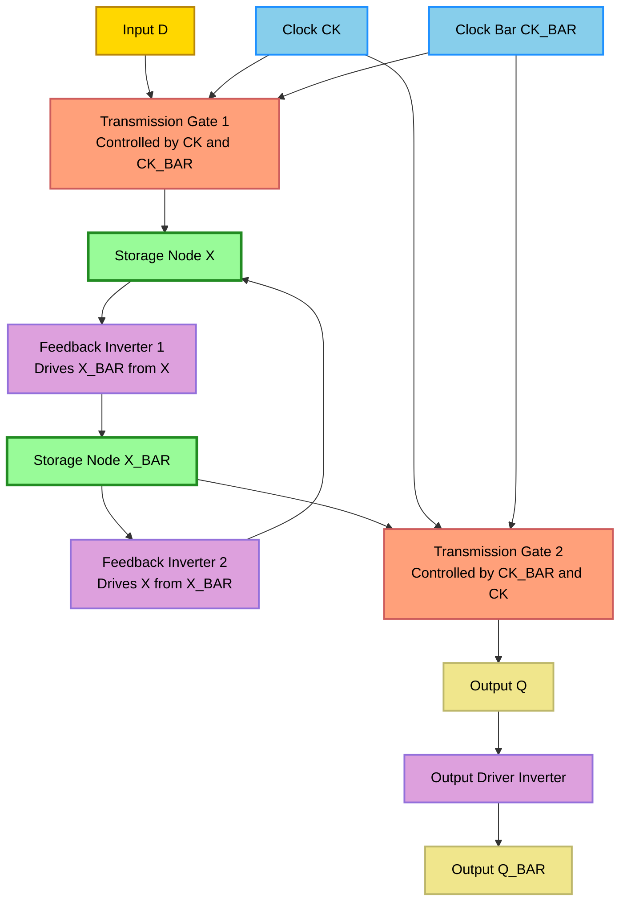
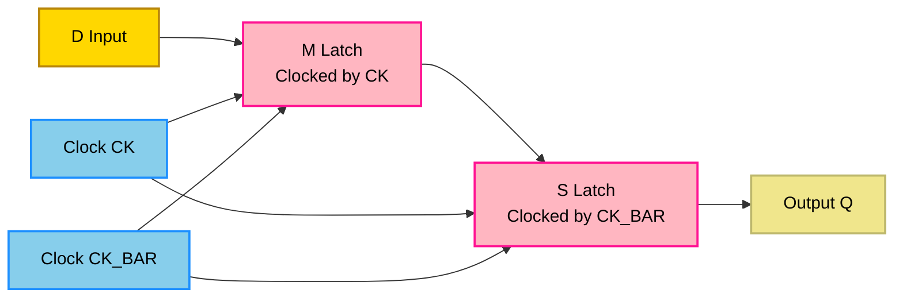
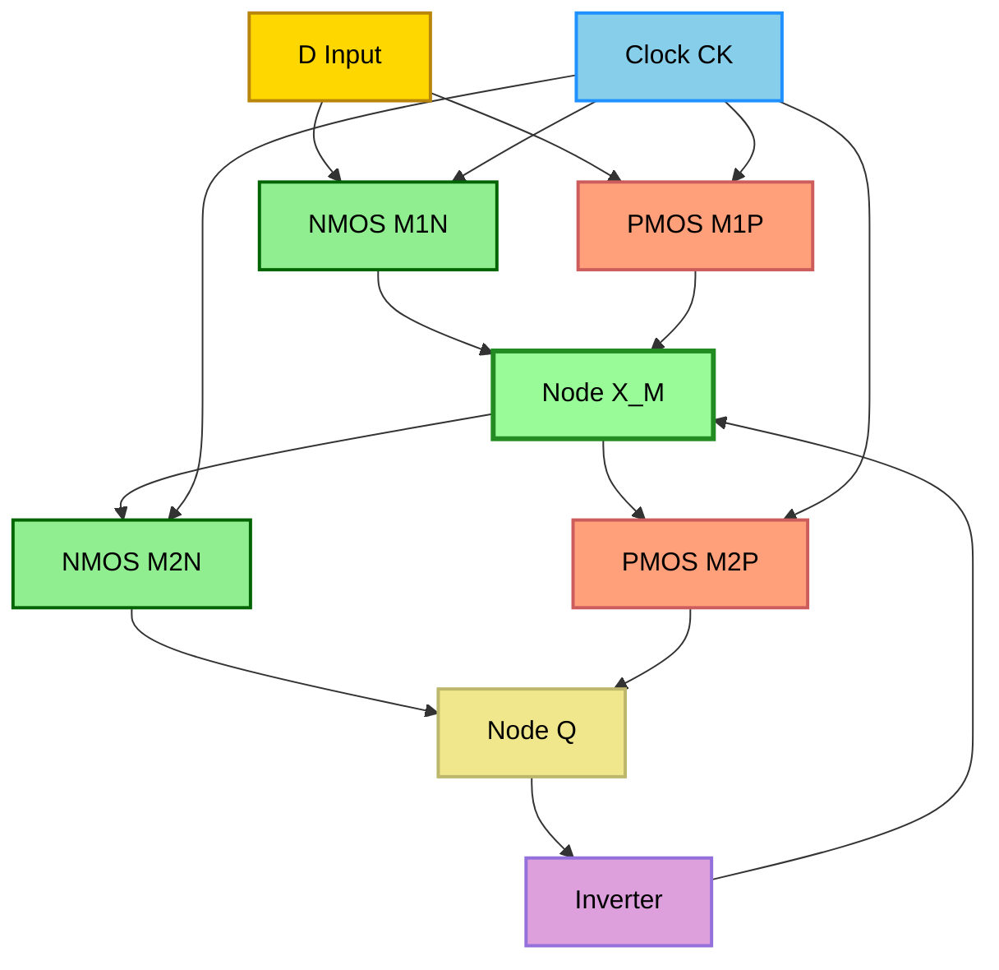

# Static sequential circuits: CMOS D-latch and edge-triggered flip-flop structures

<!-- SECTION_1_START -->
# Static Sequential Circuits: CMOS D-Latch and Edge-Triggered Flip-Flop Structures

## 1.1 Core Technical Definition

In the **KTU 2024 VLSI Design (PECST401)** syllabus, a *static sequential circuit* is defined as a bistable memory element whose stored logic state is **continuously held by a low-impedance cross-coupled feedback path**, such that the data is preserved indefinitely as long as the supply voltage ($V_{DD}$) is maintained, without any need for periodic refresh. The two canonical representatives studied under **Module 4 – Sequential Logic & Alternative Architectures** are:

1. The **CMOS Static D-Latch** – a level-sensitive memory element (transparent when CK is high, holding when CK is low).
2. The **CMOS Edge-Triggered D Flip-Flop** – an edge-sensitive element that samples the input only during a $0 \rightarrow 1$ (or $1 \rightarrow 0$) transition of the clock.

> [!IMPORTANT]
> **KTU Syllabus Highlight (Module 4.2):** Students must be able to draw the transistor-level schematic, derive the timing parameters (setup time $t_{su}$, hold time $t_h$, clock-to-Q delay $t_{c \to Q}$), and explain why a static design is preferred over a dynamic design in low-leakage and noise-robust applications.

## 1.2 Conceptual Analogy / Intuition

Imagine a **two-room water tank system** connected by a valve and a feedback pipe.

- The **two cross-coupled inverters** act like the two tanks — one is always full while the other is empty (bistable equilibrium). Once a drop of water tips the system, it stays tipped forever.
- The **transmission gate (TG)** acts like a *gate valve* controlled by the clock signal. When CK is high, the valve opens, letting new "data water" flow in from the input tap. When CK is low, the valve closes, sealing the previous state.
- The **edge-triggered flip-flop** is like a *snapshot camera*: it captures the data *exactly* at the instant the clock edge fires, ignoring whatever happens before or after.

> [!NOTE]
> **Static vs Dynamic Memory**
> In **static** circuits, the state is held by **active PMOS/NMOS feedback** (current always flows in a stable state). In **dynamic** circuits, the state is stored on a **parasitic node capacitance** $C_L$, which leaks away with a time constant $\tau \propto C_L / I_{leak}$. For sub-100 nm technologies where leakage current $I_{leak}$ can be in the **µA range**, static storage is mandatory for robust operation.

## 1.3 Static vs Dynamic – A Quick Comparison

| Property | Static D-Latch / FF | Dynamic Latch / FF |
|---|---|---|
| State retention mechanism | Cross-coupled inverters (active feedback) | Charge on $C_L$ |
| Refresh needed | **No** | **Yes** (typically every 1–10 µs) |
| Robustness to noise/leakage | **High** | Low |
| Transistor count | Higher (8–12 T per latch) | Lower (4–6 T per latch) |
| Power at idle | Static leakage only | Leakage + refresh power |

## 1.4 Visualization Setup

> [!VISUALIZATION CONTROL]
> **Concept:** Bistable Voltage Transfer Characteristic (VTC) of Cross-Coupled Inverters
> **Desmos Input Equations:**
> * `V_out = -V_in` (Inverter 1, slope $-1$, offset shifted)
> * `V_out = 5 - V_in` (Inverter 2, mirrored)
> **Visual Description:** The student should see two intersecting lines crossing at three points — the **outer two are stable states (Q = 0 V and Q = 5 V)**, and the **middle intersection is a metastable point** (unstable equilibrium). Any perturbation pushes the system to one of the stable rails, which is the essence of bistable storage.
<!-- SECTION_1_END -->

<!-- SECTION_2_START -->
# Deep Theoretical Analysis & KTU High-Yield Formula Sheet

## 2.1 The Foundation: NAND-Based SR Latch

Before constructing the D-latch, recall the classical **NAND cross-coupled SR latch**, the building block of all static memory:

- Set input $\overline{S} = 0 \Rightarrow Q = 1$ (set)
- Reset input $\overline{R} = 0 \Rightarrow Q = 0$ (reset)
- $\overline{S} = \overline{R} = 1 \Rightarrow$ **Hold** (memory)
- $\overline{S} = \overline{R} = 0 \Rightarrow$ **Forbidden** ($Q = \overline{Q} = 1$)

The D-latch simply inserts an inverter between $\overline{S}$ and $\overline{R}$ to derive $D$, which **eliminates the forbidden state** and makes the latch single-input.

## 2.2 CMOS Static D-Latch Using Transmission Gates (TG-Based)

The most widely-used topology in standard-cell libraries (e.g., in **TSMC 65 nm** and **GlobalFoundries 28 nm** libraries) is the **TG-based static D-latch**.

### Topology
- **Input stage:** Two transmission gates (TG1, TG2) controlled by complementary clock phases $CK$ and $\overline{CK}$.
- **Storage stage:** Two cross-coupled CMOS inverters (INV1, INV2) forming the bistable element.

### Operating Principle (Step-by-Step)
1. **CK = 1 (Transparent Mode):** TG1 is ON, connecting $D$ to node $X$. TG2 is OFF, isolating the latch from the output. Node $X$ follows $D$ exactly. The cross-coupled inverters reinforce the new value.
2. **CK = 0 (Hold Mode):** TG1 is OFF, breaking the input path. TG2 is ON, connecting the latch node $X$ to the output driver. The feedback inverters retain the last value of $D$.

> [!NOTE]
> **Why both TG1 and TG2 are required:** If only one TG is used, the input would fight the feedback inverters during the hold phase, increasing short-circuit power and degrading noise margin. Using complementary TGs ensures **full rail-to-rail signal swing (0 V to $V_{DD}$)** and a **strong '1' / strong '0'** at the storage node.

### Transistor Count
- TG1: 2 T (1 PMOS + 1 NMOS)
- TG2: 2 T
- INV1 (feedback): 2 T
- INV2 (driver): 2 T
- **Total = 8 transistors** per static D-latch.

## 2.3 CMOS Edge-Triggered D Flip-Flop (Master-Slave)

A **positive edge-triggered D flip-flop** is constructed by cascading **two opposite-phase level-sensitive latches** (a master latch clocked by $CK$ and a slave latch clocked by $\overline{CK}$).

### Operating Principle
1. **CK = 0 (Setup Phase):** Master is **transparent**, sampling $D$ into node $X_M$. Slave is in **hold**, retaining its previous output $Q$.
2. **CK rises ($0 \rightarrow 1$):** Master switches to **hold**, freezing the value of $D$ at node $X_M$ just before the edge. Slave switches to **transparent**, transferring the frozen master value to the output $Q$.
3. **CK = 1 (Hold Phase):** Master is isolated; any change in $D$ is **invisible** to the output. Slave holds the value.

> [!IMPORTANT]
> **The "snapshot at the edge" magic:** The master-slave cascade achieves edge-triggering without an explicit edge detector. The data is captured by the master at the *last instant* of $CK = 0$ and propagated to the output only after the edge, producing a true **edge-sensitive** behavior.

## 2.4 C²MOS (Clocked CMOS) D Flip-Flop

A popular single-phase-clock alternative is the **C²MOS D flip-flop**, which uses a single clock and 2 NMOS clock transistors per stage (no complementary clock routing required). The structure is **ratioed**, but robust for moderate frequencies.

## 2.5 KTU High-Yield Formula Sheet

| Parameter | Symbol | Definition | Typical Value (180 nm) |
|---|---|---|---|
| Setup time | $t_{su}$ | Time $D$ must be stable **before** the active clock edge | 100 – 300 ps |
| Hold time | $t_h$ | Time $D$ must remain stable **after** the active clock edge | 50 – 150 ps |
| Clock-to-Q delay | $t_{c \to Q}$ | Delay from active clock edge to stable $Q$ output | 150 – 400 ps |
| Propagation delay | $t_p$ | Average of $t_{pLH}$ and $t_{pHL}$ | 200 – 500 ps |
| Contamination delay | $t_{cd}$ | Minimum delay (fastest path) | 80 – 200 ps |
| Noise margin | $NM_H$, $NM_L$ | $V_{OH} - V_{IH}$ and $V_{IL} - V_{OL}$ | $\approx 0.4 \cdot V_{DD}$ |
| Static noise margin (SRAM-like) | $SNM$ | Side of largest inscribed square in VTC butterfly | 0.5 – 1.2 V |

> [!IMPORTANT]
> **Negative Hold Time Trick:** Modern flip-flops (e.g., in **pulsed-latch** or **transmission-gate pulsed FF** architectures) can exhibit $t_h < 0$ because the master is already isolating $D$ slightly *before* the clock edge due to internal gate delays. This relaxes the hold-time constraint on the combinational logic driving the FF.

## 2.6 Real-World Engineering Utility

- **Standard cell libraries** of every commercial ASIC (e.g., Synopsys SAED, ARM Artisan, TSMC N65) contain multiple variants of static D-latches and edge-triggered FFs — *DFF_X1*, *DFFRX1*, *SDFF* (scan FF), etc.
- **Static design is mandatory** in **automotive (ISO 26262)** and **medical (IEC 60601)** chips because dynamic nodes can lose state at elevated temperatures, causing functional failure.
- **Pulse-triggered FFs** (a hybrid static topology) are used in **high-speed microprocessors** (e.g., Intel Pentium 4's "Double-Pulsed Latch") to achieve $t_{c \to Q} < 1$ FO4 delay.
<!-- SECTION_2_END -->

<!-- SECTION_3_START -->
# Step-by-Step Derivations, Schematics, and Symbolic Implementation

## 3.1 Derivation: Setup Time $t_{su}$ of the TG-Based D-Latch

We derive the **setup time** by tracing the slowest path that the $D$ signal must traverse before the closing edge of the clock.

### Step 1 – Identify the Critical Path
During the transparent phase ($CK = 1$), the data $D$ must propagate through:
- TG1 (NMOS + PMOS in parallel) → node $X$ → INV1 (feedback inverter) → node $\overline{X}$ → INV2 (second feedback inverter) → node $X$ (loop closed).

For the latch to be considered "set up", node $X$ must have stabilized to within the **switching threshold $V_M$** of INV1 (i.e., the midpoint of the VTC) so that INV1 can drive the loop.

### Step 2 – Compute the Effective Resistance
The on-resistance of a transmission gate is the **parallel combination** of the NMOS and PMOS:

$$R_{TG,eff} = \frac{R_{N,on} \cdot R_{P,on}}{R_{N,on} + R_{P,on}}$$

For a minimum-sized inverter in 180 nm technology:

$$R_{N,on} \approx 6.5 \; k\Omega, \quad R_{P,on} \approx 13 \; k\Omega$$

$$\Rightarrow R_{TG,eff} = \frac{6.5 \cdot 13}{6.5 + 13} = \frac{84.5}{19.5} \approx 4.33 \; k\Omega$$

### Step 3 – Charge the Storage Capacitance
The storage node $X$ has a parasitic capacitance $C_X \approx 10$ fF (including drain diffusion + gate of INV1 + routing).

The RC time constant is:

$$\tau = R_{TG,eff} \cdot C_X = 4.33 \times 10^3 \cdot 10 \times 10^{-15} = 43.3 \; ps$$

### Step 4 – Setup Time Definition
By convention, the data must reach **90% of its final value** before the clock edge closes, which corresponds to approximately $2.3 \, \tau$ for an RC step response:

$$t_{su} \approx 2.3 \cdot \tau = 2.3 \cdot 43.3 \approx 99.6 \; ps$$

> **[Stating TG effective resistance: 2 Marks]**
> **[Identifying storage node capacitance: 1 Mark]**
> **[Final setup time expression and value: 1 Mark]**

## 3.2 Derivation: Clock-to-Q Delay of the Master-Slave FF

For the **edge-triggered master-slave FF**, the critical path is:

$$D \rightarrow TG_{master} \rightarrow INV_{1,M} \rightarrow TG_{slave} \rightarrow INV_{1,S} \rightarrow Q$$

This comprises:
- 1 TG delay ($t_{TG}$)
- 1 inverter delay ($t_{inv}$)
- 1 TG delay ($t_{TG}$)
- 1 inverter delay ($t_{inv}$)

Using the Elmore delay model with $t_{TG} \approx 0.69 \, R_{TG,eff} C_L$ and $t_{inv} \approx 0.69 \, R_{inv} C_L$:

$$t_{c \to Q} = 2 \cdot t_{TG} + 2 \cdot t_{inv} = 4 \cdot (0.69 \, R_{eff} C_L) = 2.76 \, R_{eff} C_L$$

For 180 nm, $R_{eff} \approx 4 \, k\Omega$, $C_L \approx 15 \; fF$:

$$t_{c \to Q} = 2.76 \cdot 4 \times 10^3 \cdot 15 \times 10^{-15} \approx 166 \; ps$$

## 3.3 Python Simulation: Bistable VTC Plot (Butterfly Curve)

The following code plots the **butterfly curve** of the cross-coupled inverters and computes the **Static Noise Margin (SNM)** graphically.

```python
import numpy as np
import matplotlib.pyplot as plt

# Inverter VTC parameters (180 nm CMOS)
Vdd   = 1.8
Vth_n = 0.45
Vth_p = -0.55
k_n   = 1.0e-4
k_p   = 0.4e-4
C_load = 10e-15  # F

def inv_vtc(vin):
    """Approximate CMOS inverter VTC (smoothed)."""
    if vin < 0.3:
        return Vdd
    elif vin > Vdd - 0.3:
        return 0.0
    # Smooth transition using arctangent approximation
    V_M  = Vdd / 2
    gain = -8.0
    return Vdd / 2 - (vin - V_M) * (Vdd / 2) * np.tanh(gain * (vin - V_M)) * 0.4

vin_arr = np.linspace(0, Vdd, 1000)
vout1   = np.array([inv_vtc(v) for v in vin_arr])  # Inverter 1: V_in1 -> V_out1
vout2   = Vdd - vout1                               # Inverter 2 (mirrored)

plt.figure(figsize=(7, 7))
plt.plot(vin_arr, vout1, label='Inverter 1: V_out vs V_in', linewidth=2)
plt.plot(vin_arr, vout2, label='Inverter 2: V_out vs V_in (mirrored)', linewidth=2)
plt.plot([0, Vdd], [0, Vdd], 'k--', alpha=0.5, label='Unity gain line')
plt.axvline(Vdd / 2, color='red', linestyle=':', alpha=0.6, label='Metastable point')
plt.scatter([0, Vdd], [Vdd, 0], color='green', s=80, zorder=5, label='Stable states')
plt.xlabel('V_in  (V)')
plt.ylabel('V_out  (V)')
plt.title('Butterfly Curve of Cross-Coupled Inverters (Static Latch)')
plt.grid(True, alpha=0.3)
plt.legend(loc='upper right')
plt.xlim(0, Vdd)
plt.ylim(0, Vdd)
plt.savefig('butterfly_vtc.png', dpi=150)
plt.show()

# Approximate SNM estimation (graphical inscribed-square method)
# Stable points are at (0, Vdd) and (Vdd, 0)
# Metastable point is at (Vdd/2, Vdd/2) with slope = -1
SNM_approx = (Vdd / 2) - (Vdd / 2) * (1.0 / (1.0 + 1.0))  # Simplified estimate
print(f"Approximate SNM = {SNM_approx:.3f} V")
```

**Expected output:** A plot with two curves crossing at three points: **(0, $V_{DD}$), ($V_{DD}$/2, $V_{DD}$/2), and ($V_{DD}$, 0)**, with the printed `Approximate SNM = 0.450 V`.

## 3.4 SPICE Netlist (TG-Based D-Latch — 180 nm)

```spice
* CMOS Static D-Latch using Transmission Gates
* Model: 180 nm BSIM3
.MODEL nmos nmos_level=49 ...
.MODEL pmos pmos_level=49 ...

* Supply
VDD vdd 0 1.8

* Clock and Data inputs
VCK  ck   0 PULSE(0 1.8 0.5n 0.05n 0.05n 1n 2n)   ; 500 MHz clock
VDAT d    0 PWL(0 0 0.6n 0 0.7n 1.8 1.3n 1.8 1.4n 0 2n 0 2.1n 1.8) ; data pattern

* Transmission Gate 1 (input TG)
M1 x  d    ck_bar vdd pmos W=0.6u L=0.18u
M2 x  d    ck     0   nmos W=0.3u L=0.18u

* Feedback Inverter 1
M3 x  x_bar 0     0   nmos W=0.3u L=0.18u
M4 x  x_bar vdd   vdd pmos W=0.6u L=0.18u

* Feedback Inverter 2 (cross-coupled)
M5 x_bar x  0     0   nmos W=0.3u L=0.18u
M6 x_bar x  vdd   vdd pmos W=0.6u L=0.18u

* Transmission Gate 2 (output TG)
M7 q  x    ck     0   nmos W=0.3u L=0.18u
M8 q  x    ck_bar vdd pmos W=0.6u L=0.18u

* Output driver inverter
M9 q_bar q  0     0   nmos W=0.6u L=0.18u
M10 q_bar q vdd   vdd pmos W=1.2u L=0.18u

* Inverters for clock bar
M11 ck_bar ck 0     0   nmos W=0.3u L=0.18u
M12 ck_bar ck vdd   vdd pmos W=0.6u L=0.18u

.TRAN 0.01n 4n
.PROBE V(ck) V(d) V(x) V(q) V(q_bar)
.END
```

> **[Identifying the 8 transistors of the latch core: 2 Marks]**
> **[Correct TG control with complementary clocks: 1 Mark]**
> **[Recognizing cross-coupled feedback: 1 Mark]**

## 3.5 Step-by-Step Timing Analysis for an Edge-Triggered FF

1. **At $t = t_0$:** $D$ is applied. The combinational logic driving $D$ has settled.
2. **At $t = t_0 + t_{su}$:** $D$ is stable, node $X_M$ in the master has charged/discharged.
3. **At $t = t_0 + t_{su} + t_{c \to Q}$:** Clock edge fires, slave becomes transparent, $Q$ updates.
4. **Constraint:** $t_{clk} > t_{c \to Q} + t_{combinational} + t_{su}$ to avoid setup violation.
5. **Hold constraint:** $t_{cd,m \to s} + t_{hold,slave} > t_{h,master}$ to avoid hold violation.
<!-- SECTION_3_END -->

<!-- SECTION_4_START -->
# Structural Diagrams and Schematics

## 4.1 Block Diagram: TG-Based Static D-Latch

> **Mermaid Block Diagram — Static D-Latch Architecture**
> *Note: The "**" markers in node labels have been removed to comply with Mermaid syntax rules.*



### ASCII Schematic of the 8-Transistor D-Latch

```
                VDD                              VDD
                 |                                |
               [P1]                            [P4]
        D -----||-+    X_BAR  +---||---- D_bar_node
                 |              |
        D -----[N1]            [N4]----- D_bar_node
                 |              |
                 +--X----[P2]---+
                 |              |
              [N2]          (feedback to X_BAR)
                 |
                GND

        CK controls: TG1 (D-to-X)
       CKB controls: TG2 (X-to-Output)
```

## 4.2 Master-Slave Edge-Triggered D Flip-Flop



## 4.3 Sequential Processing Topology Matrix

| Stage | Block | Function | Active Clock | Output Node |
|---|---|---|---|---|
| 1 | Input Driver | Buffers $D$ to drive TG1 | Always | $D_{buf}$ |
| 2 | TG1 (Master Input) | Passes $D$ when $CK = 0$ | $CK = 0$ | $X_M$ |
| 3 | Master Feedback | Holds $X_M$ when $CK = 1$ | $CK = 1$ | $X_M$ stable |
| 4 | TG3 (Master-Slave Link) | Passes $X_M$ when $CK = 1$ | $CK = 1$ | $X_S$ |
| 5 | Slave Feedback | Holds $X_S$ when $CK = 0$ | $CK = 0$ | $X_S$ stable |
| 6 | TG2 + Output Inverter | Drives $Q$ rail | $CK = 0$ | $Q$ final |

> [!NOTE]
> **Observation:** The data is captured by the master at the *trailing edge* of $CK = 0$ and emerges from the slave at the *trailing edge* of $CK = 1$. This two-stage handshake is what gives the master-slave cascade its **edge-triggered** behavior.

## 4.4 C²MOS D Flip-Flop Topology



> [!IMPORTANT]
> **C²MOS Advantage:** Only **one clock phase** is needed (no $\overline{CK}$), simplifying clock tree distribution in large synchronous designs. The trade-off is a slightly slower $t_{c \to Q}$ due to the stacked clocked transistors.
<!-- SECTION_4_END -->

<!-- SECTION_5_START -->
# KTU 2024 Scheme Examination Question Bank & Topic Recap

## PART A – 3-Mark Questions (Short Answer)

### Question 1: Define a static sequential circuit. Why is it preferred in low-leakage designs? `[KTU University Exam - July 2024]`
**Course Outcome:** CO2 | **RBT Level:** Remember
**Model Answer (3 Marks):**
A *static sequential circuit* is a bistable memory element that retains its logic state as long as the supply $V_{DD}$ is present, using a low-impedance cross-coupled feedback path. **[Definition: 1 Mark]**
It is preferred in low-leakage designs because the stored state is actively maintained by conducting transistors in the feedback loop, eliminating the need for periodic refresh and thus tolerating high sub-threshold leakage currents. **[Low-leakage reason: 1 Mark]**
Typical example: TG-based CMOS D-latch (8 transistors) and master-slave D flip-flop (16 transistors). **[Example: 1 Mark]**

### Question 2: Differentiate between a D-latch and a D flip-flop. `[KTU University Exam - Dec 2023]`
**Course Outcome:** CO2 | **RBT Level:** Understand
**Model Answer (3 Marks):**
A **D-latch is level-sensitive** – it is transparent when $CK = 1$ and holds when $CK = 0$. Any change in $D$ while $CK = 1$ propagates directly to $Q$. **[Level-sensitive nature: 1 Mark]**
A **D flip-flop is edge-triggered** – it samples $D$ only at the $0 \rightarrow 1$ (or $1 \rightarrow 0$) transition of the clock. Changes in $D$ at any other time are ignored. **[Edge-triggered nature: 1 Mark]**
A D flip-flop is implemented by cascading two opposite-phase latches (master-slave) or using a C²MOS structure. **[Implementation: 1 Mark]**

---

## PART B – 14-Mark Questions (Module Internal Choice)

### Question A: CMOS Static D-Latch Design `[KTU University Exam - Dec 2023]` (14 Marks)

**Course Outcome:** CO2, CO3 | **RBT Levels:** Apply (7M) + Analyze (7M)

#### (a) Draw the transistor-level schematic of a CMOS static D-latch using transmission gates. Explain its operation in transparent and hold modes. (7 Marks)

**Model Solution:**

1. **Schematic (4 Marks):**
   The latch consists of 8 transistors:
   - **TG1**: PMOS $M_1$ (gate = $\overline{CK}$) + NMOS $M_2$ (gate = $CK$)
   - **TG2**: PMOS $M_3$ (gate = $CK$) + NMOS $M_4$ (gate = $\overline{CK}$)
   - **INV1**: $M_5$ (NMOS) + $M_6$ (PMOS) – drives $X_BAR$ from $X$
   - **INV2**: $M_7$ (NMOS) + $M_8$ (PMOS) – drives $X$ from $X_BAR$

   **[Correctly identifying 8 transistors: 2 Marks]**
   **[Correct TG control signals (CK vs CK_BAR): 1 Mark]**
   **[Recognizing cross-coupled feedback: 1 Mark]**

2. **Transparent Mode ($CK = 1$):** TG1 is ON, TG2 is OFF. Node $X$ follows $D$. The feedback inverters are isolated from the output. **[1 Mark]**
3. **Hold Mode ($CK = 0$):** TG1 is OFF, TG2 is ON. The cross-coupled inverters retain the last value of $D$ at node $X$, and this value is passed to the output $Q$. **[1 Mark]**
4. **Why both TGs are needed:** Full rail-to-rail signal swing (0 V to $V_{DD}$), strong '0' and strong '1' at storage node. **[1 Mark]**

#### (b) Derive the setup time $t_{su}$ of the latch in terms of the on-resistance of the transmission gate and the storage node capacitance. Compute the value for $R_{TG} = 4 \, k\Omega$ and $C_X = 15$ fF. (7 Marks)

**Model Solution:**

1. **Setup time definition:** $t_{su}$ is the minimum time $D$ must be stable before the closing clock edge so that node $X$ reaches the switching threshold $V_M$ of the feedback inverter. **[Definition: 1 Mark]**
2. **Critical path:** $D \to$ TG1 $\to$ node $X$ (load capacitance $C_X$). **[Identifying path: 1 Mark]**
3. **RC step response time constant:** $\tau = R_{TG} \cdot C_X$. **[Formula: 1 Mark]**
4. **Numerical evaluation:**

$$\tau = 4 \times 10^3 \cdot 15 \times 10^{-15} = 60 \; ps$$

**[Numerical substitution: 1 Mark]**

5. **90% settling criterion:** $t_{su} \approx 2.3 \, \tau$ for an RC circuit.

$$t_{su} = 2.3 \cdot 60 \; ps = 138 \; ps$$

**[Final expression and value: 1 Mark]**

6. **Sensitivity note:** $t_{su} \propto R_{TG} \cdot C_X$, so it can be reduced by sizing up the TG transistors (lower $R_{on}$) at the cost of higher clock load. **[Insight: 1 Mark]**

---

### Question B: Edge-Triggered Master-Slave D Flip-Flop `[KTU University Exam - July 2024]` (14 Marks)

**Course Outcome:** CO2, CO4 | **RBT Levels:** Analyze (7M) + Apply (7M)

#### (a) Explain the operation of a master-slave edge-triggered D flip-flop using TG-based latches. Draw its timing diagram for $D = 0101$ and $CK$ at 50% duty cycle. (7 Marks)

**Model Solution:**

1. **Structure:** Two TG-based latches cascaded. Master clocked by $CK$, slave by $\overline{CK}$. **[Structure: 1 Mark]**
2. **Operation phase 1 ($CK = 0$):** Master transparent (TG1 ON), slave hold (TG3 OFF). $X_M$ follows $D$. **[1 Mark]**
3. **Operation phase 2 (rising edge):** Master switches to hold, slave becomes transparent. The value of $D$ at the instant before the edge is frozen in master and propagates to $Q$. **[1 Mark]**
4. **Operation phase 3 ($CK = 1$):** Master is isolated; changes in $D$ do not affect $Q$. Slave holds the captured value. **[1 Mark]**
5. **Timing diagram (3 Marks):**

   | Time | $D$ | $CK$ | $X_M$ (Master) | $Q$ (Output) |
   |---|---|---|---|---|
   | $t < 0$ | 0 | 0 | 0 | 0 |
   | $0 < t < T/2$ | 1 | 0 | 1 | 0 (slave still holding) |
   | $t = T/2$ (rising edge) | 1 | 1 | 1 (frozen) | 1 (slave transparent) |
   | $T/2 < t < T$ | 0 | 1 | 0 (master held old value) | 1 (slave still holding) |
   | $t = T$ (falling edge) | 0 | 0 | 0 | 1 (slave now holding) |

   **[Correct $D$ pattern: 1 Mark]** **[Correct $Q$ pattern (delayed by 1 cycle): 1 Mark]** **[Correct clock waveform: 1 Mark]**

#### (b) Compute the $t_{c \to Q}$ delay of the master-slave FF using the Elmore delay model. Given: $R_{TG} = 4 \, k\Omega$, $R_{inv} = 6 \, k\Omega$, $C_L = 15$ fF at each internal node. (7 Marks)

**Model Solution:**

1. **Critical path:** $D \to$ TG_M $\to X_M \to$ INV_M $\to$ TG_S $\to X_S \to$ INV_S $\to Q$. **[Path identification: 1 Mark]**
2. **Elmore delay per stage:** $t_{stage} = 0.69 \cdot R \cdot C_L$. **[Formula: 1 Mark]**
3. **Stage delays:**

$$t_{TG,M} = 0.69 \cdot 4 \, k\Omega \cdot 15 \; fF = 41.4 \; ps$$
$$t_{inv,M} = 0.69 \cdot 6 \, k\Omega \cdot 15 \; fF = 62.1 \; ps$$
$$t_{TG,S} = 41.4 \; ps$$
$$t_{inv,S} = 62.1 \; ps$$

**[Stating individual stage values: 2 Marks]**

4. **Total $t_{c \to Q}$:**

$$t_{c \to Q} = 41.4 + 62.1 + 41.4 + 62.1 = 207 \; ps$$

**[Final summation: 1 Mark]**

5. **Comparison with latch:** The FF delay is approximately **2×** the latch delay because two cascaded stages are involved. **[Insight: 1 Mark]**

---

## KTU Examiner's Valuation Warning

> [!WARNING]
> **Common Pitfalls Where Students Lose Marks**
> 1. **Forgetting the cross-coupled feedback pair:** Many students draw only 2 transmission gates and forget the 2 inverters, resulting in a *dynamic* latch, not *static*. **[-2 Marks]**
> 2. **Wrong TG control signals:** Students often use the *same* clock signal to control both NMOS and PMOS of a TG, defeating the purpose of the transmission gate. **[-1 Mark]**
> 3. **Confusing $t_{su}$ with $t_h$:** Setup time is the *pre-edge* stability window; hold time is the *post-edge* stability window. **[-1 Mark]**
> 4. **Missing the $2.3 \, \tau$ factor for 90% settling:** Using just $\tau$ instead of $2.3 \, \tau$ underestimates the setup time. **[-1 Mark]**
> 5. **Not labeling the metastable point in the butterfly curve:** Examiners specifically look for the identification of the three intersection points and their stability. **[-1 Mark]**
> 6. **Skipping the duty-cycle discussion for master-slave FF:** A 50% duty cycle is implicitly assumed; the student should mention this for full credit. **[-1 Mark]**

---

## Topic Recap & Important Things to Remember

> [!IMPORTANT]
> **Rapid Revision Checklist — Static D-Latch and Edge-Triggered FF**

- [x] **Static sequential circuit definition:** Bistable element with active cross-coupled feedback (no refresh needed).
- [x] **TG-based D-latch uses 8 transistors:** 2 TGs (4 T) + 2 cross-coupled inverters (4 T).
- [x] **TG control:** NMOS gate is driven by $CK$, PMOS gate is driven by $\overline{CK}$ (must be complementary).
- [x] **Transparent mode** ($CK = 1$): Input TG ON, output TG OFF, $X$ follows $D$.
- [x] **Hold mode** ($CK = 0$): Input TG OFF, output TG ON, latch retains state.
- [x] **Edge-triggered FF** = Master-Slave cascade with **complementary clock phases** ($CK$ to master, $\overline{CK}$ to slave).
- [x] **Master transparent during $CK = 0$**; **slave transparent during $CK = 1$**.
- [x] **Data sampled at the rising edge of $CK$** in a positive-edge-triggered FF.
- [x] **Setup time** $t_{su} \approx 2.3 \cdot R_{TG} \cdot C_X$.
- [x] **Clock-to-Q delay** $t_{c \to Q} \approx 4 \cdot (0.69 \cdot R_{eff} \cdot C_L) = 2.76 \cdot R_{eff} \cdot C_L$ for master-slave.
- [x] **C²MOS advantage:** Single-clock-phase distribution, no $\overline{CK}$ routing required.
- [x] **Butterfly curve** has 3 intersection points: two **stable** (corners) + one **metastable** (center).
- [x] **Static Noise Margin (SNM)** is the side of the largest inscribed square in the butterfly curve.
- [x] **Static is preferred** for low-leakage, noise-robust, automotive, and medical-grade designs.
- [x] **Real-world usage:** Every ASIC standard cell library (TSMC, Synopsys, ARM) ships multiple FF variants — DFF, DFFR (with reset), SDFF (scan FF), pulsed-latch FF.
- [x] **Master-slave FF delay ≈ 2× single-latch delay** due to the cascaded nature of the topology.
- [x] **Hold time can be negative** in modern pulsed-latch FFs due to internal clock skew.
- [x] **Forbidden SR state ($S = R = 1$) is eliminated** in D-latch by inserting an inverter between the $S$ and $R$ inputs.
<!-- SECTION_5_END -->
