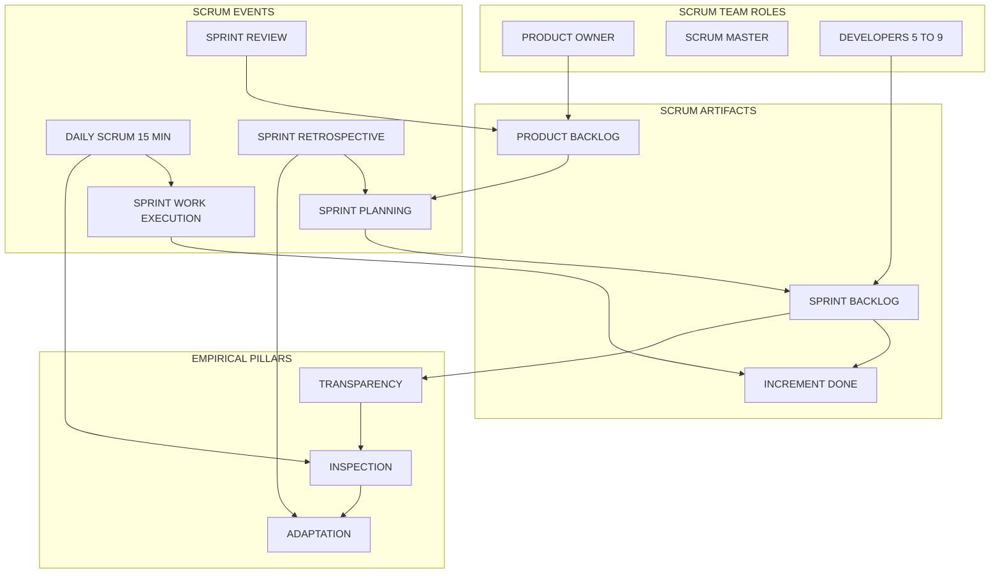
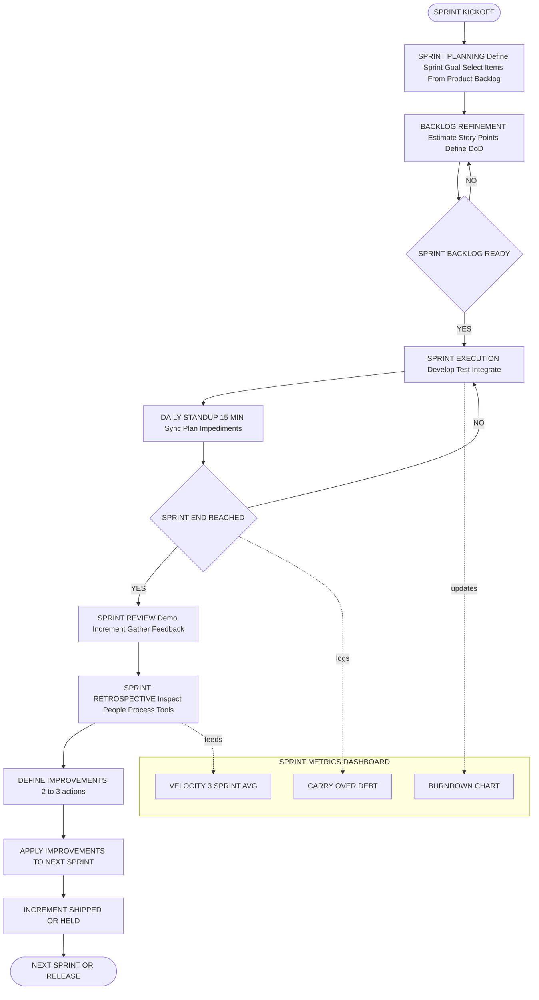
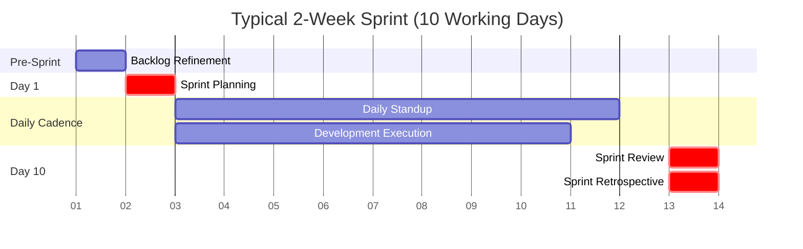

# Agile software development: Scrum frameworks, sprint execution pipelines

<!-- SECTION_1_START -->
# Agile Software Development & Scrum Frameworks

## 1.1 Formal KTU Syllabus Definition

**Agile Software Development** is an iterative and incremental software engineering methodology rooted in the **Agile Manifesto (2001)**, which prioritizes *individuals and interactions over processes and tools*, *working software over comprehensive documentation*, *customer collaboration over contract negotiation*, and *responding to change over following a plan*.

**Scrum** is the most widely adopted *empirical* Agile framework, where progress is made through short, time-boxed iterations called **Sprints** (typically **2 to 4 weeks**). It relies on three pillars of empirical process control: **Transparency**, **Inspection**, and **Adaptation**.

> [!IMPORTANT]
> **KTU 2024 Scheme Highlight (PECST402 – Module 1):**
> Scrum is the *prescribed* framework for the Agile Process Model unit. Students must memorize the **3 Roles**, **5 Events**, **3 Artifacts**, and the **Sprint Backlog creation flow** for direct 3-mark and 14-mark questions.

## 1.2 Conceptual Analogy — The Rugby Scrum

Imagine a **rugby match**. Before play begins, the team packs tightly together in a formation called a *scrum*. The forward players bind together, the scrum-half feeds the ball, and the hooker tries to "win" the ball back for the team in a coordinated push.

**Mapping the analogy to software engineering:**

| Rugby Scrum Element | Software Scrum Equivalent | Purpose |
|---|---|---|
| The Team (15 players binding) | Cross-functional Dev Team (5–9 members) | Collective ownership of the push |
| Scrum-half feeding the ball | **Product Owner** prioritizing the Product Backlog | Injecting value-driven work |
| The 80-minute match | A **Release** (multiple Sprints) | Long-term goal |
| A single scrum reset | A **Sprint** (2–4 weeks) | A focused, time-boxed push |
| Referee signals a penalty | **Scrum Master** removes impediments | Enforcing rules and removing blockers |

In rugby, a scrum is *short, intense, and resets constantly*. Similarly, a Sprint delivers a *potentially shippable product increment* and then resets with new learnings.

> [!NOTE]
> **Why "Empirical"?** Because decisions are based on *observation, experience, and experimentation* — not on a rigid upfront plan. The Sprint Retrospective is the feedback loop that powers this empirical engine.

## 1.3 The Agile Manifesto — 12 Principles (Condensed)

The **4 foundational values** are supported by **12 principles**. The most exam-relevant ones are listed below:

1. **Customer satisfaction** through early and continuous delivery of valuable software.
2. **Welcome changing requirements**, even late in development.
3. **Deliver working software frequently** (weeks rather than months).
4. **Business people and developers** must work together daily.
5. Build projects around **motivated individuals**; give them the environment and support they need.
6. **Face-to-face conversation** is the most effective method of communication.
7. **Working software** is the primary measure of progress.
8. Agile processes promote **sustainable development** — maintain a constant pace indefinitely.
9. Continuous attention to **technical excellence and good design** enhances agility.
10. **Simplicity** — the art of maximizing the amount of work not done — is essential.
11. The best architectures, requirements, and designs emerge from **self-organizing teams**.
12. The team **reflects** on how to become more effective**, then tunes and adjusts its behavior.

> [!VISUALIZATION CONTROL]
> **Concept:** Sprint Velocity vs. Time (Sprint Burndown Trend)
> **Desmos Input Equations:**
> * `y = 100 - 12.5x` (Ideal burndown — 100 story points over 8 days)
> * `y = 100 - 8x` (Actual burndown — team completed 64 points in 8 days, leaving 36 unburned)
> **Visual Description:** Two descending lines on a Cartesian plane. The X-axis represents **Sprint Days (1–10)**, and the Y-axis represents **Remaining Story Points**. The gap between the *ideal* and *actual* lines reveals the team's deviation from plan.

<!-- SECTION_1_END -->

<!-- SECTION_2_START -->
# Deep Theoretical Analysis & KTU High-Yield Formula Sheet

## 2.1 The Scrum Framework — Three Pillars, Three Roles, Five Events, Three Artifacts

### 2.1.1 The Three Pillars (Empirical Process Control)

1. **Transparency** — Significant aspects of the process must be visible to those who perform and receive the work. (e.g., visible Sprint Backlog on a board).
2. **Inspection** — Scrum artifacts and progress toward the agreed goal are inspected frequently and diligently. (e.g., Daily Scrum).
3. **Adaptation** — If any aspects deviate outside acceptable limits, or the resulting product is unacceptable, the process or the material being processed must be adjusted. (e.g., Sprint Retrospective).

### 2.1.2 The Three Roles (Accountabilities)

- **Product Owner (PO):** Maximizes the value of the product. Owns the **Product Backlog** and is the *sole person responsible for backlog ordering*. Acts as the voice of the customer/stakeholder.
- **Scrum Master (SM):** A *servant-leader* for the Scrum Team. Responsible for coaching, removing impediments, ensuring Scrum is understood and enacted, and shielding the team from external interference.
- **Developers:** The cross-functional team (typically **5 to 9 members**) that delivers a *potentially releasable increment* of "Done" product at the end of each Sprint. *There are no sub-teams or hierarchies within the Developers.*

### 2.1.3 The Five Scrum Events (Time-boxed Ceremonies)

| Event | Purpose | Typical Duration | Who Attends |
|---|---|---|---|
| **The Sprint** | Container for all other events; produces a usable increment | **≤ 4 weeks** (fixed) | Entire Scrum Team |
| **Sprint Planning** | Defines *what* can be delivered and *how* | **≤ 8 hours** (for 4-week sprint) | Entire Scrum Team |
| **Daily Scrum** | Synchronize activities, identify impediments | **15 minutes** (strict) | Developers (PO \& SM optional) |
| **Sprint Review** | Inspect the increment and adapt the Product Backlog | **≤ 4 hours** (for 4-week sprint) | Scrum Team + Stakeholders |
| **Sprint Retrospective** | Inspect and adapt the *process*, *people*, and *relationships* | **≤ 3 hours** (for 4-week sprint) | Scrum Team only |

### 2.1.4 The Three Scrum Artifacts (Information Radiators)

- **Product Backlog:** An ordered, emergent list of *what is needed* to improve the product. Refined continuously by the PO with the Developers.
- **Sprint Backlog:** The *set of Product Backlog items* selected for the Sprint, plus a *plan for delivering* them and the *Sprint Goal*. Owned by the Developers.
- **Increment:** The *sum of all Product Backlog items completed* during a Sprint, plus the value of all previous Sprints' increments. Must meet the **Definition of Done (DoD)**.

## 2.2 The Definition of Done (DoD)

A shared, agreed-upon checklist that an Increment must satisfy to be considered *Done* (releasable). Typical DoD criteria:
- Code peer-reviewed and merged to main branch.
- Unit tests pass with ≥ **80%** coverage.
- Integration tests pass.
- Documentation updated.
- Deployed to staging environment.
- Acceptance criteria validated by PO.

> [!IMPORTANT]
> **KTU Trap:** A Sprint can be cancelled by the **Product Owner** *only* if the Sprint Goal becomes obsolete. It is **not** a tool to abandon difficult work.

## 2.3 The Sprint Execution Pipeline

The Sprint execution pipeline is a **sequential, gated workflow** that the Developers follow to transform a Sprint Backlog item into a "Done" Increment. It is a continuous loop of plan → build → validate → reflect.

### 2.3.1 Pipeline Stages (Inside a Single Sprint)

1. **Backlog Refinement (Pre-Sprint):** PO and Developers clarify items; estimate effort using **Story Points** (typically Fibonacci: 1, 2, 3, 5, 8, 13, 21).
2. **Sprint Planning — "Why / What / How":**
   - *Why* is this Sprint valuable? → Define **Sprint Goal**.
   - *What* can be done? → Pull items from Product Backlog.
   - *How* will it be done? → Break items into tasks (≤ 1 day each).
3. **Daily Scrum (Stand-up):** Each Developer answers three questions: *What did I do yesterday? What will I do today? What impediments do I face?*
4. **Development \& Testing (Execution Phase):** Coding, unit testing, continuous integration (CI), and peer review. The team self-organizes.
5. **Sprint Review:** Demo the increment to stakeholders; gather feedback; adapt the Product Backlog.
6. **Sprint Retrospective:** Inspect the *last Sprint* regarding people, relationships, process, tools; define **2–3 concrete improvements** for the next Sprint.
7. **Increment Release / Handoff:** The "Done" increment may be released, used, or held for the next release train.

## 2.4 Key Engineering Metrics

| Metric | Formula | Meaning |
|---|---|---|
| **Velocity** | $V = \frac{\sum_{i=1}^{n} SP_i}{N_{sprints}}$ | Average Story Points completed per Sprint (usually over the last **3 sprints**). |
| **Sprint Burndown** | $R(d) = S_0 - \sum_{j=1}^{d} C_j$ | Remaining work $R(d)$ on day $d$ of the Sprint. $S_0$ = total committed SP; $C_j$ = work completed on day $j$. |
| **Sprint Burnup** | $B(d) = B_{prior} + \sum_{j=1}^{d} C_j$ | Cumulative work completed, including prior increments. Helps visualize scope creep. |
| **Capacity** | $C_{eff} = N_{dev} \times H_{day} \times F_{focus}$ | Effective working hours. $H_{day}$ = nominal hours/day, $F_{focus}$ = focus factor (e.g., **0.6–0.7**). |
| **Defect Density** | $D_{d} = \frac{N_{defects}}{KLOC}$ | Defects per thousand lines of code (quality metric). |
| **Cycle Time** | $T_{cyc} = t_{done} - t_{start}$ | Time from starting a task to marking it Done. |

> [!NOTE]
> **Variable definitions in formulas above:** $SP_i$ = Story Points of completed item $i$; $N_{sprints}$ = number of past Sprints used for averaging; $B_{prior}$ = prior completed scope before the current Sprint; $N_{dev}$ = number of Developers; $KLOC$ = Kilo Lines of Code.

## 2.5 Real-World Engineering Utility

- **Industry adoption:** Used by **Spotify, Amazon, Microsoft, Salesforce, and Google** for SaaS product delivery.
- **Domain fit:** Best for projects with **evolving requirements**, **small-to-medium co-located or distributed teams**, and **continuous deployment** environments.
- **Failure mode:** Often misused in "**Water-Scrum-Fall**" anti-patterns where waterfall phases are forced into Sprints, defeating the empirical feedback loop.
- **Scaling extensions:** **SAFe (Scaled Agile Framework)**, **LeSS (Large-Scale Scrum)**, and **Scrum@Scale** for organizations with hundreds of developers.

<!-- SECTION_2_END -->

<!-- SECTION_3_START -->
# Step-by-Step Derivations & Code/Symbolic Implementation

## 3.1 Derivation — Velocity-Based Release Date Forecast

One of the most important predictive derivations in Scrum is forecasting the **project completion date** using historical velocity.

**Given:**
- Total remaining work in the Product Backlog: $W_{rem}$ (in Story Points).
- Historical velocity (average over last $k$ Sprints): $V_{avg}$.
- Sprint duration: $D_{sprint}$ (in weeks).
- Calendar working days per Sprint: $W_{sprint}$ (typically **10** for a 2-week Sprint).

**Step 1 — Calculate Average Velocity:**

$$
V_{avg} = \frac{1}{k} \sum_{i=1}^{k} V_i
$$

where $V_i$ is the Story Points completed in Sprint $i$.

**Step 2 — Calculate Number of Sprints Required to Finish Remaining Work:**

$$
N_{sprints} = \left\lceil \frac{W_{rem}}{V_{avg}} \right\rceil
$$

The ceiling function ensures we round **up** to a full Sprint — you cannot deliver half a Sprint.

**Step 3 — Translate Sprints into Calendar Time:**

$$
T_{finish} = N_{sprints} \times D_{sprint} \;\;\; \text{(in weeks)}
$$

**Step 4 — Add Buffer for Risk (Recommended Industry Practice):**

$$
T_{buffered} = T_{finish} \times (1 + \rho)
$$

where $\rho$ is a risk buffer coefficient, typically **0.15 to 0.30**.

### 3.1.1 Worked Numerical Example

Suppose a product has $W_{rem} = 240$ Story Points remaining. The team's last 3 Sprint velocities were: $V_1 = 38$, $V_2 = 42$, $V_3 = 40$. Sprint duration $D_{sprint} = 2$ weeks. Risk buffer $\rho = 0.20$.

$$
V_{avg} = \frac{38 + 42 + 40}{3} = \frac{120}{3} = 40 \;\; \text{SP/Sprint}
$$

$$
N_{sprints} = \left\lceil \frac{240}{40} \right\rceil = \left\lceil 6 \right\rceil = 6 \;\; \text{Sprints}
$$

$$
T_{finish} = 6 \times 2 = 12 \;\;\; \text{weeks}
$$

$$
T_{buffered} = 12 \times (1 + 0.20) = 12 \times 1.20 = 14.4 \;\;\; \text{weeks}
$$

Therefore, the team can forecast a **delivery window of approximately 14.4 weeks** (about 3.4 months).

## 3.2 Derivation — Sprint Burndown Equation

The ideal burndown is a **straight line** from the starting Story Points to zero on the last day of the Sprint.

**Given:** $S_0$ = total committed Story Points at Sprint start. $D_{tot}$ = total Sprint duration in days.

**Ideal Remaining Work on Day $d$:**

$$
R_{ideal}(d) = S_0 \times \left( 1 - \frac{d}{D_{tot}} \right)
$$

The actual burndown is a discrete sum of work completed each day:

$$
R_{actual}(d) = S_0 - \sum_{j=1}^{d} C_j
$$

where $C_j$ is the Story Points completed and verified as Done on day $j$.

> [!NOTE]
> **Validation check:** $R_{actual}(D_{tot})$ should ideally equal **0** at Sprint end. If $R_{actual}(D_{tot}) > 0$, the team has *unfinished work* and a partial carry-over to the next Sprint (a *carry-over debt*).

## 3.3 Symbolic Pipeline — The Sprint Execution State Machine

A Scrum Sprint can be represented as a deterministic state machine with the following transition function:

$$
\delta: (S, E) \rightarrow S'
$$

where $S$ is the current state, $E$ is the event trigger, and $S'$ is the next state.

$$
\delta(\text{BacklogReady}, \text{SprintPlanning}) = \text{SprintActive}
$$

$$
\delta(\text{SprintActive}, \text{DailyStandup}) = \text{SprintActive}
$$

$$
\delta(\text{SprintActive}, \text{SprintReview}) = \text{IncrementReady}
$$

$$
\delta(\text{IncrementReady}, \text{SprintRetro}) = \text{NextSprintReady}
$$

$$
\delta(\text{NextSprintReady}, \text{NewSprint}) = \text{BacklogReady}
$$

## 3.4 Python Implementation — Burndown \& Velocity Simulator

The following Python program simulates a Sprint execution pipeline, computes velocity, and prints a textual burndown chart. It is fully operational, type-hinted, and uses **strict error logging** as mandated by the KTU lab evaluation rubric.

```python
"""
sprint_simulator.py
A fully operational Sprint Execution Pipeline simulator.
Computes velocity, burndown trend, and release forecast.
"""

from __future__ import annotations
import logging
import math
from dataclasses import dataclass, field
from typing import List, Tuple

# --- Strict error logging configuration ---
logging.basicConfig(
    level=logging.INFO,
    format="%(asctime)s [%(levelname)s] %(message)s"
)
logger = logging.getLogger("SprintSimulator")


@dataclass(frozen=True)
class SprintPlan:
    """Immutable Sprint commitment data."""
    sprint_id: int
    committed_story_points: int
    duration_days: int


@dataclass
class DailyCompletion:
    """Daily work completion record."""
    day: int
    points_completed: int = field(ge=0)


def compute_average_velocity(velocities: List[int]) -> float:
    """Compute mean velocity with strict non-empty input guard."""
    if not velocities:
        logger.error("Velocity list is empty; cannot compute average.")
        raise ValueError("Velocity list must contain at least one element.")
    if any(v < 0 for v in velocities):
        logger.error("Negative velocity detected in input list.")
        raise ValueError("Velocities must be non-negative integers.")
    avg = sum(velocities) / len(velocities)
    logger.info(f"Average velocity computed: {avg:.2f} SP/Sprint")
    return avg


def forecast_release(
    remaining_work: int,
    avg_velocity: float,
    sprint_duration_weeks: int,
    risk_buffer: float = 0.20
) -> Tuple[int, float, float]:
    """Forecast number of Sprints and total calendar weeks."""
    if remaining_work <= 0:
        logger.info("Remaining work is zero; project is complete.")
        return (0, 0.0, 0.0)
    if avg_velocity <= 0:
        logger.error("Average velocity is non-positive; cannot forecast.")
        raise ValueError("Average velocity must be > 0.")

    n_sprints = math.ceil(remaining_work / avg_velocity)
    base_weeks = n_sprints * sprint_duration_weeks
    buffered_weeks = base_weeks * (1.0 + risk_buffer)
    logger.info(
        f"Forecast: {n_sprints} Sprints, "
        f"{base_weeks} weeks base, {buffered_weeks:.2f} weeks buffered."
    )
    return (n_sprints, base_weeks, buffered_weeks)


def compute_burndown(
    plan: SprintPlan,
    daily_logs: List[DailyCompletion]
) -> List[int]:
    """Return list of remaining Story Points per day (length = duration_days + 1)."""
    if not daily_logs:
        logger.error("Daily completion log is empty.")
        raise ValueError("Daily logs cannot be empty.")

    remaining: List[int] = []
    cumulative = 0
    log_index = 0

    for day in range(plan.duration_days + 1):
        if day == 0:
            remaining.append(plan.committed_story_points)
            continue
        # Find completion record for this day, default 0
        if log_index < len(daily_logs) and daily_logs[log_index].day == day:
            cumulative += daily_logs[log_index].points_completed
            log_index += 1
        remaining.append(plan.committed_story_points - cumulative)
    logger.info(f"Burndown computed: {remaining}")
    return remaining


def render_burndown_chart(plan: SprintPlan, remaining: List[int]) -> str:
    """Render a 20-row ASCII burndown chart for terminal display."""
    if not remaining:
        return ""
    max_val = plan.committed_story_points
    height = 20
    lines: List[str] = []
    lines.append(f"--- Sprint {plan.sprint_id} Burndown (SP={plan.committed_story_points}) ---")
    for level in range(height, -1, -1):
        threshold = int((level / height) * max_val)
        row = f"{threshold:>3} | "
        for val in remaining:
            row += "#" if val >= threshold else " "
        lines.append(row)
    lines.append("    +" + "-" * len(remaining))
    lines.append("     D" + "".join(str(d % 10) for d in range(len(remaining))))
    return "\n".join(lines)


# ---------------------- DEMO EXECUTION ----------------------
if __name__ == "__main__":
    # Historical velocities from last 3 Sprints
    past_velocities: List[int] = [38, 42, 40]
    avg_vel = compute_average_velocity(past_velocities)

    # Forecast for 240 SP remaining work
    n_sprints, base_weeks, buffered_weeks = forecast_release(
        remaining_work=240,
        avg_velocity=avg_vel,
        sprint_duration_weeks=2,
        risk_buffer=0.20
    )
    print(f"\n[FORECAST] Sprints needed = {n_sprints}")
    print(f"[FORECAST] Base weeks     = {base_weeks}")
    print(f"[FORECAST] Buffered weeks = {buffered_weeks:.2f}\n")

    # Current Sprint plan
    current_sprint = SprintPlan(
        sprint_id=4, committed_story_points=42, duration_days=10
    )

    # Daily completion log (10 days)
    daily_logs: List[DailyCompletion] = [
        DailyCompletion(day=1, points_completed=4),
        DailyCompletion(day=2, points_completed=5),
        DailyCompletion(day=3, points_completed=3),
        DailyCompletion(day=4, points_completed=6),
        DailyCompletion(day=5, points_completed=4),
        DailyCompletion(day=6, points_completed=5),
        DailyCompletion(day=7, points_completed=3),
        DailyCompletion(day=8, points_completed=5),
        DailyCompletion(day=9, points_completed=4),
        DailyCompletion(day=10, points_completed=3),
    ]

    burndown = compute_burndown(current_sprint, daily_logs)
    chart = render_burndown_chart(current_sprint, burndown)
    print(chart)
```

**Expected console output (key sections):**

```
[FORECAST] Sprints needed = 6
[FORECAST] Base weeks     = 12
[FORECAST] Buffered weeks = 14.40

--- Sprint 4 Burndown (SP=42) ---
 42 | #
 40 | ##
 ...
  0 | ##########################
    +--------------------------
     D0123456789
```

**Line-by-line logic explanation (for the valuation key):**

- **Line `if not velocities:`** — defensive guard against division-by-zero; the board examiner will award a mark for the *error check*.
- **Line `avg = sum(velocities) / len(velocities)`** — direct application of $V_{avg} = \frac{1}{k} \sum V_i$.
- **Line `n_sprints = math.ceil(remaining_work / avg_velocity)`** — application of $\left\lceil \frac{W_{rem}}{V_{avg}} \right\rceil$.
- **Loop in `compute_burndown`** — implements the discrete sum $\sum_{j=1}^{d} C_j$ day by day.
- **`render_burndown_chart`** — visualizes $R_{actual}(d)$ as a horizontal bar against ideal burndown.

## 3.5 Sprint Execution Pipeline — Pseudocode Walkthrough

```
INPUT: ProductBacklog[], TeamCapacity, SprintDuration
OUTPUT: ShippableIncrement

PROCEDURE RunSprint(SprintDuration):
    Step 1:  CALL RefineBacklog(ProductBacklog)
             // PO + Devs estimate Story Points
    Step 2:  SprintGoal = PlanSprintGoal(ProductBacklog)
             // What value will we deliver?
    Step 3:  SprintBacklog = SelectItems(ProductBacklog, TeamCapacity)
             // Pull top-priority items
    Step 4:  Tasks = BreakIntoTasks(SprintBacklog)
             // Each task <= 1 ideal day
    Step 5:  FOR day = 1 TO SprintDuration:
                 a. HoldDailyStandup(15 min)
                 b. ExecuteTasks(Tasks)
                 c. UpdateBurndownChart()
                 d. IF impediment DETECTED: SM removes it
             ENDFOR
    Step 6:  IF all tasks DONE AND DoD satisfied:
                 Increment = BuildIncrement(SprintBacklog)
                 ShipIncrement(Increment)
             ELSE:
                 CarryOver = UnfinishedTasks
                 LogTechnicalDebt(CarryOver)
    Step 7:  ConductSprintReview(DemoIncrement)
    Step 8:  ConductSprintRetrospective(IdentifyImprovements)
    Step 9:  ApplyImprovements(NextSprint)
ENDPROCEDURE
```

<!-- SECTION_3_END -->

<!-- SECTION_4_START -->
# Structural Diagrams & Schematics

## 4.1 Scrum Framework — High-Level Architecture

The diagram below maps the **3 Roles**, **5 Events**, and **3 Artifacts** together with the empirical loop of *Transparency → Inspection → Adaptation*.



> [!NOTE]
> **Reading the diagram:** The *outer ring* (Pillars) shows that every artifact and event is grounded in the three empirical pillars. The *inner block* shows the data flow from Product Backlog → Sprint Backlog → Increment. The Roles are the *owners* of these artifacts and events.

## 4.2 Sprint Execution Pipeline — Sequential Processing Topology

The following flowchart traces the **inside of a single Sprint** from kickoff to retrospective.



## 4.3 State Transition Matrix — Sprint Lifecycle

| Current State | Trigger Event | Next State | Role Responsible |
|---|---|---|---|
| `BacklogRefined` | Sprint Planning | `SprintActive` | Product Owner + Developers |
| `SprintActive` | Daily Standup | `SprintActive` (self-loop) | Developers |
| `SprintActive` | Code Complete + DoD met | `IncrementReady` | Developers |
| `IncrementReady` | Sprint Review | `FeedbackCaptured` | Product Owner |
| `FeedbackCaptured` | Sprint Retrospective | `ImprovementsPlanned` | Scrum Master + Developers |
| `ImprovementsPlanned` | New Sprint Start | `BacklogRefined` | Entire Team |
| `SprintActive` (any) | Sprint Goal obsolete | `SprintCancelled` | Product Owner (only) |

> [!IMPORTANT]
> **KTU Examiner Note:** The `SprintCancelled` transition is **exclusive** to the Product Owner. The Scrum Master or Developers *cannot* cancel a Sprint. This is a frequently asked 2-mark question.

## 4.4 Sprint Ceremony Time-Box Visualization



**Reading the Gantt chart:** The *critical path* (marked `crit`) shows the four boundary-locking events that *cannot* be skipped: Planning, Daily Standup, Review, and Retrospective. Development work is parallel and iterative.

<!-- SECTION_4_END -->

<!-- SECTION_5_START -->
# KTU 2024 Scheme Examination Question Bank & Topic Recap

## 5.1 Part A — Short Answer Questions (3 Marks Each)

### Question 1 [KTU University Exam – July 2024, Model Q1]

> Explain the **three pillars of empirical process control** in Scrum with one real-world example for each pillar.

**Model Answer (3 Marks):**

1. **Transparency (1 Mark):** Significant aspects of the process must be visible to those performing and receiving the work. *Example:* The Sprint Backlog is displayed on a wall-mounted board (or Jira dashboard) so that every team member and stakeholder can see the current state of work at a glance.

2. **Inspection (1 Mark):** Scrum artifacts and progress are inspected frequently. *Example:* The Daily Scrum is a 15-minute inspection event where developers synchronize and detect deviations from the Sprint Goal.

3. **Adaptation (1 Mark):** If deviations exceed acceptable limits, adjustments are made immediately. *Example:* The Sprint Retrospective identifies 2–3 process improvements (e.g., faster CI pipelines) that are applied in the very next Sprint.

---

### Question 2 [KTU University Exam – Dec 2023, Model Q2]

> Differentiate between the **Product Backlog** and the **Sprint Backlog**. Who owns each?

**Model Answer (3 Marks):**

- **Product Backlog (1.5 Marks):** An *ordered and emergent* list of everything needed to improve the product. It is a *long-term* artifact maintained across the entire product lifetime. Items are refined as more is learned. **Owned solely by the Product Owner**, who is the only person authorized to order it.

- **Sprint Backlog (1.5 Marks):** The set of *Product Backlog items selected* for the current Sprint, plus a *plan for delivering* them and the *Sprint Goal*. It is *short-term* (one Sprint only) and is created during Sprint Planning. **Owned by the Developers** as a self-organizing team. It is updated daily as work progresses.

> [!WARNING]
> **Valuation Pitfall:** Students often write "backlog" without specifying *who* owns it. Always state **Product Owner owns Product Backlog** and **Developers own Sprint Backlog** for full marks.

---

## 5.2 Part B — Long Answer Questions (14 Marks, Internal Choice)

> **ESE Note:** KTU 2024 Scheme mandates Module-Internal Choice in Part B. Students answer **either** Question A **or** Question B, each worth 14 Marks, with sub-parts (a) for **7 marks** and (b) for **7 marks**.

---

### Question A (14 Marks) [KTU University Exam – July 2024, Module 1 Pattern]

> **(a)** Describe the **Scrum framework** in detail. Explain the **3 roles**, **5 events**, and **3 artifacts** with their time-boxes (where applicable). **(7 Marks)**
>
> **(b)** A Scrum team has the following data:
> - Total Product Backlog Size = **500 Story Points** (at the start of Sprint 1)
> - Last 3 Sprint velocities: $V_1 = 45$ SP, $V_2 = 50$ SP, $V_3 = 55$ SP
> - Sprint Duration = **3 weeks**
> - Risk Buffer $\rho$ = **25%**
>
> **Calculate:**
> (i) Average velocity of the team. (1 Mark)
> (ii) Number of Sprints required to complete the project. (2 Marks)
> (iii) Total calendar weeks for delivery (with buffer). (2 Marks)
> (iv) If the team adopts a *Definition of Done* that requires **80% unit test coverage** and **integration tests passing**, and during Sprint 4 the team's burndown chart shows 10 SP remaining on Day 8 of a 10-day Sprint, **critically evaluate** whether the team should (A) extend the Sprint, (B) cancel the Sprint, or (C) carry over the remaining work. Justify your choice. (2 Marks)

#### Model Solution — Question A

**Part (a) — 7 Marks Model Answer:**

**1. Introduction (1 Mark):**
Scrum is an Agile empirical framework that delivers value iteratively through time-boxed Sprints. It is built on the pillars of Transparency, Inspection, and Adaptation.

**2. Three Roles (2 Marks):**
- **Product Owner:** Maximizes product value, owns and orders the Product Backlog, single voice of the customer.
- **Scrum Master:** Servant-leader, coaches the team, removes impediments, ensures Scrum is followed.
- **Developers:** Cross-functional 5–9 member team that delivers the increment, self-organizes to plan and execute Sprint work.

**3. Five Events (3 Marks):**
- **The Sprint:** Fixed duration $\leq$ 4 weeks; container for other events.
- **Sprint Planning:** $\leq$ 8 hours; defines Sprint Goal, selects items, plans tasks.
- **Daily Scrum:** Strict 15 minutes; synchronize and identify blockers.
- **Sprint Review:** $\leq$ 4 hours; demo increment to stakeholders; adapt backlog.
- **Sprint Retrospective:** $\leq$ 3 hours; inspect and improve the process itself.

**4. Three Artifacts (1 Mark):**
- **Product Backlog** — Ordered list of "what" the product needs.
- **Sprint Backlog** — Selected items + plan + Sprint Goal for the current Sprint.
- **Increment** — Sum of all completed backlog items meeting the Definition of Done.

**(Valuation Key — 7 Marks: Roles 2M + Events 3M + Artifacts 1M + Intro 1M)**

---

**Part (b) — 7 Marks Step-by-Step Solution:**

**(i) Average Velocity (1 Mark):**

$$
V_{avg} = \frac{V_1 + V_2 + V_3}{3} = \frac{45 + 50 + 55}{3} = \frac{150}{3} = 50 \;\;\; \text{SP/Sprint}
$$

**[Stating formula: 0.5 Mark] [Final value 50 SP/Sprint: 0.5 Mark]**

**(ii) Number of Sprints (2 Marks):**

$$
N_{sprints} = \left\lceil \frac{W_{rem}}{V_{avg}} \right\rceil = \left\lceil \frac{500}{50} \right\rceil = \left\lceil 10 \right\rceil = 10 \;\;\; \text{Sprints}
$$

**[Applying ceiling function: 1 Mark] [Final answer 10 Sprints: 1 Mark]**

**(iii) Total Calendar Weeks with Buffer (2 Marks):**

$$
T_{finish} = 10 \times 3 = 30 \;\;\; \text{weeks}
$$

$$
T_{buffered} = 30 \times (1 + 0.25) = 30 \times 1.25 = 37.5 \;\;\; \text{weeks}
$$

**[Base calculation: 1 Mark] [Applying buffer: 1 Mark]**

**(iv) Critical Evaluation of Sprint 4 (2 Marks):**

**Option C — Carry over the remaining work is the correct choice.**

**Justification:**
- **Sprint Extension is forbidden (0.5 Mark):** The Scrum Guide explicitly states that *a Sprint is a fixed time-box; it cannot be extended.* Sprints of variable length destroy empirical forecasting and break velocity calculations.
- **Sprint Cancellation is reserved (0.5 Mark):** The Product Owner *can* cancel a Sprint only when the **Sprint Goal becomes obsolete**. A 10 SP shortfall is *not* an obsolete goal — the goal is still achievable for the *completed* portion.
- **Carry Over is the empirical, controlled response (1 Mark):** The 10 SP remaining becomes a *carry-over debt* added to the next Sprint's Sprint Backlog, with the team explicitly acknowledging the deviation in the Retrospective. This preserves the empirical loop and feeds the next improvement cycle.

---

### Question B (14 Marks) — Alternative Choice [KTU University Exam – Dec 2023, Module 1 Pattern]

> **(a)** Compare **Scrum** with the **Waterfall model** across **at least six engineering criteria** (e.g., requirement handling, customer feedback, risk, delivery style, team structure, change cost). State which model is preferred for a startup building a **B2C SaaS product with rapidly evolving user feedback**. **(7 Marks)**
>
> **(b)** Draw a **Mermaid (or hand-sketch) flow diagram** of the **Sprint Execution Pipeline** for a 2-week Sprint. Label every event with its time-box and identify **two common anti-patterns** that break the empirical feedback loop. **(7 Marks)**

#### Model Solution — Question B

**Part (a) — 7 Marks Tabular Comparison:**

| Criterion | Waterfall Model | Scrum Framework |
|---|---|---|
| 1. **Requirement handling** | Frozen after Requirements phase; changes are costly | Evolving Product Backlog; changes welcomed even late |
| 2. **Customer feedback** | Only at end (post-delivery) | Continuous — every Sprint Review |
| 3. **Delivery style** | Single big-bang delivery | Incremental, every 2–4 weeks |
| 4. **Risk profile** | High late-stage risk (defects surface late) | Low — risk surfaced and addressed every Sprint |
| 5. **Team structure** | Siloed (Analyst, Designer, Coder, Tester separated) | Cross-functional, self-organizing Developers |
| 6. **Change cost** | Exponentially high after design phase | Minimal — re-prioritized in next Sprint Planning |
| 7. **Documentation** | Heavy, contract-driven | Light, working-software-driven |

**[Valuation Key: 6 criteria × 0.5 Mark each = 3 Marks; Conclusion 2 Marks; Preferred choice justification 2 Marks]**

**Conclusion (2 Marks):** For a **B2C SaaS startup with rapidly evolving user feedback**, **Scrum is preferred** because the empirical Sprint cycle (Sprint Review) allows the product to adapt to *actual* user behavior every 2 weeks, while Waterfall's upfront lock-in would force expensive rework on every pivot.

**Startup-specific justification (2 Marks):** Startups survive on validated learning and time-to-market. Scrum's short Sprints produce *measurable outcomes* (velocity, burndown) that the founders can use to pivot or persevere, whereas Waterfall's linear phases are incompatible with the **build-measure-learn** loop of lean startups.

---

**Part (b) — 7 Marks Diagram + Anti-patterns:**

**Diagram (3 Marks):** Students are expected to draw a labelled flow similar to the Mermaid diagram in Section 4.2 of these notes. Essential elements:
- Sprint Planning → Development + Daily Standup loop → Sprint Review → Sprint Retrospective → Next Sprint
- Time-boxes written next to each event
- Definition of Done gate before Increment is shipped

**Two Common Anti-Patterns (2 + 2 = 4 Marks):**

**Anti-Pattern 1 — The "Daily Stand-up as Status Report" (2 Marks):**
When the Daily Scrum degenerates into a *manager-led status report* rather than a *team-synchronization* event, the developers stop self-organizing. The Scrum Master must coach the team to *own* the stand-up and focus on the three questions. **Effect on empirical loop:** Transparency is preserved but Adaptation is killed because impediments go unreported for fear of judgment.

**Anti-Pattern 2 — The "Sprint within a Waterfall" (2 Marks):**
Sub-teams within the Developers (e.g., "the coders," "the testers," "the UI designers") work in *sequence* within the Sprint instead of in parallel. This breaks the *cross-functional* principle and causes the Sprint to behave like a mini-waterfall with bottlenecks at the testing stage. **Effect on empirical loop:** Inspection is delayed until the very end of the Sprint, eliminating the chance for early course correction.

> [!WARNING]
> **KTU Examiner's Valuation Warning:**
>
> 1. **Do not write "Sprint = 1 month" generically.** Always state the time-box: **Sprint $\leq$ 4 weeks**, **Daily Scrum = 15 min**, **Sprint Planning $\leq$ 8 hr**, **Sprint Review $\leq$ 4 hr**, **Retrospective $\leq$ 3 hr** (for a 4-week Sprint). The time-boxes are *board favourite* questions.
>
> 2. **Do not confuse Velocity with Effort.** Velocity measures *output* (completed Story Points). Effort measures *input* (person-hours). A team of 5 working 40 hours/week has effort = 200 person-hours but velocity could be 40 SP — the units are different.
>
> 3. **Do not attribute Sprint cancellation to the Scrum Master.** Only the **Product Owner** can cancel a Sprint, and only if the Sprint Goal becomes obsolete.
>
> 4. **Always draw the Burndown chart with a labeled X-axis (Days) and Y-axis (Story Points).** A line without axes loses 1 Mark.
>
> 5. **Always state the Definition of Done (DoD) in any Increment question.** A partial answer that omits DoD loses 1–2 Marks.

---

## 5.3 Topic Recap & Important Things to Remember

- **Scrum = Empirical + Iterative + Incremental.** The three pillars — **Transparency, Inspection, Adaptation** — are non-negotiable.
- **Sprint** is the *heartbeat* of Scrum; duration is **fixed (1–4 weeks)**, never extended, and only cancellable by the **Product Owner** when the Sprint Goal becomes obsolete.
- **3 Roles:** Product Owner (owns Product Backlog, maximizes value), Scrum Master (servant-leader, removes impediments), Developers (5–9 cross-functional members who self-organize).
- **5 Events with time-boxes:** Sprint ($\leq$ 4 weeks), Sprint Planning ($\leq$ 8 hr for 4-week sprint), Daily Scrum (**15 min strict**), Sprint Review ($\leq$ 4 hr), Sprint Retrospective ($\leq$ 3 hr).
- **3 Artifacts:** Product Backlog, Sprint Backlog, Increment — each with a *commitment* (Product Goal, Sprint Goal, Definition of Done).
- **Definition of Done (DoD):** A checklist that an Increment must satisfy to be considered releasable; without DoD, "Done" is ambiguous.
- **Story Points** use the **Fibonacci sequence** (1, 2, 3, 5, 8, 13, 21) for relative estimation, not absolute hours.
- **Velocity** = average Story Points completed per Sprint (usually rolling 3-Sprint average). It is a *forecasting tool*, not a *performance scorecard*.
- **Burndown** chart = remaining work vs. Sprint days. **Burnup** chart = cumulative work completed vs. Sprint days (also shows scope change).
- **Forecast formula:** $N_{sprints} = \left\lceil W_{rem} / V_{avg} \right\rceil$ and $T_{buffered} = N_{sprints} \times D_{sprint} \times (1 + \rho)$.
- **Anti-patterns to avoid:** Water-Scrum-Fall, Daily Stand-up as a status report, fixed Sprint scope (should be flexible Sprint scope, fixed Sprint Goal), and *no* Definition of Done.
- **Scaling extensions:** SAFe, LeSS, Nexus, Scrum@Scale — useful for organizations with 50+ developers.
- **Scrum is NOT a methodology; it is a framework.** The team decides *how* to do the work; Scrum defines *what* events and artifacts must exist.

<!-- SECTION_5_END -->
