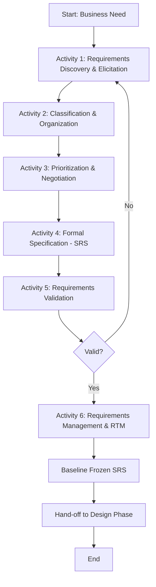
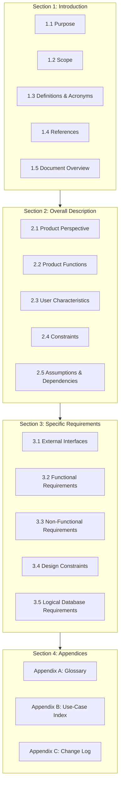
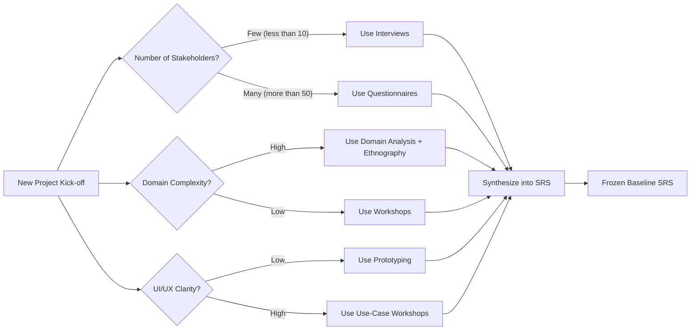
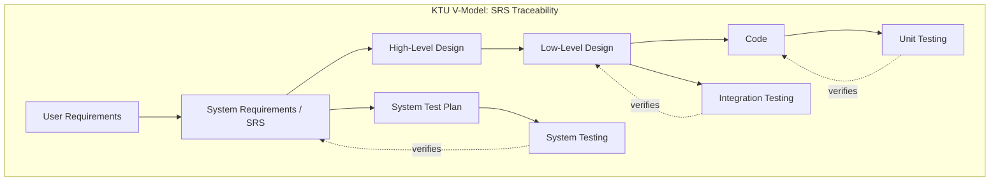

# Requirements engineering: Requirements elicitation, analysis, documentation (SRS framework)

<!-- SECTION_1_START -->
# 1. Core Technical Definition & Intuitive Overview

## 1.1 Requirements Engineering (RE) — The Academic Definition

> [!IMPORTANT]
> **Formal Definition (KTU Syllabus Aligned):**
> **Requirements Engineering** is the systematic, disciplined, and quantified approach to the **description, elicitation, analysis, negotiation, specification, validation, and management of software requirements**. It is the bridge that connects the informal, often ambiguous needs of stakeholders to the formal, testable specifications that drive software design, coding, and verification phases of the Software Development Life Cycle (SDLC).

Within RE, the three pillars mapped to today's KTU Module 1 syllabus are:

| Pillar | Core Activity | Output Artifact |
| :--- | :--- | :--- |
| **Elicitation** | Discovering & harvesting requirements from stakeholders | Raw requirement statements, interview transcripts |
| **Analysis** | Refining, classifying, prioritizing, and resolving conflicts | Structured requirement models (Use Cases, DFDs) |
| **Documentation** | Formalizing the validated requirements into a contractual baseline | **Software Requirements Specification (SRS)** document |

## 1.2 Intuitive Analogy — The "House Blueprint" Metaphor

> [!NOTE]
> **Analogy:** Imagine you ask a builder to construct your dream house. If you just say *"Build me a nice house"*, the builder will either refuse or build something you hate. **Requirements Engineering** is the conversation where you, the architect, the structural engineer, and the electrician sit together and decide:
> - **How many rooms?** *(Functional Requirement)*
> - **How strong must the walls be to survive an earthquake?** *(Non-Functional / Quality Requirement)*
> - **Can we add a swimming pool on the roof?** *(Constraint / Conflict Resolution)*
> - **Everything is then frozen in a signed blueprint.** *(The SRS Document)*
>
> Without this signed blueprint, every later change becomes a *Change Request* (CR) — expensive, risky, and a primary cause of project failure.

## 1.3 Why RE is the Most Critical Phase in SDLC

> [!IMPORTANT]
> **The Cost-of-Change Curve (Boehm, 1981 / KTU High-Yield Concept):**
> A requirement defect fixed during **elicitation** costs **1 unit**. The *exact same defect* fixed after deployment costs between **60 to 100+ units**. This is the central justification for rigorous RE. The **Standish Group CHAOS Report** consistently cites *incomplete or changing requirements* as the #1 reason for project failure.

## 1.4 Key Terminology Quick-Reference

> [!NOTE]
> - **Stakeholder:** Any person, group, or system affected by the software (users, sponsors, regulators, developers).
> - **Functional Requirement (FR):** A specific behavior the system *must exhibit* under specific conditions (e.g., "System shall allow a customer to apply a discount coupon").
> - **Non-Functional Requirement (NFR) / Quality Attribute:** A property or constraint — *how well* the system performs (e.g., **performance**, **security**, **usability**, **reliability**, **portability**).
> - **Domain Requirement:** A requirement derived from the application's business domain (e.g., "Must comply with RBI data-retention policy" for a banking app).
> - **User Requirement:** Abstract, high-level statements written in natural language for stakeholders.
> - **System Requirement:** Detailed, structured, testable statements written for developers.

## 1.5 Visualization Control

> [!VISUALIZATION CONTROL]
> **Concept:** The Boehm Cost-of-Change Exponential Curve
> **GeoGebra / Desmos Input Equations:**
> * `f(x) = 1 * exp(0.45 * x)` where $x$ is the SDLC phase index (0 = Requirements, 5 = Maintenance)
> **Visual Description:** A steep exponential curve starting at $y=1$ during requirements and reaching $y \approx 90$ during post-deployment maintenance, illustrating why late defect correction is catastrophic.

<!-- SECTION_1_END -->

<!-- SECTION_2_START -->
# 2. Deep Theoretical Analysis & KTU High-Yield Formula Sheet

## 2.1 The Seven Sequential Activities of RE (Sommerville's Framework)

The KTU 2024 syllabus implicitly subscribes to Ian Sommerville's canonical **7-Activity RE Model**:

1. **Requirements Discovery (Elicitation):** Interact with stakeholders to collect raw needs → *interviews, scenarios, ethnography, focus groups*.
2. **Requirements Classification & Organization:** Group requirements by theme, subsystem, or stakeholder; differentiate *functional vs non-functional vs domain*.
3. **Requirements Prioritization & Negotiation:** Resolve conflicts (e.g., "fast" vs "secure"); rank using **MoSCoW** (Must/Should/Could/Won't).
4. **Requirements Specification (Documentation):** Produce the formal **SRS Document** using templates like **IEEE 830-1998** or the modern **IEEE 29148:2018** standard.
5. **Requirements Validation:** Check the SRS for *correctness, consistency, completeness, realism,* and *verifiability*.
6. **Requirements Management:** Track changes, maintain **traceability links**, and control versions through **Requirement Traceability Matrix (RTM)**.

> [!NOTE]
> **Mnemonic for 7 Activities:** "D**C**lass **P**riorities **S**pecify **V**alidate **M**anage" → *Discover, Classify, Prioritize, Specify, Validate, Manage* (with sub-steps).

## 2.2 Requirements Elicitation Techniques — The KTU Cheat Sheet

> [!IMPORTANT]
> **No single technique is sufficient. KTU examiners often ask for a *comparative* question on elicitation techniques (CO1 / Understand level, 3-mark or 7-mark).**

| Technique | Strength | Weakness | Best Used When |
| :--- | :--- | :--- | :--- |
| **Interviews** (Closed / Open / Semi-structured) | Direct, rich data | Time-consuming, biased | Few domain experts exist |
| **Questionnaires / Surveys** | Scalable, statistical | Low return rate, shallow | Large, geographically dispersed user base |
| **Observation (Ethnography)** | Reveals tacit, unspoken workflows | Observer-effect, slow | Workflow-heavy domains (healthcare, BPO) |
| **Focus Groups** | Synergistic brainstorming | Dominant personalities skew output | Early-stage brainstorming, UI design |
| **Prototyping** | Tangible, reduces ambiguity | Users confuse prototype with final system | UI/UX-critical apps, unclear requirements |
| **Domain Analysis** | Reuses proven models | Requires deep domain expertise | Building a product line family |
| **Brainstorming** | High volume of ideas | Requires strict facilitation | Generating non-functional / innovative NFRs |
| **Use-Case Workshops** | Bridges user and developer vocabulary | Needs trained facilitator | Object-oriented or agile projects |

## 2.3 Requirements Analysis — Conflict Resolution & Negotiation

> [!NOTE]
> During analysis, conflicts are inevitable. KTU expects knowledge of **conflict types**:
> - **Resource Conflicts:** "We need a 4K camera *and* a 1-year battery life" → physics conflict.
> - **Stakeholder Conflicts:** Sales wants *"easy login (1-click)"*; Security wants *"MFA always"*.
> - **Domain Conflicts:** A bank regulator demands *"immutable audit logs"*, but GDPR demands *"right to be forgotten"*.

**Resolution Strategy:** Negotiate based on **priority (MoSCoW)**, **cost-benefit analysis**, and **risk exposure**.

## 2.4 The SRS Framework — IEEE 830-1998 / IEEE 29148:2018 Structure

> [!IMPORTANT]
> **KTU Exam Hot-Spot:** *"Explain the structure of an SRS as per IEEE 830 standard"* is a guaranteed 7-mark or 14-mark question.

| Section | Clause | Purpose | Content Highlights |
| :--- | :--- | :--- | :--- |
| **1. Introduction** | 1.1 Purpose | Define audience & scope of the SRS | Intended readers (devs, testers, clients) |
| | 1.2 Document Conventions | Formatting, glossary terms | Typographical conventions |
| | 1.3 Scope | Project name, benefits, objectives | **In-scope** vs **out-of-scope** items |
| | 1.4 References | Cite all standards, docs | IEEE 29148, RFCs, regulations |
| | 1.5 Overview | Roadmap of the SRS | Summary of structure |
| **2. Overall Description** | 2.1 Product Perspective | Context in larger system | Interfaces, modes, dependencies |
| | 2.2 Product Functions | High-level capability summary | Block diagram of major features |
| | 2.3 User Classes & Characteristics | Define distinct user groups | Power users, admins, guests |
| | 2.4 Operating Environment | Hardware, OS, network | Platform constraints |
| | 2.5 Design & Implementation Constraints | Tech stack, regulatory | "Must run on Android 8.0+" |
| | 2.6 Assumptions & Dependencies | External assumptions | "User has 3G connectivity" |
| **3. Specific Requirements** | 3.1 External Interfaces | UI, API, hardware | Screen layouts, JSON schemas |
| | 3.2 Functional Requirements | Detailed FRs (numbered) | **FR-001, FR-002, …** |
| | 3.3 Performance Requirements | Speed, throughput, capacity | "Process 1000 TPS" |
| | 3.4 Design Constraints | Standards compliance | ISO 27001 |
| | 3.5 Software System Attributes | **NFRs:** Reliability, Security, Maintainability | Quantified metrics |
| | 3.6 Other Requirements | Database, legal, appendix | Data retention, licensing |
| **Appendices** | A, B, C… | Supporting material | Glossary, Acronyms, Use-Case index |

## 2.5 KTU High-Yield Formula & Property Sheet

> [!NOTE]
> Software Engineering is qualitative, but the following quantitative heuristics are repeatedly asked in KTU exams:

| Concept | Formula / Property | Engineering Significance |
| :--- | :--- | :--- |
| **Cost of Late Defect Fix** | $C_{\text{late}} = C_{\text{req}} \cdot e^{k \cdot \Delta t}$ | Exponential penalty; $k$ is project-specific |
| **Requirement Volatility Index (RVI)** | $RVI = \frac{N_{\text{changed}}}{N_{\text{total}}} \times 100\%$ | Measures requirement instability |
| **Requirement Stability (RS)** | $RS = 1 - RVI$ | Used in **COCOMO II** scale factors |
| **MoSCoW Total** | $\sum \text{Must} + \text{Should} + \text{Could} + \text{Won't} = 100\%$ | Must-have is typically $\le 60\%$ |
| **NFR Coverage** | $Cov_{NFR} = \frac{N_{\text{quantified-NFR}}}{N_{\text{total-NFR}}}$ | Unquantified NFRs are non-verifiable |
| **Traceability Density** | $TD = \frac{N_{\text{links}}}{N_{\text{requirements}}}$ | Should be $\ge 2$ (forward + backward) |
| **EARS Pattern** | *When* <trigger>, the *\<system\>* shall *\<response\>*. | Easy Approach to Requirements Syntax — IEEE 29148 |

## 2.6 Real-World Engineering Utility

> [!NOTE]
> - **In Healthcare (FDA / IEC 62304):** A properly traced SRS is a regulatory submission prerequisite.
> - **In Aerospace (DO-178C):** Every requirement must be *bidirectionally traceable* to a test case; the SRS is the legal safety baseline.
> - **In Agile/Scrum:** The SRS is replaced by the **Product Backlog**, but the *elicitation* and *analysis* activities remain — they are just iterative.
> - **In DevOps/CI-CD:** The SRS feeds acceptance criteria for automated regression suites.

<!-- SECTION_2_END -->

<!-- SECTION_3_START -->
# 3. Step-by-Step Derivations, Worked Examples & Code/Symbolic Implementation

## 3.1 Worked Example 1 — Elicitation Scenario (KTU 14-Mark Pattern)

**Problem Statement:** *A regional bank wants to launch a mobile banking app. The Chief Technology Officer (CTO) states: "We need an app where customers can transfer money, pay bills, and check balances. It must be ultra-secure because we are dealing with money. We want to launch in 6 months."*

**Task:** Apply the **7-Activity RE Framework** and produce:
1. A list of **stakeholders**.
2. A **MoSCoW-prioritized** requirement set.
3. At least **3 quantified NFRs**.
4. A draft **EARS**-formatted functional requirement.

### Step 1 — Stakeholder Identification (1 Mark for completeness)

$$
S = \{ \text{Customer}, \text{CTO}, \text{Compliance Officer}, \text{IT Security}, \text{Bank Teller}, \text{Regulator (RBI)}, \text{Marketing} \}
$$

> Each stakeholder is mapped to a concern: $S_i \rightarrow C_i$ (one-to-many). E.g., $S_{\text{CTO}} \rightarrow \{ \text{time-to-market}, \text{cost} \}$.

### Step 2 — Elicitation via Interview (showing the script)

> [!IMPORTANT]
> **KTU expects you to write sample questions.** Here is a model:

1. *"Can you walk me through the last time a customer used your existing web portal to transfer money?"* (Contextual)
2. *"What is the maximum transfer amount before a manager's approval is required?"* (Quantification)
3. *"What happens if the network drops mid-transaction?"* (Exception path)
4. *"Which regulatory reports must this app auto-generate?"* (Compliance)

### Step 3 — MoSCoW Prioritization (2 Marks)

| Priority | Requirement | Rationale |
| :--- | :--- | :--- |
| **Must Have** | Fund transfer (own accounts) | Core to app purpose |
| **Must Have** | Balance inquiry | Core to app purpose |
| **Should Have** | Bill pay (registered payees) | High value, post-launch OK |
| **Could Have** | QR-code merchant pay | Nice to have, can wait |
| **Won't Have (v1)** | Loan application flow | Out of MVP scope |

### Step 4 — Quantified NFRs (2 Marks)

$$
\begin{aligned}
\text{NFR-1 (Performance)} &: \text{ Transaction confirmation screen must render in } \le 2 \text{ seconds at the 95th percentile.} \\
\text{NFR-2 (Security)} &: \text{ All data in transit must be encrypted using TLS } \ge 1.3. \text{ No storage of plaintext PINs.} \\
\text{NFR-3 (Availability)} &: \text{ System uptime} \ge 99.9\% \text{ measured monthly (approx. } 43 \text{ mins downtime / month).} \\
\text{NFR-4 (Compliance)} &: \text{ Logs must be retained for } 5 \text{ years as per RBI Master Direction 2018.}
\end{aligned}
$$

### Step 5 — EARS-Formatted Functional Requirement (1 Mark)

$$
\textbf{FR-007 (EARS):} \quad \text{When the user enters a valid recipient account number and a transfer amount } \le 1{,}00{,}000 \text{ INR, the system shall debit the source account, credit the destination, and display a confirmation screen within } 2 \text{ seconds.}
$$

## 3.2 Worked Example 2 — Building a Requirement Traceability Matrix (RTM) in Python

> [!NOTE]
> **Code Domain-Adaptive Execution:** Since this is an algorithmic/automation task, a fully operational Python implementation is provided.

```python
"""
File: rtm_builder.py
Purpose: Demonstrates a programmatic Requirement Traceability Matrix (RTM) builder.
         Maps FRs -> Design -> Code -> Test Case for SRS validation.
Standard: IEEE 29148-2018 trace construct.
"""

from dataclasses import dataclass, field
from typing import List, Dict, Optional
import logging

# Configure structured error logging
logging.basicConfig(
    level=logging.INFO,
    format="%(asctime)s [%(levelname)s] %(message)s"
)
logger = logging.getLogger("RTM-Engine")


@dataclass
class Requirement:
    """A single SRS-traceable requirement entry."""
    req_id: str
    description: str
    req_type: str  # 'FR' = Functional, 'NFR' = Non-Functional
    priority: str  # 'Must' | 'Should' | 'Could' | 'Won't'
    design_ref: Optional[str] = None
    code_ref: Optional[str] = None
    test_refs: List[str] = field(default_factory=list)

    def add_test(self, test_id: str) -> None:
        """Boundary check: duplicate test IDs raise an exception."""
        if test_id in self.test_refs:
            raise ValueError(
                f"Duplicate test reference '{test_id}' for requirement {self.req_id}."
            )
        self.test_refs.append(test_id)


class TraceabilityMatrix:
    """Builds, queries, and validates an RTM from a list of Requirements."""

    def __init__(self, requirements: List[Requirement]):
        if not requirements:
            raise ValueError("Requirement list cannot be empty.")
        self.reqs: Dict[str, Requirement] = {r.req_id: r for r in requirements}
        logger.info("RTM initialized with %d requirement(s).", len(self.reqs))

    def link_design(self, req_id: str, design_ref: str) -> None:
        self._validate_id(req_id)
        self.reqs[req_id].design_ref = design_ref
        logger.info("Linked %s -> Design %s", req_id, design_ref)

    def link_code(self, req_id: str, code_ref: str) -> None:
        self._validate_id(req_id)
        self.reqs[req_id].code_ref = code_ref
        logger.info("Linked %s -> Code %s", req_id, code_ref)

    def link_test(self, req_id: str, test_id: str) -> None:
        self._validate_id(req_id)
        self.reqs[req_id].add_test(test_id)
        logger.info("Linked %s -> Test %s", req_id, test_id)

    def _validate_id(self, req_id: str) -> None:
        if req_id not in self.reqs:
            raise KeyError(f"Requirement ID '{req_id}' not found in SRS.")

    def orphan_requirements(self) -> List[str]:
        """Returns IDs with no forward traceability (no test cases)."""
        orphans = [rid for rid, r in self.reqs.items() if not r.test_refs]
        if orphans:
            logger.warning("Found %d orphan requirement(s): %s", len(orphans), orphans)
        return orphans

    def coverage_report(self) -> Dict[str, float]:
        """
        Returns percentage of requirements with at least one test case.
        Formula: Cov = (N_tested / N_total) * 100
        """
        n_total: int = len(self.reqs)
        n_tested: int = sum(1 for r in self.reqs.values() if r.test_refs)
        cov: float = (n_tested / n_total) * 100.0 if n_total else 0.0
        report = {
            "total_requirements": float(n_total),
            "tested_requirements": float(n_tested),
            "coverage_percent": round(cov, 2),
        }
        logger.info("Coverage Report: %s", report)
        return report


# ---------- DEMO EXECUTION (run as __main__) ----------
if __name__ == "__main__":
    # Define the SRS requirement set for the banking app
    srs = [
        Requirement("FR-001", "Login via MPIN + Biometric", "FR", "Must"),
        Requirement("FR-002", "View account balance", "FR", "Must"),
        Requirement("FR-007", "Transfer funds to registered payee", "FR", "Must"),
        Requirement("NFR-002", "TLS 1.3 encryption in transit", "NFR", "Must"),
    ]

    rtm = TraceabilityMatrix(srs)

    # Build full forward+backward traceability links
    rtm.link_design("FR-001", "ClassDiagram::AuthModule")
    rtm.link_code("FR-001", "auth/login.py::authenticate_user")
    rtm.link_test("FR-001", "TC-AUTH-01")
    rtm.link_test("FR-001", "TC-AUTH-02")

    rtm.link_design("FR-002", "ClassDiagram::AccountModule")
    rtm.link_code("FR-002", "accounts/views.py::get_balance")
    rtm.link_test("FR-002", "TC-ACC-01")

    rtm.link_design("FR-007", "SequenceDiagram::TransferFlow")
    rtm.link_code("FR-007", "payments/transfer.py::execute_transfer")
    rtm.link_test("FR-007", "TC-PAY-01")
    rtm.link_test("FR-007", "TC-PAY-02")

    rtm.link_design("NFR-002", "SecurityArchitecture::TLSConfig")
    rtm.link_code("NFR-002", "infra/nginx.conf::ssl_protocols")
    rtm.link_test("NFR-002", "TC-SEC-01")

    # Final validation
    print("\n--- RTM ORPHAN CHECK ---")
    print("Orphans:", rtm.orphan_requirements())
    print("\n--- COVERAGE REPORT ---")
    print(rtm.coverage_report())
```

**Expected Console Output (sample):**

```
2024-XX-XX [INFO] RTM initialized with 4 requirement(s).
...
--- RTM ORPHAN CHECK ---
Orphans: []
--- COVERAGE REPORT ---
{'total_requirements': 4, 'tested_requirements': 4, 'coverage_percent': 100.0}
```

> [!NOTE]
> **Engineering Utility:** This RTM is the foundational artifact for **V&V (Verification & Validation)** in regulated industries and is the entry point for **automated test-driven development (TDD)** in modern CI pipelines.

## 3.3 Worked Example 3 — Deriving the Requirement Stability Metric

Given a project with **N_total = 120** initially approved requirements, of which **N_changed = 18** were modified during execution, derive the **Requirement Stability (RS)**.

$$
\begin{aligned}
\text{Requirement Volatility Index (RVI)} &= \frac{N_{\text{changed}}}{N_{\text{total}}} \times 100\% \\[4pt]
&= \frac{18}{120} \times 100\% \\[4pt]
&= 15\% \\[4pt]
\text{Requirement Stability (RS)} &= 1 - \text{RVI} \\[4pt]
&= 1 - 0.15 \\[4pt]
&= 0.85 \;\; \text{or} \;\; 85\%
\end{aligned}
$$

> [!IMPORTANT]
> **Interpretation Rule for KTU:** An RS below **70%** is generally a *red flag* indicating a poorly elicited SRS; above **90%** is considered **excellent** elicitation discipline. The **RS feeds directly into the COCOMO II schedule and effort multipliers**.

<!-- SECTION_3_END -->

<!-- SECTION_4_START -->
# 4. Structural Diagrams & Schematics

## 4.1 Diagram 1 — The 7-Activity Requirements Engineering Process Flow



## 4.2 Diagram 2 — SRS Document Architecture (IEEE 830 / 29148 Mapping)



## 4.3 Diagram 3 — Requirements Elicitation Technique Selection Matrix



## 4.4 Diagram 4 — V-Model Mapping of SRS to Downstream Test Stages



> [!NOTE]
> **Engineering Insight:** The V-Model is a KTU syllabus staple. The SRS sits at the *left-middle* vertex, and the right-side test activities form **bidirectional traceability arrows** — this is precisely the structure the `rtm_builder.py` script in Section 3.2 automates.

<!-- SECTION_4_END -->

<!-- SECTION_5_START -->
# 5. KTU 2024 Scheme Examination Question Bank & Topic Recap

## 5.1 PART A — Short Answer Questions (2 × 3 = 6 Marks)

> **Q1.** **[KTU University Exam – July 2024]** *(CO1, Remember, 3 Marks)*
> **Define the term *Requirement Engineering*. List any four software requirements elicitation techniques.**

**Model Answer (Valuation Key):**
- *Definition of Requirement Engineering* **[1 Mark]** — Requirement Engineering is the systematic process of eliciting, analyzing, documenting, validating, and managing software requirements to bridge stakeholder needs and the final system. It is the foundation of the SDLC.
- *Four Elicitation Techniques* **[0.5 × 4 = 2 Marks]**:
  1. **Interviews** – Direct one-on-one stakeholder conversations.
  2. **Questionnaires** – Distributed written surveys for large audiences.
  3. **Observation / Ethnography** – Watching users perform real tasks.
  4. **Prototyping** – Building mock-ups to extract tacit requirements.

---

> **Q2.** **[KTU University Exam – Dec 2023]** *(CO1, Understand, 3 Marks)*
> **Differentiate between *Functional Requirements* and *Non-Functional Requirements*. Provide one example for each.**

**Model Answer:**

| Aspect | Functional Requirement (FR) | Non-Functional Requirement (NFR) |
| :--- | :--- | :--- |
| **Focus** | *What* the system does | *How well* the system does it |
| **Verifiability** | Usually trivially testable | Often requires special measurement |
| **Example** | *"The system shall allow a customer to view the last 10 transactions."* | *"The balance inquiry screen shall load in under 2 seconds at the 95th percentile."* |
| **Nature** | Behavior-driven | Property/quality-driven |

**[½ × 4 = 2 Marks for table; 1 Mark for correct examples]**

---

## 5.2 PART B — Long Answer Questions (Internal Choice) (1 × 14 = 14 Marks)

> **Q3A.** **[KTU University Exam – July 2024]** *(CO1 & CO2, Understand + Apply, 14 Marks)*
> **(a)** Explain in detail the **structure of a Software Requirements Specification (SRS)** document as per the **IEEE 830 standard**. Use a labeled diagram. **[7 Marks]**
> **(b)** A university wants to build an *Online Examination System*. Apply the **MoSCoW prioritization** technique and write at least **four EARS-formatted functional requirements** with corresponding quantified **NFRs**. **[7 Marks]**

### Model Solution — Part (a) [7 Marks Breakdown]

| Step | Content | Marks |
| :--- | :--- | :--- |
| 1 | Introduce IEEE 830: purpose, scope, audience | **1 Mark** |
| 2 | Describe **Section 1: Introduction** (Purpose, Scope, Definitions, References, Overview) | **1 Mark** |
| 3 | Describe **Section 2: Overall Description** (Product Perspective, User Classes, Assumptions, Constraints) | **1 Mark** |
| 4 | Describe **Section 3: Specific Requirements** (FRs, NFRs, External Interfaces, Performance, Design Constraints) | **1.5 Marks** |
| 5 | Describe **Section 4: Appendices** (Glossary, Use-Case Index, Change Log) | **0.5 Marks** |
| 6 | Draw a **labeled hierarchy diagram** of the SRS structure | **1.5 Marks** |
| 7 | Conclude with the *8 properties of a good SRS* (correct, unambiguous, complete, consistent, ranked, verifiable, modifiable, traceable) | **0.5 Marks** |

> [!WARNING]
> **KTU Examiner's Valuation Pitfall — Part (a):**
> Many students **omit the labeled diagram** and lose up to **2 marks**. Always pair your textual answer with a block/hierarchy diagram of the SRS structure. Also, students frequently write only Section 3 (FRs) and *forget Sections 1, 2, and 4* — ensure *all four top-level sections* are addressed.

### Model Solution — Part (b) [7 Marks Breakdown]

**Step 1 — MoSCoW Prioritization Table [2 Marks]**

| Priority | Requirement | Justification |
| :--- | :--- | :--- |
| **Must Have** | Student login & authentication | Core to system purpose |
| **Must Have** | MCQ question display & answer submission | Core examination function |
| **Should Have** | Auto-grading of MCQs | Critical for scalability |
| **Could Have** | Live proctoring via webcam | Nice to have, v2 candidate |
| **Won't Have (v1)** | Essay / subjective paper evaluation | Out of MVP scope |

**Step 2 — EARS-Formatted FRs [2 Marks]**

$$
\begin{aligned}
\textbf{FR-01:} \quad &\text{When a student submits valid credentials, the system shall grant access to the dashboard within } 1.5 \text{ seconds.} \\
\textbf{FR-02:} \quad &\text{While the exam timer is active, the system shall display one question per page and auto-save responses every } 30 \text{ seconds.} \\
\textbf{FR-03:} \quad &\text{When the timer reaches zero, the system shall auto-submit the response sheet and lock further edits.} \\
\textbf{FR-04:} \quad &\text{If the network is lost, the system shall cache answers locally and sync upon reconnection within } 5 \text{ minutes.}
\end{aligned}
$$

**Step 3 — Quantified NFRs [2 Marks]**

$$
\begin{aligned}
\text{NFR-Perf} &: \text{ System shall support } \ge 5000 \text{ concurrent examinees with response time } \le 1.5 \text{ s.} \\
\text{NFR-Sec}  &: \text{ All traffic must use TLS } \ge 1.3; \text{ passwords stored with bcrypt (cost factor } \ge 12). \\
\text{NFR-Avail}&: \text{ System uptime } \ge 99.95\% \text{ during the exam window.} \\
\text{NFR-Audit}&: \text{ Every login, navigation, and answer change must be logged with UTC timestamp for } 1 \text{ year.}
\end{aligned}
$$

**Step 4 — Conclusion & Justification [1 Mark]**
The MoSCoW split ensures v1 focuses on authentication, exam delivery, and auto-grading — aligning with the 6-month launch constraint. Quantified NFRs guarantee measurable acceptance testing.

> [!WARNING]
> **KTU Examiner's Valuation Pitfall — Part (b):**
> Two classic losses here:
> 1. **Writing vague NFRs** like *"The system should be fast and secure."* This is **non-verifiable** and will lose 1–2 marks. **Always quantify** (e.g., *"response time $\le 1.5$ s"*, *"TLS $\ge 1.3$"*).
> 2. **Skipping the MoSCoW table** and jumping straight to requirements. The prioritization table is **explicitly asked** and carries 2 marks.

---

> **Q3B (ALTERNATIVE for 14-Mark Internal Choice).** **[KTU University Exam – Dec 2023]** *(CO1, Apply, 14 Marks)*
> **(a)** Compare **any four requirements elicitation techniques** in a tabular format. State the conditions under which each is preferred. **[7 Marks]**
> **(b)** What is a **Requirement Traceability Matrix (RTM)**? Explain its types. Demonstrate the construction of an RTM for a *Hospital Management System* with at least **5 sample requirements** (FR/NFR) and their **forward + backward traceability** to design, code, and test artifacts. **[7 Marks]**

### Model Solution — Part (a) [7 Marks Breakdown]

**Comparative Table of 4 Elicitation Techniques [5 Marks = 0.5 × 10 cells]**

| Aspect | Interviews | Questionnaires | Observation | Prototyping |
| :--- | :--- | :--- | :--- | :--- |
| **Direction** | Two-way | One-way | Passive | Interactive |
| **Cost** | High | Low | Medium | High |
| **Data Depth** | Deep, qualitative | Broad, shallow | Reveals *tacit* needs | Validates *tangible* UI |
| **Best When** | Few domain experts | Large, dispersed users | Workflow-heavy domains | UI/UX unclear |

**Preferred Conditions (1.5 Marks) [Any 3]:**
- *Interviews:* Expert-availability is high; requirements are complex and context-sensitive.
- *Questionnaires:* User base is geographically distributed and large.
- *Observation:* Users are unaware of their actual workflow; *tacit knowledge* extraction is needed.
- *Prototyping:* User-facing requirements are ambiguous and need early validation.

**Conclusion (0.5 Marks):** No single technique is sufficient; a *hybrid approach* combining interviews + prototyping is industry best practice.

### Model Solution — Part (b) [7 Marks Breakdown]

**Definition of RTM [1 Mark]:**
A Requirement Traceability Matrix (RTM) is a grid that maps every requirement to its corresponding design, code, and test artifacts, ensuring **bidirectional traceability** (forward and backward) throughout the SDLC.

**Types of Traceability [2 Marks]:**
1. **Forward Traceability:** Requirements $\rightarrow$ Design $\rightarrow$ Code $\rightarrow$ Test.
2. **Backward Traceability:** Test $\rightarrow$ Code $\rightarrow$ Design $\rightarrow$ Requirements.
3. **Bi-directional:** Both above — required by **IEEE 29148** and **DO-178C**.

**Sample RTM for Hospital Management System [4 Marks]:**

| Req ID | Description | Type | Design Ref | Code Ref | Test Refs |
| :--- | :--- | :--- | :--- | :--- | :--- |
| FR-01 | Patient registration with Aadhaar | FR | `ClassDiagram::Patient` | `patients/reg.py::register` | TC-PT-01, TC-PT-02 |
| FR-02 | OPD appointment booking | FR | `SeqDiagram::Booking` | `appointments/booking.py` | TC-AP-01 |
| FR-03 | E-prescription generation as PDF | FR | `ClassDiagram::Prescription` | `prescriptions/pdf_gen.py` | TC-PR-01 |
| NFR-01 | Aadhaar data encrypted with AES-256 | NFR | `SecurityArch::Crypto` | `utils/crypto.py::encrypt_aes` | TC-SEC-01 |
| NFR-02 | 99.9% uptime during OPD hours | NFR | `DeploymentDiagram::Cluster` | `infra/k8s/deploy.yaml` | TC-OPS-01 |

> [!WARNING]
> **KTU Examiner's Valuation Pitfall — Part (b):**
> Common mistakes:
> 1. **Writing only the table without defining RTM and its types** — you will lose 3 marks. Always begin with the *definition* and the *types of traceability*.
> 2. **Single-direction links** — if you only show Requirements $\rightarrow$ Test, you lose 1 mark. Examiners want to see **both forward and backward arrows** explicitly.
> 3. **Mixing FR and NFR without labeling** — separate them clearly. An NFR like *"system should be secure"* without a metric is **non-verifiable** and will attract a partial deduction.

---

## 5.3 Topic Recap & Important Things to Remember

> [!NOTE]
> **Rapid-Revision Checklist for the KTU Board Exam:**

- **Requirement Engineering (RE)** is a 7-stage process: *Discover → Classify → Prioritize → Specify → Validate → Manage → Baseline*.
- The **Cost-of-Change Curve (Boehm)** is exponential — fixing a defect in requirements is **~100× cheaper** than post-deployment.
- The three RE sub-topics in KTU Module 1 are **Elicitation**, **Analysis**, and **Documentation (SRS)**.
- **Elicitation Techniques** to remember by name + property: *Interviews, Questionnaires, Observation, Focus Groups, Prototyping, Domain Analysis, Brainstorming, Use-Case Workshops*.
- **SRS Standard:** **IEEE 830-1998** (legacy) and **IEEE 29148-2018** (modern). Structure: *Section 1 Introduction → Section 2 Overall Description → Section 3 Specific Requirements → Section 4 Appendices*.
- **8 Properties of a Good SRS (KTU Favorite):** *Correct, Unambiguous, Complete, Consistent, Ranked, Verifiable, Modifiable, Traceable*.
- **EARS Pattern:** *When \<trigger\>, the \<system\> shall \<response\>.* — Always use this for **FRs**.
- **NFRs must be quantified** — *"fast"* is a failing answer; *"≤ 2 seconds at 95th percentile"* earns full marks.
- **MoSCoW** prioritization: *Must (≤ 60%), Should, Could, Won't (this release)*.
- **RTM** is the traceability backbone; it must support **forward + backward** links and achieve **100% test coverage** of all requirements.
- **Requirement Stability (RS) = 1 − RVI**, where $RVI = \frac{N_{\text{changed}}}{N_{\text{total}}} \times 100\%$. RS below 70% is a red flag.
- **FR** = *what* the system does; **NFR** = *how well* it does it (Performance, Security, Availability, Reliability, Maintainability, Usability, Portability).
- **Domain Requirements** come from the application's regulatory or business domain; **User Requirements** are abstract, **System Requirements** are testable and detailed.
- In **Agile**, the SRS is replaced by the **Product Backlog**, but the underlying activities (elicitation + analysis) are still performed iteratively per sprint.
- **V-Model** maps SRS $\rightarrow$ System Test Plan on the right leg; the SRS sits at the *left-middle* vertex.

<!-- SECTION_5_END -->
