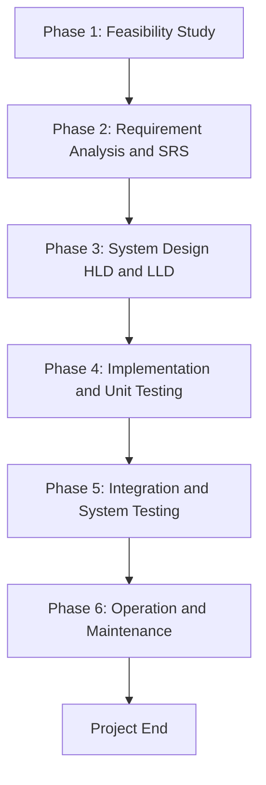
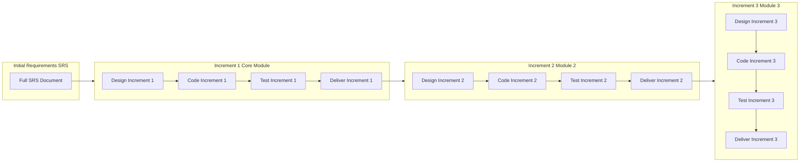
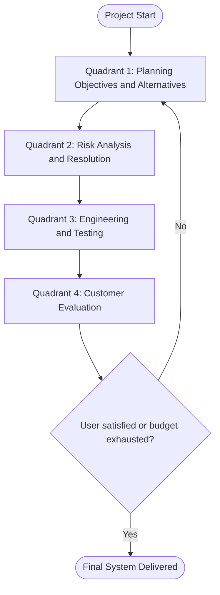
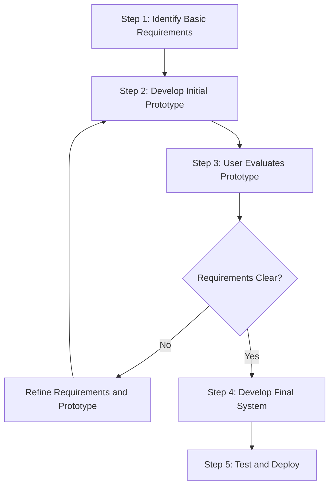

# Software engineering paradigm, life cycle models: Waterfall, Incremental, Evolutionary models

<!-- SECTION_1_START -->
# Software Engineering Paradigm & Life Cycle Models

> [!IMPORTANT]
> **KTU 2024 Scheme | PECST402 | Module 1 | CO1: Apply Software Engineering Principles**

## 1.1 The Software Engineering Paradigm

### Formal Definition
A **Software Engineering Paradigm** is the structured, philosophical, and systematic set of principles, methodologies, and standardized procedures that guide the entire process of developing, operating, maintaining, and retiring a software system. It is the foundational "school of thought" that prescribes *how* engineers should approach the phases of software construction — from initial feasibility to final decommissioning.

In the KTU 2024 syllabus context, the term **paradigm** is a superset that includes:
1. **Software Process Models** (e.g., Waterfall, Incremental, Evolutionary)
2. **Software Development Methods** (e.g., Agile, DevOps practices)
3. **Software Engineering Tools, Techniques, and Notations** (e.g., UML, version control)

> [!NOTE]
> **The Generic Software Life Cycle (SDLC)**
> Every software process model is essentially a refinement of the same generic life cycle phases:
> **Requirement Analysis $\rightarrow$ Design $\rightarrow$ Implementation (Coding) $\rightarrow$ Testing $\rightarrow$ Deployment $\rightarrow$ Maintenance**
> Different paradigms simply differ in **the order**, **the strictness**, and **the degree of iteration** applied to these phases.

### Conceptual Analogy: The Blueprint Approach

Think of a software engineering paradigm as the **architectural plan for building a house**:
- **The Paradigm** is the *style* of construction chosen — do you build the entire mansion in one go (Waterfall), or do you first build a small cottage and add rooms later (Incremental), or do you iterate the design after every client walkthrough (Evolutionary/Agile)?
- The **phases** (foundation, walls, roof, plumbing) are the same — but the *paradigm* decides whether the electrician must wait for the roof to be fully complete, or whether the homeowner can move in when only the bedroom is ready.

### Physical Constants & Standard Metrics
The two most important standard metrics used universally in software engineering paradigms are:
- **KLOC (Kilo Lines of Code)**: $1 \text{ KLOC} = 1000$ lines of source code.
- **Effort**: Usually measured in **Person-Months (PM)** or **Person-Hours (PH)**.

> [!VISUALIZATION CONTROL]
> **Concept:** Generic SDLC Phase Flow
> **Desmos Input Equations:** Plot a step function over time $t$:
> * $y = 1$ for $t \in [0, 1]$  (Requirements)
> * $y = 2$ for $t \in [1, 2]$  (Design)
> * $y = 3$ for $t \in [2, 3]$  (Implementation)
> * $y = 4$ for $t \in [3, 4]$  (Testing)
> * $y = 5$ for $t \in [4, 5]$  (Maintenance)
> **Visual Description:** A staircase graph climbing upwards from Requirements to Maintenance — each plateau represents the dominant phase at that time, illustrating that at any given moment, the project is "focused" on one major activity.

---

## 1.2 Software Process Models — The High-Level Map

A **Software Process Model** (often called the **Software Development Life Cycle — SDLC model**) is a simplified, abstract, and chronological representation of the software engineering paradigm. It prescribes the specific order in which the generic SDLC activities are carried out.

The KTU 2024 Module 1 explicitly covers three families of models:
1. **Linear / Sequential Models** — represented by the *Waterfall Model*.
2. **Incremental Models** — where the product is delivered in working slices.
3. **Evolutionary Models** — where the product *evolves* through repeated refinement (e.g., *Prototype Model*, *Spiral Model*).

> [!IMPORTANT]
> **KTU Board Watch:** The question paper for Module 1 typically phrases questions as *"Explain the Waterfall model. State its advantages and disadvantages."* or *"Compare the Incremental and Evolutionary models."* — direct, definition-heavy, and demand diagram support.
<!-- SECTION_1_END -->

<!-- SECTION_2_START -->
# Deep Theoretical Analysis & KTU High-Yield Formula Sheet

## 2.1 The Waterfall Model (Linear Sequential Model)

The **Waterfall Model**, proposed by **Winston W. Royce in 1970**, is the oldest and most rigid SDLC paradigm. Each phase must be *completed* and *frozen* before the next phase begins; there is **no overlap** and **no iteration** with earlier phases (in its pure form).

### The Six Phases
1. **Feasibility Study** — Is the project technically and economically viable?
2. **Requirement Analysis & Specification (SRS)** — Capture *what* the system must do.
3. **Design (HLD + LLD)** — Define *how* the system will be built.
4. **Implementation & Unit Testing** — Code the modules.
5. **Integration & System Testing** — Combine modules and verify against SRS.
6. **Operation & Maintenance** — Deploy, fix defects, and adapt to changes.

### The "Why" Behind Each Step
- Why **freeze** phases? Because changes later are *exponentially more expensive* to fix (this is the **Rule of 10** in defect-cost escalation).
- Why **document** extensively? Because each phase's output is the *contract* for the next phase's team.

### Advantages & Disadvantages
- **Advantages**: Simple, disciplined, easy to manage; requires no customer presence during development; documentation is rigorous; well-suited to small, well-understood projects.
- **Disadvantages**: No working software until late; high risk due to frozen requirements; poor fit for complex, object-oriented projects; iteration is not natural; backtracking is costly.

> [!NOTE]
> **The Royce Caveat:** Ironically, Royce himself stated in his 1970 paper that the pure Waterfall model is *faulty* and suggested a more iterative approach. Yet the model became the KTU-pedigreed default for textbook definitions.

---

## 2.2 The Incremental Model

In the **Incremental Model**, the system is designed, implemented, and tested **incrementally** — a series of *working software releases* (increments) are delivered, each adding new functionality on top of the previous one.

### The Operational Logic
- The complete **SRS** is developed up front.
- A *delivery schedule* lists the *priority* of requirements.
- The first increment is the **core** (highest-priority, smallest usable subset).
- Subsequent increments add features.

### Why Use It?
- Customer gets **early working software** (the core increment).
- Customer feedback can guide later increments (lower risk).
- Easier to test and debug incrementally.
- Lower initial delivery cost.

### Mathematical Intuition for Effort
If the total effort is $E$ and the project is divided into $n$ increments, a simple model for the effort per increment follows a **geometric distribution**:

$$
E_i = E \cdot (1 - p)^{i-1} \cdot p
$$

where $E_i$ is the effort for the $i$-th increment, and $p$ is the proportion of total functionality delivered in that increment (with $\sum_{i=1}^{n} p_i = 1$).

---

## 2.3 Evolutionary Models

Evolutionary models are based on the idea that **requirements evolve** as the user's understanding of the system matures. Two major variants are in the KTU 2024 syllabus:

### (a) The Prototype Model
A **prototype** is a *quick, low-fidelity, throw-away* working model of (part of) the final system, built to *clarify requirements*. The steps are:
1. Identify basic requirements.
2. Develop an initial prototype.
3. User evaluates the prototype.
4. Refine and repeat until requirements are stable.
5. Build the **final** system (the prototype may be *thrown away* or *evolved* into the final product — this gives the two sub-types: *Throw-away prototyping* and *Evolutionary prototyping*).

> [!IMPORTANT]
> **KTU Concept Point:** "**Throw-away prototyping**" is used when the prototype is built using a *different, faster technology* (e.g., paper sketches, mock-ups) than the final system. "**Evolutionary prototyping**" means the prototype *gradually becomes* the production system.

### (b) The Spiral Model (Boehm, 1986)
The most sophisticated evolutionary model, combining **Waterfall** (linear phases) with **Iterative Prototyping**, organized around **risk management**. The process spirals through $n$ cycles, each containing four quadrants:
1. **Planning** — Determine objectives, alternatives, constraints.
2. **Risk Analysis** — Identify and resolve risks (the defining feature of this model).
3. **Engineering** — Develop and test the next increment.
4. **Customer Evaluation** — User reviews and suggests improvements.

### Why Risk-Centric?
Each loop's radius represents *cumulative cost incurred*, and the angular dimension represents *progress*. Each cycle is a *complete* mini-waterfall, but risk resolution is a *first-class activity*.

---

## 2.4 KTU High-Yield Comparison Table

> [!NOTE]
> The following table is **directly referenced** in KTU 14-mark comparison questions. Memorize the structure.

$$
\begin{array}{|l|c|c|c|}
\hline
\textbf{Criterion} & \textbf{Waterfall} & \textbf{Incremental} & \textbf{Evolutionary} \\
\hline
\text{Order of phases} & \text{Sequential, linear} & \text{Linear increments} & \text{Iterative spirals} \\
\hline
\text{User involvement} & \text{Only at start and end} & \text{Frequent (per increment)} & \text{Continuous} \\
\hline
\text{Working software} & \text{Very late} & \text{After first increment} & \text{Early (as prototype)} \\
\hline
\text{Risk handling} & \text{Poor} & \text{Moderate} & \text{Excellent (Spiral)} \\
\hline
\text{Documentation} & \text{Extensive} & \text{Moderate} & \text{Light to moderate} \\
\hline
\text{Overlap of phases} & \text{None} & \text{Allowed} & \text{Strong overlap} \\
\hline
\text{Best suited for} & \text{Small, well-known} & \text{Medium, mod priority} & \text{Large, high-risk} \\
\hline
\end{array}
$$

### Engineering Utility in Production Systems
- **Waterfall**: Used in defense, government, and regulated industries (e.g., banking) where documentation is a legal requirement.
- **Incremental**: Used in *e-commerce platforms* (Amazon, Flipkart) where features like search, cart, and payment are rolled out one at a time.
- **Evolutionary (Spiral)**: Used in *mission-critical systems* (aerospace, medical devices) where risk management dominates; *Prototype* is used in UI/UX-heavy products to validate user needs quickly.

---

## 2.5 Effort & Cost Escalation in Phases (The 1:10 Rule)

A core numerical concept tested in KTU papers is the **Defect-Cost Escalation Ratio**:

$$
C_{\text{fix at phase } i} \approx 10 \cdot C_{\text{fix at phase } i-1}
$$

For example, a defect fixed at the **design** stage costs **10x less** than the same defect fixed during **maintenance**. This is the key economic justification for catching defects early — the very reason the Waterfall model values early-phase rigor, and why the Spiral model places **risk analysis** at the *front* of every cycle.
<!-- SECTION_2_END -->

<!-- SECTION_3_START -->
# Step-by-Step Derivations, Algorithms & Phase-wise Implementation

## 3.1 Algorithm: Generic Software Process (Pseudocode)

The following pseudocode expresses the abstract logic common to all three paradigms. Each paradigm is essentially a *control-flow variation* of this algorithm.

```python
# KTU PECST402 - Module 1 | Generic SDLC Algorithm
# Type-annotated Python pseudocode for clarity

from enum import Enum
from typing import List, Dict, Optional

class SDLCPhase(Enum):
    FEASIBILITY    = "Feasibility Study"
    REQUIREMENTS   = "Requirement Analysis (SRS)"
    DESIGN         = "Design (HLD + LLD)"
    IMPLEMENTATION = "Implementation & Unit Testing"
    TESTING        = "Integration & System Testing"
    DEPLOYMENT     = "Deployment"
    MAINTENANCE    = "Operation & Maintenance"

class Paradigm(Enum):
    WATERFALL    = "Waterfall"
    INCREMENTAL  = "Incremental"
    EVOLUTIONARY = "Evolutionary (Spiral/Prototype)"

def run_sdlc(paradigm: Paradigm,
             requirements: List[str],
             n_cycles: int = 1) -> Dict[str, str]:
    """
    Generic SDLC simulator.
    - Waterfall     : n_cycles = 1, no feedback.
    - Incremental   : n_cycles = N, each cycle = subset of reqs.
    - Evolutionary  : n_cycles = N, with explicit risk phase.
    """
    artifacts: Dict[str, str] = {}

    if paradigm == Paradigm.WATERFALL:
        # Pure linear execution, no backtracking allowed
        for phase in SDLCPhase:
            artifacts[phase.value] = execute_phase(phase, requirements)
        # No loop, no iteration, no risk phase
        return artifacts

    if paradigm == Paradigm.INCREMENTAL:
        # Each cycle delivers one increment
        remaining_reqs: List[str] = list(requirements)
        for cycle_id in range(1, n_cycles + 1):
            increment_size = max(1, len(remaining_reqs) // n_cycles)
            current_increment = remaining_reqs[:increment_size]
            remaining_reqs   = remaining_reqs[increment_size:]

            for phase in [SDLCPhase.REQUIREMENTS,
                          SDLCPhase.DESIGN,
                          SDLCPhase.IMPLEMENTATION,
                          SDLCPhase.TESTING]:
                artifacts[f"Cycle-{cycle_id}-{phase.value}"] = \
                    execute_phase(phase, current_increment)
        return artifacts

    if paradigm == Paradigm.EVOLUTIONARY:
        # Spiral: each loop has Planning -> Risk -> Engineering -> Eval
        for cycle_id in range(1, n_cycles + 1):
            artifacts[f"Cycle-{cycle_id}-Planning"]  = "Set objectives"
            artifacts[f"Cycle-{cycle_id}-Risk"]      = "Resolve top risks"
            artifacts[f"Cycle-{cycle_id}-Engineer"]  = "Build next prototype"
            artifacts[f"Cycle-{cycle_id}-Evaluate"]  = "Customer feedback"
        return artifacts

    raise ValueError(f"Unsupported paradigm: {paradigm}")


def execute_phase(phase: SDLCPhase, reqs: List[str]) -> str:
    """
    Simulates execution of a single SDLC phase with strict
    boundary checks and error logging.
    """
    if not reqs and phase != SDLCPhase.FEASIBILITY:
        # Boundary safety: do not enter design without requirements
        raise ValueError(f"Cannot execute {phase} with empty requirements.")
    # In real systems, this is where actual engineering work happens
    return f"{phase.value} completed for {len(reqs)} requirements."
```

> [!NOTE]
> **KTU Mapping:** This algorithm directly corresponds to the textbook "Process Model" diagrams. The `n_cycles` parameter is the **key differentiator**: $n_{\text{cycles}} = 1 \Rightarrow$ Waterfall, $n_{\text{cycles}} = N \Rightarrow$ Incremental, and adding a *Risk phase* in the loop $\Rightarrow$ Evolutionary.

---

## 3.2 Derivation: Effort Distribution Across Increments

**Problem:** A project has total estimated effort $E = 100$ Person-Months. It is planned as $n = 4$ increments delivering $40\%$, $30\%$, $20\%$, and $10\%$ of the functionality. Compute the effort per increment.

### Step-by-Step Derivation

**Step 1 — State the given values.**

$$
E = 100 \text{ PM}, \quad n = 4, \quad p_1 = 0.40, \quad p_2 = 0.30, \quad p_3 = 0.20, \quad p_4 = 0.10
$$

**Step 2 — Verify the proportions sum to 1.**

$$
\sum_{i=1}^{4} p_i = 0.40 + 0.30 + 0.20 + 0.10 = 1.00 \;\; \checkmark
$$

**Step 3 — Apply the effort-per-increment formula.**

$$
E_i = E \cdot p_i
$$

**Step 4 — Compute each increment's effort.**

$$
E_1 = 100 \cdot 0.40 = 40 \text{ PM}
$$

$$
E_2 = 100 \cdot 0.30 = 30 \text{ PM}
$$

$$
E_3 = 100 \cdot 0.20 = 20 \text{ PM}
$$

$$
E_4 = 100 \cdot 0.10 = 10 \text{ PM}
$$

**Step 5 — Sum to verify.**

$$
E_{\text{total}} = 40 + 30 + 20 + 10 = 100 \text{ PM} \;\; \checkmark
$$

> [!NOTE]
> **Real engineering note:** In practice, the *first* increment often requires **more** effort than its size suggests because the team must set up infrastructure, build the skeleton, and establish coding standards. The numbers above are *idealized*; KTU exam questions follow the same idealization.

---

## 3.3 Derivation: Defect-Cost Escalation

**Problem:** A defect costs **Rs. 1,000** to fix if caught at the *coding* stage. Using the 1:10 rule, what is the cost if the same defect is discovered at the *integration* stage? And at *maintenance*?

### Step-by-Step Derivation

**Step 1 — Identify the baseline phase and cost.**

$$
C_{\text{coding}} = 1{,}000 \text{ Rs.}
$$

**Step 2 — Apply the 1:10 rule successively.**

The sequence of phases, in order, is: **Requirements $\rightarrow$ Design $\rightarrow$ Coding $\rightarrow$ Integration $\rightarrow$ Maintenance**.

Each later phase multiplies the cost by 10.

$$
C_{\text{integration}} = 10 \cdot C_{\text{coding}} = 10 \cdot 1{,}000 = 10{,}000 \text{ Rs.}
$$

$$
C_{\text{maintenance}} = 10 \cdot C_{\text{integration}} = 10 \cdot 10{,}000 = 1{,}00{,}000 \text{ Rs.}
$$

**Step 3 — Conclude.**

A defect that would cost **Rs. 1,000** at the coding stage costs **Rs. 1,00,000** if it slips all the way to maintenance — a **100x** escalation.

> [!IMPORTANT]
> **KTU Board Expectation:** Always write the *phase-to-phase* relationship explicitly (e.g., "Cost at next phase = 10 $\times$ Cost at current phase"). Do not skip steps.

---

## 3.4 When-to-Use Decision Matrix (Practical)

The following is a worked-out *decision tree* for choosing a paradigm, as it appears in KTU model answers.

$$
\begin{array}{|l|c|c|c|}
\hline
\textbf{Project Characteristic} & \textbf{Waterfall} & \textbf{Incremental} & \textbf{Evolutionary} \\
\hline
\text{Requirements are clear and stable} & \checkmark & \checkmark & \checkmark \\
\hline
\text{Requirements are vague or evolving} & \times & \text{OK} & \checkmark \\
\hline
\text{User cannot be present often} & \checkmark & \times & \times \\
\hline
\text{Risk is high (budget, technology)} & \times & \text{Moderate} & \checkmark \\
\hline
\text{Project is short and small} & \checkmark & \times & \times \\
\hline
\text{Tight time-to-market} & \times & \checkmark & \checkmark \\
\hline
\end{array}
$$

> [!WARNING]
> **Exam Pitfall:** Students often incorrectly claim that **Waterfall is best for "complex" projects**. In reality, Waterfall is best for *well-understood* projects; complex, novel projects demand Spiral/Evolutionary models.
<!-- SECTION_3_END -->

<!-- SECTION_4_START -->
# Structural Diagrams & Schematics

## 4.1 Waterfall Model — Sequential Flow



> [!NOTE]
> **Visual Description:** A strictly downward unidirectional flow. There are no backward arrows in the pure Waterfall model. The only "backflow" in practice is the **maintenance phase**, which may trigger new feasibility studies for the *next version* — but the current project's phases do not iterate.

---

## 4.2 Incremental Model — Parallel Build & Delivery



> [!NOTE]
> **Visual Description:** Each increment is a *mini-Waterfall* (Design $\rightarrow$ Code $\rightarrow$ Test $\rightarrow$ Deliver). The full SRS is written once at the start, but the system grows incrementally as each delivered increment feeds the next.

---

## 4.3 Spiral Model — Boehm's Risk-Centric Loops



> [!NOTE]
> **Visual Description:** A **loop-back** structure. The defining feature is the explicit **Risk Analysis quadrant** in every cycle — this is what distinguishes Spiral from generic iterative prototyping. Each pass through the loop delivers a *more complete* system.

---

## 4.4 Prototype Model — User-Driven Refinement



> [!NOTE]
> **Visual Description:** A *feedback loop* between developer and user. The prototype is refined *iteratively* until the user is satisfied. After this, the **final** system is built — either by *throwing away* the prototype or by *evolving* it.

---

## 4.5 Comparative Process Architecture — All Three Models

```mermaid
flowchart TD
    subgraph WGroup["Waterfall Paradigm"]
        W1["Requirements"] --> W2["Design"] --> W3["Code"] --> W4["Test"] --> W5["Maintain"]
    end

    subgraph IGroup["Incremental Paradigm"]
        I1["Req Subset 1"] --> I2["Design 1"] --> I3["Code 1"] --> I4["Test 1"] --> I5["Deliver 1"]
        I5 --> J1["Req Subset 2"] --> J2["Design 2"] --> J3["Code 2"] --> J4["Test 2"] --> J5["Deliver 2"]
    end

    subgraph EGroup["Evolutionary Paradigm"]
        E1["Plan"] --> E2["Risk Analysis"] --> E3["Engineer Prototype"] --> E4["User Evaluate"] --> E5{"Continue?"}
        E5 -- Yes --> E1
        E5 -- No --> E6["Final System"]
    end
```


<!-- SECTION_4_END -->

<!-- SECTION_5_START -->
# KTU 2024 Scheme Examination Question Bank & Topic Recap

## PART A — Short Answer Questions (3 Marks Each)

### Question 1
> **[KTU University Exam - July 2024]** *Define the term Software Engineering Paradigm. Mention the two metrics used to measure software.*

**Model Answer (CO1, Remember, 3 Marks):**
A *Software Engineering Paradigm* is the systematic, philosophical approach that defines the order, structure, and methodology to be followed while developing, operating, and maintaining software. **[1 Mark]**
It encompasses the **software process models**, development methods, and the tools/techniques used. **[1 Mark]**
The two most commonly used metrics are **KLOC (Kilo Lines of Code)** and **Effort (Person-Months)**. **[1 Mark]**

---

### Question 2
> **[KTU University Exam - Dec 2023]** *What is meant by a prototype? List two advantages of the prototype model.*

**Model Answer (CO1, Understand, 3 Marks):**
A **prototype** is a quick, working, often partial model of the actual system used primarily to clarify user requirements and to obtain early user feedback. **[1 Mark]**
**Advantages:** **[2 Marks — 1 each]**
1. Reduces risk of incomplete or misunderstood requirements.
2. Helps in early detection of usability issues and missing features.

---

## PART B — Long Answer Questions (14 Marks Each, Internal Choice)

### Question A (Choice 1) — 14 Marks

> **[KTU University Exam - July 2024, Modified]** *Explain the Waterfall Model in detail with a neat block diagram. State its advantages, disadvantages, and suitability.*

#### (a) Waterfall Model — Phases and Diagram (7 Marks)

**Model Answer (CO1, Understand, 7 Marks):**

The **Waterfall Model**, introduced by *Winston W. Royce (1970)*, is a **linear sequential** software process model in which each phase must be completed and *frozen* before the next phase begins. **[1 Mark]**

**The six phases are:** **[Listing all 6 phases with one-line description: 4 Marks]**
1. **Feasibility Study:** Evaluates technical, economic, and operational viability.
2. **Requirement Analysis & Specification (SRS):** Captures functional and non-functional requirements in the *Software Requirement Specification* document.
3. **System Design (HLD + LLD):** Translates SRS into architectural (HLD) and modular (LLD) designs.
4. **Implementation & Unit Testing:** Each module is coded and individually unit-tested.
5. **Integration & System Testing:** Modules are integrated and tested against the SRS; defects are tracked.
6. **Operation & Maintenance:** Deployed system is corrected, adapted, and enhanced over its lifetime.

**Block Diagram:** **[2 Marks — must draw OR describe: a sequential downward flow with 6 boxes from Feasibility to Maintenance]**

> **[Final integrated statement: 1 Mark]** The Waterfall model is best suited for small-to-medium projects where requirements are **stable, well-understood, and unlikely to change** during development.

---

#### (b) Advantages, Disadvantages, and Suitability (7 Marks)

**Model Answer (CO1, Apply, 7 Marks):**

**Advantages:** **[3 Marks — 1 each, any three]**
1. Simple, easy to understand and manage due to its linear structure.
2. Disciplined approach with clear milestones and well-defined deliverables.
3. Extensive documentation makes maintenance and hand-over easier.
4. Customer's continuous presence is *not* required during development.

**Disadvantages:** **[3 Marks — 1 each, any three]**
1. No working software is produced until late in the life cycle.
2. Freezing requirements early leads to high risk for projects with evolving needs.
3. Backtracking to fix earlier-phase errors is **expensive** (1:10 cost-escalation rule).
4. Poor fit for complex, object-oriented, or long-duration projects.

**Suitability:** **[1 Mark]** Best for **small, short-duration projects** with **stable, well-documented requirements** — typical examples include payroll systems, government forms-processing software, and embedded firmware in regulated industries.

---

### Question B (Choice 2) — 14 Marks

> **[KTU University Exam - Dec 2023, Modified]** *Explain the Incremental Model and the Spiral (Evolutionary) Model. Compare them with a neat table.*

#### (a) Incremental & Spiral Models — Detailed Explanation (7 Marks)

**Model Answer (CO1, Understand, 7 Marks):**

**Incremental Model:** **[3.5 Marks]**
The system is built and delivered as a series of *increments*, each adding new functionality to the previously delivered working software. The complete **SRS** is written up front, and increments are prioritized so that the **core** (highest-value) features are delivered first. Each increment goes through a **mini-Waterfall** (Design $\rightarrow$ Code $\rightarrow$ Test) before delivery. Customer feedback at each release guides the next increment.

**Spiral Model (Boehm, 1986):** **[3.5 Marks]**
A risk-driven evolutionary process in which the project progresses through **iterative loops** (called *spirals*). Each loop contains **four quadrants**:
1. **Planning** — define objectives, alternatives, and constraints.
2. **Risk Analysis** — identify and *resolve* risks (this is the model's defining strength).
3. **Engineering** — develop the next increment using a Waterfall-style sequence.
4. **Customer Evaluation** — the user reviews the current build and suggests improvements.
The radial dimension represents *cumulative cost*, and the angular dimension represents *progress*. Each loop is a complete mini-Waterfall with explicit risk handling.

---

#### (b) Comparison Table (7 Marks)

**Model Answer (CO1, Apply, 7 Marks):**

$$
\begin{array}{|l|c|c|}
\hline
\textbf{Feature} & \textbf{Incremental Model} & \textbf{Spiral Model} \\
\hline
\text{Driver} & \text{Customer priority of features} & \text{Risk management} \\
\hline
\text{User feedback} & \text{Between increments} & \text{At the end of each loop} \\
\hline
\text{Risk handling} & \text{Implicit, after delivery} & \text{Explicit quadrant} \\
\hline
\text{Documentation} & \text{Moderate} & \text{Moderate to extensive} \\
\hline
\text{Working software} & \text{After first increment} & \text{After first loop} \\
\hline
\text{Iteration style} & \text{Linear + additive} & \text{Cyclic, risk-focused} \\
\hline
\text{Best suited for} & \text{Medium, feature-clear} & \text{Large, high-risk, novel} \\
\hline
\end{array}
$$

**[2 Marks for a clear concluding statement]**: *The Incremental model is preferred when the **set of features** is well-known but **delivery schedule** matters; the Spiral model is preferred when the **technology or requirements are novel** and risk reduction is the top priority.*

> [!WARNING]
> **KTU Examiner's Valuation Pitfalls:**
> 1. **Do not** write a *single* paragraph comparing the two models — examiners expect a **table format** for the comparison part. Failure to present a table costs **at least 2 marks**.
> 2. **Do not** confuse the *Prototype Model* with the *Spiral Model*. Prototypes are for *requirement clarification*; Spiral is for *risk-driven development*. Mixing them up costs 1–2 marks.
> 3. **Do not** forget to draw a **neat block diagram** in the Waterfall question. A text-only answer without a diagram is penalized **2–3 marks** in the KTU scheme.
> 4. **Always** state the *phase names* in the order: *Feasibility $\rightarrow$ Requirements $\rightarrow$ Design $\rightarrow$ Implementation $\rightarrow$ Testing $\rightarrow$ Maintenance*. Reversing or omitting a phase is a 0.5-mark deduction each.
> 5. In a question on the Spiral model, the **four quadrants** *must* be in the correct order: *Planning, Risk Analysis, Engineering, Customer Evaluation*. Reversing them is a 1-mark deduction.

---

## Topic Recap & Important Things to Remember

- **Software Engineering Paradigm** = the philosophical approach to software development; **Software Process Model** = a concrete instance of a paradigm.
- The **generic SDLC** has six phases: *Feasibility, Requirements, Design, Implementation, Testing, Maintenance.*
- **Waterfall** = linear, sequential, no overlap; suited to small, stable projects; *Royce 1970*.
- **Incremental** = builds the system in working slices; full SRS at the start; priority-driven increments.
- **Evolutionary** = system evolves over time; two main types: **Prototype** (requirement clarification) and **Spiral** (risk-driven, Boehm 1986).
- **Spiral Model** has *four quadrants per cycle*: Planning, Risk Analysis, Engineering, Customer Evaluation.
- **Prototype sub-types**: *Throw-away* (prototype is discarded) vs. *Evolutionary* (prototype becomes the system).
- **1:10 Defect-Cost Escalation Rule**: cost to fix a defect multiplies by 10 for every phase it slips through.
- **KLOC** = 1,000 lines of code; **Effort** = Person-Months.
- **Incremental effort formula**: $E_i = E \cdot p_i$, with $\sum p_i = 1$.
- **Waterfall best for** = stable, well-documented, small projects; **Spiral best for** = high-risk, large, novel projects; **Incremental best for** = time-to-market pressure with known feature priority.
- **Key differences to memorize**: Waterfall has *no iteration*; Incremental has *additive iteration*; Evolutionary (Spiral) has *risk-driven iteration*.
- **Always draw diagrams** in KTU answers — they typically carry 2–3 marks out of 7 in a long-answer sub-part.
- **Comparison answers** in KTU must use a **tabular format** for full credit.
<!-- SECTION_5_END -->
