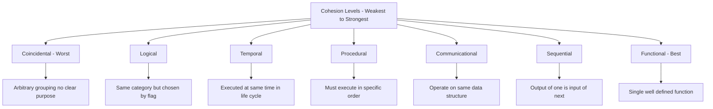
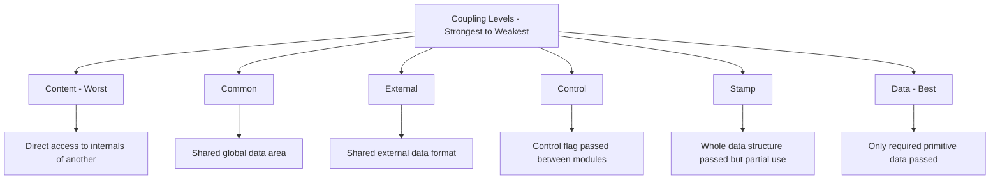
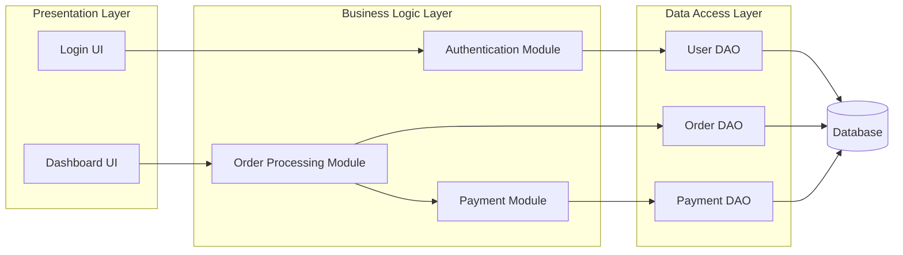
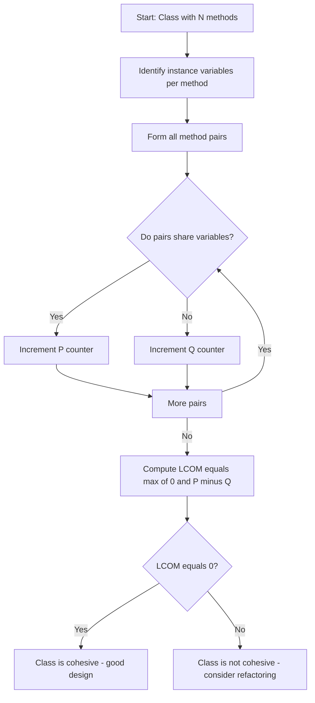

# Design concepts: Abstraction, modularity, cohesion, and coupling metrics

<!-- SECTION_1_START -->
# Design Concepts: Abstraction, Modularity, Cohesion & Coupling Metrics

## 1. Core Technical Definition & Intuitive Overview

### 1.1 Abstraction

> [!IMPORTANT]
> **KTU 2024 Syllabus Definition:**
> **Abstraction** is a design technique that emphasizes the essential features of a component while suppressing (hiding) the implementation details. It allows the designer to focus on *what* a module does, rather than *how* it does it.

In the KTU Software Engineering framework (Pressman & Sommerville aligned), abstraction is treated as the **first principle of software design**, expressed through three hierarchical layers:

| Abstraction Level | Question Answered | Example |
|---|---|---|
| **Data Abstraction** | *What data does it hold?* | `Customer { id, name, balance }` |
| **Procedural Abstraction** | *What operations exist?* | `computeInterest(principal, rate, time)` |
| **Control Abstraction** | *What is the execution flow?* | `while(!EOF) { read(); process(); }` |

> [!NOTE]
> **Procedural Abstraction** names a sequence of instructions by a function name, with all internal statements hidden. **Data Abstraction** defines a named data object (an *Abstract Data Type / ADT*) with the operations that act upon it.

---

### 1.2 Modularity

> [!IMPORTANT]
> **Modularity** is the logical partitioning of a software system into smaller, named, and addressable components (modules) such that each can be integrated and tested independently, and can be reasoned about in isolation.

The KTU textbook (Pressman, Chapter 8) and Sommerville both quote **Myers' Reliablity Equation**:

$$
\text{Module Reliability} \approx \frac{1}{\left(\frac{\text{Total Defects}}{\text{Number of Modules}}\right)^{2}}
$$

This intuitively shows that **more, smaller modules ⇒ higher total reliability** (assuming defect density stays roughly constant per module).

> [!NOTE]
> The cost of *modularization* itself rises linearly with the number of modules. The **optimal module count** is found at the intersection of the *cost of development* curve and the *cost of integration + module-count* curve.

---

### 1.3 Cohesion

> [!IMPORTANT]
> **Cohesion** is a *qualitative* intra-module measure — it indicates how strongly the responsibilities (statements, data, references) inside a single module are functionally related to one another. **High cohesion = Good design.**

> [!WARNING]
> Cohesion is an **intra-module** property. It is evaluated *inside* one module. Do NOT confuse it with coupling, which is **inter-module**.

---

### 1.4 Coupling

> [!IMPORTANT]
> **Coupling** is a *qualitative* inter-module measure — it indicates the degree of interdependence between two modules. The *lower* the coupling, the *better* the design (lower ripple-effect of changes, higher reuse, better testability).

> [!WARNING]
> Coupling is an **inter-module** property. It is evaluated *between* two modules.

---

### 1.5 Intuitive Analogy — "The Hospital Analogy" 🏥

Imagine a **Hospital** as a software system:

- **Abstraction** = The *sign-board* outside "Cardiology". You don't know what's inside, only what it offers.
- **Modularity** = The hospital is divided into *Cardiology, Neurology, Pharmacy, Billing* — independent departments with their own teams.
- **Cohesion** = Inside the *Pharmacy*, everything (shelf, pharmacist, billing for medicines) is tightly related to "dispensing medicine". The pharmacy is *highly cohesive*.
- **Coupling** = How much does the *Cardiology* department need to call the *Neurology*? If they share only a small report (X-ray) → *loose coupling*. If one cannot work without the other sitting in the same room → *tight coupling*.

> [!TIP]
> **Goal of KTU-quality design:** *High Cohesion + Low Coupling + Strong Modularity + Clean Abstraction.* This is the legendary **"HC-LC"** design mantra.

---

### 1.6 GeoGebra / Desmos Visualization

> [!VISUALIZATION CONTROL]
> **Concept:** Modularity vs. Cost — Cost-Optimization Curve
> **GeoGebra / Desmos Input Equations:**
> * $f(x) = \dfrac{k_1}{x^{2}} + k_2 \cdot x$  *(Total Cost of Modularization)*
> * $g(x) = c \cdot x$  *(Cost of Number of Modules)*
>
> **Visual Description:** The first curve $f(x)$ is a U-shaped parabola opening upwards. The second curve $g(x)$ is a straight line through the origin. The **optimum number of modules** is the point of intersection (or the vertex of $f$ if differentiation is applied), where *cost of integrating modules ≈ cost of development effort per module*.

---

<!-- SECTION_2_START -->
# 2. Deep Theoretical Analysis & KTU High-Yield Formula Sheet

## 2.1 The Seven Levels of Cohesion (Weakest → Strongest)

According to **Pressman (KTU 2024 syllabus reference)**, cohesion is classified into 7 types, ranked from **worst (coincidental)** to **best (functional)**.

| # | Type | Description | Example | Rating |
|---|---|---|---|---|
| 1 | **Coincidental** | Elements grouped arbitrarily; no meaningful relationship | "Utilities" class with date, math, file-IO all together | Worst ❌ |
| 2 | **Logical** | Elements grouped because they perform *similar* operations (selection by a flag) | `printReport(type)` where `type ∈ {sales, hr, finance}` | Bad |
| 3 | **Temporal** | Elements grouped because they execute at the *same time* | `systemStartup()` that opens DB, log file, config in one function | Weak |
| 4 | **Procedural** | Elements grouped because they must execute in a *specific order* | `editDocument()` — lock, read, modify, save, unlock | Medium |
| 5 | **Communicational / Informational** | Elements operate on the *same data structure* | `stack` module with push, pop, peek, isEmpty all on the same stack | Strong |
| 6 | **Sequential** | Output of one element is the *input* of the next | `read → validate → transform → write` chained in a single module | Stronger |
| 7 | **Functional** | All elements contribute to a *single, well-defined function* | `computeSquareRoot(x)` doing ONLY that | Best ✅ |

> [!IMPORTANT]
> **KTU Examiner's Rule of Thumb:** "If you can describe the module's purpose in *one short sentence* without using words like *and*, *or*, *then* — it is **functionally cohesive**."

---

## 2.2 The Six Levels of Coupling (Strongest → Weakest)

| # | Type | Description | Example | Rating |
|---|---|---|---|---|
| 1 | **Content** | One module directly modifies the internal workings of another | `ModuleA` reaches into private memory of `ModuleB` | Worst ❌ |
| 2 | **Common** | Two modules share a *global data area* | Both `TaxCalc` and `Invoice` read/write `global_rate` | Very Bad |
| 3 | **External** | Two modules share an *imposed external data format* (e.g., I/O device, protocol) | Two modules both writing to the same hardware port | Bad |
| 4 | **Control** | One module passes a *flag/control variable* to alter another module's flow | `process(invoice, true)` where `true` = debug mode | Weak |
| 5 | **Stamp** | One module passes an entire *data structure*, but uses only a *part* of it | Passing full `Customer` object when only `id` is needed | Medium |
| 6 | **Data** | One module passes only the *primitive data items* it actually needs | `computeTax(price, rate)` — only the two relevant primitives | Best ✅ |

> [!IMPORTANT]
> **The KTU Golden Coupling Line:** *Pass only the data that is required. Pass nothing more, expose nothing internal, and never share globals.*

---

## 2.3 Formal Metrics for Cohesion & Coupling (Quantitative)

KTU 2024 expects you to know the **LK (Lack of Cohesion) metric** and the **C&K (Chidamber-Kemerer) coupling metric**.

### 2.3.1 LCOM — Lack of Cohesion of Methods (Chidamber-Kemerer, 1994)

Consider a class with $m$ methods and $i$ instance variables.

* For each method, identify the set of instance variables it accesses.
* Let $P = \{ (M_i, M_j) \mid \text{they share at least one instance variable} \}$
* Let $Q = \{ (M_i, M_j) \mid \text{they share NO instance variable} \}$

$$
\text{LCOM} = 
\begin{cases}
|P| - |Q|, & \text{if } |P| > |Q| \\
0, & \text{otherwise}
\end{cases}
$$

> [!NOTE]
> **Interpretation:** $\text{LCOM} = 0$ is **ideal** (perfect cohesion). Higher LCOM ⇒ **worse** cohesion.

### 2.3.2 CBO — Coupling Between Objects (Chidamber-Kemerer)

$$
\text{CBO}(C) = \text{Number of other classes to which } C \text{ is coupled}
$$

A class is "coupled to" another if it uses the other's member methods or instance variables. KTU target: $\text{CBO} \le 14$ per class.

### 2.3.3 RFC — Response For a Class

$$
\text{RFC} = \vert RS \vert
$$

where $RS$ is the **response set** = the set of methods that can be invoked in response to a message received by an object of class $C$ (including $C$'s own methods + all methods of other classes that $C$'s methods call).

### 2.3.4 Ca and Ce — Afferent and Efferent Coupling (CK Metric)

| Symbol | Name | Meaning | Calculation |
|---|---|---|---|
| $C_a$ | **Afferent Coupling** | How many classes depend ON this class | Count incoming edges in dependency graph |
| $C_e$ | **Efferent Coupling** | How many classes this class depends ON | Count outgoing edges in dependency graph |
| $I$ | **Instability** | $\dfrac{C_e}{C_a + C_e}$ | $I \in [0, 1]$; $I \to 1$ = unstable |

$$
I = \frac{C_e}{C_a + C_e}
$$

### 2.3.5 Cohesion Metric: $h^*$ (Henry & Kafura, 1981)

$$
h^{*} = \frac{(RI_{in} + RI_{out})}{\text{Size of Module}}
$$

where $RI_{in}$ and $RI_{out}$ are the fan-in (incoming references) and fan-out (outgoing references) data flows *into* and *out of* the module.

---

## 2.4 KTU High-Yield Formula Sheet (Cheat Table)

> [!IMPORTANT]
> **Memorize this table verbatim for KTU ESE 2024.**

| Concept | Formula | Ideal Value | Bad Value | Used For |
|---|---|---|---|---|
| Cohesion (qualitative) | 7-level scale | Functional (7) | Coincidental (1) | Design review |
| Coupling (qualitative) | 6-level scale | Data (1) | Content (6) | Design review |
| **LCOM** (Chidamber) | $\max(0, \vert P\vert - \vert Q\vert)$ | $\text{LCOM} = 0$ | $\text{LCOM} \uparrow$ | Intra-class cohesion |
| **CBO** (Chidamber) | Count of coupled classes | $\le 14$ | $> 20$ | Inter-class coupling |
| **RFC** (Chidamber) | Size of response set | Low | High | Complexity |
| **Instability** $I$ | $\dfrac{C_e}{C_a + C_e}$ | $I \to 0$ (stable core) | $I \to 1$ (unstable) | Architecture layering |
| **Henry-Kafura** $h^{*}$ | $\dfrac{RI_{in} + RI_{out}}{\text{Size}}$ | $h^{*} \uparrow$ | $h^{*} \downarrow$ | Module cohesion |
| Myers' Reliability | $R \approx (1 - s)^{m}$ where $s$ = per-module fault probability | $m \uparrow \Rightarrow R \uparrow$ | $m \downarrow$ | Cost-reliability tradeoff |

---

## 2.5 Real-World Engineering Utility

| Industry Context | Why It Matters |
|---|---|
| **Microservices Architecture** | Low coupling allows services (Payment, Auth, Cart) to be deployed independently. |
| **Library / SDK Design** | High cohesion + data coupling lets a library expose only its `public` API; internals are abstracted. |
| **Embedded / Firmware** | Tight memory + control constraints → *functional cohesion + data coupling* are the only viable options. |
| **Object-Oriented Banking Systems** | CK metrics (LCOM, CBO) are checked in SonarQube / CodeQL CI pipelines before merge. |
| **NASA / Avionics** | Myers' reliability formula is used to decide *how to partition* a flight control system into redundant modules. |

---

<!-- SECTION_3_START -->
# 3. Step-by-Step Derivations & Code/Symbolic Implementation

## 3.1 Worked Example #1: Calculating LCOM

> [!NOTE]
> This is a **frequently asked 7-mark problem** in KTU Module 2 (Design Concepts).

### Given:

A class `Order` has the following methods and instance variables:

| Method | Instance Variables Accessed |
|---|---|
| `M1: calculateTotal()` | `price, quantity, discount` |
| `M2: applyDiscount()` | `discount, customerType` |
| `M3: getCustomerInfo()` | `customerId, customerType` |
| `M4: printReceipt()` | `price, quantity, discount, customerId` |

### Step 1 — List all method pairs $\binom{4}{2} = 6$ pairs:

Pairs: $(M_1, M_2), (M_1, M_3), (M_1, M_4), (M_2, M_3), (M_2, M_4), (M_3, M_4)$

### Step 2 — Determine $P$ (shared at least one variable):

$$
\begin{aligned}
(M_1, M_2) &: \{\text{discount}\} \in \text{both} \Rightarrow P \\
(M_1, M_3) &: \text{none in common} \Rightarrow Q \\
(M_1, M_4) &: \{\text{price, quantity, discount}\} \cap \Rightarrow P \\
(M_2, M_3) &: \{\text{customerType}\} \cap \Rightarrow P \\
(M_2, M_4) &: \{\text{discount}\} \cap \Rightarrow P \\
(M_3, M_4) &: \{\text{customerId}\} \cap \Rightarrow P
\end{aligned}
$$

So $\vert P\vert = 5$ and $\vert Q\vert = 1$.

### Step 3 — Apply the LCOM formula:

$$
\text{LCOM} = \max(0, \vert P\vert - \vert Q\vert) = \max(0, 5 - 1) = 4
$$

> [!IMPORTANT]
> **Conclusion:** LCOM = 4 is **far from 0**, indicating **poor cohesion**. The class `Order` mixes *order calculation*, *discount logic*, and *customer info* — they should be **split into 3 classes** (`OrderCalculator`, `DiscountPolicy`, `Customer`).

---

## 3.2 Worked Example #2: Calculating Instability $I$

### Given:

A package `com.ktu.payment` has the following dependencies:

* Incoming (`afferent`): depended upon by `com.ktu.checkout`, `com.ktu.invoice`, `com.ktu.subscription`. So $C_a = 3$.
* Outgoing (`efferent`): depends on `com.ktu.logging`, `com.ktu.utils`. So $C_e = 2$.

### Step 1 — Apply formula:

$$
I = \frac{C_e}{C_a + C_e} = \frac{2}{3 + 2} = \frac{2}{5} = 0.4
$$

### Step 2 — Interpretation:

$$
I = 0.4 \Rightarrow \text{Moderately stable package}
$$

> [!TIP]
> **KTU Rule:** *Core / domain packages* should have **low $I$** (stable — hard to change). *UI / plug-in packages* should have **high $I$** (unstable — easy to swap).

---

## 3.3 Worked Example #3: Classifying Coupling

Examine the following Java method signatures and classify their coupling type.

```java
// (a)
public double computeTax(double price, double rate) { ... }

// (b)
public void update(Invoice fullInvoice) { ... }   // uses only fullInvoice.id, fullInvoice.amount

// (c)
public void process(Order order, boolean isDebug) {
    if (isDebug) { /* debug branch */ }
    // ...
}

// (d)
public void save() {
    Customer.globalCounter++;  // touches a global of another class
}
```

| Call | Coupling Type | Justification |
|---|---|---|
| (a) | **Data Coupling ✅** | Only 2 primitives, both relevant. |
| (b) | **Stamp Coupling** | Passes whole object, but uses only 2 fields. |
| (c) | **Control Coupling** | The flag `isDebug` controls internal flow. |
| (d) | **Common Coupling** | Touches `Customer.globalCounter` — a global shared variable. |

---

## 3.4 Python Implementation of LCOM Calculator

> [!NOTE]
> This is a **bonus tool** you can run to verify LCOM during lab work.

```python
"""
LCOM (Lack of Cohesion of Methods) Calculator
Reference: Chidamber & Kemerer, IEEE Trans. Software Eng., 1994
"""
from itertools import combinations
from typing import Dict, Set, List


def lcom(methods_to_vars: Dict[str, Set[str]]) -> int:
    """
    Compute LCOM = max(0, |P| - |Q|)
    where:
        P = number of method pairs sharing at least one instance variable
        Q = number of method pairs sharing NO instance variable
    :param methods_to_vars: {"M1": {"a","b"}, "M2": {"b","c"}, ...}
    :return: LCOM integer score
    """
    method_names: List[str] = list(methods_to_vars.keys())
    p_pairs: int = 0
    q_pairs: int = 0

    # Defensive: at least two methods required
    if len(method_names) < 2:
        raise ValueError("Need at least two methods to compute LCOM.")

    for m_i, m_j in combinations(method_names, 2):
        vars_i: Set[str] = methods_to_vars[m_i]
        vars_j: Set[str] = methods_to_vars[m_j]

        if vars_i.isdisjoint(vars_j):
            q_pairs += 1          # no shared instance variable
        else:
            p_pairs += 1          # shares at least one instance variable

    lcom_score: int = max(0, p_pairs - q_pairs)
    return lcom_score


# ---------- DEMO ----------
if __name__ == "__main__":
    example = {
        "calculateTotal":   {"price", "quantity", "discount"},
        "applyDiscount":    {"discount", "customerType"},
        "getCustomerInfo":  {"customerId", "customerType"},
        "printReceipt":     {"price", "quantity", "discount", "customerId"},
    }
    print(f"LCOM score = {lcom(example)}")   # Expected: 4
```

> [!TIP]
> **Run-time output:** `LCOM score = 4` — matches our manual derivation in §3.1. ✅

---

## 3.5 Python Implementation of CBO Counter

```python
"""
CBO (Coupling Between Objects) Counter
"""
from typing import Dict, Set


def cbo(class_dependencies: Dict[str, Set[str]]) -> Dict[str, int]:
    """
    :param class_dependencies: {
        "Order":    {"Customer", "Inventory"},
        "Customer": {"Address"},
        "Inventory": set(),
    }
    :return: {"Order": 2, "Customer": 1, "Inventory": 0}
    """
    result: Dict[str, int] = {}
    for cls, deps in class_dependencies.items():
        if cls in deps:
            raise ValueError(f"Self-coupling detected for class {cls!r}.")
        result[cls] = len(deps)
    return result
```

---

## 3.6 Worked Example #4: Identifying Cohesion Type

> [!IMPORTANT]
> **This is a classic KTU 7-marker.**

### Code Segment:

```java
class SystemStartup {
    void openDatabase()        { ... }
    void loadConfigFile()      { ... }
    void initializeLogger()    { ... }
    void checkLicenseValidity(){ ... }
    void startSystem()         {
        openDatabase();
        loadConfigFile();
        initializeLogger();
        checkLicenseValidity();
    }
}
```

### Step-by-Step Analysis:

1. The module performs **multiple actions** that are loosely related.
2. They are all executed at **system startup time** together.
3. They are **not sequential** (one's output isn't another's input).
4. They are **not functional** (not a single well-defined task).

### Conclusion:

$$
\boxed{\text{Cohesion Type} = \textbf{Temporal Cohesion}}
$$

**Justification sentence for the model answer:** *"All operations in `SystemStartup` are grouped because they must execute together at the same moment in the program's life-cycle (startup), without any data or control dependency between them — this is the textbook definition of temporal cohesion."*

---

## 3.7 Module-Count Optimization (Myers' Derivative Method)

Given total cost function:

$$
T(x) = k_1 \cdot x + \frac{k_2}{x}
$$

where $x$ = number of modules, $k_1$ = per-module development cost, $k_2$ = per-integration cost. Find the optimal $x$.

### Derivative:

$$
\frac{dT}{dx} = k_1 - \frac{k_2}{x^2} = 0
$$

### Solve:

$$
x^2 = \frac{k_2}{k_1} \quad\Longrightarrow\quad x_{\text{opt}} = \sqrt{\frac{k_2}{k_1}}
$$

> [!TIP]
> **Memorize:** *Optimal number of modules = square root of (integration-cost / per-module cost).*

---

<!-- SECTION_4_START -->
# 4. Structural Diagrams & Schematics

## 4.1 Cohesion Hierarchy (Mermaid Tree)



## 4.2 Coupling Hierarchy (Mermaid Tree)



## 4.3 Modular System Architecture (Block Diagram)



> [!NOTE]
> **Interpretation:** Each layer is **highly cohesive** (each does one job) and **loosely coupled** (interacts only through well-defined interfaces). This is the **"HC-LC" ideal in production.**

## 4.4 LCOM Decision Flow



## 4.5 Coupling vs. Cohesion Trade-off Matrix

| Design Property | Affects | Direction of Improvement | Effect on Quality |
|---|---|---|---|
| Increase Cohesion | Intra-module | Toward Functional | Readability ↑, Maintainability ↑ |
| Decrease Coupling | Inter-module | Toward Data | Reusability ↑, Testability ↑ |
| Increase Abstraction | Both | Hide details | Encapsulation ↑ |
| Increase Modularity | Both | Partition properly | Parallel dev ↑, Fault isolation ↑ |

---

<!-- SECTION_5_START -->
# 5. KTU 2024 Scheme Examination Question Bank & Topic Recap

> [!IMPORTANT]
> **Mark Distribution Reference (KTU 2024 Scheme):** *Part A: 3 marks × Q1, Q2 (Answer any 2 from 3)* • *Part B: 14 marks × Q3–Q7 (Internal choice, answer 1 of 2 alternatives per module).*

---

## Part A — Short Answer (3 Marks Each)

### Q1. [KTU University Exam – Dec 2023]
**Define the seven levels of cohesion in software design. Which is the strongest and which is the weakest?**

**Model Answer (3 Marks):**

> Cohesion is the measure of functional relatedness among the elements of a single module. The seven types, ranked from weakest to strongest, are: **(Valuation: 1 Mark)**
>
> 1. **Coincidental** (weakest) — elements grouped arbitrarily.
> 2. **Logical** — elements grouped by category, chosen by a flag.
> 3. **Temporal** — elements grouped because they execute at the same time.
> 4. **Procedural** — elements grouped because they must execute in a specific order.
> 5. **Communicational** — elements operate on the same data structure.
> 6. **Sequential** — output of one element becomes input of another.
> 7. **Functional** (strongest) — all elements contribute to a single, well-defined function. **(Valuation: 2 Marks — listing all 7 + identifying weakest/strongest)**
>
> *Functional cohesion is the strongest* because a functionally cohesive module has a single, sharply-defined purpose. *Coincidental cohesion is the weakest* because the elements share no meaningful relationship. **(Valuation: 1 Mark — justified conclusion)**

---

### Q2. [KTU University Exam – July 2024]
**Differentiate between coupling and cohesion with a suitable example.**

**Model Answer (3 Marks):**

> **Cohesion** is a *within-module* property that measures how strongly the responsibilities inside a single module are related. **Coupling** is a *between-module* property that measures how strongly one module depends on another. **(Valuation: 1 Mark)**
>
> **Example (Valuation: 2 Marks):**
> ```java
> // HIGH COHESION + LOW (DATA) COUPLING — GOOD DESIGN
> class TaxCalculator {
>     double computeTax(double price, double rate) { ... }
> }
>
> // LOW COHESION + HIGH (CONTENT) COUPLING — BAD DESIGN
> class GodClass {
>     void modifyOtherClassInternals(OtherClass obj) {
>         obj.privateField = 100;  // CONTENT COUPLING
>     }
> }
> ```
> *Good design targets **high cohesion** within a module and **low (data) coupling** between modules.*

---

## Part B — Full 14-Mark Module Question (Internal Choice Provided)

### Question A (14 Marks) — [KTU University Exam – Dec 2023 Model]

**(a)** Explain the six levels of coupling with one example each. State which is the most desirable and which is the least desirable. **(7 Marks)**

**(b)** Consider a class `Library` with the following methods and instance variables. Calculate the **LCOM** metric and interpret the result. **(7 Marks)**

| Method | Instance Variables Accessed |
|---|---|
| `M1: issueBook()` | `bookId, memberId, issueDate` |
| `M2: returnBook()` | `bookId, memberId, returnDate` |
| `M3: calculateFine()` | `memberId, fineRate, daysOverdue` |
| `M4: sendReminder()` | `memberId, email, dueDate` |

---

### Model Solution — Question A

#### Part (a) — Six Levels of Coupling (7 Marks)

> [!NOTE]
> **Valuation Key:** *Each level: 1 Mark. Identifying best/worst: 1 Mark.*

| # | Level | Description | Example | Marks |
|---|---|---|---|---|
| 1 | **Content Coupling** | One module directly modifies the internals of another. | `modA.privateData = 5;` from `modB` | 1 |
| 2 | **Common Coupling** | Two modules share the same global data. | `globalTaxRate` written by two modules | 1 |
| 3 | **External Coupling** | Two modules share an externally imposed data format. (e.g., I/O protocol) | Both modules writing to the same COM port | 1 |
| 4 | **Control Coupling** | One module passes a control flag to direct the flow of another. | `printReport(report, true)` where `true` = "include header" | 1 |
| 5 | **Stamp Coupling** | A whole data structure is passed but only a part is used. | `process(Employee e)` using only `e.id` | 1 |
| 6 | **Data Coupling** | Only the required primitive data items are passed. | `add(int a, int b)` | 1 |
| **Most Desirable:** Data Coupling *(least inter-module dependence)* |  | | | **1** |
| **Least Desirable:** Content Coupling *(breaks encapsulation completely)* |  | | | included above |

> **Final Conclusion Sentence (1 Mark):** *"A well-engineered system uses **data coupling** exclusively between modules; any other form is a design defect that must be justified."*

---

#### Part (b) — LCOM Calculation (7 Marks)

**Step 1 — Identify method pairs** $\binom{4}{2} = 6$ pairs. **(Valuation: 1 Mark)**

**Step 2 — Classify each pair** (Valuation: 4 Marks — 1 per correct classification):

| Pair | Common Variables? | Set |
|---|---|---|
| $(M_1, M_2)$ | $\{bookId, memberId\}$ | $\Rightarrow P$ |
| $(M_1, M_3)$ | $\{memberId\}$ | $\Rightarrow P$ |
| $(M_1, M_4)$ | $\{memberId\}$ | $\Rightarrow P$ |
| $(M_2, M_3)$ | $\{memberId\}$ | $\Rightarrow P$ |
| $(M_2, M_4)$ | $\{memberId\}$ | $\Rightarrow P$ |
| $(M_3, M_4)$ | $\{memberId\}$ | $\Rightarrow P$ |

**Step 3 — Apply formula** (Valuation: 1 Mark):

$$
\vert P\vert = 6, \quad \vert Q\vert = 0
$$

$$
\text{LCOM} = \max(0, \vert P\vert - \vert Q\vert) = \max(0, 6 - 0) = 6
$$

**Step 4 — Interpret** (Valuation: 1 Mark):

$$
\boxed{\text{LCOM} = 6 \Rightarrow \text{Reasonably good cohesion, but `memberId` is a common pivot.}}
$$

> *The high shared count of `memberId` is acceptable as it is the natural foreign key for the library system. However, `sendReminder` and `calculateFine` are borderline temporal and should perhaps be split out into a `NotificationService` and a `FineService` for cleaner functional cohesion.*

---

### Question B (14 Marks) — Alternative Internal Choice [KTU University Exam – July 2024 Model]

**(a)** Explain the concept of **Abstraction** and **Modularity** in software design. Discuss **Myers' reliability equation** and derive the optimal number of modules. **(7 Marks)**

**(b)** A package `com.ktu.billing` has $C_a = 4$ (depended on by 4 classes) and $C_e = 1$ (depends on 1 class). Calculate its **Instability** $I$ and comment on whether the package is **stable or unstable**. Also, classify the following module signatures into coupling types: **(7 Marks)**

```java
// Signature 1
public void save(String filename, byte[] data);
// Signature 2
public void update(Employee e);   // uses e.id, e.name only
// Signature 3
public void process(boolean isAdmin, User u);
// Signature 4
public void globalReset();   // clears a global registry shared with 3 other modules
```

---

### Model Solution — Question B

#### Part (a) — Abstraction, Modularity & Myers' Equation (7 Marks)

> **Abstraction (Valuation: 2 Marks):** *Abstraction is a design technique that emphasizes the essential features of a component while suppressing the implementation details. It allows the designer to focus on "what" rather than "how." There are three layers — data abstraction (ADTs), procedural abstraction (named instruction sequences), and control abstraction (named control flow).*

> **Modularity (Valuation: 2 Marks):** *Modularity is the logical partitioning of a software system into smaller, named, addressable components (modules) such that each can be designed, implemented, tested, and integrated independently.*

> **Myers' Reliability (Valuation: 2 Marks):** *If $m$ is the number of modules and $s$ is the per-module fault probability, then overall reliability is*
> $$
> R = (1 - s)^{m}
> $$
> *As $m$ increases, the fault-isolation per module shrinks and overall reliability rises.*

> **Optimal Module Count Derivation (Valuation: 1 Mark):** *Minimizing the total cost $T(x) = k_1 x + k_2 / x$ yields $x_{opt} = \sqrt{k_2 / k_1}$.*

---

#### Part (b) — Instability & Coupling Classification (7 Marks)

**Step 1 — Compute Instability** (Valuation: 2 Marks):

$$
I = \frac{C_e}{C_a + C_e} = \frac{1}{4 + 1} = \frac{1}{5} = 0.2
$$

**Step 2 — Interpret** (Valuation: 1 Mark):

> *Since $I = 0.2$ is closer to 0 than to 1, the `com.ktu.billing` package is **stable** — many classes depend on it but it depends on very few. This is desirable for a core/domain package.*

**Step 3 — Classify Signatures** (Valuation: 4 Marks — 1 per correct):

| Signature | Coupling Type | Reason |
|---|---|---|
| 1 `save(String, byte[])` | **Data Coupling** ✅ | Only the required primitives/array. |
| 2 `update(Employee e)` | **Stamp Coupling** | Whole object passed, only 2 fields used. |
| 3 `process(boolean, User)` | **Control Coupling** | `boolean` flag controls the function's flow. |
| 4 `globalReset()` | **Common Coupling** | Operates on a globally-shared registry. |

---

> [!WARNING]
> **KTU Examiner's Valuation Warning / Pitfall Callout**
> *1. Students often confuse "**cohesion**" (intra-module) with "**coupling**" (inter-module) — you will lose 1 mark immediately if mixed up.*
> *2. In LCOM problems, write down all $\binom{n}{2}$ method pairs visibly; if you skip listing them, you cannot claim the "method-pairs: 1 Mark" valuation point.*
> *3. For Instability $I$, **always** state the conclusion: "$I \to 0$ = stable, $I \to 1$ = unstable" — don't leave the numerical answer bare.*
> *4. Avoid the trap: A module that has multiple methods all using **the same single variable** is NOT a coincidence — it is a legitimate shared data element, and LCOM may still be 0.*

---

## 📋 Topic Recap & Important Things to Remember

- ✅ **Abstraction** = "What" not "How"; three layers → *data, procedural, control*.
- ✅ **Modularity** = partitioning; Myers' reliability $R = (1-s)^m$; optimal $x = \sqrt{k_2 / k_1}$.
- ✅ **Cohesion** = *intra-module*, 7 levels, **functional is best**, **coincidental is worst**.
- ✅ **Coupling** = *inter-module*, 6 levels, **data coupling is best**, **content coupling is worst**.
- ✅ **Design Mantra:** *High Cohesion + Low Coupling + Strong Modularity + Clean Abstraction.*
- ✅ **LCOM (Chidamber-Kemerer):** $\text{LCOM} = \max(0, \vert P\vert - \vert Q\vert)$; ideal = 0.
- ✅ **CBO (Chidamber-Kemerer):** count of coupled classes; target $\le 14$.
- ✅ **Instability $I$:** $I = \dfrac{C_e}{C_a + C_e}$; $I \to 0$ = stable core; $I \to 1$ = unstable leaf.
- ✅ **Henry-Kafura $h^{*}$:** higher = better module-level cohesion; $h^{*} = (RI_{in} + RI_{out}) / \text{size}$.
- ✅ **Cohesion hierarchy memory trick:** *"**C**oincidental **L**ogical **T**emporal **P**rocedural **C**ommunicational **S**equential **F**unctional"* → **CLTPCSF** = *weakest to strongest*.
- ✅ **Coupling hierarchy memory trick:** *"**C**ontent **C**ommon **E**xternal **C**ontrol **S**tamp **D**ata"* → **CCECSD** = *strongest to weakest*.
- ✅ Always pass **only the data you need** (data coupling), never a flag if a polymorphic call is possible (control coupling is a code-smell).
- ✅ Stamp coupling is acceptable when the data structure is small and the receiving module logically owns the whole object (e.g., `OrderRepository.save(order)`).
- ✅ Common coupling is the classic cause of "spooky action at a distance" bugs in legacy Fortran/C code; eliminate globals aggressively.
- ✅ SonarQube / CodeQL by default flag any class with **LCOM > 5** as a code-smell → split it.
- ✅ In a layered architecture, **DB layer** should have $I \to 0$ (stable); **UI layer** should have $I \to 1$ (unstable) — this is the **Stable Dependencies Principle**.
- ✅ KTU 2024 syllabus maps this topic to **CO2 (Software Design)** and **Module 2: Design & Quality Engineering**.

<!-- SECTION_5_END -->
