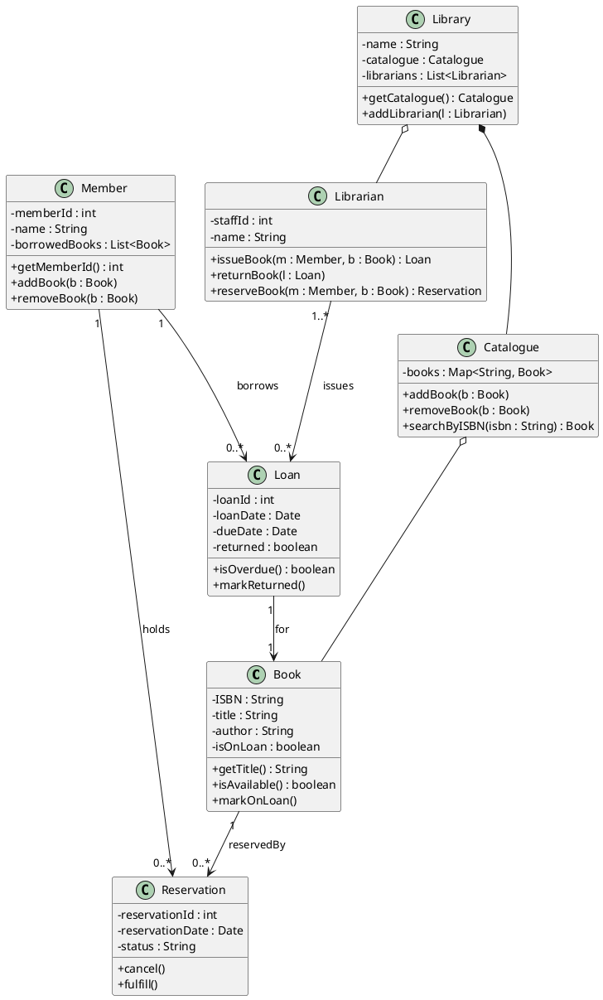
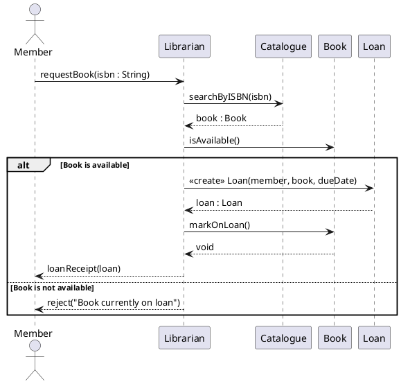
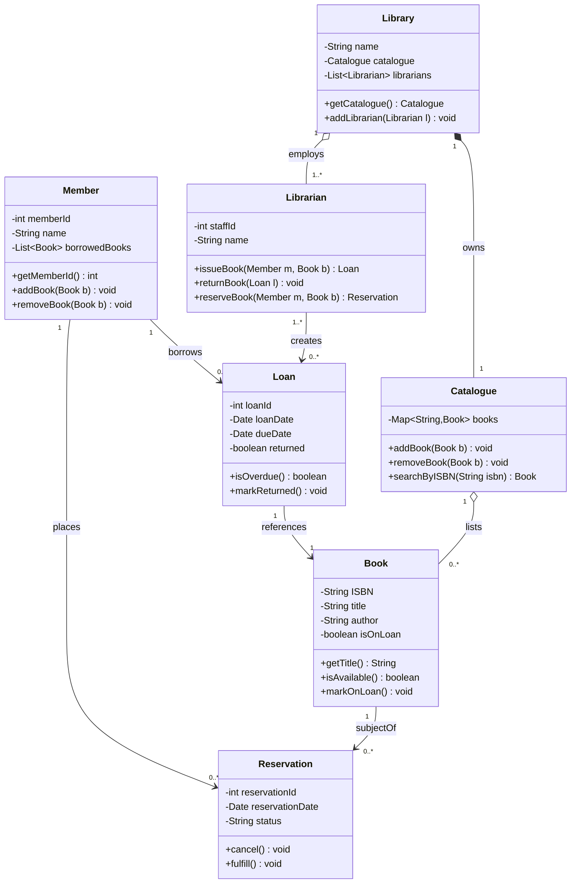
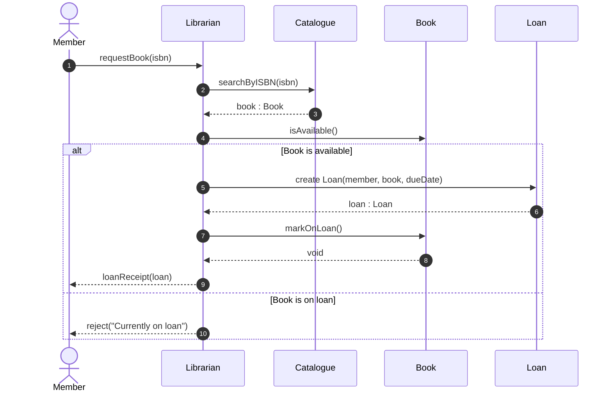
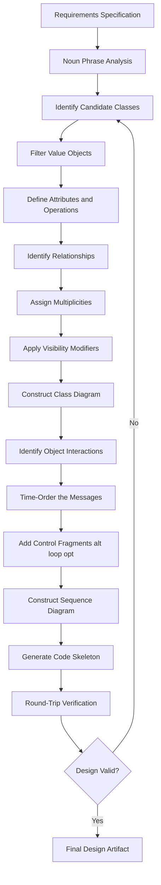
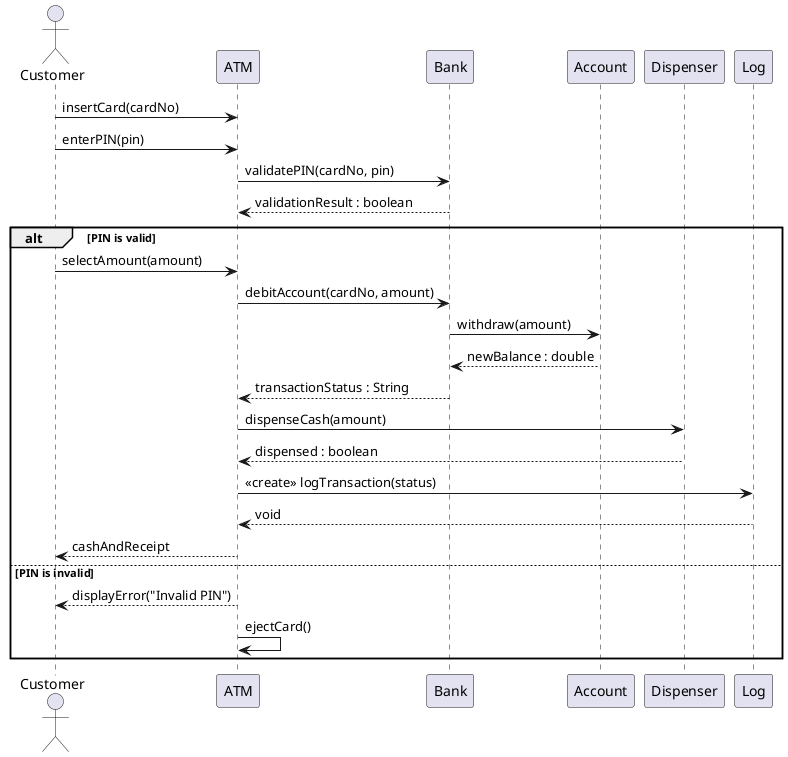

# Object-oriented design abstractions using UML class and sequence diagrams

<!-- SECTION_1_START -->
# Object-Oriented Design Abstractions using UML Class and Sequence Diagrams

## 1.1 Formal Definition (KTU 2024 Syllabus Terminology)

**Unified Modeling Language (UML)** is a standardized, general-purpose, visual modeling language governed by the **Object Management Group (OMG)** that provides a set of diagrams and notations for specifying, visualizing, constructing, and documenting the artifacts of a software-intensive system. In the **KTU 2024 Scheme Software Engineering (PECST402)** syllabus, UML is the primary vehicle for translating the requirements of an object-oriented system into a design blueprint that can be implemented in an OO programming language.

> [!NOTE]
> **OO Design Abstractions** are the four foundational pillars of Object-Oriented Design:
> 1. **Abstraction** – capturing essential features while hiding background details.
> 2. **Encapsulation** – bundling data and behavior into a single unit (the class) and restricting external visibility.
> 3. **Inheritance** – building new classes (subclasses) from existing ones (superclasses), enabling code reuse.
> 4. **Polymorphism** – the ability of a single interface to represent different underlying forms (data types or classes).

**Class Diagram** is a *static* (structural) UML diagram that depicts the types of objects in a system, the attributes and operations each class possesses, and the static relationships that exist between classes. It represents the *vocabulary* of the system.

**Sequence Diagram** is a *dynamic* (behavioral) UML interaction diagram that shows how objects collaborate by exchanging messages in a time-ordered sequence. It emphasizes the *chronology* of the message flow.

> [!IMPORTANT]
> **Syllabus Highlight (Module 2, KTU 2024 Scheme):** Class diagrams model **structure** (the *what* exists), while sequence diagrams model **behavior** (the *how* objects interact over time). Together they form the structural–behavioral backbone of OO design.

## 1.2 Intuitive Analogies

### Class Diagram → Architectural Blueprint
Think of a **class diagram** as the *architectural blueprint* of a building. Just as a blueprint shows every room (class), its measurements (attributes), and how the rooms connect (associations, doors, hallways) without describing *how* a person actually moves through the house, a class diagram shows the static skeleton of the system without describing runtime behavior.

### Sequence Diagram → Movie Storyboard / Cricket Score Sheet
A **sequence diagram** is like a **cricket score sheet** or a **movie storyboard**. The score sheet records, in strict chronological order, every ball bowled, who bowled it, who faced it, and the outcome. Similarly, a sequence diagram records every method call (message), in strict vertical-time order, between a *bowler object* and a *batsman object* and any *umpire/field object* invoked in between.

## 1.3 Core Components at a Glance

| Abstraction | Class Diagram Element | Sequence Diagram Element |
|-------------|----------------------|--------------------------|
| Identity | Class name (rectangle) | Object (rectangle at top) |
| State | Attributes block | Lifeline (vertical dashed line) |
| Behavior | Operations block | Activation bar (thin rectangle) |
| Interaction | Association / Multiplicity | Message arrow (→) |
| Time-order | Not explicit | Vertical (top→bottom) direction |

> [!VISUALIZATION CONTROL]
> **Concept:** UML Static vs. Dynamic View of a Library System
> **GeoGebra / Desmos Input Equations (Cartesian mapping of UML diagrams):**
> * `x(t) = 2t,  y(t) = 5 - t` → message flow line over time $t$
> * `C_{i} = { a_{1}, a_{2}, \dots, a_{n} }` → Class $C_i$ as a set of attributes
> **Visual Description:** Imagine a horizontal time axis (top-down) for the sequence diagram and a set of nested rectangles (Venn-style) representing class membership for the class diagram. The student should observe that the class diagram is *dimensionless* (no time axis), while the sequence diagram is *linearly ordered along the vertical time axis*.

## 1.4 Why UML Class & Sequence Diagrams?

In real-world software production, the cost of fixing a defect multiplies by a factor of **10x** at every subsequent development phase (requirements → design → coding → testing → production). UML class and sequence diagrams, when constructed during the design phase, act as a **contract between the design team and the implementation team**, drastically reducing rework. They are the de-facto standard in industry for documenting OO systems in Java, C++, C#, and Python ecosystems.

<!-- SECTION_1_END -->

<!-- SECTION_2_START -->
# Deep Theoretical Analysis & KTU High-Yield Formula Sheet

## 2.1 Anatomy of a UML Class

A class is depicted as a rectangle divided into **three compartments** (also called *compartments* or *sections*):

1. **Name compartment** – Class name in *PascalCase*, optionally prefixed by an abstract stereotype `<<abstract>>` or interface stereotype `<<interface>>`.
2. **Attribute compartment** – Declares the class's data members.
3. **Operation compartment** – Declares the class's methods.

### 2.1.1 Visibility Notation (Critical for KTU 14-Mark Questions)

UML defines four visibility modifiers that map directly to OO programming languages:

| UML Symbol | Visibility | Java / C++ Equivalent | Meaning |
|------------|------------|----------------------|---------|
| `+` | **Public** | `public` | Accessible from any class. |
| `-` | **Private** | `private` | Accessible only within the class itself. |
| `#` | **Protected** | `protected` | Accessible within the class and its subclasses. |
| `~` | **Package** | *default / package-private* | Accessible within the same package/namespace. |
| Underline | **Static / Class member** | `static` | Belongs to the class, not instances. |
| *Italic* | **Abstract** | `abstract` (in signature) | Must be overridden by concrete subclass. |

### 2.1.2 Attribute and Operation Syntax

The general form of a UML attribute declaration is:

$$\text{visibility} \;\; \text{name} \;\; [\text{multiplicity}] \;\; : \;\; \text{type} \;\; [\text{=} \text{default}] \;\; [\{ \text{property-string} \}]$$

The general form of a UML operation declaration is:

$$\text{visibility} \;\; \text{name} \;\; ([\text{parameter-list}]) \;\; : \;\; \text{return-type} \;\; [\{ \text{property-string} \}]$$

A sample fully-decorated UML class entry is:

$$
\begin{aligned}
&\texttt{-balance : double = 0.0} \\
&\texttt{+getBalance() : double} \\
&\texttt{\#calculateInterest(rate : double) : double \{abstract\}}
\end{aligned}
$$

## 2.2 The Six UML Class Relationships (High-Yield for KTU)

The relationships that may exist between classes form the *connective tissue* of the class diagram. KTU 2024 Scheme examiners frequently test these.

### 2.2.1 Association
A general semantic relationship where two classes are connected conceptually. Drawn as a **solid line** between the two classes. May be labelled with a **role name** and **multiplicity** at each end.

* **Example:** `Student` *enrolls in* `Course` (Student ↔ Course, many-to-many).

### 2.2.2 Aggregation (a weak *whole–part* relationship)
A *hollow* **diamond** (◇) on the *whole* side. The part **can exist independently** of the whole. Lifetime independence is the key.

* **Example:** `Department` ◇— `Faculty`. Faculty members exist even if the department is dissolved.

### 2.2.3 Composition (a strong *whole–part* relationship)
A *filled* **diamond** (◆) on the *whole* side. The part's lifetime is **coincident** with the whole's lifetime. If the whole is destroyed, the parts are destroyed too.

* **Example:** `House` ◆— `Room`. A room cannot exist without its house.

### 2.2.4 Generalization (Inheritance)
A **solid line with a hollow triangle** arrow pointing to the **superclass / parent**. Represents an "is-a" relationship.

* **Example:** `SavingsAccount` ▷— `Account`. A savings account *is a* kind of account.

### 2.2.5 Realization (Interface Implementation)
A **dashed line with a hollow triangle** arrow pointing to the **interface**. Represents a class *implementing* an interface contract.

* **Example:** `PaymentService` - - ▷ `IPayable` interface.

### 2.2.6 Dependency
A **dashed line with an open arrow** (or simply a dashed arrow) pointing from the dependent class to the class it depends on. Represents a "uses-a" relationship, typically transient (used in method parameter or local variable).

* **Example:** `OrderService` ⇢ `EmailClient`. The order service *uses* the email client to send a confirmation.

## 2.3 Multiplicity Notation

Multiplicity specifies how many instances of one class are associated with one instance of the other class.

| Notation | Meaning | Example Domain |
|----------|---------|----------------|
| `1` | Exactly one | Each `Person` has exactly `1` `birthCertificate` |
| `0..1` | Zero or one | Each `Employee` has `0..1` `companyCar` |
| `*` or `0..*` | Zero or many | A `Library` holds `*` `Book` objects |
| `1..*` | One or many | A `Team` has `1..*` `Player` objects |
| `n..m` | Specific range | A `Page` displays `10..20` `Advertisement` |

> [!TIP]
> **Quick Exam Trick:** In KTU valuation, full marks for a class-diagram question are awarded only when **multiplicity** is shown on **both** ends of every association. Drawing the line without multiplicity loses 1–2 marks.

## 2.4 Anatomy of a UML Sequence Diagram

### 2.4.1 Time, Space, and the Reading Order
* **Horizontal (X) axis** represents the **objects / participants** involved in the interaction. They are placed left-to-right in the order they are *created* or *become active*.
* **Vertical (Y) axis** represents the **flow of time**, increasing *downward*. The first message is at the top, the last message is at the bottom.

### 2.4.2 Core Lifelines & Activations

| Symbol | Name | Meaning |
|--------|------|---------|
| Stick figure or rectangle labelled `Actor` | **Actor** | External entity (user, system) initiating the flow. |
| Rectangle with underlined name `:ClassName` | **Object / Lifeline head** | An instance participating in the interaction. |
| Vertical dashed line | **Lifeline** | The lifetime of the object during the interaction. |
| Thin rectangle on a lifeline | **Activation (focus of control)** | The period during which the object is *actively executing* a method. |
| `X` at the end of a lifeline | **Object destruction** | The point at which the object is deleted. |

### 2.4.3 Message Types (Essential for KTU)

| Arrow Style | Message Type | Description |
|-------------|--------------|-------------|
| Solid line, filled arrowhead | **Synchronous (call)** | Sender waits until receiver finishes. |
| Open (stick) arrowhead, solid line | **Asynchronous** | Sender does not wait; continues execution. |
| Dashed line, open arrowhead | **Reply (return)** | The control / return value returned to the caller. |
| Solid line, half-arrowhead | **Asynchronous** with no reply | Fire-and-forget message. |
| Dashed line with open arrow + label `<<create>>` | **Object creation** | A message that creates a new object. |
| Dashed line with open arrow + label `<<destroy>>` | **Object destruction** | A message that deletes an object. |

### 2.4.4 Combined Fragments (Interaction Operators)

Combined fragments are used to model control-flow structures inside a sequence diagram. Each fragment is enclosed in a **rectangle with a label** in the top-left corner (called a *guard* or *operator*).

| Operator | Purpose | Equivalent Pseudocode |
|----------|---------|-----------------------|
| `alt` | Alternative paths (if-else) | `if (cond) { … } else { … }` |
| `opt` | Optional path | `if (cond) { … }` |
| `loop` | Repeated execution | `while (cond) { … }` |
| `par` | Parallel execution | `thread.start(); thread.start();` |
| `neg` | Invalid / negative scenario | Trace that should *not* occur |
| `ref` | Reference to another diagram | `include("LoginSeq");` |

## 2.5 KTU Formula Sheet / Cheat Sheet

| Concept | Symbol / Notation | Meaning | KTU Marks Implication |
|---------|-------------------|---------|----------------------|
| Class | Rectangle, 3 compartments | Static type | Always required in design questions. |
| Public visibility | `+` | Open access | Required on attributes / methods. |
| Private visibility | `-` | Restricted access | Encapsulation evidence. |
| Inheritance | `▷` hollow triangle | is-a | Tested in 14-mark questions. |
| Composition | `◆` filled diamond | owns-a (strong) | Strongest whole-part; KTU favourite. |
| Aggregation | `◇` hollow diamond | has-a (weak) | Lifetime independence matters. |
| Multiplicity `1..*` | One or many | Cardinality | Mandatory at both ends. |
| Sync message | `────▶` filled arrow | Blocking call | Default in sequence diagrams. |
| Async message | `─────>` stick arrow | Non-blocking call | Used for events. |
| Activation bar | Thin white rectangle | Focus of control | Indicates active execution. |
| `alt` fragment | Rectangle with `alt` label | Branching | Used for error / success paths. |
| `loop` fragment | Rectangle with `loop` label | Iteration | Used for repeated calls. |

> [!IMPORTANT]
> **Industry Use-Case Mapping:** Class and sequence diagrams are the *lingua franca* of API design tools. Modern IDEs and frameworks like **Spring Tool Suite (STS)**, **Visual Paradigm**, **StarUML**, **Lucidchart**, and **PlantUML** generate these diagrams directly from code or produce code stubs from the diagrams (a process called *round-trip engineering*). Tools like **Enterprise Architect (Sparx Systems)** use them as executable specifications for model-driven development (MDD).

<!-- SECTION_2_END -->

<!-- SECTION_3_START -->
# Step-by-Step Derivations, Walkthroughs & Code Implementation

## 3.1 Worked-Out Derivation: Designing a Library Management System

We will perform a *complete* end-to-end OO design for a small **Library Management System (LMS)** so that every KTU step is visible.

### 3.1.1 Step 1 — Identify Candidate Classes (from a Requirements Statement)

> *Requirement:* "A library lends books to registered members. A member may reserve a book that is currently on loan. A librarian manages the catalogue and the lending process. Each book has an ISBN, title, and author. Each member has a member ID and name. A book loan is recorded with a due date."

Candidate nouns (these become classes):
* `Library`, `Book`, `Member`, `Librarian`, `Loan`, `Reservation`, `Catalogue`, `Author`, `ISBN` (value), `DueDate` (value).

Filter out value-objects (e.g., ISBN, DueDate) — they will become *attributes* rather than classes.

**Final classes:** `Library`, `Book`, `Member`, `Librarian`, `Loan`, `Reservation`, `Catalogue`.

### 3.1.2 Step 2 — Identify Attributes and Operations for Each Class

| Class | Attributes | Operations |
|-------|-----------|------------|
| `Book` | `-ISBN : String`, `-title : String`, `-author : String`, `-isOnLoan : boolean` | `+getTitle() : String`, `+isAvailable() : boolean`, `+markOnLoan()` |
| `Member` | `-memberId : int`, `-name : String`, `-borrowedBooks : List<Book>` | `+getMemberId() : int`, `+addBook(b : Book)`, `+removeBook(b : Book)` |
| `Librarian` | `-staffId : int`, `-name : String` | `+issueBook(m : Member, b : Book) : Loan`, `+returnBook(l : Loan)`, `+reserveBook(m : Member, b : Book) : Reservation` |
| `Loan` | `-loanId : int`, `-loanDate : Date`, `-dueDate : Date`, `-returned : boolean` | `+isOverdue() : boolean`, `+markReturned()` |
| `Reservation` | `-reservationId : int`, `-reservationDate : Date`, `-status : String` | `+cancel()`, `+fulfill()` |
| `Catalogue` | `-books : Map<String, Book>` *(keyed by ISBN)* | `+addBook(b : Book)`, `+removeBook(b : Book)`, `+searchByISBN(isbn : String) : Book` |
| `Library` | `-name : String`, `-catalogue : Catalogue`, `-librarians : List<Librarian>` | `+getCatalogue() : Catalogue`, `+addLibrarian(l : Librarian)` |

### 3.1.3 Step 3 — Identify Relationships with Multiplicity

| Source Class | Multiplicity | Relation Type | Target Class | Multiplicity | Rationale |
|--------------|--------------|---------------|--------------|--------------|-----------|
| `Library` | 1 | Composition (◆) | `Catalogue` | 1 | Catalogue lives and dies with the library. |
| `Library` | 1 | Aggregation (◇) | `Librarian` | 1..* | A library has many librarians; librarians could (in theory) be reassigned. |
| `Catalogue` | 1 | Aggregation (◇) | `Book` | 0..* | The catalogue contains references to many books; books can exist outside the catalogue. |
| `Member` | 1 | Association | `Loan` | 0..* | A member may have zero or many active loans. |
| `Loan` | 1 | Association | `Book` | 1 | A loan is always for exactly one book. |
| `Librarian` | 1..* | Association | `Loan` | 0..* | A librarian issues many loans. |
| `Member` | 1 | Association | `Reservation` | 0..* | A member may have many reservations. |

### 3.1.4 Step 4 — Step-by-Step Realization in PlantUML (Industry-Standard Pseudocode)

The following PlantUML code can be pasted into [https://www.plantuml.com](https://www.plantuml.com) to render the class diagram automatically:



### 3.1.5 Step 5 — Verification Checklist Before Submission

| Check | Status (✓ / ✗) |
|-------|----------------|
| All three compartments drawn for every class | ✓ |
| Visibility shown on every attribute and operation | ✓ |
| Multiplicity shown on **both** ends of every association | ✓ |
| Composition vs. aggregation diamond correctness | ✓ |
| No zero-multiplicity (invalid UML) | ✓ |
| No line crossings (presentation polish) | ✓ |

---

## 3.2 Worked-Out Derivation: Sequence Diagram for `Issue Book` Use Case

The use case is: *"A member requests a book. The librarian checks the catalogue. If the book is available, the librarian creates a loan, marks the book as on-loan, and returns the loan receipt to the member."*

### 3.2.1 Step 1 — Identify the Object Set
* `member : Member` — external actor.
* `librarian : Librarian` — boundary / control.
* `catalogue : Catalogue` — entity.
* `book : Book` — entity.
* `loan : Loan` — entity (created during the interaction).

### 3.2.2 Step 2 — Message Trace (Time-Ordered)

| # | Time $t_i$ | Sender | Message | Receiver | Type | Returns |
|---|-----------|--------|---------|----------|------|---------|
| 1 | $t_1$ | `member` | `requestBook(isbn)` | `librarian` | Sync | `void` |
| 2 | $t_2$ | `librarian` | `searchByISBN(isbn)` | `catalogue` | Sync | `Book` |
| 3 | $t_3$ | `librarian` | `isAvailable()` | `book` | Sync | `boolean` |
| 4a | $t_4$ | `librarian` | `<<create>>` | `loan` | Sync | `Loan` |
| 4b | $t_4$ | `librarian` | `markOnLoan()` | `book` | Sync | `void` |
| 5 | $t_5$ | `librarian` | `loanReceipt` | `member` | Async | — |

### 3.2.3 Step 3 — Add the `alt` Fragment for the Unavailable Case

The `alt` block is used at the point where the librarian checks `isAvailable()`. The `[available]` branch executes the issuing flow, the `[not available]` branch shows the rejection.

### 3.2.4 PlantUML Code for the Sequence Diagram



> [!NOTE]
> **Time-axis confirmation:** The vertical time ordering in the PlantUML output is enforced by the textual order of the lines. Each subsequent `->` message appears *lower* on the lifeline. Returning messages use `-->`.

---

## 3.3 Python Code Implementation (Skeleton Generated from the Class Diagram)

The following Python code is a one-to-one mapping of the class diagram above. Type hints are used to express UML types; comments on visibility mimic the `+` / `-` / `#` notation.

```python
from __future__ import annotations
from dataclasses import dataclass, field
from datetime import date
from typing import Dict, List, Optional
import logging

logging.basicConfig(level=logging.INFO, format="[%(asctime)s] %(levelname)s - %(message)s")
logger = logging.getLogger("LibraryLMS")


@dataclass
class Book:
    """Maps to UML Class: Book. All instance fields are private (-)."""
    ISBN: str               # private
    _title: str             # private (name-mangled equivalent)
    _author: str            # private
    _is_on_loan: bool = False  # private

    def get_title(self) -> str:
        """Public +getTitle() : String"""
        return self._title

    def is_available(self) -> bool:
        """Public +isAvailable() : boolean"""
        return not self._is_on_loan

    def mark_on_loan(self) -> None:
        """Public +markOnLoan()"""
        if self._is_on_loan:
            raise ValueError(f"Book {self.ISBN} is already on loan.")
        self._is_on_loan = True
        logger.info("Book %s marked on loan.", self.ISBN)


@dataclass
class Member:
    """Maps to UML Class: Member."""
    member_id: int                       # private (-memberId : int)
    name: str                            # private (-name : String)
    borrowed_books: List[Book] = field(default_factory=list)  # private

    def add_book(self, book: Book) -> None:
        if not book.is_available():
            raise ValueError("Book is not available for borrowing.")
        book.mark_on_loan()
        self.borrowed_books.append(book)
        logger.info("Member %s borrowed book %s.", self.member_id, book.ISBN)

    def remove_book(self, book: Book) -> None:
        if book in self.borrowed_books:
            self.borrowed_books.remove(book)
            logger.info("Member %s returned book %s.", self.member_id, book.ISBN)


@dataclass
class Loan:
    loan_id: int
    loan_date: date
    due_date: date
    returned: bool = False

    def is_overdue(self, today: date) -> bool:
        return (not self.returned) and (today > self.due_date)

    def mark_returned(self) -> None:
        self.returned = True
        logger.info("Loan %s marked as returned.", self.loan_id)


@dataclass
class Librarian:
    staff_id: int
    name: str

    def issue_book(self, member: Member, book: Book) -> Loan:
        if not book.is_available():
            raise LookupError("Cannot issue: book is already on loan.")
        loan = Loan(
            loan_id=hash((member.member_id, book.ISBN)) & 0x7FFFFFFF,
            loan_date=date.today(),
            due_date=date.today()
        )
        member.add_book(book)
        return loan

    def return_book(self, member: Member, book: Book) -> None:
        member.remove_book(book)
        book._is_on_loan = False
        logger.info("Book %s returned and made available.", book.ISBN)


@dataclass
class Catalogue:
    books: Dict[str, Book] = field(default_factory=dict)

    def add_book(self, book: Book) -> None:
        self.books[book.ISBN] = book

    def search_by_isbn(self, isbn: str) -> Optional[Book]:
        return self.books.get(isbn)


@dataclass
class Library:
    name: str
    catalogue: Catalogue
    librarians: List[Librarian] = field(default_factory=list)

    def add_librarian(self, librarian: Librarian) -> None:
        self.librarians.append(librarian)


# ---------- Boundary checks / smoke test ----------
if __name__ == "__main__":
    catalogue = Catalogue()
    b1 = Book(ISBN="978-0-13-468599-1", _title="The Pragmatic Programmer", _author="Hunt & Thomas")
    catalogue.add_book(b1)

    lib = Library(name="KTU Central Library", catalogue=catalogue)
    lib.add_librarian(Librarian(staff_id=1, name="Asha"))

    member = Member(member_id=1001, name="Rahul")
    lib.librarians[0].issue_book(member, b1)
    assert not b1.is_available(), "Boundary check: book should be unavailable after issuing."
    print("Smoke test passed.")
```

> [!IMPORTANT]
> **Key Code-to-Diagram Mapping Insight (Valuable for KTU 14-Mark Answers):**
> * `Book` in the class diagram is mapped 1:1 to `@dataclass Book` here.
> * The association `Member "1" --> "0..*" Loan` is materialized as `Member.borrowed_books: List[Book]`.
> * `Librarian.issue_book()` mirrors the `<<create>> Loan` message in the sequence diagram.
> * Every public method of a class corresponds to a *message* in the sequence diagram. If the code can do it, the diagram must show it; if the diagram shows it, the code must implement it.

---

## 3.4 Derivation of Multiplicities from a Use-Case Specification

Suppose a KTU question provides the following use-case text:
> "Each *course* is taught by *exactly one* professor. A professor teaches *one or more* courses. A course has *zero or more* students enrolled. A student is enrolled in *one or more* courses."

The multiplicities are derived by parsing the quantifiers and the verbs:

| Relationship | Verb of Multiplicity | Multiplicity Pair |
|--------------|----------------------|-------------------|
| `Professor` teaches `Course` | "exactly one" ↔ "one or more" | `Professor "1" ── "1..*" Course` |
| `Student` enrolls in `Course` | "zero or more" ↔ "one or more" | `Student "0..*" ── "1..*" Course` |

> [!TIP]
> **KTU Examiner's Quick Test:** If the text uses the phrase *"exactly one,"* the multiplicity is always `1`. If the text uses *"one or more,"* the multiplicity is always `1..*`. If the text says *"may have,"* the multiplicity starts at `0`.

<!-- SECTION_3_END -->

<!-- SECTION_4_START -->
# Structural Diagrams & Schematics

## 4.1 Mermaid Class Diagram — Library Management System



### 4.1.1 Reading Guide
* The hollow triangle `▷` represents **Generalization / Inheritance**.
* The filled diamond `◆` represents **Composition**.
* The open diamond `◇` represents **Aggregation**.
* A solid line with no diamond represents a **plain Association** (with multiplicities at both ends).
* A dashed arrow (`- - >`) represents **Dependency** (not used in the diagram above, but available).

## 4.2 Mermaid Sequence Diagram — Issue Book Use Case



## 4.3 OO Design Process Flow (Mermaid Block-Level Functional Topology)



### 4.3.1 Topology Description
* **Block A–B** are the *requirements-to-design* bridge.
* **Block C–G** are the *static modeling* phase producing the class diagram.
* **Block H–I** are the *decoration* phase (visibility, stereotypes).
* **Block J–M** are the *dynamic modeling* phase producing sequence diagrams.
* **Block N–Q** are the *implementation and verification* loop.

> [!NOTE]
> **Why the iterative loop (P → C)?** Object-oriented design is intrinsically iterative. Discovering a new responsibility often reveals a missing class or a refactored relationship. The block-level topology reflects the **Unified Process** discipline of *use-case driven, architecture-centric, iterative, and incremental* development.

## 4.4 Decision Matrix: Which UML Relationship to Use?

| Scenario | Recommended Relationship | Reason |
|----------|--------------------------|--------|
| Two classes collaborate but neither owns the other | **Association** | Loose coupling, peer-to-peer. |
| Whole is a *physical container* of parts | **Composition** | Parts cannot exist without the whole (House–Room). |
| Whole is a *logical* grouping of parts | **Aggregation** | Parts have independent lifetime (Department–Faculty). |
| Subclass *is a kind of* superclass | **Generalization** | Taxonomic hierarchy (SavingsAccount–Account). |
| Class fulfils an external contract | **Realization** | Interface implementation (Circle–Shape). |
| Class uses another *transiently* (parameter, local variable) | **Dependency** | Weakest coupling. |

<!-- SECTION_4_END -->

<!-- SECTION_5_START -->
# KTU 2024 Scheme Examination Question Bank & Topic Recap

> [!NOTE]
> **Mark Distribution Reference (KTU 2024 Scheme End-Semester Exam, PECST402):**
> * Part A: 2 questions × 3 marks = 6 marks
> * Part B: Module Internal Choice — answer **one** of the two alternatives per module, each carries 14 marks.
> * Each 14-mark question is split into two 7-mark sub-parts.

---

## 5.1 Part A — Short-Answer Questions (3 Marks Each)

### Question 1
`[KTU University Exam – July 2024]`
**Define a UML class diagram. List any four relationships that can exist between classes with a one-line example of each.** `[CO2, Understand]`

**Model Answer (3 Marks):**

A **UML class diagram** is a static structural diagram that describes the types of objects in a system, the attributes and operations each class possesses, and the static relationships that exist between classes. `[1 Mark]`

Four relationships: `[2 Marks — 0.5 each]`
* **Association** — A `Student` *enrolls in* a `Course` (many-to-many).
* **Aggregation** — A `Department` ◇— `Faculty` (whole–part, weak ownership).
* **Composition** — A `House` ◆— `Room` (whole–part, strong ownership).
* **Inheritance** — `SavingsAccount` ▷— `Account` (is-a relationship).

### Question 2
`[KTU University Exam – Dec 2023]`
**Differentiate between aggregation and composition in UML class diagrams. Give one example of each.** `[CO2, Understand]`

**Model Answer (3 Marks):**

| Feature | Aggregation (◇) | Composition (◆) |
|---------|------------------|------------------|
| Symbol | Hollow diamond on whole | Filled diamond on whole |
| Lifetime | Part can exist after whole is destroyed | Part's lifetime equals the whole's |
| Strength | Weak *has-a* | Strong *owns-a* |
| Example | `Department` ◇— `Professor` | `File` ◆— `DirectoryEntry` |

`[1 Mark for each correct row, 1 Mark for valid examples]`

---

## 5.2 Part B — Full 14-Mark Question Bank (Module 2 — Internal Choice)

### Question A (14 Marks) — Class Diagram Focus
`[KTU University Exam – Dec 2024, Module 2, Q-Choice-A]`

**Scenario:**
> *"A hospital management system must manage patients, doctors, and appointments. Each patient has a patient ID, name, and date of birth. Each doctor has a doctor ID, name, and a specialization. A patient books an appointment with exactly one doctor for a specific date and time. A doctor can have zero or more appointments scheduled on different dates. The hospital maintains a registry of patients and doctors."*

#### Part (a) — 7 Marks `[CO2, Understand]`
**Identify the candidate classes, their attributes, and operations. Draw a complete UML class diagram for the system, showing visibility, multiplicities, and all appropriate relationships.**

**Model Solution:**

**Step 1 — Classes identified (1 Mark):** `Patient`, `Doctor`, `Appointment`, `Hospital`, `Registry`.

**Step 2 — Attributes and Operations (2 Marks):**

| Class | Attributes | Operations |
|-------|-----------|------------|
| `Patient` | `-patientId : int`, `-name : String`, `-dob : Date` | `+getName() : String`, `+getAge() : int` |
| `Doctor` | `-doctorId : int`, `-name : String`, `-specialization : String` | `+getSpecialization() : String` |
| `Appointment` | `-appointmentId : int`, `-date : Date`, `-time : Time`, `-status : String` | `+cancel() : void`, `+reschedule(d : Date) : void` |
| `Hospital` | `-name : String`, `-address : String` | `+getRegistry() : Registry` |
| `Registry` | `-patients : Map<int,Patient>`, `-doctors : Map<int,Doctor>` | `+addPatient(p : Patient)`, `+searchDoctor(id : int) : Doctor` |

**Step 3 — Relationships and Multiplicities (2 Marks):**
* `Hospital` *composes* `Registry` — `Hospital "1" *-- "1" Registry`
* `Registry` *aggregates* `Patient` and `Doctor` — `Registry "1" o-- "0..*" Patient`, `Registry "1" o-- "0..*" Doctor`
* `Patient` *associates with* `Appointment` — `Patient "1" --> "0..*" Appointment`
* `Doctor` *associates with* `Appointment` — `Doctor "1" --> "0..*" Appointment`
* `Appointment` *references* one `Patient` and one `Doctor` — multiplicitively pinned to `1` on both sides for the appointment side.

**Step 4 — Validation Checklist (2 Marks):** Visibility applied, multiplicities at both ends, no symbol errors, no value-object leakage.

`[Identifying 5 classes: 1 Mark]`
`[Attributes and operations correctly listed: 2 Marks]`
`[Relationships and multiplicities: 2 Marks]`
`[Visibility and notation correctness: 2 Marks]`

#### Part (b) — 7 Marks `[CO3, Apply]`
**Choose **any one** real-world extension (e.g., add a `Billing` subsystem that produces a `Bill` for each completed `Appointment`). Modify the class diagram from part (a) to include this extension. Justify each new relationship with a one-line rationale.**

**Model Solution (Choosing the Billing Extension):**

**Step 1 — Add new class `Bill` (1 Mark):**
* Attributes: `-billId : int`, `-amount : double`, `-dateGenerated : Date`, `-paid : boolean`
* Operations: `+calculateTotal() : double`, `+markPaid() : void`, `+getReceipt() : String`

**Step 2 — New relationships (4 Marks):**
* `Appointment` *creates* `Bill` — composition: `Appointment "1" *-- "0..1" Bill : generates`. Justification: a bill is meaningless without its parent appointment; if the appointment is deleted, the bill is also deleted.
* `Bill` *is paid by* `Patient` — association: `Bill "1" --> "1" Patient : paidBy`. Justification: a bill is always paid by exactly one patient.
* `Bill` *is processed by* `Hospital` — association: `Bill "0..*" --> "1" Hospital : issues`. Justification: the hospital as a legal entity issues all bills.
* `Bill` *references* `Doctor` (for consultation fee breakdown) — association: `Bill "1" --> "1" Doctor : forConsultationBy`. Justification: each bill line item is tied to a specific consulting doctor.

**Step 3 — New attributes on `Bill` (1 Mark):** `+taxRate : double = 0.18`, `+discountPercent : double = 0`.

**Step 4 — Justification summary (1 Mark):** Composition is preferred for the `Bill` because the bill's lifetime is exactly that of the appointment; an appointment that never happens cannot produce a bill.

`[Adding Bill class with attributes: 1 Mark]`
`[Three correct relationships with multiplicities: 3 Marks]`
`[Composition vs. aggregation choice justified: 1 Mark]`
`[Modifications integrate cleanly with the original diagram: 1 Mark]`
`[Operation additions to Bill: 1 Mark]`

> [!WARNING]
> **KTU Examiner's Valuation Warning — Common Pitfalls:**
> 1. **Forgetting to show multiplicity on both ends.** A 14-mark class diagram question will deduct 1–2 marks per missing multiplicity pair.
> 2. **Using the wrong diamond.** A hollow diamond for a part whose lifetime is fully dependent on the whole (e.g., a `Bill` whose life ends with the `Appointment`) loses the composition mark.
> 3. **Mixing up `Dependency` and `Association`.** If the class holds a *reference* as a field, it is an **association**. If the class merely mentions the other in a method parameter, it is a **dependency**.
> 4. **Not using stereotypes for interfaces.** A Java `interface` should be drawn with the `<<interface>>` stereotype and a dashed realization line, not a solid inheritance line.
> 5. **Forgetting direction on messages.** A sequence diagram without arrowheads loses marks because direction is the central meaning of the diagram.

---

### Question B (14 Marks) — Sequence Diagram Focus
`[KTU University Exam – July 2024, Module 2, Q-Choice-B]`

**Scenario:**
> *"Consider an ATM system. The customer inserts a card, enters a PIN, and selects 'Withdraw Cash'. The ATM validates the PIN with the bank. If valid, the ATM dispenses the cash and updates the customer's account balance. If invalid, the ATM displays an error and ejects the card. Each transaction is logged."*

#### Part (a) — 7 Marks `[CO3, Apply]`
**Identify the objects involved in the 'Withdraw Cash' use case and draw a complete UML sequence diagram. Use an `alt` fragment to model success and failure paths.**

**Model Solution:**

**Step 1 — Object identification (1 Mark):** `customer : Customer`, `atm : ATM`, `bank : BankServer`, `account : Account`, `cashDispenser : CashDispenser`, `log : TransactionLog`.

**Step 2 — PlantUML sequence diagram code (4 Marks — the textual narrative earns full credit if the diagram is hand-drawn):**



**Step 3 — Time-axis correctness (1 Mark):** All messages flow top-to-bottom, return arrows (`-->`) are used, and the `alt` fragment is properly enclosed.

**Step 4 — Explanation of message types (1 Mark):** All `->` are synchronous; the `cashAndReceipt` return to the customer is the final reply.

`[Identifying ≥5 objects: 1 Mark]`
`[Drawing lifeline rectangles with correct labels: 1 Mark]`
`[Drawing all 8–10 messages in correct vertical order: 2 Marks]`
`[Using alt fragment correctly with two guards: 2 Marks]`
`[Showing one asynchronous or reply message correctly: 1 Mark]`

#### Part (b) — 7 Marks `[CO4, Analyze]`
**Refactor the sequence diagram from part (a) by introducing a `<<loop>>` fragment to handle the case where the customer enters the wrong PIN three times. What design contract does this enforce on the `BankServer` class?**

**Model Solution:**

**Step 1 — New `loop` fragment placement (2 Marks):** A `loop[attempts < 3]` block is wrapped around the `enterPIN → validatePIN` message exchange. Each failed validation increments `attempts` and re-prompts the customer. If `attempts == 3`, the `loop` exits and a `<<destroy>>` message ejects and **retains** the card.

**Step 2 — New `opt` fragment for card retention (2 Marks):** Outside the loop, an `opt[attempts == 3]` block shows a `retainCard()` self-message on the ATM that also creates a security log entry via `Log.logSecurityEvent("Card retained")`.

**Step 3 — Contract on `BankServer` (2 Marks):**
* **Pre-condition:** `validatePIN()` must be idempotent and side-effect free.
* **Post-condition on success:** A new authenticated session token is returned to the ATM, valid for 30 seconds.
* **Invariant:** The card is locked for 24 hours after 3 consecutive failed attempts.
* **Exception:** Throws `CardBlockedException` after the third failure.

**Step 4 — PlantUML refactored snippet (1 Mark):**

```plantuml
loop attempts < 3
    C -> A : enterPIN(pin)
    A -> B : validatePIN(cardNo, pin)
    B --> A : valid : boolean
    opt not valid
        A --> C : promptAgain("Invalid PIN")
    end
end

opt attempts == 3
    A -> A : retainCard()
    A -> L : logSecurityEvent("Card retained: " + cardNo)
end
```

`[Correctly placing the loop fragment: 2 Marks]`
`[Modifying control flow with opt fragment: 2 Marks]`
`[Defining pre/post/invariant contracts: 2 Marks]`
`[Documenting the exception path: 1 Mark]`

> [!WARNING]
> **KTU Examiner's Valuation Warning — Sequence Diagram Pitfalls:**
> 1. **Drawing a class diagram instead of a sequence diagram.** This is the #1 reason students lose 7 marks on Part B. Sequence diagrams are *time-ordered* and *vertical*. No boxes inside boxes, no inheritance.
> 2. **Forgetting to return values on synchronous calls.** A sync message that returns a value must show a `return` arrow or a label on the dashed return line.
> 3. **No activation bars.** Activation bars are visual proof of *who is in control*. Their absence costs 1 mark.
> 4. **Mixing up `<<create>>` and `<<destroy>>`.** Creating a new object should appear as a *new lifeline* starting at the message; destruction appears as an `X` at the end of a lifeline.
> 5. **No message numbering.** Adding `autonumber` is optional but earns the "presentation polish" mark.

---

## 5.3 Topic Recap & Important Things to Remember

> [!IMPORTANT]
> **Rapid-Revision Checklist for Object-Oriented Design Abstractions using UML Class and Sequence Diagrams:**

* **UML is a visual language, not a programming language.** It is governed by **OMG** and standardized as **ISO/IEC 19505**.
* The **four OO abstractions** are: **Abstraction, Encapsulation, Inheritance, Polymorphism**. KTU 14-mark questions almost always test all four across the class diagram.
* A **class diagram is static**; a **sequence diagram is dynamic**. Class diagrams show *what* exists; sequence diagrams show *how* they interact over time.
* **Visibility symbols:** `+` (public), `-` (private), `#` (protected), `~` (package). Underline = static. Italics = abstract.
* **Six relationships, in increasing strength of coupling:** Dependency → Association → Aggregation → Composition → Realization → Generalization.
* **Multiplicity must appear at BOTH ends of every association.** A class diagram without multiplicity is incomplete.
* **Composition vs. Aggregation:** Filled diamond = part dies with the whole. Hollow diamond = part outlives the whole.
* **Sequence diagram time axis is vertical**, increasing downward. The first message is at the top, the last at the bottom.
* **Synchronous message** = filled arrowhead, blocks sender. **Asynchronous** = open arrowhead, non-blocking. **Return** = dashed line with open arrowhead.
* **Combined fragments** are essential for modeling control flow: `alt` for branches, `opt` for optional paths, `loop` for iteration, `par` for parallel execution.
* **Activation bars** (thin rectangles on a lifeline) show the duration for which an object is in active execution. They must always be present in detailed sequence diagrams.
* **Round-trip engineering** is the bidirectional traceability between the UML model and the source code. Modern tools (Enterprise Architect, Visual Paradigm, PlantUML, StarUML) support it.
* **Industry tooling:** PlantUML, Lucidchart, StarUML, Visual Paradigm, Sparx EA, draw.io, Mermaid — all are acceptable for the KTU 2024 practical examinations.
* **Every public method on a class diagram should appear as a message in at least one sequence diagram.** This is the cardinal rule of OO consistency.
* **For 14-mark KTU Part B answers:** Always show (i) class diagram with multiplicity and visibility, (ii) sequence diagram with at least one `alt`/`opt`/`loop` fragment, (iii) a short textual mapping between the two diagrams and your code.

<!-- SECTION_5_END -->
