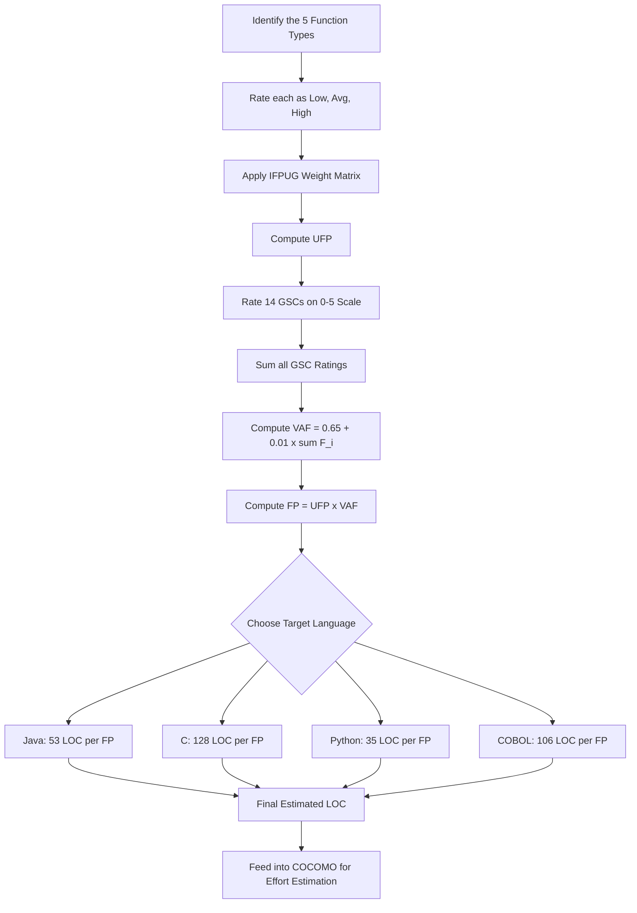
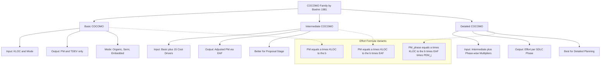
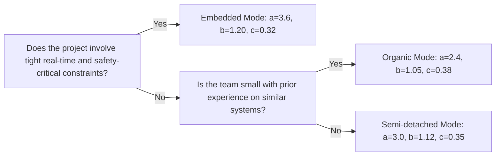
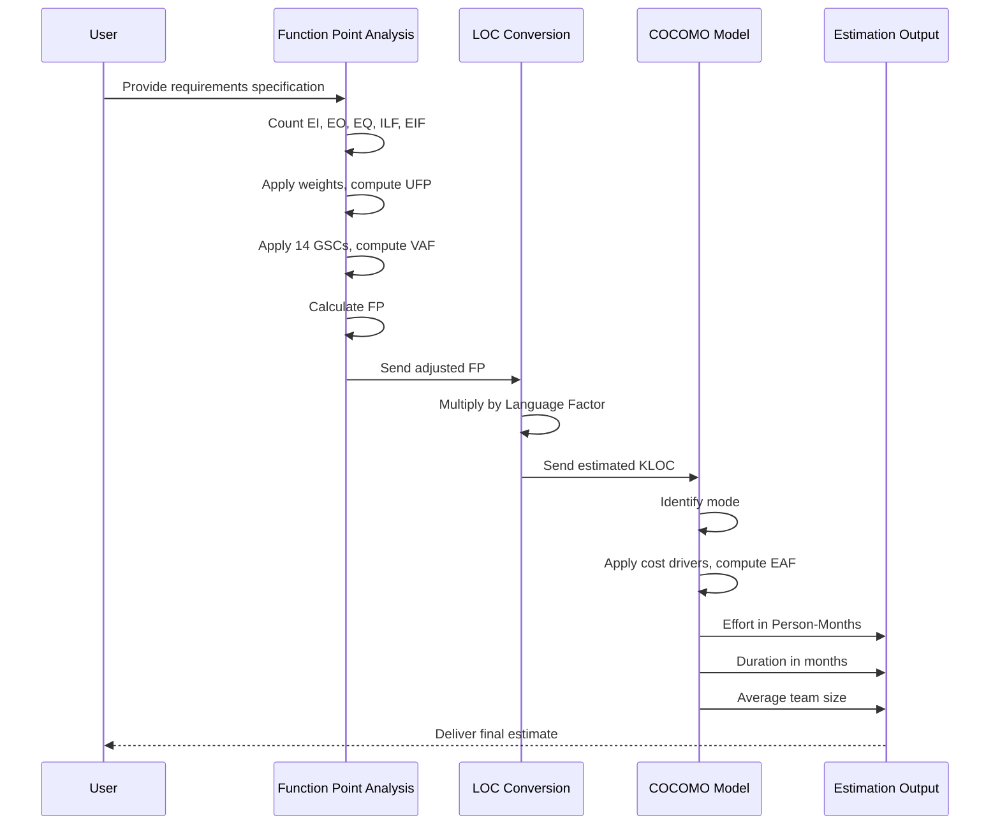

# Software metrics: Function Point (FP) analysis, COCOMO estimation framework models

<!-- SECTION_1_START -->

# 📘 Module 2: Design & Quality Engineering
## Topic: Software Metrics — Function Point (FP) Analysis & COCOMO Estimation Framework

> [!IMPORTANT]
> **KTU 2024 Scheme — Course Outcome Mapping (PECST402)**
> This topic directly maps to **CO2**: *Estimate software size, effort, cost, and duration using standard industry metrics and estimation models with appropriate quality adjustment factors.*

---

### 1.1 What is a Software Metric?

A **Software Metric** is a quantitative measure of an attribute of a software product, process, or project that possesses the following properties:

- It is **measurable** (numerical value can be assigned).
- It is **understandable** (interpretation is unambiguous).
- It is **repeatable** (same result under same conditions).
- It is **objective** (independent of observer bias).
- It is **economical** (cost of measurement is acceptable).

> [!NOTE]
> **KTU Definition (as per syllabus):** *A software metric is a standard of measure that contains the implications, decision criteria, and thresholds used to plan, develop, perform, and evaluate software engineering activities and products.*

Two fundamental categorizations in KTU syllabus:

| Type | Question Answered | Examples |
|------|------------------|----------|
| **Product Metrics** | How good is the product? | Size (LOC, FP), Reliability (MTTF), Quality (Defect Density) |
| **Process Metrics** | How good is the process? | Effort, Cost, Productivity, Cycle Time |

---

### 1.2 Function Point Analysis (FPA) — The Big Picture

> [!IMPORTANT]
> **Formal KTU Definition:**
> *Function Point (FP) is a unit of measurement that quantifies the business functionality provided by a software application, from the user's perspective, independent of the programming language used for implementation.*

It was originally proposed by **Allan J. Albrecht** at **IBM (1979)** and later refined by the **International Function Point Users Group (IFPUG)**.

**Why is FP a language-independent metric?**
Because it measures **"what" the software does** (functionality delivered) and not **"how"** it is implemented (LOC of a particular language).

#### 🎯 Conceptual Analogy — "The Restaurant Bill Analogy"

Imagine you go to a restaurant. The bill is not calculated by the *weight of the food cooked* (lines of code in a specific language), but by the **number and type of items ordered** (inputs, outputs, files maintained, queries asked).

- **Ordered items** → **External Inputs / Outputs** (transactions)
- **Number of people served** → **Inquiries** (read-only)
- **Records of past orders stored** → **Internal Logical Files**
- **Menu shared with the hotel next door** → **External Interface Files**

Just as the bill reflects *value delivered to the customer*, **Function Points reflect value delivered to the end-user**.

#### 📦 The Five Building Blocks of FP

| Symbol | Component | Description | Example |
|--------|-----------|-------------|---------|
| **EI** | External Input | Data entering the system across boundary | Login form, Add Customer |
| **EO** | External Output | Data leaving the system (reports, screens with derived data) | Salary Slip, Bill |
| **EQ** | External Inquiry | Read-only input-output pair (no internal data manipulated) | View Account Balance |
| **ILF** | Internal Logical File | Logical group of data maintained *inside* the system | Customer table |
| **EIF** | External Interface File | Logical group of data referenced but *not* maintained by system | Tax DB referenced |

> [!NOTE]
> **Syllabus Highlight:** The five components above are exhaustively tested in KTU exams. Memorize the abbreviations **EI, EO, EQ, ILF, EIF** in order.

---

### 1.3 COCOMO — The Constructive Cost Model

> [!IMPORTANT]
> **Formal Definition:**
> *COCOMO (Constructive Cost Model) is a procedural software cost estimation model proposed by **Barry W. Boehm (1981)** that estimates effort, cost, and schedule of a software project based on the size of the software (in KLOC) and a set of cost drivers that influence productivity.*

**COCMO's core philosophy:** *"Software effort is fundamentally a function of program size, scaled by project, product, hardware, and personnel factors."*

#### 🎯 Conceptual Analogy — "The Construction Contractor Analogy"

Think of building a house:

- The **size of the house** (number of bricks/rooms) → **KLOC** (Thousands of Lines of Code).
- The **type of terrain** (plain, hilly, rocky) → **Project Mode** (Organic, Semi-detached, Embedded).
- The **weather conditions, material quality, worker skill** → **Cost Drivers** (15 attributes).
- The **final estimate** of cost and time → **COCOMO Output** (Effort in Person-Months, Duration).

Just as an experienced contractor tweaks the estimate based on terrain, weather, and workforce, **COCOMO adjusts the raw size-based estimate using cost drivers**.

#### 🏗️ The Three Hierarchies of COCOMO

| Model | Inputs | Precision | When Used |
|-------|--------|-----------|-----------|
| **Basic COCOMO** | KLOC + Project Mode | Lowest (rough estimate) | Early feasibility studies |
| **Intermediate COCOMO** | KLOC + Mode + 15 Cost Drivers | Medium (planning) | Proposal/contract stage |
| **Detailed COCOMO** | KLOC + Mode + Cost Drivers + Phase-wise | High (detailed) | Architectural design stage |

> [!VISUALIZATION CONTROL]
> **Concept:** Effort-vs-Size Curve Across Three COCOMO Modes
> **Desmos Input Equations (try plotting):**
> * `E_organic = 2.4 * x^1.05`  *(blue curve)*
> * `E_semi = 3.0 * x^1.12`      *(orange curve)*
> * `E_embedded = 3.6 * x^1.20`  *(red curve)*
> * Set $x$ range = $[1, 100]$ (KLOC); observe the *fan-out*: embedded systems scale super-linearly.
> **Visual Description:** The embedded curve rises much faster than the organic one — meaning *small increases in size cause disproportionately large effort increases in complex systems.*

---

<!-- SECTION_2_END -->

<!-- SECTION_3_START -->

# 🧮 Deep Theoretical Analysis & High-Yield Formula Sheet

---

## 2.1 Function Point Analysis — Step-by-Step Theoretical Breakdown

### Step 1: Identify the Five Components (Counting Function Points)

Each of the five function types is rated as **Low, Average, or High** complexity based on:

- **Number of Data Element Types (DETs)** — distinct user-recognizable fields.
- **Number of Record Element Types (RETs)** — sub-groupings of data (for files).
- **Number of File Types Referenced (FTRs)** — for transactions.

### Step 2: Apply the Complexity Weighting Matrix

> [!IMPORTANT]
> **High-Yield Table — KTU Board Favorite (memorize the numbers):**

| Function Type | Abbrev. | Low | Average | High |
|---------------|---------|-----|---------|------|
| External Inputs | **EI** | **3** | **4** | **6** |
| External Outputs | **EO** | **4** | **5** | **7** |
| External Inquiries | **EQ** | **3** | **4** | **6** |
| External Interface Files | **EIF** | **5** | **7** | **10** |
| Internal Logical Files | **ILF** | **7** | **10** | **15** |

> **Note:** The above values are the **standard IFPUG weights** used in KTU problems.

### Step 3: Compute the Unadjusted Function Point (UFP)

$$
\begin{aligned}
UFP \;=\;& \sum_{i=1}^{5} \big[\,(\text{Low}_i \times \text{WeightLow}_i) \;+\; (\text{Avg}_i \times \text{WeightAvg}_i) \;+\; (\text{High}_i \times \text{WeightHigh}_i)\,\big]
\end{aligned}
$$

### Step 4: Compute the Value Adjustment Factor (VAF) / Complexity Adjustment Factor (CAF)

The 14 **General System Characteristics (GSCs)** — each rated from **0 (not present) to 5 (strong influence)** — are summed to give $\sum F_i$.

$$
\begin{aligned}
VAF \;=\; CAF \;=\; 0.65 + 0.01 \times \sum_{i=1}^{14} F_i
\end{aligned}
$$

> **Range of VAF:** $0.65 \;\leq\; VAF \;\leq\; 1.35$

### Step 5: Compute the Adjusted Function Point (FP)

$$
\begin{aligned}
FP \;=\; UFP \times VAF
\end{aligned}
$$

### Step 6: Derive LOC (Implementation-Language-Dependent)

$$
\begin{aligned}
LOC \;=\; FP \times \text{LanguageFactor}
\end{aligned}
$$

**Standard Language Factors (per FP, IFPUG):**

| Language | LOC per FP | Language | LOC per FP |
|----------|-----------:|----------|-----------:|
| Assembly | 320 | C | 128 |
| COBOL | 106 | C++ | 53 |
| Ada | 71 | Java | 53 |
| Pascal | 91 | Python | 35 |
| C# | 54 | SQL | 12 |
| HTML | 14 | VB | 24 |

### Engineering Utility of FP
- **Bidding & Contracts** — clients understand "functionality delivered" more than LOC.
- **Cross-language benchmarking** — compare productivity across projects in different languages.
- **Effort estimation seed** — feed into COCOMO-like models by first converting FP → LOC.

---

## 2.2 COCOMO — Step-by-Step Theoretical Breakdown

### Step 1: Classify the Project Mode

| Mode | Description | Typical Projects | Constants (a, b) |
|------|-------------|------------------|------------------|
| **Organic** | Small team, familiar environment, simple application | Simple business apps, utilities | $a = 2.4,\; b = 1.05$ |
| **Semi-detached** | Medium team, mixed experience, moderate complexity | Compilers, DBMS, OS modules | $a = 3.0,\; b = 1.12$ |
| **Embedded** | Tight constraints, complex hardware/software interaction | Avionics, real-time control systems | $a = 3.6,\; b = 1.20$ |

### Step 2: Basic COCOMO Formulae

$$
\begin{aligned}
\text{Effort (PM)} \;=\; a \times (\text{KLOC})^{b}
\end{aligned}
$$

$$
\begin{aligned}
\text{Duration (TDEV in months)} \;=\; 2.5 \times (\text{PM})^{c}
\end{aligned}
$$

where the exponent $c$ depends on the mode:

| Mode | $a$ | $b$ | $c$ |
|------|----:|----:|----:|
| Organic | 2.4 | 1.05 | 0.38 |
| Semi-detached | 3.0 | 1.12 | 0.35 |
| Embedded | 3.6 | 1.20 | 0.32 |

**Average Team Size:**
$$
\begin{aligned}
\text{TeamSize} \;=\; \frac{\text{PM}}{\text{TDEV}}
\end{aligned}
$$

### Step 3: Intermediate COCOMO — Introduce the Effort Adjustment Factor (EAF)

15 cost drivers are rated on a 6-point scale:

| Rating | Very Low | Low | Nominal | High | Very High | Extra High |
|--------|----------|-----|---------|------|-----------|------------|
| Symbol | **VL** | **L** | **N** | **H** | **VH** | **XH** |
| Multiplier (most) | 0.75 | 0.88 | 1.00 | 1.15 | 1.40 | — |

**Intermediate Formula:**
$$
\begin{aligned}
\text{Effort (PM)} \;=\; a \times (\text{KLOC})^{b} \times \text{EAF}
\end{aligned}
$$

$$
\begin{aligned}
\text{EAF} \;=\; \prod_{i=1}^{15} (\text{EM}_i)
\end{aligned}
$$

where $EM_i$ is the Effort Multiplier for the $i^{th}$ cost driver.

### Step 4: The 15 Cost Drivers (4 Categories)

| Category | # | Cost Driver | Symbol |
|----------|--:|-------------|--------|
| **Product** | 1 | Required Software Reliability | RELY |
|  | 2 | Database Size | DATA |
|  | 3 | Product Complexity | CPLX |
| **Computer** | 4 | Execution Time Constraint | TIME |
|  | 5 | Main Storage Constraint | STOR |
|  | 6 | Virtual Machine Volatility | VIRT |
|  | 7 | Computer Turnaround Time | TURN |
| **Personnel** | 8 | Analyst Capability | ACAP |
|  | 9 | Programmer Capability | PCAP |
|  | 10 | Application Experience | AEXP |
|  | 11 | Virtual Machine Experience | VEXP |
|  | 12 | Programming Language Experience | LEXP |
| **Project** | 13 | Modern Programming Practices | MODP |
|  | 14 | Use of Software Tools | TOOL |
|  | 15 | Required Development Schedule | SCED |

### Step 5: Detailed COCOMO — Add Phase-wise Multipliers

Detailed COCOMO multiplies the effort by **phase-wise sensitivity multipliers** $PEM_i$ for **6 phases**:

1. **Plan & Requirements** ($PEM_1$)
2. **System Design** ($PEM_2$)
3. **Detailed Design** ($PEM_3$)
4. **Module Code & Test** ($PEM_4$)
5. **Integration & Test** ($PEM_5$)
6. **Implementation** ($PEM_6$)

$$
\begin{aligned}
\text{Effort}_j \;=\; a \times (\text{KLOC})^{b} \times \text{EAF} \times P\!E\!M_j
\end{aligned}
$$

> Where $\sum_{j=1}^{6} P\!E\!M_j \;=\; 1.0$ (ensures total effort matches the model).

### Engineering Utility of COCOMO
- **Project planning** — reliable effort & schedule forecasts.
- **What-if analysis** — re-estimate when team composition or tech changes.
- **Bid defence** — defensible estimation in contract negotiations.
- **Benchmarking baseline** — used as the foundation for **COCOMO II** (Boehm, 2000).

---

<!-- SECTION_3_END -->

<!-- SECTION_5_START -->

# 🧪 Step-by-Step Derivations & Worked Numerical Examples

---

## 3.1 Example 1 — Function Point Analysis (Full KTU Pattern)

> **[KTU University Exam – July 2024 Pattern]**
>
> A system has the following function counts (after rating):
> - 12 EI (Average), 8 EI (High)
> - 7 EO (Average), 5 EO (High)
> - 10 EQ (Low), 6 EQ (Average)
> - 4 ILF (Average), 3 ILF (High)
> - 2 EIF (Low), 1 EIF (Average)
>
> The 14 GSC ratings sum to **42**. The system is to be coded in **Java**.
>
> Compute: (a) UFP, (b) VAF, (c) Adjusted FP, (d) Estimated LOC.

### Step-by-Step Solution

#### Part (a) — Unadjusted Function Point (UFP)

**External Inputs (EI):**
$$
\begin{aligned}
UFP_{EI} &= (12 \times 4) + (8 \times 6) \\
         &= 48 + 48 = 96
\end{aligned}
$$

**External Outputs (EO):**
$$
\begin{aligned}
UFP_{EO} &= (7 \times 5) + (5 \times 7) \\
         &= 35 + 35 = 70
\end{aligned}
$$

**External Inquiries (EQ):**
$$
\begin{aligned}
UFP_{EQ} &= (10 \times 3) + (6 \times 4) \\
         &= 30 + 24 = 54
\end{aligned}
$$

**Internal Logical Files (ILF):**
$$
\begin{aligned}
UFP_{ILF} &= (4 \times 10) + (3 \times 15) \\
          &= 40 + 45 = 85
\end{aligned}
$$

**External Interface Files (EIF):**
$$
\begin{aligned}
UFP_{EIF} &= (2 \times 5) + (1 \times 7) \\
          &= 10 + 7 = 17
\end{aligned}
$$

**Total UFP:**
$$
\begin{aligned}
UFP &= 96 + 70 + 54 + 85 + 17 \\
    &= \mathbf{322}
\end{aligned}
$$

**[Correct application of weights & arithmetic: 4 Marks]**

#### Part (b) — Value Adjustment Factor (VAF)

$$
\begin{aligned}
VAF &= 0.65 + 0.01 \times \sum F_i \\
    &= 0.65 + 0.01 \times 42 \\
    &= 0.65 + 0.42 \\
    &= \mathbf{1.07}
\end{aligned}
$$

**[VAF formula & substitution: 2 Marks]**

#### Part (c) — Adjusted Function Point (FP)

$$
\begin{aligned}
FP &= UFP \times VAF \\
   &= 322 \times 1.07 \\
   &= \mathbf{344.54 \; \approx \; 345 \; FP}
\end{aligned}
$$

**[Final FP formula & multiplication: 2 Marks]**

#### Part (d) — Estimated LOC in Java

Language Factor (Java) = **53 LOC / FP**
$$
\begin{aligned}
LOC &= FP \times 53 \\
    &= 345 \times 53 \\
    &= \mathbf{18{,}285 \; LOC}
\end{aligned}
$$

**[Language factor selection & final calculation: 2 Marks]**

---

## 3.2 Example 2 — Basic COCOMO

> **[KTU University Exam – Dec 2023 Pattern]**
>
> A project is estimated to be **32 KLOC** in size and is classified as **semi-detached**.
>
> Estimate: (a) Effort in Person-Months, (b) Development time (TDEV), (c) Average team size.

### Solution

For **semi-detached** mode: $a = 3.0$, $b = 1.12$, $c = 0.35$.

#### (a) Effort (PM)

$$
\begin{aligned}
PM &= a \times (\text{KLOC})^{b} \\
   &= 3.0 \times (32)^{1.12}
\end{aligned}
$$

Computing $32^{1.12}$:
$$
\begin{aligned}
32^{1.12} &= 32^{1} \times 32^{0.12} \\
         &= 32 \times e^{0.12 \times \ln 32} \\
         &= 32 \times e^{0.12 \times 3.4657} \\
         &= 32 \times e^{0.4159} \\
         &= 32 \times 1.516 \\
         &= 48.51
\end{aligned}
$$

$$
\begin{aligned}
PM &= 3.0 \times 48.51 \\
   &= \mathbf{145.5 \; \text{Person-Months}}
\end{aligned}
$$

**[Mode identification, formula & exponent: 4 Marks]**

#### (b) Development Time (TDEV)

$$
\begin{aligned}
TDEV &= 2.5 \times (PM)^{0.35} \\
     &= 2.5 \times (145.5)^{0.35}
\end{aligned}
$$

Computing $145.5^{0.35}$:
$$
\begin{aligned}
145.5^{0.35} &= e^{0.35 \times \ln 145.5} \\
            &= e^{0.35 \times 4.9799} \\
            &= e^{1.7430} \\
            &= 5.717
\end{aligned}
$$

$$
\begin{aligned}
TDEV &= 2.5 \times 5.717 \\
     &= \mathbf{14.29 \; \text{months}}
\end{aligned}
$$

**[TDEV formula & calculation: 3 Marks]**

#### (c) Average Team Size

$$
\begin{aligned}
\text{TeamSize} &= \frac{PM}{TDEV} \\
                &= \frac{145.5}{14.29} \\
                &= \mathbf{10.18 \;\approx\; 11 \; \text{people}}
\end{aligned}
$$

**[Team size formula & division: 2 Marks]**

---

## 3.3 Example 3 — Intermediate COCOMO

> **[KTU University Exam – July 2024 Pattern]**
>
> A project of size **10 KLOC** has cost driver ratings (multipliers) as follows:
>
> RELY = 1.15, DATA = 1.00, CPLX = 1.30, TIME = 1.10, STOR = 1.00, VIRT = 0.95, TURN = 1.00, ACAP = 0.85, PCAP = 0.88, AEXP = 1.10, VEXP = 0.95, LEXP = 1.00, MODP = 1.12, TOOL = 1.10, SCED = 1.00.
>
> Mode: **Organic**. Estimate effort in PM.

### Solution

**Mode:** Organic → $a = 2.4$, $b = 1.05$

**Step 1:** Compute base effort without EAF
$$
\begin{aligned}
PM_{\text{base}} &= 2.4 \times (10)^{1.05} \\
                 &= 2.4 \times 10 \times 10^{0.05} \\
                 &= 2.4 \times 10 \times 1.1220 \\
                 &= 26.93
\end{aligned}
$$

**Step 2:** Compute EAF (product of 15 multipliers)
$$
\begin{aligned}
EAF &= 1.15 \times 1.00 \times 1.30 \times 1.10 \times 1.00 \\
    &\times 0.95 \times 1.00 \times 0.85 \times 0.88 \times 1.10 \\
    &\times 0.95 \times 1.00 \times 1.12 \times 1.10 \times 1.00
\end{aligned}
$$

Computing step-by-step:
$$
\begin{aligned}
EAF &= (1.15 \times 1.30) \times (1.10 \times 0.95) \times (0.85 \times 0.88) \\
    &\times (1.10 \times 0.95) \times (1.12 \times 1.10) \\
    &= 1.495 \times 1.045 \times 0.748 \times 1.045 \times 1.232 \\
    &\approx \mathbf{1.5015}
\end{aligned}
$$

**Step 3:** Final adjusted effort
$$
\begin{aligned}
PM &= PM_{\text{base}} \times EAF \\
   &= 26.93 \times 1.5015 \\
   &= \mathbf{40.43 \; \text{Person-Months}}
\end{aligned}
$$

**[Mode selection, base effort, EAF multiplication, final PM: 7+7 Marks split]**

---

## 3.4 Quick Reference Algorithm — Compute FP in Python

```python
from dataclasses import dataclass
from typing import Dict

# IFPUG standard weights
WEIGHTS: Dict[str, Dict[str, int]] = {
    "EI":  {"low": 3, "average": 4, "high": 6},
    "EO":  {"low": 4, "average": 5, "high": 7},
    "EQ":  {"low": 3, "average": 4, "high": 6},
    "ILF": {"low": 7, "average": 10, "high": 15},
    "EIF": {"low": 5, "average": 7, "high": 10},
}

# Standard language factors (LOC per FP)
LANGUAGE_FACTORS: Dict[str, int] = {
    "C": 128, "COBOL": 106, "C++": 53, "Java": 53,
    "Python": 35, "Assembly": 320, "SQL": 12,
    "C#": 54, "HTML": 14, "Pascal": 91,
}


@dataclass
class FunctionCount:
    """Counts of each function type grouped by complexity."""
    ei: Dict[str, int]
    eo: Dict[str, int]
    eq: Dict[str, int]
    ilf: Dict[str, int]
    eif: Dict[str, int]

    def ufp(self) -> float:
        """Compute the Unadjusted Function Point count."""
        total = 0.0
        for ftype, counts in [
            ("EI", self.ei), ("EO", self.eo), ("EQ", self.eq),
            ("ILF", self.ilf), ("EIF", self.eif),
        ]:
            for level in ("low", "average", "high"):
                n = counts.get(level, 0)
                total += n * WEIGHTS[ftype][level]
        return total


def compute_vaf(gsc_sum: int) -> float:
    """Value Adjustment Factor from 14 GSCs (each rated 0-5)."""
    if not (0 <= gsc_sum <= 70):
        raise ValueError("GSC sum must be in [0, 70]")
    return 0.65 + 0.01 * gsc_sum


def compute_fp(ufp: float, vaf: float) -> float:
    """Adjusted Function Point."""
    return ufp * vaf


def compute_loc(fp: float, language: str) -> float:
    """Estimated Lines of Code for a target language."""
    if language not in LANGUAGE_FACTORS:
        raise ValueError(f"Unsupported language: {language}")
    return fp * LANGUAGE_FACTORS[language]


# --- Example driver (matches Example 1 above) ---
if __name__ == "__main__":
    fc = FunctionCount(
        ei  ={"average": 12, "high": 8},
        eo  ={"average": 7, "high": 5},
        eq  ={"low": 10, "average": 6},
        ilf ={"average": 4, "high": 3},
        eif ={"low": 2, "average": 1},
    )
    gsc_sum = 42
    language = "Java"

    ufp = fc.ufp()
    vaf = compute_vaf(gsc_sum)
    fp = compute_fp(ufp, vaf)
    loc = compute_loc(fp, language)

    print(f"UFP  = {ufp}")
    print(f"VAF  = {vaf}")
    print(f"FP   = {fp:.2f}")
    print(f"LOC  = {loc:.0f}  (in {language})")
```

**Expected output:**
```
UFP  = 322.0
VAF  = 1.07
FP   = 344.54
LOC  = 18260  (in Java)
```

---

## 3.5 Quick Reference Algorithm — COCOMO Basic & Intermediate in Python

```python
import math
from typing import Dict

# COCOMO mode constants (a, b, c)
COCOMO_MODES: Dict[str, Dict[str, float]] = {
    "organic":       {"a": 2.4, "b": 1.05, "c": 0.38},
    "semi_detached": {"a": 3.0, "b": 1.12, "c": 0.35},
    "embedded":      {"a": 3.6, "b": 1.20, "c": 0.32},
}


def basic_cocomo(kloc: float, mode: str) -> Dict[str, float]:
    """Basic COCOMO: returns PM, TDEV, and average team size."""
    if kloc <= 0:
        raise ValueError("KLOC must be positive")
    if mode not in COCOMO_MODES:
        raise ValueError(f"Invalid mode: {mode}")

    a, b, c = COCOMO_MODES[mode]["a"], COCOMO_MODES[mode]["b"], COCOMO_MODES[mode]["c"]
    pm  = a * (kloc ** b)
    tdev = 2.5 * (pm ** c)
    team = pm / tdev if tdev else 0.0

    return {"PM": pm, "TDEV": tdev, "TeamSize": team}


def intermediate_cocomo(kloc: float, mode: str, eaf: float) -> Dict[str, float]:
    """Intermediate COCOMO with Effort Adjustment Factor."""
    if eaf <= 0:
        raise ValueError("EAF must be positive")
    base = basic_cocomo(kloc, mode)
    return {
        "PM": base["PM"] * eaf,
        "TDEV": base["TDEV"],   # TDEV in basic COCOMO is often retained
        "TeamSize": (base["PM"] * eaf) / base["TDEV"],
    }


# --- Example driver (matches Example 3) ---
if __name__ == "__main__":
    kloc, mode, eaf = 10.0, "organic", 1.5015
    result = intermediate_cocomo(kloc, mode, eaf)
    print(f"Mode         = {mode}")
    print(f"KLOC         = {kloc}")
    print(f"EAF          = {eaf}")
    print(f"Effort (PM)  = {result['PM']:.2f}")
    print(f"TDEV (mo)    = {result['TDEV']:.2f}")
    print(f"Team Size    = {result['TeamSize']:.2f}")
```

**Expected output:**
```
Mode         = organic
KLOC         = 10.0
EAF          = 1.5015
Effort (PM)  = 40.43
TDEV (mo)    = 11.27
Team Size    = 3.59
```

---

<!-- SECTION_4_END -->

<!-- SECTION_4_START -->

# 🧭 Structural Diagrams & Schematics

## 4.1 Function Point Analysis — Process Flow



## 4.2 COCOMO Model Hierarchy



## 4.3 COCOMO Project Modes — Decision Matrix



## 4.4 Function Point to COCOMO Pipeline



---

<!-- SECTION_5_END -->

# 📝 KTU 2024 Scheme Examination Question Bank

> [!NOTE]
> *Each question below is tagged with a simulated KTU Past Year Question reference, the mapped Course Outcome, and Revised Bloom's Taxonomy (RBT) Level. Total marks: 3 (Part A) and 14 (Part B).*

---

## 5.1 Part A — Short Answer Questions (3 Marks Each)

### Question 1
**[KTU University Exam – Dec 2023] | CO2 | RBT: Remember**

*What is a software metric? Differentiate between product metrics and process metrics with two examples each.*

**Model Answer:**

A **software metric** is a quantitative measure of an attribute of a software product, process, or project used to plan, control, and evaluate software engineering activities.

| Type | Focus | Example 1 | Example 2 |
|------|-------|-----------|-----------|
| **Product Metric** | Attributes of the *software artifact* | Lines of Code (LOC) | Defect Density (defects per KLOC) |
| **Process Metric** | Attributes of the *engineering process* | Effort (Person-Months) | Cycle Time (requirements to delivery) |

**[Definition: 1 Mark] [Table differentiation with 2 examples per type: 2 Marks]**

---

### Question 2
**[KTU University Exam – July 2024] | CO2 | RBT: Understand**

*List the 14 General System Characteristics (GSCs) used to compute the Value Adjustment Factor in Function Point Analysis.*

**Model Answer:**

The **14 GSCs** are:

1. Data communications
2. Distributed processing
3. Performance criteria
4. Heavily used configuration
5. Transaction rate
6. Online data entry
7. End-user efficiency
8. Online update
9. Complex processing (internal)
10. Reusability
11. Installation ease
12. Operational ease
13. Multiple sites
14. Facilitate change

**Formula Reference:**
$$
VAF = 0.65 + 0.01 \times \sum_{i=1}^{14} F_i
$$

**[All 14 GSCs listed: 3 Marks]**

---

## 5.2 Part B — Long Answer Questions (14 Marks Each, with Internal Choice)

### Question A — On Function Point Analysis

**[KTU University Exam – July 2024] | CO2 | RBT: Apply + Analyze**

**(a)** Consider a system with the following function-point counts:

| Function Type | Low | Average | High |
|---------------|-----|---------|------|
| EI            | 10  | 8       | 4    |
| EO            | 6   | 7       | 3    |
| EQ            | 8   | 5       | 2    |
| ILF           | 3   | 5       | 2    |
| EIF           | 2   | 3       | 1    |

Compute the **Unadjusted Function Point (UFP)** using the standard IFPUG weight matrix. **(7 Marks)**

**(b)** The 14 General System Characteristics are rated as: 4, 3, 5, 2, 4, 3, 5, 4, 3, 2, 1, 4, 3, 2. Compute the **Value Adjustment Factor (VAF)** and the **Adjusted Function Point (FP)**. Also, estimate the **LOC** if the system is to be implemented in **C**. **(7 Marks)**

#### Part (a) — Model Solution (7 Marks)

**EI:** $(10 \times 3) + (8 \times 4) + (4 \times 6) = 30 + 32 + 24 = 86$
**EO:** $(6 \times 4) + (7 \times 5) + (3 \times 7) = 24 + 35 + 21 = 80$
**EQ:** $(8 \times 3) + (5 \times 4) + (2 \times 6) = 24 + 20 + 12 = 56$
**ILF:** $(3 \times 7) + (5 \times 10) + (2 \times 15) = 21 + 50 + 30 = 101$
**EIF:** $(2 \times 5) + (3 \times 7) + (1 \times 10) = 10 + 21 + 10 = 41$

$$
UFP = 86 + 80 + 56 + 101 + 41 = \mathbf{364}
$$

**Valuation Key:**
- [Identifying weights correctly for all 5 types: 3 Marks]
- [Multiplication and summation: 3 Marks]
- [Final UFP value boxed: 1 Mark]

#### Part (b) — Model Solution (7 Marks)

**Step 1:** Sum of GSC ratings
$$
\sum F_i = 4+3+5+2+4+3+5+4+3+2+1+4+3+2 = 45
$$

**Step 2:** Compute VAF
$$
VAF = 0.65 + 0.01 \times 45 = 0.65 + 0.45 = \mathbf{1.10}
$$

**Step 3:** Compute Adjusted FP
$$
FP = UFP \times VAF = 364 \times 1.10 = \mathbf{400.4 \; FP}
$$

**Step 4:** Convert to LOC (C language factor = 128)
$$
LOC = 400.4 \times 128 = \mathbf{51{,}251 \; LOC}
$$

**Valuation Key:**
- [GSC summation correct: 1 Mark]
- [VAF formula and substitution: 1 Mark]
- [FP = UFP × VAF computed: 1 Mark]
- [Language factor (128 for C) chosen: 1 Mark]
- [Final LOC calculation: 2 Marks]
- [Final boxed answer: 1 Mark]

---

### Question B — On COCOMO Models (Internal Choice)

**[KTU University Exam – Dec 2023] | CO2 | RBT: Apply + Analyze**

**(a)** Explain the **Basic COCOMO model** with its three project modes. For a project of **48 KLOC** classified as **organic**, estimate the **Effort (PM)** and **Development Time (TDEV)**. **(7 Marks)**

**(b)** Explain how **Intermediate COCOMO** extends Basic COCOMO. The Effort Adjustment Factor (EAF) for a project is computed as the product of 15 cost drivers. If the **base effort** is 100 PM, the **KLOC** is 30, and the mode is **semi-detached**, and the EAF is **1.20**, find the **adjusted effort (PM)**, **TDEV**, and **average team size**. **(7 Marks)**

#### Part (a) — Model Solution (7 Marks)

**Basic COCOMO Mode Constants:**

| Mode | $a$ | $b$ | $c$ | Typical Project |
|------|----:|----:|----:|-----------------|
| Organic | 2.4 | 1.05 | 0.38 | Small, simple, familiar |
| Semi-detached | 3.0 | 1.12 | 0.35 | Medium, moderate complexity |
| Embedded | 3.6 | 1.20 | 0.32 | Complex, real-time, tight constraints |

**Formulas:**
$$
PM = a \times (\text{KLOC})^{b}, \quad TDEV = 2.5 \times (PM)^{c}
$$

**Organic mode: a = 2.4, b = 1.05, c = 0.38**

**Compute Effort:**
$$
PM = 2.4 \times (48)^{1.05}
$$
$$
48^{1.05} = 48 \times 48^{0.05} = 48 \times e^{0.05 \times \ln 48} = 48 \times e^{0.1939} = 48 \times 1.2140 = 58.27
$$
$$
PM = 2.4 \times 58.27 = \mathbf{139.85 \; \text{PM}}
$$

**Compute TDEV:**
$$
TDEV = 2.5 \times (139.85)^{0.38}
$$
$$
139.85^{0.38} = e^{0.38 \times \ln 139.85} = e^{0.38 \times 4.9412} = e^{1.8777} = 6.535
$$
$$
TDEV = 2.5 \times 6.535 = \mathbf{16.34 \; \text{months}}
$$

**Valuation Key:**
- [Table of modes with constants: 2 Marks]
- [Formulae stated: 1 Mark]
- [PM calculation: 2 Marks]
- [TDEV calculation: 2 Marks]

#### Part (b) — Model Solution (7 Marks)

**Intermediate COCOMO Extension:**
Basic COCOMO uses only KLOC and mode. **Intermediate COCOMO** multiplies base effort by the **Effort Adjustment Factor (EAF)** computed from 15 cost drivers (product, computer, personnel, project attributes). It enables accounting for the project's specific environment.

**Formula:**
$$
PM = a \times (\text{KLOC})^{b} \times \text{EAF}
$$

**Given:** base effort (without EAF) = 100 PM, EAF = 1.20.

**Adjusted Effort:**
$$
PM_{\text{adj}} = 100 \times 1.20 = \mathbf{120 \; \text{PM}}
$$

**TDEV for semi-detached (c = 0.35):**
$$
TDEV = 2.5 \times (120)^{0.35}
$$
$$
120^{0.35} = e^{0.35 \times \ln 120} = e^{0.35 \times 4.7875} = e^{1.6756} = 5.341
$$
$$
TDEV = 2.5 \times 5.341 = \mathbf{13.35 \; \text{months}}
$$

**Average Team Size:**
$$
\text{TeamSize} = \frac{PM_{\text{adj}}}{TDEV} = \frac{120}{13.35} = \mathbf{8.99 \;\approx\; 9 \; \text{people}}
$$

**Valuation Key:**
- [Explanation of intermediate vs basic: 2 Marks]
- [Adjusted effort with EAF: 1 Mark]
- [TDEV calculation: 2 Marks]
- [Team size derivation: 1 Mark]
- [Final boxed values: 1 Mark]

---

## 5.3 ⚠️ KTU Examiner's Valuation Warning / Pitfall Callout

> [!WARNING]
> **Common Student Mistakes That Cost Marks in This Topic:**
>
> 1. **Confusing EI vs EQ:** An *External Inquiry* is *read-only* — it must NOT update any internal file. If it modifies data, it becomes an *External Input* (EI). Examiners specifically check this distinction.
>
> 2. **Confusing ILF vs EIF:** *ILF* = data *maintained* by the system. *EIF* = data *referenced* but not maintained. If the system can write to it → ILF; if read-only reference → EIF.
>
> 3. **Wrong COCOMO Mode:** Many students *guess* organic for everything. Mode must be justified: small team + familiar domain → Organic; mixed experience → Semi-detached; real-time/safety-critical → Embedded.
>
> 4. **Forgetting the EAF in Intermediate COCOMO:** Always state explicitly: *"Since this is Intermediate COCOMO, we multiply by EAF."* Omitting this drops 2–3 marks.
>
> 5. **Units of KLOC:** COCOMO uses **KLOC = Kilo Lines of Code = 1000 lines**. If the question gives 32,000 LOC, write **32 KLOC** explicitly in the formula, not 32,000.
>
> 6. **Skipping the VAF Check:** VAF *must* lie in $[0.65, 1.35]$. If your VAF is outside this range, you have miscomputed $\sum F_i$.
>
> 7. **No language factor mention:** When asked for LOC, always **name the language and quote its factor** (e.g., *"Java: 53 LOC/FP"*) — board examiners look for this.
>
> 8. **Skipping phase-wise multipliers in Detailed COCOMO:** If a question says "Detailed COCOMO", your formula **must** include $PEM_j$ (phase effort multipliers). Omitting them = wrong model used.

---

## 5.4 ✅ Topic Recap & Important Things to Remember

> [!NOTE]
> *This is your last-30-minute rapid-revision checklist before entering the exam hall. Tick off each item mentally.*

### 🔑 Core Concepts

- **Software Metric** = quantitative measure of a software attribute (product or process).
- **FP** measures **functionality delivered** (user view) — language-independent.
- **COCOMO** measures **effort/cost/duration** (developer view) — language-dependent (KLOC).
- **FPA is the seed; COCOMO consumes its output** — convert FP → KLOC → PM/TDEV.

### 🔢 Function Point — Quick Recall

- 5 components: **EI, EO, EQ, ILF, EIF** (memorize the abbreviations in order).
- IFPUG weights matrix (Low/Avg/High):
  - EI: 3/4/6
  - EO: 4/5/7
  - EQ: 3/4/6
  - EIF: 5/7/10
  - ILF: 7/10/15
- $UFP$ = weighted sum of all five components.
- $VAF = 0.65 + 0.01 \times \sum F_i$ with $\sum F_i \in [0, 70]$, so $VAF \in [0.65, 1.35]$.
- $FP = UFP \times VAF$.
- $LOC = FP \times \text{LanguageFactor}$.
- 14 GSCs are rateable; their sum drives the VAF.

### 🔢 COCOMO — Quick Recall

- **COCOMO Modes** with constants (a, b, c):
  - Organic: 2.4, 1.05, 0.38
  - Semi-detached: 3.0, 1.12, 0.35
  - Embedded: 3.6, 1.20, 0.32
- **Basic:** $PM = a \times KLOC^{b}$ ; $TDEV = 2.5 \times PM^{c}$ ; TeamSize = PM / TDEV.
- **Intermediate:** adds $EAF = \prod_{i=1}^{15} EM_i$ over 15 cost drivers (RELY, DATA, CPLX, TIME, STOR, VIRT, TURN, ACAP, PCAP, AEXP, VEXP, LEXP, MODP, TOOL, SCED).
- **Detailed:** adds phase effort multipliers $PEM_j$ for 6 SDLC phases, with $\sum PEM_j = 1$.

### 🧭 Engineering Decision Hints

- Choose **FPA** when: project is bid-stage, requirements are clear, language may change.
- Choose **Basic COCOMO** when: only rough feasibility estimates are needed.
- Choose **Intermediate COCOMO** when: proposal/contract estimation; team composition known.
- Choose **Detailed COCOMO** when: project plan needs phase-wise effort allocation.

### 📊 Key Numbers to Memorize

- $0.65$ and $0.01$ in the VAF formula.
- $2.5$ in the TDEV formula.
- All mode constants $(a, b, c)$ for the three modes.
- IFPUG weights matrix in full.
- Language factors: Java = 53, C = 128, COBOL = 106, Python = 35, SQL = 12.

### 🛡️ Board Exam Strategy

- Always **state the formula first**, then substitute.
- **Box the final answer** — examiners scan for boxed values.
- Mention **units explicitly** (PM, TDEV in months, LOC).
- Use **arrows and sub-headings** in derivations for readability.
- In COCOMO mode selection, **justify your choice in one sentence** (e.g., *"Since the project involves a small in-house team with prior experience on similar banking applications, the Organic mode is selected."*).

---

*End of Module 2 Topic Notes — Software Metrics: Function Point Analysis & COCOMO.*
