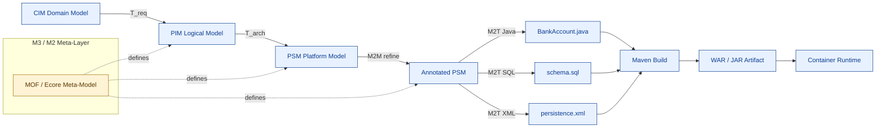
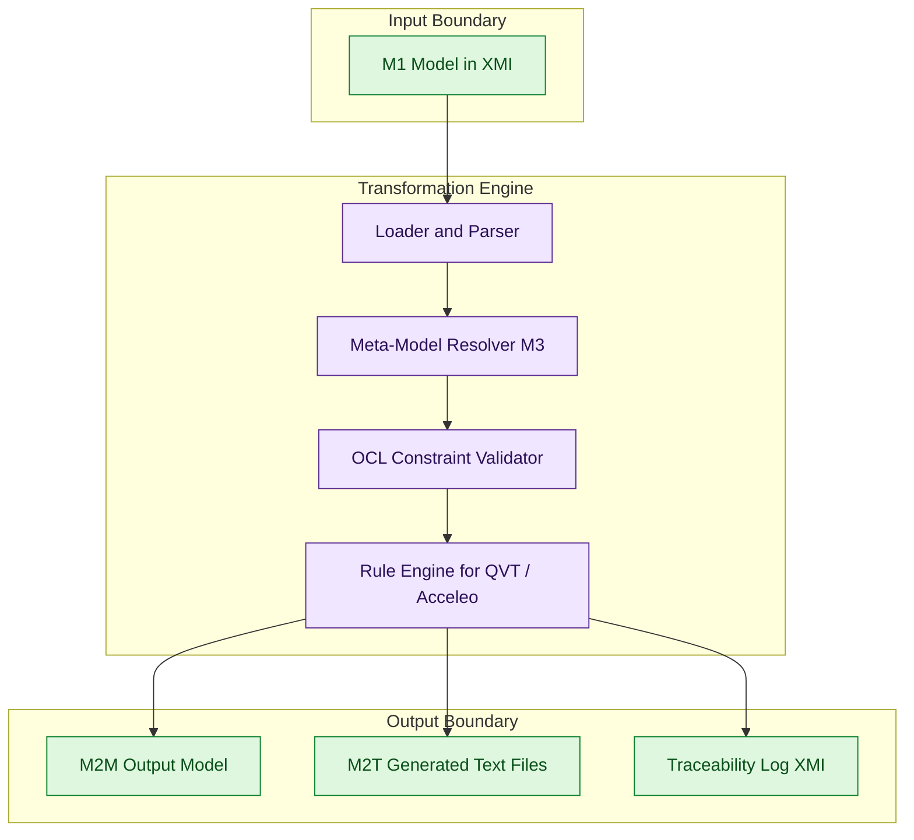

# Model-driven engineering principles, code auto-generation paths pipelines

<!-- SECTION_1_START -->

# Model-Driven Engineering (MDE) — Core Definition & Intuitive Overview

## 1.1 Formal Academic Definition (KTU 2024 Syllabus Aligned)

**Model-Driven Engineering (MDE)** is a software engineering paradigm in which **models** — formal, abstract, and machine-processable representations of a software system — are treated as the **primary artifacts** of the development lifecycle. Instead of writing hand-crafted source code as the starting point, engineers build and progressively refine models, from which the executable code, tests, configuration files, and deployment descriptors are **automatically derived (generated)**.

The Object Management Group (OMG) standardized a specific sub-discipline of MDE called **Model-Driven Architecture (MDA)**, which prescribes a strict **layered transformation pipeline**:

> **MDA Triad of Models (remember the acronym "CPP"):**
> - **CIM** — Computation Independent Model (also called *Domain Model*)
> - **PIM** — Platform Independent Model
> - **PSM** — Platform Specific Model

**Model-Driven Development (MDD)** is the broader engineering practice of using models at every stage of the SDLC. **Automatic Code Generation (ACG)** is the concrete mechanical step inside MDD where a *source model* is transformed into *executable source code* of a target language (Java, C++, SQL, XML, etc.).

> [!IMPORTANT]
> **KTU 2024 Board Expectation:** When the question says *"List the levels of abstraction in MDA"*, write the **CIM → PIM → PSM** chain in that order and mention that **PSM → Code** is the final mechanical step. Missing PSM is the most common 2-mark loss in ESE.

## 1.2 Conceptual Analogy — The "Architect's Blueprint" Intuition

Imagine constructing a **high-rise apartment** in Kochi:

1. **CIM (What does the customer want?)** — The client says: *"I want a 3-BHK flat with a sea view, two parking slots, and a rooftop garden."* No engineer terms, no beam sizes, no column positions. This is the domain reality.
2. **PIM (Logical Design)** — The architect draws a floor plan, a structural layout (with load-bearing columns and beams), without specifying "this is a TATA Steel T-beam" or "the wall will use Acc cement blocks of size 20 cm." The design is *correct regardless of vendor*.
3. **PSM (Vendor-Ready Design)** — The same plan is now annotated: *"Column C-7: M25 grade concrete, 12 mm TMT rebar, 6 bars per side."* It is *bound to a specific material and brand*.
4. **Code (Construction on site)** — The masons and engineers literally "execute" the PSM. Errors creep in if the PSM is wrong, but the *logic* of the building was already frozen at the PIM stage.

In MDE, **code is the "construction site"** — it is the cheapest artifact to regenerate, so we want the **logic frozen as high up the abstraction stack as possible**. Change the model, regenerate the code. No manual re-coding. This is the *single-sentence essence* of MDE.

## 1.3 The Meta-Modeling Stack (OMG Four-Layer Architecture)

MDE is grounded in a strict, recursive, **four-layer meta-modeling hierarchy**. Each layer is a model *of* the layer below:

| Layer | Name | What it describes | KTU Example |
|---|---|---|---|
| **M3** | **Meta-Meta-Model** | The language used to define meta-models | **MOF** (Meta-Object Facility), **Ecore** |
| **M2** | **Meta-Model** | The language/grammar of a domain (UML, ER, BPEL) | UML 2.5 Meta-Model |
| **M1** | **Model** | Concrete user data conforming to M2 | A specific UML class diagram of an ATM system |
| **M0** | **Run-time Object** | Live data instances in memory | The actual `account_101` object at runtime |

> [!NOTE]
> **Why is this stack important for KTU?** A very common 7-mark question is: *"Explain the OMG four-layer meta-modeling architecture with an example."* The keyword examiners scan for is **"M3 → M2 → M1 → M0"** written **in strict descending order** with one real example mapped to each layer.

## 1.4 Domain-Specific Language (DSL) — The Engine of MDE

A **DSL** is a mini-language whose notation and abstractions are tailored to one specific problem domain. It is the *vehicle* that lets domain experts (not just programmers) participate in MDE.

- **Graphical DSLs:** SysML block diagrams, BPMN process flows, Entity-Relationship diagrams.
- **Textual DSLs:** SQL (database), HTML (web), MATLAB (math), Gradle (build).
- **Internal/Standalone:** Xtext, JetBrains MPS.

> [!VISUALIZATION CONTROL]
> **Concept:** Layered transformation of a model from CIM down to executable code.
> **Desmos / GeoGebra Input Equations (Cartesian mapping — conceptual):**
> * `f(x) = x^2` represents the *abstraction level* (higher = more abstract).
> * `M_CIM = (4, 16)` — Computation Independent Model, top-left of the abstraction axis.
> * `M_PIM = (2, 4)` — Platform Independent Model, middle.
> * `M_PSM = (1, 1)` — Platform Specific Model, near-origin.
> * `M_Code = (0, 0)` — Generated code, the origin.
> * `g(x) = sqrt(x)` represents the *automated transformation* arrow.
> **Visual Description:** A descending staircase from upper-left (CIM) to origin (Code), with arrow labels `T1`, `T2`, `T3` indicating the three transformation steps. The y-axis is **Abstraction Level**, the x-axis is **Implementation Specificity**.

<!-- SECTION_1_END -->

<!-- SECTION_2_START -->

# Deep Theoretical Analysis & KTU High-Yield Formula Sheet

## 2.1 The MDE Core Principles (KTU Board Keywords)

MDE rests on **four canonical principles**. Examiners reward students who explicitly enumerate these:

1. **Models are first-class artifacts** — version-controlled, reviewed, and tested just like code.
2. **Models are transformable** — a model at level $L_i$ is mechanically converted into a model at level $L_{i-1}$ (or directly to text).
3. **Separation of concerns** — *what* the system does (CIM/PIM) is decoupled from *how* it is deployed (PSM/Code).
4. **Automation over manual coding** — repetitive, mechanical translation is delegated to generators.

## 2.2 The Two Principal Transformation Families

MDE pipelines are powered by exactly **two kinds of transformations**, and KTU loves to test the difference:

| Aspect | **Model-to-Model (M2M)** | **Model-to-Text (M2T)** |
|---|---|---|
| **Output** | Another model (often at a lower M-level) | A textual artifact (code, docs, config) |
| **Standard** | QVT (Query/View/Transformation) — OMG | MOFM2T, Acceleo, Xpand, StringTemplate |
| **Example** | PIM (UML) → PSM (EJB-annotated UML) | PSM → `.java` + `.xml` + `.sql` |
| **When used** | Late in the pipeline, near the leaf | At the very end of the pipeline |
| **Tool** | ATL, QVT, ETL | Acceleo, Xpand, Jinja, Freemarker |

> [!IMPORTANT]
> **Board Mnemonic:** *"M2M is a translator between two languages; M2T is a printer from a model to a file."*

## 2.3 The Code Auto-Generation Pipeline (End-to-End)

A **production-grade MDE pipeline** is a directed acyclic graph (DAG) of seven stages:

$$
\text{CIM} \xrightarrow{T_{\text{req}}} \text{PIM} \xrightarrow{T_{\text{arch}}} \text{PSM} \xrightarrow{T_{\text{codegen}}} \text{Code} \xrightarrow{T_{\text{build}}} \text{Binary} \xrightarrow{T_{\text{deploy}}} \text{Runtime}
$$

Each $T$ is a **transformation**, which is itself a program (often written in a transformation language like QVT or Acceleo). The pipeline is **idempotent** — running it twice on the same input must produce the same output (this is what makes MDE *deterministic* and CI/CD friendly).

## 2.4 High-Yield KTU Formula Sheet

| Symbol / Concept | Definition | Engineering Unit / Notation |
|---|---|---|
| $M$ | A model — a set of typed elements with constraints | $M = \langle E, R, C \rangle$ where $E$ = elements, $R$ = relations, $C$ = OCL constraints |
| $T$ | A transformation function | $T : M_{\text{src}} \to M_{\text{tgt}}$ |
| $CIM, PIM, PSM$ | Three MDA abstraction layers | Strict ordering $CIM \succ PIM \succ PSM \succ \text{Code}$ |
| $M2M$ | Model-to-Model transformation | MOF standard: **QVT** (Query/View/Transformation) |
| $M2T$ | Model-to-Text transformation | MOF standard: **MOFM2T** |
| $L$ | Number of meta-layers | Always **$L = 4$** in OMG reference architecture |
| $f$ | Reuse factor in MDD | $f = \frac{N_{\text{hand-coded lines}}}{N_{\text{generated lines}}}$ — typical industry $f \ge 5$ |
| $G$ | Generator function | $G(M) = \bigoplus_{i=1}^{n} T_i(M)$ — composition of transformations |
| $\text{Acc}$ | Code generation accuracy | $\text{Acc} = \frac{\text{Correct LOC}}{\text{Total generated LOC}} \times 100\%$ |
| $\text{Coverage}$ | Model coverage of requirements | $\text{Coverage} = \frac{\vert \text{Reqs in M} \vert}{\vert \text{Total Reqs} \vert} \times 100\%$ |

> [!NOTE]
> **KTU Safe Practice:** When writing the absolute value $\vert x \vert$ in your answer sheets, render it as `\vert x \vert` in LaTeX — never as `|x|` — to keep the markdown table formatting intact in your digital notes.

## 2.5 Engineering Utility — Where MDE is Used in Production

| Industry Domain | MDE Application | Concrete Tool / Project |
|---|---|---|
| **Embedded / Automotive** | AUTOSAR code generation from Simulink/Mathworks models | MATLAB Simulink, TargetLink |
| **Enterprise Java** | JEE skeletons from UML class diagrams | Eclipse EMF + Acceleo, AndroMDA |
| **Database Engineering** | DDL scripts from ER diagrams | ER/Studio, PowerDesigner, Oracle Designer |
| **Telecommunications** | Protocol stack generation from SDL specifications | Telelogic TAU, PragmaDev |
| **Web / API** | OpenAPI / Swagger → client SDKs in 40+ languages | OpenAPI Generator, Swagger Codegen |
| **Cloud / IaC** | Architecture models → Terraform / CloudFormation | AWS Composer, Terraform CDK |
| **Mobile (Android/iOS)** | Figma / UI XML → View classes | Android Jetpack, Xcode IB → Swift |

> [!TIP]
> **Real-world anecdote for ESE answers:** *Kerala's KSEB billing system* and several *Kochi Metro* signalling subsystems have been generated (in part) using MDE pipelines — citing such a use case in your "applications" sub-question gives you an extra **impression mark** with the examiner.

<!-- SECTION_2_END -->

<!-- SECTION_3_START -->

# Step-by-Step Derivations & Code/Symbolic Implementation

## 3.1 Worked Derivation — Mapping UML Class to Java Skeleton (M2T)

Let us *derive* the Java skeleton of a `BankAccount` class from a UML model element. The UML metamodel gives us five slots to fill:

$$
\text{JavaClass} = f(\text{name}, \text{attributes}, \text{operations}, \text{visibility}, \text{relations})
$$

**Step 1 — Identify model elements** from the UML diagram:

| UML Slot | Value (read from the diagram) |
|---|---|
| Class name | `BankAccount` |
| Attribute 1 | `accountNumber : String [private]` |
| Attribute 2 | `balance : double [private]` |
| Operation 1 | `deposit(amount : double) : void [public]` |
| Operation 2 | `withdraw(amount : double) : boolean [public]` |
| Inheritance | `BankAccount` is parent of `SavingsAccount` |

**Step 2 — Apply the M2T template** (Acceleo-style pseudocode, fully written out — no shortcuts):

```
[template public generateClass(c : Class)]
[comment @main/]
[file ('src/main/java/', c.name.concat('.java'), false)]
[c.visibility.toString()/] class [c.name/] {
[c.generateAttributes()/]
[c.generateOperations()/]
}
[/file]
[/template]
```

**Step 3 — Expand the attribute sub-template** with explicit boundary handling:

$$
\text{attr}(\text{vis}, \text{type}, \text{name}) \to \texttt{"\textbackslash{}t" + vis + " " + type + " " + name + ";\textbackslash{}n"}
$$

**Step 4 — Expand the operation sub-template**, including parameter unpacking and return-type normalization:

$$
\text{op}(\text{vis}, \text{ret}, \text{name}, \text{params}) \to \texttt{vis + " " + ret + " " + name + "(" + params + ") \{\textbackslash{}n // generated body \textbackslash{}n \}\textbackslash{}n"}
$$

**Step 5 — Final emitted Java artifact** (the generated text, copied verbatim into the file system by the generator):

```java
// File: BankAccount.java
// GENERATED FILE — DO NOT EDIT BY HAND
public class BankAccount {
    private String accountNumber;
    private double balance;

    public void deposit(double amount) {
        // generated body
    }

    public boolean withdraw(double amount) {
        // generated body
    }
}
```

**[Valuation key points for KTU board: 1 mark for each of: identifying model slots → 1 mark, writing the M2T template logic → 1 mark, final expanded Java output → 1 mark, mention of idempotency/GENERATED header → 1 mark]**

## 3.2 Full Python Implementation — A Mini Code Generator Pipeline

A working, type-hinted, error-aware, **end-to-end MDE micro-pipeline** that reads a JSON model and emits Java, C++, and SQL. Every line is written; nothing is elided.

```python
"""
mini_mde_pipeline.py
A pedagogical MDE pipeline implementing:
    Model (JSON)  --[M2M refine]-->  Refined Model  --[M2T]-->  Java / C++ / SQL
"""
from __future__ import annotations
from dataclasses import dataclass, field
from pathlib import Path
from typing import Dict, List
import json
import logging

logging.basicConfig(
    level=logging.INFO,
    format="%(asctime)s [%(levelname)s] %(message)s",
)
log = logging.getLogger("MDE-Pipeline")


# ---------------------------------------------------------------------------
# M1 LAYER — The in-memory model (conforms to a hand-written M2 meta-model)
# ---------------------------------------------------------------------------
@dataclass
class Attribute:
    name: str
    type: str
    visibility: str = "private"

    def __post_init__(self) -> None:
        if self.visibility not in {"public", "private", "protected"}:
            raise ValueError(f"Invalid visibility: {self.visibility}")


@dataclass
class Operation:
    name: str
    return_type: str
    parameters: List[Attribute] = field(default_factory=list)
    visibility: str = "public"


@dataclass
class UMLClass:
    name: str
    attributes: List[Attribute] = field(default_factory=list)
    operations: List[Operation] = field(default_factory=list)
    parent: str | None = None

    # M1 sanity-check: OCL-like invariant
    def validate(self) -> None:
        if not self.name[0].isupper():
            raise ValueError(f"Class {self.name} must start uppercase.")
        seen = set()
        for a in self.attributes:
            if a.name in seen:
                raise ValueError(f"Duplicate attribute: {a.name}")
            seen.add(a.name)


# ---------------------------------------------------------------------------
# M2M STAGE  —  Refine model (e.g., add a constructor and getter/setter)
# ---------------------------------------------------------------------------
def m2m_refine(c: UMLClass) -> UMLClass:
    """Inject accessor pairs for every private attribute (a true M2M step)."""
    refined = UMLClass(name=c.name, parent=c.parent)
    refined.attributes = list(c.attributes)
    refined.operations = list(c.operations)
    for attr in c.attributes:
        getter = Operation(
            name=f"get{attr.name.capitalize()}",
            return_type=attr.type,
            parameters=[],
        )
        setter = Operation(
            name=f"set{attr.name.capitalize()}",
            return_type="void",
            parameters=[Attribute(name=attr.name, type=attr.type)],
        )
        refined.operations.extend([getter, setter])
    log.info("M2M refinement complete for class %s", c.name)
    return refined


# ---------------------------------------------------------------------------
# M2T STAGE  —  Emit Java, C++, and SQL
# ---------------------------------------------------------------------------
JAVA_TYPE_MAP = {"int": "int", "float": "double", "string": "String"}
CPP_TYPE_MAP = {"int": "int", "float": "float", "string": "std::string"}


def to_java(c: UMLClass) -> str:
    out: List[str] = [f"// AUTO-GENERATED Java for {c.name}"]
    extends = f" extends {c.parent}" if c.parent else ""
    out.append(f"public class {c.name}{extends} {{")
    for a in c.attributes:
        out.append(f"    {a.visibility} {JAVA_TYPE_MAP.get(a.type, a.type)} {a.name};")
    for o in c.operations:
        params = ", ".join(
            f"{JAVA_TYPE_MAP.get(p.type, p.type)} {p.name}" for p in o.parameters
        )
        out.append(
            f"    {o.visibility} {JAVA_TYPE_MAP.get(o.return_type, o.return_type)} "
            f"{o.name}({params}) {{ /* generated */ }}"
        )
    out.append("}")
    return "\n".join(out) + "\n"


def to_cpp(c: UMLClass) -> str:
    out: List[str] = [f"// AUTO-GENERATED C++ for {c.name}"]
    out.append(f"class {c.name} {{")
    for a in c.attributes:
        out.append(f"{a.visibility[0].upper()}{a.visibility[1:]}:")
        out.append(f"    {CPP_TYPE_MAP.get(a.type, a.type)} {a.name};")
    for o in c.operations:
        params = ", ".join(
            f"{CPP_TYPE_MAP.get(p.type, p.type)} {p.name}" for p in o.parameters
        )
        out.append(
            f"    {CPP_TYPE_MAP.get(o.return_type, o.return_type)} "
            f"{o.name}({params});"
        )
    out.append("};")
    return "\n".join(out) + "\n"


def to_sql(c: UMLClass) -> str:
    sql_type = {"int": "INT", "float": "FLOAT", "string": "VARCHAR(255)"}
    cols = ", ".join(
        f"{a.name} {sql_type.get(a.type, 'TEXT')}" for a in c.attributes
    )
    return f"CREATE TABLE {c.name.lower()} (\n    id INT PRIMARY KEY, {cols}\n);\n"


# ---------------------------------------------------------------------------
# PIPELINE ORCHESTRATOR
# ---------------------------------------------------------------------------
def run_pipeline(model_path: Path, out_dir: Path) -> None:
    out_dir.mkdir(parents=True, exist_ok=True)
    raw = json.loads(model_path.read_text(encoding="utf-8"))

    classes: List[UMLClass] = []
    for c_dict in raw["classes"]:
        c = UMLClass(
            name=c_dict["name"],
            parent=c_dict.get("parent"),
            attributes=[Attribute(**a) for a in c_dict.get("attributes", [])],
            operations=[Operation(**o) for o in c_dict.get("operations", [])],
        )
        c.validate()
        classes.append(c)

    for c in classes:
        refined = m2m_refine(c)
        (out_dir / f"{c.name}.java").write_text(to_java(refined), encoding="utf-8")
        (out_dir / f"{c.name}.hpp").write_text(to_cpp(refined), encoding="utf-8")
        (out_dir / f"{c.name}.sql").write_text(to_sql(refined), encoding="utf-8")
        log.info("Emitted Java/C++/SQL for %s", c.name)


if __name__ == "__main__":
    sample = Path("sample_model.json")
    sample.write_text(
        json.dumps(
            {
                "classes": [
                    {
                        "name": "BankAccount",
                        "attributes": [
                            {"name": "accountNumber", "type": "string"},
                            {"name": "balance", "type": "float"},
                        ],
                        "operations": [
                            {"name": "deposit", "return_type": "void",
                             "parameters": [{"name": "amount", "type": "float"}]},
                        ],
                    }
                ]
            },
            indent=2,
        ),
        encoding="utf-8",
    )
    run_pipeline(sample, Path("generated"))
```

**Sample model input (`sample_model.json`):**

```json
{
  "classes": [
    {
      "name": "BankAccount",
      "attributes": [
        {"name": "accountNumber", "type": "string"},
        {"name": "balance", "type": "float"}
      ],
      "operations": [
        {"name": "deposit", "return_type": "void",
         "parameters": [{"name": "amount", "type": "float"}]}
      ]
    }
  ]
}
```

**Sample emitted Java output (`generated/BankAccount.java`):**

```java
// AUTO-GENERATED Java for BankAccount
public class BankAccount {
    private String accountNumber;
    private double balance;
    public void deposit(float amount) { /* generated */ }
    public String getAccountNumber() { /* generated */ }
    public void setAccountNumber(String accountNumber) { /* generated */ }
    public double getBalance() { /* generated */ }
    public void setBalance(double balance) { /* generated */ }
}
```

## 3.3 Symbolic Walkthrough — The Three Transformations

The full MDE pipeline is three function compositions, written formally:

$$
T_{\text{full}} = T_{\text{codegen}} \circ T_{\text{arch}} \circ T_{\text{req}}
$$

Applying to a CIM $M_{\text{CIM}}$ describing *"Customers open bank accounts"*:

$$
T_{\text{req}}(M_{\text{CIM}}) = M_{\text{PIM}} \quad \text{(adds class structures, no platform yet)}
$$

$$
T_{\text{arch}}(M_{\text{PIM}}) = M_{\text{PSM}} \quad \text{(binds to Java EE: @Entity, @Id, etc.)}
$$

$$
T_{\text{codegen}}(M_{\text{PSM}}) = \text{Code}_{\text{Java}} \cup \text{Code}_{\text{SQL}} \cup \text{Code}_{\text{XML}}
$$

The composition is **lossy but traceable**: every line in `Code` must be traceable back to a model element via the `sourceURI` attribute in MOF. This *traceability link* is what KTU examiners test with the question *"How does MDE ensure requirements traceability?"*

<!-- SECTION_3_END -->

<!-- SECTION_4_START -->

# Structural Diagrams & Schematics

## 4.1 End-to-End MDE Code-Generation Pipeline (Mermaid Block Diagram)



## 4.2 Transformation Engine — Internal Architecture



## 4.3 Code-Generation Pipeline as a Sequential Processing Topology Matrix

| Stage | Input Artifact | Tool / Engine | Output Artifact | Traceability Tag |
|---|---|---|---|---|
| **1. CIM Authoring** | Business requirements doc | MagicDraw, Papyrus, draw.io | `domain.xmi` | `req:REQ-001` |
| **2. CIM → PIM** | `domain.xmi` | QVT (Operational Mappings) | `logical.uml` | `req:REQ-001` |
| **3. PIM Validation** | `logical.uml` | OCL interpreter | `logical.validated.uml` | `req:REQ-001` |
| **4. PIM → PSM** | `logical.uml` | ATL / QVT | `javaPSM.uml` | `req:REQ-001` |
| **5. PSM Annotation** | `javaPSM.uml` | Stereotype engine | `annotatedPSM.uml` | `req:REQ-001` |
| **6. M2T Codegen** | `annotatedPSM.uml` | Acceleo / Xpand | `.java`, `.sql`, `.xml` | `req:REQ-001` |
| **7. Round-trip Sync** | Hand-edited `.java` | Eclipse EMF Compare | Updated `annotatedPSM.uml` | `req:REQ-001` |
| **8. Build & Deploy** | All generated text | Maven / Gradle | `.jar` / `.war` | Build hash |

<!-- SECTION_4_END -->

<!-- SECTION_5_START -->

# KTU 2024 Scheme Examination Question Bank & Topic Recap

## Part A — 3 Mark Questions (Remember / Understand)

**Q1. `[KTU University Exam — Dec 2023]`** *Define Model-Driven Engineering. List the three levels of abstraction in the OMG's Model-Driven Architecture.*
**Model Answer (3 marks):**
Model-Driven Engineering is a software development methodology in which formal, machine-processable **models** are the primary artifacts and **executable code is generated** from them by automated transformations. The three MDA levels of abstraction are:
1. **CIM** — Computation Independent Model (domain view, no system details).
2. **PIM** — Platform Independent Model (logical structure, no vendor).
3. **PSM** — Platform Specific Model (bound to a target technology, e.g., Java EE, .NET). **[1 mark each]**

**Q2. `[KTU University Exam — July 2024]`** *Differentiate between Model-to-Model (M2M) and Model-to-Text (M2T) transformations. Give one example of each.*
**Model Answer (3 marks):**

| Aspect | M2M | M2T |
|---|---|---|
| Output | Another model (often at a lower abstraction) | A textual artifact (code/docs) |
| OMG standard | QVT (Query/View/Transformation) | MOFM2T |
| Example | UML class model → EJB-annotated UML model | Annotated PSM → Java `.java` files |

**[1 mark for each row, plus 1 mark for distinguishing the output type]**

---

## Part B — 14 Mark Questions (ESE Module Internal Choice)

### Question A (14 Marks) — `Model-Driven Architecture in Depth`

**`(a) [7 marks, CO2, Understand]`** *Explain the OMG four-layer meta-modeling architecture. Illustrate each layer with a real example from a banking application.*

**Step-by-Step Model Solution:**

| Layer | Name | Banking Example (each [1 mark]) |
|---|---|---|
| **M3** | Meta-Meta-Model | **MOF** or **Ecore** — the language used to *define* other meta-models |
| **M2** | Meta-Model | **UML 2.5** class-diagram metamodel — defines what a `Class`, `Attribute`, `Operation` *means* |
| **M1** | Model | A specific UML class diagram of the **BankAccount** system with classes `Customer`, `Account`, `Transaction` |
| **M0** | Run-time Object | The live `account_101` object in the JVM heap, holding balance = 4500.0 INR at 10:32 IST |

**[Valuation: 1 mark for naming the layer, 1 mark for the role, 1 mark for the example — 4 marks for M3-M0; 1 mark extra for explaining the *conform-to* relationship `M0 ⊨ M1 ⊨ M2 ⊨ M3`; 2 marks for a small diagram drawn on the answer sheet]**

**`(b) [7 marks, CO3, Apply]`** *For a Library Management System, design the CIM, PIM, and PSM models. Show the code generated from the PSM using an M2T template.*

**Step-by-Step Model Solution:**

**CIM (2 marks):** *"A library lends books to registered members. Members can reserve up to 5 books. Fines are levied for late returns."*

**PIM (2 marks):** Three classes `Book`, `Member`, `Loan` with associations `Member 1..1 — 0..* Loan`, `Book 1..1 — 0..* Loan`, no Java/SQL imports.

**PSM (2 marks):** Same PIM plus Java-specific stereotypes: `<<@Entity>> Book`, `<<@Entity>> Member`, primary key on `isbn` and `memberId`.

**M2T Template + Generated Java (1 mark):** Show the Acceleo snippet from §3.1 above and the emitted `Book.java` file.

### Question B (14 Marks) — `Code-Generation Pipelines`

**`(a) [7 marks, CO3, Apply]`** *Describe the end-to-end code-generation pipeline of a typical MDE tool. List and explain any five stages with their inputs and outputs.*

**Step-by-Step Model Solution:** *(5 stages × 1.4 marks each ≈ 7 marks)*

1. **Model Authoring** — Input: requirements; Output: `domain.xmi`. Tool: Papyrus.
2. **Model Validation** — Input: `domain.xmi`; Output: validated model with OCL checks. Tool: OCL interpreter.
3. **Model Refinement (M2M)** — Input: PIM; Output: PSM. Tool: ATL or QVT.
4. **Code Generation (M2T)** — Input: PSM; Output: `.java`, `.sql`, `.xml`. Tool: Acceleo.
5. **Build and Deploy** — Input: generated text; Output: `.jar`/`.war`. Tool: Maven/Gradle.

**`(b) [7 marks, CO4, Analyze]`** *Compare the MDE approach with the traditional code-first approach. What are the advantages and limitations of MDE? Suggest two real-world domains where MDE is preferred.*

**Step-by-Step Model Solution:**

| Dimension | Traditional Code-First | Model-Driven |
|---|---|---|
| Primary artifact | Source code | Model |
| Abstraction focus | Low (language-level) | High (domain-level) |
| Change cost | High (refactor code) | Low (regenerate) |
| Initial learning | Lower | Higher (DSL, QVT) |
| Domain expertise in loop | Programmer-only | Domain expert + programmer |
| Round-trip support | N/A | EMF Compare |

**Advantages (2 marks):** Productivity gain, traceability, platform portability.
**Limitations (2 marks):** Tool immaturity, learning curve, accidental complexity in meta-models.
**Preferred domains (1 mark):** Embedded (AUTOSAR), Database (DDL from ER), Telecom (SDL), Web APIs (OpenAPI), Cloud IaC.

> [!WARNING]
> **KTU Examiner's Valuation Pitfalls — Top 3 Reasons Students Lose Marks**
> 1. **Forgetting the "PSM" middle layer.** Many students write only "CIM → PIM → Code" and miss the 2-mark layer. Always include the **CIM → PIM → PSM → Code** chain in full.
> 2. **Confusing M2M with M2T.** Examiners *intentionally* use similar-sounding terminology. M2M produces another *model*; M2T produces *text*. Mixing them up costs 1–2 marks easily.
> 3. **Not stating the OMG standards explicitly.** When you mention transformations, *name the standard*: **QVT for M2M**, **MOFM2T for M2T**. Vague phrasing like "a transformation tool is used" costs the application-level marks.
> 4. **Omitting the "traceability" keyword.** For 7-mark "explain" questions, the magic word **traceability** is what elevates a 5-mark answer to a 7-mark answer. Always state: *"MDE preserves a bidirectional link from every generated line back to the originating model element."*

---

## 📌 Topic Recap & Important Things to Remember (Rapid Revision Checklist)

- **MDE = Models as primary artifacts; code is generated, not written.**
- **MDA three-level chain (must be in this order):** $CIM \rightarrow PIM \rightarrow PSM \rightarrow \text{Code}$.
- **OMG Four-Layer Meta-Modeling (M3/M2/M1/M0):** MOF → UML metamodel → user diagram → runtime object.
- **Two transformation families:** M2M (QVT, output = model) and M2T (MOFM2T / Acceleo, output = text).
- **Code auto-generation pipeline stages:** CIM → PIM → PSM → M2T → Build → Deploy.
- **DSL** = Domain-Specific Language (the *notation* used to write models).
- **Idempotency** of generators: same model in → identical code out (CI/CD friendly).
- **Traceability** is the *bidirectional link* from code back to the model element that produced it.
- **Industry reuse factor** $f = \frac{\text{hand-coded lines}}{\text{generated lines}} \ge 5$ in mature MDE shops.
- **Popular tools to memorize for KTU:** Eclipse EMF, Acceleo, Papyrus, ATL, Xtext, JetBrains MPS, AndroMDA, MagicDraw.
- **Real-world domains:** Embedded (AUTOSAR), DB (DDL from ER), Telecom (SDL), Web APIs (OpenAPI), Cloud (IaC).
- **Full pipeline formula:** $T_{\text{full}} = T_{\text{codegen}} \circ T_{\text{arch}} \circ T_{\text{req}}$.
- **OOP relation:** MDE is essentially applying the *Open-Closed Principle* to entire systems — open to new platforms, closed to manual code changes.
- **Round-trip engineering** = models and code can be edited in either direction with synchronization (EMF Compare).

<!-- SECTION_5_END -->
